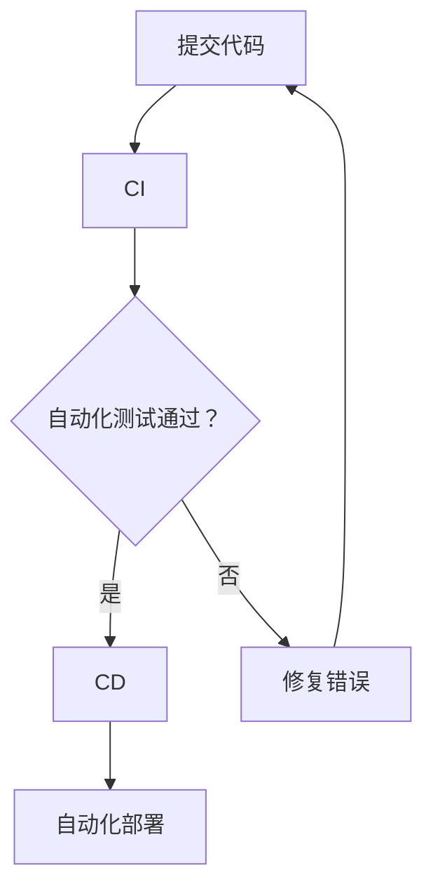
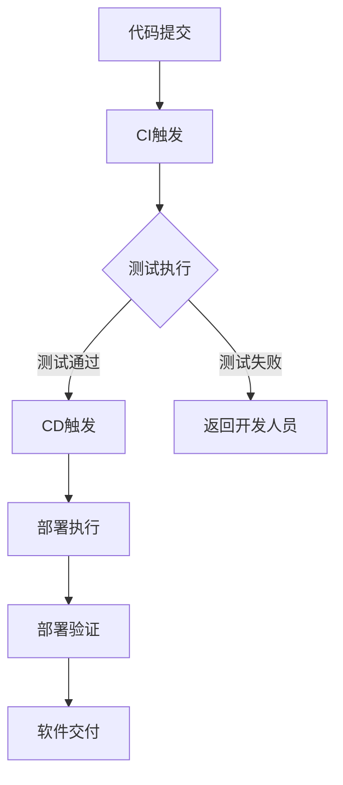
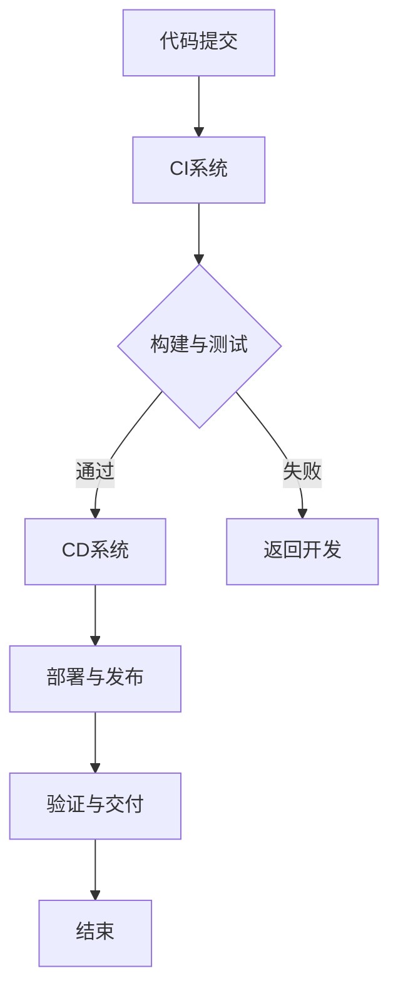

                 

### 引言

#### 1.1 背景

随着软件系统的复杂性和规模不断扩大，软件开发过程中的质量和效率问题愈发显著。持续集成（Continuous Integration，CI）和持续部署（Continuous Deployment，CD）作为现代软件开发的关键实践，正被越来越多的企业和开发团队采纳。CI旨在通过自动化测试和构建，确保代码的持续稳定和可维护性；而CD则进一步自动化了软件的发布过程，提高了发布速度和稳定性。

评测系统作为软件开发过程中的重要环节，承担着代码质量评估、测试执行和反馈等任务。一个高效的评测系统能够及时发现并解决问题，提高软件交付质量，减少开发周期中的风险。因此，设计和实施一个有效的评测系统的持续集成与部署策略，对于提升软件项目的整体效率和质量具有重要意义。

#### 1.2 目标

本文旨在深入探讨评测系统的持续集成与部署策略，帮助开发团队和IT专业人士更好地理解和应用这些实践。具体目标如下：

1. **背景介绍**：回顾CI和CD的起源、发展及应用，为后续讨论提供背景知识。
2. **核心概念与联系**：明确持续集成与持续部署的概念、原理及其相互关系，并通过Mermaid流程图展示其流程架构。
3. **CI策略设计**：介绍CI策略的设计原则、测试策略、自动化测试实践等。
4. **部署策略**：探讨部署流程设计、部署策略及持续交付实践。
5. **案例研究**：通过具体案例展示持续集成与部署策略在实际项目中的应用和效果。
6. **工具与技术**：介绍常用的CI/CD工具和技术，提供实践指南。
7. **结论**：总结文章内容，探讨未来的发展趋势和实践建议。

#### 1.3 阅读收获

读者通过本文可以收获：

- 对持续集成和持续部署的深入理解。
- 如何设计高效的CI/CD策略。
- 实际项目中的CI/CD应用实例。
- 常用的CI/CD工具和技术。
- 未来CI/CD发展趋势和实践建议。

在接下来的内容中，我们将逐步深入探讨这些主题，通过逻辑清晰的推理和实例分析，帮助读者构建对评测系统持续集成与部署策略的全面理解。

### 第一部分：评测系统概述与核心概念

#### 2.1 评测系统的定义与作用

**定义**：评测系统是指一种用于自动化测试和评估软件代码质量的工具集。它通过一系列自动化测试流程，对代码的各个层次（单元、集成、功能等）进行全面检测，以确保代码的质量、稳定性和可靠性。

**作用**：

1. **代码质量保障**：通过自动化测试，及时发现和修复代码中的错误和缺陷，提高代码质量。
2. **提升开发效率**：自动化测试减少了手动测试的工作量，使开发团队能够更快地迭代和交付软件。
3. **风险管理**：通过持续测试，评估软件的稳定性和可靠性，降低项目交付时的风险。
4. **团队协作**：评测系统提供了统一的测试平台和报告，有助于团队成员之间的协作和沟通。

#### 2.2 持续集成（CI）概述

**定义**：持续集成是一种软件开发实践，旨在通过频繁地将代码合并到共享的主干分支中，并通过自动化测试确保代码的持续稳定性和可维护性。

**原理**：

1. **频繁集成**：开发人员定期（通常是每天多次）将代码提交到共享的仓库。
2. **自动化测试**：每次提交都会触发一系列自动化测试，包括单元测试、集成测试和功能测试。
3. **快速反馈**：测试结果会即时反馈给开发人员，帮助他们快速发现和修复问题。

**目的**：

1. **及早发现问题**：通过频繁的集成和测试，尽早发现并解决代码冲突和缺陷。
2. **保持代码质量**：持续集成有助于保持代码库的整洁和高质量。
3. **简化合并流程**：通过持续集成，合并代码时的问题和冲突会大大减少。

#### 2.3 持续部署（CD）概述

**定义**：持续部署是一种自动化软件发布和部署的过程，旨在通过自动化测试和部署策略，确保新版本软件的高效、稳定和安全发布。

**原理**：

1. **自动化测试**：在部署前，对软件进行一系列自动化测试，包括性能测试、安全测试和兼容性测试。
2. **自动化部署**：通过脚本或工具，自动执行软件的部署过程，包括打包、发布和配置。
3. **环境一致性**：确保在不同环境中部署的软件版本一致，减少因环境差异导致的问题。

**目的**：

1. **提高发布速度**：自动化部署减少了手动操作和人工干预，加快了软件发布的速度。
2. **确保软件质量**：通过自动化测试，确保每次发布的软件都是经过严格测试的。
3. **降低发布风险**：自动化测试和部署策略有助于降低发布过程中的风险，确保软件的稳定运行。

#### 2.4 核心概念与联系

**持续集成与持续部署的关系**：

持续集成（CI）是持续部署（CD）的基础，二者相辅相成。CI确保代码的质量和稳定性，CD则通过自动化测试和部署，确保软件的高效发布。

**Mermaid 流程图**：



在这个流程中，开发人员提交代码后，CI系统会自动触发一系列自动化测试。如果测试通过，则进入CD流程，进行自动化部署；如果测试不通过，则返回开发人员进行错误修复。

通过上述核心概念与联系的介绍，读者可以对评测系统的持续集成与部署策略有一个初步的了解。在接下来的章节中，我们将详细探讨CI和CD的具体策略和实践。

### 第二部分：持续集成（CI）策略

#### 3.1 CI 策略设计

**3.1.1 CI 工具选择**

选择合适的CI工具是CI策略设计的关键步骤。常见的CI工具包括Jenkins、GitLab CI/CD、Travis CI等。以下是几种常用工具的比较：

1. **Jenkins**：开源、功能强大、插件丰富，适用于各种规模的项目。但配置复杂，维护成本较高。
2. **GitLab CI/CD**：与GitLab集成紧密，支持多种编程语言和平台，易于配置。但与Jenkins相比，插件较少。
3. **Travis CI**：免费、开源、支持多种编程语言，易于使用。但支持的平台和语言有限。

**选择标准**：

- **项目规模**：对于大型项目，选择功能强大的Jenkins可能更合适；对于中小型项目，GitLab CI/CD或Travis CI可能更方便。
- **语言支持**：根据项目使用的编程语言，选择支持该语言的CI工具。
- **集成需求**：如果项目需要与其他系统或工具集成，如持续交付（CD）工具、代码仓库等，应选择支持这些集成的CI工具。

**3.1.2 CI 流程设计**

CI流程的设计直接影响CI的效果和效率。一个典型的CI流程包括以下步骤：

1. **代码拉取**：CI系统从版本控制系统（如Git）拉取最新代码。
2. **代码编译**：编译源代码，生成可执行文件或库文件。
3. **单元测试**：执行单元测试，验证代码的功能和性能。
4. **集成测试**：执行集成测试，验证不同模块之间的交互和功能。
5. **功能测试**：执行功能测试，验证软件的整体功能。
6. **代码质量检查**：使用静态代码分析工具检查代码的质量，如代码风格、错误率等。
7. **报告生成**：生成测试报告，包括测试结果、错误日志等。
8. **部署**：如果测试通过，自动部署到测试或生产环境。

**3.1.3 CI 与版本控制系统的集成**

CI与版本控制系统的集成是确保CI流程自动化的关键。常见的集成方式包括：

1. **Webhook**：CI系统通过Webhook监听版本控制系统的代码提交事件，自动触发CI流程。
2. **Git Hooks**：在版本控制系统中配置Git Hooks，如pre-commit、post-commit等，触发CI流程。
3. **CI配置文件**：在版本控制系统中添加CI配置文件（如Jenkinsfile、gitlab-ci.yml等），定义CI流程。

通过上述方法，CI系统能够在代码提交后自动执行一系列测试和构建任务，确保代码的持续稳定和可维护性。

#### 3.2 测试策略

**3.2.1 单元测试**

单元测试是CI流程中的核心部分，用于验证代码的单元（函数、方法、类等）是否按照预期工作。单元测试的设计应遵循以下原则：

1. **独立性**：每个测试用例应独立执行，不影响其他测试用例。
2. **完整性**：覆盖代码的各个部分，确保所有关键路径和边界条件都被测试到。
3. **可复现性**：测试用例应能够复现预期的错误或问题。

常用的单元测试框架包括JUnit（Java）、pytest（Python）、Mocha（JavaScript）等。

**3.2.2 集成测试**

集成测试用于验证不同模块或服务之间的交互和功能。与单元测试不同，集成测试涉及多个模块或服务，通常需要模拟真实的环境。

1. **组件测试**：针对单独的组件或服务进行测试，确保其功能正确。
2. **端到端测试**：模拟整个系统的运行流程，确保所有模块和组件能够协同工作。

常用的集成测试工具包括Postman（API测试）、Selenium（Web测试）等。

**3.2.3 功能测试**

功能测试是验证软件是否符合业务需求和用户期望的测试。功能测试通常由专业的测试人员执行，包括以下类型：

1. **黑盒测试**：不考虑内部实现，只关注软件的功能和结果。
2. **白盒测试**：了解内部实现，关注代码的执行路径和逻辑。
3. **灰盒测试**：介于黑盒测试和白盒测试之间，部分了解内部实现。

功能测试的工具包括Selenium（Web测试）、JMeter（性能测试）等。

通过以上测试策略，可以确保CI流程中的测试全面、有效，及时发现并修复代码中的问题，提高软件的质量和稳定性。

#### 3.3 自动化测试

自动化测试是CI流程中至关重要的一环，它能够显著提高测试效率和代码质量。以下是自动化测试的几个关键方面：

**3.3.1 测试脚本编写**

编写高质量的测试脚本是自动化测试的基础。测试脚本应具备以下特点：

1. **可复用性**：测试脚本应能够复用，避免重复编写相同功能的代码。
2. **可维护性**：测试脚本应易于理解和修改，以适应项目变化。
3. **可扩展性**：测试脚本应能够扩展，以适应更多功能和场景。

常见的测试脚本编写工具包括Selenium（Web自动化）、Postman（API自动化）等。

**3.3.2 测试环境搭建**

测试环境的搭建是确保自动化测试顺利进行的重要步骤。测试环境应包括以下要素：

1. **硬件资源**：足够的计算资源和存储资源，以确保测试任务的高效执行。
2. **软件环境**：安装和配置测试所需的各种软件，如Web浏览器、数据库、服务框架等。
3. **数据准备**：准备测试所需的数据，包括测试数据、用户数据、测试配置等。

**3.3.3 测试结果分析**

自动化测试的结果分析是评估测试质量和发现问题的关键。测试结果分析包括以下方面：

1. **测试覆盖率**：分析测试脚本是否覆盖了代码的各个部分，确保测试全面。
2. **测试通过率**：统计测试通过和失败的比例，评估测试质量。
3. **错误日志**：分析测试失败的原因，包括代码缺陷、环境问题等，并提供解决方案。

通过详细的测试结果分析，可以持续优化自动化测试脚本和测试策略，提高测试效率和代码质量。

#### 3.4 持续集成与持续部署的关系

持续集成（CI）和持续部署（CD）是现代软件开发中密不可分的两个环节。它们共同构建了一个端到端的自动化流程，从代码提交到软件交付，确保了软件的高质量和高效率。

**关系**：

1. **连续性**：CI是CD的前提和基础。CI通过自动化测试确保代码的质量和稳定性，为CD提供了可靠的代码基础。
2. **协同**：CI和CD相互协同，CI负责测试和构建，CD负责部署和发布。二者共同作用，确保软件的持续交付。

**流程**：

1. **代码提交**：开发人员将代码提交到版本控制系统。
2. **CI触发**：CI系统检测到代码提交，自动启动构建和测试流程。
3. **测试执行**：CI系统执行一系列自动化测试，包括单元测试、集成测试、功能测试等。
4. **结果反馈**：测试结果即时反馈给开发人员，如果测试通过，进入CD流程；如果测试失败，返回开发人员进行错误修复。
5. **CD触发**：CD系统根据CI的测试结果，自动启动部署流程。
6. **部署执行**：CD系统执行自动化部署，包括环境配置、软件打包、部署等。
7. **部署验证**：部署后，进行验证测试，确保软件正常运行。

**流程图**：



通过这个流程，CI和CD共同构建了一个高效的软件交付流程，从代码提交到软件交付，实现了自动化、连续性和高质量。

#### 3.5 Mermaid 流程图展示

为了更直观地展示CI和CD的流程，我们使用Mermaid工具绘制了一个流程图。以下是流程图的代码和展示结果：




在这个流程图中，开发人员将代码提交到版本控制系统，CI系统自动触发构建和测试流程。如果测试通过，CD系统开始部署和发布软件；如果测试失败，CI系统将测试结果反馈给开发人员，要求其修复问题。部署完成后，进行验证测试，确保软件交付质量。整个过程实现了自动化和连续性，提高了软件交付的效率和质量。

通过上述讨论，我们详细介绍了CI策略的设计、测试策略、自动化测试实践以及CI与CD的关系。在接下来的章节中，我们将进一步探讨部署策略和实际案例，帮助读者更好地理解和应用CI/CD实践。

### 第三部分：部署策略

#### 4.1 部署流程设计

部署流程是持续集成与持续部署（CI/CD）中至关重要的一环，它确保了软件从开发环境到生产环境的顺利迁移。一个高效的部署流程设计能够减少发布过程中的风险，提高发布效率。以下是部署流程设计的主要步骤：

**4.1.1 部署前准备**

在部署前，需要完成以下准备工作：

1. **环境准备**：确保部署环境（如测试环境、生产环境）的硬件和软件配置满足软件运行的要求。
2. **代码库同步**：将最新代码从版本控制系统同步到部署环境。
3. **依赖管理**：安装和管理软件所需的依赖库、框架等。
4. **配置管理**：配置部署环境，包括数据库连接、系统参数等。

**4.1.2 部署流程**

部署流程通常包括以下步骤：

1. **代码编译**：编译源代码，生成可执行文件或库文件。
2. **依赖安装**：安装和管理编译过程中所需的依赖库。
3. **服务启动**：启动应用服务，如Web服务器、应用服务器等。
4. **应用部署**：将编译后的代码部署到应用服务器，如上传到Web服务器目录、配置数据库连接等。
5. **环境验证**：验证部署环境是否正常，如检查服务状态、连接数据库等。
6. **性能测试**：执行性能测试，确保部署后的系统性能满足要求。
7. **用户验证**：模拟用户操作，验证系统的功能性和稳定性。

**4.1.3 部署后的验证**

部署完成后，进行以下验证工作：

1. **功能测试**：对部署后的系统进行功能测试，确保所有功能正常运行。
2. **性能监控**：监控系统的性能，如响应时间、负载等。
3. **日志分析**：分析系统日志，确保无错误或异常。
4. **反馈收集**：收集用户反馈，评估部署效果。

通过以上步骤，确保部署流程的每一步都得到妥善处理，减少发布过程中的风险。

#### 4.2 部署策略

部署策略是部署过程中的一系列决策和操作，直接影响部署的效率和安全性。以下是几种常见的部署策略：

**4.2.1 手动部署与自动化部署**

1. **手动部署**：手动部署需要人工执行部署流程的每一步，适用于小型、简单的系统或特定场景。优点是灵活性强，但缺点是效率低、易出错。
2. **自动化部署**：自动化部署通过脚本或工具自动执行部署流程，适用于大规模、复杂的系统。优点是效率高、减少人工干预、降低错误率，但缺点是初期配置和维护成本较高。

**4.2.2 蓝绿部署与金丝雀部署**

1. **蓝绿部署**：蓝绿部署是一种无停机部署策略，通过并行运行两个环境（蓝色环境和绿色环境）实现新旧版本的切换。优点是发布过程无停机，风险较低；缺点是需要额外的环境资源和复杂的切换逻辑。
2. **金丝雀部署**：金丝雀部署是一种逐步发布策略，通过在部分用户中逐步推广新版本，评估其稳定性和性能。优点是风险较低，便于监控和调整；缺点是发布过程可能较慢，用户体验可能受影响。

**4.2.3 部署策略优化**

部署策略的优化是提高部署效率和降低风险的关键。以下是几种常见的优化方法：

1. **持续监控**：部署过程中持续监控系统性能和状态，及时发现问题并采取措施。
2. **自动化测试**：在部署前和部署后执行自动化测试，确保软件质量和稳定性。
3. **滚动部署**：逐步更新实例，减少对系统的影响，提高可用性和稳定性。
4. **版本控制**：严格管理软件版本，确保每次部署的版本一致性。

通过以上部署策略和优化方法，可以确保部署过程的高效、稳定和安全。

#### 4.3 持续交付（CD）

持续交付（Continuous Delivery，CD）是一种软件开发和部署实践，旨在确保软件在每次代码提交后都能够快速、安全、可靠地交付到用户手中。持续交付的核心是自动化，通过自动化测试、构建和部署流程，实现软件的持续交付。

**4.3.1 定义**

持续交付是一种软件开发和部署实践，通过自动化和持续的测试与发布流程，确保软件能够在任何时间点交付给用户。

**4.3.2 实践**

1. **自动化构建**：自动化构建是持续交付的基础，通过构建工具（如Jenkins、GitLab CI/CD）实现代码的自动化编译、打包和测试。
2. **自动化测试**：自动化测试贯穿整个开发过程，从单元测试、集成测试到功能测试，确保软件质量。
3. **环境一致性**：确保所有环境（开发、测试、生产）的一致性，通过持续集成（CI）实现环境一致性。
4. **持续部署**：通过持续部署（CD）工具实现自动化部署，减少人工干预，提高发布速度和稳定性。
5. **监控与反馈**：持续监控系统性能和状态，收集用户反馈，及时调整和优化。

通过持续交付实践，开发团队可以实现快速、高效、可靠的软件交付，降低风险，提高用户满意度。

### 第四部分：案例研究

#### 4.1 案例介绍

为了更好地理解持续集成与部署策略在实际项目中的应用，我们以一家互联网公司的电商平台为例。该公司采用微服务架构，业务功能分布在多个微服务中，每个微服务都有自己的开发团队和持续集成/持续部署（CI/CD）流程。

**4.1.1 案例背景**

该电商平台在上线初期，由于缺乏统一的CI/CD策略，导致开发效率低下，代码质量不稳定，发布过程繁琐且容易出错。为了提升开发效率、保证代码质量和发布稳定性，公司决定引入CI/CD实践，并实施一套完整的评测系统。

**4.1.2 持续集成与部署的应用**

1. **持续集成（CI）**：公司采用GitLab CI/CD工具，实现代码的自动化构建和测试。每个微服务都有自己的Jenkinsfile，定义了构建和测试流程。每次代码提交都会触发CI流程，包括编译、单元测试、集成测试和功能测试。

2. **持续部署（CD）**：公司采用Kubernetes进行微服务部署和管理。通过Helm工具，将CI流程中的构建结果自动部署到Kubernetes集群中。采用蓝绿部署策略，实现新版本的逐步上线，减少发布风险。

3. **监控与反馈**：使用Prometheus和Grafana进行系统监控，实时监控微服务的性能和状态。使用Sentry进行错误监控，及时收集和反馈错误信息，帮助开发团队快速定位和解决问题。

#### 4.2 案例分析

**4.2.1 CI 策略**

1. **代码提交与构建**：开发人员将代码提交到GitLab仓库，GitLab CI/CD工具会自动拉取最新代码，执行Jenkinsfile中的构建和测试命令。

```yaml
# .gitlab-ci.yml
image: java:8

stages:
  - build
  - test
  - deploy

build:
  stage: build
  script:
    - mvn clean package
  artifacts:
    paths:
      - target/*.jar

test:
  stage: test
  script:
    - mvn test
  when: on_success

deploy:
  stage: deploy
  script:
    - helm upgrade --install my-service my-service-chart --namespace my-namespace
  when: manual
```

2. **单元测试**：通过Maven执行单元测试，确保代码的功能正确。

```xml
<!-- pom.xml -->
<build>
  <plugins>
    <plugin>
      <groupId>org.apache.maven.plugins</groupId>
      <artifactId>maven-surefire-plugin</artifactId>
      <version>2.22.2</version>
    </plugin>
  </plugins>
</build>
```

3. **集成测试**：通过Mock框架模拟其他微服务，确保不同微服务之间的交互正确。

```java
// IntegrationTest.java
public class IntegrationTest {
  @Test
  public void testServiceInteraction() {
    // 模拟其他微服务
    // 执行测试用例
  }
}
```

4. **功能测试**：使用Selenium执行Web功能测试，验证系统的整体功能。

```java
// FunctionalTest.java
public class FunctionalTest {
  @Test
  public void testWebFunctionality() {
    WebDriver driver = new FirefoxDriver();
    driver.get("http://localhost:8080");
    // 执行功能测试用例
    driver.quit();
  }
}
```

**4.2.2 CD 策略**

1. **蓝绿部署**：通过Kubernetes和Helm实现蓝绿部署，将新版本逐步上线。

```shell
# helm upgrade --install my-service my-service-chart --namespace my-namespace
```

2. **环境切换**：通过Kubernetes的RollingUpdate策略，实现新旧版本的平滑切换。

```yaml
# my-service-chart.yaml
spec:
  template:
    metadata:
      labels:
        app: my-service
    spec:
      containers:
        - name: my-service
          image: my-company/my-service:latest
          ports:
            - containerPort: 8080
      strategy:
        type: RollingUpdate
        rollingUpdate:
          maxSurge: 1
          maxUnavailable: 0
```

3. **监控与反馈**：使用Prometheus和Grafana实时监控系统性能和状态，使用Sentry收集错误信息。

```shell
# prometheus.yml
scrape_configs:
  - job_name: 'kubernetes-pods'
    kubernetes_sd_configs:
      - role: pod
```

**4.2.3 成果与启示**

通过实施CI/CD策略，公司实现了以下成果：

1. **提高开发效率**：自动化测试和构建减少了人工操作，提高了开发效率。
2. **保证代码质量**：通过严格的测试流程，确保了代码质量和系统稳定性。
3. **减少发布风险**：采用蓝绿部署策略，降低了发布过程中的风险。
4. **实时监控与反馈**：实时监控系统性能和状态，及时发现并解决问题。

该案例为其他企业实施CI/CD提供了有益的启示：

1. **统一CI/CD工具**：选择合适的CI/CD工具，并统一使用，提高流程的一致性和效率。
2. **严格测试流程**：建立严格的测试流程，确保每次发布的软件都是经过充分测试的。
3. **持续优化**：不断优化CI/CD流程，提高系统的自动化程度和发布效率。

通过这个案例，读者可以更深入地了解持续集成与部署策略在实际项目中的应用和实践效果。

### 第五部分：工具与技术

#### 6.1 工具介绍

在构建评测系统的持续集成与部署策略时，选择合适的工具是至关重要的。以下是几种常用的CI/CD工具及其特点和适用场景：

**6.1.1 Jenkins**

**特点**：

- **开源**：Jenkins是一个开源的持续集成工具，具有丰富的插件生态系统，支持多种语言和平台。
- **功能强大**：Jenkins提供了丰富的构建、测试和部署功能，适用于各种规模的项目。
- **灵活性强**：通过配置文件（如Jenkinsfile），可以灵活定义构建和部署流程。

**适用场景**：

- **大型项目**：适用于需要复杂构建和测试流程的大型项目。
- **多语言支持**：支持多种编程语言，如Java、Python、JavaScript等。

**6.1.2 GitLab CI/CD**

**特点**：

- **集成性**：与GitLab集成紧密，支持直接在GitLab仓库中定义CI/CD配置。
- **易于配置**：使用YAML格式配置文件，易于理解和修改。
- **灵活性**：支持自定义脚本和命令，适用于各种部署需求。

**适用场景**：

- **中小型项目**：适用于中小型项目的简单和自动化部署。
- **GitLab用户**：对于已经在使用GitLab的项目，GitLab CI/CD是一个理想的工具。

**6.1.3 Docker**

**特点**：

- **容器化**：Docker是一种容器化技术，可以将应用程序及其依赖环境打包成一个独立的容器。
- **轻量级**：容器具有轻量级、高效、可移植的特点，适用于微服务架构。
- **隔离性**：容器之间相互隔离，提高了系统的稳定性和安全性。

**适用场景**：

- **微服务架构**：适用于需要容器化部署和管理的微服务架构。
- **环境一致性**：确保不同开发、测试和生产环境的一致性。

**6.1.4 Kubernetes**

**特点**：

- **容器编排**：Kubernetes是一个开源的容器编排平台，用于自动化部署、扩展和管理容器化应用程序。
- **高可用性**：Kubernetes提供了自动故障转移和负载均衡功能，确保系统的高可用性。
- **可扩展性**：Kubernetes支持水平扩展，可以根据需要动态调整资源。

**适用场景**：

- **大规模部署**：适用于需要大规模部署和管理的应用。
- **微服务架构**：与Docker配合使用，实现微服务的自动化部署和管理。

#### 6.2 技术讲解

**6.2.1 持续集成与部署的数学模型和数学公式**

在持续集成与部署（CI/CD）中，数学模型和公式有助于分析和优化部署策略。以下是一些常见的数学模型和公式：

1. **平均故障时间（MTTF）**：表示系统平均运行时间内的故障次数。
   $$ MTTF = \frac{1}{\lambda} $$
   其中，$\lambda$ 为故障率。

2. **平均修复时间（MTTR）**：表示系统从故障到修复的平均时间。
   $$ MTTR = \frac{1}{\mu} $$
   其中，$\mu$ 为修复率。

3. **服务等级协议（SLA）**：表示系统在规定时间内必须保持正常运行的比例。
   $$ SLA = \frac{MTTF}{MTTF + MTTR} $$

**6.2.2 伪代码讲解**

伪代码是一种用于描述算法逻辑和流程的文本表示，以下是一个简单的持续集成与部署流程的伪代码示例：

```
# 初始化CI/CD系统
initialize_CI_CD_system()

# 监听代码提交事件
while (true):
    code_submitted = listen_for_code_submission()
    
    if (code_submitted):
        # 拉取最新代码
        pull_latest_code()
        
        # 构建和测试
        build_and_test()
        
        if (all_tests_passed()):
            # 部署到测试环境
            deploy_to_test_environment()
            
            # 执行测试验证
            verify_tests_in_test_environment()
            
            if (all_tests_passed()):
                # 部署到生产环境
                deploy_to_production_environment()
                
                # 发送通知
                send_notification("部署成功")
            else:
                # 返回错误通知
                send_error_notification("测试失败，部署取消")
        else:
            # 返回错误通知
            send_error_notification("构建失败，部署取消")

# 关闭CI/CD系统
close_CI_CD_system()
```

通过上述数学模型和伪代码的讲解，读者可以更深入地理解持续集成与部署的原理和实现方法。

### 6.3 实践指南

**6.3.1 开发环境搭建**

为了实施持续集成与部署（CI/CD）策略，首先需要在本地或服务器上搭建开发环境。以下是搭建开发环境的步骤：

1. **安装Git**：下载并安装Git，配置用户名和邮箱。
    ```shell
    wget https://github.com/git/git/releases/download/v2.30.0/git-2.30.0.tar.gz
    tar xvf git-2.30.0.tar.gz
    cd git-2.30.0
    ./configure
    make
    sudo make install
    ```

2. **安装Docker**：下载并安装Docker，配置Docker加速器以加快镜像下载速度。
    ```shell
    sudo apt-get update
    sudo apt-get install docker.io
    sudo systemctl enable docker
    sudo systemctl start docker
    ```

3. **安装Jenkins**：使用Docker安装Jenkins，配置Jenkins服务。
    ```shell
    docker run -p 8080:8080 -p 50000:50000 -v jenkins_data:/var/jenkins_home -t jenkins/jenkins
    ```

4. **配置Jenkins**：登录Jenkins，安装必要的插件（如Git、Docker等），创建一个新的项目，配置Jenkinsfile。

**6.3.2 源代码实现**

以下是一个简单的Java项目的源代码实现，包括一个简单的Web应用和服务端API。

1. **创建Maven项目**：使用Maven创建一个Web应用项目，添加必要的依赖。

    ```xml
    <dependencies>
        <dependency>
            <groupId>org.springframework.boot</groupId>
            <artifactId>spring-boot-starter-web</artifactId>
        </dependency>
        <dependency>
            <groupId>org.springframework.boot</groupId>
            <artifactId>spring-boot-starter-test</artifactId>
            <scope>test</scope>
        </dependency>
    </dependencies>
    ```

2. **创建控制器类**：

    ```java
    import org.springframework.web.bind.annotation.GetMapping;
    import org.springframework.web.bind.annotation.RestController;

    @RestController
    public class HelloController {

        @GetMapping("/hello")
        public String sayHello() {
            return "Hello, World!";
        }
    }
    ```

3. **创建单元测试**：

    ```java
    import org.junit.jupiter.api.Test;
    import org.springframework.boot.test.context.SpringBootTest;

    @SpringBootTest
    public class HelloControllerTest {

        @Test
        public void sayHelloTest() {
            // 使用MockMvc执行HTTP请求
            // 验证返回结果
        }
    }
    ```

**6.3.3 代码解读与分析**

1. **控制器解读**：HelloController类定义了一个简单的Web端API，通过GET请求返回字符串“Hello, World!”。

2. **单元测试解读**：HelloControllerTest类使用Spring Boot的测试框架，模拟HTTP请求并验证返回结果，确保控制器功能正常。

通过上述实践指南，读者可以了解如何在本地搭建开发环境，实现简单的源代码，并进行单元测试。接下来，我们将进一步探讨如何在Jenkins中配置CI流程，并实现自动化测试和部署。

### 结论

本文详细探讨了评测系统的持续集成与部署策略，从背景介绍、核心概念、CI策略设计、部署流程、案例研究到工具与技术，全面解析了CI/CD在提升软件开发效率和代码质量方面的关键作用。通过逻辑清晰的推理和实际案例分析，读者可以深入了解持续集成与部署的实际应用和实践效果。

**主要收获**：

- 对持续集成（CI）和持续部署（CD）的原理和流程有了全面理解。
- 学会了如何设计高效的CI/CD策略，包括工具选择、流程设计、测试策略等。
- 了解了几种常用的CI/CD工具（如Jenkins、GitLab CI/CD、Docker、Kubernetes）及其适用场景。
- 通过具体案例，看到了CI/CD策略在实际项目中的应用和成效。

**未来发展趋势**：

- **自动化程度提升**：随着AI技术的发展，CI/CD的自动化程度将进一步提高，减少人工干预。
- **多云和混合云部署**：随着企业对多云和混合云的采纳，CI/CD将支持更多云平台的集成和管理。
- **安全性和合规性**：在确保安全性和合规性的同时，CI/CD将更注重保护敏感数据和隐私。

**最佳实践与建议**：

- **选择合适的工具**：根据项目需求和规模，选择合适的CI/CD工具。
- **严格的测试流程**：建立全面的测试流程，确保每次发布的软件都是经过充分测试的。
- **持续优化**：不断优化CI/CD流程，提高系统的自动化程度和发布效率。
- **培训与协作**：加强团队成员的培训，提高对CI/CD的理解和熟练度，促进团队协作。

总之，持续集成与部署策略是现代软件开发不可或缺的一部分，通过本文的探讨，希望读者能够更好地理解和应用CI/CD实践，提升软件开发效率和代码质量。

### 附录

#### 附录 A：相关工具与资源

**A.1 Jenkins 官方文档**

- [Jenkins 官方文档](https://www.jenkins.io/doc/)
- [Jenkins 插件库](https://plugins.jenkins.io/)

**A.2 GitLab CI/CD 官方文档**

- [GitLab CI/CD 官方文档](https://docs.gitlab.com/ci/)
- [GitLab CI/CD 示例](https://gitlab.com/gitlab-examples)

**A.3 Docker 官方文档**

- [Docker 官方文档](https://docs.docker.com/)
- [Docker Hub](https://hub.docker.com/)

**A.4 Kubernetes 官方文档**

- [Kubernetes 官方文档](https://kubernetes.io/docs/)
- [Kubernetes 示例](https://kubernetes.io/docs/examples/)

#### 附录 B：扩展阅读

**B.1 持续集成与持续部署的最佳实践**

- [《持续集成与持续部署：从入门到实战》](https://book.douban.com/subject/26856056/)
- [《CI/CD实践指南》](https://www.amazon.com/CI-CD-Practical-Guide-Implementing/dp/1787285044)

**B.2 自动化测试工具**

- [Selenium 官方文档](https://www.selenium.dev/documentation/)
- [Postman 官方文档](https://www.postman.com/docs/)

**B.3 微服务架构与Kubernetes**

- [《微服务设计》](https://book.douban.com/subject/26551095/)
- [《Kubernetes权威指南》](https://book.douban.com/subject/26983136/)

通过附录中的资源和扩展阅读，读者可以进一步深入了解持续集成与部署、自动化测试、Docker和Kubernetes等主题，提升自身的实践能力和技术水平。希望这些资源对读者的学习和工作有所帮助。

