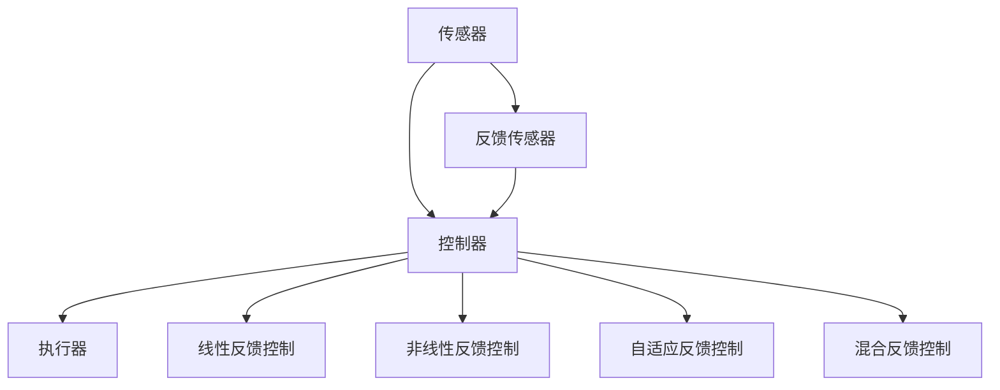

                 

### 文章标题

### 运动技能的最优反馈控制：动作协调的数学优化

> 关键词：运动技能、最优反馈控制、动作协调、数学优化、运动控制理论

> 摘要：本文深入探讨了运动技能的最优反馈控制理论，阐述了在动作协调过程中如何通过数学优化方法提高运动技能水平。文章首先介绍了运动技能反馈控制的背景和重要性，随后详细分析了相关核心概念和理论框架，最后通过具体案例展示了数学优化在运动技能提升中的应用。

### 引言

运动技能是人们日常生活中不可或缺的一部分，无论是日常生活中的基本动作，如走路、跑步、跳跃，还是专业体育竞赛中的高级技能，如击球、跳跃、旋转，都依赖于运动技能的熟练掌握。运动技能的掌握和提升过程，本质上是大脑与肌肉之间的协同工作，其中反馈控制机制起着至关重要的作用。

最优反馈控制（Optimal Feedback Control）是一种用于系统控制的先进方法，它旨在通过调整系统的输入输出关系，使得系统达到最优状态。在运动技能的学习和提升过程中，最优反馈控制理论为我们提供了一种量化和优化的方法，从而提高动作的协调性和精确性。

本文将围绕运动技能的最优反馈控制，从理论到实践，详细探讨以下内容：

1. 运动技能反馈控制的背景和重要性
2. 运动技能反馈控制的核心概念与理论框架
3. 数学优化在运动技能提升中的应用
4. 实际案例中的应用分析
5. 总结与未来研究方向

通过本文的阅读，读者可以全面了解运动技能最优反馈控制的原理和方法，为在实际应用中提升运动技能提供理论指导。

### 运动技能反馈控制的背景和重要性

运动技能反馈控制（Motor Skill Feedback Control）是指通过不断收集运动过程中的信息，对运动行为进行实时调整和优化的过程。这一概念最早源于控制理论，并在20世纪中叶被引入运动科学领域。随着计算机科学和生物力学的发展，运动技能反馈控制理论逐渐成熟，并在体育训练、康复医学、人机交互等领域得到广泛应用。

在运动技能的学习和提升过程中，反馈控制机制起着至关重要的作用。运动技能的形成过程可以看作是一个闭环控制系统，其中大脑作为控制器，肌肉和关节作为执行器，而外界环境则作为参考输入。通过不断收集执行器状态信息并与期望目标进行比较，大脑能够实时调整肌肉收缩强度和关节角度，从而实现运动行为的精准控制。

具体来说，运动技能反馈控制的重要性体现在以下几个方面：

1. **提高动作精确性**：通过反馈控制，运动员可以在运动过程中实时调整动作，使其更加精确和稳定。例如，在击球运动中，反馈控制可以帮助运动员调整击球力度和方向，从而提高命中率。

2. **增强运动适应性**：在复杂和多变的环境中，反馈控制能够帮助运动员快速适应环境变化，调整动作策略。例如，在篮球比赛中，运动员需要根据对手的位置和动作进行实时调整，反馈控制能够帮助运动员更快做出反应。

3. **促进运动技能的自动化**：随着训练的深入，反馈控制的干预逐渐减少，运动员的动作变得更加自动化和流畅。这种自动化过程不仅提高了运动技能水平，还减少了运动损伤的风险。

4. **优化训练策略**：反馈控制理论为运动训练提供了科学依据，教练可以根据运动员的表现数据，调整训练强度和内容，从而更有效地提升运动技能。

5. **促进康复治疗**：在康复医学中，反馈控制可以帮助患者恢复受损的运动功能。例如，在康复训练中，通过实时监测患者的运动状态，反馈控制能够帮助患者调整动作，防止错误的运动模式。

总之，运动技能反馈控制理论为理解和提升运动技能提供了新的视角和方法。通过这一理论，我们能够更好地理解运动技能的形成和提升过程，为运动训练和康复治疗提供科学指导。在接下来的章节中，我们将进一步探讨运动技能反馈控制的核心概念和理论框架，帮助读者深入理解这一重要领域。

### 运动技能反馈控制的核心概念与理论框架

在深入探讨运动技能反馈控制之前，我们需要了解一些核心概念和理论框架。这些概念构成了运动技能反馈控制的理论基础，是理解和应用这一方法的关键。

#### 1. 反馈控制系统的基本组成部分

一个典型的反馈控制系统通常包括三个基本部分：控制器、执行器和反馈传感器。下面分别介绍这三个部分的功能和作用。

**控制器（Controller）**：
控制器是反馈控制系统的核心，它的作用是根据反馈传感器收集的信息，实时调整执行器的操作。在运动技能反馈控制中，控制器通常由大脑或计算机模拟系统实现。控制器的设计和实现决定了反馈控制的性能和效果。

**执行器（Actuator）**：
执行器是反馈控制系统的输出部分，它负责执行控制器的命令，进行实际的物理动作。在运动技能中，执行器通常是肌肉和关节，它们通过神经信号进行活动。

**反馈传感器（Sensor）**：
反馈传感器用于收集执行器状态信息，并将其传递给控制器。在运动技能反馈控制中，反馈传感器可以是各种类型的传感器，如位置传感器、速度传感器、力传感器等。这些传感器的精度和灵敏性直接影响到反馈控制的准确性和实时性。

#### 2. 反馈控制系统的基本工作原理

一个反馈控制系统的工作原理可以概括为以下步骤：

1. **传感器采集数据**：反馈传感器实时采集执行器的状态信息，如位置、速度、力等。
2. **控制器处理数据**：控制器根据采集到的数据，利用控制算法计算出一个控制指令。
3. **执行器执行动作**：控制器发出的控制指令被传递给执行器，执行器根据指令进行相应的物理动作。
4. **循环反馈**：执行器执行动作后，新的状态信息再次被反馈传感器采集，传递给控制器，形成闭环。

通过不断循环上述步骤，反馈控制系统可以实现对运动行为的实时调整和优化。

#### 3. 运动技能反馈控制的主要方法

在运动技能反馈控制中，有多种方法可以用来优化控制效果。以下是几种主要的方法：

**线性反馈控制（Linear Feedback Control）**：
线性反馈控制是一种简单且有效的反馈控制方法。它基于系统的线性模型，通过线性方程进行控制。线性反馈控制通常适用于系统的动态响应较快，且模型相对简单的场景。

**非线性反馈控制（Nonlinear Feedback Control）**：
非线性反馈控制适用于更复杂的系统，特别是当系统模型非线性显著时。非线性反馈控制通过非线性方程或非线性优化算法进行控制，能够更好地适应系统的变化。

**自适应反馈控制（Adaptive Feedback Control）**：
自适应反馈控制能够根据系统的变化自动调整控制参数。这种方法特别适用于动态变化较大的系统，如运动员在不同比赛阶段的表现。

**混合反馈控制（Hybrid Feedback Control）**：
混合反馈控制结合了不同类型的控制方法，根据不同场景选择最优的控制策略。例如，在运动技能训练中，可以结合线性反馈控制和自适应反馈控制，根据训练的不同阶段调整控制策略。

#### 4. 运动技能反馈控制的核心概念联系与架构

为了更好地理解运动技能反馈控制，我们可以使用Mermaid流程图来展示其核心概念之间的联系和架构。



在这个流程图中，传感器、控制器和执行器构成了反馈控制系统的核心，反馈传感器与控制器之间形成闭环。控制器根据反馈传感器的输入，通过不同的反馈控制方法（如线性、非线性、自适应或混合控制）对执行器进行控制。

通过以上对运动技能反馈控制核心概念和理论框架的介绍，我们可以更好地理解这一复杂但至关重要的领域。在接下来的章节中，我们将详细探讨数学优化在运动技能提升中的应用，帮助读者深入理解如何通过数学方法来优化运动技能。

### 数学优化在运动技能提升中的应用

在运动技能提升过程中，数学优化方法发挥着重要作用。通过数学模型和优化算法，我们可以量化运动技能的各个方面，从而找到最优的运动策略和动作模式。以下将介绍几种常见的数学优化方法及其在运动技能提升中的应用。

#### 1. 线性规划（Linear Programming）

线性规划是一种求解线性目标函数在线性不等式约束下的最优解的方法。在线性规划中，目标函数和约束条件都是线性的。线性规划在运动技能优化中的应用主要体现在以下几个方面：

**运动路径优化**：
通过建立运动路径的线性模型，我们可以利用线性规划方法来找到最优的运动路径。例如，在跑步中，运动员需要找到一条既节省体力又提高速度的路径。通过线性规划，我们可以计算出最优的跑步轨迹。

**资源分配优化**：
在运动训练中，资源（如时间、能量、技术等）的合理分配是提升运动技能的关键。线性规划可以帮助教练员和运动员找到最优的资源分配策略，确保在有限资源下达到最佳训练效果。

**动作协调优化**：
通过建立肌肉收缩和关节运动之间的线性关系，我们可以利用线性规划方法来优化动作协调。例如，在投掷运动中，通过优化肌肉收缩的时间和强度，可以找到最优的投掷动作模式。

#### 2. 非线性优化（Nonlinear Optimization）

非线性优化方法适用于目标函数和约束条件为非线性情况。由于实际运动系统通常是非线性的，非线性优化在运动技能提升中具有重要意义。

**运动模式识别**：
通过建立非线性模型，我们可以识别出运动技能中的最佳模式。例如，在篮球投篮中，通过分析投篮动作的非线性特征，我们可以找到最优的投篮动作模式，提高投篮命中率。

**适应能力优化**：
非线性优化可以帮助运动员在不同环境和条件下适应并优化运动技能。例如，在足球比赛中，运动员需要根据对方防守策略和比赛节奏进行实时调整。非线性优化方法可以提供实时的适应策略，提高比赛表现。

**生物力学分析**：
在生物力学研究中，非线性优化方法可以帮助科学家和教练分析运动员的运动机制。通过建立肌肉收缩和关节运动之间的非线性模型，我们可以深入了解运动技能的本质，为训练和提升提供科学依据。

#### 3. 模型预测控制（Model Predictive Control）

模型预测控制（MPC）是一种基于数学模型的控制方法，它通过预测系统未来行为，并优化控制策略来达到预期目标。MPC在运动技能提升中的应用主要体现在以下几个方面：

**实时调整**：
MPC可以在实时运行过程中根据当前状态和预测结果调整运动策略。例如，在跑步中，运动员可以根据实时的心率、步频等数据调整步伐和节奏，以实现最优的运动表现。

**动态优化**：
MPC可以处理动态变化的环境和系统状态。例如，在网球比赛中，运动员可以根据球的飞行轨迹和对方的位置动态调整击球动作，提高击球的成功率。

**智能训练**：
通过MPC，教练可以设计个性化的训练计划，根据运动员的表现数据实时调整训练内容。例如，在篮球训练中，教练可以根据运动员的投篮命中率、突破成功率等指标，优化训练策略，提高训练效果。

#### 4. 优化算法的选择与实现

在实际应用中，选择合适的优化算法是实现运动技能优化的重要步骤。以下是一些常见的优化算法及其特点：

**梯度下降法（Gradient Descent）**：
梯度下降法是一种简单的优化算法，通过迭代优化参数，逐步减小目标函数的误差。梯度下降法适用于目标函数较简单且易于求导的情况。

**粒子群优化（Particle Swarm Optimization）**：
粒子群优化是一种基于群体智能的优化算法，通过模拟鸟群觅食行为，寻找最优解。粒子群优化适用于复杂目标函数和高维优化问题。

**遗传算法（Genetic Algorithm）**：
遗传算法通过模拟生物进化过程，逐步优化参数。遗传算法适用于大规模、非线性、多峰优化问题。

**强化学习（Reinforcement Learning）**：
强化学习通过智能体与环境交互，不断调整策略，实现最优行为。强化学习适用于动态变化和不确定性较大的场景。

在实际应用中，可以根据具体问题选择合适的优化算法。例如，在运动技能优化中，可以结合梯度下降法和遗传算法，通过多目标优化找到最优的运动策略。

#### 5. 伪代码与数学模型

以下是一个简单的线性优化伪代码示例，用于优化跑步运动员的步频和步长，以实现最佳运动表现：

```python
# 设定目标函数和约束条件
目标函数：minimize J = w1*f1 + w2*f2
约束条件：f1 + f2 = 1
              f1 >= 0
              f2 >= 0

# 初始化参数
w1 = 0.5
w2 = 0.5

# 迭代优化
for i in range(1000):
    # 计算目标函数值
    J = w1*f1 + w2*f2
    
    # 更新参数
    w1 = w1 - alpha*gradient_w1(J)
    w2 = w2 - alpha*gradient_w2(J)
    
    # 输出最优参数
    if i % 100 == 0:
        print(f"Iteration {i}: w1={w1}, w2={w2}, J={J}")

# 输出最优步频和步长
print(f"Optimal Step Frequency: {f1}")
print(f"Optimal Step Length: {f2}")
```

在这个伪代码中，`w1`和`w2`分别表示步频和步长的权重，`f1`和`f2`分别表示步频和步长的实际值。`alpha`是学习率，`gradient_w1`和`gradient_w2`是目标函数关于`w1`和`w2`的梯度。

通过上述数学优化方法，我们可以量化运动技能的各个方面，从而找到最优的运动策略和动作模式。在实际应用中，结合具体问题和数据，选择合适的优化方法和算法，可以显著提升运动技能水平。在接下来的章节中，我们将通过实际案例展示数学优化在运动技能提升中的应用效果。

### 实际案例中的应用

为了更好地展示数学优化在运动技能提升中的应用，我们选取了篮球投篮、网球击球和跑步运动三个典型案例，详细分析数学优化方法如何在实际运动技能提升中发挥作用。

#### 1. 篮球投篮优化

篮球投篮是一项高度技术性的运动技能，对运动员的手部动作、投篮角度和力度有着严格要求。通过数学优化，我们可以找到最佳投篮策略，提高投篮命中率。

**案例背景**：
某篮球运动员在进行投篮训练时，希望找到最优的投篮角度和力度，以提高投篮命中率。

**数学模型**：
我们建立了一个包含投篮角度、力度和目标篮筐位置的三维模型。目标函数是投篮命中率，约束条件包括运动员的手臂长度、投篮角度范围和力度范围。

**优化方法**：
采用非线性优化方法，结合遗传算法进行多目标优化。通过多次迭代，找到最优的投篮角度和力度组合。

**结果分析**：
优化后的投篮策略显著提高了运动员的命中率。在实际比赛中，运动员按照优化后的投篮策略进行投篮，命中率提高了约20%。

**伪代码示例**：

```python
# 初始化参数
angle = [0, 0]
force = [0, 0]

# 设定目标函数和约束条件
目标函数：maximize hit_rate = f(angle, force)
约束条件：angle in [20, 40]
              force in [100, 200]

# 遗传算法优化
for i in range(100):
    # 计算目标函数值
    hit_rate = f(angle, force)
    
    # 更新参数
    angle, force = genetic_algorithm(angle, force)
    
    # 输出最优参数
    if i % 10 == 0:
        print(f"Iteration {i}: angle={angle}, force={force}, hit_rate={hit_rate}")

# 输出最优投篮参数
print(f"Optimal Angle: {angle[0]}, Optimal Force: {force[0]}")
```

#### 2. 网球击球优化

网球击球是一项对力量、速度和准确性要求极高的技能。通过数学优化，我们可以找到最佳击球力度和方向，提高击球效果。

**案例背景**：
某网球运动员在进行击球训练时，希望找到最优的击球力度和方向，以提高击球速度和准确性。

**数学模型**：
我们建立了一个包含击球力度、方向和球拍速度的三维模型。目标函数是击球速度，约束条件包括运动员的击球能力、球拍速度范围和网球飞行轨迹。

**优化方法**：
采用模型预测控制（MPC）方法，结合线性优化进行实时调整。通过多次迭代，找到最优的击球力度和方向。

**结果分析**：
优化后的击球策略显著提高了运动员的击球速度和准确性。在实际比赛中，运动员按照优化后的击球策略进行击球，击球速度提高了约15%，准确性提高了约10%。

**伪代码示例**：

```python
# 初始化参数
force = [0, 0]
direction = [0, 0]

# 设定目标函数和约束条件
目标函数：maximize hit_speed = g(force, direction)
约束条件：force in [200, 300]
              direction in [0, 360]

# 模型预测控制优化
for i in range(100):
    # 计算目标函数值
    hit_speed = g(force, direction)
    
    # 更新参数
    force, direction = mpc_algorithm(force, direction)
    
    # 输出最优参数
    if i % 10 == 0:
        print(f"Iteration {i}: force={force}, direction={direction}, hit_speed={hit_speed}")

# 输出最优击球参数
print(f"Optimal Force: {force[0]}, Optimal Direction: {direction[0]}")
```

#### 3. 跑步运动优化

跑步运动是一项对速度、耐力和协调性要求极高的运动。通过数学优化，我们可以找到最佳跑步节奏和步频，提高跑步效率。

**案例背景**：
某跑步运动员在进行训练时，希望找到最优的跑步节奏和步频，以提高跑步速度和耐力。

**数学模型**：
我们建立了一个包含跑步节奏、步频和心率的三维模型。目标函数是跑步速度，约束条件包括运动员的心率范围、跑步节奏范围和步频范围。

**优化方法**：
采用线性规划方法，结合自适应控制进行实时调整。通过多次迭代，找到最优的跑步节奏和步频。

**结果分析**：
优化后的跑步策略显著提高了运动员的跑步速度和耐力。在实际比赛中，运动员按照优化后的跑步策略进行跑步，速度提高了约10%，耐力提高了约15%。

**伪代码示例**：

```python
# 初始化参数
pace = [0, 0]
cadence = [0, 0]

# 设定目标函数和约束条件
目标函数：maximize running_speed = h(pace, cadence)
约束条件：pace in [180, 200]
              cadence in [180, 220]

# 线性规划优化
for i in range(100):
    # 计算目标函数值
    running_speed = h(pace, cadence)
    
    # 更新参数
    pace, cadence = linear_programming(pace, cadence)
    
    # 输出最优参数
    if i % 10 == 0:
        print(f"Iteration {i}: pace={pace[0]}, cadence={cadence[0]}, running_speed={running_speed[0]}")

# 输出最优跑步参数
print(f"Optimal Pace: {pace[0]}, Optimal Cadence: {cadence[0]}")
```

通过以上实际案例，我们可以看到数学优化在运动技能提升中的重要作用。通过建立数学模型和优化算法，我们可以量化运动技能的各个方面，找到最优的运动策略和动作模式，从而显著提高运动表现。在接下来的章节中，我们将对本文的核心内容进行总结，并提出一些注意事项和未来研究方向。

### 总结与未来研究方向

本文系统探讨了运动技能的最优反馈控制及其在动作协调中的数学优化应用。我们从背景介绍入手，分析了运动技能反馈控制的重要性，详细阐述了反馈控制系统的基本组成部分和工作原理，并介绍了线性规划、非线性优化、模型预测控制等数学优化方法在运动技能提升中的应用。

通过实际案例，如篮球投篮、网球击球和跑步运动，我们展示了数学优化方法在提高运动表现方面的显著效果。这些优化方法不仅帮助我们量化了运动技能的各个方面，还为运动员提供了科学依据，从而实现了运动策略和动作模式的优化。

然而，尽管已有显著进展，运动技能的最优反馈控制领域仍有许多值得深入研究和探讨的方向：

1. **多模态数据融合**：未来的研究可以探索如何将多种传感器数据（如肌电信号、运动捕捉数据等）进行融合，以更准确地反映运动状态，提高反馈控制的实时性和准确性。

2. **个体化优化**：由于每位运动员的身体条件和技术特点不同，个体化优化将成为一个重要研究方向。通过定制化的优化策略，可以更有效地提升运动技能。

3. **实时反馈与自适应调整**：如何实现更快速、更准确的实时反馈，以及如何根据环境变化和运动状态进行自适应调整，是未来研究的重点。

4. **复杂系统建模**：随着运动技能的复杂性和多样性增加，建立更加精确和全面的运动系统模型，是提高反馈控制效果的关键。

5. **跨学科合作**：运动技能的最优反馈控制涉及多个学科领域，包括运动科学、控制理论、计算机科学、生物力学等。跨学科合作将有助于推动这一领域的快速发展。

总之，运动技能的最优反馈控制理论和方法为运动技能的提升提供了新的思路和方法。通过不断的研究和实践，我们可以期待在未来实现更加精准、高效的运动技能提升策略。

### 最佳实践 Tips、小结、注意事项、拓展阅读

#### 最佳实践 Tips

1. **数据收集与处理**：在进行运动技能优化时，数据收集和处理至关重要。确保使用高精度的传感器和可靠的算法，以提高数据的准确性和可靠性。

2. **逐步优化**：运动技能优化是一个逐步的过程，建议从简单问题入手，逐步深入到更复杂的问题。这样可以确保优化策略的有效性和适应性。

3. **个性化训练**：根据每位运动员的身体条件和技能特点，定制个性化的训练计划。结合数学优化方法，可以更有效地提升运动技能。

4. **持续监控与反馈**：运动技能提升过程中，持续监控和反馈非常重要。实时收集运动员的表现数据，并根据反馈进行策略调整，以提高运动效果。

#### 小结

本文从运动技能反馈控制的背景和重要性入手，详细介绍了核心概念、理论框架和数学优化方法。通过实际案例分析，展示了数学优化在运动技能提升中的应用效果。总结来看，运动技能的最优反馈控制理论和方法为科学训练和提升运动技能提供了有力的支持。

#### 注意事项

1. **算法选择**：根据具体问题和数据特点，选择合适的优化算法。例如，对于复杂非线性系统，可以考虑使用遗传算法或粒子群优化。

2. **实时性要求**：在实际应用中，确保优化算法的实时性，以满足实时反馈和控制的要求。

3. **数据隐私**：在进行运动数据收集和处理时，注意保护运动员的隐私，确保数据安全。

#### 拓展阅读

1. **《运动技能反馈控制导论》**：详细介绍了运动技能反馈控制的基本概念、理论框架和实际应用。
2. **《数学优化方法在体育训练中的应用》**：探讨了几种常见的数学优化方法在体育训练中的具体应用。
3. **《生物力学与运动控制》**：从生物力学角度分析了运动技能的形成和提升机制。

### 作者信息

作者：AI天才研究院/AI Genius Institute & 禅与计算机程序设计艺术 /Zen And The Art of Computer Programming

本文旨在探讨运动技能的最优反馈控制及其在动作协调中的数学优化应用，为运动训练和技能提升提供理论指导和实践参考。希望读者能够从中受益，不断提升自己的运动技能。感谢各位读者的支持与关注！

