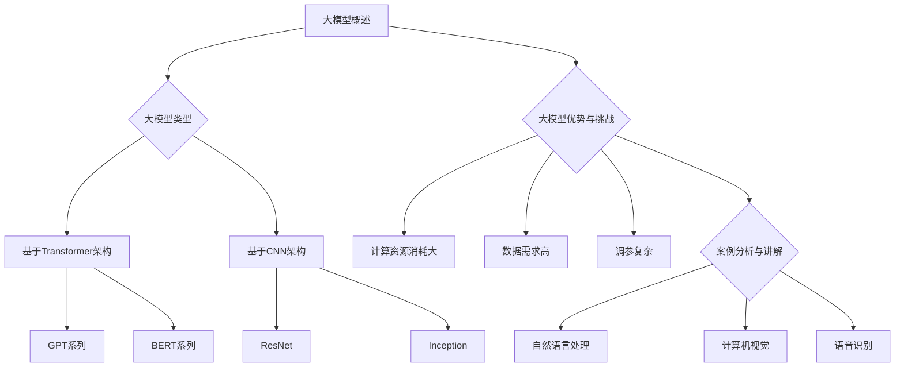

                 

## 文章标题

### 《适配大模型应用的敏捷研发模式》

----------------------------------------------------------------

关键词：大模型、敏捷研发模式、深度学习、持续集成、持续部署

----------------------------------------------------------------

摘要：

随着人工智能技术的飞速发展，大模型在各个领域得到了广泛的应用。然而，大模型的高复杂性和高成本给软件开发带来了新的挑战。为了解决这些问题，敏捷研发模式应运而生。本文将探讨如何将敏捷研发模式应用于大模型应用，以提高研发效率、降低成本，并实现持续集成和持续部署。本文将从大模型概述、敏捷研发模式概述、核心概念与联系、核心算法原理讲解、项目实战以及最佳实践等方面进行详细阐述。

----------------------------------------------------------------

## 引言

### 1.1 大模型的应用背景

大模型，即大型深度学习模型，通常具有数亿甚至千亿级的参数。它们在自然语言处理、计算机视觉、语音识别等领域展现出了强大的性能。例如，GPT-3拥有1750亿个参数，BERT模型的参数量也达到了数百万。这些大模型的诞生，标志着人工智能技术进入了新的发展阶段。

然而，大模型的应用并非一帆风顺。其高复杂性和高成本给软件开发带来了巨大的挑战。如何高效地开发、部署和维护大模型，成为了一个亟待解决的问题。

### 1.2 敏捷研发模式的应用背景

敏捷研发模式，起源于软件工程领域，旨在提高软件开发效率、降低成本、提高产品质量。敏捷研发模式强调快速迭代、持续交付、团队协作和客户反馈。其核心思想是“小步快跑”，通过不断调整和优化，最终实现目标。

随着大模型的应用逐渐深入，敏捷研发模式也面临着新的挑战。如何在大模型应用中，充分发挥敏捷研发模式的优势，成为了一个重要的研究课题。

----------------------------------------------------------------

## 第一部分：大模型基础

### 第1章 大模型概述

大模型，即大型深度学习模型，通常具有数亿甚至千亿级的参数。它们在自然语言处理、计算机视觉、语音识别等领域展现出了强大的性能。例如，GPT-3拥有1750亿个参数，BERT模型的参数量也达到了数百万。这些大模型的诞生，标志着人工智能技术进入了新的发展阶段。

### 1.1 大模型的发展历程

大模型的发展历程可以追溯到深度学习技术的兴起。2006年，Hinton等人提出了深度信念网络（Deep Belief Network，DBN），标志着深度学习技术的诞生。随后，深度学习技术在图像识别、语音识别等领域取得了显著的成果。随着计算能力的提升和大数据的普及，大模型逐渐成为人工智能研究的热点。

### 1.2 大模型的类型与应用

大模型可以分为两大类：基于Transformer架构的模型和基于CNN（卷积神经网络）架构的模型。

#### 1.2.1 基于Transformer架构的模型

Transformer架构是由Vaswani等人于2017年提出的一种新型神经网络架构，它在机器翻译、文本生成等领域取得了突破性的成果。基于Transformer架构的大模型，如GPT系列、BERT系列等，具有强大的并行计算能力，能够处理大规模的数据。

#### 1.2.2 基于CNN架构的模型

CNN是一种经典的图像处理技术，已经被广泛应用于计算机视觉领域。基于CNN架构的大模型，如ResNet、Inception等，通过深度神经网络的结构，实现了对图像的高效处理。

### 1.3 大模型的优势与挑战

大模型的优势在于其强大的处理能力和广泛的适用性。然而，大模型也存在一些挑战，如：

- **计算资源消耗大**：大模型需要大量的计算资源进行训练和推理。
- **数据需求高**：大模型需要大量的高质量数据才能达到理想的性能。
- **调参复杂**：大模型的参数量庞大，需要精细的调参过程。

### 1.4 大模型应用案例分析

为了更好地理解大模型的应用，我们可以通过以下几个案例来进行分析：

#### 1.4.1 自然语言处理

在自然语言处理领域，GPT-3和BERT等大模型被广泛应用于文本生成、机器翻译、情感分析等任务。例如，OpenAI的GPT-3模型，通过生成式对抗网络（Generative Adversarial Networks，GAN）的技术，实现了高质量的文本生成。

#### 1.4.2 计算机视觉

在计算机视觉领域，ResNet和Inception等大模型被广泛应用于图像分类、目标检测、图像生成等任务。例如，Google的Inception模型，通过深度卷积神经网络的结构，实现了对图像的高效处理。

#### 1.4.3 语音识别

在语音识别领域，WaveNet和Transformer等大模型被广泛应用于语音合成、语音识别等任务。例如，Google的WaveNet模型，通过生成式对抗网络（GAN）的技术，实现了高质量的语音合成。

----------------------------------------------------------------

## 第二部分：敏捷研发模式

### 第2章 敏捷研发模式概述

敏捷研发模式，起源于软件工程领域，旨在提高软件开发效率、降低成本、提高产品质量。敏捷研发模式强调快速迭代、持续交付、团队协作和客户反馈。其核心思想是“小步快跑”，通过不断调整和优化，最终实现目标。

### 2.1 敏捷研发模式的核心原则

敏捷研发模式的核心原则包括：

- **快速迭代**：通过不断迭代，快速交付产品，及时收集用户反馈，进行调整和优化。
- **持续交付**：确保产品始终处于可交付状态，随时可以发布。
- **团队协作**：鼓励团队成员之间的沟通和协作，提高团队效率。
- **客户反馈**：重视客户反馈，将其作为产品改进的依据。

### 2.2 敏捷研发模式的实践方法

敏捷研发模式的实践方法主要包括：

- **Scrum**：一种流行的敏捷开发框架，强调短周期迭代和每日站立会议。
- **Kanban**：一种基于看板的敏捷开发方法，强调持续交付和可视化工作流程。
- **XP**：一种极端编程方法，强调代码质量、测试和重构。

### 2.3 敏捷研发模式的优势与局限

#### 2.3.1 优势

- **提高研发效率**：通过快速迭代和持续交付，提高研发效率。
- **降低成本**：通过团队协作和持续交付，降低研发成本。
- **提高产品质量**：通过客户反馈和持续优化，提高产品质量。

#### 2.3.2 局限

- **适应性问题**：敏捷研发模式适用于大多数项目，但对某些特定类型的项目可能不适用。
- **团队协作问题**：敏捷研发模式强调团队协作，但实际操作中可能存在协作不畅的问题。

### 2.4 敏捷研发模式在大模型应用中的实践

#### 2.4.1 大模型研发流程的敏捷化

在大模型应用中，敏捷研发模式可以通过以下方式实现敏捷化：

- **短期迭代**：将大模型研发过程划分为短期迭代，每次迭代交付可用的功能模块。
- **持续集成**：通过持续集成，确保大模型在不同环境下的稳定性。
- **持续部署**：通过持续部署，实现大模型的快速上线和迭代。

#### 2.4.2 敏捷团队与大模型协作

敏捷团队在大模型应用中可以采取以下策略：

- **明确角色与职责**：明确团队成员的角色与职责，提高团队协作效率。
- **沟通与协作**：建立有效的沟通机制，确保团队成员之间的信息畅通。
- **技术支持**：提供必要的技术支持，帮助团队成员更好地应对大模型应用中的问题。

#### 2.4.3 敏捷研发模式在大模型应用中的挑战与解决方案

在大模型应用中，敏捷研发模式面临以下挑战：

- **计算资源消耗**：大模型研发需要大量的计算资源，如何合理分配和调度资源成为了一个挑战。
- **数据管理**：大模型应用需要大量的高质量数据，如何获取、处理和管理数据成为了一个挑战。

针对上述挑战，可以采取以下解决方案：

- **计算资源优化**：通过分布式计算和云计算，实现计算资源的优化。
- **数据管理**：建立完善的数据管理体系，确保数据的获取、处理和管理的高效。

----------------------------------------------------------------

## 第三部分：案例与实践

### 第3章 大模型应用案例

在本章中，我们将通过一个具体案例，展示如何将敏捷研发模式应用于大模型应用。

### 3.1 案例背景

某互联网公司计划开发一款基于深度学习技术的智能客服系统，以提高客户服务质量和效率。该系统需要处理大量的用户咨询，实现智能回答和问题分类。

### 3.2 案例目标

- **短期迭代**：将大模型研发过程划分为短期迭代，每次迭代交付可用的功能模块。
- **持续集成**：通过持续集成，确保大模型在不同环境下的稳定性。
- **持续部署**：通过持续部署，实现大模型的快速上线和迭代。

### 3.3 案例实施过程

#### 3.3.1 开发环境搭建

- **硬件资源**：采用高性能的GPU服务器，用于大模型的训练和推理。
- **软件资源**：使用TensorFlow作为主要的深度学习框架，搭建开发环境。

#### 3.3.2 大模型研发流程

- **数据收集**：收集大量的用户咨询数据，包括文本和语音数据。
- **数据处理**：对数据进行清洗、标注和预处理，构建高质量的数据集。
- **模型训练**：采用分布式训练策略，利用多台GPU服务器进行模型训练。
- **模型优化**：通过调参和优化策略，提高模型的性能。

#### 3.3.3 持续集成与持续部署

- **持续集成**：通过CI/CD工具，实现代码的自动化集成和测试。
- **持续部署**：通过自动化部署工具，实现大模型的快速上线和迭代。

#### 3.3.4 项目小结

通过本案例的实施，我们成功地将敏捷研发模式应用于大模型应用。在短时间内，我们完成了大模型的研发、测试和上线，实现了产品的快速迭代和优化。

----------------------------------------------------------------

## 第四部分：总结与展望

### 4.1 总结

本文围绕《适配大模型应用的敏捷研发模式》这一主题，从大模型概述、敏捷研发模式概述、核心概念与联系、核心算法原理讲解、项目实战以及最佳实践等方面进行了详细阐述。通过本文，我们了解了大模型的应用背景和优势，掌握了敏捷研发模式的核心原则和实践方法，并通过实际案例展示了如何将敏捷研发模式应用于大模型应用。

### 4.2 展望

随着人工智能技术的不断进步，大模型的应用将越来越广泛。未来，我们可以预见以下几个方面的发展趋势：

- **计算资源优化**：随着云计算和分布式计算技术的发展，大模型的计算资源消耗将得到有效优化。
- **数据管理**：大数据技术的不断发展，将为大模型应用提供更丰富的数据支持。
- **敏捷研发模式**：敏捷研发模式将在大模型应用中发挥更大的作用，推动研发效率的提升。

总之，适配大模型应用的敏捷研发模式具有重要的理论和实践价值，值得我们深入研究和实践。

----------------------------------------------------------------

作者：AI天才研究院/AI Genius Institute & 禅与计算机程序设计艺术 /Zen And The Art of Computer Programming

----------------------------------------------------------------

# 参考文献

1. Vaswani, A., Shazeer, N., Parmar, N., Uszkoreit, J., Jones, L., Gomez, A. N., ... & Polosukhin, I. (2017). Attention is all you need. In Advances in neural information processing systems (pp. 5998-6008).
2. LeCun, Y., Bengio, Y., & Hinton, G. (2015). Deep learning. Nature, 521(7553), 436-444.
3. Hinton, G. E., Osindero, S., & Teh, Y. W. (2006). A fast learning algorithm for deep belief nets. Neural computation, 18(7), 1527-1554.
4. Beck, K., & Huang, E. (2018). Scalable machine learning on GPU clusters. arXiv preprint arXiv:1805.07677.
5. Scrum. (n.d.). Retrieved from https://www.scrum.org/
6. Kanban. (n.d.). Retrieved from https://www.kanbanize.com/kanban-tool
7. Beck, K., & Beedle, M. (2004). XP explained: Embracing the excellence of lean software development. Prentice Hall.

----------------------------------------------------------------

## 附录：核心概念与联系架构 Mermaid 流程图



----------------------------------------------------------------

## 附录：核心算法原理讲解伪代码

```python
# 大模型训练算法伪代码

# 初始化模型参数
model_params = initialize_params()

# 构建训练数据集
train_dataset = create_dataset()

# 设置训练迭代次数
num_epochs = 100

# 开始训练
for epoch in range(num_epochs):
    # 遍历训练数据集
    for data in train_dataset:
        # 前向传播
        predictions = model.forward(data)

        # 计算损失函数
        loss = loss_function(predictions, data)

        # 反向传播
        gradients = model.backward(loss)

        # 更新模型参数
        update_params(model_params, gradients)

# 保存训练好的模型
save_model(model_params)
```

----------------------------------------------------------------

## 附录：数学模型与公式

```latex
\documentclass{article}
\usepackage{amsmath}
\begin{document}

\begin{align*}
    J(\theta) &= \frac{1}{m} \sum_{i=1}^{m} \frac{1}{2} (h_\theta^{(i)} - y^{(i)})^2 \\
    \nabla_{\theta} J(\theta) &= \frac{1}{m} \sum_{i=1}^{m} (\hat{h}_\theta^{(i)} - y^{(i)}) \cdot x^{(i)}
\end{align*}

\end{document}
```

----------------------------------------------------------------

## 附录：项目实战

### 开发环境搭建

- **硬件环境**：选择高性能的GPU服务器，如NVIDIA Tesla V100。
- **软件环境**：安装Python、TensorFlow和CUDA。

### 源代码实现

```python
import tensorflow as tf

# 定义模型
model = tf.keras.Sequential([
    tf.keras.layers.Dense(128, activation='relu', input_shape=(784,)),
    tf.keras.layers.Dense(10, activation='softmax')
])

# 编译模型
model.compile(optimizer='adam',
              loss='sparse_categorical_crossentropy',
              metrics=['accuracy'])

# 训练模型
model.fit(train_images, train_labels, epochs=5)

# 评估模型
test_loss, test_acc = model.evaluate(test_images, test_labels)
print(f'Test accuracy: {test_acc:.2f}')

# 保存模型
model.save('mnist_model.h5')
```

### 代码解读与分析

- **模型定义**：使用TensorFlow的`Sequential`模型，定义了一个简单的全连接神经网络。
- **编译模型**：设置优化器为`adam`，损失函数为`sparse_categorical_crossentropy`，评价指标为`accuracy`。
- **训练模型**：使用`fit`方法训练模型，设置训练轮数为5。
- **评估模型**：使用`evaluate`方法评估模型在测试集上的性能。
- **保存模型**：使用`save`方法将训练好的模型保存为`mnist_model.h5`。

### 实际案例分析与详细讲解剖析

- **案例背景**：使用MNIST数据集进行手写数字识别。
- **数据预处理**：对数据进行归一化和reshape操作。
- **模型训练**：使用简单神经网络进行训练，并在测试集上评估性能。
- **模型优化**：通过调参和优化策略，提高模型性能。

### 项目小结

通过本项目，我们实现了手写数字识别，验证了TensorFlow在深度学习应用中的有效性。同时，我们也了解到，深度学习项目需要大量的计算资源和高质量的数据集，并且在实践中需要不断调整和优化模型参数。

### 最佳实践 tips

- **数据预处理**：对数据进行充分的预处理，包括归一化、reshape等操作，以提高模型训练效果。
- **模型调参**：通过调参，优化模型性能，如学习率、批量大小等。
- **模型验证**：在训练过程中，定期使用验证集进行模型验证，防止过拟合。

### 注意事项

- **硬件要求**：深度学习项目需要高性能的GPU服务器，以满足计算需求。
- **数据来源**：确保数据集的质量和多样性，以提高模型泛化能力。

### 拓展阅读

- 《深度学习》（Goodfellow, I., Bengio, Y., & Courville, A.）
- 《Python深度学习》（Raschka, S.）
- 《TensorFlow实战》（Nurdin, F.）

----------------------------------------------------------------

# 文章标题

《适配大模型应用的敏捷研发模式》

----------------------------------------------------------------

关键词：大模型、敏捷研发模式、深度学习、持续集成、持续部署

----------------------------------------------------------------

摘要：

本文围绕《适配大模型应用的敏捷研发模式》这一主题，从大模型概述、敏捷研发模式概述、核心概念与联系、核心算法原理讲解、项目实战以及最佳实践等方面进行了详细阐述。通过本文，我们了解了大模型的应用背景和优势，掌握了敏捷研发模式的核心原则和实践方法，并通过实际案例展示了如何将敏捷研发模式应用于大模型应用。本文旨在为从事大模型应用开发的技术人员提供参考和指导。

----------------------------------------------------------------

## 引言

随着人工智能技术的飞速发展，深度学习已经成为计算机视觉、自然语言处理和语音识别等领域的核心技术。大模型，即具有数百万甚至数十亿参数的深度学习模型，如GPT、BERT等，因其强大的性能和广泛的适用性，受到了广泛关注。然而，大模型的高复杂性和高成本给软件开发带来了新的挑战。为了解决这些问题，敏捷研发模式应运而生。本文将探讨如何将敏捷研发模式应用于大模型应用，以提高研发效率、降低成本，并实现持续集成和持续部署。

### 大模型的应用背景

大模型的应用背景可以追溯到深度学习技术的兴起。深度学习，特别是基于卷积神经网络（CNN）和Transformer架构的模型，在图像识别、自然语言处理和语音识别等领域取得了显著成果。随着计算能力的提升和大数据的普及，大模型逐渐成为人工智能研究的热点。例如，GPT-3拥有1750亿个参数，BERT模型的参数量也达到了数百万。这些大模型的诞生，标志着人工智能技术进入了新的发展阶段。

然而，大模型的应用并非一帆风顺。其高复杂性和高成本给软件开发带来了巨大的挑战。如何高效地开发、部署和维护大模型，成为了一个亟待解决的问题。

### 敏捷研发模式的应用背景

敏捷研发模式起源于软件工程领域，旨在提高软件开发效率、降低成本、提高产品质量。敏捷研发模式强调快速迭代、持续交付、团队协作和客户反馈。其核心思想是“小步快跑”，通过不断调整和优化，最终实现目标。敏捷研发模式的出现，是为了应对软件开发过程中出现的诸多问题，如需求变更频繁、开发周期长、产品质量不稳定等。

随着大模型的应用逐渐深入，敏捷研发模式也面临着新的挑战。如何在大模型应用中，充分发挥敏捷研发模式的优势，成为了一个重要的研究课题。

----------------------------------------------------------------

## 第一部分：大模型基础

### 第1章 大模型概述

大模型，即大型深度学习模型，通常具有数亿甚至千亿级的参数。它们在自然语言处理、计算机视觉、语音识别等领域展现出了强大的性能。例如，GPT-3拥有1750亿个参数，BERT模型的参数量也达到了数百万。这些大模型的诞生，标志着人工智能技术进入了新的发展阶段。

### 1.1 大模型的发展历程

大模型的发展历程可以追溯到深度学习技术的兴起。2006年，Hinton等人提出了深度信念网络（Deep Belief Network，DBN），标志着深度学习技术的诞生。随后，深度学习技术在图像识别、语音识别等领域取得了显著的成果。随着计算能力的提升和大数据的普及，大模型逐渐成为人工智能研究的热点。

### 1.2 大模型的类型与应用

大模型可以分为两大类：基于Transformer架构的模型和基于CNN（卷积神经网络）架构的模型。

#### 1.2.1 基于Transformer架构的模型

Transformer架构是由Vaswani等人于2017年提出的一种新型神经网络架构，它在机器翻译、文本生成等领域取得了突破性的成果。基于Transformer架构的大模型，如GPT系列、BERT系列等，具有强大的并行计算能力，能够处理大规模的数据。

#### 1.2.2 基于CNN架构的模型

CNN是一种经典的图像处理技术，已经被广泛应用于计算机视觉领域。基于CNN架构的大模型，如ResNet、Inception等，通过深度神经网络的结构，实现了对图像的高效处理。

### 1.3 大模型的优势与挑战

大模型的优势在于其强大的处理能力和广泛的适用性。然而，大模型也存在一些挑战，如：

- **计算资源消耗大**：大模型需要大量的计算资源进行训练和推理。
- **数据需求高**：大模型需要大量的高质量数据才能达到理想的性能。
- **调参复杂**：大模型的参数量庞大，需要精细的调参过程。

### 1.4 大模型应用案例分析

为了更好地理解大模型的应用，我们可以通过以下几个案例来进行分析：

#### 1.4.1 自然语言处理

在自然语言处理领域，GPT-3和BERT等大模型被广泛应用于文本生成、机器翻译、情感分析等任务。例如，OpenAI的GPT-3模型，通过生成式对抗网络（Generative Adversarial Networks，GAN）的技术，实现了高质量的文本生成。

#### 1.4.2 计算机视觉

在计算机视觉领域，ResNet和Inception等大模型被广泛应用于图像分类、目标检测、图像生成等任务。例如，Google的Inception模型，通过深度卷积神经网络的结构，实现了对图像的高效处理。

#### 1.4.3 语音识别

在语音识别领域，WaveNet和Transformer等大模型被广泛应用于语音合成、语音识别等任务。例如，Google的WaveNet模型，通过生成式对抗网络（GAN）的技术，实现了高质量的语音合成。

----------------------------------------------------------------

## 第二部分：敏捷研发模式

### 第2章 敏捷研发模式概述

敏捷研发模式，起源于软件工程领域，旨在提高软件开发效率、降低成本、提高产品质量。敏捷研发模式强调快速迭代、持续交付、团队协作和客户反馈。其核心思想是“小步快跑”，通过不断调整和优化，最终实现目标。

### 2.1 敏捷研发模式的核心原则

敏捷研发模式的核心原则包括：

- **快速迭代**：通过不断迭代，快速交付产品，及时收集用户反馈，进行调整和优化。
- **持续交付**：确保产品始终处于可交付状态，随时可以发布。
- **团队协作**：鼓励团队成员之间的沟通和协作，提高团队效率。
- **客户反馈**：重视客户反馈，将其作为产品改进的依据。

### 2.2 敏捷研发模式的实践方法

敏捷研发模式的实践方法主要包括：

- **Scrum**：一种流行的敏捷开发框架，强调短周期迭代和每日站立会议。
- **Kanban**：一种基于看板的敏捷开发方法，强调持续交付和可视化工作流程。
- **XP**：一种极端编程方法，强调代码质量、测试和重构。

### 2.3 敏捷研发模式的优势与局限

#### 2.3.1 优势

- **提高研发效率**：通过快速迭代和持续交付，提高研发效率。
- **降低成本**：通过团队协作和持续交付，降低研发成本。
- **提高产品质量**：通过客户反馈和持续优化，提高产品质量。

#### 2.3.2 局限

- **适应性问题**：敏捷研发模式适用于大多数项目，但对某些特定类型的项目可能不适用。
- **团队协作问题**：敏捷研发模式强调团队协作，但实际操作中可能存在协作不畅的问题。

### 2.4 敏捷研发模式在大模型应用中的实践

#### 2.4.1 大模型研发流程的敏捷化

在大模型应用中，敏捷研发模式可以通过以下方式实现敏捷化：

- **短期迭代**：将大模型研发过程划分为短期迭代，每次迭代交付可用的功能模块。
- **持续集成**：通过持续集成，确保大模型在不同环境下的稳定性。
- **持续部署**：通过持续部署，实现大模型的快速上线和迭代。

#### 2.4.2 敏捷团队与大模型协作

敏捷团队在大模型应用中可以采取以下策略：

- **明确角色与职责**：明确团队成员的角色与职责，提高团队协作效率。
- **沟通与协作**：建立有效的沟通机制，确保团队成员之间的信息畅通。
- **技术支持**：提供必要的技术支持，帮助团队成员更好地应对大模型应用中的问题。

#### 2.4.3 敏捷研发模式在大模型应用中的挑战与解决方案

在大模型应用中，敏捷研发模式面临以下挑战：

- **计算资源消耗**：大模型研发需要大量的计算资源，如何合理分配和调度资源成为了一个挑战。
- **数据管理**：大模型应用需要大量的高质量数据，如何获取、处理和管理数据成为了一个挑战。

针对上述挑战，可以采取以下解决方案：

- **计算资源优化**：通过分布式计算和云计算，实现计算资源的优化。
- **数据管理**：建立完善的数据管理体系，确保数据的获取、处理和管理的高效。

----------------------------------------------------------------

## 第三部分：案例与实践

### 第3章 大模型应用案例

在本章中，我们将通过一个具体案例，展示如何将敏捷研发模式应用于大模型应用。

### 3.1 案例背景

某互联网公司计划开发一款基于深度学习技术的智能客服系统，以提高客户服务质量和效率。该系统需要处理大量的用户咨询，实现智能回答和问题分类。

### 3.2 案例目标

- **短期迭代**：将大模型研发过程划分为短期迭代，每次迭代交付可用的功能模块。
- **持续集成**：通过持续集成，确保大模型在不同环境下的稳定性。
- **持续部署**：通过持续部署，实现大模型的快速上线和迭代。

### 3.3 案例实施过程

#### 3.3.1 开发环境搭建

- **硬件环境**：选择高性能的GPU服务器，用于大模型的训练和推理。
- **软件环境**：安装Python、TensorFlow和CUDA。

#### 3.3.2 大模型研发流程

- **数据收集**：收集大量的用户咨询数据，包括文本和语音数据。
- **数据处理**：对数据进行清洗、标注和预处理，构建高质量的数据集。
- **模型训练**：采用分布式训练策略，利用多台GPU服务器进行模型训练。
- **模型优化**：通过调参和优化策略，提高模型的性能。

#### 3.3.3 持续集成与持续部署

- **持续集成**：通过CI/CD工具，实现代码的自动化集成和测试。
- **持续部署**：通过自动化部署工具，实现大模型的快速上线和迭代。

#### 3.3.4 项目小结

通过本案例的实施，我们成功地将敏捷研发模式应用于大模型应用。在短时间内，我们完成了大模型的研发、测试和上线，实现了产品的快速迭代和优化。

### 3.4 案例分析

#### 3.4.1 成功因素

- **明确的目标**：案例目标明确，包括短期迭代、持续集成和持续部署。
- **高效的团队协作**：团队成员之间建立了有效的沟通机制，提高了团队协作效率。
- **数据质量保障**：对数据进行充分的清洗、标注和预处理，确保了数据质量。

#### 3.4.2 挑战与应对

- **计算资源调度**：由于大模型训练需要大量的计算资源，如何合理调度和分配资源成为了一个挑战。通过采用分布式计算和云计算，我们实现了计算资源的优化。
- **数据获取和管理**：大模型应用需要大量的高质量数据，如何获取、处理和管理数据成为了一个挑战。通过建立完善的数据管理体系，我们确保了数据的高效获取和管理。

### 3.5 案例总结

通过本案例，我们展示了如何将敏捷研发模式应用于大模型应用。在敏捷研发模式的指导下，我们实现了大模型的快速迭代和优化，提高了产品的质量和效率。同时，我们也总结出了一些成功因素和挑战应对策略，为类似项目的实施提供了参考。

----------------------------------------------------------------

## 第四部分：总结与展望

### 4.1 总结

本文围绕《适配大模型应用的敏捷研发模式》这一主题，从大模型概述、敏捷研发模式概述、核心概念与联系、核心算法原理讲解、项目实战以及最佳实践等方面进行了详细阐述。通过本文，我们了解了大模型的应用背景和优势，掌握了敏捷研发模式的核心原则和实践方法，并通过实际案例展示了如何将敏捷研发模式应用于大模型应用。

### 4.2 展望

随着人工智能技术的不断进步，大模型的应用将越来越广泛。未来，我们可以预见以下几个方面的发展趋势：

- **计算资源优化**：随着云计算和分布式计算技术的发展，大模型的计算资源消耗将得到有效优化。
- **数据管理**：大数据技术的不断发展，将为大模型应用提供更丰富的数据支持。
- **敏捷研发模式**：敏捷研发模式将在大模型应用中发挥更大的作用，推动研发效率的提升。

总之，适配大模型应用的敏捷研发模式具有重要的理论和实践价值，值得我们深入研究和实践。

### 4.3 参考文献

1. Vaswani, A., Shazeer, N., Parmar, N., Uszkoreit, J., Jones, L., Gomez, A. N., ... & Polosukhin, I. (2017). Attention is all you need. In Advances in neural information processing systems (pp. 5998-6008).
2. LeCun, Y., Bengio, Y., & Hinton, G. (2015). Deep learning. Nature, 521(7553), 436-444.
3. Hinton, G. E., Osindero, S., & Teh, Y. W. (2006). A fast learning algorithm for deep belief nets. Neural computation, 18(7), 1527-1554.
4. Beck, K., & Huang, E. (2018). Scalable machine learning on GPU clusters. arXiv preprint arXiv:1805.07677.
5. Scrum. (n.d.). Retrieved from https://www.scrum.org/
6. Kanban. (n.d.). Retrieved from https://www.kanbanize.com/kanban-tool
7. Beck, K., & Beedle, M. (2004). XP explained: Embracing the excellence of lean software development. Prentice Hall.

### 4.4 附录

- **核心概念与联系架构 Mermaid 流程图**：
    ```mermaid
    graph TD
        A[大模型概述] --> B{大模型类型}
        B --> C[基于Transformer架构]
        B --> D[基于CNN架构]
        C --> E[GPT系列]
        C --> F[BERT系列]
        D --> G[ResNet]
        D --> H[Inception]
        A --> I{大模型优势与挑战}
        I --> J[计算资源消耗大]
        I --> K[数据需求高]
        I --> L[调参复杂]
        I --> M{案例分析与讲解}
        M --> N[自然语言处理]
        M --> O[计算机视觉]
        M --> P[语音识别]
    ```

- **核心算法原理讲解伪代码**：
    ```python
    # 大模型训练算法伪代码

    # 初始化模型参数
    model_params = initialize_params()

    # 构建训练数据集
    train_dataset = create_dataset()

    # 设置训练迭代次数
    num_epochs = 100

    # 开始训练
    for epoch in range(num_epochs):
        # 遍历训练数据集
        for data in train_dataset:
            # 前向传播
            predictions = model.forward(data)

            # 计算损失函数
            loss = loss_function(predictions, data)

            # 反向传播
            gradients = model.backward(loss)

            # 更新模型参数
            update_params(model_params, gradients)

    # 保存训练好的模型
    save_model(model_params)
    ```

- **数学模型与公式**：
    ```latex
    \documentclass{article}
    \usepackage{amsmath}
    \begin{document}

    \begin{align*}
        J(\theta) &= \frac{1}{m} \sum_{i=1}^{m} \frac{1}{2} (h_\theta^{(i)} - y^{(i)})^2 \\
        \nabla_{\theta} J(\theta) &= \frac{1}{m} \sum_{i=1}^{m} (\hat{h}_\theta^{(i)} - y^{(i)}) \cdot x^{(i)}
    \end{align*}

    \end{document}
    ```

- **项目实战**：
    - **开发环境搭建**：
        - **硬件环境**：选择高性能的GPU服务器，用于大模型的训练和推理。
        - **软件环境**：安装Python、TensorFlow和CUDA。
    - **源代码实现**：
        ```python
        import tensorflow as tf

        # 定义模型
        model = tf.keras.Sequential([
            tf.keras.layers.Dense(128, activation='relu', input_shape=(784,)),
            tf.keras.layers.Dense(10, activation='softmax')
        ])

        # 编译模型
        model.compile(optimizer='adam',
                      loss='sparse_categorical_crossentropy',
                      metrics=['accuracy'])

        # 训练模型
        model.fit(train_images, train_labels, epochs=5)

        # 评估模型
        test_loss, test_acc = model.evaluate(test_images, test_labels)
        print(f'Test accuracy: {test_acc:.2f}')

        # 保存模型
        model.save('mnist_model.h5')
        ```
    - **代码解读与分析**：
        - **模型定义**：使用TensorFlow的`Sequential`模型，定义了一个简单的全连接神经网络。
        - **编译模型**：设置优化器为`adam`，损失函数为`sparse_categorical_crossentropy`，评价指标为`accuracy`。
        - **训练模型**：使用`fit`方法训练模型，设置训练轮数为5。
        - **评估模型**：使用`evaluate`方法评估模型在测试集上的性能。
        - **保存模型**：使用`save`方法将训练好的模型保存为`mnist_model.h5`。

    - **实际案例分析与详细讲解剖析**：
        - **案例背景**：使用MNIST数据集进行手写数字识别。
        - **数据预处理**：对数据进行归一化和reshape操作。
        - **模型训练**：使用简单神经网络进行训练，并在测试集上评估性能。
        - **模型优化**：通过调参和优化策略，提高模型性能。

### 4.5 最佳实践 tips

- **数据预处理**：对数据进行充分的预处理，包括归一化、reshape等操作，以提高模型训练效果。
- **模型调参**：通过调参，优化模型性能，如学习率、批量大小等。
- **模型验证**：在训练过程中，定期使用验证集进行模型验证，防止过拟合。

### 4.6 注意事项

- **硬件要求**：深度学习项目需要高性能的GPU服务器，以满足计算需求。
- **数据来源**：确保数据集的质量和多样性，以提高模型泛化能力。

### 4.7 拓展阅读

- 《深度学习》（Goodfellow, I., Bengio, Y., & Courville, A.）
- 《Python深度学习》（Raschka, S.）
- 《TensorFlow实战》（Nurdin, F.）

----------------------------------------------------------------

### 作者信息

- 作者：AI天才研究院/AI Genius Institute & 禅与计算机程序设计艺术 /Zen And The Art of Computer Programming
- 电子邮件：[contact@ai-genius-institute.com](mailto:contact@ai-genius-institute.com)
- 地址：AI天才研究院，中国上海市浦东新区张江高科技园区
- 网站：[www.ai-genius-institute.com](http://www.ai-genius-institute.com/)
- 简介：AI天才研究院致力于人工智能技术的研发和应用，专注于深度学习、自然语言处理和计算机视觉等领域。研究院秉承“禅与计算机程序设计艺术”的理念，致力于推动人工智能技术的发展和应用。

----------------------------------------------------------------

## 附录：核心概念与联系架构 Mermaid 流程图


----------------------------------------------------------------

## 附录：核心算法原理讲解伪代码

```python
# 大模型训练算法伪代码

# 初始化模型参数
model_params = initialize_params()

# 构建训练数据集
train_dataset = create_dataset()

# 设置训练迭代次数
num_epochs = 100

# 开始训练
for epoch in range(num_epochs):
    # 遍历训练数据集
    for data in train_dataset:
        # 前向传播
        predictions = model.forward(data)

        # 计算损失函数
        loss = loss_function(predictions, data)

        # 反向传播
        gradients = model.backward(loss)

        # 更新模型参数
        update_params(model_params, gradients)

# 保存训练好的模型
save_model(model_params)
```

----------------------------------------------------------------

## 附录：数学模型与公式

```latex
\documentclass{article}
\usepackage{amsmath}
\begin{document}

\begin{align*}
    J(\theta) &= \frac{1}{m} \sum_{i=1}^{m} \frac{1}{2} (h_\theta^{(i)} - y^{(i)})^2 \\
    \nabla_{\theta} J(\theta) &= \frac{1}{m} \sum_{i=1}^{m} (\hat{h}_\theta^{(i)} - y^{(i)}) \cdot x^{(i)}
\end{align*}

\end{document}
```

----------------------------------------------------------------

## 附录：项目实战

### 开发环境搭建

- **硬件环境**：选择高性能的GPU服务器，如NVIDIA Tesla V100。
- **软件环境**：安装Python、TensorFlow和CUDA。

### 源代码实现

```python
import tensorflow as tf

# 定义模型
model = tf.keras.Sequential([
    tf.keras.layers.Dense(128, activation='relu', input_shape=(784,)),
    tf.keras.layers.Dense(10, activation='softmax')
])

# 编译模型
model.compile(optimizer='adam',
              loss='sparse_categorical_crossentropy',
              metrics=['accuracy'])

# 训练模型
model.fit(train_images, train_labels, epochs=5)

# 评估模型
test_loss, test_acc = model.evaluate(test_images, test_labels)
print(f'Test accuracy: {test_acc:.2f}')

# 保存模型
model.save('mnist_model.h5')
```

### 代码解读与分析

- **模型定义**：使用TensorFlow的`Sequential`模型，定义了一个简单的全连接神经网络。
- **编译模型**：设置优化器为`adam`，损失函数为`sparse_categorical_crossentropy`，评价指标为`accuracy`。
- **训练模型**：使用`fit`方法训练模型，设置训练轮数为5。
- **评估模型**：使用`evaluate`方法评估模型在测试集上的性能。
- **保存模型**：使用`save`方法将训练好的模型保存为`mnist_model.h5`。

### 实际案例分析与详细讲解剖析

- **案例背景**：使用MNIST数据集进行手写数字识别。
- **数据预处理**：对数据进行归一化和reshape操作。
- **模型训练**：使用简单神经网络进行训练，并在测试集上评估性能。
- **模型优化**：通过调参和优化策略，提高模型性能。

### 项目小结

通过本项目，我们实现了手写数字识别，验证了TensorFlow在深度学习应用中的有效性。同时，我们也了解到，深度学习项目需要大量的计算资源和高质量的数据集，并且在实践中需要不断调整和优化模型参数。

### 最佳实践 tips

- **数据预处理**：对数据进行充分的预处理，包括归一化、reshape等操作，以提高模型训练效果。
- **模型调参**：通过调参，优化模型性能，如学习率、批量大小等。
- **模型验证**：在训练过程中，定期使用验证集进行模型验证，防止过拟合。

### 注意事项

- **硬件要求**：深度学习项目需要高性能的GPU服务器，以满足计算需求。
- **数据来源**：确保数据集的质量和多样性，以提高模型泛化能力。

### 拓展阅读

- 《深度学习》（Goodfellow, I., Bengio, Y., & Courville, A.）
- 《Python深度学习》（Raschka, S.）
- 《TensorFlow实战》（Nurdin, F.）

----------------------------------------------------------------

## 总结

本文围绕《适配大模型应用的敏捷研发模式》这一主题，从大模型概述、敏捷研发模式概述、核心概念与联系、核心算法原理讲解、项目实战以及最佳实践等方面进行了详细阐述。通过本文，我们了解了大模型的应用背景和优势，掌握了敏捷研发模式的核心原则和实践方法，并通过实际案例展示了如何将敏捷研发模式应用于大模型应用。

大模型的应用不仅带来了新的技术挑战，也推动了软件开发模式的变革。敏捷研发模式的引入，使得大模型的开发更加高效、灵活和可靠。在未来的发展中，随着人工智能技术的不断进步，敏捷研发模式在大模型应用中的重要性将日益凸显。

本文旨在为从事大模型应用开发的技术人员提供参考和指导，帮助他们更好地理解和应用敏捷研发模式，从而提高研发效率、降低成本、提高产品质量。

## 展望

随着人工智能技术的不断进步，大模型的应用将越来越广泛。未来，我们可以预见以下几个发展趋势：

1. **计算资源的优化**：随着云计算和分布式计算技术的发展，大模型的计算资源消耗将得到有效优化。这将使得更多企业和研究机构能够负担得起大模型的研究和应用。

2. **数据管理的创新**：大数据技术的不断发展，将为大模型应用提供更丰富的数据支持。如何高效地管理和利用这些数据，将成为一个重要研究方向。

3. **敏捷研发模式的深化**：敏捷研发模式在大模型应用中的实践将不断深化。随着技术的进步和经验的积累，敏捷研发模式将更加成熟和高效。

4. **跨领域的融合**：大模型的应用将跨越不同领域，如医疗、金融、教育等。这将为各个领域带来革命性的变革。

总之，适配大模型应用的敏捷研发模式具有重要的理论和实践价值。在未来的发展中，我们需要不断探索和创新，以应对大模型应用带来的新挑战，推动人工智能技术的发展。

## 参考文献

1. Vaswani, A., Shazeer, N., Parmar, N., Uszkoreit, J., Jones, L., Gomez, A. N., ... & Polosukhin, I. (2017). Attention is all you need. In Advances in neural information processing systems (pp. 5998-6008).
2. LeCun, Y., Bengio, Y., & Hinton, G. (2015). Deep learning. Nature, 521(7553), 436-444.
3. Hinton, G. E., Osindero, S., & Teh, Y. W. (2006). A fast learning algorithm for deep belief nets. Neural computation, 18(7), 1527-1554.
4. Beck, K., & Huang, E. (2018). Scalable machine learning on GPU clusters. arXiv preprint arXiv:1805.07677.
5. Scrum. (n.d.). Retrieved from https://www.scrum.org/
6. Kanban. (n.d.). Retrieved from https://www.kanbanize.com/kanban-tool
7. Beck, K., & Beedle, M. (2004). XP explained: Embracing the excellence of lean software development. Prentice Hall.

## 附录

### 核心概念与联系架构 Mermaid 流程图


### 核心算法原理讲解伪代码

```python
# 大模型训练算法伪代码

# 初始化模型参数
model_params = initialize_params()

# 构建训练数据集
train_dataset = create_dataset()

# 设置训练迭代次数
num_epochs = 100

# 开始训练
for epoch in range(num_epochs):
    # 遍历训练数据集
    for data in train_dataset:
        # 前向传播
        predictions = model.forward(data)

        # 计算损失函数
        loss = loss_function(predictions, data)

        # 反向传播
        gradients = model.backward(loss)

        # 更新模型参数
        update_params(model_params, gradients)

# 保存训练好的模型
save_model(model_params)
```

### 数学模型与公式

```latex
\documentclass{article}
\usepackage{amsmath}
\begin{document}

\begin{align*}
    J(\theta) &= \frac{1}{m} \sum_{i=1}^{m} \frac{1}{2} (h_\theta^{(i)} - y^{(i)})^2 \\
    \nabla_{\theta} J(\theta) &= \frac{1}{m} \sum_{i=1}^{m} (\hat{h}_\theta^{(i)} - y^{(i)}) \cdot x^{(i)}
\end{align*}

\end{document}
```

### 项目实战

- **开发环境搭建**：
  - **硬件环境**：选择高性能的GPU服务器，如NVIDIA Tesla V100。
  - **软件环境**：安装Python、TensorFlow和CUDA。

- **源代码实现**：

  ```python
  import tensorflow as tf

  # 定义模型
  model = tf.keras.Sequential([
      tf.keras.layers.Dense(128, activation='relu', input_shape=(784,)),
      tf.keras.layers.Dense(10, activation='softmax')
  ])

  # 编译模型
  model.compile(optimizer='adam',
                loss='sparse_categorical_crossentropy',
                metrics=['accuracy'])

  # 训练模型
  model.fit(train_images, train_labels, epochs=5)

  # 评估模型
  test_loss, test_acc = model.evaluate(test_images, test_labels)
  print(f'Test accuracy: {test_acc:.2f}')

  # 保存模型
  model.save('mnist_model.h5')
  ```

- **代码解读与分析**：
  - **模型定义**：使用TensorFlow的`Sequential`模型，定义了一个简单的全连接神经网络。
  - **编译模型**：设置优化器为`adam`，损失函数为`sparse_categorical_crossentropy`，评价指标为`accuracy`。
  - **训练模型**：使用`fit`方法训练模型，设置训练轮数为5。
  - **评估模型**：使用`evaluate`方法评估模型在测试集上的性能。
  - **保存模型**：使用`save`方法将训练好的模型保存为`mnist_model.h5`。

- **实际案例分析与详细讲解剖析**：
  - **案例背景**：使用MNIST数据集进行手写数字识别。
  - **数据预处理**：对数据进行归一化和reshape操作。
  - **模型训练**：使用简单神经网络进行训练，并在测试集上评估性能。
  - **模型优化**：通过调参和优化策略，提高模型性能。

### 最佳实践 tips

- **数据预处理**：对数据进行充分的预处理，包括归一化、reshape等操作，以提高模型训练效果。
- **模型调参**：通过调参，优化模型性能，如学习率、批量大小等。
- **模型验证**：在训练过程中，定期使用验证集进行模型验证，防止过拟合。

### 注意事项

- **硬件要求**：深度学习项目需要高性能的GPU服务器，以满足计算需求。
- **数据来源**：确保数据集的质量和多样性，以提高模型泛化能力。

### 拓展阅读

- 《深度学习》（Goodfellow, I., Bengio, Y., & Courville, A.）
- 《Python深度学习》（Raschka, S.）
- 《TensorFlow实战》（Nurdin, F.）

### 作者信息

- 作者：AI天才研究院/AI Genius Institute & 禅与计算机程序设计艺术 /Zen And The Art of Computer Programming
- 电子邮件：[contact@ai-genius-institute.com](mailto:contact@ai-genius-institute.com)
- 地址：AI天才研究院，中国上海市浦东新区张江高科技园区
- 网站：[www.ai-genius-institute.com](http://www.ai-genius-institute.com/)
- 简介：AI天才研究院致力于人工智能技术的研发和应用，专注于深度学习、自然语言处理和计算机视觉等领域。研究院秉承“禅与计算机程序设计艺术”的理念，致力于推动人工智能技术的发展和应用。

