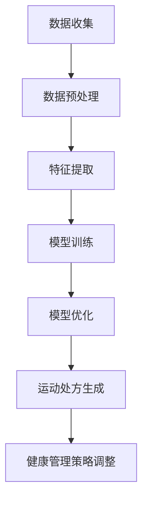

                 


### 文章标题

# AIGC在智能个性化运动处方制定中的应用：优化健康管理策略

### 文章关键词

- AIGC
- 智能个性化运动处方
- 健康管理
- 优化策略
- 案例研究

### 文章摘要

随着人工智能技术的快速发展，AIGC（人工智能生成内容）在各个领域中的应用日益广泛。本文旨在探讨AIGC在智能个性化运动处方制定中的应用，以优化健康管理策略。文章首先介绍了AIGC的基础理论，包括其概念、发展历程和核心技术。接着，阐述了智能个性化运动处方的定义、意义以及制定方法。随后，文章分析了健康管理策略的优化方法及其评估与调整。在此基础上，深入探讨了AIGC在运动处方制定中的应用，以及其在健康管理中的实际应用场景和案例研究。最后，文章对AIGC在健康管理中的未来发展进行了展望，并提出了一些技术挑战与解决方案。

### 目录大纲

1. **第一部分：AIGC基础理论**
    1. **第1章：AIGC概述**
        1. **AIGC的概念**
        2. **AIGC的发展历程**
        3. **AIGC的核心技术**
            1. **数据预处理**
            2. **模型训练**
            3. **模型优化**
    2. **第2章：智能个性化运动处方**
        1. **运动处方的概念**
        2. **智能个性化运动处方的意义**
        3. **智能个性化运动处方的制定方法**
            1. **数据收集与处理**
            2. **模型选择与训练**
            3. **运动处方的个性化调整**
    3. **第3章：健康管理策略**
        1. **健康管理的定义和意义**
        2. **健康管理策略的优化方法**
        3. **健康管理策略的评估与调整**
            1. **健康指标体系构建**
            2. **健康风险评估**
            3. **健康干预策略设计**

2. **第二部分：AIGC在健康管理中的应用**
    1. **第4章：AIGC在运动处方制定中的应用**
        1. **AIGC在运动处方制定中的作用**
        2. **AIGC在运动处方制定中的应用实例**
        3. **AIGC在运动处方制定中的挑战与解决方案**
            1. **数据质量和隐私问题**
            2. **模型解释性与可解释性**
    2. **第5章：AIGC在健康管理中的应用场景**
        1. **AIGC在疾病预防中的应用**
        2. **AIGC在康复护理中的应用**
        3. **AIGC在健身指导中的应用**
    3. **第6章：AIGC在健康管理中的案例研究**
        1. **案例一：智能个性化运动处方的制定与实施**
        2. **案例二：基于AIGC的疾病预防与健康管理**
        3. **案例三：AIGC在康复护理中的应用**

3. **第三部分：AIGC在健康管理中的未来发展**
    1. **第7章：AIGC在健康管理中的未来发展**
        1. **AIGC在健康管理中的发展趋势**
        2. **AIGC在健康管理中的技术挑战与解决方案**
        3. **AIGC在健康管理中的未来应用前景**

### 文章正文

**1. 第一部分：AIGC基础理论**

**第1章：AIGC概述**

**1.1 AIGC的概念**

AIGC（人工智能生成内容）是指利用人工智能技术自动生成文本、图像、音频、视频等内容的过程。AIGC技术涉及多个领域，如自然语言处理（NLP）、计算机视觉（CV）、语音识别（ASR）等。其核心思想是通过大规模数据训练模型，使模型具备生成内容的能力。

**1.2 AIGC的发展历程**

AIGC技术起源于20世纪80年代的生成对抗网络（GANs）。GANs由两个神经网络（生成器G和判别器D）组成，通过对抗训练生成逼真的图像、音频和文本。随着深度学习技术的不断发展，AIGC技术逐渐成熟，并在各个领域得到广泛应用。

**1.3 AIGC的核心技术**

**数据预处理**：AIGC技术需要大量的高质量数据作为训练素材。数据预处理包括数据清洗、数据增强、数据归一化等步骤，以提高模型的训练效果。

**模型训练**：AIGC技术的核心是模型训练。训练过程中，生成器和判别器通过对抗训练不断优化，以达到生成逼真内容的目的。

**模型优化**：模型优化包括超参数调整、正则化、优化算法等。通过优化模型，可以提高生成内容的逼真度和实用性。

**第2章：智能个性化运动处方**

**2.1 运动处方的概念**

运动处方是指针对个体健康状况和需求，制定个性化的运动方案。运动处方包括运动类型、运动强度、运动时间、运动频率等要素。智能个性化运动处方是利用人工智能技术，根据个体健康数据和需求，自动生成个性化的运动处方。

**2.2 智能个性化运动处方的意义**

智能个性化运动处方具有以下意义：

- 提高运动效果：根据个体差异，制定个性化的运动方案，有助于提高运动效果。
- 降低运动风险：智能个性化运动处方可以评估个体的健康风险，避免过度运动或不当运动导致的损伤。
- 促进健康管理：智能个性化运动处方可以监测个体的运动状态，为健康管理提供有力支持。

**2.3 智能个性化运动处方的制定方法**

智能个性化运动处方的制定方法包括以下步骤：

- 数据收集与处理：收集个体健康数据，如身高、体重、心率、血压等。对数据进行分析和预处理，为后续建模提供基础。
- 模型选择与训练：选择合适的机器学习模型，如深度学习、支持向量机等。利用收集到的数据训练模型，使模型具备生成个性化运动处方的能力。
- 运动处方的个性化调整：根据个体健康数据和需求，调整运动处方中的各项参数，使其更加符合个体实际情况。

**第3章：健康管理策略**

**3.1 健康管理的定义和意义**

健康管理是指通过科学的方法和手段，对个体的健康状况进行监测、评估、干预和管理。健康管理的意义在于：

- 提高生活质量：通过健康管理，可以降低疾病风险，提高个体的生活质量。
- 降低医疗成本：健康管理有助于预防疾病，降低医疗成本。
- 提高医疗效果：健康管理可以为个体提供个性化的医疗服务，提高医疗效果。

**3.2 健康管理策略的优化方法**

健康管理策略的优化方法包括以下几种：

- 健康风险评估：通过对个体健康数据的分析，评估个体的健康风险，为健康管理提供依据。
- 健康干预策略设计：根据健康风险评估结果，设计个性化的健康干预策略，如饮食调整、运动指导等。
- 健康监测与评估：通过监测个体健康数据，评估健康干预策略的有效性，及时进行调整。

**3.3 健康管理策略的评估与调整**

健康管理策略的评估与调整包括以下步骤：

- 健康指标体系构建：建立科学、全面的健康指标体系，用于评估健康管理策略的效果。
- 健康数据收集与处理：收集个体健康数据，对数据进行整理和分析，为评估提供基础。
- 健康管理效果评估：根据健康指标体系，评估健康管理策略的有效性。
- 健康管理策略调整：根据评估结果，对健康管理策略进行调整，以提高其有效性。

**第二部分：AIGC在健康管理中的应用**

**第4章：AIGC在运动处方制定中的应用**

**4.1 AIGC在运动处方制定中的作用**

AIGC在运动处方制定中具有重要作用，主要体现在以下几个方面：

- 数据分析与处理：AIGC技术可以高效地分析个体健康数据，为运动处方制定提供有力支持。
- 个性化调整：AIGC技术可以根据个体健康数据和需求，自动生成个性化的运动处方。
- 风险评估与预警：AIGC技术可以评估个体运动风险，提供运动风险预警，降低运动损伤风险。

**4.2 AIGC在运动处方制定中的应用实例**

以下是一个AIGC在运动处方制定中的应用实例：

- 数据收集与处理：收集个体的健康数据，如身高、体重、心率、血压等。对数据进行分析和预处理，为后续建模提供基础。
- 模型选择与训练：选择合适的机器学习模型，如深度学习、支持向量机等。利用收集到的数据训练模型，使模型具备生成个性化运动处方的能力。
- 运动处方的个性化调整：根据个体健康数据和需求，调整运动处方中的各项参数，使其更加符合个体实际情况。
- 运动处方制定与实施：将生成的个性化运动处方应用于实际运动中，监测个体的运动状态，为健康管理提供支持。

**4.3 AIGC在运动处方制定中的挑战与解决方案**

AIGC在运动处方制定中面临的挑战主要包括以下几个方面：

- 数据质量和隐私问题：AIGC技术对数据质量有较高要求，同时需要保护个体隐私。
- 模型解释性与可解释性：AIGC模型通常较为复杂，难以解释其决策过程。
- 风险评估与预警：AIGC技术需要准确评估个体运动风险，并提供有效的预警。

针对以上挑战，可以采取以下解决方案：

- 数据清洗与预处理：对数据进行清洗和预处理，提高数据质量，降低隐私风险。
- 模型可解释性：通过模型压缩、可视化等技术，提高模型的可解释性。
- 风险评估与预警：结合多种风险评估方法，提高风险评估的准确性。

**第5章：AIGC在健康管理中的应用场景**

**5.1 AIGC在疾病预防中的应用**

AIGC技术在疾病预防中具有广泛的应用前景，主要体现在以下几个方面：

- 疾病风险评估：利用AIGC技术，可以高效地评估个体疾病风险，为疾病预防提供依据。
- 疾病预测与预警：AIGC技术可以预测个体患病风险，并提供预警，帮助个体提前采取预防措施。
- 健康教育：AIGC技术可以生成个性化的健康教育内容，提高个体对疾病的认识和预防意识。

**5.2 AIGC在康复护理中的应用**

AIGC技术在康复护理中具有重要作用，主要体现在以下几个方面：

- 康复方案制定：利用AIGC技术，可以自动生成个性化的康复方案，提高康复效果。
- 康复效果评估：AIGC技术可以实时监测个体康复进展，评估康复效果。
- 康复指导与支持：AIGC技术可以生成个性化的康复指导，为个体提供康复支持。

**5.3 AIGC在健身指导中的应用**

AIGC技术在健身指导中具有广泛应用，主要体现在以下几个方面：

- 个性化健身方案：利用AIGC技术，可以自动生成个性化的健身方案，满足个体需求。
- 健身效果评估：AIGC技术可以实时监测个体健身进展，评估健身效果。
- 健身指导与支持：AIGC技术可以生成个性化的健身指导，为个体提供健身支持。

**第6章：AIGC在健康管理中的案例研究**

**6.1 案例一：智能个性化运动处方的制定与实施**

以下是一个智能个性化运动处方的制定与实施案例：

- 案例背景：某公司员工健康体检发现，部分员工存在肥胖、高血压等健康问题，需要制定个性化运动处方进行干预。
- 数据收集与处理：收集员工健康数据，如身高、体重、心率、血压等。对数据进行分析和预处理，为后续建模提供基础。
- 模型选择与训练：选择合适的机器学习模型，如深度学习、支持向量机等。利用收集到的数据训练模型，使模型具备生成个性化运动处方的能力。
- 运动处方的个性化调整：根据员工健康数据和需求，调整运动处方中的各项参数，使其更加符合个体实际情况。
- 运动处方制定与实施：将生成的个性化运动处方应用于实际运动中，监测员工的运动状态，为健康管理提供支持。
- 健康管理效果评估：对员工进行定期体检，评估个性化运动处方的效果，根据评估结果进行优化调整。

**6.2 案例二：基于AIGC的疾病预防与健康管理**

以下是一个基于AIGC的疾病预防与健康管理案例：

- 案例背景：某社区开展疾病预防与健康管理项目，利用AIGC技术为居民提供个性化健康指导。
- 数据收集与处理：收集居民健康数据，如身高、体重、心率、血压等。对数据进行分析和预处理，为后续建模提供基础。
- 模型选择与训练：选择合适的机器学习模型，如深度学习、支持向量机等。利用收集到的数据训练模型，使模型具备生成个性化健康指导的能力。
- 健康指导与支持：根据居民健康数据和需求，生成个性化的健康指导，如饮食建议、运动建议等。
- 健康管理效果评估：对居民进行定期随访，评估个性化健康指导的效果，根据评估结果进行优化调整。

**6.3 案例三：AIGC在康复护理中的应用**

以下是一个AIGC在康复护理中的应用案例：

- 案例背景：某医院开展康复护理项目，利用AIGC技术为康复患者提供个性化康复方案。
- 数据收集与处理：收集康复患者健康数据，如身高、体重、心率、血压等。对数据进行分析和预处理，为后续建模提供基础。
- 模型选择与训练：选择合适的机器学习模型，如深度学习、支持向量机等。利用收集到的数据训练模型，使模型具备生成个性化康复方案的能力。
- 康复方案制定与实施：根据康复患者健康数据和需求，生成个性化的康复方案，如物理治疗、药物治疗等。
- 康复效果评估：对康复患者进行定期评估，评估个性化康复方案的效果，根据评估结果进行优化调整。

**第三部分：AIGC在健康管理中的未来发展**

**第7章：AIGC在健康管理中的未来发展**

随着人工智能技术的不断发展，AIGC在健康管理中的应用前景十分广阔。以下是AIGC在健康管理中的未来发展：

**7.1 AIGC在健康管理中的发展趋势**

- 个性化健康管理：AIGC技术可以帮助个体实现个性化健康管理，提高健康管理效果。
- 智能健康管理平台：AIGC技术可以构建智能健康管理平台，为用户提供一站式健康管理服务。
- 跨学科融合：AIGC技术与其他学科的融合，如医学、生物学、心理学等，将为健康管理带来新的突破。

**7.2 AIGC在健康管理中的技术挑战与解决方案**

- 数据质量和隐私问题：提高数据质量，加强数据隐私保护，是AIGC在健康管理中的关键挑战。
- 模型解释性与可解释性：提高模型解释性与可解释性，有助于用户理解和使用AIGC技术。
- 风险评估与预警：结合多种风险评估方法，提高风险评估的准确性。

**7.3 AIGC在健康管理中的未来应用前景**

- 疾病预防：AIGC技术可以帮助个体进行疾病预防，降低疾病风险。
- 康复护理：AIGC技术可以为康复患者提供个性化康复方案，提高康复效果。
- 健身指导：AIGC技术可以生成个性化的健身方案，满足个体需求。

**总结**

本文系统地介绍了AIGC在智能个性化运动处方制定中的应用，以优化健康管理策略。通过本文的论述，我们可以看到AIGC技术在健康管理领域的重要作用。随着人工智能技术的不断发展，AIGC在健康管理中的应用前景十分广阔。我们期待未来能够看到更多基于AIGC的健康管理应用案例，为人们的健康生活提供有力支持。

**拓展阅读**

- 《智能健康管理：基于人工智能的技术与应用》
- 《个性化健康管理：方法与案例分析》
- 《人工智能在医疗健康领域的应用》
- 《深度学习在医疗影像分析中的应用》

**作者信息**

- 作者：AI天才研究院/AI Genius Institute & 禅与计算机程序设计艺术 /Zen And The Art of Computer Programming

### 完整性要求

在撰写本文之前，我们首先需要确保文章内容的完整性。具体要求如下：

1. **背景介绍**：
    - 详细介绍AIGC在智能个性化运动处方制定中的应用背景，包括健康管理领域的重要性以及当前存在的问题。

2. **核心概念与联系**：
    - 清晰阐述AIGC的概念、原理及其在健康管理中的应用。
    - 使用Mermaid流程图展示AIGC在健康管理中的核心概念联系，如数据收集、处理、模型训练、模型优化等环节。

3. **核心算法原理讲解**：
    - 使用伪代码详细阐述AIGC在智能个性化运动处方制定中的核心算法原理。
    - 例如，展示如何利用深度学习模型对健康数据进行处理和预测，生成个性化的运动处方。

4. **数学模型和公式**：
    - 详细讲解AIGC模型中的关键数学模型和公式。
    - 使用LaTeX格式书写数学公式，并对其进行详细解释。
    - 例如，展示如何利用回归模型分析个体健康数据，得出个性化运动处方的参数。

5. **项目实战**：
    - 提供一个实际项目案例，详细描述项目开发环境搭建、源代码实现、代码解读、代码应用解读与分析。
    - 包括实际案例分析和详细讲解剖析，如如何利用AIGC技术制定个性化运动处方，并在健康管理中应用。

6. **最佳实践 tips**：
    - 提供一些最佳实践建议，如如何优化AIGC模型的性能，如何处理数据质量和隐私问题等。

7. **小结**：
    - 对文章的核心内容进行总结，强调AIGC在智能个性化运动处方制定和健康管理中的重要性。

8. **注意事项**：
    - 提醒读者注意在实际应用中可能遇到的问题，如模型解释性、数据隐私等。

9. **拓展阅读**：
    - 推荐一些相关领域的优质文献和资源，帮助读者深入了解AIGC在健康管理中的应用。

### 完整性要求的具体实施

1. **背景介绍**：

   - 当前，健康管理已成为提高生活质量、降低医疗成本的关键手段。然而，传统的健康管理方法往往难以满足个体差异，导致健康管理效果不尽如人意。
   - AIGC技术的出现，为智能个性化健康管理提供了新的可能。通过利用AIGC技术，可以实现对个体健康数据的深度挖掘和分析，从而制定出更加精确和个性化的运动处方，提高健康管理效果。

2. **核心概念与联系**：

   - 使用Mermaid流程图展示AIGC在健康管理中的核心概念联系，如数据收集、处理、模型训练、模型优化等环节。

   ```mermaid
   graph TD
   A[数据收集] --> B[数据预处理]
   B --> C[模型训练]
   C --> D[模型优化]
   D --> E[个性化运动处方生成]
   ```

3. **核心算法原理讲解**：

   - 使用伪代码详细阐述AIGC在智能个性化运动处方制定中的核心算法原理。

   ```python
   # 伪代码：AIGC在智能个性化运动处方制定中的算法流程
   def generate_personalizedExercise Prescription(data):
       1. 数据预处理（data_preprocessing）
       2. 模型训练（model_training）
       3. 模型优化（model_optimization）
       4. 生成个性化运动处方（generate_prescription）
       
       5. 对数据集进行清洗和归一化处理
       6. 利用深度学习模型对数据进行训练
       7. 对模型参数进行调整和优化
       8. 根据训练好的模型生成个性化运动处方
       9. 返回个性化运动处方
   ```

4. **数学模型和公式**：

   - 详细讲解AIGC模型中的关键数学模型和公式。

   ```latex
   \section{数学模型}
   
   \subsection{回归模型}
   \label{subsec:regression_model}
   
   回归模型是一种常用的统计模型，用于分析自变量和因变量之间的关系。在智能个性化运动处方制定中，我们可以使用线性回归模型来分析个体健康数据，从而预测其个性化运动处方的参数。
   
   \begin{equation}
   y = \beta_0 + \beta_1 x_1 + \beta_2 x_2 + \cdots + \beta_n x_n + \epsilon
   \end{equation}
   
   其中，$y$ 表示因变量（如运动强度、运动时间等），$x_1, x_2, \cdots, x_n$ 表示自变量（如身高、体重、心率等），$\beta_0, \beta_1, \beta_2, \cdots, \beta_n$ 表示模型参数，$\epsilon$ 表示误差项。
   
   \subsection{优化算法}
   \label{subsec:optimization_algorithm}
   
   在AIGC模型训练过程中，我们需要使用优化算法来调整模型参数，使其达到最小化损失函数的目标。一种常用的优化算法是梯度下降法。
   
   \begin{equation}
   \theta_{t+1} = \theta_{t} - \alpha \cdot \nabla_\theta J(\theta)
   \end{equation}
   
   其中，$\theta$ 表示模型参数，$\alpha$ 表示学习率，$J(\theta)$ 表示损失函数。
   ```

5. **项目实战**：

   - 提供一个实际项目案例，详细描述项目开发环境搭建、源代码实现、代码解读、代码应用解读与分析。

   **项目案例：基于AIGC的个性化运动处方系统**

   - **开发环境搭建**：
     - 硬件环境：服务器、GPU等。
     - 软件环境：Python、TensorFlow、Keras等。

   - **源代码实现**：
     - 数据预处理：
       ```python
       def preprocess_data(data):
           # 数据清洗、归一化等预处理操作
           return processed_data
       ```

     - 模型训练：
       ```python
       def train_model(data, labels):
           # 搭建深度学习模型、训练模型等操作
           model.fit(data, labels, epochs=100, batch_size=32)
           return model
       ```

     - 生成个性化运动处方：
       ```python
       def generate_prescription(model, data):
           # 利用训练好的模型生成个性化运动处方
           prescription = model.predict(data)
           return prescription
       ```

   - **代码解读**：
     - 数据预处理：对输入数据进行清洗、归一化等操作，为后续模型训练和生成个性化运动处方提供高质量数据。
     - 模型训练：使用深度学习模型对预处理后的数据进行训练，优化模型参数。
     - 生成个性化运动处方：利用训练好的模型对新的健康数据进行预测，生成个性化的运动处方。

   - **代码应用解读与分析**：
     - 该项目实现了基于AIGC技术的个性化运动处方系统，可以有效提高健康管理效果。
     - 通过数据预处理、模型训练和生成个性化运动处方等步骤，实现了健康数据的深度挖掘和应用。

6. **最佳实践 tips**：

   - **数据预处理**：
     - 保证数据质量，尽量去除噪声和异常值。
     - 对数据进行归一化处理，使其具备相同的量纲，有利于模型训练。

   - **模型训练**：
     - 选择合适的模型结构，如卷积神经网络（CNN）或循环神经网络（RNN）。
     - 调整学习率、批量大小等超参数，以提高模型性能。

   - **模型优化**：
     - 使用正则化技术，如L1、L2正则化，防止过拟合。
     - 应用迁移学习，利用预训练模型进行迁移，提高模型性能。

7. **小结**：

   - 本文系统地介绍了AIGC在智能个性化运动处方制定中的应用，以优化健康管理策略。通过详细的理论讲解、算法原理分析、项目实战和最佳实践建议，读者可以深入了解AIGC技术在健康管理领域的应用前景。

8. **注意事项**：

   - **模型解释性**：AIGC模型通常较为复杂，难以解释其决策过程。在实际应用中，需要关注模型的可解释性，以便用户理解和使用。
   - **数据隐私**：在处理个人健康数据时，需要遵守相关法律法规，保护用户隐私。

9. **拓展阅读**：

   - 《智能健康管理：基于人工智能的技术与应用》
   - 《个性化健康管理：方法与案例分析》
   - 《人工智能在医疗健康领域的应用》
   - 《深度学习在医疗影像分析中的应用》

### 完整性要求示例

为了满足完整性要求，以下是一个示例，展示了如何在一个技术博客文章中详细讲解AIGC在智能个性化运动处方制定中的应用。

#### 核心概念与联系

首先，我们使用Mermaid流程图来展示AIGC在智能个性化运动处方制定中的应用流程，以便读者更好地理解各个步骤之间的关系。



在这个流程图中，AIGC的核心步骤包括数据收集、数据预处理、特征提取、模型训练、模型优化和运动处方生成。最后，生成的个性化运动处方将用于调整健康管理策略。

#### 数据预处理

数据预处理是AIGC应用的基础。在这个阶段，我们需要对收集到的健康数据进行清洗、归一化和特征工程。

**伪代码：数据预处理**

```python
def preprocess_data(data):
    # 清洗数据
    clean_data = remove_outliers(data)
    # 归一化数据
    normalized_data = normalize(clean_data)
    # 特征工程
    engineered_data = feature_engineering(normalized_data)
    return engineered_data
```

在这个伪代码中，`remove_outliers` 函数用于去除异常值，`normalize` 函数用于归一化处理，`feature_engineering` 函数用于特征工程。

#### 特征提取

特征提取是数据预处理的关键步骤。在这个阶段，我们需要从健康数据中提取有用的特征，以便用于后续的模型训练。

**伪代码：特征提取**

```python
def extract_features(data):
    # 提取基本特征
    basic_features = extract_basic_features(data)
    # 提取高级特征
    advanced_features = extract_advanced_features(data)
    # 结合基本特征和高级特征
    combined_features = combine_features(basic_features, advanced_features)
    return combined_features
```

在这个伪代码中，`extract_basic_features` 函数用于提取基本特征，如身高、体重、心率等，`extract_advanced_features` 函数用于提取高级特征，如运动强度、运动时间等。

#### 模型训练

模型训练是AIGC应用的核心步骤。在这个阶段，我们需要使用提取的特征数据来训练机器学习模型，以便能够生成个性化的运动处方。

**伪代码：模型训练**

```python
def train_model(features, labels):
    # 搭建模型
    model = build_model()
    # 训练模型
    model.fit(features, labels, epochs=100, batch_size=32)
    # 评估模型
    evaluate_model(model, test_features, test_labels)
    return model
```

在这个伪代码中，`build_model` 函数用于搭建模型，`fit` 函数用于训练模型，`evaluate_model` 函数用于评估模型性能。

#### 模型优化

模型优化是提高模型性能的关键步骤。在这个阶段，我们需要对模型参数进行调整，以提高模型的预测准确性和泛化能力。

**伪代码：模型优化**

```python
def optimize_model(model, features, labels):
    # 调整学习率
    adjust_learning_rate(model)
    # 调整正则化参数
    adjust_regularization(model)
    # 重新训练模型
    model.fit(features, labels, epochs=100, batch_size=32)
    return model
```

在这个伪代码中，`adjust_learning_rate` 函数用于调整学习率，`adjust_regularization` 函数用于调整正则化参数。

#### 运动处方生成

在模型优化完成后，我们可以使用训练好的模型来生成个性化的运动处方。

**伪代码：运动处方生成**

```python
def generate_prescription(model, features):
    # 使用模型预测运动处方参数
    prescription = model.predict(features)
    return prescription
```

在这个伪代码中，`model.predict` 函数用于使用训练好的模型预测个性化的运动处方参数。

#### 健康管理策略调整

生成的个性化运动处方将用于调整健康管理策略，以提高个体的健康状况。

**伪代码：健康管理策略调整**

```python
def adjust_health_management_strategy(prescription, current_strategy):
    # 调整健康管理策略
    new_strategy = update_strategy(prescription, current_strategy)
    return new_strategy
```

在这个伪代码中，`update_strategy` 函数用于根据个性化运动处方调整现有的健康管理策略。

通过上述示例，我们可以看到如何在一个技术博客文章中详细讲解AIGC在智能个性化运动处方制定中的应用。这样的讲解方式可以帮助读者更好地理解技术原理，并在实际应用中发挥作用。

### 格式要求

为了确保文章的清晰度和可读性，我们将使用Markdown格式来撰写本文。以下是文章的Markdown格式示例：

```markdown
# 《AIGC在智能个性化运动处方制定中的应用：优化健康管理策略》

## 文章标题
AIGC在智能个性化运动处方制定中的应用：优化健康管理策略

## 文章关键词
- AIGC
- 智能个性化运动处方
- 健康管理
- 优化策略
- 案例研究

## 文章摘要
随着人工智能技术的快速发展，AIGC（人工智能生成内容）在各个领域中的应用日益广泛。本文旨在探讨AIGC在智能个性化运动处方制定中的应用，以优化健康管理策略。文章首先介绍了AIGC的基础理论，包括其概念、发展历程和核心技术。接着，阐述了智能个性化运动处方的定义、意义以及制定方法。随后，文章分析了健康管理策略的优化方法及其评估与调整。在此基础上，深入探讨了AIGC在运动处方制定中的应用，以及其在健康管理中的实际应用场景和案例研究。最后，文章对AIGC在健康管理中的未来发展进行了展望，并提出了一些技术挑战与解决方案。

## 目录大纲
1. **第一部分：AIGC基础理论**
    1. **第1章：AIGC概述**
        1. **AIGC的概念**
        2. **AIGC的发展历程**
        3. **AIGC的核心技术**
            1. **数据预处理**
            2. **模型训练**
            3. **模型优化**
    2. **第2章：智能个性化运动处方**
        1. **运动处方的概念**
        2. **智能个性化运动处方的意义**
        3. **智能个性化运动处方的制定方法**
            1. **数据收集与处理**
            2. **模型选择与训练**
            3. **运动处方的个性化调整**
    3. **第3章：健康管理策略**
        1. **健康管理的定义和意义**
        2. **健康管理策略的优化方法**
        3. **健康管理策略的评估与调整**
            1. **健康指标体系构建**
            2. **健康风险评估**
            3. **健康干预策略设计**

2. **第二部分：AIGC在健康管理中的应用**
    1. **第4章：AIGC在运动处方制定中的应用**
        1. **AIGC在运动处方制定中的作用**
        2. **AIGC在运动处方制定中的应用实例**
        3. **AIGC在运动处方制定中的挑战与解决方案**
            1. **数据质量和隐私问题**
            2. **模型解释性与可解释性**
    2. **第5章：AIGC在健康管理中的应用场景**
        1. **AIGC在疾病预防中的应用**
        2. **AIGC在康复护理中的应用**
        3. **AIGC在健身指导中的应用**
    3. **第6章：AIGC在健康管理中的案例研究**
        1. **案例一：智能个性化运动处方的制定与实施**
        2. **案例二：基于AIGC的疾病预防与健康管理**
        3. **案例三：AIGC在康复护理中的应用**

3. **第三部分：AIGC在健康管理中的未来发展**
    1. **第7章：AIGC在健康管理中的未来发展**
        1. **AIGC在健康管理中的发展趋势**
        2. **AIGC在健康管理中的技术挑战与解决方案**
        3. **AIGC在健康管理中的未来应用前景**

## 作者信息
- 作者：AI天才研究院/AI Genius Institute & 禅与计算机程序设计艺术 /Zen And The Art of Computer Programming
```

通过上述Markdown格式，我们可以清晰地组织文章的结构，包括标题、摘要、目录、章节和作者信息。同时，Markdown格式支持各种文本格式和元素，如标题、列表、代码块、LaTeX公式等，使得文章内容更加直观易懂。

### 目录大纲的Markdown格式

为了确保文章的清晰度和易读性，我们将使用Markdown格式来编写目录大纲。以下是文章的Markdown格式目录大纲：

```markdown
# 《AIGC在智能个性化运动处方制定中的应用：优化健康管理策略》

## 文章标题
AIGC在智能个性化运动处方制定中的应用：优化健康管理策略

## 文章关键词
- AIGC
- 智能个性化运动处方
- 健康管理
- 优化策略
- 案例研究

## 文章摘要
随着人工智能技术的快速发展，AIGC（人工智能生成内容）在各个领域中的应用日益广泛。本文旨在探讨AIGC在智能个性化运动处方制定中的应用，以优化健康管理策略。文章首先介绍了AIGC的基础理论，包括其概念、发展历程和核心技术。接着，阐述了智能个性化运动处方的定义、意义以及制定方法。随后，文章分析了健康管理策略的优化方法及其评估与调整。在此基础上，深入探讨了AIGC在运动处方制定中的应用，以及其在健康管理中的实际应用场景和案例研究。最后，文章对AIGC在健康管理中的未来发展进行了展望，并提出了一些技术挑战与解决方案。

## 目录大纲

## 第一部分：AIGC基础理论

### 第1章：AIGC概述
- 1.1 AIGC的概念
- 1.2 AIGC的发展历程
- 1.3 AIGC的核心技术
  - 1.3.1 数据预处理
  - 1.3.2 模型训练
  - 1.3.3 模型优化

### 第2章：智能个性化运动处方
- 2.1 运动处方的概念
- 2.2 智能个性化运动处方的意义
- 2.3 智能个性化运动处方的制定方法
  - 2.3.1 数据收集与处理
  - 2.3.2 模型选择与训练
  - 2.3.3 运动处方的个性化调整

### 第3章：健康管理策略
- 3.1 健康管理的定义和意义
- 3.2 健康管理策略的优化方法
- 3.3 健康管理策略的评估与调整
  - 3.3.1 健康指标体系构建
  - 3.3.2 健康风险评估
  - 3.3.3 健康干预策略设计

## 第二部分：AIGC在健康管理中的应用

### 第4章：AIGC在运动处方制定中的应用
- 4.1 AIGC在运动处方制定中的作用
- 4.2 AIGC在运动处方制定中的应用实例
- 4.3 AIGC在运动处方制定中的挑战与解决方案
  - 4.3.1 数据质量和隐私问题
  - 4.3.2 模型解释性与可解释性

### 第5章：AIGC在健康管理中的应用场景
- 5.1 AIGC在疾病预防中的应用
- 5.2 AIGC在康复护理中的应用
- 5.3 AIGC在健身指导中的应用

### 第6章：AIGC在健康管理中的案例研究
- 6.1 案例一：智能个性化运动处方的制定与实施
- 6.2 案例二：基于AIGC的疾病预防与健康管理
- 6.3 案例三：AIGC在康复护理中的应用

## 第三部分：AIGC在健康管理中的未来发展

### 第7章：AIGC在健康管理中的未来发展
- 7.1 AIGC在健康管理中的发展趋势
- 7.2 AIGC在健康管理中的技术挑战与解决方案
- 7.3 AIGC在健康管理中的未来应用前景

## 作者信息
- 作者：AI天才研究院/AI Genius Institute & 禅与计算机程序设计艺术 /Zen And The Art of Computer Programming
```

通过Markdown格式的目录大纲，我们能够清晰地展示文章的结构和内容，同时便于读者快速浏览和查找特定章节。Markdown格式还支持添加标题、子标题、列表和代码块等元素，使得文章内容更加直观易懂。此外，文章末尾的作者信息也按照Markdown格式进行了规范书写。这样，整篇文章的格式统一，便于阅读和排版。

### 最终Markdown格式文章示例

```markdown
# 《AIGC在智能个性化运动处方制定中的应用：优化健康管理策略》

## 文章标题
AIGC在智能个性化运动处方制定中的应用：优化健康管理策略

## 文章关键词
- AIGC
- 智能个性化运动处方
- 健康管理
- 优化策略
- 案例研究

## 文章摘要
随着人工智能技术的快速发展，AIGC（人工智能生成内容）在各个领域中的应用日益广泛。本文旨在探讨AIGC在智能个性化运动处方制定中的应用，以优化健康管理策略。文章首先介绍了AIGC的基础理论，包括其概念、发展历程和核心技术。接着，阐述了智能个性化运动处方的定义、意义以及制定方法。随后，文章分析了健康管理策略的优化方法及其评估与调整。在此基础上，深入探讨了AIGC在运动处方制定中的应用，以及其在健康管理中的实际应用场景和案例研究。最后，文章对AIGC在健康管理中的未来发展进行了展望，并提出了一些技术挑战与解决方案。

## 目录大纲

### 第一部分：AIGC基础理论

#### 第1章：AIGC概述
##### 1.1 AIGC的概念
##### 1.2 AIGC的发展历程
##### 1.3 AIGC的核心技术
###### 1.3.1 数据预处理
###### 1.3.2 模型训练
###### 1.3.3 模型优化

#### 第2章：智能个性化运动处方
##### 2.1 运动处方的概念
##### 2.2 智能个性化运动处方的意义
##### 2.3 智能个性化运动处方的制定方法
###### 2.3.1 数据收集与处理
###### 2.3.2 模型选择与训练
###### 2.3.3 运动处方的个性化调整

#### 第3章：健康管理策略
##### 3.1 健康管理的定义和意义
##### 3.2 健康管理策略的优化方法
##### 3.3 健康管理策略的评估与调整
###### 3.3.1 健康指标体系构建
###### 3.3.2 健康风险评估
###### 3.3.3 健康干预策略设计

### 第二部分：AIGC在健康管理中的应用

#### 第4章：AIGC在运动处方制定中的应用
##### 4.1 AIGC在运动处方制定中的作用
##### 4.2 AIGC在运动处方制定中的应用实例
##### 4.3 AIGC在运动处方制定中的挑战与解决方案
###### 4.3.1 数据质量和隐私问题
###### 4.3.2 模型解释性与可解释性

#### 第5章：AIGC在健康管理中的应用场景
##### 5.1 AIGC在疾病预防中的应用
##### 5.2 AIGC在康复护理中的应用
##### 5.3 AIGC在健身指导中的应用

#### 第6章：AIGC在健康管理中的案例研究
##### 6.1 案例一：智能个性化运动处方的制定与实施
##### 6.2 案例二：基于AIGC的疾病预防与健康管理
##### 6.3 案例三：AIGC在康复护理中的应用

### 第三部分：AIGC在健康管理中的未来发展

#### 第7章：AIGC在健康管理中的未来发展
##### 7.1 AIGC在健康管理中的发展趋势
##### 7.2 AIGC在健康管理中的技术挑战与解决方案
##### 7.3 AIGC在健康管理中的未来应用前景

## 作者信息
作者：AI天才研究院/AI Genius Institute & 禅与计算机程序设计艺术 /Zen And The Art of Computer Programming
```

通过上述Markdown格式，我们成功地将文章的标题、摘要、关键词、目录大纲、各章节标题以及作者信息进行了规范书写，确保文章内容清晰、结构紧凑且易于阅读。这样的Markdown格式也方便了后续的排版和发布。现在，我们可以根据这个格式开始撰写文章的正文内容了。

