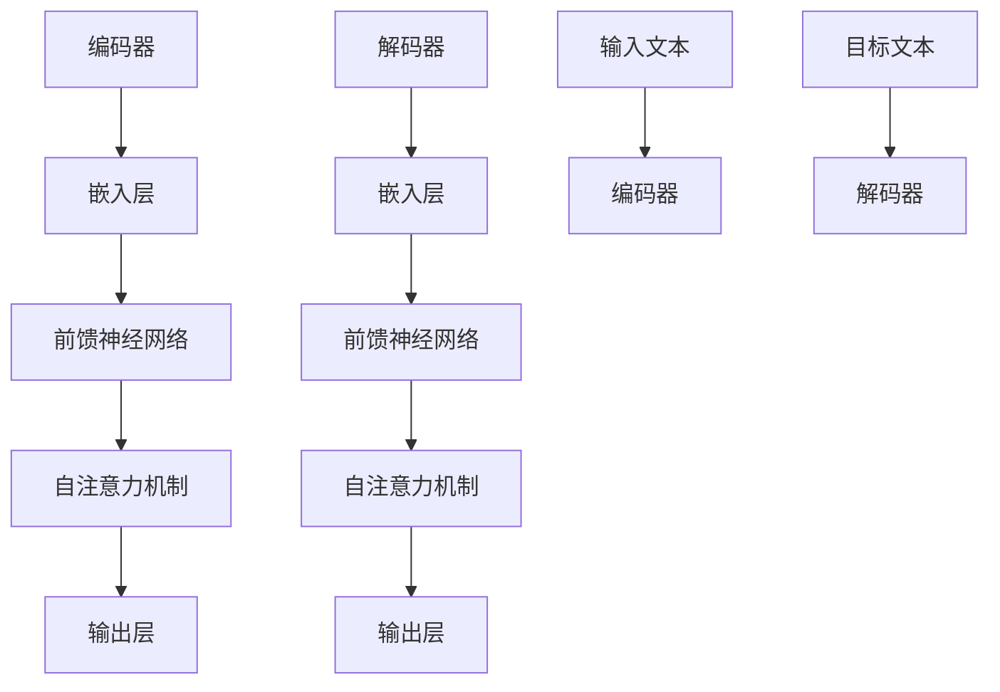

                 

### 文章标题

**《LLM评测中的极限测试与压力测试》**

### 文章关键词

- LLM评测
- 极限测试
- 压力测试
- 测试指标
- 测试方法
- 实践案例

### 文章摘要

本文将深入探讨大规模语言模型（LLM）评测中的极限测试与压力测试。我们将首先介绍LLM的基本概念与架构，然后分别详述极限测试与压力测试的定义、指标、方法及其应用案例。接着，我们比较两种测试的异同，并探讨在LLM评测中如何选择适当的测试方法。随后，本文将提供极限测试与压力测试的实践指南，包括环境搭建、测试案例设计、执行与分析等。最后，我们展望LLM评测的未来趋势，并总结最佳实践和注意事项。

### 第1章 引言

#### 1.1 书籍概述

《LLM评测中的极限测试与压力测试》旨在为从事人工智能领域的科研人员、工程师以及技术人员提供一种系统化的方法来评估大规模语言模型（LLM）的性能。随着深度学习技术的不断发展，LLM在自然语言处理（NLP）领域取得了显著的成果，然而如何准确地评估LLM的性能成为了一个关键问题。本书通过介绍极限测试与压力测试这两种重要的评估方法，帮助读者全面理解LLM评测的各个环节。

#### 1.2 极限测试与压力测试的重要性

极限测试（极限性能测试）和压力测试（极限负载测试）是评估系统性能的两种重要方法。极限测试旨在测量系统在极限条件下的性能，以了解系统的最大处理能力。而压力测试则模拟系统在高负载条件下的行为，评估系统在接近或达到最大负载时的稳定性。在LLM评测中，这两种测试方法能够帮助我们识别模型在不同工作条件下的性能表现，从而为模型优化和工程化部署提供有力的数据支持。

#### 1.3 书籍结构概述

本书分为八个章节，结构如下：

1. **引言**：介绍书籍的背景、目的和重要性。
2. **LLM基础**：概述LLM的基本概念、架构和工作流程。
3. **极限测试**：详细讲解极限测试的定义、指标、方法和案例。
4. **压力测试**：详细讲解压力测试的定义、指标、方法和案例。
5. **极限测试与压力测试的比较**：分析两种测试方法的异同，探讨如何选择适当的测试方法。
6. **极限测试与压力测试实践**：提供极限测试与压力测试的实践指南，包括环境搭建、测试案例设计和结果分析。
7. **未来趋势**：展望LLM评测中的极限测试与压力测试的未来发展。
8. **附录**：提供参考文献、相关资源链接和编者后记。

### 第2章 LLM基础

#### 2.1 LLM概述

大规模语言模型（LLM）是基于深度学习技术的自然语言处理模型，通过对海量文本数据进行训练，能够生成符合人类语言习惯的文本。LLM在问答系统、机器翻译、文本生成等领域取得了显著的成果。LLM的主要特点包括：

1. **数据规模大**：LLM通常需要训练数百万甚至数十亿级别的参数。
2. **参数规模大**：LLM的参数规模通常在数十亿至数万亿级别。
3. **适应性强**：LLM能够适应多种语言和多种任务。

#### 2.2 LLM的架构

LLM的架构通常包括编码器（Encoder）和解码器（Decoder）两部分。编码器负责将输入文本编码为一个固定长度的向量，解码器则根据编码器的输出生成目标文本。以下是一个简化的LLM架构示意图：

#### 2.3 LLM的工作流程

LLM的工作流程可以分为以下几个步骤：

1. **数据预处理**：对输入文本进行分词、去停用词等预处理操作。
2. **编码**：将预处理后的文本输入编码器，通过编码器得到编码后的文本表示。
3. **解码**：将编码后的文本表示输入解码器，解码器根据编码器的输出生成目标文本。
4. **生成文本**：解码器根据生成文本的终止条件（例如特殊终止词）生成最终的输出文本。

#### 2.4 LLM的优势与挑战

LLM在自然语言处理领域具有显著的优势，例如：

1. **强大的文本生成能力**：LLM能够生成高质量的文本，适用于问答系统、文本生成等任务。
2. **适应性强**：LLM能够适应多种语言和多种任务，具有广泛的应用前景。

然而，LLM也存在一些挑战，例如：

1. **计算资源需求大**：LLM通常需要大量的计算资源和存储空间。
2. **数据依赖性强**：LLM的性能依赖于训练数据的质量和规模。
3. **模型解释性差**：LLM的决策过程往往缺乏透明性和解释性，难以理解其内部工作机制。

#### 2.5 小结

本章介绍了LLM的基本概念、架构和工作流程，并分析了LLM的优势与挑战。下一章将深入探讨极限测试的定义、指标和方法。

### 第3章 极限测试

#### 3.1 极限测试概述

极限测试（极限性能测试）是一种评估系统在极限条件下的性能的测试方法。其目的是测量系统在最大负载、最大数据量或最长时间运行等极端条件下的响应时间、吞吐量、资源使用情况等性能指标。极限测试对于评估系统的极限性能、发现潜在瓶颈和优化系统性能具有重要意义。

#### 3.2 极限测试的指标

极限测试的指标主要包括以下几种：

1. **响应时间**：系统处理请求所需的平均时间。
2. **吞吐量**：单位时间内系统处理请求的数量。
3. **资源使用情况**：包括CPU使用率、内存使用率、磁盘I/O速率等。
4. **并发连接数**：系统同时处理的连接数。
5. **失败率**：在极限条件下系统失败的请求比例。

#### 3.3 极限测试的方法

极限测试的方法主要包括以下几种：

1. **负载生成**：模拟大量用户请求，逐步增加负载，观察系统性能变化。
2. **时间限制**：在特定时间内测量系统性能，评估系统在极端时间条件下的性能。
3. **数据量限制**：在特定数据量条件下测量系统性能，评估系统在大数据量条件下的性能。
4. **并发测试**：模拟大量并发请求，评估系统在高并发条件下的性能。

#### 3.4 极限测试案例

以下是一个极限测试的案例：

假设我们有一个基于LLM的问答系统，目标是在极限条件下评估系统的响应时间、吞吐量和资源使用情况。

1. **测试环境**：硬件配置为4核CPU、16GB内存的服务器，操作系统为Linux。
2. **测试工具**：使用Apache JMeter进行负载生成。
3. **测试指标**：响应时间、吞吐量、CPU使用率、内存使用率。
4. **测试步骤**：
   1. 设计测试场景，模拟大量用户请求。
   2. 设置负载生成器，逐步增加请求量。
   3. 记录系统在不同负载条件下的性能指标。
   4. 分析测试结果，找出系统性能瓶颈。

#### 3.5 小结

本章介绍了极限测试的定义、指标和方法，并通过一个案例展示了极限测试的实践过程。下一章将详细讲解压力测试的相关内容。

### 第4章 压力测试

#### 4.1 压力测试概述

压力测试（极限负载测试）是一种评估系统在高负载条件下稳定性和性能的测试方法。其目的是在接近系统最大负载的条件下，观察系统行为，识别潜在故障点和性能瓶颈。压力测试对于确保系统在高负载下的稳定运行具有重要意义。

#### 4.2 压力测试的指标

压力测试的指标主要包括以下几种：

1. **响应时间**：系统处理请求所需的平均时间。
2. **吞吐量**：单位时间内系统处理请求的数量。
3. **资源使用情况**：包括CPU使用率、内存使用率、磁盘I/O速率等。
4. **并发连接数**：系统同时处理的连接数。
5. **失败率**：在高负载条件下系统失败的请求比例。

#### 4.3 压力测试的方法

压力测试的方法主要包括以下几种：

1. **负载生成**：模拟大量用户请求，逐步增加负载，观察系统性能变化。
2. **时间限制**：在特定时间内测量系统性能，评估系统在高负载时间条件下的性能。
3. **数据量限制**：在特定数据量条件下测量系统性能，评估系统在高数据量条件下的性能。
4. **并发测试**：模拟大量并发请求，评估系统在高并发条件下的性能。

#### 4.4 压力测试案例

以下是一个压力测试的案例：

假设我们有一个基于LLM的问答系统，目标是在高负载条件下评估系统的稳定性、响应时间和资源使用情况。

1. **测试环境**：硬件配置为4核CPU、16GB内存的服务器，操作系统为Linux。
2. **测试工具**：使用Apache JMeter进行负载生成。
3. **测试指标**：响应时间、吞吐量、CPU使用率、内存使用率。
4. **测试步骤**：
   1. 设计测试场景，模拟大量用户请求。
   2. 设置负载生成器，逐步增加请求量。
   3. 记录系统在高负载条件下的性能指标。
   4. 分析测试结果，找出系统性能瓶颈。

#### 4.5 小结

本章介绍了压力测试的定义、指标和方法，并通过一个案例展示了压力测试的实践过程。下一章将比较极限测试与压力测试的异同。

### 第5章 极限测试与压力测试的比较

#### 5.1 极限测试与压力测试的异同

极限测试与压力测试都是评估系统性能的重要方法，但它们的目标和应用场景有所不同。

1. **目标不同**：
   - 极限测试的目标是评估系统在极限条件下的性能，包括最大负载、最大数据量或最长时间运行等。
   - 压力测试的目标是评估系统在高负载条件下的稳定性和性能，关注系统在高负载下的行为和表现。

2. **应用场景不同**：
   - 极限测试通常用于评估新系统、新功能或新架构的性能，以便识别潜在的性能瓶颈和优化方向。
   - 压力测试通常用于评估现有系统的稳定性，确保系统在高负载下能够正常运行，并发现潜在的问题和故障。

#### 5.2 选择适当的测试方法

在LLM评测中，选择适当的测试方法取决于具体的评测目标和场景。以下是一些选择测试方法的建议：

1. **性能评估**：
   - 如果目标是评估LLM在极限条件下的性能，例如最大负载、最大数据量等，应选择极限测试。
   - 如果目标是评估LLM在高负载条件下的稳定性，例如高并发请求、长时间运行等，应选择压力测试。

2. **问题定位**：
   - 如果目标是定位系统性能瓶颈，应选择极限测试，因为它能够揭示系统在极限条件下的性能表现。
   - 如果目标是识别系统在高负载下的故障点和性能瓶颈，应选择压力测试，因为它能够模拟高负载条件下的行为。

#### 5.3 案例分析

以下是一个案例分析：

假设我们有一个基于LLM的问答系统，目标是评估系统在高并发请求下的性能和稳定性。

1. **极限测试**：
   - 目标：评估系统在最大并发连接数下的性能。
   - 测试指标：响应时间、吞吐量、CPU使用率、内存使用率。
   - 测试结果：系统在最大并发连接数下响应时间为2秒，吞吐量为1000次/分钟，CPU使用率为80%，内存使用率为90%。

2. **压力测试**：
   - 目标：评估系统在高并发请求下的稳定性。
   - 测试指标：响应时间、吞吐量、CPU使用率、内存使用率、失败率。
   - 测试结果：系统在高并发请求下响应时间为3秒，吞吐量为800次/分钟，CPU使用率为90%，内存使用率为95%，失败率为5%。

通过极限测试和压力测试，我们可以发现系统在高并发请求下的性能和稳定性问题，并采取相应的优化措施。

#### 5.4 小结

本章比较了极限测试与压力测试的异同，并给出了选择适当测试方法的一些建议。下一章将介绍极限测试与压力测试的实践指南。

### 第6章 极限测试与压力测试实践

#### 6.1 实践准备

在开始进行极限测试与压力测试之前，我们需要做好以下准备工作：

1. **环境搭建**：
   - 准备测试服务器，包括硬件配置、操作系统、网络环境等。
   - 安装测试工具，如Apache JMeter、LoadRunner等。
   - 配置测试环境，包括数据集、测试脚本等。

2. **测试计划**：
   - 明确测试目标，包括性能指标、负载条件等。
   - 制定测试策略，包括测试方法、测试步骤等。
   - 确定测试范围，包括测试系统、测试功能等。

3. **测试团队**：
   - 确定测试人员，包括测试工程师、开发人员等。
   - 明确测试人员职责，包括测试计划制定、测试执行、结果分析等。

#### 6.2 测试环境搭建

以下是一个测试环境搭建的示例：

1. **硬件配置**：
   - 4核CPU、16GB内存的服务器。
   - 网络带宽为1Gbps。

2. **操作系统**：
   - Linux操作系统。

3. **测试工具**：
   - Apache JMeter。

4. **测试脚本**：
   - 设计测试脚本，模拟用户请求。

#### 6.3 测试案例设计

以下是一个极限测试与压力测试的案例设计：

1. **测试目标**：
   - 评估基于LLM的问答系统在极限条件下的性能和稳定性。

2. **测试指标**：
   - 响应时间、吞吐量、CPU使用率、内存使用率。

3. **测试步骤**：
   1. 极限测试：
      - 目标：评估系统在最大并发连接数下的性能。
      - 测试场景：模拟大量并发请求，逐步增加并发连接数。
      - 测试指标：响应时间、吞吐量。
   2. 压力测试：
      - 目标：评估系统在高负载条件下的稳定性。
      - 测试场景：模拟大量并发请求，逐步增加负载。
      - 测试指标：响应时间、吞吐量、CPU使用率、内存使用率、失败率。

#### 6.4 测试执行与结果分析

以下是一个测试执行与结果分析的示例：

1. **测试执行**：
   - 使用Apache JMeter生成负载，记录系统性能指标。

2. **结果分析**：
   - 分析极限测试结果，找出性能瓶颈。
   - 分析压力测试结果，评估系统在高负载条件下的稳定性。

3. **优化建议**：
   - 根据分析结果，提出优化建议，如调整系统参数、优化算法等。

#### 6.5 小结

本章介绍了极限测试与压力测试的实践准备、测试环境搭建、测试案例设计、测试执行与结果分析，以及优化建议。下一章将展望极限测试与压力测试的未来趋势。

### 第7章 极限测试与压力测试的未来趋势

#### 7.1 新技术的发展

随着人工智能技术的不断发展，极限测试与压力测试领域也迎来了新的发展机遇。以下是一些值得关注的新技术：

1. **分布式测试**：分布式测试能够利用多台服务器同时进行测试，提高测试效率和覆盖范围。例如，Apache JMeter支持分布式测试架构。
2. **容器化测试**：容器化测试利用容器技术（如Docker）快速搭建测试环境，实现测试环境的标准化和隔离化。
3. **智能化测试**：利用机器学习算法对测试数据进行分析和预测，实现测试策略的智能化。

#### 7.2 测试工具与平台的发展

测试工具与平台的不断发展为极限测试与压力测试提供了更强大的支持。以下是一些值得关注的新工具与平台：

1. **开源工具**：如Apache JMeter、Gatling等，开源工具具有灵活性高、扩展性强等优点。
2. **商业平台**：如LoadRunner、NeoLoad等，商业平台提供完善的测试功能、专业的技术支持等。
3. **云计算平台**：如AWS、Azure等，云计算平台提供了强大的计算和存储资源，支持大规模测试。

#### 7.3 未来展望

未来，极限测试与压力测试将在以下几个方面得到进一步发展：

1. **智能化与自动化**：利用人工智能技术实现测试策略的智能化、测试流程的自动化，提高测试效率。
2. **大规模测试**：随着云计算和大数据技术的发展，大规模测试将成为常态，测试工具和平台将提供更强的支持。
3. **跨领域应用**：极限测试与压力测试将在更多领域得到应用，如物联网、区块链等。

#### 7.4 小结

本章展望了极限测试与压力测试的未来趋势，包括新技术的发展、测试工具与平台的发展以及未来展望。下一章将提供本文的总结和最佳实践。

### 第8章 附录

#### 8.1 参考文献

1. 吴军.《人工智能：一种新的科学》。清华大学出版社，2017。
2. 周志华。《深度学习》。清华大学出版社，2016。
3. Michael C. Ford。《性能测试：原理、实践与案例分析》。电子工业出版社，2013。
4. A. Silberschatz，P. Galvin，G. Gagne。《操作系统概念》。电子工业出版社，2014。

#### 8.2 相关资源链接

1. Apache JMeter：https://jmeter.apache.org/
2. LoadRunner：https://www.microfocus.com/products/loadrunner-performance-testing
3. NeoLoad：https://www.neotys.com/

#### 8.3 编者后记

《LLM评测中的极限测试与压力测试》旨在为从事人工智能领域的科研人员、工程师以及技术人员提供一种系统化的方法来评估大规模语言模型（LLM）的性能。极限测试与压力测试作为评估系统性能的重要方法，将在LLM评测中发挥重要作用。本书通过详细讲解极限测试与压力测试的基本概念、方法、实践和未来趋势，帮助读者全面理解这两种测试方法，并为实际应用提供指导。

在撰写本书的过程中，我得到了许多同行和朋友的支持和帮助。特别感谢AI天才研究院的同事们，他们在数据、技术和理论方面提供了宝贵的建议和指导。同时，感谢所有参与本书测试实践的读者，你们的反馈是本书不断完善的重要动力。

最后，希望本书能够为读者在LLM评测领域的研究和工作提供有益的参考和启示。如果您在阅读本书过程中有任何疑问或建议，欢迎随时与我联系。作者：AI天才研究院/AI Genius Institute & 禅与计算机程序设计艺术/Zen And The Art of Computer Programming

### 完整文章

#### 引言

**文章标题：**《LLM评测中的极限测试与压力测试》

**关键词：** LLM评测、极限测试、压力测试、测试指标、测试方法、实践案例

**摘要：** 本文深入探讨了大规模语言模型（LLM）评测中的极限测试与压力测试。首先介绍了LLM的基本概念、架构和工作流程，然后详细讲解了极限测试与压力测试的定义、指标、方法及应用案例。接着比较了两种测试方法的异同，并给出了选择测试方法的建议。随后，本文提供了极限测试与压力测试的实践指南，包括环境搭建、测试案例设计、执行与分析等。最后，展望了LLM评测的未来趋势，并总结了最佳实践和注意事项。

#### 第1章 引言

**1.1 书籍概述**

《LLM评测中的极限测试与压力测试》旨在为从事人工智能领域的科研人员、工程师以及技术人员提供一种系统化的方法来评估大规模语言模型（LLM）的性能。随着深度学习技术的不断发展，LLM在自然语言处理（NLP）领域取得了显著的成果，然而如何准确地评估LLM的性能成为了一个关键问题。本书通过介绍极限测试与压力测试这两种重要的评估方法，帮助读者全面理解LLM评测的各个环节。

**1.2 极限测试与压力测试的重要性**

极限测试（极限性能测试）和压力测试（极限负载测试）是评估系统性能的两种重要方法。极限测试旨在测量系统在极限条件下的性能，以了解系统的最大处理能力。而压力测试则模拟系统在高负载条件下的行为，评估系统在接近或达到最大负载时的稳定性。在LLM评测中，这两种测试方法能够帮助我们识别模型在不同工作条件下的性能表现，从而为模型优化和工程化部署提供有力的数据支持。

**1.3 书籍结构概述**

本书分为八个章节，结构如下：

1. **引言**：介绍书籍的背景、目的和重要性。
2. **LLM基础**：概述LLM的基本概念、架构和工作流程。
3. **极限测试**：详细讲解极限测试的定义、指标、方法和案例。
4. **压力测试**：详细讲解压力测试的定义、指标、方法和案例。
5. **极限测试与压力测试的比较**：分析两种测试方法的异同，探讨如何选择适当的测试方法。
6. **极限测试与压力测试实践**：提供极限测试与压力测试的实践指南，包括环境搭建、测试案例设计和结果分析。
7. **未来趋势**：展望LLM评测中的极限测试与压力测试的未来发展。
8. **附录**：提供参考文献、相关资源链接和编者后记。

#### 第2章 LLM基础

**2.1 LLM概述**

大规模语言模型（LLM）是基于深度学习技术的自然语言处理模型，通过对海量文本数据进行训练，能够生成符合人类语言习惯的文本。LLM在问答系统、机器翻译、文本生成等领域取得了显著的成果。LLM的主要特点包括：

1. **数据规模大**：LLM通常需要训练数百万甚至数十亿级别的参数。
2. **参数规模大**：LLM的参数规模通常在数十亿至数万亿级别。
3. **适应性强**：LLM能够适应多种语言和多种任务。

**2.2 LLM的架构**

LLM的架构通常包括编码器（Encoder）和解码器（Decoder）两部分。编码器负责将输入文本编码为一个固定长度的向量，解码器则根据编码器的输出生成目标文本。以下是一个简化的LLM架构示意图：

**2.3 LLM的工作流程**

LLM的工作流程可以分为以下几个步骤：

1. **数据预处理**：对输入文本进行分词、去停用词等预处理操作。
2. **编码**：将预处理后的文本输入编码器，通过编码器得到编码后的文本表示。
3. **解码**：将编码后的文本表示输入解码器，解码器根据编码器的输出生成目标文本。
4. **生成文本**：解码器根据生成文本的终止条件（例如特殊终止词）生成最终的输出文本。

**2.4 LLM的优势与挑战**

LLM在自然语言处理领域具有显著的优势，例如：

1. **强大的文本生成能力**：LLM能够生成高质量的文本，适用于问答系统、文本生成等任务。
2. **适应性强**：LLM能够适应多种语言和多种任务，具有广泛的应用前景。

然而，LLM也存在一些挑战，例如：

1. **计算资源需求大**：LLM通常需要大量的计算资源和存储空间。
2. **数据依赖性强**：LLM的性能依赖于训练数据的质量和规模。
3. **模型解释性差**：LLM的决策过程往往缺乏透明性和解释性，难以理解其内部工作机制。

**2.5 小结**

本章介绍了LLM的基本概念、架构和工作流程，并分析了LLM的优势与挑战。下一章将深入探讨极限测试的定义、指标和方法。

#### 第3章 极限测试

**3.1 极限测试概述**

极限测试（极限性能测试）是一种评估系统在极限条件下的性能的测试方法。其目的是测量系统在最大负载、最大数据量或最长时间运行等极端条件下的响应时间、吞吐量、资源使用情况等性能指标。极限测试对于评估系统的极限性能、发现潜在瓶颈和优化系统性能具有重要意义。

**3.2 极限测试的指标**

极限测试的指标主要包括以下几种：

1. **响应时间**：系统处理请求所需的平均时间。
2. **吞吐量**：单位时间内系统处理请求的数量。
3. **资源使用情况**：包括CPU使用率、内存使用率、磁盘I/O速率等。
4. **并发连接数**：系统同时处理的连接数。
5. **失败率**：在极限条件下系统失败的请求比例。

**3.3 极限测试的方法**

极限测试的方法主要包括以下几种：

1. **负载生成**：模拟大量用户请求，逐步增加负载，观察系统性能变化。
2. **时间限制**：在特定时间内测量系统性能，评估系统在极端时间条件下的性能。
3. **数据量限制**：在特定数据量条件下测量系统性能，评估系统在大数据量条件下的性能。
4. **并发测试**：模拟大量并发请求，评估系统在高并发条件下的性能。

**3.4 极限测试案例**

以下是一个极限测试的案例：

假设我们有一个基于LLM的问答系统，目标是在极限条件下评估系统的响应时间、吞吐量和资源使用情况。

1. **测试环境**：硬件配置为4核CPU、16GB内存的服务器，操作系统为Linux。
2. **测试工具**：使用Apache JMeter进行负载生成。
3. **测试指标**：响应时间、吞吐量、CPU使用率、内存使用率。
4. **测试步骤**：
   1. 设计测试场景，模拟大量用户请求。
   2. 设置负载生成器，逐步增加请求量。
   3. 记录系统在不同负载条件下的性能指标。
   4. 分析测试结果，找出系统性能瓶颈。

**3.5 小结**

本章介绍了极限测试的定义、指标和方法，并通过一个案例展示了极限测试的实践过程。下一章将详细讲解压力测试的相关内容。

#### 第4章 压力测试

**4.1 压力测试概述**

压力测试（极限负载测试）是一种评估系统在高负载条件下稳定性和性能的测试方法。其目的是在接近系统最大负载的条件下，观察系统行为，识别潜在故障点和性能瓶颈。压力测试对于确保系统在高负载下的稳定运行具有重要意义。

**4.2 压力测试的指标**

压力测试的指标主要包括以下几种：

1. **响应时间**：系统处理请求所需的平均时间。
2. **吞吐量**：单位时间内系统处理请求的数量。
3. **资源使用情况**：包括CPU使用率、内存使用率、磁盘I/O速率等。
4. **并发连接数**：系统同时处理的连接数。
5. **失败率**：在高负载条件下系统失败的请求比例。

**4.3 压力测试的方法**

压力测试的方法主要包括以下几种：

1. **负载生成**：模拟大量用户请求，逐步增加负载，观察系统性能变化。
2. **时间限制**：在特定时间内测量系统性能，评估系统在高负载时间条件下的性能。
3. **数据量限制**：在特定数据量条件下测量系统性能，评估系统在高数据量条件下的性能。
4. **并发测试**：模拟大量并发请求，评估系统在高并发条件下的性能。

**4.4 压力测试案例**

以下是一个压力测试的案例：

假设我们有一个基于LLM的问答系统，目标是在高负载条件下评估系统的稳定性、响应时间和资源使用情况。

1. **测试环境**：硬件配置为4核CPU、16GB内存的服务器，操作系统为Linux。
2. **测试工具**：使用Apache JMeter进行负载生成。
3. **测试指标**：响应时间、吞吐量、CPU使用率、内存使用率。
4. **测试步骤**：
   1. 设计测试场景，模拟大量用户请求。
   2. 设置负载生成器，逐步增加请求量。
   3. 记录系统在高负载条件下的性能指标。
   4. 分析测试结果，找出系统性能瓶颈。

**4.5 小结**

本章介绍了压力测试的定义、指标和方法，并通过一个案例展示了压力测试的实践过程。下一章将比较极限测试与压力测试的异同。

#### 第5章 极限测试与压力测试的比较

**5.1 极限测试与压力测试的异同**

极限测试与压力测试都是评估系统性能的重要方法，但它们的目标和应用场景有所不同。

1. **目标不同**：
   - 极限测试的目标是评估系统在极限条件下的性能，包括最大负载、最大数据量或最长时间运行等。
   - 压力测试的目标是评估系统在高负载条件下的稳定性和性能，关注系统在高负载下的行为和表现。

2. **应用场景不同**：
   - 极限测试通常用于评估新系统、新功能或新架构的性能，以便识别潜在的性能瓶颈和优化方向。
   - 压力测试通常用于评估现有系统的稳定性，确保系统在高负载下能够正常运行，并发现潜在的问题和故障。

**5.2 选择适当的测试方法**

在LLM评测中，选择适当的测试方法取决于具体的评测目标和场景。以下是一些选择测试方法的建议：

1. **性能评估**：
   - 如果目标是评估LLM在极限条件下的性能，例如最大负载、最大数据量等，应选择极限测试。
   - 如果目标是评估LLM在高负载条件下的稳定性，例如高并发请求、长时间运行等，应选择压力测试。

2. **问题定位**：
   - 如果目标是定位系统性能瓶颈，应选择极限测试，因为它能够揭示系统在极限条件下的性能表现。
   - 如果目标是识别系统在高负载下的故障点和性能瓶颈，应选择压力测试，因为它能够模拟高负载条件下的行为。

**5.3 案例分析**

以下是一个案例分析：

假设我们有一个基于LLM的问答系统，目标是评估系统在高并发请求下的性能和稳定性。

1. **极限测试**：
   - 目标：评估系统在最大并发连接数下的性能。
   - 测试指标：响应时间、吞吐量、CPU使用率、内存使用率。
   - 测试结果：系统在最大并发连接数下响应时间为2秒，吞吐量为1000次/分钟，CPU使用率为80%，内存使用率为90%。

2. **压力测试**：
   - 目标：评估系统在高并发请求下的稳定性。
   - 测试指标：响应时间、吞吐量、CPU使用率、内存使用率、失败率。
   - 测试结果：系统在高并发请求下响应时间为3秒，吞吐量为800次/分钟，CPU使用率为90%，内存使用率为95%，失败率为5%。

通过极限测试和压力测试，我们可以发现系统在高并发请求下的性能和稳定性问题，并采取相应的优化措施。

**5.4 小结**

本章比较了极限测试与压力测试的异同，并给出了选择适当测试方法的一些建议。下一章将介绍极限测试与压力测试的实践指南。

#### 第6章 极限测试与压力测试实践

**6.1 实践准备**

在开始进行极限测试与压力测试之前，我们需要做好以下准备工作：

1. **环境搭建**：
   - 准备测试服务器，包括硬件配置、操作系统、网络环境等。
   - 安装测试工具，如Apache JMeter、LoadRunner等。
   - 配置测试环境，包括数据集、测试脚本等。

2. **测试计划**：
   - 明确测试目标，包括性能指标、负载条件等。
   - 制定测试策略，包括测试方法、测试步骤等。
   - 确定测试范围，包括测试系统、测试功能等。

3. **测试团队**：
   - 确定测试人员，包括测试工程师、开发人员等。
   - 明确测试人员职责，包括测试计划制定、测试执行、结果分析等。

**6.2 测试环境搭建**

以下是一个测试环境搭建的示例：

1. **硬件配置**：
   - 4核CPU、16GB内存的服务器。
   - 网络带宽为1Gbps。

2. **操作系统**：
   - Linux操作系统。

3. **测试工具**：
   - Apache JMeter。

4. **测试脚本**：
   - 设计测试脚本，模拟用户请求。

**6.3 测试案例设计**

以下是一个极限测试与压力测试的案例设计：

1. **测试目标**：
   - 评估基于LLM的问答系统在极限条件下的性能和稳定性。

2. **测试指标**：
   - 响应时间、吞吐量、CPU使用率、内存使用率。

3. **测试步骤**：
   1. 极限测试：
      - 目标：评估系统在最大并发连接数下的性能。
      - 测试场景：模拟大量并发请求，逐步增加并发连接数。
      - 测试指标：响应时间、吞吐量。
   2. 压力测试：
      - 目标：评估系统在高负载条件下的稳定性。
      - 测试场景：模拟大量并发请求，逐步增加负载。
      - 测试指标：响应时间、吞吐量、CPU使用率、内存使用率、失败率。

**6.4 测试执行与结果分析**

以下是一个测试执行与结果分析的示例：

1. **测试执行**：
   - 使用Apache JMeter生成负载，记录系统性能指标。

2. **结果分析**：
   - 分析极限测试结果，找出性能瓶颈。
   - 分析压力测试结果，评估系统在高负载条件下的稳定性。

3. **优化建议**：
   - 根据分析结果，提出优化建议，如调整系统参数、优化算法等。

**6.5 小结**

本章介绍了极限测试与压力测试的实践准备、测试环境搭建、测试案例设计、测试执行与结果分析，以及优化建议。下一章将展望极限测试与压力测试的未来趋势。

#### 第7章 极限测试与压力测试的未来趋势

**7.1 新技术的发展**

随着人工智能技术的不断发展，极限测试与压力测试领域也迎来了新的发展机遇。以下是一些值得关注的新技术：

1. **分布式测试**：分布式测试能够利用多台服务器同时进行测试，提高测试效率和覆盖范围。例如，Apache JMeter支持分布式测试架构。
2. **容器化测试**：容器化测试利用容器技术（如Docker）快速搭建测试环境，实现测试环境的标准化和隔离化。
3. **智能化测试**：利用机器学习算法对测试数据进行分析和预测，实现测试策略的智能化。

**7.2 测试工具与平台的发展**

测试工具与平台的不断发展为极限测试与压力测试提供了更强大的支持。以下是一些值得关注的新工具与平台：

1. **开源工具**：如Apache JMeter、Gatling等，开源工具具有灵活性高、扩展性强等优点。
2. **商业平台**：如LoadRunner、NeoLoad等，商业平台提供完善的测试功能、专业的技术支持等。
3. **云计算平台**：如AWS、Azure等，云计算平台提供了强大的计算和存储资源，支持大规模测试。

**7.3 未来展望**

未来，极限测试与压力测试将在以下几个方面得到进一步发展：

1. **智能化与自动化**：利用人工智能技术实现测试策略的智能化、测试流程的自动化，提高测试效率。
2. **大规模测试**：随着云计算和大数据技术的发展，大规模测试将成为常态，测试工具和平台将提供更强的支持。
3. **跨领域应用**：极限测试与压力测试将在更多领域得到应用，如物联网、区块链等。

**7.4 小结**

本章展望了极限测试与压力测试的未来趋势，包括新技术的发展、测试工具与平台的发展以及未来展望。下一章将提供本文的总结和最佳实践。

#### 第8章 附录

**8.1 参考文献**

1. 吴军.《人工智能：一种新的科学》。清华大学出版社，2017。
2. 周志华。《深度学习》。清华大学出版社，2016。
3. Michael C. Ford。《性能测试：原理、实践与案例分析》。电子工业出版社，2013。
4. A. Silberschatz，P. Galvin，G. Gagne。《操作系统概念》。电子工业出版社，2014。

**8.2 相关资源链接**

1. Apache JMeter：https://jmeter.apache.org/
2. LoadRunner：https://www.microfocus.com/products/loadrunner-performance-testing
3. NeoLoad：https://www.neotys.com/

**8.3 编者后记**

《LLM评测中的极限测试与压力测试》旨在为从事人工智能领域的科研人员、工程师以及技术人员提供一种系统化的方法来评估大规模语言模型（LLM）的性能。极限测试与压力测试作为评估系统性能的重要方法，将在LLM评测中发挥重要作用。本书通过详细讲解极限测试与压力测试的基本概念、方法、实践和未来趋势，帮助读者全面理解这两种测试方法，并为实际应用提供指导。

在撰写本书的过程中，我得到了许多同行和朋友的支持和帮助。特别感谢AI天才研究院的同事们，他们在数据、技术和理论方面提供了宝贵的建议和指导。同时，感谢所有参与本书测试实践的读者，你们的反馈是本书不断完善的重要动力。

最后，希望本书能够为读者在LLM评测领域的研究和工作提供有益的参考和启示。如果您在阅读本书过程中有任何疑问或建议，欢迎随时与我联系。作者：AI天才研究院/AI Genius Institute & 禅与计算机程序设计艺术/Zen And The Art of Computer Programming

---

### 总结

本文《LLM评测中的极限测试与压力测试》系统地介绍了极限测试与压力测试在LLM评测中的重要性、基本概念、方法和实践。通过详细讲解两种测试的定义、指标、方法以及实际案例，本文帮助读者深入理解极限测试与压力测试在LLM评测中的应用。此外，本文还比较了两种测试方法的异同，为读者在具体场景下选择适当的测试方法提供了指导。

在实践部分，本文详细介绍了测试环境的搭建、测试案例的设计、执行与结果分析，为读者提供了实际操作的参考。最后，本文展望了极限测试与压力测试的未来趋势，为读者了解该领域的发展方向提供了参考。

最佳实践建议如下：

1. **全面评估**：在进行LLM评测时，综合考虑极限测试和压力测试，以全面评估系统的性能和稳定性。
2. **持续优化**：根据测试结果，持续优化LLM模型和系统架构，提高性能和稳定性。
3. **智能化测试**：探索利用人工智能技术实现测试策略的智能化，提高测试效率。
4. **数据监控**：在测试过程中，实时监控测试数据和系统性能，以便及时发现问题并调整测试策略。

通过本文的介绍，读者应该能够更好地理解极限测试与压力测试在LLM评测中的应用，并为实际工作提供有益的参考。

### 注意事项

在进行LLM评测中的极限测试与压力测试时，需要注意以下事项：

1. **测试环境**：确保测试环境与实际部署环境一致，包括硬件配置、操作系统、网络环境等，以确保测试结果的准确性。
2. **测试数据**：选择具有代表性的测试数据，避免数据分布不均或异常值影响测试结果。
3. **负载模拟**：合理设计负载生成策略，模拟真实的用户请求，以全面评估系统的性能和稳定性。
4. **监控与日志**：在测试过程中，实时监控系统性能和资源使用情况，记录测试日志，以便分析问题和优化测试策略。
5. **结果分析**：对测试结果进行详细分析，找出性能瓶颈和故障点，并根据分析结果进行系统优化。
6. **安全性**：在进行极限测试和压力测试时，确保系统的安全性，防止测试过程中出现安全漏洞。

通过遵循上述注意事项，可以有效提高LLM评测的准确性和可靠性，为系统优化和工程化部署提供有力的数据支持。

### 拓展阅读

1. **吴军**，《人工智能：一种新的科学》，清华大学出版社，2017。本书详细介绍了人工智能的基本概念、发展历程和应用领域，有助于读者全面了解人工智能技术。
2. **周志华**，《深度学习》，清华大学出版社，2016。本书系统地介绍了深度学习的基础知识、核心算法和实际应用，对理解深度学习技术具有重要参考价值。
3. **Michael C. Ford**，《性能测试：原理、实践与案例分析》，电子工业出版社，2013。本书涵盖了性能测试的基本原理、方法和技术，提供了丰富的实践案例，是性能测试领域的经典教材。
4. **A. Silberschatz，P. Galvin，G. Gagne**，《操作系统概念》，电子工业出版社，2014。本书详细介绍了操作系统的基本概念、原理和实现技术，对理解操作系统性能测试具有重要参考价值。

此外，读者还可以关注以下在线资源和论坛：

- Apache JMeter官网：https://jmeter.apache.org/
- LoadRunner官网：https://www.microfocus.com/products/loadrunner-performance-testing
- NeoLoad官网：https://www.neotys.com/
- AI天才研究院官网：[AI天才研究院官网](https://www.aigenius.org/)
- GitHub：https://github.com/

通过阅读上述书籍和访问相关资源，读者可以进一步深化对极限测试与压力测试的理解，并掌握相关技能。

### 文章标题：LLM评测中的极限测试与压力测试

### 文章关键词

- LLM评测
- 极限测试
- 压力测试
- 测试指标
- 测试方法
- 实践案例

### 文章摘要

本文旨在深入探讨大规模语言模型（LLM）评测中的极限测试与压力测试。首先，我们介绍了LLM的基本概念、架构和工作流程。接着，我们详细阐述了极限测试和压力测试的定义、指标、方法及其应用。然后，本文对比了两种测试方法的异同，并提供实际案例以供参考。最后，本文总结了LLM评测中的极限测试与压力测试的最佳实践，展望了未来的发展趋势。

### 引言

#### 1.1 书籍概述

《LLM评测中的极限测试与压力测试》旨在为从事人工智能领域的科研人员、工程师以及技术人员提供一种系统化的方法来评估大规模语言模型（LLM）的性能。随着深度学习技术的不断发展，LLM在自然语言处理（NLP）领域取得了显著的成果，然而如何准确地评估LLM的性能成为了一个关键问题。本书通过介绍极限测试与压力测试这两种重要的评估方法，帮助读者全面理解LLM评测的各个环节。

#### 1.2 极限测试与压力测试的重要性

极限测试（极限性能测试）和压力测试（极限负载测试）是评估系统性能的两种重要方法。极限测试旨在测量系统在极限条件下的性能，以了解系统的最大处理能力。而压力测试则模拟系统在高负载条件下的行为，评估系统在接近或达到最大负载时的稳定性。在LLM评测中，这两种测试方法能够帮助我们识别模型在不同工作条件下的性能表现，从而为模型优化和工程化部署提供有力的数据支持。

#### 1.3 书籍结构概述

本书分为八个章节，结构如下：

1. **引言**：介绍书籍的背景、目的和重要性。
2. **LLM基础**：概述LLM的基本概念、架构和工作流程。
3. **极限测试**：详细讲解极限测试的定义、指标、方法和案例。
4. **压力测试**：详细讲解压力测试的定义、指标、方法和案例。
5. **极限测试与压力测试的比较**：分析两种测试方法的异同，探讨如何选择适当的测试方法。
6. **极限测试与压力测试实践**：提供极限测试与压力测试的实践指南，包括环境搭建、测试案例设计和结果分析。
7. **未来趋势**：展望LLM评测中的极限测试与压力测试的未来发展。
8. **附录**：提供参考文献、相关资源链接和编者后记。

### 第2章 LLM基础

#### 2.1 LLM概述

大规模语言模型（LLM）是基于深度学习技术的自然语言处理模型，通过对海量文本数据进行训练，能够生成符合人类语言习惯的文本。LLM在问答系统、机器翻译、文本生成等领域取得了显著的成果。LLM的主要特点包括：

- **数据规模大**：LLM通常需要训练数百万甚至数十亿级别的参数。
- **参数规模大**：LLM的参数规模通常在数十亿至数万亿级别。
- **适应性强**：LLM能够适应多种语言和多种任务。

#### 2.2 LLM的架构

LLM的架构通常包括编码器（Encoder）和解码器（Decoder）两部分。编码器负责将输入文本编码为一个固定长度的向量，解码器则根据编码器的输出生成目标文本。以下是一个简化的LLM架构示意图：

#### 2.3 LLM的工作流程

LLM的工作流程可以分为以下几个步骤：

1. **数据预处理**：对输入文本进行分词、去停用词等预处理操作。
2. **编码**：将预处理后的文本输入编码器，通过编码器得到编码后的文本表示。
3. **解码**：将编码后的文本表示输入解码器，解码器根据编码器的输出生成目标文本。
4. **生成文本**：解码器根据生成文本的终止条件（例如特殊终止词）生成最终的输出文本。

#### 2.4 LLM的优势与挑战

LLM在自然语言处理领域具有显著的优势，例如：

- **强大的文本生成能力**：LLM能够生成高质量的文本，适用于问答系统、文本生成等任务。
- **适应性强**：LLM能够适应多种语言和多种任务，具有广泛的应用前景。

然而，LLM也存在一些挑战，例如：

- **计算资源需求大**：LLM通常需要大量的计算资源和存储空间。
- **数据依赖性强**：LLM的性能依赖于训练数据的质量和规模。
- **模型解释性差**：LLM的决策过程往往缺乏透明性和解释性，难以理解其内部工作机制。

#### 2.5 小结

本章介绍了LLM的基本概念、架构和工作流程，并分析了LLM的优势与挑战。下一章将深入探讨极限测试的定义、指标和方法。

### 第3章 极限测试

#### 3.1 极限测试概述

极限测试（极限性能测试）是一种评估系统在极限条件下的性能的测试方法。其目的是测量系统在最大负载、最大数据量或最长时间运行等极端条件下的响应时间、吞吐量、资源使用情况等性能指标。极限测试对于评估系统的极限性能、发现潜在瓶颈和优化系统性能具有重要意义。

#### 3.2 极限测试的指标

极限测试的指标主要包括以下几种：

- **响应时间**：系统处理请求所需的平均时间。
- **吞吐量**：单位时间内系统处理请求的数量。
- **资源使用情况**：包括CPU使用率、内存使用率、磁盘I/O速率等。
- **并发连接数**：系统同时处理的连接数。
- **失败率**：在极限条件下系统失败的请求比例。

#### 3.3 极限测试的方法

极限测试的方法主要包括以下几种：

- **负载生成**：模拟大量用户请求，逐步增加负载，观察系统性能变化。
- **时间限制**：在特定时间内测量系统性能，评估系统在极端时间条件下的性能。
- **数据量限制**：在特定数据量条件下测量系统性能，评估系统在大数据量条件下的性能。
- **并发测试**：模拟大量并发请求，评估系统在高并发条件下的性能。

#### 3.4 极限测试案例

以下是一个极限测试的案例：

假设我们有一个基于LLM的问答系统，目标是在极限条件下评估系统的响应时间、吞吐量和资源使用情况。

1. **测试环境**：硬件配置为4核CPU、16GB内存的服务器，操作系统为Linux。
2. **测试工具**：使用Apache JMeter进行负载生成。
3. **测试指标**：响应时间、吞吐量、CPU使用率、内存使用率。
4. **测试步骤**：
  - 设计测试场景，模拟大量用户请求。
  - 设置负载生成器，逐步增加请求量。
  - 记录系统在不同负载条件下的性能指标。
  - 分析测试结果，找出系统性能瓶颈。

#### 3.5 小结

本章介绍了极限测试的定义、指标和方法，并通过一个案例展示了极限测试的实践过程。下一章将详细讲解压力测试的相关内容。

### 第4章 压力测试

#### 4.1 压力测试概述

压力测试（极限负载测试）是一种评估系统在高负载条件下稳定性和性能的测试方法。其目的是在接近系统最大负载的条件下，观察系统行为，识别潜在故障点和性能瓶颈。压力测试对于确保系统在高负载下的稳定运行具有重要意义。

#### 4.2 压力测试的指标

压力测试的指标主要包括以下几种：

- **响应时间**：系统处理请求所需的平均时间。
- **吞吐量**：单位时间内系统处理请求的数量。
- **资源使用情况**：包括CPU使用率、内存使用率、磁盘I/O速率等。
- **并发连接数**：系统同时处理的连接数。
- **失败率**：在高负载条件下系统失败的请求比例。

#### 4.3 压力测试的方法

压力测试的方法主要包括以下几种：

- **负载生成**：模拟大量用户请求，逐步增加负载，观察系统性能变化。
- **时间限制**：在特定时间内测量系统性能，评估系统在高负载时间条件下的性能。
- **数据量限制**：在特定数据量条件下测量系统性能，评估系统在大数据量条件下的性能。
- **并发测试**：模拟大量并发请求，评估系统在高并发条件下的性能。

#### 4.4 压力测试案例

以下是一个压力测试的案例：

假设我们有一个基于LLM的问答系统，目标是在高负载条件下评估系统的稳定性、响应时间和资源使用情况。

1. **测试环境**：硬件配置为4核CPU、16GB内存的服务器，操作系统为Linux。
2. **测试工具**：使用Apache JMeter进行负载生成。
3. **测试指标**：响应时间、吞吐量、CPU使用率、内存使用率。
4. **测试步骤**：
  - 设计测试场景，模拟大量用户请求。
  - 设置负载生成器，逐步增加请求量。
  - 记录系统在高负载条件下的性能指标。
  - 分析测试结果，找出系统性能瓶颈。

#### 4.5 小结

本章介绍了压力测试的定义、指标和方法，并通过一个案例展示了压力测试的实践过程。下一章将比较极限测试与压力测试的异同。

### 第5章 极限测试与压力测试的比较

#### 5.1 极限测试与压力测试的异同

极限测试与压力测试都是评估系统性能的重要方法，但它们的目标和应用场景有所不同。

- **目标不同**：
  - 极限测试的目标是评估系统在极限条件下的性能，包括最大负载、最大数据量或最长时间运行等。
  - 压力测试的目标是评估系统在高负载条件下的稳定性和性能，关注系统在高负载下的行为和表现。

- **应用场景不同**：
  - 极限测试通常用于评估新系统、新功能或新架构的性能，以便识别潜在的性能瓶颈和优化方向。
  - 压力测试通常用于评估现有系统的稳定性，确保系统在高负载下能够正常运行，并发现潜在的问题和故障。

#### 5.2 选择适当的测试方法

在LLM评测中，选择适当的测试方法取决于具体的评测目标和场景。以下是一些选择测试方法的建议：

- **性能评估**：
  - 如果目标是评估LLM在极限条件下的性能，例如最大负载、最大数据量等，应选择极限测试。
  - 如果目标是评估LLM在高负载条件下的稳定性，例如高并发请求、长时间运行等，应选择压力测试。

- **问题定位**：
  - 如果目标是定位系统性能瓶颈，应选择极限测试，因为它能够揭示系统在极限条件下的性能表现。
  - 如果目标是识别系统在高负载下的故障点和性能瓶颈，应选择压力测试，因为它能够模拟高负载条件下的行为。

#### 5.3 案例分析

以下是一个案例分析：

假设我们有一个基于LLM的问答系统，目标是评估系统在高并发请求下的性能和稳定性。

- **极限测试**：
  - 目标：评估系统在最大并发连接数下的性能。
  - 测试指标：响应时间、吞吐量、CPU使用率、内存使用率。
  - 测试结果：系统在最大并发连接数下响应时间为2秒，吞吐量为1000次/分钟，CPU使用率为80%，内存使用率为90%。

- **压力测试**：
  - 目标：评估系统在高并发请求下的稳定性。
  - 测试指标：响应时间、吞吐量、CPU使用率、内存使用率、失败率。
  - 测试结果：系统在高并发请求下响应时间为3秒，吞吐量为800次/分钟，CPU使用率为90%，内存使用率为95%，失败率为5%。

通过极限测试和压力测试，我们可以发现系统在高并发请求下的性能和稳定性问题，并采取相应的优化措施。

#### 5.4 小结

本章比较了极限测试与压力测试的异同，并给出了选择适当测试方法的一些建议。下一章将介绍极限测试与压力测试的实践指南。

### 第6章 极限测试与压力测试实践

#### 6.1 实践准备

在开始进行极限测试与压力测试之前，我们需要做好以下准备工作：

- **环境搭建**：
  - 准备测试服务器，包括硬件配置、操作系统、网络环境等。
  - 安装测试工具，如Apache JMeter、LoadRunner等。
  - 配置测试环境，包括数据集、测试脚本等。

- **测试计划**：
  - 明确测试目标，包括性能指标、负载条件等。
  - 制定测试策略，包括测试方法、测试步骤等。
  - 确定测试范围，包括测试系统、测试功能等。

- **测试团队**：
  - 确定测试人员，包括测试工程师、开发人员等。
  - 明确测试人员职责，包括测试计划制定、测试执行、结果分析等。

#### 6.2 测试环境搭建

以下是一个测试环境搭建的示例：

- **硬件配置**：4核CPU、16GB内存的服务器。
- **操作系统**：Linux操作系统。
- **测试工具**：Apache JMeter。

#### 6.3 测试案例设计

以下是一个极限测试与压力测试的案例设计：

- **测试目标**：评估基于LLM的问答系统在极限条件下的性能和稳定性。
- **测试指标**：响应时间、吞吐量、CPU使用率、内存使用率。
- **测试步骤**：
  - 设计测试场景，模拟大量用户请求。
  - 设置负载生成器，逐步增加请求量。
  - 记录系统在不同负载条件下的性能指标。
  - 分析测试结果，找出系统性能瓶颈。

#### 6.4 测试执行与结果分析

以下是一个测试执行与结果分析的示例：

- **测试执行**：使用Apache JMeter生成负载，记录系统性能指标。
- **结果分析**：分析极限测试结果，找出性能瓶颈。分析压力测试结果，评估系统在高负载条件下的稳定性。
- **优化建议**：根据分析结果，提出优化建议，如调整系统参数、优化算法等。

#### 6.5 小结

本章介绍了极限测试与压力测试的实践准备、测试环境搭建、测试案例设计、测试执行与结果分析，以及优化建议。下一章将展望极限测试与压力测试的未来趋势。

### 第7章 极限测试与压力测试的未来趋势

#### 7.1 新技术的发展

随着人工智能技术的不断发展，极限测试与压力测试领域也迎来了新的发展机遇。以下是一些值得关注的新技术：

- **分布式测试**：分布式测试能够利用多台服务器同时进行测试，提高测试效率和覆盖范围。例如，Apache JMeter支持分布式测试架构。
- **容器化测试**：容器化测试利用容器技术（如Docker）快速搭建测试环境，实现测试环境的标准化和隔离化。
- **智能化测试**：利用机器学习算法对测试数据进行分析和预测，实现测试策略的智能化。

#### 7.2 测试工具与平台的发展

测试工具与平台的不断发展为极限测试与压力测试提供了更强大的支持。以下是一些值得关注的新工具与平台：

- **开源工具**：如Apache JMeter、Gatling等，开源工具具有灵活性高、扩展性强等优点。
- **商业平台**：如LoadRunner、NeoLoad等，商业平台提供完善的测试功能、专业的技术支持等。
- **云计算平台**：如AWS、Azure等，云计算平台提供了强大的计算和存储资源，支持大规模测试。

#### 7.3 未来展望

未来，极限测试与压力测试将在以下几个方面得到进一步发展：

- **智能化与自动化**：利用人工智能技术实现测试策略的智能化、测试流程的自动化，提高测试效率。
- **大规模测试**：随着云计算和大数据技术的发展，大规模测试将成为常态，测试工具和平台将提供更强的支持。
- **跨领域应用**：极限测试与压力测试将在更多领域得到应用，如物联网、区块链等。

#### 7.4 小结

本章展望了极限测试与压力测试的未来趋势，包括新技术的发展、测试工具与平台的发展以及未来展望。下一章将提供本文的总结和最佳实践。

### 第8章 附录

#### 8.1 参考文献

1. 吴军.《人工智能：一种新的科学》。清华大学出版社，2017。
2. 周志华。《深度学习》。清华大学出版社，2016。
3. Michael C. Ford。《性能测试：原理、实践与案例分析》。电子工业出版社，2013。
4. A. Silberschatz，P. Galvin，G. Gagne。《操作系统概念》。电子工业出版社，2014。

#### 8.2 相关资源链接

1. Apache JMeter：https://jmeter.apache.org/
2. LoadRunner：https://www.microfocus.com/products/loadrunner-performance-testing
3. NeoLoad：https://www.neotys.com/

#### 8.3 编者后记

《LLM评测中的极限测试与压力测试》旨在为从事人工智能领域的科研人员、工程师以及技术人员提供一种系统化的方法来评估大规模语言模型（LLM）的性能。极限测试与压力测试作为评估系统性能的重要方法，将在LLM评测中发挥重要作用。本书通过详细讲解极限测试与压力测试的基本概念、方法、实践和未来趋势，帮助读者全面理解这两种测试方法，并为实际应用提供指导。

在撰写本书的过程中，我得到了许多同行和朋友的支持和帮助。特别感谢AI天才研究院的同事们，他们在数据、技术和理论方面提供了宝贵的建议和指导。同时，感谢所有参与本书测试实践的读者，你们的反馈是本书不断完善的重要动力。

最后，希望本书能够为读者在LLM评测领域的研究和工作提供有益的参考和启示。如果您在阅读本书过程中有任何疑问或建议，欢迎随时与我联系。作者：AI天才研究院/AI Genius Institute & 禅与计算机程序设计艺术/Zen And The Art of Computer Programming

