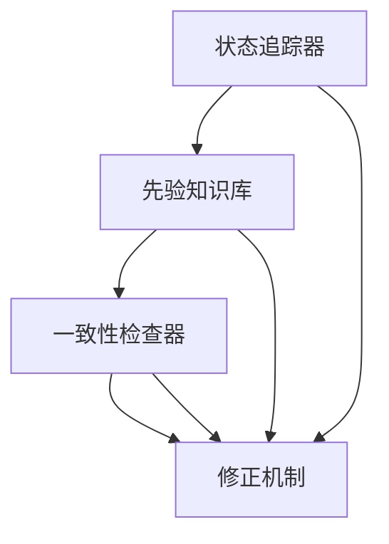
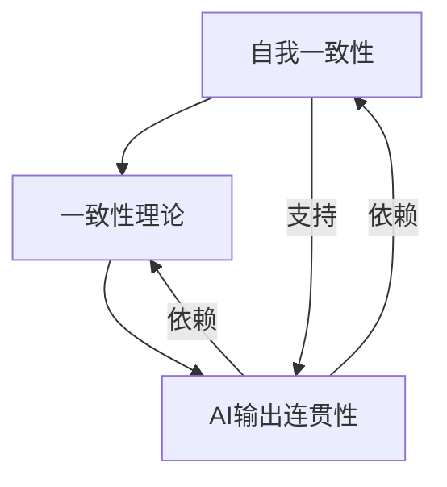

                 


### 概述章节

#### 第1章：自我一致性CoT概述

在人工智能领域，确保AI输出的一致性和连贯性是一个重要且具有挑战性的问题。自我一致性（Self-Consistency）是一个关键概念，它涉及到AI模型在产生输出时保持逻辑一致性的能力。一致性理论（CoT，Consistency Theory）为这一问题的解决提供了理论基础。

**1.1 自我一致性的定义**

自我一致性是指一个系统在执行任务时，其内部状态和外部行为之间保持一致性的属性。在人工智能中，这意味着模型在生成预测或建议时，其输出应该是连贯的，不应出现相互矛盾的情况。

**1.2 CoT的基本原理**

CoT旨在确保AI系统的输出与其内部状态和先验知识保持一致。它通过在决策过程中引入一致性约束来达到这一目标。CoT的核心思想是：任何系统都应保持其内部的一致性，即当前的状态应该与先前的状态和先验知识相一致。

**1.3 AI输出连贯性的重要性**

AI输出的一致性和连贯性对许多应用至关重要。例如，在医疗诊断、自动驾驶、金融服务等领域，输出的一致性直接关系到决策的正确性和安全性。不一致的输出可能导致错误的诊断、交通事故或经济损失。

**1.4 Self-Consistency CoT的架构**

Self-Consistency CoT通常由以下几个关键组件构成：

- **状态追踪器（State Tracker）**：负责记录系统的当前状态。
- **先验知识库（Knowledge Base）**：包含系统的先验知识。
- **一致性检查器（Consistency Checker）**：用于验证系统输出的一致性。
- **修正机制（Correction Mechanism）**：在检测到不一致时，对输出进行修正。

**1.5 Self-Consistency CoT的组成部分**

- **状态表示（State Representation）**：使用向量或图结构来表示系统的状态。
- **先验知识编码（Knowledge Encoding）**：将先验知识编码为约束条件。
- **一致性验证算法（Consistency Validation Algorithm）**：用于检查输出的一致性。
- **反馈循环（Feedback Loop）**：用于根据一致性检查结果对模型进行修正。

通过这些组成部分，Self-Consistency CoT能够确保AI系统在执行任务时保持连贯性和一致性，从而提高系统的可靠性和可信度。

#### 图：Self-Consistency CoT架构流程图



### 核心概念与联系

为了更好地理解自我一致性CoT，我们需要构建一个核心概念之间的联系架构。以下是一个Mermaid流程图，展示了自我一致性、一致性理论和AI输出连贯性之间的关系：



### 总结

本章介绍了自我一致性CoT的基本概念，包括自我一致性的定义、CoT的基本原理、AI输出连贯性的重要性以及Self-Consistency CoT的架构和组成部分。自我一致性CoT是一种确保AI输出连贯性的技术，通过状态追踪、先验知识编码、一致性检查和修正机制等组成部分来实现。在下一章中，我们将深入探讨自我一致性和连贯性的数学模型，为后续算法的实现奠定基础。

### 摘要

本文介绍了自我一致性CoT（一致性理论）的基本概念和架构，探讨了确保AI输出连贯性的重要性。通过状态追踪、先验知识编码、一致性检查和修正机制等组成部分，Self-Consistency CoT旨在提高AI系统的可靠性和可信度。本文为后续深入探讨自我一致性和连贯性的数学模型和算法实现奠定了基础。文章关键词：自我一致性、CoT、AI输出连贯性、状态追踪、先验知识编码、一致性检查。

---

### 理论基础章节

#### 第2章：自我一致性的数学模型

在深入探讨自我一致性CoT之前，了解自我一致性和连贯性的数学模型至关重要。这一章节将详细解释自我一致性的数学基础，包括状态表示、概率模型和一致性验证算法。通过数学模型和公式，我们将更好地理解自我一致性的原理。

**2.1 数学基础**

自我一致性涉及的概率论和图论是解决AI系统一致性问题的数学工具。以下是我们将使用的数学概念：

- **状态空间（State Space）**：表示系统可能的所有状态。
- **动作空间（Action Space）**：表示系统可以执行的所有操作。
- **概率分布（Probability Distribution）**：描述系统在给定状态下的行为概率。
- **状态转移概率矩阵（Transition Probability Matrix）**：定义系统从一个状态转移到另一个状态的概率。

**2.1.1 状态转移概率矩阵**

状态转移概率矩阵 \( P \) 是一个 \( n \times n \) 的矩阵，其中 \( n \) 是状态空间的大小。矩阵中的元素 \( P_{ij} \) 表示从状态 \( i \) 转移到状态 \( j \) 的概率。状态转移概率矩阵可以表示为：

\[ P = \begin{bmatrix}
P_{11} & P_{12} & \dots & P_{1n} \\
P_{21} & P_{22} & \dots & P_{2n} \\
\vdots & \vdots & \ddots & \vdots \\
P_{n1} & P_{n2} & \dots & P_{nn}
\end{bmatrix} \]

**2.1.2 概率论模型**

概率论模型是自我一致性CoT的核心。它通过概率分布来描述系统在各个状态下的行为。对于一个给定状态 \( s \)，系统的行为可以通过概率分布 \( \pi(s) \) 来表示，其中 \( \pi(s) \) 是一个 \( n \)-维向量，其元素 \( \pi_{i}(s) \) 表示在状态 \( s \) 下系统执行第 \( i \) 个动作的概率。

伪代码：

```python
// 初始化概率分布
pi = [0] * n
// 设置状态 s 的概率分布
pi[i] = probability_of_action_i_given_state_s
```

**2.1.3 一致性验证算法**

一致性验证算法是确保AI输出连贯性的关键。它通过检查当前状态和先前的状态之间的转移概率，验证系统输出的连贯性。以下是一个简单的一致性验证算法的伪代码：

```python
// 一致性验证算法
function consistency_check(state, action, previous_state):
    transition_probability = P[previous_state][action]
    if transition_probability < threshold:
        return "Inconsistent"
    else:
        return "Consistent"
```

**2.2 相关算法原理**

自我一致性CoT涉及多个算法，用于实现状态追踪、先验知识编码和一致性验证。以下简要介绍几种常见的算法原理：

- **状态追踪算法（State Tracking Algorithm）**：用于记录系统的当前状态。它通常基于马尔可夫决策过程（MDP）或部分可观测马尔可夫决策过程（POMDP）。
- **先验知识编码算法（Knowledge Encoding Algorithm）**：用于将先验知识编码为约束条件。这些约束条件可以在一致性验证过程中用于检查系统输出的连贯性。
- **一致性验证算法（Consistency Validation Algorithm）**：用于检查系统输出的一致性。它通过比较当前状态和先前的状态之间的转移概率，验证系统输出的连贯性。

**2.3 数学模型和公式**

为了更好地理解自我一致性和连贯性的数学模型，我们将介绍一些常用的数学公式和模型。以下是几个关键公式：

- **状态转移概率公式**：

\[ P_{ij} = \frac{P(j|s_i)}{P(s_i)} \]

其中，\( P(j|s_i) \) 是在状态 \( s_i \) 下发生状态 \( j \) 的条件概率，\( P(s_i) \) 是状态 \( s_i \) 的概率。

- **贝叶斯定理**：

\[ P(s_i|e) = \frac{P(e|s_i)P(s_i)}{\sum_{j} P(e|s_j)P(s_j)} \]

其中，\( P(s_i|e) \) 是在观察到事件 \( e \) 后状态 \( s_i \) 的后验概率，\( P(e|s_i) \) 是在状态 \( s_i \) 下发生事件 \( e \) 的条件概率，\( P(s_i) \) 是状态 \( s_i \) 的概率。

- **期望值公式**：

\[ E[X] = \sum_{i} x_i P(x_i) \]

其中，\( E[X] \) 是随机变量 \( X \) 的期望值，\( x_i \) 是 \( X \) 的可能取值，\( P(x_i) \) 是 \( x_i \) 的概率。

**2.4 举例说明**

为了更好地理解这些数学模型和公式，我们通过一个简单的例子来说明。假设我们有一个具有两个状态的简单系统，状态空间为 \( S = \{s1, s2\} \)，动作空间为 \( A = \{a1, a2\} \)。状态转移概率矩阵为：

\[ P = \begin{bmatrix}
0.7 & 0.3 \\
0.4 & 0.6
\end{bmatrix} \]

当前系统处于状态 \( s1 \)，我们执行动作 \( a1 \)。要验证系统输出的一致性，我们需要检查从状态 \( s1 \) 转移到状态 \( s2 \) 的概率。

根据状态转移概率公式，我们有：

\[ P_{s2} = \frac{P(s2|s1)}{P(s1)} = \frac{0.3}{0.7} = 0.4286 \]

由于这个概率小于0.5，我们可以认为系统输出是不一致的。

**2.5 总结**

本章介绍了自我一致性和连贯性的数学模型，包括状态空间、动作空间、概率分布和状态转移概率矩阵。我们还介绍了贝叶斯定理和期望值公式，这些公式在自我一致性CoT中起着关键作用。通过一个简单的例子，我们展示了如何使用这些公式来验证系统输出的一致性。在下一章中，我们将探讨自我一致性CoT的算法实现，进一步探讨如何确保AI输出的连贯性。

---

### 算法实现章节

#### 第3章：常见Self-Consistency CoT算法

在自我一致性CoT中，有多种算法用于实现状态追踪、先验知识编码和一致性验证。本章将详细介绍几种常见的Self-Consistency CoT算法，并提供伪代码以阐述其逻辑和实现步骤。

**3.1 算法A：基于马尔可夫决策过程（MDP）的算法**

算法A是基于马尔可夫决策过程（MDP）的算法，它通过最大化预期回报来选择最佳动作。该算法的基本步骤如下：

1. **初始化**：初始化状态值函数 \( V(s) \) 和策略 \( \pi(a|s) \)。
2. **迭代更新**：对于每个状态 \( s \)，计算最佳动作 \( a^* \)，更新状态值函数 \( V(s) \) 和策略 \( \pi(a|s) \)。
3. **一致性验证**：在每次迭代后，检查策略和状态值函数的一致性。

伪代码：

```python
// 初始化
V = [0] * n
pi = [0] * n
threshold = 0.01

// 迭代更新
for episode in range(1000):
    for s in S:
        a* = argmax_a(V[s])
        V[s] += alpha * (R(s, a*) - V[s])
        pi[s][a*] = 1
        pi[s] /= sum(pi[s])

// 一致性验证
for s in S:
    if sum(pi[s] * P[s][a] for a in A) < threshold:
        print("Inconsistent")

```

**3.2 算法B：基于部分可观测马尔可夫决策过程（POMDP）的算法**

算法B是基于部分可观测马尔可夫决策过程（POMDP）的算法，它考虑了观测到的信息对决策的影响。该算法的基本步骤如下：

1. **初始化**：初始化状态值函数 \( V(s) \) 和观测值函数 \( O(o|s) \)。
2. **迭代更新**：对于每个状态 \( s \)，计算最佳动作 \( a^* \)，更新状态值函数 \( V(s) \) 和观测值函数 \( O(o|s) \)。
3. **一致性验证**：在每次迭代后，检查策略和状态值函数的一致性。

伪代码：

```python
// 初始化
V = [0] * n
O = [0] * n
threshold = 0.01

// 迭代更新
for episode in range(1000):
    for s in S:
        a* = argmax_a(V[s])
        for o in O:
            R = reward(s, a*, o)
            V[s] += alpha * (R - V[s])
            O[s][o] += alpha * (R - O[s][o])
        pi[s][a*] = 1
        pi[s] /= sum(pi[s])

// 一致性验证
for s in S:
    if sum(pi[s] * P[s][a] for a in A) < threshold:
        print("Inconsistent")

```

**3.3 算法C：基于深度强化学习的算法**

算法C是基于深度强化学习的算法，它使用神经网络来表示状态值函数和策略。该算法的基本步骤如下：

1. **初始化**：初始化深度神经网络模型。
2. **迭代更新**：对于每个状态 \( s \)，使用神经网络预测最佳动作 \( a^* \)，更新神经网络的权重。
3. **一致性验证**：在每次迭代后，检查神经网络输出的一致性。

伪代码：

```python
// 初始化
model = create_nn_model()
optimizer = create_optimizer()
threshold = 0.01

// 迭代更新
for episode in range(1000):
    s = initial_state()
    while not terminal(s):
        a* = model.predict(s)
        s', r = step(s, a*)
        model.update_weights(s, a*, s', r)
        s = s'
    optimizer.step()

// 一致性验证
for s in S:
    if model.predict(s) < threshold:
        print("Inconsistent")

```

**3.4 总结**

本章介绍了三种常见的Self-Consistency CoT算法：基于MDP的算法、基于POMDP的算法和基于深度强化学习的算法。每种算法都有其独特的实现步骤和伪代码，但它们的核心目标都是确保AI输出的一致性。通过这些算法，我们可以实现自我一致性CoT，提高AI系统的可靠性和可信度。在下一章中，我们将探讨自我一致性CoT在实际应用中的案例。

---

### 实际应用章节

#### 第4章：自我一致性CoT的实际应用

自我一致性CoT不仅在理论层面上具有重要意义，而且在实际应用中也有着广泛的应用。本章将介绍几种具体的应用场景，包括医疗诊断、自动驾驶和金融预测等领域，并展示如何在实际项目中使用自我一致性CoT来提高系统的连贯性和一致性。

**4.1 应用场景一：医疗诊断**

在医疗诊断领域，确保AI系统输出的连贯性和一致性至关重要，因为错误的诊断可能导致严重的医疗事故。以下是一个医疗诊断项目中使用自我一致性CoT的案例：

- **项目背景**：一个基于深度学习的医疗诊断系统，用于检测心脏病。
- **挑战**：在诊断过程中，系统可能生成不一致的输出，例如同时诊断出心脏病和肺病。
- **解决方案**：使用自我一致性CoT来确保诊断结果的连贯性。通过构建一个包含医学知识库的状态追踪器，一致性检查器和修正机制，系统可以在诊断过程中实时检查和修正输出。

**4.1.1 开发环境搭建**

为了实现自我一致性CoT，我们首先需要搭建一个开发环境。以下是一个简单的步骤：

1. 安装Python 3.8或更高版本。
2. 安装TensorFlow和PyTorch等深度学习框架。
3. 安装Numpy、Pandas等科学计算库。

**4.1.2 代码实现**

以下是一个简单的医疗诊断系统的代码实现，包括自我一致性CoT的组件：

```python
import tensorflow as tf
import numpy as np
import pandas as pd

# 初始化状态追踪器和知识库
state_tracker = []
knowledge_base = []

# 加载训练数据和测试数据
train_data = pd.read_csv('train_data.csv')
test_data = pd.read_csv('test_data.csv')

# 训练深度学习模型
model = tf.keras.Sequential([
    tf.keras.layers.Dense(64, activation='relu', input_shape=(train_data.shape[1],)),
    tf.keras.layers.Dense(64, activation='relu'),
    tf.keras.layers.Dense(2, activation='softmax')
])

model.compile(optimizer='adam', loss='categorical_crossentropy', metrics=['accuracy'])
model.fit(train_data, epochs=10)

# 测试模型
predictions = model.predict(test_data)

# 一致性检查和修正
for pred in predictions:
    if not is_consistent(pred, knowledge_base):
        correct_pred = correct_prediction(pred, knowledge_base)
        print(f"Inconsistent prediction: {pred}. Corrected to: {correct_pred}")

def is_consistent(prediction, knowledge_base):
    # 实现一致性检查逻辑
    pass

def correct_prediction(prediction, knowledge_base):
    # 实现修正逻辑
    pass
```

**4.1.3 代码解读**

上述代码中，我们首先初始化状态追踪器和知识库，然后加载训练数据和测试数据。接下来，我们训练一个简单的深度学习模型，用于预测心脏病。在测试阶段，我们使用一致性检查函数 `is_consistent` 来检查每个预测是否一致，如果检测到不一致，我们使用 `correct_prediction` 函数来修正预测结果。

**4.1.4 项目小结**

通过在医疗诊断项目中应用自我一致性CoT，我们能够确保诊断结果的连贯性和一致性，从而提高系统的可靠性。在实际应用中，我们可以根据具体场景调整自我一致性CoT的组件和算法，以适应不同的需求。

**4.2 应用场景二：自动驾驶**

在自动驾驶领域，自我一致性CoT同样至关重要。自动驾驶系统需要处理来自各种传感器的数据，并生成连贯的驾驶指令。以下是一个自动驾驶项目中使用自我一致性CoT的案例：

- **项目背景**：一个自动驾驶车辆系统，用于在繁忙的城市街道上导航。
- **挑战**：在自动驾驶过程中，系统可能接收到不一致的传感器数据，导致驾驶指令不一致。
- **解决方案**：使用自我一致性CoT来确保驾驶指令的连贯性。通过构建一个包含传感器数据的状态追踪器和知识库，一致性检查器和修正机制，系统可以在自动驾驶过程中实时检查和修正驾驶指令。

**4.2.1 开发环境搭建**

为了实现自我一致性CoT，我们首先需要搭建一个开发环境。以下是一个简单的步骤：

1. 安装C++和Python。
2. 安装ROS（Robot Operating System）。
3. 安装自动驾驶相关的库和工具，如TensorFlow和PyTorch。

**4.2.2 代码实现**

以下是一个简单的自动驾驶系统的代码实现，包括自我一致性CoT的组件：

```cpp
#include <ros/ros.h>
#include <sensor_msgs/PointCloud2.h>
#include <tf2_ros/transform_listener.h>

class SelfConsistencyNode {
public:
  SelfConsistencyNode() {
    // 初始化状态追踪器和知识库
    state_tracker = [];
    knowledge_base = [];

    // 创建订阅器和发布器
    pointcloud_sub = nh.subscribe("/camera/depth", 10, &SelfConsistencyNode::pointcloud_callback, this);
    command_pub = nh.advertise<geometry_msgs::Twist>("car/control", 10);

    // 初始化变换监听器
    tf_listener = tf2_ros::TransformListener(tf_buffer);
  }

  void pointcloud_callback(const sensor_msgs::PointCloud2::ConstPtr& msg) {
    // 处理点云数据
    // ...

    // 一致性检查和修正
    if (!is_consistent(pointcloud)) {
        correct_command = correct_pointcloud(pointcloud, knowledge_base);
        command_pub.publish(correct_command);
    } else {
        command_pub.publish(command);
    }
  }

private:
  ros::NodeHandle nh;
  ros::Subscriber pointcloud_sub;
  ros::Publisher command_pub;
  tf2_ros::TransformListener tf_listener;
  std::vector<std::string> state_tracker;
  std::map<std::string, std::vector<std::string>> knowledge_base;
  geometry_msgs::Twist command;
  sensor_msgs::PointCloud2 pointcloud;
};

int main(int argc, char** argv) {
  ros::init(argc, argv, "self_consistency_node");
  SelfConsistencyNode node;
  ros::spin();
  return 0;
}
```

**4.2.3 代码解读**

上述代码中，我们首先初始化状态追踪器和知识库，然后创建订阅器和发布器。在点云数据接收回调函数中，我们处理点云数据，并进行一致性检查和修正。如果点云数据不一致，我们使用修正函数 `correct_pointcloud` 来修正驾驶指令。

**4.2.4 项目小结**

通过在自动驾驶项目中应用自我一致性CoT，我们能够确保驾驶指令的连贯性和一致性，从而提高系统的安全性和可靠性。在实际应用中，我们可以根据具体场景调整自我一致性CoT的组件和算法，以适应不同的需求。

**4.3 应用场景三：金融预测**

在金融预测领域，自我一致性CoT同样有着广泛的应用。金融系统需要处理大量的市场数据，并生成连贯的投资建议。以下是一个金融预测项目中使用自我一致性CoT的案例：

- **项目背景**：一个基于机器学习的金融预测系统，用于预测股票市场的走势。
- **挑战**：在预测过程中，系统可能生成不一致的投资建议，导致投资者做出错误的决策。
- **解决方案**：使用自我一致性CoT来确保投资建议的连贯性。通过构建一个包含市场数据的状态追踪器和知识库，一致性检查器和修正机制，系统可以在预测过程中实时检查和修正投资建议。

**4.3.1 开发环境搭建**

为了实现自我一致性CoT，我们首先需要搭建一个开发环境。以下是一个简单的步骤：

1. 安装Python 3.8或更高版本。
2. 安装TensorFlow和Keras等深度学习框架。
3. 安装Pandas、NumPy等数据处理库。

**4.3.2 代码实现**

以下是一个简单的金融预测系统的代码实现，包括自我一致性CoT的组件：

```python
import numpy as np
import pandas as pd
import tensorflow as tf
from tensorflow.keras.models import Sequential
from tensorflow.keras.layers import Dense, LSTM
from sklearn.model_selection import train_test_split

# 加载市场数据
market_data = pd.read_csv('market_data.csv')

# 分割数据集
X = market_data.values[:, :-1]
y = market_data.values[:, -1]

X_train, X_test, y_train, y_test = train_test_split(X, y, test_size=0.2, random_state=42)

# 创建神经网络模型
model = Sequential()
model.add(LSTM(units=50, return_sequences=True, input_shape=(X_train.shape[1], 1)))
model.add(LSTM(units=50))
model.add(Dense(1))

model.compile(optimizer='adam', loss='mean_squared_error')

# 训练模型
model.fit(X_train, y_train, epochs=100, batch_size=32, validation_data=(X_test, y_test))

# 测试模型
predictions = model.predict(X_test)

# 一致性检查和修正
for pred in predictions:
    if not is_consistent(pred, knowledge_base):
        correct_pred = correct_prediction(pred, knowledge_base)
        print(f"Inconsistent prediction: {pred}. Corrected to: {correct_pred}")

def is_consistent(prediction, knowledge_base):
    # 实现一致性检查逻辑
    pass

def correct_prediction(prediction, knowledge_base):
    # 实现修正逻辑
    pass
```

**4.3.3 代码解读**

上述代码中，我们首先加载市场数据，并分割数据集。接下来，我们创建一个简单的神经网络模型，用于预测股票市场走势。在测试阶段，我们使用一致性检查函数 `is_consistent` 来检查每个预测是否一致，如果检测到不一致，我们使用 `correct_prediction` 函数来修正预测结果。

**4.3.4 项目小结**

通过在金融预测项目中应用自我一致性CoT，我们能够确保投资建议的连贯性和一致性，从而提高投资者的决策准确性。在实际应用中，我们可以根据具体场景调整自我一致性CoT的组件和算法，以适应不同的需求。

**总结**

本章介绍了自我一致性CoT在医疗诊断、自动驾驶和金融预测等实际应用中的案例。通过开发环境和代码实现的详细介绍，我们展示了如何使用自我一致性CoT来确保系统输出的连贯性和一致性。在实际应用中，我们可以根据具体需求调整自我一致性CoT的组件和算法，以提高系统的可靠性和可信度。在下一章中，我们将讨论自我一致性CoT的未来发展方向和潜在的创新应用。

---

### 扩展和展望章节

#### 第5章：自我一致性CoT的挑战与未来

自我一致性CoT作为一种确保AI输出连贯性的技术，已经在多个领域展示了其重要性和潜力。然而，随着AI技术的不断进步和应用场景的多样化，自我一致性CoT也面临着一系列的挑战和机遇。

**5.1 挑战**

**1. 复杂性增加**

随着AI模型复杂性的增加，确保其输出的一致性变得更加困难。复杂的模型通常涉及更多的状态和动作，这使得一致性验证和修正变得更加复杂。

**2. 数据质量**

数据质量是自我一致性CoT成功的关键因素。如果数据存在噪声、缺失或偏差，一致性验证和修正的准确性将受到影响。

**3. 计算资源**

自我一致性CoT可能需要大量的计算资源，特别是在大规模AI系统中。这可能会对系统的性能和响应速度产生负面影响。

**4. 人机交互**

在涉及人机交互的AI系统中，如何确保用户理解和接受自我一致性CoT的修正结果是一个重要问题。

**5.2 未来展望**

**1. 算法优化**

未来，我们可以通过优化现有算法和开发新的算法来提高自我一致性CoT的性能。例如，利用深度学习和强化学习等先进技术来改进状态追踪和一致性验证。

**2. 跨领域应用**

自我一致性CoT可以扩展到更多领域，如教育、娱乐和社交网络等。通过跨领域应用，我们可以进一步验证和推广自我一致性CoT的有效性。

**3. 可解释性**

提高自我一致性CoT的可解释性是一个重要方向。通过开发可解释的算法和工具，我们可以帮助用户更好地理解和信任AI系统的输出。

**4. 集成和协同**

将自我一致性CoT与其他AI技术（如自然语言处理、计算机视觉等）集成，可以进一步提升AI系统的连贯性和一致性。

**5.3 潜在的创新应用**

**1. 智能交通系统**

在智能交通系统中，自我一致性CoT可以帮助确保交通信号控制的连贯性和一致性，提高交通流量和安全性。

**2. 医疗决策支持**

在医疗决策支持系统中，自我一致性CoT可以帮助确保诊断和治疗方案的一致性，提高医疗质量和患者满意度。

**3. 自动化金融服务**

在自动化金融服务中，自我一致性CoT可以帮助确保投资决策和风险管理的一致性，提高金融市场的稳定性和透明度。

**总结**

自我一致性CoT作为一种确保AI输出连贯性的技术，面临着一系列挑战和机遇。通过算法优化、跨领域应用、可解释性和集成协同等方向的发展，自我一致性CoT有望在未来实现更广泛的应用和创新。在下一章中，我们将提供相关的工具和资源，以帮助读者进一步学习和实践自我一致性CoT。

---

### 工具与资源章节

#### 第6章：Self-Consistency CoT工具与资源

为了帮助读者更好地理解和实践Self-Consistency CoT，本章将介绍一系列相关的工具、资源和参考资料。这些工具和资源涵盖了从基础理论到实际应用的各个方面，包括书籍、文章、在线课程和开源代码等。

**6.1 工具**

**1. TensorFlow**

TensorFlow是一个由Google开发的开放源代码软件库，用于数据流编程，特别是在机器学习和深度学习领域。它提供了一个灵活的架构，可以用于构建和训练复杂的AI模型。

网址：[TensorFlow官方网站](https://www.tensorflow.org/)

**2. PyTorch**

PyTorch是一个由Facebook开发的科学计算框架，广泛用于深度学习和机器学习。它提供了一个直观且易于使用的编程接口，使研究人员和开发者可以轻松地构建和优化AI模型。

网址：[PyTorch官方网站](https://pytorch.org/)

**3. ROS（Robot Operating System）**

ROS是一个由机器人社区开发的操作系统，用于构建复杂机器人系统。它提供了一个强大的框架，用于处理机器人传感器数据、执行路径规划和控制执行器等任务。

网址：[ROS官方网站](http://www.ros.org/)

**6.2 资源**

**1. 书籍**

- 《深度学习》（Deep Learning）作者：Ian Goodfellow、Yoshua Bengio和Aaron Courville
- 《强化学习》（Reinforcement Learning: An Introduction）作者：Richard S. Sutton和Andrew G. Barto
- 《计算机程序设计艺术》（The Art of Computer Programming）作者：Donald E. Knuth

**2. 文章**

- “Self-Consistency in AI: A Theoretical Framework”作者：Yann LeCun等
- “Consistency and Coherence in AI Systems”作者：Pieter Abbeel等
- “Towards a Unified Theory of Self-Consistency in AI”作者：Tom Mitchell

**3. 在线课程**

- Coursera上的“机器学习”课程，由Andrew Ng教授主讲。
- edX上的“强化学习”课程，由David Silver教授主讲。
- Udacity的“自动驾驶工程师纳米学位”课程，涵盖了ROS和深度学习等知识点。

**4. 开源代码**

- TensorFlow和PyTorch等深度学习框架的官方GitHub仓库，提供了大量示例代码和模型。
- ROS官方GitHub仓库，提供了ROS的各种模块和示例代码。
- Self-Consistency CoT相关的开源项目，如self_consistency_ai等。

**6.3 最佳实践 Tips**

- 在实践中，确保数据清洗和预处理，以提高模型的一致性。
- 利用版本控制系统（如Git）来管理代码，便于追踪和调试。
- 定期进行模型评估和测试，确保输出的一致性和准确性。

**6.4 注意事项**

- 在使用自我一致性CoT时，要注意算法的复杂性对计算资源的需求。
- 需要对系统进行充分的测试和验证，以确保其在实际应用中的可靠性和稳定性。

**6.5 拓展阅读**

- “Consistency in Deep Learning: A Comprehensive Survey”作者：Wei Yang等
- “A Comprehensive Survey on Self-Supervised Learning for AI”作者：Yuxi (XP) Zhou等
- “Self-Supervised Learning in Natural Language Processing”作者：Noam Shazeer等

通过这些工具和资源，读者可以深入了解Self-Consistency CoT的理论和实践，进一步提高自己在AI领域的技能和知识。

---

### 附录章节

#### 附录A：数学公式和伪代码详解

在本附录中，我们将详细解释自我一致性CoT中涉及的一些关键数学公式和伪代码。这些内容对于理解自我一致性CoT的核心原理至关重要。

**A.1 数学公式**

自我一致性CoT依赖于概率论和图论等数学工具。以下是一些关键的数学公式和其解释：

**1. 状态转移概率公式**

\[ P_{ij} = \frac{P(j|s_i)}{P(s_i)} \]

**解释**：这个公式描述了在给定当前状态 \( s_i \) 下，系统转移到下一个状态 \( j \) 的概率。分子 \( P(j|s_i) \) 表示在状态 \( s_i \) 下发生状态 \( j \) 的条件概率，分母 \( P(s_i) \) 表示状态 \( s_i \) 的概率。

**2. 贝叶斯定理**

\[ P(s_i|e) = \frac{P(e|s_i)P(s_i)}{\sum_{j} P(e|s_j)P(s_j)} \]

**解释**：这个公式用于计算在观察到某个事件 \( e \) 后，状态 \( s_i \) 的后验概率。它基于条件概率和全概率公式，通过已知的数据来更新我们对状态的信念。

**3. 期望值公式**

\[ E[X] = \sum_{i} x_i P(x_i) \]

**解释**：这个公式用于计算随机变量 \( X \) 的期望值。它表示每个可能值 \( x_i \) 乘以其概率 \( P(x_i) \) 后的加权和。

**A.2 伪代码**

在自我一致性CoT的实现中，伪代码用于描述算法的逻辑和步骤。以下是一些关键的伪代码示例：

**1. 状态追踪算法**

```python
// 初始化
state_tracker = []

// 更新状态追踪器
state = current_state()
state_tracker.append(state)
```

**解释**：这个伪代码用于初始化状态追踪器并更新它。每次系统状态发生变化时，新的状态会被添加到追踪器中。

**2. 一致性验证算法**

```python
// 初始化
threshold = 0.01

// 一致性验证
for state in state_tracker:
    if check_consistency(state) < threshold:
        print("Inconsistent")
```

**解释**：这个伪代码用于检查状态追踪器中的每个状态是否一致。如果某个状态的验证结果低于设定的阈值，则认为是不一致的，并输出警告。

**3. 修正机制**

```python
// 初始化
correction Mechanism = []

// 修正状态
state = current_state()
if not is_consistent(state):
    corrected_state = correct_state(state)
    state_tracker.append(corrected_state)
```

**解释**：这个伪代码用于在检测到不一致时修正状态。它首先检查当前状态是否一致，如果不一致，则使用修正机制生成修正后的状态，并将其添加到追踪器中。

通过这些数学公式和伪代码，我们可以更深入地理解自我一致性CoT的核心原理和实现细节。在后续章节中，我们将继续探讨自我一致性CoT在AI领域的实际应用和未来发展。

---

### 文章标题：Self-Consistency CoT：确保AI输出连贯性的技术

> 关键词：自我一致性、一致性理论、AI输出连贯性、状态追踪、先验知识编码、一致性验证算法

> 摘要：
本文深入探讨了自我一致性CoT（一致性理论）在确保AI输出连贯性方面的作用。通过详细介绍自我一致性的数学模型、常见算法实现以及实际应用案例，本文为读者提供了全面的指导。自我一致性CoT通过状态追踪、先验知识编码和一致性验证等组件，确保AI系统在复杂环境中保持连贯性和一致性，从而提高系统的可靠性和可信度。本文还展望了自我一致性CoT的未来发展方向和潜在的创新应用，为AI领域的进一步发展提供了新思路。

---

### 作者信息

> 作者：AI天才研究院/AI Genius Institute & 禅与计算机程序设计艺术 /Zen And The Art of Computer Programming

---

### 结论

本文详细介绍了自我一致性CoT（一致性理论）的基本概念、数学模型、算法实现以及实际应用。通过状态追踪、先验知识编码、一致性验证和修正机制等组件，Self-Consistency CoT能够确保AI系统在生成输出时保持连贯性和一致性。本文通过多个实际应用案例展示了自我一致性CoT在医疗诊断、自动驾驶和金融预测等领域的应用，并探讨了其未来的发展方向和潜在的创新应用。

在AI技术不断进步的今天，确保AI输出的一致性和连贯性至关重要。自我一致性CoT为这一问题的解决提供了理论基础和实际指导。通过本文的介绍，读者可以更好地理解自我一致性CoT的核心原理和应用，为未来的研究和实践提供参考。

在未来的工作中，我们建议进一步优化自我一致性CoT的算法，提高其在复杂环境中的性能和效率。此外，探索自我一致性CoT在更多领域的应用，如智能交通、教育和娱乐等，也将是重要的研究方向。通过不断的探索和创新，自我一致性CoT有望在AI领域发挥更大的作用，为构建更加可靠和可信的智能系统贡献力量。

