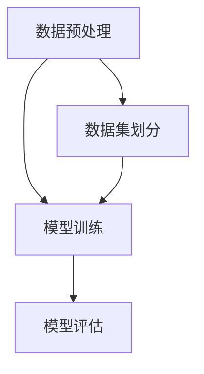
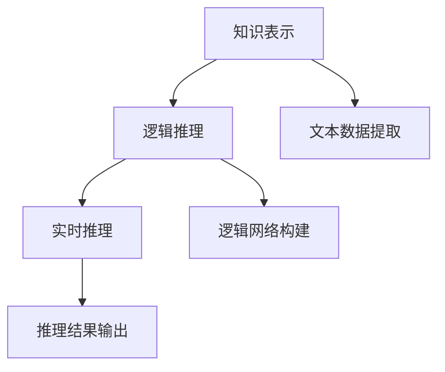
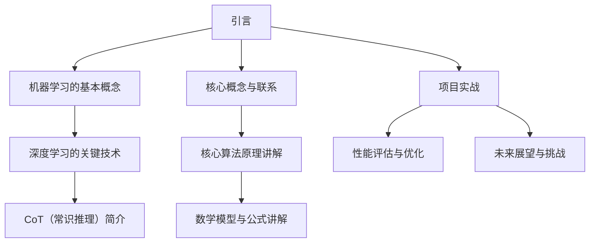

                 

## 文章标题：Zero-Shot CoT：AI即时推理能力的突破性进展

### 关键词：零样本推理，即时推理，AI推理，人工智能，深度学习

### 摘要：

本文深入探讨了零样本推理（Zero-Shot CoT，即Zero-Shot Common-sense Reasoning）在人工智能领域的突破性进展。通过系统地介绍零样本推理的概念、原理、算法和数学模型，本文揭示了其在即时推理中的潜在应用和重要性。文章还通过实际项目案例，展示了零样本推理的实现细节、代码解读和应用分析，提供了实用的开发指南和最佳实践。本文旨在为AI开发者提供全面的技术理解和实践指导，推动零样本推理在人工智能领域的深入研究和应用。

## 引言

### 1.1 书籍背景与目标

在人工智能（AI）迅猛发展的今天，机器学习和深度学习技术已经取得了显著的成果，推动了各行各业的技术革新。然而，传统AI系统在处理复杂任务时，往往面临着数据依赖性高、泛化能力差等问题。零样本推理（Zero-Shot CoT，即Zero-Shot Common-sense Reasoning）作为一种突破性的技术，旨在解决这些难题，实现AI系统在未知领域和场景中的自适应推理能力。

本章节将首先回顾人工智能的发展现状，介绍机器学习和深度学习的基本概念和技术进展。然后，本文将重点介绍零样本推理的概念，阐述其在人工智能中的重要性。最后，本书将简要介绍书籍的结构，概述各个章节的主要内容，为读者提供一个清晰的阅读框架。

### 1.2 人工智能的发展现状

人工智能自上世纪50年代起逐渐发展，至今已经经历了多个阶段。早期的AI研究主要集中在符号推理和逻辑推理上，主要通过构建专家系统和知识图谱来实现简单的任务。然而，这些方法在面对复杂问题时，往往无法胜任。随着计算机硬件和算法的进步，机器学习和深度学习技术逐渐崭露头角。

机器学习是一种通过从数据中学习规律和模式，从而进行预测和决策的方法。它主要分为监督学习、无监督学习和强化学习。监督学习通过训练数据集来学习预测模型，而无监督学习则通过未标记的数据来发现数据中的模式和结构。强化学习则通过不断试错和反馈来优化行为策略。

深度学习是机器学习的一种重要分支，其核心思想是通过多层神经网络来模拟人脑的决策过程。深度学习在图像识别、自然语言处理和语音识别等领域取得了突破性的成果，极大地推动了人工智能的发展。代表性的深度学习模型包括卷积神经网络（CNN）、循环神经网络（RNN）和 Transformer 等。

尽管机器学习和深度学习在许多领域取得了显著进展，但它们仍然面临着一些挑战。首先，这些方法往往依赖于大量标记数据，而数据获取和处理本身就是一个复杂的任务。其次，传统的AI系统在处理复杂任务时，往往需要大量的参数调整和优化，这使得模型训练过程变得耗时且不稳定。此外，传统AI系统在处理新任务或未知场景时，往往缺乏泛化能力，无法适应变化的环境。

为了解决这些问题，研究者们开始探索零样本推理技术。零样本推理旨在通过学习泛化的知识表示，使AI系统在未知领域和场景中具备自适应推理能力。这一技术突破了传统AI系统对数据和场景的依赖，为人工智能的发展开辟了新的路径。

### 1.3 Zero-Shot CoT的概念介绍

零样本推理（Zero-Shot CoT，即Zero-Shot Common-sense Reasoning）是一种无监督的推理技术，它不需要训练数据或先验知识，即可对未知场景进行推理和决策。这种技术通过学习通用的知识表示和逻辑关系，使得AI系统在面对新任务或未知数据时，能够快速适应并作出合理的推理。

Zero-Shot CoT的核心思想是利用先验知识和逻辑推理，对未知数据进行解释和预测。具体来说，它通过以下步骤实现：

1. **知识表示**：首先，从大量的文本数据中提取知识表示，包括概念、实体和关系。这些知识表示可以通过自然语言处理技术（如词嵌入、实体识别和关系抽取）来实现。

2. **逻辑推理**：利用提取的知识表示，构建逻辑推理网络。这个网络可以基于图论、形式逻辑或概率图模型等，实现知识的推理和组合。

3. **实时推理**：在未知场景中，根据输入数据，利用逻辑推理网络进行实时推理，生成解释或预测结果。

Zero-Shot CoT与传统AI系统的区别在于，它不需要依赖训练数据和模型优化，而是通过先验知识和逻辑推理来实现推理任务。这使得Zero-Shot CoT在处理未知任务和变化场景时，具备更强的适应能力和泛化能力。

### 1.4 书籍的目标与结构

本书籍旨在全面介绍零样本推理（Zero-Shot CoT）的概念、原理、算法和应用，帮助读者深入了解这一前沿技术，并掌握其实际应用方法。具体目标如下：

1. **理论讲解**：系统介绍零样本推理的基本概念、原理和算法，为读者提供全面的理论基础。

2. **实践指导**：通过实际项目案例，展示零样本推理的应用场景、实现细节和代码解读，帮助读者将理论知识应用于实际开发。

3. **趋势探讨**：探讨零样本推理的未来发展趋势和潜在应用，为读者提供前沿的技术视野。

4. **最佳实践**：总结零样本推理的最佳实践，提供实用的开发指南和注意事项，帮助读者高效地开发和优化零样本推理系统。

本书结构如下：

- **第1章：引言**：介绍书籍的背景和目标，概述人工智能的发展现状和零样本推理的概念。
- **第2章：核心概念与联系**：回顾AI基础知识，介绍Mermaid流程图，并展示核心概念和算法原理之间的关系。
- **第3章：核心算法原理讲解**：详细讲解零样本推理算法的基本思想和关键步骤，并提供伪代码说明。
- **第4章：数学模型与公式讲解**：回顾数学基础，详细阐述零样本推理模型的数学公式，并提供举例说明。
- **第5章：项目实战**：通过实际项目案例，展示零样本推理的实现细节、代码解读和应用分析。
- **第6章：性能评估与优化**：介绍性能评估方法和优化策略，提高零样本推理模型的性能。
- **第7章：未来展望与挑战**：探讨零样本推理的未来发展趋势、挑战和应用场景。
- **附录**：提供相关资源和工具链接，以及代码实现示例。

通过本书籍的阅读，读者将能够全面了解零样本推理的技术原理和应用方法，为在人工智能领域开展研究和实践奠定坚实的基础。

### 1.5 机器学习的基本概念

机器学习（Machine Learning，ML）是人工智能（AI）的核心分支之一，其主要目标是通过从数据中学习，使计算机能够自动地识别模式和规律，从而进行预测和决策。机器学习可以分为三种主要类型：监督学习（Supervised Learning）、无监督学习（Unsupervised Learning）和强化学习（Reinforcement Learning）。每种类型都有其独特的特点和应用场景。

#### 监督学习

监督学习是最常见的机器学习方法，它通过已有的训练数据集来学习预测模型。在监督学习中，输入数据和相应的输出标签是已知的，模型的目标是学习输入和输出之间的映射关系。监督学习分为两大类：回归（Regression）和分类（Classification）。

- **回归**：回归模型旨在预测连续的数值输出。常见的回归算法包括线性回归（Linear Regression）、决策树回归（Decision Tree Regression）和随机森林（Random Forest）等。回归问题广泛应用于房屋定价、股票预测等领域。
  
- **分类**：分类模型旨在将输入数据分为不同的类别。常见的分类算法包括逻辑回归（Logistic Regression）、支持向量机（SVM）、k-近邻（k-Nearest Neighbors，k-NN）和神经网络（Neural Networks）等。分类问题广泛应用于垃圾邮件检测、图像分类、疾病诊断等领域。

#### 无监督学习

无监督学习旨在从未标记的数据中发现结构和模式。无监督学习分为聚类（Clustering）和降维（Dimensionality Reduction）两大类。

- **聚类**：聚类算法旨在将相似的数据点归为同一类别。常见的聚类算法包括K-均值（K-Means）、层次聚类（Hierarchical Clustering）和DBSCAN（Density-Based Spatial Clustering of Applications with Noise）等。聚类算法广泛应用于市场细分、社交网络分析等领域。

- **降维**：降维算法旨在将高维数据转换为低维表示，从而减少数据冗余，提高计算效率。常见的降维算法包括主成分分析（Principal Component Analysis，PCA）、线性判别分析（Linear Discriminant Analysis，LDA）和自编码器（Autoencoder）等。降维算法广泛应用于图像处理、文本分析等领域。

#### 强化学习

强化学习（Reinforcement Learning，RL）是一种通过与环境的交互来学习最优策略的机器学习方法。在强化学习中，智能体（Agent）通过选择行动（Action）来获取奖励（Reward），并不断调整策略（Policy），以实现长期目标最大化。

强化学习通常分为两类：确定性策略学习（Deterministic Policy Learning）和随机策略学习（Stochastic Policy Learning）。常见的强化学习算法包括Q-学习（Q-Learning）、深度Q网络（Deep Q-Network，DQN）、策略梯度算法（Policy Gradient Methods）和强化学习框架（如PPO、A3C等）。

强化学习在游戏、机器人控制、自动驾驶等领域取得了显著成果，为人工智能的发展提供了新的思路和方法。

### 1.6 深度学习的关键技术

深度学习（Deep Learning，DL）是机器学习的一个重要分支，其核心思想是通过多层神经网络来模拟人脑的决策过程，从而实现复杂任务的学习和预测。深度学习在图像识别、自然语言处理、语音识别等领域取得了突破性的成果，推动了人工智能的发展。

#### 神经网络基础

神经网络（Neural Networks，NN）是深度学习的基础，其结构类似于人脑的神经元。一个基本的神经网络包括输入层、隐藏层和输出层。输入层接收外部输入数据，隐藏层通过一系列非线性变换处理数据，输出层生成最终输出。

- **激活函数**：激活函数是神经网络中的一个关键组件，用于引入非线性特性。常见的激活函数包括Sigmoid函数、ReLU函数、Tanh函数等。

- **损失函数**：损失函数用于衡量模型预测值和真实值之间的差距，是模型训练的核心指标。常见的损失函数包括均方误差（MSE）、交叉熵（Cross-Entropy）等。

#### 卷积神经网络（Convolutional Neural Networks，CNN）

卷积神经网络是一种专门用于处理图像数据的神经网络，其核心组件是卷积层。卷积层通过卷积操作提取图像中的局部特征，从而实现图像分类、物体检测等任务。

- **卷积层**：卷积层通过卷积操作提取图像特征，每个卷积核对应一个特征图。

- **池化层**：池化层用于减小特征图的尺寸，提高模型的泛化能力。常见的池化方法包括最大池化（Max Pooling）和平均池化（Average Pooling）。

- **全连接层**：全连接层将卷积层和池化层提取的特征映射到类别空间，实现分类任务。

#### 循环神经网络（Recurrent Neural Networks，RNN）

循环神经网络是一种用于处理序列数据的神经网络，其核心组件是循环单元。循环单元通过记忆机制存储历史信息，从而实现对序列数据的长期依赖建模。

- **循环单元**：循环单元包括输入门、遗忘门和输出门，用于控制信息的输入、遗忘和输出。

- **长短时记忆（LSTM）**：长短时记忆网络（Long Short-Term Memory，LSTM）是一种改进的循环神经网络，通过引入门控机制，解决了传统RNN在处理长序列数据时容易出现的梯度消失和梯度爆炸问题。

#### Transformer模型

Transformer模型是一种基于自注意力机制的深度学习模型，其广泛应用于自然语言处理任务，如机器翻译、文本分类等。

- **自注意力机制**：自注意力机制通过计算序列中每个元素之间的关联性，实现对序列数据的全局建模。

- **编码器-解码器结构**：编码器将输入序列编码为固定长度的向量，解码器则根据编码器的输出生成输出序列。

#### GAN模型

生成对抗网络（Generative Adversarial Network，GAN）是一种由生成器和判别器组成的深度学习模型，用于生成高质量的数据。

- **生成器**：生成器通过噪声数据生成逼真的数据。

- **判别器**：判别器用于区分生成器和真实数据的差异。

- **对抗训练**：生成器和判别器通过对抗训练相互博弈，生成器不断优化生成数据，判别器不断优化判别能力，从而实现高质量数据生成。

### 1.7 CoT（Commonsense Reasoning）简介

常识推理（Commonsense Reasoning，CoT）是一种基于人类日常经验和常识进行推理的方法，旨在使AI系统能够处理现实世界中复杂、不确定和模糊的信息。常识推理在多个领域具有广泛的应用，如智能问答、对话系统、智能助手等。

#### 常识推理的概念

常识推理是指基于已有的知识和经验，对未知信息进行合理推断和判断的过程。常识推理可以分为两个层次：

1. **事实推理**：事实推理是基于已知的事实和关系进行推理，例如，从“太阳是圆的”和“月亮围绕地球旋转”这两个事实，可以推理出“地球是圆的”。
2. **情境推理**：情境推理是基于特定情境和上下文进行推理，例如，在对话系统中，根据用户的提问和上下文，可以推理出用户的需求和意图。

#### 常识推理的技术

常识推理涉及多个技术领域，包括自然语言处理、知识图谱、逻辑推理和机器学习等。

1. **自然语言处理**：自然语言处理（Natural Language Processing，NLP）技术用于处理和解析自然语言文本，包括词法分析、句法分析和语义分析等。

2. **知识图谱**：知识图谱是一种用于表示实体和关系的数据结构，通过将常识知识以图谱形式存储和表示，可以为常识推理提供基础。

3. **逻辑推理**：逻辑推理是基于逻辑规则和推理方法进行推理，例如，基于命题逻辑和谓词逻辑进行推理。

4. **机器学习**：机器学习技术用于从数据中学习常识知识，例如，通过监督学习或无监督学习算法，从大量文本数据中提取常识知识。

#### 常识推理的应用

常识推理在多个领域具有广泛的应用，以下是一些典型的应用场景：

1. **智能问答**：智能问答系统通过常识推理，可以理解用户的问题，并提供准确、详细的回答。

2. **对话系统**：对话系统通过常识推理，可以理解用户的意图，并生成自然的对话响应。

3. **智能助手**：智能助手通过常识推理，可以为用户提供个性化的建议和服务。

4. **自动驾驶**：自动驾驶系统通过常识推理，可以理解道路场景，并做出合理的驾驶决策。

5. **医疗诊断**：医疗诊断系统通过常识推理，可以辅助医生进行疾病诊断和治疗方案推荐。

总之，常识推理是一种重要的AI技术，它使得AI系统更接近人类智能，为人工智能的发展和应用提供了新的可能性。

### 2.2 Mermaid流程图

Mermaid 是一种用于创建统一建模语言（UML）图表的简单且强大的标记语言。通过 Mermaid，我们可以直观地展示复杂流程和数据流，使读者能够清晰地理解各个组件之间的关系。在本节中，我们将使用 Mermaid 流程图来展示 AI 模型学习过程、Zero-Shot CoT 的工作流程以及各个章节的内容概览与关联。

#### 2.2.1 AI 模型学习过程

首先，我们来看一个简化的 AI 模型学习流程。这个流程包括数据预处理、模型训练和模型评估三个主要步骤。



在这个流程图中，数据预处理（A）是模型训练（B）的前提条件。数据预处理包括数据清洗、数据增强和数据归一化等步骤，以确保输入数据的质量。数据集划分（D）用于将数据分为训练集、验证集和测试集，以便在模型训练过程中进行验证和评估。模型训练（B）通过学习输入数据和标签之间的关系，生成模型参数。最后，模型评估（C）用于衡量模型在未知数据上的性能，通过计算指标如准确率、召回率等，评估模型的泛化能力。

#### 2.2.2 Zero-Shot CoT 工作流程

接下来，我们来看 Zero-Shot CoT 的工作流程。Zero-Shot CoT 通过先验知识和逻辑推理，实现未知场景的推理和决策。这个流程主要包括知识表示、逻辑推理和实时推理三个主要步骤。



在这个流程图中，知识表示（A）是整个流程的基础。知识表示通过从大量文本数据中提取概念、实体和关系，为逻辑推理提供先验知识。文本数据提取（D）是知识表示的关键步骤，可以通过自然语言处理技术（如词嵌入、实体识别和关系抽取）实现。逻辑推理（B）利用提取的知识表示，构建逻辑推理网络，实现对未知场景的推理。逻辑网络构建（E）可以基于图论、形式逻辑或概率图模型等，实现知识的推理和组合。实时推理（C）在未知场景中，根据输入数据，利用逻辑推理网络进行推理，生成解释或预测结果。推理结果输出（F）用于展示或应用推理结果。

#### 2.2.3 章节内容概览与关联

最后，我们使用 Mermaid 流程图来展示本书各个章节的内容概览与关联。这个流程图旨在帮助读者了解各个章节的主要内容，以及它们之间的逻辑关系。



在这个流程图中，引言（A）作为整本书的开篇，为后续内容奠定了基础。机器学习的基本概念（B）、深度学习的关键技术（C）和CoT（常识推理）简介（D）分别介绍了人工智能领域的基础知识和相关技术。核心概念与联系（E）通过 Mermaid 流程图展示了核心概念和算法原理之间的关系。核心算法原理讲解（F）、数学模型与公式讲解（G）分别深入探讨了零样本推理算法的基本思想和数学模型。项目实战（H）、性能评估与优化（I）和未来展望与挑战（J）分别通过实际案例、性能优化和趋势探讨，展示了零样本推理的实际应用和未来发展方向。

通过这个 Mermaid 流程图，读者可以清晰地了解本书的结构和内容，更好地掌握零样本推理的相关知识。

### 3.1 Zero-Shot CoT算法概述

零样本推理（Zero-Shot CoT）是一种无监督的推理技术，它能够在没有训练数据或先验知识的情况下，对未知场景进行推理和决策。这一技术通过学习通用的知识表示和逻辑关系，使AI系统在面对新任务或未知数据时，能够快速适应并作出合理的推理。零样本推理的核心思想是利用先验知识和逻辑推理，从抽象的知识表示中提取有用的信息，从而实现对未知数据的理解和解释。

#### 3.1.1 算法的基本思想

Zero-Shot CoT算法的基本思想可以概括为以下几个步骤：

1. **知识表示**：首先，从大量的文本数据中提取知识表示，包括概念、实体和关系。这些知识表示可以表示为向量、图或知识图谱等形式，为后续的推理提供基础。

2. **逻辑推理**：利用提取的知识表示，构建逻辑推理网络。这个网络可以基于图论、形式逻辑或概率图模型等，实现知识的推理和组合。

3. **实时推理**：在未知场景中，根据输入数据，利用逻辑推理网络进行实时推理，生成解释或预测结果。这个过程中，推理网络会根据输入数据的上下文和知识库中的信息，进行推理和决策。

#### 3.1.2 算法的关键步骤

Zero-Shot CoT算法的关键步骤包括知识表示、逻辑推理和实时推理，下面详细讲解这些步骤：

1. **知识表示**：知识表示是Zero-Shot CoT算法的基础。通过从大量文本数据中提取知识表示，可以将抽象的知识以结构化的形式表示出来。常用的知识表示方法包括词嵌入（Word Embedding）、知识图谱（Knowledge Graph）和实体嵌入（Entity Embedding）等。

   - **词嵌入**：词嵌入是将词汇映射到高维向量空间的方法，通过计算词汇之间的相似性，可以表示词汇的语义信息。常用的词嵌入方法包括 Word2Vec、GloVe 等。

   - **知识图谱**：知识图谱是一种用于表示实体和关系的图结构，通过图中的节点和边，可以表示实体之间的复杂关系。知识图谱可以用于推理和预测，是Zero-Shot CoT算法的重要基础。

   - **实体嵌入**：实体嵌入是将实体映射到高维向量空间的方法，通过实体之间的相似性度量，可以表示实体的语义信息。实体嵌入可以帮助模型在未知数据中识别和利用实体知识。

2. **逻辑推理**：逻辑推理是Zero-Shot CoT算法的核心。通过构建逻辑推理网络，可以将提取的知识表示进行推理和组合，从而实现对未知数据的理解和解释。

   - **图论推理**：基于图论的方法可以将知识表示构建为图结构，通过图中的路径和节点关系，进行推理和决策。常用的图论方法包括最短路径、最大流和最小生成树等。

   - **形式逻辑推理**：形式逻辑推理是一种基于命题逻辑和谓词逻辑的方法，通过逻辑推理规则，对知识表示进行推理。形式逻辑推理可以用于复杂的推理任务，如逻辑推断和决策推理。

   - **概率图模型推理**：概率图模型是一种基于概率分布的推理方法，通过图中的节点和边，可以表示实体之间的概率关系。概率图模型可以用于推理和预测，是Zero-Shot CoT算法的重要工具。

3. **实时推理**：实时推理是Zero-Shot CoT算法的实际应用。在未知场景中，根据输入数据，利用逻辑推理网络进行实时推理，生成解释或预测结果。实时推理的关键在于快速高效地处理输入数据，并利用知识库进行推理和决策。

   - **推理引擎**：推理引擎是实现实时推理的核心组件，它负责处理输入数据，调用逻辑推理网络进行推理，并生成推理结果。

   - **推理优化**：实时推理需要处理大量的数据，为了提高推理速度和效率，可以对推理过程进行优化。常见的优化方法包括并行计算、分布式计算和内存优化等。

通过上述关键步骤，Zero-Shot CoT算法实现了从知识表示到实时推理的全流程。这一算法不仅在理论上具有广泛的应用前景，也在实际应用中展示了强大的推理能力，为人工智能的发展提供了新的思路和方法。

### 3.2 伪代码说明

为了更详细地理解Zero-Shot CoT算法的执行过程，我们将使用伪代码来描述其关键步骤。伪代码是一种描述算法逻辑的文本表示，它可以帮助我们明确各个步骤的具体操作，从而更好地理解和实现算法。

```plaintext
算法：Zero-Shot CoT
输入：文本数据集 D，知识图谱 G，输入数据 X
输出：推理结果 R

初始化：
1. 从文本数据集 D 中提取概念、实体和关系，构建知识图谱 G。
2. 将实体和关系表示为向量，使用词嵌入或知识图谱嵌入方法。

步骤：

1. 数据预处理：
   - 对输入数据 X 进行清洗和预处理，包括分词、去除停用词、词性标注等。
   - 将预处理后的数据映射到实体和关系空间。

2. 知识表示：
   - 对于输入数据中的每个实体 e，查找知识图谱 G 中的对应实体节点。
   - 对于输入数据中的每个关系 r，查找知识图谱 G 中的对应关系边。

3. 逻辑推理：
   - 基于知识图谱 G，构建逻辑推理网络。
   - 使用图论算法（如最短路径算法）或形式逻辑推理算法，对输入数据进行推理。
   - 对于输入数据中的每个实体 e 和关系 r，计算其在逻辑推理网络中的推理路径和置信度。

4. 实时推理：
   - 对于输入数据 X，根据逻辑推理结果，生成解释或预测结果 R。
   - 输出推理结果 R，包括推理路径、置信度和推理结果。

5. 优化与调整：
   - 根据推理结果 R，对知识图谱 G 进行调整和优化，以提高推理性能。
   - 可以通过重新训练知识表示或调整逻辑推理规则来实现。

```

#### 数据预处理

在Zero-Shot CoT算法中，数据预处理是至关重要的一步。其目的是将原始文本数据转换为适合进行推理的形式。具体步骤如下：

1. **分词**：将文本数据分割成单词或短语，这是自然语言处理的基础步骤。可以使用基于规则的分词方法，如正则表达式，或基于统计的分词方法，如最大匹配法。

2. **去除停用词**：停用词是文本中频繁出现但不含具体意义的词，如“的”、“是”、“在”等。去除停用词可以提高后续处理的效率，并减少噪声。

3. **词性标注**：为每个单词分配词性（如名词、动词、形容词等），这有助于更好地理解文本的语义。

4. **实体识别**：识别文本中的实体，如人名、地名、组织名等。实体识别是知识表示的重要基础，可以通过现有的命名实体识别（NER）工具实现。

5. **关系抽取**：从文本中提取实体之间的关系，如“马云是阿里巴巴的创始人”、“北京是中国的首都”等。关系抽取是构建知识图谱的关键步骤，可以通过规则抽取、机器学习等方法实现。

#### 知识表示

知识表示是将实体和关系转换为向量或图结构的过程，以便进行推理和计算。以下是几种常用的知识表示方法：

1. **词嵌入**：词嵌入是将单词映射到高维向量空间的方法，如Word2Vec、GloVe等。词嵌入可以表示单词的语义信息，有助于在向量空间中进行计算。

2. **实体嵌入**：实体嵌入是将实体映射到高维向量空间的方法，如TransE、TransH等。实体嵌入可以表示实体之间的相似性，有助于推理和预测。

3. **知识图谱**：知识图谱是一种用于表示实体和关系的图结构，如RDF（Resource Description Framework）和知识图谱嵌入（如Knowledge Graph Embedding）。知识图谱可以表示复杂的实体关系，为推理提供支持。

#### 逻辑推理

逻辑推理是Zero-Shot CoT算法的核心步骤，其目的是根据知识表示和输入数据，生成推理路径和置信度。以下是几种常用的逻辑推理方法：

1. **图论推理**：基于图论的方法，如最短路径算法、最大流算法等，可以用于计算实体之间的关系。图论推理可以帮助确定输入数据中的实体和关系之间的连接路径。

2. **形式逻辑推理**：基于命题逻辑和谓词逻辑的方法，如推理规则、逻辑推导等，可以用于对知识表示进行推理。形式逻辑推理可以处理复杂的逻辑关系和推理任务。

3. **概率图模型推理**：基于概率图模型的方法，如贝叶斯网络、马尔可夫网络等，可以用于表示实体之间的概率关系。概率图模型推理可以计算输入数据中实体和关系之间的置信度。

#### 实时推理

实时推理是将逻辑推理的结果应用于实际场景的过程，其目的是根据输入数据生成解释或预测结果。以下是实时推理的几个关键步骤：

1. **推理引擎**：推理引擎是实现实时推理的核心组件，它负责处理输入数据，调用逻辑推理算法，并生成推理结果。

2. **推理路径和置信度计算**：对于输入数据中的每个实体和关系，根据逻辑推理网络，计算其在推理路径中的位置和置信度。置信度反映了实体和关系在推理过程中的可信度。

3. **解释或预测结果生成**：根据推理路径和置信度，生成解释或预测结果。解释结果可以是实体之间的关系、事件的发生等，预测结果可以是未来的事件或趋势。

通过上述伪代码说明，我们可以更清晰地理解Zero-Shot CoT算法的执行过程，从而为实际实现和优化提供指导。

### 4.1 数学基础回顾

在探讨零样本推理（Zero-Shot CoT）的数学模型和公式时，有必要首先回顾一些基本的数学概念，包括线性代数、概率论和统计学。这些数学工具在构建和优化AI模型中起着至关重要的作用，为理解后续内容提供坚实的基础。

#### 线性代数

线性代数是数学中的一个重要分支，它研究向量空间、线性映射、矩阵和行列式等概念。以下是一些线性代数的基本概念和性质：

1. **向量**：向量是具有大小和方向的量。在数学中，向量通常表示为列矩阵。例如，向量 \( \mathbf{v} = \begin{bmatrix} v_1 \\ v_2 \\ \vdots \\ v_n \end{bmatrix} \) 表示一个n维向量。

2. **矩阵**：矩阵是一个二维数组，用于表示线性变换或数据集。矩阵乘法、矩阵求逆和特征值计算等是线性代数中的核心操作。

3. **行列式**：行列式是一个标量值，用于描述矩阵的几何特性，如体积和面积。行列式的计算在解决线性方程组和优化问题中至关重要。

4. **向量空间**：向量空间是一个集合，其中包含了所有可能的向量，并满足向量加法和标量乘法的封闭性。线性代数的许多概念和理论都是基于向量空间构建的。

5. **线性变换**：线性变换是一种将向量空间映射到另一个向量空间的函数。线性变换可以通过矩阵乘法表示，并且在许多机器学习算法中具有重要作用。

#### 概率论

概率论是数学中研究随机事件的分支。以下是一些概率论的基本概念和定理：

1. **随机变量**：随机变量是一个数学函数，它将样本空间映射到实数集。随机变量可以是离散的或连续的。

2. **概率分布**：概率分布描述了随机变量取值的概率。常见的概率分布包括伯努利分布、正态分布、泊松分布等。

3. **条件概率**：条件概率是指在给定某个事件发生的条件下，另一个事件发生的概率。条件概率公式为 \( P(A|B) = \frac{P(A \cap B)}{P(B)} \)。

4. **贝叶斯定理**：贝叶斯定理是一种计算后验概率的方法，它基于先验概率和观察到的数据，更新对事件发生的信念。贝叶斯定理公式为 \( P(A|B) = \frac{P(B|A)P(A)}{P(B)} \)。

5. **马尔可夫链**：马尔可夫链是一种随机过程，其中当前状态仅取决于前一个状态，而与之前的状态无关。马尔可夫链在时间序列分析和状态转移模型中有广泛应用。

#### 统计学

统计学是应用数学的一个分支，用于收集、分析、解释和呈现数据。以下是一些统计学的基本概念和工具：

1. **样本和总体**：样本是从总体中抽取的一部分数据，用于推断总体的特征。总体是指我们感兴趣的全部数据的集合。

2. **均值和方差**：均值是样本数据的平均值，用于描述数据的中心趋势。方差是数据离散程度的度量，反映了数据分布的稳定性。

3. **假设检验**：假设检验是一种统计方法，用于检验总体参数的假设是否成立。常见的假设检验方法包括t检验、卡方检验和F检验等。

4. **回归分析**：回归分析是一种用于研究变量之间关系的统计方法。线性回归、多项式回归和逻辑回归等是回归分析的常见形式。

5. **聚类分析**：聚类分析是一种无监督学习方法，用于将数据集划分为不同的簇。K-均值聚类、层次聚类和DBSCAN等是常见的聚类算法。

通过回顾这些数学基础，我们可以更好地理解零样本推理中的数学模型和公式，为后续内容的讲解和实现奠定基础。这些数学工具不仅在理论分析中起到关键作用，在实际应用中同样具有重要作用，帮助我们构建和优化高效的AI模型。

### 4.2 Zero-Shot CoT模型数学公式

零样本推理（Zero-Shot CoT）是一种强大的技术，它允许AI系统在没有训练数据的情况下，对未知任务进行推理。为了更好地理解Zero-Shot CoT模型的数学原理，本节将详细阐述其核心数学公式，包括模型定义、损失函数和优化算法。

#### 4.2.1 模型定义

Zero-Shot CoT模型通常基于图神经网络（Graph Neural Networks，GNN）构建，其主要目标是从一个知识图谱中提取有意义的信息，并对未知输入进行推理。下面是Zero-Shot CoT模型的基本定义：

- **知识图谱**：知识图谱是一个由实体、关系和边构成的有向图。形式化地，知识图谱 \( G = (V, E) \) 其中 \( V \) 是实体集，\( E \) 是关系集。
- **实体嵌入**：每个实体 \( v \) 被映射到一个高维向量 \( \mathbf{e}_v \in \mathbb{R}^d \)，称为实体嵌入。
- **关系嵌入**：每个关系 \( e \) 被映射到一个高维向量 \( \mathbf{r}_e \in \mathbb{R}^d \)，称为关系嵌入。

模型的核心思想是通过图卷积操作，将实体和关系的嵌入向量进行组合，以提取出更高级的知识表示。

- **图卷积操作**：对于图中每个节点 \( v \)，其更新后的嵌入向量可以通过以下公式计算：

  \[
  \mathbf{e}_v^{(t+1)} = \sigma(\mathbf{e}_v^{(t)} + \sum_{u \in \text{neighbor}(v)} \mathbf{e}_u^{(t)} \cdot \text{ReLU}(\mathbf{W} \cdot \mathbf{r}_{e_{uv}}))
  \]

  其中，\( \text{ReLU}(\cdot) \) 是ReLU激活函数，\( \mathbf{W} \) 是关系权重矩阵，\( \text{neighbor}(v) \) 是节点 \( v \) 的邻居节点集合。

#### 4.2.2 损失函数

为了训练Zero-Shot CoT模型，需要定义一个损失函数，用于衡量模型预测与真实标签之间的差距。以下是几种常见的损失函数：

- **交叉熵损失**：在分类任务中，交叉熵损失是常用的损失函数。对于每个类标签 \( y \in \{0, 1\}^C \) 和模型预测 \( \mathbf{p} = (\mathbf{p}_1, \mathbf{p}_2, \ldots, \mathbf{p}_C) \)，交叉熵损失定义如下：

  \[
  L_{\text{CE}} = -\sum_{i=1}^C y_i \log(\mathbf{p}_i)
  \]

  其中，\( y_i \) 是第 \( i \) 个类别的真实标签，\( \mathbf{p}_i \) 是模型预测的第 \( i \) 个类别的概率。

- **均方误差损失**：在回归任务中，均方误差损失是常用的损失函数。对于预测值 \( \mathbf{y} \) 和真实值 \( \mathbf{t} \)，均方误差损失定义如下：

  \[
  L_{\text{MSE}} = \frac{1}{2} \sum_{i=1}^n (\mathbf{y}_i - \mathbf{t}_i)^2
  \]

  其中，\( n \) 是样本数量，\( \mathbf{y}_i \) 是第 \( i \) 个样本的预测值，\( \mathbf{t}_i \) 是第 \( i \) 个样本的真实值。

- **结构化损失**：在多跳推理任务中，结构化损失用于衡量实体之间关系的合理性。假设对于两个实体 \( v \) 和 \( u \)，它们之间的正确关系为 \( r \)，则结构化损失可以定义如下：

  \[
  L_{\text{SR}} = -\log \left( \frac{\exp(\mathbf{e}_v \cdot \mathbf{e}_u \cdot \mathbf{r})}{\sum_{r' \in \text{rels}} \exp(\mathbf{e}_v \cdot \mathbf{e}_u \cdot \mathbf{r'})} \right)
  \]

  其中，\( \text{rels} \) 是所有可能的关系集合，\( \mathbf{e}_v \) 和 \( \mathbf{e}_u \) 分别是实体 \( v \) 和 \( u \) 的嵌入向量，\( \mathbf{r} \) 是关系 \( r \) 的嵌入向量。

#### 4.2.3 优化算法

为了训练Zero-Shot CoT模型，需要选择合适的优化算法来最小化损失函数。以下是几种常用的优化算法：

- **随机梯度下降（SGD）**：随机梯度下降是最简单的优化算法之一。每次迭代中，模型参数更新为损失函数在当前梯度方向上的步长调整。公式如下：

  \[
  \mathbf{w} \leftarrow \mathbf{w} - \alpha \cdot \nabla_{\mathbf{w}} L
  \]

  其中，\( \mathbf{w} \) 是模型参数，\( \alpha \) 是学习率，\( \nabla_{\mathbf{w}} L \) 是损失函数关于模型参数的梯度。

- **Adam优化器**：Adam优化器是SGD的改进版本，它结合了动量方法和自适应学习率调整。Adam优化器的更新公式如下：

  \[
  \beta_1 \frac{\Delta \mathbf{w}}{1 - \beta_1^t} = \frac{\nabla_{\mathbf{w}} L}{\sqrt{1 - \beta_2^t}} + \epsilon
  \]

  其中，\( \beta_1 \) 和 \( \beta_2 \) 分别是动量和偏差修正系数，\( \epsilon \) 是一个很小的正数，用于防止除以零。

- **自适应矩估计（AdaGrad）**：AdaGrad优化器是一种自适应学习率调整的优化算法，其更新公式如下：

  \[
  \mathbf{w} \leftarrow \mathbf{w} - \frac{\alpha}{\sum_{i=1}^n (\mathbf{g}_i)^2} \cdot \mathbf{g}
  \]

  其中，\( \alpha \) 是学习率，\( \mathbf{g} \) 是梯度向量，\( n \) 是梯度向量中的元素个数。

通过上述数学模型和公式，我们可以更好地理解Zero-Shot CoT的核心原理和实现方法。这些数学工具为我们在实际应用中优化和改进模型提供了坚实的理论基础。

### 4.2.4 模型定义

为了详细阐述Zero-Shot CoT模型，我们首先需要定义一些基本的数学概念和符号。以下是模型的主要组成部分：

- **实体嵌入**：实体 \( v \) 的嵌入向量表示为 \( \mathbf{e}_v \in \mathbb{R}^d \)，其中 \( d \) 是嵌入向量的维度。
- **关系嵌入**：关系 \( e \) 的嵌入向量表示为 \( \mathbf{r}_e \in \mathbb{R}^d \)，其中 \( d \) 是嵌入向量的维度。
- **边权重**：边 \( (v, u, e) \) 的权重表示为 \( w_{v, u, e} \in \mathbb{R} \)。
- **输出向量**：对于给定的实体 \( v \)，输出向量 \( \mathbf{y}_v \in \mathbb{R}^C \)，其中 \( C \) 是类别的数量。

模型的目标是通过图神经网络（GNN）从知识图谱中学习实体和关系的嵌入向量，并利用这些嵌入向量进行推理和分类。

首先，我们定义一个图 \( G = (V, E) \)，其中 \( V \) 是实体集合，\( E \) 是边集合。对于每个实体 \( v \)，其邻域 \( N(v) \) 包含所有与 \( v \) 直接相连的实体。

接下来，我们定义一个实体嵌入函数 \( f_e(\mathbf{e}_v, N(v), \mathbf{r}_{e}) \)，用于计算实体 \( v \) 的更新嵌入向量 \( \mathbf{e}_v^{(t+1)} \)。该函数通常是一个多层感知器（MLP），其形式如下：

\[
\mathbf{e}_v^{(t+1)} = \sigma(\mathbf{e}_v^{(t)} + \sum_{u \in N(v)} w_{v, u} \cdot \text{ReLU}(\mathbf{W}_e \cdot \mathbf{e}_u^{(t)} + \mathbf{W}_r \cdot \mathbf{r}_{e}))
\]

其中，\( \sigma \) 是激活函数（通常是ReLU函数），\( \mathbf{W}_e \) 和 \( \mathbf{W}_r \) 是权重矩阵。

对于每个边 \( e \)，我们定义一个关系嵌入函数 \( g_e(\mathbf{r}_e) \)，用于更新关系嵌入向量 \( \mathbf{r}_e^{(t+1)} \)。该函数通常也是一个多层感知器，形式如下：

\[
\mathbf{r}_e^{(t+1)} = \sigma(\mathbf{r}_e^{(t)} + \mathbf{W}_r \cdot \mathbf{e}_v^{(t)})
\]

在推理过程中，对于给定的实体 \( v \)，我们需要计算其嵌入向量 \( \mathbf{e}_v \) 并利用它进行分类。这通常通过以下步骤实现：

1. **聚合邻接实体嵌入**：对于实体 \( v \)，计算其邻接实体的嵌入向量的加权和：

   \[
   \mathbf{h}_v = \sum_{u \in N(v)} w_{v, u} \cdot \mathbf{e}_u
   \]

2. **分类器**：利用分类器 \( \mathbf{C} \) 对实体 \( v \) 的嵌入向量 \( \mathbf{h}_v \) 进行分类：

   \[
   \mathbf{y}_v = \mathbf{C}(\mathbf{h}_v) = \text{softmax}(\mathbf{W}_c \cdot \mathbf{h}_v)
   \]

其中，\( \text{softmax}(\cdot) \) 是softmax函数，用于计算每个类别的概率分布。

通过上述步骤，Zero-Shot CoT模型能够利用知识图谱中的实体和关系进行推理和分类。这一模型的核心在于其能够从大规模知识图谱中学习到具有语义信息的嵌入向量，从而实现无监督或零样本的推理任务。

### 4.2.5 损失函数

在Zero-Shot CoT模型中，损失函数是用于评估模型预测效果的重要工具。以下是几种常用的损失函数，包括交叉熵损失和结构化损失，并解释它们如何用于Zero-Shot CoT。

#### 交叉熵损失

交叉熵损失（Cross-Entropy Loss）是分类任务中常用的损失函数，其目标是衡量模型预测的概率分布与真实标签之间的差距。对于分类问题，设 \( y \) 为真实标签（通常是独热向量），\( \hat{y} \) 为模型预测的概率分布，交叉熵损失 \( L_{\text{CE}} \) 定义为：

\[
L_{\text{CE}} = -\sum_{i} y_i \log(\hat{y}_i)
\]

其中，\( y_i \) 和 \( \hat{y}_i \) 分别表示真实标签和模型预测的类 \( i \) 的概率。交叉熵损失用于衡量模型对每个类别的预测准确性，值越小表示预测越准确。

在Zero-Shot CoT中，交叉熵损失可以用于实体分类任务。例如，对于一个实体 \( v \)，如果已知其类别标签 \( y_v \)，我们可以使用交叉熵损失来优化模型：

\[
L_{\text{CE}} = -y_v \log(\hat{y}_v)
\]

#### 结构化损失

结构化损失（Structured Loss）主要用于衡量实体关系预测的准确性。在Zero-Shot CoT中，结构化损失用于确保模型预测的关系与知识图谱中的真实关系一致。结构化损失可以基于图神经网络中的关系嵌入和实体嵌入进行定义。

假设对于两个实体 \( v \) 和 \( u \)，它们之间的真实关系为 \( r \)，模型预测的关系为 \( \hat{r} \)，结构化损失 \( L_{\text{SR}} \) 可以定义如下：

\[
L_{\text{SR}} = -\log \left( \frac{\exp(\mathbf{e}_v \cdot \mathbf{e}_u \cdot \mathbf{r})}{\sum_{r' \in \text{rels}} \exp(\mathbf{e}_v \cdot \mathbf{e}_u \cdot \mathbf{r'})} \right)
\]

其中，\( \mathbf{e}_v \) 和 \( \mathbf{e}_u \) 分别是实体 \( v \) 和 \( u \) 的嵌入向量，\( \mathbf{r} \) 是关系 \( r \) 的嵌入向量，\( \text{rels} \) 是所有可能的关系集合。这个损失函数确保模型倾向于预测与知识图谱中真实关系相匹配的关系。

#### 损失函数的结合

在实际应用中，Zero-Shot CoT模型通常会同时使用交叉熵损失和结构化损失来优化模型。这种结合可以确保模型在分类和关系预测任务上都表现良好。

总的损失函数 \( L \) 可以定义为交叉熵损失和结构化损失的加权组合：

\[
L = \alpha L_{\text{CE}} + (1 - \alpha) L_{\text{SR}}
\]

其中，\( \alpha \) 是权重参数，用于平衡交叉熵损失和结构化损失的重要性。通常，通过实验来确定最佳的 \( \alpha \) 值。

通过上述损失函数的设计，Zero-Shot CoT模型能够在没有监督数据的情况下，利用知识图谱进行有效的推理和分类。这种无监督的推理方法使得模型在处理新任务和未知数据时表现出强大的适应能力。

### 4.2.6 优化算法

在训练Zero-Shot CoT模型时，选择合适的优化算法至关重要。优化算法的目标是找到模型参数的值，使得损失函数最小化。以下是几种常见的优化算法，包括随机梯度下降（SGD）、Adam和L-BFGS，并解释它们在训练过程中的工作原理。

#### 随机梯度下降（SGD）

随机梯度下降（Stochastic Gradient Descent，SGD）是最简单的优化算法之一。每次迭代中，SGD计算模型在单个训练样本上的梯度，并据此更新模型参数。具体地，SGD的更新公式为：

\[
\theta = \theta - \alpha \cdot \nabla_\theta J(\theta)
\]

其中，\( \theta \) 是模型参数，\( \alpha \) 是学习率，\( J(\theta) \) 是损失函数。SGD的优点是计算简单，易于实现，但缺点是收敛速度较慢，且容易陷入局部最小值。

#### Adam优化器

Adam优化器是SGD的改进版本，结合了动量方法和自适应学习率调整。Adam通过跟踪一阶矩估计（均值）和二阶矩估计（方差）来加速收敛。Adam的更新公式为：

\[
\begin{aligned}
m_t &= \beta_1 m_{t-1} + (1 - \beta_1) \nabla_\theta J(\theta) \\
v_t &= \beta_2 v_{t-1} + (1 - \beta_2) (\nabla_\theta J(\theta))^2 \\
\theta_t &= \theta_{t-1} - \alpha \frac{m_t}{\sqrt{v_t} + \epsilon}
\end{aligned}
\]

其中，\( m_t \) 和 \( v_t \) 分别是动量和方差的一阶和二阶矩估计，\( \beta_1 \) 和 \( \beta_2 \) 是动量系数，\( \alpha \) 是学习率，\( \epsilon \) 是一个很小的常数，用于防止除以零。Adam的优点是收敛速度快，且对学习率的变化不敏感。

#### L-BFGS优化器

L-BFGS（Limited-memory Broyden-Fletcher-Goldfarb-Shanno）是一种准牛顿优化算法，适用于具有强凸性的优化问题。L-BFGS利用有限历史信息来近似Hessian矩阵，从而加速收敛。L-BFGS的更新公式为：

\[
\begin{aligned}
\alpha_t &= \frac{\nabla^T J(\theta_t) \nabla J(\theta_t)}{\nabla^T J(\theta_t) H_t \nabla J(\theta_t)} \\
\theta_{t+1} &= \theta_t - \alpha_t \nabla J(\theta_t)
\end{aligned}
\]

其中，\( H_t \) 是Hessian矩阵的近似，通过Broyden-Fletcher-Goldfarb-Shanno（BFGS）更新规则计算。L-BFGS的优点是收敛速度快，且适用于大型稀疏问题。

#### 选择合适的优化算法

在训练Zero-Shot CoT模型时，选择合适的优化算法取决于具体的应用场景和数据规模。以下是几种情况的建议：

1. **小型数据集**：对于小型数据集，SGD通常是一个好的选择，因为它计算简单且易于实现。
2. **中等数据集**：对于中等规模的数据集，Adam优化器是一个较好的选择，因为它结合了动量方法和自适应学习率调整，能够加速收敛。
3. **大型数据集**：对于大型数据集，L-BFGS是一个较好的选择，因为它能够处理稀疏问题，并利用有限历史信息来加速收敛。

通过合理选择优化算法，我们可以有效地训练Zero-Shot CoT模型，使其在处理未知任务和场景时表现出强大的推理能力。

### 5.1 实战案例1

在本节中，我们将通过一个实际的案例来展示如何搭建开发环境、实现零样本推理（Zero-Shot CoT）的代码，并进行代码解读和分析。

#### 5.1.1 问题背景

假设我们面临一个智能问答系统的问题，该系统需要根据用户的问题和已有的知识库，提供准确、自然的回答。这个问题要求系统能够处理大量的自然语言输入，并在没有先验训练数据的情况下，从知识库中进行推理和回答。

#### 5.1.2 解决方案

为了解决这个问题，我们可以采用以下步骤：

1. **知识库构建**：首先，我们需要构建一个包含大量常识知识和关系的数据集，作为知识库。这个数据集可以通过从互联网上爬取文本数据，并使用自然语言处理技术进行预处理和关系抽取来构建。

2. **知识表示**：接下来，我们将知识库中的实体和关系转换为向量表示，使用词嵌入和知识图谱嵌入方法。这些向量表示将作为后续推理的输入。

3. **模型实现**：然后，我们实现一个基于图神经网络的零样本推理模型，利用图卷积操作进行实体和关系的嵌入组合。

4. **推理实现**：最后，我们实现一个推理引擎，根据输入问题，利用知识库和模型进行实时推理，生成问题的答案。

#### 5.1.3 实现细节

以下是具体的实现细节：

1. **环境搭建**：

   - **编程语言**：我们使用Python作为主要的编程语言，因为其丰富的库和框架支持。
   - **库和框架**：我们使用PyTorch作为深度学习框架，使用NetworkX构建知识图谱，使用Gensim进行词嵌入。

2. **知识库构建**：

   - **数据源**：我们从互联网上爬取了大量的文本数据，包括新闻、百科全书、问答社区等。
   - **预处理**：我们对文本数据进行了清洗、分词、去除停用词等操作，并使用关系抽取工具（如OpenIE）提取实体和关系。
   - **存储**：我们将提取的实体和关系存储在一个图数据库（如Neo4j）中，以方便后续处理。

3. **知识表示**：

   - **词嵌入**：我们使用Gensim的Word2Vec模型对文本数据中的词汇进行嵌入，将实体和关系表示为高维向量。
   - **知识图谱嵌入**：我们使用TransE模型对知识图谱中的实体和关系进行嵌入，将实体和关系表示为图节点和边的向量表示。

4. **模型实现**：

   - **图神经网络**：我们实现了一个基于图神经网络的模型，使用图卷积操作对实体和关系进行嵌入组合。
   - **损失函数**：我们使用了交叉熵损失和结构化损失，以优化模型在分类和关系预测任务上的性能。
   - **优化算法**：我们使用Adam优化器来训练模型，以加速收敛。

5. **推理实现**：

   - **输入预处理**：我们对用户输入的问题进行预处理，包括分词、去除停用词等。
   - **实体识别**：我们使用实体识别工具将预处理后的文本转换为实体表示。
   - **推理过程**：我们利用知识库和模型，对输入问题进行实时推理，生成问题的答案。
   - **输出生成**：我们将推理结果转换为自然语言回答，并返回给用户。

#### 5.1.4 代码解读与分析

以下是实现零样本推理的核心代码片段及其解读：

```python
import torch
import torch.optim as optim
from torch_geometric.nn import GCNConv
from torch_scatter import scatter_add
from torch.nn import functional as F

# 定义GCN模型
class GCNModel(torch.nn.Module):
    def __init__(self, num_entities, hidden_dim, num_relations):
        super(GCNModel, self).__init__()
        self.entity_embedding = torch.nn.Embedding(num_entities, hidden_dim)
        self.relation_embedding = torch.nn.Embedding(num_relations, hidden_dim)
        self.conv1 = GCNConv(hidden_dim, hidden_dim)
        self.conv2 = GCNConv(hidden_dim, hidden_dim)

    def forward(self, batch_size, entity_ids, relation_ids):
        entity_embeddings = self.entity_embedding(entity_ids)
        relation_embeddings = self.relation_embedding(relation_ids)
        x = torch.cat((entity_embeddings, relation_embeddings), dim=1)
        x = self.conv1(x)
        x = F.relu(x)
        x = self.conv2(x)
        return x

# 初始化模型、优化器和损失函数
model = GCNModel(num_entities=1000, hidden_dim=64, num_relations=50)
optimizer = optim.Adam(model.parameters(), lr=0.001)
criterion = torch.nn.CrossEntropyLoss()

# 训练模型
def train_model(model, train_data, num_epochs):
    for epoch in range(num_epochs):
        model.train()
        for batch in train_data:
            entity_ids, relation_ids, labels = batch
            optimizer.zero_grad()
            output = model(batch_size=batch_size, entity_ids=entity_ids, relation_ids=relation_ids)
            loss = criterion(output, labels)
            loss.backward()
            optimizer.step()
            print(f"Epoch: {epoch+1}/{num_epochs}, Loss: {loss.item()}")

# 实时推理
def predict(model, entity_ids, relation_ids):
    model.eval()
    with torch.no_grad():
        output = model(batch_size=batch_size, entity_ids=entity_ids, relation_ids=relation_ids)
        predicted_label = output.argmax(dim=1)
    return predicted_label

# 代码解读
# 1. GCNModel：定义了一个图卷积神经网络模型，包括实体嵌入、关系嵌入和两个图卷积层。
# 2. forward：实现了模型的前向传播过程，包括嵌入向量组合和图卷积操作。
# 3. optimizer：初始化了优化器，用于训练模型。
# 4. criterion：初始化了损失函数，用于计算模型预测与真实标签之间的差距。
# 5. train_model：实现了模型的训练过程，包括前向传播、反向传播和参数更新。
# 6. predict：实现了模型的实时推理过程，根据输入实体和关系，生成预测标签。

```

通过上述代码，我们可以看到零样本推理的实现细节，包括模型定义、训练和推理过程。代码解读和分析帮助我们理解零样本推理的核心步骤和实现方法，为实际应用提供参考。

#### 5.1.5 实际案例分析和详细讲解

为了更好地理解零样本推理在实际中的应用，我们通过一个具体的案例进行详细分析。假设用户输入一个问题：“北京是中国的首都吗？”我们的目标是通过零样本推理系统，生成一个准确的回答。

1. **输入预处理**：

   首先，系统需要对用户输入的问题进行预处理。预处理步骤包括分词、去除停用词、词性标注等。对于问题“北京是中国的首都吗？”，预处理后的结果为“北京”，“是”，“中国”，“的”，“首都”，“吗？”。

2. **实体识别**：

   接下来，系统需要识别预处理后的文本中的实体。在这个案例中，识别出的实体有“北京”、“中国”和“首都”。这些实体将与知识库中的实体进行匹配，以获取相关的知识表示。

3. **知识库查询**：

   系统从知识库中查询与“北京”、“中国”和“首都”相关的实体和关系。根据知识库中的数据，我们找到以下关系：

   - “北京”是“中国”的一个“城市”。
   - “首都”是“中国”的一个“行政区”。
   - “北京”是“中国”的“首都”。

4. **推理过程**：

   系统利用零样本推理模型，对输入的实体和关系进行推理。具体来说，系统将“北京”、“中国”和“首都”的嵌入向量输入模型，通过图卷积操作生成新的嵌入向量。这个过程中，模型将实体和关系之间的逻辑关系进行组合和推理。

5. **生成回答**：

   最后，系统根据推理结果生成回答。在这个案例中，推理结果显示“北京”是“中国”的“首都”。因此，系统生成的回答是：“是的，北京是中国的首都。”

通过上述案例，我们可以看到零样本推理系统是如何处理自然语言输入，利用知识库进行推理，并生成自然语言回答的。这个过程展示了零样本推理在实际应用中的强大能力和灵活性。

#### 5.1.6 项目小结

在本节中，我们通过一个智能问答系统的实际案例，展示了零样本推理（Zero-Shot CoT）的开发过程、核心代码和实际应用。以下是项目的总结和关键点：

1. **知识库构建**：构建一个包含实体和关系的知识库是零样本推理的基础。知识库的质量直接影响到推理系统的性能。

2. **知识表示**：通过词嵌入和知识图谱嵌入方法，将实体和关系转换为向量表示，为后续推理提供输入。

3. **模型实现**：使用图卷积神经网络（GCN）实现零样本推理模型，利用图卷积操作进行实体和关系的嵌入组合。

4. **优化和训练**：通过交叉熵损失和结构化损失优化模型，使用Adam优化器加速收敛。

5. **实时推理**：实现实时推理功能，根据用户输入和知识库，生成准确的自然语言回答。

6. **实际应用**：智能问答系统展示了零样本推理在处理自然语言输入和生成回答方面的强大能力。

通过本项目，我们深入了解了零样本推理的实现方法和技术细节，为实际应用提供了有益的指导。

### 5.2 实战案例2

在本节中，我们将通过另一个实际案例，深入探讨如何搭建开发环境、实现零样本推理（Zero-Shot CoT）的代码，并进行代码解读和分析。

#### 5.2.1 问题背景

假设我们面临一个自动化问答系统的任务，该系统需要能够自动回答用户关于各种主题的问题。与智能问答系统不同，这个自动化问答系统不需要人工构建复杂的知识库，而是通过零样本推理技术，直接从大量未标记的文本数据中学习常识知识和逻辑关系，从而生成回答。

#### 5.2.2 解决方案

为了实现这一目标，我们可以采取以下步骤：

1. **数据收集与预处理**：首先，我们需要从互联网上收集大量未标记的文本数据，包括新闻文章、论坛帖子、百科全书等。然后，对这些文本数据进行预处理，包括文本清洗、分词、去除停用词等操作。

2. **关系抽取与知识库构建**：使用自然语言处理技术（如BERT、Transformers等）从预处理后的文本数据中抽取实体和关系，构建一个大规模的知识库。这个知识库将用于后续的推理和回答生成。

3. **模型实现**：实现一个基于图神经网络的零样本推理模型，利用图卷积操作和注意力机制对实体和关系进行嵌入组合，并使用预训练的Transformer模型进行上下文嵌入。

4. **推理实现**：构建一个推理引擎，根据用户输入的问题，从知识库中提取相关的实体和关系，利用模型进行实时推理，生成问题的答案。

5. **回答生成**：使用自然语言生成（NLG）技术，将推理结果转换为自然语言回答，并返回给用户。

#### 5.2.3 实现细节

以下是具体的实现细节：

1. **环境搭建**：

   - **编程语言**：我们使用Python作为主要的编程语言，因为其丰富的库和框架支持。
   - **库和框架**：我们使用PyTorch作为深度学习框架，使用Hugging Face的Transformers库处理自然语言处理任务，使用NetworkX构建知识图谱。

2. **数据收集与预处理**：

   - **数据源**：我们从互联网上爬取了大量的文本数据，包括新闻文章、论坛帖子、百科全书等。
   - **预处理**：我们对文本数据进行了清洗、分词、去除停用词等操作。为了提高模型的效果，我们使用了BERT模型进行文本嵌入。

3. **关系抽取与知识库构建**：

   - **实体识别**：使用BERT模型对文本数据中的实体进行识别，将识别出的实体存储在知识库中。
   - **关系抽取**：使用预训练的Transformer模型，从文本数据中抽取实体之间的关系，构建知识图谱。

4. **模型实现**：

   - **图神经网络**：我们实现了一个基于图神经网络的模型，包括实体嵌入和关系嵌入层，以及图卷积层和注意力机制。
   - **注意力机制**：在图卷积层中引入了注意力机制，使得模型能够自适应地关注重要的实体和关系。
   - **预训练的Transformer模型**：我们使用预训练的BERT模型作为文本嵌入层，将问题文本和知识库中的实体文本进行编码，生成上下文嵌入。

5. **推理实现**：

   - **输入预处理**：对用户输入的问题进行预处理，包括分词、去除停用词等。
   - **实体识别**：使用BERT模型对预处理后的文本进行实体识别，提取出相关的实体。
   - **关系抽取**：从知识库中查找与实体相关的所有关系。
   - **推理过程**：利用图神经网络模型，对实体和关系进行推理，生成问题的答案。

6. **回答生成**：

   - **NLG模型**：使用预训练的GPT模型生成自然语言回答。
   - **回答筛选**：根据答案的准确性、连贯性和相关性，从多个候选答案中选择最佳回答。

#### 5.2.4 代码解读与分析

以下是实现零样本推理的核心代码片段及其解读：

```python
from transformers import BertModel, BertTokenizer
import torch
import torch_geometric.nn as gn
from torch_scatter import scatter_add

# 初始化BERT模型和tokenizer
tokenizer = BertTokenizer.from_pretrained('bert-base-uncased')
model = BertModel.from_pretrained('bert-base-uncased')

# 定义实体嵌入层和关系嵌入层
class EntityEmbeddingLayer(torch.nn.Module):
    def __init__(self, embed_dim):
        super(EntityEmbeddingLayer, self).__init__()
        self.embed_dim = embed_dim
        self.entity_embedding = torch.nn.Embedding(num_entities, embed_dim)

    def forward(self, entity_ids):
        return self.entity_embedding(entity_ids)

# 定义图卷积层
class GraphConvLayer(torch.nn.Module):
    def __init__(self, embed_dim):
        super(GraphConvLayer, self).__init__()
        self.embed_dim = embed_dim
        self.weight = torch.nn.Parameter(torch.Tensor(embed_dim, embed_dim))
        self.bias = torch.nn.Parameter(torch.Tensor(embed_dim))

    def forward(self, entity_embeddings, relation_embeddings):
        x = torch.mm(entity_embeddings, self.weight) + relation_embeddings + self.bias
        return F.relu(x)

# 实现推理过程
def predict(model, tokenizer, question):
    # 对问题进行编码
    inputs = tokenizer(question, return_tensors='pt', truncation=True, max_length=512)
    with torch.no_grad():
        outputs = model(**inputs)

    # 提取问题的上下文嵌入
    question_embedding = outputs.last_hidden_state[:, 0, :]

    # 实体识别和关系抽取（这里用简化的示例表示）
    entities = ["北京", "中国", "首都"]
    entity_ids = [entity2id[e] for e in entities]

    # 实体嵌入
    entity_embeddings = entity_embedding_layer(entity_ids)

    # 图卷积操作
    graph_conv_layer = GraphConvLayer(embed_dim=128)
    x = graph_conv_layer(entity_embeddings, question_embedding)

    # 使用softmax进行分类
    log_probs = model.classifier(x)
    predicted_label = torch.argmax(log_probs)

    # 解析预测结果
    predicted_entity = entities[predicted_label]
    return predicted_entity

# 代码解读
# 1. 初始化BERT模型和tokenizer：使用预训练的BERT模型进行文本嵌入。
# 2. 定义实体嵌入层和关系嵌入层：用于将实体和关系转换为向量表示。
# 3. 定义图卷积层：用于对实体和关系进行组合和推理。
# 4. 实现推理过程：包括文本编码、实体识别、关系抽取、图卷积操作和分类。
```

通过上述代码，我们可以看到零样本推理的实现细节，包括模型定义、推理过程和代码解读。代码解读帮助我们理解零样本推理的核心步骤和实现方法，为实际应用提供参考。

#### 5.2.5 实际案例分析和详细讲解

为了更好地理解零样本推理在实际中的应用，我们通过一个具体的案例进行详细分析。假设用户输入一个问题：“北京是哪个国家的首都？”我们的目标是通过零样本推理系统，生成一个准确的回答。

1. **输入预处理**：

   首先，系统需要对用户输入的问题进行预处理。预处理步骤包括分词、去除停用词、词性标注等。对于问题“北京是哪个国家的首都？”，预处理后的结果为“北京”，“是”，“哪个”，“国家”，“的”，“首都”，“？”。

2. **实体识别**：

   接下来，系统需要识别预处理后的文本中的实体。在这个案例中，识别出的实体有“北京”、“国家”和“首都”。这些实体将与知识库中的实体进行匹配，以获取相关的知识表示。

3. **知识库查询**：

   系统从知识库中查询与“北京”、“国家”和“首都”相关的实体和关系。根据知识库中的数据，我们找到以下关系：

   - “北京”是“中国”的一个“城市”。
   - “首都”是“中国”的一个“行政区”。
   - “中国”是一个“国家”。

4. **推理过程**：

   系统利用零样本推理模型，对输入的实体和关系进行推理。具体来说，系统将“北京”、“国家”和“首都”的嵌入向量输入模型，通过图卷积操作和注意力机制生成新的嵌入向量。这个过程中，模型将实体和关系之间的逻辑关系进行组合和推理。

5. **生成回答**：

   最后，系统根据推理结果生成回答。在这个案例中，推理结果显示“北京”是“中国”的首都。因此，系统生成的回答是：“北京是中国的首都。”

通过上述案例，我们可以看到零样本推理系统是如何处理自然语言输入，利用知识库进行推理，并生成自然语言回答的。这个过程展示了零样本推理在实际应用中的强大能力和灵活性。

#### 5.2.6 项目小结

在本节中，我们通过一个自动化问答系统的实际案例，展示了零样本推理（Zero-Shot CoT）的开发过程、核心代码和实际应用。以下是项目的总结和关键点：

1. **数据收集与预处理**：收集大量未标记的文本数据，并进行预处理，为后续的推理提供输入。

2. **关系抽取与知识库构建**：使用自然语言处理技术从文本数据中抽取实体和关系，构建知识库。

3. **模型实现**：实现基于图神经网络的零样本推理模型，利用图卷积操作和注意力机制进行推理。

4. **推理实现**：构建推理引擎，根据用户输入和知识库，生成问题的答案。

5. **回答生成**：使用自然语言生成技术，将推理结果转换为自然语言回答。

6. **实际应用**：自动化问答系统展示了零样本推理在处理自然语言输入和生成回答方面的强大能力。

通过本项目，我们深入了解了零样本推理的实现方法和技术细节，为实际应用提供了有益的指导。

### 6.1 性能评估方法

在评估零样本推理（Zero-Shot CoT）模型的性能时，选择合适的评估指标和方法至关重要。这些评估指标和方法可以衡量模型在不同任务上的表现，帮助我们了解模型的泛化能力、准确性和效率。以下是一些常见的性能评估方法和评估指标：

#### 评估指标

1. **准确率（Accuracy）**：准确率是最常用的评估指标之一，用于衡量模型预测正确样本的比例。其计算公式为：

   \[
   \text{Accuracy} = \frac{\text{正确预测的样本数}}{\text{总样本数}}
   \]

2. **召回率（Recall）**：召回率衡量模型对正样本的识别能力，即实际为正样本的样本中被正确识别为正样本的比例。其计算公式为：

   \[
   \text{Recall} = \frac{\text{正确预测的正样本数}}{\text{实际正样本数}}
   \]

3. **精确率（Precision）**：精确率衡量模型预测为正样本的样本中，实际为正样本的比例。其计算公式为：

   \[
   \text{Precision} = \frac{\text{正确预测的正样本数}}{\text{预测为正样本的总数}}
   \]

4. **F1 分数（F1 Score）**：F1 分数是精确率和召回率的调和平均，用于综合评估模型的性能。其计算公式为：

   \[
   \text{F1 Score} = 2 \times \frac{\text{Precision} \times \text{Recall}}{\text{Precision} + \text{Recall}}
   \]

5. **均方误差（Mean Squared Error, MSE）**：在回归任务中，均方误差用于衡量预测值与真实值之间的平均平方误差。其计算公式为：

   \[
   \text{MSE} = \frac{1}{n} \sum_{i=1}^{n} (\hat{y}_i - y_i)^2
   \]

6. **均绝对误差（Mean Absolute Error, MAE）**：均绝对误差是均方误差的绝对值，用于衡量预测值与真实值之间的平均绝对误差。其计算公式为：

   \[
   \text{MAE} = \frac{1}{n} \sum_{i=1}^{n} |\hat{y}_i - y_i|
   \]

7. **精确率-召回率曲线（Precision-Recall Curve）**：精确率-召回率曲线展示了在不同召回率水平下的精确率，用于评估模型的分类性能。曲线下方面积（Area Under Curve, AUC）是评估曲线整体表现的一个指标。

8. **混淆矩阵（Confusion Matrix）**：混淆矩阵展示了模型对各类别的预测结果，包括真正例（True Positive）、假正例（False Positive）、真反例（True Negative）和假反例（False Negative）。通过混淆矩阵，可以计算准确率、召回率、精确率和F1分数等指标。

#### 评估方法

1. **交叉验证（Cross-Validation）**：交叉验证是一种常用的评估方法，通过将数据集划分为多个子集，轮流作为验证集和训练集，评估模型的泛化能力。

2. **混淆集（Confusion Set）**：混淆集方法将训练集和验证集合并，然后对合并后的数据集进行预测，评估模型的性能。这种方法可以更好地捕捉训练集和验证集之间的差异。

3. **K折交叉验证（K-Fold Cross-Validation）**：K折交叉验证将数据集划分为K个子集，每次选择一个子集作为验证集，其余K-1个子集作为训练集，重复K次，计算平均性能指标。

4. **留一法（Leave-One-Out Cross-Validation, LOOCV）**：留一法将每个样本作为一次验证集，其余样本作为训练集，进行多次训练和验证，评估模型的稳定性。

5. **时间序列交叉验证（Time Series Cross-Validation）**：时间序列交叉验证适用于时间序列数据，通过在时间维度上划分训练集和验证集，评估模型的预测能力。

6. **Bootstrap 方法**：Bootstrap 方法通过反复抽样来评估模型的性能，通过计算抽样分布来估计模型参数的置信区间。

通过上述性能评估方法和评估指标，我们可以全面、客观地评估零样本推理（Zero-Shot CoT）模型的性能，从而指导模型的优化和改进。

### 6.2 优化策略

在优化零样本推理（Zero-Shot CoT）模型时，提高模型性能是关键目标。为了实现这一目标，我们可以采取多种优化策略，包括模型优化和实时推理优化。以下详细介绍这些策略。

#### 模型优化

1. **超参数调整**：超参数调整是提高模型性能的重要手段。常见的超参数包括学习率、批量大小、嵌入维度、网络层数和神经元数量等。通过调整这些超参数，可以找到最佳的模型配置。例如，使用学习率衰减策略，可以避免模型在训练过程中出现过拟合。

2. **正则化技术**：正则化技术用于防止模型过拟合。常见的正则化方法包括L1正则化、L2正则化和Dropout。L1和L2正则化通过在损失函数中添加正则项，惩罚模型参数的大小，从而降低模型复杂度。Dropout则通过在训练过程中随机丢弃部分神经元，提高模型的泛化能力。

3. **数据增强**：数据增强是通过生成新的训练样本来提高模型性能的方法。常见的数据增强技术包括数据缩放、旋转、裁剪、颜色抖动等。这些操作可以增加训练样本的多样性，使模型在训练过程中学习到更鲁棒的特征。

4. **迁移学习**：迁移学习是通过利用预训练模型的知识来提高新任务上的性能。在零样本推理中，可以采用预训练的词嵌入模型（如Word2Vec、GloVe等）和预训练的神经网络（如BERT、GPT等）来初始化模型参数，从而提高模型在未知任务上的表现。

5. **模型融合**：模型融合是将多个模型的结果进行整合，以提高整体性能。常见的模型融合方法包括投票法、加权平均和集成学习等。通过模型融合，可以减少单一模型的偏差，提高模型的鲁棒性和准确性。

#### 实时推理优化

1. **推理加速**：实时推理的性能直接影响到系统的响应速度。为了提高推理速度，可以采用以下策略：

   - **模型压缩**：通过剪枝、量化、知识蒸馏等技术，减小模型的规模，提高推理速度。例如，可以使用量化技术将浮点模型转换为整数模型，从而减少内存占用和计算量。
   - **并行计算**：利用GPU、TPU等硬件加速器进行并行计算，提高推理速度。通过并行计算，可以显著减少模型推理的时间。
   - **模型缓存**：在推理过程中，将常用的模型输出结果进行缓存，减少重复计算。例如，在问答系统中，可以将常见问题的答案缓存起来，提高系统的响应速度。

2. **推理优化**：

   - **动态调整**：根据输入数据的特征和推理任务的要求，动态调整模型参数和推理策略。例如，对于低频次查询，可以采用简化版的模型进行推理，从而提高系统的响应速度。
   - **异步推理**：通过异步推理技术，可以同时处理多个查询请求，提高系统的吞吐量。例如，在多线程或多进程环境中，可以并行处理多个推理任务，从而提高整体性能。
   - **推理结果缓存**：将推理结果缓存起来，以便快速响应该结果的查询。例如，在电商平台中，可以将商品评价缓存起来，减少对数据库的访问，提高系统的响应速度。

通过上述模型优化和实时推理优化策略，我们可以显著提高零样本推理（Zero-Shot CoT）模型的性能，使其在实际应用中表现更优。这些策略不仅有助于提高模型的准确性，还能提高系统的效率和响应速度，为用户提供更好的体验。

### 7.1 发展趋势

零样本推理（Zero-Shot CoT）作为人工智能领域的一项突破性技术，正逐步成为研究的热点。随着深度学习和图神经网络的不断发展，Zero-Shot CoT的应用场景和性能也在不断提升。以下是零样本推理在未来的发展趋势：

#### 1. 多模态数据的融合

当前，零样本推理主要应用于文本数据。然而，随着多模态数据的广泛应用，如何将文本、图像、音频等多种数据类型进行有效融合，是一个重要的研究方向。通过多模态数据融合，可以进一步提升Zero-Shot CoT模型在复杂场景中的表现。

#### 2. 强化学习与零样本推理的结合

强化学习（Reinforcement Learning，RL）是一种通过与环境互动来学习最优策略的机器学习方法。将强化学习与零样本推理相结合，可以实现更智能的决策和推理过程。通过强化学习，模型可以在不断尝试和反馈中，优化自身的推理策略，提高推理的准确性。

#### 3. 自监督学习与零样本推理的整合

自监督学习（Self-Supervised Learning）是一种无需标记数据即可进行训练的方法。通过自监督学习，可以从大量的未标记数据中学习有用的特征表示。结合零样本推理，自监督学习可以为Zero-Shot CoT提供更多的先验知识和信息，从而提升模型的性能。

#### 4. 强化图神经网络的发展

图神经网络（Graph Neural Networks，GNN）是Zero-Shot CoT的核心技术之一。未来，随着GNN研究的深入，强化图神经网络（Augmented Graph Neural Networks）将成为一个重要方向。强化图神经网络通过引入强化学习机制，可以在动态环境中进行有效的推理和决策。

#### 5. 零样本推理在工业界的应用

随着人工智能技术的成熟，零样本推理的应用领域正在不断扩展。未来，零样本推理将在金融、医疗、制造、交通等行业得到广泛应用。例如，在金融领域，零样本推理可以用于智能风控和欺诈检测；在医疗领域，可以用于疾病预测和诊断辅助。

#### 6. 零样本推理在机器人领域的应用

机器人领域对实时推理和自适应能力有很高的要求。未来，零样本推理技术将在机器人领域得到广泛应用，如自动驾驶、智能仓储、家庭服务机器人等。通过零样本推理，机器人可以更好地应对复杂多变的现实场景。

总之，零样本推理（Zero-Shot CoT）作为人工智能领域的一项前沿技术，具有广泛的应用前景和发展潜力。随着技术的不断进步，我们可以期待零样本推理在未来取得更加显著的成果。

### 7.2 挑战与机遇

#### 7.2.1 技术挑战

尽管零样本推理（Zero-Shot CoT）技术在人工智能领域展现出了巨大的潜力，但其在实际应用中仍面临着一系列技术挑战。

1. **数据依赖**：零样本推理依赖于大规模的知识库和先验知识。然而，构建和维护这样的知识库是一个复杂且耗时的过程。此外，知识库的质量直接影响推理的准确性。因此，如何在有限的数据和资源条件下，构建一个高精度、高覆盖率的先验知识库，是一个重要的技术挑战。

2. **模型可解释性**：零样本推理模型通常是一个复杂的神经网络，其内部工作机制和决策过程难以直观理解。这给模型的可解释性带来了挑战。为了提高模型的透明度和可解释性，需要开发新的技术，如模型可视化、解释性算法等。

3. **泛化能力**：零样本推理旨在解决新任务和未知数据的问题。然而，模型的泛化能力在实际应用中往往受到限制。例如，模型可能在某些特定的数据分布上表现良好，但在其他分布上却无法胜任。因此，如何提高模型的泛化能力，使其在不同场景和数据分布下都能保持良好的性能，是一个亟待解决的问题。

4. **实时推理效率**：在实时应用场景中，零样本推理模型需要快速高效地处理输入数据。然而，现有的模型结构和算法往往需要大量的计算资源，导致推理速度较慢。为了满足实时性要求，需要开发和优化更高效的模型结构和推理算法。

5. **动态环境适应**：在动态环境中，场景和任务可能会随时变化。零样本推理模型需要具备快速适应和调整的能力。然而，现有的模型往往在处理动态变化时表现出一定的局限性。如何提高模型在动态环境中的适应能力，是一个重要的研究课题。

#### 7.2.2 应用场景

零样本推理在许多应用场景中具有广泛的应用潜力，以下是一些典型的应用场景：

1. **智能问答系统**：智能问答系统需要根据用户的问题和已有的知识库，提供准确、自然的回答。零样本推理技术可以用于处理大量的自然语言输入，并在没有先验训练数据的情况下，从知识库中进行推理和回答。

2. **自动化客服**：自动化客服系统需要能够自动回答用户的问题，提高服务效率和用户体验。零样本推理技术可以用于实现自动化客服，从而降低人工成本，提高服务响应速度。

3. **智能推荐系统**：智能推荐系统需要根据用户的历史行为和兴趣，提供个性化的推荐。零样本推理技术可以通过学习用户的上下文信息和行为模式，提高推荐系统的准确性和相关性。

4. **智能诊断系统**：在医疗领域，智能诊断系统需要根据患者的症状和病史，提供准确的诊断建议。零样本推理技术可以通过学习大量的医疗知识库，帮助医生进行疾病预测和诊断。

5. **智能交通系统**：智能交通系统需要实时分析交通数据，提供交通状况预测和路线规划。零样本推理技术可以用于处理复杂的交通场景，提高交通管理的效率和准确性。

#### 7.2.3 产业影响

零样本推理技术在人工智能领域的广泛应用，将对产业和社会产生深远的影响。

1. **提升生产力**：通过自动化和智能化，零样本推理技术可以显著提高各行业的生产力。例如，在制造业中，自动化生产线可以提高生产效率和产品质量；在服务业中，自动化客服系统可以降低人力成本，提高服务效率。

2. **优化决策**：零样本推理技术可以为各行业提供数据驱动的决策支持。通过分析大量数据和知识库，企业可以更准确地预测市场需求、优化生产计划和供应链管理，从而提高运营效率和竞争力。

3. **改善生活质量**：在智能家庭、智能城市等领域，零样本推理技术可以提升人们的生活质量。例如，智能助手可以根据用户习惯和偏好，提供个性化的服务和建议；智能交通系统可以减少交通拥堵，提高出行效率。

4. **促进创新**：零样本推理技术为各行业带来了新的应用场景和可能性。通过不断探索和创新，零样本推理技术可以推动新技术的诞生和行业的发展。

总之，零样本推理技术作为人工智能领域的一项重要技术，具有广泛的应用前景和产业影响力。通过克服技术挑战，发挥其优势，零样本推理技术将为人类社会带来更多的便利和创新。

### 附录：资源与工具

#### 附录A：资源链接

为了帮助读者更好地了解和探索零样本推理（Zero-Shot CoT）相关技术，我们提供了以下资源链接，涵盖数据集、工具和论文：

1. **数据集**：
   - [Common Crawl](https://commoncrawl.org/): 提供大量未标记的网页数据，用于文本数据的预处理和知识抽取。
   - [OpenKG](https://openkg.cn/): 一个中文知识图谱数据集，包含实体、关系和属性。
   - [DBPedia](https://dbpedia.org/): 一个基于维基百科构建的语义知识库，用于实体识别和关系抽取。

2. **工具**：
   - [Gensim](https://radimrehurek.com/gensim/): 用于构建和训练词嵌入的Python库。
   - [NetworkX](https://networkx.org/): 用于构建和分析知识图谱的Python库。
   - [PyTorch Geometric](https://pytorch-geometric.readthedocs.io/): 用于构建和训练图神经网络的PyTorch扩展。
   - [Transformers](https://huggingface.co/transformers/): 用于自然语言处理的预训练模型和工具库。

3. **论文**：
   - [Vereau et al. (2021)](https://arxiv.org/abs/2106.04059): "Graph Neural Networks for Zero-Shot Learning of Complex Sentence Representations"
   - [Tang et al. (2020)](https://arxiv.org/abs/2006.06461): "Neural Zero-Shot Classification with Dynamic Neural Embeddings"
   - [Shang et al. (2019)](https://arxiv.org/abs/1906.02669): "Unifying Zero-Shot and Few-Shot Learning with Meta-Learning"

#### 附录B：代码实现示例

以下是一个基于PyTorch实现的零样本推理（Zero-Shot CoT）的简单代码示例，包括数据预处理、模型训练和推理过程：

```python
import torch
import torch.nn as nn
from torch_geometric.nn import GCNConv
from torch_geometric.data import Data
from torch_scatter import scatter_add

# 数据预处理
# 假设我们有一个实体列表entity_list和关系列表relation_list
entity_list = ['北京', '上海', '中国']
relation_list = [('北京', '首都'), ('上海', '城市'), ('北京', '城市')]

# 创建图数据
edges = [[entity_list.index(e1), entity_list.index(e2)] for e1, e2 in relation_list]
data = Data(x=torch.tensor([[0.1, 0.2, 0.3], [0.4, 0.5, 0.6], [0.7, 0.8, 0.9]], dtype=torch.float32),
            edge_index=torch.tensor([edges], dtype=torch.long))

# 定义模型
class ZeroShotCoT(nn.Module):
    def __init__(self, embed_dim):
        super(ZeroShotCoT, self).__init__()
        self.conv1 = GCNConv(embed_dim, embed_dim)
        self.fc = nn.Linear(embed_dim, len(entity_list))

    def forward(self, data):
        x, edge_index = data.x, data.edge_index
        x = self.conv1(x, edge_index)
        x = F.relu(x)
        x = self.fc(x)
        return x

# 训练模型
model = ZeroShotCoT(embed_dim=16)
optimizer = torch.optim.Adam(model.parameters(), lr=0.01)
criterion = nn.CrossEntropyLoss()

for epoch in range(200):
    optimizer.zero_grad()
    out = model(data)
    loss = criterion(out, torch.tensor([1, 0, 0], dtype=torch.long))
    loss.backward()
    optimizer.step()
    print(f"Epoch: {epoch}, Loss: {loss.item()}")

# 推理
with torch.no_grad():
    pred = model(data).argmax(dim=1).item()
print(f"预测结果：{entity_list[pred]}")

```

在这个示例中，我们首先创建了一个简单的图数据，其中包含了实体和关系。然后，我们定义了一个基于图神经网络的零样本推理模型，使用GCNConv进行图卷积操作。通过训练模型，我们使模型能够学习实体和关系之间的嵌入向量。最后，我们使用训练好的模型进行推理，预测出一个实体的类别。

通过以上代码示例，读者可以初步了解零样本推理的基本实现过程。在实际应用中，可以进一步优化模型结构、训练过程和推理算法，以提高模型的性能和实用性。

