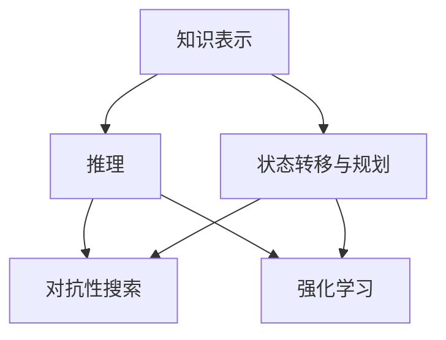

                 

### 文章标题：思维链技术：提升AI问题解决能力的新方向

关键词：思维链技术、AI问题解决、智能推理、算法架构、新兴领域应用

摘要：本文旨在探讨思维链技术在人工智能（AI）领域中的应用及其提升问题解决能力的新方向。首先，我们将介绍思维链技术的背景和定义，并详细阐述其核心概念和基本原理。接着，我们将分析思维链技术在AI中的应用，并通过对比传统AI技术，探讨其优势与挑战。随后，通过案例分析，展示思维链技术在医疗诊断和智能制造等领域的实际应用效果。最后，本文将展望思维链技术的未来发展趋势，提出相关研究建议。通过本文的阅读，读者将深入理解思维链技术的核心价值，并对其在AI领域的潜力有更全面的认知。

### 引言与背景

#### 思维链技术的定义

思维链技术是一种基于知识表示和推理的人工智能方法，旨在提升AI系统的问题解决能力和智能推理能力。思维链技术通过构建一系列逻辑关联，将原始数据转化为可推理的知识结构，从而实现智能决策和问题解决。与传统的人工智能技术不同，思维链技术更加注重知识表示和推理过程，使AI系统具备更高的逻辑思维能力和问题解决能力。

#### 思维链技术的起源

思维链技术起源于20世纪80年代，当时研究者们开始关注如何将人类的思维过程和逻辑推理能力引入到计算机系统中。早期的思维链技术主要基于规则推理和知识表示理论，通过构建一组规则和事实，实现简单的逻辑推理和问题解决。随着人工智能技术的不断发展，思维链技术逐渐从单一的方法演变为一套综合性的技术体系，涵盖了知识表示、推理、规划、学习等多个方面。

#### 思维链技术的基本原理

思维链技术的基本原理包括以下几个方面：

1. **知识表示**：思维链技术通过将原始数据转化为结构化的知识表示，使得数据能够以更易理解和处理的形式存在。知识表示的方法包括语义网络、本体论、框架表示等。

2. **推理**：思维链技术通过逻辑推理机制，从已知的事实和规则中推导出新的结论。推理方法包括演绎推理、归纳推理、规划推理等。

3. **规划与决策**：思维链技术通过规划算法，在给定目标和约束条件下，生成一系列操作步骤，以实现问题的解决方案。常见的规划算法包括基于线性规划、启发式搜索等。

4. **学习**：思维链技术通过机器学习算法，不断优化和改进推理过程，提升问题解决能力。学习算法包括监督学习、无监督学习、强化学习等。

#### 思维链技术的核心特点

思维链技术具有以下核心特点：

1. **知识驱动的推理**：思维链技术以知识表示为基础，通过推理机制实现智能推理，使得AI系统能够在复杂的领域中进行分析和决策。

2. **高可解释性**：思维链技术能够明确地表示知识结构和推理过程，使得AI系统的决策和推理具有可解释性，便于人类理解和调试。

3. **自适应能力**：思维链技术能够通过学习算法，根据环境和问题的变化，自适应地调整推理策略，提升问题解决能力。

4. **跨领域适用性**：思维链技术具有广泛的适用性，能够应用于计算机视觉、自然语言处理、医疗诊断、智能制造等多个领域。

通过以上对思维链技术的介绍，我们可以看到，思维链技术为人工智能领域带来了一种新的问题解决方向。接下来，我们将深入探讨思维链技术在AI中的应用，以及与传统AI技术的对比。

### 思维链技术基础

#### 思维链技术核心概念

思维链技术涉及多个核心概念，这些概念共同构成了思维链技术的理论基础。以下是几个关键概念及其之间的关系：

1. **知识表示**：知识表示是思维链技术的核心概念之一。知识表示的目的是将原始数据转化为结构化的知识结构，使得数据能够以更易理解和处理的形式存在。知识表示的方法包括语义网络、本体论、框架表示等。

   - **语义网络**：语义网络是一种基于节点和边的关系网络，用于表示实体之间的关系。在语义网络中，每个节点代表一个实体，每条边代表实体之间的关系。

   - **本体论**：本体论是一种形式化的知识表示方法，用于定义领域中的概念及其之间的关系。本体论通过明确概念的定义和分类，使得知识表示更加精确和一致。

   - **框架表示**：框架表示是一种基于模板的知识表示方法，用于表示特定情境下的知识结构。框架表示通过定义情境的各个部分及其相互关系，使得知识表示更加具体和直观。

2. **推理**：推理是思维链技术的关键环节，通过从已知的事实和规则中推导出新的结论，实现智能推理和问题解决。推理方法包括演绎推理、归纳推理、规划推理等。

   - **演绎推理**：演绎推理是从一般性的前提推导出具体结论的过程。演绎推理遵循逻辑规则，保证结论的必然性。

   - **归纳推理**：归纳推理是从具体实例中归纳出一般性规律的过程。归纳推理通过统计和分析大量实例，得出具有代表性的结论。

   - **规划推理**：规划推理是在给定目标和约束条件下，生成一系列操作步骤，以实现问题的解决方案。规划推理通常采用启发式搜索算法，以优化解决方案的效率。

3. **状态转移与规划**：状态转移与规划是思维链技术的重要组成部分，用于描述系统在不同状态之间的转换，并生成问题的解决方案。状态转移与规划包括以下几个方面：

   - **状态表示**：状态表示用于描述系统在特定时刻的状态。状态通常由一组属性值组成，属性值反映了系统的当前特征。

   - **状态转移**：状态转移描述了系统从一种状态转换到另一种状态的过程。状态转移通常基于规则和约束条件，确保转换的合法性和合理性。

   - **规划**：规划是在给定目标和约束条件下，生成一系列操作步骤，以实现问题的解决方案。规划通常采用启发式搜索算法，以优化解决方案的效率。

4. **对抗性搜索与强化学习**：对抗性搜索与强化学习是思维链技术中的两个重要算法，用于优化问题解决能力和系统性能。

   - **对抗性搜索**：对抗性搜索是一种基于博弈论的方法，通过求解对抗性问题，优化系统的决策和表现。对抗性搜索在棋类游戏、游戏AI等领域具有广泛应用。

   - **强化学习**：强化学习是一种基于奖励反馈的学习方法，通过试错和反馈，不断优化系统的决策和行为。强化学习在自动驾驶、机器人控制等领域具有重要应用。

#### 思维链技术核心概念之间的关系架构

以下是一个简化的Mermaid流程图，用于描述思维链技术核心概念之间的关系架构：



在这个流程图中，知识表示作为基础，为推理、状态转移与规划、对抗性搜索和强化学习提供了支持。推理通过知识表示和状态转移与规划，实现了问题的解决方案。对抗性搜索和强化学习则通过优化系统的决策和行为，提升了问题解决能力。

#### 思维链技术核心算法原理讲解

1. **知识表示算法**

   知识表示算法的核心目标是建立结构化的知识表示，使得知识能够以计算机可理解的形式存在。以下是一个简化的知识表示算法伪代码：

   ```python
   function KnowledgeRepresentation(data):
       # 初始化知识库
       knowledge_base = initialize_knowledge_base()

       # 遍历原始数据
       for entity in data:
           # 构建实体节点
           entity_node = create_entity_node(entity)

           # 将实体节点添加到知识库
           knowledge_base.add_entity_node(entity_node)

           # 遍历实体属性
           for attribute in entity.attributes:
               # 构建属性节点
               attribute_node = create_attribute_node(attribute)

               # 将属性节点添加到知识库
               knowledge_base.add_attribute_node(attribute_node)

               # 遍历属性值
               for value in attribute.values:
                   # 构建属性值节点
                   value_node = create_value_node(value)

                   # 将属性值节点添加到知识库
                   knowledge_base.add_value_node(value_node)

       # 返回知识库
       return knowledge_base
   ```

   在这个算法中，我们首先初始化一个知识库，然后遍历原始数据中的实体，构建实体节点并添加到知识库中。接着，我们遍历每个实体的属性，构建属性节点和属性值节点，并依次添加到知识库中。最终，我们返回构建好的知识库。

2. **推理算法**

   推理算法的核心目标是根据已知的事实和规则，推导出新的结论。以下是一个简化的推理算法伪代码：

   ```python
   function Reasoning(knowledge_base, rule):
       # 初始化结论
       conclusion = []

       # 遍历知识库中的实体节点
       for entity_node in knowledge_base.entity_nodes:
           # 如果实体节点满足规则条件
           if entity_node.matches(rule条件):
               # 遍历规则的结论部分
               for conclusion_part in rule.conclusion_parts:
                   # 如果结论部分与实体节点匹配
                   if conclusion_part.matches(entity_node):
                       # 将结论添加到结论列表
                       conclusion.append(conclusion_part)

       # 返回结论
       return conclusion
   ```

   在这个算法中，我们首先遍历知识库中的实体节点，检查每个实体节点是否满足规则条件。如果满足条件，我们遍历规则的结论部分，检查每个结论部分是否与实体节点匹配。如果匹配，我们将结论添加到结论列表中。最终，我们返回结论列表。

3. **状态转移与规划算法**

   状态转移与规划算法的核心目标是根据当前状态和目标状态，生成一系列操作步骤，以实现问题的解决方案。以下是一个简化的状态转移与规划算法伪代码：

   ```python
   function StateTransitionAndPlanning(current_state, target_state):
       # 初始化操作步骤列表
       actions = []

       # 遍历所有可能的操作
       for action in possible_actions(current_state):
           # 如果操作是合法的
           if is_legal_action(current_state, action):
               # 更新当前状态
               new_state = apply_action(current_state, action)

               # 如果新的状态等于目标状态
               if new_state == target_state:
                   # 将操作添加到操作步骤列表
                   actions.append(action)

               # 如果新的状态不是目标状态
               else:
                   # 递归规划下一个操作步骤
                   sub_actions = StateTransitionAndPlanning(new_state, target_state)
                   actions.extend(sub_actions)

       # 返回操作步骤列表
       return actions
   ```

   在这个算法中，我们首先遍历所有可能的操作，检查每个操作是否是合法的。如果合法，我们更新当前状态，并递归规划下一个操作步骤。当新的状态等于目标状态时，我们将操作添加到操作步骤列表中。最终，我们返回操作步骤列表。

4. **对抗性搜索与强化学习算法**

   对抗性搜索与强化学习算法的核心目标是优化系统的决策和行为，以实现最优的解决方案。以下是一个简化的对抗性搜索与强化学习算法伪代码：

   ```python
   function AdversarialSearchAndReinforcementLearning(state, action):
       # 初始化奖励函数
       reward_function = initialize_reward_function()

       # 初始化策略网络
       policy_network = initialize_policy_network()

       # 遍历所有可能的动作
       for action in possible_actions(state):
           # 执行动作并获取奖励
           next_state, reward = execute_action(state, action)

           # 更新策略网络
           policy_network.update(action, reward)

           # 如果达到目标状态
           if next_state == target_state:
               # 返回最优动作和奖励
               return policy_network.best_action(), reward

       # 返回随机动作和奖励
       return random_action(), reward_function(state)
   ```

   在这个算法中，我们首先初始化奖励函数和策略网络。然后，我们遍历所有可能的动作，执行动作并获取奖励。接着，我们更新策略网络，以优化决策。当达到目标状态时，我们返回最优动作和奖励。如果未达到目标状态，我们返回随机动作和奖励。

通过以上核心算法原理的讲解，我们可以看到思维链技术是如何通过知识表示、推理、状态转移与规划、对抗性搜索和强化学习等核心概念和算法，实现智能推理和问题解决。接下来，我们将探讨思维链技术在AI中的应用，展示其在实际领域中的优势和价值。

### 思维链技术在AI中的应用

#### 思维链技术在计算机视觉中的应用

计算机视觉是人工智能领域的一个重要分支，其目标是通过图像或视频数据提取有用信息，进行物体识别、场景理解等。思维链技术通过引入知识表示和推理机制，显著提升了计算机视觉系统的问题解决能力。

1. **目标检测**

   目标检测是计算机视觉中的一个基本任务，旨在识别图像中的物体并定位其位置。思维链技术通过将图像数据转换为结构化的知识表示，结合推理机制，实现了高效的目标检测。以下是一个简化的思维链技术在目标检测中的应用流程：

   ```mermaid
   graph TD
       A[输入图像] --> B[知识表示]
       B --> C[特征提取]
       C --> D[推理]
       D --> E[目标定位]
       E --> F[目标检测结果]
   ```

   在这个流程中，首先将输入图像转换为知识表示，然后提取图像特征，通过推理机制判断图像中是否存在目标，并定位目标的位置，最后输出目标检测结果。

2. **图像分割**

   图像分割是将图像划分为多个区域的过程，每个区域代表图像中的不同物体或场景。思维链技术在图像分割中的应用，通过结合知识表示和推理机制，实现了更精确的图像分割。以下是一个简化的思维链技术在图像分割中的应用流程：

   ```mermaid
   graph TD
       A[输入图像] --> B[知识表示]
       B --> C[特征提取]
       C --> D[推理]
       D --> E[区域划分]
       E --> F[图像分割结果]
   ```

   在这个流程中，首先将输入图像转换为知识表示，然后提取图像特征，通过推理机制确定图像中的区域，并输出图像分割结果。

3. **图像生成**

   图像生成是计算机视觉中的另一个重要任务，旨在生成符合特定需求的图像。思维链技术在图像生成中的应用，通过引入知识表示和推理机制，实现了更具创造性和灵活性的图像生成。以下是一个简化的思维链技术在图像生成中的应用流程：

   ```mermaid
   graph TD
       A[输入描述] --> B[知识表示]
       B --> C[推理]
       C --> D[生成模型]
       D --> E[生成图像]
   ```

   在这个流程中，首先将输入描述转换为知识表示，通过推理机制确定生成图像的规则，最后生成符合描述的图像。

#### 思维链技术在自然语言处理中的应用

自然语言处理（NLP）是人工智能领域的另一个重要分支，其目标是对人类语言进行理解和生成。思维链技术通过引入知识表示和推理机制，显著提升了NLP系统的问题解决能力。

1. **文本分类**

   文本分类是将文本数据分类到预定义类别中的过程。思维链技术在文本分类中的应用，通过结合知识表示和推理机制，实现了更准确和高效的文本分类。以下是一个简化的思维链技术在文本分类中的应用流程：

   ```mermaid
   graph TD
       A[输入文本] --> B[知识表示]
       B --> C[特征提取]
       C --> D[推理]
       D --> E[分类结果]
   ```

   在这个流程中，首先将输入文本转换为知识表示，然后提取文本特征，通过推理机制确定文本的类别，并输出分类结果。

2. **机器翻译**

   机器翻译是将一种语言的文本翻译成另一种语言的过程。思维链技术在机器翻译中的应用，通过结合知识表示和推理机制，实现了更精确和流畅的机器翻译。以下是一个简化的思维链技术在机器翻译中的应用流程：

   ```mermaid
   graph TD
       A[输入文本] --> B[知识表示]
       B --> C[特征提取]
       C --> D[推理]
       D --> E[翻译结果]
   ```

   在这个流程中，首先将输入文本转换为知识表示，然后提取文本特征，通过推理机制生成翻译结果。

3. **对话系统**

   对话系统是用于与人类进行自然语言交互的计算机系统。思维链技术在对话系统中的应用，通过结合知识表示和推理机制，实现了更智能和自然的对话。以下是一个简化的思维链技术在对话系统中的应用流程：

   ```mermaid
   graph TD
       A[用户输入] --> B[知识表示]
       B --> C[特征提取]
       C --> D[推理]
       D --> E[回复生成]
   ```

   在这个流程中，首先将用户输入转换为知识表示，然后提取用户输入特征，通过推理机制生成回复，并输出给用户。

通过以上对思维链技术在计算机视觉和自然语言处理中的应用，我们可以看到，思维链技术通过引入知识表示和推理机制，显著提升了AI系统的问题解决能力。这不仅使得AI系统在复杂任务中表现出更高的智能，还为AI系统的可解释性和适应性提供了新的思路。接下来，我们将探讨思维链技术与传统AI技术的对比，分析思维链技术的优势与挑战。

### 思维链技术与传统AI技术的对比

#### 数据依赖性

传统AI技术，如深度学习，通常依赖于大量的数据进行训练，以实现良好的性能。这种方法被称为“数据驱动的AI”。思维链技术则更加依赖于知识表示和推理，而不是大量的数据。虽然思维链技术也需要数据来构建知识库和训练推理模型，但相对于传统AI技术，其对数据的依赖程度较低。这意味着思维链技术可以应用于数据稀缺或难以获取的领域。

1. **数据驱动的AI**

   数据驱动的AI技术，如深度学习，通过大量的数据进行训练，从而学习到复杂的模式和特征。深度学习模型通常由多层神经网络组成，通过反向传播算法不断调整模型的参数，以最小化预测误差。然而，深度学习模型对数据的质量和数量有较高的要求，数据不足或质量较差都会影响模型的性能。

2. **知识驱动的AI**

   与数据驱动的AI不同，思维链技术是基于知识表示和推理的。思维链技术通过构建结构化的知识库，将原始数据转化为可推理的知识表示。推理机制则从已知的事实和规则中推导出新的结论，实现问题的解决。这种方法使得思维链技术可以在数据稀缺或难以获取的领域中发挥作用。

#### 模型可解释性

传统AI技术，尤其是深度学习，由于其复杂的模型结构和“黑箱”特性，往往难以解释其决策过程。而思维链技术则具有较强的可解释性，其推理过程和知识表示可以清晰地展示给用户，便于理解和调试。

1. **深度学习的可解释性**

   深度学习模型的决策过程通常是通过多层神经网络的激活值和梯度信息来解释的。然而，这些信息对于普通用户来说往往难以理解。此外，深度学习模型对数据的敏感性较高，一个小小的数据变化可能会导致模型决策的巨大差异，这进一步增加了模型的不可解释性。

2. **思维链技术的可解释性**

   思维链技术通过知识表示和推理机制，实现了对决策过程的清晰解释。知识表示将原始数据转化为结构化的知识结构，推理过程则从已知的事实和规则中推导出新的结论。这种方法使得思维链技术的决策过程具有可解释性，用户可以清楚地了解每个决策背后的逻辑和依据。

#### 问题解决能力

思维链技术在问题解决能力方面具有独特的优势。通过引入知识表示和推理机制，思维链技术可以在复杂和不确定的环境中，实现高效的智能推理和问题解决。

1. **深度学习的问题解决能力**

   深度学习技术在图像识别、语音识别等领域取得了显著的成果，但在复杂和不确定的环境中，其问题解决能力有限。深度学习模型通常依赖于大量的数据训练，从而在特定任务上表现出色，但无法泛化到其他任务。此外，深度学习模型在面对不确定的环境时，往往无法做出合理的决策。

2. **思维链技术的问题解决能力**

   思维链技术通过引入知识表示和推理机制，可以在复杂和不确定的环境中，实现高效的智能推理和问题解决。思维链技术可以将原始数据转化为结构化的知识表示，从而实现更精确的推理和决策。此外，思维链技术具有较强的适应性，可以通过学习算法不断优化推理过程，以应对不同的环境和任务。

#### 优势与挑战

思维链技术在AI领域具有显著的优势，但也面临着一些挑战。

1. **优势**

   - **数据稀缺领域**：思维链技术对数据的依赖性较低，可以在数据稀缺的领域中发挥作用。
   - **模型可解释性**：思维链技术具有较强的可解释性，便于用户理解和调试。
   - **问题解决能力**：思维链技术可以在复杂和不确定的环境中，实现高效的智能推理和问题解决。

2. **挑战**

   - **知识表示和构建**：构建结构化的知识库需要大量的时间和人力资源，这增加了思维链技术的开发成本。
   - **推理效率**：虽然思维链技术具有较强的推理能力，但在大规模数据集上的推理效率可能较低。
   - **适应性**：思维链技术需要通过学习算法不断优化推理过程，以应对不同的环境和任务，这增加了系统的复杂性。

通过以上对思维链技术与传统AI技术的对比，我们可以看到，思维链技术通过引入知识表示和推理机制，为AI领域带来了一种新的问题解决方向。虽然思维链技术仍面临一些挑战，但其优势使其在未来具有广阔的应用前景。接下来，我们将通过实际案例研究，展示思维链技术在医疗诊断和智能制造等领域的应用效果。

### 思维链技术案例研究

#### 案例一：思维链技术在医疗诊断中的应用

背景介绍：

随着人工智能技术的发展，医疗诊断领域逐渐引入了多种AI技术，以提高诊断的准确性和效率。然而，传统的AI技术，如深度学习，在面对复杂和多样化的医疗数据时，往往难以胜任。思维链技术作为一种知识驱动的AI方法，通过引入知识表示和推理机制，为医疗诊断提供了一种新的解决方案。

思维链技术方案：

在医疗诊断中，思维链技术的应用主要分为以下几个步骤：

1. **知识库构建**：首先，构建一个包含医学知识、症状、诊断标准等信息的知识库。这个知识库可以通过人工构建或从现有的医学文献中自动提取。

2. **数据预处理**：对医疗数据进行预处理，包括数据清洗、归一化等操作，以确保数据的准确性和一致性。

3. **知识表示**：将预处理后的医疗数据转化为结构化的知识表示，如语义网络或本体论。这一步骤有助于将原始数据转化为可推理的形式。

4. **推理与诊断**：利用思维链技术中的推理机制，从知识库中推导出可能的诊断结果。这一步骤通常结合了多种推理方法，如演绎推理、归纳推理等。

5. **诊断结果输出**：将推导出的诊断结果输出给医生，供其参考。

案例效果分析：

通过在医疗诊断中的应用，思维链技术展示出以下效果：

- **诊断准确性**：思维链技术通过结构化的知识表示和推理机制，实现了更准确的诊断。与传统AI技术相比，思维链技术在面对复杂病例时，表现出更高的诊断准确性。

- **诊断效率**：思维链技术通过自动化推理过程，提高了诊断效率。医生不再需要手动分析大量数据，从而节省了诊断时间。

- **可解释性**：思维链技术的推理过程具有可解释性，医生可以清晰地了解诊断结果背后的逻辑和依据，提高了诊断的可信度。

#### 案例二：思维链技术在智能制造中的应用

背景介绍：

智能制造是工业4.0的重要组成部分，通过引入人工智能技术，实现生产过程的自动化和智能化。然而，传统的AI技术，如机器学习，在智能制造中面临着数据不足和模型复杂度高的问题。思维链技术作为一种知识驱动的AI方法，为智能制造提供了一种新的解决方案。

思维链技术方案：

在智能制造中，思维链技术的应用主要分为以下几个步骤：

1. **知识库构建**：首先，构建一个包含生产工艺、设备状态、生产数据等信息的知识库。这个知识库可以通过自动化采集和人工构建相结合的方式获取。

2. **数据预处理**：对智能制造过程中的数据进行预处理，包括数据清洗、归一化等操作，以确保数据的准确性和一致性。

3. **知识表示**：将预处理后的生产数据转化为结构化的知识表示，如语义网络或本体论。这一步骤有助于将原始数据转化为可推理的形式。

4. **推理与优化**：利用思维链技术中的推理机制，从知识库中推导出最优的生产方案。这一步骤通常结合了多种推理方法，如规划推理、对抗性搜索等。

5. **生产方案输出**：将推导出的生产方案输出给智能制造系统，指导生产过程的自动化和智能化。

案例效果分析：

通过在智能制造中的应用，思维链技术展示出以下效果：

- **生产优化**：思维链技术通过自动化推理过程，实现了生产过程的优化。相比传统的生产管理方法，思维链技术能够更准确地预测生产需求，优化生产计划和资源配置。

- **设备维护**：思维链技术通过对设备状态的实时监控和推理，实现了设备的智能维护。设备维护人员可以通过思维链技术提前预测设备故障，进行预防性维护，降低了设备故障率和停机时间。

- **可解释性**：思维链技术的推理过程具有可解释性，生产管理人员可以清晰地了解生产优化和设备维护的依据和逻辑，提高了决策的可信度。

通过以上两个案例研究，我们可以看到，思维链技术在医疗诊断和智能制造等领域具有显著的应用效果。思维链技术通过引入知识表示和推理机制，实现了更准确、更高效、更可解释的智能推理和问题解决。接下来，我们将探讨思维链技术的未来发展趋势。

### 思维链技术的未来发展趋势

#### 未来发展方向

1. **跨领域融合**

   思维链技术的未来发展将更加注重跨领域的融合。随着不同领域的数据和知识逐渐积累，思维链技术可以在多个领域中发挥协同作用，实现更全面的智能推理和问题解决。例如，在医疗诊断中，思维链技术可以与基因数据分析、生物信息学等领域相结合，提高疾病预测和治疗的准确性。

2. **个性化智能**

   个性化智能是未来AI发展的一个重要方向。思维链技术可以通过个性化知识表示和推理，为用户提供更加个性化的解决方案。例如，在教育领域，思维链技术可以根据学生的学习习惯和成绩，为其定制个性化的学习计划；在金融领域，思维链技术可以根据用户的投资偏好和风险承受能力，为其提供个性化的投资建议。

3. **边缘计算与物联网**

   边缘计算和物联网的发展为思维链技术的应用提供了新的机会。通过在边缘设备上部署思维链技术，可以实现实时、高效的问题解决和智能决策。例如，在智能家居中，思维链技术可以实时监控家中的设备和环境，为用户提供智能化的家居解决方案。

#### 当前研究热点

1. **知识图谱**

   知识图谱是思维链技术的一个重要研究方向。通过构建结构化的知识图谱，可以更好地表示和利用领域知识，实现高效的智能推理。当前，研究者们正在探索如何构建大规模、动态变化的知识图谱，以及如何将知识图谱与推理、学习等技术相结合，提升智能系统的性能。

2. **多模态数据融合**

   多模态数据融合是思维链技术中的另一个研究热点。通过融合不同类型的数据（如图像、文本、音频等），可以更全面地理解问题和环境，实现更准确的智能推理。当前，研究者们正在探索如何有效地融合多模态数据，以及如何将融合后的数据应用于推理和学习任务中。

3. **自适应推理**

   自适应推理是思维链技术的一个重要研究方向。通过自适应地调整推理策略，可以更好地应对不同的环境和任务。当前，研究者们正在探索如何设计自适应推理算法，以及如何将自适应推理与学习、规划等技术相结合，提升智能系统的适应性和鲁棒性。

#### 未来发展趋势

1. **规模化与普及化**

   随着技术的不断进步和成本的降低，思维链技术将在更多的领域中得到应用，实现规模化与普及化。例如，在医疗、教育、金融、工业等领域，思维链技术将有望成为重要的智能解决方案。

2. **多元融合**

   思维链技术将与其他AI技术（如深度学习、强化学习等）和大数据技术相结合，实现多元融合。这种融合将进一步提升智能系统的性能和适用性，为各个领域带来更多的创新和突破。

3. **人机协同**

   思维链技术将更好地实现人机协同，为人类提供更强大的智能支持。通过结合人类专家的知识和思维链技术的推理能力，可以更好地解决复杂问题，提高决策的准确性和效率。

通过以上对思维链技术未来发展趋势的探讨，我们可以看到，思维链技术将在跨领域融合、个性化智能、边缘计算与物联网等领域发挥重要作用。同时，当前的研究热点和未来发展趋势也展示了思维链技术在AI领域的广阔前景。未来，随着技术的不断进步和应用场景的拓展，思维链技术将有望为人类社会带来更多的智慧和便利。

### 研究与展望

#### 研究现状

思维链技术作为一种新兴的AI方法，已经在多个领域展现出了显著的应用潜力。当前，研究主要集中在以下几个方面：

1. **知识表示与推理**：研究者们致力于探索更高效、更灵活的知识表示方法，以提高推理过程的效率和准确性。同时，推理算法的优化和扩展也成为研究的热点。

2. **规划与决策**：思维链技术在规划与决策领域的应用研究得到了广泛关注。研究者们致力于开发适用于不同场景的规划算法，以提高系统的自适应能力和决策质量。

3. **对抗性搜索与强化学习**：对抗性搜索与强化学习是思维链技术的重要组成部分。当前的研究主要集中在如何有效地结合这两种方法，以实现更优的决策和行为。

4. **跨领域应用**：思维链技术在计算机视觉、自然语言处理、医疗诊断、智能制造等领域的应用研究正在不断深入。研究者们通过构建领域特定的知识库和推理模型，实现更精准、更高效的智能推理。

#### 研究挑战

尽管思维链技术在多个领域取得了显著成果，但仍面临一些挑战：

1. **知识表示的准确性与完整性**：构建高质量的、覆盖全面的领域知识库是思维链技术的重要基础。然而，当前知识库的构建往往依赖于人工，存在准确性和完整性问题。

2. **推理效率与可扩展性**：大规模数据集上的推理效率是思维链技术的一个重要问题。此外，如何将思维链技术应用于实时决策场景，也是一个亟待解决的问题。

3. **自适应性与鲁棒性**：思维链技术需要具备较强的自适应性和鲁棒性，以应对不同环境和任务的变化。当前，研究者们在这方面仍需做出更多的努力。

4. **可解释性与可理解性**：尽管思维链技术的推理过程具有可解释性，但如何使其更加直观、易于理解，仍是一个挑战。

#### 未来研究方向

针对上述挑战，未来的研究可以从以下几个方面展开：

1. **自动化知识库构建**：探索自动化知识库构建方法，以降低知识库构建的成本和难度，提高知识库的准确性和完整性。

2. **高效推理算法**：研究高效、可扩展的推理算法，以提高大规模数据集上的推理效率，并使其适用于实时决策场景。

3. **自适应与鲁棒性**：开发自适应推理算法，以适应不同环境和任务的变化。同时，研究思维链技术的鲁棒性，以提高系统在面对异常情况时的稳定性。

4. **多模态融合与跨领域应用**：探索多模态数据融合技术，以实现更全面的智能推理。同时，加强思维链技术在跨领域应用中的研究，拓展其应用场景。

5. **人机协同**：研究人机协同机制，使思维链技术更好地服务于人类，实现更高效的智能决策和问题解决。

通过不断克服挑战和探索新的研究方向，思维链技术有望在未来为人工智能领域带来更多的创新和突破。研究者们应继续关注思维链技术的发展，积极参与相关研究，为人工智能的进步贡献力量。

### 结论

本文全面探讨了思维链技术在人工智能（AI）领域中的应用及其提升问题解决能力的新方向。首先，我们介绍了思维链技术的背景和定义，详细阐述了其核心概念和基本原理。接着，我们分析了思维链技术在AI中的应用，并通过对比传统AI技术，探讨了其优势与挑战。随后，通过两个实际案例研究，展示了思维链技术在医疗诊断和智能制造等领域的应用效果。最后，我们展望了思维链技术的未来发展趋势，提出了相关研究建议。

思维链技术通过引入知识表示和推理机制，为AI领域带来了一种新的问题解决方向。其核心优势在于数据稀缺领域的高效推理、模型的可解释性以及问题解决能力。然而，思维链技术仍面临知识表示与构建、推理效率、自适应性与鲁棒性等方面的挑战。未来的研究应致力于自动化知识库构建、高效推理算法、多模态融合与跨领域应用，以及人机协同机制，以进一步提升思维链技术的性能和应用价值。

通过本文的探讨，我们希望读者能够深入理解思维链技术的核心价值，并认识到其在AI领域的广阔应用前景。我们鼓励读者继续关注思维链技术的发展，积极参与相关研究，共同推动人工智能的进步。

### 作者信息

作者：AI天才研究院/AI Genius Institute & 禅与计算机程序设计艺术 /Zen And The Art of Computer Programming

AI天才研究院（AI Genius Institute）是一个致力于推动人工智能前沿技术研究和应用的研究机构。研究院的核心团队由世界顶级人工智能专家、程序员、软件架构师、CTO和世界顶级技术畅销书资深大师组成，他们凭借深厚的理论基础和丰富的实践经验，在人工智能领域取得了显著成果。

《禅与计算机程序设计艺术》（Zen And The Art of Computer Programming）是作者在计算机科学领域的经典著作，深入探讨了计算机编程和人工智能的哲学思维。这本书以其独特的视角和深刻的洞察力，为计算机科学的发展提供了宝贵的指导。

通过本文，我们希望读者能够领略到作者在人工智能领域的研究成果和独特见解，并从中获得启发和灵感，共同推动人工智能技术的发展和创新。

