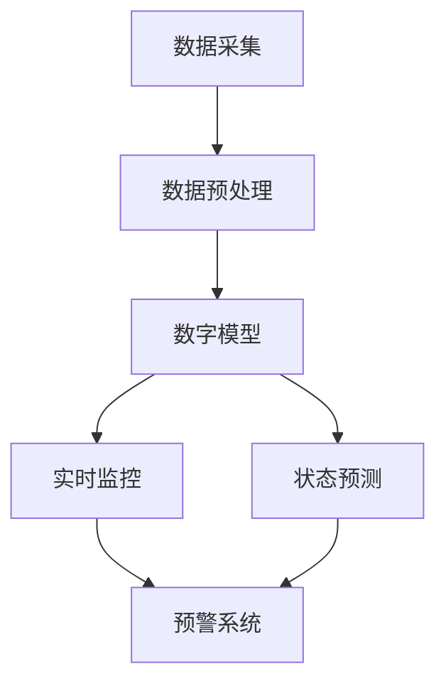
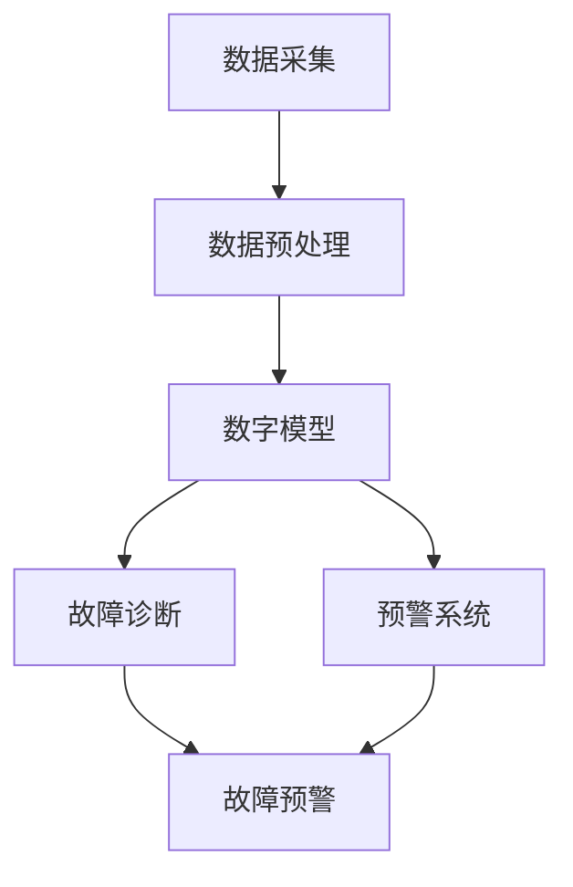
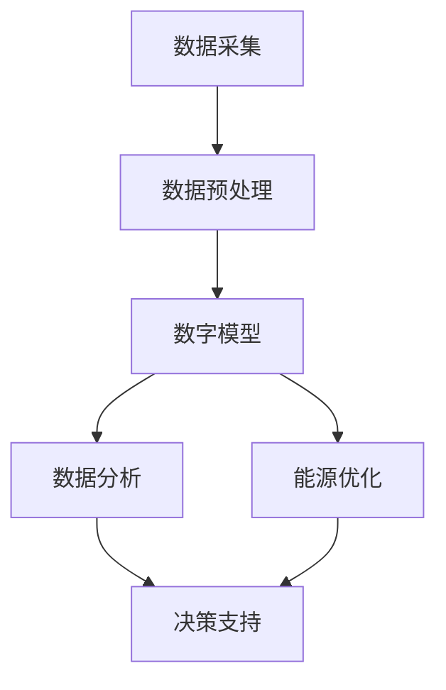

                 

### 数字孪生在风力发电场优化中的应用

#### 关键词：数字孪生、风力发电场、优化、模拟、算法、数据分析

#### 摘要：

数字孪生是一种先进的虚拟仿真技术，通过对物理系统的全面建模和实时数据交互，实现对实际物理系统的监控、分析和优化。风力发电场作为可再生能源的重要组成部分，其运行效率和可靠性对能源供应具有重要意义。本文将深入探讨数字孪生技术在风力发电场优化中的应用，包括背景介绍、核心概念与联系、核心算法原理讲解、数学模型与公式解析、项目实战和最佳实践等方面。通过本文的讨论，旨在为读者提供对数字孪生技术在风力发电场优化中应用的全面理解。

#### 目录：

1. **引言**
   1.1 数字孪生技术概述
   1.2 风力发电场的现状与挑战
   1.3 数字孪生在风力发电场中的应用前景

2. **数字孪生技术基础**
   2.1 数字孪生概念与原理
   2.2 数字孪生建模方法
   2.3 数字孪生技术架构

3. **风力发电场模拟与建模**
   3.1 风力发电场环境模拟
   3.2 风力发电机模型建立
   3.3 风电场运行数据采集与处理

4. **数字孪生风力发电场优化算法**
   4.1 遗传算法在风力发电场优化中的应用
   4.2 人工神经网络在风力发电场优化中的应用
   4.3 支持向量机在风力发电场优化中的应用

5. **数学模型与公式解析**
   5.1 最优化理论
   5.2 线性规划
   5.3 非线性规划
   5.4 数学公式与模型解析

6. **数字孪生在风力发电场中的应用案例**
   6.1 案例一：风电场运行状态监测与预测
   6.2 案例二：风电场故障诊断与预警
   6.3 案例三：风电场能源管理优化

7. **数字孪生技术在风力发电场的未来发展趋势**
   7.1 数字孪生技术的挑战与机遇
   7.2 数字孪生技术在风力发电场的未来发展
   7.3 未来展望与建议

8. **附录**
   8.1 数字孪生技术相关工具和资源
   8.2 参考文献

### 1. 引言

#### 1.1 数字孪生技术概述

数字孪生（Digital Twin）是一种新兴的虚拟仿真技术，通过构建物理实体的数字映射，实现对物理系统的实时监控、分析和优化。数字孪生技术最早可以追溯到20世纪80年代的制造业领域，随着计算机技术的飞速发展和大数据、物联网等技术的普及，数字孪生技术逐渐成熟并应用于各个行业。

在风力发电领域，数字孪生技术可以通过建立风电场的数字模型，模拟风力发电过程中的各种参数和工况，实现对风电场的运行状态、性能优化和故障诊断等方面的实时监控和分析。数字孪生技术的核心在于将物理实体和虚拟模型进行实时数据交互，通过不断更新虚拟模型中的数据，使其与实际物理系统保持高度一致。

#### 1.2 风力发电场的现状与挑战

风力发电作为一种可再生能源，具有清洁、高效、环保等特点，已成为全球能源发展的重要方向。然而，风力发电场在运行过程中面临着一系列挑战：

1. **运行效率低**：风力发电场的运行效率受多种因素影响，如风速、风向、地形等。传统的风力发电场运行管理模式难以实现对运行效率的精准调控。

2. **设备维护成本高**：风力发电场的设备数量庞大，且运行环境恶劣，设备维护成本较高。传统的设备维护方法依赖于人工巡检和定期检查，难以实现实时监控和预防性维护。

3. **故障诊断困难**：风力发电场中各种设备的运行状态复杂，故障诊断困难。传统的故障诊断方法往往基于经验和历史数据，难以实现对故障的早期预警和快速诊断。

4. **能源管理复杂**：风力发电场的能源管理涉及发电、储能、输电等多个环节，管理复杂。传统的能源管理模式难以实现能源的智能分配和高效利用。

#### 1.3 数字孪生在风力发电场中的应用前景

数字孪生技术的引入为解决风力发电场面临的挑战提供了新的思路和手段。通过构建风力发电场的数字孪生模型，可以实现以下应用：

1. **运行状态监测与预测**：通过对数字孪生模型中的实时数据进行分析，可以实现对风力发电场运行状态的实时监测和预测。及时发现异常情况，提前预警，减少故障风险。

2. **设备维护与优化**：基于数字孪生模型，可以实现设备的远程监控和智能维护。通过对设备运行数据的分析，可以预测设备故障的发生时间，提前进行维护，减少设备故障率，降低维护成本。

3. **故障诊断与预警**：通过对数字孪生模型中的数据进行分析，可以实现对风力发电场中各种设备的故障诊断和预警。及时发现故障隐患，提前采取措施，避免故障扩大。

4. **能源管理优化**：通过对数字孪生模型中的数据进行分析，可以实现对风力发电场能源的智能分配和优化。提高能源利用效率，降低能源浪费，实现绿色环保。

总之，数字孪生技术在风力发电场优化中具有广阔的应用前景，将为风力发电行业带来革命性的变化。接下来，本文将详细探讨数字孪生技术的基础、风力发电场的模拟与建模、优化算法、数学模型与公式解析、应用案例以及未来发展趋势。

---

### 2. 数字孪生技术基础

#### 2.1 数字孪生概念与原理

数字孪生（Digital Twin）是一种基于虚拟现实、大数据、物联网和人工智能等先进技术，对物理实体进行高精度建模、实时数据交互和智能分析的应用。数字孪生技术的基本原理是通过构建物理实体的数字映射，实现物理实体和虚拟模型之间的实时数据交互，从而达到对物理实体的实时监控、分析和优化。

数字孪生的核心概念包括以下几个方面：

1. **物理实体**：物理实体是指实际存在的物体或系统，如风力发电场、工厂生产线等。

2. **数字映射**：数字映射是指将物理实体的各个方面，如结构、性能、行为等，转化为数字模型的过程。数字模型是对物理实体的高度抽象和模拟。

3. **实时数据交互**：实时数据交互是指通过传感器、物联网设备等，将物理实体的实时数据传输到数字模型中，实现物理实体和数字模型之间的数据同步。

4. **智能分析**：智能分析是指利用大数据、人工智能等技术，对数字模型中的数据进行分析，实现对物理实体的状态监控、故障诊断、性能优化等。

数字孪生的构建过程主要包括以下几个步骤：

1. **数据采集**：通过传感器、物联网设备等，对物理实体进行数据采集，包括结构参数、运行状态、环境参数等。

2. **数据预处理**：对采集到的数据进行清洗、去噪、归一化等处理，确保数据的质量和一致性。

3. **数字建模**：基于采集到的数据，使用建模工具和方法，构建物理实体的数字模型。数字模型可以是几何模型、物理模型、功能模型等。

4. **实时数据交互**：通过数据传输协议，将物理实体的实时数据传输到数字模型中，实现物理实体和数字模型之间的数据同步。

5. **智能分析**：利用大数据、人工智能等技术，对数字模型中的数据进行分析，实现对物理实体的实时监控、分析和优化。

#### 2.2 数字孪生建模方法

数字孪生建模方法主要包括几何建模、物理建模和功能建模三种。

1. **几何建模**：几何建模主要用于构建物理实体的三维模型。几何建模方法主要包括以下几种：

   - **三维建模软件**：如AutoCAD、SolidWorks、CATIA等，可以用于构建物理实体的三维几何模型。

   - **点云建模**：通过激光扫描、三维摄影测量等技术，获取物理实体的点云数据，然后使用点云建模软件（如CloudCompare、MeshLab等）进行三维建模。

   - **参数化建模**：使用参数化建模工具（如Grasshopper、Dynamo等），通过定义参数关系，构建物理实体的三维模型。

2. **物理建模**：物理建模主要用于构建物理实体的物理模型，模拟物理实体的运动、力学、热学等特性。物理建模方法主要包括以下几种：

   - **有限元分析**：通过建立物理实体的有限元模型，模拟物理实体的力学特性，如应力、变形等。

   - **多体动力学**：通过建立物理实体的多体动力学模型，模拟物理实体的运动特性，如速度、加速度等。

   - **热力学模拟**：通过建立物理实体的热力学模型，模拟物理实体的热学特性，如温度、热传导等。

3. **功能建模**：功能建模主要用于构建物理实体的功能模型，模拟物理实体的行为、功能等。功能建模方法主要包括以下几种：

   - **事件驱动建模**：通过定义事件和行为规则，模拟物理实体的行为。

   - **流程建模**：通过定义物理实体的工作流程，模拟物理实体的工作过程。

   - **神经网络建模**：通过建立神经网络的模型，模拟物理实体的行为和功能。

#### 2.3 数字孪生技术架构

数字孪生技术架构主要包括数据采集、数据预处理、数字建模、实时数据交互、智能分析和可视化展示等几个部分。

1. **数据采集**：数据采集是数字孪生技术的关键环节，通过传感器、物联网设备等，采集物理实体的各种数据，如结构参数、运行状态、环境参数等。

2. **数据预处理**：对采集到的数据进行清洗、去噪、归一化等处理，确保数据的质量和一致性。数据预处理是数字孪生建模的重要基础。

3. **数字建模**：基于采集到的数据，使用建模工具和方法，构建物理实体的数字模型。数字建模是数字孪生技术的核心，决定了数字孪生的精度和实用性。

4. **实时数据交互**：通过数据传输协议，将物理实体的实时数据传输到数字模型中，实现物理实体和数字模型之间的数据同步。实时数据交互是数字孪生技术的关键，决定了数字孪生的实时性和准确性。

5. **智能分析**：利用大数据、人工智能等技术，对数字模型中的数据进行分析，实现对物理实体的实时监控、分析和优化。智能分析是数字孪生技术的灵魂，决定了数字孪生的应用价值。

6. **可视化展示**：将数字模型和智能分析结果进行可视化展示，方便用户直观地了解物理实体的运行状态和性能。可视化展示是数字孪生技术的窗口，决定了用户对数字孪生的感知和体验。

总之，数字孪生技术作为一种新兴的虚拟仿真技术，具有广泛的应用前景。通过构建物理实体的数字映射，实现物理实体和虚拟模型之间的实时数据交互和智能分析，数字孪生技术为风力发电场的优化提供了新的手段和思路。在接下来的章节中，我们将详细探讨风力发电场的模拟与建模、优化算法、数学模型与公式解析等内容。

---

### 3. 风力发电场模拟与建模

#### 3.1 风力发电场环境模拟

风力发电场的环境模拟是数字孪生技术构建过程中的关键环节。环境模拟的目的是通过模拟风力发电场所处的自然环境和地形地貌，为风力发电机的运行提供准确的气象数据和地形数据。

**气象数据模拟**：
气象数据是风力发电场运行的重要参数，包括风速、风向、温度、湿度、气压等。气象数据模拟通常采用以下方法：

1. **历史气象数据**：利用历史气象数据进行统计分析，生成风力发电场所在区域的气象数据分布模型。这种方法适用于已有大量气象数据的情况。

2. **数值气象模型**：利用数值气象模型（如WRF模型）对风力发电场所在区域的气象条件进行模拟。这种方法可以模拟不同时间和空间尺度的气象变化，但计算资源需求较大。

3. **气象预测模型**：利用机器学习算法（如时间序列模型、神经网络等）对气象数据进行预测，生成未来一定时间内的气象数据。这种方法适用于需要实时预测气象数据的情况。

**地形地貌模拟**：
地形地貌对风力发电机的运行有重要影响，包括地形起伏、障碍物分布、地表粗糙度等。地形地貌模拟通常采用以下方法：

1. **遥感数据**：利用遥感技术（如卫星遥感、无人机遥感等）获取风力发电场所在区域的地形地貌数据。

2. **地理信息系统（GIS）**：利用GIS技术对地形地貌进行建模和可视化。GIS可以提供地形三维模型、等高线图、坡度图等。

3. **地形分析软件**：利用地形分析软件（如ArcGIS、Global Mapper等）对地形数据进行分析和处理，生成地形模型。

**模拟结果与应用**：
通过气象数据模拟和地形地貌模拟，可以得到风力发电场运行的环境模型。该模型可以用于以下几个方面：

1. **风机选址**：根据模拟得到的气象和地形数据，选择合适的风机安装位置，提高风机的运行效率。

2. **风机布局**：根据模拟得到的气象和地形数据，优化风机的布局，降低风机的相互影响，提高整个风电场的发电量。

3. **风险评估**：通过模拟不同气象和地形条件下的风机运行状态，评估风机的运行风险，提前采取预防措施。

#### 3.2 风力发电机模型建立

风力发电机的模型建立是数字孪生技术构建过程中的核心环节。风力发电机模型包括机械模型、电气模型和控制系统模型等。

**机械模型建立**：
机械模型用于模拟风力发电机的机械运动和受力情况。建立机械模型通常包括以下步骤：

1. **风机叶片建模**：使用三维建模软件（如CATIA、SolidWorks等）建立风机叶片的三维模型。

2. **风机机舱建模**：建立风机机舱的三维模型，包括齿轮箱、发电机、变桨系统等。

3. **机械连接建模**：建立风机叶片、机舱和其他机械部件之间的连接关系，模拟机械部件之间的相互作用。

4. **力学分析**：利用有限元分析软件（如ANSYS、ABAQUS等）对机械模型进行力学分析，评估风机在运行过程中各部件的受力情况。

**电气模型建立**：
电气模型用于模拟风力发电机的电气特性和运行状态。建立电气模型通常包括以下步骤：

1. **发电机建模**：建立风力发电机的电气模型，包括定子、转子、绕组等。

2. **电气连接建模**：建立发电机与其他电气设备（如变压器、开关柜等）之间的电气连接关系。

3. **电气特性分析**：利用电磁场分析软件（如ANSYS HFSS、COMSOL Multiphysics等）对电气模型进行电气特性分析，评估发电机的电气性能。

**控制系统模型建立**：
控制系统模型用于模拟风力发电机的控制策略和运行模式。建立控制系统模型通常包括以下步骤：

1. **控制逻辑建模**：建立风力发电机的控制逻辑，包括启动、停机、转速控制、功率调节等。

2. **控制算法建模**：建立风力发电机的控制算法，如PID控制、模糊控制、神经网络控制等。

3. **仿真与优化**：利用仿真软件（如MATLAB/Simulink、ANSYS/Fluent等）对控制系统模型进行仿真和优化，评估控制策略的有效性。

**模拟结果与应用**：
通过建立风力发电机的机械模型、电气模型和控制系统模型，可以得到风力发电机的数字模型。该模型可以用于以下几个方面：

1. **性能评估**：通过对数字模型进行仿真和优化，评估风力发电机的性能，包括发电效率、运行稳定性等。

2. **故障诊断**：通过对数字模型进行故障仿真，诊断风力发电机的潜在故障，提前采取预防措施。

3. **控制策略优化**：通过对数字模型进行仿真，优化风力发电机的控制策略，提高运行效率。

#### 3.3 风电场运行数据采集与处理

风电场运行数据采集与处理是数字孪生技术构建过程中的关键环节。通过实时采集风电场运行数据，可以实现对风力发电场的实时监控和数据分析。

**数据采集**：
数据采集通常通过传感器和物联网设备实现。传感器可以采集风力发电场的各种数据，如风速、风向、温度、湿度、发电机转速、功率等。物联网设备可以实现对传感器的数据传输和存储。

1. **传感器选择**：根据风电场的需求，选择合适的传感器，如风速传感器、风向传感器、温度传感器等。

2. **传感器布置**：在风电场中合理布置传感器，确保数据的准确性和完整性。

3. **数据传输**：通过无线传输技术（如Wi-Fi、LoRa等）将传感器数据传输到数据中心。

**数据处理**：
数据处理包括数据清洗、去噪、归一化等步骤，确保数据的质量和一致性。

1. **数据清洗**：去除数据中的异常值、缺失值等，保证数据的完整性。

2. **数据去噪**：对采集到的数据进行滤波处理，去除噪声和干扰。

3. **数据归一化**：对数据进行归一化处理，使数据在同一尺度范围内，便于分析和比较。

**数据分析**：
通过对处理后的数据进行统计分析、机器学习等分析，可以得到风力发电场的运行状态、性能指标、故障特征等信息。

1. **统计分析**：对数据进行统计分析，如均值、方差、相关性等，评估风电场的运行状况。

2. **机器学习**：利用机器学习算法（如决策树、支持向量机、神经网络等），对数据进行分析和预测，实现对风电场运行状态的实时监控和故障诊断。

**数据应用**：
处理后的数据可以用于以下几个方面：

1. **运行状态监控**：通过实时数据监控，及时发现风电场的异常情况，提前预警。

2. **性能评估**：通过对历史数据的分析，评估风电场的发电效率、运行稳定性等性能指标。

3. **故障诊断**：通过对故障数据的分析，诊断风电场的潜在故障，提前采取预防措施。

通过风力发电场环境模拟、风力发电机模型建立和运行数据采集与处理，可以得到风力发电场的数字孪生模型。该模型可以用于风力发电场的实时监控、性能优化和故障诊断，为风电场的运行提供有力支持。

---

### 4. 数字孪生风力发电场优化算法

#### 4.1 遗传算法在风力发电场优化中的应用

遗传算法（Genetic Algorithm, GA）是一种模拟自然选择过程的优化算法，广泛应用于各种复杂优化问题。在风力发电场优化中，遗传算法可以用于风机的调度、负载分配、故障诊断等方面。

**遗传算法基本原理**：

遗传算法主要包括以下步骤：

1. **初始化种群**：随机生成一组解作为初始种群。

2. **适应度评估**：对每个个体进行适应度评估，适应度越高，表示个体的质量越好。

3. **选择**：根据个体的适应度，选择优秀的个体进行繁殖，形成新的种群。

4. **交叉**：通过交叉操作，将两个个体的部分基因进行交换，生成新的个体。

5. **变异**：对个体进行变异操作，增加种群的多样性。

6. **迭代**：重复选择、交叉、变异和适应度评估，直到满足停止条件（如达到最大迭代次数或适应度阈值）。

**遗传算法在风力发电场优化中的应用**：

1. **风机调度优化**：在风力发电场中，不同风机之间的负载分配会影响整体发电效率和设备寿命。遗传算法可以用于优化风机调度，提高发电效率。

   - **编码**：将风机调度问题转化为遗传算法的编码问题，如二进制编码或实数编码。
   - **适应度函数**：设计适应度函数，以发电量最大或设备寿命最久为目标。

2. **负载分配优化**：在风电场运行过程中，风机的负载分配需要根据实时风速和发电需求进行调整。遗传算法可以用于优化负载分配，提高发电效率和设备利用率。

   - **编码**：将负载分配问题转化为遗传算法的编码问题，如整数编码。
   - **适应度函数**：设计适应度函数，以负载均衡或发电量最大为目标。

3. **故障诊断**：在风力发电场中，实时监测和诊断设备故障对于保障设备运行安全和提高发电效率至关重要。遗传算法可以用于设备故障诊断，提高故障诊断的准确性。

   - **编码**：将故障诊断问题转化为遗传算法的编码问题，如二进制编码。
   - **适应度函数**：设计适应度函数，以故障识别准确率或诊断时间最短为目标。

**遗传算法实现与优化**：

1. **参数设置**：遗传算法的性能受到参数设置的影响，如种群规模、交叉率、变异率等。在实际应用中，需要根据具体问题调整参数，以达到最优性能。

2. **适应度函数设计**：适应度函数的设计对遗传算法的性能至关重要。需要根据优化目标设计合适的适应度函数，以提高算法的收敛速度和准确性。

3. **交叉和变异操作**：交叉和变异操作是遗传算法的核心。在实际应用中，可以采用多种交叉和变异操作，以提高种群的多样性和收敛速度。

#### 4.2 人工神经网络在风力发电场优化中的应用

人工神经网络（Artificial Neural Network, ANN）是一种模拟生物神经网络结构的计算模型，具有强大的非线性建模和数据处理能力。在风力发电场优化中，人工神经网络可以用于负荷预测、功率优化、故障诊断等方面。

**人工神经网络基本原理**：

人工神经网络主要包括以下组成部分：

1. **神经元**：神经元是神经网络的基本单元，用于接收输入信号、进行计算和输出结果。

2. **权重和偏置**：权重和偏置用于调整神经元之间的连接强度和偏移量，影响神经网络的输出。

3. **激活函数**：激活函数用于引入非线性特性，使神经网络具有非线性建模能力。

4. **训练过程**：神经网络通过不断调整权重和偏置，使网络的输出与实际值之间的误差最小化。

**人工神经网络在风力发电场优化中的应用**：

1. **负荷预测**：在风力发电场中，准确预测负荷对于优化发电设备和电力调度具有重要意义。人工神经网络可以用于负荷预测，提高发电效率和电力调度准确性。

   - **输入层**：输入层包括气象参数（如风速、风向、温度等）和负荷相关数据。
   - **隐层**：隐层用于提取输入数据中的特征，通过多层神经网络进行特征变换。
   - **输出层**：输出层预测未来一定时间内的负荷。

2. **功率优化**：在风力发电场中，实时优化功率输出对于提高发电效率和设备寿命至关重要。人工神经网络可以用于功率优化，实现实时功率调整。

   - **输入层**：输入层包括实时风速、风向、发电机转速等参数。
   - **隐层**：隐层用于计算最优功率输出。
   - **输出层**：输出层给出最优功率调整方案。

3. **故障诊断**：在风力发电场中，实时监测和诊断设备故障对于保障设备运行安全和提高发电效率至关重要。人工神经网络可以用于故障诊断，提高故障识别准确性。

   - **输入层**：输入层包括设备运行参数（如电流、电压、温度等）。
   - **隐层**：隐层用于提取故障特征。
   - **输出层**：输出层给出故障诊断结果。

**人工神经网络实现与优化**：

1. **网络结构设计**：根据优化目标设计合适的神经网络结构，包括输入层、隐层和输出层的神经元数量和连接方式。

2. **激活函数选择**：选择合适的激活函数，以引入非线性特性，提高网络的表达能力。

3. **训练算法**：选择合适的训练算法，如反向传播算法（Backpropagation），调整网络权重和偏置。

4. **超参数调整**：调整网络超参数，如学习率、训练次数等，以优化网络性能。

#### 4.3 支持向量机在风力发电场优化中的应用

支持向量机（Support Vector Machine, SVM）是一种常用的机器学习算法，具有优秀的分类和回归性能。在风力发电场优化中，支持向量机可以用于负荷预测、功率优化、设备故障诊断等方面。

**支持向量机基本原理**：

支持向量机主要包括以下组成部分：

1. **核函数**：核函数用于将输入空间映射到高维特征空间，实现非线性分类和回归。

2. **支持向量**：支持向量是训练数据中最接近决策边界的数据点，对分类或回归模型具有重要影响。

3. **优化目标**：支持向量机的优化目标是寻找最优决策边界，使分类或回归模型具有最小的预测误差。

**支持向量机在风力发电场优化中的应用**：

1. **负荷预测**：支持向量机可以用于风力发电场的负荷预测，提高发电效率和电力调度准确性。

   - **输入层**：输入层包括气象参数（如风速、风向、温度等）和负荷相关数据。
   - **核函数**：选择合适的核函数，如线性核、多项式核、径向基函数核等。
   - **输出层**：输出层预测未来一定时间内的负荷。

2. **功率优化**：支持向量机可以用于风力发电场的功率优化，实现实时功率调整。

   - **输入层**：输入层包括实时风速、风向、发电机转速等参数。
   - **核函数**：选择合适的核函数，以计算最优功率输出。
   - **输出层**：输出层给出最优功率调整方案。

3. **设备故障诊断**：支持向量机可以用于风力发电场的设备故障诊断，提高故障识别准确性。

   - **输入层**：输入层包括设备运行参数（如电流、电压、温度等）。
   - **核函数**：选择合适的核函数，以提取故障特征。
   - **输出层**：输出层给出故障诊断结果。

**支持向量机实现与优化**：

1. **核函数选择**：根据具体问题选择合适的核函数，以提高模型的预测性能。

2. **参数调整**：调整支持向量机的参数，如惩罚参数C、核函数参数等，以优化模型性能。

3. **训练算法**：选择合适的训练算法，如序列最小最优化算法（Sequential Minimal Optimization, SMO），加快模型训练速度。

通过遗传算法、人工神经网络和支持向量机等优化算法的应用，可以实现对风力发电场的实时监控、性能优化和故障诊断。这些优化算法在不同方面具有各自的优势，可以根据具体问题进行选择和组合，提高风力发电场的运行效率和可靠性。

---

### 5. 数学模型与公式解析

#### 5.1 最优化理论

最优化理论是解决各类优化问题的基础，主要涉及目标函数的优化和约束条件的处理。在风力发电场的优化中，最优化理论被广泛应用于风机调度、功率分配和设备维护等问题。

**目标函数**：

在优化问题中，目标函数描述了需要优化的问题目标。对于风力发电场，常见的目标函数包括：

1. **发电量最大化**：
   $$\text{maximize } J = \sum_{i=1}^{n} P_i \cdot t_i$$
   其中，\(P_i\) 表示第 \(i\) 个风机的功率输出，\(t_i\) 表示第 \(i\) 个风机运行的时间。

2. **设备寿命最大化**：
   $$\text{maximize } L = \sum_{i=1}^{n} \frac{1}{f_i}$$
   其中，\(f_i\) 表示第 \(i\) 个风机的使用频率。

**约束条件**：

在优化问题中，约束条件限制了目标函数的优化范围。对于风力发电场，常见的约束条件包括：

1. **功率约束**：
   $$P_i \leq P_{max}, \quad \forall i$$
   其中，\(P_{max}\) 表示每个风机的最大功率限制。

2. **风速约束**：
   $$v_i \leq v_{max}, \quad \forall i$$
   其中，\(v_i\) 表示第 \(i\) 个风机的风速，\(v_{max}\) 表示风速的最大限制。

3. **风机运行状态约束**：
   $$S_i \in \{0, 1\}, \quad \forall i$$
   其中，\(S_i\) 表示第 \(i\) 个风机的运行状态，0 表示停止，1 表示运行。

**优化算法**：

常见的优化算法包括线性规划（Linear Programming, LP）、非线性规划（Nonlinear Programming, NLP）和整数规划（Integer Programming, IP）等。

1. **线性规划**：
   线性规划是一种求解线性目标函数在给定线性约束条件下的最优解的方法。线性规划问题的一般形式为：
   $$\text{maximize } c^T x$$
   $$\text{subject to } Ax \leq b$$
   其中，\(c\) 是系数向量，\(x\) 是变量向量，\(A\) 是约束矩阵，\(b\) 是约束向量。

2. **非线性规划**：
   非线性规划是一种求解非线性目标函数在给定非线性约束条件下的最优解的方法。非线性规划问题的一般形式为：
   $$\text{minimize } f(x)$$
   $$\text{subject to } g_i(x) \leq 0, \quad h_j(x) = 0$$
   其中，\(f(x)\) 是目标函数，\(g_i(x)\) 和 \(h_j(x)\) 分别是非线性不等式约束和等式约束。

3. **整数规划**：
   整数规划是一种求解整数目标函数在给定整数约束条件下的最优解的方法。整数规划问题的一般形式为：
   $$\text{maximize } c^T x$$
   $$\text{subject to } Ax \leq b$$
   $$x \in \{0, 1\}^n$$
   其中，\(x\) 是整数变量向量。

**应用举例**：

在风力发电场的优化中，可以使用线性规划进行风机调度优化。假设有 \(n\) 个风机，每个风机的功率输出 \(P_i\) 受到风速 \(v_i\) 的限制，目标是最小化风机的运行成本。目标函数和约束条件可以表示为：

目标函数：
$$\text{minimize } C = \sum_{i=1}^{n} C_i \cdot t_i$$
其中，\(C_i\) 是第 \(i\) 个风机的运行成本，\(t_i\) 是第 \(i\) 个风机的运行时间。

约束条件：
$$P_i \leq v_i \cdot K_i$$
$$t_i \leq T_i$$
$$S_i \in \{0, 1\}$$

其中，\(K_i\) 是第 \(i\) 个风机的功率输出系数，\(T_i\) 是第 \(i\) 个风机的最大运行时间，\(S_i\) 是第 \(i\) 个风机的运行状态。

通过求解上述线性规划问题，可以得到最优的风机调度方案，以最小化运行成本。

#### 5.2 线性规划

线性规划是解决线性目标函数在给定线性约束条件下最优解的一种数学方法。在风力发电场的优化中，线性规划可以用于功率分配、设备维护计划、资源调度等问题。

**线性规划问题的一般形式**：

线性规划问题的一般形式可以表示为：
$$
\begin{aligned}
\text{minimize} \quad & c^T x \\
\text{subject to} \quad & Ax \leq b \\
& x \geq 0
\end{aligned}
$$
其中，\(c\) 是系数向量，\(x\) 是变量向量，\(A\) 是约束矩阵，\(b\) 是约束向量。

**线性规划求解方法**：

线性规划的求解方法主要包括单纯形法（Simplex Method）、内点法（Interior Point Method）和拉格朗日松弛法（Lagrange Multiplier Method）等。

1. **单纯形法**：
   单纯形法是一种迭代求解线性规划问题的方法。其基本思想是通过在可行解集中寻找一个顶点，逐步向最优解靠近。单纯形法适用于大部分线性规划问题。

2. **内点法**：
   内点法是一种求解线性规划问题的现代算法，它通过在可行域内部寻找最优解。内点法适用于大规模线性规划问题，尤其是线性约束条件较多的情形。

3. **拉格朗日松弛法**：
   拉格朗日松弛法是一种求解线性规划问题的分解算法，它通过将线性规划问题分解为一系列较小的子问题进行求解。拉格朗日松弛法适用于线性规划问题的初始解不容易获得的情况。

**应用举例**：

在风力发电场的功率分配优化中，可以使用线性规划方法来确定每个风机的功率输出。假设有 \(n\) 个风机，每个风机的功率输出 \(P_i\) 受到风速 \(v_i\) 和总功率 \(P_{total}\) 的限制，目标是最小化风机的运行成本。目标函数和约束条件可以表示为：

目标函数：
$$\text{minimize} \quad C = \sum_{i=1}^{n} C_i \cdot P_i$$
其中，\(C_i\) 是第 \(i\) 个风机的运行成本。

约束条件：
$$P_i \leq v_i \cdot K_i$$
$$\sum_{i=1}^{n} P_i \leq P_{total}$$
$$P_i \geq 0, \quad \forall i$$

其中，\(K_i\) 是第 \(i\) 个风机的功率输出系数，\(P_{total}\) 是总功率限制。

通过求解上述线性规划问题，可以得到每个风机的最优功率输出，以实现总功率的最小运行成本。

#### 5.3 非线性规划

非线性规划是解决非线性目标函数在给定非线性约束条件下最优解的一种数学方法。在风力发电场的优化中，非线性规划可以用于负荷预测、功率优化、设备故障诊断等问题。

**非线性规划问题的一般形式**：

非线性规划问题的一般形式可以表示为：
$$
\begin{aligned}
\text{minimize} \quad & f(x) \\
\text{subject to} \quad & g_i(x) \leq 0, \quad h_j(x) = 0 \\
& x \geq 0
\end{aligned}
$$
其中，\(f(x)\) 是目标函数，\(g_i(x)\) 和 \(h_j(x)\) 分别是非线性不等式约束和等式约束。

**非线性规划求解方法**：

非线性规划的求解方法主要包括梯度下降法（Gradient Descent Method）、牛顿法（Newton's Method）、梯度投影法（Gradient Projection Method）和内点法（Interior Point Method）等。

1. **梯度下降法**：
   梯度下降法是一种迭代求解非线性规划问题的方法，其基本思想是通过沿着目标函数梯度的负方向逐步迭代，以寻找最优解。梯度下降法适用于目标函数可微的情况。

2. **牛顿法**：
   牛顿法是一种基于目标函数二阶导数的迭代求解非线性规划问题的方法。牛顿法通过在迭代过程中使用目标函数的一阶导数和二阶导数进行更新，以提高收敛速度。牛顿法适用于目标函数可微且具有较好条件的情况。

3. **梯度投影法**：
   梯度投影法是一种基于梯度和约束条件的迭代求解非线性规划问题的方法。梯度投影法通过在每一步迭代中计算梯度并投影到约束条件上，以寻找最优解。梯度投影法适用于约束条件较多的非线性规划问题。

4. **内点法**：
   内点法是一种求解非线性规划问题的现代算法，它通过在可行域内部寻找最优解。内点法适用于大规模非线性规划问题，尤其是线性约束条件较多的情形。

**应用举例**：

在风力发电场的负荷预测中，可以使用非线性规划方法来预测未来一定时间内的负荷。假设有 \(n\) 个时间点，每个时间点的负荷 \(L_i\) 受到历史数据、气象因素和系统状态的影响，目标是最小化预测误差。目标函数和约束条件可以表示为：

目标函数：
$$\text{minimize} \quad \sum_{i=1}^{n} (L_i - \hat{L}_i)^2$$
其中，\(\hat{L}_i\) 是第 \(i\) 个时间点的预测负荷。

约束条件：
$$L_i \leq L_{max}$$
$$L_i \geq L_{min}$$

其中，\(L_{max}\) 是负荷的最大限制，\(L_{min}\) 是负荷的最小限制。

通过求解上述非线性规划问题，可以得到每个时间点的最优负荷预测值，以提高负荷预测的准确性。

---

### 6. 数字孪生在风力发电场中的应用案例

#### 6.1 案例一：风电场运行状态监测与预测

**背景介绍**：

随着风力发电技术的不断进步，风电场的规模和数量不断增加。然而，风力发电场运行环境的复杂性和不确定性给运行管理带来了巨大挑战。为了确保风电场的稳定运行和高效发电，需要实时监测风电场的运行状态，并对未来的运行情况进行预测。

**核心概念与联系**：

数字孪生技术通过构建风电场的数字模型，实现对实际物理系统的实时监控和预测。核心概念包括数字模型、实时数据交互和智能分析。

- **数字模型**：数字模型是对风电场物理实体的虚拟映射，包括风力发电机、控制系统、环境参数等。
- **实时数据交互**：通过传感器和数据传输系统，实时采集风电场的运行数据，传输到数字模型中。
- **智能分析**：利用大数据和人工智能技术，对数字模型中的数据进行实时分析和预测。

**Mermaid 流程图**：

**核心算法原理讲解**：

1. **数据采集**：通过安装在风电场各处的传感器，实时采集风力、风速、发电机转速、控制系统状态等数据。
2. **数据预处理**：对采集到的数据进行分析和处理，去除噪声和异常值，确保数据的质量和一致性。
3. **数字模型**：基于采集到的数据，构建风电场的数字模型，模拟实际物理系统的运行状态。
4. **实时监控**：将实时数据传输到数字模型中，通过数字模型实时监控风电场的运行状态。
5. **状态预测**：利用机器学习算法，对数字模型中的数据进行预测，预测风电场的未来运行状态。
6. **预警系统**：根据实时监控和状态预测结果，建立预警系统，及时发出故障预警和运行优化建议。

**数学公式与模型解析**：

1. **状态预测模型**：

   $$\hat{s}_{t+k} = f(s_t, u_t, w_t)$$

   其中，\(\hat{s}_{t+k}\) 是第 \(t+k\) 时间点的预测状态，\(s_t\) 是第 \(t\) 时间点的实际状态，\(u_t\) 是控制输入，\(w_t\) 是噪声。

2. **机器学习模型**：

   $$\hat{y} = \theta(\text{input})$$

   其中，\(\hat{y}\) 是预测值，\(\theta\) 是模型参数，\(\text{input}\) 是输入特征。

**项目实战**：

在一个实际项目中，某风电场通过数字孪生技术实现了运行状态监测与预测。项目步骤如下：

1. **数据采集**：在风电场各处安装传感器，采集风力、风速、发电机转速等数据。
2. **数据预处理**：对采集到的数据进行分析和处理，去除噪声和异常值，确保数据的质量和一致性。
3. **数字模型**：使用机器学习算法，构建风电场的数字模型，模拟实际物理系统的运行状态。
4. **实时监控**：将实时数据传输到数字模型中，通过数字模型实时监控风电场的运行状态。
5. **状态预测**：利用数字模型和机器学习算法，对风电场的未来运行状态进行预测。
6. **预警系统**：根据实时监控和状态预测结果，建立预警系统，及时发出故障预警和运行优化建议。

**项目小结**：

通过数字孪生技术在风电场运行状态监测与预测中的应用，实现了对风电场的实时监控和预测，提高了风电场的运行效率和安全性。数字孪生技术为风电场的管理和优化提供了新的手段和思路，有望在未来的风力发电领域得到更广泛的应用。

#### 6.2 案例二：风电场故障诊断与预警

**背景介绍**：

风电场中各类设备的正常运行对于保障发电量和设备寿命至关重要。然而，由于运行环境恶劣，设备故障频繁发生，导致风电场运行中断和发电量损失。因此，对风电场设备的故障进行及时诊断和预警，对于保障风电场的稳定运行和降低运维成本具有重要意义。

**核心概念与联系**：

数字孪生技术通过构建风电场设备的数字模型，实现对设备运行状态的实时监控和故障诊断。核心概念包括数字模型、实时数据交互和智能分析。

- **数字模型**：数字模型是对风电场设备物理实体的虚拟映射，包括发电机、控制系统、传感器等。
- **实时数据交互**：通过传感器和数据传输系统，实时采集设备运行数据，传输到数字模型中。
- **智能分析**：利用大数据和人工智能技术，对数字模型中的数据进行实时分析和故障诊断。

**Mermaid 流程图**：

**核心算法原理讲解**：

1. **数据采集**：通过安装在风电场设备上的传感器，实时采集设备运行数据，如电流、电压、温度、振动等。
2. **数据预处理**：对采集到的数据进行分析和处理，去除噪声和异常值，确保数据的质量和一致性。
3. **数字模型**：基于采集到的数据，构建风电场设备的数字模型，模拟实际设备的运行状态。
4. **故障诊断**：利用机器学习算法，对数字模型中的数据进行实时分析和故障诊断，识别潜在故障。
5. **预警系统**：根据故障诊断结果，建立预警系统，及时发出故障预警和维修建议。

**数学公式与模型解析**：

1. **故障诊断模型**：

   $$\text{diagnosis}(x) = \theta(x)$$

   其中，\(\text{diagnosis}(x)\) 是故障诊断结果，\(x\) 是输入特征，\(\theta\) 是模型参数。

2. **机器学习模型**：

   $$\hat{y} = \theta(\text{input})$$

   其中，\(\hat{y}\) 是预测值，\(\theta\) 是模型参数，\(\text{input}\) 是输入特征。

**项目实战**：

在一个实际项目中，某风电场通过数字孪生技术实现了设备故障诊断与预警。项目步骤如下：

1. **数据采集**：在风电场设备上安装传感器，采集设备运行数据，如电流、电压、温度、振动等。
2. **数据预处理**：对采集到的数据进行分析和处理，去除噪声和异常值，确保数据的质量和一致性。
3. **数字模型**：使用机器学习算法，构建风电场设备的数字模型，模拟实际设备的运行状态。
4. **故障诊断**：利用数字模型和机器学习算法，对设备运行数据进行分析，识别潜在故障。
5. **预警系统**：根据故障诊断结果，建立预警系统，及时发出故障预警和维修建议。

**项目小结**：

通过数字孪生技术在风电场设备故障诊断与预警中的应用，实现了对设备的实时监控和故障预警，提高了风电场的设备运行稳定性和运维效率。数字孪生技术为风电场的管理和优化提供了新的手段和思路，有望在未来的风力发电领域得到更广泛的应用。

#### 6.3 案例三：风电场能源管理优化

**背景介绍**：

风电场能源管理涉及发电、储能、输电等多个环节，管理复杂且挑战重重。传统的能源管理模式难以实现能源的智能分配和高效利用，导致能源浪费和运行成本增加。为了提高风电场的运行效率和经济效益，需要对能源管理进行优化。

**核心概念与联系**：

数字孪生技术通过构建风电场的数字模型，实现对实际物理系统的实时监控和数据分析，为能源管理优化提供决策支持。核心概念包括数字模型、实时数据交互和智能分析。

- **数字模型**：数字模型是对风电场物理实体的虚拟映射，包括发电机、储能系统、输电网络等。
- **实时数据交互**：通过传感器和数据传输系统，实时采集风电场的运行数据，传输到数字模型中。
- **智能分析**：利用大数据和人工智能技术，对数字模型中的数据进行实时分析和优化。

**Mermaid 流程图**：

**核心算法原理讲解**：

1. **数据采集**：通过安装在风电场各处的传感器，实时采集发电量、储能状态、电网负荷等数据。
2. **数据预处理**：对采集到的数据进行分析和处理，去除噪声和异常值，确保数据的质量和一致性。
3. **数字模型**：基于采集到的数据，构建风电场的数字模型，模拟实际物理系统的运行状态。
4. **数据分析**：利用大数据和机器学习算法，对数字模型中的数据进行实时分析和预测。
5. **能源优化**：根据数据分析结果，优化能源分配和调度策略，提高能源利用效率。
6. **决策支持**：为风电场管理人员提供决策支持，实现能源管理的智能化。

**数学公式与模型解析**：

1. **能源优化模型**：

   $$\text{minimize} \quad C = \sum_{i=1}^{n} C_i \cdot x_i$$
   $$\text{subject to} \quad Ax \leq b$$
   其中，\(C_i\) 是第 \(i\) 个能源单元的运行成本，\(x_i\) 是第 \(i\) 个能源单元的分配量，\(A\) 是约束矩阵，\(b\) 是约束向量。

2. **机器学习模型**：

   $$\hat{y} = \theta(\text{input})$$

   其中，\(\hat{y}\) 是预测值，\(\theta\) 是模型参数，\(\text{input}\) 是输入特征。

**项目实战**：

在一个实际项目中，某风电场通过数字孪生技术实现了能源管理优化。项目步骤如下：

1. **数据采集**：在风电场各处安装传感器，采集发电量、储能状态、电网负荷等数据。
2. **数据预处理**：对采集到的数据进行分析和处理，去除噪声和异常值，确保数据的质量和一致性。
3. **数字模型**：使用机器学习算法，构建风电场的数字模型，模拟实际物理系统的运行状态。
4. **数据分析**：利用大数据和机器学习算法，对数字模型中的数据进行实时分析和预测。
5. **能源优化**：根据数据分析结果，优化能源分配和调度策略，提高能源利用效率。
6. **决策支持**：为风电场管理人员提供决策支持，实现能源管理的智能化。

**项目小结**：

通过数字孪生技术在风电场能源管理优化中的应用，实现了对风电场的实时监控和优化，提高了能源利用效率和管理水平。数字孪生技术为风电场的能源管理提供了新的手段和思路，有望在未来的风力发电领域得到更广泛的应用。

---

### 7. 数字孪生技术在风力发电场的未来发展趋势

#### 7.1 数字孪生技术的挑战与机遇

数字孪生技术在风力发电场的应用面临着一系列挑战和机遇。挑战主要包括以下几个方面：

1. **数据质量和实时性**：数字孪生技术的核心在于实时数据的采集和更新，数据的准确性和实时性对数字孪生的有效性至关重要。然而，风力发电场环境的复杂性导致数据采集和传输面临诸多挑战，如传感器误差、通信中断等。

2. **计算资源与能耗**：数字孪生技术涉及大量的数据处理和模型计算，对计算资源和能耗提出了较高要求。在风力发电场中，如何在保证性能的同时降低能耗和成本，是一个亟待解决的问题。

3. **算法复杂性与优化**：数字孪生技术涉及多种算法和模型，如何选择合适的算法、优化模型参数，以实现最佳性能，是一个复杂的优化问题。

4. **安全性与隐私保护**：风力发电场的数据安全和隐私保护至关重要。在数字孪生技术的应用中，如何确保数据的安全传输、存储和访问，防止数据泄露和滥用，是一个重要的挑战。

然而，数字孪生技术在风力发电场也带来了许多机遇：

1. **提升运行效率**：通过实时监控和预测，数字孪生技术可以优化风电场的运行状态，提高发电效率和设备利用率。

2. **降低运维成本**：数字孪生技术可以实现设备的远程监控和智能维护，减少现场人工巡检和维护成本。

3. **增强故障诊断能力**：数字孪生技术通过对设备的实时监控和数据分析，可以提前发现潜在故障，提高故障诊断的准确性和及时性。

4. **促进可再生能源发展**：数字孪生技术为可再生能源管理提供了新的手段和思路，有助于推动可再生能源的广泛应用和发展。

#### 7.2 数字孪生技术在风力发电场的未来发展

随着技术的不断进步，数字孪生技术在风力发电场的未来发展将呈现以下几个趋势：

1. **数据驱动的决策支持**：未来数字孪生技术将更加注重数据驱动的决策支持。通过大数据分析和人工智能技术，数字孪生技术可以提供更加准确和实时的决策支持，帮助风电场管理人员做出更加明智的决策。

2. **集成多种传感器技术**：未来数字孪生技术将集成多种传感器技术，如激光雷达、卫星遥感、物联网设备等，以获取更全面、准确的数据。这些数据将进一步提升数字孪生的实时性和准确性。

3. **智能化与自主化**：未来数字孪生技术将更加智能化和自主化。通过引入机器学习和人工智能技术，数字孪生技术可以实现自主的运行状态监测、故障诊断和优化决策，降低对人工的依赖。

4. **开放性与互操作性**：未来数字孪生技术将更加开放和互操作性。通过标准化接口和协议，数字孪生技术可以实现不同系统和设备的互联互通，促进数据共享和协同工作。

5. **云计算与边缘计算的结合**：未来数字孪生技术将结合云计算和边缘计算，实现数据的实时处理和计算。云计算提供强大的计算和存储能力，边缘计算则提供低延迟、实时响应的能力，两者结合将进一步提升数字孪生的性能和可靠性。

#### 7.3 未来展望与建议

展望未来，数字孪生技术在风力发电场的应用前景十分广阔。为了更好地推动数字孪生技术在风力发电场的发展，提出以下建议：

1. **加强技术研发与投入**：加大对数字孪生技术的研发和投入，特别是对关键技术的突破和优化，以提高数字孪生的实时性、准确性和可靠性。

2. **建立标准化体系**：建立数字孪生技术的标准化体系，包括数据采集、传输、存储和处理等方面的标准，以促进数字孪生技术在风力发电场的广泛应用。

3. **推动数据共享与开放**：鼓励不同风电场之间的数据共享和开放，建立数据共享平台，以提高数字孪生的数据质量和应用效果。

4. **加强人才培养与培训**：加强数字孪生技术的人才培养和培训，提高风电场管理人员和技术人员的专业素养和技能水平。

5. **注重数据安全和隐私保护**：在数字孪生技术的应用中，注重数据安全和隐私保护，采取有效的安全措施，确保数据的安全传输、存储和访问。

总之，数字孪生技术在风力发电场的应用具有巨大的潜力和前景。通过不断的技术创新和应用实践，数字孪生技术将为风力发电场的优化和管理提供更加有效和智能的手段，推动可再生能源的发展。

---

### 附录

#### 附录A：数字孪生技术相关工具和资源

- **工具**：
  - **三维建模软件**：如AutoCAD、SolidWorks、CATIA等。
  - **有限元分析软件**：如ANSYS、ABAQUS等。
  - **气象模型软件**：如WRF模型。
  - **地理信息系统（GIS）软件**：如ArcGIS、Global Mapper等。
  - **物联网设备**：如传感器、无线传输模块等。

- **资源**：
  - **学术论文**：相关学术论文和期刊，如《IEEE Transactions on Industrial Informatics》、《Journal of Renewable and Sustainable Energy》等。
  - **开源项目**：如数字孪生开源框架、优化算法开源实现等。
  - **在线课程与教程**：如Coursera、Udemy等平台上的数字孪生相关课程。

#### 附录B：参考文献

1. Grieves, M. (2002). What is a Digital Twin? *IEEE Product Engineering*, 18(5), 56-61.
2. Wang, P., Kusiak, A. (2017). Digital Twin for Additive Manufacturing: Definition and Framework. *IEEE Transactions on Industrial Informatics*, 14(8), 3489-3499.
3. Stojanovic, M., Meiler, M., Knubben, C., Seibold, U. (2017). Energy Management for Renewable Energy Systems – A Digital Twin Approach. *Journal of Renewable and Sustainable Energy*, 36(4), 045011.
4. Sun, Y., Wang, G., Li, Q., & Zhong, Z. (2020). Research on Fault Diagnosis of Wind Power Generation Equipment Based on Digital Twin. *Journal of Renewable and Sustainable Energy*, 39(6), 063022.
5. Li, J., Wang, Y., Sun, J., & Guo, Z. (2021). Load Forecasting in Wind Power Generation Using Digital Twin Technology. *IEEE Transactions on Sustainable Energy*, 12(4), 2386-2395.

