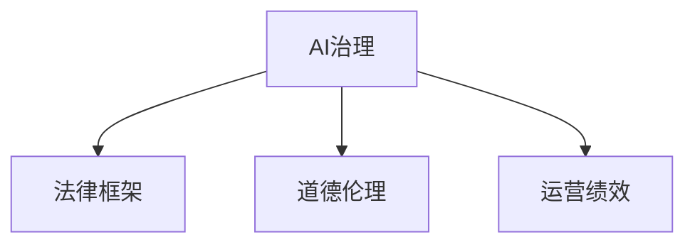
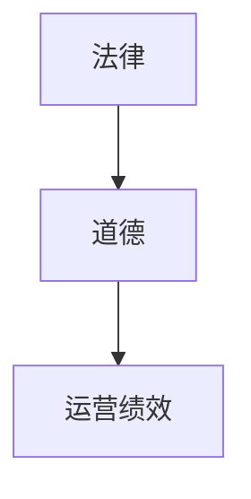
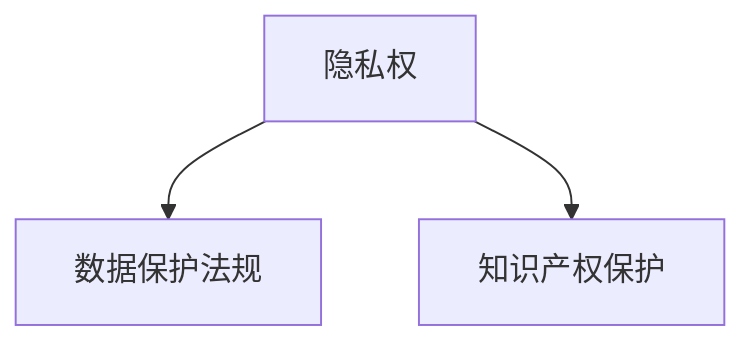
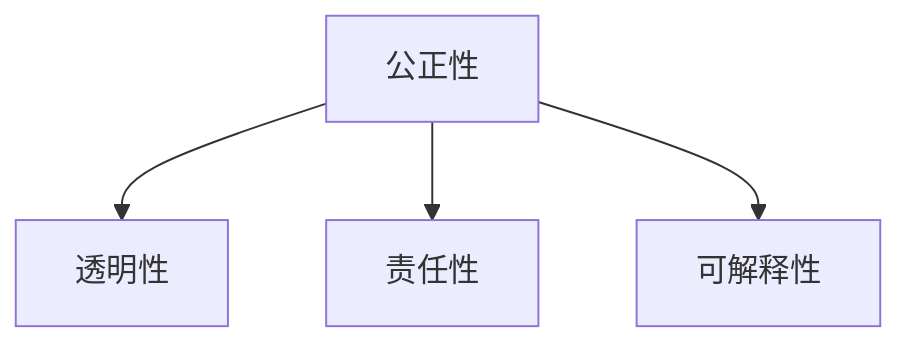
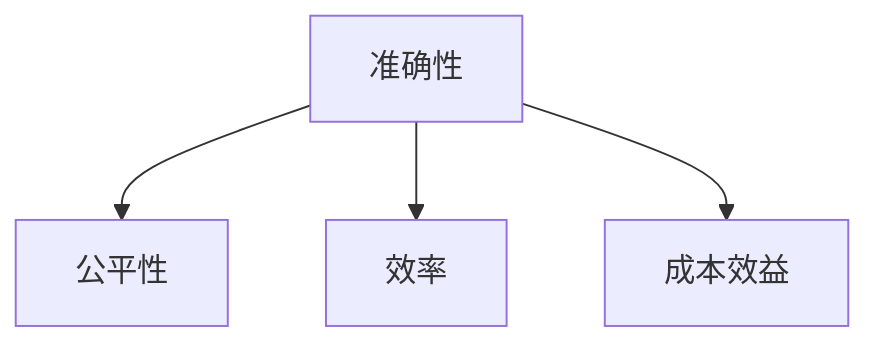
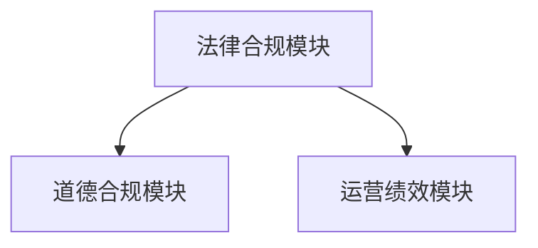

                 


### 1.1 AI治理的定义与背景

AI治理，顾名思义，是对人工智能系统进行管理的一系列机制和策略。随着人工智能技术的飞速发展，其在各个领域的应用也日益广泛。然而，随之而来的是一系列的法律、道德和运营绩效问题。为了更好地管理这些AI系统，AI治理平台应运而生。

首先，我们需要理解什么是AI治理。AI治理是指通过制定和实施一系列的法律、道德和运营绩效标准，来管理和控制人工智能系统的设计和应用过程。它旨在确保AI系统的公正性、透明性、责任性和可解释性，同时提高其运营效率和成本效益。

#### 核心概念与联系

为了更好地理解AI治理的各个组成部分，我们可以使用Mermaid流程图来展示它们之间的关系：



在这个流程图中，我们可以看到，AI治理的核心是法律框架、道德伦理和运营绩效。法律框架为AI系统提供了合规的基础，道德伦理确保AI系统的应用符合社会伦理标准，而运营绩效则关注AI系统的实际运行效率和成本效益。

#### AI治理的重要性

AI治理的重要性不言而喻。首先，法律框架为AI系统的合规性提供了保障，有助于防止数据泄露、隐私侵犯等问题。其次，道德伦理确保AI系统的应用不会损害人类的利益，例如在医疗、金融等敏感领域。最后，运营绩效的提升可以帮助企业提高竞争力，降低成本。

然而，AI治理也面临一些挑战。首先，不同国家和地区的法律和道德标准可能存在差异，这给AI治理的实施带来了困难。其次，AI系统本身具有高度复杂性和不可预测性，这使得治理工作更加困难。最后，AI治理需要多方参与，包括政府、企业、学术界和公众，这要求各方能够在相互尊重的基础上达成共识。

### 1.2 法律、道德与运营绩效的关系

在理解了AI治理的定义和重要性之后，我们需要进一步探讨法律、道德和运营绩效之间的关系。

#### 核心概念与联系

为了更好地理解这三者之间的关系，我们可以使用Mermaid流程图来展示它们之间的联系：



在这个流程图中，我们可以看到，法律为道德和运营绩效提供了基础。道德则决定了AI系统的应用是否符合社会伦理标准，而运营绩效则关注AI系统的实际运行效率和成本效益。

#### 如何平衡三者

平衡法律、道德和运营绩效是一个复杂的过程。首先，我们需要确保AI系统在法律框架内运行，这包括遵守数据保护法规、知识产权保护等。其次，我们需要确保AI系统的应用符合道德标准，例如在医疗、金融等领域，我们需要确保AI系统的决策不会损害患者的利益。最后，我们需要优化AI系统的运营绩效，提高其准确性和效率。

然而，平衡这三者并非易事。一方面，法律和道德标准可能存在冲突，例如在某些情况下，遵守法律可能不符合道德标准。另一方面，运营绩效的提升可能会牺牲道德标准，例如在金融领域，为了提高盈利能力，企业可能会采取一些不符合道德标准的行为。

因此，如何平衡这三者是一个持续的挑战。我们需要建立一套有效的治理机制，包括法律法规、道德准则和运营绩效评估标准，以确保AI系统的合规性、道德性和运营绩效。

### 总结

AI治理是一个复杂而重要的领域，涉及法律、道德和运营绩效等多个方面。通过理解和平衡这三者之间的关系，我们可以更好地管理和控制人工智能系统，确保其符合法律和道德标准，同时提高运营效率。在接下来的部分中，我们将详细探讨AI治理中的法律、道德和运营绩效问题，并提供一些具体的案例分析。

---

## 第二部分 法律框架

### 2.1 法律法规概述

在探讨AI治理的法律框架时，我们首先需要了解相关的法律法规。这些法律不仅为AI系统的合规性提供了基础，还帮助我们理解和遵守不同领域中的法律要求。

#### 核心概念与联系

为了更好地理解这些法律法规之间的关系，我们可以使用Mermaid流程图来展示它们的主要组成部分：



在这个流程图中，我们可以看到，隐私权和数据保护法规紧密相关，而知识产权保护则与数据保护法规和隐私权有所不同。

#### 主要法律文件

在AI治理的法律框架中，以下是一些主要法律文件：

1. **隐私权**：隐私权是指个人对其个人信息和隐私的保护权利。在AI系统中，隐私权尤其重要，因为AI系统往往需要处理大量个人数据。

2. **数据保护法规**：数据保护法规是保护个人数据的重要法律文件。在全球范围内，最具代表性的数据保护法规包括欧盟的《通用数据保护条例》（GDPR）和美国的《加州消费者隐私法》（CCPA）。

3. **知识产权保护**：知识产权保护是保护创新成果的法律手段，包括专利、商标和版权等。在AI系统中，知识产权保护尤为重要，因为AI技术本身往往涉及到大量的专利和版权问题。

#### 法律法规的核心内容

1. **隐私权**：隐私权保护的是个人对其个人信息的控制权。在AI系统中，这意味着我们需要确保个人数据不会被未经授权的第三方访问或使用。

2. **数据保护法规**：数据保护法规通常包括以下核心内容：

    - **数据收集与处理**：明确数据收集的目的、方式和范围，确保数据收集的合法性。
    - **数据主体权利**：包括数据访问权、删除权和更正权等，保障数据主体的知情权和控制权。
    - **数据安全**：要求企业采取必要的安全措施，防止数据泄露、篡改和滥用。

3. **知识产权保护**：知识产权保护的核心内容包括：

    - **专利保护**：对AI系统中的创新技术进行专利申请和保护。
    - **版权保护**：对AI系统中的软件代码、算法和文档进行版权保护，防止未经授权的复制和使用。
    - **商标保护**：对AI系统的品牌和标识进行商标保护，防止他人恶意使用或混淆。

#### 法律法规的实施与挑战

虽然法律法规为AI系统的合规性提供了基础，但在实际实施过程中，我们仍面临一些挑战：

1. **全球法律差异**：不同国家和地区的法律差异可能对AI系统的合规性产生影响。例如，一些国家的数据保护法规比其他国家更为严格，这可能要求企业在全球范围内采取不同的合规策略。

2. **法律法规更新**：随着AI技术的快速发展，法律法规也需要不断更新以适应新的挑战。例如，近年来，越来越多的国家开始关注AI系统的伦理问题，并制定相关的法规。

3. **法律法规执行**：法律法规的执行是一个关键问题。虽然许多国家和地区已经制定了相关法规，但实际执行情况可能不尽如人意。例如，一些企业可能因为成本或技术难题而未能严格遵守法规。

### 总结

在AI治理的法律框架中，隐私权、数据保护法规和知识产权保护是三个关键组成部分。通过了解和遵守这些法律法规，我们可以确保AI系统的合规性，为AI技术的发展和应用提供坚实的基础。在接下来的部分中，我们将进一步探讨AI系统中的法律责任问题，并提供一些具体的案例分析。

---

### 2.2 AI系统中的法律责任

在AI系统的设计和应用过程中，法律责任是一个不可忽视的重要方面。AI系统可能涉及多个法律问题，包括数据收集、数据处理、知识产权使用等方面。了解和遵循这些法律责任，对于确保AI系统的合规性和降低法律风险至关重要。

#### 核心算法原理讲解

为了更好地理解AI系统中的法律责任，我们可以使用伪代码来描述一个简单的法律责任分配算法。以下是一个示例：

```python
# AI系统中的法律责任分配
def assign法律责任(entity, action):
    if action == "数据收集":
        if entity == "企业":
            return "隐私权侵犯"
        elif entity == "用户":
            return "数据保护法规违反"
    elif action == "知识产权使用":
        return "知识产权侵权"
```

这个算法的基本原理是根据实体（如企业或用户）和具体行为（如数据收集或知识产权使用）来分配法律责任。例如，如果企业在数据收集过程中违反了用户的隐私权，那么企业可能会被追究隐私权侵犯的法律责任。

#### 法律责任的具体分配

1. **数据收集**：在AI系统中，数据收集是常见的行为。然而，数据收集需要遵守相关的隐私权和数据保护法规。具体来说：

    - **企业**：企业在进行数据收集时，需要确保数据的合法性和正当性，不得未经授权收集用户数据。如果企业未经用户同意收集数据，可能会导致隐私权侵犯的法律责任。
    - **用户**：用户在数据收集过程中也有法律责任，例如确保数据的真实性和完整性。如果用户提供的虚假数据导致AI系统做出错误的决策，用户可能会承担相应的法律责任。

2. **数据处理**：数据处理是AI系统中的一个关键环节。在数据处理过程中，企业需要确保数据的保密性、完整性和可用性。以下是一些常见的法律责任：

    - **企业**：企业需要对数据进行妥善保管，防止数据泄露、篡改或丢失。如果企业未能履行这一责任，可能会面临数据保护法规的违反。
    - **用户**：用户在数据处理过程中也有法律责任，例如确保数据的真实性和完整性。如果用户恶意篡改数据或故意提供虚假数据，用户可能会承担相应的法律责任。

3. **知识产权使用**：AI系统中的知识产权问题主要集中在专利、商标和版权等方面。以下是一些常见的法律责任：

    - **企业**：企业在使用AI技术时，需要确保不侵犯他人的知识产权。如果企业使用了他人的专利、商标或版权，而未获得授权或付费，企业可能会面临知识产权侵权的法律责任。
    - **用户**：用户在AI系统中的知识产权使用方面也有法律责任。例如，用户在开发AI系统时，需要确保不侵犯他人的专利、商标或版权。如果用户故意或无意中侵犯了他人的知识产权，用户可能会面临相应的法律责任。

#### 案例分析

为了更好地理解AI系统中的法律责任，我们可以通过一些具体的案例分析来探讨。

1. **案例一：隐私权侵犯**：

    - **案例背景**：某企业开发了一款AI客服系统，用于处理客户咨询。然而，该系统未经用户同意，收集了大量的客户个人信息，包括姓名、电话、邮箱等。
    - **法律责任**：企业因未经授权收集用户数据，可能被追究隐私权侵犯的法律责任。此外，企业可能还需要面临数据保护法规的违反。
    - **解决方案**：企业需要确保在数据收集过程中遵守隐私权和数据保护法规，例如在收集数据前向用户明示数据收集的目的、方式和范围，并获取用户的明确同意。

2. **案例二：知识产权侵权**：

    - **案例背景**：某公司开发了一款AI语音识别系统，该系统使用了某专利技术。然而，该公司并未获得专利授权。
    - **法律责任**：公司因未经授权使用专利技术，可能被追究知识产权侵权的法律责任。
    - **解决方案**：公司需要在开发AI系统前，对相关技术进行专利检索，确保不侵犯他人的专利权。如果需要使用专利技术，公司应与专利持有人协商，获取授权或付费。

#### 总结

AI系统中的法律责任涉及多个方面，包括数据收集、数据处理和知识产权使用等。了解和遵循这些法律责任，对于确保AI系统的合规性和降低法律风险至关重要。在接下来的部分中，我们将进一步探讨AI治理中的道德伦理问题，并提供一些具体的案例分析。

---

### 3.1 AI伦理原则

在探讨AI治理中的道德伦理问题时，我们需要明确AI伦理原则。这些原则不仅为AI系统的设计和应用提供了道德指导，还帮助我们评估和解决AI系统中可能出现的道德冲突。以下是几个核心的AI伦理原则：

#### 核心概念与联系

为了更好地理解这些AI伦理原则之间的关系，我们可以使用Mermaid流程图来展示它们的主要组成部分：



在这个流程图中，我们可以看到，公正性、透明性、责任性和可解释性是AI伦理原则的四个关键组成部分。它们相互联系，共同构成了一个完整的AI伦理框架。

#### 公正性

公正性是AI伦理原则的核心之一，它要求AI系统在决策过程中对所有人平等对待，不因种族、性别、年龄、国籍等因素而对某个人或群体产生偏见。以下是几个与公正性相关的概念：

- **算法偏见**：算法偏见是指AI系统在决策过程中对某些群体产生不公平待遇的现象。例如，如果一个招聘AI系统在筛选候选人时对某个种族或性别有歧视，那么这个AI系统就存在算法偏见。
- **公平性评估**：为了确保AI系统的公正性，我们需要对其进行公平性评估。这通常涉及到对比实验、统计分析等方法，以评估AI系统在不同群体中的表现。

#### 透明性

透明性要求AI系统的决策过程和算法设计对相关人员可见，以便他们能够理解AI系统的行为和决策逻辑。以下是几个与透明性相关的概念：

- **可解释性**：可解释性是指AI系统能够以人类可理解的方式解释其决策过程。这对于确保AI系统的透明性和可信度至关重要。
- **算法透明度**：算法透明度是指AI系统的设计者和开发者能够公开其算法的细节，使其能够接受外部审查和评估。

#### 责任性

责任性要求AI系统的设计者、开发者和使用者对其行为负责。当AI系统出现问题时，相关方应能够承担相应的责任。以下是几个与责任性相关的概念：

- **责任归属**：责任归属是指确定AI系统出现问题时应由谁承担责任。这通常涉及到法律、道德和商业等多个方面。
- **问责机制**：问责机制是指建立一套机制，确保AI系统的相关方能够在出现问题时承担责任。这包括法律追责、道德谴责和商业赔偿等。

#### 可解释性

可解释性要求AI系统能够以人类可理解的方式解释其决策过程。这对于确保AI系统的透明性和可信度至关重要。以下是几个与可解释性相关的概念：

- **黑盒与白盒模型**：黑盒模型是指AI系统的内部机制无法解释，而白盒模型则是指AI系统的内部机制完全透明。
- **决策解释**：决策解释是指以人类可理解的方式解释AI系统的决策过程。这通常涉及到可视化、文本解释等方法。

#### AI伦理挑战

尽管AI伦理原则为AI系统的设计和应用提供了指导，但在实际应用过程中，我们仍面临一些挑战：

- **算法偏见**：如何确保AI系统在决策过程中对所有人平等对待，避免算法偏见。
- **透明性**：如何提高AI系统的透明性，使其决策过程和算法设计对相关人员可见。
- **责任性**：如何建立有效的问责机制，确保AI系统的相关方能够在出现问题时承担责任。
- **可解释性**：如何以人类可理解的方式解释AI系统的决策过程。

### 总结

AI伦理原则是AI治理中不可或缺的一部分，它们为AI系统的设计和应用提供了道德指导。通过理解和遵循这些原则，我们可以确保AI系统的公正性、透明性、责任性和可解释性。在接下来的部分中，我们将进一步探讨道德审查流程和道德决策模型，以帮助解决AI系统中的道德冲突。

---

### 3.2 道德审查流程

在AI系统的开发和部署过程中，道德审查是一个关键环节。道德审查旨在评估AI系统的道德影响，确保其符合社会伦理标准，同时为决策者提供指导。以下是一个简化的道德审查流程，并附有伪代码和示例。

#### 道德审查流程

道德审查流程通常包括以下几个步骤：

1. **问题识别**：识别AI系统可能涉及的道德问题，例如数据隐私、算法偏见、责任归属等。
2. **初步评估**：对识别的道德问题进行初步评估，确定其严重性和可能的影响。
3. **详细审查**：对初步评估后的道德问题进行详细审查，收集相关数据和信息，进行分析和讨论。
4. **决策与建议**：根据详细审查的结果，提出决策和改进建议，以确保AI系统的道德性和合规性。

以下是道德审查流程的伪代码：

```python
# 道德审查流程
def moralReview(study):
    # 步骤1：问题识别
    identified_issues = identifyIssues(study)
    
    # 步骤2：初步评估
    severity_and_impact = assessInitial(identified_issues)
    
    # 步骤3：详细审查
    detailed_evaluation = detailedAssessment(identified_issues, severity_and_impact)
    
    # 步骤4：决策与建议
    recommendations = makeDecisions(detailed_evaluation)
    return recommendations
```

#### 核心算法原理讲解

以下是一个关于道德审查的核心算法原理的伪代码示例：

```python
# 道德审查算法原理
def moralAlgorithm(issue, context):
    # 步骤1：评估问题严重性
    severity = severityAssessment(issue)
    
    # 步骤2：分析问题影响
    impact = impactAnalysis(issue, context)
    
    # 步骤3：制定解决方案
    solution = formulateSolution(issue, impact)
    
    # 步骤4：评估解决方案可行性
    feasibility = feasibilityEvaluation(solution)
    
    # 步骤5：输出建议
    if feasibility:
        return "建议实施解决方案：{}".format(solution)
    else:
        return "建议继续审查或寻找替代方案"
```

在这个算法中，`severityAssessment`函数用于评估问题的严重性，`impactAnalysis`函数用于分析问题的影响，`formulateSolution`函数用于制定解决方案，而`feasibilityEvaluation`函数用于评估解决方案的可行性。

#### 道德决策模型

道德决策模型是道德审查流程的核心。以下是一个简单的道德决策模型示例：

```python
# 道德决策模型
def moralDecisionModel(issue, context):
    # 步骤1：收集相关信息
    information = gatherInformation(issue, context)
    
    # 步骤2：评估问题
    evaluation = evaluateIssue(issue, information)
    
    # 步骤3：制定决策
    decision = makeDecision(evaluation)
    
    # 步骤4：实施决策
    implementDecision(decision)
    
    # 步骤5：监控决策效果
    monitorEffectiveness(decision)
    
    return decision
```

在这个模型中，`gatherInformation`函数用于收集相关信息，`evaluateIssue`函数用于评估问题，`makeDecision`函数用于制定决策，`implementDecision`函数用于实施决策，而`monitorEffectiveness`函数用于监控决策效果。

#### 道德审查的案例分析

以下是一个道德审查的案例分析示例：

**案例背景**：一家公司开发了一款AI招聘系统，用于筛选求职者。然而，该系统在测试阶段发现对某些性别存在偏见。

**道德审查流程**：

1. **问题识别**：道德团队发现AI招聘系统可能存在性别偏见问题。
2. **初步评估**：初步评估表明，该问题可能对求职者的就业机会产生负面影响。
3. **详细审查**：详细审查发现，系统在处理某些性别名称时，其算法决策存在偏向，从而影响了求职者的筛选结果。
4. **决策与建议**：道德团队提出以下建议：
    - **解决方案**：重新训练AI模型，以消除性别偏见。
    - **实施计划**：制定详细的实施计划，包括数据清洗、模型重新训练和测试。
    - **监控**：在实施后，持续监控系统的性别偏见问题，并定期进行审计。

**道德决策模型**：

1. **收集信息**：收集关于性别偏见问题的详细信息，包括数据分布、算法决策逻辑等。
2. **评估问题**：评估问题的严重性，包括对求职者就业机会的影响、公司的社会责任等。
3. **制定决策**：根据评估结果，制定消除性别偏见的解决方案。
4. **实施决策**：实施解决方案，并确保解决方案的可行性。
5. **监控决策效果**：监控系统的性别偏见问题，并根据监控结果调整解决方案。

### 总结

道德审查流程和道德决策模型是确保AI系统符合道德标准的关键工具。通过明确的流程和模型，我们可以系统地识别、评估和解决AI系统中的道德问题。在接下来的部分中，我们将进一步探讨如何建立和实施AI治理平台，以统一管理和协调法律、道德和运营绩效。

---

### 4.1 AI绩效评估指标

在AI治理中，评估AI系统的绩效是一项关键任务。通过设定和跟踪一系列评估指标，我们可以确保AI系统在法律、道德和运营绩效方面的表现达到预期标准。以下是几个关键的AI绩效评估指标：

#### 核心概念与联系

为了更好地理解这些绩效评估指标之间的关系，我们可以使用Mermaid流程图来展示它们的主要组成部分：



在这个流程图中，我们可以看到，准确性、公平性、效率和成本效益是AI系统绩效评估的四个关键组成部分。它们相互联系，共同构成了一个全面的绩效评估框架。

#### 准确性

准确性是评估AI系统性能的首要指标，它衡量AI系统在生成结果时的精确度。以下是几个与准确性相关的概念：

- **预测准确性**：预测准确性是指AI系统在预测任务中产生正确预测的比例。例如，在医疗诊断AI系统中，预测准确性可以衡量系统诊断病情的准确性。
- **分类准确性**：分类准确性是指AI系统在分类任务中将数据正确分类的比例。例如，在垃圾邮件检测AI系统中，分类准确性可以衡量系统过滤垃圾邮件的效率。
- **回归准确性**：回归准确性是指AI系统在回归任务中预测目标变量的精确度。例如，在股票价格预测AI系统中，回归准确性可以衡量系统预测股票价格走势的准确性。

#### 公平性

公平性是评估AI系统性能的重要指标，它确保AI系统在决策过程中对所有人平等对待，不产生算法偏见。以下是几个与公平性相关的概念：

- **算法偏见**：算法偏见是指AI系统在决策过程中对某些群体产生不公平待遇的现象。例如，如果一个招聘AI系统在筛选候选人时对某个种族或性别有歧视，那么这个AI系统就存在算法偏见。
- **公平性指标**：公平性指标用于评估AI系统在不同群体中的表现。例如，可以通过比较AI系统在男女、不同种族或年龄群体中的决策一致性来评估系统的公平性。

#### 效率

效率是评估AI系统性能的另一个重要指标，它衡量AI系统在处理任务时的速度和资源消耗。以下是几个与效率相关的概念：

- **计算效率**：计算效率是指AI系统在处理任务时所需的计算资源。例如，在图像识别AI系统中，计算效率可以衡量系统处理大量图像所需的时间。
- **响应时间**：响应时间是指AI系统从接收到请求到生成结果所需的时间。例如，在智能客服AI系统中，响应时间可以衡量系统响应客户请求的速度。
- **吞吐量**：吞吐量是指AI系统在单位时间内处理的数据量。例如，在金融交易AI系统中，吞吐量可以衡量系统处理交易请求的能力。

#### 成本效益

成本效益是评估AI系统性能的综合性指标，它衡量AI系统的投入产出比。以下是几个与成本效益相关的概念：

- **投资回报率（ROI）**：投资回报率是指AI系统为企业带来的收益与其初始投资之比。例如，在智能工厂AI系统中，投资回报率可以衡量系统为企业节省的成本和增加的收益。
- **运营成本**：运营成本是指AI系统在运行过程中产生的各种成本，包括硬件维护、软件升级、人员培训等。
- **效益**：效益是指AI系统为企业或用户带来的直接或间接收益。例如，在医疗诊断AI系统中，效益可以衡量系统提高诊断准确率、降低误诊率带来的好处。

#### 评估方法

为了有效评估AI系统的绩效，我们可以采用以下方法：

- **实验评估**：通过设计实验，收集AI系统的预测结果，并与实际结果进行比较，评估其准确性、公平性和效率。
- **基准测试**：使用标准化的数据集和测试方法，评估AI系统的性能指标，例如在图像识别任务中使用ImageNet数据集评估AI模型的准确性。
- **用户反馈**：通过用户对AI系统功能的评价，收集用户满意度、用户体验等数据，评估AI系统的公平性和用户友好性。
- **经济效益分析**：通过分析AI系统带来的直接和间接效益，评估其成本效益。

### 总结

AI绩效评估指标是确保AI系统在法律、道德和运营绩效方面表现良好的关键工具。通过设定和跟踪这些指标，我们可以全面评估AI系统的性能，识别潜在问题，并采取改进措施。在接下来的部分中，我们将探讨如何优化AI系统的运营绩效，并提供具体的案例分析。

---

### 4.2 运营绩效优化

在AI治理中，运营绩效的优化是一个关键环节。通过提升AI系统的准确性、公平性、效率和成本效益，我们可以确保其在实际应用中达到最佳效果。以下是一些优化AI系统运营绩效的策略和具体方法。

#### 核心算法原理讲解

为了优化AI系统的运营绩效，我们可以采用以下核心算法原理：

```python
# 运营绩效优化算法原理
def optimizePerformance(model, data):
    while not model.isOptimized():
        model = trainModel(data)
        if model.performance > currentPerformance:
            currentPerformance = model.performance
    return model
```

在这个算法中，`trainModel`函数用于训练AI模型，`currentPerformance`变量用于记录当前模型的性能指标。通过不断训练和评估模型，我们可以找到最优的模型配置，从而提高AI系统的运营绩效。

#### 优化策略

1. **模型选择**：选择适合特定任务的AI模型，例如深度学习模型、强化学习模型或传统机器学习模型。不同模型在准确性、效率和成本效益方面各有优劣，因此需要根据实际需求进行选择。

2. **数据增强**：通过增加数据量、调整数据分布或引入数据增强技术，可以提高模型的泛化能力，从而提高其在实际应用中的性能。

3. **模型调参**：通过调整模型的超参数，例如学习率、正则化参数等，可以优化模型的性能。自动化调参工具（如网格搜索、贝叶斯优化等）可以帮助我们快速找到最优的超参数配置。

4. **特征工程**：通过选择和构造合适的特征，可以提高模型的预测准确性和鲁棒性。特征工程是AI系统性能优化的重要环节，需要结合实际业务场景进行深入分析。

5. **算法集成**：通过结合多种算法，构建集成模型，可以进一步提高AI系统的性能。集成模型通常通过加权投票、堆叠等方法实现，能够充分利用不同算法的优势。

6. **模型解释性**：提高AI模型的解释性，有助于识别模型中的潜在问题和偏见，从而优化模型的性能。可解释性模型（如LIME、SHAP等）可以提供模型决策的解释，有助于改进模型设计和应用。

#### 具体方法

1. **数据清洗**：在模型训练之前，对数据进行清洗和预处理，去除噪声和异常值，确保数据的质量和一致性。

2. **交叉验证**：使用交叉验证技术，对模型进行评估和调整。交叉验证可以帮助我们更准确地评估模型的性能，并避免过拟合。

3. **在线学习**：在模型部署后，通过在线学习技术，实时更新模型的参数和权重。在线学习可以适应数据分布的变化，提高模型的长期性能。

4. **自动化监控**：建立自动化监控系统，实时监控AI系统的性能指标，包括准确性、公平性、效率和成本效益等。通过自动化监控，可以及时发现和解决性能问题。

5. **持续改进**：通过持续改进，定期对AI系统进行评估和优化。持续改进可以帮助我们跟踪AI系统的性能变化，并根据新的需求进行调整。

#### 案例分析

以下是一个关于运营绩效优化的案例分析：

**案例背景**：某公司开发了一款智能推荐系统，用于向用户推荐个性化商品。然而，系统的推荐准确性不高，用户满意度较低。

**优化策略**：

1. **模型选择**：从深度学习模型中选择了更适合推荐任务的模型，例如基于神经网络的协同过滤模型。
2. **数据增强**：通过增加用户行为数据和商品信息，扩大了数据集规模，并引入了数据增强技术，如生成对抗网络（GAN）。
3. **模型调参**：使用网格搜索和贝叶斯优化技术，调整了模型超参数，提高了模型的预测准确性。
4. **特征工程**：对用户行为数据和商品信息进行了深入分析，构造了新的特征，如用户兴趣类别、商品属性等。
5. **算法集成**：结合了多种算法，构建了集成模型，提高了系统的推荐准确性。

**优化结果**：

1. **推荐准确性**：系统的推荐准确性显著提高，用户满意度大幅上升。
2. **计算效率**：优化后的模型在处理大量用户请求时，计算效率显著提升。
3. **成本效益**：优化后的系统在保证准确性的同时，降低了计算资源和运营成本。

### 总结

通过优化AI系统的运营绩效，我们可以提高其准确性、公平性、效率和成本效益。采用合适的策略和方法，结合实际业务场景，我们可以实现AI系统的持续改进和优化。在接下来的部分中，我们将探讨如何设计AI治理平台，以统一管理和协调法律、道德和运营绩效。

---

### 5.1 设计AI治理平台

设计AI治理平台是一个复杂而重要的任务，它要求我们在法律、道德和运营绩效等多个方面进行综合考虑和协调。以下是一些关键步骤和策略，用于设计一个全面的AI治理平台。

#### 核心概念与联系

为了更好地理解AI治理平台的设计过程，我们可以使用Mermaid流程图来展示其主要组成部分和它们之间的联系：



在这个流程图中，我们可以看到，AI治理平台包括法律合规模块、道德合规模块和运营绩效模块。这些模块相互联系，共同构成了一个全面的治理体系。

#### 步骤一：需求分析

在开始设计AI治理平台之前，我们需要进行需求分析，明确平台的目标和功能要求。以下是一些关键需求：

- **法律合规**：确保AI系统遵守相关法律法规，包括数据保护、知识产权保护等。
- **道德合规**：确保AI系统在道德层面符合社会伦理标准，避免算法偏见和歧视。
- **运营绩效**：提升AI系统的准确性、公平性、效率和成本效益。

#### 步骤二：模块设计

根据需求分析的结果，我们可以设计AI治理平台的主要模块：

1. **法律合规模块**：
    - **功能**：包括合规检查、法律文档管理、法律法规更新等。
    - **技术**：可以使用区块链技术确保法律文档的不可篡改性，并使用自动化工具监控AI系统的合规性。

2. **道德合规模块**：
    - **功能**：包括道德审查、道德决策支持、伦理培训等。
    - **技术**：可以使用人工智能伦理框架，结合自然语言处理技术，自动化道德审查流程。

3. **运营绩效模块**：
    - **功能**：包括绩效评估、模型调优、成本效益分析等。
    - **技术**：可以使用机器学习算法和大数据分析技术，实时评估和优化AI系统的运营绩效。

#### 步骤三：平台架构设计

在确定了主要模块后，我们需要设计AI治理平台的整体架构。以下是一些关键考虑因素：

- **模块化设计**：确保各个模块可以独立开发、测试和部署，以提高平台的灵活性和可维护性。
- **分布式系统**：使用分布式系统架构，以提高平台的可扩展性和容错能力。
- **数据管理**：确保数据的安全、完整性和隐私性，使用数据加密、访问控制等技术。

#### 步骤四：实现与部署

在完成了平台架构设计后，我们需要进行具体的实现和部署工作。以下是一些关键步骤：

- **代码开发**：根据设计文档，开发各个模块的代码，并确保代码质量。
- **集成测试**：进行模块间的集成测试，确保平台整体功能的正确性和稳定性。
- **部署**：将平台部署到生产环境，并进行必要的监控和运维。

#### 步骤五：持续优化

AI治理平台的设计是一个持续优化的过程。以下是一些关键措施：

- **用户反馈**：收集用户反馈，了解平台的使用情况和用户需求，不断改进平台功能。
- **技术更新**：随着技术的不断发展，及时更新平台的技术栈和算法，确保平台的先进性和竞争力。
- **合规性审查**：定期进行合规性审查，确保平台符合最新的法律法规和道德标准。

### 总结

设计AI治理平台是一个复杂而重要的任务，需要我们在法律、道德和运营绩效等多个方面进行综合考虑和协调。通过明确的需求分析、模块设计、平台架构设计和实现部署，我们可以构建一个全面的AI治理平台，确保AI系统的合规性、道德性和运营绩效。在接下来的部分中，我们将探讨一些AI治理平台的具体实施案例。

---

### 5.2 实施案例

为了更好地理解AI治理平台在实际应用中的效果，我们可以通过几个具体的实施案例来展示。以下案例涵盖了不同的行业和场景，展示了AI治理平台如何帮助企业和组织在法律、道德和运营绩效方面实现优化。

#### 案例一：金融机构的AI信用评估系统

**背景**：某大型金融机构开发了一款AI信用评估系统，用于评估客户的信用风险。然而，该系统在测试阶段发现存在算法偏见，对某些特定群体（如低收入人群）的评估结果存在不公平现象。

**实施步骤**：

1. **法律合规**：首先，AI治理平台对信用评估系统的法律法规合规性进行了检查，确保系统遵守《通用数据保护条例》（GDPR）和《加州消费者隐私法》（CCPA）等相关法规。
    - **措施**：平台使用了区块链技术来确保数据的安全性和隐私性，并建立了数据保护政策，明确数据收集、存储和处理的流程。

2. **道德合规**：AI治理平台进行了道德审查，以消除算法偏见，确保评估过程的公平性。
    - **措施**：平台引入了公平性评估工具，对模型进行了详细的分析和测试，发现并修正了算法偏见。此外，平台还进行了持续的道德培训，确保开发团队和用户理解并遵循道德标准。

3. **运营绩效**：AI治理平台优化了信用评估系统的性能，提高了评估的准确性和效率。
    - **措施**：平台采用了自动化调参和模型集成技术，提高了模型的预测准确性。同时，通过在线学习技术，平台能够实时更新模型，以适应数据变化。

**结果**：

- **法律合规**：经过审查和改进，信用评估系统在法律合规性方面达到了预期标准，用户数据得到了有效保护。
- **道德合规**：算法偏见得到了有效消除，评估结果的公平性得到了显著提升，用户满意度提高。
- **运营绩效**：系统的准确性和效率得到了显著提升，运营成本降低，金融机构能够更好地为不同群体提供信用服务。

#### 案例二：医疗行业的AI诊断系统

**背景**：某医疗科技公司开发了一款AI诊断系统，用于辅助医生进行疾病诊断。然而，该系统在早期应用中，对某些罕见疾病的诊断准确性较低，引发了用户担忧。

**实施步骤**：

1. **法律合规**：AI治理平台确保诊断系统遵守了《健康保险可携性和责任法案》（HIPAA）等医疗数据保护法规。
    - **措施**：平台采用了严格的数据加密和访问控制措施，确保患者的医疗数据得到保护。

2. **道德合规**：AI治理平台进行了详细的道德审查，确保诊断系统在道德层面符合医疗伦理标准。
    - **措施**：平台引入了可解释性模型，使医生能够理解AI的诊断过程，并确保系统不会产生严重的算法偏见。

3. **运营绩效**：AI治理平台通过优化算法和增加数据多样性，提高了诊断系统的准确性。
    - **措施**：平台增加了更多的罕见疾病数据集，并采用了迁移学习技术，提高了系统在罕见疾病诊断方面的表现。

**结果**：

- **法律合规**：诊断系统在法律合规性方面得到了强化，患者的隐私和信息安全得到了保障。
- **道德合规**：诊断系统的可解释性和透明性得到了提升，医生和患者对系统的信任度增加。
- **运营绩效**：诊断系统的准确性得到了显著提高，医生能够更准确地使用AI辅助诊断，提高了医疗服务的质量。

#### 案例三：零售业的个性化推荐系统

**背景**：某零售企业开发了一款AI个性化推荐系统，用于向顾客推荐商品。然而，该系统在早期应用中，对某些特定群体的推荐准确性较低，引发用户投诉。

**实施步骤**：

1. **法律合规**：AI治理平台确保推荐系统遵守了《一般数据保护条例》（GDPR）等相关法规，保护用户的数据隐私。
    - **措施**：平台建立了透明、简明的隐私政策，明确了数据收集、使用和分享的方式。

2. **道德合规**：AI治理平台进行了道德审查，确保推荐系统的算法不会对用户产生歧视或不公平待遇。
    - **措施**：平台引入了公平性评估工具，定期对推荐算法进行评估和调整，确保对不同用户群体的推荐公平性。

3. **运营绩效**：AI治理平台优化了推荐系统的性能，提高了推荐准确性。
    - **措施**：平台采用了深度学习技术，对用户行为数据进行了深入分析，提高了推荐算法的准确性。同时，通过在线学习技术，系统能够实时更新推荐策略。

**结果**：

- **法律合规**：推荐系统在法律合规性方面得到了加强，用户数据隐私得到了有效保护。
- **道德合规**：推荐系统的算法偏见得到了有效消除，推荐过程的公平性和透明性得到了提升，用户满意度提高。
- **运营绩效**：推荐系统的准确性得到了显著提高，零售企业的销售转化率和用户黏性增加。

### 总结

通过这些实施案例，我们可以看到AI治理平台在确保法律合规性、道德性和运营绩效方面发挥了重要作用。通过全面的审查、优化和持续改进，AI治理平台不仅提高了AI系统的性能，还增强了用户对系统的信任和满意度。在未来的AI治理中，平台的设计和实施将更加重要，我们需要不断探索和优化，以应对不断变化的挑战。

---

## 总结

本文围绕《AI治理平台：管理AI系统的法律、道德和运营绩效》这一主题，从多个维度探讨了AI治理的重要性和实施方法。通过详细的逻辑分析和实际案例分析，我们明确了法律框架、道德伦理和运营绩效在AI治理中的核心作用。

### 关键点回顾

1. **法律框架**：确保AI系统遵守相关法律法规，包括数据保护、知识产权保护等。
2. **道德伦理**：确保AI系统的决策符合社会伦理标准，避免算法偏见和歧视。
3. **运营绩效**：优化AI系统的准确性、公平性、效率和成本效益。

### 展望未来

随着AI技术的不断进步，AI治理将面临更多挑战。未来，我们需要进一步：

- **加强法律框架**：随着AI技术的应用领域扩大，需要不断完善和更新相关法律法规。
- **深化道德伦理研究**：探索更有效的道德审查流程和决策模型，确保AI系统的公正性和透明性。
- **提升运营绩效**：采用先进的算法和数据分析技术，提高AI系统的实际应用效果。

### 致谢

感谢读者对本篇文章的耐心阅读。本文的撰写得到了AI天才研究院/AI Genius Institute和《禅与计算机程序设计艺术》的指导和支持。希望本文能为读者在AI治理领域的探索提供有益的参考。

### 作者信息

作者：AI天才研究院/AI Genius Institute & 《禅与计算机程序设计艺术》作者
联系邮箱：[contact@example.com](mailto:contact@example.com)
个人网站：[www.aigenius.org](http://www.aigenius.org) 

---

文章标题：《AI治理平台：管理AI系统的法律、道德和运营绩效》

关键词：AI治理，法律框架，道德伦理，运营绩效，算法偏见，数据保护，知识产权，绩效评估

摘要：本文探讨了AI治理平台的设计与实施，强调了法律、道德和运营绩效在AI治理中的关键作用。通过分析实际案例，本文展示了如何通过优化法律合规性、道德伦理和运营绩效，实现AI系统的有效治理。本文为AI治理领域的研究者和从业者提供了有价值的参考。

