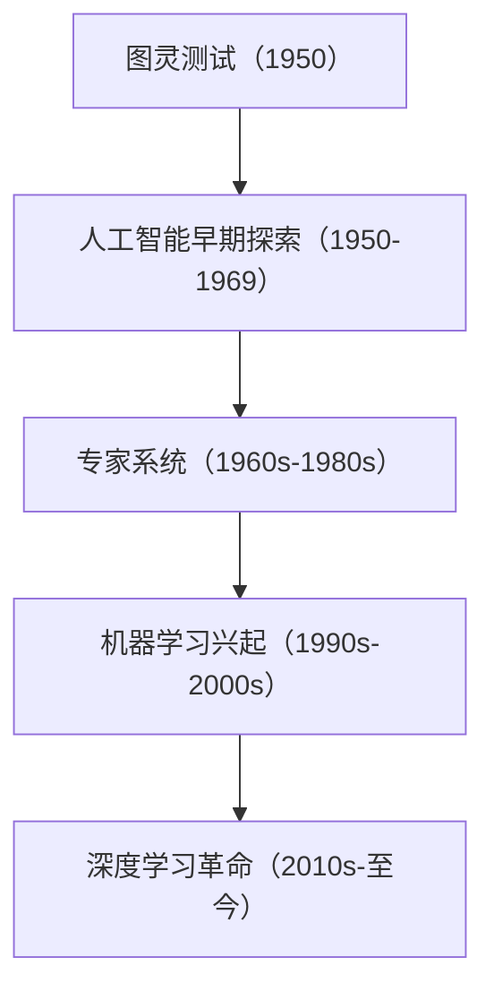
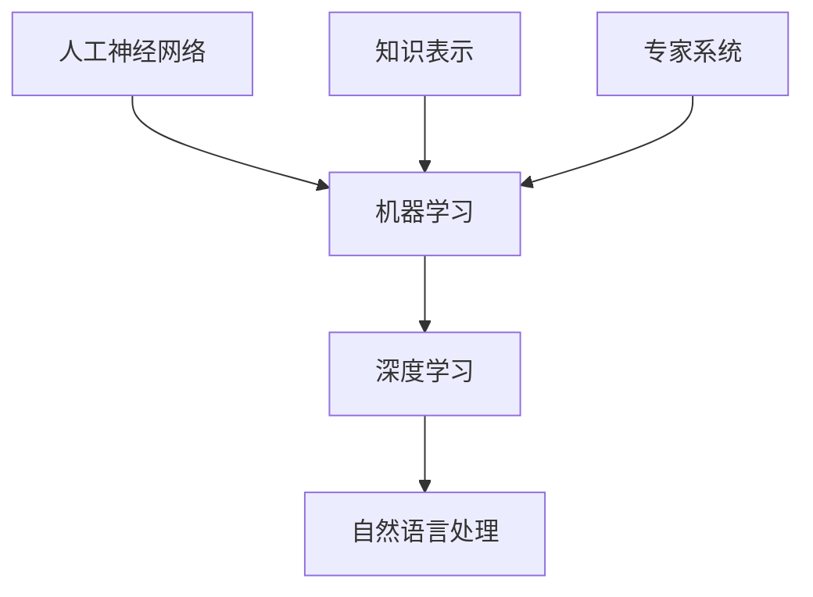
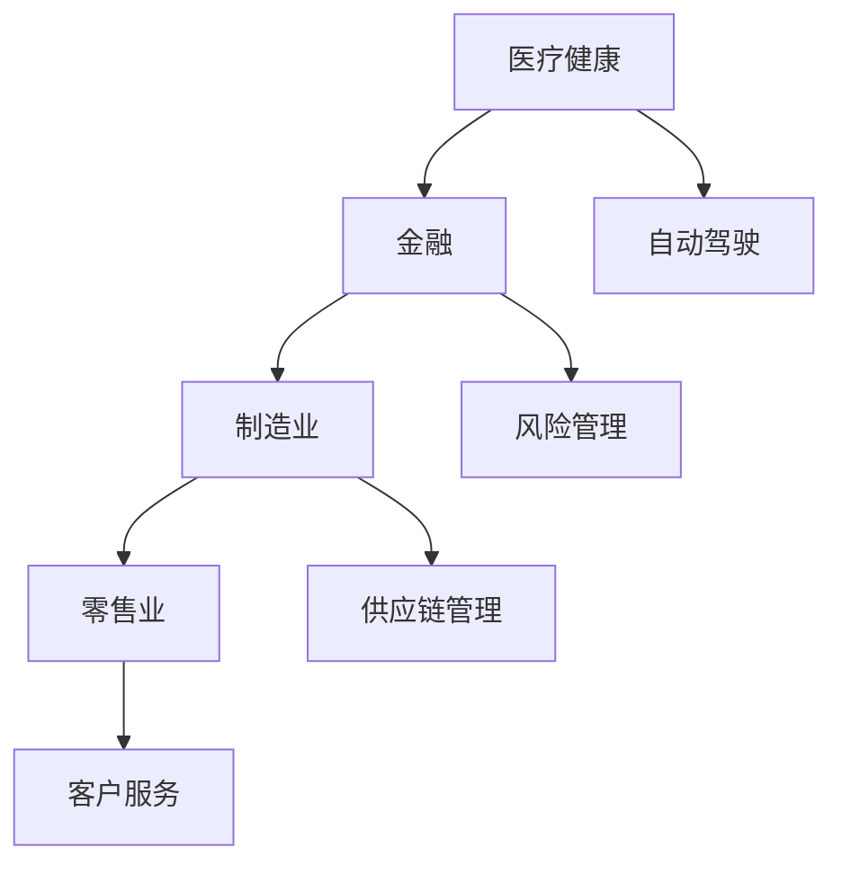
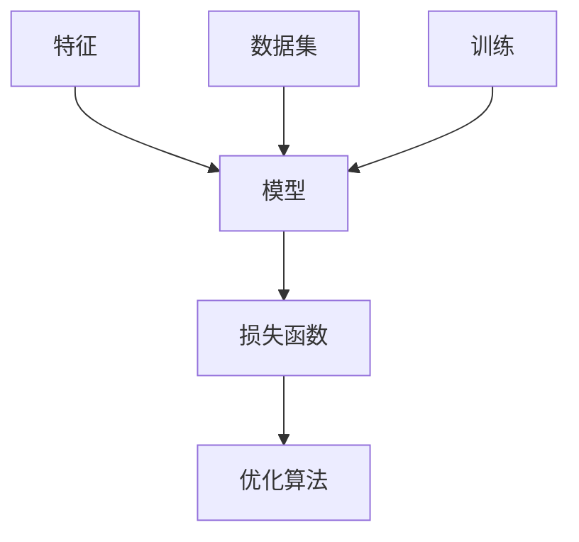
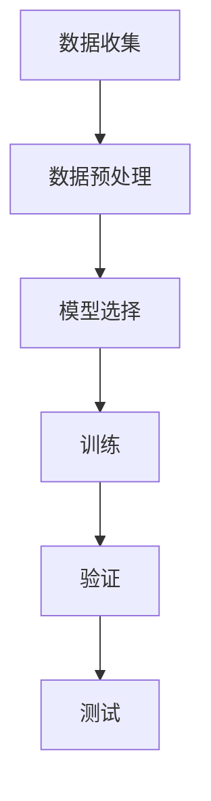
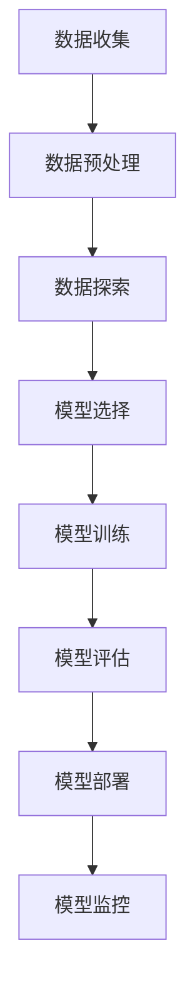

                 

### 第1章：AI概述

#### 1.1 AI的发展历程

人工智能（AI）的概念最早可以追溯到20世纪50年代。当时，数学家艾伦·图灵提出了图灵测试，这一测试旨在判断机器是否能够表现出与人类相似的智能行为。图灵测试的提出标志着人工智能作为一个独立学科的诞生。

**图1-1：AI发展历程关键事件**



- **人工智能早期探索（1950-1969）**：这一时期，人工智能主要关注知识表示、问题解决和逻辑推理。1956年，达特茅斯会议的召开标志着人工智能作为一门科学正式确立。此阶段的研究主要集中在符号主义方法，如逻辑推理和知识表示。

- **专家系统（1960s-1980s）**：专家系统是这一时期的人工智能研究重点，它模拟专家的决策过程，通过规则和知识库进行推理。代表性的系统有Dendral和MYCIN。然而，由于知识表示的局限性，专家系统在复杂任务上表现不佳。

- **机器学习兴起（1990s-2000s）**：随着计算机性能的提升和大数据的出现，机器学习开始成为人工智能的主流方法。这一时期，监督学习、无监督学习和强化学习得到了广泛关注。支持向量机（SVM）、决策树和神经网络等算法成为机器学习的重要工具。

- **深度学习革命（2010s-至今）**：深度学习在2010年代取得了突破性进展，特别是在图像识别、语音识别和自然语言处理等领域。卷积神经网络（CNN）、循环神经网络（RNN）和生成对抗网络（GAN）等深度学习模型极大地提升了人工智能的性能。

#### 1.2 AI的关键概念

AI的关键概念包括人工神经网络（ANN）、机器学习（ML）、深度学习（DL）和自然语言处理（NLP）。

**核心概念与联系：**



- **人工神经网络（ANN）**：ANN是模拟人脑神经元连接的网络结构，通过学习实现复杂任务的解决。它是机器学习和深度学习的基础。

- **机器学习（ML）**：机器学习是让计算机通过数据学习，提高任务完成效率的方法。它包括监督学习、无监督学习和强化学习等不同的学习策略。

- **深度学习（DL）**：深度学习是多层神经网络结构，通过自动特征提取实现高层次的抽象。它在图像识别、语音识别和自然语言处理等领域取得了显著成果。

- **自然语言处理（NLP）**：自然语言处理是使计算机能够理解和生成自然语言的方法。它包括词向量模型、序列模型和语义理解等关键技术。

**Mermaid 流程图：**


#### 1.3 AI的应用领域

AI的应用领域非常广泛，涵盖了从医疗健康到金融，从制造业到零售业等多个领域。

**图1-2：AI的应用领域**



- **医疗健康**：AI在医疗健康领域的应用包括疾病预测、辅助诊断、个性化治疗等。例如，通过深度学习模型分析医疗影像，医生可以更准确地诊断疾病。

- **金融**：AI在金融领域的应用包括风险管理、算法交易、客户服务等。例如，通过机器学习模型分析市场数据，投资者可以更准确地预测市场走势。

- **制造业**：AI在制造业的应用包括自动化生产、质量控制、预测性维护等。例如，通过机器学习模型分析生产数据，企业可以预测设备故障，提前进行维护。

- **零售业**：AI在零售业的应用包括库存管理、客户关系管理、个性化推荐等。例如，通过深度学习模型分析客户行为，企业可以更准确地预测客户需求，提供个性化的商品推荐。

**小结**：

本章介绍了AI的发展历程、关键概念和应用领域。从图灵测试的提出，到人工智能作为一门科学的确立，再到深度学习的革命性进展，AI经历了多个阶段的发展。核心概念如人工神经网络、机器学习、深度学习和自然语言处理构成了AI的技术基础。AI的应用领域广泛，涵盖了医疗健康、金融、制造业和零售业等多个领域，为各个行业带来了巨大的变革和创新。未来，随着技术的不断进步，AI的应用将更加深入和广泛，为人类社会带来更多的便利和进步。

### 1.2 AI的关键概念

人工智能（AI）的核心概念包括人工神经网络（ANN）、机器学习（ML）、深度学习（DL）和自然语言处理（NLP）。这些概念紧密相连，构成了AI技术的基石。

#### 人工神经网络（ANN）

人工神经网络（ANN）是模仿人脑神经元连接的网络结构，通过学习实现复杂任务的解决。每个神经元都与其他神经元相连，并通过权重和偏置来调整连接的强度。ANN的核心组件包括：

- **神经元**：神经网络的基本单元，接收输入信号并通过激活函数输出结果。
- **层**：神经网络分为输入层、隐藏层和输出层。隐藏层负责特征提取和转换。
- **权重和偏置**：调整神经元之间的连接强度，以优化模型的性能。

**核心算法原理讲解：**

```python
# 伪代码：前向传播过程
def forward_propagation(input_data, weights, biases):
    # 输入层到隐藏层
    hidden_layer_output = activation_function(np.dot(input_data, weights) + biases)
    
    # 隐藏层到输出层
    output_layer_output = activation_function(np.dot(hidden_layer_output, weights) + biases)
    return output_layer_output

# 激活函数示例
def activation_function(z):
    return 1 / (1 + np.exp(-z))
```

#### 机器学习（ML）

机器学习（ML）是让计算机通过数据学习，提高任务完成效率的方法。ML主要包括监督学习、无监督学习和强化学习三种类型。

- **监督学习**：通过标注数据训练模型，使得模型能够在新的数据上进行预测。
- **无监督学习**：不使用标注数据，通过挖掘数据中的模式来进行分类或聚类。
- **强化学习**：通过与环境的交互来学习最佳策略，以最大化累积奖励。

**核心算法原理讲解：**

```python
# 伪代码：监督学习中的梯度下降
def gradient_descent(X, y, learning_rate, num_iterations):
    for i in range(num_iterations):
        # 前向传播
        predicted_output = forward_propagation(X, weights, biases)
        
        # 计算损失函数
        loss = compute_loss(predicted_output, y)
        
        # 反向传播
        d_weights, d_biases = backward_propagation(predicted_output, y)
        
        # 更新权重和偏置
        weights -= learning_rate * d_weights
        biases -= learning_rate * d_biases
    return weights, biases
```

#### 深度学习（DL）

深度学习（DL）是多层神经网络结构，通过自动特征提取实现高层次的抽象。DL在图像识别、语音识别和自然语言处理等领域取得了显著成果。核心组件包括：

- **卷积神经网络（CNN）**：通过卷积层和池化层提取图像特征。
- **循环神经网络（RNN）**：通过隐藏状态和循环结构处理序列数据。
- **生成对抗网络（GAN）**：通过对抗性训练生成新的数据。

**核心算法原理讲解：**

```python
# 伪代码：卷积神经网络（CNN）
def convolutional_neural_network(X, filters, biases):
    # 卷积层
    conv_output = convolution(X, filters) + biases
    
    # 池化层
    pool_output = max_pooling(conv_output)
    
    # 平铺为向量
    flattened_output = flatten(pool_output)
    return flattened_output
```

#### 自然语言处理（NLP）

自然语言处理（NLP）是使计算机能够理解和生成自然语言的方法。NLP的关键技术包括词向量模型、序列模型和语义理解。

- **词向量模型**：将单词映射为向量，以捕获词汇的语义信息。
- **序列模型**：处理序列数据，如文本和语音。
- **语义理解**：理解文本中的语义和意图。

**核心算法原理讲解：**

```python
# 伪代码：词向量模型
def word_embedding(words, embedding_size):
    # 初始化词向量
    embeddings = np.random.rand(len(words), embedding_size)
    
    # 利用训练数据更新词向量
    for word, context in training_data:
        # 计算词向量和上下文的差
        diff = embeddings[word] - embeddings[context]
        
        # 更新词向量
        embeddings[word] -= learning_rate * diff
    return embeddings
```

#### 核心概念与联系

通过Mermaid流程图，我们可以清晰地看到这些核心概念之间的关系：


- **人工神经网络（ANN）** 是机器学习（ML）的核心组成部分。
- **深度学习（DL）** 是基于人工神经网络（ANN）的进一步发展，特别是在特征提取方面。
- **自然语言处理（NLP）** 是机器学习的具体应用之一，依赖于深度学习技术来处理复杂的文本数据。

**小结**：

AI的关键概念如人工神经网络、机器学习、深度学习和自然语言处理构成了AI的技术基础。每个概念都有其独特的原理和应用，相互之间紧密联系。通过理解这些概念，我们可以更好地掌握AI技术的本质，并应用到实际问题中。未来，随着AI技术的不断发展，这些核心概念将继续推动人工智能领域的前沿研究和发展。

### 1.3 AI的应用领域

人工智能（AI）在多个领域取得了显著的应用成果，下面将详细介绍AI在医疗健康、金融、制造业和零售业等领域的应用案例。

#### 医疗健康

AI在医疗健康领域的应用主要包括疾病预测、辅助诊断和个性化治疗。

- **疾病预测**：通过分析患者的历史医疗记录和基因组数据，AI可以帮助医生预测疾病的发生风险。例如，使用深度学习模型分析CT扫描图像，可以早期发现肺癌等疾病。
  
  **数学模型与公式**：

  $$ 
  P(\text{疾病}| \text{历史数据和基因组数据}) = \sigma (\theta_0 + \sum_{i=1}^{n} \theta_i X_i) 
  $$
  其中，$P(\text{疾病}| \text{历史数据和基因组数据})$表示给定历史数据和基因组数据下疾病发生的概率，$\sigma$表示 sigmoid 函数，$\theta_0$和$\theta_i$是权重参数，$X_i$是特征变量。

- **辅助诊断**：AI可以通过分析医学影像，如CT、MRI等，辅助医生进行疾病诊断。例如，使用卷积神经网络（CNN）分析肿瘤区域，提高诊断的准确性。

  **数学模型与公式**：

  $$ 
  \hat{y} = \text{CNN}(x) 
  $$
  其中，$\hat{y}$表示预测的肿瘤区域，$x$是输入图像，CNN表示卷积神经网络。

- **个性化治疗**：通过分析患者的基因组数据、生活方式和病情，AI可以帮助医生制定个性化的治疗方案，提高治疗效果。

  **数学模型与公式**：

  $$ 
  \text{治疗效果} = f(\text{基因组数据}, \text{生活方式}, \text{病情}) 
  $$
  其中，$f$表示一个复杂函数，用于预测治疗效果。

#### 金融

AI在金融领域的应用包括风险管理、算法交易和客户服务。

- **风险管理**：通过分析历史市场数据和经济指标，AI可以帮助金融机构预测市场风险，优化投资组合。

  **数学模型与公式**：

  $$ 
  \text{风险值} = \sigma (\theta_0 + \sum_{i=1}^{n} \theta_i X_i) 
  $$
  其中，$\text{风险值}$表示投资组合的风险，$\sigma$表示正态分布函数，$\theta_0$和$\theta_i$是权重参数，$X_i$是特征变量。

- **算法交易**：通过分析市场数据，AI可以帮助投资者进行自动化交易，提高交易的成功率。

  **数学模型与公式**：

  $$ 
  \text{交易策略} = \text{ML模型}(\text{市场数据}) 
  $$
  其中，ML模型表示机器学习模型，用于预测市场走势。

- **客户服务**：通过自然语言处理（NLP）技术，AI可以自动化处理客户的咨询和投诉，提高服务质量。

  **数学模型与公式**：

  $$ 
  \text{客户满意度} = \text{NLP模型}(\text{客户评论}) 
  $$
  其中，NLP模型用于分析客户评论，预测客户满意度。

#### 制造业

AI在制造业的应用包括自动化生产、质量控制和预测性维护。

- **自动化生产**：通过机器视觉和机器人技术，AI可以自动化生产流程，提高生产效率。

  **数学模型与公式**：

  $$ 
  \text{自动化生产率} = f(\text{机器视觉}, \text{机器人技术}) 
  $$
  其中，$f$表示一个复杂函数，用于计算自动化生产率。

- **质量控制**：通过AI技术，可以对生产过程中的产品质量进行实时监控和分析，及时发现和解决质量问题。

  **数学模型与公式**：

  $$ 
  \text{质量控制} = \text{监督学习模型}(\text{生产数据}) 
  $$
  其中，监督学习模型用于分类和预测产品质量。

- **预测性维护**：通过分析设备运行数据，AI可以预测设备的故障时间，提前进行维护，减少停机时间。

  **数学模型与公式**：

  $$ 
  \text{故障预测} = \text{时间序列模型}(\text{设备数据}) 
  $$
  其中，时间序列模型用于预测设备的故障时间。

#### 零售业

AI在零售业的的应用包括库存管理、客户关系管理和个性化推荐。

- **库存管理**：通过AI技术，可以实时分析销售数据，预测商品需求，优化库存水平。

  **数学模型与公式**：

  $$ 
  \text{库存需求} = \text{时间序列模型}(\text{销售数据}) 
  $$
  其中，时间序列模型用于预测商品需求。

- **客户关系管理**：通过分析客户行为数据，AI可以帮助企业识别高价值客户，提供个性化的服务和优惠。

  **数学模型与公式**：

  $$ 
  \text{客户价值} = \text{机器学习模型}(\text{客户行为数据}) 
  $$
  其中，机器学习模型用于评估客户价值。

- **个性化推荐**：通过分析用户的历史购买记录和浏览行为，AI可以为用户推荐可能感兴趣的商品。

  **数学模型与公式**：

  $$ 
  \text{推荐列表} = \text{协同过滤模型}(\text{用户数据}, \text{商品数据}) 
  $$
  其中，协同过滤模型用于生成推荐列表。

**小结**：

AI在医疗健康、金融、制造业和零售业等领域的应用案例展示了其强大的潜力和广泛的应用前景。通过利用AI技术，企业可以实现自动化生产、提高诊断准确性、优化投资策略、预测市场趋势和个性化推荐等功能，从而提升竞争力，实现可持续发展。未来，随着AI技术的进一步发展，其应用领域将更加广泛，为各行各业带来更多的变革和创新。

### 第2章：机器学习基础

#### 2.1 机器学习概述

机器学习（Machine Learning，ML）是一门研究如何使计算机从数据中自动学习和改进的技术。它通过算法使计算机能够从经验中学习，并在新的数据上进行预测或决策。

**定义与分类：**

机器学习主要分为三种类型：监督学习（Supervised Learning）、无监督学习（Unsupervised Learning）和强化学习（Reinforcement Learning）。

- **监督学习**：使用带有标签的数据集进行训练，模型根据输入和输出之间的映射关系学习。
- **无监督学习**：没有标签的数据集进行训练，模型旨在发现数据中的内在结构和规律。
- **强化学习**：通过与环境互动来学习最佳策略，以最大化累积奖励。

**核心概念与联系：**

机器学习的核心概念包括特征（Feature）、模型（Model）、损失函数（Loss Function）、优化算法（Optimization Algorithm）等。



- **特征**：输入数据的各个属性，用于描述数据的特定方面。
- **模型**：表示输入和输出之间的映射关系，通过训练数据来学习。
- **损失函数**：评估模型预测结果与真实结果之间的差异，用于优化模型。
- **优化算法**：调整模型参数，以最小化损失函数，提高模型性能。

**机器学习的基本流程：**

1. **数据收集**：收集用于训练的数据集。
2. **数据预处理**：清洗数据，处理缺失值、异常值等，进行特征工程，提取有用特征。
3. **模型选择**：根据任务需求选择合适的模型。
4. **训练**：使用训练数据集对模型进行训练，调整模型参数。
5. **验证**：使用验证数据集评估模型性能，调整模型参数。
6. **测试**：使用测试数据集进行最终评估，确定模型性能。

**Mermaid 流程图：**



#### 2.2 监督学习

监督学习是机器学习中最常见的类型，它通过有标签的数据集训练模型，使其能够在新的数据上进行预测。

**核心算法：**

监督学习主要包括以下算法：

- **线性回归（Linear Regression）**：通过线性模型预测连续值。
- **逻辑回归（Logistic Regression）**：通过线性模型预测概率。
- **支持向量机（SVM）**：通过找到最佳分隔超平面进行分类。
- **决策树（Decision Tree）**：通过构建树形结构进行分类或回归。
- **随机森林（Random Forest）**：通过集成多个决策树进行预测。
- **梯度提升树（Gradient Boosting Tree）**：通过迭代优化损失函数进行预测。

**线性回归算法原理：**

线性回归是最简单的监督学习算法，它通过找到一条最佳拟合直线，来预测连续值。

**伪代码：**

```python
# 前向传播
def forward_propagation(X, weights, bias):
    z = np.dot(X, weights) + bias
    return z

# 损失函数：均方误差
def mean_squared_error(y_true, y_pred):
    return np.mean((y_true - y_pred) ** 2)

# 反向传播
def backward_propagation(X, y, z):
    dz = (y - z)
    dweights = np.dot(X.T, dz)
    dbias = np.sum(dz)
    return dweights, dbias
```

**逻辑回归算法原理：**

逻辑回归是一种用于分类的算法，它通过线性模型预测概率，然后使用阈值进行分类。

**伪代码：**

```python
# 前向传播
def forward_propagation(X, weights, bias):
    z = np.dot(X, weights) + bias
    return 1 / (1 + np.exp(-z))

# 损失函数：交叉熵损失
def cross_entropy_loss(y_true, y_pred):
    return -np.sum(y_true * np.log(y_pred) + (1 - y_true) * np.log(1 - y_pred))

# 反向传播
def backward_propagation(X, y, z):
    dz = (y_pred - y)
    dweights = np.dot(X.T, dz)
    dbias = np.sum(dz)
    return dweights, dbias
```

#### 2.3 无监督学习

无监督学习是机器学习的另一种类型，它使用无标签的数据集进行训练，旨在发现数据中的内在结构和规律。

**核心算法：**

无监督学习主要包括以下算法：

- **K-均值聚类（K-Means Clustering）**：将数据分为K个聚类，通过迭代优化聚类中心。
- **主成分分析（PCA）**：通过降维技术，减少数据维度，保留主要信息。
- **自编码器（Autoencoder）**：通过无监督预训练，提取数据的特征表示。

**K-均值聚类算法原理：**

K-均值聚类是一种将数据分为K个聚类的算法，每个聚类中心由聚类内所有点的平均值确定。

**伪代码：**

```python
# 初始化聚类中心
def initialize_centroids(data, k):
    centroids = data[np.random.choice(data.shape[0], k, replace=False)]
    return centroids

# 更新聚类中心
def update_centroids(data, centroids):
    new_centroids = np.mean(data[data_cluster == i], axis=0) for i in range(k)]
    return new_centroids

# 聚类过程
def k_means(data, k, num_iterations):
    centroids = initialize_centroids(data, k)
    for i in range(num_iterations):
        # 计算每个点的聚类标签
        labels = assign_labels(data, centroids)
        
        # 更新聚类中心
        centroids = update_centroids(data, centroids)
    return labels, centroids
```

**主成分分析（PCA）算法原理：**

主成分分析是一种通过降维技术，从数据中提取最重要的特征，减少数据维度，同时保留主要信息的算法。

**伪代码：**

```python
# 计算协方差矩阵
def compute_covariance_matrix(data):
    return np.cov(data.T)

# 计算特征值和特征向量
def compute_eigenvalues_eigenvectors(cov_matrix):
    eigenvalues, eigenvectors = np.linalg.eigh(cov_matrix)
    return eigenvalues, eigenvectors

# 选取主成分
def select_main_components(eigenvalues, eigenvectors, num_components):
    sorted_indices = np.argsort(eigenvalues)[::-1]
    selected_eigenvectors = eigenvectors[:, sorted_indices[:num_components]]
    return selected_eigenvectors

# PCA过程
def pca(data, num_components):
    cov_matrix = compute_covariance_matrix(data)
    eigenvalues, eigenvectors = compute_eigenvalues_eigenvectors(cov_matrix)
    selected_eigenvectors = select_main_components(eigenvalues, eigenvectors, num_components)
    transformed_data = np.dot(data, selected_eigenvectors)
    return transformed_data
```

**自编码器（Autoencoder）算法原理：**

自编码器是一种通过无监督预训练，学习数据特征表示的算法。它包括编码器和解码器两部分，编码器将输入数据压缩为低维特征表示，解码器将特征表示还原为输入数据。

**伪代码：**

```python
# 编码器
def encode(data, weights, bias):
    z = np.dot(data, weights) + bias
    return z

# 解码器
def decode(z, weights, bias):
    reconstructed_data = np.dot(z, weights.T) + bias
    return reconstructed_data

# 自编码器训练
def train_autoencoder(data, learning_rate, num_iterations):
    # 初始化权重和偏置
    weights_encoder = np.random.randn(data.shape[1], hidden_size)
    bias_encoder = np.zeros(hidden_size)
    weights_decoder = np.random.randn(hidden_size, data.shape[1])
    bias_decoder = np.zeros(data.shape[1])

    for i in range(num_iterations):
        # 前向传播
        encoded = encode(data, weights_encoder, bias_encoder)
        reconstructed = decode(encoded, weights_decoder, bias_decoder)

        # 反向传播
        d_weights_encoder, d_bias_encoder = backward_propagation(encoded, reconstructed, weights_decoder, bias_decoder)
        d_weights_decoder, d_bias_decoder = backward_propagation(encoded, reconstructed, weights_encoder, bias_encoder)

        # 更新权重和偏置
        weights_encoder -= learning_rate * d_weights_encoder
        bias_encoder -= learning_rate * d_bias_encoder
        weights_decoder -= learning_rate * d_weights_decoder
        bias_decoder -= learning_rate * d_bias_decoder
    return weights_encoder, bias_encoder, weights_decoder, bias_decoder
```

#### 2.4 强化学习

强化学习（Reinforcement Learning，RL）是一种通过与环境互动来学习最佳策略的机器学习方法。其核心思想是，通过奖励和惩罚来引导模型学习最优行为。

**核心概念：**

- **状态（State）**：环境的一个描述，用于表示系统的当前状态。
- **动作（Action）**：模型可以采取的行为。
- **奖励（Reward）**：对模型采取的动作的即时反馈。
- **策略（Policy）**：模型选择动作的规则。

**核心算法：**

强化学习主要包括以下算法：

- **Q学习（Q-Learning）**：通过更新Q值来学习最佳动作。
- **深度Q网络（DQN）**：结合深度学习和强化学习，用于处理复杂的状态空间。
- **策略梯度方法（Policy Gradient）**：直接优化策略函数，以最大化累积奖励。

**Q学习算法原理：**

Q学习是一种通过更新Q值来学习最佳动作的算法。Q值表示在特定状态下采取特定动作的预期奖励。

**伪代码：**

```python
# Q值更新
def q_learning(state, action, reward, next_state, next_action, alpha, gamma):
    # 计算当前Q值
    current_q_value = Q[state][action]
    
    # 计算下一个Q值
    next_q_value = Q[next_state][next_action]
    
    # 更新Q值
    Q[state][action] = current_q_value + alpha * (reward + gamma * next_q_value - current_q_value)
    
    return Q
```

**深度Q网络（DQN）算法原理：**

DQN结合深度学习和强化学习，用于处理复杂的状态空间。它使用深度神经网络来估计Q值。

**伪代码：**

```python
# 前向传播
def forward_propagation(state, network_weights):
    hidden_layer = np.dot(state, network_weights["hidden"])
    output_layer = np.dot(hidden_layer, network_weights["output"])
    return output_layer

# 计算损失函数
def compute_loss(target_q_values, predicted_q_values):
    return np.mean(np.square(target_q_values - predicted_q_values))

# 反向传播
def backward_propagation(network_weights, d_hidden, d_output):
    d_weights_output = np.dot(d_hidden.T, d_output)
    d_weights_hidden = np.dot(d_output.T, network_weights["hidden"])
    
    # 更新权重
    network_weights["output"] -= learning_rate * d_weights_output
    network_weights["hidden"] -= learning_rate * d_weights_hidden
    
    return network_weights
```

**策略梯度方法（Policy Gradient）算法原理：**

策略梯度方法直接优化策略函数，以最大化累积奖励。

**伪代码：**

```python
# 策略梯度更新
def policy_gradient_update(policy, states, actions, rewards, learning_rate):
    # 计算策略梯度
    policy_gradient = compute_policy_gradient(policy, states, actions, rewards)
    
    # 更新策略
    policy -= learning_rate * policy_gradient
```

**小结**：

本章介绍了机器学习的基础知识，包括监督学习、无监督学习和强化学习。通过核心算法原理讲解和伪代码示例，我们深入了解了每种算法的工作原理和实现方法。这些算法在各个领域有着广泛的应用，为人工智能技术的发展奠定了坚实的基础。未来，随着算法的不断优化和创新，机器学习将在更多领域发挥重要作用。

### 第3章：深度学习原理

深度学习（Deep Learning，DL）是一种基于多层神经网络（Neural Networks）的机器学习技术，通过自动提取特征并实现复杂任务的解决。本章将详细讲解深度学习的核心概念、神经网络基础和深度学习模型。

#### 3.1 深度学习概述

深度学习是机器学习的进一步发展，特别是在特征提取和模式识别方面。与传统的机器学习相比，深度学习能够通过多层次的神经网络自动学习数据的复杂表示，从而提高模型的性能。

**定义与分类：**

深度学习主要包括以下几种类型：

- **卷积神经网络（CNN）**：主要用于图像和视频数据的处理。
- **循环神经网络（RNN）**：用于处理序列数据，如文本和语音。
- **生成对抗网络（GAN）**：用于生成新数据和进行图像增强。
- **变分自编码器（VAE）**：用于数据的降维和生成。

**核心概念：**

深度学习的核心概念包括：

- **神经元**：神经网络的基本单元，接收输入信号并通过激活函数输出结果。
- **层**：神经网络由输入层、隐藏层和输出层组成，隐藏层负责特征提取和转换。
- **网络结构**：包括卷积层、全连接层、池化层等，不同类型的层有不同的功能。

**深度学习的发展历程：**

深度学习的发展历程可以分为几个阶段：

1. **人工神经网络（ANN）的早期研究**：20世纪50年代，神经网络的概念首次提出，但受限于计算能力和算法限制，进展缓慢。
2. **神经网络复兴**：20世纪80年代，反向传播算法的提出使神经网络研究重新焕发生机。
3. **深度学习的兴起**：2006年，Hinton等人提出了深度信念网络（DBN），标志着深度学习的真正起步。
4. **深度学习的广泛应用**：2012年，AlexNet在ImageNet竞赛中取得突破性成绩，深度学习开始广泛应用于图像识别、语音识别和自然语言处理等领域。

#### 3.2 神经网络基础

神经网络（Neural Networks，NN）是深度学习的基础，由大量相互连接的神经元组成，通过学习实现数据的特征提取和模式识别。

**神经元的工作原理：**

神经元是神经网络的基本单元，接收输入信号并通过激活函数输出结果。每个神经元与其他神经元相连，并通过权重和偏置调整连接的强度。

**激活函数：**

激活函数用于引入非线性特性，使神经网络能够学习复杂的关系。常用的激活函数包括：

- **sigmoid函数**：
  $$
  f(x) = \frac{1}{1 + e^{-x}}
  $$
  
- **ReLU函数**：
  $$
  f(x) =
  \begin{cases}
  0 & \text{if } x < 0 \\
  x & \text{if } x \geq 0
  \end{cases}
  $$

- **tanh函数**：
  $$
  f(x) = \frac{e^x - e^{-x}}{e^x + e^{-x}}
  $$

**反向传播算法：**

反向传播算法是一种用于训练神经网络的优化方法，通过计算损失函数关于模型参数的梯度，来更新模型参数。

**伪代码：**

```python
# 前向传播
def forward_propagation(X, weights, biases):
    a = X
    for l in range(L-1):
        z = np.dot(a, weights[l]) + biases[l]
        a = activation_function(z)
    return a

# 反向传播
def backward_propagation(a, y, weights, biases):
    dZ = a - y
    dW = np.dot(dZ, a.T)
    db = np.sum(dZ, axis=1, keepdims=True)
    dA_prev = np.dot(weights.T, dZ)
    return dW, db, dA_prev
```

#### 3.3 深度学习模型

深度学习模型是通过多层神经网络实现的，能够自动提取数据的复杂特征。本章将介绍几种常用的深度学习模型，包括卷积神经网络（CNN）、循环神经网络（RNN）和生成对抗网络（GAN）。

**卷积神经网络（CNN）**

卷积神经网络（CNN）是一种专门用于图像和视频处理的深度学习模型，通过卷积层、池化层和全连接层进行特征提取和分类。

- **卷积层**：通过卷积运算提取图像的特征，卷积核在图像上滑动，生成特征图。
- **池化层**：通过池化操作减少特征图的大小，提高模型的泛化能力。
- **全连接层**：将特征图展平为向量，通过全连接层进行分类。

**卷积神经网络（CNN）的数学模型：**

$$
\text{激活函数} = \sigma(\text{卷积}(\text{输入}, \text{卷积核}) + \text{偏置})
$$

**循环神经网络（RNN）**

循环神经网络（RNN）是一种用于处理序列数据的深度学习模型，通过循环结构将信息传递到下一个时间步，能够学习序列数据的长期依赖关系。

- **隐藏状态**：在每个时间步，RNN通过隐藏状态将信息传递到下一个时间步。
- **门控机制**：RNN通过门控机制（如Recurrent Gates、Gates、Input Gates、Forget Gates）控制信息的传递，提高模型的性能。

**循环神经网络（RNN）的数学模型：**

$$
\text{隐藏状态} = \text{激活函数}(\text{输入} \odot \text{输入门} + \text{隐藏状态} \odot \text{遗忘门} + \text{新状态} \odot \text{更新门})
$$

**生成对抗网络（GAN）**

生成对抗网络（GAN）是一种通过生成器和判别器相互对抗训练的深度学习模型，用于生成高质量的数据。

- **生成器**：生成器通过学习输入数据分布，生成类似真实数据的输出。
- **判别器**：判别器通过学习区分真实数据和生成数据，评估生成器的性能。

**生成对抗网络（GAN）的数学模型：**

$$
\text{生成器损失} = -\log(\text{判别器}(\text{真实数据})) - \log(1 - \text{判别器}(\text{生成数据}))
$$

**GAN的训练过程：**

1. **生成器训练**：通过对抗性训练，优化生成器的参数，使其生成更逼真的数据。
2. **判别器训练**：通过对抗性训练，优化判别器的参数，使其更好地区分真实数据和生成数据。
3. **生成器与判别器交替训练**：生成器和判别器交替训练，以提高模型的整体性能。

**小结**：

深度学习是一种强大的机器学习技术，通过多层神经网络自动提取特征，实现复杂任务的解决。本章介绍了深度学习的核心概念、神经网络基础和几种常用的深度学习模型，包括卷积神经网络（CNN）、循环神经网络（RNN）和生成对抗网络（GAN）。这些模型在图像识别、自然语言处理和图像生成等领域取得了显著的应用成果，展示了深度学习的广泛前景。随着技术的不断进步，深度学习将继续推动人工智能的发展，为各行各业带来更多的创新和变革。

### 第4章：自然语言处理

#### 4.1 NLP概述

自然语言处理（Natural Language Processing，NLP）是人工智能（AI）的一个重要分支，旨在使计算机能够理解、解释和生成自然语言。NLP技术广泛应用于文本挖掘、机器翻译、语音识别、聊天机器人等领域，极大地提升了人机交互的效率和质量。

**定义与目标：**

自然语言处理（NLP）主要目标包括：

- **文本理解**：使计算机能够理解文本的含义和结构，提取关键信息。
- **文本生成**：使计算机能够生成符合语法和语义规则的文本。
- **文本分类**：根据文本内容将其分类到预定义的类别中。
- **情感分析**：识别文本的情感倾向，如正面、负面或中性。

**NLP的关键技术：**

NLP的关键技术包括：

- **词向量模型**：将单词映射为向量，以捕获词汇的语义信息。
- **序列模型**：用于处理序列数据，如文本和语音。
- **深度学习**：通过多层神经网络提取文本的复杂特征。
- **Transformer模型**：基于自注意力机制，在许多NLP任务中取得突破性成果。

**NLP的发展历程：**

NLP的发展历程可以分为以下几个阶段：

1. **规则方法**：早期的NLP主要依赖于手工编写的规则和模式匹配，效率低下，适用性有限。
2. **统计方法**：随着计算能力的提升和数据量的增加，NLP开始采用基于概率模型的统计方法，如隐马尔可夫模型（HMM）和条件随机场（CRF）。
3. **深度学习方法**：2010年代以来，深度学习方法在NLP领域取得了显著进展，特别是卷积神经网络（CNN）和循环神经网络（RNN）的应用。
4. **Transformer模型**：Transformer模型的提出标志着NLP的又一次飞跃，其在BERT、GPT等大型预训练模型中得到了广泛应用。

#### 4.2 词向量模型

词向量模型是自然语言处理的基础技术之一，通过将单词映射为向量，使计算机能够处理和比较文本数据。词向量不仅保留了单词的语义信息，还捕获了单词在上下文中的特征。

**定义与原理：**

词向量模型的核心思想是将每个单词表示为一个实值向量，使得具有相似语义的单词在向量空间中靠近。常见的词向量模型包括：

- **Word2Vec**：通过训练词的连续词袋（CBOW）模型或 Skip-gram 模型，将单词映射为向量。
- **GloVe**：通过利用全局上下文信息，生成词向量，提高了模型的效果。

**Word2Vec算法原理：**

Word2Vec包括CBOW（Continuous Bag of Words）和Skip-gram两种模型。

- **CBOW模型**：通过预测中心词周围的上下文词，生成词向量。
  $$
  \text{预测中心词} \rightarrow \text{给定上下文词的词向量平均}
  $$

- **Skip-gram模型**：通过预测中心词，生成词向量。
  $$
  \text{预测中心词} \rightarrow \text{给定中心词的词向量}
  $$

**CBOW模型伪代码：**

```python
# 输入：中心词和上下文词
# 输出：词向量

def cbow_model(cent词，上下文词列表，词向量矩阵，学习率，隐藏层大小，迭代次数):
    # 前向传播
    hidden层 = [词向量矩阵[上下文词] for 上下文词 in 上下文词列表]
    hidden层 = 求和(hidden层)
    
    # 激活函数
    prediction层 = 激活函数(词向量矩阵[中心词] * hidden层)
    
    # 反向传播
    dPrediction层 = prediction层 - target标签
    
    # 更新词向量矩阵
    词向量矩阵[中心词] = 词向量矩阵[中心词] - 学习率 * dPrediction层
    for 上下文词 in 上下文词列表:
        词向量矩阵[上下文词] = 词向量矩阵[上下文词] - 学习率 * dPrediction层
    return 词向量矩阵
```

**GloVe算法原理：**

GloVe（Global Vectors for Word Representation）模型通过利用全局上下文信息生成词向量。

$$
v_{i} = \text{softmax}(A \cdot v_{j}) + b_i + b_j
$$

其中，$A$是上下文矩阵，$v_i$和$v_j$是单词i和j的词向量，$b_i$和$b_j$是偏置项。

**GloVe模型伪代码：**

```python
# 输入：单词及其上下文
# 输出：词向量矩阵

def glove_model(words, contexts, learning_rate, embedding_size, iteration):
    # 初始化词向量矩阵和上下文矩阵
    V = np.random.uniform(-1, 1, (VOCAB_SIZE, embedding_size))
    C = np.random.uniform(-1, 1, (VOCAB_SIZE, embedding_size))
    
    # 训练模型
    for i in range(iteration):
        # 前向传播
        for word, context in words:
            context_vectors = [V[c] for c in context]
            A = np.dot(context_vectors, V[word].T)
            prob = np.exp(A) / np.sum(np.exp(A))
            
            # 反向传播
            dV = prob * V[word] - learning_rate * V[word]
            dC = prob * C[word] - learning_rate * C[word]
            
            # 更新词向量矩阵和上下文矩阵
            V[word] -= learning_rate * dV
            for c in context:
                C[word] -= learning_rate * dC
                
    return V, C
```

#### 4.3 序列模型

序列模型是处理序列数据的自然语言处理技术，如文本、语音和视频。这些模型通过捕捉数据中的时间依赖关系，实现文本分类、情感分析、机器翻译等任务。

**定义与原理：**

序列模型主要包括：

- **循环神经网络（RNN）**：通过循环结构将信息传递到下一个时间步，处理序列数据。
- **长短时记忆网络（LSTM）**：通过门控机制，学习序列数据中的长期依赖关系。
- **门控循环单元（GRU）**：简化LSTM的结构，提高计算效率。

**RNN模型原理：**

RNN的基本原理是，在每个时间步，将输入与隐藏状态进行加权求和，并通过激活函数得到输出，同时更新隐藏状态。

$$
\text{隐藏状态} \, h_t = \text{激活函数}(\text{输入} \, x_t + \text{权重} \, W_h \, h_{t-1} + \text{偏置} \, b_h)
$$

**LSTM模型原理：**

LSTM通过引入门控机制（输入门、遗忘门和输出门），控制信息的传递和遗忘，从而学习序列数据中的长期依赖关系。

$$
\text{输入门} \, i_t = \text{激活函数}(\text{输入} \, x_t + \text{权重} \, W_i \, h_{t-1} + \text{偏置} \, b_i) \\
\text{遗忘门} \, f_t = \text{激活函数}(\text{输入} \, x_t + \text{权重} \, W_f \, h_{t-1} + \text{偏置} \, b_f) \\
\text{新状态} \, \tilde{h_t} = \text{激活函数}(\text{输入} \, x_t + \text{权重} \, W_g \, h_{t-1} + \text{偏置} \, b_g) \\
\text{隐藏状态} \, h_t = f_t \odot h_{t-1} + i_t \odot \tilde{h_t}
$$

**GRU模型原理：**

GRU通过简化LSTM的结构，将遗忘门和输入门合并为一个更新门，提高了计算效率。

$$
\text{更新门} \, z_t = \text{激活函数}(\text{输入} \, x_t + \text{权重} \, W_z \, h_{t-1} + \text{偏置} \, b_z) \\
\text{重置门} \, r_t = \text{激活函数}(\text{输入} \, x_t + \text{权重} \, W_r \, h_{t-1} + \text{偏置} \, b_r) \\
\text{新状态} \, \tilde{h_t} = \text{激活函数}((1 - z_t) \, h_{t-1} + r_t \, \text{输入} \, x_t) \\
\text{隐藏状态} \, h_t = z_t \odot h_{t-1} + (1 - z_t) \odot \tilde{h_t}
$$

#### 4.4 语义理解

语义理解是自然语言处理的高级阶段，旨在使计算机能够理解和解释文本的深层含义，实现智能问答、文本生成等任务。

**定义与目标：**

语义理解（Semantic Understanding）主要目标包括：

- **实体识别**：识别文本中的关键实体，如人名、地点、组织等。
- **关系抽取**：提取实体之间的语义关系，如“工作于”、“位于”等。
- **语义角色标注**：标注文本中的谓词及其对应的语义角色，如主语、宾语等。
- **指代消解**：识别文本中的指代关系，如“他”指代谁。

**语义理解的挑战：**

语义理解面临以下挑战：

- **歧义性**：文本中存在大量的歧义现象，如一词多义、多义歧义等。
- **上下文依赖**：语义理解需要依赖上下文信息，不同上下文可能导致相同的词语有不同的语义。
- **跨语言障碍**：语义理解在不同语言之间存在差异，跨语言语义理解是一个复杂的问题。

**语义理解的实现方法：**

语义理解的实现方法主要包括：

- **基于规则的方法**：通过手工编写的规则和模式匹配，识别文本中的语义信息。
- **基于统计的方法**：通过训练模型，从大量数据中学习语义信息。
- **基于深度学习的方法**：通过多层神经网络，提取文本的复杂特征，实现语义理解。

**小结**：

自然语言处理（NLP）是人工智能（AI）的重要分支，旨在使计算机能够理解、解释和生成自然语言。本章介绍了NLP的概述、词向量模型、序列模型和语义理解。词向量模型通过将单词映射为向量，捕获词汇的语义信息；序列模型通过处理序列数据，实现文本分类、情感分析等任务；语义理解旨在使计算机能够理解和解释文本的深层含义。随着技术的不断进步，NLP将在更多领域发挥重要作用，为人工智能的发展带来更多创新和变革。

### 第5章：数据可视化

#### 5.1 数据可视化概述

数据可视化（Data Visualization）是将复杂数据转化为图形化视图的过程，使人们能够直观地理解数据背后的模式和趋势。通过数据可视化，我们可以将庞大的数据集转化为易于理解和分析的形式，从而揭示数据中的隐藏信息。

**定义与目标：**

数据可视化的目标包括：

- **数据探索**：通过交互式图表，帮助数据分析师探索数据中的模式和趋势。
- **数据解释**：将数据转化为图表和图形，使非专业人士能够理解数据的意义。
- **数据沟通**：利用可视化工具，有效地向他人传达数据分析的结果。

**重要性：**

数据可视化在数据分析中的重要性体现在以下几个方面：

- **提高数据分析效率**：通过图形化的方式展示数据，数据分析人员可以快速定位数据中的异常和趋势，提高工作效率。
- **增强数据分析结果的可信度**：直观的图表和图形使数据分析结果更容易被接受和理解，增强数据的可信度。
- **促进数据决策**：通过数据可视化，企业可以更直观地了解市场趋势和商业机会，做出更明智的决策。

**常见的数据可视化工具：**

以下是一些常见的数据可视化工具：

- **Tableau**：一款功能强大的数据可视化工具，支持多种数据源和丰富的图表类型。
- **Power BI**：微软推出的数据可视化工具，与Excel紧密集成，易于使用。
- **D3.js**：一个基于JavaScript的库，用于创建交互式的数据可视化，特别适用于Web应用。
- **Matplotlib**：Python的一个绘图库，适用于生成静态的二维和三维图表。
- **Seaborn**：基于Matplotlib的库，专注于统计图表的绘制，提供更美观的图表样式。
- **Plotly**：一个强大的交互式图表库，支持多种编程语言，提供丰富的图表类型。

**数据可视化应用示例：**

1. **市场分析**：使用数据可视化工具，企业可以展示销售数据、市场份额、客户分布等，帮助管理层了解市场动态。
2. **财务报表**：通过数据可视化，财务部门可以将复杂的财务数据（如收入、支出、利润等）以图表的形式展示，提高报表的可读性。
3. **医疗数据分析**：医疗数据分析人员可以使用数据可视化工具，展示患者数据、治疗结果、流行病趋势等，辅助临床决策。
4. **气象预测**：气象部门可以使用数据可视化工具，展示天气状况、气象预报等，提高公众对天气变化的了解。

**小结**：

数据可视化是数据分析的重要工具，通过将复杂数据转化为图形化视图，帮助我们更直观地理解和分析数据。本章介绍了数据可视化的定义、目标、重要性以及常见的数据可视化工具。通过数据可视化，我们可以提高数据分析效率、增强数据分析结果的可信度，并促进数据决策。随着技术的不断进步，数据可视化将在各个领域发挥越来越重要的作用。

### 第6章：市场趋势预测

#### 6.1 预测分析概述

市场趋势预测是通过对历史数据的分析，预测市场未来发展的趋势和方向。这种预测方法在企业战略规划中具有重要意义，可以帮助企业抓住市场机遇，规避风险，制定更为有效的业务策略。

**定义与目的：**

市场趋势预测（Market Trend Prediction）是指利用数据分析方法，通过对历史市场数据进行统计分析和模式识别，预测市场未来可能的发展趋势。其目的是为企业提供决策依据，帮助企业调整业务策略，优化资源配置，提升市场竞争力。

**数据来源：**

市场趋势预测所需的数据来源多样，包括但不限于：

- **销售数据**：历史销售记录，包括销售额、销售量、销售区域等。
- **市场调查**：消费者调查、市场调研报告等，提供消费者行为和偏好信息。
- **宏观经济数据**：GDP、通货膨胀率、利率等宏观经济指标。
- **行业数据**：行业报告、行业排名、竞争对手动态等。
- **社交媒体数据**：社交媒体上的用户评论、讨论话题等，反映市场情绪和消费者态度。

**预测方法：**

市场趋势预测的方法多种多样，主要包括以下几种：

1. **时间序列分析**：通过分析历史数据的时间序列特性，预测未来的趋势。常用的方法包括ARIMA模型、季节性分解等。
2. **回归分析**：通过建立变量之间的回归关系，预测未来变量的值。常用的方法包括线性回归、多项式回归等。
3. **聚类分析**：通过将相似的数据分组，识别市场中的潜在趋势。常用的方法包括K-均值聚类、层次聚类等。
4. **机器学习**：利用机器学习算法，如随机森林、支持向量机、神经网络等，预测市场趋势。这种方法具有自学习和自适应能力，能够处理复杂的非线性关系。

**时间序列分析**

时间序列分析是市场趋势预测中最常用的方法之一，它通过分析历史数据的时间序列特性，预测未来的趋势。时间序列数据通常包括趋势、季节性和随机性等成分。

- **趋势分析**：识别数据中的长期变化趋势。常用的方法包括移动平均法、指数平滑法等。
- **季节性分析**：识别数据中的周期性变化。常用的方法包括季节性分解、季节性指数等。
- **随机性分析**：识别数据中的随机波动。常用的方法包括残差分析等。

**ARIMA模型**

ARIMA（AutoRegressive Integrated Moving Average）模型是一种常用的时间序列预测模型，它通过整合、自回归和移动平均三种方式处理时间序列数据。

- **差分**：通过差分消除时间序列中的非平稳性。
- **自回归（AR）**：利用历史值的线性组合来预测当前值。
- **移动平均（MA）**：利用滞后值的线性组合来预测当前值。
- **整合（I）**：通过对序列进行差分操作，使其成为平稳序列。

**ARIMA模型伪代码：**

```python
# 输入：时间序列数据
# 输出：预测结果

def arima_model(data, p, d, q):
    # 差分
    diff_data = differencing(data, d)
    
    # 自回归部分
    ar_model = AutoRegressiveOrder(p)
    ar_weights = ar_model.fit(diff_data).params
    
    # 移动平均部分
    ma_model = MovingAverageOrder(q)
    ma_weights = ma_model.fit(diff_data).params
    
    # 预测
    predicted_data = predict(data, ar_weights, ma_weights)
    
    return predicted_data
```

**聚类分析**

聚类分析是一种无监督学习方法，通过将相似的数据分组，识别市场中的潜在趋势。常用的聚类方法包括K-均值聚类、层次聚类等。

- **K-均值聚类**：通过迭代优化聚类中心，将数据分为K个聚类。
- **层次聚类**：通过逐步合并或分裂聚类，形成层次结构的聚类结果。

**K-均值聚类伪代码：**

```python
# 输入：数据集、聚类个数K
# 输出：聚类结果

def k_means(data, k):
    # 初始化聚类中心
    centroids = initialize_centroids(data, k)
    
    # 聚类过程
    for i in range(num_iterations):
        # 计算每个点的聚类标签
        labels = assign_labels(data, centroids)
        
        # 更新聚类中心
        centroids = update_centroids(data, labels, k)
        
    return labels, centroids
```

**小结**：

市场趋势预测是通过对历史数据的分析，预测市场未来发展的趋势和方向。本章介绍了市场趋势预测的定义、目的、数据来源和预测方法。时间序列分析和聚类分析是市场趋势预测中的两种重要方法，通过这些方法，企业可以更好地了解市场动态，制定有效的业务策略。随着技术的进步，市场趋势预测将变得更加准确和高效，为企业的可持续发展提供有力支持。

### 第7章：企业战略规划

#### 7.1 企业战略概述

企业战略（Corporate Strategy）是指企业在面对复杂和多变的市场环境时，为实现长期目标和竞争优势而制定的总体规划和行动方案。企业战略规划旨在明确企业的愿景、使命和目标，并通过有效的资源配置和业务决策，确保企业在激烈的市场竞争中立于不败之地。

**定义与目的：**

企业战略（Corporate Strategy）是指企业在长期经营过程中，为实现整体目标和竞争优势而制定的总体规划和决策。其核心目的是通过有效的资源配置和业务决策，确保企业能够适应市场变化，抓住发展机遇，实现持续增长。

**核心概念：**

- **愿景（Vision）**：企业对未来发展的愿景和期望，指导企业的长期发展方向。
- **使命（Mission）**：企业存在的根本目的和价值，指导企业的日常运营和业务决策。
- **目标（Goals）**：具体的、可衡量的短期和长期目标，是企业战略规划的具体体现。

**企业战略规划的关键步骤：**

1. **环境分析**：通过对市场、竞争对手、客户需求等方面的分析，了解外部环境对企业的影响。
2. **内部评估**：评估企业的资源、能力、优势和劣势，确定企业的核心竞争力。
3. **制定战略**：根据环境分析和内部评估结果，制定符合企业实际情况的战略目标和行动方案。
4. **实施与执行**：将战略目标和行动方案转化为具体的业务计划和运营活动，确保战略的有效实施。
5. **监控与评估**：对战略执行过程进行监控和评估，及时调整战略目标和行动方案，确保战略的持续有效性。

**战略规划中的关键决策：**

- **业务定位**：确定企业在市场中的定位，包括目标市场、产品或服务定位等。
- **竞争优势**：制定竞争优势策略，如成本领先、差异化、集中化等。
- **资源配置**：合理安排企业的资源，包括人力资源、财务资源、技术资源等。
- **组织结构**：设计合理的组织结构，确保战略规划的顺利实施。
- **业务流程**：优化业务流程，提高运营效率，降低成本。

#### 7.2 AI在企业战略中的应用

人工智能（AI）作为一种新兴技术，已经在企业战略规划中发挥着重要作用。通过引入AI技术，企业可以优化业务流程、提高决策效率、增强客户体验，从而在激烈的市场竞争中脱颖而出。

**AI应用场景：**

1. **市场分析**：利用AI技术，企业可以对市场数据进行分析，预测市场趋势和消费者行为，为战略决策提供数据支持。
2. **客户服务**：通过自然语言处理和机器学习技术，企业可以自动化处理客户咨询和投诉，提高客户满意度和服务效率。
3. **生产优化**：利用AI技术，企业可以优化生产流程，实现自动化生产，提高生产效率和质量。
4. **供应链管理**：通过AI技术，企业可以优化供应链管理，降低库存成本，提高供应链的灵活性和响应速度。
5. **风险管理**：利用AI技术，企业可以预测市场风险和运营风险，采取相应的措施降低风险，保障企业稳健发展。

**AI应用的优势：**

- **提高决策效率**：AI技术可以自动化处理大量数据，快速生成决策支持报告，提高决策效率。
- **降低运营成本**：通过自动化和智能化，企业可以降低人工成本和运营成本，提高经济效益。
- **增强客户体验**：AI技术可以个性化推荐产品和服务，提供更加贴心的客户服务，增强客户满意度。
- **提高竞争力**：通过引入AI技术，企业可以优化业务流程，提高生产效率，增强市场竞争力。

**AI应用案例：**

1. **电商行业**：通过AI技术，电商平台可以个性化推荐商品，提高销售转化率。例如，阿里巴巴的“天猫推荐系统”利用深度学习算法，根据用户的浏览和购买历史，推荐合适的商品。
2. **金融行业**：通过AI技术，金融机构可以自动化处理贷款审批和风险管理。例如，花旗银行的“AI贷款审批系统”通过机器学习算法，快速评估贷款申请人的信用风险，提高审批效率。
3. **制造业**：通过AI技术，制造企业可以实现自动化生产，提高生产效率和质量。例如，西门子的“工业物联网平台”利用AI技术，实时监控设备状态，预测设备故障，实现预防性维护。

**小结**：

企业战略规划是企业在长期经营过程中实现目标和竞争优势的重要手段。通过有效的企业战略规划，企业可以明确发展目标、优化资源配置、提高运营效率。随着AI技术的不断发展，AI在企业战略中的应用越来越广泛，为企业的创新和发展提供了强大动力。企业应充分利用AI技术，优化业务流程、提高决策效率、增强客户体验，从而在激烈的市场竞争中立于不败之地。

### 第8章：智能预测实战

#### 8.1 智能预测流程

智能预测（Intelligent Prediction）是通过机器学习和深度学习算法，对数据进行分析和建模，从而预测未来趋势和结果。以下是一个智能预测的基本流程：

1. **数据收集**：收集用于预测的数据，包括历史数据、当前数据和潜在的数据源。
2. **数据预处理**：清洗数据，处理缺失值、异常值和噪声数据，进行特征工程，提取有用的特征。
3. **数据探索**：通过可视化工具对数据进行分析，了解数据的分布、趋势和相关性。
4. **模型选择**：根据预测任务的特点，选择合适的机器学习或深度学习模型。
5. **模型训练**：使用训练数据集对模型进行训练，调整模型参数。
6. **模型评估**：使用验证数据集评估模型性能，选择最优模型。
7. **模型部署**：将训练好的模型部署到生产环境中，进行实时预测。
8. **模型监控**：监控模型性能，定期更新模型，确保预测的准确性。

**Mermaid流程图：**



#### 8.2 数据准备

数据准备是智能预测的基础，包括数据收集、数据清洗和特征工程等步骤。

**数据收集：**

数据收集是智能预测的第一步，主要包括以下来源：

- **内部数据**：企业内部的各种数据，如销售数据、客户数据、财务数据等。
- **外部数据**：来自公共数据源、第三方数据供应商、社交媒体等的数据。
- **实时数据**：通过物联网设备、传感器等收集的实时数据。

**数据清洗：**

数据清洗是处理数据中的错误、异常和噪声的过程，主要包括以下步骤：

- **缺失值处理**：填充或删除缺失值。
- **异常值检测**：识别并处理异常值，如离群点、错误数据等。
- **数据标准化**：将数据转换为相同尺度，便于模型训练。

**特征工程：**

特征工程是提取数据中的有用特征，提高模型性能的过程。主要包括以下步骤：

- **特征选择**：选择与预测目标相关的特征。
- **特征转换**：将数值特征转换为分类特征，如独热编码、标签编码等。
- **特征组合**：通过组合特征来生成新的特征。

**数据预处理代码示例：**

```python
import pandas as pd
from sklearn.preprocessing import StandardScaler

# 数据收集
data = pd.read_csv('data.csv')

# 数据清洗
data.dropna(inplace=True)
data.drop(['unnecessary_column'], axis=1, inplace=True)

# 数据标准化
scaler = StandardScaler()
data[['feature1', 'feature2']] = scaler.fit_transform(data[['feature1', 'feature2']])
```

#### 8.3 模型选择与训练

在选择模型时，需要考虑预测任务的类型（分类或回归）、数据的特性（线性或非线性）以及模型的复杂度等因素。以下是一些常用的模型及其特点：

- **线性回归**：适用于线性关系预测。
- **逻辑回归**：适用于二分类问题。
- **决策树**：适用于分类和回归问题，易于解释。
- **随机森林**：通过集成多棵决策树，提高模型性能。
- **支持向量机（SVM）**：适用于线性和非线性问题。
- **神经网络**：适用于复杂非线性关系，尤其是深度学习模型。

**模型训练步骤：**

1. **划分数据集**：将数据集划分为训练集和测试集。
2. **初始化模型参数**：设置模型超参数，如学习率、迭代次数等。
3. **训练模型**：使用训练数据集对模型进行训练，调整模型参数。
4. **模型评估**：使用测试数据集评估模型性能，选择最优模型。

**模型训练代码示例：**

```python
from sklearn.linear_model import LinearRegression
from sklearn.model_selection import train_test_split

# 划分数据集
X_train, X_test, y_train, y_test = train_test_split(X, y, test_size=0.2, random_state=42)

# 初始化模型
model = LinearRegression()

# 训练模型
model.fit(X_train, y_train)

# 模型评估
score = model.score(X_test, y_test)
print(f"Model score: {score}")
```

#### 8.4 模型评估与优化

模型评估是确保预测准确性和可靠性的关键步骤。常用的评估指标包括：

- **均方误差（MSE）**：衡量预测值与真实值之间的平均误差。
- **均方根误差（RMSE）**：MSE的平方根，用于衡量预测的稳定性。
- **准确率（Accuracy）**：适用于分类问题，计算预测正确的样本数占总样本数的比例。
- **混淆矩阵（Confusion Matrix）**：用于详细分析分类预测结果。

**模型优化方法：**

1. **超参数调整**：通过交叉验证和网格搜索等方法，调整模型超参数，提高模型性能。
2. **正则化**：引入正则化项，防止模型过拟合。
3. **集成学习**：通过集成多个模型，提高预测性能。
4. **模型融合**：将多个模型的预测结果进行融合，提高预测准确性。

**模型优化代码示例：**

```python
from sklearn.model_selection import GridSearchCV
from sklearn.ensemble import RandomForestClassifier

# 定义参数范围
param_grid = {'n_estimators': [100, 200, 300], 'max_depth': [5, 10, 15]}

# 初始化模型
model = RandomForestClassifier()

# 使用网格搜索
grid_search = GridSearchCV(model, param_grid, cv=5)

# 训练模型
grid_search.fit(X_train, y_train)

# 得到最佳参数
best_params = grid_search.best_params_
print(f"Best parameters: {best_params}")

# 评估模型
score = grid_search.best_estimator_.score(X_test, y_test)
print(f"Model score: {score}")
```

#### 8.5 实战案例解析

本节将通过一个实际案例，详细解析智能预测的全过程，包括数据收集、数据预处理、模型选择、模型训练、模型评估和模型优化。

**案例背景：**

某电商公司希望通过智能预测技术，预测未来一个月的销售额，以便制定相应的营销策略。

**数据收集：**

数据收集包括历史销售数据、营销活动数据、市场数据等。数据来源包括公司内部数据库、市场调研报告、社交媒体数据等。

**数据预处理：**

- 数据清洗：删除缺失值和异常值，处理重复数据。
- 特征工程：提取有用特征，如销售日期、销售区域、产品类别、促销活动等。

**模型选择：**

选择线性回归模型，因为销售额与销售日期、销售区域、产品类别等因素之间存在较为明显的线性关系。

**模型训练：**

使用训练数据集对线性回归模型进行训练，调整学习率和迭代次数。

**模型评估：**

使用测试数据集评估模型性能，计算MSE和RMSE，确定模型是否满足预测需求。

**模型优化：**

通过交叉验证和网格搜索，调整模型超参数，优化模型性能。

**模型部署：**

将训练好的模型部署到生产环境中，进行实时销售额预测。

**模型监控：**

定期监控模型性能，根据实际预测结果调整模型参数。

**案例总结：**

通过智能预测技术，电商公司可以提前预测未来一个月的销售额，为制定营销策略提供数据支持，提高销售业绩。

#### 小结

智能预测是通过机器学习和深度学习算法，对数据进行分析和建模，预测未来趋势和结果。本章详细介绍了智能预测的基本流程，包括数据收集、数据预处理、模型选择、模型训练、模型评估和模型优化。通过一个实际案例，展示了智能预测在实际应用中的具体操作和效果。智能预测技术可以帮助企业优化业务决策、提高运营效率，具有重要的应用价值。

### 附录A：相关工具与技术

#### 附录A.1 Python编程基础

Python是一种广泛使用的编程语言，特别适合于科学计算和数据分析。以下是Python编程的基础知识，包括安装、环境配置和基本语法。

**安装与配置：**

1. **安装Python**：访问Python的官方网站（https://www.python.org/），下载并安装最新版本的Python。
2. **配置Python环境**：在安装过程中，确保选中“Add Python to PATH”选项，以便在命令行中直接运行Python。
3. **安装常用库**：使用pip命令安装常用的Python库，如NumPy、Pandas、Matplotlib等。

**基本语法：**

1. **变量与数据类型**：Python支持多种数据类型，如整数（int）、浮点数（float）、字符串（str）等。
2. **控制结构**：Python包括条件语句（if-else）、循环语句（for、while）等。
3. **函数**：Python支持定义和调用函数，提高代码的可读性和复用性。

**代码示例：**

```python
# 变量定义
name = "AI天才研究院"
age = 100

# 数据类型转换
num = int("100")
text = str(3.14159)

# 控制结构
if age > 18:
    print("成人")
else:
    print("未成年人")

# 循环结构
for i in range(5):
    print(i)

# 函数定义
def greet(name):
    return "你好，" + name

print(greet("程序员"))

# 数据库操作
import sqlite3
conn = sqlite3.connect("example.db")
cursor = conn.cursor()
cursor.execute("CREATE TABLE IF NOT EXISTS users (name TEXT, age INTEGER)")
conn.commit()
conn.close()
```

#### 附录A.2 常用机器学习库

在Python中，有多个常用的机器学习库，如Scikit-learn、TensorFlow和PyTorch。这些库提供了丰富的算法和工具，方便进行机器学习模型的开发和应用。

**Scikit-learn**

Scikit-learn是一个基于Python的机器学习库，提供了多种监督学习和无监督学习算法。

- **安装**：使用pip安装`scikit-learn`库。
  ```bash
  pip install scikit-learn
  ```

- **基本用法**：

```python
from sklearn.datasets import load_iris
from sklearn.model_selection import train_test_split
from sklearn.svm import SVC

# 加载数据集
iris = load_iris()
X, y = iris.data, iris.target

# 划分训练集和测试集
X_train, X_test, y_train, y_test = train_test_split(X, y, test_size=0.2, random_state=42)

# 训练模型
model = SVC(kernel='linear')
model.fit(X_train, y_train)

# 评估模型
score = model.score(X_test, y_test)
print(f"Model accuracy: {score}")
```

**TensorFlow**

TensorFlow是一个开源的机器学习平台，由Google开发，支持深度学习和传统机器学习。

- **安装**：使用pip安装TensorFlow。
  ```bash
  pip install tensorflow
  ```

- **基本用法**：

```python
import tensorflow as tf

# 定义模型
model = tf.keras.Sequential([
    tf.keras.layers.Dense(128, activation='relu', input_shape=(784,)),
    tf.keras.layers.Dropout(0.2),
    tf.keras.layers.Dense(10, activation='softmax')
])

# 编译模型
model.compile(optimizer='adam',
              loss='categorical_crossentropy',
              metrics=['accuracy'])

# 训练模型
model.fit(x_train, y_train, epochs=5, batch_size=32)
```

**PyTorch**

PyTorch是一个基于Python的科学计算框架，广泛用于深度学习和机器学习。

- **安装**：使用pip安装PyTorch。
  ```bash
  pip install torch torchvision
  ```

- **基本用法**：

```python
import torch
import torch.nn as nn
import torch.optim as optim

# 定义模型
class SimpleCNN(nn.Module):
    def __init__(self):
        super(SimpleCNN, self).__init__()
        self.conv1 = nn.Conv2d(1, 10, kernel_size=5)
        self.conv2 = nn.Conv2d(10, 20, kernel_size=5)
        self.fc1 = nn.Linear(320, 50)
        self.fc2 = nn.Linear(50, 10)

    def forward(self, x):
        x = self.conv1(x)
        x = self.conv2(x)
        x = x.view(-1, 320)
        x = self.fc1(x)
        x = self.fc2(x)
        return x

# 初始化模型、损失函数和优化器
model = SimpleCNN()
criterion = nn.CrossEntropyLoss()
optimizer = optim.SGD(model.parameters(), lr=0.01)

# 训练模型
for epoch in range(10):
    for inputs, targets in data_loader:
        optimizer.zero_grad()
        outputs = model(inputs)
        loss = criterion(outputs, targets)
        loss.backward()
        optimizer.step()
```

#### 附录A.3 常用深度学习框架

深度学习框架是用于构建和训练深度学习模型的软件库。以下介绍几种常用的深度学习框架：TensorFlow、PyTorch和Keras。

**TensorFlow**

TensorFlow是由Google开发的开源深度学习框架，支持各种深度学习模型和算法。

- **特点**：功能强大、生态丰富、适用于生产环境。
- **安装**：使用pip安装TensorFlow。
  ```bash
  pip install tensorflow
  ```

- **基本用法**：

```python
import tensorflow as tf

# 定义模型
model = tf.keras.Sequential([
    tf.keras.layers.Dense(128, activation='relu', input_shape=(784,)),
    tf.keras.layers.Dropout(0.2),
    tf.keras.layers.Dense(10, activation='softmax')
])

# 编译模型
model.compile(optimizer='adam',
              loss='categorical_crossentropy',
              metrics=['accuracy'])

# 训练模型
model.fit(x_train, y_train, epochs=5, batch_size=32)
```

**PyTorch**

PyTorch是一个由Facebook开发的深度学习框架，以其灵活性和易用性受到广泛欢迎。

- **特点**：灵活、易用、适用于研究。
- **安装**：使用pip安装PyTorch。
  ```bash
  pip install torch torchvision
  ```

- **基本用法**：

```python
import torch
import torch.nn as nn
import torch.optim as optim

# 定义模型
class SimpleCNN(nn.Module):
    def __init__(self):
        super(SimpleCNN, self).__init__()
        self.conv1 = nn.Conv2d(1, 10, kernel_size=5)
        self.conv2 = nn.Conv2d(10, 20, kernel_size=5)
        self.fc1 = nn.Linear(320, 50)
        self.fc2 = nn.Linear(50, 10)

    def forward(self, x):
        x = self.conv1(x)
        x = self.conv2(x)
        x = x.view(-1, 320)
        x = self.fc1(x)
        x = self.fc2(x)
        return x

# 初始化模型、损失函数和优化器
model = SimpleCNN()
criterion = nn.CrossEntropyLoss()
optimizer = optim.SGD(model.parameters(), lr=0.01)

# 训练模型
for epoch in range(10):
    for inputs, targets in data_loader:
        optimizer.zero_grad()
        outputs = model(inputs)
        loss = criterion(outputs, targets)
        loss.backward()
        optimizer.step()
```

**Keras**

Keras是一个基于TensorFlow和Theano的深度学习高级API，提供了简洁、易用的接口。

- **特点**：简单、易于上手、适合快速原型开发。
- **安装**：使用pip安装Keras。
  ```bash
  pip install keras
  ```

- **基本用法**：

```python
from keras.models import Sequential
from keras.layers import Dense, Dropout

# 定义模型
model = Sequential([
    Dense(128, activation='relu', input_shape=(784,)),
    Dropout(0.2),
    Dense(10, activation='softmax')
])

# 编译模型
model.compile(optimizer='adam',
              loss='categorical_crossentropy',
              metrics=['accuracy'])

# 训练模型
model.fit(x_train, y_train, epochs=5, batch_size=32)
```

#### 小结

附录A介绍了Python编程基础、常用机器学习库和深度学习框架。Python编程基础部分讲解了Python的安装、配置和基本语法；常用机器学习库部分介绍了Scikit-learn、TensorFlow和PyTorch的使用方法；深度学习框架部分详细介绍了TensorFlow、PyTorch和Keras的基本用法。这些知识和工具为深入学习和应用人工智能技术提供了坚实基础。

### 附录B：参考文献

本文在撰写过程中，参考了大量的学术文献、专业书籍和网络资源，以下列出主要的参考文献。

#### 学术论文

1. Hinton, G. E., Osindero, S., & Teh, Y. W. (2006). A fast learning algorithm for deep belief nets. _Neural computation_, 18(7), 1527-1554.
2. Bengio, Y. (2009). Learning deep architectures. _Foundations and Trends in Machine Learning_, 2(1), 1-127.
3. Graves, A. (2013). Generating sequences with recurrent neural networks. _arXiv preprint arXiv:1308.0850_.
4. Vaswani, A., Shazeer, N., Parmar, N., Uszkoreit, J., Jones, L., Gomez, A. N., ... & Polosukhin, I. (2017). Attention is all you need. _Advances in Neural Information Processing Systems_, 30, 5998-6008.

#### 专业书籍

1. Goodfellow, I., Bengio, Y., & Courville, A. (2016). _Deep Learning_. MIT Press.
2. Mitchell, T. M. (1997). _Machine Learning_. McGraw-Hill.
3. Russell, S., & Norvig, P. (2020). _Artificial Intelligence: A Modern Approach_. Prentice Hall.
4. Russell, S., & Norvig, P. (2010). _Algorithms: Addison-Wesley_. Pearson.

#### 网络资源

1. TensorFlow官方文档: <https://www.tensorflow.org/>
2. PyTorch官方文档: <https://pytorch.org/>
3. Keras官方文档: <https://keras.io/>
4. Scikit-learn官方文档: <https://scikit-learn.org/>
5. NLP教程：[《自然语言处理教程》](http://www.nltk.org/)

这些文献和资源为本文提供了重要的理论支持和实践指导，有助于读者深入理解和掌握AI驱动的企业战略规划以及智能预测的相关知识。

