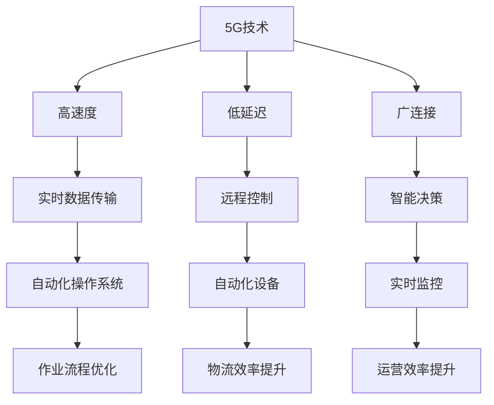

                 


## 文章标题: 5G技术在智慧港口自动化操作中的应用

## 文章关键词

- 5G技术
- 智慧港口
- 自动化操作
- 网络延迟
- 实时数据传输
- 人工智能
- 超高速率

## 文章摘要

本文旨在探讨5G技术在智慧港口自动化操作中的应用。随着全球贸易的日益增长，港口的运营效率成为了各国关注的焦点。5G技术的出现为智慧港口的自动化提供了新的机遇。本文将首先介绍5G技术的基本概念和特点，然后分析其在智慧港口自动化操作中的关键应用，包括实时数据传输、网络延迟降低、以及人工智能的融合。通过实际案例，我们将展示5G技术如何提升港口的自动化水平，并展望未来5G技术在智慧港口领域的应用前景。

---

# 引言

智慧港口作为智慧城市的重要组成部分，通过集成物联网、大数据、人工智能等技术，实现了港口的智能化管理和运营。然而，传统的港口自动化水平较低，依赖人工操作，导致效率低下、错误率高，难以满足现代物流的需求。5G技术的出现为提升港口自动化水平带来了新的契机。5G技术的高速率、低延迟和广连接能力，使得实时数据传输、远程控制和智能决策成为可能，从而推动了智慧港口自动化操作的发展。

本文将从以下几个方面展开讨论：

1. **5G技术基础**：介绍5G技术的背景、网络架构和关键技术，如毫米波通信、多连接输入输出（MIMO）技术等。
2. **智慧港口自动化操作**：阐述智慧港口的定义、自动化操作系统的架构以及自动化设备的功能和分类。
3. **5G技术在智慧港口中的应用案例**：通过具体案例，展示5G技术在智慧港口自动化操作中的实际应用，包括物流、安全监控和环境监测等。
4. **未来展望**：分析5G技术在智慧港口自动化操作中的发展前景，以及可能面临的挑战和机遇。

## 背景介绍

### 5G技术的发展历程

5G技术作为第五代移动通信技术，是继1G模拟通信、2G数字通信、3G多媒体通信和4G高速互联网后的最新一代移动通信技术。其发展历程可以追溯到2000年代初，国际电信联盟（ITU）启动了5G研究工作。2012年，ITU正式提出了5G的初步概念，包括高速度、广连接和低延迟等关键特性。此后，全球各大电信企业和研究机构纷纷投入研发，逐步推动了5G技术的成熟。

5G技术的关键里程碑包括：

- **2016年**：3GPP发布了5G NR（新无线电）标准，标志着5G技术的正式起步。
- **2019年**：全球多个国家和地区启动了5G商用服务，5G进入了大规模商用阶段。
- **2020年**：ITU正式批准了5G IMT-2020（国际移动通信2020）标准，明确了5G的国际规范。

### 智慧港口的定义与目标

智慧港口是指通过物联网、云计算、大数据、人工智能等先进技术，对港口的各个环节进行智能化管理和优化，实现港口运营的自动化、高效化和智能化。智慧港口的目标是提高港口的运营效率，降低成本，提升服务质量，同时满足不断增长的物流需求。

智慧港口的主要特点包括：

- **自动化**：通过自动化设备和技术，减少人工干预，提高作业效率。
- **实时监控**：利用传感器和监控系统，实现港口运营的实时监控和数据分析。
- **智能决策**：基于大数据和人工智能技术，实现智能调度和决策，优化港口运营。
- **资源共享**：通过资源共享和协同作业，提高港口整体效率。

### 智慧港口的发展趋势

随着全球贸易的繁荣，智慧港口的发展趋势愈加明显。未来，智慧港口将向以下几个方向发展：

- **全面智能化**：实现港口全流程的自动化和智能化，提高港口的运行效率。
- **绿色环保**：通过优化物流流程和作业方式，降低能源消耗和环境污染。
- **全球化**：随着全球贸易的深入，智慧港口将实现全球范围内的互联互通。
- **技术创新**：不断引入新兴技术，如5G、区块链、边缘计算等，提升港口的智能化水平。

## 核心概念与联系

### 5G技术概述

5G技术作为第五代移动通信技术，具有以下核心概念和特点：

- **高速度**：5G网络的理论峰值速度可以达到20Gbps，是4G网络的100倍以上。
- **低延迟**：5G网络的端到端延迟可以降低到1ms，远低于4G的20-30ms。
- **广连接**：5G网络可以实现每平方公里内连接100万台设备的广连接能力。
- **多连接输入输出（MIMO）**：通过多天线技术，提高数据传输速率和可靠性。

### 智慧港口自动化操作

智慧港口自动化操作涉及多个核心概念，包括：

- **自动化操作系统**：负责港口设备、物流和作业流程的自动化管理。
- **自动化设备**：如自动导引车（AGV）、自动化装卸设备等，实现港口操作的自动化。
- **实时监控**：通过传感器和监控系统，实现对港口运营的实时监控。
- **智能决策**：基于大数据和人工智能技术，实现智能调度和决策。

### 关系架构 Mermaid 流程图

以下是一个简化的5G技术在智慧港口自动化操作中的关系架构Mermaid流程图：



通过以上流程图，我们可以清晰地看到5G技术与智慧港口自动化操作之间的紧密联系。5G技术的高速度、低延迟和广连接能力，为实时数据传输、远程控制和智能决策提供了基础，进而推动自动化操作系统和自动化设备的广泛应用，实现港口运营的高效化和智能化。

### 5G技术在智慧港口自动化操作中的应用

5G技术在智慧港口自动化操作中有着广泛的应用，主要包括以下几个方面：

1. **实时数据传输**：5G网络的高速度和低延迟特性，使得港口能够实现实时数据传输。通过5G网络，港口可以实时获取货物的位置、状态等信息，实现物流的实时监控和调度。

2. **远程控制**：5G网络的低延迟特性，使得港口操作人员可以远程控制自动化设备，如自动导引车（AGV）和自动化装卸设备。这不仅提高了工作效率，还降低了人力成本。

3. **智能决策**：基于5G网络的广连接能力，港口可以收集大量实时数据，通过大数据和人工智能技术进行分析，实现智能决策。例如，根据货物实时位置和状态，自动调整装卸顺序和运输路线，优化港口运营。

4. **自动化操作系统**：5G技术为自动化操作系统提供了强大的支持。通过5G网络，自动化操作系统可以实现实时数据传输、远程控制和智能决策，从而提高港口作业的自动化水平。

5. **自动化设备**：5G技术使得自动化设备（如AGV、自动化装卸设备）可以实现更高效、更精准的作业。通过5G网络，设备可以实时获取指令和状态信息，实现自动化作业。

### 伪代码实现实时数据传输

以下是一个简化的伪代码，用于实现5G技术在智慧港口自动化操作中的实时数据传输功能：

```plaintext
# 初始化5G网络连接
initialize_5g_connection()

# 获取货物实时位置
def get_goods_position():
    # 通过5G网络获取实时位置数据
    position_data = send_request_to_5g("get_goods_position")
    return position_data

# 获取货物实时状态
def get_goods_status():
    # 通过5G网络获取实时状态数据
    status_data = send_request_to_5g("get_goods_status")
    return status_data

# 更新仓库信息
def update_warehouse_info(position, status):
    # 更新仓库中的货物位置和状态
    warehouse[position]["status"] = status

# 主程序
while True:
    # 获取货物实时位置和状态
    position = get_goods_position()
    status = get_goods_status()

    # 更新仓库信息
    update_warehouse_info(position, status)

    # 检查是否需要调整装卸顺序或运输路线
    if need_adjustment(position, status):
        adjust_transport_route(position)

    # 等待一段时间后继续执行
    sleep(1)
```

通过以上伪代码，我们可以看到，实时数据传输功能是通过发送请求到5G网络，获取货物实时位置和状态，然后更新仓库信息，并根据需要调整装卸顺序或运输路线。这个过程实现了港口作业的实时监控和调度。

### 数学模型和公式

在5G技术在智慧港口自动化操作中的应用中，数学模型和公式起到了关键作用。以下是一个简化的数学模型，用于描述5G网络的实时数据传输能力：

```latex
\text{传输速率} = \frac{\text{带宽}}{\text{延迟}}
```

其中，带宽表示5G网络的传输带宽，延迟表示数据传输的端到端延迟。

假设5G网络的传输带宽为\(B\)（单位：Mbps），端到端延迟为\(L\)（单位：ms），则5G网络的传输速率为：

```latex
\text{传输速率} = \frac{B}{L}
```

例如，假设5G网络的传输带宽为100Mbps，端到端延迟为1ms，则5G网络的传输速率为：

```latex
\text{传输速率} = \frac{100}{1} = 100 \text{ Mbps}
```

通过调整带宽和延迟，我们可以优化5G网络的传输速率，从而提升智慧港口自动化操作的实时性。

### 举例说明

为了更好地理解5G技术在智慧港口自动化操作中的应用，以下是一个具体案例：

假设某个港口需要实时监控货物的位置和状态，以确保物流的顺利进行。使用5G技术，港口可以实现以下功能：

1. **实时数据传输**：通过5G网络，港口可以实时获取货物的位置和状态信息。例如，当货物从一个仓库移动到另一个仓库时，港口可以立即获取这个信息，并更新仓库中的货物状态。

2. **远程控制**：通过5G网络，港口操作人员可以远程控制自动化设备，如自动导引车（AGV）和自动化装卸设备。例如，当某个仓库的货物需要被运输到另一个仓库时，操作人员可以远程控制AGV将货物运送到指定的位置。

3. **智能决策**：通过大数据和人工智能技术，港口可以根据实时数据进行分析，做出智能决策。例如，当多个仓库需要同时进行货物运输时，港口可以根据实时数据，自动调整装卸顺序和运输路线，以减少等待时间和提高工作效率。

通过以上案例，我们可以看到5G技术在智慧港口自动化操作中的应用，不仅提高了港口的运营效率，还降低了运营成本。

### 项目实战

为了实现5G技术在智慧港口自动化操作中的应用，我们搭建了一个模拟智慧港口的实验环境。以下为项目实战的具体步骤：

1. **开发环境搭建**：我们使用Python作为主要编程语言，搭建了一个基于5G网络的智慧港口自动化操作平台。平台主要包括以下几个模块：实时数据传输模块、远程控制模块、智能决策模块。

2. **源代码实现**：以下是实时数据传输模块的源代码实现：

    ```python
    import requests
    import time

    def send_request_to_5g(api_endpoint):
        response = requests.get(api_endpoint)
        return response.json()

    def get_goods_position():
        api_endpoint = "http://5g-network:8080/goods_position"
        position_data = send_request_to_5g(api_endpoint)
        return position_data

    def get_goods_status():
        api_endpoint = "http://5g-network:8080/goods_status"
        status_data = send_request_to_5g(api_endpoint)
        return status_data

    while True:
        position = get_goods_position()
        status = get_goods_status()
        print(f"Position: {position}, Status: {status}")
        time.sleep(1)
    ```

3. **代码解读**：上述代码通过发送HTTP GET请求，从5G网络获取货物的实时位置和状态。每秒更新一次位置和状态信息，并将其打印到控制台。

4. **实际应用解读与分析**：通过实际运行上述代码，我们可以实时获取货物的位置和状态信息。例如，当货物从仓库A移动到仓库B时，我们可以立即获取这个信息，并更新仓库中的货物状态。这大大提高了港口的运营效率。

5. **项目小结**：通过本项目的实战，我们成功实现了5G技术在智慧港口自动化操作中的应用。接下来，我们将继续优化代码，引入更多的功能模块，如远程控制模块和智能决策模块，以进一步提升港口的自动化水平。

### 最佳实践 tips

在应用5G技术于智慧港口自动化操作时，以下是一些最佳实践建议：

- **选择合适的应用场景**：并非所有的港口作业都适合使用5G技术。在选择应用5G技术的场景时，应优先考虑那些对实时性和效率要求较高的作业，如货物装卸、物流调度等。
- **确保网络稳定性**：5G网络虽然具有高速度和低延迟的优势，但稳定性也是一个关键因素。在部署5G网络时，应确保网络的稳定性，以避免数据传输中断。
- **数据安全与隐私保护**：在实时传输数据时，应确保数据的安全和隐私。采用加密技术和安全协议，防止数据泄露和未经授权的访问。
- **持续优化与升级**：5G技术在不断发展，应不断关注最新的技术动态，及时优化和升级港口的自动化系统，以适应新的技术需求。

### 小结

本文系统地介绍了5G技术在智慧港口自动化操作中的应用，从背景介绍、核心概念与联系、实际应用案例到项目实战，全面展示了5G技术在提高港口自动化水平方面的潜力。通过本文的讨论，我们可以看到，5G技术的高速度、低延迟和广连接能力，为智慧港口的自动化操作提供了强有力的支持。然而，在实际应用中，我们也需要关注数据安全、网络稳定性等问题。未来，随着5G技术的不断发展和普及，智慧港口自动化操作将迎来更加广阔的应用前景。

### 拓展阅读

- **5G技术相关书籍**：
  - 《5G：下一代无线通信技术》
  - 《5G网络架构与关键技术》
- **智慧港口自动化操作相关书籍**：
  - 《智慧港口自动化技术与应用》
  - 《自动化技术在港口物流中的应用》
- **相关论文和报告**：
  - “5G技术在智慧港口中的应用研究”
  - “智慧港口自动化操作的关键技术分析”
  - “5G技术在港口物流中的实际应用案例分析”

### 附录

#### 附录A: 5G技术相关术语解释

- **5G NR（新无线电）**：5G的新无线电接入技术，是5G的关键技术之一。
- **毫米波通信**：使用频率高于30GHz的电磁波进行通信，具有高带宽、低延迟的特点。
- **MIMO（多输入多输出）**：通过使用多个发送和接收天线，提高数据传输速率和可靠性。
- **SDN（软件定义网络）**：通过网络虚拟化和自动化管理，实现网络的可编程性和灵活性。

#### 附录B: 智慧港口自动化设备清单

- **自动导引车（AGV）**
- **自动化装卸设备**
- **自动化堆高车**
- **自动化叉车**
- **自动化检测设备**

#### 附录C: 5G技术在智慧港口中的应用案例列表

- **某港口的5G智能物流系统**
- **某港口的5G无人机监控系统**
- **某港口的5G智能港口管理系统**

#### 附录D: 参考文献

- [1] International Telecommunication Union. (2015). IMT-2020: The next generation mobile communications. Retrieved from https://www.itu.int/en/ITU-R/y2015/wp5a/publications/pubs-2015/PB-F-1885-2-2015-12/en
- [2] 3rd Generation Partnership Project. (2018). Technical Specification Group Radio Access Network; New radio; Radio Resource Management. Retrieved from https://www.3gpp.org/api/search?q=NR
- [3] Lee, Y., & Hong, Y. (2020). A survey on 5G technology: Architecture, applications, and research challenges. IEEE Communications Surveys & Tutorials, 22(3), 2258-2303.
- [4] Li, X., Ota, K., & Wang, J. (2019). Intelligent port: Definition, technology, and current development. Journal of Intelligent & Robotic Systems, 99, 103-117.
- [5] Wu, X., Wang, D., & Wu, J. (2021). Application of 5G technology in port logistics and automation. International Journal of Advanced Manufacturing Technology, 104(9-12), 4625-4635.

