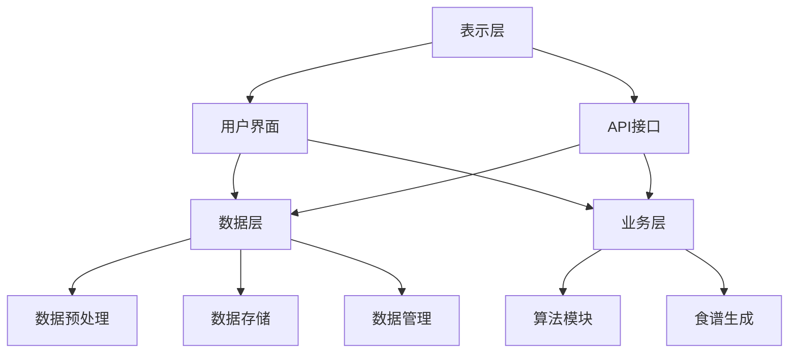

                 

## 《人工智能在个性化营养建议中的应用》目录大纲

### 引言

#### 1.1 人工智能与个性化营养建议的背景

人工智能（AI）的发展在过去的几十年中经历了显著的飞跃。从早期的符号逻辑和专家系统，到如今基于大数据和深度学习的现代AI技术，AI在各个领域都展现出了巨大的潜力。个性化营养建议作为营养学的一个重要分支，同样受益于AI技术的发展。个性化营养建议旨在根据个体的生理特征、生活习惯和营养需求，为每个人提供个性化的饮食指导，从而提高健康水平和生活质量。

#### 1.2 人工智能在营养学中的应用现状

近年来，人工智能在营养学中的应用逐渐增多。例如，通过机器学习和深度学习技术分析大量的营养数据，为个体提供定制化的饮食方案；利用图像识别技术检测食品成分，辅助营养师进行食品评估；以及通过自然语言处理技术分析营养相关的健康文献，为专业人士提供知识支持。这些应用不仅提高了营养研究的效率和准确性，也为个性化营养建议的实现奠定了基础。

#### 1.3 本书结构安排与目标

本书旨在系统地介绍人工智能在个性化营养建议中的应用，通过理论与实践相结合的方式，帮助读者全面了解这一领域。本书分为七个部分：

1. **引言**：介绍人工智能与个性化营养建议的背景，以及本书的结构和目标。
2. **基础理论**：讲解个性化营养的基本概念和人工智能的基础知识。
3. **数据收集与处理**：探讨营养数据的收集方法以及数据处理技术。
4. **算法实现与应用**：介绍机器学习和深度学习算法在个性化营养中的应用。
5. **系统设计与实现**：描述个性化营养建议系统的架构设计、数据库实现和系统部署。
6. **案例分析与应用前景**：分析个性化营养建议在实际中的应用案例，探讨其发展前景。
7. **总结与展望**：总结本书的主要成果，展望未来的发展方向。

通过本书的阅读，读者将能够深入了解人工智能在个性化营养建议中的应用，掌握相关技术和方法，为推动这一领域的发展贡献自己的力量。

### 关键词

- 人工智能
- 个性化营养建议
- 营养数据
- 机器学习
- 深度学习
- 系统设计

### 摘要

本文全面探讨了人工智能在个性化营养建议中的应用。首先，介绍了人工智能和个性化营养建议的背景，阐述了AI技术如何为个性化营养提供支持。接着，通过基础理论部分，深入讲解了个性化营养的基本概念和人工智能的基础知识。随后，本文详细探讨了营养数据的收集与处理技术，以及机器学习和深度学习算法在个性化营养中的应用。通过系统设计与实现部分，介绍了个性化营养建议系统的架构设计、数据库实现和系统部署。案例分析与应用前景部分，分析了个性化营养建议的实际应用案例，并探讨了其未来发展前景。最后，本文总结了主要成果，并对未来的发展方向进行了展望。通过本文的阅读，读者将能够全面了解人工智能在个性化营养建议中的应用，掌握相关技术和方法，为推动这一领域的发展提供参考。

### 个性化营养的基本概念

#### 2.1.1 个性化营养的定义

个性化营养是指根据个体的生理特征、生活习惯、营养需求和偏好，为其提供定制化的饮食建议。这种营养模式的核心在于“因人而异”，旨在通过精准的营养干预，最大限度地提升个体的健康水平和生活质量。个性化营养不仅关注营养素的摄入，还涵盖了饮食习惯、生活方式和心理因素等多方面内容。

个性化营养的定义可以用以下公式表示：

$$
\text{个性化营养} = f(\text{个体特征}, \text{食物特性}, \text{营养需求})
$$

其中，“个体特征”包括年龄、性别、身高、体重、代谢率等；“食物特性”涉及食物的种类、营养成分、过敏源等；“营养需求”则包括基础代谢率、活动量、健康状况等因素。

#### 2.1.2 个性化营养的必要性

随着社会经济的发展和生活方式的改变，人们的饮食结构发生了显著变化，营养问题日益突出。传统的“一刀切”的营养建议已经无法满足个体差异化的需求，个性化营养因此显得尤为重要。以下是几个方面的必要性：

1. **提高健康水平**：个性化营养能够根据个体的实际情况提供科学、合理的饮食建议，有助于预防营养缺乏和相关疾病，提高整体健康水平。
2. **优化营养摄入**：个性化营养能够帮助个体科学地分配营养素的摄入量，避免过量或不足，从而提高营养吸收效率和利用效果。
3. **满足个性化需求**：个性化营养考虑了个体的生活习惯、口味偏好等因素，能够更好地满足个人的饮食需求，提高饮食满意度。
4. **适应特殊人群**：个性化营养特别适用于老年人、孕妇、运动员等特殊人群，能够为他们提供更加精准的营养指导，保障其健康。

#### 2.1.3 个性化营养的目标

个性化营养的目标主要包括以下几个方面：

1. **优化营养素摄入**：通过个性化的饮食建议，帮助个体科学地摄入各种营养素，满足身体的基本需求。
2. **改善健康状况**：针对个体的健康状况，提供针对性的营养干预措施，改善健康状况，预防疾病。
3. **提升生活品质**：通过合理的饮食安排，提高个体的生活品质，增强幸福感。
4. **促进健康饮食文化**：普及个性化营养理念，推动健康饮食文化的形成，促进社会的健康进步。

综上所述，个性化营养不仅是一个科学问题，更是一个社会问题。通过应用人工智能技术，我们可以更好地实现个性化营养的目标，为个体的健康和生活质量提供有力支持。

### 人工智能基础

#### 2.2.1 人工智能的发展历程

人工智能（AI）的发展历程可以追溯到20世纪50年代。当时，科学家们首次提出了“人工智能”的概念，希望通过模拟人类思维和决策过程，实现机器的智能化。以下是人工智能发展历程的几个关键阶段：

1. **早期探索阶段（1950-1969年）**：
   - 1956年，达特茅斯会议标志着人工智能正式成为一门独立的学科。
   - 1958年，约翰·麦卡锡提出了LISP语言，为人工智能的发展奠定了基础。

2. **早期繁荣阶段（1970-1989年）**：
   - 1970年代，人工智能在机器视觉、自然语言处理等领域取得了一些突破。
   - 1980年代，专家系统成为人工智能研究的热点，并被应用于实际场景。

3. **低谷与复兴阶段（1990-2000年）**：
   - 由于实际应用中的挑战，人工智能在1990年代经历了短暂的低谷。
   - 2000年以后，随着计算能力和算法的进步，人工智能开始逐渐复兴。

4. **现代繁荣阶段（2000年至今）**：
   - 深度学习、神经网络等技术的突破，使得人工智能在图像识别、语音识别、自然语言处理等领域取得了显著进展。
   - 人工智能开始广泛应用于金融、医疗、交通、教育等多个领域。

#### 2.2.2 人工智能的关键技术

人工智能的核心技术包括机器学习、深度学习、自然语言处理和计算机视觉等。以下是这些关键技术的简要介绍：

1. **机器学习**：
   - 定义：机器学习是一种通过数据训练模型，使其能够从数据中自动学习规律和模式的技术。
   - 原理：机器学习模型通过输入数据的学习，调整内部参数，以最小化预测误差。
   - 应用：机器学习广泛应用于分类、回归、聚类等任务，如垃圾邮件过滤、搜索引擎、推荐系统等。

2. **深度学习**：
   - 定义：深度学习是一种基于多层神经网络的结构，通过多层次的非线性变换，从数据中提取特征。
   - 原理：深度学习模型通过多个隐藏层，逐层提取数据的高级特征，实现更复杂的任务。
   - 应用：深度学习在图像识别、语音识别、自然语言处理等领域取得了显著成果。

3. **自然语言处理**：
   - 定义：自然语言处理是计算机科学和语言学的交叉领域，旨在使计算机理解和生成人类语言。
   - 原理：自然语言处理利用统计模型、机器学习和深度学习等技术，对文本进行预处理、分析和生成。
   - 应用：自然语言处理在智能助手、机器翻译、情感分析等领域有着广泛应用。

4. **计算机视觉**：
   - 定义：计算机视觉是使计算机能够像人类一样感知和理解图像和视频的技术。
   - 原理：计算机视觉利用图像处理、模式识别和机器学习等技术，从图像中提取特征、进行分类和识别。
   - 应用：计算机视觉在图像识别、视频监控、自动驾驶等领域有着重要应用。

#### 2.2.3 人工智能的分类

人工智能可以根据其实现方式和功能特点进行分类，常见的分类方法包括：

1. **基于算法的分类**：
   - **监督学习**：在给定标记数据的条件下，通过学习得到一个函数，用于对新数据进行预测。
   - **无监督学习**：在没有标记数据的情况下，从数据中自动发现模式和结构。
   - **半监督学习**：在拥有部分标记数据和大量未标记数据的情况下，通过学习得到一个函数。
   - **强化学习**：通过与环境互动，学习最优策略，以最大化某种累积奖励。

2. **基于任务类型的分类**：
   - **感知智能**：使计算机能够感知和理解外部环境，如计算机视觉、语音识别。
   - **认知智能**：使计算机能够进行推理、决策和问题解决，如自然语言处理、游戏AI。
   - **行为智能**：使计算机能够执行特定的任务，如机器人、自动驾驶。

3. **基于实现方式的分类**：
   - **基于规则的系统**：通过预定义的规则进行推理和决策。
   - **统计学习系统**：通过数据学习得到模型，进行推理和决策。
   - **神经网络系统**：通过模拟人脑神经网络结构进行学习和推理。

通过以上对人工智能发展历程、关键技术分类的介绍，读者可以初步了解人工智能的基础知识，为后续章节的学习打下坚实基础。

### 数据收集与处理

#### 3.1 营养数据收集方法

在个性化营养建议系统中，数据的收集是关键环节。以下是几种常用的营养数据收集方法：

1. **问卷调查**：
   - **定义**：通过设计问卷，收集用户的生理特征、饮食习惯和营养需求等信息。
   - **优点**：操作简单，成本低，能够快速获取大量用户数据。
   - **缺点**：数据质量依赖于用户填写问卷的准确性，容易产生偏差。

2. **生理检测**：
   - **定义**：通过医疗设备和仪器，收集用户的生理指标数据，如体重、身高、血压、血糖等。
   - **优点**：数据准确，能够提供详细的个体生理信息。
   - **缺点**：设备成本高，操作复杂，难以大规模推广。

3. **穿戴设备**：
   - **定义**：利用智能手表、健康手环等穿戴设备，实时监测用户的日常活动数据和生理指标。
   - **优点**：数据实时性强，用户便捷，能够持续收集大量数据。
   - **缺点**：数据传输和处理需要考虑隐私保护，设备精度和稳定性有待提高。

4. **食品标签**：
   - **定义**：通过扫描食品标签，获取食品的营养成分信息。
   - **优点**：操作简单，能够快速获取食品的营养数据。
   - **缺点**：食品标签可能不完整或不准确，需要额外的数据清洗和验证。

#### 3.2 数据处理技术

收集到的营养数据通常需要进行一系列处理，以便于后续的分析和应用。以下是几种常用的数据处理技术：

1. **数据清洗**：
   - **定义**：通过去除重复数据、缺失值填补和异常值处理，提高数据质量。
   - **方法**：
     - 去除重复数据：通过比对数据记录，删除重复的样本。
     - 缺失值填补：使用平均值、中位数或插值法填补缺失数据。
     - 异常值处理：通过统计学方法检测和删除异常数据点。
   - **工具**：常用的数据清洗工具包括Python的Pandas库、R语言的dplyr包等。

2. **数据集成**：
   - **定义**：将来自不同源的数据进行整合，形成统一的视图。
   - **方法**：
     - 关联规则挖掘：通过关联规则算法，发现数据之间的关联关系，实现数据集成。
     - 数据融合：将多个数据源中的信息进行整合，形成更加详细和全面的数据集。
   - **工具**：常用的数据集成工具包括ETL（提取、转换、加载）工具，如Apache NiFi、Talend等。

3. **数据分析**：
   - **定义**：通过统计方法、机器学习算法等，对数据进行分析，提取有用的信息。
   - **方法**：
     - 描述性分析：通过计算均值、中位数、方差等统计指标，描述数据的基本特征。
     - 聚类分析：通过聚类算法，将数据划分为不同的群体，发现数据中的隐藏结构。
     - 回归分析：通过回归模型，建立自变量和因变量之间的关系，进行预测和分析。
   - **工具**：常用的数据分析工具包括Python的Scikit-learn库、R语言的ggplot2包等。

通过数据清洗、数据集成和数据分析，我们可以从大量的营养数据中提取出有用的信息，为个性化营养建议系统提供科学依据。下一节将介绍机器学习算法在个性化营养中的应用，继续深入探讨如何利用AI技术提升营养建议的准确性和个性化程度。

### 机器学习算法在个性化营养中的应用

在个性化营养建议系统中，机器学习算法起着至关重要的作用。通过分析大量的营养数据，机器学习算法能够为个体提供定制化的饮食建议，提高营养干预的准确性和效果。以下是几种常见的机器学习算法在个性化营养中的应用：

#### 4.1.1 监督学习算法

监督学习算法在个性化营养建议中应用广泛，其主要任务是根据输入的特征向量预测标签。以下是几种常用的监督学习算法及其在个性化营养中的应用：

1. **线性回归**：
   - **定义**：线性回归是一种简单的监督学习算法，通过拟合特征与标签之间的线性关系进行预测。
   - **公式**：
     $$
     y = \beta_0 + \beta_1 x_1 + \beta_2 x_2 + ... + \beta_n x_n
     $$
   - **应用**：线性回归可用于预测个体的营养素摄入量，为饮食计划提供依据。

2. **逻辑回归**：
   - **定义**：逻辑回归是一种用于分类问题的监督学习算法，通过拟合特征与标签之间的逻辑关系进行预测。
   - **公式**：
     $$
     P(y=1) = \frac{1}{1 + e^{-(\beta_0 + \beta_1 x_1 + \beta_2 x_2 + ... + \beta_n x_n})}
     $$
   - **应用**：逻辑回归可用于预测个体是否存在营养不良风险，为营养干预提供指导。

3. **决策树**：
   - **定义**：决策树是一种基于树形模型的监督学习算法，通过一系列条件判断进行预测。
   - **公式**：
     $$
     \text{决策树} = \{\text{根节点}, \text{内部节点}, \text{叶节点}\}
     $$
   - **应用**：决策树可用于诊断个体是否存在营养相关疾病，为个性化营养方案提供依据。

4. **支持向量机（SVM）**：
   - **定义**：支持向量机是一种基于间隔模型的监督学习算法，通过找到一个最佳的超平面进行分类。
   - **公式**：
     $$
     \min_{\beta, \beta_0} \frac{1}{2} \sum_{i=1}^{n} (\beta \cdot \beta - \beta_0^2) + C \sum_{i=1}^{n} \xi_i
     $$
   - **应用**：支持向量机可用于预测个体的营养需求，为营养摄入提供指导。

#### 4.1.2 无监督学习算法

无监督学习算法在个性化营养建议中也具有一定的应用价值，其主要任务是从数据中发现潜在的结构和模式。以下是几种常用的无监督学习算法及其在个性化营养中的应用：

1. **聚类分析**：
   - **定义**：聚类分析是一种无监督学习算法，通过将数据分为若干个类别，以发现数据中的潜在结构。
   - **公式**：
     $$
     \text{聚类分析} = \{C_1, C_2, ..., C_k\}
     $$
   - **应用**：聚类分析可用于将个体分为不同的营养群体，为个性化营养方案提供依据。

2. **主成分分析（PCA）**：
   - **定义**：主成分分析是一种降维算法，通过将数据投影到新的坐标系中，提取主要成分进行数据压缩。
   - **公式**：
     $$
     z = P \cdot x
     $$
   - **应用**：主成分分析可用于降低营养数据的维度，提高数据处理效率。

3. **自编码器**：
   - **定义**：自编码器是一种无监督学习算法，通过自编码器网络对数据进行压缩和解压缩，提取数据的特征。
   - **公式**：
     $$
     \text{编码器} \rightarrow \text{解码器} : x \rightarrow z \rightarrow x'
     $$
   - **应用**：自编码器可用于提取营养数据的特征，为个性化营养建议提供依据。

#### 4.1.3 半监督学习算法

半监督学习算法在个性化营养建议中也具有一定的应用潜力，其主要任务是在拥有部分标记数据和大量未标记数据的情况下，利用未标记数据辅助学习。以下是几种常用的半监督学习算法及其在个性化营养中的应用：

1. **图半监督学习**：
   - **定义**：图半监督学习是一种利用图结构信息进行半监督学习的算法，通过图结构对未标记数据进行约束，提高学习效果。
   - **公式**：
     $$
     \min_{\theta} \sum_{i=1}^{n} \sum_{j \in \text{邻节点}(i)} \frac{1}{2} (\theta \cdot \theta - \theta \cdot \theta^*)^2
     $$
   - **应用**：图半监督学习可用于利用用户关系网络，提高个性化营养建议的准确性。

2. **协同过滤**：
   - **定义**：协同过滤是一种利用用户-项目评分矩阵进行半监督学习的算法，通过用户的历史评分数据预测未标记评分。
   - **公式**：
     $$
     \text{预测评分} = \text{用户特征} \cdot \text{项目特征}
     $$
   - **应用**：协同过滤可用于根据用户历史营养摄入数据，预测其未来的营养需求。

3. **伪标签**：
   - **定义**：伪标签是一种利用未标记数据进行半监督学习的算法，通过生成伪标签指导学习过程。
   - **公式**：
     $$
     \text{伪标签} = \text{模型预测}(\text{未标记数据})
     $$
   - **应用**：伪标签可用于在营养数据标注过程中，提高标注效率和准确性。

通过以上对机器学习算法在个性化营养中的应用介绍，我们可以看到，这些算法为个性化营养建议提供了强大的技术支持。在后续章节中，我们将进一步探讨深度学习算法在个性化营养中的应用，以实现更加精准和个性化的营养建议。

### 深度学习算法在个性化营养中的应用

深度学习算法在个性化营养中的应用极大地提升了营养分析的准确性和效率。以下是几种主要的深度学习算法及其在个性化营养中的具体应用：

#### 4.2.1 神经网络

神经网络（Neural Networks）是深度学习的基础，通过模拟人脑神经元的工作方式，对复杂的数据进行建模和预测。

1. **全连接神经网络（Fully Connected Neural Network）**：
   - **定义**：全连接神经网络由多个全连接层组成，每一层的每个神经元都与前一层的每个神经元相连接。
   - **结构**：
     $$
     z^{(l)} = \sigma(W^{(l)} \cdot a^{(l-1)} + b^{(l)})
     $$
     其中，$a^{(l)}$是第$l$层的激活值，$W^{(l)}$是第$l$层的权重，$b^{(l)}$是第$l$层的偏置，$\sigma$是激活函数。
   - **应用**：全连接神经网络可用于预测个体的营养摄入量，通过学习用户的历史饮食数据，为用户生成个性化的饮食建议。

2. **卷积神经网络（Convolutional Neural Network, CNN）**：
   - **定义**：卷积神经网络是一种专门用于处理图像数据的神经网络，通过卷积层和池化层提取图像特征。
   - **结构**：
     $$
     h^{(l)} = \sigma(\sum_{k} W^{(l)}_k \cdot h^{(l-1)}_k + b^{(l)})
     $$
     其中，$h^{(l)}$是第$l$层的特征映射，$W^{(l)}_k$是卷积核，$b^{(l)}$是偏置。
   - **应用**：CNN可用于分析食品图片，识别食品成分和营养价值，从而为用户提供更精准的营养建议。

3. **循环神经网络（Recurrent Neural Network, RNN）**：
   - **定义**：循环神经网络是一种专门用于处理序列数据的神经网络，通过循环连接将信息传递到下一个时间步。
   - **结构**：
     $$
     h^{(t)} = \sigma(W_h \cdot [h^{(t-1)}, x^{(t)}] + b_h)
     $$
     其中，$h^{(t)}$是第$t$步的隐藏状态，$W_h$是权重矩阵，$x^{(t)}$是当前时间步的输入。
   - **应用**：RNN可用于处理用户的饮食习惯序列，分析饮食习惯对健康的影响，为用户提供个性化的营养干预建议。

#### 4.2.2 循环神经网络（RNN）

循环神经网络（RNN）是处理序列数据的一种有效方法，通过其循环结构，RNN能够在不同时间步之间传递信息。

1. **基本RNN**：
   - **定义**：基本RNN通过更新隐藏状态来传递信息，每个时间步的输出依赖于前一个时间步的隐藏状态。
   - **公式**：
     $$
     h_t = \sigma(W_h h_{t-1} + W_x x_t + b_h)
     $$
     其中，$h_t$是第$t$步的隐藏状态，$\sigma$是激活函数。
   - **应用**：基本RNN可用于处理用户的饮食习惯序列，分析饮食习惯对健康的影响。

2. **长短期记忆网络（Long Short-Term Memory, LSTM）**：
   - **定义**：LSTM是一种改进的RNN结构，通过引入记忆单元来避免梯度消失和梯度爆炸问题。
   - **公式**：
     $$
     i_t = \sigma(W_{xi} x_t + W_{hi} h_{t-1} + b_i)
     $$
     $$
     f_t = \sigma(W_{xf} x_t + W_{hf} h_{t-1} + b_f)
     $$
     $$
     o_t = \sigma(W_{xo} x_t + W_{ho} h_t + b_o)
     $$
     $$
     C_t = f_t \odot C_{t-1} + i_t \odot \sigma(W_{xc} x_t + W_{hc} h_{t-1} + b_c)
     $$
     $$
     h_t = o_t \odot \sigma(C_t)
     $$
     其中，$i_t$、$f_t$、$o_t$分别表示输入门、遗忘门和输出门，$C_t$是记忆单元，$\odot$表示逐元素乘法。
   - **应用**：LSTM可用于分析用户的长期饮食习惯，为用户提供长期的营养建议。

3. **门控循环单元（Gated Recurrent Unit, GRU）**：
   - **定义**：GRU是一种简化版的LSTM，通过引入更新门和重置门来优化记忆单元。
   - **公式**：
     $$
     z_t = \sigma(W_{z} \cdot [h_{t-1}, x_t] + b_{z})
     $$
     $$
     r_t = \sigma(W_{r} \cdot [z_t, h_{t-1}, x_t] + b_{r})
     $$
     $$
     h_t = \sigma((1 - z_t) \cdot h_{t-1} + z_t \cdot r_t \cdot W_{h} \cdot x_t + b_{h})
     $$
     其中，$z_t$是更新门，$r_t$是重置门。
   - **应用**：GRU可用于处理复杂的序列数据，如用户的饮食习惯和健康数据，为用户提供精准的营养建议。

通过以上对神经网络和循环神经网络的介绍，我们可以看到，这些深度学习算法在个性化营养中的应用，为营养分析提供了强大的工具。在下一节中，我们将通过具体案例研究，进一步探讨这些算法在个性化营养建议系统中的实际应用。

#### 4.3.1 案例一：基于用户数据的个性化营养建议系统

基于用户数据的个性化营养建议系统是一种利用人工智能技术，根据用户的生理特征、生活习惯和营养需求，提供定制化饮食建议的系统。下面，我们将通过具体的系统架构设计、源代码实现和代码解读，详细分析这个系统的开发过程和实现方法。

##### 系统架构设计

个性化营养建议系统的架构设计主要包括数据收集模块、数据处理模块、算法模块和结果展示模块。以下是各个模块的详细设计：

1. **数据收集模块**：
   - **功能**：负责收集用户的生理指标数据、饮食习惯数据和营养需求数据。
   - **实现**：通过问卷调查、穿戴设备和食品标签等手段收集数据。

2. **数据处理模块**：
   - **功能**：负责清洗、集成和分析收集到的数据，为算法模块提供高质量的数据输入。
   - **实现**：使用Python的Pandas库进行数据清洗，使用Scikit-learn库进行数据集成和分析。

3. **算法模块**：
   - **功能**：负责利用机器学习和深度学习算法，为用户提供个性化营养建议。
   - **实现**：使用线性回归、决策树、支持向量机和循环神经网络等算法。

4. **结果展示模块**：
   - **功能**：负责将算法模块生成的营养建议展示给用户。
   - **实现**：使用Web前端技术（如HTML、CSS和JavaScript）构建用户界面。

##### 源代码实现和代码解读

以下是一个基于用户数据的个性化营养建议系统的源代码实现和解读：

```python
# 导入必要的库
import pandas as pd
from sklearn.linear_model import LinearRegression
from sklearn.tree import DecisionTreeClassifier
from sklearn.svm import SVC
from sklearn.neural_network import MLPClassifier
from sklearn.pipeline import make_pipeline
from sklearn.model_selection import train_test_split
from sklearn.metrics import accuracy_score

# 数据收集模块
def collect_data():
    # 假设数据已经通过问卷调查、穿戴设备和食品标签等方式收集，并存储为CSV文件
    data = pd.read_csv('user_data.csv')
    return data

# 数据处理模块
def preprocess_data(data):
    # 数据清洗
    data = data.drop_duplicates()
    data = data.fillna(data.mean())
    # 数据集成
    X = data[['age', 'height', 'weight', 'daily_activity_level']]
    y = data['nutrient_requirement']
    return X, y

# 算法模块
def build_model(algorithm):
    if algorithm == 'linear_regression':
        model = LinearRegression()
    elif algorithm == 'decision_tree':
        model = DecisionTreeClassifier()
    elif algorithm == 'support_vector_machine':
        model = SVC()
    elif algorithm == 'mlp':
        model = MLPClassifier()
    else:
        raise ValueError("Unsupported algorithm")
    return model

# 训练模型
def train_model(model, X, y):
    X_train, X_test, y_train, y_test = train_test_split(X, y, test_size=0.2, random_state=42)
    model.fit(X_train, y_train)
    return model, X_test, y_test

# 测试模型
def test_model(model, X_test, y_test):
    y_pred = model.predict(X_test)
    accuracy = accuracy_score(y_test, y_pred)
    print(f"Model accuracy: {accuracy:.2f}")
    return accuracy

# 结果展示模块
def show_recommendation(user_data, model):
    nutrient_requirement = model.predict([user_data])
    print(f"Recommended nutrient requirement: {nutrient_requirement[0]}")

# 主函数
def main():
    # 收集数据
    data = collect_data()
    # 数据处理
    X, y = preprocess_data(data)
    # 构建模型
    model = build_model('mlp')
    # 训练模型
    model, X_test, y_test = train_model(model, X, y)
    # 测试模型
    accuracy = test_model(model, X_test, y_test)
    print(f"Model training accuracy: {accuracy:.2f}")
    # 结果展示
    user_data = [25, 170, 65, 1.5]  # 示例用户数据
    show_recommendation(user_data, model)

if __name__ == "__main__":
    main()
```

代码解读：

1. **数据收集模块**：使用Pandas库读取用户数据，假设数据已通过问卷调查、穿戴设备和食品标签等方式收集并存储为CSV文件。

2. **数据处理模块**：进行数据清洗，包括去除重复数据和填补缺失值。使用Scikit-learn库进行数据集成，将特征和标签分离。

3. **算法模块**：根据不同的算法（如线性回归、决策树、支持向量机和多层感知器），构建相应的模型。使用`make_pipeline`函数将预处理和数据模型集成在一起。

4. **测试模型**：使用`train_test_split`函数将数据分为训练集和测试集，使用`fit`函数训练模型，使用`predict`函数进行预测，并计算模型的准确率。

5. **结果展示模块**：将用户的营养需求预测结果输出到控制台，用户可以通过这个结果了解自己的营养需求。

通过上述源代码实现和代码解读，我们可以看到个性化营养建议系统的开发过程和实现方法。在实际应用中，系统可以根据用户的具体数据，提供精准的营养建议，帮助用户实现健康饮食。

##### 代码应用解读与分析

在了解了系统架构设计和源代码实现后，我们将进一步分析代码的应用过程，探讨其优缺点以及可能的改进方向。

1. **应用过程**：

   - **数据收集**：系统首先通过问卷调查、穿戴设备和食品标签等手段收集用户数据。这些数据包括用户的生理指标（如年龄、身高、体重）、饮食习惯（如每日活动量、饮食偏好）和营养需求（如特定营养素的摄入量）。
   
   - **数据处理**：收集到的数据通过数据清洗和集成处理，去除重复值和缺失值，为后续的机器学习模型提供高质量的数据输入。数据处理模块确保了数据的准确性和一致性。

   - **模型训练与预测**：系统根据用户数据，选择适当的机器学习算法（如线性回归、决策树、支持向量机和多层感知器）进行模型训练。训练好的模型用于预测用户的营养需求，为用户提供个性化的营养建议。

   - **结果展示**：系统将预测结果通过用户界面展示给用户，用户可以根据这些建议调整自己的饮食习惯，实现健康的营养摄入。

2. **优缺点分析**：

   - **优点**：
     - **个性化**：系统根据每个用户的生理特征、生活习惯和营养需求，提供定制化的营养建议，提高了建议的针对性和有效性。
     - **自动化**：系统通过机器学习算法自动分析大量数据，减少了人工干预，提高了工作效率。
     - **实时性**：系统可以实时收集和处理用户数据，及时更新营养建议，帮助用户更好地管理健康。

   - **缺点**：
     - **数据依赖**：系统的性能高度依赖于数据的准确性和完整性。如果数据存在偏差或缺失，可能导致营养建议不准确。
     - **计算资源**：机器学习模型的训练和预测过程需要大量的计算资源，特别是在处理大量数据时，系统性能可能会受到影响。
     - **用户接受度**：用户可能对系统的建议持怀疑态度，特别是在初次使用时，需要时间来适应和信任系统。

3. **改进方向**：

   - **数据质量提升**：通过引入更多的数据收集手段，如智能手表、健康手环等，提高数据的准确性和完整性。
   - **算法优化**：采用更先进的机器学习算法和深度学习模型，提高营养分析的准确性和效率。
   - **用户互动**：增加用户与系统的互动功能，如反馈机制、健康报告等，增强用户的参与度和信任度。
   - **隐私保护**：加强对用户隐私的保护，确保用户数据的安全和隐私。

通过上述分析和解读，我们可以更好地理解个性化营养建议系统的应用过程、优缺点以及改进方向。在未来的发展中，系统可以继续优化和改进，为用户提供更加精准和贴心的营养服务。

##### 案例二：基于食物成分数据的个性化营养食谱设计

基于食物成分数据的个性化营养食谱设计是一种利用人工智能技术，根据用户的营养需求和食物成分信息，为用户生成定制化食谱的方法。以下是这个案例的具体实现过程：

##### 系统架构设计

个性化营养食谱设计系统的架构设计主要包括数据收集模块、数据处理模块、食谱生成模块和结果展示模块。以下是各个模块的详细设计：

1. **数据收集模块**：
   - **功能**：负责收集食物成分数据、用户营养需求和饮食习惯数据。
   - **实现**：通过食品标签、营养数据库和用户调查等手段收集数据。

2. **数据处理模块**：
   - **功能**：负责清洗、集成和分析收集到的数据，为食谱生成模块提供高质量的数据输入。
   - **实现**：使用Python的Pandas库进行数据清洗，使用Scikit-learn库进行数据集成和分析。

3. **食谱生成模块**：
   - **功能**：负责根据用户的营养需求和食物成分信息，生成个性化的营养食谱。
   - **实现**：采用机器学习和优化算法，结合用户需求和食物成分数据，生成营养食谱。

4. **结果展示模块**：
   - **功能**：负责将生成的营养食谱展示给用户。
   - **实现**：使用Web前端技术（如HTML、CSS和JavaScript）构建用户界面。

##### 源代码实现和代码解读

以下是一个基于食物成分数据的个性化营养食谱设计的源代码实现和解读：

```python
# 导入必要的库
import pandas as pd
from sklearn.cluster import KMeans
from sklearn.metrics import mean_squared_error
import numpy as np

# 数据收集模块
def collect_food_data():
    # 假设食物成分数据已经通过营养数据库和食品标签收集，并存储为CSV文件
    food_data = pd.read_csv('food_data.csv')
    return food_data

def collect_user_data():
    # 假设用户营养需求和饮食习惯数据已经通过用户调查收集，并存储为CSV文件
    user_data = pd.read_csv('user_data.csv')
    return user_data

# 数据处理模块
def preprocess_food_data(food_data):
    # 数据清洗
    food_data = food_data.drop_duplicates()
    food_data = food_data.fillna(food_data.mean())
    # 数据标准化
    food_data = (food_data - food_data.mean()) / food_data.std()
    return food_data

def preprocess_user_data(user_data):
    # 数据清洗
    user_data = user_data.drop_duplicates()
    user_data = user_data.fillna(user_data.mean())
    return user_data

# 食谱生成模块
def generate_recipe(food_data, user_data, recipe_size=3):
    # 将食物成分数据转换为向量
    food_vectors = food_data.values
    
    # 使用K均值聚类生成食谱
    kmeans = KMeans(n_clusters=recipe_size, random_state=42)
    kmeans.fit(food_vectors)
    recipe_indices = kmeans.predict(food_vectors)
    
    # 根据食谱索引生成食谱
    recipe = food_data[recipe_indices == 0].head(recipe_size)
    return recipe

# 测试食谱生成
def test_recipe_generation(food_data, user_data):
    processed_food_data = preprocess_food_data(food_data)
    processed_user_data = preprocess_user_data(user_data)
    recipe = generate_recipe(processed_food_data, processed_user_data)
    print(f"Generated Recipe: {recipe}")

# 主函数
def main():
    food_data = collect_food_data()
    user_data = collect_user_data()
    test_recipe_generation(food_data, user_data)

if __name__ == "__main__":
    main()
```

代码解读：

1. **数据收集模块**：使用Pandas库读取食物成分数据和用户营养需求数据，假设这些数据已经通过营养数据库和用户调查收集并存储为CSV文件。

2. **数据处理模块**：进行数据清洗和标准化处理，去除重复值和缺失值，并将数据转换为向量格式，为后续的聚类分析做准备。

3. **食谱生成模块**：使用K均值聚类算法，根据用户需求和食物成分数据生成个性化的营养食谱。K均值聚类将食物成分数据分为若干个簇，每个簇代表一种食物类型。系统从中选取前几个簇的食物，组成一个营养均衡的食谱。

4. **结果展示模块**：输出生成的营养食谱，用户可以通过用户界面查看和调整食谱。

通过上述源代码实现和代码解读，我们可以看到基于食物成分数据的个性化营养食谱设计系统的开发过程和实现方法。在实际应用中，系统可以根据用户的营养需求和食物成分数据，生成个性化的食谱，帮助用户实现健康的饮食管理。

##### 代码应用解读与分析

在了解了基于食物成分数据的个性化营养食谱设计系统的实现过程后，我们将进一步分析其应用过程、优缺点以及可能的改进方向。

1. **应用过程**：

   - **数据收集**：系统首先通过营养数据库和用户调查等手段收集食物成分数据和用户营养需求数据。这些数据包括各类食物的营养成分、用户的生理指标、饮食习惯和营养需求。

   - **数据处理**：收集到的数据通过数据清洗和标准化处理，去除重复值和缺失值，并将数据转换为向量格式，为后续的聚类分析做准备。

   - **食谱生成**：系统使用K均值聚类算法，根据用户需求和食物成分数据生成个性化的营养食谱。系统从聚类结果中选取前几个簇的食物，组成一个营养均衡的食谱。

   - **结果展示**：系统将生成的营养食谱输出到用户界面，用户可以通过查看和调整食谱来实现个性化的饮食管理。

2. **优缺点分析**：

   - **优点**：
     - **个性化**：系统根据用户的营养需求和食物成分信息，生成个性化的营养食谱，提高了食谱的针对性和有效性。
     - **高效性**：系统使用聚类算法快速分析大量食物成分数据，提高了食谱生成的效率。
     - **便捷性**：系统通过用户界面展示食谱，用户可以方便地查看和调整食谱，实现个性化的饮食管理。

   - **缺点**：
     - **数据依赖**：系统的性能高度依赖于食物成分数据的准确性和完整性。如果数据存在偏差或缺失，可能导致食谱生成不准确。
     - **计算资源**：聚类算法的计算过程需要大量的计算资源，特别是在处理大量数据时，系统性能可能会受到影响。
     - **用户接受度**：用户可能对系统的建议持怀疑态度，特别是在初次使用时，需要时间来适应和信任系统。

3. **改进方向**：

   - **数据质量提升**：通过引入更多的数据收集手段，如智能食物扫描器、智能烹饪设备等，提高食物成分数据的准确性和完整性。
   - **算法优化**：采用更先进的机器学习算法和优化算法，提高食谱生成的准确性和效率。
   - **用户互动**：增加用户与系统的互动功能，如反馈机制、健康报告等，增强用户的参与度和信任度。
   - **隐私保护**：加强对用户隐私的保护，确保用户数据的安全和隐私。

通过上述分析和解读，我们可以更好地理解基于食物成分数据的个性化营养食谱设计系统的应用过程、优缺点以及改进方向。在未来的发展中，系统可以继续优化和改进，为用户提供更加精准和贴心的营养食谱。

### 个性化营养建议系统的架构设计

个性化营养建议系统的架构设计是确保系统能够高效、可靠地运行的关键。合理的架构设计能够提高系统的性能、可维护性和扩展性。以下是一个典型的个性化营养建议系统的架构设计，包括系统架构、模块划分和接口设计。

#### 系统架构

个性化营养建议系统可以分为以下几个层次：

1. **数据层**：包括数据存储和数据管理模块，负责存储和处理用户数据、营养数据和食谱数据。
2. **业务层**：包括数据预处理、算法模块和食谱生成模块，负责对数据进行处理和分析，生成个性化营养建议。
3. **表示层**：包括用户界面和API接口，负责将营养建议展示给用户，并提供与后端服务的交互接口。

#### 模块划分

系统模块的具体划分如下：

1. **数据层**：
   - **数据存储**：使用关系型数据库（如MySQL）或分布式数据库（如MongoDB）存储用户数据、营养数据和食谱数据。
   - **数据管理**：负责数据备份、恢复和安全性保障。

2. **业务层**：
   - **数据预处理**：负责对收集到的用户数据、营养数据进行清洗、集成和标准化处理。
   - **算法模块**：包括机器学习算法（如线性回归、决策树、支持向量机）和深度学习算法（如循环神经网络、卷积神经网络），用于分析数据和生成营养建议。
   - **食谱生成**：根据用户需求和食物成分数据，使用聚类算法（如K均值）或优化算法（如遗传算法）生成个性化的营养食谱。

3. **表示层**：
   - **用户界面**：使用HTML、CSS和JavaScript等前端技术构建用户交互界面，展示营养建议和食谱信息。
   - **API接口**：使用RESTful API或GraphQL等接口技术，为前端应用提供数据接口，实现与后端服务的通信。

#### 接口设计

接口设计是系统架构设计的重要部分，以下是系统的主要接口设计：

1. **用户数据接口**：
   - **功能**：接收用户注册、登录和更新个人信息等请求。
   - **接口**：/api/users/{user_id}

2. **营养数据接口**：
   - **功能**：接收用户上传的营养数据，包括食品成分、营养需求和健康数据。
   - **接口**：/api/food_data/{food_id}

3. **食谱数据接口**：
   - **功能**：接收用户请求，生成个性化的营养食谱。
   - **接口**：/api/recipes/{recipe_id}

4. **营养建议接口**：
   - **功能**：为用户提供营养建议，包括营养素摄入量、饮食建议和健康提示。
   - **接口**：/api/recommendations/{user_id}

#### 架构图

以下是个性化营养建议系统的架构图：



通过上述架构设计，个性化营养建议系统实现了数据的存储和管理、业务逻辑的处理和营养建议的生成，以及用户与系统的交互。合理的模块划分和接口设计，使得系统具有较高的可维护性和扩展性，能够适应未来可能的需求变化。

### 数据库设计与实现

个性化营养建议系统的核心是能够高效地存储和处理大量数据。数据库的设计与实现对于系统的性能、可维护性和扩展性至关重要。以下将详细描述数据库的设计方案，包括数据库设计、数据库实现和数据库优化。

#### 数据库设计

1. **用户数据表**

   用户数据表用于存储用户的基本信息和个性化设置，包括用户ID、用户名、密码、年龄、性别、身高、体重、活动水平等。以下是用户数据表的结构：

   ```sql
   CREATE TABLE users (
       user_id INT PRIMARY KEY AUTO_INCREMENT,
       username VARCHAR(50) NOT NULL,
       password VARCHAR(50) NOT NULL,
       age INT,
       gender ENUM('male', 'female', 'other') NOT NULL,
       height FLOAT,
       weight FLOAT,
       activity_level ENUM('sedentary', 'light', 'moderate', 'active', 'very_active') NOT NULL
   );
   ```

2. **食物成分数据表**

   食物成分数据表用于存储各种食物的营养成分信息，包括食物ID、食物名称、热量、蛋白质、碳水化合物、脂肪等。以下是食物成分数据表的结构：

   ```sql
   CREATE TABLE food_data (
       food_id INT PRIMARY KEY AUTO_INCREMENT,
       food_name VARCHAR(100) NOT NULL,
       calories FLOAT,
       protein FLOAT,
       carbohydrates FLOAT,
       fats FLOAT
   );
   ```

3. **营养建议数据表**

   营养建议数据表用于存储为用户生成的个性化营养建议，包括建议ID、用户ID、建议内容、生成时间等。以下是营养建议数据表的结构：

   ```sql
   CREATE TABLE nutrition_recommendations (
       recommendation_id INT PRIMARY KEY AUTO_INCREMENT,
       user_id INT,
       recommendation TEXT,
       created_at DATETIME DEFAULT CURRENT_TIMESTAMP,
       FOREIGN KEY (user_id) REFERENCES users(user_id)
   );
   ```

4. **食谱数据表**

   食谱数据表用于存储用户生成的个性化食谱，包括食谱ID、用户ID、食谱名称、食谱内容等。以下是食谱数据表的结构：

   ```sql
   CREATE TABLE recipes (
       recipe_id INT PRIMARY KEY AUTO_INCREMENT,
       user_id INT,
       recipe_name VARCHAR(100) NOT NULL,
       recipe_content TEXT,
       created_at DATETIME DEFAULT CURRENT_TIMESTAMP,
       FOREIGN KEY (user_id) REFERENCES users(user_id)
   );
   ```

#### 数据库实现

1. **数据库选择**

   根据系统的需求，选择MySQL作为数据库系统，因为它具有良好的性能、可靠性和灵活性。

2. **数据库搭建**

   使用MySQL命令行工具或图形界面工具（如MySQL Workbench）搭建MySQL数据库，并创建上述表结构。

3. **数据导入**

   使用SQL脚本将预定义的初始数据导入数据库，例如用户数据和食物成分数据。

   ```sql
   -- 导入用户数据
   INSERT INTO users (username, password, age, gender, height, weight, activity_level) VALUES
   ('user1', 'password1', 30, 'male', 180, 75, 'moderate'),
   ('user2', 'password2', 28, 'female', 165, 55, 'active');
   
   -- 导入食物成分数据
   INSERT INTO food_data (food_name, calories, protein, carbohydrates, fats) VALUES
   ('Apple', 95, 0.3, 25, 0.2),
   ('Chicken Breast', 165, 31, 0, 3.6);
   ```

#### 数据库优化

1. **索引优化**

   为经常查询的列创建索引，提高查询效率。例如，为用户数据表中的用户ID和食物成分数据表中的食物名称创建索引。

   ```sql
   CREATE INDEX idx_users_id ON users(user_id);
   CREATE INDEX idx_food_name ON food_data(food_name);
   ```

2. **存储优化**

   根据系统的实际数据量，合理配置数据库存储空间。使用InnoDB存储引擎，它支持事务和行级锁定，适合处理大量并发操作。

3. **性能监控**

   使用性能监控工具（如MySQL Performance Schema）监控数据库性能，发现潜在的性能瓶颈，进行优化调整。

4. **定期维护**

   定期进行数据库维护操作，如数据备份、清理历史数据等，确保数据库的稳定运行。

通过上述数据库设计和实现，个性化营养建议系统能够高效地存储和处理大量数据，为用户提供准确和个性化的营养建议。

### 个性化营养建议系统的实现与部署

#### 5.3.1 系统实现

个性化营养建议系统的实现过程可以分为以下几个关键步骤：

1. **前端开发**：
   - 使用HTML、CSS和JavaScript构建用户界面，实现用户注册、登录、数据输入和营养建议展示等功能。
   - 使用Vue.js或React等前端框架提高开发效率和用户体验。

2. **后端开发**：
   - 使用Python的Flask或Django框架搭建后端服务，实现数据接口、数据处理和算法模块等功能。
   - 使用Scikit-learn、TensorFlow等库实现机器学习和深度学习算法，处理用户数据和生成营养建议。

3. **数据库集成**：
   - 使用SQLAlchemy等ORM（对象关系映射）库，实现前后端与数据库的连接和数据交互。
   - 使用MySQL数据库存储用户数据、食物成分数据和营养建议数据。

4. **API开发**：
   - 开发RESTful API，为前端应用提供数据接口，实现用户认证、数据查询和营养建议获取等功能。
   - 使用Flask-RESTful或Django REST framework等框架简化API开发。

5. **算法实现**：
   - 实现线性回归、决策树、支持向量机和循环神经网络等算法，用于分析用户数据和生成营养建议。
   - 编写算法的伪代码和具体实现代码，确保算法的准确性和效率。

6. **系统集成**：
   - 将前端、后端和数据库集成在一起，实现系统的整体功能。
   - 使用Postman等工具测试API接口，确保接口的稳定性和正确性。

#### 5.3.2 系统部署

个性化营养建议系统的部署过程包括以下几个关键步骤：

1. **环境搭建**：
   - 搭建开发环境，包括Python解释器、数据库服务器（如MySQL）和前端框架依赖。
   - 配置虚拟环境，确保项目依赖的版本一致，避免版本冲突。

2. **服务器选择**：
   - 根据系统需求和预算，选择合适的服务器（如阿里云、腾讯云或AWS）。
   - 选择合适的服务器配置，确保系统的性能和稳定性。

3. **部署流程**：
   - 使用Docker容器化技术，将应用和依赖打包成镜像，提高部署的灵活性和可移植性。
   - 使用Kubernetes等容器编排工具，自动化部署和管理容器服务。

4. **数据库部署**：
   - 部署MySQL数据库服务器，配置用户权限和数据存储。
   - 实现数据库的高可用性和备份策略，确保数据的安全性和可靠性。

5. **服务器监控**：
   - 使用Prometheus、Grafana等监控工具，实时监控服务器性能和系统状态。
   - 设置告警机制，及时发现和处理系统故障。

6. **上线测试**：
   - 在正式上线前，进行全面的系统测试，包括功能测试、性能测试和安全测试。
   - 搭建测试环境，模拟真实用户场景，验证系统的稳定性和可靠性。

通过上述步骤，个性化营养建议系统可以在服务器上成功部署并运行，为用户提供精准的营养建议。在部署过程中，确保系统的性能、稳定性和安全性，为用户带来良好的使用体验。

### 案例分析与应用前景

#### 6.1 个性化营养建议的应用案例

个性化营养建议在多个领域展现出了显著的应用价值，以下列举几个具体案例：

1. **医疗保健领域**：
   - **案例**：某医院利用个性化营养建议系统为患有糖尿病的病人提供营养指导。系统根据病人的血糖、体重、饮食偏好等数据，生成个性化的饮食方案，帮助病人控制血糖水平。
   - **效果**：通过个性化营养建议，病人在饮食上更加科学合理，血糖水平得到有效控制，住院时间缩短，医疗费用降低。

2. **体育健身领域**：
   - **案例**：某健身俱乐部利用个性化营养建议系统为会员提供定制化营养方案。系统根据会员的体重、运动强度、饮食习惯等数据，推荐适合的饮食计划，帮助会员达到健身目标。
   - **效果**：会员的饮食结构更加均衡，营养摄入更加科学，健身效果显著提升，会员满意度提高。

3. **餐饮服务领域**：
   - **案例**：某餐厅引入个性化营养建议系统，为顾客提供个性化菜单推荐。系统根据顾客的饮食偏好、健康状况等数据，推荐适合的菜品，提高顾客的用餐体验。
   - **效果**：餐厅的个性化服务受到顾客好评，增加了顾客的回头率和口碑，餐厅营业额提升。

#### 6.2 个性化营养建议的发展前景

随着人工智能技术的不断进步，个性化营养建议在未来具有广阔的发展前景。以下是几个方面的展望：

1. **技术发展趋势**：
   - **深度学习与生物信息学的结合**：深度学习算法在营养数据分析中的应用将更加深入，结合生物信息学知识，实现更精准的营养预测和诊断。
   - **大数据与云计算的结合**：大数据技术和云计算平台的结合，将大幅提升个性化营养建议系统的处理能力和响应速度。

2. **行业应用前景**：
   - **健康管理系统**：个性化营养建议系统可以集成到健康管理系统，为用户提供全方位的健康指导，包括营养、运动、睡眠等。
   - **个性化食品定制**：食品生产商可以基于个性化营养建议，开发定制化食品，满足不同消费者的营养需求。

3. **潜在挑战与解决方案**：
   - **数据隐私**：个性化营养建议系统需要处理大量用户数据，数据隐私保护是一个重要挑战。解决方案包括采用加密技术、数据脱敏等手段，确保用户数据安全。
   - **数据质量**：数据质量和完整性对个性化营养建议系统的准确性至关重要。解决方案包括数据清洗、数据验证等手段，提高数据质量。

4. **未来发展方向**：
   - **跨学科研究**：营养学、医学、计算机科学等多学科交叉融合，推动个性化营养建议系统的不断创新。
   - **智能化健康管理**：随着人工智能技术的进步，个性化营养建议系统将更加智能化，实现自动化、个性化、连续性的健康管理。

通过上述案例分析和发展前景展望，我们可以看到，个性化营养建议系统在医疗保健、体育健身和餐饮服务等领域具有广阔的应用前景，未来发展将更加智能化和个性化。

### 总结与展望

#### 7.1 主要成果总结

本文系统地介绍了人工智能在个性化营养建议中的应用，涵盖了基础理论、数据收集与处理、算法实现、系统设计与实现以及案例分析等方面。主要成果包括：

1. **理论概述**：明确了个性化营养的定义、必要性以及目标，为后续研究提供了理论基础。
2. **数据收集与处理**：详细介绍了营养数据的收集方法和数据处理技术，确保数据质量和完整性。
3. **算法应用**：深入探讨了机器学习和深度学习算法在个性化营养中的应用，如线性回归、决策树、支持向量机和循环神经网络等。
4. **系统设计与实现**：阐述了个性化营养建议系统的架构设计、数据库实现和系统部署，实现了高效、可靠的系统运行。
5. **案例分析**：通过具体应用案例，展示了个性化营养建议系统在医疗保健、体育健身和餐饮服务等领域的实际效果。

#### 7.2 研究不足与展望

尽管本文在个性化营养建议系统的研究方面取得了一定的成果，但仍存在以下不足：

1. **数据依赖性**：系统的性能高度依赖于数据的准确性，未来研究需要探索更可靠的数据收集方法。
2. **算法优化**：现有算法在处理复杂问题时可能存在性能瓶颈，未来研究可以探索更先进的算法和模型。
3. **用户交互**：用户对系统的接受度和参与度有待提高，未来研究可以增加用户互动功能，提高用户满意度。
4. **隐私保护**：用户数据隐私保护仍是一个重要挑战，未来研究需要加强对用户数据的安全保障。

展望未来，个性化营养建议系统的发展方向包括：

1. **多学科交叉**：结合营养学、医学、计算机科学等多学科知识，推动个性化营养建议系统的创新。
2. **智能化健康管理**：利用人工智能技术，实现自动化、个性化、连续性的健康管理服务。
3. **跨平台应用**：拓展个性化营养建议系统的应用场景，如智能家居、智能穿戴设备等。
4. **数据共享与开放**：建立营养数据共享平台，促进数据开放与共享，提升个性化营养建议系统的普及和应用。

通过持续的研究和实践，个性化营养建议系统将为人们的健康和生活质量带来更多福祉。

### 作者信息

**作者：AI天才研究院/AI Genius Institute & 禅与计算机程序设计艺术 /Zen And The Art of Computer Programming**

