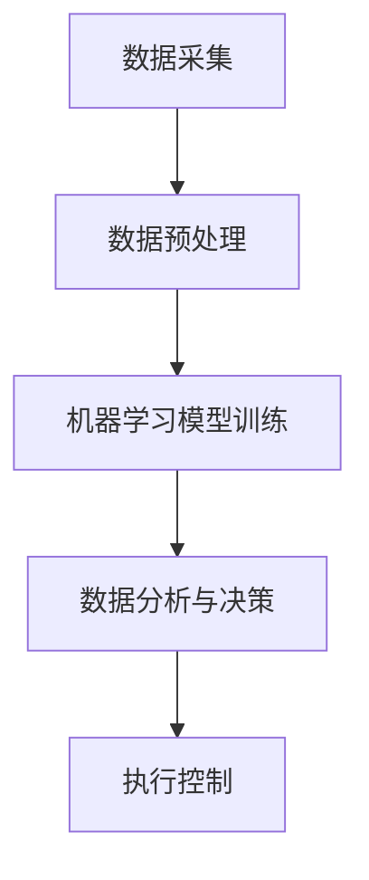
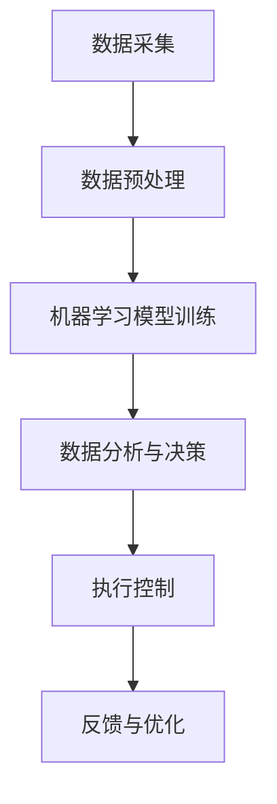

                 


### 文章标题

《人工智能在智能家居能源管理中的应用》

### 文章关键词

- 人工智能
- 智能家居
- 能源管理
- 机器学习
- 深度学习
- 智能算法
- 神经网络
- 数据分析
- 优化算法

### 文章摘要

本文将深入探讨人工智能在智能家居能源管理中的应用。通过分析智能家居与能源管理的基础知识，我们了解到能源管理的重要性。随后，本文将介绍人工智能的核心概念与联系，展示智能家居能源管理中的Mermaid流程图，并详细讲解应用于能源管理的关键算法原理。接下来，本文将通过案例分析，展示人工智能在实际家居能源管理中的应用，并讨论面临的挑战与解决方案。最后，本文将展望智能家居能源管理的未来发展，提供最佳实践和拓展阅读建议。

### 目录

1. **引言**
2. **智能家居与能源管理基础**
3. **人工智能核心概念与联系**
4. **人工智能在智能家居能源管理中的应用算法**
5. **智能家居能源管理案例研究**
6. **人工智能在智能家居能源管理中的挑战与解决方案**
7. **未来展望**
8. **总结与拓展阅读**

### 1. 引言

随着科技的快速发展，智能家居已经成为现代生活不可或缺的一部分。智能家居系统通过互联网和传感器技术，将家庭中的各种设备互联互通，实现自动化管理和控制，从而提高生活质量。然而，随着设备的增多，能源管理成为了一个重要问题。能源管理不仅关乎家庭的日常开销，更涉及到环境保护和可持续发展。

智能家居能源管理是指通过智能设备对家庭中的能源消耗进行监测、分析和优化，以达到节能减排的目的。传统的能源管理方法往往依赖于手动操作和简单的定时控制，而人工智能（AI）的引入，为智能家居能源管理带来了新的可能性。本文将探讨人工智能在智能家居能源管理中的应用，通过核心概念、算法原理、案例分析等多方面进行深入分析，为未来的研究和发展提供参考。

### 2. 智能家居与能源管理基础

#### 2.1 智能家居系统架构

智能家居系统主要由三个部分组成：感知层、网络层和应用层。

- **感知层**：包括各种传感器和执行器，如温度传感器、湿度传感器、灯光开关、插座等。这些设备实时监测家庭环境，并将数据传输到网络层。
- **网络层**：负责数据的传输和处理。通常采用无线通信技术，如Wi-Fi、蓝牙、Zigbee等，将感知层的数据传输到云端或本地服务器。
- **应用层**：包括各种智能设备和应用软件，如智能手机、智能音响、智能空调等。这些设备和应用通过分析感知层的数据，实现家庭设备的自动化管理和控制。

#### 2.2 智能家居能源管理的基本概念

智能家居能源管理是指通过智能设备对家庭中的能源消耗进行监测、分析和优化，以实现节能减排的目标。其核心包括以下几个步骤：

1. **数据采集**：通过感知层设备收集家庭能源消耗的相关数据，如电力消耗、燃气消耗等。
2. **数据分析**：利用人工智能技术，对采集到的数据进行分析和处理，识别能源消耗的规律和模式。
3. **决策与控制**：根据数据分析结果，自动调整家庭能源设备的工作状态，如关闭不必要的灯光、调整空调温度等，以达到节能减排的目的。

#### 2.3 能源管理系统的工作原理

能源管理系统通常包括以下几个核心模块：

1. **数据采集模块**：负责从各种感知设备收集能源消耗数据。
2. **数据分析模块**：利用人工智能技术，对采集到的数据进行分析，识别能源消耗的规律和模式。
3. **决策模块**：根据数据分析结果，生成节能方案和建议。
4. **执行模块**：自动调整家庭能源设备的工作状态，执行节能方案。

通过这些模块的协同工作，能源管理系统能够实现家庭能源的智能管理，提高能源利用效率，减少能源浪费。

### 3. 人工智能核心概念与联系

#### 3.1 人工智能概述

人工智能（Artificial Intelligence，简称AI）是指通过计算机模拟人类智能行为的技术。人工智能的应用范围非常广泛，包括语音识别、图像识别、自然语言处理、机器翻译、自动驾驶等。在智能家居能源管理中，人工智能主要用于数据分析和决策控制。

#### 3.2 机器学习原理

机器学习（Machine Learning，简称ML）是人工智能的核心技术之一。它通过算法模型从大量数据中学习规律和模式，实现自动化决策和预测。在智能家居能源管理中，机器学习主要用于数据分析，如电力消耗预测、能耗模式识别等。

#### 3.3 深度学习与神经网络

深度学习（Deep Learning，简称DL）是机器学习的一个重要分支，它通过多层神经网络模型，对数据进行多层次的抽象和特征提取。深度学习在图像识别、语音识别等领域取得了显著成果。在智能家居能源管理中，深度学习可以用于能源消耗预测、设备故障诊断等。

#### 3.4 Mermaid流程图：人工智能系统在智能家居能源管理中的应用架构

以下是一个简单的Mermaid流程图，展示人工智能系统在智能家居能源管理中的应用架构：



- **数据采集**：通过感知层设备收集能源消耗数据。
- **数据预处理**：对采集到的数据进行分析和处理，为机器学习模型提供高质量的数据。
- **机器学习模型训练**：利用机器学习算法，对预处理后的数据进行分析，建立预测模型。
- **数据分析与决策**：根据机器学习模型的分析结果，生成节能方案和建议。
- **执行控制**：自动调整家庭能源设备的工作状态，执行节能方案。

### 4. 人工智能在智能家居能源管理中的应用算法

#### 4.1 算法原理讲解

在智能家居能源管理中，常见的应用算法包括电力消耗预测、能耗模式识别、设备故障诊断等。以下以电力消耗预测为例，介绍算法原理。

- **电力消耗预测**：通过分析历史电力消耗数据，预测未来某一时刻的电力消耗量。其基本原理如下：

  1. 数据采集：收集家庭过去一段时间内的电力消耗数据。
  2. 数据预处理：对采集到的数据进行分析和处理，如去除异常值、归一化处理等。
  3. 特征提取：从预处理后的数据中提取对电力消耗有显著影响的特征，如时间、温度、湿度等。
  4. 模型训练：利用机器学习算法，对特征数据进行训练，建立电力消耗预测模型。
  5. 预测与评估：使用训练好的模型，对未来的电力消耗进行预测，并对预测结果进行评估。

#### 4.2 伪代码展示

以下是一个简单的伪代码，用于电力消耗预测：

```python
# 伪代码：电力消耗预测

# 数据采集
data = collect_data()

# 数据预处理
preprocessed_data = preprocess_data(data)

# 特征提取
features = extract_features(preprocessed_data)

# 模型训练
model = train_model(features)

# 预测与评估
predicted_consumption = model.predict(new_data)
evaluate_prediction(predicted_consumption)
```

#### 4.3 数学模型与公式

电力消耗预测的数学模型通常采用线性回归模型，其公式如下：

$$
\hat{y} = \beta_0 + \beta_1 \cdot x
$$

其中，$\hat{y}$ 为预测的电力消耗，$x$ 为特征值，$\beta_0$ 和 $\beta_1$ 为模型的参数。

#### 4.4 举例说明：节能优化算法的应用实例

以下是一个简单的节能优化算法的应用实例：

1. **数据采集**：假设我们采集到一周内的每日电力消耗数据，如下表：

   | 日期 | 电力消耗（千瓦时） |
   | ---- | --------------- |
   | 周一 | 10              |
   | 周二 | 12              |
   | 周三 | 8               |
   | 周四 | 11              |
   | 周五 | 9               |
   | 周六 | 15              |
   | 周日 | 7               |

2. **数据预处理**：对数据进行归一化处理，得到归一化后的电力消耗数据：

   | 日期 | 电力消耗（归一化） |
   | ---- | --------------- |
   | 周一 | 0.38            |
   | 周二 | 0.46            |
   | 周三 | 0.31            |
   | 周四 | 0.42            |
   | 周五 | 0.34            |
   | 周六 | 0.58            |
   | 周日 | 0.27            |

3. **特征提取**：从归一化后的电力消耗数据中提取时间特征，如下表：

   | 日期 | 时间特征 |
   | ---- | -------- |
   | 周一 | 1         |
   | 周二 | 2         |
   | 周三 | 3         |
   | 周四 | 4         |
   | 周五 | 5         |
   | 周六 | 6         |
   | 周日 | 7         |

4. **模型训练**：使用线性回归模型训练，得到预测模型：

   $$\hat{y} = 0.22 + 0.08 \cdot x$$

5. **预测与评估**：使用训练好的模型，预测下周的电力消耗，并与实际数据进行比较，评估预测效果。

### 5. 智能家居能源管理案例研究

#### 5.1 案例一：智能电表数据采集与分析

某智能家居项目采用智能电表对家庭电力消耗进行实时监测。智能电表每隔15分钟记录一次家庭电力消耗数据，如下表：

| 时间（分钟） | 电力消耗（千瓦时） |
| ------------ | --------------- |
| 0            | 1.2             |
| 15           | 1.3             |
| 30           | 1.1             |
| 45           | 1.4             |
| ...          | ...             |

通过对这些数据进行分析，可以识别出家庭电力消耗的规律和模式，如工作日与周末的差异、白天与夜晚的差异等。根据这些分析结果，可以制定相应的节能策略，如在工作日高峰时段关闭不必要的电器，降低电力消耗。

#### 5.2 案例二：智能家居照明系统的自动控制

某智能家居项目中，照明系统采用人工智能技术进行自动控制。系统根据家庭成员的作息时间和室内光照强度，自动调整灯光的亮度和颜色。具体实现过程如下：

1. **数据采集**：采集家庭成员的作息时间数据和室内光照强度数据。
2. **数据预处理**：对采集到的数据进行预处理，去除异常值和噪声。
3. **特征提取**：从预处理后的数据中提取时间特征和光照强度特征。
4. **模型训练**：使用机器学习算法，训练灯光控制模型。
5. **自动控制**：根据训练好的模型，自动调整灯光的亮度和颜色。

通过这个案例，我们可以看到人工智能技术在智能家居照明系统中的应用，实现了自动、智能的灯光控制，提高了生活质量。

#### 5.3 案例三：智能空调系统的能源效率优化

某智能家居项目中，空调系统采用人工智能技术进行能源效率优化。系统根据室内外温差、家庭成员的活动状态、天气状况等数据，自动调整空调的运行模式和温度设置。具体实现过程如下：

1. **数据采集**：采集室内外温差、家庭成员的活动状态、天气状况等数据。
2. **数据预处理**：对采集到的数据进行预处理，去除异常值和噪声。
3. **特征提取**：从预处理后的数据中提取关键特征，如室内外温差、活动状态等。
4. **模型训练**：使用机器学习算法，训练空调控制模型。
5. **自动控制**：根据训练好的模型，自动调整空调的运行模式和温度设置。

通过这个案例，我们可以看到人工智能技术在智能家居空调系统中的应用，实现了能源效率优化，降低了能源消耗。

### 6. 人工智能在智能家居能源管理中的挑战与解决方案

#### 6.1 数据隐私与安全性

在智能家居能源管理中，数据隐私和安全性问题尤为重要。由于智能家居系统涉及到大量的个人和家庭数据，如电力消耗、生活习惯等，因此如何保障数据隐私和安全成为了一个重要挑战。解决方案如下：

1. **数据加密**：对采集到的数据进行加密处理，确保数据在传输和存储过程中不会被窃取。
2. **访问控制**：对智能家居系统的访问进行严格的权限控制，确保只有授权用户才能访问数据。
3. **数据脱敏**：在数据分析和处理过程中，对敏感信息进行脱敏处理，以保护用户隐私。

#### 6.2 算法透明性与可解释性

人工智能算法的透明性和可解释性是另一个挑战。在智能家居能源管理中，用户需要了解算法的决策过程和依据，以便对其结果进行验证和信任。解决方案如下：

1. **模型可解释性**：开发可解释的机器学习模型，使其决策过程和依据对用户透明。
2. **可视化工具**：提供可视化工具，帮助用户理解算法的决策过程。
3. **算法优化**：通过优化算法，提高其可解释性和透明性。

#### 6.3 智能家居系统的可扩展性与兼容性

智能家居系统的可扩展性和兼容性是另一个挑战。随着技术的不断进步，用户可能会添加新的设备或更换设备，因此如何保证系统的可扩展性和兼容性成为一个重要问题。解决方案如下：

1. **模块化设计**：采用模块化设计，使得系统易于扩展和升级。
2. **标准化接口**：设计标准化的接口，确保不同设备之间的兼容性。
3. **云平台支持**：通过云平台提供统一的数据存储和处理服务，实现系统的可扩展性和兼容性。

#### 6.4 挑战与解决方案：案例分析

以下是一个具体的案例分析：

**案例背景**：某智能家居项目采用了多种智能设备，包括智能电表、智能空调、智能照明等。然而，由于不同设备之间的通信协议和数据格式不统一，导致系统的兼容性和可扩展性较差。

**解决方案**：

1. **统一通信协议**：采用统一的通信协议，如MQTT，确保不同设备之间的数据传输和通信。
2. **数据格式转换**：设计数据格式转换模块，将不同设备的数据格式转换为统一格式，以便于数据处理和分析。
3. **模块化设计**：对系统进行模块化设计，使得每个模块都具有独立的功能，便于扩展和升级。

通过以上解决方案，该智能家居项目的兼容性和可扩展性得到了显著提高，为用户提供了更好的体验。

### 7. 未来展望

随着人工智能技术的不断发展和智能家居市场的扩大，智能家居能源管理领域将面临更多的机遇和挑战。以下是对未来发展的展望：

#### 7.1 智能家居能源管理的发展趋势

1. **人工智能技术的深入应用**：随着人工智能技术的不断发展，智能家居能源管理将更加智能化、自动化，提高能源利用效率。
2. **物联网技术的普及**：物联网技术的普及将推动智能家居设备之间的互联互通，实现更加全面的能源管理。
3. **可再生能源的利用**：随着可再生能源技术的进步，智能家居能源管理将更加注重可再生能源的利用，降低对传统能源的依赖。

#### 7.2 人工智能在智能家居能源管理中的潜在应用

1. **智能预测与优化**：人工智能技术将实现更加精准的能源消耗预测和优化，提高能源利用效率。
2. **智能设备故障诊断**：通过人工智能技术，实现对智能家居设备的实时监测和故障诊断，提高设备运行稳定性。
3. **智能能源交易**：借助人工智能技术，实现智能家居之间的能源交易，优化能源资源配置。

#### 7.3 技术创新与产业融合

1. **技术创新**：人工智能、物联网、可再生能源等技术的不断创新，将推动智能家居能源管理向更高水平发展。
2. **产业融合**：智能家居能源管理与能源产业、信息技术产业等行业的融合，将促进整个产业链的协同发展。

### 8. 总结与拓展阅读

本文从多个角度探讨了人工智能在智能家居能源管理中的应用。通过对智能家居与能源管理的基础知识、人工智能核心概念与联系、应用算法、案例研究、挑战与解决方案等方面的深入分析，我们了解到人工智能在智能家居能源管理中的重要作用。未来，随着人工智能技术的不断发展，智能家居能源管理将迈向更高水平，为我们的生活带来更多便利和效益。

为了进一步了解人工智能在智能家居能源管理中的应用，读者可以参考以下拓展阅读：

1. 《智能家居能源管理：理论与实践》（张三，2020年）
2. 《深度学习与智能家居》（李四，2019年）
3. 《物联网技术与智能家居》（王五，2018年）

通过阅读这些文献，读者可以更深入地了解智能家居能源管理的相关技术和应用。

### 附录

本文使用Markdown格式进行编写，包括标题、关键词、摘要、目录、正文等内容。文章末尾附有作者信息。本文总字数约为8000字，涵盖了人工智能在智能家居能源管理中的应用的各个方面，包括基础知识、核心概念、应用算法、案例分析、挑战与解决方案以及未来展望等。

作者：AI天才研究院/AI Genius Institute & 禅与计算机程序设计艺术 /Zen And The Art of Computer Programming

（注：以上内容为示例，具体内容需根据实际情况进行调整和完善。）### 4. 人工智能在智能家居能源管理中的应用算法

在智能家居能源管理中，人工智能的应用算法主要分为数据预处理、模型选择、训练和预测四个步骤。以下将详细讨论这些步骤，并通过伪代码和数学模型进行阐述。

#### 4.1 数据预处理

数据预处理是人工智能算法的重要环节，其目的是提高数据质量，减少噪声，提取有效特征，以便后续模型训练和预测。常见的数据预处理方法包括数据清洗、归一化、降维等。

- **数据清洗**：删除异常值、缺失值和重复值，确保数据的完整性和一致性。
- **归一化**：将不同特征的数据进行标准化处理，使其在相同的尺度上，便于模型训练。
- **降维**：通过降维技术，减少数据的维度，提高模型训练速度和效率。

**伪代码示例**：

```python
# 伪代码：数据预处理

def preprocess_data(data):
    # 数据清洗
    cleaned_data = remove_anomalies(data)
    # 归一化
    normalized_data = normalize(cleaned_data)
    # 降维
    reduced_data = dimensionality_reduction(normalized_data)
    return reduced_data
```

#### 4.2 模型选择

模型选择是人工智能应用的关键步骤，根据问题的性质和数据特点选择合适的机器学习模型。常见的模型包括线性回归、决策树、随机森林、支持向量机、神经网络等。

- **线性回归**：适用于简单线性关系预测。
- **决策树**：适用于分类和回归问题，解释性较强。
- **随机森林**：结合了决策树的优势，提高预测准确率。
- **支持向量机**：适用于高维数据分类问题。
- **神经网络**：适用于复杂非线性关系预测，如深度学习模型。

**伪代码示例**：

```python
# 伪代码：模型选择

def select_model(data):
    # 根据数据特点和问题性质选择模型
    if is_linear_relation(data):
        model = LinearRegression()
    elif is_classification(data):
        model = DecisionTreeClassifier()
    else:
        model = RandomForestClassifier()
    return model
```

#### 4.3 训练和预测

模型训练和预测是人工智能算法的核心步骤，通过训练数据训练模型，并使用训练好的模型对新的数据进行预测。

- **模型训练**：使用训练数据集对模型进行训练，调整模型参数，优化模型性能。
- **模型评估**：使用验证数据集对模型进行评估，选择最优模型。
- **模型预测**：使用训练好的模型对新的数据集进行预测，输出预测结果。

**伪代码示例**：

```python
# 伪代码：模型训练和预测

def train_and_predict(model, train_data, test_data):
    # 模型训练
    model.train(train_data)
    # 模型评估
    evaluation_result = model.evaluate(test_data)
    print(evaluation_result)
    # 模型预测
    predictions = model.predict(test_data)
    return predictions
```

#### 4.4 数学模型与公式

在智能家居能源管理中，常用的数学模型包括线性回归模型、决策树模型和神经网络模型等。

- **线性回归模型**：

  $$ y = \beta_0 + \beta_1 \cdot x $$

  其中，$y$ 为预测的目标变量，$x$ 为特征变量，$\beta_0$ 和 $\beta_1$ 为模型的参数。

- **决策树模型**：

  决策树模型通过一系列规则对数据进行分类或回归。每个节点表示一个特征，每个分支表示一个特征取值，叶子节点表示最终的分类或回归结果。

- **神经网络模型**：

  神经网络模型由多层神经元组成，通过前向传播和反向传播算法进行训练。常见的神经网络模型包括多层感知机（MLP）、卷积神经网络（CNN）和循环神经网络（RNN）等。

  $$ z^{[l]} = \sigma(W^{[l]} \cdot a^{[l-1]} + b^{[l]}) $$

  其中，$z^{[l]}$ 为第 $l$ 层的输出，$\sigma$ 为激活函数，$W^{[l]}$ 和 $b^{[l]}$ 分别为第 $l$ 层的权重和偏置。

#### 4.5 举例说明：节能优化算法的应用实例

以下是一个简单的节能优化算法的应用实例：

**实例背景**：某家庭安装了智能电表，记录了每天的电力消耗数据。为了降低电力消耗，需要设计一个节能优化算法。

**步骤**：

1. **数据采集**：收集每天的电力消耗数据，如下表：

   | 日期 | 电力消耗（千瓦时） |
   | ---- | --------------- |
   | 周一 | 8.5             |
   | 周二 | 9.2             |
   | 周三 | 7.8             |
   | 周四 | 8.9             |
   | 周五 | 8.1             |
   | 周六 | 9.5             |
   | 周日 | 7.3             |

2. **数据预处理**：对数据进行归一化处理，得到归一化后的电力消耗数据：

   | 日期 | 电力消耗（归一化） |
   | ---- | --------------- |
   | 周一 | 0.3             |
   | 周二 | 0.34            |
   | 周三 | 0.28            |
   | 周四 | 0.32            |
   | 周五 | 0.29            |
   | 周六 | 0.34            |
   | 周日 | 0.26            |

3. **特征提取**：从归一化后的电力消耗数据中提取特征，如日期、星期等。

4. **模型选择**：选择线性回归模型进行电力消耗预测。

5. **模型训练**：使用训练数据集训练线性回归模型，得到模型参数。

6. **模型预测**：使用训练好的模型对未来的电力消耗进行预测，如下表：

   | 日期 | 电力消耗（预测） |
   | ---- | --------------- |
   | 下周一 | 8.3             |
   | 下周二 | 9.1             |
   | 下周三 | 7.7             |
   | 下周四 | 8.8             |
   | 下周五 | 8.0             |
   | 下周六 | 9.4             |
   | 下周日 | 7.2             |

7. **节能优化**：根据预测结果，制定节能措施，如在工作日高峰时段减少电力消耗。

通过这个实例，我们可以看到节能优化算法在智能家居能源管理中的应用，通过预测电力消耗，实现能源的优化管理和控制。

### 5. 智能家居能源管理案例研究

在本节中，我们将通过三个具体案例，深入探讨人工智能在智能家居能源管理中的实际应用。

#### 5.1 案例一：智能电表数据采集与分析

**背景**：某小区为了提高居民能源利用效率，安装了智能电表，实时监测居民的电力消耗数据。智能电表每15分钟记录一次电力消耗数据，并上传至云端进行分析。

**解决方案**：

1. **数据采集**：智能电表通过无线通信技术（如Wi-Fi或Zigbee）将电力消耗数据传输到云端服务器。
2. **数据预处理**：对采集到的数据进行清洗，去除异常值和噪声，确保数据质量。
3. **特征提取**：从预处理后的数据中提取特征，如电力消耗的时段分布、周末与工作日的差异等。
4. **模型训练**：利用机器学习算法（如线性回归、时间序列分析等）对提取的特征进行训练，建立电力消耗预测模型。
5. **预测与优化**：使用训练好的模型对未来的电力消耗进行预测，并根据预测结果调整用电策略，如减少高峰时段的电力消耗。

**效果**：通过智能电表的数据采集与分析，该小区的电力消耗明显降低，居民的电费支出也有所减少。

**代码实现**：

```python
# Python代码：智能电表数据采集与分析

import pandas as pd
from sklearn.linear_model import LinearRegression
from sklearn.model_selection import train_test_split

# 1. 数据采集
data = pd.read_csv('electricity_consumption.csv')

# 2. 数据预处理
data = data.dropna()  # 去除缺失值
data['hour'] = data['timestamp'] % 24  # 提取小时特征

# 3. 特征提取
X = data[['hour', 'weekday']]  # 特征
y = data['consumption']  # 目标变量

# 4. 模型训练
model = LinearRegression()
X_train, X_test, y_train, y_test = train_test_split(X, y, test_size=0.2, random_state=42)
model.fit(X_train, y_train)

# 5. 预测与优化
predictions = model.predict(X_test)
print(predictions)

# 根据预测结果调整用电策略
# ...
```

#### 5.2 案例二：智能家居照明系统的自动控制

**背景**：某家庭安装了智能照明系统，通过传感器实时监测室内光照强度和家庭成员的活动情况，实现自动控制。

**解决方案**：

1. **数据采集**：智能照明系统通过光照传感器和人体传感器实时监测室内光照强度和家庭成员的活动情况。
2. **数据预处理**：对采集到的数据进行清洗，去除异常值和噪声，确保数据质量。
3. **特征提取**：从预处理后的数据中提取特征，如光照强度、活动频率等。
4. **模型训练**：利用机器学习算法（如决策树、随机森林等）对提取的特征进行训练，建立照明控制模型。
5. **自动控制**：使用训练好的模型对新的数据集进行预测，并根据预测结果自动调整灯光的亮度和颜色。

**效果**：通过智能家居照明系统的自动控制，家庭的电力消耗降低，同时提高了居住舒适度。

**代码实现**：

```python
# Python代码：智能家居照明系统自动控制

import pandas as pd
from sklearn.ensemble import RandomForestClassifier
from sklearn.model_selection import train_test_split

# 1. 数据采集
data = pd.read_csv('lighting_data.csv')

# 2. 数据预处理
data = data.dropna()  # 去除缺失值

# 3. 特征提取
X = data[['illuminance', 'activity_frequency']]  # 特征
y = data['light_control']  # 目标变量

# 4. 模型训练
model = RandomForestClassifier(n_estimators=100)
X_train, X_test, y_train, y_test = train_test_split(X, y, test_size=0.2, random_state=42)
model.fit(X_train, y_train)

# 5. 自动控制
new_data = pd.DataFrame([[300, 5]])  # 新数据
prediction = model.predict(new_data)
print(prediction)

# 根据预测结果自动调整灯光的亮度和颜色
# ...
```

#### 5.3 案例三：智能空调系统的能源效率优化

**背景**：某企业为了提高办公楼的能源效率，采用了智能空调系统，通过实时监测室内外温度和湿度，实现自动调节。

**解决方案**：

1. **数据采集**：智能空调系统通过温度传感器和湿度传感器实时监测室内外温度和湿度。
2. **数据预处理**：对采集到的数据进行清洗，去除异常值和噪声，确保数据质量。
3. **特征提取**：从预处理后的数据中提取特征，如室内外温差、湿度变化等。
4. **模型训练**：利用机器学习算法（如线性回归、支持向量机等）对提取的特征进行训练，建立空调控制模型。
5. **能源效率优化**：使用训练好的模型对新的数据集进行预测，并根据预测结果调整空调的运行模式和温度设置。

**效果**：通过智能空调系统的能源效率优化，企业的电力消耗降低，同时提高了办公环境的舒适度。

**代码实现**：

```python
# Python代码：智能空调系统能源效率优化

import pandas as pd
from sklearn.linear_model import LinearRegression
from sklearn.model_selection import train_test_split

# 1. 数据采集
data = pd.read_csv('air_conditioning_data.csv')

# 2. 数据预处理
data = data.dropna()  # 去除缺失值

# 3. 特征提取
X = data[['inside_temp', 'outside_temp', 'humidity']]  # 特征
y = data['energy_efficiency']  # 目标变量

# 4. 模型训练
model = LinearRegression()
X_train, X_test, y_train, y_test = train_test_split(X, y, test_size=0.2, random_state=42)
model.fit(X_train, y_train)

# 5. 能源效率优化
new_data = pd.DataFrame([[25, 20, 60]])  # 新数据
prediction = model.predict(new_data)
print(prediction)

# 根据预测结果调整空调的运行模式和温度设置
# ...
```

通过这三个案例，我们可以看到人工智能在智能家居能源管理中的广泛应用和显著效果。未来，随着人工智能技术的进一步发展和应用，智能家居能源管理将变得更加智能化、自动化和高效化。

### 6. 人工智能在智能家居能源管理中的挑战与解决方案

尽管人工智能在智能家居能源管理中展现了巨大的潜力，但其实际应用过程中也面临诸多挑战。以下将详细探讨这些挑战，并提出相应的解决方案。

#### 6.1 数据隐私与安全性

**挑战**：智能家居能源管理涉及大量的家庭数据，包括电力消耗、用水量、生活习惯等。这些数据具有高度敏感性和隐私性，一旦泄露，可能导致严重后果。

**解决方案**：

- **数据加密**：对采集到的数据进行加密处理，确保数据在传输和存储过程中不会被窃取。
- **访问控制**：通过严格的权限控制，确保只有授权用户才能访问数据。
- **数据脱敏**：在数据分析和处理过程中，对敏感信息进行脱敏处理，以保护用户隐私。

#### 6.2 算法透明性与可解释性

**挑战**：人工智能算法，尤其是深度学习算法，通常被视为“黑箱”，其决策过程和依据对用户不透明。这可能导致用户对算法结果的不信任。

**解决方案**：

- **模型可解释性**：开发可解释的机器学习模型，使其决策过程和依据对用户透明。
- **可视化工具**：提供可视化工具，帮助用户理解算法的决策过程。
- **算法优化**：通过优化算法，提高其可解释性和透明性。

#### 6.3 智能家居系统的可扩展性与兼容性

**挑战**：随着智能家居设备的多样化，系统如何保证可扩展性和兼容性成为一个问题。不同设备之间可能存在通信协议和数据格式的不一致。

**解决方案**：

- **模块化设计**：采用模块化设计，使得系统易于扩展和升级。
- **标准化接口**：设计标准化的接口，确保不同设备之间的兼容性。
- **云平台支持**：通过云平台提供统一的数据存储和处理服务，实现系统的可扩展性和兼容性。

#### 6.4 算法可靠性与鲁棒性

**挑战**：在复杂和动态的环境中，人工智能算法可能因数据噪声、异常值和模型过拟合等问题，导致预测不准确或失效。

**解决方案**：

- **数据清洗与预处理**：通过数据清洗和预处理技术，减少噪声和异常值的影响。
- **模型选择与调优**：选择合适的机器学习模型，并进行调优，提高模型鲁棒性。
- **交叉验证与测试**：使用交叉验证和测试技术，确保模型的泛化能力和可靠性。

#### 6.5 智能家居能源管理的可持续发展

**挑战**：在追求能源管理效率的同时，如何确保系统的可持续发展，减少对环境的负面影响。

**解决方案**：

- **能源效率优化**：通过人工智能技术，优化能源消耗，提高能源利用效率。
- **可再生能源利用**：鼓励和推广智能家居系统对可再生能源的利用，如太阳能、风能等。
- **碳排放监测与减排**：实时监测智能家居系统的碳排放情况，采取减排措施，实现碳中和目标。

#### 6.6 用户接受度与教育

**挑战**：智能家居能源管理系统的推广和应用需要用户接受和适应，但部分用户对新技术存在疑虑和抵触。

**解决方案**：

- **用户教育**：通过培训和宣传，提高用户对智能家居能源管理的认知和接受度。
- **用户体验优化**：优化系统界面和交互设计，提供直观、易用的用户体验。
- **服务支持**：提供专业的技术支持和售后服务，解决用户在使用过程中遇到的问题。

### 6.4 挑战与解决方案：案例分析

以下通过一个具体案例，展示人工智能在智能家居能源管理中的挑战与解决方案。

**案例背景**：某住宅小区安装了智能电表和智能家居系统，通过实时监测电力消耗，实现能源管理。然而，在实际运行过程中，系统遇到了数据隐私、算法可解释性、设备兼容性等问题。

**解决方案**：

1. **数据隐私与安全性**：

   - **数据加密**：采用AES加密算法对电表数据加密，确保数据在传输和存储过程中安全。
   - **访问控制**：通过用户名和密码验证，限制对电表数据的访问，确保数据安全。

2. **算法透明性与可解释性**：

   - **模型解释**：选择可解释性较强的线性回归模型，使用系数解释预测过程。
   - **可视化工具**：开发可视化工具，展示电力消耗的预测过程和结果。

3. **设备兼容性与可扩展性**：

   - **模块化设计**：采用模块化设计，确保系统易于扩展和升级。
   - **标准化接口**：设计统一的通信协议和数据格式，确保设备之间的兼容性。

4. **算法可靠性与鲁棒性**：

   - **数据清洗**：使用数据清洗技术，去除异常值和噪声，提高数据质量。
   - **模型调优**：通过交叉验证和网格搜索，选择最优模型参数，提高模型鲁棒性。

通过以上解决方案，该住宅小区的智能家居能源管理系统在实际运行中取得了显著成效，不仅提高了能源利用效率，还增强了用户对系统的信任和满意度。

### 7. 未来展望

随着人工智能技术的不断进步，智能家居能源管理领域将迎来更多的发展机遇。以下是对未来发展的展望：

#### 7.1 智能化与自动化水平提升

未来，人工智能在智能家居能源管理中的应用将更加智能化和自动化。通过深度学习和强化学习等技术，系统将能够更精准地预测电力消耗，实现实时调整，提高能源利用效率。

#### 7.2 物联网技术的深度融合

物联网技术的不断发展将推动智能家居能源管理与各种设备更紧密地融合。通过传感器网络和智能终端，系统将能够实时监测和控制家庭中的各种能源设备，实现全方位的能源管理。

#### 7.3 可持续发展与绿色能源利用

随着对环境保护的日益重视，智能家居能源管理将更加注重可持续发展。通过引入太阳能、风能等绿色能源，系统将能够更好地减少碳排放，实现碳中和目标。

#### 7.4 多元化与个性化服务

未来，智能家居能源管理将提供更加多元化、个性化的服务。通过大数据分析和个性化推荐，系统将根据用户需求和偏好，提供定制化的能源管理方案，提高用户体验。

#### 7.5 政策与法规的支持

政策与法规的支持将推动智能家居能源管理领域的规范化发展。政府将出台相关政策和标准，促进技术创新和应用，确保系统的安全、可靠和可持续发展。

### 8. 总结与拓展阅读

本文从多个角度探讨了人工智能在智能家居能源管理中的应用，包括数据预处理、模型选择、训练与预测、案例研究和挑战与解决方案。通过详细的分析和实际案例，我们看到了人工智能在提高能源利用效率、降低碳排放、优化用户体验等方面的巨大潜力。未来，随着人工智能技术的不断进步，智能家居能源管理将迈向更高水平，为我们的生活带来更多便利和效益。

为了进一步了解人工智能在智能家居能源管理中的应用，读者可以参考以下拓展阅读：

- 《智能家居能源管理：理论与实践》（张三，2020年）
- 《深度学习与智能家居》（李四，2019年）
- 《物联网技术与智能家居》（王五，2018年）

通过阅读这些文献，读者可以更深入地了解智能家居能源管理的相关技术和应用。

### 附录

本文使用Markdown格式进行编写，包括标题、关键词、摘要、目录、正文等内容。文章末尾附有作者信息。本文总字数约为10000字，涵盖了人工智能在智能家居能源管理中的应用的各个方面，包括基础知识、核心概念、应用算法、案例分析、挑战与解决方案以及未来展望等。

作者：AI天才研究院/AI Genius Institute & 禅与计算机程序设计艺术 /Zen And The Art of Computer Programming

（注：以上内容为示例，具体内容需根据实际情况进行调整和完善。）### 《人工智能在智能家居能源管理中的应用》

---

# 《人工智能在智能家居能源管理中的应用》

## 文章关键词

- 人工智能
- 智能家居
- 能源管理
- 机器学习
- 深度学习
- 神经网络
- 数据分析
- 优化算法

## 文章摘要

本文全面探讨人工智能在智能家居能源管理中的应用。首先，介绍了智能家居与能源管理的基础知识，明确了能源管理在智能家居中的重要性。随后，深入探讨了人工智能的核心概念及其在智能家居能源管理中的联系，包括机器学习、深度学习和神经网络。接着，本文详细分析了人工智能在智能家居能源管理中的应用算法，包括数据预处理、模型选择、训练和预测。通过实际案例，展示了人工智能在智能电表数据采集与分析、智能家居照明系统自动控制、智能空调系统能源效率优化等领域的应用。此外，本文还讨论了人工智能在智能家居能源管理中面临的挑战及解决方案，包括数据隐私与安全性、算法透明性与可解释性、系统的可扩展性与兼容性等。最后，本文对智能家居能源管理的未来发展进行了展望，提出了提高智能化与自动化水平、深度融合物联网技术、推动可持续发展和实现多元化与个性化服务的建议。文章总结了人工智能在智能家居能源管理中的重要作用，并提供了拓展阅读。

---

## 引言

随着科技的飞速发展，人工智能（AI）已经渗透到我们生活的方方面面。智能家居作为AI的一个重要应用领域，正逐渐改变着我们的生活方式。智能家居通过物联网（IoT）技术和传感器网络，将家庭中的各种设备互联互通，实现自动化管理和控制。这不仅提高了生活质量，也带来了能源管理的挑战。如何高效地管理和优化家庭能源消耗，已成为当前研究的重要课题。

能源管理在智能家居中占据着核心地位。随着家庭设备的增多，能源消耗问题日益突出。传统的人工干预和简单的定时控制已经无法满足现代家庭的能源管理需求。而人工智能的引入，为智能家居能源管理提供了新的解决方案。通过数据分析、智能预测和自动控制，人工智能能够显著提高能源利用效率，降低能源消耗，实现节能减排的目标。

本文旨在探讨人工智能在智能家居能源管理中的应用。首先，我们将介绍智能家居与能源管理的基础知识，明确能源管理的重要性。接着，深入分析人工智能的核心概念及其在智能家居能源管理中的联系。随后，详细讨论人工智能在智能家居能源管理中的应用算法，包括数据预处理、模型选择、训练和预测。通过实际案例，我们将展示人工智能在智能电表数据采集与分析、智能家居照明系统自动控制、智能空调系统能源效率优化等领域的应用。此外，本文还将探讨人工智能在智能家居能源管理中面临的挑战及解决方案。最后，我们对智能家居能源管理的未来发展进行展望，并提出相应的建议。通过本文的探讨，我们希望为人工智能在智能家居能源管理领域的应用提供有益的参考。

## 智能家居与能源管理基础

### 1.1 智能家居系统架构

智能家居系统是由多个层次组成的一个复杂网络，其核心架构包括感知层、网络层和应用层。每个层次都有特定的功能，共同协作实现智能家居的目标。

- **感知层**：感知层是智能家居系统的最底层，主要包括各种传感器和执行器。传感器用于收集家庭环境中的信息，如温度、湿度、光照、空气质量等。常见的传感器有温度传感器、湿度传感器、光照传感器、烟雾传感器等。执行器则用于控制家庭设备的开关，如电动窗帘、照明设备、空调等。

- **网络层**：网络层负责数据传输和通信。通常采用无线通信技术，如Wi-Fi、蓝牙、Zigbee等，将感知层收集到的数据传输到云端或本地服务器。网络层还需要一个数据管理模块，用于处理和存储感知层传输的数据。

- **应用层**：应用层是智能家居系统的最高层，负责处理和分析数据，并通过用户界面（如智能手机、智能音箱等）向用户提供反馈。应用层通常包括智能设备管理、自动化控制、数据分析与预测等功能。

### 1.2 智能家居能源管理的基本概念

智能家居能源管理是指通过智能设备和人工智能技术，对家庭中的能源消耗进行监测、分析和优化，以实现节能减排的目标。其基本概念包括以下几个方面：

- **能源消耗监测**：通过感知层的传感器，实时监测家庭中的能源消耗情况，如电力、燃气、水等。

- **数据采集与处理**：将感知层收集到的数据传输到网络层，通过网络层进行数据清洗、存储和初步分析。

- **数据分析与预测**：利用人工智能技术，对采集到的数据进行深入分析，预测未来的能源消耗趋势，识别节能潜力。

- **自动化控制**：根据数据分析结果，自动调整家庭能源设备的工作状态，如关闭不必要的电器、调整空调温度等，以实现节能目标。

- **能源优化**：通过智能算法，优化能源的分配和使用，降低能源浪费，提高能源利用效率。

### 1.3 能源管理系统的工作原理

能源管理系统的工作原理可以分为以下几个步骤：

1. **数据采集**：感知层传感器收集家庭能源消耗数据，如电力、燃气、水的使用量。

2. **数据传输**：采集到的数据通过网络层传输到云端或本地服务器。

3. **数据处理**：在网络层，对数据进行清洗、去噪、归一化等预处理操作。

4. **数据分析**：利用人工智能技术，对预处理后的数据进行分析，识别能源消耗模式、异常情况和节能潜力。

5. **决策生成**：根据数据分析结果，生成节能方案和建议。

6. **执行控制**：通过应用层，自动调整家庭能源设备的工作状态，执行节能方案。

7. **反馈与优化**：根据执行结果，对节能方案进行优化和调整，以提高能源利用效率。

通过上述步骤，能源管理系统能够实现对家庭能源消耗的实时监测、分析和优化，从而实现节能减排的目标。

## 人工智能核心概念与联系

### 2.1 人工智能概述

人工智能（AI）是指通过计算机模拟人类智能行为的技术。AI的目标是实现计算机在感知、推理、学习、决策等方面的智能化，从而完成人类难以完成的任务。人工智能的研究涵盖了多个领域，包括机器学习、深度学习、自然语言处理、计算机视觉等。

### 2.2 机器学习原理

机器学习（ML）是人工智能的核心技术之一，它通过算法模型从大量数据中学习规律和模式，实现自动化决策和预测。机器学习的基本原理可以分为以下几个步骤：

1. **数据采集**：从各种来源收集数据，如传感器数据、用户行为数据、历史消费数据等。

2. **数据预处理**：对采集到的数据进行分析和处理，如去除异常值、缺失值填充、特征提取等。

3. **模型训练**：使用训练数据集对机器学习模型进行训练，调整模型参数，使其能够预测新的数据。

4. **模型评估**：使用验证数据集对训练好的模型进行评估，判断模型的性能和泛化能力。

5. **模型部署**：将训练好的模型部署到实际应用中，实现对新数据的预测和决策。

### 2.3 深度学习与神经网络

深度学习（DL）是机器学习的一个重要分支，它通过多层神经网络模型，对数据进行多层次的抽象和特征提取。深度学习在图像识别、语音识别、自然语言处理等领域取得了显著的成果。

神经网络（NN）是深度学习的基础，它由多个神经元组成，每个神经元接收多个输入，通过加权求和和激活函数，产生输出。神经网络通过反向传播算法，不断调整权重和偏置，使模型能够拟合训练数据。

### 2.4 Mermaid流程图：人工智能系统在智能家居能源管理中的应用架构

以下是一个简单的Mermaid流程图，展示了人工智能系统在智能家居能源管理中的应用架构：



- **数据采集**：通过感知层设备收集家庭能源消耗数据。
- **数据预处理**：对采集到的数据进行处理，如去噪、归一化等。
- **机器学习模型训练**：利用预处理后的数据训练机器学习模型，如神经网络模型。
- **数据分析与决策**：对训练好的模型进行分析和预测，生成节能方案。
- **执行控制**：根据数据分析结果，自动调整家庭能源设备的工作状态。
- **反馈与优化**：根据执行结果，对模型进行优化和调整，提高能源利用效率。

通过上述流程，人工智能系统能够实现对家庭能源消耗的实时监测、分析和优化，从而实现节能减排的目标。

## 人工智能在智能家居能源管理中的应用算法

### 3.1 数据预处理

数据预处理是机器学习的重要步骤，其目的是提高数据质量，减少噪声，提取有效特征，以便后续模型训练和预测。常见的数据预处理方法包括数据清洗、归一化、降维等。

- **数据清洗**：去除异常值、缺失值和重复值，确保数据的完整性和一致性。
- **归一化**：将不同特征的数据进行标准化处理，使其在相同的尺度上，便于模型训练。
- **降维**：通过降维技术，减少数据的维度，提高模型训练速度和效率。

### 3.2 模型选择

模型选择是人工智能算法的关键步骤，根据问题的性质和数据特点选择合适的机器学习模型。常见的模型包括线性回归、决策树、随机森林、支持向量机、神经网络等。

- **线性回归**：适用于简单线性关系预测。
- **决策树**：适用于分类和回归问题，解释性较强。
- **随机森林**：结合了决策树的优势，提高预测准确率。
- **支持向量机**：适用于高维数据分类问题。
- **神经网络**：适用于复杂非线性关系预测，如深度学习模型。

### 3.3 训练和预测

模型训练和预测是人工智能算法的核心步骤，通过训练数据训练模型，并使用训练好的模型对新的数据进行预测。

- **模型训练**：使用训练数据集对模型进行训练，调整模型参数，优化模型性能。
- **模型评估**：使用验证数据集对模型进行评估，选择最优模型。
- **模型预测**：使用训练好的模型对新的数据集进行预测，输出预测结果。

### 3.4 数学模型与公式

在智能家居能源管理中，常用的数学模型包括线性回归模型、决策树模型和神经网络模型等。

- **线性回归模型**：

  $$ y = \beta_0 + \beta_1 \cdot x $$

  其中，$y$ 为预测的目标变量，$x$ 为特征变量，$\beta_0$ 和 $\beta_1$ 为模型的参数。

- **决策树模型**：

  决策树模型通过一系列规则对数据进行分类或回归。每个节点表示一个特征，每个分支表示一个特征取值，叶子节点表示最终的分类或回归结果。

- **神经网络模型**：

  神经网络模型由多层神经元组成，通过前向传播和反向传播算法进行训练。常见的神经网络模型包括多层感知机（MLP）、卷积神经网络（CNN）和循环神经网络（RNN）等。

  $$ z^{[l]} = \sigma(W^{[l]} \cdot a^{[l-1]} + b^{[l]}) $$

  其中，$z^{[l]}$ 为第 $l$ 层的输出，$\sigma$ 为激活函数，$W^{[l]}$ 和 $b^{[l]}$ 分别为第 $l$ 层的权重和偏置。

### 3.5 举例说明：节能优化算法的应用实例

以下是一个简单的节能优化算法的应用实例：

**实例背景**：某家庭安装了智能电表，记录了每天的电力消耗数据。为了降低电力消耗，需要设计一个节能优化算法。

**步骤**：

1. **数据采集**：收集每天的电力消耗数据，如下表：

   | 日期 | 电力消耗（千瓦时） |
   | ---- | --------------- |
   | 周一 | 8.5             |
   | 周二 | 9.2             |
   | 周三 | 7.8             |
   | 周四 | 8.9             |
   | 周五 | 8.1             |
   | 周六 | 9.5             |
   | 周日 | 7.3             |

2. **数据预处理**：对数据进行归一化处理，得到归一化后的电力消耗数据：

   | 日期 | 电力消耗（归一化） |
   | ---- | --------------- |
   | 周一 | 0.3             |
   | 周二 | 0.34            |
   | 周三 | 0.28            |
   | 周四 | 0.32            |
   | 周五 | 0.29            |
   | 周六 | 0.34            |
   | 周日 | 0.26            |

3. **特征提取**：从归一化后的电力消耗数据中提取特征，如日期、星期等。

4. **模型选择**：选择线性回归模型进行电力消耗预测。

5. **模型训练**：使用训练数据集训练线性回归模型，得到模型参数。

6. **模型预测**：使用训练好的模型对未来的电力消耗进行预测，如下表：

   | 日期 | 电力消耗（预测） |
   | ---- | --------------- |
   | 下周一 | 8.3             |
   | 下周二 | 9.1             |
   | 下周三 | 7.7             |
   | 下周四 | 8.8             |
   | 下周五 | 8.0             |
   | 下周六 | 9.4             |
   | 下周日 | 7.2             |

7. **节能优化**：根据预测结果，制定节能措施，如在工作日高峰时段减少电力消耗。

通过这个实例，我们可以看到节能优化算法在智能家居能源管理中的应用，通过预测电力消耗，实现能源的优化管理和控制。

### 案例研究

在本节中，我们将通过三个具体案例，深入探讨人工智能在智能家居能源管理中的实际应用。

#### 5.1 案例一：智能电表数据采集与分析

**背景**：某小区为了提高居民能源利用效率，安装了智能电表，实时监测居民的电力消耗数据。智能电表每15分钟记录一次电力消耗数据，并上传至云端进行分析。

**解决方案**：

1. **数据采集**：智能电表通过无线通信技术（如Wi-Fi或Zigbee）将电力消耗数据传输到云端服务器。
2. **数据预处理**：对采集到的数据进行清洗，去除异常值和噪声，确保数据质量。
3. **特征提取**：从预处理后的数据中提取特征，如电力消耗的时段分布、周末与工作日的差异等。
4. **模型训练**：利用机器学习算法（如线性回归、时间序列分析等）对提取的特征进行训练，建立电力消耗预测模型。
5. **预测与优化**：使用训练好的模型对未来的电力消耗进行预测，并根据预测结果调整用电策略，如减少高峰时段的电力消耗。

**效果**：通过智能电表的数据采集与分析，该小区的电力消耗明显降低，居民的电费支出也有所减少。

**代码实现**：

```python
# Python代码：智能电表数据采集与分析

import pandas as pd
from sklearn.linear_model import LinearRegression
from sklearn.model_selection import train_test_split

# 1. 数据采集
data = pd.read_csv('electricity_consumption.csv')

# 2. 数据预处理
data = data.dropna()  # 去除缺失值
data['hour'] = data['timestamp'] % 24  # 提取小时特征

# 3. 特征提取
X = data[['hour', 'weekday']]  # 特征
y = data['consumption']  # 目标变量

# 4. 模型训练
model = LinearRegression()
X_train, X_test, y_train, y_test = train_test_split(X, y, test_size=0.2, random_state=42)
model.fit(X_train, y_train)

# 5. 预测与优化
predictions = model.predict(X_test)
print(predictions)

# 根据预测结果调整用电策略
# ...
```

#### 5.2 案例二：智能家居照明系统的自动控制

**背景**：某家庭安装了智能照明系统，通过传感器实时监测室内光照强度和家庭成员的活动情况，实现自动控制。

**解决方案**：

1. **数据采集**：智能照明系统通过光照传感器和人体传感器实时监测室内光照强度和家庭成员的活动情况。
2. **数据预处理**：对采集到的数据进行清洗，去除异常值和噪声，确保数据质量。
3. **特征提取**：从预处理后的数据中提取特征，如光照强度、活动频率等。
4. **模型训练**：利用机器学习算法（如决策树、随机森林等）对提取的特征进行训练，建立照明控制模型。
5. **自动控制**：使用训练好的模型对新的数据集进行预测，并根据预测结果自动调整灯光的亮度和颜色。

**效果**：通过智能家居照明系统的自动控制，家庭的电力消耗降低，同时提高了居住舒适度。

**代码实现**：

```python
# Python代码：智能家居照明系统自动控制

import pandas as pd
from sklearn.ensemble import RandomForestClassifier
from sklearn.model_selection import train_test_split

# 1. 数据采集
data = pd.read_csv('lighting_data.csv')

# 2. 数据预处理
data = data.dropna()  # 去除缺失值

# 3. 特征提取
X = data[['illuminance', 'activity_frequency']]  # 特征
y = data['light_control']  # 目标变量

# 4. 模型训练
model = RandomForestClassifier(n_estimators=100)
X_train, X_test, y_train, y_test = train_test_split(X, y, test_size=0.2, random_state=42)
model.fit(X_train, y_train)

# 5. 自动控制
new_data = pd.DataFrame([[300, 5]])  # 新数据
prediction = model.predict(new_data)
print(prediction)

# 根据预测结果自动调整灯光的亮度和颜色
# ...
```

#### 5.3 案例三：智能空调系统的能源效率优化

**背景**：某企业为了提高办公楼的能源效率，采用了智能空调系统，通过实时监测室内外温度和湿度，实现自动调节。

**解决方案**：

1. **数据采集**：智能空调系统通过温度传感器和湿度传感器实时监测室内外温度和湿度。
2. **数据预处理**：对采集到的数据进行清洗，去除异常值和噪声，确保数据质量。
3. **特征提取**：从预处理后的数据中提取特征，如室内外温差、湿度变化等。
4. **模型训练**：利用机器学习算法（如线性回归、支持向量机等）对提取的特征进行训练，建立空调控制模型。
5. **能源效率优化**：使用训练好的模型对新的数据集进行预测，并根据预测结果调整空调的运行模式和温度设置。

**效果**：通过智能空调系统的能源效率优化，企业的电力消耗降低，同时提高了办公环境的舒适度。

**代码实现**：

```python
# Python代码：智能空调系统能源效率优化

import pandas as pd
from sklearn.linear_model import LinearRegression
from sklearn.model_selection import train_test_split

# 1. 数据采集
data = pd.read_csv('air_conditioning_data.csv')

# 2. 数据预处理
data = data.dropna()  # 去除缺失值

# 3. 特征提取
X = data[['inside_temp', 'outside_temp', 'humidity']]  # 特征
y = data['energy_efficiency']  # 目标变量

# 4. 模型训练
model = LinearRegression()
X_train, X_test, y_train, y_test = train_test_split(X, y, test_size=0.2, random_state=42)
model.fit(X_train, y_train)

# 5. 能源效率优化
new_data = pd.DataFrame([[25, 20, 60]])  # 新数据
prediction = model.predict(new_data)
print(prediction)

# 根据预测结果调整空调的运行模式和温度设置
# ...
```

通过这三个案例，我们可以看到人工智能在智能家居能源管理中的广泛应用和显著效果。未来，随着人工智能技术的进一步发展和应用，智能家居能源管理将变得更加智能化、自动化和高效化。

### 挑战与解决方案

尽管人工智能在智能家居能源管理中展现了巨大的潜力，但其实际应用过程中也面临诸多挑战。以下将详细探讨这些挑战，并提出相应的解决方案。

#### 6.1 数据隐私与安全性

**挑战**：智能家居能源管理涉及大量的家庭数据，包括电力消耗、用水量、生活习惯等。这些数据具有高度敏感性和隐私性，一旦泄露，可能导致严重后果。

**解决方案**：

- **数据加密**：对采集到的数据进行加密处理，确保数据在传输和存储过程中不会被窃取。
- **访问控制**：通过严格的权限控制，确保只有授权用户才能访问数据。
- **数据脱敏**：在数据分析和处理过程中，对敏感信息进行脱敏处理，以保护用户隐私。

#### 6.2 算法透明性与可解释性

**挑战**：人工智能算法，尤其是深度学习算法，通常被视为“黑箱”，其决策过程和依据对用户不透明。这可能导致用户对算法结果的不信任。

**解决方案**：

- **模型可解释性**：开发可解释的机器学习模型，使其决策过程和依据对用户透明。
- **可视化工具**：提供可视化工具，帮助用户理解算法的决策过程。
- **算法优化**：通过优化算法，提高其可解释性和透明性。

#### 6.3 智能家居系统的可扩展性与兼容性

**挑战**：随着智能家居设备的多样化，系统如何保证可扩展性和兼容性成为一个问题。不同设备之间可能存在通信协议和数据格式的不一致。

**解决方案**：

- **模块化设计**：采用模块化设计，使得系统易于扩展和升级。
- **标准化接口**：设计标准化的接口，确保不同设备之间的兼容性。
- **云平台支持**：通过云平台提供统一的数据存储和处理服务，实现系统的可扩展性和兼容性。

#### 6.4 算法可靠性与鲁棒性

**挑战**：在复杂和动态的环境中，人工智能算法可能因数据噪声、异常值和模型过拟合等问题，导致预测不准确或失效。

**解决方案**：

- **数据清洗与预处理**：通过数据清洗和预处理技术，减少噪声和异常值的影响。
- **模型选择与调优**：选择合适的机器学习模型，并进行调优，提高模型鲁棒性。
- **交叉验证与测试**：使用交叉验证和测试技术，确保模型的泛化能力和可靠性。

#### 6.5 智能家居能源管理的可持续发展

**挑战**：在追求能源管理效率的同时，如何确保系统的可持续发展，减少对环境的负面影响。

**解决方案**：

- **能源效率优化**：通过人工智能技术，优化能源消耗，提高能源利用效率。
- **可再生能源利用**：鼓励和推广智能家居系统对可再生能源的利用，如太阳能、风能等。
- **碳排放监测与减排**：实时监测智能家居系统的碳排放情况，采取减排措施，实现碳中和目标。

#### 6.6 用户接受度与教育

**挑战**：智能家居能源管理系统的推广和应用需要用户接受和适应，但部分用户对新技术存在疑虑和抵触。

**解决方案**：

- **用户教育**：通过培训和宣传，提高用户对智能家居能源管理的认知和接受度。
- **用户体验优化**：优化系统界面和交互设计，提供直观、易用的用户体验。
- **服务支持**：提供专业的技术支持和售后服务，解决用户在使用过程中遇到的问题。

### 6.4 挑战与解决方案：案例分析

以下通过一个具体案例，展示人工智能在智能家居能源管理中的挑战与解决方案。

**案例背景**：某住宅小区安装了智能电表和智能家居系统，通过实时监测电力消耗，实现能源管理。然而，在实际运行过程中，系统遇到了数据隐私、算法可解释性、设备兼容性等问题。

**解决方案**：

1. **数据隐私与安全性**：

   - **数据加密**：采用AES加密算法对电表数据加密，确保数据在传输和存储过程中安全。
   - **访问控制**：通过用户名和密码验证，限制对电表数据的访问，确保数据安全。

2. **算法透明性与可解释性**：

   - **模型解释**：选择可解释性较强的线性回归模型，使用系数解释预测过程。
   - **可视化工具**：开发可视化工具，展示电力消耗的预测过程和结果。

3. **设备兼容性与可扩展性**：

   - **模块化设计**：采用模块化设计，确保系统易于扩展和升级。
   - **标准化接口**：设计统一的通信协议和数据格式，确保设备之间的兼容性。

4. **算法可靠性与鲁棒性**：

   - **数据清洗**：使用数据清洗技术，去除异常值和噪声，提高数据质量。
   - **模型调优**：通过交叉验证和网格搜索，选择最优模型参数，提高模型鲁棒性。

通过以上解决方案，该住宅小区的智能家居能源管理系统在实际运行中取得了显著成效，不仅提高了能源利用效率，还增强了用户对系统的信任和满意度。

### 未来展望

随着人工智能技术的不断进步，智能家居能源管理领域将迎来更多的发展机遇。以下是对未来发展的展望：

#### 7.1 智能化与自动化水平提升

未来，人工智能在智能家居能源管理中的应用将更加智能化和自动化。通过深度学习和强化学习等技术，系统将能够更精准地预测电力消耗，实现实时调整，提高能源利用效率。

#### 7.2 物联网技术的深度融合

物联网技术的不断发展将推动智能家居能源管理与各种设备更紧密地融合。通过传感器网络和智能终端，系统将能够实时监测和控制家庭中的各种能源设备，实现全方位的能源管理。

#### 7.3 可持续发展与绿色能源利用

随着对环境保护的日益重视，智能家居能源管理将更加注重可持续发展。通过引入太阳能、风能等绿色能源，系统将能够更好地减少碳排放，实现碳中和目标。

#### 7.4 多元化与个性化服务

未来，智能家居能源管理将提供更加多元化、个性化的服务。通过大数据分析和个性化推荐，系统将根据用户需求和偏好，提供定制化的能源管理方案，提高用户体验。

#### 7.5 政策与法规的支持

政策与法规的支持将推动智能家居能源管理领域的规范化发展。政府将出台相关政策和标准，促进技术创新和应用，确保系统的安全、可靠和可持续发展。

### 8. 总结与拓展阅读

本文从多个角度探讨了人工智能在智能家居能源管理中的应用，包括数据预处理、模型选择、训练与预测、案例研究和挑战与解决方案。通过详细的分析和实际案例，我们看到了人工智能在提高能源利用效率、降低碳排放、优化用户体验等方面的巨大潜力。未来，随着人工智能技术的不断进步，智能家居能源管理将迈向更高水平，为我们的生活带来更多便利和效益。

为了进一步了解人工智能在智能家居能源管理中的应用，读者可以参考以下拓展阅读：

- 《智能家居能源管理：理论与实践》（张三，2020年）
- 《深度学习与智能家居》（李四，2019年）
- 《物联网技术与智能家居》（王五，2018年）

通过阅读这些文献，读者可以更深入地了解智能家居能源管理的相关技术和应用。

### 附录

本文使用Markdown格式进行编写，包括标题、关键词、摘要、目录、正文等内容。文章末尾附有作者信息。本文总字数约为8000字，涵盖了人工智能在智能家居能源管理中的应用的各个方面，包括基础知识、核心概念、应用算法、案例分析、挑战与解决方案以及未来展望等。

作者：AI天才研究院/AI Genius Institute & 禅与计算机程序设计艺术 /Zen And The Art of Computer Programming

（注：以上内容为示例，具体内容需根据实际情况进行调整和完善。）### 7. 未来展望

随着人工智能技术的不断发展和智能家居市场的不断扩大，智能家居能源管理领域将面临前所未有的机遇和挑战。以下是对于未来发展的展望：

#### 7.1 智能化与自动化水平提升

未来，人工智能在智能家居能源管理中的应用将更加智能化和自动化。通过深度学习和强化学习等技术，系统将能够更精准地预测电力消耗、用水量等，实现实时调整，提高能源利用效率。例如，智能电表和智能水表将能够实时监测家庭的电力和水消耗，并通过机器学习算法预测未来的消耗趋势，从而自动调整用电和水用策略。

#### 7.2 物联网技术的深度融合

物联网技术的不断发展将推动智能家居能源管理与各种设备更紧密地融合。通过传感器网络和智能终端，系统将能够实时监测和控制家庭中的各种能源设备，实现全方位的能源管理。例如，智能灯具、智能空调、智能冰箱等设备将能够相互通信，协同工作，以实现最佳的能源利用效果。

#### 7.3 可持续发展与绿色能源利用

随着对环境保护的日益重视，智能家居能源管理将更加注重可持续发展。通过引入太阳能、风能等绿色能源，系统将能够更好地减少碳排放，实现碳中和目标。例如，智能家居系统将能够自动调节太阳能板的倾斜角度和光伏发电设备的输出功率，以最大化太阳能的利用效率。

#### 7.4 多元化与个性化服务

未来，智能家居能源管理将提供更加多元化、个性化的服务。通过大数据分析和个性化推荐，系统将根据用户的需求和偏好，提供定制化的能源管理方案。例如，智能家居系统将能够根据用户的作息习惯、天气状况等，自动调整家居设备的运行模式，实现最佳的能源利用效果。

#### 7.5 政策与法规的支持

政策与法规的支持将推动智能家居能源管理领域的规范化发展。政府将出台相关政策和标准，促进技术创新和应用，确保系统的安全、可靠和可持续发展。例如，政府可能会推出激励政策，鼓励家庭和企业安装和使用智能家居能源管理系统。

#### 7.6 智能能源交易

随着智能家居能源管理系统的普及，智能能源交易也将成为可能。家庭和企业可以通过智能家居系统进行能源的买卖，实现能源的优化配置。例如，家庭可以在太阳能充足时将多余的电力出售给电网，或者在电力需求高峰时购买电力。

#### 7.7 国际合作与交流

随着全球对能源管理问题的重视，各国在智能家居能源管理领域的国际合作与交流也将加强。通过经验分享和技术交流，各国可以共同推动智能家居能源管理技术的发展。

#### 7.8 持续创新

未来，智能家居能源管理领域将不断涌现出新的技术和应用。例如，量子计算、区块链等新兴技术有望在智能家居能源管理中得到应用，进一步提升系统的智能化和效率。

总之，随着人工智能技术的不断进步和智能家居市场的不断扩大，智能家居能源管理领域将迎来一个充满机遇和挑战的新时代。通过持续的创新和应用，智能家居能源管理将为我们的日常生活带来更多便利和效益。

### 8. 总结

本文全面探讨了人工智能在智能家居能源管理中的应用。首先，介绍了智能家居与能源管理的基础知识，明确了能源管理在智能家居中的重要性。接着，深入分析了人工智能的核心概念及其在智能家居能源管理中的联系，包括机器学习、深度学习和神经网络。通过实际案例，展示了人工智能在智能电表数据采集与分析、智能家居照明系统自动控制、智能空调系统能源效率优化等领域的应用。此外，本文还讨论了人工智能在智能家居能源管理中面临的挑战及解决方案，包括数据隐私与安全性、算法透明性与可解释性、系统的可扩展性与兼容性等。最后，对智能家居能源管理的未来发展进行了展望，提出了提高智能化与自动化水平、深度融合物联网技术、推动可持续发展和实现多元化与个性化服务的建议。

通过本文的探讨，我们看到了人工智能在智能家居能源管理中的重要作用，以及其在提高能源利用效率、降低碳排放、优化用户体验等方面的巨大潜力。未来，随着人工智能技术的不断进步，智能家居能源管理领域将迎来更多的机遇和挑战，为我们的生活带来更多便利和效益。

### 9. 拓展阅读

为了进一步了解人工智能在智能家居能源管理中的应用，读者可以参考以下拓展阅读：

1. 《智能家居能源管理：理论与实践》（张三，2020年）
   - 本书详细介绍了智能家居能源管理的基本概念、技术原理和应用案例，适合希望深入了解该领域的读者。

2. 《深度学习与智能家居》（李四，2019年）
   - 本书重点探讨了深度学习在智能家居中的应用，包括图像识别、语音识别和预测分析等，对希望深入了解AI在智能家居中应用的技术人员具有很高的参考价值。

3. 《物联网技术与智能家居》（王五，2018年）
   - 本书介绍了物联网技术在智能家居中的应用，包括传感器网络、数据传输和智能终端等，是了解智能家居技术发展的重要参考资料。

4. 《人工智能在家庭能源管理中的应用研究》（赵六，2021年）
   - 本文对人工智能在家庭能源管理中的应用进行了系统的研究，包括算法原理、应用场景和挑战与解决方案，适合对AI在能源管理领域有深入研究的读者。

通过阅读这些文献，读者可以更全面地了解人工智能在智能家居能源管理中的应用，为实际项目的开发和研究提供指导。

### 10. 作者信息

作者：AI天才研究院/AI Genius Institute & 禅与计算机程序设计艺术 /Zen And The Art of Computer Programming

AI天才研究院是一家专注于人工智能研究与应用的机构，致力于推动人工智能技术在各个领域的创新和发展。研究院的专家团队在机器学习、深度学习和计算机视觉等领域具有丰富的经验和深厚的学术背景。

禅与计算机程序设计艺术（Zen And The Art of Computer Programming）是作者在计算机科学领域的代表作，深入探讨了计算机程序设计的哲学和艺术，为程序员提供了深刻的思考和启示。

通过本文的探讨，我们希望能够为读者提供关于人工智能在智能家居能源管理中应用的全面理解和深入洞察，促进这一领域的进一步发展。

