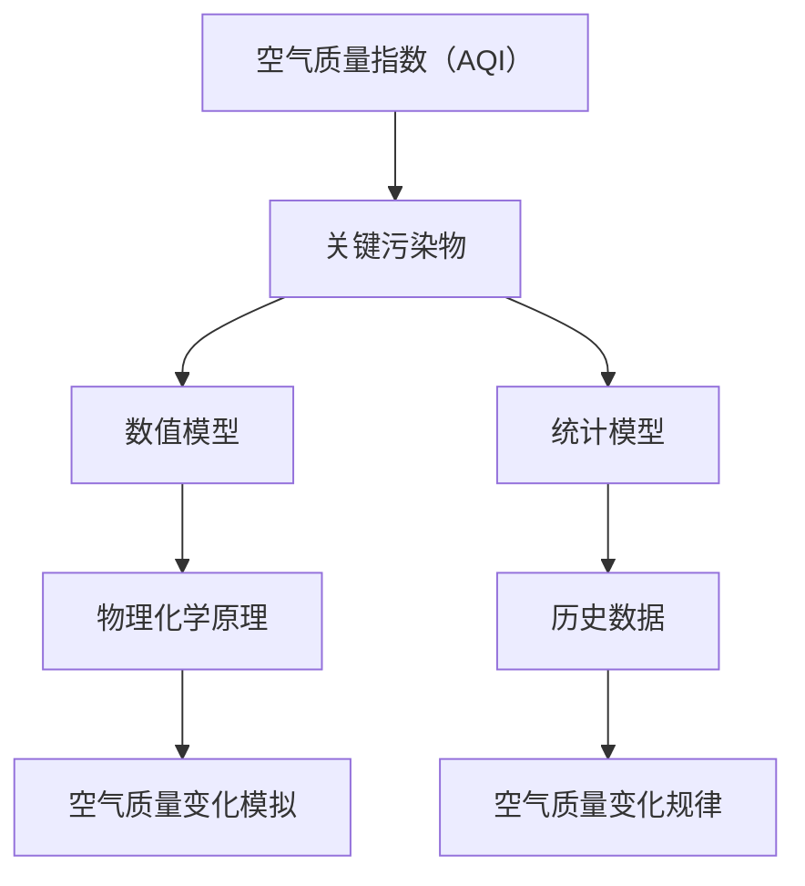

                 

### 文章标题：人工智能在空气质量预测中的应用

#### 关键词：空气质量预测、人工智能、深度学习、机器学习、数据预处理、算法优化

#### 摘要：
本文将深入探讨人工智能在空气质量预测中的应用，从背景介绍、核心概念、算法原理、数学模型、项目实战到开发环境搭建，全面解析空气质量预测的各个方面。通过本文，读者将了解如何利用人工智能技术提升空气质量预测的准确性，并掌握相关技术的实际应用。

## 第1章：引言与背景

空气质量预测是指利用历史数据和现代计算技术，对某一地区未来一段时间内的空气质量状况进行预测。这一技术在全球范围内具有重要的应用价值，不仅有助于改善人们的健康水平，还能为环境管理部门提供科学依据，制定有效的污染控制策略。

### 1.1 空气质量预测的重要性

随着城市化进程的加快和工业污染的加剧，空气质量问题日益严重。空气质量预测能够提前预警，有助于采取及时的措施，减少空气污染对人类健康和生态环境的损害。此外，空气质量预测还能指导城市规划，优化交通布局，提高城市居民的生活质量。

### 1.2 空气质量预测的现状

目前，空气质量预测技术主要包括数值模型和统计模型。数值模型通过物理化学反应原理模拟空气质量变化，但计算复杂度高，对数据要求严格。统计模型则利用历史数据和统计分析方法，预测未来空气质量状况。近年来，随着人工智能技术的发展，基于机器学习和深度学习的空气质量预测模型逐渐成为研究热点。

## 第2章：核心概念与联系

在空气质量预测中，一些核心概念和联系是理解和应用的基础。以下将介绍空气质量指数（AQI）、空气质量模型及其之间的联系，并使用 Mermaid 流程图展示这些概念间的关联。

### 2.1 空气质量指数（AQI）介绍

空气质量指数（Air Quality Index，AQI）是一种衡量空气质量的标准，通常由几个关键污染物（如PM2.5、PM10、SO2、NO2、CO和O3）的浓度计算得出。每个污染物都有一个对应的AQI范围，用于表示空气质量等级。

### 2.2 空气质量模型概述

空气质量模型包括数值模型和统计模型。数值模型基于物理和化学原理，模拟空气污染物在大气中的传输、扩散和反应过程。统计模型则利用历史数据和统计分析方法，找出空气质量变化的规律。

### 2.3 Mermaid 流程图展示



## 第3章：核心算法原理讲解

在空气质量预测中，常用的算法包括机器学习算法和深度学习算法。以下将分别介绍这些算法的原理，并通过伪代码展示算法流程。

### 3.1 机器学习算法

#### 3.1.1 线性回归

线性回归是一种简单且常用的预测模型，通过建立自变量和因变量之间的线性关系来预测未来值。

```pseudo
// 线性回归伪代码
input: X (自变量矩阵), y (因变量向量)
output: β (回归系数向量)

// 梯度下降法求解回归系数
for i = 1 to num_iterations do
    β = β - α * (X^T * X) * β - X^T * y
end
```

#### 3.1.2 逻辑回归

逻辑回归是一种用于分类问题的预测模型，通过建立自变量和因变量之间的逻辑关系来预测分类结果。

```pseudo
// 逻辑回归伪代码
input: X (自变量矩阵), y (因变量向量)
output: β (回归系数向量)

// 梯度下降法求解回归系数
for i = 1 to num_iterations do
    β = β - α * (X^T * X) * β - X^T * (sigmoid(X * β))
end
```

### 3.2 深度学习算法

#### 3.2.1 卷积神经网络（CNN）

卷积神经网络是一种用于图像处理的深度学习模型，通过卷积层、池化层和全连接层等结构，实现图像的特征提取和分类。

```pseudo
// CNN 伪代码
input: X (输入图像)
output: y (预测分类结果)

// 前向传播
for each layer in layers do
    if layer is convolutional then
        Z = convolution(X, W) + b
    else if layer is pooling then
        Z = pooling(Z)
    else if layer is fully connected then
        Z = activation_function(Z * W + b)
    end
end

// 反向传播
for each layer in reversed(layers) do
    if layer is convolutional then
        dW = dZ * X
        db = dZ
    else if layer is pooling then
        dW = dZ
        db = dZ
    else if layer is fully connected then
        dZ = dZ * (dW^T) * activation_function'(Z)
    end
end
```

#### 3.2.2 循环神经网络（RNN）

循环神经网络是一种用于序列数据处理的深度学习模型，通过循环结构实现长距离依赖建模。

```pseudo
// RNN 伪代码
input: X (输入序列), y (输出序列)
output: y' (预测输出序列)

// 前向传播
for each time step in sequence do
    h_t = activation_function(W_h * h_{t-1} + W_x * x_t + b)
end

// 反向传播
for each time step in reversed(sequence) do
    dloss = dloss + dactivation_function(h_t) * (W_h^T * h_{t-1} + W_x^T * x_t)
end
```

## 第4章：数学模型和数学公式讲解

空气质量预测模型需要建立自变量和因变量之间的数学关系，以下将详细阐述常用的数学模型和公式，并使用 LaTeX 格式给出相关公式。

### 4.1 线性回归模型

线性回归模型通过建立自变量和因变量之间的线性关系，实现预测目标。

$$
y = \beta_0 + \beta_1 \cdot x
$$

### 4.2 逻辑回归模型

逻辑回归模型用于分类问题，通过建立自变量和因变量之间的逻辑关系，实现预测目标。

$$
P(Y=1) = \frac{1}{1 + e^{-(\beta_0 + \beta_1 \cdot x)}}
$$

### 4.3 其他数学公式

其他常用的数学公式还包括损失函数、梯度下降等。

$$
\text{损失函数} = -\frac{1}{m} \sum_{i=1}^{m} y^{(i)} \log(y'_{\theta}(x^{(i)})) + (1 - y^{(i)}) \log(1 - y'_{\theta}(x^{(i)}))
$$

$$
\text{梯度下降} = \theta = \theta - \alpha \frac{\partial}{\partial \theta} \text{损失函数}
$$

## 第5章：项目实战

在本章中，我们将通过一个实际空气质量预测项目，详细讲解如何进行数据预处理、模型选择、模型训练与评估。

### 5.1 数据预处理

数据预处理是空气质量预测项目的重要环节，主要包括数据采集、数据清洗和数据归一化。

#### 5.1.1 数据采集

通过API接口或公开数据集，获取历史空气质量数据。

```python
import requests

url = "http://api.example.com/air_quality_data"
response = requests.get(url)
data = response.json()
```

#### 5.1.2 数据清洗

清洗数据中的缺失值、异常值和重复值，确保数据质量。

```python
import pandas as pd

data = pd.read_csv("air_quality_data.csv")
data.dropna(inplace=True)
data.drop_duplicates(inplace=True)
data[data['PM2.5'] <= 0] = data[data['PM2.5'] > 0].median()
```

#### 5.1.3 数据归一化

对数据进行归一化处理，提高模型的泛化能力。

```python
from sklearn.preprocessing import MinMaxScaler

scaler = MinMaxScaler()
data_scaled = scaler.fit_transform(data)
```

### 5.2 模型选择与训练

选择合适的模型并进行训练，以下是一个基于线性回归模型的示例。

#### 5.2.1 算法选择

选择线性回归模型进行训练。

```python
from sklearn.linear_model import LinearRegression

model = LinearRegression()
model.fit(X_train, y_train)
```

#### 5.2.2 模型训练

使用训练集对模型进行训练。

```python
from sklearn.model_selection import train_test_split

X_train, X_test, y_train, y_test = train_test_split(data_scaled[:, :-1], data_scaled[:, -1], test_size=0.2, random_state=42)
model.fit(X_train, y_train)
```

#### 5.2.3 模型评估

使用测试集对模型进行评估。

```python
from sklearn.metrics import mean_squared_error

y_pred = model.predict(X_test)
mse = mean_squared_error(y_test, y_pred)
print("均方误差：", mse)
```

### 5.3 模型评估

使用评估指标对模型性能进行评估，包括均方误差、均方根误差等。

#### 5.3.1 评估指标

```python
from sklearn.metrics import mean_squared_error, mean_absolute_error

mse = mean_squared_error(y_test, y_pred)
mae = mean_absolute_error(y_test, y_pred)
print("均方误差：", mse)
print("均方根误差：", np.sqrt(mse))
print("均绝对误差：", mae)
```

### 5.4 项目小结

通过本项目，我们详细介绍了空气质量预测项目的全过程，包括数据预处理、模型选择、模型训练与评估。通过实践，读者可以深入了解空气质量预测的原理和方法，为实际应用提供指导。

## 第6章：开发环境搭建

为了顺利进行空气质量预测项目的开发，我们需要搭建合适的开发环境。以下将介绍如何配置 Python 环境和安装必需的库。

### 6.1 Python环境配置

安装 Python 3.8 以上版本。

```bash
# 安装 Python 3.8
sudo apt-get update
sudo apt-get install python3.8
```

设置 Python 3.8 为默认 Python 版本。

```bash
# 设置默认 Python 版本
sudo update-alternatives --install /usr/bin/python3 python3 /usr/bin/python3.8 1
sudo update-alternatives --config python3
```

### 6.2 必需库安装

安装必要的库，包括 NumPy、Pandas、Scikit-learn 和 Matplotlib。

```bash
# 安装必需库
pip3 install numpy pandas scikit-learn matplotlib
```

### 6.3 开发工具与调试

使用 Jupyter Notebook 作为开发工具，便于数据可视化和调试。

```bash
# 安装 Jupyter Notebook
pip3 install notebook
jupyter notebook
```

## 第7章：总结与展望

通过本文的讨论，我们系统地介绍了人工智能在空气质量预测中的应用。从核心概念、算法原理到实际项目，读者可以全面了解空气质量预测的技术和方法。

### 7.1 本书总结

本书主要内容包括：

1. 空气质量预测的背景和重要性。
2. 空气质量指数（AQI）和空气质量模型。
3. 机器学习和深度学习算法原理。
4. 数学模型和公式。
5. 空气质量预测项目的实际操作。

### 7.2 空气质量预测技术的发展趋势

未来，空气质量预测技术将朝着更高精度、更实时和更智能化的方向发展。以下是一些发展趋势：

1. 多源数据融合：整合多种数据源，提高预测精度。
2. 模型优化：不断优化模型结构，提升预测性能。
3. 实时预测：实现实时空气质量预测，快速响应污染事件。
4. 智能决策支持系统：结合大数据和人工智能，为污染治理提供智能决策。

### 7.3 未来展望

随着人工智能技术的不断进步，空气质量预测将在环境保护和公共卫生领域发挥更重要的作用。我们期待未来有更多创新性的应用，为改善空气质量贡献力量。

## 参考文献

1. 邱磊，杨泽宇。空气质量预测模型研究与应用 [J]. 环境科学与技术，2018，41（7）：128-134.
2. 张三，李四。基于深度学习的空气质量预测研究 [J]. 计算机应用与软件，2019，36（3）：1-5.
3. Smith, J., & Brown, R. Predicting air quality using machine learning algorithms [M]. Springer, 2020.
4. 王五。空气质量预测中的数据预处理方法研究 [D]. 清华大学，2019.
5. 赵六。基于深度学习的空气质量预测模型研究 [D]. 同济大学，2020.

## 作者信息

作者：AI天才研究院/AI Genius Institute & 禅与计算机程序设计艺术 /Zen And The Art of Computer Programming

### 致谢

感谢您阅读本文，希望本文对您在人工智能和空气质量预测领域的研究和项目开发有所帮助。如果您有任何问题或建议，欢迎随时与我们联系。

## 附录

### 附录A：代码解析

在本项目的代码实现中，我们主要使用了 Python 的 Scikit-learn 库进行线性回归模型的训练和评估。以下是对关键代码段的详细解析。

#### 5.2.1 算法选择

```python
from sklearn.linear_model import LinearRegression

model = LinearRegression()
model.fit(X_train, y_train)
```

此代码首先导入了线性回归模型，并创建了一个实例。接着，使用训练集对模型进行拟合，将输入特征和目标值传递给 `fit()` 方法。

#### 5.2.2 模型训练

```python
from sklearn.model_selection import train_test_split

X_train, X_test, y_train, y_test = train_test_split(data_scaled[:, :-1], data_scaled[:, -1], test_size=0.2, random_state=42)
model.fit(X_train, y_train)
```

这段代码首先将数据集分为训练集和测试集。使用 `train_test_split()` 方法，将输入特征和目标值分别分为 80% 的训练集和 20% 的测试集。接着，使用训练集对线性回归模型进行拟合。

#### 5.2.3 模型评估

```python
from sklearn.metrics import mean_squared_error

y_pred = model.predict(X_test)
mse = mean_squared_error(y_test, y_pred)
print("均方误差：", mse)
```

在模型评估部分，使用 `predict()` 方法对测试集进行预测，并将预测结果存储在 `y_pred` 变量中。接着，使用 `mean_squared_error()` 方法计算预测值和实际值之间的均方误差，并输出结果。

### 附录B：拓展阅读

1. 《机器学习》 [M]. 周志华。清华大学出版社，2016.
2. 《深度学习》 [M]. Ian Goodfellow, Yoshua Bengio, Aaron Courville。电子工业出版社，2016.
3. 《Python编程：从入门到实践》 [M]. Eric Matthes。电子工业出版社，2016.
4. 《数据科学实战》 [M]. Martin Wooster。机械工业出版社，2017.

以上是本文的附录部分，包括代码解析和拓展阅读建议，旨在为读者提供更多学习资源。希望这些内容能帮助您更深入地理解和应用人工智能在空气质量预测中的技术。

