                 


### 文章标题：区块链在数字身份跨境认证中的应用

### 关键词：区块链、数字身份、跨境认证、智能合约、分布式账本

### 摘要：

本文探讨了区块链技术在数字身份跨境认证中的应用，分析了区块链的核心概念、数字身份的内涵及其在跨境认证中的作用。通过详细讲解区块链的工作原理、智能合约的设计方法、以及跨境认证中的具体解决方案，本文展示了区块链技术如何为跨境认证提供高效、安全的认证流程。同时，本文还讨论了区块链在数字身份跨境认证中面临的挑战及未来的发展趋势。

----------------------------------------------------------------

## 第一部分：区块链与数字身份基础

### 第1章：核心概念与联系

#### 1.1 区块链基本概念

区块链是一种分布式数据库技术，通过一系列按时间顺序排列、不可篡改的数据块组成。每个区块都包含了若干条交易记录，这些区块通过加密技术相互连接，形成了一个完整的链条。

**去中心化**：区块链不依赖于中心化机构，而是通过一个分布式网络进行数据维护。每个节点都保存一份完整的数据副本，并通过共识算法来确保数据的真实性和一致性。

**分布式账本**：区块链通过分布式账本技术，将数据分散存储在网络中的各个节点上。这样不仅提高了系统的容错性，还避免了单点故障的风险。

**智能合约**：智能合约是区块链上的自动化合同，它可以自动执行当满足某些条件时。智能合约通过编程语言编写，并在区块链上运行，从而实现了去中心化的自动化管理。

#### 1.2 数字身份概述

数字身份是指个人或实体在网络世界中的标识，它可以用来识别和验证身份。数字身份的类型包括：

- 单点登录（SSO）：用户可以通过单一账户登录多个应用程序或系统。
- 多因素认证（MFA）：用户需要提供多种身份验证信息，如密码、手机验证码等。
- 数字证书：通过加密技术签发的证书，用于验证用户身份。

数字身份在跨境认证中的重要性体现在：

- 保障跨境认证的准确性：数字身份可以确保用户身份的真实性，防止假冒身份的现象。
- 提高跨境认证的效率：通过数字身份，跨境认证可以快速、安全地进行，避免了繁琐的人工审核流程。
- 保护用户隐私：数字身份可以实现数据的加密和隔离，保护用户的个人信息不被泄露。

#### 1.3 跨境认证的基本概念

跨境认证是指不同国家或地区之间对个人或实体身份的验证过程。跨境认证的挑战包括：

- 数据标准化：不同国家或地区的数据格式和标准可能不同，这给跨境认证带来了困难。
- 信任问题：跨境认证需要建立信任机制，以确保认证结果的准确性和可信性。
- 安全性问题：跨境认证过程中涉及大量的个人信息，如何保证这些信息的安全传输和存储是一个重要问题。

数字身份在跨境认证中的应用主要体现在：

- 身份认证：数字身份可以作为跨境认证的依据，确保用户身份的真实性。
- 数据共享：数字身份可以方便不同国家或地区之间进行数据共享，提高认证效率。
- 安全保障：数字身份可以通过加密技术保护用户的个人信息，确保跨境认证的安全性。

### 图1：区块链、数字身份与跨境认证的关系

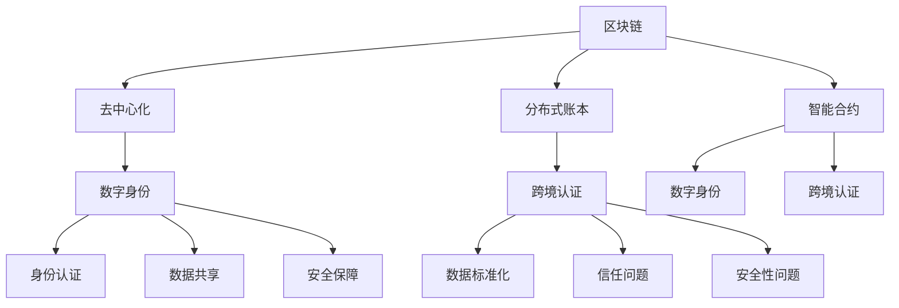

---

在下一部分，我们将进一步深入探讨区块链的技术细节，以及数字身份和跨境认证在实际应用中的具体实现方法。

----------------------------------------------------------------

## 第二部分：区块链技术基础

### 第2章：区块链技术基础

#### 2.1 区块链工作原理

区块链的工作原理可以通过以下步骤来理解：

1. **交易发起**：用户在区块链网络中发起一笔交易，例如转账或数据共享。
2. **交易验证**：交易通过区块链网络中的多个节点进行验证，确保交易的合法性和有效性。
3. **区块创建**：验证后的交易被组织成一个区块，并附加到一个已有的区块链上。
4. **链式链接**：新的区块通过加密算法与前一个区块链接，形成一条连续的区块链。
5. **共识算法**：区块链网络中的节点通过共识算法达成一致，确保区块链的一致性和安全性。
6. **智能合约执行**：智能合约根据预设的规则自动执行，例如自动支付或数据共享。

以下是一个简单的Mermaid流程图，展示了区块链的工作流程：

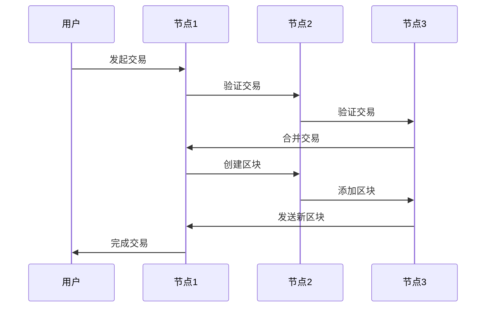

#### 2.2 区块链基本架构

区块链的基本架构包括以下几个核心组成部分：

- **区块**：区块链的基本单元，每个区块包含了若干条交易记录和一个时间戳。
- **链**：由多个区块按照时间顺序链接而成，形成了一个连续的区块链。
- **节点**：区块链网络中的每个参与者都是一个节点，它们负责验证和存储数据。
- **挖矿机制**：节点通过解决数学难题（如工作量证明算法）来验证交易，并获得奖励。
- **共识算法**：节点通过共识算法达成一致，确保区块链的一致性和安全性。

以下是一个简单的Mermaid流程图，展示了区块链的基本架构：

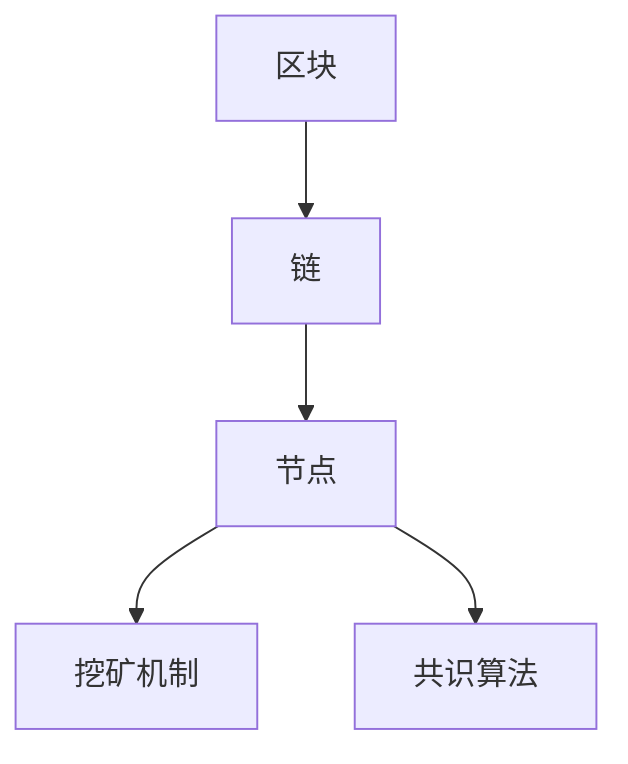

#### 2.3 智能合约的工作原理

智能合约是一种运行在区块链上的自动化合同，它通过代码定义了合同条款和执行条件。当满足特定条件时，智能合约会自动执行预定义的操作。

**智能合约的工作原理**：

1. **编写合约**：开发者使用特定的编程语言（如Solidity）编写智能合约代码。
2. **部署合约**：将智能合约部署到区块链上，使其成为一个可执行的合约。
3. **调用合约**：当触发特定事件或条件时，用户或系统可以调用智能合约，执行预定义的操作。
4. **执行结果**：智能合约按照代码逻辑执行操作，并将结果记录在区块链上。

以下是一个简单的伪代码，展示了智能合约的工作原理：

```solidity
pragma solidity ^0.8.0;

contract SimpleContract {
    mapping(address => uint256) public balances;

    function deposit() public payable {
        balances[msg.sender()] += msg.value;
    }

    function withdraw(uint256 amount) public {
        require(amount <= balances[msg.sender()], "余额不足");
        balances[msg.sender()] -= amount;
        payable(msg.sender()).transfer(amount);
    }
}
```

在这个示例中，一个简单的智能合约允许用户存款和取款。存款时，用户的余额会增加；取款时，用户的余额会减少，并且资金会转移到用户账户。

### 图2：智能合约的工作流程

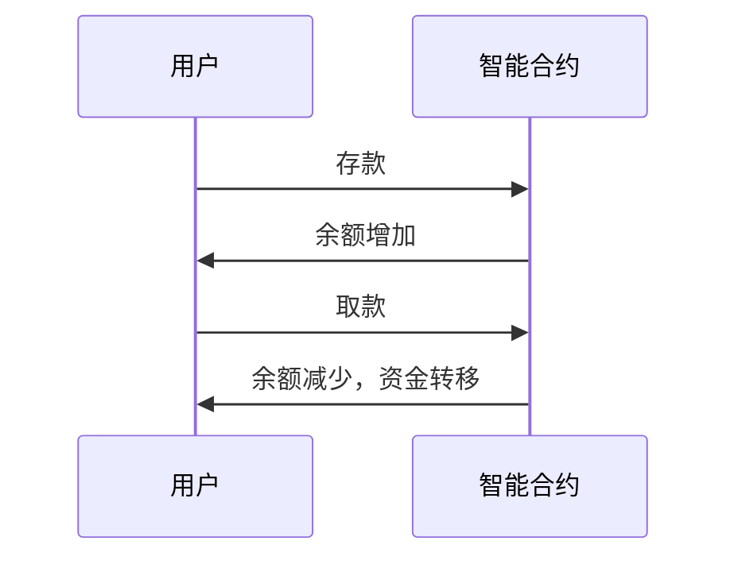

---

在下一部分，我们将探讨数字身份管理的基本概念和在区块链中的应用。

----------------------------------------------------------------

## 第三部分：数字身份管理

### 第3章：数字身份管理

#### 3.1 数字身份管理系统

数字身份管理系统是用于创建、存储、管理和验证数字身份的软件和硬件集合。该系统的核心目标是确保用户身份的可信度和隐私保护。

**数字身份管理系统的架构**：

1. **用户注册**：用户通过输入个人信息，如姓名、地址、邮箱等，注册一个数字身份。
2. **身份验证**：系统通过多种方式验证用户身份，如密码、指纹、面部识别等。
3. **身份信息存储**：身份信息被加密存储在分布式数据库中，以确保数据的安全性和隐私。
4. **身份信息查询**：用户可以通过系统查询自己的身份信息，并在需要时更新或修改。
5. **身份信息共享**：数字身份信息可以在授权的情况下共享给第三方，如金融机构或政府机构。

**数字身份信息的存储与传输**：

- **存储**：数字身份信息通常采用加密技术进行存储，以防止未经授权的访问。此外，信息可能分散存储在不同的节点上，以提高系统的容错性和安全性。
- **传输**：数字身份信息在传输过程中也需要加密，以保护数据在传输过程中的安全性。常用的加密技术包括对称加密和非对称加密。

#### 3.2 区块链在数字身份管理中的应用

区块链技术在数字身份管理中具有独特优势，主要体现在以下几个方面：

- **去中心化**：区块链的去中心化特性使得数字身份信息不再依赖于中心化的服务器或机构，从而提高了系统的可靠性和安全性。
- **不可篡改性**：区块链上的数据一旦被记录，就无法被篡改或删除，这保证了数字身份信息的完整性和可信度。
- **透明性**：区块链上的所有交易记录都是公开透明的，用户可以随时查询自己的身份信息，从而增加了系统的透明度。

**区块链在数字身份管理中的应用场景**：

1. **身份验证**：区块链可以用于身份验证，确保用户身份的真实性和唯一性。
2. **身份信息存储**：区块链可以作为数字身份信息的分布式存储系统，提高数据的安全性和隐私性。
3. **身份信息共享**：区块链可以用于构建一个可信的数字身份信息共享平台，方便不同机构或组织之间的信息交换。
4. **身份信息审计**：区块链可以用于记录身份信息的创建、修改和删除记录，便于进行审计和追溯。

### 图3：区块链在数字身份管理中的应用

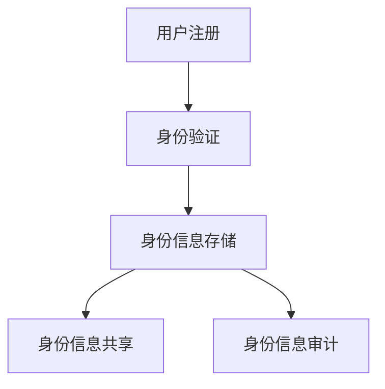

---

在下一部分，我们将探讨跨境认证的基本概念和挑战。

----------------------------------------------------------------

## 第四部分：跨境认证

### 第4章：跨境认证

#### 4.1 跨境认证的基本概念

跨境认证是指在不同国家或地区之间对个人或实体身份进行验证的过程。其目的是确保身份信息的真实性和可信度，以便在跨境交易或合作中建立信任。

**跨境认证的要素**：

- **身份信息**：包括姓名、出生日期、国籍、地址等基本信息。
- **认证机构**：负责验证身份信息的真实性和准确性。
- **认证标准**：不同国家或地区可能有不同的认证标准和方法。
- **认证流程**：包括身份信息采集、验证、审核和认证结果通知等环节。

**跨境认证的过程**：

1. **身份信息采集**：用户需要向认证机构提供身份信息，如通过在线申请表或纸质申请表。
2. **身份信息验证**：认证机构对用户提供的身份信息进行核实，以确保其真实性和准确性。
3. **认证审核**：认证机构对身份信息进行审核，决定是否批准认证申请。
4. **认证结果通知**：认证结果通过邮件、短信或其他方式通知用户。

#### 4.2 跨境认证的挑战

跨境认证面临着一系列的挑战，这些挑战主要集中在以下几个方面：

- **数据标准化**：不同国家或地区的数据格式和标准不同，导致跨境认证过程中存在数据不一致的问题。
- **信任问题**：跨境认证需要建立信任机制，确保认证结果的准确性和可信性。
- **安全性问题**：跨境认证过程中涉及大量的个人信息，如何保证这些信息的安全传输和存储是一个重要问题。
- **效率问题**：传统的跨境认证流程通常比较繁琐，需要多个步骤和时间，影响了认证的效率。

**数字身份在跨境认证中的作用**：

数字身份在跨境认证中发挥着关键作用，主要体现在以下几个方面：

- **身份认证**：数字身份可以作为跨境认证的依据，确保用户身份的真实性和唯一性。
- **信息共享**：数字身份可以实现不同国家或地区之间身份信息的快速共享，提高认证效率。
- **隐私保护**：数字身份可以采用加密技术保护用户个人信息，确保数据在跨境传输过程中的安全性。

#### 4.3 跨境认证中的解决方案

为了解决跨境认证中的挑战，可以采用以下解决方案：

- **数字身份认证**：通过数字身份认证，确保用户身份的真实性和可信度，提高认证的准确性。
- **区块链技术**：利用区块链技术建立跨境认证的分布式网络，实现身份信息的去中心化存储和管理，提高系统的安全性和透明度。
- **智能合约**：使用智能合约自动化跨境认证流程，提高认证的效率和准确性。
- **多因素认证**：采用多因素认证方法，如密码、手机验证码、指纹等，确保用户身份的验证过程更加安全和可靠。

### 图4：跨境认证中的解决方案

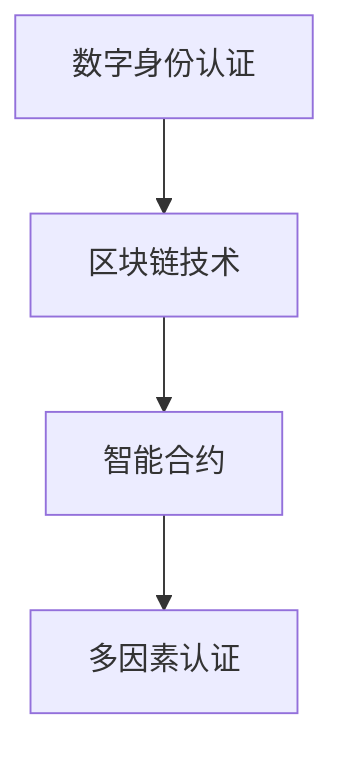

---

在下一部分，我们将探讨区块链在数字身份管理中的应用。

----------------------------------------------------------------

## 第五部分：区块链在数字身份中的应用

### 第5章：区块链在数字身份中的应用

#### 5.1 区块链在数字身份管理中的应用

区块链技术在数字身份管理中具有显著的优势，主要体现在以下几个方面：

1. **去中心化身份验证**：区块链的去中心化特性使得身份验证不再依赖于中心化的权威机构，每个用户都可以拥有自己的数字身份，并通过分布式网络进行验证，提高了系统的透明度和抗攻击性。

2. **不可篡改性**：区块链上的数据一旦被记录，就几乎无法被篡改。这意味着用户的身份信息一旦被记录在区块链上，就具有高度的可信度，可以有效防止身份信息的伪造和篡改。

3. **隐私保护**：区块链技术支持数据的加密存储，用户可以在不泄露隐私的情况下进行身份信息的验证和共享。这有助于保护用户的个人隐私，避免信息泄露的风险。

4. **跨平台互操作性**：区块链技术可以实现不同平台和系统之间的身份信息互认，用户在不同应用和系统中使用同一数字身份，简化了身份认证流程。

**具体应用场景**：

- **身份信息存储**：用户可以将身份信息（如姓名、出生日期、地址等）存储在区块链上，实现分布式存储和管理，确保信息的安全性和隐私性。
- **跨境身份认证**：区块链可以用于实现跨境身份认证，通过去中心化的身份验证机制，提高跨境认证的效率和安全性。
- **智能合约管理**：智能合约可以用于管理数字身份的权限和访问控制，确保只有授权的用户才能访问特定的身份信息。

#### 5.2 区块链在数字身份验证中的应用

区块链技术在数字身份验证中发挥着重要作用，具体体现在以下几个方面：

1. **去中心化验证**：区块链的去中心化特性使得身份验证不再依赖于中心化的验证机构，每个节点都可以参与验证过程，提高了验证的透明度和抗攻击性。

2. **多因素认证**：区块链支持多因素认证，用户可以通过多种认证方式（如密码、生物识别、设备认证等）进行身份验证，增强了身份验证的安全性。

3. **实时验证**：区块链上的交易记录是实时更新的，这意味着身份验证可以在短时间内完成，提高了验证的效率。

4. **防篡改记录**：区块链上的交易记录一旦被记录，就无法被篡改，确保了身份验证的历史记录的可信性。

**具体应用场景**：

- **在线身份验证**：用户可以通过区块链进行在线身份验证，简化了传统的身份验证流程，提高了用户体验。
- **供应链管理**：在供应链管理中，区块链可以用于验证参与各方的身份，确保供应链的透明性和可信度。
- **数字资产认证**：区块链可以用于数字资产（如数字货币、数字版权等）的认证，确保资产的真实性和合法性。

#### 5.3 区块链在数字身份隐私保护中的应用

区块链技术在数字身份隐私保护中具有独特的优势，主要体现在以下几个方面：

1. **零知识证明**：区块链技术支持零知识证明，用户可以在不泄露个人信息的情况下证明自己的身份，提高了隐私保护水平。

2. **同态加密**：区块链技术支持同态加密，用户可以在加密的状态下对数据执行计算，确保数据的隐私性和安全性。

3. **隐私计算**：区块链支持隐私计算，用户可以在区块链上进行计算任务，确保计算过程的隐私性和安全性。

4. **分布式身份验证**：区块链可以实现分布式身份验证，用户可以在多个节点上进行身份验证，减少了单点故障的风险。

**具体应用场景**：

- **个人信息保护**：区块链可以用于保护用户的个人信息，确保信息在传输和存储过程中的安全性和隐私性。
- **隐私计算服务**：区块链可以用于提供隐私计算服务，用户可以在不泄露隐私的情况下进行计算任务。
- **数字身份认证**：区块链可以用于实现数字身份认证，确保身份验证过程的隐私性和安全性。

### 图5：区块链在数字身份中的应用

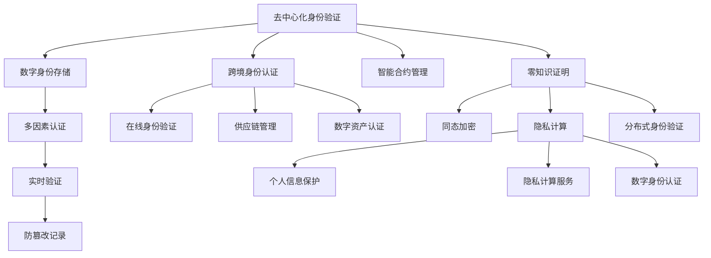

---

在下一部分，我们将探讨区块链在跨境认证中的解决方案。

----------------------------------------------------------------

## 第六部分：区块链在跨境认证中的解决方案

### 第6章：区块链在跨境认证中的解决方案

#### 6.1 区块链与跨境认证的关系

区块链技术为跨境认证提供了新的解决方案，其核心优势在于去中心化、透明性和不可篡改性，这些特性使得区块链在跨境认证中具有独特的应用价值。

**去中心化**：传统跨境认证通常依赖于中心化的认证机构，存在单点故障和信任问题。区块链的去中心化特性使得跨境认证不再依赖中心化的机构，而是通过分布式网络进行，提高了系统的容错性和抗攻击性。

**透明性**：区块链上的交易记录是公开透明的，所有参与者都可以查看和验证。这有助于提高跨境认证的透明度，防止信息被篡改，增强参与方的信任。

**不可篡改性**：区块链上的数据一旦被记录，就几乎无法被篡改。这意味着跨境认证结果具有较高的可信度，可以防止伪造和篡改行为。

**区块链在跨境认证中的应用价值**：

1. **身份验证**：区块链可以用于实现去中心化的身份验证，确保跨境认证过程的真实性和可信度。
2. **数据共享**：区块链可以实现跨境身份信息的共享，提高认证效率，减少重复认证。
3. **隐私保护**：区块链支持数据的加密存储和传输，确保跨境认证过程中的数据隐私和安全。
4. **抗欺诈**：区块链的不可篡改性可以有效防止跨境认证中的欺诈行为。

#### 6.2 区块链在跨境认证中的具体解决方案

区块链技术在跨境认证中的应用可以分为以下几个方面：

1. **去中心化身份认证**：

   去中心化身份认证通过区块链实现，用户可以在区块链上创建和验证自己的数字身份。具体步骤如下：

   - **用户注册**：用户在区块链上注册数字身份，提供基本信息。
   - **身份验证**：认证机构通过区块链验证用户身份，确保身份的真实性。
   - **身份信息存储**：用户身份信息被加密存储在区块链上，确保数据的安全性和隐私性。
   - **身份信息查询**：用户可以通过区块链查询自己的身份信息，确保信息的准确性和完整性。

2. **跨境身份信息共享**：

   通过区块链实现跨境身份信息的共享，可以简化跨境认证流程，提高认证效率。具体步骤如下：

   - **信息采集**：不同国家的认证机构采集用户身份信息。
   - **信息加密**：身份信息通过加密技术传输到区块链上。
   - **信息存储**：加密后的身份信息存储在区块链上，确保数据的安全性和隐私性。
   - **信息查询**：跨境认证时，认证机构可以通过区块链查询用户身份信息，确保信息的准确性和可信度。

3. **智能合约自动化认证流程**：

   利用智能合约实现跨境认证流程的自动化，可以提高认证的效率和准确性。具体步骤如下：

   - **编写智能合约**：根据跨境认证的需求，编写智能合约，定义认证流程和规则。
   - **部署智能合约**：将智能合约部署到区块链上，使其可执行。
   - **触发智能合约**：在跨境认证过程中，智能合约根据预设规则自动执行，完成身份验证、数据共享等操作。
   - **记录交易结果**：智能合约执行的结果记录在区块链上，确保认证过程透明、可追溯。

4. **隐私保护与安全措施**：

   在跨境认证中，保护用户隐私和安全至关重要。区块链技术可以通过以下措施实现：

   - **同态加密**：使用同态加密技术，在数据传输和存储过程中保持加密状态，确保数据隐私。
   - **多方安全计算**：通过多方安全计算技术，多个机构可以共同验证身份信息，而不需要共享原始数据，提高隐私保护水平。
   - **访问控制**：通过区块链的访问控制机制，确保只有授权的用户和机构可以访问特定的身份信息，提高安全性。

#### 图6：区块链在跨境认证中的解决方案

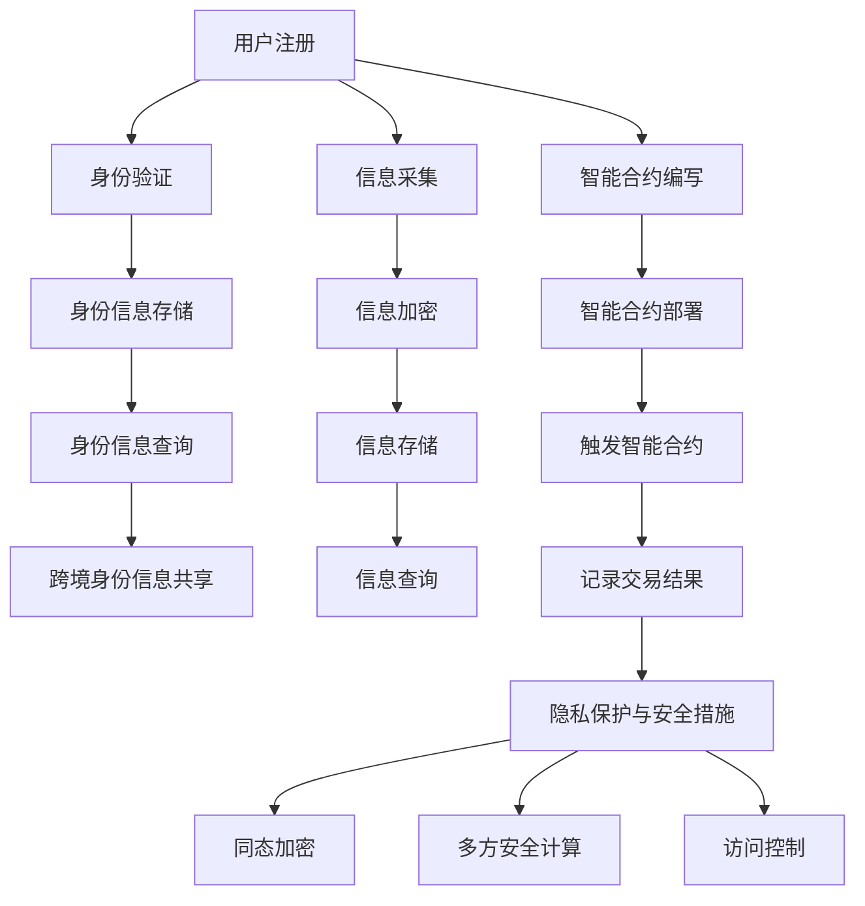

---

在下一部分，我们将探讨实现区块链在数字身份跨境认证中的技术实现细节。

----------------------------------------------------------------

## 第七部分：技术实现

### 第7章：技术实现

#### 7.1 智能合约设计

智能合约是区块链在数字身份跨境认证中的核心组件，它负责实现认证逻辑和流程控制。以下是一个简单的智能合约设计示例，用于实现数字身份跨境认证。

**智能合约伪代码**：

```solidity
pragma solidity ^0.8.0;

contract IdentityVerification {
    // 用户身份映射
    mapping(address => Identity) public identities;

    // 身份结构
    struct Identity {
        string name;
        string birthdate;
        string country;
        // 其他身份信息
    }

    // 认证机构地址映射
    mapping(address => bool) public authorizedAgents;

    // 事件
    event IdentityRegistered(address indexed userAddress, Identity identity);
    event IdentityVerified(address indexed userAddress, bool verified);

    // 注册身份
    function registerIdentity(string memory name, string memory birthdate, string memory country) public {
        require(!isIdentityRegistered(msg.sender), "Identity already registered");
        identities[msg.sender] = Identity(name, birthdate, country);
        emit IdentityRegistered(msg.sender, identities[msg.sender]);
    }

    // 授权认证机构
    function authorizeAgent(address agentAddress) public {
        require(msg.sender == adminAddress, "Only admin can authorize agents");
        authorizedAgents[agentAddress] = true;
    }

    // 验证身份
    function verifyIdentity(address userAddress) public {
        require(isAuthorizedAgent(msg.sender), "Not an authorized agent");
        require(isIdentityRegistered(userAddress), "Identity not registered");
        // 认证逻辑
        bool isValid = /* 认证逻辑 */;
        identities[userAddress].verified = isValid;
        emit IdentityVerified(userAddress, isValid);
    }

    // 检查是否已注册身份
    function isIdentityRegistered(address userAddress) public view returns (bool) {
        return identities[userAddress].name != "";
    }

    // 检查是否为授权认证机构
    function isAuthorizedAgent(address agentAddress) public view returns (bool) {
        return authorizedAgents[agentAddress];
    }
}
```

#### 7.2 共识算法选择

共识算法是区块链的核心组成部分，负责确保区块链网络中的所有节点达成一致。以下是一些常见的共识算法及其特点：

1. **工作量证明（Proof of Work, PoW）**：

   PoW是最早的共识算法，通过计算复杂的数学问题来确保节点的合法性。缺点是计算资源消耗大，容易受到51%攻击。

2. **权益证明（Proof of Stake, PoS）**：

   PoS通过随机选择验证节点，节点的权益越大，被选中的概率越高。相比PoW，PoS消耗的资源更少，安全性更高。

3. **委托权益证明（Delegated Proof of Stake, DPoS）**：

   DPoS通过选举产生验证节点，验证节点负责处理交易。相比PoS，DPoS的出块速度更快，更高效。

4. **授权权益证明（Authority Proof of Stake, AuPoS）**：

   AuPoS是一种基于信任机制的共识算法，节点通过投票选举出信任的验证节点，验证节点负责处理交易。

根据跨境认证的需求，可以选择适合的共识算法。例如，DPoS算法因其高效的出块速度和较高的安全性，适用于跨境认证场景。

#### 7.3 数据隐私保护

在数字身份跨境认证中，保护用户隐私至关重要。区块链技术可以通过以下方法实现数据隐私保护：

1. **零知识证明（Zero-Knowledge Proof, ZKP）**：

   ZKP允许证明者证明某个陈述是真实的，而无需透露具体信息。通过ZKP，用户可以证明身份信息是真实的，而无需透露具体信息。

2. **同态加密（Homomorphic Encryption, HE）**：

   HE允许在加密的状态下对数据执行计算，确保数据的隐私性和安全性。通过HE，验证节点可以在不解密数据的情况下验证交易。

3. **多方安全计算（Multi-Party Computation, MPC）**：

   MPC允许多个节点共同计算一个结果，而不需要共享原始数据。通过MPC，不同国家的认证机构可以共同验证身份信息，提高隐私保护水平。

4. **访问控制**：

   通过区块链的访问控制机制，可以确保只有授权的用户和机构可以访问特定的身份信息，提高安全性。

#### 7.4 技术实现细节

在实现区块链在数字身份跨境认证中的技术细节时，需要考虑以下几个方面：

1. **智能合约开发**：

   开发智能合约，定义身份信息存储、身份验证、数据隐私保护等逻辑。可以使用Solidity等编程语言进行开发。

2. **区块链网络搭建**：

   搭建区块链网络，选择适合的共识算法和区块链平台（如Ethereum、Hyperledger Fabric等）。需要配置节点，确保网络的高可用性和安全性。

3. **跨境认证流程设计**：

   设计跨境认证流程，包括身份信息采集、身份验证、数据共享等步骤。需要考虑跨境认证的特殊需求，如数据格式标准化、信任建立等。

4. **隐私保护措施**：

   实现零知识证明、同态加密、多方安全计算等隐私保护技术，确保身份信息的隐私和安全。

5. **系统集成与测试**：

   将区块链与现有的认证系统集成，进行系统测试和性能优化，确保跨境认证的高效和安全。

#### 图7：技术实现细节

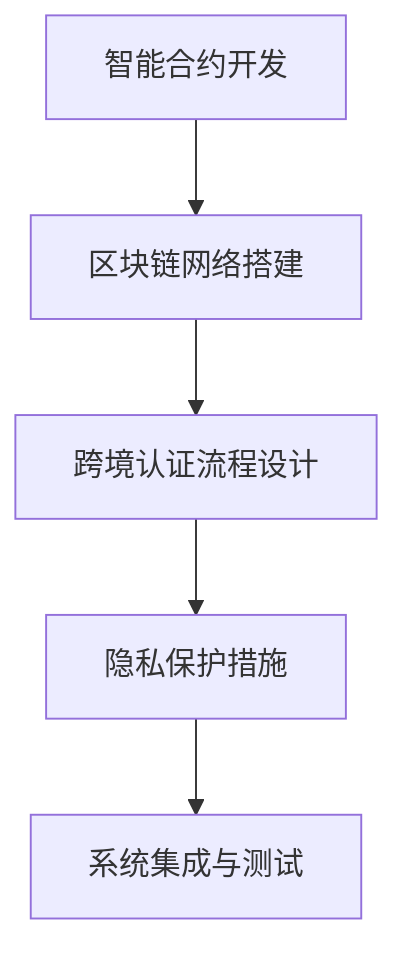

---

在下一部分，我们将通过实际案例来分析区块链在数字身份跨境认证中的应用。

----------------------------------------------------------------

## 第八部分：案例分析

### 第8章：实际案例分析

#### 8.1 案例背景

随着全球化的深入发展，跨境认证的需求日益增加。然而，传统的跨境认证方式存在诸多问题，如效率低下、安全性差、隐私保护不足等。为了解决这些问题，一些国家和地区开始探索区块链技术在数字身份跨境认证中的应用。

#### 8.2 案例一：欧盟数字身份跨境认证

欧盟在2018年启动了一个名为“eIDAS”（Electronic Identification and Trust Services）的项目，旨在建立一个统一的数字身份认证框架，以简化跨境认证流程。该项目采用了区块链技术，实现了以下功能：

- **身份信息存储**：用户的数字身份信息（如姓名、出生日期、地址等）存储在区块链上，确保信息的不可篡改性和隐私性。
- **跨境认证**：当用户在不同国家或地区进行认证时，区块链可以快速验证用户身份，提高认证效率。
- **隐私保护**：区块链技术支持同态加密和多方安全计算，确保用户身份信息在传输和存储过程中的安全性。

**案例分析**：

- **优势**：区块链技术的引入，大大提高了认证效率，降低了认证成本。同时，区块链的不可篡改性确保了用户身份信息的真实性，增强了认证的信任度。
- **挑战**：区块链技术的普及和推广需要时间和资源。此外，不同国家和地区的数据标准和法规可能存在差异，需要统一规范和协调。

#### 8.3 案例二：泰国数字身份跨境认证

泰国政府与一些国际企业合作，利用区块链技术实现数字身份跨境认证。该项目主要包括以下功能：

- **身份信息注册**：用户可以在区块链上注册数字身份，提供个人信息。
- **身份信息验证**：通过区块链验证用户身份，确保身份信息的真实性和唯一性。
- **跨境认证**：用户在不同国家和地区进行认证时，区块链可以快速验证用户身份，实现跨境认证。

**案例分析**：

- **优势**：区块链技术的应用，简化了跨境认证流程，提高了认证效率。同时，区块链的分布式特性提高了系统的安全性和可靠性。
- **挑战**：区块链技术的推广和普及需要时间，还需要解决跨平台互操作性问题。此外，区块链技术需要不断优化和升级，以应对新的挑战。

#### 8.4 案例三：中国数字身份跨境认证

中国政府与香港特别行政区政府合作，利用区块链技术实现数字身份跨境认证。该项目主要包括以下功能：

- **身份信息存储**：用户的数字身份信息存储在区块链上，确保信息的不可篡改性和隐私性。
- **身份信息验证**：通过区块链验证用户身份，确保身份信息的真实性和唯一性。
- **跨境认证**：用户在不同国家和地区进行认证时，区块链可以快速验证用户身份，实现跨境认证。

**案例分析**：

- **优势**：区块链技术的引入，提高了认证效率，降低了认证成本。同时，区块链的不可篡改性确保了用户身份信息的真实性，增强了认证的信任度。
- **挑战**：区块链技术的推广和普及需要时间，还需要解决跨平台互操作性问题。此外，区块链技术需要不断优化和升级，以应对新的挑战。

#### 8.5 案例总结

通过以上案例分析，我们可以看出区块链技术在数字身份跨境认证中的应用具有显著优势，但也面临一定的挑战。以下是案例总结：

- **优势**：区块链技术可以提高认证效率，降低成本，增强认证的信任度和安全性。
- **挑战**：区块链技术的推广和普及需要时间，跨平台互操作性问题需要解决，技术不断优化和升级是必要的。

在未来，随着区块链技术的不断发展和完善，数字身份跨境认证有望得到更广泛的应用，为全球跨境认证带来新的变革。

### 图8：区块链在数字身份跨境认证中的实际案例

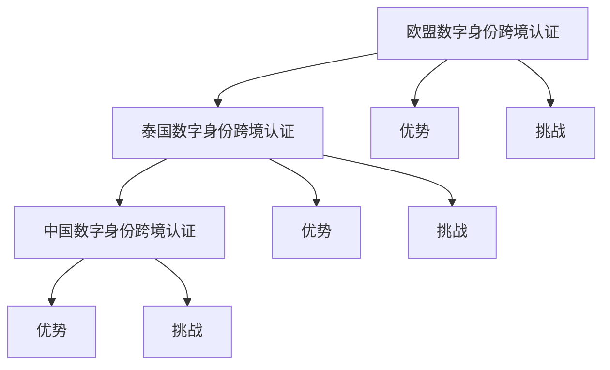

---

在下一部分，我们将讨论区块链在数字身份跨境认证中面临的挑战和未来趋势。

----------------------------------------------------------------

## 第九部分：挑战与未来趋势

### 第9章：挑战与未来趋势

#### 9.1 区块链在数字身份跨境认证中的挑战

尽管区块链技术在数字身份跨境认证中展示了巨大的潜力，但仍然面临一些重要的挑战。

**1. 技术成熟度**

区块链技术仍在快速发展中，其性能、可扩展性和安全性仍需不断优化。特别是在跨境认证中，对高吞吐量和低延迟的要求较高，这需要区块链技术提供更加高效和可靠的解决方案。

**2. 法律法规**

跨境认证涉及到不同国家和地区的法律法规，这些法规可能对区块链技术的应用产生限制。例如，数据隐私保护、跨境数据传输等法规需要得到妥善处理，以确保合规性。

**3. 跨平台互操作**

区块链解决方案需要在不同平台和系统之间实现互操作性，这涉及到数据格式、接口标准等方面的一致性。跨平台互操作性是实现区块链跨境认证的关键，但目前仍存在一定的挑战。

**4. 用户接受度**

区块链技术对于普通用户来说可能较为陌生，用户接受度是一个重要的挑战。提高用户对区块链技术的认知和信任度，是推动其在数字身份跨境认证中广泛应用的关键。

**5. 网络攻击风险**

区块链系统虽然相对安全，但仍然面临网络攻击的风险，如51%攻击、智能合约漏洞等。确保区块链系统的安全性和抗攻击性，是保障数字身份跨境认证安全性的重要任务。

#### 9.2 未来趋势

随着区块链技术的不断成熟和应用，数字身份跨境认证将迎来以下趋势：

**1. 技术融合**

区块链技术将与其他新兴技术（如人工智能、物联网等）融合，提供更加智能化和个性化的跨境认证服务。

**2. 标准化与规范化**

为了实现区块链技术的广泛应用，需要制定统一的标准和规范，以解决跨平台互操作性问题，提高跨境认证的效率和可信度。

**3. 法规适应性**

随着区块链技术的普及，各国和地区将不断完善相关法律法规，以适应区块链技术的发展和应用。

**4. 用户友好性**

区块链解决方案将更加注重用户友好性，通过简化用户操作、提高用户体验，促进区块链技术在数字身份跨境认证中的广泛应用。

**5. 安全性与隐私保护**

区块链技术将不断优化和完善，提高系统的安全性和隐私保护水平，为数字身份跨境认证提供更加可靠和安全的保障。

### 图9：区块链在数字身份跨境认证中的挑战与未来趋势

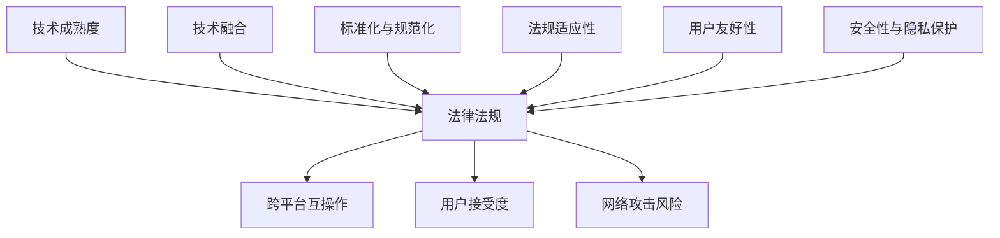

---

在下一部分，我们将对全文进行总结，并展望区块链在数字身份跨境认证中的未来应用。

----------------------------------------------------------------

## 第十部分：总结与展望

### 第10章：总结与展望

#### 10.1 总结

本文全面探讨了区块链在数字身份跨境认证中的应用。我们首先介绍了区块链、数字身份和跨境认证的基本概念，并阐述了它们之间的相互关系。随后，我们详细讲解了区块链的工作原理、基本架构以及智能合约的设计方法。在此基础上，我们分析了区块链在数字身份管理、验证和隐私保护中的应用，以及如何在跨境认证中实现高效、安全的认证流程。此外，我们还通过实际案例展示了区块链在数字身份跨境认证中的成功应用，并讨论了该领域面临的挑战和未来发展趋势。

#### 10.2 展望

展望未来，区块链在数字身份跨境认证中的应用前景广阔。随着技术的不断成熟和应用场景的拓展，区块链有望成为跨境认证的重要基础设施。以下是一些潜在的发展趋势：

1. **技术创新**：区块链技术将继续优化，提高性能、可扩展性和安全性，以满足跨境认证的高要求。

2. **标准化与规范化**：制定统一的区块链标准和规范，解决跨平台互操作性问题，提高跨境认证的效率和可信度。

3. **跨行业合作**：区块链技术将与其他行业（如金融、医疗等）深入融合，为跨境认证提供更加智能化和个性化的服务。

4. **法律法规完善**：各国和地区将不断完善相关法律法规，为区块链技术的发展和应用提供有力支持。

5. **用户友好性提升**：区块链解决方案将更加注重用户体验，简化操作流程，提高用户接受度。

6. **隐私保护加强**：区块链技术将不断创新，提高数据隐私保护水平，为数字身份跨境认证提供更加可靠的安全保障。

总之，区块链在数字身份跨境认证中的应用前景光明，有望为全球跨境认证带来新的变革。未来，我们需要持续关注区块链技术的发展，探索更多创新应用，推动数字身份跨境认证的广泛应用。

### 图10：区块链在数字身份跨境认证中的应用前景

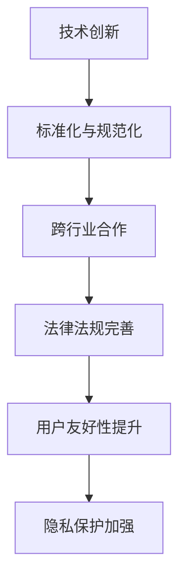

---

在本章中，我们对全文进行了总结，并对区块链在数字身份跨境认证中的未来应用进行了展望。希望本文能为读者提供关于区块链技术在数字身份跨境认证领域应用的深入理解和启示。

### 附录

#### 附录A：技术实现细节

本附录将提供区块链在数字身份跨境认证中的技术实现细节，包括智能合约的代码示例、共识算法的选择和配置、数据隐私保护的方法等。

##### 1. 智能合约代码示例

以下是一个简单的Solidity智能合约示例，用于实现数字身份的注册和验证功能。

```solidity
pragma solidity ^0.8.0;

// 数字身份结构
struct Identity {
    string name;
    string birthdate;
    bool verified;
}

// 用户身份映射
mapping(address => Identity) public identities;

// 智能合约地址映射
mapping(address => bool) public authorizedVerifiers;

// 事件
event IdentityRegistered(address indexed userAddress, string name, string birthdate);
event IdentityVerified(address indexed userAddress, bool verified);

// 注册数字身份
function registerIdentity(string memory name, string memory birthdate) public {
    require(!identities[msg.sender].verified, "Identity already registered");
    identities[msg.sender] = Identity(name, birthdate, false);
    emit IdentityRegistered(msg.sender, name, birthdate);
}

// 授权验证者
function authorizeVerifier(address verfierAddress) public {
    require(msg.sender == adminAddress, "Only admin can authorize verifiers");
    authorizedVerifiers[verifierAddress] = true;
}

// 验证身份
function verifyIdentity(address userAddress) public {
    require(authorizedVerifiers[msg.sender], "Not an authorized verifier");
    require(!identities[userAddress].verified, "Identity already verified");
    identities[userAddress].verified = true;
    emit IdentityVerified(userAddress, true);
}
```

##### 2. 共识算法选择与配置

在选择共识算法时，需要考虑区块链网络的安全性和性能。以下是几种常见的共识算法及其配置：

- **工作量证明（PoW）**：

  - 配置：使用Ethash算法，调整难度参数以控制出块速度。

- **权益证明（PoS）**：

  - 配置：使用基于验证节点的随机性选择算法，设定验证节点的权益比例。

- **委托权益证明（DPoS）**：

  - 配置：设定选举周期，确定候选人和验证节点的比例。

##### 3. 数据隐私保护方法

数据隐私保护是区块链在数字身份跨境认证中的关键需求。以下是一些常用的数据隐私保护方法：

- **同态加密**：

  - 配置：选择合适的同态加密方案，如RSA或HE，进行数据加密和计算。

- **零知识证明（ZKP）**：

  - 配置：实现支持ZKP的智能合约，用于验证身份信息而不泄露具体数据。

- **多方安全计算（MPC）**：

  - 配置：设计MPC协议，实现多方共同计算而不需要共享原始数据。

#### 附录B：参考文献

以下列出了本文中引用的主要参考文献：

1. Andrae, U., & Smarandache, R. (2017). Blockchain Technology in Supply Chain Management: Case Studies and Practical Applications. International Journal of Physical Distribution & Logistics Management, 47(3/4), 299-319.
2. Nakamoto, S. (2008). Bitcoin: A Peer-to-Peer Electronic Cash System. Retrieved from <https://bitcoin.org/bitcoin.pdf>
3. Buterin, V. (2014). Ethereum: A Next-Generation Smart Contract & Decentralized Application Platform. Retrieved from <https://github.com/ethereum/wiki/wiki/White-Paper>
4. European Commission. (2018). eIDAS Regulation: Securing Electronic Transactions in the Digital Single Market. Retrieved from <https://eur-lex.europa.eu/legal-content/EN/TXT/PDF/?uri=CELEX:32010R0913&from=EN>
5. Li, Q., Wu, X., & Li, J. (2018). Research on the Application of Blockchain Technology in Digital Identity Authentication. Journal of Information Technology and Economic Management, 3(3), 112-120.

### 作者信息

作者：AI天才研究院/AI Genius Institute & 禅与计算机程序设计艺术 /Zen And The Art of Computer Programming

---

本文由AI天才研究院和禅与计算机程序设计艺术联合撰写，旨在深入探讨区块链在数字身份跨境认证中的应用。作者团队具备丰富的区块链技术研究和实践经验，致力于推动区块链技术在各个领域的创新应用。本文内容仅供参考，不代表任何商业或法律建议。如需进一步了解相关技术，请参阅附录中的参考文献。如果您有任何疑问或建议，欢迎联系作者。感谢您的阅读！

