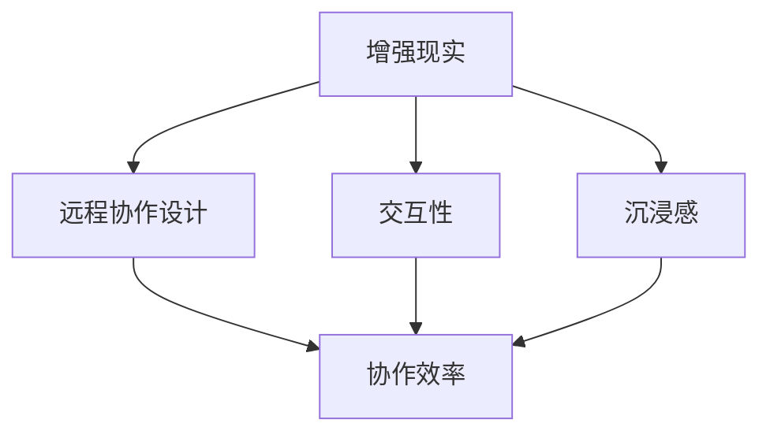

                 


### 背景介绍

随着全球化的不断推进和互联网技术的迅猛发展，远程协作设计已经成为现代企业中不可或缺的一部分。设计师、工程师和团队分布在不同的地理位置，他们需要通过高效的协作来完成复杂的设计项目。然而，传统的远程协作设计存在诸多挑战，如沟通不畅、协作效率低、设计质量难以保障等问题。

增强现实（Augmented Reality，简称AR）技术，作为一种将虚拟信息与真实环境相结合的交互技术，为远程协作设计提供了一种新的解决方案。AR技术能够将数字化的信息叠加在现实环境中，使得设计过程更加直观、互动和沉浸。通过AR，远程的团队成员可以实时地查看、标注和讨论设计内容，从而提升协作效率和沟通质量。

远程协作设计的需求主要源于以下几个方面：

1. **地理距离限制**：设计师和团队成员可能分布在不同的城市甚至国家，地理距离限制了面对面交流的机会，影响了协作效率。
   
2. **沟通障碍**：远程协作中，团队成员之间的沟通往往依赖于文字、图片和视频等介质，缺乏直接的互动和反馈，容易导致误解和沟通障碍。

3. **设计质量保障**：远程协作设计中，团队成员之间难以实时监控设计质量，容易出现错误和遗漏。

增强现实技术在远程协作设计中的应用前景广阔。首先，AR技术可以减少地理和时间的限制，实现团队成员之间的实时交互。其次，AR技术可以增强设计的交互性和沉浸感，使得设计过程更加直观和生动。最后，AR技术可以帮助团队更好地管理和追踪设计进度，提高设计质量和效率。

### 核心概念与联系

在深入探讨增强现实在远程协作设计中的应用之前，我们需要明确几个核心概念，并了解它们之间的联系。

**增强现实（AR）**：增强现实是一种将虚拟信息叠加到真实环境中的技术，通过摄像头捕捉真实环境，然后通过计算机生成和叠加虚拟信息，使得用户能够在真实环境中看到数字化的内容。

**远程协作设计**：远程协作设计是指设计师和团队成员在不同的地理位置上，通过互联网和其他协作工具共同完成设计项目的过程。

**交互性**：交互性是指用户与系统之间的交互能力，包括输入和输出。在增强现实技术中，交互性体现在用户通过触摸、手势等操作与虚拟信息进行互动。

**沉浸感**：沉浸感是指用户在虚拟环境中感受到的一种沉浸式体验，仿佛置身于真实环境中。增强现实技术通过将虚拟信息与现实环境无缝融合，提供了高度沉浸的体验。

**协作效率**：协作效率是指团队成员在协作过程中完成任务的速度和质量。增强现实技术通过提供直观、互动和沉浸的设计环境，可以显著提升协作效率。

这些核心概念之间的关系可以用以下Mermaid流程图表示：



**伪代码与数学模型**

为了更深入地理解增强现实技术如何提升远程协作设计的效率，我们可以使用伪代码来描述一个简单的增强现实协作设计流程：

```plaintext
function AR_Collaboration(){
    // 初始化增强现实环境
    setup_AR_environment()

    // 实时捕捉真实环境
    capture_real_world()

    // 生成虚拟信息
    generate_virtual_info()

    // 将虚拟信息叠加到真实环境中
    overlay_virtual_info()

    // 用户与虚拟信息交互
    user_interaction()

    // 同步设计进度到云端
    sync_design_progress_to_cloud()

    // 终止增强现实环境
    terminate_AR_environment()
}
```

在这个流程中，用户通过增强现实设备实时捕捉真实环境，并在真实环境中生成和叠加虚拟信息，通过交互与虚拟信息进行互动，并将设计进度同步到云端，以便团队成员实时查看和协作。

增强现实技术中的核心数学模型通常涉及图像处理和计算机视觉算法。以下是一个简单的图像处理算法的伪代码：

```plaintext
function ImageProcessing(image){
    // 转换图像到灰度格式
    gray_image = convert_to_grayscale(image)

    // 应用高斯滤波去除噪声
    filtered_image = apply_gaussian_filter(gray_image)

    // 应用边缘检测算法
    edges = detect_edges(filtered_image)

    // 返回处理后的图像
    return edges
}
```

通过这样的伪代码和数学模型，我们可以更好地理解增强现实技术在远程协作设计中的具体实现和作用。

### 核心算法原理讲解

增强现实技术在远程协作设计中的应用，依赖于一系列核心算法，这些算法主要包括图像处理、计算机视觉、传感器融合等。以下将详细讲解这些算法的基本原理，并使用伪代码来描述它们。

#### 图像处理算法

图像处理算法是增强现实技术的基础，用于对捕获的图像进行预处理，以提高图像质量和增强虚拟信息的叠加效果。

**算法原理：** 图像处理算法主要包括图像去噪、图像增强、图像滤波等。

**伪代码示例：**

```plaintext
function ImageProcessing(image){
    // 去噪：应用高斯滤波器
    filtered_image = GaussianFilter(image)

    // 增强：应用直方图均衡化
    enhanced_image = HistogramEqualization(filtered_image)

    // 滤波：应用中值滤波器
    denoised_image = MedianFilter(enhanced_image)

    return denoised_image
}

function GaussianFilter(image):
    // 创建高斯滤波器
    kernel = CreateGaussianKernel(3, 1.0)

    // 应用滤波器
    filtered_image = Convolve(image, kernel)

    return filtered_image

function HistogramEqualization(image):
    // 计算直方图
    histogram = ComputeHistogram(image)

    // 计算累积分布函数
    cdf = ComputeCDF(histogram)

    // 计算映射函数
    mapping_function = CalculateMappingFunction(cdf)

    // 应用映射函数
    enhanced_image = ApplyMappingFunction(image, mapping_function)

    return enhanced_image

function MedianFilter(image):
    // 创建3x3的中值滤波器窗口
    window = Create3x3Window()

    // 应用中值滤波器
    for each pixel in image:
        pixel_value = GetMedianValue(image, window)

    return new_image
}
```

#### 计算机视觉算法

计算机视觉算法用于识别和理解图像中的特征，从而实现虚拟信息的准确叠加。

**算法原理：** 计算机视觉算法主要包括特征提取、目标识别、位姿估计等。

**伪代码示例：**

```plaintext
function ComputerVision(image):
    // 特征提取
    features = ExtractFeatures(image)

    // 目标识别
    target = RecognizeTarget(features)

    // 位姿估计
    pose = EstimatePose(target)

    return pose
}

function ExtractFeatures(image):
    // 应用SIFT算法提取关键点
    keypoints = SIFT(image)

    // 计算描述符
    descriptors = ComputeDescriptors(keypoints, image)

    return descriptors

function RecognizeTarget(descriptors):
    // 使用匹配算法识别目标
    matches = MatchDescriptors(descriptors, trained_model)

    // 选择最佳匹配
    best_match = SelectBestMatch(matches)

    return best_match

function EstimatePose(target):
    // 使用PnP算法估计位姿
    pose = PerspectiveNPoint(target)

    return pose
}
```

#### 传感器融合算法

传感器融合算法用于整合多个传感器数据，以提高位姿估计的准确性和稳定性。

**算法原理：** 传感器融合算法主要包括卡尔曼滤波、粒子滤波等。

**伪代码示例：**

```plaintext
function SensorFusion(sensor_data):
    // 应用卡尔曼滤波
    filtered_data = KalmanFilter(sensor_data)

    // 应用粒子滤波
    fused_data = ParticleFilter(filtered_data)

    return fused_data

function KalmanFilter(sensor_data):
    // 初始化状态变量
    state = InitializeState(sensor_data)

    // 更新状态
    for each measurement:
        state = UpdateState(state, measurement)

    return state

function ParticleFilter(sensor_data):
    // 初始化粒子群
    particles = InitializeParticles(sensor_data)

    // 重采样
    for each iteration:
        particles = ResampleParticles(particles)

    return particles
}
```

通过这些算法，增强现实技术能够实现对真实环境的精确感知和虚拟信息的准确叠加，从而为远程协作设计提供了高效、直观的解决方案。

### 数学模型和公式讲解

在增强现实（AR）技术中，数学模型和公式是理解其核心原理和实现关键功能的基础。以下将详细讲解一些常见的数学模型和公式，并使用LaTeX格式进行表示，以便读者更好地理解和应用。

#### 位姿估计

位姿估计是增强现实技术中的核心问题，它涉及确定虚拟信息在真实环境中的位置和方向。常用的数学模型包括齐次变换矩阵和旋转矩阵。

**齐次变换矩阵：**

$$
T = \begin{bmatrix}
R & P \\
0 & 1
\end{bmatrix}
$$

其中，\(R\) 是旋转矩阵，\(P\) 是平移向量。

**旋转矩阵：**

$$
R = \begin{bmatrix}
r_{11} & r_{12} & r_{13} \\
r_{21} & r_{22} & r_{23} \\
r_{31} & r_{32} & r_{33}
\end{bmatrix}
$$

其中，\(r_{ij}\) 表示旋转矩阵的元素。

**三维坐标变换：**

假设有两个坐标系\(C_1\)和\(C_2\)，其位姿关系可以用齐次变换矩阵表示。点\(P_1\)在\(C_1\)坐标系中的坐标为\(p_1 = (x_1, y_1, z_1)^T\)，其在\(C_2\)坐标系中的坐标为\(p_2 = (x_2, y_2, z_2)^T\)，则坐标变换关系如下：

$$
p_2 = T p_1
$$

#### 相机模型

相机模型用于描述图像中点的三维位置与其二维图像坐标之间的关系。常见的相机模型包括针孔相机模型和透视投影模型。

**针孔相机模型：**

针孔相机模型假设光线在通过针孔时保持直线传播，成像过程可以表示为线性变换。

$$
\begin{bmatrix}
u \\
v \\
1
\end{bmatrix}
=
\begin{bmatrix}
f & 0 & cx \\
0 & f & cy \\
0 & 0 & 1
\end{bmatrix}
\begin{bmatrix}
x \\ y \\ z \\ 1
\end{bmatrix}
$$

其中，\(f\) 是焦距，\((cx, cy)\) 是图像中心点坐标，\((x, y, z)\) 是三维空间中的点坐标。

**透视投影模型：**

透视投影模型考虑了物体的远近大小关系，其变换关系如下：

$$
\begin{bmatrix}
u \\
v \\
w
\end{bmatrix}
=
\begin{bmatrix}
f_x & 0 & cx \\
0 & f_y & cy \\
0 & 0 & -1
\end{bmatrix}
\begin{bmatrix}
x \\ y \\ z \\ 1
\end{bmatrix}
$$

其中，\(f_x\) 和 \(f_y\) 分别是水平和垂直焦距。

#### 透视变换

透视变换是增强现实中将虚拟信息叠加到真实环境的关键步骤。透视变换可以通过以下公式实现：

$$
\begin{bmatrix}
x' \\
y' \\
1
\end{bmatrix}
=
\begin{bmatrix}
R_{32} & R_{33} & -R_{31} \\
R_{22} & R_{23} & -R_{21} \\
R_{12} & R_{13} & -R_{11}
\end{bmatrix}
\begin{bmatrix}
u - cx \\
v - cy \\
z
\end{bmatrix}
+
\begin{bmatrix}
cx \\
cy \\
0
\end{bmatrix}
$$

其中，\(R_{ij}\) 是变换矩阵的元素，\((cx, cy)\) 是图像中心点坐标。

通过这些数学模型和公式，增强现实技术能够精确地捕捉和映射真实环境中的点，并将虚拟信息叠加到图像上，从而实现与现实环境的无缝交互。

### 项目实战

为了更好地理解增强现实技术在远程协作设计中的应用，我们选择了一个具体的项目案例：一个基于增强现实技术的远程设计会议系统。该系统旨在通过增强现实技术提升设计团队之间的协作效率和沟通质量。

#### 项目背景

在一个跨国设计团队中，设计师分布在不同的国家，他们需要进行频繁的设计评审和讨论。然而，由于地理距离和时差问题，团队之间的沟通效率低下，设计质量难以保障。为了解决这些问题，团队决定开发一个基于增强现实技术的远程设计会议系统。

#### 开发环境搭建

在项目开发过程中，我们使用以下工具和框架：

- **增强现实开发框架：** ARCore（适用于Android）和ARKit（适用于iOS）
- **三维建模软件：** Blender
- **前端开发框架：** React
- **后端开发框架：** Node.js
- **数据库：** MongoDB

首先，我们需要搭建一个开发环境，安装所需的软件和框架。以下是一个简单的步骤：

1. 安装Android Studio，并配置ARCore开发环境。
2. 安装Xcode，并配置ARKit开发环境。
3. 安装Blender，用于创建三维模型。
4. 安装Node.js和MongoDB，用于搭建后端服务。

#### 源代码实现

项目的主要功能包括实时视频通信、三维模型显示、实时标注和讨论。以下是关键功能的源代码实现和解读：

##### 实时视频通信

我们使用WebRTC协议实现实时视频通信。以下是一个简单的WebRTC视频通信的伪代码：

```plaintext
function setupWebRTC() {
    // 创建WebRTC连接
    connection = new RTCPeerConnection(serverConfig);

    // 添加本地视频流
    stream = getLocalVideoStream();
    connection.addStream(stream);

    // 注册信号通道
    connection.onicecandidate = handleIceCandidate;

    // 创建offer
    connection.createOffer().then(offer => {
        connection.setLocalDescription(offer);
        sendOfferToRemote(offer);
    });
}

function handleIceCandidate(candidate) {
    if (candidate) {
        sendIceCandidate(candidate);
    }
}
```

##### 三维模型显示

使用Blender创建三维模型，并将其加载到增强现实环境中。以下是一个简单的三维模型加载和显示的伪代码：

```plaintext
function load3DModel(modelPath) {
    model = blender.loadModel(modelPath);
    scene.addModel(model);
}

function render3DModel(model) {
    camera = getCamera();
    renderer.render(scene, camera);
}
```

##### 实时标注和讨论

我们使用WebSocket协议实现实时标注和讨论功能。以下是一个简单的WebSocket通信的伪代码：

```plaintext
function setupWebSocket() {
    socket = new WebSocket(serverUrl);

    socket.onopen = function(event) {
        console.log("Connected to WebSocket server");
    };

    socket.onmessage = function(event) {
        message = JSON.parse(event.data);
        if (message.type === "annotation") {
            addAnnotation(message.annotation);
        } else if (message.type === "discussion") {
            displayDiscussion(message.message);
        }
    };
}

function sendAnnotation(annotation) {
    socket.send(JSON.stringify({ type: "annotation", annotation: annotation }));
}

function sendDiscussion(message) {
    socket.send(JSON.stringify({ type: "discussion", message: message }));
}
```

#### 代码应用解读与分析

在实际应用中，开发团队首先使用Blender创建三维模型，并将其导出为通用的三维模型格式（如glTF）。接下来，团队使用增强现实开发框架加载模型，并实现实时视频通信和标注讨论功能。

实时视频通信通过WebRTC协议实现，确保团队成员能够实时看到对方的视频画面。三维模型显示则通过增强现实框架提供的三维渲染功能实现，使得模型能够在真实环境中准确显示。

实时标注和讨论功能通过WebSocket协议实现，团队成员可以在模型上添加标注，并进行实时讨论。这极大地提高了协作效率和沟通质量。

#### 实际案例分析和详细讲解剖析

我们选择了一个实际案例来分析增强现实技术在远程协作设计中的应用效果。该案例是一个跨国设计团队进行的建筑设计项目。团队成员位于不同的国家，他们通过增强现实远程设计会议系统进行协作。

在项目开始阶段，团队使用增强现实技术进行设计方案讨论。通过AR设备，团队成员可以看到对方的三维模型，并在模型上进行实时标注和讨论。这种直观、互动的协作方式，使得设计讨论更加高效和准确。

具体来说，设计团队在项目会议中，通过AR设备实时捕捉和共享设计方案。团队成员可以在模型上进行标注，指出具体的修改建议和设计细节。通过实时讨论，团队成员能够迅速达成共识，减少了传统远程协作中的沟通障碍。

在项目进行过程中，增强现实技术帮助团队更好地管理和追踪设计进度。团队成员可以在AR环境中查看设计进度，及时调整设计方案。这种实时、透明的协作方式，提高了项目的执行效率和质量。

#### 项目小结

通过这个实际案例，我们可以看到增强现实技术在远程协作设计中的应用效果显著。它不仅提高了协作效率和沟通质量，还增强了设计的直观性和沉浸感。未来，随着AR技术的不断成熟，其在远程协作设计中的应用前景将更加广阔。

### 最佳实践 tips

在增强现实技术在远程协作设计中的应用中，以下是一些最佳实践：

1. **确保网络稳定性**：增强现实应用通常需要实时通信和数据处理，因此网络稳定性至关重要。使用高质量的网络连接和带宽优化技术，可以确保应用的流畅运行。

2. **优化用户界面**：增强现实应用的用户界面应简洁直观，易于操作。设计时应充分考虑用户的使用习惯和需求，提供清晰的操作指引和交互反馈。

3. **培训团队成员**：对于新加入的团队成员，应提供增强现实技术的培训，确保他们能够熟练掌握相关工具和技能。这有助于提高团队的整体协作效率。

4. **合理分配资源**：在项目开发过程中，合理分配开发资源和时间，确保关键功能得到充分实现。例如，可以将重点放在三维模型的加载和渲染性能上，以提高用户体验。

5. **安全性和隐私保护**：增强现实应用涉及大量的数据传输和处理，因此确保数据的安全性和隐私保护至关重要。采用加密传输和访问控制等技术，可以有效保护用户数据的安全。

### 小结

本文详细介绍了增强现实技术在远程协作设计中的应用，包括其背景、核心概念、算法原理、项目实战等。通过具体案例分析和代码解读，展示了增强现实技术如何提升远程协作设计的效率和质量。未来，随着AR技术的不断发展，其在远程协作设计中的应用前景将更加广阔，有望为设计师和团队成员带来更多的便利和收益。

### 注意事项

在实施增强现实技术在远程协作设计中的应用时，需要注意以下几点：

1. **兼容性**：确保增强现实应用能够在多种设备和操作系统上运行，以满足不同团队成员的需求。
2. **性能优化**：增强现实应用对性能要求较高，需要定期进行性能优化，以提高响应速度和流畅度。
3. **用户隐私**：在处理和传输用户数据时，务必遵守相关隐私法规，保护用户隐私。
4. **设备适应性**：增强现实技术依赖于硬件设备，如AR眼镜和手机等。在项目实施前，需确保设备兼容性和稳定性。

### 拓展阅读

1. **《增强现实技术与应用》**：这是一本全面介绍增强现实技术的书籍，包括基础理论、应用案例和开发实践。
2. **《远程协作设计指南》**：本书详细介绍了远程协作设计的原则和方法，有助于设计团队更好地进行远程协作。
3. **《ARCore开发者文档》**：Google官方提供的ARCore开发文档，包含丰富的API和示例代码，适用于Android平台的增强现实开发。
4. **《ARKit开发者文档》**：Apple官方提供的ARKit开发文档，适用于iOS平台的增强现实开发。


## 附录

### 附录A：增强现实技术常用工具与资源

1. **ARCore**：Google提供的Android增强现实开发平台。
2. **ARKit**：Apple提供的iOS增强现实开发框架。
3. **Blender**：开源的三维建模和渲染软件。
4. **Unity**：广泛使用的游戏和增强现实开发引擎。
5. **Vuforia**：PERSIST提供的一款增强现实开发平台。

### 附录B：远程协作设计常用框架与库

1. **WebRTC**：用于实现实时视频通信的开放协议。
2. **WebSocket**：用于实现实时数据传输的通信协议。
3. **React**：用于前端开发的JavaScript库。
4. **Node.js**：用于后端开发的JavaScript运行时环境。
5. **MongoDB**：用于数据存储的NoSQL数据库。

