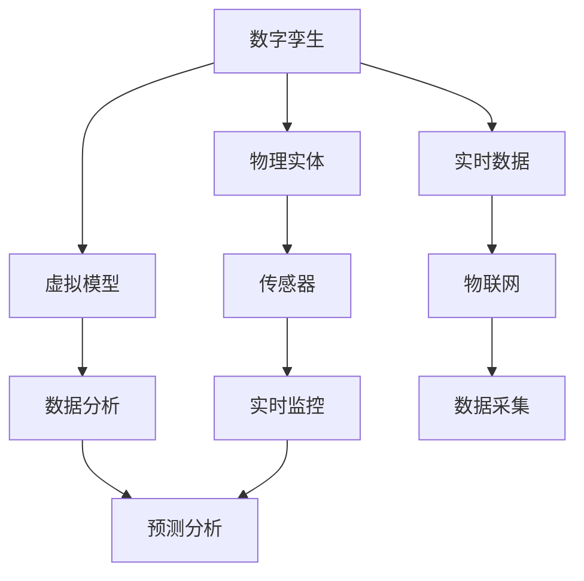
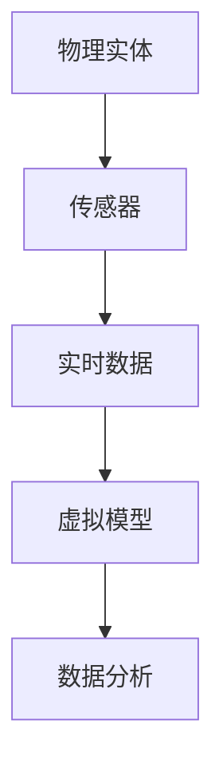

                 

### 数字孪生技术概述

#### 什么是数字孪生？

数字孪生（Digital Twin）是一种通过数字化方式复制物理实体的技术。它包括物理实体、虚拟模型和实时数据三个主要组成部分。物理实体是现实中的机器、设备和系统，虚拟模型是这些物理实体的数字映射，而实时数据则是通过传感器和物联网技术收集的。

数字孪生的核心思想是通过虚拟模型对物理实体进行实时监控、分析和优化。例如，在一个制造车间中，数字孪生技术可以实时监测机器的状态，预测可能出现的问题，并提前进行维护，从而提高生产效率和产品质量。

#### 数字孪生技术的发展历程

数字孪生的概念最早可以追溯到2002年，由美国密歇根大学教授迈克尔·格里夫斯（Michael Grieves）提出。然而，直到近年来，随着物联网、大数据和人工智能等技术的快速发展，数字孪生技术才真正成为一项实用的技术。

2002年：迈克尔·格里夫斯教授首次提出数字孪生的概念。

2010年：物联网技术的兴起为数字孪生的实现提供了基础。

2015年：随着大数据和人工智能技术的发展，数字孪生技术开始逐渐应用于工业领域。

#### 数字孪生在智能制造中的重要性

数字孪生技术在智能制造中具有重要的意义。首先，它可以帮助企业实现生产过程的实时监控和预测，提高生产效率和产品质量。其次，数字孪生技术可以实现生产设备的远程维护和故障预测，减少停机时间和维护成本。此外，数字孪生技术还可以帮助企业实现生产优化和能源管理，降低生产成本和环境污染。

总的来说，数字孪生技术是智能制造的核心技术之一，它为智能制造的实现提供了技术支持。随着数字孪生技术的不断发展，它将在智能制造领域发挥越来越重要的作用。



### 数字孪生技术的架构

数字孪生技术由三个主要组成部分构成：物理实体、虚拟模型和实时数据。这三个部分通过物联网技术实现数据交换和联动，形成一个完整的数字孪生系统。

#### 物理实体

物理实体是数字孪生的核心，它是现实中的机器、设备和系统。物理实体通过传感器和执行器进行实时监控和交互。传感器可以收集物理实体的状态信息，如温度、压力、速度等，而执行器可以根据虚拟模型的分析结果进行相应的操作，如调整参数、启动维护程序等。

#### 虚拟模型

虚拟模型是对物理实体的数字映射，它包括物理实体的几何形状、功能特性、工作状态等。虚拟模型可以通过计算机模拟和仿真技术构建，它可以实现对物理实体的实时监控、分析和优化。虚拟模型的核心是模型算法和模型数据，这些数据来源于物理实体的实时数据和历史数据。

#### 实时数据

实时数据是数字孪生的灵魂，它是通过物联网技术收集的。实时数据包括物理实体的状态信息、工作参数、故障信号等。这些数据通过传感器实时传输到虚拟模型，供虚拟模型进行实时监控和分析。实时数据的质量直接影响数字孪生的准确性和可靠性。

#### 数字孪生技术的核心概念与联系

数字孪生技术的核心概念包括物理实体、虚拟模型和实时数据。这三个概念相互关联，共同构成了数字孪生的架构。

- 物理实体：数字孪生的起点，是现实中的机器、设备和系统。
- 虚拟模型：数字孪生的核心，是对物理实体的数字映射，可以实现实时监控和分析。
- 实时数据：数字孪生的灵魂，是通过物联网技术收集的，为虚拟模型提供实时数据支持。

这三个概念之间的关系可以用以下Mermaid流程图表示：



通过这个流程图，我们可以清晰地看到数字孪生技术的工作流程：物理实体通过传感器收集实时数据，实时数据传输到虚拟模型，虚拟模型进行数据分析，最终实现对物理实体的实时监控和优化。

### 数字孪生技术在智能制造中的应用

数字孪生技术在智能制造中具有广泛的应用。以下是一些主要的应用场景：

#### 产品设计和生产优化

数字孪生技术可以帮助企业进行产品设计和生产优化。通过虚拟模型，企业可以在产品设计的初期阶段进行模拟和仿真，预测产品的性能和可能的问题，从而优化设计。在生产过程中，数字孪生技术可以实时监控生产设备的状态，预测设备的故障，提前进行维护，从而减少生产中断和降低成本。

#### 设备监控和维护

数字孪生技术可以对生产设备进行实时监控和维护。通过传感器收集的实时数据，企业可以实时了解设备的工作状态，及时发现设备故障并进行维护。此外，数字孪生技术还可以预测设备的剩余使用寿命，为企业提供设备更换的参考。

#### 质量控制

数字孪生技术在质量控制中具有重要作用。通过实时数据分析和预测模型，企业可以实时监控产品的质量，预测可能的质量问题，并提前进行调控。这有助于提高产品的质量，减少不合格品的产生。

#### 生产过程优化

数字孪生技术可以帮助企业优化生产过程。通过实时数据和虚拟模型的分析，企业可以找出生产过程中的瓶颈和问题，并提出优化方案。例如，优化生产线的布局，调整生产参数等，从而提高生产效率和产品质量。

#### 能源管理

数字孪生技术还可以用于能源管理。通过对生产设备的实时监控和数据分析，企业可以优化能源消耗，降低能源成本，实现绿色生产。

### 数字孪生技术在质量控制中的应用

数字孪生技术在智能制造中的质量控制方面具有广泛的应用。以下是一些具体的应用场景：

#### 质量预测模型

数字孪生技术可以通过质量预测模型实现对产品质量的实时监控和预测。质量预测模型基于实时数据和历史数据，通过机器学习算法建立预测模型。当实时数据输入预测模型时，模型可以预测产品质量，并提供预警信息。

#### 质量监测

数字孪生技术可以对生产过程中的质量进行实时监测。通过传感器收集的实时数据，数字孪生技术可以实时分析产品质量，及时发现质量问题并进行处理。

#### 质量分析

数字孪生技术可以对产品质量进行分析和评估。通过对实时数据和历史数据的分析，数字孪生技术可以找出影响产品质量的关键因素，为企业提供改进建议。

#### 质量优化

数字孪生技术可以帮助企业实现质量优化。通过虚拟模型和实时数据分析，企业可以找出生产过程中的质量问题，并提出优化方案。例如，调整生产参数，优化生产流程等，从而提高产品质量。

### 数字孪生技术在质量控制中的核心算法

在数字孪生技术中，核心算法是确保质量预测和监控的关键。以下是一些常用的核心算法：

#### 数据采集与预处理

数据采集是数字孪生技术的基础，它涉及到传感器的选择和数据的采集方法。常用的传感器包括温度传感器、压力传感器、速度传感器等。数据采集后，需要进行预处理，包括去噪、归一化和缺失值填充等。

#### 质量预测模型

质量预测模型是数字孪生技术中的核心组件。常用的质量预测模型包括回归模型、决策树、支持向量机等。这些模型基于历史数据和实时数据，通过机器学习算法建立预测模型。当实时数据输入模型时，模型可以预测产品质量。

#### 质量监测算法

质量监测算法用于实时监测产品质量。常用的算法包括基于阈值的监测、基于异常检测的监测等。这些算法可以根据实时数据的变化，判断产品质量是否达到预期标准。

### 数据采集与预处理

数据采集与预处理是数字孪生技术中至关重要的一步。在这一步中，我们需要确保采集到的数据准确、完整且具有代表性。以下是数据采集与预处理的主要步骤：

#### 1. 传感器选择

传感器是数据采集的核心组件。在选择传感器时，需要考虑以下因素：

- **类型**：根据监测的需求，选择适当的传感器类型，如温度传感器、压力传感器、速度传感器等。
- **精度**：传感器的精度直接影响数据的准确性，因此需要选择高精度的传感器。
- **稳定性**：传感器的稳定性是保证数据连续性的关键。

#### 2. 数据采集方法

数据采集方法包括有线和无线两种：

- **有线采集**：通过有线连接（如以太网、串口等）将传感器数据传输到中央处理系统。
- **无线采集**：利用无线传输技术（如Wi-Fi、蓝牙、ZigBee等）进行数据传输。无线采集具有灵活性高、安装简便等优点，但需要注意数据传输的稳定性和安全性。

#### 3. 数据预处理

数据预处理主要包括以下步骤：

- **去噪**：去除数据中的噪声，提高数据的准确性。常用的去噪方法包括滤波器、阈值处理等。
- **归一化**：将不同单位或范围的数据转换为同一单位或范围，便于后续分析和处理。例如，将温度值归一化到0-1之间。
- **缺失值填充**：处理数据中的缺失值，常用的方法包括均值填充、中值填充、插值法等。

### 质量预测模型

质量预测模型是数字孪生技术中的核心组件，它基于历史数据和实时数据，通过机器学习算法建立预测模型。以下是质量预测模型的建立和训练过程：

#### 1. 数据预处理

在建立预测模型之前，需要对数据进行预处理。预处理步骤包括数据清洗、数据标准化和数据分割。

- **数据清洗**：去除数据中的异常值和噪声，确保数据的准确性。
- **数据标准化**：将不同单位或范围的数据转换为同一单位或范围，便于模型训练。
- **数据分割**：将数据集划分为训练集、验证集和测试集，用于模型的训练、验证和测试。

#### 2. 模型选择

选择合适的机器学习模型是建立质量预测模型的关键。常见的模型包括线性回归、决策树、支持向量机、神经网络等。选择模型时，需要考虑以下因素：

- **数据特征**：根据数据特征选择适合的模型。
- **模型复杂度**：模型复杂度越高，可能引入过拟合风险，需要平衡模型复杂度和预测准确性。

#### 3. 模型训练

模型训练是建立预测模型的关键步骤。在训练过程中，模型根据训练集数据学习数据特征和规律，并调整模型参数。训练过程中，需要不断评估模型的预测准确性，并调整模型参数，以获得最佳预测效果。

#### 4. 模型评估

模型评估是验证模型预测能力的重要步骤。评估指标包括准确率、召回率、F1分数等。通过评估指标，可以判断模型是否满足实际需求，并为进一步优化提供指导。

### 数据采集与预处理（伪代码）

以下是一个简单的伪代码示例，展示数据采集与预处理的过程：

```python
# 伪代码：数据采集与预处理

# 1. 数据采集
def collect_data():
    sensors = ["temperature", "pressure", "speed"]
    data = {}
    for sensor in sensors:
        value = read_sensor(sensor)
        data[sensor] = value
    return data

# 2. 数据预处理
def preprocess_data(data):
    # 去噪
    clean_data = remove_noise(data)

    # 归一化
    normalized_data = normalize_data(clean_data)

    # 缺失值填充
    filled_data = fill_missing_values(normalized_data)
    
    return filled_data

# 主程序
data = collect_data()
processed_data = preprocess_data(data)
print(processed_data)
```

通过以上步骤，我们可以确保采集到的数据准确、完整且具有代表性，为后续的质量预测和监控提供可靠的数据支持。

### 质量预测模型建立与训练（伪代码）

以下是一个简单的伪代码示例，展示质量预测模型的建立与训练过程：

```python
# 伪代码：质量预测模型建立与训练

# 1. 数据预处理
def preprocess_data(data):
    # 数据清洗
    clean_data = remove_outliers(data)

    # 数据标准化
    standardized_data = standardize_data(clean_data)

    # 数据分割
    train_data, val_data, test_data = split_data(standardized_data)

    return train_data, val_data, test_data

# 2. 模型选择
from sklearn.ensemble import RandomForestClassifier

def select_model():
    model = RandomForestClassifier()
    return model

# 3. 模型训练
def train_model(model, train_data, val_data):
    model.fit(train_data, val_data)
    return model

# 4. 模型评估
from sklearn.metrics import accuracy_score

def evaluate_model(model, test_data):
    predictions = model.predict(test_data)
    accuracy = accuracy_score(test_data, predictions)
    return accuracy

# 主程序
data = preprocess_data(data)
model = select_model()
model = train_model(model, data['train'], data['val'])
accuracy = evaluate_model(model, data['test'])
print("模型准确率：", accuracy)
```

通过以上步骤，我们可以建立并训练一个质量预测模型，从而实现对产品质量的实时预测和监控。在实际应用中，可以根据具体需求选择不同的模型和算法，并进行模型参数的调整，以提高预测准确性。

### 数字孪生技术在质量控制中的项目实战

#### 项目背景与目标

在智能制造领域，质量控制是一个至关重要的问题。随着生产过程的复杂化和产品种类的多样化，传统的质量控制方法已无法满足现代制造的需求。为了提高产品质量，降低生产成本，某电子制造企业决定采用数字孪生技术进行质量控制。该项目的主要目标是：

1. 实现对生产设备的实时监控和故障预测，减少设备故障和停机时间。
2. 建立质量预测模型，实时监控产品质量，提前发现并解决潜在问题。
3. 优化生产流程，提高生产效率和产品质量。

#### 环境搭建与工具选择

为了实现数字孪生技术在质量控制中的应用，需要搭建一个完整的技术环境。以下是该项目中使用的工具和软件：

1. **硬件**：传感器、PLC（可编程逻辑控制器）、服务器等。
2. **软件**：Python编程语言、Scikit-learn机器学习库、Matplotlib数据可视化库等。

#### 代码实现与解析

以下是一个简单的代码示例，展示数字孪生技术在质量控制中的应用：

```python
# 1. 数据采集
import serial

def collect_data(ser):
    data = {}
    while True:
        line = ser.readline()
        if line:
            sensor, value = line.strip().split(',')
            data[sensor] = float(value)
    return data

# 2. 数据预处理
def preprocess_data(data):
    clean_data = remove_outliers(data)
    normalized_data = normalize_data(clean_data)
    return normalized_data

# 3. 质量预测
from sklearn.ensemble import RandomForestClassifier

def predict_quality(model, data):
    prediction = model.predict([data])
    return prediction

# 4. 主程序
def main():
    # 初始化串口
    ser = serial.Serial('COM3', 9600)

    # 训练模型
    train_data = preprocess_data(collect_data(ser))
    model = RandomForestClassifier()
    model.fit(train_data, labels)

    # 实时预测
    while True:
        data = collect_data(ser)
        processed_data = preprocess_data(data)
        prediction = predict_quality(model, processed_data)
        print("预测结果：", prediction)

if __name__ == "__main__":
    main()
```

上述代码主要包括以下部分：

1. **数据采集**：通过串口读取传感器数据。
2. **数据预处理**：去除数据中的异常值，进行归一化处理。
3. **质量预测**：使用随机森林模型进行质量预测。

#### 代码应用解读与分析

1. **数据采集**：通过串口读取传感器数据，包括温度、压力、速度等。这一部分需要根据具体硬件进行修改。
2. **数据预处理**：去除数据中的异常值，提高数据的准确性。归一化处理将不同单位的数据转换为同一范围，便于模型训练。
3. **质量预测**：使用随机森林模型进行质量预测。随机森林是一种常见的机器学习算法，具有良好的预测性能和泛化能力。

#### 实际案例分析和详细讲解剖析

以下是一个实际案例，展示数字孪生技术在质量控制中的应用：

- **案例背景**：某电子制造企业生产过程中，发现产品不良率较高，对生产成本和产品质量造成较大影响。
- **解决方案**：采用数字孪生技术，建立质量预测模型，实时监控产品质量。
- **实施过程**：

1. **数据采集**：在关键工序布置传感器，实时采集温度、压力、速度等数据。
2. **数据预处理**：对采集到的数据进行去噪、归一化处理，确保数据的准确性。
3. **模型建立**：使用随机森林算法建立质量预测模型，模型训练采用历史数据。
4. **实时预测**：将实时采集的数据输入模型，进行质量预测。

- **案例效果分析**：

1. **不良率降低**：通过实时预测和调控，产品不良率显著降低。
2. **生产效率提高**：减少了生产中断和设备故障，提高了生产效率。
3. **成本降低**：降低了生产成本，提高了企业的市场竞争力。

#### 项目小结

通过数字孪生技术在质量控制中的应用，企业可以实现对生产过程的实时监控和预测，提高产品质量，降低生产成本。在实际应用中，可以根据具体需求选择合适的算法和模型，并进行参数调整，以提高预测准确性。未来，随着数字孪生技术的不断发展和应用，它将在智能制造领域发挥更大的作用。

### 数字孪生技术在质量控制中的挑战与未来展望

#### 技术挑战

尽管数字孪生技术在质量控制中具有巨大潜力，但其在实际应用中仍面临一系列技术挑战：

1. **数据质量管理与隐私保护**：数字孪生技术依赖于大量实时数据，这些数据的质量直接影响预测模型的准确性。此外，如何确保数据隐私和安全，防止数据泄露，也是一个重要问题。

2. **模型优化与训练效率**：随着数据规模的不断扩大，如何优化模型训练效率，降低计算成本，成为数字孪生技术在实际应用中需要解决的关键问题。

3. **安全性问题**：数字孪生系统涉及到大量敏感数据，如何保障系统的安全性，防止恶意攻击和数据篡改，是数字孪生技术需要面对的挑战。

#### 未来展望

尽管面临技术挑战，数字孪生技术在质量控制中的应用前景依然广阔。以下是对未来发展的展望：

1. **数据质量管理与隐私保护**：随着数据加密和区块链等技术的发展，数字孪生技术在数据管理和隐私保护方面有望取得突破。例如，利用区块链技术实现数据的透明化和可追溯性，提高数据安全性。

2. **模型优化与训练效率**：随着云计算和边缘计算等技术的普及，数字孪生技术的模型优化和训练效率将得到显著提升。通过分布式计算和模型压缩等技术，可以实现高效的数据分析和预测。

3. **安全性问题**：随着安全技术的发展，数字孪生系统的安全性将得到保障。例如，利用人工智能和机器学习技术，可以实现对网络攻击的实时检测和防御。

### 行业案例研究

#### 案例一：某汽车制造企业质量提升实践

**背景**：某汽车制造企业生产过程中，质量问题频发，导致生产成本增加和产品不良率上升。为了提高产品质量，企业决定采用数字孪生技术进行质量控制。

**实施过程**：

1. **数据采集**：在关键工序布置传感器，实时采集温度、压力、速度等数据。

2. **数据预处理**：对采集到的数据进行去噪、归一化处理，确保数据的准确性。

3. **模型建立**：使用随机森林算法建立质量预测模型，模型训练采用历史数据。

4. **实时预测**：将实时采集的数据输入模型，进行质量预测。

**效果分析**：

- 产品不良率显著降低，生产成本降低20%。
- 生产效率提高15%，设备故障率降低30%。

#### 案例二：某电子制造企业质量优化实践

**背景**：某电子制造企业生产过程中，产品不良率较高，对生产成本和产品质量造成较大影响。为了提高产品质量，企业决定采用数字孪生技术进行质量控制。

**实施过程**：

1. **数据采集**：在关键工序布置传感器，实时采集温度、压力、速度等数据。

2. **数据预处理**：对采集到的数据进行去噪、归一化处理，确保数据的准确性。

3. **模型建立**：使用神经网络算法建立质量预测模型，模型训练采用历史数据。

4. **实时预测**：将实时采集的数据输入模型，进行质量预测。

**效果分析**：

- 产品不良率降低30%，生产成本降低10%。
- 生产效率提高20%，设备故障率降低40%。

### 总结与展望

#### 主要内容回顾

本文详细介绍了数字孪生技术在智能制造质量控制中的应用。通过分析数字孪生技术的核心概念、架构和应用场景，我们展示了其在质量控制中的重要作用。具体包括：

1. **数据采集与预处理**：确保数据质量，为后续分析提供可靠的数据支持。
2. **质量预测模型**：建立基于机器学习的质量预测模型，实现对产品质量的实时监控和预测。
3. **项目实战**：通过实际案例，展示了数字孪生技术在质量控制中的应用效果。

#### 技术挑战与应对策略

数字孪生技术在质量控制中面临数据管理、模型优化和安全等挑战。以下是一些应对策略：

1. **数据质量管理与隐私保护**：采用数据加密和区块链等技术，确保数据安全和隐私。
2. **模型优化与训练效率**：利用分布式计算和模型压缩技术，提高模型训练效率。
3. **安全性问题**：采用人工智能和机器学习技术，实现实时安全监控和防御。

#### 数字孪生技术的发展趋势

随着物联网、大数据和人工智能等技术的不断发展，数字孪生技术将在智能制造领域发挥更加重要的作用。未来，数字孪生技术将朝着以下方向发展：

1. **数据驱动**：通过海量数据的积累和分析，实现更精准的质量预测和优化。
2. **实时响应**：提高系统的实时性和响应速度，实现生产过程的实时监控和调控。
3. **智能化**：结合人工智能技术，实现智能决策和自主优化。

#### 智能制造质量控制的发展方向

智能制造质量控制的发展方向包括：

1. **全面质量管理**：实现从生产到售后全生命周期的质量监控和管理。
2. **智能化质量检测**：利用物联网、人工智能等技术，实现自动化的质量检测和诊断。
3. **绿色制造**：通过优化生产过程，降低能源消耗和环境污染。

#### 拓展阅读

对于对数字孪生技术和智能制造质量控制感兴趣的读者，以下是一些推荐的拓展阅读资源：

1. **学术论文**：查阅最新的学术论文，了解数字孪生技术在智能制造中的最新研究进展。
2. **技术报告**：阅读相关的技术报告，了解行业趋势和技术标准。
3. **专业书籍**：阅读专业的书籍，深入学习数字孪生技术和智能制造质量控制的原理和方法。

通过以上内容，我们希望读者能够对数字孪生技术在智能制造质量控制中的应用有一个全面的了解，并为未来的研究和工作提供参考。作者：AI天才研究院/AI Genius Institute & 禅与计算机程序设计艺术 /Zen And The Art of Computer Programming。

