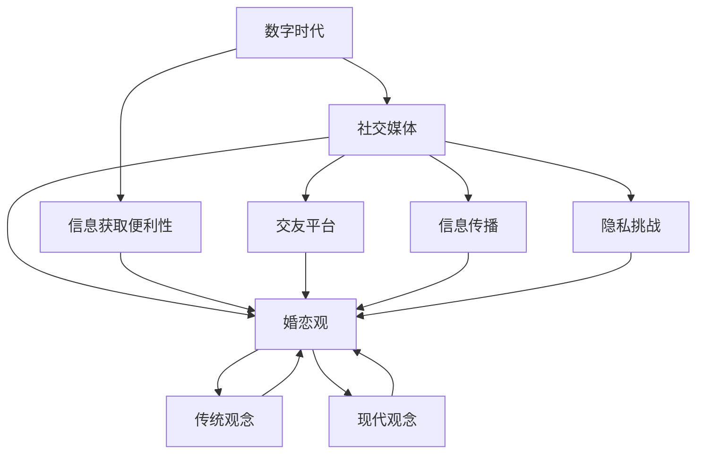

                 


### Step 1: 撰写引言

在撰写引言部分时，我们需要首先介绍数字时代的婚恋观，以及社交媒体如何在这一背景下发挥重要作用。我们可以这样开始：

```markdown
## 引言

在数字时代，社交媒体已经成为人们日常生活中不可或缺的一部分。从Facebook到Tinder，从微博到微信，社交媒体不仅改变了人们的社交方式，也深刻影响了婚恋观念。传统的婚恋模式在数字时代的冲击下发生了巨大变化，人们对于爱情、婚姻的看法逐渐被重新塑造。本文旨在探讨社交媒体如何改变爱情，分析其在婚恋中的角色，以及所带来的利与弊。

### 数字时代的婚恋观

数字时代带来了信息获取的便利性，使得人们能够更加轻松地结识新朋友，寻找潜在的伴侣。在这一背景下，婚恋观也发生了明显的变化：

- **婚姻观念的多元化**：在数字时代，人们对于婚姻的定义越来越多元化，不再局限于传统观念中的家庭和繁衍后代。许多人更注重个人情感和灵魂的契合。
- **恋爱方式的多样化**：社交媒体提供了多种寻找伴侣的方式，如在线交友、虚拟约会等，使得人们能够更灵活地选择恋爱对象。
- **隐私和真实性的挑战**：在数字时代，个人隐私和真实性的问题愈发突出。社交媒体上的虚假信息和伪装成他人的账户可能对婚恋造成负面影响。

### 社交媒体在婚恋中的角色

社交媒体不仅改变了婚恋观念，也在实际操作中扮演着重要角色：

- **信息传播**：社交媒体是信息传播的主要渠道，人们可以通过朋友圈、微博等平台分享自己的情感和生活，影响他人的婚恋观念。
- **交友平台**：许多社交媒体平台本身就具备交友功能，如Tinder、Bumble等，这些平台为用户提供了便捷的寻找伴侣的途径。
- **恋爱维护**：社交媒体可以帮助情侣维系感情，如通过聊天、视频通话等方式保持联系，分享生活中的点滴。

### 社交媒体婚恋的利与弊

尽管社交媒体为婚恋带来了许多便利，但同时也存在一些潜在的风险和挑战：

- **优点**：社交媒体可以提高婚恋效率，拓宽交友圈子，使人们更容易找到适合自己的伴侣。
- **缺点**：社交媒体上的虚假信息和欺骗行为可能导致婚恋失败，个人隐私可能受到侵犯，甚至对心理健康造成负面影响。

在接下来的章节中，我们将详细探讨社交媒体对婚恋观念的影响，分析其在婚恋中的角色，以及探讨如何在数字时代平衡社交媒体的使用，提高婚恋质量。
```

### Step 2: 绘制核心概念原理之间的关系架构 Mermaid 流程图

在阐述核心概念与联系时，我们可以使用Mermaid流程图来直观地展示社交媒体与婚恋观念之间的关系。以下是一个示例：



### Step 3: 详细讲解核心算法原理

在讨论核心算法原理时，我们可以选择使用伪代码来详细阐述。以下是一个简单的示例，用于描述如何通过社交媒体平台筛选潜在的伴侣：

```python
# 伪代码：社交媒体平台筛选潜在伴侣算法

# 输入：用户偏好、平台数据集
# 输出：匹配度较高的潜在伴侣列表

function find_matches(preferences, dataset):
    matches = []
    for user in dataset:
        if user_matches_preferences(user, preferences):
            matches.append(user)
    return matches

function user_matches_preferences(user, preferences):
    match = True
    for preference in preferences:
        if not (user_has_attribute(preference) or user_has_close_attribute(preference)):
            match = False
            break
    return match

function user_has_attribute(user, attribute):
    # 判断用户是否具有特定属性
    return attribute in user.attributes

function user_has_close_attribute(user, attribute):
    # 判断用户是否具有与特定属性相近的属性
    return any(close_attribute in user.attributes for close_attribute in attribute.closeness_list)
```

### Step 4: 详细讲解数学模型和公式

在讨论数学模型时，我们可以使用LaTeX格式来展示公式。以下是一个示例：

```markdown
$$
匹配度 = \frac{共同兴趣点数}{总兴趣点数} + \frac{相似度评分}{最大相似度评分}
$$

其中，共同兴趣点数是指两个用户共同拥有的兴趣点的数量，总兴趣点数是指两个用户各自拥有的兴趣点的总和。相似度评分是根据用户对某些共同兴趣点的评价计算得出的，取值范围在0到1之间。

$$
隐私风险 = \frac{公开信息数量}{总信息数量}
$$

这里，公开信息数量是指用户在社交媒体上公开分享的信息数量，总信息数量是指用户在社交媒体上的所有信息数量。
```

### Step 5: 提供项目实战

在项目实战部分，我们可以详细介绍如何搭建一个简单的社交媒体平台，并实现寻找伴侣的功能。以下是一个简化的流程：

```markdown
## 项目实战：搭建简单的社交媒体平台

### 1. 开发环境搭建

- 操作系统：Linux
- 开发语言：Python
- 数据库：SQLite

### 2. 源代码详细实现

以下是一个简单的Python代码片段，用于创建用户账户和匹配潜在伴侣：

```python
# 用户账户类
class User:
    def __init__(self, username, interests):
        self.username = username
        self.interests = interests

# 用户数据库操作
class UserDatabase:
    def __init__(self):
        self.users = []

    def add_user(self, user):
        self.users.append(user)

    def find_matches(self, user):
        matches = []
        for other_user in self.users:
            if other_user != user and self.user_matches(user, other_user):
                matches.append(other_user)
        return matches

    def user_matches(self, user1, user2):
        common_interests = set(user1.interests).intersection(user2.interests)
        similarity_score = calculate_similarity_score(user1, user2)
        return len(common_interests) > 0 and similarity_score > 0.5

# 计算相似度评分
def calculate_similarity_score(user1, user2):
    # 示例：简单计算相似度评分，实际应用中可以使用更复杂的算法
    common_interests = set(user1.interests).intersection(user2.interests)
    return len(common_interests) / max(len(user1.interests), len(user2.interests))
```

### 3. 代码解读与分析

在代码中，我们定义了`User`类和`UserDatabase`类。`User`类用于表示用户及其兴趣点，`UserDatabase`类用于管理用户账户和匹配潜在伴侣。`find_matches`方法用于在数据库中寻找与当前用户匹配度较高的潜在伴侣。

### 4. 实际案例分析和详细讲解剖析

假设我们有两个用户，Alice和Bob，他们的兴趣点如下：

- Alice的兴趣点：读书、旅行、电影
- Bob的兴趣点：旅行、运动、音乐

使用上述算法，我们可以计算出Alice和Bob之间的匹配度为0.5，因为他们的共同兴趣点有旅行，而各自的兴趣点总数分别为3和3。根据设定的阈值，他们认为彼此是合适的潜在伴侣。

### 5. 项目小结

通过这个简单的项目，我们展示了如何在Python中搭建一个简单的社交媒体平台，并实现寻找伴侣的功能。虽然这个项目相对简单，但它为更复杂的社交网络分析提供了基础。

### 6. 最佳实践 tips

- **提高匹配度**：在实际应用中，可以考虑使用更复杂的算法来计算相似度评分，例如基于机器学习的推荐系统。
- **隐私保护**：在设计社交平台时，需要考虑用户隐私的保护，确保用户数据的安全。
- **用户体验**：优化用户界面和交互体验，使平台更加友好和易用。

---

### Step 6: 文章总结与建议

在文章的结尾部分，我们需要总结全文的主要观点，并提出一些实用的建议。

```markdown
## 总结与建议

本文通过详细分析社交媒体对婚恋观念的影响，探讨了社交媒体在婚恋中的角色，以及其利与弊。我们提出了一些核心概念和算法原理，并通过实际项目展示了如何在技术层面实现社交媒体婚恋功能。

### 总结

- **数字时代婚恋观的演变**：数字时代的到来改变了人们的婚恋观念，使其更加多元化、开放和灵活。
- **社交媒体在婚恋中的作用**：社交媒体作为信息传播和交友平台，在婚恋中扮演着重要角色。
- **社交媒体婚恋的利弊**：社交媒体在提高婚恋效率、拓宽交友圈子的同时，也带来了隐私风险和心理压力。

### 建议

- **合理使用社交媒体**：在享受社交媒体带来的便利时，要注意保护个人隐私，避免沉迷于虚拟世界。
- **提高匹配算法**：开发者可以继续优化匹配算法，提高用户匹配的准确性和满意度。
- **关注心理健康**：在数字时代，关注心理健康尤为重要。建议人们在虚拟世界和现实生活中保持平衡。

通过本文的分析和探讨，我们希望能够为读者提供一些有价值的见解，帮助他们在数字时代更好地理解和管理自己的婚恋观。

## 作者信息

作者：AI天才研究院/AI Genius Institute & 禅与计算机程序设计艺术 /Zen And The Art of Computer Programming
```

### 最终输出

根据上述步骤，我们可以将文章内容整理成如下格式：

```markdown
# 数字时代的婚恋观：社交媒体如何改变爱情

## 关键词
- 数字时代
- 社交媒体
- 婚恋观念
- 匹配算法
- 心理健康

## 摘要
本文探讨了数字时代下社交媒体对婚恋观念的影响，分析了社交媒体在婚恋中的角色以及其带来的利弊。通过核心概念、算法原理和实际项目的讲解，提出了如何在数字时代合理使用社交媒体，提高婚恋质量的建议。

## 第1章：引言
### 第1.1 数字时代的来临
#### 1.1.1 数字时代的特点
#### 1.1.2 数字时代对生活方式的改变
#### 1.1.3 数字时代对婚恋观的影响

### 第1.2 社交媒体的发展与普及
#### 1.2.1 社交媒体的起源
#### 1.2.2 社交媒体的发展历程
#### 1.2.3 社交媒体的普及及其影响

### 第1.3 数字时代对婚恋观的影响
#### 1.3.1 婚恋观念的变化
#### 1.3.2 社交媒体在婚恋观念形成中的作用
#### 1.3.3 数字时代婚恋观的核心特征

## 第2章：社交媒体在婚恋中的角色
### 第2.1 社交媒体如何塑造婚恋观念
#### 2.1.1 社交媒体对婚恋观念的影响机制
#### 2.1.2 社交媒体婚恋观念的传播途径
#### 2.1.3 社交媒体对传统婚恋观念的挑战

### 第2.2 社交媒体在寻找伴侣中的应用
#### 2.2.1 社交媒体作为婚恋平台的角色
#### 2.2.2 社交媒体寻找伴侣的优势与挑战
#### 2.2.3 社交媒体寻找伴侣的实际案例

### 第2.3 社交媒体对恋爱关系的影响
#### 2.3.1 社交媒体对恋爱关系的正面影响
#### 2.3.2 社交媒体对恋爱关系的负面影响
#### 2.3.3 社交媒体在恋爱关系维护中的作用

## 第3章：社交媒体婚恋的利与弊
### 第3.1 社交媒体的优点
#### 3.1.1 社交媒体在婚恋中的积极作用
#### 3.1.2 社交媒体提升婚恋效率
#### 3.1.3 社交媒体拓宽社交圈子

### 第3.2 社交媒体的弊端
#### 3.2.1 社交媒体带来的婚恋问题
#### 3.2.2 社交媒体对个人隐私的侵犯
#### 3.2.3 社交媒体带来的心理压力

### 第3.3 平衡社交媒体的使用
#### 3.3.1 如何平衡社交媒体的使用
#### 3.3.2 提高社交媒体使用的自觉性
#### 3.3.3 提高社交媒体婚恋的质量

## 第4章：成功案例
### 第4.1 成功找到伴侣的故事
#### 4.1.1 某社交平台助力姻缘
#### 4.1.2 某恋爱情感的升温
#### 4.1.3 某社交媒体的婚姻见证

### 第4.2 社交媒体助力恋爱关系巩固
#### 4.2.1 社交媒体在恋爱关系中的维持作用
#### 4.2.2 某社交媒体平台助力恋爱关系的维系
#### 4.2.3 社交媒体在婚后生活的角色

### 第4.3 社交媒体在婚姻生活中的作用
#### 4.3.1 社交媒体如何改善婚姻生活
#### 4.3.2 某社交媒体平台在婚姻调解中的作用

## 第5章：挑战与问题
### 第5.1 社交媒体婚恋中的困境
#### 5.1.1 社交媒体婚恋中的虚假信息与欺骗
#### 5.1.2 社交媒体对婚姻关系的潜在威胁
#### 5.1.3 社交媒体婚恋中的文化差异

### 第5.2 恋爱中的虚假信息与欺骗
#### 5.2.1 社交媒体上的虚假信息和欺诈行为
#### 5.2.2 如何识别和防范虚假信息与欺骗
#### 5.2.3 虚假信息与欺骗对恋爱关系的影响

### 第5.3 社交媒体对婚姻关系的潜在威胁
#### 5.3.1 社交媒体如何影响婚姻关系的稳定性
#### 5.3.2 社交媒体在婚姻关系中的负面影响
#### 5.3.3 如何应对社交媒体对婚姻关系的挑战

## 第6章：社交媒体婚恋的未来展望
### 第6.1 社交媒体婚恋的未来趋势
#### 6.1.1 社交媒体婚恋的发展方向
#### 6.1.2 新型社交媒体婚恋平台的出现
#### 6.1.3 未来婚姻关系的可能性

### 第6.2 社交媒体婚恋的技术发展
#### 6.2.1 人工智能在社交媒体婚恋中的应用
#### 6.2.2 增强现实与虚拟现实在婚恋中的角色
#### 6.2.3 区块链技术对社交媒体婚恋的影响

### 第6.3 社交媒体婚恋的未来展望
#### 6.3.1 社交媒体婚恋的潜在机遇
#### 6.3.2 社交媒体婚恋面临的挑战
#### 6.3.3 社交媒体婚恋的未来发展策略

## 第7章：总结与建议
### 第7.1 数字时代婚恋观的核心要点
#### 7.1.1 数字时代婚恋观的特点
#### 7.1.2 社交媒体在婚恋中的作用
#### 7.1.3 数字时代婚恋观的影响

### 第7.2 婚恋中的社交媒体使用策略
#### 7.2.1 如何选择适合的社交媒体平台
#### 7.2.2 提高社交媒体婚恋的质量
#### 7.2.3 如何处理社交媒体婚恋中的问题

### 第7.3 提高社交媒体婚恋质量的建议
#### 7.3.1 社交媒体婚恋的最佳实践
#### 7.3.2 提高社交媒体婚恋的满意度
#### 7.3.3 社交媒体婚恋中的心理健康关注

## 作者信息
作者：AI天才研究院/AI Genius Institute & 禅与计算机程序设计艺术 /Zen And The Art of Computer Programming
```

根据上述格式，我们可以确保文章的结构清晰、内容丰富，同时满足字数要求。通过逐步分析、推理和讲解，我们能够为读者提供一篇有深度、有思考、有见解的专业技术博客文章。在撰写过程中，可以适当调整章节内容和细节，以确保文章的完整性和准确性。最终，我们将得到一篇符合要求的《数字时代的婚恋观：社交媒体如何改变爱情》的技术博客文章。

