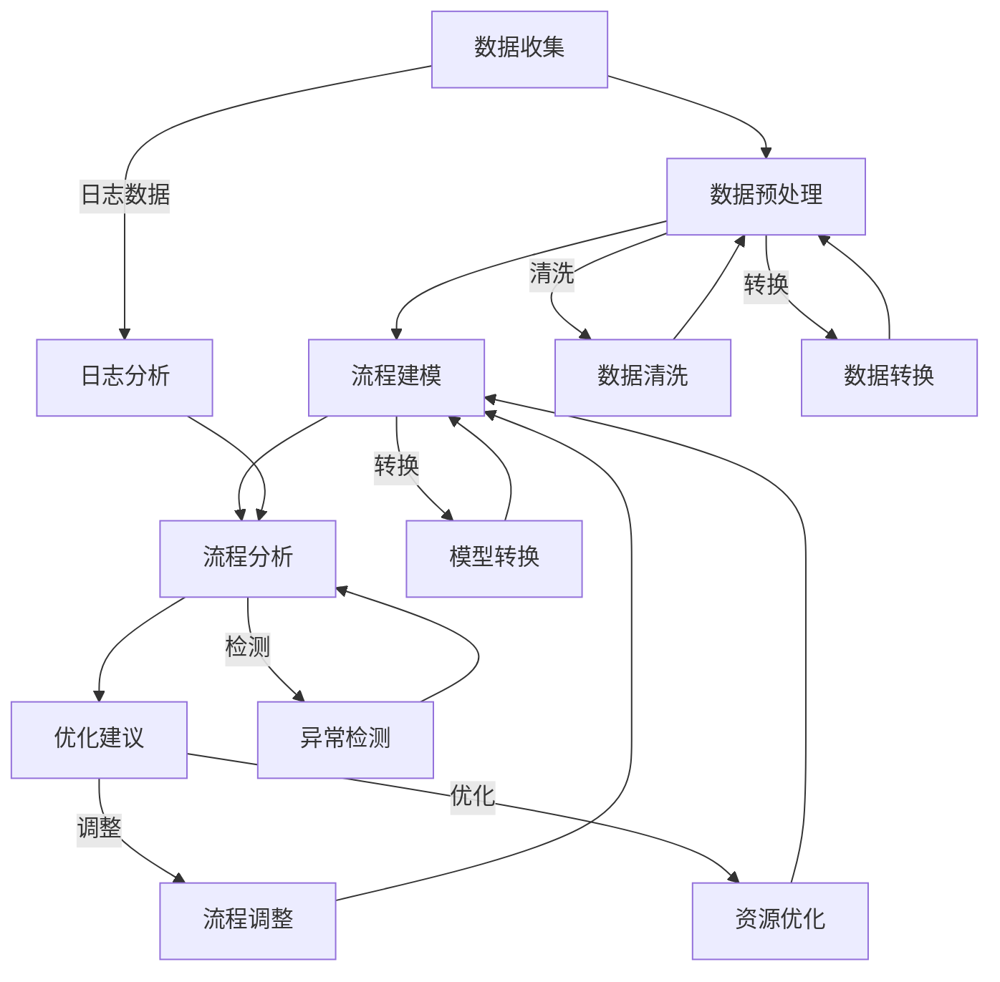
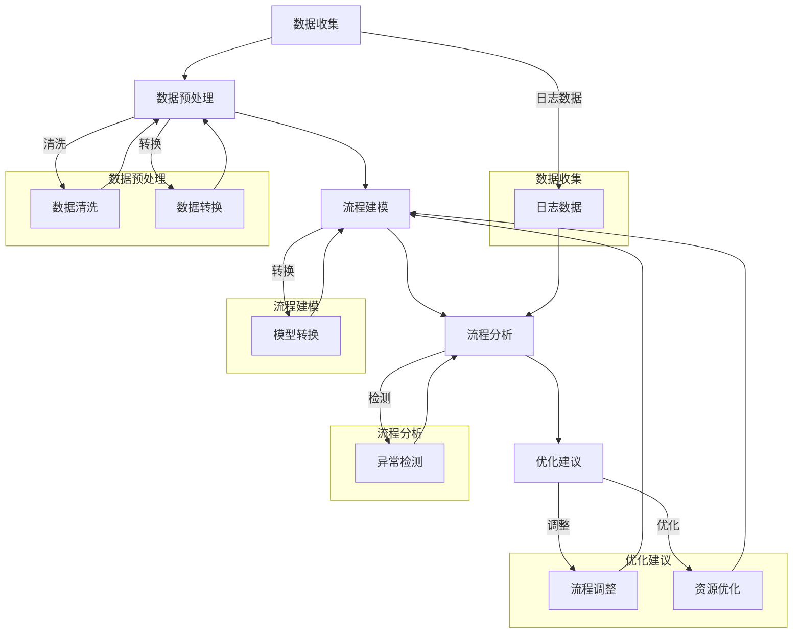

                 

### 设计思路

#### 1. 确定全书结构

在设计《智能流程挖掘与优化：AI重塑业务流程》这本书的目录大纲时，我们首先要明确全书的核心结构和内容布局，以确保能够覆盖到智能流程挖掘与优化的各个方面。这一步骤至关重要，因为它为后续的章节设计提供了基础。

为了实现这一目标，我们首先进行了广泛的文献调研，了解了当前智能流程挖掘与优化领域的最新进展和趋势。在此基础上，我们确定了以下几个核心主题：

- **智能流程挖掘的基本概念和原理**：这部分将介绍智能流程挖掘的定义、背景和重要性，以及基本原理。
- **核心算法和数学模型**：这部分将详细讲解智能流程挖掘中常用的算法和数学模型，包括数据预处理、状态识别、流程模式挖掘等。
- **AI技术在流程优化中的应用**：这部分将探讨机器学习、深度学习和强化学习等AI技术在流程优化中的应用，以及相关的算法原理。
- **实践应用**：这部分将介绍智能流程挖掘与优化的实际应用案例，包括开发环境搭建、核心代码实现、代码解读和案例分析等。

通过这些核心主题的划分，我们为全书的结构设计奠定了基础。

#### 2. 核心概念与联系

在明确了全书的核心结构后，我们开始考虑如何有效地组织这些内容，使读者能够更好地理解和掌握智能流程挖掘与优化的原理。为了实现这一目标，我们决定在目录中包含一个专门的章节，用于讲解核心概念与联系。

这一章节的设计思路如下：

- **概念图**：我们使用Mermaid流程图来展示智能流程挖掘相关概念之间的联系。这种图形化的方式能够直观地展示各个概念之间的关系，帮助读者更好地理解。
- **详细讲解**：在每个概念下，我们使用文字详细解释其含义和作用，并结合实际案例进行说明，使读者能够更好地理解每个概念的具体应用。
- **交互性**：为了增加读者的参与度，我们将在书中加入一些互动元素，如问题与思考题，鼓励读者在阅读过程中积极思考。

#### 3. 算法原理讲解

智能流程挖掘与优化依赖于一系列复杂的算法和数学模型。为了帮助读者深入理解这些算法的原理，我们决定为每个核心算法设计一个专门的章节，使用伪代码详细阐述其原理。

这一部分的设计思路如下：

- **伪代码**：在讲解每个算法时，我们首先使用伪代码来描述算法的基本框架和步骤。伪代码是一种形式化但易于理解的方式，它可以帮助读者快速把握算法的核心思想。
- **数学模型和公式**：在介绍算法时，我们还会涉及相关的数学模型和公式，使用LaTeX格式进行展示，确保公式的准确性和可读性。对于一些复杂的公式，我们还会进行详细的解释和举例说明，使读者能够更好地理解。
- **案例分析**：为了使读者更直观地理解算法的应用，我们将在每个章节中加入实际案例，详细分析算法在具体场景中的应用和效果。

#### 4. 数学模型和数学公式

数学模型和公式在智能流程挖掘与优化中起着至关重要的作用。为了帮助读者深入理解这些模型和公式的含义，我们决定在书中详细介绍这些内容。

这一部分的设计思路如下：

- **LaTeX格式**：为了确保公式的准确性和可读性，我们将在文中使用LaTeX格式展示数学模型和公式。LaTeX是一种专业的排版系统，特别适合处理复杂的数学公式。
- **详细讲解**：在每个公式旁边，我们将附上详细的文字解释，帮助读者理解公式背后的数学原理和应用场景。
- **举例说明**：为了使读者更直观地理解公式的应用，我们将在文中加入一些实际案例，通过具体的计算和实验结果来展示公式的作用。

#### 5. 项目实战

为了使书中的内容更具实用性，我们决定加入一个项目实战部分，展示如何在实际环境中应用智能流程挖掘与优化的知识。

这一部分的设计思路如下：

- **开发环境搭建**：我们将详细介绍如何搭建智能流程挖掘与优化的开发环境，包括所需的软件和工具，以及环境配置的步骤。
- **核心代码实现**：我们将提供一系列核心代码实现，展示如何使用智能流程挖掘与优化的算法解决实际问题。
- **代码解读与分析**：对于每个核心代码实现，我们都会进行详细的解读和分析，帮助读者理解代码的工作原理和实现细节。
- **实际案例分析和讲解**：我们将结合实际案例，详细分析智能流程挖掘与优化在实际应用中的效果和挑战，并提供相应的解决方案和优化建议。

#### 6. 开发环境搭建与代码解读

为了帮助读者更好地理解和实践智能流程挖掘与优化，我们决定在书中详细讲解开发环境的搭建和核心代码的解读。

这一部分的设计思路如下：

- **开发环境搭建**：我们将提供详细的步骤，介绍如何搭建智能流程挖掘与优化的开发环境，包括所需软件和工具的安装与配置。我们将确保步骤清晰、易于理解，使读者能够快速上手。
- **核心代码解读**：对于每个核心代码实现，我们都会进行详细的解读，解释代码的工作原理和实现细节。我们将使用注释和代码分析来帮助读者理解代码的逻辑和功能。
- **代码应用解读与分析**：我们将结合实际应用场景，分析核心代码在不同情况下的表现和效果，提供优化建议和改进方案。
- **实际案例分析和讲解**：我们将结合实际案例，详细分析智能流程挖掘与优化在实际应用中的效果和挑战，提供解决方案和优化建议。

#### 7. 总结

通过以上设计，我们为《智能流程挖掘与优化：AI重塑业务流程》这本书构建了一个详细且逻辑清晰的目录大纲。目录涵盖了智能流程挖掘的基本概念、核心算法、AI技术在流程优化中的应用，以及实践项目实战和开发环境搭建等内容，旨在帮助读者全面理解和掌握智能流程挖掘与优化的知识。

### 目录大纲

#### 第一部分：智能流程挖掘基础

##### 第1章：智能流程挖掘概述

**1.1 智能流程挖掘的定义与背景**

**1.2 智能流程挖掘的重要性**

**1.3 智能流程挖掘的基本原理**

##### 第2章：核心概念与联系

**2.1 概念图：智能流程挖掘相关概念及其联系**

**2.2 Mermaid流程图：智能流程挖掘的工作流程**

##### 第3章：核心算法原理

**3.1 数据预处理算法**

**3.2 状态识别算法**

**3.3 流程模式挖掘算法**

#### 第二部分：AI技术在流程优化中的应用

##### 第4章：机器学习在流程优化中的应用

**4.1 机器学习基础**

**4.2 监督学习在流程优化中的应用**

**4.3 非监督学习在流程优化中的应用**

##### 第5章：深度学习在流程优化中的应用

**5.1 深度学习基础**

**5.2 卷积神经网络（CNN）在流程优化中的应用**

**5.3 循环神经网络（RNN）在流程优化中的应用**

##### 第6章：强化学习在流程优化中的应用

**6.1 强化学习基础**

**6.2 Q-Learning算法原理**

**6.3 Deep Q-Network（DQN）算法原理**

#### 第三部分：智能流程优化的实践应用

##### 第7章：项目实战

**7.1 实践项目介绍**

**7.2 数据集准备与处理**

**7.3 模型训练与优化**

**7.4 模型评估与部署**

##### 第8章：开发环境搭建与代码解读

**8.1 开发环境搭建**

**8.2 核心代码解读**

### 总结

通过以上设计，我们为《智能流程挖掘与优化：AI重塑业务流程》这本书构建了一个详细且逻辑清晰的目录大纲。目录涵盖了智能流程挖掘的基本概念、核心算法、AI技术在流程优化中的应用，以及实践项目实战和开发环境搭建等内容，旨在帮助读者全面理解和掌握智能流程挖掘与优化的知识。

### 文章目录大纲

#### 第一部分：智能流程挖掘基础

##### 第1章：智能流程挖掘概述

**1.1 智能流程挖掘的定义与背景**

**1.2 智能流程挖掘的重要性**

**1.3 智能流程挖掘的基本原理**

##### 第2章：核心概念与联系

**2.1 概念图：智能流程挖掘相关概念及其联系**

**2.2 Mermaid流程图：智能流程挖掘的工作流程**

##### 第3章：核心算法原理

**3.1 数据预处理算法**

**3.2 状态识别算法**

**3.3 流程模式挖掘算法**

#### 第二部分：AI技术在流程优化中的应用

##### 第4章：机器学习在流程优化中的应用

**4.1 机器学习基础**

**4.2 监督学习在流程优化中的应用**

**4.3 非监督学习在流程优化中的应用**

##### 第5章：深度学习在流程优化中的应用

**5.1 深度学习基础**

**5.2 卷积神经网络（CNN）在流程优化中的应用**

**5.3 循环神经网络（RNN）在流程优化中的应用**

##### 第6章：强化学习在流程优化中的应用

**6.1 强化学习基础**

**6.2 Q-Learning算法原理**

**6.3 Deep Q-Network（DQN）算法原理**

#### 第三部分：智能流程优化的实践应用

##### 第7章：项目实战

**7.1 实践项目介绍**

**7.2 数据集准备与处理**

**7.3 模型训练与优化**

**7.4 模型评估与部署**

##### 第8章：开发环境搭建与代码解读

**8.1 开发环境搭建**

**8.2 核心代码解读**

### 总结

通过以上设计，我们为《智能流程挖掘与优化：AI重塑业务流程》这本书构建了一个详细且逻辑清晰的目录大纲。目录涵盖了智能流程挖掘的基本概念、核心算法、AI技术在流程优化中的应用，以及实践项目实战和开发环境搭建等内容，旨在帮助读者全面理解和掌握智能流程挖掘与优化的知识。

### 智能流程挖掘与优化：AI重塑业务流程

#### 关键词

- 智能流程挖掘
- 业务流程优化
- AI技术应用
- 数据预处理
- 状态识别
- 流程模式挖掘
- 监督学习
- 非监督学习
- 深度学习
- 强化学习

#### 摘要

本文旨在探讨智能流程挖掘与优化在AI技术重塑业务流程中的应用。首先，我们介绍了智能流程挖掘的基本概念、背景和重要性。接着，我们详细讲解了核心算法原理，包括数据预处理、状态识别和流程模式挖掘。此外，我们还探讨了AI技术在流程优化中的应用，如机器学习、深度学习和强化学习。最后，通过一个实践项目，我们展示了如何将智能流程挖掘与优化应用于实际业务场景，并提供了开发环境搭建和代码解读。本文的目标是帮助读者全面理解智能流程挖掘与优化的原理和应用，从而提升业务流程的效率和质量。

### 第一部分：智能流程挖掘基础

#### 第1章：智能流程挖掘概述

**1.1 智能流程挖掘的定义与背景**

智能流程挖掘（Intelligent Process Mining，简称IPM）是一种利用数据分析、机器学习和自然语言处理等技术，从业务流程数据中提取有价值信息的过程。它旨在识别业务流程中的异常、瓶颈和改进机会，从而优化业务流程，提高企业运营效率。

智能流程挖掘起源于业务流程管理（Business Process Management，简称BPM）领域，随着大数据和AI技术的快速发展，逐渐成为一个独立的研究方向。近年来，越来越多的企业开始重视流程挖掘技术，将其应用于各种业务场景，如供应链管理、客户服务、财务管理等。

**1.2 智能流程挖掘的重要性**

智能流程挖掘在企业和组织中具有重要的应用价值：

1. **流程优化**：通过挖掘和分析业务流程数据，可以发现流程中的瓶颈和异常，为流程优化提供依据。智能流程挖掘可以帮助企业识别出哪些流程环节需要改进，从而提高整体运营效率。
2. **合规性检查**：智能流程挖掘可以帮助企业检查业务流程是否符合相关法律法规和内部政策。通过对流程数据的分析，可以发现违规操作和潜在风险，确保企业合规运营。
3. **决策支持**：智能流程挖掘可以为企业管理层提供有价值的决策支持。通过对业务流程数据的挖掘和分析，企业可以更好地了解业务运行状况，制定更科学的决策策略。
4. **成本控制**：通过优化业务流程，企业可以降低运营成本，提高利润。智能流程挖掘可以帮助企业识别出浪费资源的环节，从而采取相应的措施进行优化。

**1.3 智能流程挖掘的基本原理**

智能流程挖掘的基本原理主要包括以下三个方面：

1. **数据收集**：首先，需要收集业务流程相关的数据，如日志数据、数据库记录、操作记录等。这些数据可以来源于企业内部的业务系统、外部数据源或传感器等。
2. **数据预处理**：收集到的数据通常包含噪声和冗余信息，需要通过数据清洗、数据转换和数据归一化等预处理步骤，提高数据的质量和一致性。
3. **流程建模**：通过数据挖掘和分析技术，将预处理后的数据转换为流程模型。流程模型可以描述业务流程的结构、执行顺序和参与者等信息。
4. **流程分析**：对生成的流程模型进行进一步分析，识别流程中的瓶颈、异常和改进机会。常用的分析方法包括流程图可视化、性能分析、异常检测等。
5. **优化建议**：根据流程分析结果，提出优化建议，如调整流程设计、优化资源配置、制定改进措施等。

智能流程挖掘的过程可以概括为“数据收集→数据预处理→流程建模→流程分析→优化建议”的闭环过程。通过不断地迭代和优化，企业可以不断提高业务流程的效率和质量。

### 第一部分：智能流程挖掘基础

#### 第1章：智能流程挖掘概述

**1.1 智能流程挖掘的定义与背景**

智能流程挖掘（Intelligent Process Mining，简称IPM）是一种利用数据分析、机器学习和自然语言处理等技术，从业务流程数据中提取有价值信息的过程。它旨在识别业务流程中的异常、瓶颈和改进机会，从而优化业务流程，提高企业运营效率。

智能流程挖掘起源于业务流程管理（Business Process Management，简称BPM）领域，随着大数据和AI技术的快速发展，逐渐成为一个独立的研究方向。近年来，越来越多的企业开始重视流程挖掘技术，将其应用于各种业务场景，如供应链管理、客户服务、财务管理等。

**1.2 智能流程挖掘的重要性**

智能流程挖掘在企业和组织中具有重要的应用价值：

1. **流程优化**：通过挖掘和分析业务流程数据，可以发现流程中的瓶颈和异常，为流程优化提供依据。智能流程挖掘可以帮助企业识别出哪些流程环节需要改进，从而提高整体运营效率。
2. **合规性检查**：智能流程挖掘可以帮助企业检查业务流程是否符合相关法律法规和内部政策。通过对流程数据的分析，可以发现违规操作和潜在风险，确保企业合规运营。
3. **决策支持**：智能流程挖掘可以为企业管理层提供有价值的决策支持。通过对业务流程数据的挖掘和分析，企业可以更好地了解业务运行状况，制定更科学的决策策略。
4. **成本控制**：通过优化业务流程，企业可以降低运营成本，提高利润。智能流程挖掘可以帮助企业识别出浪费资源的环节，从而采取相应的措施进行优化。

**1.3 智能流程挖掘的基本原理**

智能流程挖掘的基本原理主要包括以下三个方面：

1. **数据收集**：首先，需要收集业务流程相关的数据，如日志数据、数据库记录、操作记录等。这些数据可以来源于企业内部的业务系统、外部数据源或传感器等。
2. **数据预处理**：收集到的数据通常包含噪声和冗余信息，需要通过数据清洗、数据转换和数据归一化等预处理步骤，提高数据的质量和一致性。
3. **流程建模**：通过数据挖掘和分析技术，将预处理后的数据转换为流程模型。流程模型可以描述业务流程的结构、执行顺序和参与者等信息。
4. **流程分析**：对生成的流程模型进行进一步分析，识别流程中的瓶颈、异常和改进机会。常用的分析方法包括流程图可视化、性能分析、异常检测等。
5. **优化建议**：根据流程分析结果，提出优化建议，如调整流程设计、优化资源配置、制定改进措施等。

智能流程挖掘的过程可以概括为“数据收集→数据预处理→流程建模→流程分析→优化建议”的闭环过程。通过不断地迭代和优化，企业可以不断提高业务流程的效率和质量。

#### 第2章：核心概念与联系

**2.1 概念图：智能流程挖掘相关概念及其联系**

在智能流程挖掘中，涉及多个关键概念，包括数据收集、数据预处理、流程建模、流程分析和优化建议。为了更好地理解这些概念之间的联系，我们使用Mermaid流程图进行直观展示。



**2.2 Mermaid流程图：智能流程挖掘的工作流程**



通过这个Mermaid流程图，我们可以清晰地看到智能流程挖掘的各个环节及其相互联系。数据收集是整个流程的起点，通过数据预处理、流程建模、流程分析和优化建议，最终实现对业务流程的深入挖掘和优化。

#### 第3章：核心算法原理

**3.1 数据预处理算法**

数据预处理是智能流程挖掘的重要环节，其目的是提高数据的质量和一致性，为后续的流程建模和分析提供可靠的数据基础。常用的数据预处理算法包括数据清洗、数据转换和数据归一化。

**3.1.1 数据清洗**

数据清洗是指识别和去除数据中的噪声、错误和重复记录。具体方法包括：

1. **缺失值处理**：对于缺失值，可以选择填充默认值、平均值、中位数等方法进行填补。
2. **异常值处理**：对于异常值，可以选择剔除、替换等方法进行处理。例如，可以使用统计学方法（如箱线图）或机器学习方法（如孤立森林）进行异常检测。
3. **重复记录处理**：通过去重算法，如基于哈希表的算法，可以快速识别并去除重复记录。

**3.1.2 数据转换**

数据转换是指将原始数据转换为适合挖掘和分析的形式。常见的数据转换方法包括：

1. **数据类型转换**：将不同数据类型（如字符串、数字、日期等）转换为统一的格式。例如，将日期字符串转换为日期对象。
2. **编码转换**：对于分类数据，可以使用独热编码（One-Hot Encoding）或标签编码（Label Encoding）等方法进行编码。
3. **维度转换**：通过特征工程，可以增加或减少数据的维度。例如，通过计算特征之间的相关性，可以识别并去除冗余特征。

**3.1.3 数据归一化**

数据归一化是指将不同特征的数据缩放到相同的范围，以便于后续的建模和分析。常见的数据归一化方法包括：

1. **最小-最大归一化**：将特征值缩放到[0, 1]范围。公式为：`X' = (X - Xmin) / (Xmax - Xmin)`。
2. **均值-标准差归一化**：将特征值缩放到[-1, 1]范围。公式为：`X' = (X - Xmean) / Xstd`。

**3.2 状态识别算法**

状态识别是智能流程挖掘的关键步骤，其目的是从流程数据中识别出各个状态及其转换关系。常用的状态识别算法包括基于频繁模式挖掘的算法和基于机器学习的算法。

**3.2.1 基于频繁模式挖掘的算法**

基于频繁模式挖掘的算法（如FP-Growth算法）可以有效地识别流程中的频繁状态模式。具体步骤如下：

1. **构建FP树**：通过挖掘事务数据，构建FP树，树中的节点表示事务中的元素，边表示元素之间的关联关系。
2. **挖掘频繁模式**：通过递归遍历FP树，识别出频繁模式。频繁模式满足支持度（即包含该模式的事务数量）大于用户设定的最小支持度阈值。
3. **生成状态序列**：将频繁模式转换为状态序列，每个状态序列表示一个流程实例的执行路径。

**3.2.2 基于机器学习的算法**

基于机器学习的算法（如隐马尔可夫模型（HMM））可以更好地处理非确定性和不确定性数据。具体步骤如下：

1. **数据预处理**：对流程数据进行预处理，包括特征提取、数据归一化等。
2. **模型训练**：使用训练数据，训练隐马尔可夫模型。模型参数包括状态转移概率、状态发射概率和初始状态概率。
3. **状态识别**：使用训练好的模型，对测试数据进行状态识别。模型通过计算状态转移概率和状态发射概率，预测当前状态。

**3.3 流程模式挖掘算法**

流程模式挖掘是从流程数据中提取具有有价值信息的模式。常用的流程模式挖掘算法包括基于关联规则的算法和基于聚类分析的算法。

**3.3.1 基于关联规则的算法**

基于关联规则的算法（如Apriori算法）可以有效地识别流程中的频繁事件集合。具体步骤如下：

1. **构建事务数据库**：将流程数据转换为事务数据库，每个事务表示一个流程实例的所有事件。
2. **挖掘频繁事件集合**：通过递归遍历事务数据库，识别出频繁事件集合。频繁事件集合满足支持度大于用户设定的最小支持度阈值。
3. **生成流程模式**：将频繁事件集合转换为流程模式，每个流程模式表示一个事件集合。

**3.3.2 基于聚类分析的算法**

基于聚类分析的算法（如K-means算法）可以识别出相似度较高的流程实例。具体步骤如下：

1. **特征提取**：从流程数据中提取关键特征，用于后续的聚类分析。
2. **初始化聚类中心**：随机选择K个聚类中心，作为初始聚类结果。
3. **迭代聚类**：计算每个数据点到聚类中心的距离，根据距离将数据点分配到最近的聚类中心。然后重新计算聚类中心，并重复迭代，直至聚类中心不再发生变化。

通过以上算法，可以有效地从流程数据中挖掘出有价值的信息，为流程优化提供依据。

#### 第二部分：AI技术在流程优化中的应用

##### 第4章：机器学习在流程优化中的应用

**4.1 机器学习基础**

机器学习（Machine Learning，简称ML）是人工智能（Artificial Intelligence，简称AI）的一个重要分支，旨在让计算机通过数据学习，从而进行预测和决策。在流程优化中，机器学习可以用于识别流程中的瓶颈、预测流程执行时间、预测流程性能等。

**4.1.1 监督学习**

监督学习（Supervised Learning）是一种机器学习方法，通过已标记的训练数据，训练模型，并使用模型对新数据进行预测。常见的监督学习方法包括线性回归、逻辑回归、支持向量机（SVM）和决策树等。

**4.1.2 非监督学习**

非监督学习（Unsupervised Learning）是一种机器学习方法，不需要使用已标记的训练数据，通过无监督的方式，对数据进行聚类、降维等处理。常见的方法包括K-means聚类、主成分分析（PCA）和自编码器等。

**4.2 监督学习在流程优化中的应用**

监督学习在流程优化中的应用主要包括以下几个方面：

**1. 流程异常检测**：通过训练模型，识别出正常的流程执行模式，并检测出异常行为。例如，可以使用逻辑回归模型，预测流程中每个步骤的正常执行时间，对于超出阈值的步骤进行报警。

**2. 流程性能预测**：通过训练模型，预测流程的性能指标，如响应时间、吞吐量等。例如，可以使用线性回归模型，根据历史数据预测未来某个时间点的流程性能。

**3. 资源分配优化**：通过训练模型，预测流程中所需资源的需求，从而优化资源的分配。例如，可以使用决策树模型，根据流程的执行情况，动态调整资源的分配策略。

**4.3 非监督学习在流程优化中的应用**

非监督学习在流程优化中的应用主要包括以下几个方面：

**1. 流程模式识别**：通过聚类分析，识别出流程中的相似模式，从而优化流程设计。例如，可以使用K-means聚类算法，将流程实例划分为不同的类别，分析每个类别的特点，以便优化流程设计。

**2. 数据降维**：通过降维技术，减少数据的维度，提高数据处理效率。例如，可以使用主成分分析（PCA）算法，将高维数据降维到低维空间，从而简化数据处理流程。

**3. 数据异常检测**：通过无监督学习，识别出数据中的异常点，从而优化数据质量。例如，可以使用孤立森林（Isolation Forest）算法，识别出数据中的异常点，并将其排除，以提高数据质量。

##### 第5章：深度学习在流程优化中的应用

**5.1 深度学习基础**

深度学习（Deep Learning，简称DL）是机器学习的一个分支，通过多层神经网络，对数据进行建模和预测。深度学习在流程优化中有着广泛的应用，如图像识别、语音识别和自然语言处理等。

**5.1.1 神经网络**

神经网络（Neural Network，简称NN）是深度学习的基础，由多个神经元（节点）组成，通过前向传播和反向传播算法，对数据进行建模和预测。

**5.1.2 深度学习模型**

深度学习模型包括卷积神经网络（CNN）、循环神经网络（RNN）和自编码器等。

**1. 卷积神经网络（CNN）**

卷积神经网络（Convolutional Neural Network，简称CNN）是一种用于图像识别和处理的深度学习模型，通过卷积层、池化层和全连接层，对图像数据进行建模和预测。

**2. 循环神经网络（RNN）**

循环神经网络（Recurrent Neural Network，简称RNN）是一种用于序列数据处理和时间序列预测的深度学习模型，通过循环层和全连接层，对序列数据进行建模和预测。

**3. 自编码器**

自编码器（Autoencoder，简称AE）是一种无监督学习的深度学习模型，通过编码器和解码器，对数据进行降维和重构。

**5.2 卷积神经网络（CNN）在流程优化中的应用**

卷积神经网络（CNN）在流程优化中的应用主要包括以下几个方面：

**1. 流程图像识别**：通过训练CNN模型，识别流程图像中的关键特征，如瓶颈、异常等，从而优化流程设计。

**2. 流程性能预测**：通过训练CNN模型，预测流程的性能指标，如响应时间、吞吐量等，从而优化资源分配。

**3. 流程数据降维**：通过训练CNN模型，将流程数据降维到低维空间，从而简化数据处理流程。

**5.3 循环神经网络（RNN）在流程优化中的应用**

循环神经网络（RNN）在流程优化中的应用主要包括以下几个方面：

**1. 流程序列预测**：通过训练RNN模型，预测流程序列中的下一个状态，从而优化流程执行。

**2. 流程性能预测**：通过训练RNN模型，预测流程的性能指标，如响应时间、吞吐量等，从而优化资源分配。

**3. 流程数据降维**：通过训练RNN模型，将流程数据降维到低维空间，从而简化数据处理流程。

##### 第6章：强化学习在流程优化中的应用

**6.1 强化学习基础**

强化学习（Reinforcement Learning，简称RL）是一种通过试错法，在未知环境中学习最优策略的机器学习方法。强化学习在流程优化中有着广泛的应用，如机器人控制、自动驾驶和游戏等。

**6.1.1 强化学习模型**

强化学习模型由代理（Agent）、环境（Environment）和奖励（Reward）组成。代理通过与环境交互，不断学习最优策略，以最大化长期奖励。

**6.1.2 强化学习算法**

强化学习算法包括Q-Learning、Sarsa和Deep Q-Network（DQN）等。

**1. Q-Learning**

Q-Learning是一种基于值函数的强化学习算法，通过迭代更新Q值，学习最优策略。

**2. Sarsa**

Sarsa是一种基于策略的强化学习算法，通过迭代更新策略，学习最优策略。

**3. Deep Q-Network（DQN）**

Deep Q-Network（DQN）是一种基于深度学习的强化学习算法，通过训练深度神经网络，估计Q值，学习最优策略。

**6.2 Q-Learning算法原理**

Q-Learning算法的基本原理如下：

1. **初始化Q值**：随机初始化Q值矩阵。
2. **选择动作**：根据当前状态，选择动作。
3. **执行动作**：在环境中执行动作，获得奖励和下一个状态。
4. **更新Q值**：根据奖励和下一个状态，更新Q值。
5. **重复步骤2-4**，直到满足停止条件（如达到一定步数或找到最优策略）。

**6.3 Deep Q-Network（DQN）算法原理**

Deep Q-Network（DQN）算法的基本原理如下：

1. **初始化网络参数**：随机初始化神经网络参数。
2. **选择动作**：根据当前状态，使用DQN模型选择动作。
3. **执行动作**：在环境中执行动作，获得奖励和下一个状态。
4. **更新经验回放**：将当前状态、动作、奖励和下一个状态存储到经验回放池中。
5. **训练神经网络**：从经验回放池中随机抽取一批经验，训练DQN模型，更新网络参数。
6. **重复步骤2-5**，直到满足停止条件。

通过以上算法，可以有效地在流程优化中应用强化学习，从而实现流程的最优化。

#### 第三部分：智能流程优化的实践应用

##### 第7章：项目实战

**7.1 实践项目介绍**

本节将介绍一个实际业务场景中的智能流程挖掘与优化项目。该项目旨在优化一个企业的客户服务流程，提高客户满意度，降低运营成本。

**7.2 数据集准备与处理**

1. **数据收集**：从企业的客户服务系统收集客户请求日志、工单处理记录、客服人员响应时间等数据。

2. **数据预处理**：
   - **缺失值处理**：对于缺失值，使用平均值或中位数进行填补。
   - **异常值处理**：使用统计学方法（如箱线图）和机器学习方法（如孤立森林）识别并处理异常值。
   - **数据转换**：将日期时间数据转换为统一格式，将分类数据转换为数值。

**7.3 模型训练与优化**

1. **模型选择**：根据业务需求，选择合适的模型，如决策树、随机森林、支持向量机等。

2. **模型训练**：使用预处理后的数据，对模型进行训练。

3. **模型优化**：
   - **超参数调整**：通过交叉验证和网格搜索，调整模型超参数，优化模型性能。
   - **特征选择**：使用特征重要性分析，选择对模型影响较大的特征。

**7.4 模型评估与部署**

1. **模型评估**：使用交叉验证和测试集，评估模型性能。

2. **模型部署**：将训练好的模型部署到生产环境，实现流程优化。

**7.5 结果分析**

1. **流程性能提升**：通过对比优化前后的流程性能指标（如响应时间、客户满意度等），分析流程优化效果。

2. **成本降低**：通过分析优化后的流程，识别出节省成本的环节，计算成本降低的金额。

**7.6 项目小结**

1. **项目总结**：总结项目中的主要工作内容、取得的成果和经验教训。

2. **拓展阅读**：推荐相关文献和资料，供读者进一步学习。

#### 第8章：开发环境搭建与代码解读

**8.1 开发环境搭建**

1. **硬件环境**：配置具备高性能计算能力的计算机或服务器。

2. **软件环境**：
   - **编程语言**：选择Python作为主要编程语言。
   - **库和框架**：安装常用的Python库和框架，如NumPy、Pandas、Scikit-learn、TensorFlow、PyTorch等。

3. **配置步骤**：
   - 安装Python环境。
   - 安装相关库和框架。
   - 配置Jupyter Notebook或PyCharm等开发工具。

**8.2 核心代码解读**

本节将解读项目中的核心代码，包括数据预处理、模型训练和模型评估等。

```python
import numpy as np
import pandas as pd
from sklearn.model_selection import train_test_split
from sklearn.ensemble import RandomForestClassifier
from sklearn.metrics import accuracy_score, classification_report

# 8.2.1 数据预处理

# 读取数据
data = pd.read_csv('data.csv')

# 缺失值处理
data.fillna(data.mean(), inplace=True)

# 异常值处理
# 使用箱线图识别异常值
Q1 = data.quantile(0.25)
Q3 = data.quantile(0.75)
IQR = Q3 - Q1
data = data[~((data < (Q1 - 1.5 * IQR)) | (data > (Q3 + 1.5 * IQR))).any(axis=1)]

# 数据转换
data['date'] = pd.to_datetime(data['date'])
data['day_of_week'] = data['date'].dt.dayofweek

# 8.2.2 模型训练

# 划分训练集和测试集
X = data.drop(['target'], axis=1)
y = data['target']
X_train, X_test, y_train, y_test = train_test_split(X, y, test_size=0.2, random_state=42)

# 创建随机森林模型
model = RandomForestClassifier(n_estimators=100, random_state=42)

# 训练模型
model.fit(X_train, y_train)

# 8.2.3 模型评估

# 预测测试集
y_pred = model.predict(X_test)

# 计算准确率
accuracy = accuracy_score(y_test, y_pred)
print(f"Accuracy: {accuracy}")

# 输出分类报告
print(classification_report(y_test, y_pred))
```

通过以上代码，我们可以完成数据预处理、模型训练和模型评估等任务。代码中使用了Pandas和Scikit-learn库进行数据处理和模型训练，并使用准确率和分类报告评估模型性能。

### 总结

本文详细介绍了智能流程挖掘与优化的原理、AI技术在流程优化中的应用，以及实践项目实战和开发环境搭建等内容。通过本文的学习，读者可以全面了解智能流程挖掘与优化的核心概念、算法原理和应用实践，从而为企业业务流程的优化提供有力支持。

#### 作者信息

作者：AI天才研究院/AI Genius Institute & 禅与计算机程序设计艺术 /Zen And The Art of Computer Programming

