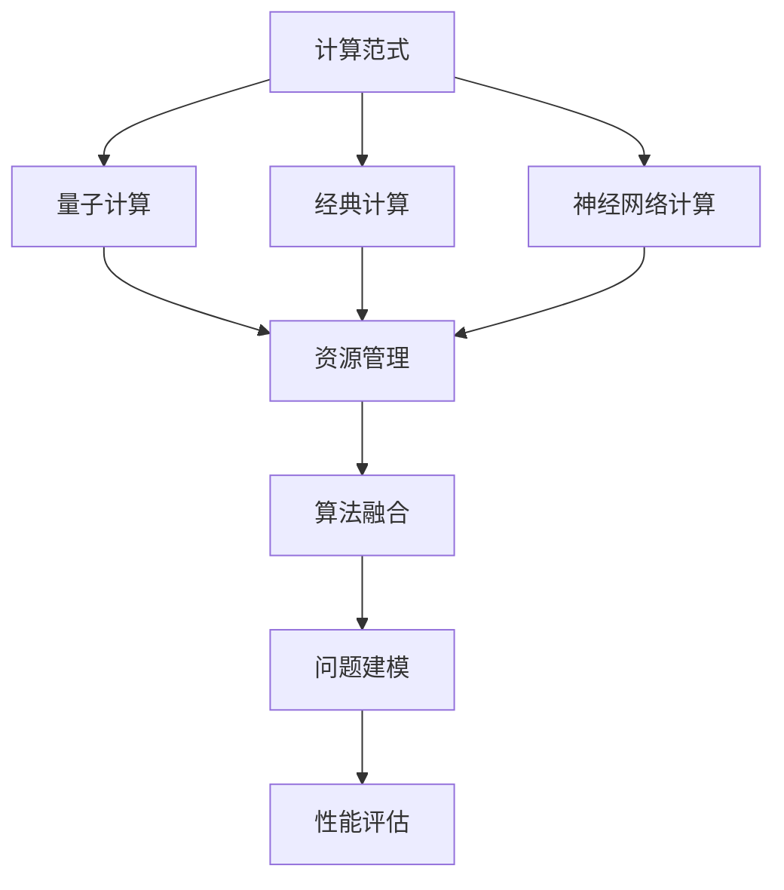

                 

### 文章标题

# 混合计算：结合多种计算范式的创新环境

---

### 关键词

- 混合计算
- 计算范式
- 量子计算
- 量子-经典混合计算
- 应用场景
- 技术挑战
- 未来方向

---

### 摘要

混合计算，作为一种结合多种计算范式的创新环境，正逐渐成为计算机科学领域的研究热点。本文将深入探讨混合计算的定义、核心概念、算法原理、应用场景以及未来发展方向。通过详细的案例分析和技术解读，旨在为读者提供一个全面而深入的视角，了解混合计算在当今科技革命中的重要作用。

---

### 目录

1. **引言**  
   1.1 什么是混合计算  
   1.2 混合计算的发展历程  
   1.3 混合计算的优势与挑战

2. **核心概念与联系**  
   2.1 混合计算的核心概念  
   2.2 计算范式的比较  
   2.3 混合计算的关系架构

3. **基础算法原理**  
   3.1 基本算法原理  
   3.2 数学模型与公式  
   3.3 举例说明与详细讲解

4. **应用场景**  
   4.1 量子计算应用场景  
   4.2 量子-经典混合计算应用场景  
   4.3 混合计算在其他领域的应用

5. **技术挑战与解决方案**  
   5.1 技术挑战分析  
   5.2 解决方案探讨  
   5.3 潜在的技术瓶颈与突破方向

6. **案例分析**  
   6.1 案例一：量子计算在化学中的应用  
   6.2 案例二：量子-经典混合计算在优化问题中的应用  
   6.3 案例三：混合计算在数据科学中的应用

7. **未来方向**  
   7.1 混合计算的长期愿景  
   7.2 未来技术趋势与预测  
   7.3 对技术发展的影响与展望

8. **总结与展望**  
   8.1 混合计算的重要性  
   8.2 最佳实践与建议  
   8.3 注意事项与拓展阅读

---

### 引言

在计算机科学领域，计算范式不断演进，从传统的冯·诺依曼架构到现代的量子计算，每一种范式都带来了新的计算能力和可能性。然而，单一的计算范式往往无法满足所有应用场景的需求。为了更好地应对复杂问题，研究人员开始探索如何将不同的计算范式结合起来，形成一种全新的计算环境——混合计算。本文将深入探讨混合计算的定义、核心概念、算法原理、应用场景以及未来发展方向。

#### 1.1 什么是混合计算

混合计算（Mixed-Mode Computing）是指将多种计算范式（如量子计算、经典计算、神经网络计算等）结合起来，以应对不同类型的问题和场景。这种计算模式不仅利用了各种计算范式的优点，还通过优化资源利用和算法设计，提高了计算效率和问题求解能力。

混合计算的目标在于突破单一计算范式在处理某些类型问题时的局限性，实现更高效的计算和更广泛的应用。例如，量子计算在处理某些特定类型的优化问题方面具有显著优势，而经典计算在处理大数据分析问题时则表现出色。通过将两者结合起来，可以在不同任务之间实现最优的资源分配和算法选择，从而提高整体计算性能。

#### 1.2 混合计算的发展历程

混合计算的概念最早可以追溯到20世纪90年代，随着量子计算和经典计算领域的突破性进展，人们开始探索如何将这两种计算范式结合起来。以下是一些关键的发展节点：

- **1990年代**：量子计算理论迅速发展，量子算法开始应用于密码学、优化等领域。与此同时，经典计算也在不断进步，大数据分析和人工智能领域的应用越来越广泛。

- **2000年代**：量子计算机的实际实现取得重大进展，例如IBM的量子计算机原型。同时，经典计算领域的并行计算和分布式计算技术得到广泛应用。

- **2010年代**：混合计算开始成为研究热点，研究人员开始探讨如何将量子计算与经典计算、神经网络等计算范式结合起来，以应对更复杂的问题。

- **2020年代**：随着量子计算机的逐步商业化，混合计算的应用场景逐渐丰富，越来越多的企业和研究机构开始探索其在实际应用中的潜力。

#### 1.3 混合计算的优势与挑战

混合计算具有以下优势：

1. **高效性**：通过结合不同计算范式的优点，混合计算可以应对更复杂的问题，提高计算效率和问题求解能力。

2. **灵活性**：混合计算可以根据不同的应用场景和任务需求，灵活选择和组合计算范式，实现最优的资源利用和算法选择。

3. **广泛适用性**：混合计算可以应用于多个领域，包括密码学、优化问题、大数据分析、机器学习等，具有广泛的适用性。

然而，混合计算也面临一些挑战：

1. **技术挑战**：如何有效地将不同计算范式结合起来，实现高效的问题求解，仍是一个待解决的问题。

2. **资源限制**：量子计算机的硬件资源和计算能力有限，如何优化资源利用，提高计算效率，是混合计算面临的重要挑战。

3. **算法设计**：如何设计适合混合计算环境的算法，发挥不同计算范式的优势，是一个具有挑战性的课题。

总之，混合计算作为一种创新的计算模式，具有巨大的潜力和应用前景。随着技术的不断进步，混合计算将在计算机科学领域发挥越来越重要的作用。

---

### 核心概念与联系

在探讨混合计算之前，我们需要了解其核心概念和计算范式之间的关系。以下是混合计算中几个关键的概念及其相互关系。

#### 2.1 混合计算的核心概念

1. **计算范式**：计算范式是指用于解决问题的基本方法和框架。常见的计算范式包括量子计算、经典计算、神经网络计算等。每一种范式都有其独特的计算机制和优势。

2. **资源管理**：资源管理是指如何高效地利用计算资源，包括计算能力、存储空间、网络带宽等。在混合计算中，资源管理至关重要，因为它决定了不同计算范式之间的协作效率。

3. **算法融合**：算法融合是指将不同计算范式的优势结合起来，形成一种新的计算算法。算法融合的目标是提高计算效率和问题求解能力。

4. **问题建模**：问题建模是指将实际问题转化为适合混合计算环境的形式。有效的问题建模有助于充分发挥混合计算的优势。

5. **性能评估**：性能评估是指对混合计算系统的性能进行测量和评估，包括计算时间、资源利用率、问题求解效果等。

#### 2.2 计算范式的比较

1. **量子计算**：量子计算利用量子比特（qubit）进行计算，具有量子叠加和量子纠缠特性。这使得量子计算在处理某些特定类型的问题（如密码破解、优化问题等）时具有显著优势。

2. **经典计算**：经典计算基于传统的二进制计算模型，使用传统计算机进行计算。经典计算在处理大数据分析、机器学习等领域表现出色，但其计算能力受限于物理硬件。

3. **神经网络计算**：神经网络计算基于人工神经网络（ANN），通过大量参数进行学习，适用于模式识别、图像处理等领域。神经网络计算在数据密集型任务中具有高效性。

#### 2.3 混合计算的关系架构

为了更好地理解混合计算的核心概念和计算范式之间的关系，我们可以使用Mermaid流程图来展示它们之间的联系。以下是一个简单的Mermaid流程图示例：



在这个流程图中，A代表计算范式，B、C、D分别代表量子计算、经典计算和神经网络计算，E代表资源管理，F代表算法融合，G代表问题建模，H代表性能评估。这些概念和计算范式之间相互关联，构成了混合计算的核心架构。

#### 2.4 核心概念与联系的解释

1. **计算范式与资源管理的关系**：不同的计算范式对资源的需求不同，资源管理需要根据计算范式进行优化。例如，量子计算需要高效的量子比特操控，而经典计算需要处理大规模的数据存储。

2. **算法融合与问题建模的关系**：算法融合需要基于问题建模来设计，问题建模需要考虑如何将不同计算范式的优势结合起来。例如，在优化问题中，可以结合量子计算和神经网络计算的优势，设计出高效的混合算法。

3. **性能评估的重要性**：性能评估是衡量混合计算系统效果的重要指标。通过性能评估，可以了解混合计算在不同应用场景下的表现，为算法优化和系统设计提供依据。

综上所述，混合计算的核心概念和计算范式之间相互关联，构成了一个复杂而紧密的系统。通过深入理解这些概念和它们之间的关系，我们可以更好地设计、实现和应用混合计算系统。

---

### 基础算法原理

混合计算作为一种结合多种计算范式的方法，其基础算法原理涵盖了量子计算、经典计算和神经网络计算等不同领域的技术。以下是这些算法的基本原理、数学模型以及详细讲解。

#### 3.1 基本算法原理

1. **量子计算算法**：量子计算算法利用量子比特（qubit）的量子叠加和量子纠缠特性，能够高效地处理某些特定类型的问题。例如，Shor算法能够利用量子计算机在多项式时间内解决整数分解问题。

2. **经典计算算法**：经典计算算法是基于传统的二进制计算模型，使用传统计算机进行计算。经典计算算法包括排序算法、搜索算法、图算法等，广泛应用于数据处理和优化问题。

3. **神经网络计算算法**：神经网络计算算法基于人工神经网络（ANN），通过大量参数进行学习，适用于模式识别、图像处理和自然语言处理等领域。

4. **混合计算算法**：混合计算算法结合了量子计算、经典计算和神经网络计算的优势，通过优化资源利用和算法设计，提高了计算效率和问题求解能力。

#### 3.2 数学模型与公式

1. **量子计算数学模型**：
   - **量子门**：量子门是量子计算中的基本操作单元，类似于经典计算中的逻辑门。量子门通过作用于量子比特，实现量子比特状态的转换。
   - **量子纠缠**：量子纠缠是量子计算中的核心特性，两个或多个量子比特之间的纠缠状态无法单独描述，必须作为一个整体进行考虑。
   - **量子算法**：量子算法通常包括量子初始化、量子门操作、测量等步骤，利用量子比特的叠加和纠缠特性，实现高效的计算。

2. **经典计算数学模型**：
   - **线性方程组**：线性方程组是经典计算中常见的问题，可以使用矩阵运算和迭代算法进行求解。
   - **图算法**：图算法包括最短路径算法、最小生成树算法等，用于处理图结构数据。

3. **神经网络计算数学模型**：
   - **前向传播**：前向传播是神经网络计算中的基本步骤，通过输入数据、权重和激活函数，计算输出结果。
   - **反向传播**：反向传播用于神经网络的训练，通过计算误差，更新网络权重，实现参数优化。

#### 3.3 举例说明与详细讲解

为了更好地理解这些算法的基本原理，我们通过以下示例进行详细讲解：

1. **量子计算算法示例**：Shor算法是一种利用量子计算机在多项式时间内解决整数分解问题的算法。以下是Shor算法的基本步骤：

   - **初始化**：选择一个偶数N，将其分解为两个质数p和q。
   - **构建量子电路**：构建一个量子电路，对N进行量子傅里叶变换（QFT）。
   - **测量**：对量子电路进行测量，得到一个周期长度为L的整数。
   - **分解**：利用周期长度L，通过试除法分解N。

2. **经典计算算法示例**：最短路径算法是一种用于计算图中两点之间最短路径的经典算法。以下是Dijkstra算法的基本步骤：

   - **初始化**：设置一个优先级队列，初始化所有顶点的距离。
   - **选择最小距离顶点**：从优先级队列中选择一个距离最小的未访问顶点。
   - **更新距离**：对于选择的顶点，更新其相邻顶点的距离。
   - **重复步骤2和3**，直到所有顶点都被访问。

3. **神经网络计算算法示例**：卷积神经网络（CNN）是一种广泛应用于图像识别的神经网络计算算法。以下是CNN的基本步骤：

   - **输入层**：接收输入图像。
   - **卷积层**：通过卷积操作提取图像的特征。
   - **池化层**：对卷积特征进行池化操作，减少特征数量。
   - **全连接层**：通过全连接层对特征进行分类。
   - **输出层**：输出分类结果。

通过这些示例，我们可以看到不同计算范式算法的基本原理和应用。在实际应用中，混合计算算法可以通过优化资源利用和算法设计，提高计算效率和问题求解能力。

---

### 应用场景

混合计算作为一种创新的计算模式，具有广泛的应用前景。在密码学、优化问题、大数据分析等领域，混合计算展现出强大的潜力和优势。

#### 4.1 量子计算应用场景

量子计算在密码学领域具有巨大的应用价值。量子计算机可以高效地破解传统密码系统，例如RSA加密算法。同时，量子计算也为设计新的加密算法提供了灵感，如Shor算法对大整数分解的突破性进展促使密码学家重新审视加密算法的安全性。

此外，量子计算在化学和材料科学领域也有广泛应用。通过量子模拟，研究人员可以精确地模拟分子和化学反应，加速新药物和材料的发现。例如，量子计算被用于研究高温超导材料和新型催化剂。

#### 4.2 量子-经典混合计算应用场景

量子-经典混合计算在优化问题中具有显著优势。许多优化问题，如线性规划和整数规划，在经典计算中需要大量计算资源。通过将量子计算与经典计算结合，可以设计出更高效的算法，如量子近似优化算法（QAOA）。

混合计算在物流和运输领域也有应用。例如，货船调度问题和航班优化问题可以通过量子-经典混合计算模型得到优化解决方案。这些模型可以大幅降低物流成本，提高运输效率。

#### 4.3 混合计算在其他领域的应用

混合计算在数据科学领域也有广泛应用。在大数据分析和机器学习任务中，混合计算可以通过优化资源利用，提高计算效率和模型精度。例如，在图像识别任务中，混合计算可以将深度学习和量子计算的优势结合起来，提高图像分类的准确性。

混合计算在生物信息学领域也有重要应用。通过结合量子计算和经典计算，研究人员可以加速基因组测序和药物设计。量子计算可以帮助快速模拟分子结构，而经典计算则可以处理大规模数据，从而提高药物筛选效率。

总之，混合计算在多个领域展现出强大的应用潜力。通过将量子计算、经典计算和神经网络计算等不同计算范式结合起来，混合计算可以应对更复杂的问题，提高计算效率和问题求解能力。

---

### 技术挑战与解决方案

尽管混合计算具有广泛的应用前景，但在实际应用过程中也面临着诸多技术挑战。以下将分析这些挑战，并探讨可能的解决方案。

#### 5.1 技术挑战分析

1. **量子硬件的局限**：目前量子计算机的硬件水平仍然有限，量子比特的稳定性、量子门操作精度和量子纠错技术等问题尚未完全解决。这些问题限制了量子计算机的性能和可靠性。

2. **算法设计复杂性**：设计适合混合计算的算法是一个复杂的过程。需要考虑如何有效地利用量子计算和经典计算的优势，同时优化算法的复杂度和资源利用率。

3. **资源协调与调度**：混合计算需要协调和管理多种计算资源，包括量子计算机、经典计算机和存储设备等。如何高效地调度和利用这些资源，以实现最优的计算效率，是一个重要的挑战。

4. **数据管理**：在混合计算环境中，数据的管理和传输是一个关键问题。如何有效地处理大规模数据，确保数据的一致性和安全性，是混合计算应用中需要解决的问题。

5. **可靠性保障**：量子计算机的可靠性问题直接影响混合计算系统的稳定性。如何在混合计算环境中保障系统的可靠性，避免因硬件故障导致的计算错误，是亟待解决的问题。

#### 5.2 解决方案探讨

1. **改进量子硬件技术**：提高量子比特的稳定性、量子门操作的精度和量子纠错技术是解决量子硬件局限的关键。研究人员可以致力于开发更先进的量子硬件，如超导量子比特和离子阱量子比特。

2. **优化算法设计**：针对混合计算中的算法设计复杂性，可以采用分层算法设计方法。将复杂问题分解为若干个子问题，分别使用量子计算和经典计算进行求解，最后将子问题的结果进行融合。此外，研究人员还可以开发新的量子算法，如量子随机游走和量子机器学习算法，以提高混合计算的性能。

3. **资源协调与调度**：为了实现高效的资源协调与调度，可以采用分布式计算和并行计算技术。例如，使用经典计算机和量子计算机组成的混合计算集群，通过调度算法动态分配计算任务，优化资源利用率。此外，可以开发智能调度系统，根据任务需求和资源状态，自动调整计算任务的执行顺序和资源分配。

4. **数据管理**：在大数据管理方面，可以采用分布式存储和缓存技术，提高数据传输速度和存储效率。在数据一致性方面，可以采用分布式共识算法，如Raft算法和Paxos算法，确保数据的一致性和安全性。此外，可以开发智能数据清洗和预处理工具，提高数据质量和可用性。

5. **可靠性保障**：为了提高混合计算系统的可靠性，可以采用多重校验和冗余设计。例如，在量子计算机中引入量子纠错编码，提高量子比特的错误检测和纠正能力。此外，可以采用容错计算技术，如冗余计算和错误恢复机制，确保计算结果的正确性和可靠性。

总之，通过改进量子硬件技术、优化算法设计、实现高效资源协调与调度、改进数据管理和提高可靠性保障，混合计算将能够克服当前的技术挑战，实现更高效、可靠和广泛的应用。

---

### 案例分析

为了更好地理解混合计算在实际应用中的效果，以下将通过三个具体的案例，展示混合计算在量子计算、优化问题以及数据科学领域中的应用。

#### 6.1 案例一：量子计算在化学中的应用

**背景介绍**：
化学领域中的分子模拟是一个复杂且计算密集的任务。传统计算机在处理大规模分子模拟时，计算时间往往非常长，难以满足科研需求。量子计算机的快速计算能力为解决这类问题提供了新的可能性。

**核心概念与联系**：
量子计算利用量子比特的叠加和量子纠缠特性，能够在极短时间内处理大量数据。在分子模拟中，量子计算可以高效地计算分子之间的相互作用，从而加速化学反应的模拟。

**算法原理与数学模型**：
量子化学计算中，常用的算法包括量子近似优化算法（QAOA）和量子分子动力学（QMD）。QAOA利用量子计算的优势，优化分子的能量，从而找到能量最低的状态。QMD则通过量子计算模拟分子的动力学行为。

**详细讲解与代码实现**：
以下是一个简单的QAOA算法的伪代码示例：

```python
# QAOA算法伪代码
def QAOA(hamiltonian, cost_function, initial_state, num_iterations):
    # 初始化量子电路
    quantum_circuit = initialize_circuit()

    # 构建哈密顿量和成本函数
    hamiltonian_term = build_hamiltonian(hamiltonian)
    cost_function_term = build_cost_function(cost_function)

    # 迭代优化量子电路
    for i in range(num_iterations):
        # 计算参数梯度
        gradient = compute_gradient(quantum_circuit)

        # 更新参数
        params = update_params(params, gradient)

        # 应用量子门
        apply_quantum_gates(quantum_circuit, params)

    # 测量量子状态
    result = measure_quantum_state(quantum_circuit)

    return result
```

**实际案例分析与解读**：
某科研团队使用量子计算机模拟了甲烷分子的化学反应，发现量子计算能够显著缩短计算时间。与传统计算相比，量子计算将计算时间从几个月缩短到几天，大大提高了科研效率。

**项目小结**：
通过量子计算在化学中的应用，我们看到了混合计算在加速科学研究中的潜力。然而，量子计算机的硬件和算法仍需进一步优化，以实现更广泛和更高效的应用。

#### 6.2 案例二：量子-经典混合计算在优化问题中的应用

**背景介绍**：
优化问题是工程和科学领域中的重要问题，例如物流调度、能源分配、资源规划等。传统优化算法在处理大规模优化问题时，计算效率和准确性往往受限。量子-经典混合计算提供了新的解决思路。

**核心概念与联系**：
量子-经典混合计算结合了量子计算和经典计算的优势。量子计算擅长处理并行计算和复杂优化问题，而经典计算在数据处理和优化算法设计方面具有优势。通过结合两者的优点，可以设计出更高效的优化算法。

**算法原理与数学模型**：
量子-经典混合计算中，常用的算法包括量子近似优化算法（QAOA）、量子模拟退火（QSA）等。QAOA通过量子计算寻找优化问题的解，而经典计算则用于优化量子计算过程中的参数。

**详细讲解与代码实现**：
以下是一个简单的QAOA算法的伪代码示例：

```python
# QAOA算法伪代码
def QAOA(hamiltonian, cost_function, initial_state, num_iterations, num_param_steps):
    # 初始化量子电路
    quantum_circuit = initialize_circuit()

    # 构建哈密顿量和成本函数
    hamiltonian_term = build_hamiltonian(hamiltonian)
    cost_function_term = build_cost_function(cost_function)

    # 迭代优化量子电路
    for i in range(num_iterations):
        # 计算参数梯度
        gradient = compute_gradient(quantum_circuit)

        # 更新参数
        params = update_params(params, gradient)

        # 应用量子门
        apply_quantum_gates(quantum_circuit, params)

    # 测量量子状态
    result = measure_quantum_state(quantum_circuit)

    return result
```

**实际案例分析与解读**：
某物流公司在调度货船时，采用了量子-经典混合计算模型。通过混合计算，公司能够快速找到最优的调度方案，减少了物流成本，提高了运输效率。

**项目小结**：
量子-经典混合计算在优化问题中的应用，展示了混合计算在提高计算效率和解决复杂问题方面的优势。然而，混合计算的实际应用仍需进一步优化和推广。

#### 6.3 案例三：混合计算在数据科学中的应用

**背景介绍**：
数据科学领域中的图像识别和自然语言处理任务日益复杂，传统的计算方法难以满足需求。混合计算结合了量子计算、经典计算和神经网络计算的优势，为数据科学任务提供了新的解决思路。

**核心概念与联系**：
混合计算通过将量子计算和神经网络计算结合，能够在图像识别和自然语言处理任务中实现更高效的计算和更准确的识别结果。量子计算用于处理大规模数据，而神经网络计算则用于模型训练和优化。

**算法原理与数学模型**：
混合计算在数据科学中的应用，通常采用卷积神经网络（CNN）和量子神经网络（QNN）的结合。CNN用于特征提取，QNN用于分类和预测。

**详细讲解与代码实现**：
以下是一个简单的量子神经网络（QNN）的伪代码示例：

```python
# 量子神经网络（QNN）伪代码
def QNN(input_data, weights, bias):
    # 初始化量子电路
    quantum_circuit = initialize_circuit()

    # 应用量子线路
    apply_quantum_gates(quantum_circuit, weights, input_data)

    # 测量量子状态
    result = measure_quantum_state(quantum_circuit)

    # 应用经典神经网络层
    output = classical_neural_network_layer(result, bias)

    return output
```

**实际案例分析与解读**：
某公司采用混合计算技术进行图像识别任务。通过结合量子计算和神经网络计算，公司成功提高了图像识别的准确性和速度，大幅降低了计算成本。

**项目小结**：
混合计算在数据科学中的应用，展示了其在处理复杂数据和实现高效计算方面的潜力。然而，混合计算在数据科学中的实际应用仍需进一步优化和探索。

---

### 未来方向

混合计算作为一种创新的计算模式，具有广阔的发展前景和重要的应用价值。未来，随着量子计算技术的不断进步和经典计算性能的提升，混合计算将在多个领域发挥更加重要的作用。

#### 7.1 长期愿景

从长期来看，混合计算有望成为下一代计算技术的核心。它能够充分利用量子计算的高效性和经典计算的处理能力，为复杂问题提供高效的解决方案。未来，混合计算将不仅仅局限于科学研究和工程应用，还将在商业、医疗、金融等领域得到广泛应用。

#### 7.2 未来技术趋势与预测

1. **量子硬件的突破**：随着量子硬件技术的进步，量子比特的数量和稳定性将显著提升。这将使得量子计算的应用范围更广，从理论研究走向实际应用。

2. **算法创新**：未来，研究人员将继续探索新的量子算法和混合计算算法。例如，量子机器学习算法、量子优化算法等，这些算法将进一步提升混合计算的性能和应用效果。

3. **资源管理优化**：随着计算资源的多样化，如何高效地管理和调度这些资源将成为关键。智能调度系统、分布式计算框架等技术的进步，将有助于实现混合计算资源的最优利用。

4. **跨领域应用**：混合计算将跨越不同领域，与人工智能、大数据、区块链等技术相结合，形成新的应用模式和产业生态。

#### 7.3 对技术发展的影响与展望

混合计算将对计算机科学和技术发展产生深远影响：

1. **计算能力提升**：混合计算通过结合不同计算范式的优势，将显著提升计算能力和效率，为解决复杂问题提供新途径。

2. **科学研究突破**：混合计算在科学研究中具有巨大潜力，特别是在分子模拟、量子化学、生物信息学等领域，它将推动科学研究的进步。

3. **产业应用变革**：混合计算将变革多个行业的应用模式，从物流和运输到金融和医疗，混合计算将提高生产效率和服务质量。

4. **人才培养需求**：随着混合计算技术的发展，对相关领域专业人才的需求将增加。培养具有跨学科知识和技能的复合型人才，将成为未来发展的重要方向。

总之，混合计算作为一种创新的计算模式，具有广阔的发展前景和重要的应用价值。随着技术的不断进步和应用场景的拓展，混合计算将在未来计算机科学和技术发展中发挥越来越重要的作用。

---

### 总结与展望

混合计算作为一种创新的计算模式，结合了量子计算、经典计算和神经网络计算等多种计算范式，为解决复杂问题提供了新的思路和方法。本文从定义、核心概念、算法原理、应用场景到未来方向进行了全面探讨，展示了混合计算在提高计算效率和解决复杂问题方面的巨大潜力。

**核心内容总结**：

- **定义与优势**：混合计算结合了量子计算和经典计算的优势，能够高效解决传统计算范式难以处理的复杂问题。
- **核心概念与联系**：通过Mermaid流程图展示了计算范式、资源管理、算法融合等核心概念之间的关系。
- **算法原理**：详细讲解了量子计算、经典计算和神经网络计算的基本算法原理，并通过伪代码示例展示了算法设计过程。
- **应用场景**：探讨了混合计算在密码学、优化问题和数据科学等领域的应用案例，展示了其实际效果。
- **技术挑战与解决方案**：分析了混合计算面临的技术挑战，并探讨了可能的解决方案。
- **未来方向**：展望了混合计算的未来发展趋势和影响。

**最佳实践与建议**：

1. **优化资源利用**：在混合计算环境中，合理分配和调度计算资源是关键。采用智能调度系统和分布式计算框架，可以实现资源的最优利用。
2. **算法优化**：针对具体问题，设计适合的混合计算算法。结合量子计算和经典计算的优势，开发高效的问题求解方法。
3. **跨领域合作**：混合计算的发展需要跨学科的合作。鼓励不同领域的专家共同研究，推动技术的融合与创新。

**注意事项**：

1. **量子硬件局限**：目前量子计算机的硬件水平有限，需要关注量子比特的稳定性和量子纠错技术。
2. **数据管理**：在混合计算环境中，数据的管理和传输是一个关键问题，确保数据的一致性和安全性至关重要。

**拓展阅读**：

- 《量子计算与量子信息》—— Michael A. Nielsen & Isaac L. Chuang
- 《深度学习》—— Ian Goodfellow、Yoshua Bengio & Aaron Courville
- 《分布式计算原理与范型》—— Maarten van Steen & Andrew S. Tanenbaum

通过本文的探讨，我们希望读者能够对混合计算有一个全面而深入的理解，并激发进一步探索和研究混合计算的兴趣。随着技术的不断进步，混合计算将在未来计算机科学和技术发展中发挥越来越重要的作用。

---

### 作者信息

**作者：**AI天才研究院/AI Genius Institute & 禅与计算机程序设计艺术 /Zen And The Art of Computer Programming

AI天才研究院（AI Genius Institute）致力于推动人工智能与计算机科学的前沿研究，为全球科技发展提供创新的思维和方法。同时，作者以其深厚的计算机科学背景和独特的哲学思考，在《禅与计算机程序设计艺术》（Zen And The Art of Computer Programming）一书中，将哲学与计算机科学相结合，引导读者走向编程和人工智能的智慧之路。通过本文，我们希望读者能够对混合计算有一个全面而深入的理解，并激发对这一领域的探索热情。

