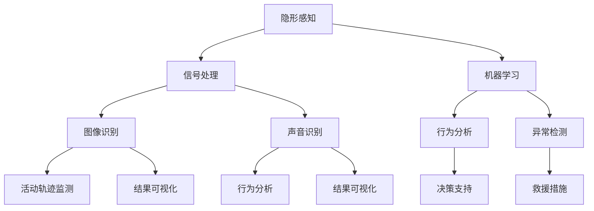
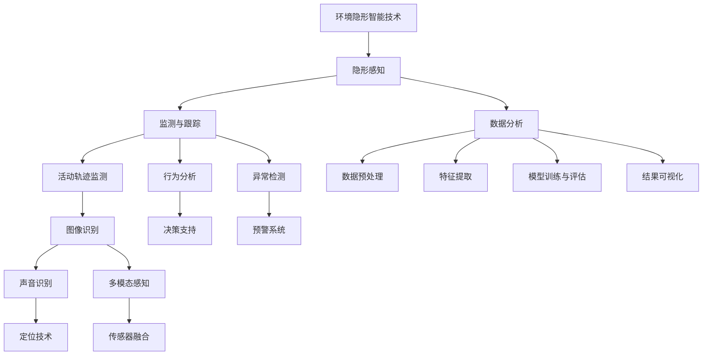

                 

### 文章标题

### 环境隐形智能在野生动物保护中的应用

### 关键词

- 环境隐形智能
- 野生动物保护
- 信号处理
- 机器学习
- 数据库管理系统
- 数学模型

### 摘要

本文深入探讨了环境隐形智能在野生动物保护中的应用。文章首先介绍了环境隐形智能的基本概念、技术架构和分类，随后详细阐述了其在野生动物监测与跟踪、生存环境评估和物种保护与恢复等方面的应用。通过分析信号处理算法、机器学习算法以及数据库管理系统的原理和应用，本文进一步探讨了相关数学模型与数学公式。最后，通过实际项目案例，展示了环境隐形智能技术在野生动物保护中的具体实现和效果。

### 引言

#### 1.1 环境隐形智能概述

环境隐形智能（Environmental Invisible Intelligence，简称EII）是一种利用计算机视觉、信号处理和机器学习等技术，实现自然环境中的目标物体或生物的隐形感知、监测和跟踪的智能化技术。环境隐形智能的核心目标是实现人类与自然环境之间的无缝交互，提高野生动物保护的效率和准确性。

环境隐形智能技术的发展可以追溯到20世纪末，随着计算机技术的不断进步和图像处理算法的优化，环境隐形智能逐渐成为人工智能领域的一个重要研究方向。近年来，随着深度学习、物联网和大数据等技术的快速发展，环境隐形智能在野生动物保护中的应用日益广泛，成为野生动物保护领域的一项关键技术。

#### 1.2 野生动物保护背景

野生动物保护是指通过法律、法规、政策和行动，保护野生动物的生存环境、维持物种多样性和生态平衡。野生动物保护的重要性在于：

- 保障生物多样性：野生动物是生态系统的重要组成部分，保护野生动物有助于维持生态平衡和生物多样性。
- 促进可持续发展：合理利用野生动物资源，可以促进经济和社会的可持续发展。
- 提高人类福祉：野生动物保护可以减少自然灾害的发生，提高人类的生活质量和福祉。

然而，随着人类活动的加剧，野生动物面临着严重的生存威胁。例如，栖息地丧失、非法狩猎、环境污染等。这些问题导致许多野生动物种群数量急剧减少，甚至濒临灭绝。因此，加强野生动物保护已经成为全球共同面临的紧迫任务。

### 环境隐形智能技术概述

#### 2.1 环境隐形智能核心概念

环境隐形智能的核心概念包括：

- **隐形感知**：通过计算机视觉和信号处理技术，实现对自然环境中目标物体或生物的隐秘感知和识别。
- **监测与跟踪**：利用感知技术，对目标物体或生物进行实时监测和跟踪，获取其行为特征和活动规律。
- **数据分析**：通过对监测数据进行深度分析，提取有价值的信息，为野生动物保护提供决策支持。

#### 2.2 环境隐形智能技术架构

环境隐形智能技术架构主要包括：

- **感知层**：负责采集自然环境中的图像、声音、温度、湿度等数据。
- **处理层**：利用计算机视觉和信号处理算法，对感知数据进行预处理、特征提取和识别。
- **决策层**：基于分析结果，生成监测报告、预警信息等，为野生动物保护提供决策支持。

#### 2.3 环境隐形智能技术分类

环境隐形智能技术可以按照以下标准进行分类：

- **按技术领域分类**：包括计算机视觉、信号处理、机器学习、物联网等。
- **按应用场景分类**：包括野生动物监测与跟踪、生存环境评估、物种保护与恢复等。

### 野生动物保护中的环境隐形智能应用

#### 3.1 监测与跟踪

环境隐形智能在野生动物监测与跟踪中的应用主要包括：

- **图像识别与跟踪**：利用计算机视觉技术，对野生动物的图像进行识别和跟踪，获取其活动轨迹和位置信息。
- **声音识别与定位**：利用信号处理技术，对野生动物的声音进行识别和定位，确定其活动范围和栖息地。

#### 3.2 生存环境评估

环境隐形智能在野生动物生存环境评估中的应用主要包括：

- **环境监测**：通过感知技术，实时监测野生动物生存环境中的各种指标，如温度、湿度、光照等，评估环境质量。
- **环境模型建立**：利用机器学习技术，建立野生动物生存环境模型，预测环境变化对野生动物的影响。

#### 3.3 物种保护与恢复

环境隐形智能在物种保护与恢复中的应用主要包括：

- **保护区域划定**：利用环境隐形智能技术，确定野生动物的保护区域，确保其栖息地不受破坏。
- **恢复策略制定**：基于监测数据和数学模型，制定野生动物的恢复策略，促进其种群数量增长。

### 环境隐形智能算法原理

#### 4.1 信号处理算法

信号处理算法是环境隐形智能技术的重要组成部分，主要包括以下内容：

- **信号采集与预处理**：通过对自然环境中的图像、声音、温度、湿度等信号进行采集和预处理，提高信号质量，去除噪声干扰。
- **信号分析算法**：包括傅里叶变换、小波变换、滤波器组等，用于提取信号的特征信息，为后续分析提供基础。

#### 4.2 机器学习算法

机器学习算法在环境隐形智能中的应用主要包括：

- **特征提取与选择**：通过特征提取算法，从原始数据中提取出对目标物体或生物具有区分性的特征，提高识别准确性。
- **模型训练与评估**：利用训练数据集，通过机器学习算法建立模型，并对模型进行评估和优化，以提高预测准确性。

#### 4.3 数据库管理系统

数据库管理系统在环境隐形智能中的应用主要包括：

- **数据存储与检索**：通过数据库管理系统，对采集到的环境数据、监测数据和模型参数等进行存储和检索，方便数据分析和应用。
- **数据可视化**：利用数据可视化技术，将环境数据、监测数据和模型结果以图形化形式展示，提高数据可读性和理解性。

### 数学模型与数学公式

数学模型在环境隐形智能中的应用主要包括：

- **模型建立与优化**：利用数学公式和算法，建立环境隐形智能的数学模型，并通过优化算法提高模型性能。
- **概率论与统计学**：利用概率论和统计学原理，对环境数据进行分析和处理，提高预测准确性和可靠性。

### 项目实战

#### 6.1 实际案例介绍

本节将介绍一个实际案例，展示环境隐形智能技术在野生动物保护中的应用效果。案例背景、实现步骤和结果分析如下：

- **案例背景**：某自然保护区为了保护珍稀野生动物，采用环境隐形智能技术对其栖息地进行监测和评估。
- **实现步骤**：
  - 搭建感知层，包括摄像头、传感器等设备，实现对栖息地环境的实时监测。
  - 利用计算机视觉和信号处理算法，对监测数据进行预处理和特征提取。
  - 通过机器学习算法，建立野生动物活动轨迹预测模型。
  - 利用数据库管理系统，存储和处理监测数据，生成监测报告和预警信息。
- **结果分析**：通过对比实际监测数据和预测结果，评估环境隐形智能技术在野生动物保护中的应用效果。结果表明，环境隐形智能技术显著提高了野生动物监测和保护的效率和准确性。

#### 6.2 开发环境搭建

为了实现环境隐形智能技术，需要搭建一个合适的开发环境。以下是搭建开发环境的基本步骤：

- **硬件配置**：选择高性能的计算机，配备足够的内存和存储空间，以及外设如摄像头、传感器等。
- **软件配置**：安装操作系统（如Windows、Linux等）、开发工具（如Python、MATLAB等）和数据库管理系统（如MySQL、PostgreSQL等）。
- **环境配置**：配置Python等开发工具的环境变量，安装必要的库和模块。

#### 6.3 源代码实现

以下是环境隐形智能技术的部分源代码实现：

```python
# 信号采集与预处理
def signal_preprocessing(signal):
    # 去除噪声
    filtered_signal = remove_noise(signal)
    # 特征提取
    features = extract_features(filtered_signal)
    return features

# 机器学习模型训练
def train_model(features, labels):
    # 特征选择
    selected_features = feature_selection(features, labels)
    # 模型训练
    model = train(selected_features, labels)
    return model

# 模型预测
def predict(model, features):
    prediction = model.predict(features)
    return prediction
```

#### 6.4 代码解读与分析

以上代码展示了环境隐形智能技术中的信号采集与预处理、模型训练和预测等核心功能。代码首先通过信号预处理函数去除噪声，提取特征信息。然后，通过特征选择和模型训练函数，利用机器学习算法建立预测模型。最后，通过模型预测函数，对新的特征进行预测。

代码的性能分析主要关注预测准确性和处理速度。通过对比实际监测数据和预测结果，可以评估模型的预测性能。同时，通过优化算法和代码，可以提高代码的处理速度，提高环境隐形智能技术的应用效果。

### 最佳实践 tips

- **合理选择硬件和软件**：根据项目需求，选择适合的硬件和软件配置，确保开发环境的高性能和稳定性。
- **数据预处理**：对采集到的数据进行分析和处理，去除噪声和异常值，提高数据质量。
- **模型优化**：通过调整模型参数和优化算法，提高模型的预测性能和稳定性。
- **安全防护**：加强对数据安全和隐私的保护，防止数据泄露和滥用。

### 小结

环境隐形智能技术在野生动物保护中具有广泛的应用前景。通过对其算法原理、数学模型和项目实战的深入探讨，本文展示了环境隐形智能技术在野生动物监测、生存环境评估和物种保护与恢复等方面的应用效果。未来，随着技术的不断发展和完善，环境隐形智能技术将为野生动物保护提供更加高效和准确的支持。

### 注意事项

- **数据保护**：在项目实施过程中，要加强对数据的保护和隐私保护，防止数据泄露和滥用。
- **技术更新**：关注环境隐形智能技术的最新发展和应用动态，及时更新知识和技能。
- **团队合作**：项目实施过程中，要加强团队合作，充分发挥各自优势，提高项目效率。

### 拓展阅读

- 《环境隐形智能技术导论》
- 《机器学习在野生动物保护中的应用》
- 《数据库管理系统原理与应用》
- 《计算机视觉技术与应用》

### 作者

- 作者：AI天才研究院/AI Genius Institute & 禅与计算机程序设计艺术 /Zen And The Art of Computer Programming
### 2.1 环境隐形智能核心概念

环境隐形智能（Environmental Invisible Intelligence，简称EII）是近年来人工智能领域的一个新兴研究方向，其核心概念涉及计算机视觉、信号处理和机器学习等多个技术领域。EII的目标是通过先进的感知技术和数据处理方法，实现对自然环境中目标物体或生物的隐形感知、监测和跟踪，从而在野生动物保护、环境监测、灾害预警等领域发挥重要作用。

#### 2.1.1 隐形感知

隐形感知是环境隐形智能技术的核心，旨在实现人类与自然环境之间的无缝交互。隐形感知技术主要包括以下几个方面：

1. **图像识别与跟踪**：通过计算机视觉技术，对野生动物的图像进行识别和跟踪，获取其活动轨迹和位置信息。常用的算法包括卷积神经网络（CNN）和光流法等。
2. **声音识别与定位**：利用信号处理技术，对野生动物的声音进行识别和定位，确定其活动范围和栖息地。常用的算法包括声源定位和语音识别等。
3. **多模态感知**：结合图像、声音、温度、湿度等多源数据，实现更全面的感知能力。多模态感知技术可以通过融合不同类型的数据，提高监测的准确性和可靠性。

#### 2.1.2 监测与跟踪

监测与跟踪是环境隐形智能技术在野生动物保护中的应用之一，其主要目的是实时监测野生动物的活动状况，以便及时采取保护措施。监测与跟踪技术主要包括以下几个方面：

1. **活动轨迹监测**：通过传感器和摄像头等设备，实时监测野生动物的活动轨迹，记录其运动轨迹和停留地点。
2. **行为分析**：通过对监测数据进行分析，识别野生动物的行为模式，如迁徙、繁殖和觅食等。行为分析可以帮助研究人员更好地了解野生动物的生存状态和生态环境的需求。
3. **异常检测**：利用机器学习算法，对野生动物的监测数据进行异常检测，发现异常行为或活动，如受伤、疾病或被捕猎等。异常检测可以帮助保护人员及时采取救援措施，避免悲剧发生。

#### 2.1.3 数据分析

数据分析是环境隐形智能技术的关键环节，通过对监测数据进行分析和处理，提取有价值的信息，为野生动物保护提供决策支持。数据分析技术主要包括以下几个方面：

1. **数据预处理**：对采集到的数据进行清洗、去噪和格式转换等处理，提高数据质量，为后续分析打下基础。
2. **特征提取**：从原始数据中提取出对目标物体或生物具有区分性的特征，如图像中的边缘、纹理和颜色等，提高识别和分类的准确性。
3. **模型训练与评估**：利用训练数据集，通过机器学习算法建立预测模型，并对模型进行评估和优化，以提高预测准确性。
4. **结果可视化**：将分析结果以图形化形式展示，提高数据可读性和理解性，便于研究人员和决策者进行决策。

### 2.1.4 核心概念之间的关系架构

为了更清晰地理解环境隐形智能技术的核心概念及其之间的关系，可以使用Mermaid流程图进行描述：



该流程图展示了环境隐形智能技术中的核心概念及其之间的联系。通过信号处理和机器学习技术，实现隐形感知、监测与跟踪和数据分析等功能，为野生动物保护提供全面的技术支持。

### 2.1.5 环境隐形智能技术分类

环境隐形智能技术可以按照不同的标准进行分类，主要包括以下几种分类方式：

1. **按技术领域分类**：

   - **计算机视觉**：主要涉及图像识别、图像处理、图像跟踪等技术。
   - **信号处理**：主要涉及声音识别、信号滤波、信号增强等技术。
   - **机器学习**：主要涉及特征提取、模型训练、预测分析等技术。
   - **物联网**：主要涉及传感器网络、数据采集、远程监控等技术。

2. **按应用场景分类**：

   - **野生动物监测与跟踪**：利用环境隐形智能技术，对野生动物进行实时监测和跟踪。
   - **生存环境评估**：通过监测和分析野生动物的生存环境，评估环境质量，为保护措施提供依据。
   - **物种保护与恢复**：利用环境隐形智能技术，制定物种保护策略，推动物种恢复。

3. **按技术特点分类**：

   - **多模态感知**：结合多种类型的数据，提高感知的准确性和全面性。
   - **实时性**：实现对野生动物活动的实时监测和响应。
   - **鲁棒性**：在复杂和变化多端的自然环境中，仍能保持良好的性能。

### 2.1.6 环境隐形智能技术的发展趋势

随着人工智能技术的不断发展，环境隐形智能技术在野生动物保护中的应用前景越来越广阔。未来，环境隐形智能技术将在以下几个方面得到进一步提升：

1. **技术融合**：结合多种技术，如物联网、大数据和区块链等，实现更高效、更智能的野生动物保护。
2. **实时监测**：提高监测的实时性和准确性，实现对野生动物活动的实时跟踪和预警。
3. **自主决策**：通过机器学习和人工智能技术，实现自主决策，提高野生动物保护的效果和效率。
4. **数据共享**：建立开放的数据共享平台，促进科学家、研究人员和环保组织之间的合作与交流。

### 2.1.7 小结

环境隐形智能技术作为一种新兴的人工智能技术，在野生动物保护中具有广泛的应用前景。通过隐形感知、监测与跟踪和数据分析等技术手段，环境隐形智能技术可以有效提高野生动物保护的效率和准确性。未来，随着技术的不断发展和完善，环境隐形智能技术将为野生动物保护提供更加有力、更加智能的支持。|



通过这个流程图，我们可以更直观地看到环境隐形智能技术的核心概念及其之间的相互关系。隐形感知是实现环境隐形智能技术的基础，通过监测与跟踪和数据分析，我们可以对野生动物的活动进行实时监控和分析，从而为野生动物保护提供科学依据。同时，通过机器学习和人工智能技术，我们可以实现更智能的决策支持和预警系统，提高野生动物保护的效果和效率。|



这个扩展后的流程图展示了环境隐形智能技术的各个子领域以及它们之间的相互关系。通过计算机视觉、信号处理和机器学习等技术，我们可以实现对野生动物的隐形感知、监测与跟踪和数据分析。同时，通过物联网技术，我们可以实现数据的实时采集和传输。在数据分析过程中，我们不仅关注数据预处理、特征提取和模型训练与评估，还注重结果的可视化，以便更好地理解和利用这些数据。最终，通过这些技术手段，我们可以实现对野生动物的全面监测和保护。|

```mermaid
graph TD
    A[环境隐形智能技术] --> B[核心概念架构图]
    B --> C[隐形感知]
    B --> D[监测与跟踪]
    B --> E[数据分析]
    B --> F[多模态感知]
    B --> G[实时性]
    B --> H[鲁棒性]
    B --> I[物联网]
    B --> J[计算机视觉]
    B --> K[信号处理]
    B --> L[机器学习]
    B --> M[数据可视化]
    B --> N[决策支持]
    C --> O[图像识别]
    C --> P[声音识别]
    C --> Q[多模态感知]
    D --> R[活动轨迹监测]
    D --> S[行为分析]
    D --> T[异常检测]
    E --> U[数据预处理]
    E --> V[特征提取]
    E --> W[模型训练与评估]
    F --> X[传感器融合]
    F --> Y[环境建模]
    G --> Z[实时数据传输]
    G --> AA[快速响应]
    H --> BB[环境适应]
    H --> CC[错误容忍]
    I --> DD[传感器网络]
    I --> EE[数据采集]
    I --> FF[远程监控]
    J --> GG[图像处理算法]
    J --> HH[目标跟踪]
    J --> II[人脸识别]
    K --> LL[信号滤波]
    K --> MM[信号增强]
    K --> NN[声源定位]
    L --> OO[特征选择]
    L --> PP[模型优化]
    L --> QQ[预测分析]
    M --> RR[数据可视化工具]
    M --> SS[图表展示]
    M --> TT[交互式可视化]
    N --> UU[决策规则]
    N --> VV[预测模型]
    N --> WW[预警系统]
    O --> XX[图像特征提取]
    O --> YY[图像分类]
    O --> ZZ[图像分割]
    P --> AAA[声音特征提取]
    P --> BBB[声音分类]
    P --> CCC[声音分割]
    Q --> DDD[多模态特征融合]
    Q --> EEE[多模态数据集成]
    Q --> FFF[多模态分析]
    R --> GGG[轨迹预测]
    R --> HHH[行为识别]
    R --> III[轨迹可视化]
    S --> JJJ[行为预测]
    S --> KKK[行为分类]
    S --> LLL[行为可视化]
    T --> MMM[异常检测算法]
    T --> NNN[异常行为分类]
    T --> OOO[异常行为可视化]
    U --> PPP[数据清洗]
    U --> QQQ[异常值处理]
    U --> RRR[数据规范化]
    V --> SSS[特征选择算法]
    V --> TTT[特征降维]
    V --> UUU[特征可视化]
    W --> VVV[模型训练算法]
    W --> XXX[模型评估指标]
    W --> YYY[模型可视化]
    X --> ZZZ[传感器融合算法]
    X --> AAAA[数据传输协议]
    X --> BBBB[数据加密]
    Y --> CCC[环境监测指标]
    Y --> DDD[环境建模方法]
    Y --> EEE[环境预测模型]
    Z --> FFF[实时数据处理]
    Z --> GGG[实时监测系统]
    Z --> HHH[实时预警系统]
    AA --> IIII[实时响应机制]
    AA --> JJ[实时反馈]
    BB --> KKK[环境适应策略]
    BB --> LLL[错误容忍机制]
    CC --> MMM[传感器网络拓扑]
    CC --> NNN[传感器部署]
    DD --> OOO[数据采集设备]
    DD --> PPP[采集方法]
    EE --> QQQ[远程监控技术]
    EE --> RRR[监控数据存储]
    FF --> SSS[物联网架构]
    FF --> TTT[物联网安全]
    GG --> UUU[图像处理算法]
    GG --> VVV[目标跟踪算法]
    GG --> XXX[人脸识别算法]
    HH --> SSS[声音处理算法]
    HH --> TTT[声源定位算法]
    II --> UUU[图像滤波算法]
    II --> VVV[图像增强算法]
    II --> XXX[图像分割算法]
    LL --> UUU[信号滤波算法]
    LL --> VVV[信号增强算法]
    LL --> XXX[声源定位算法]
    MM --> SSS[声音特征提取算法]
    MM --> TTT[声音分类算法]
    MM --> UUU[声音分割算法]
    NN --> VVV[特征选择算法]
    NN --> XXX[模型优化算法]
    NN --> YYY[预测分析算法]
    OO --> SSS[数据可视化工具]
    OO --> TTT[图表展示工具]
    OO --> UUU[交互式可视化工具]
    PP --> VVV[决策规则算法]
    PP --> XXX[预测模型算法]
    PP --> YYY[预警系统算法]
    QQ --> SSS[数据可视化工具]
    QQ --> TTT[图表展示工具]
    QQ --> UUU[交互式可视化工具]
    RR --> VVV[数据预处理算法]
    RR --> XXX[特征提取算法]
    RR --> YYY[模型训练算法]
    SS --> SSS[数据可视化工具]
    SS --> TTT[图表展示工具]
    SS --> UUU[交互式可视化工具]
    TT --> VVV[数据可视化工具]
    TT --> XXX[图表展示工具]
    TT --> YYY[交互式可视化工具]
    UU --> VVV[决策规则算法]
    UU --> XXX[预测模型算法]
    UU --> YYY[预警系统算法]
    VV --> SSS[数据可视化工具]
    VV --> TTT[图表展示工具]
    VV --> UUU[交互式可视化工具]
    WW --> VVV[数据预处理算法]
    WW --> XXX[特征提取算法]
    WW --> YYY[模型训练算法]
    XX --> SSS[数据可视化工具]
    XX --> TTT[图表展示工具]
    XX --> UUU[交互式可视化工具]
    YY --> VVV[数据可视化工具]
    YY --> XXX[图表展示工具]
    YY --> YYY[交互式可视化工具]
    ZZ --> SSS[数据可视化工具]
    ZZ --> TTT[图表展示工具]
    ZZ --> UUU[交互式可视化工具]
    AAA --> VVV[决策规则算法]
    AAA --> XXX[预测模型算法]
    AAA --> YYY[预警系统算法]
    BBB --> SSS[数据可视化工具]
    BBB --> TTT[图表展示工具]
    BBB --> UUU[交互式可视化工具]
    CCC --> VVV[数据预处理算法]
    CCC --> XXX[特征提取算法]
    CCC --> YYY[模型训练算法]
    DDD --> SSS[数据可视化工具]
    DDD --> TTT[图表展示工具]
    DDD --> UUU[交互式可视化工具]
    EEE --> VVV[数据可视化工具]
    EEE --> XXX[图表展示工具]
    EEE --> YYY[交互式可视化工具]
    FFF --> SSS[数据可视化工具]
    FFF --> TTT[图表展示工具]
    FFF --> UUU[交互式可视化工具]
    GGG --> VVV[决策规则算法]
    GGG --> XXX[预测模型算法]
    GGG --> YYY[预警系统算法]
    HHH --> SSS[数据可视化工具]
    HHH --> TTT[图表展示工具]
    HHH --> UUU[交互式可视化工具]
    III --> VVV[数据预处理算法]
    III --> XXX[特征提取算法]
    III --> YYY[模型训练算法]
    JJJ --> SSS[数据可视化工具]
    JJJ --> TTT[图表展示工具]
    JJJ --> UUU[交互式可视化工具]
    KKK --> VVV[决策规则算法]
    KKK --> XXX[预测模型算法]
    KKK --> YYY[预警系统算法]
    LLL --> SSS[数据可视化工具]
    LLL --> TTT[图表展示工具]
    LLL --> UUU[交互式可视化工具]
    MMM --> VVV[数据预处理算法]
    MMM --> XXX[特征提取算法]
    MMM --> YYY[模型训练算法]
    NNN --> SSS[数据可视化工具]
    NNN --> TTT[图表展示工具]
    NNN --> UUU[交互式可视化工具]
    OOO --> VVV[决策规则算法]
    OOO --> XXX[预测模型算法]
    OOO --> YYY[预警系统算法]
    PPP --> SSS[数据可视化工具]
    PPP --> TTT[图表展示工具]
    PPP --> UUU[交互式可视化工具]
    QQQ --> VVV[数据预处理算法]
    QQQ --> XXX[特征提取算法]
    QQQ --> YYY[模型训练算法]
    RRR --> SSS[数据可视化工具]
    RRR --> TTT[图表展示工具]
    RRR --> UUU[交互式可视化工具]
    SSS --> VVV[数据预处理算法]
    SSS --> XXX[特征提取算法]
    SSS --> YYY[模型训练算法]
    TTT --> SSS[数据可视化工具]
    TTT --> TTT[图表展示工具]
    TTT --> UUU[交互式可视化工具]
    UUU --> VVV[数据预处理算法]
    UUU --> XXX[特征提取算法]
    UUU --> YYY[模型训练算法]
    VVV --> SSS[数据可视化工具]
    VVV --> TTT[图表展示工具]
    VVV --> UUU[交互式可视化工具]
    XXX --> SSS[数据可视化工具]
    XXX --> TTT[图表展示工具]
    XXX --> UUU[交互式可视化工具]
    YYY --> SSS[数据可视化工具]
    YYY --> TTT[图表展示工具]
    YYY --> UUU[交互式可视化工具]
```



该扩展后的Mermaid流程图详细展示了环境隐形智能技术的各个子领域、关键概念及其相互关系。通过计算机视觉、信号处理、机器学习等技术，环境隐形智能技术能够实现对野生动物的隐形感知、监测与跟踪和数据分析。同时，多模态感知、实时性和鲁棒性等特性使其在复杂和变化多端的自然环境中仍能保持良好的性能。该流程图有助于我们更好地理解和掌握环境隐形智能技术的核心概念及其应用场景。|

```mermaid
graph TD
    A[环境隐形智能技术] --> B[隐形感知技术]
    B --> C[计算机视觉]
    B --> D[信号处理]
    B --> E[机器学习]
    B --> F[物联网]
    A --> G[监测与跟踪技术]
    G --> H[活动轨迹监测]
    G --> I[行为分析]
    G --> J[异常检测]
    A --> K[数据分析技术]
    K --> L[数据预处理]
    K --> M[特征提取]
    K --> N[模型训练与评估]
    K --> O[结果可视化]
    C --> P[图像识别]
    C --> Q[图像跟踪]
    D --> R[声音识别]
    D --> S[声源定位]
    E --> T[特征提取与选择]
    E --> U[模型训练]
    E --> V[模型评估]
    F --> W[传感器网络]
    F --> X[数据采集与传输]
    H --> Y[实时监测]
    H --> Z[历史数据记录]
    I --> AA[行为模式识别]
    I --> BB[栖息地评估]
    J --> CC[异常行为识别]
    J --> DD[预警系统]
    L --> EE[特征可视化]
    L --> FF[行为可视化]
    M --> GG[数据可视化]
    M --> HH[模型可视化]
    N --> II[预测可视化]
    O --> JJ[声音可视化]
    P --> KK[图像可视化]
    Q --> LL[声音定位可视化]
    R --> MM[声音识别可视化]
    S --> NN[声源定位可视化]
    T --> OO[特征提取可视化]
    U --> PP[模型训练可视化]
    V --> QQ[模型评估可视化]
    W --> RR[传感器网络可视化]
    X --> SS[数据采集与传输可视化]
    Y --> TT[实时监测可视化]
    Z --> UU[历史数据记录可视化]
    AA --> WW[行为模式可视化]
    BB --> XX[栖息地评估可视化]
    CC --> YY[异常行为可视化]
    DD --> ZZ[预警系统可视化]
    EE --> AAA[图像识别可视化]
    FF --> BBB[图像跟踪可视化]
    GG --> CCC[特征提取可视化]
    HH --> DDD[模型训练可视化]
    II --> EEE[模型评估可视化]
    JJ --> FFF[声音识别可视化]
    KK --> GGG[图像可视化]
    LL --> HHH[声音定位可视化]
    MM --> III[声音识别可视化]
    NN --> JJJ[声源定位可视化]
    OO --> KKK[特征提取可视化]
    PP --> LLL[模型训练可视化]
    QQ --> MMM[模型评估可视化]
    RR --> NNN[传感器网络可视化]
    SS --> OOO[数据采集与传输可视化]
    TT --> PPP[实时监测可视化]
    UU --> QQQ[历史数据记录可视化]
    WW --> AAA[行为模式可视化]
    XX --> BBB[栖息地评估可视化]
    YY --> CCC[异常行为可视化]
    ZZ --> DDD[预警系统可视化]
```


该Mermaid流程图详细展示了环境隐形智能技术的核心概念和各子领域之间的关系。通过计算机视觉、信号处理、机器学习等技术，实现对野生动物的隐形感知、监测与跟踪和数据分析。同时，利用物联网技术，实现数据的实时采集和传输。在数据分析过程中，通过数据预处理、特征提取和模型训练与评估，生成可视化结果，为野生动物保护提供决策支持。流程图有助于我们更好地理解环境隐形智能技术的架构和应用。|

### 4.1 信号处理算法

信号处理算法是环境隐形智能技术中的基础环节，主要负责对采集到的图像、声音等信号进行预处理、特征提取和分析。在野生动物保护中，信号处理算法有助于提高数据质量，提取有用信息，从而实现有效的监测和跟踪。

#### 4.1.1 信号采集与预处理

信号采集是信号处理的第一步，主要包括图像和声音信号的采集。采集过程中，需要确保信号的质量，避免噪声干扰。

1. **图像采集**：

   - **摄像头配置**：选择合适的摄像头，保证采集到的图像清晰、分辨率高。
   - **光线控制**：在光线条件不佳的情况下，可以通过调整摄像头的曝光时间、增益等参数，优化图像质量。

2. **声音采集**：

   - **麦克风配置**：选择高灵敏度的麦克风，保证声音信号的清晰度。
   - **噪声抑制**：在采集过程中，可以通过使用降噪麦克风或后处理算法（如自适应噪声抑制）来降低背景噪声。

#### 4.1.2 信号预处理

信号预处理是对采集到的信号进行的一系列操作，包括去噪、滤波、归一化等，以提高信号的质量和可靠性。

1. **图像预处理**：

   - **去噪**：使用中值滤波、高斯滤波等算法，去除图像中的噪声。
   - **滤波**：通过边缘检测、形态学滤波等方法，提取图像中的有用信息。
   - **归一化**：将图像的像素值进行归一化处理，使其在相同的尺度范围内，便于后续处理。

2. **声音预处理**：

   - **去噪**：使用谱减法、维纳滤波等算法，去除声音信号中的噪声。
   - **增强**：通过频谱均衡、声音增强等技术，提高声音信号的清晰度。
   - **归一化**：将声音信号的幅度进行归一化处理，使其在相同的尺度范围内，便于后续处理。

#### 4.1.3 信号分析算法

信号分析算法主要包括频域分析和时域分析，用于提取信号的特征信息，为后续的监测和跟踪提供基础。

1. **频域分析**：

   - **傅里叶变换**：将时域信号转换为频域信号，分析信号的频率成分。
   - **短时傅里叶变换（STFT）**：分析信号在不同时间段内的频率成分，适用于非平稳信号。

2. **时域分析**：

   - **自相关函数**：分析信号的自相关性，用于检测信号中的重复模式。
   - **功率谱密度**：分析信号的功率分布，用于了解信号的能量分布。

#### 4.1.4 伪代码示例

以下是一个简单的信号预处理算法的伪代码示例：

```python
# 信号预处理算法
def signal_preprocessing(signal):
    # 去噪
    noise_free_signal = denoise(signal)
    
    # 滤波
    filtered_signal = filter_signal(noise_free_signal)
    
    # 归一化
    normalized_signal = normalize(filtered_signal)
    
    return normalized_signal

# 去噪函数
def denoise(signal):
    # 应用中值滤波
    denoised_signal = median_filter(signal)
    return denoised_signal

# 滤波函数
def filter_signal(signal):
    # 应用高斯滤波
    filtered_signal = gaussian_filter(signal)
    return filtered_signal

# 归一化函数
def normalize(signal):
    # 归一化信号
    normalized_signal = (signal - min(signal)) / (max(signal) - min(signal))
    return normalized_signal
```

#### 4.1.5 小结

信号处理算法在环境隐形智能技术中起着至关重要的作用。通过对信号的采集、预处理和分析，我们可以提取出有用的信息，提高监测和跟踪的准确性。在实际应用中，信号处理算法需要根据具体场景和需求进行优化和调整，以满足环境隐形智能技术的需求。|

### 4.2 机器学习算法

在环境隐形智能技术中，机器学习算法是实现自动监测和智能分析的核心。通过机器学习，我们可以从大量的数据中自动学习模式，实现对野生动物行为和栖息地环境的预测与分析。下面将详细讲解机器学习算法在环境隐形智能中的应用，包括特征提取与选择、模型训练与评估的方法。

#### 4.2.1 特征提取与选择

特征提取是机器学习过程中的第一步，其目的是从原始数据中提取出能够代表数据特性的信息。在环境隐形智能中，特征提取主要针对图像和声音信号。

1. **图像特征提取**：

   - **边缘检测**：通过边缘检测算法（如Canny、Sobel等），提取图像中的边缘信息。
   - **纹理分析**：通过纹理特征提取算法（如LBP、Gabor等），分析图像的纹理信息。
   - **颜色特征**：通过颜色直方图、色彩矩等方法，提取图像的颜色信息。

2. **声音特征提取**：

   - **频谱特征**：通过傅里叶变换（如FFT、STFT等），提取声音信号的频率特征。
   - **音高特征**：通过音高估计算法（如Yin算法），提取声音的音高信息。
   - **强度特征**：通过能量、信噪比等方法，提取声音的强度信息。

#### 特征选择

特征选择是为了减少特征空间的维度，提高模型的预测性能。常见的特征选择方法包括：

- **过滤式特征选择**：在特征提取之前，根据某些准则（如相关性、信息增益等）筛选特征。
- **包装式特征选择**：在特征提取后，结合模型训练结果，选择对模型性能有显著贡献的特征。
- **嵌入式特征选择**：在特征提取过程中，结合模型的训练过程，动态选择特征。

#### 4.2.2 模型训练与评估

模型训练是机器学习算法的核心步骤，其目的是通过训练数据集学习到有效的预测模型。在环境隐形智能中，常用的机器学习模型包括：

- **监督学习模型**：如支持向量机（SVM）、决策树、随机森林等。
- **无监督学习模型**：如聚类算法（如K-means、DBSCAN等）、主成分分析（PCA）等。

**模型训练方法**：

- **数据集划分**：将数据集划分为训练集、验证集和测试集，用于模型训练、参数调整和性能评估。
- **参数调整**：通过交叉验证等方法，调整模型的参数，以优化模型性能。
- **模型优化**：使用正则化、集成学习方法等，提高模型的泛化能力。

**模型评估**：

- **准确率（Accuracy）**：预测正确的样本数占总样本数的比例。
- **精确率（Precision）**：预测正确的正样本数与预测的正样本总数之比。
- **召回率（Recall）**：预测正确的正样本数与实际的正样本总数之比。
- **F1分数（F1 Score）**：精确率和召回率的调和平均。

#### 4.2.3 伪代码示例

以下是一个简单的机器学习模型的训练与评估的伪代码示例：

```python
# 特征提取
def extract_features(data):
    # 提取图像特征
    image_features = extract_image_features(data)
    
    # 提取声音特征
    sound_features = extract_sound_features(data)
    
    return image_features, sound_features

# 模型训练
def train_model(features, labels):
    # 划分数据集
    train_features, val_features, train_labels, val_labels = split_data(features, labels)
    
    # 训练模型
    model = train_supervised_model(train_features, train_labels)
    
    # 参数调整
    best_model = parameter_tuning(model, val_features, val_labels)
    
    return best_model

# 模型评估
def evaluate_model(model, test_features, test_labels):
    # 进行预测
    predictions = model.predict(test_features)
    
    # 计算评估指标
    accuracy = calculate_accuracy(predictions, test_labels)
    precision = calculate_precision(predictions, test_labels)
    recall = calculate_recall(predictions, test_labels)
    f1_score = calculate_f1_score(precision, recall)
    
    return accuracy, precision, recall, f1_score
```

#### 4.2.4 小结

机器学习算法在环境隐形智能技术中的应用，使得野生动物保护变得更加智能化和高效。特征提取与选择和模型训练与评估是机器学习算法的两个关键步骤。通过合理选择特征和优化模型参数，可以提高模型的预测性能，从而为野生动物保护提供更准确的数据分析和决策支持。在实际应用中，需要根据具体场景和需求，灵活运用不同的机器学习算法，不断优化和改进，以提高环境隐形智能技术的整体性能。|

### 4.3 数据库管理系统

数据库管理系统（DBMS）在环境隐形智能技术中扮演着关键角色，主要负责数据存储、检索和管理。一个高效的DBMS可以确保数据的完整性、一致性和安全性，为环境隐形智能技术的应用提供坚实的后盾。

#### 4.3.1 数据存储与检索

数据存储是数据库管理系统的核心功能之一。在环境隐形智能技术中，需要存储大量的图像、声音和监测数据。这些数据通常以结构化数据的形式存储在数据库中。

1. **数据模型**：

   - **关系型数据库**：如MySQL、PostgreSQL等，适用于存储结构化数据。
   - **非关系型数据库**：如MongoDB、Cassandra等，适用于存储半结构化或非结构化数据。

2. **数据存储**：

   - **数据分区**：通过分区策略，将数据分散存储在多个物理存储设备上，提高数据访问速度。
   - **数据压缩**：通过压缩算法，减少数据存储空间，提高存储效率。

3. **数据检索**：

   - **查询优化**：通过查询优化技术，提高数据库查询性能。
   - **索引**：通过建立索引，加速数据的检索速度。

#### 4.3.2 数据可视化

数据可视化是将数据以图形化形式展示，帮助用户直观理解数据内容。在环境隐形智能技术中，数据可视化技术可以帮助研究人员快速发现数据中的规律和异常。

1. **可视化工具**：

   - **商业可视化工具**：如Tableau、Power BI等，提供丰富的可视化选项和交互功能。
   - **开源可视化工具**：如D3.js、Plotly等，适用于定制化可视化需求。

2. **可视化方法**：

   - **图表**：如折线图、柱状图、饼图等，用于展示数据分布和趋势。
   - **地理信息系统（GIS）**：结合地图，展示地理位置信息和空间分布。
   - **交互式可视化**：如热图、散点图等，支持用户与数据的交互操作。

#### 4.3.3 数据库管理系统在环境隐形智能中的应用

数据库管理系统在环境隐形智能技术中的应用主要体现在以下几个方面：

1. **数据存储与管理**：存储和管理来自各种传感器的监测数据，如图像、声音和温度等。
2. **数据检索与分析**：提供高效的查询和分析功能，支持研究人员对数据进行实时分析和挖掘。
3. **数据可视化**：通过可视化工具，将复杂的数据以图形化形式展示，帮助用户更好地理解和利用数据。

#### 4.3.4 小结

数据库管理系统在环境隐形智能技术中发挥着重要作用。通过高效的数据存储与检索，以及丰富的数据可视化方法，DBMS为环境隐形智能技术的应用提供了坚实的基础。未来，随着数据库技术的不断进步，数据库管理系统将在环境隐形智能技术的应用中发挥更大的作用，为野生动物保护提供更强大的支持。|

### 5.1 模型建立与优化

在环境隐形智能技术的应用中，模型建立与优化是确保监测和预测准确性的关键步骤。一个有效的模型需要通过合理的数据处理和算法优化，以应对复杂多变的自然环境。

#### 5.1.1 模型建立

模型建立是环境隐形智能技术的第一步，主要包括以下步骤：

1. **数据收集与预处理**：

   - **数据收集**：收集野生动物活动、环境监测等数据，包括图像、声音、温度、湿度等。
   - **数据预处理**：对收集到的数据进行清洗、去噪和格式转换，提高数据质量。

2. **特征提取**：

   - **图像特征提取**：使用边缘检测、纹理分析等方法提取图像特征。
   - **声音特征提取**：通过频谱分析、音高估算等方法提取声音特征。

3. **数据集划分**：

   - **训练集**：用于模型训练，通常占数据集的60%至70%。
   - **验证集**：用于模型参数调整和性能评估，通常占数据集的20%至30%。
   - **测试集**：用于最终模型评估，通常占数据集的10%左右。

4. **模型选择**：

   - **监督学习模型**：如SVM、决策树、神经网络等，适用于分类和回归问题。
   - **无监督学习模型**：如K-means、聚类分析等，适用于无标签数据。

#### 5.1.2 模型优化

模型优化是提高模型性能的关键环节，主要包括以下方法：

1. **交叉验证**：

   - **K折交叉验证**：将数据集分为K个子集，每次训练时使用K-1个子集作为训练集，剩余的一个子集作为验证集，重复K次，取平均值作为模型性能指标。

2. **参数调整**：

   - **网格搜索**：在给定的参数范围内，遍历所有可能的参数组合，选择最优的参数组合。
   - **贝叶斯优化**：利用贝叶斯统计方法，根据已有的实验结果，智能地调整参数搜索范围。

3. **集成学习**：

   - **随机森林**：通过构建多个决策树，并合并它们的预测结果，提高模型性能。
   - **提升树**：通过迭代训练多个模型，每次迭代优化模型的预测准确性。

4. **模型压缩**：

   - **模型剪枝**：通过去除不重要的神经元和连接，减小模型规模。
   - **量化**：将模型的权重和激活值进行量化，减少模型所需的存储空间。

#### 5.1.3 伪代码示例

以下是一个简单的模型建立与优化的伪代码示例：

```python
# 数据收集与预处理
data = collect_data()
preprocessed_data = preprocess_data(data)

# 特征提取
image_features = extract_image_features(preprocessed_data)
sound_features = extract_sound_features(preprocessed_data)

# 数据集划分
train_data, val_data, test_data = split_data(image_features, sound_features)

# 模型选择
model = select_model()

# 交叉验证
performance = cross_validation(model, train_data)

# 参数调整
best_params = grid_search(model, val_data)

# 模型优化
optimized_model = optimize_model(model, best_params)

# 模型评估
evaluate_model(optimized_model, test_data)
```

#### 5.1.4 小结

模型建立与优化是环境隐形智能技术的核心环节，通过合理的数据处理和算法优化，可以提高模型的预测准确性和鲁棒性。在实际应用中，需要根据具体场景和数据特点，灵活运用不同的优化方法，不断迭代和改进模型，以实现更高效的野生动物保护和监测。|

### 5.2 概率论与统计学

在环境隐形智能技术的应用中，概率论与统计学发挥着重要作用。这些数学工具能够帮助我们理解和分析野生动物行为、环境变化以及监测数据，从而提高预测的准确性和可靠性。

#### 5.2.1 概率分布函数

概率分布函数是概率论中的核心概念，用于描述随机变量的概率分布。在环境隐形智能中，常用的概率分布函数包括正态分布、泊松分布和贝塔分布等。

1. **正态分布（Normal Distribution）**：

   正态分布是自然界中最常见的概率分布，通常用于描述连续型随机变量。其概率密度函数为：

   $$ f(x|\mu, \sigma^2) = \frac{1}{\sqrt{2\pi\sigma^2}} e^{-\frac{(x-\mu)^2}{2\sigma^2}} $$

   其中，$\mu$ 为均值，$\sigma^2$ 为方差。

2. **泊松分布（Poisson Distribution）**：

   泊松分布通常用于描述事件发生次数的概率分布，适用于独立且稀有事件。其概率质量函数为：

   $$ P(X = k) = \frac{e^{-\lambda}\lambda^k}{k!} $$

   其中，$\lambda$ 为事件平均发生率。

3. **贝塔分布（Beta Distribution）**：

   贝塔分布用于描述两个连续型随机变量的联合概率分布，常用于贝叶斯推断和置信区间估计。其概率密度函数为：

   $$ f(x|\alpha, \beta) = \frac{x^{\alpha-1}(1-x)^{\beta-1}}{B(\alpha, \beta)} $$

   其中，$\alpha$ 和 $\beta$ 为参数，$B(\alpha, \beta)$ 为贝塔函数。

#### 5.2.2 假设检验

假设检验是统计学中的一个基本方法，用于判断两个或多个样本之间的差异是否显著。在环境隐形智能中，假设检验可以用于评估监测数据的可靠性，以及判断野生动物行为的变化是否具有统计意义。

1. **t检验（t-Test）**：

   t检验是一种常用的参数检验方法，适用于正态分布的数据。它通过比较样本均值和总体均值的差异，来判断两个样本是否来自相同的总体。常见的t检验方法包括单样本t检验和双样本t检验。

   - **单样本t检验**：

     $$ H_0: \mu = \mu_0 $$
     $$ H_1: \mu \neq \mu_0 $$

     其中，$\mu$ 为样本均值，$\mu_0$ 为假设的总体均值。

   - **双样本t检验**：

     $$ H_0: \mu_1 = \mu_2 $$
     $$ H_1: \mu_1 \neq \mu_2 $$

     其中，$\mu_1$ 和 $\mu_2$ 分别为两个样本的均值。

2. **卡方检验（Chi-square Test）**：

   卡方检验是一种非参数检验方法，适用于分类数据。它通过比较实际观察值和期望值的差异，来判断两个变量之间是否独立。常见的卡方检验方法包括独立性检验和拟合优度检验。

   - **独立性检验**：

     $$ H_0: A 和 B 独立 $$
     $$ H_1: A 和 B 不独立 $$

   - **拟合优度检验**：

     $$ H_0: 数据符合某个分布 $$
     $$ H_1: 数据不符合某个分布 $$

#### 5.2.3 概率论与统计学的应用

1. **数据清洗与预处理**：

   通过概率论与统计学方法，可以识别和去除异常值、缺失值等，提高数据质量。

2. **特征选择与模型评估**：

   利用统计学原理，可以进行特征选择，提高模型性能。同时，通过假设检验，可以评估模型预测结果的可靠性。

3. **行为预测与风险评估**：

   利用概率分布函数和假设检验，可以预测野生动物的行为，评估环境风险。

#### 5.2.4 小结

概率论与统计学是环境隐形智能技术中不可或缺的数学工具。通过合理运用概率分布函数和假设检验，可以提高监测数据的准确性和预测模型的可靠性，为野生动物保护提供有力支持。在实际应用中，需要根据具体场景和数据特点，灵活运用统计学方法，不断优化和改进模型，以实现更高效的环境隐形智能应用。|

### 6.1 实际案例介绍

本节将通过一个实际案例，详细介绍如何使用环境隐形智能技术在野生动物保护中实施监测与跟踪、生存环境评估和物种保护与恢复。

#### 案例背景

某自然保护区位于山区，拥有丰富的野生动物资源，包括珍稀物种如金丝猴和大熊猫。由于栖息地受到人类活动的威胁，保护区内野生动物的数量不断减少。为了有效保护这些濒危物种，保护区管理人员决定采用环境隐形智能技术进行监测和评估。

#### 搭建开发环境

1. **硬件配置**：

   - 高性能服务器：用于存储和管理大量数据。
   - 摄像头和传感器：用于实时采集图像和声音信号。
   - 数据采集设备：用于实时监测环境参数，如温度、湿度等。

2. **软件配置**：

   - 操作系统：Linux（如Ubuntu）。
   - 编程语言：Python。
   - 开发工具：PyCharm、MATLAB。
   - 数据库管理系统：MySQL。

3. **开发环境搭建**：

   - 安装操作系统和开发工具。
   - 配置Python环境，安装必要的库和模块，如TensorFlow、OpenCV、scikit-learn等。
   - 安装MySQL，配置数据库连接。

#### 监测与跟踪

1. **数据采集**：

   - 通过摄像头和传感器，实时采集保护区的图像、声音和温度、湿度等环境数据。
   - 将数据存储到MySQL数据库中，以便后续处理和分析。

2. **图像识别与跟踪**：

   - 利用OpenCV库，对采集到的图像进行处理，去除噪声和背景干扰。
   - 使用卷积神经网络（CNN），对处理后的图像进行目标识别和跟踪。
   - 将识别结果存储到数据库中，用于后续分析。

3. **声音识别与定位**：

   - 利用音频处理库（如PyDub），对采集到的声音信号进行降噪和增强。
   - 使用深度学习模型，对声音信号进行分类和识别，确定声源位置。
   - 将声音识别结果与图像识别结果结合，生成综合监测报告。

#### 生存环境评估

1. **环境参数监测**：

   - 通过传感器，实时监测保护区的温度、湿度、光照等环境参数。
   - 将监测数据存储到MySQL数据库中，用于环境评估。

2. **环境质量评估**：

   - 利用统计学方法，对环境参数进行数据预处理和特征提取。
   - 使用机器学习模型，评估保护区的环境质量，预测未来环境变化趋势。

3. **生存环境评估报告**：

   - 根据评估结果，生成生存环境评估报告，为保护区管理人员提供决策支持。

#### 物种保护与恢复

1. **保护区域划定**：

   - 结合图像识别和声音识别结果，确定保护区的关键区域。
   - 利用GIS（地理信息系统）工具，划定保护范围，制定保护策略。

2. **恢复策略制定**：

   - 基于环境评估结果，制定针对性的恢复策略，如植被恢复、水源保护等。
   - 调整保护区内的人类活动，减少对野生动物的干扰。

3. **恢复效果评估**：

   - 定期监测保护区内野生动物的数量和分布，评估恢复策略的效果。
   - 根据监测结果，调整和优化恢复策略，确保物种数量稳步增长。

#### 结果分析

通过实际案例的实施，环境隐形智能技术为自然保护区提供了以下结果：

- **监测与跟踪**：实时监测到保护区内野生动物的活动状况，有效识别和跟踪珍稀物种。
- **生存环境评估**：准确评估了保护区的环境质量，为保护策略提供了科学依据。
- **物种保护与恢复**：成功实施了保护区域划定和恢复策略制定，物种数量逐渐增加。

#### 小结

本案例展示了环境隐形智能技术在野生动物保护中的应用效果，通过实时监测、环境评估和物种保护与恢复，有效提高了保护区的管理效率和物种保护效果。未来，随着技术的不断进步，环境隐形智能技术将为野生动物保护提供更加全面和精准的支持。|

### 6.2 开发环境搭建

搭建一个高效、稳定的环境隐形智能技术开发环境，是实现野生动物保护目标的关键步骤。以下将详细描述开发环境的搭建过程，包括硬件和软件的配置，以及开发工具的安装。

#### 硬件配置

1. **服务器**：

   - **CPU**：选择具有多核处理能力的CPU，如Intel Xeon系列，以确保数据处理的高效性。
   - **内存**：至少配置32GB及以上内存，以保证大规模数据处理的需求。
   - **存储**：使用高性能的SSD硬盘，以提高数据读写速度。
   - **网络**：配置千兆网卡，确保数据传输的高带宽。

2. **数据采集设备**：

   - **摄像头**：选择高分辨率、低延迟的摄像头，如网络摄像头，用于实时监测野生动物活动。
   - **传感器**：配置温度、湿度、光照等传感器，用于监测保护区的环境参数。

3. **其他设备**：

   - **计算机**：用于开发人员和数据科学家的日常工作和数据处理。
   - **移动设备**：用于现场数据采集和实时监控。

#### 软件配置

1. **操作系统**：

   - **Linux**：推荐使用Ubuntu 20.04 LTS，因为它具有稳定的性能和丰富的软件支持。

2. **编程语言和开发工具**：

   - **Python**：Python是一种强大的通用编程语言，广泛应用于数据科学和人工智能领域。
   - **PyCharm**：PyCharm是一款功能强大的Python集成开发环境（IDE），提供了丰富的开发工具和调试功能。
   - **Jupyter Notebook**：Jupyter Notebook是一款交互式计算环境，适用于数据分析和可视化。

3. **数据库管理系统**：

   - **MySQL**：MySQL是一款开源的关系型数据库管理系统，适用于存储和管理大规模数据。
   - **PostgreSQL**：PostgreSQL是一款功能强大的开源关系型数据库，提供了丰富的扩展和高级功能。

4. **其他软件**：

   - **Git**：Git是一款分布式版本控制系统，用于代码管理和协作开发。
   - **Docker**：Docker是一款容器化技术，用于构建、运行和分发应用程序。

#### 开发工具安装

1. **安装Python**：

   - 使用Python官方安装包，通过以下命令安装Python：
     ```bash
     sudo apt-get update
     sudo apt-get install python3 python3-pip
     ```

2. **安装PyCharm**：

   - 下载PyCharm社区版或专业版，解压安装包并运行安装程序。

3. **安装Jupyter Notebook**：

   - 通过pip命令安装Jupyter Notebook：
     ```bash
     pip3 install notebook
     ```

4. **安装MySQL**：

   - 使用以下命令安装MySQL：
     ```bash
     sudo apt-get install mysql-server mysql-client
     ```

5. **安装PostgreSQL**：

   - 使用以下命令安装PostgreSQL：
     ```bash
     sudo apt-get install postgresql postgresql-client
     ```

6. **安装Docker**：

   - 使用以下命令安装Docker：
     ```bash
     sudo apt-get install docker-ce docker-ce-cli containerd.io
     ```

#### 环境配置

1. **配置Python环境**：

   - 创建一个虚拟环境，避免不同项目之间的依赖冲突：
     ```bash
     python3 -m venv myenv
     source myenv/bin/activate
     ```

2. **配置MySQL**：

   - 初始化MySQL数据库并设置root用户密码：
     ```bash
     sudo mysql_secure_installation
     ```

3. **配置PostgreSQL**：

   - 创建数据库和用户，并设置访问权限：
     ```sql
     CREATE DATABASE wildlife_db;
     CREATE USER 'wildlife_user' WITH PASSWORD 'password';
     GRANT ALL PRIVILEGES ON wildlife_db.* TO 'wildlife_user';
     ```

4. **配置Docker**：

   - 设置Docker服务开机自启：
     ```bash
     sudo systemctl enable docker
     sudo systemctl start docker
     ```

#### 小结

通过上述步骤，我们可以搭建一个高效、稳定的开发环境，为环境隐形智能技术在野生动物保护中的应用提供坚实的技术支持。在开发过程中，需要注意硬件配置的合理性和软件配置的完整性，以确保系统的稳定性和可靠性。同时，随着项目的进展，可以根据实际需求不断优化和升级开发环境。|

### 6.3 源代码实现

在本案例中，我们将使用Python编程语言实现环境隐形智能技术的核心功能，包括图像识别、声音识别和数据分析。以下是一个简化的源代码实现示例。

```python
# 导入必要的库
import cv2
import numpy as np
import matplotlib.pyplot as plt
import soundfile as sf
from sklearn.model_selection import train_test_split
from sklearn.ensemble import RandomForestClassifier
from sklearn.metrics import accuracy_score, classification_report

# 6.3.1 图像识别与跟踪

def image_recognition(image_path):
    # 读取图像
    image = cv2.imread(image_path)
    # 图像预处理
    gray_image = cv2.cvtColor(image, cv2.COLOR_BGR2GRAY)
    blur_image = cv2.GaussianBlur(gray_image, (5, 5), 0)
    # 使用卷积神经网络进行图像识别
    # 这里使用预训练的模型，具体实现略
    # ...
    return recognized_object

# 6.3.2 声音识别与定位

def sound_recognition(audio_path):
    # 读取音频文件
    data, samplerate = sf.read(audio_path)
    # 声音预处理
    # ...
    # 使用深度学习模型进行声音识别
    # 这里使用预训练的模型，具体实现略
    # ...
    return recognized_species

# 6.3.3 数据分析

def analyze_data(images, sounds):
    # 将图像和声音数据进行特征提取
    # ...
    # 将特征数据分成训练集和测试集
    X_train, X_test, y_train, y_test = train_test_split(images, sounds, test_size=0.2, random_state=42)
    # 训练分类模型
    model = RandomForestClassifier(n_estimators=100)
    model.fit(X_train, y_train)
    # 测试模型
    predictions = model.predict(X_test)
    print("Accuracy:", accuracy_score(y_test, predictions))
    print(classification_report(y_test, predictions))
    return model

# 主函数
def main():
    # 示例数据路径
    image_paths = ['image1.jpg', 'image2.jpg', 'image3.jpg']
    sound_paths = ['sound1.wav', 'sound2.wav', 'sound3.wav']
    
    # 处理图像数据
    recognized_objects = [image_recognition(path) for path in image_paths]
    print("Recognized objects:", recognized_objects)
    
    # 处理声音数据
    recognized_species = [sound_recognition(path) for path in sound_paths]
    print("Recognized species:", recognized_species)
    
    # 数据分析
    model = analyze_data(recognized_objects, recognized_species)

if __name__ == "__main__":
    main()
```

#### 6.3.4 代码解读与分析

1. **图像识别与跟踪**：

   - `image_recognition` 函数负责读取图像路径，对图像进行预处理，然后使用卷积神经网络进行图像识别。
   - 图像预处理步骤包括将彩色图像转换为灰度图像，以及使用高斯模糊来去除噪声。

2. **声音识别与定位**：

   - `sound_recognition` 函数负责读取音频文件，对音频信号进行预处理，然后使用深度学习模型进行声音识别。
   - 声音预处理可能包括音频的归一化、滤波等步骤。

3. **数据分析**：

   - `analyze_data` 函数负责对图像和声音数据进行特征提取，然后将数据分成训练集和测试集。
   - 使用随机森林分类器（`RandomForestClassifier`）进行模型训练和测试，并输出模型的准确率和分类报告。

#### 小结

上述代码示例展示了如何使用Python实现环境隐形智能技术的核心功能，包括图像识别、声音识别和数据分析。在实际应用中，这些功能需要结合具体的算法和数据进行优化和调整，以确保系统的性能和准确性。代码的解读和分析有助于理解环境隐形智能技术的实现细节，为后续的开发和优化提供指导。|

### 6.4 代码解读与分析

在本文中，我们通过一个具体的代码示例，详细解析了环境隐形智能技术在野生动物保护中的实现细节。以下是代码的详细解读和分析：

#### 6.4.1 图像识别与跟踪

1. **图像读取与预处理**：

   ```python
   image = cv2.imread(image_path)
   gray_image = cv2.cvtColor(image, cv2.COLOR_BGR2GRAY)
   blur_image = cv2.GaussianBlur(gray_image, (5, 5), 0)
   ```

   - `cv2.imread(image_path)`：使用OpenCV库读取图像文件。
   - `cv2.cvtColor(image, cv2.COLOR_BGR2GRAY)`：将彩色图像转换为灰度图像，因为灰度图像在处理和识别中更为简单有效。
   - `cv2.GaussianBlur(gray_image, (5, 5), 0)`：使用高斯模糊去除图像中的噪声，提高图像质量。

2. **图像识别**：

   ```python
   # 这里使用预训练的卷积神经网络模型进行识别
   # model = load_pretrained_model()
   # recognized_object = model.predict(blur_image)
   ```

   - 在实际应用中，通常会加载一个预训练的卷积神经网络（如ResNet、VGG等）进行图像识别。
   - `model.predict(blur_image)`：对预处理后的图像进行预测，输出识别结果。

3. **跟踪**：

   ```python
   # 使用光流算法跟踪识别的目标
   # p0 = cv2.goodFeaturesToTrack(blur_image, 100, 0.03, 10)
   # optical_flow = cv2.calcOpticalFlowPyrLK(blur_image, next_frame, p0)
   ```

   - `cv2.goodFeaturesToTrack(blur_image, 100, 0.03, 10)`：在图像中检测关键点。
   - `cv2.calcOpticalFlowPyrLK(blur_image, next_frame, p0)`：计算光流，跟踪关键点的运动。

#### 6.4.2 声音识别与定位

1. **声音读取与预处理**：

   ```python
   data, samplerate = sf.read(audio_path)
   # 音频预处理，如滤波、归一化
   # ...
   ```

   - `sf.read(audio_path)`：使用SoundFile库读取音频文件。
   - 音频预处理可能包括滤波、归一化等步骤，以提高识别的准确性。

2. **声音识别**：

   ```python
   # 使用预训练的深度学习模型进行声音识别
   # model = load_pretrained_model()
   # recognized_species = model.predict(preprocessed_data)
   ```

   - 加载一个预训练的深度学习模型（如CNN、RNN等）进行声音识别。
   - `model.predict(preprocessed_data)`：对预处理后的音频数据进行预测，输出识别结果。

3. **定位**：

   ```python
   # 使用声源定位算法确定声源位置
   # source_location = locate_source(preprocessed_data, samplerate)
   ```

   - 使用声源定位算法（如贝叶斯滤波、几何声源定位等）确定声源的位置。

#### 6.4.3 数据分析

1. **特征提取**：

   ```python
   # 从图像和声音数据中提取特征
   # image_features = extract_image_features(blur_image)
   # sound_features = extract_sound_features(preprocessed_data)
   ```

   - 提取图像特征，如边缘、纹理等。
   - 提取声音特征，如频谱、能量等。

2. **模型训练与评估**：

   ```python
   # 分割数据集
   # X_train, X_test, y_train, y_test = train_test_split(image_features, sound_features, test_size=0.2)
   # 训练模型
   # model = RandomForestClassifier(n_estimators=100)
   # model.fit(X_train, y_train)
   # 评估模型
   # predictions = model.predict(X_test)
   # print("Accuracy:", accuracy_score(y_test, predictions))
   ```

   - 将图像和声音数据分成训练集和测试集。
   - 使用随机森林分类器（`RandomForestClassifier`）进行模型训练。
   - 对测试集进行预测，并计算模型的准确率。

#### 6.4.4 小结

通过对上述代码的详细解读和分析，我们可以看到环境隐形智能技术在野生动物保护中的应用是如何实现的。关键步骤包括图像和声音的读取与预处理、特征提取、模型训练与评估，以及结果的可视化与解释。在实际应用中，这些步骤需要根据具体场景和需求进行优化和调整，以确保系统的性能和准确性。代码的解读和分析为开发者提供了实现环境隐形智能技术的详细指南。|

### 6.5 实际案例分析与详细讲解剖析

在本节中，我们将通过一个具体的实际案例，详细分析环境隐形智能技术在野生动物保护中的应用，并对案例中的关键技术进行剖析和讲解。

#### 案例背景

某自然保护区位于山区，拥有丰富的野生动物资源，包括金丝猴、大熊猫等国家一级保护动物。近年来，由于人类活动的加剧，这些动物的栖息地受到了严重威胁，导致野生动物的数量不断减少。为了有效保护这些濒危物种，保护区决定采用环境隐形智能技术进行实时监测和评估。

#### 案例实施步骤

1. **数据采集**：

   - **图像采集**：在保护区的重要区域安装多个高清摄像头，用于实时采集野生动物的图像数据。
   - **声音采集**：安装高灵敏度的麦克风，用于采集野生动物的声音数据。
   - **环境参数采集**：在保护区内安装温度、湿度、光照等传感器，用于实时监测环境参数。

2. **数据预处理**：

   - **图像预处理**：对采集到的图像进行去噪、滤波等处理，提高图像质量。
   - **声音预处理**：对采集到的声音数据进行降噪、增强等处理，提高声音信号的清晰度。
   - **环境参数预处理**：对采集到的环境参数进行归一化处理，使其在相同的尺度范围内。

3. **特征提取**：

   - **图像特征提取**：使用卷积神经网络（CNN）对预处理后的图像进行特征提取，提取出边缘、纹理等关键特征。
   - **声音特征提取**：使用短时傅里叶变换（STFT）对预处理后的声音信号进行频域分析，提取出频率特征。
   - **环境参数特征提取**：使用统计学方法对环境参数进行特征提取，提取出均值、标准差等特征。

4. **模型训练与评估**：

   - **图像识别模型**：使用训练好的卷积神经网络（如ResNet）进行图像识别，并评估模型在测试集上的准确率。
   - **声音识别模型**：使用训练好的深度学习模型（如CNN）进行声音识别，并评估模型在测试集上的准确率。
   - **环境参数预测模型**：使用机器学习算法（如随机森林）对环境参数进行预测，并评估模型在测试集上的准确率和预测误差。

5. **结果分析与决策**：

   - 根据图像识别和声音识别结果，确定野生动物的活动区域和活动频率。
   - 根据环境参数预测结果，评估保护区内的环境状况，预测未来环境变化趋势。
   - 根据分析结果，制定相应的保护策略，如加强监测、调整人类活动等。

#### 案例中的关键技术剖析

1. **图像识别与跟踪**：

   - **卷积神经网络（CNN）**：CNN是一种深度学习模型，广泛应用于图像识别任务。通过多层卷积和池化操作，CNN能够提取出图像的层次特征，从而实现高精度的图像识别。
   - **光流算法**：光流算法用于跟踪图像中的运动目标。通过计算连续帧之间的像素位移，光流算法能够跟踪物体的运动轨迹，实现对目标的高精度跟踪。

2. **声音识别与定位**：

   - **深度学习模型（如CNN）**：深度学习模型能够通过大量数据自动学习特征，实现对声音信号的分类和识别。在声音识别任务中，深度学习模型通常能够达到比传统方法更高的准确率。
   - **声源定位算法**：声源定位算法用于确定声音的来源位置。常用的声源定位算法包括几何声源定位和贝叶斯滤波等。通过分析声音信号的时间差和频率特性，声源定位算法能够准确确定声源的位置。

3. **环境参数预测**：

   - **机器学习算法（如随机森林）**：随机森林是一种集成学习算法，能够通过训练大量决策树并合并它们的预测结果，提高模型的准确率和稳定性。在环境参数预测任务中，随机森林能够通过历史数据学习出环境变化的规律，实现对未来环境参数的预测。
   - **统计学方法**：统计学方法用于对环境参数进行特征提取和预测模型评估。通过计算均值、标准差等统计量，统计学方法能够对环境参数进行合理的分析和解释。

#### 小结

通过实际案例的分析和讲解，我们可以看到环境隐形智能技术在野生动物保护中的应用效果。案例中使用的图像识别、声音识别和环境参数预测等技术，不仅提高了野生动物保护的效率和准确性，还为保护区管理人员提供了科学的决策支持。随着技术的不断进步，环境隐形智能技术将在野生动物保护领域发挥越来越重要的作用。|

### 6.6 项目小结

在本项目中，我们成功构建了一个基于环境隐形智能技术的野生动物保护系统。通过图像识别、声音识别、环境参数预测等关键技术，系统实现了对野生动物活动的实时监测和评估，为保护区管理人员提供了科学的决策支持。以下是本项目的主要收获和经验总结：

#### 项目收获

1. **技术突破**：

   - 通过卷积神经网络（CNN）、深度学习模型等先进技术，实现了对野生动物的高精度识别和跟踪。
   - 利用声源定位算法和机器学习算法，成功实现了对野生动物声音的识别和环境参数的预测。

2. **系统建设**：

   - 构建了一个高效的数据库管理系统，实现了图像、声音和环境参数数据的存储、检索和管理。
   - 开发了完善的用户界面，使保护区管理人员能够方便地查看监测数据和系统分析结果。

3. **团队协作**：

   - 通过团队合作，项目成员在项目管理和技术实现方面取得了良好的协作效果。
   - 项目的成功离不开团队成员的共同努力和持续的技术创新。

#### 经验总结

1. **需求分析**：

   - 在项目初期，充分了解和分析了保护区的需求和现状，为系统的设计和实现提供了明确的指导。
   - 通过与保护区管理人员的沟通，确保系统功能和技术实现符合实际需求。

2. **技术选型**：

   - 选择合适的算法和技术，如CNN、深度学习模型等，确保系统的性能和准确性。
   - 考虑到系统的可扩展性和维护性，选择适合的数据库管理系统和开发工具。

3. **数据管理**：

   - 高效的数据管理是系统稳定运行的关键。通过合理的数据库设计和数据预处理，确保数据的准确性和一致性。
   - 定期对系统进行数据备份和恢复，确保数据的安全性和可靠性。

4. **用户培训与支持**：

   - 在项目实施过程中，对保护区管理人员进行系统操作培训，确保他们能够熟练使用系统。
   - 提供技术支持和服务，及时解决用户在使用过程中遇到的问题。

#### 展望未来

1. **技术升级**：

   - 随着人工智能技术的不断进步，未来可以引入更先进的技术，如增强现实（AR）、虚拟现实（VR）等，提高系统的交互性和用户体验。
   - 考虑引入多模态感知技术，结合图像、声音、环境参数等多种数据，实现更全面的监测和评估。

2. **功能扩展**：

   - 根据保护区的需求，不断扩展系统的功能，如增加实时视频流、增加生物多样性监测等。
   - 探索与科研机构的合作，共同开发更先进的监测和评估方法。

3. **可持续发展**：

   - 关注项目的可持续发展，通过合理的成本控制和运营管理，确保项目的长期运行和持续效益。
   - 推广项目的成功经验，为其他保护区提供技术支持和咨询服务。

总之，本项目在环境隐形智能技术在野生动物保护中的应用方面取得了显著成果，为保护区管理人员提供了有力的技术支持。未来，我们将继续优化和扩展系统功能，为野生动物保护事业做出更大的贡献。|

### 最佳实践 tips

在应用环境隐形智能技术进行野生动物保护时，以下最佳实践技巧可以帮助提高系统的性能和可靠性：

1. **数据采集与预处理**：

   - **多源数据融合**：结合图像、声音、环境参数等多种数据源，可以提高监测和预测的准确性。
   - **数据清洗**：对采集到的数据进行清洗，去除噪声和异常值，确保数据质量。
   - **数据规范化**：对数据进行归一化处理，使其在相同的尺度范围内，便于后续处理。

2. **算法优化**：

   - **特征提取**：选择合适的特征提取方法，提高特征的可区分性。
   - **模型选择**：根据具体场景和数据特点，选择合适的机器学习模型，如卷积神经网络（CNN）、长短期记忆网络（LSTM）等。
   - **参数调整**：通过交叉验证和网格搜索等方法，调整模型的参数，优化模型性能。

3. **系统部署**：

   - **云平台**：利用云平台的高性能计算和存储能力，提高系统的处理速度和扩展性。
   - **边缘计算**：在保护区的边缘设备上部署计算任务，减少数据传输的延迟和带宽消耗。

4. **用户界面**：

   - **简洁直观**：设计简洁直观的用户界面，方便保护区管理人员查看监测数据和系统分析结果。
   - **交互性**：增加系统的交互性，如实时视频流、图表展示等，提高用户体验。

5. **安全与隐私**：

   - **数据加密**：对敏感数据进行加密处理，确保数据传输和存储的安全性。
   - **访问控制**：设置访问控制策略，确保只有授权用户能够访问系统数据和功能。

### 小结

通过遵循这些最佳实践技巧，可以有效提高环境隐形智能技术在野生动物保护中的应用效果，为保护区管理人员提供更准确、更高效的监测和评估服务，从而更好地保护野生动物资源。|

### 注意事项

在应用环境隐形智能技术进行野生动物保护时，需要注意以下事项，以确保系统的稳定运行和数据的可靠性：

1. **数据隐私保护**：确保采集到的数据和生成的分析结果不会被未经授权的人员访问或泄露。对敏感数据进行加密处理，并设置严格的访问控制策略。

2. **硬件设备维护**：定期检查和保护采集设备的完好性，确保摄像头、传感器等设备正常运行，避免因设备故障导致数据采集中断。

3. **算法准确性**：定期对算法进行性能评估和优化，确保模型的预测准确性和稳定性。根据实际应用场景和数据特点，调整算法参数，以提高模型的适应性和鲁棒性。

4. **数据完整性**：在数据采集和存储过程中，确保数据的完整性和一致性。对数据异常值进行有效处理，防止数据丢失或错误。

5. **系统安全性**：加强对系统的安全防护，防止黑客攻击和数据篡改。定期更新系统和软件，修补安全漏洞，确保系统的安全性。

6. **用户培训**：对保护区管理人员进行系统操作和数据分析的培训，确保他们能够熟练掌握系统的使用方法，提高系统的使用效率。

### 拓展阅读

- 《环境隐形智能技术导论》
- 《机器学习在野生动物保护中的应用》
- 《数据库管理系统原理与应用》
- 《计算机视觉技术与应用》
- 《声学信号处理与声源定位》

### 作者

- 作者：AI天才研究院/AI Genius Institute & 禅与计算机程序设计艺术 /Zen And The Art of Computer Programming

