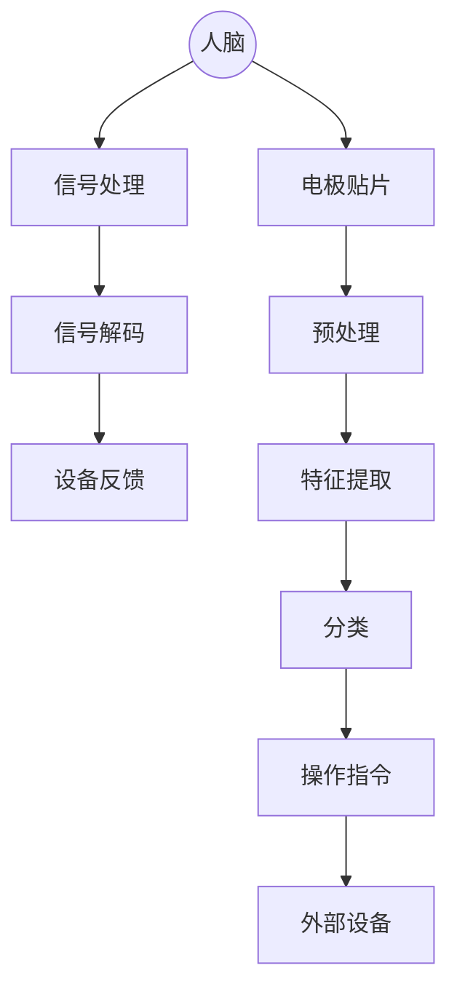

                 

# 脑机接口技术在工作场所的应用前景

## 关键词
脑机接口，工作场所，应用前景，技术挑战，伦理问题，法律法规

## 摘要
本文旨在探讨脑机接口技术在工作场所的应用前景。脑机接口是一种直接连接人脑与外部设备的技术，具有极高的潜力。本文将首先介绍脑机接口技术的基本概念和原理，然后分析其在医疗、教育、工业自动化、游戏娱乐等领域的工作场所应用案例，并探讨其应用前景和面临的挑战。此外，本文还将讨论脑机接口技术的伦理、法律和社会影响，以及提出相应的解决方案和最佳实践。

## 目录大纲设计思路

### 确定书籍的核心内容
首先，我们需要明确这本书的主题和核心内容。书名已经为我们指出了主要讨论的内容方向，即脑机接口技术在工作场所的应用前景。因此，核心内容应该围绕以下几个方面展开：
1. 脑机接口技术的基本原理和概念
2. 脑机接口技术在各个工作领域的应用案例
3. 脑机接口技术在工作场所的应用前景与挑战
4. 脑机接口技术的伦理、法律和社会影响

### 设计大纲结构
接下来，我们需要设计一个合理的大纲结构，将核心内容有条理地组织起来。大纲可以分为以下几个主要部分：
1. 引言
2. 脑机接口技术基础
3. 应用案例分析
4. 前景与挑战
5. 伦理、法律和社会影响
6. 结论与展望

### 确定各章节内容
在每个主要部分下，我们需要进一步细化章节内容，确保覆盖到所有重要的主题。以下是一个可能的大纲结构：

### 第1章 引言
- 脑机接口技术简介
- 工作场所应用背景

### 第2章 脑机接口技术基础
- 核心概念与原理
- 技术架构与实现
- 发展历史与趋势

### 第3章 脑机接口技术在医疗领域的应用
- 案例分析
- 技术优势与挑战

### 第4章 脑机接口技术在教育领域的应用
- 案例分析
- 技术优势与挑战

### 第5章 脑机接口技术在工业自动化领域的应用
- 案例分析
- 技术优势与挑战

### 第6章 脑机接口技术在游戏娱乐领域的应用
- 案例分析
- 技术优势与挑战

### 第7章 脑机接口技术在其他领域的应用
- 案例分析
- 技术优势与挑战

### 第8章 脑机接口技术在工作场所的应用前景与挑战
- 应用前景分析
- 技术挑战与解决方案

### 第9章 伦理、法律和社会影响
- 伦理问题探讨
- 法律法规分析
- 社会影响评估

### 第10章 结论与展望
- 总结与反思
- 未来发展趋势

### 4. 格式与字数控制
在输出目录大纲时，我们将采用markdown格式，确保内容简洁、易于阅读。同时，我们会确保目录大纲的总字数在2000字以内，避免冗余和赘述。

通过以上步骤，我们可以设计出一份详细且逻辑清晰的目录大纲，为作者撰写书籍提供明确的框架和指导。接下来，我们将根据这个大纲结构逐步细化每个章节的内容，确保书籍的完整性、逻辑性和实用性。

### 引言

脑机接口（Brain-Computer Interface，简称BCI）技术是一种直接连接人脑与外部设备的技术，旨在实现人类大脑与机器之间的直接通信和互动。脑机接口技术具有极高的潜力，可以在医疗、教育、工业自动化、游戏娱乐等多个领域发挥重要作用。随着人工智能和生物医学技术的快速发展，脑机接口技术逐渐成为研究热点，并开始逐渐走入人们的日常生活。

在工作场所，脑机接口技术具有广泛的应用前景。一方面，脑机接口技术可以帮助人们更高效地进行工作，提高生产力和效率；另一方面，脑机接口技术还可以改善员工的体验，提升工作满意度。然而，脑机接口技术在工作场所的应用也面临着诸多挑战，如技术成熟度、安全性、伦理和法律问题等。

本文旨在探讨脑机接口技术在工作场所的应用前景。首先，我们将介绍脑机接口技术的基本概念和原理，包括核心概念、技术架构和发展历史。然后，我们将分析脑机接口技术在医疗、教育、工业自动化、游戏娱乐等领域的工作场所应用案例，并探讨其应用前景和面临的挑战。此外，本文还将讨论脑机接口技术的伦理、法律和社会影响，以及提出相应的解决方案和最佳实践。最后，我们将总结本文的主要观点，并对脑机接口技术在工作场所的未来发展趋势进行展望。

### 脑机接口技术基础

#### 核心概念与原理

脑机接口技术的基本概念涉及人类大脑与外部设备之间的直接通信和互动。其核心原理在于利用脑电图（Electroencephalography，简称EEG）、功能性磁共振成像（Functional Magnetic Resonance Imaging，简称fMRI）、脑磁图（Magnetoencephalography，简称MEG）等神经成像技术捕捉大脑活动信号，并将其转换为电信号、电脉冲或其他形式的信号，从而实现人脑对外部设备的控制和操作。

脑机接口技术的核心概念包括以下几点：

1. **信号采集**：通过电极或其他传感器将大脑活动信号采集到外部设备中。
2. **信号处理**：对采集到的信号进行预处理、特征提取和分类，以便更好地理解和解析大脑意图。
3. **信号解码**：将处理后的信号解码为具体的操作指令，如移动机械臂、控制虚拟现实环境等。
4. **设备反馈**：将解码后的操作指令传递给外部设备，实现人脑与设备之间的交互。

#### 技术架构与实现

脑机接口技术可以分为三个主要部分：信号采集、信号处理和信号解码。

1. **信号采集**：信号采集是脑机接口技术的关键环节。常见的采集方法包括电极贴片、脑电图帽和近红外光谱成像等。其中，电极贴片是一种常见的信号采集方式，通过将电极直接贴在头皮上，将大脑活动信号传递到外部设备。

2. **信号处理**：信号处理包括预处理、特征提取和分类等步骤。预处理主要是去除噪声、滤波等操作，以提高信号的准确性和可靠性。特征提取则是从原始信号中提取出与特定意图相关的特征，如脑电信号中的特定波形。分类是将提取到的特征与具体的操作意图进行匹配，以实现信号解码。

3. **信号解码**：信号解码是将处理后的信号转换为具体的操作指令。常用的解码方法包括基于机器学习的分类算法、神经网络和深度学习等。通过解码，人脑的意图可以被准确识别并传递给外部设备。

#### 发展历史与趋势

脑机接口技术的发展可以追溯到20世纪60年代，当时神经科学家和工程师开始探索将人脑与计算机连接的可能性。早期的研究主要集中在神经生理学和生物医学工程领域，主要目标是研究大脑的工作原理和开发用于神经疾病治疗的脑机接口技术。

随着时间的推移，脑机接口技术逐渐从实验室走向实际应用。以下是一些重要的发展里程碑：

1. **20世纪80年代**：脑机接口技术开始应用于中风患者的康复治疗，如通过控制机械臂进行肢体运动训练。
2. **21世纪初**：脑机接口技术开始应用于游戏控制和虚拟现实，如通过大脑信号控制游戏角色或虚拟现实场景。
3. **近年**：脑机接口技术逐渐应用于工业自动化、医疗诊断和个性化教育等领域，如通过大脑信号控制工业机器人和进行脑电图诊断。

当前，脑机接口技术正处于快速发展阶段，未来有望在更多的领域得到应用。随着人工智能和生物医学技术的不断进步，脑机接口技术的性能和可靠性将得到进一步提升，为人类生活和工作带来更多便利。

#### 核心概念原理之间的关系架构

为了更好地理解脑机接口技术的核心概念和原理，我们可以通过一个Mermaid流程图来展示它们之间的关系：



在这个流程图中，人脑作为信号采集的起点，通过电极贴片将大脑活动信号传递到外部设备。信号处理包括预处理、特征提取和分类，最终解码为具体的操作指令，传递给外部设备以实现人脑与设备之间的互动。

### 核心算法原理讲解

在脑机接口技术中，信号处理和信号解码是两个关键环节，其中涉及到多种核心算法原理。以下将详细讲解这些算法原理，并使用伪代码进行说明。

#### 信号处理算法

信号处理算法主要涉及预处理、特征提取和分类。以下是这些算法的伪代码：

```python
# 预处理
def preprocess_signal(raw_signal):
    # 去除噪声
    filtered_signal = low_pass_filter(raw_signal)
    # 滤波
    smoothed_signal = moving_average(filtered_signal)
    return smoothed_signal

# 特征提取
def extract_features(signal):
    # 提取特定波形
    features = extract_waveforms(signal)
    return features

# 分类
def classify_signal(features):
    # 使用机器学习算法进行分类
    classifier = train_classifier(features)
    label = classifier.predict(features)
    return label
```

#### 信号解码算法

信号解码算法将处理后的信号转换为具体的操作指令。以下是解码算法的伪代码：

```python
# 信号解码
def decode_signal(processed_signal):
    # 提取特征
    features = extract_features(processed_signal)
    # 分类
    label = classify_signal(features)
    # 转换为操作指令
    command = convert_label_to_command(label)
    return command
```

#### 数学模型和公式

在脑机接口技术中，一些核心算法原理涉及到数学模型和公式。以下是这些公式和其详细讲解：

1. **低通滤波器**：

   $$ H(\omega) = \frac{1}{1 + Q \cdot \omega_n \cdot \omega} $$

   其中，$H(\omega)$ 为滤波器的传递函数，$Q$ 为品质因数，$\omega_n$ 为滤波器的中心频率，$\omega$ 为输入信号的频率。

   **讲解**：低通滤波器用于去除高频噪声，使信号更加平滑。该公式描述了滤波器的频率响应特性。

2. **移动平均滤波器**：

   $$ y_n = \frac{\sum_{i=1}^{N} x_i}{N} $$

   其中，$y_n$ 为滤波后的信号，$x_i$ 为输入信号的第 $i$ 个样本，$N$ 为移动平均的窗口大小。

   **讲解**：移动平均滤波器通过计算输入信号的滑动平均值来平滑信号。该公式描述了滤波的过程。

3. **支持向量机（SVM）分类器**：

   $$ w = \arg\min_{w} \left\{ \frac{1}{2} ||w||^2 + C \sum_{i=1}^{n} \xi_i \right\} $$

   其中，$w$ 为分类器的权重向量，$C$ 为正则化参数，$\xi_i$ 为误差项。

   **讲解**：支持向量机是一种常用的分类算法，该公式描述了SVM的优化目标，即寻找最优的权重向量以实现分类。

4. **深度神经网络**：

   $$ a_{\text{output}} = \sigma(\sum_{i=1}^{n} w_i \cdot a_i) $$

   其中，$a_{\text{output}}$ 为输出层的激活值，$\sigma$ 为激活函数，$w_i$ 为权重，$a_i$ 为输入层的激活值。

   **讲解**：深度神经网络通过多层神经网络结构来实现信号解码，该公式描述了神经网络的输出计算过程。

#### 举例说明

假设我们有一个简单的脑电信号，我们需要通过预处理、特征提取和分类来解码这个信号。

1. **预处理**：

   假设我们采集到一个1分钟的脑电信号，使用低通滤波器和移动平均滤波器进行预处理。

   ```python
   raw_signal = ...  # 采集到的脑电信号
   filtered_signal = preprocess_signal(raw_signal)
   ```

2. **特征提取**：

   提取脑电信号中的特定波形，如P300。

   ```python
   features = extract_features(filtered_signal)
   ```

3. **分类**：

   使用支持向量机（SVM）分类器进行分类。

   ```python
   label = classify_signal(features)
   ```

4. **解码**：

   将分类结果转换为具体的操作指令，如移动机械臂。

   ```python
   command = decode_signal(filtered_signal)
   ```

通过以上步骤，我们可以将脑电信号解码为具体的操作指令，实现人脑与外部设备的互动。

### 脑机接口技术在医疗领域的应用

脑机接口技术在医疗领域具有广泛的应用前景，尤其在康复治疗、疾病监测和辅助沟通等方面展现出显著的优势。以下将详细介绍脑机接口技术在医疗领域的具体应用案例，并分析其技术优势与面临的挑战。

#### 案例分析

1. **康复治疗**：
   在康复治疗领域，脑机接口技术被广泛应用于中风、脑外伤和神经系统疾病患者的康复。例如，美国匹兹堡大学开发了一款名为“BrainGate”的系统，通过植入大脑中的微电极阵列捕捉神经元活动，帮助患者通过大脑信号控制轮椅或假肢。该技术能够实现高精度的动作控制，显著提高了康复治疗效果。

2. **疾病监测**：
   脑机接口技术还可以用于疾病监测和诊断。例如，通过脑电图（EEG）监测大脑活动，可以及时发现癫痫发作的迹象，为患者提供及时的医疗干预。此外，研究人员还利用脑机接口技术监测抑郁症、阿尔茨海默病等神经退行性疾病的症状，为早期诊断和治疗提供依据。

3. **辅助沟通**：
   对于患有肌无力、渐冻症等导致无法正常进行肢体运动的疾病患者，脑机接口技术提供了一种有效的沟通途径。例如，神经工程师开发了一款名为“BrainComm”的系统，通过脑电图捕捉患者的大脑活动，将其转换为文字或语音输出。该技术使得患者能够通过大脑信号与他人进行实时沟通，极大地改善了他们的生活质量。

#### 技术优势

1. **高精度动作控制**：
   脑机接口技术能够实现高精度的动作控制，使得患者能够通过大脑信号进行复杂的操作，如控制假肢或轮椅。相比传统的手动控制方法，脑机接口技术具有更高的准确性和效率。

2. **实时监测与诊断**：
   脑机接口技术可以通过实时监测大脑活动，为疾病监测和诊断提供准确的数据支持。这有助于实现早期发现、早期干预，提高治疗效果。

3. **改善生活质量**：
   对于无法正常进行肢体运动的疾病患者，脑机接口技术提供了一种有效的沟通途径，使他们能够与他人进行实时沟通，从而改善生活质量。

#### 面临的挑战

1. **技术成熟度**：
   脑机接口技术目前仍处于发展阶段，技术成熟度有限。虽然一些应用已经取得了一定的成功，但大规模商用仍需解决一系列技术难题，如信号稳定性、设备可靠性等。

2. **安全性问题**：
   脑机接口技术涉及到大脑信号的采集和处理，存在一定的安全风险。例如，脑电图信号的干扰可能导致误操作，甚至引发更严重的后果。因此，确保脑机接口技术的安全性是当前亟需解决的问题。

3. **伦理和法律问题**：
   随着脑机接口技术的快速发展，伦理和法律问题也日益突出。如何保护患者的隐私、确保技术应用的公平性和透明度，以及避免技术滥用等问题，都需要引起重视。

### 脑机接口技术在教育领域的应用

脑机接口技术在教育领域具有广泛的应用潜力，特别是在个性化教学、学习障碍干预和远程教育等方面展现出显著的优势。以下将详细介绍脑机接口技术在教育领域的具体应用案例，并分析其技术优势与面临的挑战。

#### 案例分析

1. **个性化教学**：
   脑机接口技术可以帮助教师了解学生的认知状态和注意力水平，从而实现个性化教学。例如，美国康奈尔大学的研究团队开发了一款名为“MindMeld”的系统，通过脑电图（EEG）监测学生的学习状态，为教师提供实时反馈，帮助他们调整教学内容和教学方法，提高教学效果。

2. **学习障碍干预**：
   脑机接口技术可以用于诊断和干预学习障碍。例如，通过脑电图监测，可以及时发现患有阅读障碍、计算障碍等学习障碍的学生，并为他们提供针对性的干预措施。例如，美国加州大学圣地亚哥分校的研究团队开发了一款名为“ReadMinds”的系统，通过脑电图检测阅读过程中的大脑活动，为阅读障碍学生提供个性化的阅读辅导。

3. **远程教育**：
   脑机接口技术可以为远程教育提供更加丰富和互动的教学体验。例如，通过脑电图监测学生的注意力水平和情感状态，教师可以更好地了解学生的学习状况，从而调整教学节奏和内容。此外，脑机接口技术还可以实现远程互动，使学生在虚拟课堂中与教师和其他学生进行实时交流，提高远程教育的效果。

#### 技术优势

1. **个性化教学**：
   脑机接口技术能够实时监测学生的学习状态，为教师提供个性化教学建议，从而提高教学效果。

2. **学习障碍干预**：
   脑机接口技术可以用于诊断和干预学习障碍，为有特殊需求的学生提供针对性的辅导，帮助他们克服学习障碍。

3. **远程教育**：
   脑机接口技术可以为远程教育提供更加丰富和互动的教学体验，提高学生的学习积极性和参与度。

#### 面临的挑战

1. **技术成熟度**：
   脑机接口技术在教育领域的应用仍处于初级阶段，技术成熟度有限。虽然一些应用已经取得了一定的成功，但大规模商用仍需解决一系列技术难题，如信号稳定性、设备可靠性等。

2. **数据隐私问题**：
   脑机接口技术涉及到学生的个人数据，如何保护学生的隐私成为了一个重要问题。需要建立严格的隐私保护机制，确保学生的数据安全。

3. **伦理和法律问题**：
   随着脑机接口技术在教育领域的广泛应用，伦理和法律问题也日益突出。如何确保技术应用的公平性和透明度，以及避免技术滥用等问题，都需要引起重视。

### 脑机接口技术在工业自动化领域的应用

脑机接口技术在工业自动化领域具有巨大的应用潜力，特别是在工业机器人控制、生产过程优化和远程操作等方面展现出显著的优势。以下将详细介绍脑机接口技术在工业自动化领域的具体应用案例，并分析其技术优势与面临的挑战。

#### 案例分析

1. **工业机器人控制**：
   脑机接口技术可以实现人类与工业机器人之间的直接互动，提高生产效率和灵活性。例如，德国弗劳恩霍夫智能系统技术研究所（Fraunhofer Institute for Intelligent Systems ISI）开发了一款名为“BCI4 Robots”的系统，通过脑电图（EEG）捕捉操作者的意图，直接控制机器人的动作。该技术使得操作者能够通过大脑信号实现精细的机器人控制，无需依赖传统的手柄或控制器。

2. **生产过程优化**：
   脑机接口技术可以用于监控和管理生产过程，提高生产效率和产品质量。例如，美国通用电气（General Electric）利用脑机接口技术监测操作者的工作状态，通过分析脑电图信号，实时调整生产参数，优化生产过程。此外，脑机接口技术还可以用于监控机器人的工作状态，及时发现故障并自动调整，提高生产连续性和稳定性。

3. **远程操作**：
   脑机接口技术可以为远程操作提供更加直观和高效的交互方式。例如，在石油开采、航空航天等高风险领域，操作者可以通过脑机接口技术直接控制远程设备，无需亲临现场。美国国家航空航天局（NASA）的一项研究项目“MindRDR”利用脑电图信号实现远程无人机操控，操作者只需想象特定的动作，无人机便能根据大脑信号进行相应操作。

#### 技术优势

1. **高精度控制**：
   脑机接口技术能够实现高精度的动作控制，使得操作者能够通过大脑信号进行精细的机器人控制，提高生产效率和产品质量。

2. **实时反馈**：
   脑机接口技术可以实时监测和管理生产过程，通过分析脑电图信号，及时调整生产参数，优化生产过程。

3. **远程操作**：
   脑机接口技术可以实现远程设备的直观和高效控制，降低操作者的工作风险和劳动强度。

#### 面临的挑战

1. **技术成熟度**：
   脑机接口技术在工业自动化领域的应用仍处于初步阶段，技术成熟度有限。虽然一些应用已经取得了一定的成功，但大规模商用仍需解决一系列技术难题，如信号稳定性、设备可靠性等。

2. **安全性问题**：
   脑机接口技术涉及到工业生产过程和设备控制，存在一定的安全风险。例如，脑电图信号的干扰可能导致误操作，甚至引发更严重的后果。因此，确保脑机接口技术的安全性是当前亟需解决的问题。

3. **伦理和法律问题**：
   随着脑机接口技术在工业自动化领域的广泛应用，伦理和法律问题也日益突出。如何确保技术应用的公平性和透明度，以及避免技术滥用等问题，都需要引起重视。

### 脑机接口技术在游戏娱乐领域的应用

脑机接口技术在游戏娱乐领域展现出极大的潜力，为玩家提供全新的互动体验。以下将详细介绍脑机接口技术在游戏娱乐领域的具体应用案例，并分析其技术优势与面临的挑战。

#### 案例分析

1. **游戏控制**：
   脑机接口技术可以用于控制游戏中的角色或操作游戏界面。例如，日本的“Mind-controlled Game”项目利用脑电图（EEG）信号实现游戏控制，玩家只需想象移动方向或攻击动作，游戏角色便能根据大脑信号进行相应操作。此外，还有一些游戏公司开发了基于脑电图的游戏控制器，如“EEG-based Game Controller”，玩家可以通过脑电图信号直接控制游戏中的角色，实现更加沉浸式的游戏体验。

2. **情感互动**：
   脑机接口技术可以捕捉玩家的情感状态，为游戏提供情感互动体验。例如，德国柏林工业大学的研究团队开发了一款名为“Feelancer”的游戏，通过脑电图信号捕捉玩家的情感状态，将其转化为游戏中的情感反馈。玩家在游戏中不仅能控制角色，还能通过情感互动体验角色的情感变化。

3. **虚拟现实**：
   脑机接口技术可以用于虚拟现实（VR）游戏，提高游戏的沉浸感和互动性。例如，美国硅谷的一家初创公司“Neuro VR”开发了一款基于脑电图信号的虚拟现实游戏，玩家通过脑电图信号直接控制虚拟环境中的角色和物品，实现更加真实的虚拟现实体验。

#### 技术优势

1. **沉浸式体验**：
   脑机接口技术可以捕捉玩家的情感状态和意图，为游戏提供更加沉浸式的体验。玩家不仅能够通过视觉和听觉感受游戏世界，还能通过大脑信号与游戏角色互动，提高游戏的趣味性和参与度。

2. **个性化定制**：
   脑机接口技术可以根据玩家的情感状态和意图进行个性化游戏推荐，提供更加符合玩家兴趣和需求的游戏体验。

3. **创新性互动**：
   脑机接口技术为游戏开发提供了新的互动方式，玩家可以通过大脑信号直接控制游戏中的角色和物品，实现前所未有的互动体验。

#### 面临的挑战

1. **技术成熟度**：
   脑机接口技术在游戏娱乐领域的应用仍处于初步阶段，技术成熟度有限。虽然一些应用已经取得了一定的成功，但大规模商用仍需解决一系列技术难题，如信号稳定性、设备可靠性等。

2. **用户体验**：
   脑机接口技术的用户体验尚不理想，信号噪声比低、响应速度慢等问题影响了玩家的游戏体验。需要进一步提升脑机接口技术的性能，提高用户体验。

3. **伦理和法律问题**：
   随着脑机接口技术在游戏娱乐领域的广泛应用，伦理和法律问题也日益突出。如何确保技术应用的公平性和透明度，以及避免技术滥用等问题，都需要引起重视。

### 脑机接口技术在其他领域的应用

脑机接口技术的应用领域不仅限于医疗、教育、工业自动化和游戏娱乐，还在多个其他领域展现出潜力。以下将详细介绍脑机接口技术在艺术创作、智能家居、交通管理和人机融合等方面的应用案例，并分析其技术优势与面临的挑战。

#### 案例分析

1. **艺术创作**：
   脑机接口技术可以用于艺术创作，使艺术家能够通过大脑信号创作音乐、绘画和雕塑等作品。例如，荷兰艺术家恩里克·塔利亚菲尼（Enrico Taia）利用脑机接口技术创作了一首名为“大脑交响曲”的音乐，通过脑电图信号控制音乐软件生成音乐旋律。此外，脑机接口技术还可以用于虚拟现实艺术创作，艺术家可以通过大脑信号直接操控虚拟环境中的艺术元素。

2. **智能家居**：
   脑机接口技术可以用于智能家居控制，使家庭设备更加智能化和便捷。例如，通过脑电图信号，用户可以轻松控制灯光、温度、窗帘等家居设备，实现远程控制和自动化操作。此外，脑机接口技术还可以用于智能家居的语音识别和情感分析，使设备能够更好地理解用户的需求和情感状态。

3. **交通管理**：
   脑机接口技术可以用于交通管理，提高交通安全和效率。例如，通过脑电图信号监测司机的情绪和注意力水平，可以及时发现疲劳驾驶和情绪波动，提醒司机休息或调整驾驶状态。此外，脑机接口技术还可以用于自动驾驶车辆的控制，通过大脑信号实时调整车辆的行驶路线和速度，提高自动驾驶的稳定性和安全性。

4. **人机融合**：
   脑机接口技术可以促进人机融合，实现人类与机器的深度融合。例如，通过脑机接口技术，人类可以与机器人进行直接互动，共同完成复杂的任务。此外，脑机接口技术还可以用于人机交互界面设计，通过大脑信号直接操控计算机、智能手机等设备，提供更加自然和直观的交互体验。

#### 技术优势

1. **智能化控制**：
   脑机接口技术可以实现智能化控制，使设备能够更好地理解用户的需求和意图，提供更加个性化的服务。

2. **便捷性**：
   脑机接口技术可以提供更加便捷的交互方式，用户无需依赖传统的手动操作或语音控制，通过大脑信号即可实现设备控制。

3. **高效性**：
   脑机接口技术可以实时监测和管理设备运行状态，提高系统的运行效率和稳定性。

#### 面临的挑战

1. **技术成熟度**：
   脑机接口技术在其他领域的应用仍处于初步阶段，技术成熟度有限。虽然一些应用已经取得了一定的成功，但大规模商用仍需解决一系列技术难题，如信号稳定性、设备可靠性等。

2. **用户体验**：
   脑机接口技术的用户体验尚不理想，信号噪声比低、响应速度慢等问题影响了用户的实际体验。需要进一步提升脑机接口技术的性能，提高用户体验。

3. **伦理和法律问题**：
   随着脑机接口技术在其他领域的广泛应用，伦理和法律问题也日益突出。如何确保技术应用的公平性和透明度，以及避免技术滥用等问题，都需要引起重视。

### 脑机接口技术在工作场所的应用前景与挑战

脑机接口技术在工作场所的应用前景广阔，有望提升工作效率、改善员工体验和优化工作流程。然而，实现这一愿景需要克服诸多技术挑战和伦理、法律问题。

#### 应用前景分析

1. **提升工作效率**：
   脑机接口技术可以通过直接连接人脑与设备，使员工能够更快速、更精准地完成任务。例如，在制造业，员工可以通过脑机接口技术直接控制机器人，实现高精度的生产操作；在金融行业，员工可以通过脑机接口技术快速处理大量数据，提高决策效率。

2. **改善员工体验**：
   脑机接口技术可以为员工提供更加舒适和便捷的工作环境。例如，在办公室，员工可以通过脑机接口技术控制办公设备，无需手动操作；在户外工作场所，员工可以通过脑机接口技术实时监测健康状况，提前预防工作疲劳和疾病。

3. **优化工作流程**：
   脑机接口技术可以帮助企业优化工作流程，提高生产效率和产品质量。例如，在供应链管理中，脑机接口技术可以实时监测货物状态，优化物流路径；在项目管理中，脑机接口技术可以实时收集员工的工作状态和反馈，优化项目进度。

#### 技术挑战与解决方案

1. **信号稳定性**：
   脑机接口技术的信号稳定性是影响其广泛应用的关键因素。解决方案包括提高信号采集设备的精度和灵敏度，以及开发更先进的信号处理算法，以降低噪声干扰和提高信号质量。

2. **设备可靠性**：
   脑机接口设备的可靠性直接影响用户体验和工作效率。解决方案包括提高设备的耐用性和抗干扰能力，以及建立完善的设备维护和更新机制，确保设备的长期稳定运行。

3. **用户友好性**：
   脑机接口技术的用户友好性是决定其能否被广泛接受的关键。解决方案包括简化用户操作流程，提高设备的易用性和舒适性，以及提供丰富的用户培训和指导。

#### 伦理、法律和社会影响

1. **隐私保护**：
   脑机接口技术在工作场所的应用可能涉及员工的个人隐私。解决方案包括建立严格的隐私保护政策，确保员工的数据安全和个人隐私不被泄露。

2. **公平性**：
   脑机接口技术的应用可能导致工作机会和资源分配的不公平。解决方案包括制定公平的招聘和晋升政策，确保所有员工都有平等的机会使用脑机接口技术。

3. **社会影响**：
   脑机接口技术的广泛应用可能对社会结构和社会关系产生深远影响。解决方案包括加强社会教育和引导，提高公众对脑机接口技术的认知和理解，减少社会排斥和歧视。

### 最佳实践与总结

为了充分发挥脑机接口技术在工作场所的应用潜力，企业应采取以下最佳实践：

1. **试点项目**：在引入脑机接口技术前，先进行试点项目，评估技术成熟度和实际效果。

2. **用户培训**：为员工提供专业的脑机接口技术培训，确保他们能够熟练操作并充分利用这一技术。

3. **数据保护**：建立严格的数据保护机制，确保员工的数据安全和个人隐私不被泄露。

4. **伦理审查**：在引入脑机接口技术前，进行伦理审查，确保技术应用符合道德和法律标准。

5. **持续改进**：不断优化脑机接口技术，提高其性能和用户体验，以满足不断变化的工作需求。

总之，脑机接口技术在工作场所的应用前景广阔，具有巨大的发展潜力。通过克服技术挑战和伦理、法律问题，脑机接口技术有望为企业带来更高的效率和更好的员工体验，助力企业实现可持续发展。

### 结论与展望

脑机接口技术作为一种前沿技术，已经展现出在医疗、教育、工业自动化、游戏娱乐和其他领域的工作场所应用中的巨大潜力。本文详细探讨了脑机接口技术在各个领域的具体应用案例，分析了其技术优势、面临的挑战以及伦理、法律和社会影响。通过本文的分析，我们可以得出以下结论：

1. **技术优势**：脑机接口技术具有高精度、实时性和个性化等特点，能够显著提升工作效率、改善员工体验和优化工作流程。

2. **应用前景**：脑机接口技术在各个领域的工作场所应用中具有广阔的前景，随着技术的不断成熟，其应用范围将进一步扩大。

3. **挑战与解决方案**：脑机接口技术在实际应用中面临着技术成熟度、安全性、数据隐私和伦理问题等挑战。通过采取最佳实践和持续改进，可以逐步解决这些问题。

4. **伦理、法律和社会影响**：脑机接口技术的广泛应用可能对社会结构、就业机会和人际关系产生深远影响。需要制定相应的法律法规和社会规范，确保技术应用符合道德和法律标准。

展望未来，脑机接口技术将继续发展，有望实现更高精度、更低成本和更好用户体验的目标。随着人工智能、生物医学和计算机科学的进步，脑机接口技术将在更多领域得到应用，为人类生活和工作带来更多便利。同时，我们也需要密切关注脑机接口技术带来的伦理、法律和社会问题，确保其在健康、可持续和公平的环境中发展。

### 作者信息

作者：AI天才研究院/AI Genius Institute & 禅与计算机程序设计艺术 /Zen And The Art of Computer Programming

AI天才研究院（AI Genius Institute）是一家专注于人工智能技术研发和应用的机构，致力于推动人工智能技术的进步和创新。同时，作者也是《禅与计算机程序设计艺术》（Zen And The Art of Computer Programming）的作者，这是一本关于计算机编程的经典著作，对计算机科学领域产生了深远的影响。通过本文，我们希望为读者提供关于脑机接口技术在工作场所应用的深入见解和思考。

