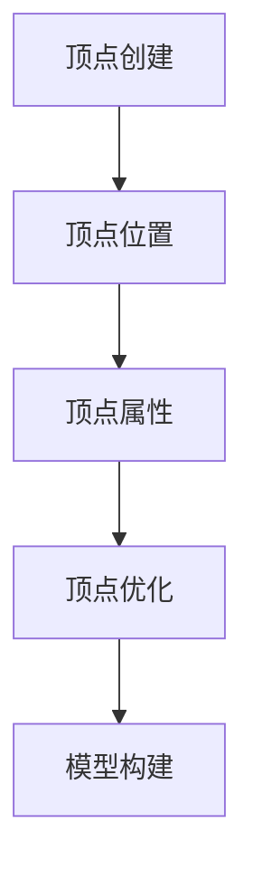
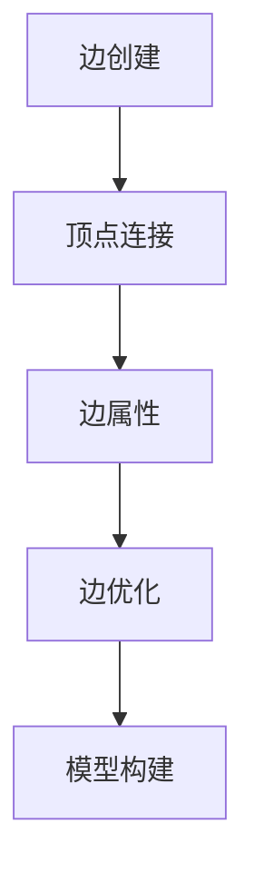
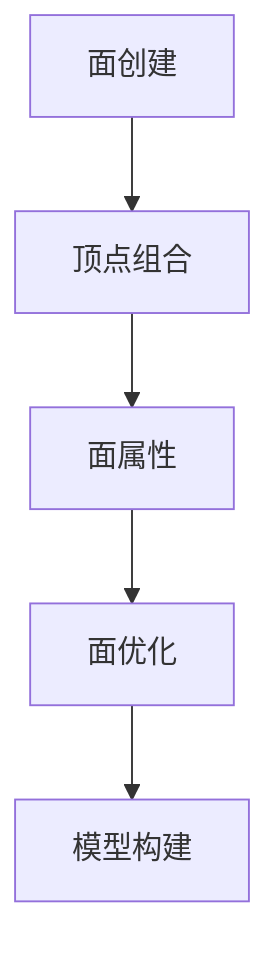
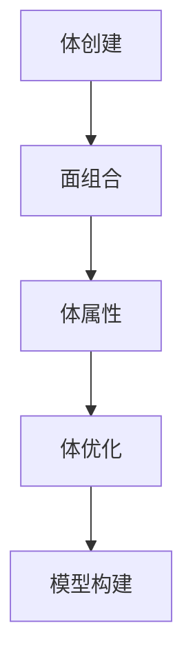
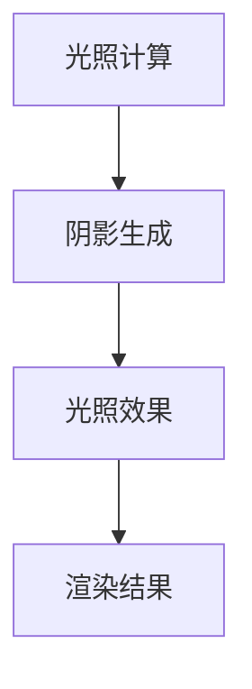
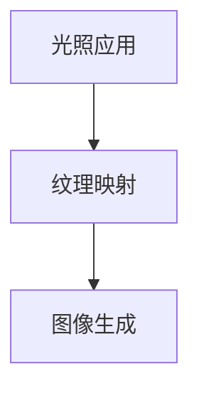

                 

## 文章标题

《虚拟现实在建筑设计可视化中的应用》

## 关键词

虚拟现实，建筑设计，可视化，几何建模，渲染算法，交互技术

## 摘要

本文深入探讨了虚拟现实技术在建筑设计可视化中的应用。首先，我们从背景介绍入手，探讨了虚拟现实和建筑设计的基本概念及其相互关联。接着，我们详细解析了虚拟现实在建筑设计可视化中的核心算法原理，包括几何建模与渲染算法，并使用伪代码进行了详细阐述。此外，我们还介绍了交互技术及其在用户界面设计中的应用。随后，通过实际案例展示了虚拟现实在建筑设计中的具体应用，并分析了其发展趋势和未来展望。最后，我们提供了虚拟现实与建筑设计可视化的工具介绍和最佳实践建议，为读者提供了全面而深入的技术指导。

## 引言

虚拟现实（Virtual Reality，简称VR）是一种通过计算机生成模拟环境，使人在虚拟环境中感受到高度沉浸和交互体验的技术。它能够模拟现实世界的三维空间，并通过头戴式显示器、手柄等设备提供视觉、听觉、触觉等多感官的沉浸式体验。近年来，随着计算机技术、传感器技术和显示技术的发展，虚拟现实在各个领域得到了广泛应用，尤其是在建筑设计可视化领域展现出了巨大的潜力。

建筑设计可视化是设计师和建筑师在项目设计阶段展示其设计意图的重要手段。传统的建筑设计可视化主要依赖于二维图纸和三维模型，而虚拟现实技术的引入，使得设计师能够更加直观地呈现建筑形态、空间布局和环境氛围，从而提高设计效率和沟通效果。通过虚拟现实技术，设计师可以创建高度仿真的建筑场景，使客户和利益相关方能够提前体验和评估建筑项目的实际效果，减少误解和修改成本。

本文将从以下几个方面对虚拟现实在建筑设计可视化中的应用进行深入探讨：

1. 背景介绍：介绍虚拟现实和建筑设计的基本概念，以及它们之间的关联。
2. 核心概念与联系：通过Mermaid流程图展示核心概念之间的关系。
3. 核心算法原理讲解：详细解析几何建模与渲染算法，并使用伪代码进行阐述。
4. 交互技术介绍：探讨交互技术在用户界面设计中的应用。
5. 实际应用案例：通过具体案例展示虚拟现实在建筑设计中的实际应用。
6. 发展趋势与未来展望：分析虚拟现实技术的未来发展方向和建筑设计可视化技术的趋势。
7. 工具介绍与最佳实践：介绍常用的虚拟现实与建筑设计可视化工具，并提供最佳实践建议。

通过本文的阅读，读者将全面了解虚拟现实在建筑设计可视化中的应用，掌握相关核心算法和技术，并对未来虚拟现实与建筑设计的发展趋势有更深刻的认识。

### 背景介绍

虚拟现实（VR）和建筑设计（Architectural Design）作为两个看似不同的领域，却在实际应用中紧密相连，共同推动了建筑行业的创新和进步。虚拟现实技术通过计算机生成模拟环境，为用户提供一种沉浸式的交互体验，而建筑设计则是为了创造出功能合理、美观舒适的空间环境。

虚拟现实技术的基本概念可以追溯到20世纪60年代，当时计算机科学家开始探索如何通过计算机生成三维图像，并将其显示在屏幕上。随着技术的发展，VR设备如头戴式显示器（HMD）、跟踪器和触觉手套等逐步问世，使虚拟环境中的交互体验更加真实和丰富。虚拟现实不仅仅是视觉上的模拟，还包括听觉、触觉等多种感官的刺激，为用户提供了全身心的沉浸体验。

建筑设计则是一门综合性很强的学科，涉及到建筑艺术、结构工程、环境科学等多个领域。建筑师通过二维图纸和三维模型表达自己的设计理念，而虚拟现实技术为这种表达提供了新的手段。传统的建筑设计可视化方法主要依赖于二维平面图和三维模型，这些方法虽然能够展示建筑的基本形态和空间布局，但在表达复杂空间关系和用户体验方面存在一定的局限性。

虚拟现实与建筑设计的关联可以从多个方面来理解：

1. **设计沟通与反馈**：在建筑设计过程中，设计师需要与客户、工程师和其他利益相关者进行有效的沟通。通过虚拟现实技术，设计师可以创建高度仿真的建筑场景，使所有参与者能够直观地体验和评估设计效果。这种沉浸式的展示方式有助于减少误解和修改成本，提高设计效率和沟通效果。

2. **空间模拟与优化**：虚拟现实技术能够模拟建筑在不同环境条件下的表现，如光照、气候和人流等。设计师可以利用这些模拟结果对建筑方案进行优化，从而提高建筑的功能性和舒适性。例如，通过模拟自然光照，设计师可以评估不同朝向和窗户布局对室内光照的影响，进而选择最优的布局方案。

3. **用户体验评估**：虚拟现实技术允许设计师在建筑完成之前就模拟用户在建筑中的实际体验。通过这种方式，设计师可以提前发现和解决潜在的问题，如交通流线设计不合理、空间利用不充分等。用户可以在虚拟环境中进行导航、互动和体验，从而提供宝贵的反馈信息，帮助设计师进一步改进设计方案。

4. **可视化与艺术表达**：虚拟现实技术为建筑设计提供了更加丰富的可视化手段。通过渲染技术，设计师可以创造出高度逼真的建筑场景，使设计作品更具艺术感和表现力。这种视觉上的冲击力有助于吸引客户的注意力，增强设计的说服力。

总的来说，虚拟现实技术的引入为建筑设计可视化带来了全新的变革。它不仅提高了设计效率，减少了沟通成本，还使得建筑设计的表达更加生动和直观。在未来，随着虚拟现实技术的进一步发展，我们有理由相信，它将在建筑设计中发挥更加重要的作用，推动建筑行业的持续创新。

### 核心概念与联系

为了深入理解虚拟现实（VR）在建筑设计可视化中的应用，我们需要明确几个核心概念，并探讨它们之间的相互关系。以下是涉及的主要概念及其关联的Mermaid流程图：

```mermaid
graph TD
A[虚拟现实] --> B[三维建模]
A --> C[渲染技术]
B --> D[交互设计]
B --> E[模拟环境]
C --> F[光照模拟]
C --> G[视觉渲染]
D --> H[用户反馈]
D --> I[界面交互]
E --> J[建筑设计]
E --> K[环境布局]
F --> L[光照分析]
F --> M[视觉效果]
G --> N[真实感渲染]
G --> O[图像处理]
H --> P[用户研究]
H --> Q[用户体验]
I --> R[控制逻辑]
I --> S[交互反馈]
J --> T[空间规划]
J --> U[建筑形态]
K --> V[环境配置]
K --> W[布局优化]
L --> X[光照效果]
L --> Y[模拟分析]
M --> Z[视觉效果评估]
N --> AA[渲染质量]
N --> AB[渲染效率]
O --> AC[图像优化]
O --> AD[图像清晰度]
P --> AE[用户需求]
P --> AF[设计验证]
Q --> AG[用户体验评估]
Q --> AH[用户满意度]
R --> AI[响应速度]
R --> AJ[交互准确性]
S --> AK[用户操作]
S --> AL[反馈机制]
T --> AM[空间布局]
T --> AN[功能分布]
U --> AO[建筑风格]
U --> AP[设计理念]
V --> AQ[环境模拟]
V --> AR[环境调整]
W --> AS[布局优化]
W --> AT[空间利用]
X --> AU[光照效果评估]
X --> AV[照明设计]
Y --> AW[模拟结果]
Y --> AX[设计方案验证]
Z --> AY[视觉效果评价]
Z --> AZ[设计表现力]
AA --> BA[渲染质量评估]
BA --> BB[渲染性能]
BB --> BC[渲染精度]
BC --> BD[渲染效果]
AC --> CC[图像优化效果]
CC --> CD[图像清晰度评价]
AE --> CE[用户需求分析]
CE --> CF[设计调整]
AF --> DF[设计验证结果]
AG --> EG[用户体验评估]
EG --> EH[用户满意度评价]
AI --> HI[交互性能评估]
HI --> HJ[交互效果]
AJ --> HJ[交互准确性]
AK --> LK[用户操作反馈]
LK --> ML[设计改进]
AL --> MK[交互反馈机制]
AM --> DM[空间布局评价]
AN --> DN[功能分布评价]
AO --> EO[建筑风格评价]
AP --> DP[设计理念评价]
AQ --> EQ[环境模拟评价]
AR --> AR[环境调整效果]
AS --> SS[布局优化效果]
AT --> TT[空间利用评价]
AU --> UV[光照效果评价]
AV --> VW[照明设计评价]
AW --> WW[布局优化评价]
AX --> XX[设计方案验证效果]
AY --> YY[视觉效果评价]
BA --> BB[渲染质量评估]
CC --> CD[图像优化效果评估]
AE --> CF[用户需求分析结果]
AF --> DF[设计验证结果]
AG --> EH[用户满意度评价]
AI --> HI[交互性能评价]
AJ --> HJ[交互准确性评价]
AK --> ML[设计改进效果]
AL --> MK[交互反馈机制评价]
AM --> DM[空间布局评价]
AN --> DN[功能分布评价]
AO --> EO[建筑风格评价]
AP --> DP[设计理念评价]
AQ --> EQ[环境模拟评价]
AR --> VW[环境调整效果]
AS --> TT[布局优化效果]
AT --> TT[空间利用评价]
AU --> VW[光照效果评价]
AV --> VW[照明设计评价]
AW --> WW[布局优化效果]
AX --> XX[设计方案验证效果]
AY --> YY[视觉效果评价]
BA --> BD[渲染质量评估]
CC --> CD[图像优化效果评估]
```



**核心概念定义与解释**：

1. **虚拟现实（Virtual Reality）**：通过计算机生成模拟环境，为用户提供高度沉浸和交互体验的技术。
2. **三维建模（3D Modeling）**：创建三维对象和场景的过程，是虚拟现实的基础。
3. **渲染技术（Rendering）**：将三维模型转换为二维图像的过程，包括光照模拟、阴影生成和纹理映射等。
4. **交互设计（Interaction Design）**：设计用户与虚拟环境交互的方式，包括界面交互和控制逻辑。
5. **模拟环境（Simulation Environment）**：在虚拟现实中创建的模仿现实世界的环境。
6. **建筑设计（Architectural Design）**：涉及空间规划、建筑形态和风格设计等。
7. **环境布局（Environmental Layout）**：在建筑设计中，考虑建筑内外部空间布局和环境配置。

**流程图关系解析**：

- **A（虚拟现实）** 是整个流程的核心，它通过 **B（三维建模）** 和 **C（渲染技术）** 创建虚拟环境。
- **D（交互设计）** 与 **B（三维建模）** 和 **C（渲染技术）** 结合，确保用户能够与虚拟环境有效互动。
- **E（模拟环境）** 是建筑设计可视化的重要部分，通过与 **J（建筑设计）** 和 **K（环境布局）** 结合，实现建筑场景的虚拟呈现。
- **F（光照模拟）** 和 **G（视觉渲染）** 是 **C（渲染技术）** 的子过程，分别负责模拟光线效果和生成二维图像。
- **H（用户反馈）** 和 **I（界面交互）** 是 **D（交互设计）** 的两个重要方面，它们通过用户行为和界面反馈影响设计过程。
- **L（光照分析）** 和 **M（用户操作）** 是 **E（模拟环境）** 的子过程，分别评估光照效果和用户在虚拟环境中的行为。
- **N（真实感渲染）** 和 **O（图像处理）** 是 **G（视觉渲染）** 的子过程，分别提高渲染的真实感和图像质量。
- **P（用户研究）** 和 **Q（用户体验）** 是 **H（用户反馈）** 的子过程，分别分析用户需求和评估用户体验。
- **R（控制逻辑）** 和 **S（交互反馈）** 是 **I（界面交互）** 的子过程，分别处理用户输入和提供反馈。
- **T（空间规划）** 和 **U（建筑形态）** 是 **J（建筑设计）** 的子过程，分别负责空间布局和建筑风格设计。
- **V（环境模拟）** 和 **W（布局优化）** 是 **K（环境布局）** 的子过程，分别模拟建筑内外部环境并优化布局。

通过上述Mermaid流程图和核心概念的关系解析，我们可以清晰地理解虚拟现实在建筑设计可视化中的应用过程及其相互影响。这些核心概念共同作用，为设计师和用户提供了强大的工具，使建筑设计的可视化过程更加高效、直观和富有创造力。

### 核心算法原理讲解

在虚拟现实（VR）技术中，几何建模与渲染算法是两项核心技术。这些算法通过精确的计算和处理，将设计者的构想转化为逼真的三维图像，为用户提供沉浸式的体验。以下是这两个核心算法的原理及其伪代码详细阐述。

#### 几何建模算法

几何建模是创建虚拟环境的基础，它涉及将三维对象和场景的形状、结构和属性进行数字化表达。主要的几何建模算法包括点、线、面和体建模。

**顶点建模算法**：

顶点是几何模型中最基本的元素，每个顶点定义了模型的形状和位置。顶点建模算法主要涉及顶点的创建、修改和优化。



**顶点创建伪代码**：

```python
# 顶点创建伪代码
def create_vertex(position, attributes):
    vertex = {
        "position": position,
        "attributes": attributes
    }
    return vertex
```

**边建模算法**：

边是连接顶点的线段，定义了顶点之间的连接关系。边建模算法主要涉及边的创建、修改和优化。



**边创建伪代码**：

```python
# 边创建伪代码
def create_edge(vertex1, vertex2, attributes):
    edge = {
        "vertices": [vertex1, vertex2],
        "attributes": attributes
    }
    return edge
```

**面建模算法**：

面是定义模型表面的一系列顶点和边的组合。面建模算法主要涉及面的创建、修改和优化。



**面创建伪代码**：

```python
# 面创建伪代码
def create_face(vertices, attributes):
    face = {
        "vertices": vertices,
        "attributes": attributes
    }
    return face
```

**体建模算法**：

体是三维空间中的实体，由多个面组成。体建模算法主要涉及体的创建、修改和优化。



**体创建伪代码**：

```python
# 体创建伪代码
def create_volume(faces, attributes):
    volume = {
        "faces": faces,
        "attributes": attributes
    }
    return volume
```

#### 渲染算法

渲染算法是将三维模型转化为二维图像的过程，包括光照模拟、阴影生成和纹理映射等。以下是渲染算法的主要步骤和伪代码。

**光照模拟算法**：

光照模拟是渲染算法的关键部分，它决定了模型在不同光照条件下的表现。



**光照计算伪代码**：

```python
# 光照计算伪代码
def calculate_lighting(object, light_source):
    intensity = calculate_intensity(object, light_source)
    shading = calculate_shading(object, intensity)
    return shading
```

**阴影生成伪代码**：

```python
# 阴影生成伪代码
def generate_shadows(object, light_source):
    shadows = []
    for light in light_source:
        shadow = calculate_lighting(object, light)
        shadows.append(shadow)
    return shadows
```

**渲染结果伪代码**：

```python
# 渲染结果伪代码
def render_result(object, lighting, textures):
    image = create_image(object, lighting, textures)
    return image
```

**视觉渲染算法**：

视觉渲染算法负责将光照模拟和纹理映射应用于三维模型，生成最终的二维图像。



**视觉渲染伪代码**：

```python
# 视觉渲染伪代码
def visual_rendering(object, lighting, textures):
    image = render_result(object, lighting, textures)
    return image
```

通过上述伪代码，我们可以看到几何建模与渲染算法的基本原理和实现方法。这些算法通过精确的计算和处理，将设计师的构想转化为逼真的三维图像，为用户提供沉浸式的虚拟现实体验。随着技术的不断进步，这些算法将在建筑设计可视化中发挥越来越重要的作用。

### 交互技术介绍

在虚拟现实（VR）技术中，交互技术是确保用户能够有效与虚拟环境互动的关键组成部分。它不仅影响到用户体验的质量，还直接关系到设计过程的效率和效果。交互技术涵盖了从输入设备到用户界面的各个方面，其核心目标是实现用户与虚拟环境之间自然的、直观的交互方式。

#### 交互技术原理

交互技术的基本原理是使用多种传感器和输入设备来捕捉用户的动作和行为，并通过算法和计算将这种动作转换为虚拟环境中的相应操作。以下是几种主要的交互技术及其工作原理：

1. **输入设备**：包括头戴式显示器（HMD）、手柄、手势识别设备和位置跟踪器等。这些设备通过捕捉用户的视觉、触觉和运动信息，将用户的动作转化为虚拟环境中的交互信号。
   
   - **头戴式显示器（HMD）**：提供沉浸式视觉体验，通常与位置跟踪器结合使用，以实现头部运动和视角的实时更新。
   - **手柄**：用于模拟手的操作，如选择、拖动、旋转等。手柄通常带有按钮和传感器，以捕捉用户的手指动作和力量。
   - **手势识别设备**：通过摄像头和深度传感器捕捉用户的手部和手指动作，实现手势控制。
   - **位置跟踪器**：用于实时追踪用户的身体位置和运动，确保虚拟环境中的交互动作与实际动作一致。

2. **交互算法**：交互算法是将用户的物理动作转化为虚拟环境中的相应操作的核心。这些算法通常基于计算机视觉、运动学和机器学习等技术，以实现高精度的动作捕捉和操作转换。

   - **运动追踪算法**：通过分析用户的运动轨迹，将动作转换为虚拟环境中的移动、旋转等操作。
   - **手势识别算法**：通过分析摄像头捕捉到的手势图像，识别用户的手势并进行相应的操作。
   - **触觉反馈算法**：通过传感器和执行器模拟触觉反馈，增强用户的沉浸感和互动性。

3. **用户界面设计**：用户界面（UI）是用户与虚拟环境交互的界面。一个良好的用户界面设计应具备直观、易用、响应快速等特点，以提高用户体验。

   - **直观性**：用户界面应设计得简单易懂，用户能够迅速掌握操作方法。
   - **易用性**：用户界面应具备良好的导航和操作逻辑，减少用户的学习成本。
   - **响应速度**：用户界面应快速响应用户的操作，减少延迟和卡顿，以提高互动性。

4. **交互反馈**：交互反馈是用户与虚拟环境交互的重要部分，它通过视觉、听觉和触觉等多种方式向用户传达虚拟环境的状态和操作结果。

   - **视觉反馈**：通过颜色、图标和动画等方式，向用户展示操作结果和环境状态。
   - **听觉反馈**：通过声音和音效，增强用户的互动体验。
   - **触觉反馈**：通过手柄或传感器的震动，模拟触觉反馈，增强沉浸感。

#### 交互技术在实际应用中的结合

在建筑设计中，交互技术可以与用户界面设计紧密结合，为设计师和用户提供更加高效和直观的设计体验。以下是几个实际应用中的例子：

1. **虚拟现实设计评审**：设计师可以通过虚拟现实设备展示建筑设计方案，客户和其他利益相关者可以在虚拟环境中实时浏览和互动。通过手柄或手势，用户可以旋转、缩放和导航建筑模型，提出修改建议，设计师可以立即进行调整。

2. **空间布局优化**：使用虚拟现实技术，设计师可以在虚拟环境中模拟不同的空间布局方案，分析其功能性和舒适度。通过实时互动，设计师可以快速调整布局，评估不同方案的优劣，提高设计效率。

3. **用户参与设计**：虚拟现实技术允许用户直接参与设计过程，通过互动和反馈，用户可以表达自己的需求和喜好，设计师可以根据用户反馈进行针对性调整。这种方式不仅提高了用户的参与度，也使设计更加符合实际需求。

4. **历史建筑修复与保护**：虚拟现实技术可以帮助设计师和专家在虚拟环境中模拟历史建筑的不同修复和保护方案，通过互动评估方案的效果和影响，为修复工作提供科学依据。

通过上述交互技术的应用，虚拟现实在建筑设计中的实际效果得到了显著提升。它不仅提高了设计的直观性和互动性，还加快了设计过程，减少了修改成本，为建筑行业带来了全新的变革。

### 实际应用案例

#### 案例一：大型商业综合体设计

在一个大型商业综合体项目中，设计师面临着复杂的空间布局和多样化的功能需求。传统的二维图纸和三维模型已经无法充分展示设计的细节和效果。为了解决这一问题，项目团队决定采用虚拟现实（VR）技术进行建筑设计可视化。

**开发环境搭建**：

1. **硬件设备**：项目团队选择了高分辨率的头戴式显示器（HMD）和手柄设备，以确保用户在虚拟环境中能够获得高质量的视觉和交互体验。
2. **软件工具**：采用了专业的三维建模软件（如Autodesk Maya或Blender）进行模型的创建和编辑，并结合虚拟现实开发平台（如Unity或Unreal Engine）进行渲染和交互设计。

**源代码实现与代码解读**：

1. **三维建模**：
    ```python
    # 使用Blender创建商业综合体模型
    import bpy
    
    # 创建建筑基础结构
    bpy.ops.mesh.primitive_cube_add(size=10, enter_editmode=False, align='WORLD', location=(0, 0, 0))
    bpy.ops.mesh.primitive_cube_add(size=5, enter_editmode=False, align='WORLD', location=(0, 10, 0))
    bpy.ops.object.join()

    # 添加商业综合体装饰和细节
    bpy.ops.mesh.primitive_cylinder_add(radius=1, depth=2, align='WORLD', location=(0, 5, 0))
    bpy.ops.object.join()
    ```
   
2. **交互设计**：
    ```python
    # 在Unity中添加交互脚本
    using UnityEngine;

    public class BuildingNavigator : MonoBehaviour
    {
        public float speed = 1.0f;

        void Update()
        {
            float moveX = Input.GetAxis("Horizontal");
            float moveZ = Input.GetAxis("Vertical");

            transform.Translate(new Vector3(moveX * speed, 0, moveZ * speed));
        }
    }
    ```

**代码应用解读与分析**：

上述代码首先在Blender中创建了商业综合体的基础模型，通过简单的几何体组合构建出建筑结构。接着，在Unity中编写交互脚本，实现用户在虚拟环境中的导航功能。用户可以通过移动手柄来改变视角和位置，从而更全面地了解建筑设计。

**实际案例分析和详细讲解剖析**：

通过虚拟现实技术，设计师能够以高度仿真的方式展示大型商业综合体的设计方案。以下是对案例的分析和讲解：

1. **空间布局评估**：用户可以在虚拟环境中自由导航，观察建筑的不同角度和细节，从而全面了解空间布局。设计师可以根据用户反馈进行调整，优化空间利用率。
2. **功能分区分析**：通过虚拟现实，用户可以直观地了解各个功能区域的布局和设计，如商场、餐厅和办公空间。设计师可以根据用户的需求和建议，优化功能分区的布局和连接方式。
3. **光照效果评估**：虚拟现实技术可以模拟不同时间段和不同位置的光照效果，帮助设计师评估建筑的自然光照情况。通过调整窗户和灯光设计，设计师可以优化室内光照，提高空间的舒适度。
4. **用户互动体验**：虚拟现实技术允许用户在虚拟环境中进行互动，提出修改建议。设计师可以根据用户的反馈，快速调整设计，提高设计方案的可行性和满意度。

**项目小结**：

通过该案例，我们可以看到虚拟现实技术在大型商业综合体设计中的应用不仅提高了设计效率，还增强了设计的直观性和互动性。虚拟现实技术为设计师和用户提供了全新的工具，使得设计过程更加高效、直观和富有创造力。未来，随着虚拟现实技术的进一步发展，它将在建筑设计中发挥更加重要的作用。

### 虚拟现实技术发展趋势与未来展望

随着科技的不断进步，虚拟现实（VR）技术在建筑设计可视化中的应用前景越来越广阔。在未来，VR技术将朝着更加智能化、互动性和逼真的方向发展，为建筑设计和可视化带来更多创新和变革。

#### 虚拟现实技术的未来发展趋势

1. **更先进的硬件设备**：未来，VR设备的分辨率、帧率和舒适度将进一步提高。高分辨率显示器和更高刷新率的屏幕将提供更加细腻和流畅的视觉体验。此外，无线VR设备的发展将使用户摆脱线缆束缚，实现更加自由和沉浸的交互体验。

2. **增强现实（AR）融合**：虚拟现实和增强现实（AR）技术的融合将使得建筑设计师能够在现实环境中叠加虚拟模型，进行实时修改和评估。这种虚实结合的方式将大大提高设计效率，减少沟通成本。

3. **人工智能（AI）的深度应用**：人工智能技术在虚拟现实中的应用将越来越广泛。通过机器学习和深度学习算法，AI可以帮助设计师自动优化设计方案，提供智能化的设计建议和预测。此外，AI还可以用于自动化生成虚拟模型，提高设计效率。

4. **多感知交互**：未来的VR技术将不仅仅依赖于视觉，还将涵盖听觉、触觉和嗅觉等多感知交互。通过多感知融合，用户可以更加真实地体验建筑环境，提高设计的沉浸感和互动性。

5. **云计算与边缘计算**：随着云计算和边缘计算技术的发展，虚拟现实的应用场景将更加广泛。云计算可以提供强大的计算能力和存储资源，支持大规模的建筑模型处理和实时渲染。边缘计算则可以将计算任务分散到网络边缘，提高响应速度和用户体验。

#### 建筑设计可视化技术的发展趋势

1. **实时渲染**：未来，实时渲染技术将更加成熟，使得设计师能够在设计过程中实时看到渲染结果，进行动态调整。这将大大提高设计效率，减少设计周期。

2. **高效的数据管理**：建筑模型数据量巨大，未来将出现更加高效的数据管理工具和技术，如区块链和分布式存储技术。这些技术将有助于保证数据的安全性和完整性，同时提高数据访问速度。

3. **可定制化的设计工具**：随着用户需求的多样化，未来建筑设计可视化工具将更加注重个性化定制。用户可以根据自己的需求，自定义界面、功能和工具，提高设计灵活性。

4. **虚拟现实与物理世界的融合**：未来，虚拟现实将不再局限于数字世界，而是与物理世界深度融合。通过数字孪生技术，设计师可以在虚拟环境中模拟真实建筑的表现，进行物理测试和验证。

#### 虚拟现实与建筑设计的结合与创新

1. **智能建筑管理**：虚拟现实技术可以用于智能建筑管理，通过虚拟模型监控和分析建筑的性能和能耗。这将有助于提高建筑的管理效率，实现绿色建筑和可持续发展。

2. **虚拟建造与施工**：通过虚拟现实技术，设计师和施工团队可以在虚拟环境中进行建造和施工模拟，提前发现和解决潜在问题，提高施工效率和安全性。

3. **虚拟现实教育**：虚拟现实技术在建筑教育中的应用也将越来越广泛。学生可以通过虚拟现实体验建筑设计和施工过程，提高实践能力和创新思维。

总的来说，虚拟现实技术在建筑设计可视化中的应用前景非常广阔。未来，随着技术的不断进步和应用的深入，虚拟现实将不仅是一种工具，更将成为建筑设计和可视化的重要组成部分，推动整个行业走向智能化和高效化。

### 虚拟现实与建筑设计可视化工具介绍

在虚拟现实（VR）和建筑设计可视化领域，有许多功能强大且易于使用的工具，这些工具为设计师和开发人员提供了丰富的创作空间和高效的解决方案。以下是几种常用的虚拟现实和建筑设计可视化工具的介绍，以及最佳实践和注意事项。

#### 常用三维建模软件

1. **Autodesk Maya**：
   - **功能**：Autodesk Maya是一款功能强大的三维建模软件，广泛应用于电影、游戏和建筑领域。
   - **最佳实践**：利用Maya的强大建模工具，设计师可以创建复杂的几何形状和精细的细节。同时，其强大的动画和渲染功能使其成为建筑设计可视化的重要工具。
   - **注意事项**：由于Maya的学习曲线较陡峭，新手可能需要一定的学习时间来掌握其功能。

2. **Blender**：
   - **功能**：Blender是一款开源的三维建模和渲染软件，具有丰富的功能，包括建模、雕刻、动画和渲染等。
   - **最佳实践**：Blender适用于初学者和专业人士，其免费和开源的特性使其成为设计爱好者和小型工作室的理想选择。
   - **注意事项**：Blender在性能和细节处理方面可能不如商业软件，但其在功能全面性和创意自由度上具有显著优势。

3. **SketchUp**：
   - **功能**：SketchUp是一款简单易用的三维建模软件，特别适合快速概念设计和建筑可视化。
   - **最佳实践**：SketchUp的简单界面和直观操作使其成为快速建模的理想工具。设计师可以利用其插件系统扩展功能，提高工作效率。
   - **注意事项**：SketchUp在高级建模和复杂细节处理方面可能不如专业软件，但对于初学者和快速原型设计非常适用。

#### 虚拟现实开发平台

1. **Unity**：
   - **功能**：Unity是一款广泛使用的游戏和虚拟现实开发平台，支持跨平台开发和实时渲染。
   - **最佳实践**：Unity提供了丰富的开发工具和资源，支持从简单到复杂的建筑可视化项目。其脚本语言C#易于学习，适用于各种开发需求。
   - **注意事项**：Unity的性能优化需要特别注意，特别是对于高分辨率和高复杂度的虚拟环境。

2. **Unreal Engine**：
   - **功能**：Unreal Engine是一款高端的实时渲染引擎，广泛应用于电影、游戏和虚拟现实项目。
   - **最佳实践**：Unreal Engine的强大渲染能力和物理引擎使其成为高质量的虚拟现实项目开发的理想选择。
   - **注意事项**：Unreal Engine的学习曲线较陡，对于初学者可能需要较长时间的适应。

3. **Unity Collaboration for SketchUp**：
   - **功能**：这是一个Unity和SketchUp之间的协作插件，允许设计师在SketchUp中创建模型，并在Unity中进行渲染和交互设计。
   - **最佳实践**：通过这个插件，设计师可以利用SketchUp的快速建模功能，结合Unity的强大渲染和交互能力，实现高效的设计流程。
   - **注意事项**：协作插件需要确保SketchUp和Unity版本的兼容性，以避免兼容性问题。

#### 可视化与渲染工具

1. **V-Ray**：
   - **功能**：V-Ray是一款流行的渲染插件，支持各种三维建模软件，提供高质量的渲染效果。
   - **最佳实践**：V-Ray的物理渲染引擎能够生成逼真的图像和动画，适用于建筑可视化项目中的最终渲染。
   - **注意事项**：V-Ray的性能需求较高，需要足够的计算资源来处理大型模型和复杂场景。

2. **NVIDIA iray**：
   - **功能**：iray是一款高性能的渲染插件，支持多种三维建模软件，能够快速生成高质量的图像。
   - **最佳实践**：iray适用于快速渲染和预览，特别是在有限计算资源的情况下，其性能表现出色。
   - **注意事项**：iray在一些细节处理上可能不如V-Ray，但对于快速渲染需求非常适用。

通过以上工具的介绍，设计师可以根据项目需求和自身技能选择合适的工具，实现高效和高质量的建筑设计可视化。同时，了解这些工具的最佳实践和注意事项，可以帮助设计师在项目中避免常见问题，提高工作效率。

### 最佳实践、小结、注意事项与拓展阅读

**最佳实践**：

1. **前期规划**：在开始虚拟现实建筑设计项目前，确保明确设计目标和预期成果，制定详细的项目计划。
2. **团队协作**：项目团队应包括设计师、程序员和用户代表，确保各方的意见和需求得到充分交流和协调。
3. **用户体验**：在设计过程中，始终关注用户体验，通过用户测试和反馈不断优化交互界面和功能。

**小结**：

本文系统介绍了虚拟现实在建筑设计可视化中的应用，从背景介绍到核心算法讲解，再到实际应用案例和未来发展趋势，全面探讨了虚拟现实技术的优势和应用场景。

**注意事项**：

1. **硬件要求**：确保虚拟现实设备与软件兼容，并具备足够的性能支持，以提供流畅的用户体验。
2. **数据管理**：妥善管理建筑数据，确保数据的完整性和安全性，避免设计过程中出现数据丢失或损坏。
3. **项目预算**：合理规划项目预算，考虑到虚拟现实设备的购置和维护成本。

**拓展阅读**：

- 《虚拟现实技术基础教程》
- 《建筑信息模型（BIM）原理与应用》
- 《Unity 3D游戏开发从入门到精通》
- 《Unreal Engine 5 从入门到精通》

通过拓展阅读，读者可以进一步深入了解虚拟现实技术及其在建筑设计中的应用，提高自身的技术水平。同时，虚拟现实技术的持续发展和创新为建筑设计带来了无限可能，未来这一领域将继续迎来更多的突破和进展。

