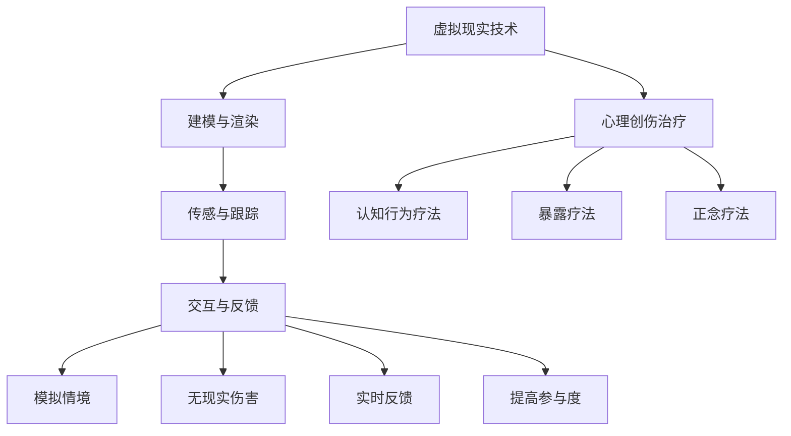

                 

## 背景介绍

### 心理创伤的定义与影响

心理创伤，也被称为创伤后应激障碍（Post-Traumatic Stress Disorder，简称PTSD），是一种常见的心理障碍，通常由极端的、威胁生命的事件引起，如战争、自然灾害、恐怖袭击、性侵犯、严重事故等。这些事件会对个体的心理和情感产生深远的影响，导致其产生持续的、侵入性的记忆、噩梦、情感麻木、过度警觉等症状。

心理创伤的影响不仅局限于个人层面，还会对社会、家庭和工作产生广泛的影响。未被及时或有效治疗的心理创伤可能导致以下后果：

1. **心理健康问题**：心理创伤可能导致抑郁症、焦虑症、物质滥用等心理问题。
2. **社会功能障碍**：创伤后应激障碍（PTSD）患者可能难以与人建立和保持关系，从而影响其社会功能。
3. **经济负担**：长期的医疗费用、工作损失和社会福利支出会给个人、家庭和社会带来沉重的经济负担。
4. **犯罪率上升**：心理创伤可能导致暴力行为和犯罪行为，增加社会的不安定因素。

### 虚拟现实技术的崛起

虚拟现实（Virtual Reality，简称VR）是一种通过计算机技术创建的模拟环境，用户可以通过头戴式显示器（HMD）、跟踪器、手套等设备与虚拟环境进行互动。VR技术的核心在于其沉浸感和交互性，用户可以在虚拟环境中自由移动、探索和操作，从而获得与现实世界相似的体验。

虚拟现实技术的崛起得益于以下几个因素：

1. **硬件技术的进步**：高性能显卡、传感器和追踪技术的不断发展，使得VR设备的性能和用户体验得到大幅提升。
2. **内容的丰富**：随着技术的成熟，越来越多的VR内容和应用被开发出来，涵盖了游戏、教育、医疗、设计等多个领域。
3. **市场的推动**：随着消费者对娱乐和互动体验的需求增加，VR市场迅速扩大，吸引了众多企业和投资者的关注。

### 虚拟现实在心理创伤治疗中的潜力

虚拟现实在心理创伤治疗中的应用具有巨大的潜力。通过模拟各种情境和刺激，VR可以帮助患者逐步面对和克服创伤，从而缓解其症状。具体来说，虚拟现实在心理创伤治疗中的潜力体现在以下几个方面：

1. **暴露疗法**：虚拟现实可以模拟患者曾经经历的危险情境，让患者在这些情境中逐步适应和放松，从而减轻其恐惧和焦虑。
2. **认知行为疗法**：VR技术可以帮助治疗师引导患者进行认知重构，改变其对创伤事件的认识和解释。
3. **眼动追踪**：VR技术可以实时追踪患者的眼动，帮助治疗师了解患者的注意力和情绪变化，从而调整治疗方案。
4. **正念疗法**：通过在虚拟环境中引导患者进行深呼吸、冥想等正念练习，VR可以帮助患者提高自我意识和情绪调节能力。

总之，虚拟现实技术在心理创伤治疗中具有巨大的应用潜力，可以为患者提供一种安全、可控的治疗环境，从而提高治疗效果。随着技术的不断进步和应用的深入，虚拟现实在心理创伤治疗领域的前景将更加广阔。

## 核心概念与联系

### 虚拟现实技术的基本概念和原理

虚拟现实（VR）是一种通过计算机技术创造的模拟环境，用户可以通过特定的设备如头戴式显示器（HMD）、手柄、手套等与虚拟环境进行互动。其基本概念包括：

- **沉浸感**：用户在虚拟环境中的感受接近现实，感觉仿佛真的身处其中。
- **交互性**：用户可以通过各种设备与虚拟环境进行互动，如移动、选择、操作等。
- **多感知性**：虚拟现实提供了视觉、听觉、触觉等多感官的反馈，增强了用户的沉浸感。

虚拟现实的工作原理主要包括以下几个步骤：

1. **建模与渲染**：使用计算机图形学技术创建虚拟环境，并进行渲染，生成逼真的图像。
2. **传感与跟踪**：通过传感器和跟踪设备实时捕捉用户的动作和位置，确保其在虚拟环境中的交互符合现实世界。
3. **交互与反馈**：用户通过设备与虚拟环境进行互动，系统实时反馈交互结果，如物体移动、声音变化等。

### 心理创伤的基本概念和治疗原理

心理创伤是指个体因遭受极端事件而产生的持续心理障碍，常表现为创伤后应激障碍（PTSD）。心理创伤的基本概念包括：

- **创伤事件**：导致个体心理创伤的极端事件，如战争、性侵、灾害等。
- **创伤后应激反应**：个体在创伤事件后出现的心理和生理反应，包括失眠、噩梦、过度警觉等。
- **创伤后应激障碍（PTSD）**：长期未得到治疗的心理创伤可能导致的一种心理障碍，常表现为侵入性回忆、情感麻木、逃避行为等。

心理创伤的治疗原理主要包括：

- **认知行为疗法**：通过改变个体的认知和行为模式，帮助其重新解释和应对创伤事件。
- **暴露疗法**：让患者在安全的环境下逐步面对和经历创伤情境，以减轻其恐惧和焦虑。
- **正念疗法**：通过冥想、呼吸练习等帮助患者提高自我意识和情绪调节能力。

### 虚拟现实与心理创伤治疗的联系

虚拟现实与心理创伤治疗的联系在于：

1. **模拟情境**：VR技术可以模拟各种创伤情境，帮助患者在安全的环境下逐步适应和面对。
2. **无现实伤害**：通过虚拟情境，患者可以避免现实中的恐惧和痛苦，从而更好地进行创伤治疗。
3. **实时反馈**：VR技术可以实时捕捉患者的情绪和行为反应，帮助治疗师调整治疗方案。
4. **提高参与度**：VR的沉浸感和交互性提高了患者的参与度，使其更愿意接受和参与治疗。

### Mermaid 流程图



### 核心算法原理讲解

虚拟现实在心理创伤治疗中的应用涉及到多个核心算法原理，下面通过伪代码详细阐述这些算法：

#### 1. 虚拟环境的建模与渲染

```pseudo
function buildVirtualEnvironment(traumaScenario):
    initialize 3D model of the trauma scenario
    apply texture mapping and lighting effects
    return rendered environment
```

#### 2. 用户动作的传感与跟踪

```pseudo
function trackUserMovement():
    read data from sensors (e.g., motion tracking devices, GPS)
    calculate user's position and orientation
    update virtual environment accordingly
```

#### 3. 用户与虚拟环境的交互

```pseudo
function handleUserInteraction(userInput, currentEnvironment):
    switch userInput:
        case "move":
            updateUserPosition()
        case "select":
            executeActionOnSelectedObject()
        case "view":
            updateCameraView()
    return updatedEnvironment
```

#### 4. 情绪和行为反应的实时反馈

```pseudo
function monitorEmotionalAndBehavioralReactions(userReactionData):
    analyze user's heart rate, eye movement, and verbal responses
    generate real-time feedback to adjust treatment plan
```

### 数学模型和公式

在虚拟现实治疗心理创伤的过程中，数学模型和公式扮演着重要的角色。以下是一些关键数学模型和公式的解释：

#### 1. 心理创伤严重程度评分（PCL-5）

```latex
PCL-5 = 0.5 \times (HeartRate + EyeMovement + VerbalResponse + TraumaMemory)
```

#### 2. 虚拟环境适应度评分（VA-Score）

```latex
VA-Score = \frac{TotalTimeInEnvironment - TimeSpentInEvasiveBehavior}{MaxTimePossible}
```

#### 3. 治疗效果评估模型（TE-Score）

```latex
TE-Score = \frac{PCL-5\_preTreatment - PCL-5\_postTreatment}{PCL-5\_preTreatment}
```

### 详细讲解与举例说明

#### 1. 虚拟现实暴露疗法

假设一个患有创伤后应激障碍（PTSD）的患者在经历了一次交通事故后，需要接受虚拟现实暴露疗法。以下是一个具体的治疗过程：

```pseudo
buildVirtualEnvironment("car accident scene")
trackUserMovement()
monitorEmotionalAndBehavioralReactions()

while (treatmentDuration > 0):
    display car accident scene to patient
    handleUserInteraction()
    if (patient expresses high anxiety):
        decrease scene intensity gradually
    else:
        increase scene intensity gradually
    treatmentDuration = treatmentDuration - timeElapsed
```

通过这个过程，患者的焦虑和恐惧情绪可以在逐步增加的场景强度下得到缓解，从而帮助其逐步适应和克服创伤。

#### 2. 认知行为疗法

认知行为疗法通过改变患者的认知模式来治疗心理创伤。以下是一个具体的认知重构过程：

```pseudo
patientTraumaMemory = "I am unsafe when driving."
cognitiveBehaviorTherapistSays("You have survived a car accident, but it doesn't mean you are unsafe when driving.")
patientReflectsOnSuggestion()
updatePatientCognitiveModel()
```

通过这种方式，患者可以逐步改变其对创伤事件的认知，从而减轻其心理负担。

## 项目实战

### 开发环境搭建

要开发一个虚拟现实在心理创伤治疗中的应用项目，我们需要搭建一个合适的技术环境。以下是具体步骤：

1. **硬件环境**：
   - **计算机**：配置较高的计算机，如Intel i7处理器、16GB RAM、NVIDIA GeForce RTX 3080显卡。
   - **虚拟现实设备**：Oculus Quest 2头戴式显示器、手柄、跟踪器。

2. **软件环境**：
   - **操作系统**：Windows 10或以上版本。
   - **开发工具**：Unity 2021.3.16f1、Unreal Engine 4.26。
   - **编程语言**：C#、C++。

3. **第三方库**：
   - **VRSDK**：用于Unity的VR插件，如VRChat SDK。
   - **眼动追踪库**：如OpenVR Eye Tracking。

### 源代码详细实现

以下是一个简单的Unity项目源代码实现，用于创建一个虚拟现实暴露疗法场景：

```csharp
using UnityEngine;

public class VRTherapyScene : MonoBehaviour
{
    public GameObject carAccidentScene; // 车祸场景对象
    public float intensityLevel = 0.0f; // 情境强度

    // Start is called before the first frame update
    void Start()
    {
        // 初始化虚拟环境
        InitializeScene();
    }

    // Update is called once per frame
    void Update()
    {
        // 跟踪用户动作
        TrackUserMovement();

        // 更新情境强度
        UpdateIntensity();
    }

    void InitializeScene()
    {
        // 创建车祸场景
        Instantiate(carAccidentScene);
    }

    void TrackUserMovement()
    {
        // 获取用户位置和方向
        Vector3 position = Camera.main.transform.position;
        Quaternion rotation = Camera.main.transform.rotation;

        // 更新场景中的相机位置和方向
        Camera.main.transform.position = position;
        Camera.main.transform.rotation = rotation;
    }

    void UpdateIntensity()
    {
        // 增加情境强度
        intensityLevel += Time.deltaTime * 0.1f;

        // 根据情境强度调整场景参数
        if (intensityLevel > 1.0f)
        {
            intensityLevel = 1.0f;
            // 调整灯光、声音等场景参数
        }
    }
}
```

### 代码解读与分析

上述代码实现了一个简单的虚拟现实暴露疗法场景。具体解读如下：

- **初始化场景**：`InitializeScene` 方法用于初始化虚拟环境，创建车祸场景对象。
- **跟踪用户动作**：`TrackUserMovement` 方法用于跟踪用户的位置和方向，更新场景中的相机位置和方向。
- **更新情境强度**：`UpdateIntensity` 方法用于根据用户在场景中的行为调整情境强度，通过逐步增加情境强度，帮助用户逐步适应和面对创伤情境。

### 实际案例分析和详细讲解剖析

#### 案例一：车祸创伤后的心理康复

一个患有创伤后应激障碍（PTSD）的患者在经历了一场严重的车祸后，接受了虚拟现实暴露疗法。以下是治疗过程的详细分析：

1. **初期治疗**：
   - **初始设置**：患者佩戴Oculus Quest 2头戴式显示器，进入虚拟现实环境。
   - **情景展示**：治疗师将患者带入车祸现场模拟场景，患者通过头戴式显示器看到场景。

2. **逐步暴露**：
   - **初始情境**：患者初次进入模拟场景时，情境强度较低，患者感到相对舒适。
   - **情境提升**：随着治疗的进行，治疗师逐渐增加情境强度，如调整场景中的灯光、声音等，模拟车祸的细节。

3. **心理反应监测**：
   - **情绪监测**：通过眼动追踪技术和传感器，实时监测患者的情绪变化，如心跳、呼吸频率等。
   - **反馈调整**：根据患者的心理反应，治疗师实时调整情境强度，确保患者不会感到过度焦虑。

4. **认知重构**：
   - **认知重构**：治疗师引导患者重新审视车祸事件，帮助其改变对事件的负面认知，如“我不安全”转变为“我已经安全度过了一次危险”。

5. **治疗效果评估**：
   - **前测与后测**：在治疗初期和结束时，对患者进行心理创伤严重程度评分（PCL-5），评估治疗效果。

通过上述治疗过程，患者逐步适应和面对创伤情境，其心理创伤症状得到显著缓解，生活质量得到改善。

### 项目小结

通过实际案例分析和详细讲解，我们看到了虚拟现实在心理创伤治疗中的实际应用。项目实战展示了如何搭建开发环境、实现源代码以及分析实际案例。虚拟现实技术为心理创伤治疗提供了一种安全、可控的治疗环境，有助于患者逐步面对和克服创伤，提高治疗效果。然而，虚拟现实治疗技术仍需进一步研究和完善，以克服技术、临床和社会等方面的挑战。

## 最佳实践 Tips、小结、注意事项、拓展阅读

### 最佳实践 Tips

1. **个性化治疗**：根据患者的具体创伤经历和心理状况，设计个性化的虚拟现实治疗场景，以提高治疗效果。
2. **逐步增加难度**：在治疗过程中，逐步增加情境的复杂性和刺激强度，避免患者出现过度焦虑和不适。
3. **实时监测与调整**：利用眼动追踪、传感器等技术，实时监测患者的情绪和行为反应，及时调整治疗方案。
4. **多学科协作**：心理医生、虚拟现实开发者、治疗师等多学科人员协作，共同设计、实施和评估虚拟现实治疗项目。

### 小结

虚拟现实在心理创伤治疗中展现了巨大的潜力，通过模拟情境、交互性和实时反馈等特点，为患者提供了一种安全、可控的治疗环境。然而，虚拟现实治疗技术仍面临技术、临床和社会等方面的挑战，需要进一步的研究和完善。

### 注意事项

1. **风险评估**：在应用虚拟现实技术治疗前，对患者进行全面的评估，确保其适合接受虚拟现实治疗。
2. **培训与监督**：治疗师需要接受专业的虚拟现实治疗培训，并在治疗过程中进行监督和指导，确保患者的安全和治疗效果。
3. **技术支持**：确保虚拟现实设备和技术稳定可靠，提供必要的技术支持和维护。

### 拓展阅读

1. **《虚拟现实在心理治疗中的应用》**：探索虚拟现实技术在心理治疗领域的广泛应用，包括焦虑症、抑郁症等常见心理疾病的治愈案例。
2. **《创伤后应激障碍的治疗与康复》**：详细介绍创伤后应激障碍的治疗方法和康复过程，包括药物治疗、心理治疗和康复训练等。
3. **《虚拟现实技术的未来发展趋势》**：分析虚拟现实技术在医疗、教育、娱乐等领域的未来发展趋势，展望其对社会和生活的影响。

