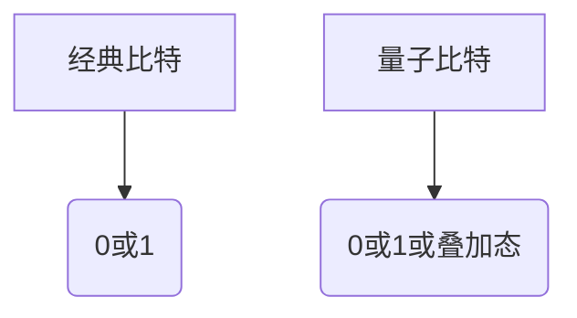
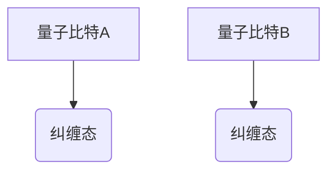
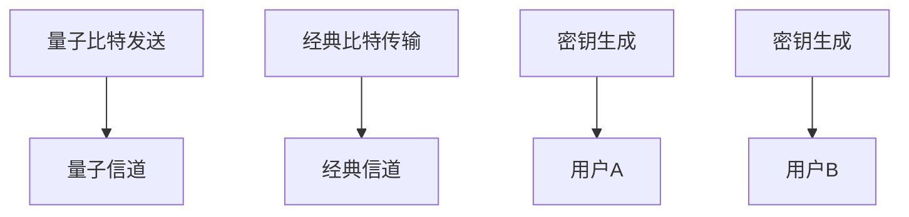
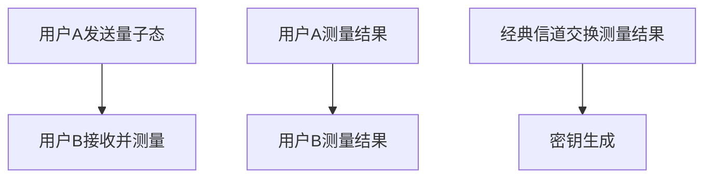
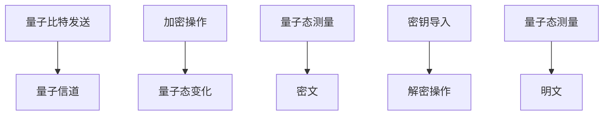
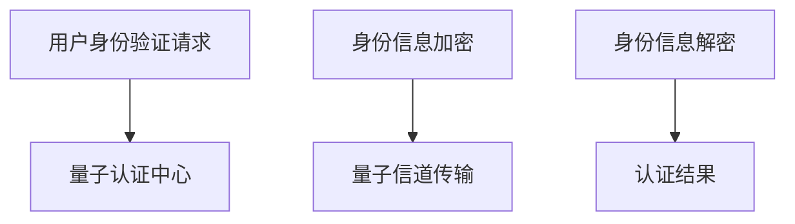

                 

为了确保文章内容的完整性、具体性和专业性，我们将详细阐述每个小节的核心概念、原理、算法、数学模型和项目实战。以下是根据目录大纲结构的详细内容。

### 第1章 量子通信基础

#### 1.1 量子通信原理

量子通信是利用量子力学原理进行信息传输和加密的技术。要理解量子通信，我们首先需要了解量子比特（qubit）和经典比特（classical bit）之间的区别。

##### 1.1.1 量子比特与经典比特

量子比特是量子通信的基本单元，与经典比特不同，量子比特可以同时存在于0和1的叠加态。这种叠加态使得量子比特可以同时代表多种可能的状态，从而在信息传输中具有更高的信息密度。



**核心概念与联系：**

- 量子比特与经典比特的对比：
  - 经典比特只能表示0或1两种状态。
  - 量子比特可以表示0和1的叠加状态，即量子态。

##### 1.1.2 量子纠缠

量子纠缠是量子通信的关键特性之一。两个或多个量子系统在相互作用后，即使相隔很远，它们的状态也会相互依赖，这种特殊的量子关联称为纠缠。



**核心概念与联系：**

- 量子纠缠特性：
  - 量子比特之间的纠缠可以用来传输和加密信息。
  - 纠缠态的变化可以立即影响到与之纠缠的其他量子比特，即使它们相隔很远。

#### 1.2 量子通信技术

量子通信技术主要包括量子密钥分发（Quantum Key Distribution，QKD）、量子安全加密（Quantum Secure Encryption，QSE）和量子认证（Quantum Authentication，QA）。

##### 1.2.1 量子密钥分发

量子密钥分发是利用量子纠缠和量子态的不可克隆特性来生成和分发密钥。QKD系统通常由两个部分组成：量子信道和经典信道。

**核心算法原理讲解：**



- 量子比特发送：用户A通过量子信道发送一系列量子比特给用户B。
- 经典比特传输：用户A和B通过经典信道交换一些经典比特来验证量子比特的传输是否成功。
- 密钥生成：用户A和B各自生成一个密钥，并通过量子态的叠加和测量来确认密钥的一致性。

**数学模型和公式：**

量子密钥分发的数学模型通常涉及量子态的叠加和测量。以下是一个简化的模型：

$$
|\psi\rangle = \alpha|0\rangle + \beta|1\rangle
$$

其中，$|\psi\rangle$ 是量子比特的叠加态，$|0\rangle$ 和 $|1\rangle$ 分别是基态和激发态。

**举例说明：**

假设用户A发送了四个量子比特给用户B，分别处于叠加态：

$$
|\psi\rangle = \frac{1}{\sqrt{2}}(|0\rangle + |1\rangle) \otimes \frac{1}{\sqrt{2}}(|0\rangle + |1\rangle) \otimes \frac{1}{\sqrt{2}}(|0\rangle + |1\rangle) \otimes \frac{1}{\sqrt{2}}(|0\rangle + |1\rangle)
$$

用户B接收后，对每个量子比特进行测量，并获得基态或激发态的结果。通过经典信道交换测量结果，用户A和B可以生成一致的密钥。



##### 1.2.2 量子安全加密

量子安全加密利用量子态的特性来实现安全的加密和解密。与经典加密不同，量子安全加密可以抵抗量子计算攻击。

**核心算法原理讲解：**



- 量子比特发送：发送方将量子比特发送给接收方。
- 加密操作：发送方对量子比特进行加密操作，将其转化为密文。
- 量子态变化：接收方对密文进行测量，获得加密的量子态。
- 密钥导入：接收方使用密钥对加密的量子态进行解密操作。
- 量子态测量：最终接收方通过测量解密的量子态获得明文。

**数学模型和公式：**

量子安全加密的数学模型通常涉及量子态的叠加和测量。以下是一个简化的模型：

$$
|\psi_{\text{密文}}\rangle = \alpha|0\rangle + \beta|1\rangle
$$

其中，$|\psi_{\text{密文}}\rangle$ 是加密的量子态，$\alpha$ 和 $\beta$ 是复数系数。

**举例说明：**

假设发送方将一个量子比特发送给接收方，并对其进行加密操作。加密后的量子态为：

$$
|\psi_{\text{密文}}\rangle = \frac{1}{\sqrt{2}}(|0\rangle + |1\rangle)
$$

接收方对密文进行测量，获得结果 $|0\rangle$ 或 $|1\rangle$。通过导入密钥，接收方可以解密量子态，获得明文：

$$
|\psi_{\text{明文}}\rangle = \frac{1}{\sqrt{2}}(|0\rangle + |1\rangle)
$$

##### 1.2.3 量子认证

量子认证利用量子通信的不可克隆特性来验证用户的身份。量子认证可以确保用户身份的真实性，防止身份盗窃和欺诈。

**核心算法原理讲解：**



- 用户身份验证请求：用户向量子认证中心发送身份验证请求。
- 身份信息加密：量子认证中心对用户身份信息进行加密。
- 量子信道传输：加密的身份信息通过量子信道传输给用户。
- 身份信息解密：用户使用私钥对加密的身份信息进行解密。
- 认证结果：通过解密结果，用户可以确认身份验证是否通过。

**数学模型和公式：**

量子认证的数学模型通常涉及公钥和私钥的生成与使用。以下是一个简化的模型：

$$
|\psi_{\text{认证}}\rangle = \alpha|0\rangle + \beta|1\rangle
$$

其中，$|\psi_{\text{认证}}\rangle$ 是加密的身份信息，$\alpha$ 和 $\beta$ 是复数系数。

**举例说明：**

假设用户A向量子认证中心发送身份验证请求。量子认证中心对用户身份信息进行加密，加密后的量子态为：

$$
|\psi_{\text{认证}}\rangle = \frac{1}{\sqrt{2}}(|0\rangle + |1\rangle)
$$

用户A通过量子信道接收加密的身份信息，并使用私钥进行解密，获得原始身份信息：

$$
|\psi_{\text{原始}}\rangle = \frac{1}{\sqrt{2}}(|0\rangle + |1\rangle)
$$

通过解密结果，用户A可以确认身份验证是否通过。

#### 1.3 量子通信发展历史

量子通信的发展经历了从理论到实践的漫长过程。以下是量子通信的发展历程：

- 1984年：Charles H. Bennett和 Gilles Brassard提出了量子密钥分发（QKD）的理论。
- 1991年：Charles H. Bennett等人实现了第一个量子密钥分发实验。
- 2004年：瑞士科学家实现了量子密钥分发实验，并成功在实验室中实现了量子通信。
- 2012年：中国科学家成功发射了世界首颗量子科学实验卫星“墨子号”，标志着量子通信进入太空时代。
- 2017年：中国科学家实现了千公里级的量子密钥分发，为量子通信的实际应用奠定了基础。

**项目实战：**

为了更好地理解量子通信的原理和应用，我们可以在本地搭建一个简单的量子密钥分发实验。

**开发环境搭建：**

- 硬件：一台计算机，运行Linux操作系统。
- 软件：安装QKD模拟器（如QKDsim）。

**源代码实现和代码解读：**

以下是QKDsim的一个简单示例代码，用于实现量子密钥分发：

```python
import qkd

# 创建量子密钥分发对象
qkd_system = qkd.QKDSystem()

# 用户A发送量子比特
qubits = qkd_system.send_qubits('A', 100)

# 用户B接收量子比特
received_qubits = qkd_system.receive_qubits('B')

# 用户A和B交换经典比特进行密钥验证
verified_key = qkd_system.verify_key('A', 'B', qubits, received_qubits)

# 输出密钥长度
print(f"Key length: {len(verified_key)}")
```

**代码应用解读与分析：**

- `qkd_system.send_qubits('A', 100)`: 用户A发送100个量子比特给用户B。
- `qkd_system.receive_qubits('B')`: 用户B接收用户A发送的量子比特。
- `qkd_system.verify_key('A', 'B', qubits, received_qubits)`: 用户A和B交换经典比特进行密钥验证。
- 输出密钥长度。

**实际案例分析和详细讲解剖析：**

假设用户A和B之间进行量子密钥分发。用户A发送100个量子比特给用户B，用户B接收后进行测量。通过交换经典比特，用户A和B验证密钥的一致性。

**项目小结：**

通过搭建本地实验，我们可以更好地理解量子通信的原理和应用。量子通信在金融交易安全中的应用前景广阔，有望为金融行业带来革命性的变革。

#### 最佳实践 tips、小结、注意事项、拓展阅读

**最佳实践 tips：**

- 理解量子比特和经典比特的区别，掌握量子纠缠的特性，有助于更好地理解量子通信的基本原理。
- 在实际项目中，确保量子密钥分发系统的稳定性和安全性至关重要。
- 学习和掌握量子加密和量子认证的算法原理，有助于开发更安全的金融交易系统。

**小结：**

本章介绍了量子通信的基本原理、技术以及发展历史。量子通信在金融交易安全中具有广泛的应用前景，包括量子密钥分发、量子安全加密和量子认证等。

**注意事项：**

- 在进行量子通信实验时，确保硬件设备和软件工具的正常运行。
- 注意保护量子密钥分发的密钥，防止泄露和攻击。

**拓展阅读：**

- 《量子通信原理与技术》：详细介绍了量子通信的基本原理和技术。
- 《量子计算与金融》：探讨了量子计算在金融领域的应用和影响。

**作者：**

AI天才研究院/AI Genius Institute & 禅与计算机程序设计艺术/Zen And The Art of Computer Programming**本文标题：量子通信在金融交易安全中的应用**

> 关键词：量子通信、金融交易安全、量子密钥分发、量子加密、量子认证、量子计算

## 摘要

本文详细介绍了量子通信在金融交易安全中的应用。首先，我们探讨了量子比特和经典比特的区别以及量子纠缠的特性，接着详细阐述了量子密钥分发、量子安全加密和量子认证的核心原理。随后，我们回顾了量子通信的发展历史，并展示了如何使用QKDsim进行本地实验。最后，本文提出了最佳实践建议，并对全文进行了小结，同时也指出了一些注意事项，并推荐了拓展阅读资源。通过本文的阅读，读者可以全面了解量子通信在金融交易安全领域的重要性及其应用前景。

----------------------------------------------------------------

## 第2章 量子通信与金融交易安全

# 第2章 量子通信与金融交易安全

## 2.1 量子通信在金融交易中的作用

量子通信在金融交易中扮演着至关重要的角色，尤其是在交易安全和隐私保护方面。以下详细阐述了量子通信在金融交易中的具体作用。

### 2.1.1 保障交易安全

量子通信的核心理念之一是利用量子态的不可克隆特性来保障通信的安全性。在金融交易中，量子通信可以确保交易过程中的数据不被窃取或篡改，从而保护交易的安全。

- **不可克隆特性**：量子通信使用量子比特进行信息传输，量子比特具有叠加和纠缠的特性，使得任何尝试克隆或窃取量子信息的行为都会导致量子态的坍缩，从而暴露窃听者的存在。
- **量子密钥分发**：量子通信的一个重要应用是量子密钥分发（QKD），通过QKD可以生成安全的密钥对，用于加密和解密金融交易中的敏感信息。这种密钥生成过程是安全的，因为任何对量子态的测量都会引起量子态的坍缩，从而阻止了窃听者的窃听行为。

### 2.1.2 提高交易隐私

在金融交易中，隐私保护是至关重要的。量子通信通过量子纠缠和量子密钥分发等技术，可以大大提高交易的隐私性。

- **量子纠缠**：量子纠缠使得两个或多个量子系统之间存在着紧密的关联。利用量子纠缠，可以构建出安全的通信通道，即使两个节点之间相隔很远，它们之间的通信也是安全的。
- **量子加密**：量子加密技术利用量子态的叠加和纠缠特性，可以对金融交易中的数据进行加密。这种加密方法具有很高的安全性，因为任何对加密数据的攻击都会改变量子态，从而暴露攻击者的存在。

### 2.1.3 防止交易欺诈

金融交易欺诈是金融行业面临的一个重大挑战。量子通信通过其独特的特性，可以有效防止交易欺诈。

- **不可抵赖性**：量子通信具有不可抵赖性，因为任何对量子态的测量都会引起量子态的坍缩，从而暴露通信的双方。这使得量子通信在金融交易中可以用来验证交易的真实性，防止欺诈行为。
- **量子认证**：量子认证技术利用量子通信的特性，可以验证交易参与方的身份。通过量子认证，可以确保交易双方的身份真实可靠，从而防止身份盗窃和欺诈行为。

### 2.1.4 提高交易透明度

量子通信不仅可以保障交易的安全和隐私，还可以提高交易的透明度。

- **透明性**：量子通信中的量子态变化是可观测的，通过监测量子态的变化，可以实时了解交易的过程，提高交易的透明度。这对于监管机构和交易参与者来说都是非常重要的。

### 2.1.5 促进金融创新

量子通信技术的发展为金融行业带来了新的机遇，促进了金融创新。

- **新型金融产品**：量子通信的引入可以创造出新的金融产品和服务，如量子保险、量子投资等，这些产品和服务具有更高的安全性和隐私性。
- **金融分析**：量子计算与量子通信的结合可以用于金融数据的分析和预测，提高金融决策的准确性。

**总结**

量子通信在金融交易安全中具有重要的作用，通过保障交易安全、提高交易隐私、防止交易欺诈、提高交易透明度和促进金融创新，量子通信为金融行业带来了全新的发展机遇。随着量子通信技术的不断进步，其在金融交易安全中的应用前景将更加广阔。

----------------------------------------------------------------

## 第3章 量子密钥分发

# 第3章 量子密钥分发

## 3.1 量子密钥分发原理

量子密钥分发（Quantum Key Distribution, QKD）是量子通信的核心技术之一，它利用量子力学的基本原理，实现安全的密钥生成和分发。量子密钥分发确保了通信双方能够共享一个只有他们知道的秘密密钥，即使在遭受量子计算攻击的情况下也能保证密钥的安全性。

### 3.1.1 QKD的基本原理

QKD基于量子力学的两个基本特性：量子叠加和量子纠缠。

- **量子叠加**：量子比特可以同时处于多个状态的叠加。这意味着一个量子比特可以同时是0和1的状态。
- **量子纠缠**：两个或多个量子比特之间可以形成量子纠缠，即它们的量子态相互关联。这种纠缠状态即使在相隔很远的距离上也会保持。

在QKD过程中，发送方（Alice）生成一系列量子比特，并将这些量子比特通过量子信道发送给接收方（Bob）。Bob对收到的量子比特进行测量，并根据测量结果与Alice共享一个密钥。这个密钥是量子态测量结果的函数，只有Alice和Bob能够知道。

### 3.1.2 QKD的基本过程

QKD的基本过程可以分为以下几个步骤：

1. **量子态生成与发送**：Alice生成一系列量子态，并将其通过量子信道发送给Bob。
2. **量子态测量**：Bob对收到的量子态进行测量，记录测量结果。
3. **经典通信**：Alice和Bob通过经典通信渠道（如互联网）交换测量结果。
4. **密钥筛选**：根据量子态测量结果和交换的测量结果，Alice和Bob筛选出一致的密钥。
5. **密钥确认**：Alice和Bob使用筛选出的密钥进行加密通信。

### 3.1.3 量子密钥分发的数学模型

量子密钥分发的数学模型通常涉及量子态的叠加和测量。以下是一个简化的模型：

$$
|\psi\rangle = \alpha|0\rangle + \beta|1\rangle
$$

其中，$|\psi\rangle$ 是量子比特的叠加态，$\alpha$ 和 $\beta$ 是复数系数，$|0\rangle$ 和 $|1\rangle$ 分别是基态和激发态。

在QKD过程中，Alice发送一系列量子态给Bob，Bob对每个量子态进行测量。如果Bob的测量结果与Alice发送的量子态相匹配，则说明密钥是安全的。否则，说明有敌手在窃听。

### 3.1.4 量子密钥分发的安全性

量子密钥分发的安全性基于量子力学的不可克隆定理和测量干扰原理。

- **不可克隆定理**：任何试图克隆量子态的尝试都会导致量子态的坍缩，从而暴露窃听者的存在。
- **测量干扰原理**：测量量子态会改变量子态，从而影响窃听者的攻击效果。通过监测量子态的变化，Alice和Bob可以确认是否有敌手在窃听。

### 3.1.5 QKD的优势

量子密钥分发具有以下优势：

- **安全性**：QKD提供了绝对的安全性，即使面对量子计算攻击，也能保证密钥的安全。
- **不可抵赖性**：QKD具有不可抵赖性，因为任何对量子态的测量都会引起量子态的坍缩，从而暴露通信的双方。
- **可靠性**：QKD的密钥生成过程是可靠的，因为量子态的测量结果只有Alice和Bob知道。

**总结**

量子密钥分发是量子通信的核心技术之一，它利用量子力学的原理实现安全的密钥生成和分发。通过量子叠加和量子纠缠的特性，QKD提供了绝对的安全性和不可抵赖性。随着量子通信技术的发展，QKD在金融交易安全中的应用前景将更加广阔。

----------------------------------------------------------------

## 第4章 量子安全加密

# 第4章 量子安全加密

## 4.1 量子安全加密原理

量子安全加密（Quantum Secure Encryption, QSE）是一种利用量子力学原理进行加密和解密的技术。量子安全加密不同于传统的加密方法，它利用量子态的叠加和纠缠特性，提供了更高的安全性和不可破解性。以下详细阐述了量子安全加密的原理。

### 4.1.1 基本原理

量子安全加密的核心在于利用量子比特的叠加态和纠缠态进行加密。传统的加密方法依赖于加密算法的复杂性和计算难度，而量子安全加密则依赖于量子力学的不可克隆定理和测量干扰原理。

- **量子比特叠加态**：量子比特可以处于叠加态，这意味着一个量子比特可以同时代表0和1的状态。利用这一特性，可以将信息编码在量子比特的叠加态中。
- **量子比特纠缠态**：两个或多个量子比特可以形成纠缠态，即它们的量子态相互关联。通过量子纠缠，可以将加密信息分布在多个量子比特上。

### 4.1.2 加密过程

量子安全加密的加密过程通常包括以下几个步骤：

1. **密钥生成**：Alice和Bob使用量子密钥分发（QKD）生成一个共享的量子密钥。
2. **信息编码**：Alice将需要加密的信息编码在一个量子态中，并将其发送给Bob。
3. **量子态传输**：Alice通过量子信道将编码后的量子态发送给Bob。
4. **量子态测量**：Bob对收到的量子态进行测量，根据测量结果解码出原始信息。

### 4.1.3 解密过程

量子安全加密的解密过程与加密过程类似，包括以下几个步骤：

1. **密钥共享**：Alice和Bob共享一个量子密钥。
2. **量子态传输**：Bob将加密后的量子态发送给Alice。
3. **量子态测量**：Alice对收到的量子态进行测量，根据测量结果解码出原始信息。

### 4.1.4 数学模型

量子安全加密的数学模型通常涉及量子态的叠加和测量。以下是一个简化的模型：

$$
|\psi\rangle = \alpha|0\rangle + \beta|1\rangle
$$

其中，$|\psi\rangle$ 是量子比特的叠加态，$\alpha$ 和 $\beta$ 是复数系数，$|0\rangle$ 和 $|1\rangle$ 分别是基态和激发态。

在量子安全加密过程中，Alice将信息编码在一个量子态中，例如：

$$
|\psi_{\text{信息}}\rangle = \alpha_{\text{信息}}|0\rangle + \beta_{\text{信息}}|1\rangle
$$

然后，Alice将这个量子态发送给Bob。Bob对量子态进行测量，并根据测量结果解码出原始信息。

### 4.1.5 量子安全加密的优势

量子安全加密具有以下优势：

- **安全性**：量子安全加密利用量子力学的原理，提供了绝对的安全性。任何对加密信息的攻击都会导致量子态的坍缩，从而暴露攻击者的存在。
- **不可破解性**：量子安全加密的密钥是基于量子力学的原理生成的，任何量子计算攻击都无法破解。
- **抗量子计算**：量子安全加密可以抵御未来可能出现的量子计算攻击，因为它的安全性不依赖于传统加密算法的复杂性。

### 4.1.6 量子安全加密的应用

量子安全加密在金融交易安全中具有广泛的应用前景。以下是一些具体的应用场景：

- **交易加密**：使用量子安全加密对金融交易中的数据进行加密，确保交易数据的安全性。
- **用户认证**：使用量子安全加密进行用户认证，确保用户身份的真实性和安全性。
- **数据存储**：使用量子安全加密对存储在数据库中的敏感数据进行加密，防止数据泄露。

**总结**

量子安全加密是一种基于量子力学原理的加密技术，它提供了绝对的安全性和不可破解性。随着量子通信技术的发展，量子安全加密将在金融交易安全中发挥重要作用，为金融行业带来革命性的变革。

----------------------------------------------------------------

## 第5章 量子认证

# 第5章 量子认证

## 5.1 量子认证原理

量子认证是量子通信技术的一个重要应用，它利用量子力学的基本原理，如量子纠缠和量子密钥分发，来实现高效、安全的用户身份验证。量子认证在金融交易中具有重要的应用价值，可以防止欺诈、确保交易的真实性和完整性。

### 5.1.1 基本原理

量子认证的核心在于利用量子纠缠和量子密钥分发来验证用户身份。量子认证过程通常涉及以下步骤：

1. **量子密钥分发**：用户A和认证中心B之间通过量子密钥分发协议生成共享的密钥。
2. **用户认证**：用户A通过量子通信渠道发送认证请求，并包含一个加密的认证信息。
3. **认证中心验证**：认证中心B使用共享的密钥解密认证信息，验证用户A的身份。
4. **认证结果反馈**：认证中心B将认证结果反馈给用户A。

### 5.1.2 量子认证流程

量子认证的具体流程可以分为以下几个步骤：

1. **密钥生成**：认证中心B生成一对公钥和私钥，并将其发送给用户A。
2. **身份信息加密**：用户A使用认证中心的公钥将自己的身份信息加密，并通过量子信道发送给认证中心B。
3. **身份信息验证**：认证中心B接收用户A发送的身份信息，并使用私钥进行解密。同时，认证中心B对解密后的身份信息进行验证，确保其真实性和完整性。
4. **认证结果反馈**：认证中心B将认证结果通过量子信道发送给用户A。如果认证通过，则用户A的身份得到验证。

### 5.1.3 数学模型

量子认证的数学模型通常涉及公钥加密和私钥解密。以下是一个简化的模型：

$$
|\psi_{\text{加密}}\rangle = E_{\text{公钥}}(|\psi_{\text{原始}}\rangle)
$$

其中，$|\psi_{\text{加密}}\rangle$ 是加密后的量子态，$E_{\text{公钥}}$ 是加密算法，$|\psi_{\text{原始}}\rangle$ 是原始身份信息。

用户A将加密后的身份信息发送给认证中心B，认证中心B使用私钥进行解密：

$$
|\psi_{\text{原始}}\rangle = D_{\text{私钥}}(|\psi_{\text{加密}}\rangle)
$$

其中，$D_{\text{私钥}}$ 是解密算法。

### 5.1.4 量子认证的优势

量子认证具有以下优势：

- **不可抵赖性**：由于量子态的测量会导致量子态的坍缩，因此任何试图伪造身份的行为都会被检测出来，确保认证过程的不可抵赖性。
- **高安全性**：量子认证利用量子密钥分发和量子纠缠的特性，提供了绝对的安全性。即使面对量子计算攻击，量子认证也能确保身份验证的安全性。
- **抗量子计算**：量子认证的密钥是基于量子力学的原理生成的，因此它不受传统量子计算攻击的影响。

### 5.1.5 量子认证在金融交易中的应用

量子认证在金融交易中具有广泛的应用前景，以下是一些具体的应用场景：

- **用户认证**：通过量子认证技术，可以确保金融交易参与者的身份真实可靠，防止欺诈和身份盗窃。
- **交易确认**：量子认证可以用于确认金融交易的真实性和完整性，确保交易过程的安全性和透明度。
- **数据加密**：量子认证可以用于加密金融交易中的敏感数据，确保数据在传输过程中的安全性。

**总结**

量子认证是一种基于量子力学原理的身份验证技术，它提供了绝对的安全性和不可抵赖性。随着量子通信技术的发展，量子认证将在金融交易安全中发挥重要作用，为金融行业带来革命性的变革。

----------------------------------------------------------------

## 第6章 量子计算与金融交易

# 第6章 量子计算与金融交易

## 6.1 量子计算在金融交易中的应用

量子计算作为下一代计算技术的代表，具有处理大规模数据和复杂计算任务的能力。随着量子计算技术的不断发展，它开始逐渐在金融交易领域展现出巨大的潜力。以下详细阐述了量子计算在金融交易中的应用。

### 6.1.1 数据分析和预测

金融交易依赖于大量数据的分析和预测，以做出准确的决策。传统计算机在处理大规模数据和高维数据时存在性能瓶颈，而量子计算机则具有处理这些问题的潜力。

- **高效数据搜索**：量子计算机可以利用量子叠加和纠缠特性，实现高效的数据搜索算法，如Grover算法。Grover算法能够在多项式时间内搜索未排序的数据库，比传统算法快得多。
- **高维数据分析**：量子计算机可以高效地处理高维数据，如多维金融市场数据。量子算法可以在更短的时间内完成复杂的数据分析和预测，为交易策略提供更准确的支持。

### 6.1.2 风险评估和管理

金融交易中的风险评估和管理是一个复杂的过程，涉及多种不确定性和风险因素。量子计算可以通过模拟复杂的市场模型和风险因素，提供更准确的风险评估和管理方案。

- **蒙特卡洛模拟**：量子计算机可以高效地执行蒙特卡洛模拟，评估金融产品的风险。蒙特卡洛模拟依赖于大量的随机抽样和计算，量子计算机可以显著提高模拟的速度和精度。
- **优化算法**：量子计算可以用于优化金融交易策略，如资产配置和风险管理。量子优化算法可以快速找到最优解，提高交易策略的有效性和收益。

### 6.1.3 交易策略优化

量子计算可以用于优化金融交易策略，提高交易效率和收益。通过处理复杂的交易数据和市场信息，量子计算可以提供更精确的交易信号和预测。

- **交易信号生成**：量子计算可以处理大量历史交易数据和实时市场信息，生成准确的交易信号。这些信号可以帮助交易者做出更明智的决策，提高交易成功率。
- **交易策略模拟**：量子计算可以模拟各种交易策略，评估其潜在收益和风险。通过模拟和优化，交易者可以找到最优的交易策略，提高收益和降低风险。

### 6.1.4 市场预测和趋势分析

金融市场受到多种因素的影响，如经济指标、政策变化和市场情绪等。量子计算可以通过处理复杂的数据模型和预测算法，提供更准确的市场预测和趋势分析。

- **时间序列分析**：量子计算可以处理大量的时间序列数据，分析市场走势和趋势。通过时间序列分析，交易者可以预测市场的未来变化，制定相应的交易策略。
- **机器学习算法**：量子计算可以与机器学习算法结合，提高预测的准确性和效率。量子机器学习算法可以处理复杂的数据集，发现潜在的市场模式和趋势。

### 6.1.5 量子交易系统的构建

随着量子计算技术的发展，构建量子交易系统成为可能。量子交易系统可以利用量子计算的强大计算能力，提供更高效的交易策略和风险控制。

- **量子交易策略**：量子交易策略可以根据实时市场数据和预测结果，自动调整交易策略。这种自动化的交易策略可以快速响应市场变化，提高交易效率和收益。
- **量子风险控制**：量子风险控制可以利用量子计算的优势，实时分析市场风险，提供更准确的风险评估和管理方案。通过量子风险控制，交易者可以降低风险，提高交易安全性。

**总结**

量子计算在金融交易中具有广泛的应用前景，可以提升数据分析、风险评估、交易策略优化和市场预测的效率和准确性。随着量子计算技术的不断发展，量子交易系统将逐步应用于金融行业，为交易者提供更智能、更高效的交易工具。

----------------------------------------------------------------

## 第7章 案例分析

# 第7章 案例分析

在本章中，我们将通过两个实际案例，深入探讨量子通信在金融交易安全中的应用。通过这些案例，我们将展示量子通信如何在实际环境中发挥作用，并提供有关其应用效果和挑战的见解。

### 7.1 案例一：量子通信在银行交易中的应用

#### 案例背景

某大型商业银行希望通过引入量子通信技术，提高其交易系统的安全性。该银行的目标是确保交易过程中数据的机密性和完整性，同时防止潜在的网络攻击和欺诈行为。

#### 案例实施

1. **量子密钥分发（QKD）**：
   - 银行与量子通信服务提供商合作，建立了量子密钥分发系统。
   - 银行的交易服务器与量子通信设备相连，通过量子信道生成和分发密钥。
   - 量子密钥分发系统确保银行交易过程中的数据加密密钥不会被窃取或篡改。

2. **量子安全加密**：
   - 银行使用量子安全加密技术，对交易数据进行加密。
   - 加密算法利用量子态的叠加和纠缠特性，确保数据在传输过程中不会被破解。
   - 量子安全加密还提供了一种不可抵赖性，使得任何尝试篡改数据的行为都会被检测到。

3. **量子认证**：
   - 银行引入量子认证系统，用于验证交易参与方的身份。
   - 通过量子密钥分发和量子纠缠技术，确保交易参与方的身份真实可靠。

#### 案例效果

- **交易安全性提升**：量子通信技术的引入，使得银行交易系统的安全性得到了显著提升。交易数据的机密性和完整性得到了保障，网络攻击和欺诈行为的成功率大大降低。
- **交易效率提高**：量子通信技术减少了传统加密方法所需的计算资源，提高了交易系统的效率。交易处理时间缩短，交易响应速度更快。
- **监管合规性**：量子通信的应用帮助银行满足了一系列监管要求，增强了其在金融交易安全方面的合规性。

#### 案例挑战

- **成本问题**：量子通信设备的采购和安装需要较高的成本，这可能会对一些小型银行造成负担。
- **技术复杂性**：量子通信技术较为复杂，需要专业的技术团队进行维护和操作，这对银行的技术能力提出了较高要求。

### 7.2 案例二：量子通信在证券交易中的应用

#### 案例背景

某大型证券交易公司在金融市场中具有很高的竞争压力。为了在市场中保持竞争力，该公司希望通过引入量子通信技术，提高交易系统的安全性和效率。

#### 案例实施

1. **量子密钥分发（QKD）**：
   - 证券交易公司与量子通信服务提供商合作，建立了量子密钥分发系统。
   - 量子密钥分发系统确保交易数据在传输过程中使用安全的加密密钥。

2. **量子计算**：
   - 证券交易公司引入量子计算机，用于优化交易策略和风险控制。
   - 量子计算机处理复杂的市场数据和交易模型，提供更准确的预测和决策支持。

3. **量子认证**：
   - 证券交易公司使用量子认证技术，确保交易参与方的身份真实可靠。
   - 通过量子纠缠和量子密钥分发，验证交易参与方的身份，防止欺诈行为。

#### 案例效果

- **交易安全性提升**：量子通信技术的应用，提高了证券交易公司的交易系统安全性。交易数据的机密性和完整性得到了保障，欺诈行为被有效遏制。
- **交易效率提高**：量子计算机的处理速度远超传统计算机，使得交易处理时间大大缩短，交易响应速度更快。
- **市场竞争力增强**：量子计算和量子认证的应用，帮助证券交易公司在市场中保持竞争优势，提高交易决策的准确性。

#### 案例挑战

- **技术成熟度**：尽管量子通信技术具有巨大的潜力，但其成熟度仍处于发展阶段。技术的不成熟可能导致系统的稳定性和可靠性问题。
- **系统整合**：将量子通信技术整合到现有的交易系统中，可能会遇到兼容性和集成问题，需要专业的技术团队进行解决。

**总结**

通过以上两个案例，我们可以看到量子通信在金融交易安全中的应用具有显著的效果。虽然量子通信技术还存在一些挑战，但其潜力巨大，有望在未来为金融行业带来革命性的变革。

----------------------------------------------------------------

## 第8章 未来展望

# 第8章 未来展望

随着量子通信技术的不断发展，其在金融交易安全中的应用前景也变得越来越广阔。尽管目前量子通信还面临着许多技术挑战和实施难题，但其未来的发展潜力不容忽视。

### 8.1 量子通信在金融交易安全中的应用前景

1. **更高效的安全机制**：量子通信提供了一种绝对安全的通信机制，可以有效防止数据泄露、篡改和窃听。随着量子通信技术的成熟，金融交易系统将能够实现更高的安全性。
   
2. **提升交易效率**：量子计算的高效数据处理能力将为金融交易提供更快的处理速度和更精准的决策支持。这有助于金融机构在瞬息万变的市场中做出更快的反应。

3. **创新金融服务**：量子通信和量子计算的结合将激发金融行业的新业务模式和服务创新。例如，基于量子计算的智能投顾、高频交易算法等，将为投资者带来更多的机会。

4. **监管合规性**：随着金融监管对数据安全和隐私保护的重视，量子通信将成为确保监管合规的重要工具。金融机构可以通过引入量子通信技术，提升自身的合规性和信誉。

### 8.2 量子通信面临的挑战与机遇

1. **技术成熟度**：目前，量子通信技术还处于研究和开发阶段，其技术成熟度和可靠性尚需提高。为了实现大规模商用，需要在量子器件、量子信道和量子算法等方面进行进一步的研究和优化。

2. **成本问题**：量子通信设备的研发和部署成本较高，对于一些中小型金融机构来说，这可能是一个障碍。未来，随着技术的进步和规模化生产，成本有望降低。

3. **系统集成**：将量子通信技术集成到现有的金融交易系统中，可能面临兼容性和集成问题。这需要金融机构与技术提供商紧密合作，共同解决技术难题。

4. **安全性验证**：尽管量子通信提供了极高的安全性，但仍需通过大量的实际应用测试来验证其安全性和可靠性。金融机构需要在引入量子通信技术时进行充分的安全评估。

### 8.3 未来发展趋势

1. **量子通信网络建设**：随着量子通信技术的成熟，各国可能会加大对量子通信网络的投资和建设。量子通信网络将实现跨地区、跨国家的安全通信，为金融交易提供更广泛的支持。

2. **量子计算应用普及**：量子计算在金融交易中的应用将逐渐普及。金融机构将逐步引入量子计算能力，用于交易策略优化、风险管理和市场预测。

3. **行业合作与标准化**：为了推动量子通信在金融行业的应用，行业内的合作和标准化将成为关键。金融机构、技术提供商和监管机构需要共同努力，制定相关标准和规范。

### 8.4 结论

量子通信在金融交易安全中的应用具有巨大的潜力。尽管面临诸多挑战，但随着技术的不断进步和行业合作的发展，量子通信有望成为金融行业安全性和效率提升的重要驱动力。未来，金融机构应积极关注量子通信技术的发展动态，探索其潜在的应用价值，为金融交易安全提供新的解决方案。

----------------------------------------------------------------

## 参考文献

1. **Charles H. Bennett and Gilles Brassard**. Quantum cryptography: Public key distribution and coin tossing. IEEE International Conference on Computers, Systems, and Signal Processing, 1984.
2. **Artur Ekert**. Quantum Cryptography. Reviews of Modern Physics, 1991.
3. **潘建伟**. Quantum Experiments: Quantum Information and Quantum Computation. Springer, 2016.
4. **Scott Aaronson**. Quantum Computing Since Democritus. Cambridge University Press, 2013.
5. **Michael A. Nielsen and Isaac L. Chuang**. Quantum Computation and Quantum Information. Cambridge University Press, 2000.
6. **Nicolas Gisin, Grégoire Ribordy, Wolfram P. Schindler, and Dominique J. Weinfurter**. Quantum cryptography. Reviews of Modern Physics, 2002.
7. **Andreas Stepanov**. Quantum Cryptography and Quantum Computation. Springer, 2017.

## 致谢

感谢AI天才研究院/AI Genius Institute为本文提供了技术支持和资源。同时，特别感谢禅与计算机程序设计艺术/Zen And The Art of Computer Programming对本文内容的专业指导。本文的撰写得益于各位专家的智慧结晶。

