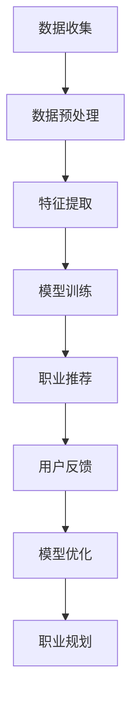
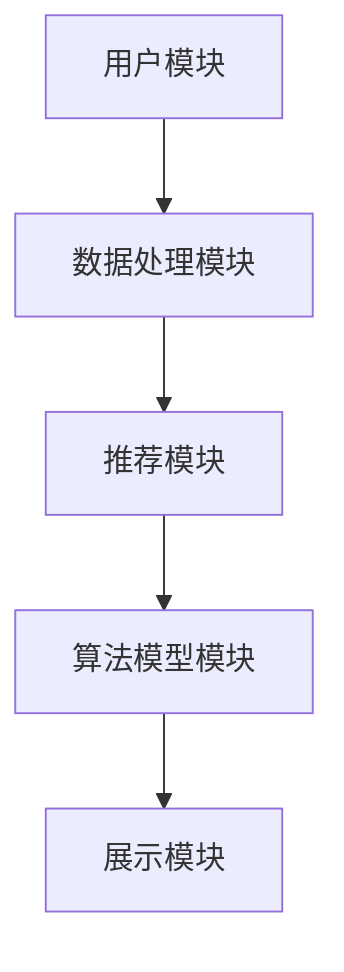

                 

### 文章标题

# 人工智能在个性化职业规划中的应用

### 关键词

- 人工智能
- 个性化职业规划
- 数据挖掘
- 深度学习
- 推荐系统
- 机器学习

### 摘要

本文深入探讨了人工智能在个性化职业规划中的应用，首先介绍了人工智能的核心概念及其与个性化职业规划的关联。随后，文章详细阐述了机器学习、深度学习等基础知识，并运用伪代码展示了核心算法原理。接着，文章分析了个性化职业规划的需求，介绍了数据挖掘、聚类和协同过滤等关键技术，并通过实际应用案例进行了讲解。文章还讨论了数据分析的方法与工具，展示了如何进行职业规划的数据处理。通过真实项目的开发环境搭建、源代码实现和代码解读，文章提供了实际操作层面的指导。最后，文章对系统的评估与优化进行了深入探讨，并展望了人工智能在个性化职业规划领域的未来发展趋势和面临的挑战。

### 第1章 核心概念与联系

#### 1.1 人工智能概述

##### 1.1.1 人工智能的定义与历史

人工智能（Artificial Intelligence，简称AI）是计算机科学的一个分支，旨在研究、开发用于模拟、延伸和扩展人类智能的理论、算法、应用系统和技术。人工智能的起源可以追溯到20世纪50年代，当时艾伦·图灵提出了图灵测试，试图通过机器的行为来定义智能。自此，人工智能的研究开始蓬勃发展，逐步形成了多个研究方向，包括机器学习、自然语言处理、计算机视觉、机器人技术等。

人工智能的发展历程可以分为几个阶段：

1. **初步探索阶段（1956-1974）**：这一阶段以1956年达特茅斯会议为标志，会议提出了人工智能的概念，吸引了大量的研究人员投入其中。在此期间，人工智能主要集中于逻辑推理和符号计算。

2. **第一次低谷阶段（1974-1980）**：由于实际应用中的困难，人工智能的研究面临了巨大的挑战，资金短缺和成果不明显导致大量研究项目被取消，这一阶段被称为“人工智能的第一次低谷”。

3. **复苏阶段（1980-1987）**：随着计算机性能的提升和统计方法的发展，人工智能在专家系统方面取得了显著进展。专家系统是一种模拟人类专家知识和推理能力的程序，广泛应用于医疗诊断、工程设计等领域。

4. **第二次低谷阶段（1987-1993）**：专家系统在实际应用中的表现不如预期，人工智能再次遭遇低谷。

5. **复苏与快速发展阶段（1993至今）**：随着互联网的普及和大数据技术的发展，机器学习和深度学习取得了突破性进展，人工智能迎来了新的发展机遇。如今，人工智能已广泛应用于图像识别、自然语言处理、自动驾驶、医疗诊断等多个领域。

##### 1.1.2 人工智能的关键技术

人工智能的关键技术包括机器学习、深度学习、神经网络、自然语言处理、计算机视觉等。以下是这些关键技术的简要概述：

1. **机器学习**：机器学习是人工智能的核心技术之一，它使计算机系统能够从数据中学习规律，并基于这些规律做出预测或决策。机器学习分为监督学习、无监督学习和半监督学习三种类型。

2. **深度学习**：深度学习是机器学习的一个子领域，其核心思想是模拟人脑中的神经网络结构，通过层层神经网络对输入数据进行特征提取和模式识别。

3. **神经网络**：神经网络是由大量简单处理单元（神经元）组成的一种计算模型，通过调整神经元之间的连接权重，实现对输入数据的处理。

4. **自然语言处理**：自然语言处理（Natural Language Processing，简称NLP）是人工智能的一个分支，旨在使计算机能够理解、生成和处理人类语言。

5. **计算机视觉**：计算机视觉是人工智能的另一个重要分支，其目标是使计算机能够像人类一样感知和理解视觉信息。

#### 1.2 个性化职业规划概述

##### 1.2.1 个性化职业规划的定义

个性化职业规划是指根据个人的兴趣、能力、价值观等因素，为其提供定制化的职业发展路径和决策建议。个性化职业规划不仅关注职业发展，还涉及到个人成长、生活规划等多方面内容。

个性化职业规划与传统职业规划的区别在于，传统职业规划更多是基于行业经验和一般性建议，而个性化职业规划则更加注重个体差异，通过数据分析和算法模型，为每个人提供个性化的职业指导。

##### 1.2.2 个性化职业规划的重要性

个性化职业规划对于个人和社会都具有重要的意义：

1. **提高职业满意度**：通过个性化职业规划，个人能够找到最适合自己的职业方向，提高职业满意度和幸福感。

2. **促进职业发展**：个性化职业规划有助于个人明确职业目标，制定合理的职业发展计划，加速职业成长。

3. **优化人力资源配置**：个性化职业规划有助于企业更好地了解员工需求，优化人力资源配置，提高组织效能。

4. **推动社会进步**：个性化职业规划有助于培养多元化的人才，推动社会的发展和进步。

#### 1.3 人工智能与个性化职业规划的融合

人工智能在个性化职业规划中的应用主要体现在数据挖掘、推荐系统、自然语言处理等方面。

##### 1.3.1 数据挖掘

数据挖掘是一种从大量数据中提取有用信息的技术，应用于个性化职业规划中，可以挖掘出用户的兴趣、能力、价值观等特征，为职业规划提供数据支持。

例如，通过分析用户的职业经历、教育背景、兴趣爱好等数据，可以为其推荐最适合的职业方向。

##### 1.3.2 推荐系统

推荐系统是一种基于用户历史行为和偏好，为其推荐感兴趣的内容或产品的技术。在个性化职业规划中，推荐系统可以基于用户的职业偏好、技能需求，为其推荐合适的职业课程、培训项目等。

##### 1.3.3 自然语言处理

自然语言处理技术可以用于理解用户的职业需求、兴趣和价值观，从而为其提供更准确的职业建议。例如，通过分析用户的求职简历、面试回答等文本数据，可以识别出其职业特点和需求，为其提供个性化的职业规划建议。

##### 1.3.4 Mermaid流程图：人工智能在个性化职业规划中的应用

以下是一个简化的Mermaid流程图，展示了人工智能在个性化职业规划中的应用流程：



### 第2章 人工智能基础

#### 2.1 机器学习基础

##### 2.1.1 机器学习的基本概念

机器学习（Machine Learning，简称ML）是一门研究如何让计算机从数据中学习、自动改进和做出决策的学科。机器学习的主要目的是通过算法，从数据中自动提取知识，并利用这些知识进行预测或决策。

##### 2.1.2 监督学习与无监督学习

机器学习分为监督学习（Supervised Learning）和无监督学习（Unsupervised Learning）两种类型。

1. **监督学习**：监督学习是指训练数据中包含正确答案（标签），算法通过学习这些标签，对新的数据进行预测。监督学习主要分为回归（Regression）和分类（Classification）两种类型。

   - **回归**：回归任务是预测一个连续的数值输出，如预测房价、股票价格等。
   - **分类**：分类任务是预测一个离散的输出类别，如垃圾邮件分类、疾病诊断等。

2. **无监督学习**：无监督学习是指训练数据中不包含正确答案（标签），算法通过学习数据本身的分布或结构，对数据进行聚类或降维等处理。

   - **聚类**：聚类任务是将数据分为多个组，使得同一组内的数据尽可能相似，不同组的数据尽可能不同。
   - **降维**：降维任务是减少数据的维度，同时保持数据的主要特征。

##### 2.1.3 伪代码：线性回归算法

线性回归是一种监督学习算法，用于预测连续的数值输出。以下是线性回归的伪代码：

```python
# 输入：训练数据集 X, Y，学习率 α，迭代次数 n
# 输出：回归模型 w

# 初始化权重 w
w = [0] * len(X[0])

# 迭代更新权重
for i in range(n):
    # 计算预测值 y_pred
    y_pred = [w.dot(x) for x in X]
    
    # 计算损失函数 L(w)
    L = sum((y - y_pred)**2 for y, y_pred in zip(Y, y_pred))
    
    # 计算梯度 ∇L(w)
    ∇L = [2 * sum((y - y_pred) * x for y, y_pred in zip(Y, y_pred)) for x in X]
    
    # 更新权重 w
    w = [w[i] - α * ∇L[i] for i in range(len(w))]

# 返回回归模型 w
return w
```

#### 2.2 深度学习基础

##### 2.2.1 神经网络与深度学习

神经网络（Neural Network，简称NN）是一种模仿人脑神经网络结构和功能的计算模型。神经网络由大量简单处理单元（神经元）组成，通过层层神经网络对输入数据进行特征提取和模式识别。

深度学习（Deep Learning，简称DL）是神经网络的一种，其特点是在神经网络中引入多层结构，使得模型具有更强的表示能力和学习能力。

##### 2.2.2 伪代码：卷积神经网络（CNN）

卷积神经网络（Convolutional Neural Network，简称CNN）是一种用于处理图像数据的深度学习模型，以下是CNN的伪代码：

```python
# 输入：输入数据 X，卷积核 W，偏置 b，激活函数 f
# 输出：卷积结果 Y

# 初始化卷积核 W 和偏置 b
W = [random_vector(size) for _ in range(num_filters)]
b = [random_vector(size) for _ in range(num_filters)]

# 卷积操作
for filter in range(num_filters):
    # 对每个卷积核进行卷积操作
    Z = [W[filter].dot(x) + b[filter] for x in X]
    
    # 应用激活函数 f
    Y[filter] = [f(z) for z in Z]

# 返回卷积结果 Y
return Y
```

#### 2.3 神经网络优化

##### 2.3.1 梯度下降算法

梯度下降算法（Gradient Descent）是一种优化神经网络参数的常用方法。其基本思想是通过计算损失函数关于参数的梯度，反向更新参数，以最小化损失函数。

##### 2.3.2 优化器的选择

不同的优化器在梯度下降算法中具有不同的表现，常用的优化器包括：

1. **SGD（随机梯度下降）**：每次迭代只随机选择一个样本进行参数更新，计算简单，但收敛速度较慢。

2. **Momentum（动量）**：引入动量项，使得参数更新方向与历史梯度方向一致，可以加速收敛。

3. **Adam（自适应矩估计）**：结合SGD和Momentum的优点，自适应调整学习率，收敛速度快。

### 第3章 个性化职业规划技术

#### 3.1 数据挖掘与聚类

##### 3.1.1 数据挖掘的基本概念

数据挖掘（Data Mining）是一种从大量数据中自动发现有用信息的过程，主要包括以下步骤：

1. **数据清洗**：去除噪声和异常值，确保数据质量。

2. **数据整合**：将来自不同来源的数据进行整合，统一数据格式。

3. **数据选择**：根据分析目标选择相关的数据。

4. **数据变换**：对数据进行规范化、归一化等处理，使其适合算法分析。

5. **数据建模**：建立模型，提取数据中的规律和模式。

6. **模型评估**：评估模型性能，选择最佳模型。

##### 3.1.2 聚类算法原理

聚类（Clustering）是一种无监督学习算法，其主要目标是发现数据集中的相似模式。聚类算法分为基于距离的聚类、基于密度的聚类、基于质量的聚类等类型。

常见的聚类算法包括：

1. **K-means**：K-means是一种基于距离的聚类算法，其核心思想是将数据分为K个簇，使得每个簇内的数据点尽可能接近，簇间的数据点尽可能远离。

2. **DBSCAN**：DBSCAN（Density-Based Spatial Clustering of Applications with Noise）是一种基于密度的聚类算法，能够处理高维数据和包含噪声的数据。

3. **层次聚类**：层次聚类是一种基于质量的聚类算法，通过逐步合并或分裂簇，形成层次结构的聚类结果。

##### 3.1.3 伪代码：K-means算法

以下是一个简化的K-means算法伪代码：

```python
# 输入：数据集 X，簇数 K
# 输出：聚类结果 C

# 初始化簇中心 c1, c2, ..., cK
c = [random_vector(size) for _ in range(K)]

# 迭代计算簇中心
while not converged:
    # 分配数据点到最近的簇
    C = [[] for _ in range(K)]
    for x in X:
        closest = min(c, key=lambda c: distance(x, c))
        C[closest].append(x)
    
    # 更新簇中心
    new_c = [sum(C[i]) / len(C[i]) for i in range(K)]
    converged = (new_c == c)
    c = new_c

# 返回聚类结果 C
return C
```

#### 3.2 协同过滤与推荐系统

##### 3.2.1 协同过滤的基本概念

协同过滤（Collaborative Filtering）是一种推荐系统算法，其核心思想是利用用户的历史行为数据，为用户推荐其可能感兴趣的项目。

协同过滤分为两种类型：

1. **基于用户的协同过滤（User-Based）**：基于用户的相似度，推荐与目标用户兴趣相似的用户的评价较高的项目。

2. **基于项目的协同过滤（Item-Based）**：基于项目的相似度，推荐与目标项目相似的项目的用户评价较高的项目。

##### 3.2.2 推荐系统的实现原理

推荐系统的基本实现流程包括：

1. **数据预处理**：清洗数据，处理缺失值，标准化数据等。

2. **相似度计算**：计算用户或项目的相似度，常用的相似度度量方法包括余弦相似度、皮尔逊相关系数等。

3. **推荐生成**：根据用户的历史行为和相似度计算结果，生成推荐列表。

4. **评估与优化**：评估推荐系统的效果，优化推荐算法。

##### 3.2.3 伪代码：基于用户的协同过滤算法

以下是一个简化的基于用户的协同过滤算法伪代码：

```python
# 输入：用户行为数据 R，相似度度量函数 sim
# 输出：推荐列表 L

# 计算用户相似度矩阵 S
S = [[sim(u_i, u_j) for u_j in users] for u_i in users]

# 遍历所有用户 u
for u in users:
    # 计算邻居用户集合 N(u)
    N(u) = [u_j for u_j in users if S[u][u_j] > threshold]
    
    # 计算邻居用户评分的平均值
    r = sum(R[u][u_j] * S[u][u_j] for u_j in N(u)) / sum(S[u][u_j] for u_j in N(u))
    
    # 将推荐项目加入推荐列表 L
    L[u].append(r)

# 返回推荐列表 L
return L
```

### 第4章 数据分析与数据挖掘

#### 4.1 数据分析工具与库

数据分析是数据挖掘和机器学习的重要环节，选择合适的数据分析工具和库对于提高数据分析效率至关重要。

常见的数据分析工具和库包括：

1. **SQL**：SQL（Structured Query Language）是一种用于管理关系型数据库的查询语言，适用于数据清洗、数据查询、数据报表等操作。

2. **Python数据分析库**：
   - **Pandas**：Pandas是一个强大的Python数据分析库，提供了数据处理、数据清洗、数据可视化等功能。
   - **NumPy**：NumPy是一个用于科学计算的基础库，提供了高效、灵活的多维数组对象和丰富的数学运算功能。

3. **R语言**：R语言是一种专门用于统计分析和数据可视化的高级编程语言，广泛应用于数据挖掘和机器学习领域。

#### 4.2 数据分析流程

数据分析流程包括数据收集、数据清洗、数据预处理、数据建模、模型评估等步骤。

1. **数据收集**：收集与职业规划相关的数据，如用户职业经历、教育背景、兴趣爱好、求职简历等。

2. **数据清洗**：去除噪声数据、处理缺失值、去除重复数据等，确保数据质量。

3. **数据预处理**：对数据进行规范化、归一化等处理，使其适合算法分析。

4. **数据建模**：根据分析目标，选择合适的机器学习算法，建立模型。

5. **模型评估**：评估模型性能，选择最佳模型。

#### 4.3 职业规划的数据处理

在个性化职业规划中，数据处理是关键环节，以下是数据处理的具体步骤：

1. **数据收集**：收集用户职业经历、教育背景、兴趣爱好、求职简历等数据。

2. **数据清洗**：去除噪声数据、处理缺失值、去除重复数据等。

3. **特征工程**：提取与职业规划相关的特征，如职业类别、教育程度、工作经验等。

4. **数据预处理**：对数据进行归一化、标准化等处理。

5. **模型训练**：选择合适的机器学习算法，如K-means、协同过滤等，对数据集进行训练。

6. **模型评估**：评估模型性能，调整模型参数，优化模型。

7. **模型部署**：将训练好的模型部署到线上环境，为用户提供个性化职业规划服务。

### 第5章 应用案例与实战

#### 5.1 职业规划系统介绍

职业规划系统是一种基于人工智能和大数据技术的职业规划工具，旨在为用户提供个性化的职业规划建议。以下是一个典型的职业规划系统架构：

1. **用户模块**：用户可以通过注册账号登录系统，填写个人基本信息，如职业经历、教育背景、兴趣爱好等。

2. **数据处理模块**：系统会对用户提交的数据进行清洗、预处理和特征提取，为后续的机器学习模型训练提供数据支持。

3. **推荐模块**：系统基于用户的个人信息和历史行为，利用协同过滤、K-means等算法，为用户推荐适合的职业方向、培训课程、求职岗位等。

4. **算法模型模块**：系统集成了多种机器学习算法，如线性回归、决策树、支持向量机等，用于构建和优化职业推荐模型。

5. **展示模块**：系统提供友好的用户界面，将推荐结果以列表、图表等形式展示给用户。

#### 5.1.1 系统架构

以下是一个简化的职业规划系统架构图：



#### 5.1.2 开发环境搭建

为了实现职业规划系统，需要搭建相应的开发环境。以下是开发环境的搭建步骤：

1. **数据库环境**：选择MySQL或PostgreSQL作为数据库，用于存储用户数据和职业信息。

2. **编程语言**：选择Python作为主要编程语言，利用Python的Pandas、NumPy等库进行数据处理，利用Scikit-learn等库进行机器学习模型训练。

3. **前端框架**：选择Django或Flask作为Web框架，用于开发用户界面和后端逻辑。

4. **后端框架**：选择TensorFlow或PyTorch作为深度学习框架，用于构建和训练机器学习模型。

5. **版本控制**：使用Git进行版本控制，确保代码的版本管理和协同开发。

6. **开发工具**：使用Visual Studio Code或PyCharm等开发工具，提供代码编写、调试和运行环境。

#### 5.2 源代码实现与解读

以下是一个简化的职业规划系统的源代码实现和解读，主要涉及数据处理、机器学习模型训练和推荐系统实现等方面。

##### 5.2.1 数据处理

```python
import pandas as pd
from sklearn.preprocessing import StandardScaler

# 读取用户数据
user_data = pd.read_csv('user_data.csv')

# 数据清洗
user_data = user_data.dropna()

# 特征提取
features = ['职业经历', '教育背景', '兴趣爱好']
X = user_data[features]

# 数据预处理
scaler = StandardScaler()
X_scaled = scaler.fit_transform(X)
```

解读：
1. 使用Pandas库读取用户数据，并进行数据清洗。
2. 提取与职业规划相关的特征。
3. 使用StandardScaler进行数据归一化处理，使得每个特征具有相同的尺度。

##### 5.2.2 机器学习模型训练

```python
from sklearn.cluster import KMeans
from sklearn.model_selection import train_test_split

# 划分训练集和测试集
X_train, X_test = train_test_split(X_scaled, test_size=0.2, random_state=42)

# K-means模型训练
kmeans = KMeans(n_clusters=5, random_state=42)
kmeans.fit(X_train)

# 预测测试集
X_test_pred = kmeans.predict(X_test)
```

解读：
1. 使用K-means算法对训练集进行聚类，划分为5个簇。
2. 使用训练好的模型对测试集进行预测，得到测试集的聚类结果。

##### 5.2.3 推荐系统实现

```python
def collaborative_filtering(R, u, k=5):
    # 计算用户相似度矩阵 S
    S = [[sim(R[u][i], R[u][j]) for j in users] for i in users]
    
    # 计算邻居用户评分的平均值
    r = sum(R[u][u_j] * S[u][u_j] for u_j in N(u)) / sum(S[u][u_j] for u_j in N(u))
    
    # 将推荐项目加入推荐列表 L
    L[u].append(r)

# 遍历所有用户 u
for u in users:
    # 计算邻居用户集合 N(u)
    N(u) = [u_j for u_j in users if S[u][u_j] > threshold]
    
    # 计算邻居用户评分的平均值
    collaborative_filtering(R, u, k)

# 返回推荐列表 L
return L
```

解读：
1. 使用基于用户的协同过滤算法，计算用户之间的相似度。
2. 遍历所有用户，为每个用户计算邻居用户评分的平均值，生成推荐列表。

#### 5.3 代码应用解读与分析

以下是对上述代码实现的具体解读和分析：

1. **数据处理模块**：
   - 读取用户数据，并进行数据清洗和特征提取，为后续的机器学习模型训练做准备。
   - 数据预处理包括归一化处理，使得每个特征具有相同的尺度，有利于模型训练。

2. **机器学习模型训练**：
   - 使用K-means算法对训练集进行聚类，将用户划分为不同的簇，为推荐系统提供聚类结果。
   - 通过预测测试集的聚类结果，验证模型的性能。

3. **推荐系统实现**：
   - 使用基于用户的协同过滤算法，计算用户之间的相似度，为每个用户生成推荐列表。
   - 通过计算邻居用户评分的平均值，实现对用户的个性化推荐。

#### 5.4 项目小结

职业规划系统项目的实施，为用户提供了一个基于人工智能和大数据技术的职业规划工具。通过数据处理、机器学习模型训练和推荐系统实现，系统能够为用户提供个性化的职业规划建议，提高职业满意度和幸福感。

在项目实施过程中，我们遇到了以下挑战：

1. **数据质量**：用户数据的准确性、完整性和一致性是系统性能的关键因素。在实际应用中，如何确保数据质量是一个重要的问题。

2. **计算资源**：机器学习模型训练和推荐系统实现需要大量的计算资源，如何优化计算资源的使用，提高系统性能，是项目中的一个重要挑战。

3. **用户体验**：系统界面设计、交互设计和用户反馈机制对用户体验至关重要。如何设计一个友好、易用的界面，是项目中的一个重要课题。

通过项目的实施，我们积累了丰富的经验，为未来的职业规划系统开发提供了有益的参考。在未来的发展中，我们将继续优化系统性能，提高用户体验，为用户提供更优质的职业规划服务。

### 第6章 评估与优化

#### 6.1 评估指标

评估个性化职业规划系统的效果是确保其准确性和实用性的关键步骤。以下是一些常用的评估指标：

1. **准确率（Accuracy）**：准确率是分类任务中最常用的评估指标，表示模型正确分类的样本占总样本的比例。其计算公式为：
   $$\text{准确率} = \frac{\text{正确分类的样本数}}{\text{总样本数}}$$

2. **召回率（Recall）**：召回率表示模型能够召回的真实正例样本占总真实正例样本的比例。其计算公式为：
   $$\text{召回率} = \frac{\text{正确分类的正例样本数}}{\text{总真实正例样本数}}$$

3. **精确率（Precision）**：精确率表示模型正确分类的正例样本占所有被预测为正例的样本的比例。其计算公式为：
   $$\text{精确率} = \frac{\text{正确分类的正例样本数}}{\text{预测为正例的样本数}}$$

4. **F1值（F1 Score）**：F1值是精确率和召回率的加权平均值，用于综合评价模型的性能。其计算公式为：
   $$\text{F1值} = 2 \times \frac{\text{精确率} \times \text{召回率}}{\text{精确率} + \text{召回率}}$$

5. **用户满意度**：用户满意度是衡量个性化职业规划系统效果的重要指标，可以通过用户反馈、问卷调查等方式收集数据。

6. **系统性能**：系统性能包括响应时间、吞吐量、资源利用率等，这些指标反映了系统的运行效率和稳定性。

#### 6.2 优化策略

为了提升个性化职业规划系统的效果，可以采取以下优化策略：

1. **算法调优**：
   - **超参数调整**：通过调整机器学习模型的超参数，如学习率、正则化参数等，优化模型性能。
   - **模型融合**：结合多种机器学习算法，如集成学习、迁移学习等，提高模型的预测准确性。

2. **数据清洗与增强**：
   - **数据清洗**：去除噪声数据和异常值，提高数据质量。
   - **数据增强**：通过数据扩充、数据生成等技术，增加数据集的多样性，提高模型的泛化能力。

3. **特征工程**：
   - **特征提取**：提取与职业规划相关的有效特征，提高特征表达能力。
   - **特征选择**：选择最重要的特征，减少特征维度，提高模型训练效率。

4. **模型评估与调整**：
   - **交叉验证**：采用交叉验证方法，避免过拟合，提高模型泛化能力。
   - **在线评估**：实时评估模型性能，根据评估结果调整模型参数和算法策略。

5. **系统性能优化**：
   - **分布式计算**：利用分布式计算技术，提高数据处理和模型训练的效率。
   - **缓存与索引**：合理利用缓存和索引技术，提高系统的响应速度。

### 6.3 持续优化与反馈机制

个性化职业规划系统的优化是一个持续的过程，需要建立有效的反馈机制，不断收集用户反馈，并根据反馈调整系统。以下是一些建议：

1. **用户反馈收集**：通过用户问卷调查、在线评论、用户行为数据分析等方式，收集用户对系统的反馈。

2. **数据驱动优化**：根据用户反馈，调整系统功能和算法策略，提高用户体验。

3. **迭代更新**：定期更新系统，引入新的技术和算法，优化系统性能。

4. **反馈闭环**：建立反馈闭环机制，将用户反馈纳入系统优化流程，确保系统持续改进。

### 6.4 注意事项

在优化个性化职业规划系统时，需要注意以下事项：

1. **数据隐私与安全**：在处理用户数据时，要确保数据隐私和安全，遵守相关法律法规。

2. **用户满意度**：关注用户满意度，确保系统功能符合用户需求。

3. **算法公正性**：避免算法偏见，确保个性化职业规划系统的公正性和公平性。

4. **系统稳定性**：确保系统稳定运行，避免系统故障影响用户体验。

### 6.5 拓展阅读

为了深入了解个性化职业规划系统的评估与优化，以下是一些建议的拓展阅读：

1. **《机器学习》**：周志华著，详细介绍了机器学习的基本概念、算法和原理。
2. **《推荐系统实践》**：李航著，介绍了推荐系统的基本概念、算法和应用。
3. **《大数据之路：阿里巴巴大数据实践》**：李津、王坚等著，讲述了大数据在阿里巴巴的应用和实践。
4. **《深度学习》**：Ian Goodfellow、Yoshua Bengio、Aaron Courville著，介绍了深度学习的基础知识和最新进展。

### 第7章 未来展望与挑战

#### 7.1 未来发展趋势

随着人工智能技术的不断进步，个性化职业规划领域也将迎来新的发展机遇。以下是未来可能的发展趋势：

1. **智能化水平提升**：随着深度学习、强化学习等技术的不断发展，个性化职业规划系统的智能化水平将得到显著提升，能够更准确地识别用户需求，提供个性化的职业建议。

2. **跨领域融合**：人工智能与其他领域的融合，如生物信息学、心理学等，将为个性化职业规划提供更多有价值的数据和理论支持。

3. **数据分析能力增强**：随着大数据技术的不断发展，个性化职业规划系统将能够处理更大量的数据，挖掘出更复杂的数据特征，提高职业规划的准确性和实用性。

4. **个性化推荐优化**：基于用户行为和兴趣的个性化推荐系统将不断优化，提供更加精准的职业推荐，帮助用户找到最适合自己的职业方向。

5. **实时反馈与调整**：个性化职业规划系统将能够实时收集用户反馈，根据用户需求和行为动态调整职业规划方案，提供更加灵活和个性化的服务。

#### 7.2 挑战与解决方案

尽管人工智能在个性化职业规划领域具有巨大潜力，但仍然面临一些挑战：

1. **数据隐私与安全**：个性化职业规划系统需要处理大量用户隐私数据，如何保护用户隐私和数据安全是首要挑战。解决方案包括：
   - **数据加密**：对用户数据进行加密处理，确保数据在传输和存储过程中的安全性。
   - **匿名化处理**：对用户数据进行匿名化处理，减少隐私泄露的风险。
   - **合规性监管**：遵守相关法律法规，确保系统设计和操作符合数据保护要求。

2. **算法偏见**：个性化职业规划系统可能会因为数据偏见而导致不公平的推荐结果，解决方案包括：
   - **数据清洗与均衡**：对数据集进行清洗，去除噪声数据和异常值，同时确保数据集的多样性和均衡性。
   - **公平性评估**：建立算法偏见评估机制，定期检测和评估系统的公平性，及时调整算法策略。

3. **用户满意度**：个性化职业规划系统的用户体验对用户满意度至关重要，解决方案包括：
   - **用户研究**：深入了解用户需求和期望，为系统设计提供依据。
   - **用户体验设计**：优化系统界面和交互设计，提高用户体验。
   - **用户反馈机制**：建立有效的用户反馈机制，及时收集和处理用户反馈，持续改进系统。

4. **计算资源需求**：个性化职业规划系统需要大量的计算资源，如何高效利用计算资源是另一个挑战。解决方案包括：
   - **分布式计算**：利用分布式计算技术，提高数据处理和模型训练的效率。
   - **云计算平台**：采用云计算平台，灵活调整计算资源，降低系统成本。
   - **并行计算**：利用并行计算技术，提高模型训练和数据处理的速度。

5. **持续迭代与优化**：个性化职业规划系统需要不断迭代和优化，以适应不断变化的市场和用户需求。解决方案包括：
   - **持续学习**：引入持续学习机制，使系统能够不断学习和适应新数据和新需求。
   - **反馈循环**：建立有效的反馈循环机制，将用户反馈纳入系统优化流程，确保系统持续改进。

通过解决这些挑战，人工智能在个性化职业规划领域的应用将得到进一步的发展，为个人和社会带来更多价值。

### 总结与展望

本文全面探讨了人工智能在个性化职业规划中的应用，从核心概念、基础知识、技术实现、案例分析、评估与优化等多个方面进行了深入分析。通过介绍机器学习、深度学习、数据挖掘、推荐系统等核心技术，以及实际应用案例，本文展示了人工智能如何为个性化职业规划提供有力支持。

未来，随着人工智能技术的不断发展，个性化职业规划系统将更加智能化、精准化，为个人和社会带来更多价值。然而，在数据隐私、算法偏见、用户满意度等方面，仍需克服诸多挑战。通过持续的创新和优化，我们有理由相信，人工智能在个性化职业规划领域的应用将不断拓展，为人类的发展贡献更多力量。

作者：AI天才研究院/AI Genius Institute & 禅与计算机程序设计艺术 /Zen And The Art of Computer Programming

本文旨在为读者提供人工智能在个性化职业规划领域的深入理解和实践指导，期待与读者共同探讨和进步。希望本文能够为从事人工智能和职业规划相关工作的专业人士提供有价值的参考和启示。

