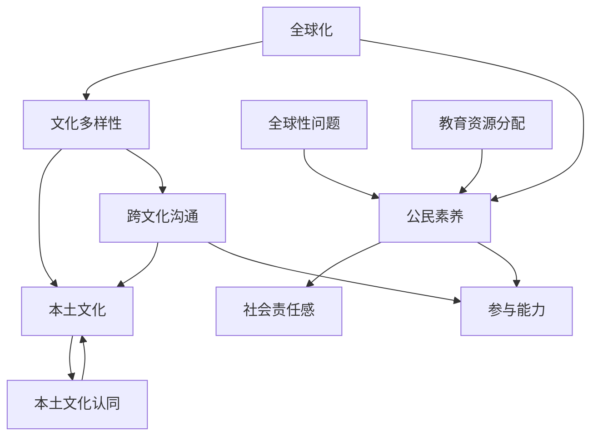

                 

### 引言：全球化时代的背景与公民教育的意义

#### 1.1 全球化的背景与影响

全球化，作为一种历史趋势，早在20世纪就已经初见端倪。然而，进入21世纪，全球化进程加速，对全球政治、经济、文化、社会等各个方面产生了深远的影响。全球化指的是世界范围内的社会、经济、政治和文化交流的不断加强，这种交流打破了国家和地区的界限，使世界变得更加紧密和相互依存。

全球化带来的影响是多方面的。在经济领域，全球化促进了全球贸易和投资，提高了生产效率，降低了成本，从而提升了全球经济的整体繁荣。然而，全球化也导致了资源分配的不均衡，一些发展中国家在面对全球化带来的机遇时，也面临着严重的挑战。

在政治领域，全球化改变了国际关系的格局，促进了国际合作和多边主义的发展。同时，全球化也加剧了全球治理的复杂性，如何在全球化背景下维护国际和平与安全成为世界各国共同面临的问题。

在文化领域，全球化促进了不同文化之间的交流与融合，丰富了人类的文化多样性。然而，全球化也带来了文化同质化的风险，一些本土文化在全球化浪潮中逐渐消失。

在社会领域，全球化改变了人们的生产生活方式，促进了全球城市化进程，提高了人们的生活质量。然而，全球化也带来了社会问题的全球化，如贫富差距、环境问题等。

#### 1.2 公民教育的定义和重要性

公民教育是一种旨在培养个体成为合格公民的教育形式。它不仅仅涉及知识的传授，更重要的是培养学生的社会责任感、公民素养和参与社会的能力。公民教育的目标是通过教育，使个体能够理解并积极参与社会、政治和文化事务，为社会的可持续发展做出贡献。

在全球化的背景下，公民教育的重要性愈发凸显。首先，全球化带来了国家间更加紧密的联系，公民需要具备跨文化的沟通能力和全球视野，以应对日益复杂的社会环境。其次，全球化也加剧了社会问题的全球化，公民教育可以帮助个体理解和解决这些问题，从而促进全球社会的和谐与发展。

公民教育的重要性还体现在以下几个方面：

1. **培养社会责任感**：公民教育通过传授公民的权利和义务，培养个体的社会责任感，使个体能够积极参与社会事务，为社会的繁荣和稳定贡献力量。

2. **提升公民素养**：公民教育帮助个体了解社会制度、法律体系和公共事务，提高个体的公民素养，使其能够更好地履行公民的职责。

3. **增强参与能力**：公民教育培养学生的参与意识和实践能力，使他们能够积极参与社会和政治活动，为社会的发展和进步提供智慧和支持。

4. **促进社会和谐**：公民教育有助于培养社会的和谐氛围，通过教育个体理解和尊重不同文化和价值观，减少文化冲突和矛盾。

#### 1.3 全球化对公民教育的影响

全球化对公民教育的影响是双重的。一方面，全球化为公民教育提供了新的机遇，如跨文化教育、全球性问题教育等。另一方面，全球化也带来了挑战，如本土文化认同的危机、全球性问题对公民教育的压力等。

1. **跨文化教育**：全球化使得不同文化之间的交流更加频繁，公民教育需要培养学生的跨文化沟通能力和全球视野。通过跨文化教育，学生可以了解和尊重其他文化，从而增强对全球问题的理解和应对能力。

2. **全球性问题教育**：全球化使得全球性问题，如气候变化、贫困、恐怖主义等，成为各国共同面临的问题。公民教育需要加强对这些问题的教育，培养学生的全球责任感和解决能力。

3. **本土文化认同的危机**：全球化也带来了本土文化认同的危机。一些地区的本土文化在全球化浪潮中逐渐消失，这引发了人们对本土文化认同的担忧。公民教育需要在尊重本土文化的基础上，培养学生的文化认同感，从而保护和发展本土文化。

4. **全球教育资源的分配**：全球化带来了教育资源的分配问题。一些发展中国家在应对全球化带来的教育挑战时，面临着教育资源不足的问题。公民教育需要关注这些问题的解决，确保所有学生都能接受到高质量的公民教育。

#### 1.4 公民教育的核心概念与联系

为了更好地理解全球化对公民教育的影响，我们需要明确几个核心概念，并探讨它们之间的联系。以下是几个核心概念及其关系架构的Mermaid流程图：



这个流程图展示了全球化如何影响文化多样性，进而影响本土文化和跨文化沟通。同时，全球化也影响公民素养，包括社会责任感、参与能力和全球视野。全球性问题教育和本土文化认同危机是全球化对公民教育的双重挑战。

#### 1.5 公民教育的核心算法原理讲解

为了更好地实现公民教育的目标，我们需要运用一些核心算法原理来设计课程和教学策略。以下是公民教育的核心算法原理及其应用：

1. **社会学习算法**：社会学习算法是一种基于社会互动和观察学习的教育方法。它通过模拟社会互动过程，帮助学生理解和掌握公民素养。例如，教师可以通过角色扮演、模拟谈判等方式，让学生在实践中学习如何处理社会问题。

   ```python
   # 社会学习算法伪代码
   function 社会学习算法（学生）：
       初始化学生状态
       while 学生未达到目标状态：
           观察他人行为
           学习他人行为
           进行自我反思
           调整行为策略
   ```

2. **情感算法**：情感算法关注学生的情感体验，通过设计情感化的教学环境，提高学生的学习兴趣和参与度。例如，教师可以通过情感化的故事、游戏和活动，激发学生的情感共鸣，从而提高他们的公民素养。

   ```python
   # 情感算法伪代码
   function 情感算法（学生，教学材料）：
       选择情感化教学材料
       创造情感化教学环境
       引导学生进行情感体验
       收集学生情感反馈
       调整教学策略
   ```

3. **认知算法**：认知算法关注学生的认知发展，通过设计认知挑战性的任务和活动，提高学生的思维能力和创造力。例如，教师可以通过项目式学习、问题解决学习等方式，培养学生的批判性思维和创新能力。

   ```python
   # 认知算法伪代码
   function 认知算法（学生，学习任务）：
       设计认知挑战性任务
       提供学习资源和工具
       引导学生进行探索和学习
       评估学生认知发展水平
       调整学习任务和策略
   ```

通过这些核心算法原理，我们可以设计出更加有效和有针对性的公民教育课程和教学策略，从而更好地实现公民教育的目标。

#### 1.6 全球化时代的公民教育现状

全球化时代，公民教育的现状呈现出多样化和复杂性的特点。不同国家和地区在公民教育的内容、方法、目标和实施策略上存在显著差异。以下是对当前全球公民教育现状的概述。

1. **发达国家公民教育的现状**：

   在发达国家，如美国、英国和加拿大，公民教育通常被视为学校课程的一部分，并且具有较高的重视程度。这些国家的公民教育课程通常包括宪法、法律、政治制度、人权、民主价值观等内容。教学方法多样化，包括课堂讲授、辩论、模拟联合国、社区服务等活动。这些教育实践旨在培养学生的批判性思维、公民参与能力和责任感。

   例如，美国的中小学公民教育课程涵盖了美国的政治制度、历史和文化，强调民主和自由的价值观。英国则在课程中强调法律和社会责任，通过社区服务和公共服务活动培养学生的公民意识。加拿大则注重多元文化和跨文化交流，通过不同文化的学习，增强学生的全球视野和文化认同。

2. **发展中国家公民教育的现状**：

   在发展中国家，公民教育的实施面临更多的挑战。许多国家由于经济、社会和政治问题，公民教育资源的投入不足，教育质量参差不齐。在这些国家，公民教育的重点往往放在基础的公民知识和法律意识教育上，如人权、法律制度、社会公正等。

   例如，在中国，公民教育是中小学课程的重要组成部分，包括道德教育、法律知识、社会价值观等内容。印度则通过学校教育和公共宣传活动，增强公民的法律意识和参与社会事务的积极性。在非洲的一些国家，公民教育主要集中在提高公民的基本素质和参与社区发展的能力。

3. **全球公民教育的差异与共性**：

   尽管不同国家和地区的公民教育存在差异，但也有一些共性。首先，全球公民教育普遍关注培养学生的社会责任感和公民参与能力。其次，许多国家在课程设置上注重跨文化交流和全球视野的培养。此外，全球公民教育也强调民主价值观和人权教育的重要性。

   然而，全球公民教育也面临一些挑战。首先，文化差异导致公民教育的实施难度较大，如何在尊重本土文化的基础上培养全球视野是一个亟待解决的问题。其次，全球性问题，如气候变化、贫困、恐怖主义等，对公民教育提出了新的要求和挑战。如何在教育中有效应对这些问题，是各国需要共同面对的难题。

#### 1.7 全球化时代的公民教育与本土认同的关系

全球化时代，公民教育不仅关注培养学生的全球视野和跨文化沟通能力，还必须兼顾本土认同的培养。本土认同是指个体对自身所属民族、文化和社会的认同和归属感。在全球化的背景下，如何处理公民教育与本土认同之间的关系，成为教育领域的一个重要课题。

首先，公民教育与本土认同之间存在着紧密的联系。公民教育旨在培养学生的社会责任感、公民素养和参与社会的能力，而本土认同则是这一过程的重要基础。通过本土认同的培养，学生可以更好地理解和尊重本土文化，从而增强对社会和国家的认同感。这种认同感有助于学生在全球化的背景下，既保持开放的心态，又能坚守本土文化的根基。

然而，全球化也带来了本土认同的危机。一些地区的本土文化在全球化浪潮中逐渐消失，这引发了人们对本土文化认同的担忧。过度的全球化可能导致文化同质化，使本土文化失去特色和活力。在这种情况下，如何在全球化的背景下维护本土认同，成为一个亟待解决的问题。

1. **全球视野与本土认同的平衡**：

   为了在全球化的背景下实现公民教育与本土认同的平衡，教育工作者需要采取一系列策略。首先，教育内容的设计应兼顾全球视野和本土认同。例如，在课程设置上，可以同时包含全球性的主题和本土性的案例，通过对比分析，帮助学生理解全球问题和本土问题的关联。

   其次，教学方法也应多元化，结合全球视野和本土认同。例如，可以采用项目式学习，让学生在解决全球性问题的同时，关注本土问题的解决方案。通过这样的实践活动，学生不仅能够培养全球视野，还能增强对本土文化的认同。

2. **本土文化的保护与传承**：

   保护本土文化是培养本土认同的重要手段。教育工作者可以通过多种途径来实现这一目标。首先，在课程设置中，应加强本土文化教育，包括历史、艺术、传统和语言等方面的内容。其次，可以组织各种文化活动，如民俗节庆、传统文化展示等，让学生亲身感受和体验本土文化。

   此外，教育工作者还应鼓励学生参与本土文化保护与传承的实践活动。例如，可以组织学生进行田野调查，记录和保存本土文化遗产。通过这些活动，学生不仅能够加深对本土文化的了解，还能增强对本土文化的认同。

3. **全球性问题与本土问题的融合**：

   全球性问题与本土问题的融合是全球化时代公民教育的重要趋势。教育工作者可以通过将全球性问题和本土问题相结合，培养学生的全球视野和本土认同。例如，在讨论全球气候变化问题时，可以引导学生了解本地区气候变化的影响，并提出具体的解决方案。

   通过这种方式，学生不仅能够关注全球性问题，还能认识到本土问题的重要性，从而增强对本土文化的认同。同时，这种融合也有助于培养学生的创新思维和解决问题的能力。

总之，全球化时代的公民教育需要在培养全球视野的同时，兼顾本土认同的培养。通过平衡全球视野与本土认同，保护和发展本土文化，我们可以为未来的世界公民培养出既有全球视野，又坚守本土认同的合格公民。

#### 1.8 案例研究：国外成功公民教育案例

在全球化背景下，许多国家通过创新的教育模式和策略，成功实施了公民教育，取得了显著的效果。以下将分析几个国外成功公民教育案例，探讨其成功原因和可借鉴的经验。

1. **美国公立学校的全球教育项目**

   美国的全球教育项目是一个典型的公民教育成功案例。该项目通过跨学科的课程设置和多样化的教学方法，培养了学生的全球视野和公民素养。具体来说，该项目包括以下几个特点：

   - **跨学科课程**：全球教育项目将历史、地理、社会学等多个学科融合在一起，通过综合性的课程设计，帮助学生全面了解全球问题和国际事务。

   - **真实世界的问题解决**：该项目强调将学习与实际生活相结合，通过解决真实世界的问题，如气候变化、贫困、人权等，培养学生的实践能力和社会责任感。

   - **跨文化交流**：项目鼓励学生参与国际交流项目，与来自不同文化背景的学生互动，增强他们的跨文化沟通能力和全球视野。

   - **学生参与**：项目鼓励学生参与决策过程，通过讨论、辩论和模拟联合国等活动，提高他们的公民参与意识和能力。

   **成功原因**：

   - **综合性的课程设计**：跨学科的课程设置有助于学生全面了解全球问题，从而培养他们的综合思维能力和批判性思维。

   - **实践导向的教学方法**：通过解决实际问题的教学方法，学生能够将所学知识应用于实际，提高他们的实践能力和解决问题的能力。

   - **跨文化交流**：跨文化交流项目有助于学生了解不同文化，增强他们的跨文化沟通能力和全球视野。

   - **学生参与**：学生的参与感增强了他们的学习兴趣和积极性，同时也培养了他们的公民参与意识和能力。

   **可借鉴的经验**：

   - **综合性的课程设计**：在全球公民教育中，可以借鉴美国的做法，将跨学科的知识融合在一起，帮助学生全面了解全球问题。

   - **实践导向的教学方法**：将学习与实际问题相结合，通过项目式学习等方式，提高学生的实践能力和解决问题的能力。

   - **跨文化交流**：鼓励学生参与国际交流项目，与来自不同文化背景的学生互动，增强他们的跨文化沟通能力和全球视野。

   - **学生参与**：鼓励学生在教育过程中参与决策，提高他们的参与感和学习兴趣。

2. **芬兰的全科教育模式**

   芬兰的全科教育模式是另一个成功的公民教育案例。芬兰的全科教育注重培养学生的全面素质，包括公民素养、创造力、批判性思维等。以下是该模式的特点：

   - **全面的教育目标**：芬兰的全科教育不仅关注学生的学术成绩，还注重培养他们的公民素养、社会责任感、创造力和批判性思维。

   - **教师主导的教学**：在芬兰，教师扮演着重要的角色，他们通过个性化的教学方法和互动式课堂，激发学生的学习兴趣和创造力。

   - **学生自主学习和项目式学习**：芬兰的教育鼓励学生自主学习，通过项目式学习，让学生在实践中学习和应用知识。

   - **社区参与**：芬兰的教育强调学校与社区的合作，通过社区服务和项目，培养学生的社会责任感和公民参与能力。

   **成功原因**：

   - **全面的教育目标**：芬兰的全科教育模式注重培养学生的全面素质，有助于他们在全球化背景下具备综合能力和竞争力。

   - **教师主导的教学**：芬兰的教师拥有较高的专业素养和教学自主权，能够根据学生的实际情况进行个性化的教学。

   - **学生自主学习和项目式学习**：自主学习模式和项目式学习有助于培养学生的创造力和批判性思维，提高他们的学习效果。

   - **社区参与**：社区参与项目不仅增强了学生的社会责任感，还使他们能够将所学知识应用于实际，提高他们的实践能力。

   **可借鉴的经验**：

   - **全面的教育目标**：在全球公民教育中，可以借鉴芬兰的做法，注重培养学生的全面素质，包括公民素养、创造力、批判性思维等。

   - **教师主导的教学**：提高教师的专业素养和教学自主权，鼓励教师采用个性化的教学方法，提高学生的学习效果。

   - **学生自主学习和项目式学习**：鼓励学生自主学习，通过项目式学习，提高他们的创造力和批判性思维。

   - **社区参与**：加强与社区的互动，通过社区服务和项目，培养学生的社会责任感和公民参与能力。

通过分析这些成功案例，我们可以看到，全球公民教育需要注重跨学科的课程设计、实践导向的教学方法、跨文化交流和社区参与。这些经验对于全球范围内的公民教育都具有重要的借鉴意义。

### 1.9 案例研究：国内成功公民教育案例

在我国，也有一些学校和地区在公民教育方面取得了显著成绩，以下将分析几个国内成功公民教育案例，探讨其成功原因和可借鉴的经验。

1. **北京四中公民教育项目**

   北京四中作为一所知名高中，其公民教育项目备受瞩目。该项目通过一系列创新的课程设计和实践活动，培养了学生的公民素养和社会责任感。以下是该项目的主要特点：

   - **综合性的课程设置**：北京四中的公民教育课程涵盖了政治、法律、历史、社会学等多个学科，通过综合性的课程设计，帮助学生全面了解公民素养的基本内容。

   - **项目式学习**：项目式学习是北京四中公民教育项目的重要部分。学生通过参与各种项目，如模拟联合国、社区服务等，将理论知识应用于实践，培养实际操作能力。

   - **教师指导与同伴学习**：北京四中注重教师的指导和同伴学习，通过小组讨论、辩论等活动，激发学生的学习兴趣和主动性。

   - **跨学科合作**：项目鼓励跨学科合作，学生可以从不同角度分析问题，提高综合解决问题的能力。

   **成功原因**：

   - **综合性的课程设置**：通过综合性的课程设计，学生能够全面了解公民素养的基本内容，提高他们的整体素质。

   - **项目式学习**：项目式学习有助于学生将理论知识与实践相结合，提高实际操作能力。

   - **教师指导与同伴学习**：教师的指导和同伴学习模式有助于激发学生的学习兴趣和主动性，提高学习效果。

   - **跨学科合作**：跨学科合作培养了学生的综合思维能力和创新能力，有助于他们在全球化背景下具备竞争力。

   **可借鉴的经验**：

   - **综合性的课程设置**：在全球公民教育中，可以借鉴北京四中的做法，将多个学科的知识融合在一起，帮助学生全面了解公民素养。

   - **项目式学习**：通过项目式学习，培养学生的实际操作能力和解决问题的能力。

   - **教师指导与同伴学习**：注重教师的指导和同伴学习，提高学生的学习兴趣和主动性。

   - **跨学科合作**：鼓励跨学科合作，培养学生的综合思维能力和创新能力。

2. **上海市公民教育实验项目**

   上海市的公民教育实验项目是一个涉及全市中小学的综合性项目，旨在通过多样化的教育手段，培养学生的公民素养和社会责任感。以下是该项目的主要特点：

   - **多样化的教学方法**：项目采用了多样化的教学方法，包括课堂讲授、实践活动、社区服务、网络教育等，以适应不同学生的学习需求和兴趣。

   - **社区参与**：项目鼓励学生参与社区服务活动，通过与社区居民的互动，增强他们的社会责任感和公民意识。

   - **家长参与**：项目强调家长的参与，通过家庭活动、家长会等方式，增强家庭对公民教育的支持。

   - **教育资源整合**：项目整合了学校、家庭、社会等多方面的教育资源，形成了一个强大的教育网络，提高了公民教育的实效性。

   **成功原因**：

   - **多样化的教学方法**：多样化的教学方法能够适应不同学生的学习需求，提高学习效果。

   - **社区参与**：社区参与项目有助于学生将所学知识应用于实际，增强他们的社会责任感。

   - **家长参与**：家长的参与有助于形成家庭教育和社会教育的合力，提高公民教育的实效性。

   - **教育资源整合**：整合多方面的教育资源，形成了一个强大的教育网络，提高了公民教育的质量和覆盖面。

   **可借鉴的经验**：

   - **多样化的教学方法**：在全球公民教育中，可以借鉴上海的做法，采用多样化的教学方法，提高学生的学习效果。

   - **社区参与**：鼓励学生参与社区服务活动，增强他们的社会责任感。

   - **家长参与**：强调家长的参与，形成家庭教育和社会教育的合力。

   - **教育资源整合**：整合多方面的教育资源，提高公民教育的质量和覆盖面。

通过分析这些国内成功案例，我们可以看到，公民教育需要注重综合性的课程设置、项目式学习、教师指导与同伴学习、社区参与和家校合作。这些经验对于我国全球公民教育的推进具有重要的借鉴意义。

### 1.10 失败案例分析：全球化背景下的公民教育问题

尽管全球化背景下公民教育取得了许多成功案例，但也不乏失败案例。以下将分析几个典型的失败案例，探讨其失败原因以及从中可以吸取的教训。

1. **过度全球化的教育模式**

   一些国家和地区在推行全球化教育时，忽视了本土文化的保护和传承，导致教育模式过度全球化。这种教育模式的问题主要体现在以下几个方面：

   - **本土文化认同危机**：由于过度强调全球视野，忽视了本土文化的教育，导致学生缺乏对本土文化的认同感，甚至对本土文化产生抵触情绪。

   - **教育质量下降**：过度追求全球化教育，可能导致教育内容的浅显化和教育质量的下降，学生无法获得扎实的本土文化知识。

   - **社会矛盾加剧**：本土文化的缺失可能导致社会矛盾加剧，学生在全球化背景下缺乏文化归属感，社会凝聚力和稳定性受到挑战。

   **失败原因**：

   - **忽视本土文化的重要性**：教育者在推行全球化教育时，忽视了本土文化在教育中的重要作用，导致教育内容的失衡。

   - **缺乏有效的本土文化教育**：教育者在推行全球化教育时，缺乏有效的本土文化教育，导致学生无法获得全面的本土文化知识。

   **教训**：

   - **平衡全球视野与本土文化**：在推行全球化教育时，教育者应注重平衡全球视野与本土文化，确保学生既能获得全球视野，又能保持对本土文化的认同。

   - **加强本土文化教育**：教育者应加强对本土文化的教育，通过多样化的教学方法和实践活动，帮助学生深入了解本土文化，增强文化认同感。

2. **忽视本土文化的教育模式**

   另一个失败案例是忽视本土文化的教育模式。这种模式主要表现为在全球化教育中，教育者忽视了本土文化的传承和发展，导致以下问题：

   - **文化同质化**：教育内容的单一化和同质化，导致本土文化逐渐消失，文化多样性受到威胁。

   - **学生缺乏文化认同**：学生在全球化背景下缺乏文化认同，对本土文化的价值和意义认识不足，导致文化认同危机。

   - **教育缺乏特色**：教育内容的单一化使得教育缺乏特色，难以激发学生的学习兴趣和创造力。

   **失败原因**：

   - **忽视本土文化的重要性**：教育者在全球化教育中忽视了本土文化的重要性，导致教育内容的失衡。

   - **缺乏有效的本土文化教育**：教育者在全球化教育中缺乏对本土文化的有效教育，导致学生无法获得全面的本土文化知识。

   **教训**：

   - **重视本土文化的教育**：在全球化教育中，教育者应重视本土文化的教育，通过多样化的教学方法和实践活动，帮助学生深入了解本土文化，增强文化认同感。

   - **保护和发展本土文化**：教育者应积极保护和发展本土文化，通过课程设置和文化活动，提高学生对本土文化的认识和认同。

3. **没有实现平衡的教育模式**

   还有一些案例中，教育模式没有实现全球视野与本土文化的平衡，导致以下问题：

   - **教育内容不完整**：教育内容过于偏向全球化，忽视了本土文化的教育，导致学生缺乏全面的文化素养。

   - **学生文化认同混乱**：学生在全球化背景下，对本土文化和全球文化的关系认识不清，导致文化认同混乱。

   - **教育效果不佳**：教育内容不完整，导致教育效果不佳，学生难以形成正确的世界观和价值观。

   **失败原因**：

   - **缺乏全局观念**：教育者在设计课程时缺乏全局观念，未能实现全球视野与本土文化的平衡。

   - **课程设置不合理**：教育者未能合理设置课程，导致教育内容失衡。

   **教训**：

   - **全局观念**：教育者在设计课程时，应具备全局观念，确保全球视野与本土文化的平衡。

   - **合理设置课程**：教育者应根据教育目标，合理设置课程内容，确保教育内容的全面性和系统性。

通过分析这些失败案例，我们可以看到，全球化背景下的公民教育需要在平衡全球视野与本土文化方面下功夫，避免过度全球化或忽视本土文化的问题。只有实现全球视野与本土文化的平衡，才能培养出既有全球视野，又坚守本土认同的合格公民。

### 1.11 结论：全球化时代的公民教育展望

在全球化时代的背景下，公民教育面临着前所未有的挑战和机遇。通过对全球化背景、公民教育现状、核心概念联系、教学方法以及失败案例的分析，我们可以得出以下结论和展望：

首先，全球化背景下的公民教育需要平衡全球视野与本土认同。全球化带来了丰富的资源和机遇，但同时也加剧了本土文化的危机。因此，教育者应在课程设计和教学方法上，注重培养全球视野的同时，保护和传承本土文化，确保学生既能理解全球问题，又能坚守本土认同。

其次，公民教育的核心在于培养学生的社会责任感、公民素养和参与能力。通过社会学习算法、情感算法和认知算法等核心算法原理，我们可以设计出更加有效和有针对性的教育课程和教学策略，提高学生的综合素养和实际操作能力。

第三，成功和失败的公民教育案例为我们提供了宝贵的经验和教训。在全球化背景下，教育者应借鉴成功案例，注重综合性的课程设计、实践导向的教学方法、跨文化交流和社区参与，同时避免过度全球化和忽视本土文化的陷阱。

展望未来，全球化时代的公民教育需要不断创新和适应。随着科技的发展和社会的变化，教育者应积极探索新的教育模式和技术手段，如在线教育、虚拟现实、人工智能等，提高教育质量和效果。同时，全球公民教育需要关注新兴全球性问题，如气候变化、网络安全、贫困等，培养学生的全球责任感和解决能力。

总之，全球化时代的公民教育不仅是一个国家和地区的教育问题，更是全球性的事业。通过平衡全球视野与本土认同，培养既有全球视野又坚守本土认同的世界公民，我们有望构建一个更加和谐、稳定和繁荣的全球社会。教育者、政策制定者和全社会都应共同努力，为全球公民教育贡献智慧和力量。

