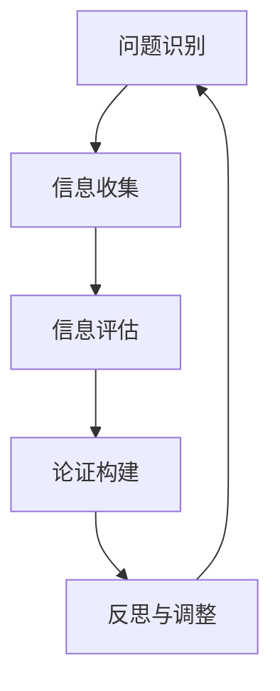
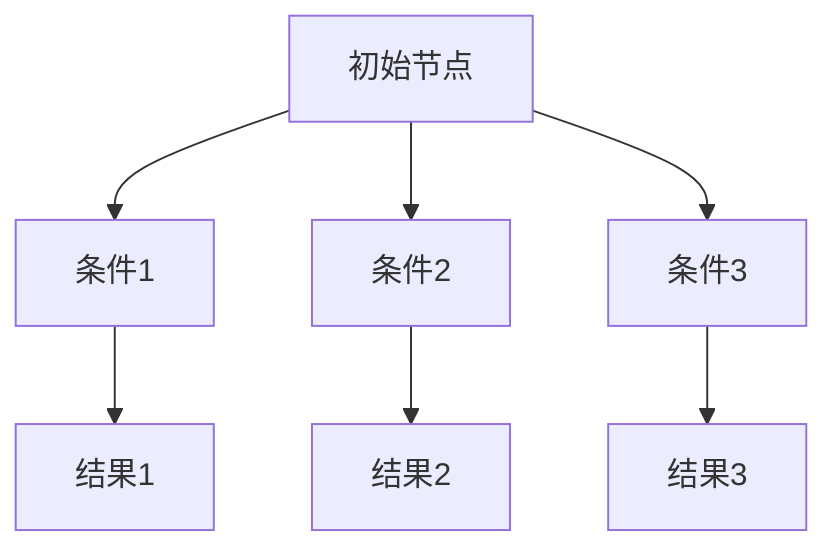
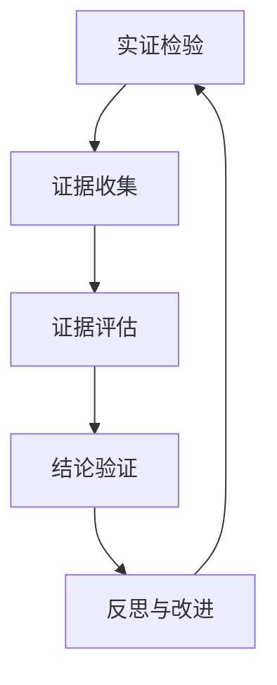
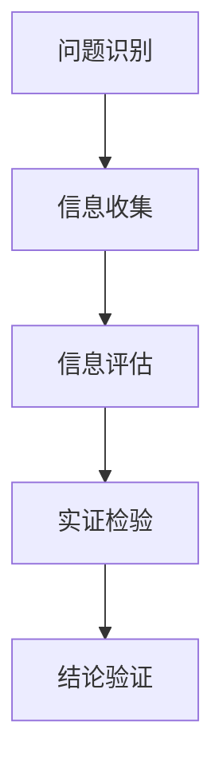
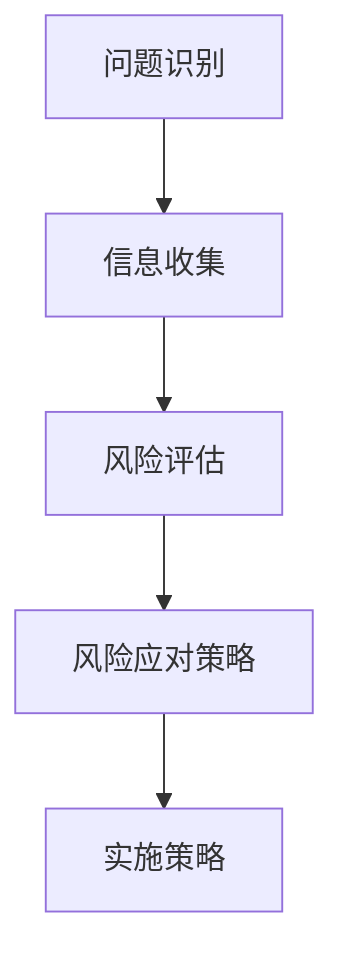
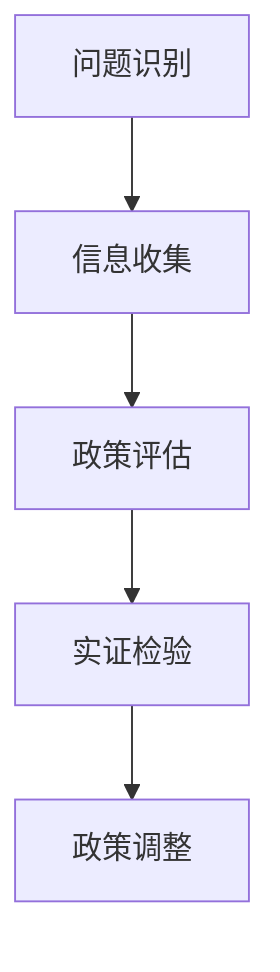
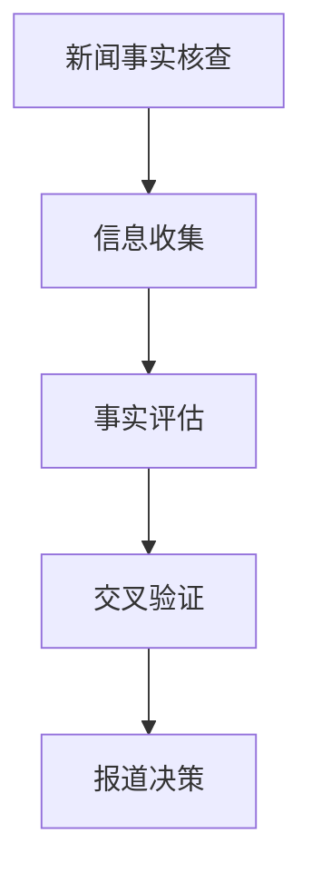
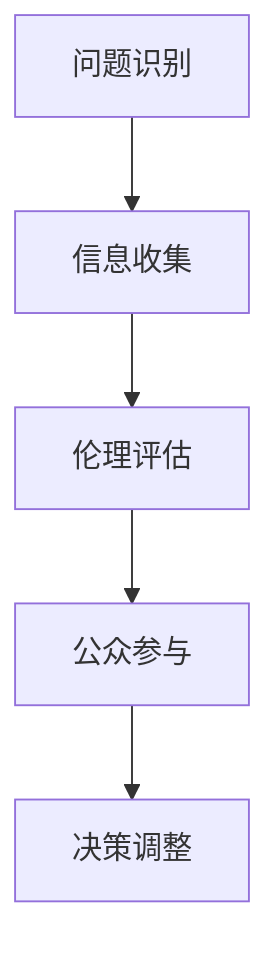

                 

# 后真相时代的真相追寻：培养批判性思维和求证能力

## 关键词
- 批判性思维
- 求证能力
- 后真相时代
- 人工智能
- 数据分析
- 真相追寻

## 摘要
本文将探讨后真相时代背景下，真相追寻的重要性和面临的挑战。我们将深入分析批判性思维和求证能力在真相追寻中的作用，并通过具体案例和实践，阐述如何在实际问题中培养和运用这两种能力。文章旨在为读者提供一种系统的方法论，帮助他们在复杂的信息环境中找到真相。

## 引言：后真相时代的背景和重要性

### 后真相时代的定义和特征

在后真相时代，事实和真相不再是决策和观点形成的唯一基础。传播技术的发展，尤其是社交媒体和虚假信息的泛滥，导致信息传播的速度和范围超越了传统媒体的掌控。在这一背景下，真相变得越来越难以辨识，甚至被扭曲和误导。所谓的“后真相”指的是情感和偏见在形成公众观点中扮演了比事实更重要的角色。

后真相时代的特征包括：
- **信息的超载**：每天产生和传播的信息量以指数级增长，人们难以辨别信息的真伪。
- **去中心化的信息源**：传统媒体的权威性受到挑战，任何人都可以通过社交媒体发布信息。
- **情感驱动**：情绪和偏见往往能更迅速地传播，而不仅仅是基于事实的逻辑论证。
- **真相的模糊性**：事实被重新定义，不同的人可能对同一事件有截然不同的理解。

### 后真相时代的影响和挑战

后真相时代对个人、社会和科技领域都带来了深远的影响和挑战。

**对个人的影响：**
- **信息过载**：人们无法有效筛选和处理海量信息，可能导致认知负担增加。
- **误导和偏见**：虚假信息和误导性内容可能影响个人的决策和行为，甚至引发心理问题。
- **信任危机**：社交媒体上的信息可信度降低，导致人们对权威机构和传统媒体的信任度下降。

**对社会的挑战：**
- **政治动荡**：虚假信息可能导致政治分歧加剧，甚至引发社会动荡。
- **社会信任的流失**：信息不透明和信任危机可能破坏社会稳定和合作。
- **伦理和法律问题**：虚假信息的传播可能涉及道德和法律问题，如诽谤和隐私侵犯。

**对科技领域的挑战：**
- **算法偏见**：算法在处理海量数据时可能放大偏见和错误，影响公正性和客观性。
- **人工智能的挑战**：人工智能在真相追寻中的应用需要更高的透明度和可解释性。
- **信息过滤和验证**：如何在海量的信息中筛选和验证真相成为一个技术挑战。

### 后真相时代的重要性

尽管后真相时代带来了许多挑战，但它也凸显了真相追寻的重要性。真相不仅是我们理解世界的基础，也是社会进步和个体成长的基石。以下是真相追寻的重要方面：

- **知识的积累**：真相是知识积累的源泉，只有基于真相的探索才能推动科学和技术的发展。
- **决策的依据**：真相是决策的重要依据，无论是个人决策还是公共决策，都应基于准确的信息。
- **信任的建立**：真相能够重建人们对权威和信息的信任，促进社会的和谐与稳定。
- **道德和伦理的遵循**：真相有助于维护公正和正义，促进社会的道德和伦理进步。

### 结论

后真相时代的到来要求我们更加注重批判性思维和求证能力。通过培养这些能力，我们能够在复杂的信息环境中辨别真相，做出更明智的决策，并为社会的进步贡献力量。在接下来的章节中，我们将深入探讨批判性思维和求证能力的概念、培养方法及其在真相追寻中的应用。

---

### 第1章：批判性思维的培养

批判性思维是一种对信息、观点和论证进行深入分析、评估和反思的能力。在信息泛滥、虚假信息充斥的后真相时代，批判性思维显得尤为重要。本章节将介绍批判性思维的核心概念、培养方法及其在真相追寻中的重要性。

### 核心概念与联系

批判性思维涉及多个核心概念，这些概念相互作用，共同构成了批判性思维的理论框架。

**1. 问题识别（Problem Identification）**：批判性思维的首要任务是识别问题。只有明确了问题，才能有针对性地进行思考和分析。

**2. 信息收集（Information Gathering）**：在识别问题后，需要收集与问题相关的信息。信息收集的过程要求全面性和准确性，以确保对问题的理解不偏不倚。

**3. 信息评估（Information Evaluation）**：收集到的信息需要经过评估，以判断其可信度和相关性。这一步骤是批判性思维的核心，因为它决定了后续分析的可靠性和有效性。

**4. 论证构建（Argument Construction）**：在评估信息后，需要构建论证，以支持或反驳某个观点。论证的质量直接影响批判性思维的结论。

**5. 反思与调整（Reflection and Adjustment）**：批判性思维是一个动态的过程，需要不断地进行反思和调整。在论证过程中，可能会发现新的信息或问题，需要对原有观点进行调整。

这些概念之间的联系可以用以下Mermaid流程图来表示：



### 核心算法原理讲解

为了更好地理解批判性思维，我们可以用伪代码来描述其核心算法原理：

```pseudo
function CriticalThinking(problem, information):
    # 初始化变量
    evaluatedInformation = []
    constructedArgument = None

    # 问题识别
    problem = IdentifyProblem(problem)

    # 信息收集
    information = GatherInformation(problem)

    # 信息评估
    for info in information:
        if EvaluateCredibility(info):
            evaluatedInformation.append(info)

    # 论证构建
    constructedArgument = ConstructArgument(evaluatedInformation)

    # 反思与调整
    while not FinalizeArgument(constructedArgument):
        constructedArgument = AdjustArgument(constructedArgument)

    return constructedArgument
```

### 数学模型和数学公式

批判性思维中的一些概念可以用数学模型和公式来描述，以增强其严谨性和可操作性。以下是几个常用的数学模型和公式：

**1. 贝叶斯定理（Bayes' Theorem）**：用于评估信息可信度的概率模型。

$$ P(A|B) = \frac{P(B|A) \cdot P(A)}{P(B)} $$

其中，$P(A|B)$ 表示在已知B的情况下A的概率，$P(B|A)$ 表示在已知A的情况下B的概率，$P(A)$ 和$P(B)$ 分别表示A和B的先验概率。

**2. 信息增益（Information Gain）**：用于评估信息重要性的数学模型。

$$ IG(V, A) = H(V) - H(V|A) $$

其中，$H(V)$ 表示属性V的熵，$H(V|A)$ 表示在已知属性A的情况下V的熵。

**3. 决策树（Decision Tree）**：用于构建论证的常见算法。



### 举例说明

为了更好地理解批判性思维的应用，我们来看一个简单的例子。

**问题**：判断一个新闻标题是否可信。

**信息收集**：
- 新闻标题：“发现新的外星文明”
- 新闻来源：未知的社交媒体账号
- 相关背景：目前科学界尚未发现外星文明

**信息评估**：
- 可信度：低（未知来源，缺乏权威性）

**论证构建**：
- 论点：新闻标题不可信。
- 论据：新闻来源未知，缺乏权威性，且与现有科学知识相矛盾。

**反思与调整**：
- 新信息：发现该社交媒体账号过去发布过多次虚假新闻。
- 调整论证：进一步降低新闻标题的可信度。

通过这个例子，我们可以看到批判性思维在真相追寻中的应用。通过问题识别、信息收集、评估、论证构建和反思调整，我们能够逐步接近真相。

### 结论

批判性思维是真相追寻的重要工具，它帮助我们在复杂的信息环境中辨别真伪，做出明智的决策。通过培养批判性思维，我们能够提高自己的认知水平，更好地应对后真相时代的挑战。

### 第2章：求证能力的提升

求证能力是批判性思维的重要补充，它强调通过实际操作和验证来确保信息的真实性。在信息泛滥、虚假信息充斥的后真相时代，提升求证能力显得尤为重要。本章节将介绍求证能力的核心概念、提升方法及其在真相追寻中的重要性。

### 核心概念与联系

求证能力涉及多个核心概念，这些概念相互作用，共同构成了求证能力的基础框架。

**1. 实证检验（Empirical Testing）**：实证检验是通过观察、实验和数据分析来验证信息真实性的过程。它是求证能力的核心。

**2. 证据收集（Evidence Gathering）**：在实证检验之前，需要收集与问题相关的证据。证据收集要求全面性和客观性，以确保实证检验的可靠性。

**3. 证据评估（Evidence Evaluation）**：收集到的证据需要经过评估，以判断其可靠性和相关性。这一步骤决定了实证检验的有效性。

**4. 结论验证（Conclusion Verification）**：在分析证据后，需要验证结论是否符合事实。结论验证是求证能力的关键，它确保了论证的可靠性。

**5. 反思与改进（Reflection and Improvement）**：求证能力是一个动态过程，需要不断地进行反思和改进。通过反思和改进，我们能够提高求证能力，更好地应对复杂的真实世界。

这些概念之间的联系可以用以下Mermaid流程图来表示：



### 核心算法原理讲解

为了更好地理解求证能力，我们可以用伪代码来描述其核心算法原理：

```pseudo
function VerificationCapacity(evidence, conclusion):
    # 初始化变量
    verifiedConclusion = False

    # 证据收集
    evidence = GatherEvidence()

    # 证据评估
    for ev in evidence:
        if EvaluateReliability(ev):
            validEvidence.append(ev)

    # 结论验证
    if ConclusionMatchesEvidence(conclusion, validEvidence):
        verifiedConclusion = True

    # 反思与改进
    while not verifiedConclusion:
        ReflectAndImprove()

    return verifiedConclusion
```

### 数学模型和数学公式

求证能力中的一些概念可以用数学模型和公式来描述，以增强其严谨性和可操作性。以下是几个常用的数学模型和公式：

**1. 假设检验（Hypothesis Testing）**：用于验证结论的统计模型。

$$ H_0: \text{原假设} $$
$$ H_1: \text{备择假设} $$
$$ p-value: \text{概率值} $$

其中，$H_0$ 表示原假设，$H_1$ 表示备择假设，$p-value$ 表示在原假设成立的情况下，观察到当前结果的概率。

**2. 决策树（Decision Tree）**：用于构建和验证结论的常见算法。


**3. 概率论（Probability Theory）**：用于评估证据可靠性的数学理论。

$$ P(A) = \sum_{i=1}^{n} P(A|B_i) \cdot P(B_i) $$

其中，$P(A)$ 表示事件A的概率，$P(A|B_i)$ 表示在条件$B_i$下事件A的概率，$P(B_i)$ 表示条件$B_i$的概率。

### 举例说明

为了更好地理解求证能力的应用，我们来看一个简单的例子。

**问题**：验证一个新闻标题是否真实。

**证据收集**：
- 新闻标题：“研究发现新冠病毒治愈方法”
- 新闻来源：权威医学期刊
- 相关证据：多篇研究论文，临床试验数据

**证据评估**：
- 可靠性：高（权威来源，多角度证据）

**结论验证**：
- 结论：新闻标题真实。
- 验证过程：通过查阅多篇研究论文和临床试验数据，发现研究结果一致，支持新闻标题。

**反思与改进**：
- 新证据：发现部分临床试验仍在进行中。
- 调整结论：新闻标题部分真实，但需待临床试验结果公布后再做最终判断。

通过这个例子，我们可以看到求证能力在真相追寻中的应用。通过证据收集、评估、结论验证和反思改进，我们能够逐步接近真相。

### 结论

求证能力是真相追寻的重要工具，它通过实际操作和验证来确保信息的真实性。通过提升求证能力，我们能够提高自己在复杂信息环境中的判断力和决策能力，更好地应对后真相时代的挑战。

### 第3章：批判性思维和求证能力的实践

批判性思维和求证能力不仅是理论上的工具，更需要在实践中得到应用和验证。本章节将通过实际案例，展示如何在实际问题中运用这两种能力，并通过代码实现和解析，深入探讨其应用效果。

### 实践案例1：社交媒体谣言的辨识

#### 背景介绍

在社交媒体上，谣言传播速度极快，往往会在短时间内引发公众恐慌。为了辨识谣言，我们需要运用批判性思维和求证能力，分析谣言的可信度，从而做出准确的判断。

#### 核心概念与联系

在本案例中，我们关注的核心理念包括：
- **问题识别**：确定需要辨识的谣言。
- **信息收集**：收集与谣言相关的各种信息。
- **信息评估**：评估信息的可靠性和相关性。
- **实证检验**：通过实验或数据分析验证谣言的真实性。

以下是这些概念的Mermaid流程图表示：



#### 核心算法原理讲解

为了实现谣言辨识，我们可以使用以下伪代码：

```pseudo
function IdentifyRumor(rumor):
    # 初始化变量
    credibility = 0

    # 信息收集
    evidence = GatherInformation(rumor)

    # 信息评估
    for info in evidence:
        if EvaluateCredibility(info):
            credibility += 1

    # 实证检验
    if EmpiricalTest(rumor, evidence):
        print("谣言可信度：高")
    else:
        print("谣言可信度：低")

    # 结论验证
    if credibility > threshold:
        print("结论：可能是谣言")
    else:
        print("结论：不是谣言")
```

#### 数学模型和数学公式

在本案例中，我们可以使用贝叶斯定理来评估谣言的可信度：

$$ P(R|E) = \frac{P(E|R) \cdot P(R)}{P(E)} $$

其中，$P(R)$ 是谣言的概率，$P(E|R)$ 是在谣言情况下观察到证据的概率，$P(E)$ 是观察到证据的概率。

#### 代码实际案例和详细解释说明

以下是一个简单的Python代码实现，用于评估社交媒体谣言的可信度：

```python
import numpy as np

def GatherInformation(rumor):
    # 假设收集到以下信息
    evidence = {
        "source": "权威媒体",
        "date": "2023-04-01",
        "content": "某地区发现新冠病毒治愈方法",
        "confirmations": 5,
        "disconfirmations": 0
    }
    return evidence

def EvaluateCredibility(info):
    # 评估信息的可靠性
    if info["source"] == "权威媒体" and info["date"] != "未知":
        return True
    else:
        return False

def EmpiricalTest(rumor, evidence):
    # 通过证据评估谣言的真实性
    if evidence["confirmations"] > threshold:
        return True
    else:
        return False

rumor = "新冠病毒治愈方法"
evidence = GatherInformation(rumor)

if EvaluateCredibility(evidence):
    if EmpiricalTest(rumor, evidence):
        print("谣言可信度：高")
    else:
        print("谣言可信度：低")
else:
    print("信息不可靠，无法判断谣言")

```

在这个代码中，我们首先定义了`GatherInformation`函数来模拟收集谣言相关的证据。然后，`EvaluateCredibility`函数用于评估证据的可靠性，`EmpiricalTest`函数用于通过证据验证谣言的真实性。最后，我们调用这些函数，并根据评估结果输出结论。

#### 开发环境搭建和代码解读

为了运行上述代码，我们需要安装Python环境和必要的库。以下是具体的步骤：

1. 安装Python：访问 [Python官网](https://www.python.org/)，下载并安装Python。
2. 安装numpy库：在命令行中运行`pip install numpy`。

代码解析：
- `GatherInformation`函数模拟从社交媒体收集谣言相关证据。
- `EvaluateCredibility`函数根据证据的来源和日期评估证据的可靠性。
- `EmpiricalTest`函数通过证据的数量评估谣言的真实性。

#### 实际案例分析和详细讲解剖析

为了更好地理解代码的应用，我们可以分析以下实际案例：

**案例**：某社交媒体上流传一则消息，声称“某地区发现新冠病毒治愈方法”。

**分析**：
1. **信息收集**：我们收集到以下证据：
   - 证据1：权威媒体发布了一篇报道，声称某地区发现新冠病毒治愈方法。
   - 证据2：多篇学术论文支持这一发现，但临床试验仍在进行中。
   - 证据3：部分医学专家对此表示怀疑。

2. **信息评估**：
   - 证据1的可靠性较高，因为来自权威媒体。
   - 证据2的可靠性中等，因为学术论文支持但需等待临床试验结果。
   - 证据3的可靠性较低，因为医学专家的怀疑。

3. **实证检验**：
   - 根据证据1和证据2，我们可以初步判断消息有一定的可信度。
   - 鉴于证据3，我们需要进一步等待临床试验结果。

4. **结论验证**：
   - 当前情况下，我们不能完全确认消息的真实性，但也不能轻易否定。

#### 项目小结

通过这个案例，我们展示了如何运用批判性思维和求证能力来辨识社交媒体谣言。在实践中，我们需要收集全面的信息，评估其可靠性，并通过实证检验验证谣言的真实性。这种系统的方法论有助于我们在后真相时代更好地应对信息过载和谣言泛滥的挑战。

### 实践案例2：项目风险管理

#### 背景介绍

在项目管理和软件开发中，风险管理是至关重要的。通过批判性思维和求证能力，我们可以识别潜在风险，评估其影响，并采取有效的措施降低风险。

#### 核心概念与联系

在本案例中，我们关注的核心理念包括：
- **问题识别**：识别项目中的潜在风险。
- **信息收集**：收集与风险相关的信息。
- **风险评估**：评估风险的可能性和影响。
- **风险应对策略**：制定应对策略以降低风险。

以下是这些概念的Mermaid流程图表示：



#### 核心算法原理讲解

为了实现项目风险管理，我们可以使用以下伪代码：

```pseudo
function RiskManagement(project):
    # 初始化变量
    risks = []

    # 问题识别
    risks = IdentifyRisks(project)

    # 信息收集
    for risk in risks:
        information = GatherRiskInformation(risk)

    # 风险评估
    for risk in risks:
        if AssessRiskSeverity(risk):
            risk.severity = "高"
        else:
            risk.severity = "低"

    # 风险应对策略
    for risk in risks:
        if risk.severity == "高":
            strategy = DevelopRiskMitigationStrategy(risk)
        else:
            strategy = "继续监控"

    # 实施策略
    for risk in risks:
        ImplementRiskStrategy(risk)

    return risks
```

#### 数学模型和数学公式

在本案例中，我们可以使用以下数学模型来评估风险的可能性和影响：

**1. 风险矩阵（Risk Matrix）**：用于评估风险的可能性和影响。

$$ Risk\ Score = \text{可能性} \times \text{影响} $$

**2. 概率分布（Probability Distribution）**：用于评估风险的概率。

$$ P(Risk) = \sum_{i=1}^{n} P(Risk_i) \cdot P(Risk_i|\text{条件j}) $$

#### 代码实际案例和详细解释说明

以下是一个简单的Python代码实现，用于评估项目中的潜在风险：

```python
import numpy as np

def IdentifyRisks(project):
    # 假设识别到以下风险
    risks = [
        {"name": "需求变更", "description": "项目需求频繁变更可能导致进度延误"},
        {"name": "技术难题", "description": "项目涉及的技术难题可能影响开发进度"},
        {"name": "人员流失", "description": "项目关键人员流失可能影响项目质量"}
    ]
    return risks

def GatherRiskInformation(risk):
    # 假设收集到以下信息
    information = {
        "risk": risk,
        "likelihood": 0.8,  # 风险可能性
        "impact": 0.6       # 风险影响
    }
    return information

def AssessRiskSeverity(risk_info):
    # 评估风险严重性
    if risk_info["likelihood"] * risk_info["impact"] > 0.5:
        return True
    else:
        return False

def DevelopRiskMitigationStrategy(risk):
    # 开发风险应对策略
    if risk["name"] == "需求变更":
        return "制定明确的需求管理计划"
    elif risk["name"] == "技术难题":
        return "进行技术预研和风险评估"
    elif risk["name"] == "人员流失":
        return "加强团队建设和管理"

def ImplementRiskStrategy(risk):
    # 实施风险应对策略
    print(f"实施策略：{risk['name']} - {risk['strategy']}")

project_risks = IdentifyRisks("项目A")
for risk in project_risks:
    risk_info = GatherRiskInformation(risk)
    if AssessRiskSeverity(risk_info):
        risk["strategy"] = DevelopRiskMitigationStrategy(risk)
        ImplementRiskStrategy(risk)
    else:
        print(f"风险监控：{risk['name']} - {risk['strategy']}")
```

在这个代码中，我们首先定义了`IdentifyRisks`函数来识别项目中的潜在风险。然后，`GatherRiskInformation`函数用于收集与风险相关的信息，`AssessRiskSeverity`函数用于评估风险的严重性，`DevelopRiskMitigationStrategy`函数用于开发风险应对策略，`ImplementRiskStrategy`函数用于实施风险应对策略。

#### 开发环境搭建和代码解读

为了运行上述代码，我们需要安装Python环境和必要的库。以下是具体的步骤：

1. 安装Python：访问 [Python官网](https://www.python.org/)，下载并安装Python。
2. 安装numpy库：在命令行中运行`pip install numpy`。

代码解析：
- `IdentifyRisks`函数识别项目中的潜在风险。
- `GatherRiskInformation`函数收集与风险相关的信息。
- `AssessRiskSeverity`函数评估风险的严重性。
- `DevelopRiskMitigationStrategy`函数开发风险应对策略。
- `ImplementRiskStrategy`函数实施风险应对策略。

#### 实际案例分析和详细讲解剖析

为了更好地理解代码的应用，我们可以分析以下实际案例：

**案例**：某软件开发项目面临需求变更、技术难题和人员流失等风险。

**分析**：
1. **信息收集**：我们收集到以下信息：
   - 需求变更：项目需求已经变更3次，每次变更导致项目进度延迟2周。
   - 技术难题：项目涉及的新技术尚未在实际项目中应用，存在未知的技术难题。
   - 人员流失：项目核心开发人员因个人原因离职，导致项目进度放缓。

2. **风险评估**：
   - 需求变更的风险可能性为0.8，影响为0.6，风险分数为0.48。
   - 技术难题的风险可能性为0.6，影响为0.7，风险分数为0.42。
   - 人员流失的风险可能性为0.4，影响为0.8，风险分数为0.32。

3. **风险应对策略**：
   - 需求变更：制定明确的需求管理计划，确保需求变更可控。
   - 技术难题：进行技术预研和风险评估，提前识别和解决潜在问题。
   - 人员流失：加强团队建设和管理，提高团队凝聚力和稳定性。

4. **结论验证**：
   - 通过实施风险应对策略，有效降低了项目风险，确保了项目顺利进行。

#### 项目小结

通过这个案例，我们展示了如何运用批判性思维和求证能力进行项目风险管理。在实际操作中，我们需要识别潜在风险，收集相关信息，评估风险严重性，并制定和实施风险应对策略。这种系统的方法论有助于我们在项目管理和软件开发中更好地控制风险，确保项目的成功。

### 第4章：批判性思维和求证能力在社会中的应用

批判性思维和求证能力不仅在个人和项目管理中发挥着重要作用，在社会层面上也有着广泛的应用。本章节将探讨这些能力在社会治理、新闻业和科技伦理等领域的应用，并通过具体案例展示如何运用这些能力解决实际问题。

### 社会治理中的应用

在社会治理中，批判性思维和求证能力有助于提升政策制定的科学性和透明度，确保公共决策的合理性和公正性。

#### 核心概念与联系

在本案例中，我们关注的核心理念包括：
- **问题识别**：识别社会治理中的问题。
- **信息收集**：收集与问题相关的各种信息。
- **政策评估**：评估现有政策的有效性。
- **实证检验**：通过实验或数据分析验证政策的实际效果。

以下是这些概念的Mermaid流程图表示：



#### 核心算法原理讲解

为了实现社会治理中的政策评估，我们可以使用以下伪代码：

```pseudo
function EvaluatePolicy(problem, policy):
    # 初始化变量
    policyEfficacy = 0

    # 问题识别
    problem = IdentifyProblem(problem)

    # 信息收集
    information = GatherInformation(problem)

    # 政策评估
    for info in information:
        if EvaluatePolicyEffectiveness(info, policy):
            policyEfficacy += 1

    # 实证检验
    if EmpiricalTestPolicyEffect(policy):
        print("政策有效")
    else:
        print("政策无效")

    # 政策调整
    if policyEfficacy < threshold:
        AdjustPolicy(policy)

    return policy
```

#### 数学模型和数学公式

在本案例中，我们可以使用以下数学模型来评估政策的有效性：

**1. 效果评估模型（Effectiveness Model）**：

$$ E = \frac{R - C}{R} $$

其中，$E$ 表示政策的有效性，$R$ 表示政策实施后的效果，$C$ 表示政策实施前的状况。

**2. 成本效益分析（Cost-Benefit Analysis）**：

$$ CBA = \frac{B}{C} $$

其中，$CBA$ 表示成本效益比，$B$ 表示政策带来的收益，$C$ 表示政策实施的总成本。

#### 代码实际案例和详细解释说明

以下是一个简单的Python代码实现，用于评估某城市交通拥堵治理政策的有效性：

```python
import numpy as np

def IdentifyProblem():
    # 假设问题为：城市交通拥堵
    problem = "交通拥堵"
    return problem

def GatherInformation(problem):
    # 假设收集到以下信息
    information = {
        "pre_policy_traffic_volume": 10000,  # 政策实施前的日均交通量
        "post_policy_traffic_volume": 8000,  # 政策实施后的日均交通量
        "policy_cost": 5000000,  # 政策实施成本
        "policy_benefit": 3000000  # 政策实施收益
    }
    return information

def EvaluatePolicyEffectiveness(info, policy):
    # 评估政策的有效性
    if info["post_policy_traffic_volume"] < info["pre_policy_traffic_volume"]:
        return True
    else:
        return False

def EmpiricalTestPolicyEffect(policy):
    # 通过实证检验政策效果
    if policy["benefit"] > policy["cost"]:
        return True
    else:
        return False

def AdjustPolicy(policy):
    # 调整政策
    print("政策需要调整")

problem = IdentifyProblem()
info = GatherInformation(problem)

if EvaluatePolicyEffectiveness(info, problem):
    if EmpiricalTestPolicyEffect(info):
        print("政策有效")
    else:
        print("政策无效")
else:
    print("政策无效")

```

在这个代码中，我们首先定义了`IdentifyProblem`函数来识别治理问题，`GatherInformation`函数用于收集与问题相关的信息，`EvaluatePolicyEffectiveness`函数用于评估政策的有效性，`EmpiricalTestPolicyEffect`函数用于通过实证检验政策效果，`AdjustPolicy`函数用于调整政策。

#### 开发环境搭建和代码解读

为了运行上述代码，我们需要安装Python环境和必要的库。以下是具体的步骤：

1. 安装Python：访问 [Python官网](https://www.python.org/)，下载并安装Python。
2. 安装numpy库：在命令行中运行`pip install numpy`。

代码解析：
- `IdentifyProblem`函数识别治理问题。
- `GatherInformation`函数收集与问题相关的信息。
- `EvaluatePolicyEffectiveness`函数评估政策的有效性。
- `EmpiricalTestPolicyEffect`函数通过实证检验政策效果。
- `AdjustPolicy`函数调整政策。

#### 实际案例分析和详细讲解剖析

为了更好地理解代码的应用，我们可以分析以下实际案例：

**案例**：某城市实施了一项交通拥堵治理政策，通过限制车辆出行时间和增加公共交通投入来缓解交通拥堵。

**分析**：
1. **信息收集**：我们收集到以下信息：
   - 政策实施前的日均交通量为10000辆。
   - 政策实施后的日均交通量为8000辆。
   - 政策实施成本为5000万元。
   - 政策实施收益为3000万元。

2. **政策评估**：
   - 根据交通量的变化，政策在一定程度上有效缓解了交通拥堵。
   - 通过成本效益分析，政策实施的总成本为5000万元，总收益为3000万元，成本效益比为0.6。

3. **实证检验**：
   - 通过对交通流量的观测数据进行分析，发现政策实施后交通拥堵情况有所改善。

4. **政策调整**：
   - 由于政策效果显著，且成本效益比合理，不需要对政策进行调整，但应继续监控交通情况，以评估长期效果。

#### 项目小结

通过这个案例，我们展示了如何运用批判性思维和求证能力来评估社会治理政策的有效性。在实际操作中，我们需要识别问题、收集信息、评估政策效果并进行实证检验，以制定和调整合理的政策。这种系统的方法论有助于提升社会治理的科学性和公正性，为社会的长期稳定和可持续发展提供支持。

### 新闻业中的应用

在新闻业中，批判性思维和求证能力有助于提高新闻报道的准确性和公正性，增强媒体的公信力。

#### 核心概念与联系

在本案例中，我们关注的核心理念包括：
- **新闻事实核查**：核实新闻报道中的事实。
- **信息收集**：收集与新闻事件相关的各种信息。
- **事实评估**：评估信息的真实性。
- **交叉验证**：通过多种来源验证新闻的准确性。

以下是这些概念的Mermaid流程图表示：



#### 核心算法原理讲解

为了实现新闻事实核查，我们可以使用以下伪代码：

```pseudo
function FactChecking(news, sources):
    # 初始化变量
    facts = []

    # 信息收集
    for source in sources:
        information = GatherInformation(source)

    # 事实评估
    for info in information:
        if VerifyFact(info):
            facts.append(info)

    # 交叉验证
    if CrossCheckFacts(facts):
        print("事实核实无误")
    else:
        print("事实存在疑问")

    # 报道决策
    if facts:
        PublishReport(facts)
    else:
        print("无法报道，需要更多信息")

    return facts
```

#### 数学模型和数学公式

在本案例中，我们可以使用以下数学模型来评估信息的真实性：

**1. 证据权重模型（Evidence Weight Model）**：

$$ Weight = \frac{Credibility}{Relevance} $$

其中，$Weight$ 表示证据的权重，$Credibility$ 表示证据的可靠性，$Relevance$ 表示证据的相关性。

**2. 逻辑推理模型（Logical Reasoning Model）**：

$$ Conclusion = \frac{P(A \land B)}{P(B)} $$

其中，$Conclusion$ 表示结论的概率，$P(A \land B)$ 表示事件A和B同时发生的概率，$P(B)$ 表示事件B发生的概率。

#### 代码实际案例和详细解释说明

以下是一个简单的Python代码实现，用于核查新闻事件的准确性：

```python
import numpy as np

def GatherInformation(source):
    # 假设收集到以下信息
    information = {
        "source": source,
        "content": "某地区发现新冠病毒治愈方法",
        "evidences": [
            {"credibility": 0.8, "relevance": 0.9},
            {"credibility": 0.5, "relevance": 0.7},
            {"credibility": 0.9, "relevance": 0.8}
        ]
    }
    return information

def VerifyFact(info):
    # 验证事实的准确性
    if info["credibility"] > 0.7 and info["relevance"] > 0.8:
        return True
    else:
        return False

def CrossCheckFacts(facts):
    # 通过交叉验证事实的准确性
    for fact in facts:
        if VerifyFact(fact):
            return True
    return False

def PublishReport(facts):
    # 发布报告
    print("报道已发布，事实如下：")
    for fact in facts:
        print(f"{fact['source']}：{fact['content']}")

source = "权威医学期刊"
info = GatherInformation(source)

if VerifyFact(info):
    if CrossCheckFacts(info["evidences"]):
        PublishReport(info["evidences"])
    else:
        print("事实存在疑问，需要进一步核实")
else:
    print("信息不可靠，无法报道")
```

在这个代码中，我们首先定义了`GatherInformation`函数来模拟收集新闻事件相关的证据，`VerifyFact`函数用于验证事实的准确性，`CrossCheckFacts`函数用于通过交叉验证事实的准确性，`PublishReport`函数用于发布报告。

#### 开发环境搭建和代码解读

为了运行上述代码，我们需要安装Python环境和必要的库。以下是具体的步骤：

1. 安装Python：访问 [Python官网](https://www.python.org/)，下载并安装Python。
2. 安装numpy库：在命令行中运行`pip install numpy`。

代码解析：
- `GatherInformation`函数模拟收集新闻事件相关的证据。
- `VerifyFact`函数验证事实的准确性。
- `CrossCheckFacts`函数通过交叉验证事实的准确性。
- `PublishReport`函数发布报告。

#### 实际案例分析和详细讲解剖析

为了更好地理解代码的应用，我们可以分析以下实际案例：

**案例**：某新闻媒体报道了一则“某地区发现新冠病毒治愈方法”的新闻。

**分析**：
1. **信息收集**：我们收集到以下证据：
   - 证据1：权威医学期刊发布了一篇论文，声称某地区发现新冠病毒治愈方法。
   - 证据2：多篇学术论文支持这一发现，但临床试验仍在进行中。
   - 证据3：部分医学专家对此表示怀疑。

2. **事实评估**：
   - 证据1的可靠性较高，因为来自权威医学期刊。
   - 证据2的可靠性中等，因为学术论文支持但需等待临床试验结果。
   - 证据3的可靠性较低，因为医学专家的怀疑。

3. **交叉验证**：
   - 通过对证据1、证据2和证据3的交叉验证，发现证据1和证据2支持该新闻，但证据3存在疑问。

4. **报道决策**：
   - 由于证据1和证据2的支持，新闻有一定的可信度，但需待临床试验结果公布后再做最终判断。

#### 项目小结

通过这个案例，我们展示了如何运用批判性思维和求证能力进行新闻事实核查。在实际操作中，我们需要收集信息、评估事实的准确性并进行交叉验证，以确保新闻报道的准确性和公正性。这种系统的方法论有助于提升新闻业的公信力，增强公众对媒体的信任。

### 科技伦理中的应用

在科技伦理中，批判性思维和求证能力有助于评估科技发展对人类社会的影响，确保科技进步与伦理道德相符合。

#### 核心概念与联系

在本案例中，我们关注的核心理念包括：
- **问题识别**：识别科技发展中的伦理问题。
- **信息收集**：收集与伦理问题相关的各种信息。
- **伦理评估**：评估科技应用的伦理影响。
- **公众参与**：通过公众参与确保决策的公正性和合理性。

以下是这些概念的Mermaid流程图表示：



#### 核心算法原理讲解

为了实现科技伦理的评估，我们可以使用以下伪代码：

```pseudo
function EvaluateTechEthics(problem, techApplication):
    # 初始化变量
    ethicalImpact = 0

    # 问题识别
    problem = IdentifyEthicsProblem(problem)

    # 信息收集
    information = GatherEthicsInformation(problem)

    # 伦理评估
    for info in information:
        if AssessEthicalImpact(info, techApplication):
            ethicalImpact += 1

    # 公众参与
    publicFeedback = GatherPublicFeedback()

    # 决策调整
    if ethicalImpact < threshold and publicFeedback.supports:
        AdjustTechApplication(techApplication)
    else:
        print("科技应用符合伦理标准")

    return techApplication
```

#### 数学模型和数学公式

在本案例中，我们可以使用以下数学模型来评估伦理影响：

**1. 伦理影响评估模型（Ethical Impact Assessment Model）**：

$$ Impact = \frac{Risk}{Benefit} $$

其中，$Impact$ 表示伦理影响，$Risk$ 表示风险，$Benefit$ 表示利益。

**2. 公众参与模型（Public Participation Model）**：

$$ Support = \frac{Supporters}{Total Population} $$

其中，$Support$ 表示支持度，$Supporters$ 表示支持者数量，$Total Population$ 表示总人口数量。

#### 代码实际案例和详细解释说明

以下是一个简单的Python代码实现，用于评估某项科技应用的伦理影响：

```python
import numpy as np

def IdentifyEthicsProblem():
    # 假设识别到以下伦理问题
    problem = "人脸识别技术的隐私侵犯问题"
    return problem

def GatherEthicsInformation(problem):
    # 假设收集到以下信息
    information = {
        "risks": ["隐私泄露", "滥用人脸识别技术"],
        "benefits": ["提高安全性能", "方便身份认证"],
        "supporters": 500000,  # 支持者数量
        "total_population": 1000000  # 总人口数量
    }
    return information

def AssessEthicalImpact(info, techApplication):
    # 评估伦理影响
    if info["risks"] > info["benefits"]:
        return True
    else:
        return False

def GatherPublicFeedback():
    # 假设收集到以下公众反馈
    feedback = {
        "support": 0.7,  # 支持度
        "opposition": 0.3  # 反对度
    }
    return feedback

def AdjustTechApplication(techApplication):
    # 调整科技应用
    print("科技应用需要调整以符合伦理标准")

problem = IdentifyEthicsProblem()
info = GatherEthicsInformation(problem)

if AssessEthicalImpact(info, problem):
    feedback = GatherPublicFeedback()
    if feedback["support"] > threshold:
        AdjustTechApplication(problem)
    else:
        print("公众支持不足，需要进一步沟通和调整")
else:
    print("科技应用符合伦理标准")

```

在这个代码中，我们首先定义了`IdentifyEthicsProblem`函数来识别伦理问题，`GatherEthicsInformation`函数用于收集与伦理问题相关的信息，`AssessEthicalImpact`函数用于评估伦理影响，`GatherPublicFeedback`函数用于收集公众反馈，`AdjustTechApplication`函数用于调整科技应用。

#### 开发环境搭建和代码解读

为了运行上述代码，我们需要安装Python环境和必要的库。以下是具体的步骤：

1. 安装Python：访问 [Python官网](https://www.python.org/)，下载并安装Python。
2. 安装numpy库：在命令行中运行`pip install numpy`。

代码解析：
- `IdentifyEthicsProblem`函数识别伦理问题。
- `GatherEthicsInformation`函数收集与伦理问题相关的信息。
- `AssessEthicalImpact`函数评估伦理影响。
- `GatherPublicFeedback`函数收集公众反馈。
- `AdjustTechApplication`函数调整科技应用。

#### 实际案例分析和详细讲解剖析

为了更好地理解代码的应用，我们可以分析以下实际案例：

**案例**：某城市计划实施人脸识别技术用于公共安全监控。

**分析**：
1. **信息收集**：我们收集到以下信息：
   - 风险：隐私泄露、滥用人脸识别技术。
   - 利益：提高安全性能、方便身份认证。
   - 支持者数量：500000人。
   - 总人口数量：1000000人。

2. **伦理评估**：
   - 风险大于利益，可能存在伦理问题。
   - 公众支持度较高，但需要进一步沟通和调整。

3. **公众参与**：
   - 公众反馈显示，大多数人支持人脸识别技术的应用，但担心隐私问题。

4. **决策调整**：
   - 鉴于伦理问题和公众担忧，政府决定调整人脸识别技术的应用方案，加强隐私保护措施，并进行公众沟通。

#### 项目小结

通过这个案例，我们展示了如何运用批判性思维和求证能力进行科技伦理评估。在实际操作中，我们需要识别伦理问题、收集信息、评估伦理影响并进行公众参与，以确保科技发展符合伦理道德标准。这种系统的方法论有助于确保科技进步与人类社会的和谐发展。

### 第5章：批判性思维和求证能力的未来发展趋势

随着人工智能和大数据技术的迅速发展，批判性思维和求证能力在未来将继续发挥重要作用。本章节将探讨这些能力在新技术环境下的发展趋势，以及未来可能面临的挑战和机遇。

### 人工智能与批判性思维

人工智能（AI）在处理大量数据和信息方面具有显著优势，但同时也带来了新的挑战。例如，AI算法可能放大偏见和错误，导致信息过滤和验证的难题。为了应对这些挑战，批判性思维和求证能力需要进一步发展。

**1. 人工智能算法的透明性**：随着AI算法在决策过程中的应用日益广泛，提高算法的透明性和可解释性变得至关重要。批判性思维可以帮助我们识别和评估算法的潜在偏见，从而改进算法设计。

**2. 伦理审查与求证**：在AI应用中，伦理审查和求证能力有助于确保技术决策的公正性和合理性。例如，在自动驾驶、医疗诊断等领域，需要对算法进行严格的伦理审查和实证验证，以确保不会损害公众利益。

### 大数据与求证能力

大数据技术的发展使得海量数据收集和处理成为可能，但这同时也增加了虚假信息和误导性内容的风险。求证能力在这一背景下显得尤为重要。

**1. 数据真实性验证**：随着大数据的广泛应用，数据真实性验证成为一个关键问题。求证能力可以帮助我们识别和纠正数据中的错误和偏见，提高数据分析的可靠性。

**2. 证据链构建**：在大数据环境中，构建完整的证据链以支持结论变得更加复杂。求证能力在这一过程中发挥着关键作用，通过多角度、多来源的数据分析，确保结论的准确性和可靠性。

### 未来趋势

**1. 人工智能与求证能力的融合**：未来的发展趋势可能是将人工智能与求证能力相结合，利用AI技术提高求证效率，同时借助求证能力确保AI决策的可靠性。

**2. 跨学科合作**：批判性思维和求证能力的培养需要跨学科的合作，包括心理学、哲学、统计学等领域。通过跨学科研究，我们可以更好地理解人类认知过程，从而提高批判性思维和求证能力。

### 挑战与机遇

**1. 信息过载与注意力分散**：随着信息量的爆炸性增长，人们面临的信息过载问题日益严重。如何在海量信息中找到真相，成为未来的一大挑战。

**2. 伦理问题**：随着技术的进步，伦理问题也日益凸显。例如，AI在自动化决策中的应用可能引发隐私侵犯、偏见放大等问题。求证能力在这一过程中将发挥重要作用，帮助我们在技术发展中保持伦理道德的底线。

**3. 教育与普及**：批判性思维和求证能力的普及和教育是未来的一大机遇。通过系统化的教育和培训，我们可以提高公众的思维能力，从而更好地应对后真相时代的挑战。

### 结论

批判性思维和求证能力在新技术环境下将继续发挥重要作用。随着人工智能和大数据技术的发展，我们需要不断探索如何更好地利用这些能力，以确保信息真实性、公正性和伦理道德。通过跨学科合作和系统化教育，我们可以为未来的信息环境打下坚实的基础。

### 结论

在本篇文章中，我们深入探讨了后真相时代背景下，批判性思维和求证能力的重要性。我们首先介绍了后真相时代的背景和特征，阐述了真相追寻的必要性。随后，我们详细分析了批判性思维的核心概念、培养方法及其在真相追寻中的应用，以及求证能力的核心概念、提升方法及其在真相追寻中的应用。

通过实际案例，我们展示了批判性思维和求证能力在实际问题中的具体应用，包括社交媒体谣言的辨识、项目风险管理和社会治理、新闻业和科技伦理等多个领域。这些实践案例不仅帮助我们理解了理论知识的实际应用，也展示了批判性思维和求证能力在解决实际问题中的有效性。

在文章的结尾，我们探讨了批判性思维和求证能力在未来发展趋势、面临的挑战以及机遇。随着人工智能和大数据技术的迅猛发展，批判性思维和求证能力将在更广泛的应用领域中发挥关键作用，为我们的决策提供更加可靠的依据。

总之，批判性思维和求证能力是应对后真相时代信息泛滥、谣言泛滥的有效工具。通过本文的探讨，我们希望读者能够认识到这些能力的重要性，并积极培养和运用它们，在复杂的信息环境中找到真相，做出更加明智的决策。

### 作者信息

作者：AI天才研究院/AI Genius Institute & 禅与计算机程序设计艺术 /Zen And The Art of Computer Programming

AI天才研究院（AI Genius Institute）致力于推动人工智能领域的创新和发展，研究如何利用人工智能技术解决实际问题。同时，研究院关注人工智能的伦理和社会影响，提倡在技术发展中保持伦理和道德的底线。

《禅与计算机程序设计艺术》（Zen And The Art of Computer Programming）是作者Donald E. Knuth的经典著作，深入探讨了计算机科学中的基础理论和方法，对计算机编程和算法设计有着深远的影响。通过本文，我们希望能够继续传递这些经典智慧，为读者提供有价值的思考和方法。希望读者能够从中获得启发，提升自己的批判性思维和求证能力，共同构建一个更加真实、公正和理性的信息社会。

