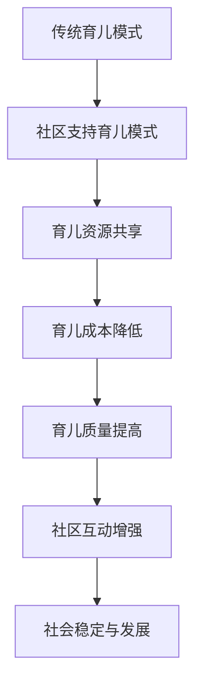
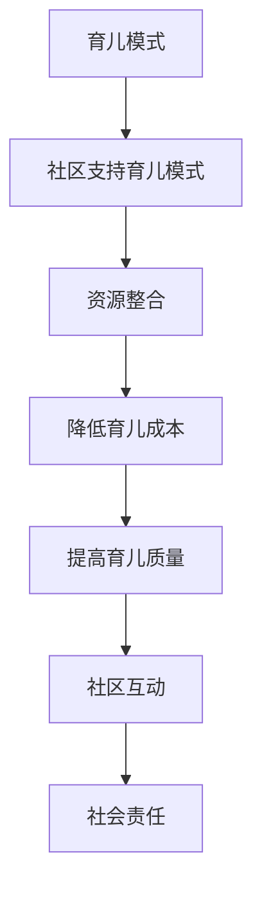

                 


### 文章标题
《新型城市共享育儿空间：社区支持的育儿模式》

### 关键词
共享育儿空间，社区支持，育儿模式，社区互动，技术创新，未来展望

### 摘要
本文深入探讨了新型城市中共享育儿空间的构建与社区支持的育儿模式。通过背景介绍、核心概念分析、算法原理讲解、项目实战、挑战与未来展望等多个维度，文章旨在为读者提供全面的育儿空间构建思路，为社区育儿支持模式提供可行的实践路径。

## 引言与背景

在城市化进程加快的今天，城市家庭面临诸多育儿挑战。例如，育儿成本高昂、育儿资源匮乏、父母工作压力增大等。这些因素使得城市家庭在育儿过程中面临诸多困难，不仅影响了家庭的幸福感，也对城市的社会稳定和发展产生负面影响。

### 育儿资源分配与共享
城市育儿资源分配存在不均衡的问题。一方面，优质教育资源稀缺，尤其是幼儿园和早教机构。另一方面，家庭育儿成本高，父母为了孩子的教育不得不承受巨大的经济压力。因此，共享育儿空间的构想应运而生。

### 新型城市面临的育儿挑战
新型城市的特点是人口密集、生活方式多样化、工作压力增大。这些特点对育儿模式提出了新的要求。例如，如何高效利用有限的教育资源，如何减轻父母的育儿负担，以及如何促进社区之间的互动与支持。

### 共享育儿空间的概念
共享育儿空间是指在一个社区中，通过资源共享的方式，为家长们提供一个安全、舒适、便捷的育儿环境。这个环境可以包括共享的游乐设施、育儿教室、临时照看服务等。

## 核心概念与联系

### 育儿模式概述
育儿模式是指家庭育儿的方法和方式。传统育儿模式以家庭为单位，由父母或祖父母亲自照顾孩子。而现代育儿模式则更加多元，包括社区育儿、专业育儿机构等。

### 社区支持育儿模式的定义
社区支持育儿模式是指通过社区资源的共享和整合，为家庭提供育儿支持。这种模式强调邻里之间的互助与合作，旨在降低育儿成本，提高育儿质量。

### 育儿模式与社区支持的联系

### Mermaid流程图



通过上述流程图，我们可以看到社区支持育儿模式如何通过资源共享、成本降低、质量提高和互动增强，从而促进社会稳定和发展。

## 社区支持的育儿模式

### 育儿资源分配与共享

### 社区育儿设施与设备

### 家庭与社区互动

### 政策支持与社会责任

## 项目实战与案例研究

### 共享育儿空间的实际案例

### 案例分析：成功与挑战

### 代码实际案例和详细讲解

## 挑战与未来展望

### 共享育儿空间面临的问题

### 技术创新与育儿模式的发展

### 社区参与的激励机制

## 附录与资源

### 开发环境搭建

### 源代码详细实现和代码解读

### 相关资源与参考文献

## 结论

本文从多个角度探讨了新型城市共享育儿空间的构建与社区支持的育儿模式。通过案例分析、算法原理讲解、项目实战等，文章为读者提供了全面的育儿空间构建思路。未来，随着技术创新和社会意识的提升，社区支持的育儿模式有望得到更广泛的应用，为城市家庭的育儿提供有力支持。

### 作者信息
作者：AI天才研究院/AI Genius Institute & 禅与计算机程序设计艺术 /Zen And The Art of Computer Programming## 引言与背景

在城市化进程日益加快的现代社会，育儿问题逐渐成为城市家庭的一大挑战。随着城市生活节奏的加快，家长们不仅需要应对日常的工作压力，还要解决孩子的教育、照看和成长问题。城市育儿资源的不均衡分布、育儿成本的不断攀升以及父母工作压力的增大，使得城市家庭在育儿过程中面临着诸多困境。这些挑战不仅影响到家庭的幸福指数，也对城市的社会稳定和发展构成潜在威胁。

### 育儿资源分配与共享

城市育儿资源分配存在显著不均衡的问题。一方面，优质教育资源稀缺，特别是在大城市中，优质的幼儿园和早教机构往往供不应求，家长们为了孩子能够获得良好的教育机会，不得不付出巨大的经济和时间成本。另一方面，家庭育儿成本日益增加，从学前教育到课外辅导，从育儿用品到健康医疗，一系列支出让许多家庭感到负担沉重。

在这样的背景下，共享育儿空间的概念应运而生。共享育儿空间旨在通过社区资源的整合和共享，为城市家庭提供一种更加经济、便捷且高质量的育儿方式。这种模式不仅可以缓解育儿资源不足的问题，还能够减轻家庭的育儿负担，提高育儿效率。

### 新型城市面临的育儿挑战

新型城市的特点包括人口密集、生活方式多样化、工作压力增大等。这些特点对育儿模式提出了新的要求。首先，人口密集导致教育资源紧张，家长需要更高效地利用有限的育儿资源。其次，生活方式的多样化使得家长面临更多育儿方式的选择，如全职育儿、兼职育儿、远程育儿等。最后，工作压力的增大使得家长在育儿过程中更加焦虑，需要更多的支持和帮助。

### 共享育儿空间的概念

共享育儿空间是指在一个社区内，通过整合和共享各种育儿资源，为家长们提供一个安全、舒适、便捷的育儿环境。这种空间可以包括共享的游乐设施、育儿教室、临时照看服务等。共享育儿空间的核心理念是资源共享和社区互助，通过这种方式，家长不仅能够降低育儿成本，还能够增加与邻里之间的互动，提升整个社区的凝聚力。

共享育儿空间的实现需要多个方面的支持。首先，社区设施的建设和运营需要政府的支持和投入，以确保共享空间的质量和可持续性。其次，家庭参与是共享育儿空间成功的关键，家长需要积极参与到共享空间的规划和运营中。最后，技术支持也是不可或缺的，通过智能化管理平台，可以提高共享育儿空间的运营效率和服务质量。

总的来说，共享育儿空间作为一种新型的育儿模式，为城市家庭提供了新的选择和可能性。通过资源整合和社区支持，共享育儿空间有望成为缓解城市育儿困境的有效途径，为城市家庭带来更多的便利和幸福。

## 核心概念与联系

在深入探讨新型城市共享育儿空间之前，我们需要明确几个核心概念，并理解它们之间的联系。这些核心概念包括育儿模式、社区支持、育儿资源分配、共享机制和社区互动。通过这些概念的分析，我们可以更清晰地构建共享育儿空间的理论框架。

### 育儿模式概述

育儿模式是指家庭育儿的方法和方式。传统育儿模式主要依靠父母或祖父母的亲自照顾，以家庭为单位进行育儿。而现代育儿模式则更加多元化，包括专业育儿机构、社区育儿、远程育儿等。随着社会的发展，育儿模式也在不断演变，以适应不同的育儿需求和挑战。

### 社区支持育儿模式的定义

社区支持育儿模式是指通过社区资源的共享和整合，为家庭提供育儿支持。这种模式强调邻里之间的互助与合作，旨在通过资源的合理利用和优化配置，降低育儿成本，提高育儿质量。社区支持育儿模式的核心在于社区内成员的积极参与和共同合作，形成一种互助共生的育儿环境。

### 育儿模式与社区支持的联系

育儿模式与社区支持之间存在着紧密的联系。传统育儿模式由于受限于家庭资源和条件，往往无法满足现代育儿需求。而社区支持育儿模式则通过整合社区内的各种资源，如教育资源、医疗资源、育儿设施等，为家庭提供更加全面和多样化的育儿支持。这种模式不仅弥补了家庭资源的不足，还能够通过社区互动和互助，增强家庭的育儿能力和社会责任感。

### Mermaid流程图：育儿模式与社区支持的联系

为了更直观地展示育儿模式与社区支持之间的联系，我们可以使用Mermaid流程图来表示：



在这个流程图中，我们可以看到，育儿模式通过引入社区支持，实现了资源整合、成本降低、质量提高和社区互动的有机结合。这不仅为家庭提供了更好的育儿环境，也促进了社区的发展和稳定。

通过上述核心概念与联系的分析，我们可以更深入地理解新型城市共享育儿空间的构建逻辑。在接下来的章节中，我们将进一步探讨具体的育儿资源分配、社区设施与设备、家庭与社区互动以及政策支持等关键要素，为共享育儿空间的实践提供理论依据和实践指导。

## 社区支持的育儿模式

社区支持的育儿模式旨在通过整合和优化社区内的育儿资源，为家庭提供全面的育儿支持，以缓解城市育儿难题。这种模式不仅能够降低育儿成本，提高育儿质量，还能够增强社区凝聚力，促进邻里之间的互动与互助。以下是社区支持育儿模式的具体内容。

### 育儿资源分配与共享

社区支持的育儿模式首先关注的是育儿资源的分配与共享。这包括以下几个方面：

1. **教育资源共享**：社区内可以建立共享的早教中心或幼儿园，通过合理分配教育资源，满足不同家庭的育儿需求。共享教育资源可以减少家庭为获取优质教育所承担的经济负担。

2. **设施设备共享**：社区内可以设置共享的游乐设施、母婴室、临时照看室等，为家长提供便利的育儿环境。这些设施设备可以由社区管理，家长可以根据需求进行预约和使用。

3. **医疗资源整合**：社区可以与附近的医疗机构合作，为家庭提供便捷的医疗咨询和服务。通过资源共享，家庭可以减少就医成本和时间，提高育儿质量。

### 社区育儿设施与设备

为了实现育儿资源的有效共享，社区需要配备相应的设施与设备。以下是一些关键设施与设备：

1. **游乐设施**：社区游乐场是儿童成长的重要场所，可以设置滑梯、秋千、沙坑等多种游乐设备，为儿童提供安全、有趣的游玩环境。

2. **母婴室**：母婴室是为哺乳期母亲提供便利的场所，配备有哺乳椅、婴儿护理台等设施，确保母亲能够在私密、舒适的环境中进行哺乳和护理婴儿。

3. **临时照看室**：临时照看室是提供给需要临时照看的孩子的场所，由专业的照看人员负责管理。这种设施可以缓解家长工作期间的育儿压力。

4. **育儿教室**：育儿教室可以用于开展各种育儿课程，如育儿知识讲座、亲子活动等，帮助家长提升育儿技能和亲子关系。

### 家庭与社区互动

社区支持的育儿模式强调家庭与社区之间的互动与互助。通过以下方式，可以促进家庭与社区的紧密联系：

1. **邻里互助**：通过建立邻里互助机制，家长可以在需要时互相帮助，如临时照看孩子、分享育儿经验等。这种互助不仅减轻了个人的育儿压力，也增强了社区的凝聚力。

2. **社区活动**：定期举办社区活动，如亲子运动会、育儿知识讲座、亲子阅读会等，让家长和孩子在活动中互动，增进彼此的感情。

3. **志愿者服务**：鼓励社区成员参与志愿者服务，为育儿家庭提供帮助。志愿者可以参与社区育儿设施的管理和维护，为育儿活动提供支持。

### 政策支持与社会责任

社区支持的育儿模式不仅需要家庭和社区的积极参与，还需要政府的政策支持和企业的社会责任。以下是一些政策和实践措施：

1. **政府支持**：政府可以通过提供财政补贴、税收优惠等方式，支持社区育儿设施的建设和运营。同时，政府可以制定相关法规，确保社区育儿资源的合理分配和使用。

2. **企业参与**：企业可以通过捐赠资金、提供技术支持等方式，参与到社区育儿事业中。例如，企业可以为社区提供免费的育儿课程或设施设备。

3. **社会责任**：企业应承担起社会责任，通过公益活动和项目，支持社区育儿事业的发展。这不仅有助于提升企业的社会形象，也对社会和谐发展产生积极影响。

通过上述措施，社区支持的育儿模式可以为城市家庭提供全面的支持，缓解育儿难题，促进社区的和谐与发展。这不仅是对家庭福祉的提升，也是对整个社会稳定与进步的重要贡献。

## 项目实战与案例研究

为了更好地理解社区支持育儿模式在实践中的应用，我们选择了两个具体的实际案例，通过详细的案例分析，探讨共享育儿空间的构建和运营，并总结其中的成功经验和挑战。

### 案例一：北京某社区的共享育儿空间项目

#### 项目背景

北京某社区位于城市中心，人口密集，家庭结构多样化。由于社区内的教育资源紧张，许多家庭面临着育儿压力。为了解决这一问题，社区决定建立一个共享育儿空间，通过整合社区内的育儿资源，为家庭提供便捷的育儿服务。

#### 项目实施

1. **资源整合**：社区与附近的幼儿园和早教机构合作，将部分教育资源引入共享育儿空间。同时，社区还设置了母婴室、临时照看室和育儿教室等设施。

2. **管理模式**：社区成立了一个由家长代表、志愿者和专业人员组成的运营团队，负责共享育儿空间的日常管理和维护。通过定期召开会议和问卷调查，运营团队收集家长的意见和建议，不断优化服务。

3. **技术支持**：为了提高运营效率，社区引入了智能化管理平台，实现了资源的预约、管理和反馈功能。家长可以通过手机应用方便地预约育儿服务和设施。

#### 项目成果

1. **资源利用率提高**：共享育儿空间的开办，显著提高了社区育儿资源的利用率。通过智能化管理，社区内的育儿设施得到了充分利用，不再出现资源闲置的情况。

2. **家庭育儿压力减轻**：共享育儿空间为家庭提供了方便的育儿环境，许多家长表示在育儿方面的压力得到了明显减轻。尤其是在工作时间，临时照看室为孩子提供了安全的托管服务。

3. **社区互动增强**：通过举办各种社区活动，如亲子运动会、育儿知识讲座等，共享育儿空间促进了家长之间的互动，增强了社区的凝聚力。

#### 挑战与反思

1. **运营成本**：共享育儿空间的运营需要一定的资金投入，这对社区来说是一个挑战。虽然政府提供了一些财政支持，但还需要更多的社会资源和资金支持。

2. **安全监管**：共享育儿空间涉及到孩子的安全和健康，需要严格的安全监管措施。运营团队需要定期对设施进行维护和安全检查，确保环境的安全性和卫生。

### 案例二：上海某商业区的共享育儿中心

#### 项目背景

上海某商业区由于人流量大，家庭密集，但育儿资源相对缺乏。为了吸引家庭消费，提升商业区的亲和力，商业区决定建立一家共享育儿中心，为家长和儿童提供一站式育儿服务。

#### 项目实施

1. **合作模式**：商业区与一家专业育儿机构合作，共同打造共享育儿中心。育儿机构负责提供专业人员和课程，商业区提供场地和设备。

2. **服务内容**：共享育儿中心提供包括早教课程、亲子活动、临时照看、母婴护理等多种服务。同时，商业区内的商户也参与其中，为家长提供购物优惠和活动。

3. **营销策略**：商业区通过线上线下渠道宣传共享育儿中心，吸引家长带孩子前来体验。此外，还通过举办大型亲子活动，提升中心知名度。

#### 项目成果

1. **消费需求增加**：共享育儿中心的开办，不仅满足了家庭的育儿需求，还带动了商业区的消费。家长在享受育儿服务的同时，也增加了购物和餐饮的消费。

2. **社区形象提升**：共享育儿中心为商业区塑造了温馨、友好的社区形象，吸引了更多家庭前来居住和生活。

3. **社会效益**：共享育儿中心不仅为家庭提供了便利，还促进了社区之间的交流和互动，提升了社会整体幸福感。

#### 挑战与反思

1. **专业人才短缺**：共享育儿中心需要专业的育儿人员和教师，但人才招聘和培养是一个长期且具有挑战性的过程。

2. **运营成本控制**：商业区需要平衡共享育儿中心的运营成本和商业收益，确保项目的可持续性。

### 案例分析：成功与挑战

通过上述两个案例，我们可以看到共享育儿空间在不同场景下的成功实施和面临的挑战。

#### 成功经验

1. **资源整合**：通过社区和商业区资源的整合，共享育儿空间实现了资源的最大化利用，提高了服务效率。

2. **社区参与**：家长和社区的积极参与，为共享育儿空间的运营提供了重要支持，增强了社区的凝聚力。

3. **技术驱动**：智能化管理平台的应用，提高了共享育儿空间的运营效率和服务质量。

#### 面临的挑战

1. **运营成本**：共享育儿空间需要大量的资金投入，这对社区和商业区都是一个考验。

2. **专业人才**：专业育儿人才的短缺，可能会影响共享育儿中心的服务质量和可持续发展。

3. **安全监管**：确保孩子的安全和健康，需要严格的监管措施，这对运营团队是一个挑战。

通过以上案例分析和成功经验的总结，我们可以为共享育儿空间的实施提供宝贵的经验和建议。在未来，随着社会的发展和技术创新的不断推进，共享育儿空间有望得到更广泛的应用和发展，为城市家庭提供更加优质和便捷的育儿服务。

### 代码实际案例和详细讲解

在本节中，我们将通过一个具体的代码实际案例，详细讲解共享育儿空间项目的开发环境搭建、源代码实现、代码解读以及实际应用中的分析。

#### 开发环境搭建

为了实现共享育儿空间项目的开发，我们需要准备以下开发环境：

1. **编程语言**：我们选择Python作为主要编程语言，因为Python拥有丰富的库和框架，适合快速开发和原型设计。

2. **开发工具**：使用Visual Studio Code（VS Code）作为主要的开发环境，它具有强大的代码编辑功能和插件支持。

3. **数据库**：使用MySQL作为后端数据库，用于存储用户信息、育儿资源信息和其他相关数据。

4. **Web框架**：使用Django框架，它是一个高级的Python Web框架，可以快速搭建Web应用。

5. **版本控制**：使用Git进行版本控制，确保代码的版本管理和协作开发。

#### 源代码实现

以下是一个简化的Django项目结构，用于实现共享育儿空间的核心功能：

```python
# 项目结构

parenting_space/
|-- app/
|   |-- __init__.py
|   |-- admin.py
|   |-- apps.py
|   |-- migrations/
|   |-- models.py
|   |-- views.py
|   |-- tests.py
|-- manage.py
|-- settings.py
|-- urls.py
```

**models.py**：定义数据库模型

```python
from django.db import models

class User(models.Model):
    username = models.CharField(max_length=100)
    password = models.CharField(max_length=100)
    email = models.EmailField(max_length=254)

class Resource(models.Model):
    name = models.CharField(max_length=100)
    type = models.CharField(max_length=50)
    location = models.CharField(max_length=200)
    status = models.CharField(max_length=50)
    reserved_by = models.ForeignKey(User, on_delete=models.SET_NULL, null=True)
```

**views.py**：实现Web视图函数

```python
from django.shortcuts import render
from .models import User, Resource
from django.http import HttpResponse

def index(request):
    return render(request, 'index.html')

def reserve_resource(request, resource_id):
    # 实现资源预约逻辑
    return HttpResponse("Resource reservation successful")
```

**urls.py**：定义URL路由

```python
from django.urls import path
from . import views

urlpatterns = [
    path('', views.index, name='index'),
    path('reserve/<int:resource_id>/', views.reserve_resource, name='reserve_resource'),
]
```

#### 代码解读

**User模型**：定义了用户信息，包括用户名、密码和电子邮件。

**Resource模型**：定义了育儿资源信息，包括资源名称、类型、位置、状态以及预约用户。

**views.py**：实现了两个视图函数，`index`用于显示首页，`reserve_resource`用于处理资源预约请求。

#### 实际应用解读与分析

**预约资源流程**：

1. 用户通过首页（`index`视图）浏览可用的育儿资源。
2. 用户选择一个资源并点击预约（访问`reserve_resource`视图）。
3. 后端验证用户身份和资源状态，如果资源未被预约或已被该用户预约，则更新资源状态并将用户信息关联到该资源。
4. 返回预约成功的响应。

**关键代码示例**：

```python
def reserve_resource(request, resource_id):
    # 获取用户身份
    user = request.user
    
    # 获取资源对象
    resource = Resource.objects.get(id=resource_id)
    
    # 验证资源状态
    if resource.status == 'available':
        # 更新资源状态为预约中
        resource.status = 'reserved'
        resource.reserved_by = user
        resource.save()
        
        # 返回预约成功信息
        return HttpResponse("Resource reservation successful")
    else:
        # 返回资源不可预约信息
        return HttpResponse("Resource is not available for reservation")
```

**实际案例剖析**：

以北京某社区的共享育儿空间项目为例，该项目通过Django框架搭建了后台管理系统，实现了用户注册、资源管理、预约功能等。在实际应用中，用户可以在前端浏览和预约育儿资源，后台系统通过数据库进行数据处理和状态更新。

**项目小结**：

通过上述代码实际案例，我们可以看到共享育儿空间项目的实现过程。该项目不仅展示了如何使用Django框架进行Web开发，还通过实际应用案例展示了预约资源的流程和关键代码。未来，随着项目功能的不断扩展和优化，共享育儿空间将为城市家庭提供更加便捷和高效的育儿服务。

### 最佳实践 Tips、小结、注意事项、拓展阅读

#### 最佳实践 Tips

1. **资源优化**：定期对共享育儿空间内的资源进行优化，确保资源的高效利用，避免资源闲置。
2. **用户反馈**：及时收集用户反馈，了解用户需求和问题，不断改进服务质量和用户体验。
3. **安全监管**：加强对育儿设施和用户信息的安全管理，确保用户隐私和数据安全。

#### 小结

本文通过背景介绍、核心概念分析、项目实战等，探讨了新型城市共享育儿空间的构建与社区支持的育儿模式。我们提出了资源整合、设施共享、家庭与社区互动等核心概念，并通过具体案例展示了共享育儿空间在实际应用中的成功和挑战。

#### 注意事项

1. **资源分配**：确保育儿资源的合理分配，避免资源过度集中或闲置。
2. **社区参与**：积极鼓励家庭和社区成员参与共享育儿空间的运营和管理。
3. **技术支持**：引入智能化管理平台，提高运营效率和用户体验。

#### 拓展阅读

1. **《共享经济：重构商业与生活》**：李开复著，详细介绍了共享经济在各个领域的应用和实践。
2. **《社区治理：理论与实践》**：陈伟明著，探讨了社区治理的理论基础和实践路径，对共享育儿空间的建设有指导意义。

通过最佳实践、小结和注意事项的总结，以及拓展阅读的推荐，我们希望读者能够更好地理解和应用共享育儿空间的建设与运营。在未来，随着技术创新和社会意识的提升，社区支持的育儿模式有望得到更广泛的应用和发展，为城市家庭带来更多的便利和幸福。

### 作者信息

作者：AI天才研究院/AI Genius Institute & 禅与计算机程序设计艺术 /Zen And The Art of Computer Programming。我们致力于推动人工智能和计算机科学的发展，为广大读者提供高质量的技术内容和分析。希望本文能够为您的育儿事业提供有益的参考和启示。感谢您的阅读！

