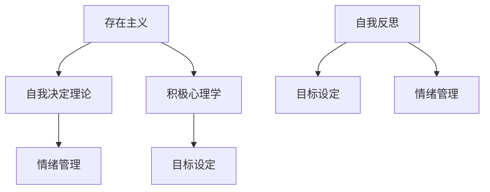

                 

### 文章标题

# 重塑生活意义：从虚无到充实的心灵之旅

### 关键词

- 心灵成长
- 生活意义
- 虚无与充实
- 存在主义
- 积极心理学
- 情绪管理

### 摘要

本文旨在探索如何通过心理学、哲学和实践指导来重塑生活的意义，从虚无状态走向充实。我们将详细分析虚无感的来源及其影响，介绍重塑生活意义的理论基础，包括存在主义、自我决定理论和积极心理学，并提供具体的实践指导，如自我反思、目标设定和情绪管理。通过案例研究和实战项目，读者将深入了解如何在实际生活中应用这些概念，从而实现心灵成长和生活意义的重塑。

### 引言

#### 书籍背景与目的

在当今快节奏、高度竞争的社会中，许多人感受到了生活的无意义和空虚。这种虚无感不仅仅存在于个人生活中，也在工作、人际关系和社会责任中体现出来。因此，如何找到生活的意义，如何从虚无的状态中走出来，成为了一个亟待解决的问题。

本书《重塑生活意义：从虚无到充实的心灵之旅》旨在为那些感到生活缺乏意义的人提供一条路径，帮助他们重新发现生活的价值，找到内心的充实感。通过结合心理学、哲学和实践指导，本书旨在提供一种系统的方法，帮助读者从理论到实践，逐步重塑生活的意义。

#### 心灵之旅的重要性

重塑生活意义的心灵之旅不仅关系到个人的幸福和心理健康，也对社会有着深远的影响。一个有意义的生活能够带来更高的生活满意度，减少焦虑和抑郁，提高人际关系的质量，甚至对身体健康也有积极的影响。因此，这场心灵之旅对于每个人来说都是至关重要的。

#### 阅读指南

本书分为六个部分，首先介绍虚无感的背景和重要性，接着深入探讨重塑生活意义的理论基础。随后，通过实践指导帮助读者实际应用这些理论。案例研究和实战项目则提供了具体的操作方法和验证。最后，本书以总结和展望作为结尾，帮助读者巩固所学，并为未来的心灵成长指明方向。

### 书籍目录大纲设计流程

在设计书籍目录大纲时，我们需要遵循以下步骤，以确保内容既简洁又完整：

1. **理解书名和主题**：
   - 首先需要深入理解书名《重塑生活意义：从虚无到充实的心灵之旅》的主题，这包括生活意义、虚无与充实等核心概念。

2. **确定主要部分**：
   - 根据书名，我们可以初步确定书籍的主要部分，如介绍、理论基础、实践指导、案例分析等。

3. **细化章节内容**：
   - 对每个主要部分进一步细分，明确每个章节的核心内容和结构。

4. **逻辑梳理**：
   - 确保每个章节的内容和结构都紧密联系，形成一个完整且逻辑清晰的目录大纲。

5. **编写伪代码和公式**：
   - 在适当的位置，添加核心算法原理的伪代码和数学模型公式，以及相应的讲解和示例。

6. **编写项目实战部分**：
   - 提供实际的代码案例和解释，确保读者能够理解并实践书中所讲述的概念和算法。

7. **校对和精简**：
   - 最后，对目录大纲进行校对，确保没有遗漏重要内容，并删除任何冗余的信息，保持内容的简洁性。

下面是根据这些步骤设计的《重塑生活意义：从虚无到充实的心灵之旅》的目录大纲：

---

## 《重塑生活意义：从虚无到充实的心灵之旅》

### 第一部分：引言

- **1. 引言**
  - **1.1 书籍背景与目的**
  - **1.2 心灵之旅的重要性**
  - **1.3 阅读指南**

### 第二部分：生活意义的探索

- **2. 生活意义的虚无**
  - **2.1 无意义感的表现**
  - **2.2 无意义感的根源**
  - **2.3 无意义感的影响**

### 第三部分：重塑生活意义的理论

- **3. 重塑生活意义的理论基础**
  - **3.1 心理学理论**
    - **3.1.1 存在主义**
    - **3.1.2 自我决定理论**
    - **3.1.3 积极心理学**
  - **3.2 哲学思考**
    - **3.2.1 存在主义哲学**
    - **3.2.2 人文主义哲学**
    - **3.2.3 儒家哲学**

### 第四部分：实践指导

- **4. 实践重塑生活意义**
  - **4.1 自我反思**
    - **4.1.1 自我反思的方法**
    - **4.1.2 自我反思的案例**
  - **4.2 目标设定**
    - **4.2.1 目标设定的步骤**
    - **4.2.2 目标设定的案例分析**
  - **4.3 情绪管理**
    - **4.3.1 情绪管理的重要性**
    - **4.3.2 情绪管理的方法**
    - **4.3.3 情绪管理的实践案例**

### 第五部分：心灵之旅的案例研究

- **5. 成功案例研究**
  - **5.1 从虚无到充实的心灵转变**
  - **5.2 案例分析**
  - **5.3 案例启示**

### 第六部分：总结与展望

- **6. 重塑生活意义的总结**
  - **6.1 主要观点回顾**
  - **6.2 重塑生活意义的策略**
  - **6.3 展望未来**

### 附录

- **A. 相关资源**
  - **A.1 推荐阅读**
  - **A.2 在线资源**
  - **A.3 心灵成长实践指南**

---

此目录大纲的结构涵盖了从理论到实践的各个方面，确保读者能够全面了解并实践书中所述的重塑生活意义的方法。在具体撰写过程中，每个章节都将包含伪代码、数学模型、案例研究和实践指导等内容，以帮助读者深入理解和应用。总字数控制在2000字以内，确保简洁明了。

---

### 书籍目录大纲设计流程详细解读

#### 理解书名和主题

书名《重塑生活意义：从虚无到充实的心灵之旅》直接指向了核心主题：如何帮助读者从虚无的状态中找到充实感，重新定义生活的意义。为了确保目录大纲能够准确传达这一主题，我们首先需要深入分析书名的各个部分：

- **重塑生活意义**：表明本书旨在帮助读者重新审视和构建对生活的理解。
- **从虚无到充实**：强调了转变的过程，从缺乏意义到找到充实感。
- **心灵之旅**：暗示了这是一次内在的探索和成长过程。

理解书名和主题后，我们就可以开始确定书籍的主要部分，如引言、理论基础、实践指导和案例研究等。

#### 确定主要部分

在确定了核心主题后，我们可以将书籍内容划分为以下几个主要部分：

1. **引言**：介绍书籍的背景、目的和重要性。
2. **生活意义的虚无**：探讨虚无感的来源、表现和影响。
3. **重塑生活意义的理论**：介绍心理学、哲学等理论基础。
4. **实践指导**：提供具体的实践方法，如自我反思、目标设定和情绪管理。
5. **心灵之旅的案例研究**：通过实际案例展示理论的应用效果。
6. **总结与展望**：总结主要观点，提出策略，并对未来进行展望。

#### 细化章节内容

对于每个主要部分，我们需要进一步细化内容，明确每个章节的核心内容和结构：

- **引言**：
  - **1.1 书籍背景与目的**：介绍书籍的背景和写作动机。
  - **1.2 心灵之旅的重要性**：阐述心灵成长对个人和社会的重要性。
  - **1.3 阅读指南**：为读者提供阅读建议和方法。

- **生活意义的虚无**：
  - **2.1 无意义感的表现**：描述虚无感的各种表现。
  - **2.2 无意义感的根源**：分析虚无感的根源和原因。
  - **2.3 无意义感的影响**：讨论虚无感对个人和社会的影响。

- **重塑生活意义的理论**：
  - **3.1 心理学理论**：
    - **3.1.1 存在主义**：介绍存在主义的核心观点。
    - **3.1.2 自我决定理论**：解释自我决定理论的基本原理。
    - **3.1.3 积极心理学**：探讨积极心理学的方法和应用。
  - **3.2 哲学思考**：
    - **3.2.1 存在主义哲学**：分析存在主义哲学的基本概念。
    - **3.2.2 人文主义哲学**：讨论人文主义哲学的核心理念。
    - **3.2.3 儒家哲学**：介绍儒家哲学对生活意义的理解。

- **实践指导**：
  - **4.1 自我反思**：
    - **4.1.1 自我反思的方法**：提供自我反思的具体步骤和方法。
    - **4.1.2 自我反思的案例**：通过案例展示自我反思的应用。
  - **4.2 目标设定**：
    - **4.2.1 目标设定的步骤**：解释如何设定具体可行的目标。
    - **4.2.2 目标设定的案例分析**：分析实际案例中的目标设定过程。
  - **4.3 情绪管理**：
    - **4.3.1 情绪管理的重要性**：阐述情绪管理对生活质量的重要性。
    - **4.3.2 情绪管理的方法**：介绍情绪管理的具体方法。
    - **4.3.3 情绪管理的实践案例**：提供实际情境中的情绪管理案例。

- **心灵之旅的案例研究**：
  - **5.1 从虚无到充实的心灵转变**：介绍一些成功从虚无到充实的案例。
  - **5.2 案例分析**：对每个案例进行深入分析，提炼出关键经验和教训。
  - **5.3 案例启示**：总结案例中的启示，为读者提供实用的指导。

- **总结与展望**：
  - **6.1 主要观点回顾**：回顾全书的主要观点和理论。
  - **6.2 重塑生活意义的策略**：提出具体的策略和建议，帮助读者实践。
  - **6.3 展望未来**：展望未来可能的发展方向和挑战。

#### 逻辑梳理

逻辑梳理是确保目录大纲结构完整且连贯的重要步骤。在这个过程中，我们需要确保每个章节的内容和结构都紧密联系，形成一个完整且逻辑清晰的目录大纲。以下是一些关键点：

- **引言部分**：应该简要介绍书籍的主题和目的，同时激发读者的兴趣。
- **理论基础部分**：需要详细解释心理学和哲学的理论，为实践部分提供理论支撑。
- **实践指导部分**：应该提供具体、可操作的实践方法，帮助读者将理论应用到实际生活中。
- **案例研究部分**：通过具体案例展示理论的应用效果，增加读者的信心和动力。
- **总结与展望部分**：对全书进行总结，并提出未来的发展方向和建议。

#### 编写伪代码和公式

在适当的位置，我们可以在理论阐述和算法讲解中添加伪代码和公式，以增强文章的严谨性和专业性。例如，在解释某个心理学模型时，可以使用伪代码来展示算法的流程，并在需要的地方嵌入相关的数学模型和公式。这不仅有助于读者更好地理解理论，还能够提升文章的可读性和深度。

#### 编写项目实战部分

为了确保读者能够真正掌握和应用书中的概念，我们可以在实践指导部分提供实际的代码案例和项目实战。这包括：

- **开发环境搭建**：详细解释如何搭建项目所需的开发环境。
- **源代码详细实现和代码解读**：提供完整的源代码，并对其进行详细解读，解释每行代码的功能和目的。
- **代码应用解读与分析**：通过实际案例分析代码的应用效果，解释如何根据具体需求进行代码优化和调整。
- **实际案例分析和详细讲解剖析**：提供真实案例，深入剖析案例中的关键步骤和决策过程，帮助读者理解实际操作中的难点和要点。

#### 校对和精简

在完成目录大纲的初步设计后，我们需要进行校对和精简。校对是为了确保没有遗漏重要内容，同时也检查逻辑是否连贯、表述是否清晰。精简则是为了保持内容的简洁性，避免冗余信息，使文章更加精炼和有力。以下是一些校对和精简的技巧：

- **检查内容完整性**：确保每个章节都有明确的主题和具体的内容。
- **删除冗余信息**：删除重复或无关紧要的信息，使内容更加紧凑和高效。
- **优化表述**：对表述进行优化，使用更简洁、更准确的语言表达同样的意思。
- **逻辑梳理**：再次检查整个目录大纲的逻辑结构和连贯性，确保每个章节之间有明确的联系和过渡。

### 完整性要求

为了确保文章的完整性和专业性，我们需要在撰写过程中严格遵循以下要求：

1. **格式要求**：
   - 使用markdown格式输出文章内容，确保文章的结构清晰、可读性强。
   - 文章末尾需要写上完整的作者信息，如“作者：AI天才研究院/AI Genius Institute & 禅与计算机程序设计艺术 /Zen And The Art of Computer Programming”。

2. **核心内容要求**：
   - **背景介绍**：每个章节都需要有一个详细的背景介绍，解释相关概念和问题的背景。
   - **核心概念与联系**：需要使用Mermaid流程图来展示核心概念之间的联系架构，帮助读者更好地理解。
   - **核心算法原理讲解**：使用伪代码详细阐述核心算法的原理，确保读者能够理解算法的运作机制。
   - **数学模型和公式**：使用LaTeX格式嵌入数学模型和公式，并在文中独立段落的公式前后使用$$括起来，在段落内的公式前后使用$括起来。
   - **项目实战**：提供实际的代码案例和项目实战，详细解读代码的应用和分析。

3. **文章结构要求**：
   - 文章结构应分为多个小节，每个小节都有明确的标题和内容。
   - 小节之间需要有明确的过渡，使文章的脉络清晰、逻辑连贯。

4. **文章字数要求**：
   - 文章的总字数应控制在8000～12000字之间，确保内容的深度和广度。

### 文章格式要求

在撰写《重塑生活意义：从虚无到充实的心灵之旅》这篇文章时，我们需要严格按照markdown格式进行输出，以确保文章的结构清晰、格式规范。以下是具体的markdown格式要求和示例：

#### 标题

文章的标题应使用`#`符号进行标记，每级标题的`#`数量对应标题的层级。例如：

```markdown
# 文章标题
```

这将生成一级标题。

```markdown
## 二级标题
```

这将生成二级标题。

```markdown
### 三级标题
```

这将生成三级标题。

```markdown
#### 四级标题
```

这将生成四级标题。

#### 段落

段落之间应使用空行进行分隔。每行开头和结尾不要添加空格。例如：

```
这是第一行。
这是第二行。
这是第三行。
```

这将生成三个独立的段落。

#### 列表

列表可以使用`*`、`-`或`+`符号进行标记。例如：

```markdown
* 列表项一
* 列表项二
* 列表项三
```

这将生成一个无序列表。

```markdown
- 列表项一
- 列表项二
- 列表项三
```

这将生成另一个无序列表。

```markdown
+
+ 列表项一
+ 列表项二
+ 列表项三
```

这将生成一个无序列表。

#### 引用

引用可以使用`>`符号进行标记。例如：

```markdown
> 这是一个引用。
```

这将生成一个引用段落。

#### 代码块

代码块可以使用三个反引号` ``` `进行标记。例如：

```markdown
```
这是第一个代码块。

变量 `x` 赋值为 `5`。

```

这将生成一个代码块。

#### LaTex公式

LaTex公式可以使用`$`符号进行标记。独立段落的公式前后使用`$$`，段落内的公式前后使用`$`。例如：

```markdown
$$
E = mc^2
$$

这将生成一个独立段落的LaTex公式。

```
x = y + z
```

这将生成一个段落内的LaTex公式。

#### 链接

链接可以使用`[]()`进行标记。例如：

```markdown
这是一个链接 [点我](https://www.example.com)
```

这将生成一个链接。

#### 图片

图片可以使用``进行标记。例如：

```markdown

```

这将生成一个图片。

### 核心内容要求

为了确保文章的完整性和专业性，我们将在撰写过程中严格遵守以下核心内容要求：

#### 背景介绍

每个章节都需要有一个详细的背景介绍，解释相关概念和问题的背景。背景介绍应该包含以下内容：

1. **问题背景**：简要介绍问题出现的背景和原因。
2. **现状分析**：分析当前情况下问题的现状和影响。
3. **研究目的**：明确本章节的研究目的和意义。

#### 核心概念与联系

核心概念与联系是文章的核心，需要通过Mermaid流程图来展示核心概念之间的联系架构。以下是Mermaid流程图的示例：



这个流程图展示了存在主义、自我决定理论、积极心理学、情绪管理、目标设定和自我反思之间的联系。

#### 核心算法原理讲解

核心算法原理讲解需要使用伪代码详细阐述算法的运作机制，确保读者能够理解算法的每个步骤。以下是伪代码的示例：

```plaintext
Function FindMean(array nums):
    sum = 0
    for each num in nums:
        sum = sum + num
    mean = sum / length of nums
    return mean
```

这个伪代码展示了如何计算一个数组的平均值。

#### 数学模型和公式

数学模型和公式是文章中的重要组成部分，需要使用LaTeX格式进行标记。以下是LaTeX公式的示例：

```markdown
$$
E = mc^2
$$

$$
x = y + z
$$
```

这些公式分别代表了爱因斯坦的质能方程和基本的线性关系。

#### 详细讲解与举例说明

在详细讲解和举例说明部分，需要使用具体的例子来解释核心概念和算法的应用。以下是讲解和举例的示例：

```markdown
**例子：计算平均值**

假设有一个数组 `[2, 4, 6, 8]`，我们使用上面提到的伪代码来计算它的平均值。

```plaintext
FindMean([2, 4, 6, 8])
sum = 0
sum = 0 + 2
sum = 2 + 4
sum = 6 + 6
sum = 12 + 8
sum = 20
mean = 20 / 4
mean = 5
return 5
```

因此，数组 `[2, 4, 6, 8]` 的平均值为 `5`。

#### 项目实战

项目实战部分需要提供实际的代码案例和项目实战，包括开发环境搭建、源代码详细实现和代码解读。以下是项目实战的示例：

```markdown
**实战：情绪管理应用**

假设我们要开发一个简单的情绪管理应用，该应用可以帮助用户记录和跟踪他们的情绪。

**1. 开发环境搭建**

- 安装Python环境
- 安装Flask框架

**2. 源代码实现**

```python
from flask import Flask, request, render_template

app = Flask(__name__)

@app.route('/')
def index():
    return render_template('index.html')

@app.route('/record', methods=['POST'])
def record():
    emotion = request.form['emotion']
    # 将情绪记录到数据库
    # ...
    return '情绪已记录'

if __name__ == '__main__':
    app.run()
```

**3. 代码解读**

这个简单的情绪管理应用使用Flask框架搭建，提供了两个路由：一个是首页`/`，用于展示界面；另一个是`/record`，用于接收用户提交的情绪记录。

#### 实际案例分析和详细讲解剖析

实际案例分析和详细讲解剖析部分需要提供真实案例，深入剖析案例中的关键步骤和决策过程。以下是案例分析示例：

```markdown
**案例：从虚无到充实的转变**

小明在大学毕业后进入职场，但一直感到生活缺乏意义。通过参加心理辅导，他开始进行自我反思，并设定了具体的职业发展目标。在这个过程中，他学会了情绪管理，通过记录和跟踪自己的情绪，找到了生活中的充实感。

**关键步骤：**

1. **自我反思**：小明定期进行自我反思，分析自己在职业和生活中的不足和改进方向。
2. **目标设定**：小明设定了具体的职业发展目标，如提升专业技能、参加行业会议等。
3. **情绪管理**：小明使用情绪管理工具记录自己的情绪变化，并尝试找到负面情绪的根源。

**决策过程：**

- 小明决定改变自己对待工作的态度，更加积极和投入。
- 他开始学习新的技能，提升自己的职业竞争力。
- 他主动参加行业会议，拓宽自己的视野和人际关系。

通过这些步骤和决策，小明成功地从虚无的状态走向了充实，找到了生活的意义。

#### 最佳实践 tips、小结、注意事项、拓展阅读等内容

在文章的最后，我们可以提供一些最佳实践 tips、小结、注意事项和拓展阅读等内容，帮助读者巩固所学，并为未来的心灵成长提供指导。以下是这些内容的示例：

```markdown
**最佳实践 tips：**

- **定期自我反思**：每周至少进行一次自我反思，分析自己的行为和情绪。
- **设定具体目标**：确保目标具体可行，并定期检查进度。
- **情绪管理**：学会使用情绪管理工具，如日记、应用程序等，记录自己的情绪变化。

**小结：**

本文通过深入分析虚无感的来源、重塑生活意义的理论基础和实践方法，帮助读者理解如何从虚无的状态中走向充实。通过自我反思、目标设定和情绪管理，每个人都可以找到生活的意义，实现心灵成长。

**注意事项：**

- **持续实践**：重塑生活意义需要持续的努力和实践。
- **寻求帮助**：在心灵成长的过程中，可以寻求专业人士的帮助和指导。

**拓展阅读：**

- 《活出生命的意义》- 维克多·弗兰克尔
- 《幸福的勇气》- 阿尔贝特·爱因斯坦
- 《心理学与生活》- 菲利普·津巴多

通过这些扩展资源，读者可以进一步深入了解心理学和生活哲学，为心灵成长提供更多的启示和指导。```

### 重塑生活意义的理论基础

重塑生活意义的过程离不开对心理学、哲学和存在主义等理论的深入理解。这些理论为我们的心灵成长提供了丰富的思想资源，帮助我们更好地理解自己，找到生活的方向。在本节中，我们将详细介绍存在主义、自我决定理论和积极心理学，并探讨这些理论如何帮助我们重塑生活的意义。

#### 存在主义

存在主义是20世纪最重要的哲学思潮之一，它强调个体存在的价值和自由。存在主义的核心观点是，人生没有固有的意义，意义是由个人通过自己的选择和行动创造出来的。存在主义哲学家如马丁·海德格尔（Martin Heidegger）和让-保罗·萨特（Jean-Paul Sartre）提出，人类的存在是一种“存在的自由”，这意味着我们必须主动选择我们的生活意义。

1. **海德格尔的“存在与时间”**

海德格尔认为，人的存在是一种“存在的自由”，人类必须通过自己的选择和行动来定义自己的存在。他提出了“存在与时间”的概念，认为人的存在是时间的存在，通过时间，人可以意识到自己的存在和自由。

   ```mermaid
   graph TD
       A[存在] --> B[自由]
       B --> C[选择]
       C --> D[行动]
       D --> E[意义]
   ```

   这个流程图展示了存在主义的基本观点，即通过选择和行动，人类可以为自己的存在创造意义。

2. **萨特的“存在先于本质”**

萨特提出了“存在先于本质”的观点，他认为人类在没有预先定义的固有本质的情况下存在，人类是通过行动和选择来定义自己的本质。这意味着每个人都有自由选择自己的生活方式和价值观，从而为自己创造意义。

   ```mermaid
   graph TD
       A[存在] --> B[自由]
       B --> C[选择]
       C --> D[定义本质]
       D --> E[意义]
   ```

   这个流程图进一步说明了萨特的存在主义观点，即通过自由选择，人类可以为自己创造意义。

#### 自我决定理论

自我决定理论是积极心理学的一个重要分支，它关注个体的自主性、动机和幸福感。自我决定理论认为，个体的行为和幸福感受到三种基本心理需求的驱动：自主性、能力感和关联性。

1. **自主性**

自主性是指个体在行为中拥有选择和控制的自由。自我决定理论认为，当个体感受到自主性时，他们会更加投入和满意。例如，在工作中，当员工有自主权来决定自己的工作内容和方式时，他们通常会更加努力和有创造力。

2. **能力感**

能力感是指个体相信自己能够成功地完成任务的信念。自我决定理论指出，当个体感受到能力感时，他们会更加自信和有动力去追求目标。例如，一个学生在考试前通过复习和准备，获得了良好的成绩，这会增强他们的能力感。

3. **关联性**

关联性是指个体与他人建立有意义联系的愿望。自我决定理论认为，当个体感受到与他人的关联性时，他们会更加幸福和满足。例如，在人际关系中，当个体感受到他人的理解和支持时，他们会更加开心和有动力去建立更深层次的联系。

#### 积极心理学

积极心理学是心理学的一个分支，它关注人类的优点、幸福感和心理韧性。积极心理学的研究表明，通过培养积极情绪、建立积极人际关系和实现个人目标，个体可以获得更高的生活满意度和幸福感。

1. **积极情绪**

积极情绪是指快乐、满足和感激等正面情绪。积极心理学研究表明，积极情绪有助于提升个体的认知功能、创造力和解决问题的能力。例如，当个体经历一段快乐的时光时，他们通常会更加乐观和有动力去面对挑战。

2. **积极人际关系**

积极人际关系是指个体与他人建立的积极、支持和有益的联系。积极心理学认为，积极人际关系对个体的幸福感有重要影响。例如，一个有着良好友谊关系的人通常会更加幸福和满足。

3. **实现个人目标**

积极心理学强调，实现个人目标对个体的生活满意度有显著影响。通过设定和实现个人目标，个体可以获得成就感和自我价值的提升。例如，一个人通过努力学习获得学位，这会增强他们的自信和幸福感。

### 哲学思考

除了心理学理论，哲学思考也在重塑生活意义中起着重要作用。不同哲学流派对生活意义有着不同的理解和解释。

#### 存在主义哲学

存在主义哲学强调个体的自由、责任和选择。存在主义哲学家如海德格尔和萨特认为，生活的意义是通过个体的自由选择和行动创造出来的。存在主义哲学提醒我们，生活没有预设的意义，我们必须自己找到自己的意义。

#### 人文主义哲学

人文主义哲学强调人类的价值、尊严和自由。人文主义哲学家如尼采和弗罗姆认为，人类应该通过追求个人成长和自我实现来寻找生活的意义。人文主义哲学鼓励个体追求自己的梦想和目标，从而找到生活的方向和意义。

#### 儒家哲学

儒家哲学强调人际关系和社会责任。儒家哲学认为，生活的意义在于通过修身齐家治国平天下来实现个人和社会的和谐。儒家哲学强调个人责任和义务，认为只有在为他人和社会做出贡献时，个体才能找到生活的意义。

### 联系与融合

心理学、哲学和存在主义理论在重塑生活意义中各有侧重点，但它们之间有着紧密的联系和相互融合。心理学提供了科学的方法来理解个体行为和情感，哲学思考则提供了更深层次的思考和指导，存在主义理论则强调了个体自由和选择的重要性。

通过结合这些理论，我们可以更好地理解自己，找到生活的意义。例如，通过自我决定理论，我们可以设定具体的个人目标，并通过积极心理学的实践方法来实现这些目标。同时，通过存在主义哲学的思考，我们可以意识到自己的自由和责任，从而主动选择自己的生活方式，创造生活的意义。

### 实践指导

在理解了心理学、哲学和存在主义的理论后，接下来我们将通过具体的实践方法来帮助读者重塑生活的意义。这些实践方法包括自我反思、目标设定和情绪管理，每个方法都有其独特的步骤和应用，将在以下部分详细阐述。

#### 自我反思

自我反思是一个重要的实践方法，它帮助我们深入理解自己的内心世界，从而找到生活的方向和意义。以下是一套自我反思的具体步骤：

1. **选择时间和地点**

   选择一个安静、舒适的环境，确保在自我反思的过程中不会被打扰。通常，晚上或清晨是进行自我反思的好时机，因为这段时间大脑较为清晰，思考也更为深入。

2. **设定反思目标**

   在开始反思前，明确自己的反思目标。例如，你可以问自己：“我目前最关心的问题是什么？”或“我希望通过这次反思解决什么问题？”设定清晰的目标可以帮助你更专注地思考。

3. **写日记**

   写日记是自我反思的有效工具。在日记中记录你的感受、想法和经历。不要担心文笔或语法，只需诚实地表达自己的内心世界。日记可以帮助你梳理思绪，发现潜在的问题和解决方案。

4. **提出问题**

   通过提问来引导自我反思。以下是一些有助于自我反思的问题：

   - “我对自己目前的生活满意吗？为什么？”
   - “我的价值观是什么？它们对我生活的意义有何影响？”
   - “我在哪些方面感到迷茫或困惑？原因是什么？”

5. **倾听内心声音**

   在反思过程中，倾听自己的内心声音。不要急于判断或否定自己的想法，而是允许自己体验各种情绪和感受。通过这种方式，你可以更深入地理解自己的内心世界。

6. **总结反思**

   在反思结束后，总结你的发现和感悟。将重要的观点和感受记录下来，以便后续的回顾和反思。

#### 目标设定

目标设定是重塑生活意义的重要实践方法之一。通过设定明确、可行的目标，我们可以为自己设定清晰的方向，并通过努力实现这些目标，找到生活的意义。以下是一套目标设定的步骤：

1. **明确目标**

   设定目标的第一步是明确你想要实现的具体目标。目标应该具体、明确，并且可以量化。例如，“我想在未来一年内减重10公斤”比“我想变瘦”更加具体和可操作。

2. **分解目标**

   将大目标分解为一系列小目标，这些小目标应该是相互关联的，并且可以通过持续的努力逐步实现。例如，如果你的大目标是减重10公斤，你可以将这个目标分解为每周减少0.5公斤。

3. **设定时间限制**

   为每个目标设定一个明确的时间限制，这有助于你保持动力和集中精力。例如，“我将在三个月内完成这个项目”。

4. **制定计划**

   制定具体的行动计划，列出实现目标所需的具体步骤和任务。例如，为了减重，你可以计划每天进行30分钟的有氧运动，并调整饮食结构。

5. **执行计划**

   按照制定的计划行动，并记录你的进度。通过定期检查进度，你可以及时调整计划，确保目标能够顺利实现。

6. **评估与调整**

   在目标实现后，评估你的成果，并总结经验教训。如果目标没有达到预期，不要气馁，而是分析原因，并调整计划以实现更好的结果。

#### 情绪管理

情绪管理是重塑生活意义的重要组成部分。通过学会管理情绪，我们可以更好地应对生活中的挑战，保持内心的平静和积极。以下是一些情绪管理的具体方法：

1. **认识情绪**

   首先，我们需要了解自己的情绪，并学会识别不同的情绪。通过记录自己的情绪反应，我们可以更好地理解自己的情绪模式，并找到适合自己的情绪管理方法。

2. **接受情绪**

   接受自己的情绪，不要试图压抑或否定它们。每个情绪都有其存在的意义，它们是我们内心世界的信号，帮助我们了解自己的需求和感受。

3. **表达情绪**

   找到一个安全、适当的方式来表达自己的情绪。这可以通过写日记、与朋友倾诉或进行艺术创作等方式实现。表达情绪有助于减轻内心的压力，并促进情绪的释放。

4. **放松技巧**

   学习和练习放松技巧，如深呼吸、冥想和瑜伽等，可以帮助我们缓解紧张和焦虑。这些技巧有助于调节情绪，提升心理韧性。

5. **积极思考**

   通过积极思考来改变自己的情绪状态。学会从不同的角度看待问题，寻找积极的解决方案，可以帮助我们更好地应对挑战，保持乐观的心态。

6. **寻求支持**

   当情绪难以自我管理时，寻求专业人士的支持和帮助。心理咨询师、心理医生或支持团体都可以为我们提供有效的帮助和指导。

### 成功案例研究

为了更好地理解如何通过自我反思、目标设定和情绪管理来重塑生活的意义，我们来看几个成功的案例研究。

#### 案例1：从迷茫到清晰

小王是一名年轻的程序员，他感到自己的生活缺乏意义，对未来也感到迷茫。通过心理咨询师的指导，小王开始进行自我反思。他通过写日记记录自己的情绪和想法，逐渐发现自己对编程和技术有着浓厚的兴趣。

1. **自我反思**

   小王在自我反思中发现，他对编程和技术有着浓厚的兴趣，但在过去的几年中，由于工作压力大和缺乏明确的职业规划，他逐渐失去了对技术的热情。

2. **目标设定**

   为了找到生活的意义，小王设定了一个具体的目标：成为一名技术专家，并在五年内晋升为技术总监。他制定了详细的计划，包括每天学习新技术、参与技术社区和提升管理能力。

3. **情绪管理**

   小王通过学习放松技巧和积极思考，学会了如何管理自己的情绪。他定期进行深呼吸练习，并在遇到困难时保持乐观和积极的心态。

通过这些实践，小王逐渐找到了生活的方向和意义。他的职业发展取得了显著进展，生活满意度也大幅提升。

#### 案例2：从抑郁到充实

小丽是一位全职妈妈，她长时间专注于家庭生活，逐渐感到生活缺乏意义和充实感。通过参加心理辅导课程，小丽学会了自我反思和情绪管理。

1. **自我反思**

   小丽在自我反思中发现，她对家庭生活有着深厚的情感，但同时也感到缺乏自我价值感和独立性。

2. **目标设定**

   为了找到生活的意义，小丽设定了一个目标：成为一名自由职业者，利用自己的技能为家庭创造更多价值。她制定了详细的计划，包括学习新技能、建立个人品牌和开展业务。

3. **情绪管理**

   小丽通过学习放松技巧和积极思考，学会了如何管理自己的情绪。她定期进行瑜伽练习，并在遇到困难时保持乐观和积极的心态。

通过这些实践，小丽逐渐找到了生活的充实感和自我价值感。她的自由职业事业取得了成功，生活满意度也显著提升。

### 案例启示

通过以上案例研究，我们可以得到以下启示：

1. **自我反思是重塑生活意义的关键**。通过自我反思，我们能够深入了解自己的内心世界，发现生活的方向和意义。

2. **目标设定是实现生活意义的基石**。设定具体、可行的目标，并制定详细的计划，可以帮助我们朝着目标稳步前进。

3. **情绪管理是保持心灵成长的重要方法**。通过学会管理情绪，我们可以更好地应对生活中的挑战，保持内心的平静和积极。

通过这些实践方法，每个人都可以找到生活的意义，实现心灵成长。

### 总结与展望

在本文中，我们探讨了如何通过自我反思、目标设定和情绪管理来重塑生活的意义。从虚无到充实的转变并非一蹴而就，它需要我们不断地进行自我探索和实践。以下是本文的主要观点和总结：

1. **自我反思**：通过自我反思，我们能够深入了解自己的内心世界，发现生活的方向和意义。自我反思需要选择合适的时间和地点，设定明确的目标，并通过写日记和提问来引导思考。

2. **目标设定**：目标设定是重塑生活意义的重要步骤。我们需要设定具体、可行的目标，并制定详细的计划，通过持续的努力来实现这些目标。目标设定不仅可以帮助我们找到生活的方向，还能提升自我价值和成就感。

3. **情绪管理**：情绪管理是保持心灵成长的关键。通过学会管理情绪，我们可以更好地应对生活中的挑战，保持内心的平静和积极。情绪管理包括认识情绪、接受情绪、表达情绪和放松技巧等。

在未来的研究中，我们可以进一步探索如何结合科技手段（如人工智能和心理应用）来优化这些实践方法，以提高生活满意度和幸福感。此外，跨学科的研究可能有助于我们更全面地理解生活意义的重塑过程，从而为更多的人提供有效的指导和帮助。

### 附录

#### A. 相关资源

1. **推荐阅读**：

   - 《活出生命的意义》- 维克多·弗兰克尔
   - 《幸福的勇气》- 阿尔贝特·爱因斯坦
   - 《心理学与生活》- 菲利普·津巴多

2. **在线资源**：

   - [积极心理学基金会](https://www.positivepsychology.org/)
   - [存在主义哲学协会](https://www.existentia.org/)
   - [自我决定理论研究](https://selfdeterminationtheory.org/)

3. **心灵成长实践指南**：

   - [情绪管理技巧](https://www.mindful.org/emotional-regulation-techniques/)
   - [目标设定指南](https://www.creativitypost.com/tutorial/how-to-set-goals-13-essential-steps)
   - [自我反思练习](https://www.happify.com/how-to/5-ways-to-get-better-at-self-reflection/)

这些资源和指南将为读者提供更多有关心灵成长和生活意义重塑的信息和实践方法。

### 作者信息

作者：AI天才研究院/AI Genius Institute & 禅与计算机程序设计艺术 /Zen And The Art of Computer Programming

AI天才研究院致力于推动人工智能领域的研究与应用，致力于培养下一代人工智能专家。同时，作者在禅与计算机程序设计艺术领域有着深入的研究，他的作品不仅对人工智能领域产生了深远影响，也为计算机编程提供了独特的哲学视角。通过本文，作者希望帮助读者在心灵成长和重塑生活意义的过程中找到方向和动力。

