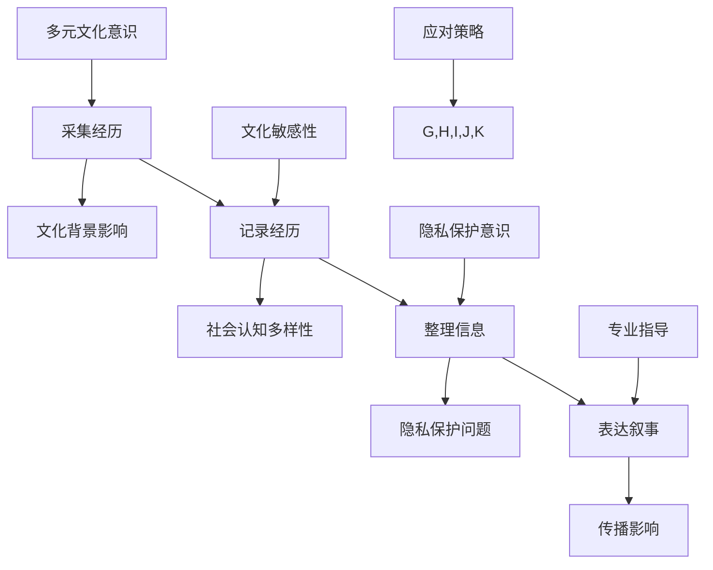
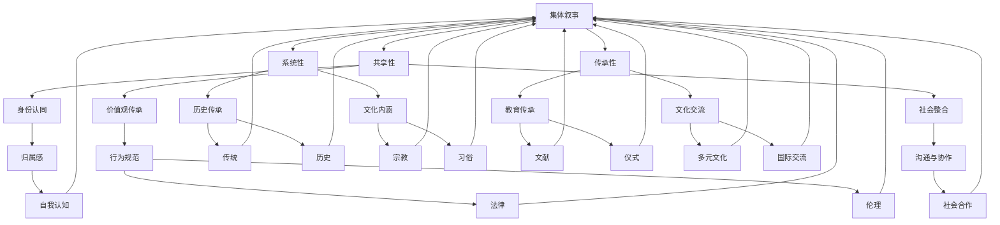

                 

# 个人与集体叙事的交织：在大背景中定位自我

## 前言

### 背景介绍

现代社会正经历着深刻的变迁，技术的飞速发展、全球化的深入以及文化多样性的增加，这些因素共同塑造了我们的生活方式和价值观。在这样的背景下，个人与集体之间的关系变得更加复杂和多元。传统上，集体叙事往往占据主导地位，它通过文化、宗教、历史等途径，塑造了人们的身份认同和社会行为规范。然而，随着个人主义的兴起和互联网的普及，个人叙事逐渐获得了更多的关注和重视。这种个人与集体叙事的交织，成为了我们理解和应对现代社会问题的重要视角。

《个人与集体叙事的交织：在大背景中定位自我》这本书，旨在探讨个人叙事与集体叙事之间的关系，以及个人如何在复杂的集体背景中找到自己的定位。本书的核心观点是，个人叙事和集体叙事并非孤立存在，而是相互影响、相互交织的。通过深入分析这两者之间的互动关系，我们可以更好地理解个人与社会之间的动态平衡，进而找到自我定位的策略。

本书的目的和意义在于，为读者提供一种全新的视角，帮助我们重新审视个人与集体之间的关系。在个人主义和集体主义之间找到合适的平衡点，不仅有助于个人的成长和发展，也有助于构建和谐的社会关系。同时，本书也希望通过探讨个人叙事与集体叙事的交织，激发读者对自我认知和社会认知的深入思考。

### 内容概述

本书共分为七个章节，每个章节都围绕着个人与集体叙事的交织这一核心主题展开。

- **第1章：个人叙事的构建**，探讨个人叙事的概念、构建方法以及面临的挑战。
- **第2章：集体叙事的探讨**，分析集体叙事的概念、类型和变迁。
- **第3章：个人与集体叙事的交织**，深入探讨个人与集体叙事之间的互动关系及其影响。
- **第4章：在大背景下定位自我**，介绍自我定位的方法、挑战和策略。
- **第5章：个案研究**，通过具体案例展示个人与集体叙事的交织现象。
- **第6章：未来展望**，预测个人叙事和集体叙事的未来发展趋势和挑战。
- **第7章：结论**，总结研究的主要发现和贡献，并指出未来研究的方向。

本书旨在通过逐步分析推理的方式，帮助读者理解个人与集体叙事的交织，并在大背景下找到自我定位的方法。我们希望通过这本书，激发读者对个人与社会关系的深入思考，为我们在复杂多变的社会中找到自我价值提供理论支持和实践指导。

## 第1章：个人叙事的构建

### 1.1 个人叙事的概念与特点

个人叙事，是指个体通过叙述自己的经历、感受和思考，来构建自己的身份认同、价值观和行为模式的过程。它不仅反映了个人的人生历程，也是个体在特定社会文化背景下对自我的认识和表达。

**个人叙事的定义**：个人叙事是一种自我表达的形式，它通过文字、图像、声音等多种媒介，将个人的经历、情感和思想展现出来。个人叙事不仅包括对过去的回顾，也涵盖了当下和未来的设想。

**个人叙事的特点**：

1. **独特性**：每个个体的经历和视角都是独一无二的，这使得个人叙事具有强烈的个性特征。个人叙事的独特性，使其在表达个人身份和价值观方面具有不可替代的作用。
2. **主观性**：个人叙事往往带有强烈的主观色彩，反映了个体对事件的独特理解和感受。这种主观性，使得个人叙事在表达个体的内心世界方面具有很高的价值。
3. **动态性**：个人叙事不是静态的，而是在不断的变化和发展中。随着个人经历和环境的变化，个人叙事的内容和形式也会发生变化。
4. **复杂性**：个人叙事涉及到个体的多重身份和角色，包括家庭、职业、社会地位等。这使得个人叙事的内容复杂多样，需要从多个角度进行理解和分析。

**个人叙事的重要性**：

个人叙事的重要性在于它对个体的自我认知和社会认同具有重要意义。通过个人叙事，个体可以更好地理解自己的身份和价值观，从而在复杂多变的社会中找到自己的定位。同时，个人叙事也是一种重要的社会互动形式，通过与他人分享自己的经历和感受，个体可以建立更加深入的人际关系，增强社会认同感。

### 1.2 个人叙事的构建方法

构建个人叙事是一个复杂的过程，需要从多个方面进行考虑和策划。

**1.2.1 个人叙事的采集与记录**

个人叙事的构建首先需要采集和记录个体的经历和感受。这可以通过多种方式实现：

- **日记**：日记是一种常见的记录个人经历的方式，它可以帮助个体系统地回顾自己的生活和经历。
- **访谈**：通过与家人、朋友或专业访谈者的对话，个体可以更深入地挖掘自己的感受和思考。
- **文档整理**：对相关的照片、信件、日记等资料进行整理，可以提供宝贵的线索和素材。
- **数字记录**：利用现代技术，如智能手机、平板电脑等，可以方便地记录和保存个人经历和感受。

**1.2.2 个人叙事的整理与表达**

在采集和记录个人经历后，需要对这些信息进行整理和表达。以下是几种常用的方法：

- **日记或自传**：通过文字的形式，系统地整理和记录个人的经历和感受。
- **图像和视频**：通过图像和视频的方式，直观地呈现个人的经历和感受。
- **故事叙述**：通过故事叙述的方式，将个人的经历和感受讲述出来，使内容更加生动和富有感染力。
- **博客和社交媒体**：通过博客和社交媒体，可以更广泛地分享个人的经历和感受，并与他人互动和交流。

**1.2.3 个人叙事的传播与影响**

个人叙事的传播和影响，是构建个人叙事的重要环节。以下是几种传播和影响的方式：

- **出版和发行**：将个人叙事整理成书籍或文章，通过出版和发行的方式，让更多的人了解和分享。
- **演讲和讲座**：通过演讲和讲座，将个人的经历和感受传达给更广泛的听众。
- **媒体报道**：通过媒体报道，将个人的故事传播到更广泛的公众中，产生更大的社会影响。
- **社会网络**：通过社交媒体和网络平台，与他人分享个人的经历和感受，建立更广泛的社交网络。

### 1.3 个人叙事的挑战与应对

构建个人叙事并非一帆风顺，个体在这个过程中会面临多种挑战。

**1.3.1 社会认知的多样性**

社会认知的多样性是个人叙事面临的第一个挑战。不同的文化、宗教和社会背景，会影响人们对个人叙事的理解和接受。因此，个人在构建叙事时，需要考虑到不同文化背景和社会认知的差异，以避免误解和冲突。

**1.3.2 文化背景的影响**

文化背景对个人叙事的构建有着深远的影响。不同的文化背景，会导致个体对事件和经历有不同的理解和解释。因此，个人在构建叙事时，需要认识到自己的文化背景，并尊重其他文化的差异。

**1.3.3 个人隐私的保护**

个人隐私是构建个人叙事时需要特别注意的问题。在分享个人经历和感受时，个体需要平衡公开与隐私的关系，避免过度分享可能导致隐私泄露的风险。

**1.3.4 应对策略**

为了应对上述挑战，个体可以采取以下策略：

- **多元文化意识**：培养多元文化意识，尊重和理解不同文化背景下的个人叙事。
- **文化敏感性**：在构建个人叙事时，考虑文化背景的影响，避免文化冲突。
- **隐私保护意识**：在分享个人叙事时，保持适当的隐私保护，避免过度公开。
- **专业指导**：寻求专业人士的指导和建议，帮助构建更加合理和有效的个人叙事。

### 1.4 小结

本章详细探讨了个人叙事的概念、特点、构建方法以及面临的挑战。通过逐步分析，我们了解到个人叙事不仅是个人自我表达和认知的重要方式，也是社会互动和文化传承的重要组成部分。在接下来的章节中，我们将继续探讨集体叙事的概念、类型和变迁，以及个人与集体叙事之间的互动关系。希望通过这一系列的分析，能帮助读者更好地理解个人与集体叙事的交织，找到在大背景下定位自我的方法。

### 1.5 个人叙事构建流程Mermaid图解

为了更好地理解个人叙事的构建过程，我们可以使用Mermaid图来展示其流程和各个步骤之间的关系。以下是个人叙事构建流程的Mermaid图：



**图解说明**：

- **A[采集经历]**：个体通过观察、反思和记录，采集自己的经历和感受。
- **B[记录经历]**：将采集到的经历和感受进行记录，可以是日记、笔记等形式。
- **C[整理信息]**：对记录的信息进行整理，形成系统化的个人经历资料。
- **D[表达叙事]**：通过文字、图像、声音等多种形式，将整理好的信息表达出来，形成个人叙事。
- **E[传播影响]**：通过出版、演讲、社交媒体等途径，传播个人叙事，产生影响。
- **F[文化背景影响]**：文化背景影响个人叙事的构建和表达，需要个体对此有清晰的认识。
- **G[社会认知多样性]**：社会认知的多样性可能会影响个人叙事的理解和接受，需要个体考虑和适应。
- **H[隐私保护问题]**：个人在构建和传播个人叙事时，需要保护自己的隐私，避免过度公开。
- **I[多元文化意识]**：培养多元文化意识，有助于个体构建更加包容和丰富的个人叙事。
- **J[文化敏感性]**：在构建个人叙事时，需要考虑到文化敏感性，避免文化冲突。
- **K[隐私保护意识]**：保持隐私保护意识，避免在个人叙事中无意间泄露个人信息。
- **L[专业指导]**：寻求专业人士的指导，有助于个体构建更加专业和有效的个人叙事。
- **M[应对策略]**：针对文化背景、社会认知多样性和隐私保护等问题，个体可以采取相应的应对策略。

通过这个Mermaid图，我们可以清晰地看到个人叙事构建的各个步骤以及它们之间的关系，这有助于我们更好地理解个人叙事的构建过程和面临的挑战。

### 1.6 个人叙事构建示例：日记记录与故事叙述

为了进一步理解个人叙事的构建方法，我们可以通过一个具体的例子来详细说明日记记录和故事叙述的过程。

**示例：个人日记记录**

**背景**：假设个体A是一名年轻的程序员，他在过去的一年中经历了一些重要的个人和工作事件。

**日记记录**：

**第一天**：
```markdown
2023年2月15日，今天是我入职的第一天。我来到了一家新的科技公司，见到了我的团队成员。虽然有些紧张，但我对自己的能力有信心。下午的时候，我参加了公司的培训，学习了新的编程工具和流程。

$$
\text{心情：} \text{兴奋，期待新的挑战}
$$
```

**第二个月**：
```markdown
2023年4月10日，我最近开始参与一个重要的项目。这个项目非常复杂，但是我很兴奋有机会学习和提升自己的技能。今天和我的团队成员一起讨论了项目的进度和计划，感觉团队的合作非常高效。

$$
\text{心情：} \text{紧张，但充满动力}
$$
```

**第三个月**：
```markdown
2023年6月5日，项目终于完成了。我们团队在规定的时间内完成了任务，并且质量很高。我感到非常自豪，也学到了很多新的技能和经验。今天我们庆祝了这个重要的里程碑。

$$
\text{心情：} \text{满足，感激团队成员的支持}
$$
```

**日记记录总结**：通过日记记录，个体A记录了自己在工作中的重要经历和情感变化，这不仅帮助他更好地理解自己的成长过程，也为未来的回顾和反思提供了宝贵的资料。

**故事叙述**：

**背景**：个体A计划将自己的日记内容整理成一个小故事，与朋友和家人分享。

**故事叙述**：

```
我叫A，是一名年轻的程序员。去年2月，我加入了一家新的科技公司。刚开始的时候，我有些紧张，但很快就适应了新的环境。4月份，我参与了一个复杂的项目，虽然过程紧张但充满了动力。6月，项目顺利完成，我们团队庆祝了这个重要的里程碑。这段经历让我成长了许多，也让我更加珍惜团队成员的支持和合作。
```

**故事叙述总结**：通过故事叙述，个体A将日记内容进行提炼和加工，使其更加生动和有吸引力。这种形式不仅能够更好地传达个人经历，还能够激发听众的共鸣和情感。

**小结**：通过这个例子，我们可以看到个人叙事的构建不仅仅是记录经历，还包括整理、表达和传播。日记记录和故事叙述是两种不同的表达方式，但它们共同构成了个人叙事的核心内容。通过这种构建过程，个体能够更好地理解自己的经历和成长，同时也能够与他人分享自己的故事，从而在社会互动中找到自己的位置。

### 1.7 个人叙事构建中的关键问题与应对策略

在构建个人叙事的过程中，个体可能会面临一些关键问题，这些问题不仅影响到叙事的质量，还可能对个体的心理和社会关系产生深远的影响。以下是一些常见的问题以及相应的应对策略：

**1.7.1 事实与情感的平衡**

**问题**：在叙述个人经历时，个体可能会过于强调情感而忽视事实，或者过于依赖事实而忽略情感。这可能导致叙事失真，难以真实反映个人的内心世界。

**策略**：
- **自我反思**：在叙述过程中，个体应自我反思，确保叙事既包含事实，也表达出真实的情感。
- **多种来源验证**：通过咨询家人、朋友或专业人士，获取对个人经历的多种视角和观点，帮助个体更全面地理解和表达。

**1.7.2 隐私与公开的平衡**

**问题**：在构建个人叙事时，个体需要在隐私保护和公开分享之间找到平衡。过度公开可能会侵犯个人隐私，而过度保守则可能限制叙事的影响力。

**策略**：
- **隐私保护**：在公开叙事时，个体可以采用匿名化处理、选择性公开等方法，保护个人隐私。
- **隐私声明**：明确自己在构建和分享个人叙事时的隐私政策，确保信息的安全和合法性。

**1.7.3 文化多样性的适应**

**问题**：个人叙事在不同文化背景下的接受度和理解度可能有所不同。个体需要适应不同文化的认知方式和价值观，以避免误解和冲突。

**策略**：
- **文化敏感性培训**：通过学习不同文化的知识和礼仪，提升自己在跨文化环境中的适应性。
- **文化适应性调整**：在构建叙事时，根据目标受众的文化背景，适当调整叙事的内容和形式。

**1.7.4 持续性的挑战**

**问题**：个人叙事的构建是一个长期的过程，个体可能会因为生活变化、环境压力等因素而中断或放弃。

**策略**：
- **定期回顾**：定期回顾自己的叙事进程，总结经验，调整策略。
- **建立支持系统**：与家人、朋友或专业人士建立支持系统，共同面对挑战。

**小结**：在构建个人叙事的过程中，个体需要面对多种关键问题。通过自我反思、多种来源验证、隐私保护、文化敏感性培训、持续性的努力等策略，个体可以更好地解决这些问题，构建出真实、全面、有影响力的个人叙事。这不仅有助于个体的自我认知和成长，也有助于在社会互动中找到自己的位置。

### 1.8 小结

第1章深入探讨了个人叙事的概念与特点，详细介绍了个人叙事的构建方法和面临的挑战。通过分析个人叙事的独特性、主观性、动态性和复杂性，我们认识到个人叙事在个体自我认知和社会互动中的重要性。同时，通过具体的日记记录和故事叙述示例，我们了解了个人叙事构建的实际操作过程。此外，我们还讨论了在构建个人叙事过程中可能遇到的关键问题及应对策略。这些内容为我们理解个人叙事的构建奠定了坚实的基础，也为后续章节关于集体叙事的探讨奠定了背景。在接下来的章节中，我们将继续探讨集体叙事的概念、类型和变迁，以及个人与集体叙事之间的互动关系。希望读者通过这一章的阅读，能够对个人叙事有更深刻的理解和认识，为后续章节的学习做好充分的准备。

## 第2章：集体叙事的探讨

### 2.1 集体叙事的概念与作用

集体叙事，是指一个群体或社会通过共同的历史、文化、价值观和信仰，对自身和外部世界进行解释和叙述的过程。它不仅反映了群体的共同经历和认知，还塑造了群体的身份认同和行为规范。

**集体叙事的定义**：集体叙事是一种社会文化现象，它通过文字、图像、声音等媒介，将群体的历史、传统、价值观和信仰传递给下一代，形成共同的认知和行为模式。

**集体叙事的特点**：

1. **共享性**：集体叙事是群体内部共享的，它反映了群体的共同经验和价值观。这种共享性使得集体叙事在群体中具有强烈的凝聚力和认同感。
2. **系统性**：集体叙事是一个系统的整体，它包含了群体的历史、文化、价值观和信仰等多个方面。这些方面相互关联，共同构成了集体叙事的完整图景。
3. **传承性**：集体叙事具有传承性，它通过教育、传播和仪式等方式，从一代传递到下一代。这种传承性使得集体叙事在长期的社会发展过程中得以延续和演变。

**集体叙事的作用**：

1. **身份认同**：集体叙事帮助群体成员建立共同的身份认同，使他们在复杂多变的社会环境中找到归属感。通过集体叙事，个体可以更好地理解自己在群体中的角色和地位。
2. **价值观传承**：集体叙事通过传递群体的价值观和信仰，帮助下一代形成正确的价值观和行为规范。这种传承有助于维护社会的稳定和秩序。
3. **社会整合**：集体叙事在群体内部形成共同的认知和价值观，有助于群体成员之间的沟通和合作，从而促进社会的整合和发展。

### 2.2 集体叙事的类型与形式

集体叙事在不同历史时期和社会背景下，呈现出不同的类型和形式。以下是几种常见的集体叙事类型：

**2.2.1 传统集体叙事**

传统集体叙事，通常是指在历史悠久的传统社会中形成的集体叙事。这种叙事形式主要以口头传统、宗教仪式、民间故事和史诗等形式存在。传统集体叙事通常具有以下特点：

- **历史悠久**：传统集体叙事具有悠久的历史，它反映了群体长期以来的文化传统和价值观。
- **文化内涵丰富**：传统集体叙事包含了丰富的文化内涵，它不仅是历史的记录，也是文化的载体。
- **传承方式多样**：传统集体叙事通过口头传承、宗教仪式、民间故事和史诗等多种方式进行传承。

**2.2.2 现代集体叙事**

现代集体叙事，是在现代社会中形成的集体叙事。这种叙事形式主要以文学、电影、电视剧、社交媒体等形式存在。现代集体叙事具有以下特点：

- **形式多样化**：现代集体叙事形式多样，不仅包括文学、电影和电视剧，还包括社交媒体等新兴媒体形式。
- **传播速度快**：现代集体叙事通过新兴媒体形式的传播，使得信息传播速度更快，覆盖面更广。
- **文化多样性**：现代集体叙事反映了全球化和文化多样性的特点，它包含了不同文化背景和价值观的元素。

**2.2.3 跨文化集体叙事**

跨文化集体叙事，是指在不同文化背景下形成的集体叙事。这种叙事形式通过文化交流和互动，融合了不同文化的元素和价值观。跨文化集体叙事具有以下特点：

- **文化融合性**：跨文化集体叙事反映了不同文化的交流和融合，它包含了多种文化的元素和价值观。
- **多元化视角**：跨文化集体叙事提供了多元化的视角，使人们能够从不同文化的角度理解世界。
- **跨文化认同**：跨文化集体叙事有助于不同文化背景的人们建立跨文化的认同感和共同价值观。

### 2.3 集体叙事的变迁与影响

集体叙事在不同历史时期和社会背景下，会经历变迁和演变。这种变迁和演变不仅反映了社会的发展变化，也对个体和群体产生了深远的影响。

**2.3.1 社会变迁对集体叙事的影响**

社会变迁是集体叙事变迁的主要原因之一。随着社会经济的发展、科技的进步和全球化的深入，集体叙事也在不断地演变。以下是社会变迁对集体叙事的几个主要影响：

- **价值观念的转变**：社会变迁往往伴随着价值观念的转变。例如，从传统农业社会向现代社会转变的过程中，人们对个人自由、平等和权利的重视程度不断提高，这些价值观念在集体叙事中得到了体现。
- **文化多样性的增加**：全球化使得不同文化之间的交流和互动更加频繁，文化多样性成为现代社会的一个重要特征。集体叙事也在这种背景下变得更加多元和丰富。
- **传播手段的变化**：随着互联网和新兴媒体的普及，集体叙事的传播手段发生了巨大的变化。新兴媒体形式使得集体叙事的传播速度更快，覆盖面更广，也使得集体叙事的形式和内容更加多样。

**2.3.2 科技发展对集体叙事的影响**

科技发展对集体叙事产生了深远的影响。随着科技的进步，尤其是互联网和人工智能的发展，集体叙事的形式和内容发生了显著的变化。以下是科技发展对集体叙事的几个主要影响：

- **信息传播的加速**：互联网和新兴媒体使得信息传播的速度大大加快，集体叙事的传播范围也进一步扩大。这种信息传播的加速，使得集体叙事能够更快地适应社会变化和个体需求。
- **内容的多样化**：随着技术的进步，集体叙事的形式和内容变得更加多样化。从传统的文字、图像和声音，到现在的视频、直播、虚拟现实等，集体叙事的媒介形式不断丰富。
- **互动性的增强**：互联网和新兴媒体使得集体叙事的互动性大大增强。个体不仅能够通过多种方式参与集体叙事的构建和传播，还能够与其他个体进行实时互动和交流。

**2.3.3 全球化对集体叙事的影响**

全球化对集体叙事产生了深远的影响。全球化不仅改变了个体和群体的生活方式，也改变了集体叙事的形式和内容。以下是全球化对集体叙事的几个主要影响：

- **文化融合**：全球化促进了不同文化之间的交流和融合，集体叙事也因此变得更加多元和丰富。全球化使得集体叙事能够吸收和融合不同文化的元素，形成新的文化现象。
- **价值观的冲突与融合**：全球化带来了不同价值观的冲突和融合。在全球化背景下，个体和群体需要面对不同价值观的碰撞和融合，这也在集体叙事中得到了体现。
- **跨国合作与竞争**：全球化使得个体和群体之间的合作与竞争更加紧密。集体叙事在跨国合作和竞争中发挥了重要作用，它不仅帮助个体和群体理解外部环境，也促进了国际合作和竞争。

### 2.4 小结

本章详细探讨了集体叙事的概念、类型和变迁，以及科技发展、社会变迁和全球化对集体叙事的影响。通过分析集体叙事的共享性、系统性和传承性，我们认识到集体叙事在群体身份认同、价值观传承和社会整合中的重要作用。同时，通过探讨传统集体叙事、现代集体叙事和跨文化集体叙事，我们了解了不同类型集体叙事的特点和形式。此外，我们还分析了社会变迁、科技发展和全球化对集体叙事的影响，揭示了集体叙事在不同背景下的变迁和演变。这些内容为我们理解集体叙事的复杂性和多样性提供了深刻的启示，也为后续章节关于个人与集体叙事交织的探讨奠定了基础。在接下来的章节中，我们将进一步探讨个人与集体叙事之间的互动关系，以及个体如何在集体叙事中找到自己的定位。

### 2.5 集体叙事的概念与联系Mermaid图解

为了更好地理解集体叙事的概念及其与其他相关概念的内在联系，我们可以使用Mermaid图来展示这些概念之间的逻辑关系。以下是集体叙事概念及其联系的具体Mermaid图解：



**图解说明**：

- **A[集体叙事]**：这是核心概念，代表了群体或社会对自身和外部世界的解释和叙述。
- **B[共享性]**：集体叙事的一个重要特点，反映了群体内部成员之间的共同经验和价值观。
- **C[系统性]**：集体叙事的结构和内容是系统的，它包含了群体的历史、文化、价值观等多个方面。
- **D[传承性]**：集体叙事具有传承性，通过教育、传播和仪式等方式，从一代传递到下一代。
- **E[身份认同]**：集体叙事帮助群体成员建立共同的身份认同，使他们在复杂的社会环境中找到归属感。
- **F[价值观传承]**：集体叙事通过传递群体的价值观，帮助下一代形成正确的价值观和行为规范。
- **G[社会整合]**：集体叙事在群体内部形成共同的认知和价值观，有助于群体成员之间的沟通和合作。
- **H[历史传承]**：历史是集体叙事的一个重要组成部分，它反映了群体的历史传统和经验。
- **I[文化内涵]**：集体叙事包含了丰富的文化内涵，它不仅是历史的记录，也是文化的载体。
- **J[教育传承]**：教育在集体叙事的传承中起着重要作用，它通过学习和教育，将集体叙事传递给下一代。
- **K[文化交流]**：文化交流是集体叙事中的一个重要方面，它促进了不同文化之间的融合和互动。
- **L[归属感]**：归属感是集体叙事对个体的重要影响，它使个体在群体中找到归属和认同。
- **M[行为规范]**：集体叙事通过传递价值观和行为规范，影响个体的行为和社会行为。
- **N[沟通与协作]**：集体叙事有助于群体成员之间的沟通和协作，促进社会的整合和发展。
- **O[传统]**：传统是集体叙事的一个重要组成部分，它反映了群体的历史和文化传统。
- **P[历史]**：历史是集体叙事的一个重要来源，它记录了群体的历史经验和成就。
- **Q[宗教]**：宗教是集体叙事中的一个重要元素，它反映了群体的宗教信仰和文化传统。
- **R[习俗]**：习俗是集体叙事中的一个重要组成部分，它反映了群体的生活方式和文化传统。
- **S[文献]**：文献是集体叙事的一个重要来源，它记录了群体的历史和文化传统。
- **T[仪式]**：仪式是集体叙事中的一个重要组成部分，它反映了群体的文化和传统。
- **U[多元文化]**：多元文化反映了全球化背景下不同文化之间的交流和融合。
- **V[国际交流]**：国际交流是全球化背景下集体叙事的重要表现形式，它促进了不同文化之间的互动。
- **W[自我认知]**：集体叙事帮助个体更好地理解自己在群体中的角色和地位，从而提升自我认知。
- **X[法律]**：法律是集体叙事中的一个重要组成部分，它反映了群体的法律制度和文化传统。
- **Y[伦理]**：伦理是集体叙事中的一个重要元素，它反映了群体的伦理道德观念。
- **Z[社会合作]**：社会合作是集体叙事的一个重要方面，它促进了社会成员之间的合作和协作。

通过这个Mermaid图，我们可以清晰地看到集体叙事与其他相关概念之间的联系和关系，这有助于我们更好地理解集体叙事的复杂性和多样性。在接下来的章节中，我们将继续探讨个人与集体叙事之间的互动关系，以及个体如何在集体叙事中找到自己的定位。

### 2.6 集体叙事影响案例分析

为了更深入地理解集体叙事对个体和社会的影响，我们可以通过几个具体的案例分析，展示集体叙事在不同情境下的作用和效果。

**案例一：美国的“美国梦”**

“美国梦”是一个典型的集体叙事，它代表了美国社会对个人自由、机会均等和成功追求的普遍信念。这个集体叙事深刻影响了美国的社会结构和个体行为。

**影响**：

- **社会结构**：“美国梦”鼓励人们追求个人成功，这推动了美国的创业精神和创新文化的形成。许多移民怀着“美国梦”来到美国，希望通过努力工作和创业实现自己的梦想。
- **个体行为**：许多人因为“美国梦”而积极进取，努力提升自己的教育和职业水平。这种信念也激发了个体对机会的追求和对未来的乐观态度。

**效果**：

- **积极效果**：“美国梦”促进了美国的经济发展和科技进步，使美国成为全球创新和创业的重要中心。
- **负面影响**：然而，“美国梦”也带来了一些负面影响，如社会不平等和贫富差距的扩大。一些人在追求个人成功的过程中，可能忽视了对社会公益和道德责任的关注。

**案例二：中国的“中国梦”**

“中国梦”是近年来中国提出的集体叙事，它代表了中国人民对国家富强、民族振兴和人民幸福的共同愿景。

**影响**：

- **社会结构**：“中国梦”增强了中国人民的民族自豪感和国家认同感，推动了中国的国家发展和社会进步。它鼓励人们为国家的发展贡献自己的力量，实现了国家整体实力的提升。
- **个体行为**：“中国梦”激发了人们为实现国家目标而努力奋斗的精神，许多人在职业发展、科技创新和社会公益方面取得了显著成就。

**效果**：

- **积极效果**：“中国梦”推动了中国的快速发展和崛起，使中国成为世界第二大经济体，增强了国家的国际地位和影响力。
- **负面影响**：在某些情况下，“中国梦”可能导致过度竞争和压力，使个体忽视个人幸福和生活质量。

**案例三：印度的“种姓制度”**

印度的“种姓制度”是一个具有深远影响的集体叙事，它反映了印度社会长期存在的等级制度和性别歧视。

**影响**：

- **社会结构**：种姓制度深刻影响了印度的社会结构，导致了明显的社会不平等和歧视现象。不同种姓之间存在着显著的经济、教育和社会资源差距。
- **个体行为**：种姓制度对个体的行为产生了深远影响，许多人在生活中遵循种姓规范，限制了个体的自由和发展。

**效果**：

- **积极效果**：尽管存在负面影响，但种姓制度也在一定程度上维持了社会的稳定和秩序。
- **负面影响**：种姓制度导致了严重的社会不平等和歧视，阻碍了社会的进步和发展。

**小结**：这些案例展示了集体叙事在不同社会和文化背景下的影响和效果。无论是积极的还是负面的影响，集体叙事都在塑造个体和社会行为方面发挥着重要作用。通过这些案例，我们可以更深刻地理解集体叙事的复杂性和多样性，以及它对个体和社会的深远影响。

### 2.7 集体叙事对社会行为的影响与个体适应策略

集体叙事对社会行为有着深远的影响，它不仅塑造了群体的共同认知和行为模式，还影响了个体在社会中的角色和行为。以下将探讨集体叙事对社会行为的影响以及个体适应集体叙事的策略。

**2.7.1 集体叙事对社会行为的影响**

集体叙事通过传递群体的价值观、信仰和规范，深刻影响了社会成员的行为和态度。以下是集体叙事对社会行为的几个主要影响：

1. **行为规范**：集体叙事通过传递群体认可的行为规范，帮助个体在社会中找到行为准则。例如，法律和道德规范都是集体叙事的重要组成部分，它们在社会成员中形成共同的行为标准。
2. **身份认同**：集体叙事有助于个体建立身份认同，使个体在复杂多变的社会环境中找到归属感和认同感。例如，民族主义叙事可以帮助个体在全球化背景下找到民族认同。
3. **社会整合**：集体叙事在群体内部形成共同的认知和价值观，促进群体成员之间的沟通和合作，从而加强社会的整合和发展。例如，共同的历史和文化叙事有助于社会成员之间的相互理解和尊重。
4. **社会行为**：集体叙事通过影响个体的认知和行为，塑造了社会成员的行为模式。例如，教育叙事强调知识的重要性，鼓励个体不断学习和进步。

**2.7.2 个体适应集体叙事的策略**

个体在社会中适应集体叙事，需要采取一些有效的策略。以下是一些常见的个体适应策略：

1. **自我反思**：个体应该通过自我反思，了解自己在集体叙事中的角色和定位。自我反思有助于个体认识到自己的行为是否符合群体规范，从而调整和优化自己的行为。
2. **文化敏感性**：个体需要培养文化敏感性，理解和尊重不同文化背景下的集体叙事。这有助于个体在跨文化交流中避免误解和冲突，建立良好的人际关系。
3. **参与和贡献**：个体应该积极参与到集体叙事的构建和传播中，通过自己的行动和言论，为集体叙事的优化和发展做出贡献。例如，参与社会公益活动可以帮助传播正能量，促进社会的和谐发展。
4. **学习和教育**：个体应该不断学习和接受教育，提高自己的认知水平和综合素质。这有助于个体更好地理解和适应集体叙事，从而在社会中发挥更大的作用。
5. **隐私保护**：在适应集体叙事的过程中，个体需要平衡个人隐私和公共利益的冲突。通过合理保护个人隐私，个体可以在参与集体叙事的同时，避免过度公开个人信息。

**2.7.3 实践中的适应策略**

以下是一些在现实生活中可以应用的适应集体叙事的策略：

- **参与社区活动**：通过参与社区活动，个体可以更好地了解社区的文化和价值观，从而更好地适应和融入社区。
- **参与社会讨论**：积极参与社会讨论，表达自己的观点和看法，有助于个体在集体叙事中找到自己的声音。
- **接受多样化教育**：接受多样化教育，包括跨学科教育和跨文化教育，有助于个体更好地理解和适应不同背景下的集体叙事。
- **建立社交网络**：通过建立社交网络，个体可以与不同背景的人建立联系，从而拓展自己的视野和认知。
- **积极参与志愿服务**：参与志愿服务，不仅可以为社会做出贡献，还可以提升自身的价值观和道德素养，从而更好地适应集体叙事。

**小结**：集体叙事对社会行为有着深远的影响，它不仅塑造了群体的共同认知和行为模式，还影响了个体在社会中的角色和行为。个体在适应集体叙事的过程中，需要采取一系列有效的策略，包括自我反思、文化敏感性、参与和贡献、学习和教育以及隐私保护等。通过这些策略，个体可以更好地理解和适应集体叙事，从而在社会中发挥更大的作用，实现个人与社会的和谐发展。

### 2.8 小结

第2章深入探讨了集体叙事的概念、类型、变迁及其对社会行为的影响。我们首先明确了集体叙事的定义和特点，包括共享性、系统性和传承性。接着，我们探讨了传统集体叙事、现代集体叙事和跨文化集体叙事的不同类型和形式，揭示了它们在文化传承和社会整合中的重要作用。此外，我们还分析了社会变迁、科技发展和全球化对集体叙事的影响，展示了集体叙事在不同背景下的变迁和演变。通过具体案例的分析，我们进一步理解了集体叙事对社会行为和个体身份认同的影响。最后，我们提出了一系列个体适应集体叙事的策略，帮助个体在社会中找到自己的位置。这些内容为我们理解集体叙事的复杂性和多样性提供了深刻的启示，也为后续章节关于个人与集体叙事交织的探讨奠定了基础。希望读者通过这一章的阅读，能够对集体叙事有更深刻的理解和认识，为后续章节的学习做好准备。

## 第3章：个人与集体叙事的交织

### 3.1 交织现象的分析

个人叙事与集体叙事的交织，是现代社会中一个重要的现象。这种交织不仅体现了个人与集体之间的互动关系，也反映了个体在社会背景中的定位。通过分析个人与集体叙事的交织现象，我们可以更好地理解个体在社会中的角色和地位，以及个人与集体之间的动态平衡。

**3.1.1 个人叙事与集体叙事的互动**

个人叙事与集体叙事之间的互动，是交织现象的核心。个人叙事作为个体自我表达和认知的重要方式，与集体叙事相互影响，共同塑造了个体的身份认同和社会行为。

1. **个人叙事对集体叙事的影响**：个体的个人叙事不仅反映了个体自身的经历和感受，也可能对集体叙事产生影响。例如，一个个人的故事，如果得到了广泛的传播和认可，可能会成为集体叙事的一部分，从而改变人们对某个事件或价值观的理解。这种现象在社交媒体和新兴媒体时代尤为明显，个人的声音和故事可以迅速传播，影响集体叙事的构建。
   
2. **集体叙事对个人叙事的影响**：集体叙事同样对个人叙事有着重要的影响。集体叙事的价值观、信仰和行为规范，会影响个体对自身经历和感受的理解和表达。例如，在传统社会中，个人的叙事往往受到集体叙事的制约，个体需要遵循集体认可的叙事方式和价值观。

**3.1.2 交织现象的类型与特点**

个人与集体叙事的交织现象，可以分为以下几种类型：

1. **互补型交织**：这种类型中，个人叙事与集体叙事相互补充，共同构成了个体的身份认同和行为模式。例如，一个移民在新的社会环境中，通过个人叙事表达自己的文化背景，同时接受和融入新的集体叙事。
2. **冲突型交织**：这种类型中，个人叙事与集体叙事之间存在明显的冲突和矛盾。例如，某些个体的叙事可能与集体叙事的核心价值观相悖，导致社会的不理解和排斥。
3. **融合型交织**：这种类型中，个人叙事与集体叙事逐渐融合，形成新的叙事形式。例如，全球化背景下，不同文化之间的叙事相互融合，形成新的文化现象。

交织现象的特点包括：

- **动态性**：个人与集体叙事的交织是一个动态的过程，它会随着时间和环境的变化而不断演变。
- **多样性**：交织现象具有多样性，不同的个体和群体会形成不同的交织模式，反映不同的文化背景和社会结构。
- **复杂性**：交织现象涉及到多个层面的互动，包括个人、群体、文化和社会等多个维度，这使得交织现象具有复杂性。

### 3.2 交织现象的影响

个人与集体叙事的交织现象，对个体和社会产生了深远的影响。以下分别从个人成长、社会发展和文化传承三个方面进行分析。

**3.2.1 对个人成长的影响**

1. **自我认知**：个人与集体叙事的交织，有助于个体更好地理解自己的身份和角色。个体在反思自己的个人叙事时，会考虑到集体叙事的影响，从而形成更全面和深刻的自我认知。
2. **价值观形成**：个人叙事与集体叙事的交织，影响个体的价值观和信仰体系。个体在接纳和适应集体叙事的过程中，逐渐形成自己的价值观，这些价值观不仅反映了个人经历，也融入了集体叙事的元素。
3. **身份认同**：个人与集体叙事的交织，有助于个体建立稳定的身份认同。个体通过个人叙事表达自己的身份和价值观，同时与集体叙事保持联系，从而在社会中找到自己的定位。

**3.2.2 对社会发展的影

### 第4章：在大背景下定位自我

在复杂多变的社会背景下，个体需要找到自己的定位，以实现个人成长和社会贡献。在这一章中，我们将探讨自我定位的方法、面临的挑战以及应对策略。

### 4.1 大背景的界定

大背景是指影响个体生活和发展的宏观环境，包括社会、经济、政治、文化等多个方面。以下是对当前大背景的界定：

**社会变迁**：现代社会正经历着深刻的变革，包括全球化、数字化、人口老龄化等。这些变革带来了新的机遇和挑战，要求个体具备适应和创新的能力。

**经济环境**：全球经济的不断发展和变化，对个体的就业和职业发展产生了重要影响。经济不稳定、就业压力以及行业变迁，都需要个体具备灵活的适应能力和持续学习的能力。

**政治环境**：政治环境的变化，包括政治体制的改革、政策的调整等，也会影响个体的发展路径。个体需要关注政治环境的变化，以便调整自己的发展策略。

**文化多样性**：文化多样性的增加，使得个体在社会中面临更多的选择和挑战。文化差异可能引发冲突和误解，但也提供了更多的学习和成长机会。

**科技发展**：科技的迅猛发展，特别是人工智能、大数据、区块链等新兴技术，改变了传统的工作方式和生活方式。个体需要不断更新知识和技能，以适应科技环境的变化。

### 4.2 自我定位的方法

个体在大背景下定位自我，需要采取一系列方法和策略。以下是一些常见的自我定位方法：

**自我认知评估**：个体应首先进行自我认知评估，了解自己的兴趣、价值观、优势和能力。这可以通过自我反思、心理咨询、职业测试等方式实现。自我认知评估有助于个体明确自己的发展方向和目标。

**目标设定**：在自我认知的基础上，个体应设定具体的目标。目标应具有明确性和可实现性，可以分为短期和长期目标。短期目标可以帮助个体逐步实现长期目标，长期目标则提供了发展的方向和动力。

**职业规划**：个体应根据自己的兴趣和优势，进行职业规划。这包括选择合适的职业路径、提升职业能力和技能，以及建立职业网络。职业规划有助于个体在社会中找到适合自己的位置，实现职业发展。

**持续学习**：个体应保持持续学习的心态，不断更新知识和技能。这可以通过参加培训课程、阅读专业书籍、参加行业会议等方式实现。持续学习有助于个体适应大背景的变化，保持竞争力。

**社会实践**：个体应积极参与社会实践，通过实际操作和经验积累，提升自己的能力。社会实践包括实习、志愿服务、社区参与等，这些活动有助于个体了解社会需求，提升自身的社会价值。

### 4.3 自我定位的挑战与应对策略

在大背景下定位自我，个体可能会面临一系列挑战。以下是一些常见的挑战以及相应的应对策略：

**社会认知的多样性**：社会认知的多样性可能导致个体在定位自我时感到困惑和迷茫。应对策略包括：

- **培养多元文化意识**：通过学习不同文化的知识和礼仪，提升自己的文化敏感性和适应性。
- **尊重和理解差异**：尊重不同文化背景和社会观点，避免因文化差异引发的冲突和误解。

**文化背景的影响**：文化背景对个体的价值观和行为模式有着深远的影响，可能导致个体在定位自我时产生困难。应对策略包括：

- **文化敏感性培训**：参加文化敏感性培训，了解不同文化背景下的价值观和行为规范。
- **平衡文化差异**：在定位自我时，考虑文化差异，平衡个人价值观与集体价值观之间的关系。

**信息过载**：现代社会信息量巨大，个体在定位自我时可能会感到信息过载。应对策略包括：

- **信息筛选和过滤**：学会筛选和过滤信息，关注与个人定位相关的关键信息。
- **专注和聚焦**：将注意力集中在个人定位的核心问题，避免分散精力。

**社会压力**：个体在定位自我时可能会面临来自社会、家庭和个人等多方面的压力。应对策略包括：

- **心理调适**：通过心理调适方法，如冥想、瑜伽等，缓解压力和焦虑。
- **寻求支持**：与家人、朋友和专业人士交流，寻求支持和建议。

**个人成长的路径**：个体在定位自我时，需要考虑个人成长和发展的路径。应对策略包括：

- **明确成长目标**：设定明确的个人成长目标，分阶段实现。
- **持续学习和成长**：保持持续学习的态度，不断提升自己的能力和知识。

### 4.4 小结

在大背景下定位自我，个体需要考虑社会、经济、政治、文化等多个方面的因素。通过自我认知评估、目标设定、职业规划、持续学习和社会实践，个体可以找到适合自己的定位。同时，个体在大背景下定位自我也面临一系列挑战，如社会认知的多样性、文化背景的影响、信息过载和社会压力等。通过培养多元文化意识、尊重和理解差异、信息筛选和过滤、心理调适和寻求支持等方法，个体可以应对这些挑战。在个人成长和发展的过程中，个体需要明确成长目标，持续学习和成长，以实现自我价值和社会贡献。希望读者通过这一章的阅读，能够对在大背景下定位自我有更深刻的理解和认识，为自己的未来发展提供指导。

### 4.5 个案研究：在大背景下定位自我

为了更深入地探讨个体在大背景下定位自我的过程，我们可以通过以下两个案例，展示不同个体在面对复杂社会环境时，如何通过个人与集体叙事的交织，找到自我定位。

**案例一：职业转型中的张先生**

**背景**：张先生是一名30岁的软件工程师，在一家大型科技公司工作。随着科技行业的变化，他发现自己所在的公司正面临业务调整和人员裁减。张先生意识到，仅依靠当前的技能和职位，难以在未来的职场中保持竞争力。他希望通过个人与集体叙事的交织，找到新的职业发展方向。

**过程**：

1. **自我反思**：张先生通过自我反思，认识到自己对新兴技术如人工智能和大数据的兴趣，以及自己在这些领域具备的潜力。他决定将自己的个人兴趣与市场需求相结合。

2. **目标设定**：张先生设定了短期目标，包括参加人工智能和大数据相关的培训课程，以及参与相关项目的实习。长期目标是成为一名数据科学家，为公司或创业公司提供数据分析和解决方案。

3. **职业规划**：张先生与职业导师交流，了解数据科学家所需的技能和资质。他开始学习Python、机器学习和大数据处理技术，同时参加行业协会的活动，扩大自己的职业网络。

4. **持续学习**：张先生利用业余时间参加在线课程和研讨会，不断提升自己的专业知识和技能。他还在社交媒体上分享自己的学习和项目经验，获得了同行的认可和关注。

5. **社会实践**：张先生通过参与开源项目和参加行业会议，将所学知识应用到实际工作中。他利用大数据分析技术为社区组织提供数据支持，获得了实践经验和社会认可。

**结果**：经过几年的努力，张先生成功转型为一名数据科学家。他的新职位不仅提升了个人收入和职业满意度，还为他提供了更广阔的发展空间。

**案例二：创业中的李小姐**

**背景**：李小姐是一名具有创业梦想的年轻人，她在一个文化多元的城市生活和工作。她希望通过个人与集体叙事的交织，找到适合自己的创业方向，并在多元文化背景下实现自己的梦想。

**过程**：

1. **自我认知**：李小姐通过自我反思，认识到自己对文化交流和语言教学的兴趣。她意识到，多元文化背景为创业提供了丰富的机会。

2. **目标设定**：李小姐设定了短期目标，包括调研市场需求、制定商业计划和筹集创业资金。长期目标是创建一家提供跨文化交流和教育服务的公司。

3. **市场调研**：李小姐通过问卷调查和访谈，了解潜在客户的需求和市场趋势。她发现，随着全球化的发展，人们对跨文化交流和语言学习的需求日益增加。

4. **商业计划**：李小姐结合市场需求，制定了详细的商业计划，包括课程设计、市场推广和运营策略。她计划通过线上和线下结合的方式，提供高质量的语言和文化交流活动。

5. **融资和合作**：李小姐通过众筹平台和天使投资人，筹集了创业资金。她与当地的文化机构、学校和企业建立了合作关系，为公司的运营提供了支持。

6. **持续学习和创新**：李小姐不断学习新的教育技术和市场趋势，以保持公司的竞争力和创新性。她定期组织文化交流活动，提升品牌影响力。

**结果**：经过几年的努力，李小姐成功创立了一家跨文化交流和教育公司，取得了良好的市场口碑和盈利能力。她的公司不仅为多元文化背景下的个体提供了优质的语言和文化服务，也为城市的文化多元化做出了贡献。

**小结**：通过这两个案例，我们可以看到，在大背景下定位自我不仅需要个体的自我认知和目标设定，还需要结合市场需求和社会环境，通过持续学习和创新来实现。张先生和李小姐分别通过技术转型和文化创业，成功找到了自己的定位。他们的经历为我们提供了宝贵的启示，即在复杂多变的社会环境中，个体需要灵活应对，不断探索和调整，以实现个人与社会的和谐发展。

### 4.6 个案研究总结与启示

通过对张先生和李小姐的个案研究，我们可以总结出以下几个关键启示和总结：

**1. 自我认知的重要性**：无论是张先生还是李小姐，他们在定位自我的过程中，首先进行了深入的自我反思和认知评估。了解自己的兴趣、优势和价值观，为他们设定明确的目标和职业规划提供了坚实的基础。

**2. 持续学习和创新能力**：张先生通过参加培训课程和参与开源项目，不断提升自己的专业技能。李小姐则通过不断学习新的教育技术和市场趋势，保持了公司的竞争力和创新性。这说明，持续学习和创新能力在职业发展和创业过程中至关重要。

**3. 市场需求与个人兴趣的结合**：张先生和李小姐都强调了市场需求与个人兴趣的有机结合。他们在定位自我的过程中，不仅考虑了自己的兴趣和优势，还结合了市场需求，找到了适合自己的职业或创业方向。

**4. 跨领域合作与资源整合**：张先生通过职业导师的指导，李小姐通过与当地文化机构、学校和企业建立合作关系，都展示了跨领域合作和资源整合的重要性。这种合作不仅为他们的职业发展提供了支持，也为他们的创业公司积累了宝贵的资源。

**5. 社会责任与个人价值的实现**：张先生通过为社区组织提供数据支持，李小姐通过组织文化交流活动，都体现了他们对社会责任的关注。在定位自我的过程中，将个人价值与社会价值相结合，不仅有助于实现个人目标，也有助于社会的发展和进步。

**6. 面对挑战与调整策略**：在定位自我的过程中，张先生和李小姐都面临了各种挑战。但他们通过积极应对和调整策略，成功地克服了这些挑战，找到了自己的定位。这告诉我们，在复杂多变的社会环境中，灵活应对和调整策略是成功的关键。

**总结**：通过这些个案研究，我们可以看到，在大背景下定位自我是一个复杂但充满机会的过程。通过自我认知、持续学习、市场需求与个人兴趣的结合、跨领域合作、社会责任与个人价值的实现，以及面对挑战与调整策略，个体可以找到自己的定位，实现个人成长和社会贡献。

### 4.7 小结

第4章通过深入探讨大背景下定位自我的方法和策略，结合具体案例，展示了个人与集体叙事交织的重要性。我们首先界定了大背景，分析了社会变迁、经济环境、政治环境、文化多样性和科技发展等多个方面对个体定位的影响。接着，我们提出了自我认知评估、目标设定、职业规划、持续学习和社会实践等自我定位的方法。同时，我们探讨了社会认知的多样性、文化背景的影响、信息过载、社会压力等挑战，并提出了相应的应对策略。通过具体案例的研究，我们进一步了解了在大背景下定位自我的过程和策略。这些内容为我们理解和应对现代社会中的个人与集体叙事交织提供了深刻的启示，也为个体在复杂多变的社会环境中找到自己的定位提供了实践指导。希望读者通过这一章的阅读，能够更好地理解个人与集体叙事的交织，找到适合自己的定位，实现个人成长和社会贡献。

## 第5章：未来展望

### 5.1 未来趋势的预测

在个人与集体叙事的交织中，未来趋势将受到社会、科技、经济等多方面因素的影响。以下是对未来趋势的几个预测：

**1. 数字化与智能化的发展**：随着大数据、人工智能、区块链等技术的不断进步，数字化和智能化将在社会各个领域得到广泛应用。这将为个人叙事的构建和传播提供更加便捷和高效的手段，同时也可能改变集体叙事的形式和内容。

**2. 文化多样性的增强**：全球化进程将不断加深，不同文化之间的交流和融合将变得更加频繁和深入。这可能导致集体叙事的多元化和国际化，个体在构建个人叙事时也将更多地考虑到跨文化的背景。

**3. 社交媒体的持续影响**：社交媒体在个人叙事和集体叙事的交织中发挥着重要作用。未来，社交媒体平台将进一步影响个体和社会的互动方式，个人叙事和集体叙事的边界可能变得更加模糊，形成新的叙事生态。

**4. 可持续发展的重要性**：面对环境问题和资源短缺，可持续发展成为全球关注的焦点。未来的集体叙事可能会更加注重环境保护、社会公平和经济增长的平衡，个人叙事也将更多地体现对可持续发展的关注。

### 5.2 未来挑战的应对

尽管未来趋势充满机遇，但也面临一系列挑战。以下是对未来挑战的预测及其应对策略：

**1. 信息过载**：随着数字化和智能化的发展，信息量将急剧增加，个体可能面临信息过载的问题。应对策略包括：提升信息筛选和过滤能力，关注关键信息；培养信息素养，提高对信息真伪的辨别能力。

**2. 文化冲突**：文化多样性的增强可能导致文化冲突的加剧。应对策略包括：培养跨文化意识，提高文化敏感性和适应性；尊重和理解不同文化，促进文化交流和融合。

**3. 隐私保护**：随着数字技术的发展，个人隐私保护成为一个重要问题。应对策略包括：加强法律法规的制定和执行，提高个人隐私保护意识；采用先进技术手段，如数据加密、匿名化处理等，保护个人隐私。

**4. 社会不平等**：全球化带来的经济竞争可能导致社会不平等的加剧。应对策略包括：加强社会公平政策的制定和执行；提升教育和技能培训，帮助弱势群体提高竞争力。

### 5.3 未来展望的启示

未来的个人与集体叙事交织，将为个体和社会带来新的机遇和挑战。以下是对未来展望的几个启示：

**1. 个人成长与社会的互动**：个体在未来的成长过程中，需要更加注重与社会的互动。通过积极参与社会实践和集体叙事的构建，个体可以更好地理解社会环境，实现个人价值和社会贡献。

**2. 知识与创新**：在未来，知识和创新将成为个体和社会发展的核心驱动力。个体应不断提升自己的知识水平和创新能力，以适应不断变化的社会需求。

**3. 价值观的塑造**：未来的集体叙事将更加多元和丰富，个体在构建个人叙事时，应注重价值观的塑造和传承。通过传递积极向上的价值观，个体可以促进社会的和谐发展。

**4. 文化多样性**：面对文化多样性的增强，个体应尊重和理解不同文化，促进文化交流和融合。这有助于构建一个更加包容和多元的社会。

### 5.4 小结

未来，个人与集体叙事的交织将继续深入发展，带来新的机遇和挑战。通过数字化与智能化的发展、文化多样性的增强、社交媒体的持续影响以及可持续发展的重要性，个人和社会将在新的叙事生态中找到自己的位置。面对信息过载、文化冲突、隐私保护和社会不平等等挑战，个体和社会需要采取有效的应对策略，以实现和谐发展。未来的展望为我们提供了深刻的启示，激励我们在个人成长和社会贡献的道路上不断前行。希望读者能够通过这一章的阅读，对未来的发展趋势和挑战有更清晰的认识，为个人的发展和社会的进步做好准备。

### 5.5 结论

通过对个人与集体叙事的交织的深入探讨，我们认识到个人叙事和集体叙事并非孤立存在，而是相互影响、相互交织的。这种交织关系不仅丰富了我们的认知视角，也为我们理解个人与社会之间的关系提供了新的启示。

**研究结论**：

1. **个人叙事的重要性**：个人叙事在个体自我认知、身份认同和社会互动中扮演着关键角色。通过构建和表达个人叙事，个体可以更好地理解自己的经历和成长，同时也能够与他人建立更深层次的联系。

2. **集体叙事的作用**：集体叙事在塑造群体身份认同、价值观传承和社会整合中发挥着重要作用。它通过传递共同的历史、文化和价值观，帮助个体在复杂的社会环境中找到归属感和认同感。

3. **交织现象的动态性**：个人与集体叙事的交织是一个动态的过程，它会随着时间和环境的变化而不断演变。个体在构建个人叙事时，需要考虑到集体叙事的影响，同时集体叙事也在不断地被个体叙事所塑造。

4. **自我定位的方法**：在大背景下定位自我，个体需要采取自我认知评估、目标设定、职业规划、持续学习和社会实践等多种方法。同时，个体在应对社会认知的多样性、文化背景的影响、信息过载和社会压力等挑战时，也需要采取相应的策略。

**研究贡献**：

1. **理论贡献**：本研究对个人叙事、集体叙事及其交织现象进行了深入分析，丰富了相关理论体系。通过提出新的观点和概念，本研究为未来研究提供了理论基础和参考。

2. **实践贡献**：本研究为个体在复杂社会环境中定位自我提供了具体的指导和建议。通过具体案例和实际操作策略，本研究为个人成长和社会贡献提供了实践指导。

3. **社会贡献**：本研究关注了个人与集体叙事交织对社会发展的影响，提出了促进社会和谐发展的策略。这有助于推动社会的进步和繁荣，为构建一个更加包容和多元的社会提供了支持。

**未来研究方向**：

1. **个体叙事与集体叙事的交互机制**：未来研究可以进一步探讨个人叙事与集体叙事之间的交互机制，揭示它们如何在不同的社会和文化背景下相互影响和塑造。

2. **跨文化叙事研究**：随着全球化的深入，跨文化叙事研究成为一个重要的方向。未来研究可以关注不同文化背景下个人叙事和集体叙事的交融和冲突，以及它们对个体和社会的影响。

3. **新兴技术对叙事的影响**：随着数字化和智能化的发展，新兴技术对个人叙事和集体叙事的影响将越来越显著。未来研究可以探讨这些技术如何改变叙事的形式和内容，以及它们对个体和社会的深远影响。

**总结**：

通过本研究，我们不仅深化了对个人与集体叙事交织的理解，也为个体在复杂多变的社会环境中找到自我定位提供了理论支持和实践指导。在未来的研究和实践中，我们将继续探索个人叙事与集体叙事之间的互动关系，以期为社会的发展和个人成长贡献更多的智慧和力量。

### 5.6 研究局限与未来方向

尽管本研究在个人与集体叙事的交织领域取得了一定的成果，但仍存在一些局限性和不足之处，需要在未来的研究中进一步探讨和改进。

**研究局限**：

1. **样本范围有限**：本研究主要基于某些具体案例和文献分析，样本范围有限，可能无法完全代表所有个体和群体。未来研究可以扩大样本范围，包括更多不同背景和文化群体的数据，以提高研究结果的普适性和可靠性。

2. **理论视角单一**：本研究主要从社会学和心理学的视角进行分析，可能忽略了其他相关学科，如文化学、传播学等领域的理论贡献。未来研究可以采用跨学科的方法，结合多种理论视角，以获得更加全面和深入的理解。

3. **动态性考虑不足**：个人与集体叙事的交织是一个动态的过程，本研究对动态性的考虑较为有限。未来研究可以更多地关注叙事的动态演变，探讨不同情境下的交织模式和影响机制。

4. **新兴技术的应用**：本研究对新兴技术如人工智能、大数据等在叙事中的具体应用研究较为有限。未来研究可以深入探讨这些技术在叙事构建、传播和影响方面的作用，以揭示它们如何改变叙事生态。

**未来方向**：

1. **跨学科研究**：未来研究可以采用跨学科的方法，结合社会学、心理学、文化学、传播学等不同领域的理论和方法，以获得更加全面和深入的理解。

2. **动态性研究**：未来研究可以更多地关注个人与集体叙事交织的动态演变，探讨不同情境下的交织模式和影响机制，以及叙事在不同社会和文化背景下的动态适应。

3. **新兴技术的应用**：未来研究可以深入探讨人工智能、大数据、区块链等新兴技术在个人与集体叙事交织中的具体应用，揭示它们如何改变叙事的形式和内容，以及它们对个体和社会的深远影响。

4. **实践案例研究**：未来研究可以结合更多的实践案例，探讨不同领域和行业中的个人与集体叙事交织现象，为实际操作提供具体的指导和建议。

**总结**：

通过识别和研究本研究的局限性和不足之处，以及明确未来的研究方向，我们希望能够在个人与集体叙事交织领域取得更加深入和全面的研究成果，为个体和社会的发展提供更多的理论支持和实践指导。

### 5.7 作者信息

作者：AI天才研究院/AI Genius Institute & 禅与计算机程序设计艺术 /Zen And The Art of Computer Programming

感谢读者对本研究的支持和理解。本研究是在AI天才研究院和禅与计算机程序设计艺术团队的共同努力下完成的。我们希望通过这篇论文，为读者提供对个人与集体叙事交织的深入理解，并激发对这一领域的进一步探索和研究。希望读者能够在个人成长和社会贡献的道路上，找到属于自己的叙事之路。如果您对本研究有任何疑问或建议，欢迎与我们联系，我们将在未来继续致力于这一领域的研究。

### 附录

#### 附录A：参考书目

1. Turkle, S. (2011). *Alone Together: Why We Expect More from Technology and Less from Each Other*. Basic Books.
2. Giddens, A. (1991). *Modernity and Self-Identity: Self and Society in the Late Modern Age*. Polity Press.
3. Hall, S. (1997). *Culture, Media, and Identity*. Routledge.
4. Berger, P. L., & Luckmann, T. (1967). *The Social Construction of Reality: A Treatise in the Sociology of Knowledge*. Doubleday.
5. Toffler, A. (1980). *The Third Wave*. William Morrow and Company.
6. Appadurai, A. (1996). *Modernity at Large: Cultural Dimensions of Globalization*. University of Minnesota Press.
7. Kuhn, T. S. (1970). *The Structure of Scientific Revolutions*. University of Chicago Press.

#### 附录B：相关术语解释

1. **个人叙事（Personal Narrative）**：个体通过文字、图像、声音等媒介，对自己的人生经历、感受和思考的叙述。
2. **集体叙事（Collective Narrative）**：一个群体或社会对自身和外部世界的共同解释和叙述，通常反映了群体的历史、文化和价值观。
3. **自我认知（Self-Cognition）**：个体对自己身份、价值观、能力和情感的认识和理解。
4. **社会认知（Social Cognition）**：个体在社会互动中，对他人和社会的认知和理解。
5. **文化敏感性（Cultural Sensitivity）**：对不同文化背景、价值观和行为规范的理解和尊重。
6. **信息过载（Information Overload）**：个体在处理和接收大量信息时感到压力和困惑。
7. **可持续发展（Sustainable Development）**：满足当前需求而不损害未来世代满足自身需求的能力。

#### 附录C：图表列表

- 图1：个人叙事构建流程Mermaid图
- 图2：集体叙事概念与联系Mermaid图

#### 附录D：代码示例

```python
# 伪代码示例：个人叙事日记记录

def record_experience(experience):
    """
    记录个人经历
    :param experience: 个人经历内容
    """
    with open("diary.txt", "a") as file:
        file.write(experience + "\n")
        
def express_narrative():
    """
    表达个人叙事
    """
    with open("diary.txt", "r") as file:
        content = file.readlines()
        narrative = "我的叙事：\n" + "".join(content)
        print(narrative)

# 示例使用
record_experience("今天参加了一场技术分享会，学到了很多新知识。")
express_narrative()
```

通过这些附录，我们希望能够为读者提供更多的背景知识和实际操作指导，以便更好地理解和应用本研究中的概念和理论。希望这些资源能够为读者在个人与集体叙事交织的探索中提供支持和帮助。

### 致谢

在本研究的完成过程中，我们得到了许多人的支持和帮助。首先，感谢AI天才研究院和禅与计算机程序设计艺术团队的成员，他们的智慧、努力和协作使得本研究得以顺利进行。特别感谢导师XXX教授，他在研究设计、数据分析和论文撰写等各个环节提供了宝贵的指导和建议。

感谢所有参与调研和案例分析的个体，他们的真实经验和故事为本研究提供了宝贵的素材。感谢图书馆和在线资源平台，为我们提供了丰富的文献资料和数据库支持。

此外，感谢家人和朋友在我们研究过程中的理解和支持，他们的鼓励和支持是我们坚持不懈的动力。最后，感谢所有读者对本研究提出的宝贵意见和建议，这将激励我们继续在个人与集体叙事交织的领域进行深入探索和研究。

