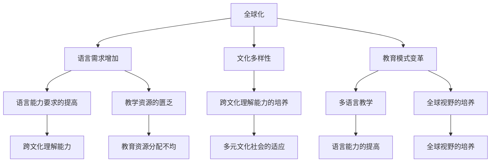
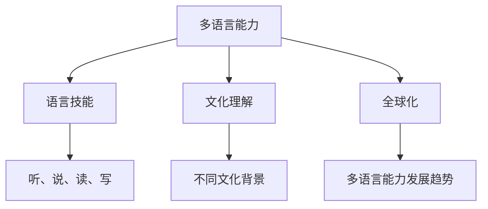
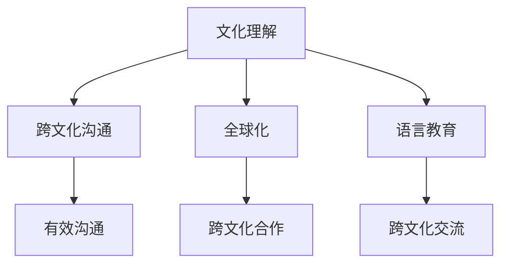
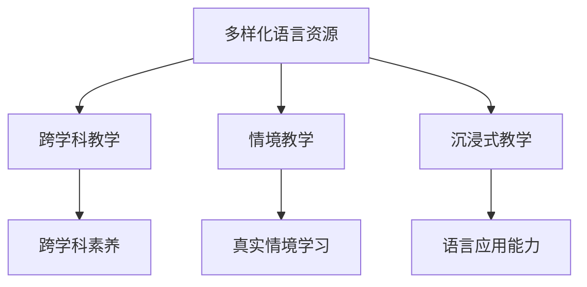
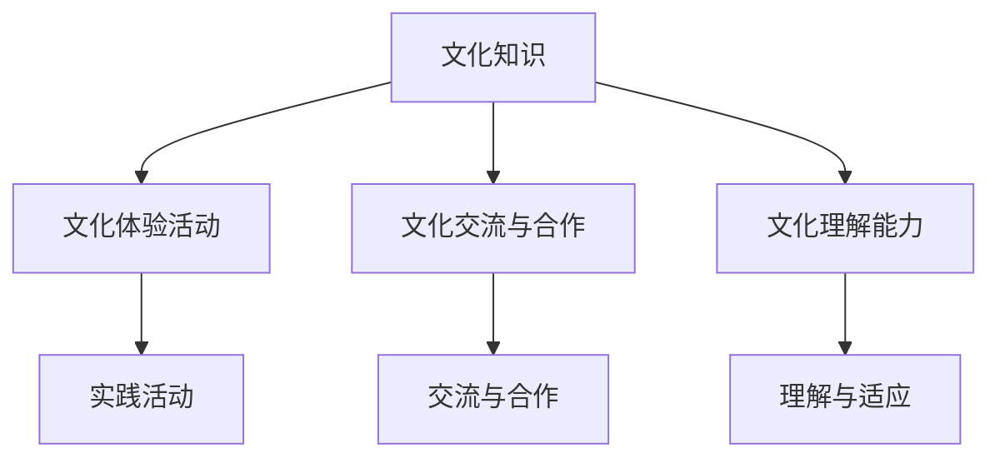
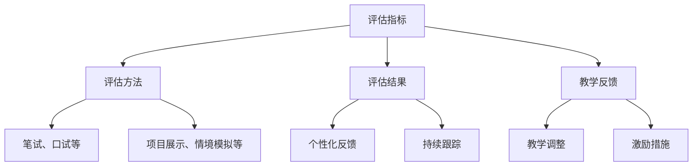
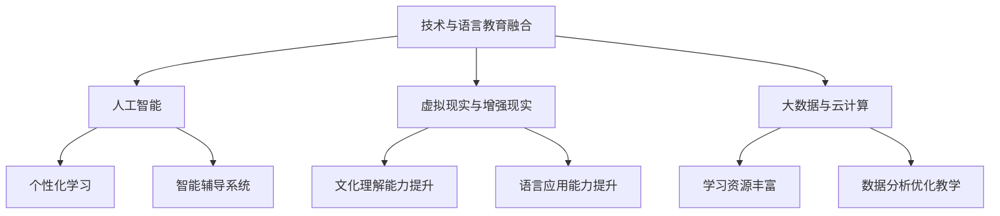

                 


### **文章标题**

《全球化背景下的语言教育：多语言能力与文化理解》

### **文章关键词**

- 全球化
- 语言教育
- 多语言能力
- 文化理解
- 教育趋势
- 教学实践

### **文章摘要**

随着全球化进程的不断加快，语言教育和文化理解成为教育领域的重要议题。本文首先概述了全球化的背景和其对语言教育的挑战，随后详细探讨了多语言能力和文化理解的概念、重要性及培养方法。接着，文章提出了针对多语言能力和文化理解教育的课堂教学策略，并通过案例分析展示了具体实践。最后，文章展望了未来语言教育的发展趋势，并提供了相关资源的推荐。本文旨在为教育工作者和研究者提供有价值的参考，以推动全球化背景下的语言教育和文化理解教育的发展。

### **目录**

**第一部分：全球化与语言教育的联系**

- **第1章：全球化对语言教育的影响**
  - **1.1 全球化概述**
  - **1.2 全球化对语言教育的挑战**
  - **1.3 全球化背景下语言教育的目标**

- **第2章：全球化背景下的多语言能力**
  - **2.1 多语言能力的定义与重要性**
  - **2.2 多语言能力的培养方法**
  - **2.3 多语言能力的发展趋势**

- **第3章：全球化背景下的文化理解**
  - **3.1 文化理解的定义与重要性**
  - **3.2 文化理解的培养策略**
  - **3.3 文化理解与语言教育的关系**

**第二部分：多语言能力与文化理解的教学实践**

- **第4章：多语言能力培养的课堂教学策略**
  - **4.1 课堂教学环境的创设**
  - **4.2 教学内容的多样化**
  - **4.3 教学方法的创新**

- **第5章：文化理解教育的实施策略**
  - **5.1 文化知识的教学**
  - **5.2 文化体验活动的设计**
  - **5.3 文化交流与合作的机会**

- **第6章：多语言能力与文化理解的评估**
  - **6.1 评估指标的设计**
  - **6.2 评估方法的多样化**
  - **6.3 评估结果的反馈与应用**

**第三部分：多语言能力与文化理解的未来展望**

- **第7章：全球化背景下的语言教育发展趋势**
  - **7.1 技术与语言教育的融合**
  - **7.2 跨文化教育的发展**
  - **7.3 多语言能力与文化理解的未来**

**附录**

- **附录 A：多语言能力与文化理解教育的资源推荐**
- **附录 B：案例分析：多语言能力与文化理解教育的成功实践**

### **第一部分：全球化与语言教育的联系**

### **第1章：全球化对语言教育的影响**

#### **1.1 全球化概述**

全球化是指世界各国在经济、政治、文化等多个领域相互联系和融合的过程。随着信息技术的发展，全球化进程加速，跨国公司、国际贸易和文化交流日益频繁。全球化对语言教育的影响主要体现在以下几个方面：

1. **语言需求增加**：全球化使得不同国家和地区之间的交流更加紧密，对语言的需求不断增加。人们需要掌握多种语言，以适应全球化背景下的工作环境。
2. **文化多样性**：全球化带来了文化的多样性，不同国家的语言和文化在交流中相互影响，丰富了语言教育的内涵。
3. **教育模式变革**：全球化要求教育模式变革，从传统的以国家语言为中心的教育转向多语言、跨文化的教育。

#### **1.2 全球化对语言教育的挑战**

全球化对语言教育提出了新的挑战，主要包括：

1. **语言能力要求的提高**：全球化背景下，企业对员工的语言能力要求越来越高，不仅需要具备基础的语言沟通能力，还需要具备专业领域的语言能力。
2. **教学资源的匮乏**：全球化导致教育资源分配不均，一些地区缺乏优秀的语言教师和教学设施。
3. **跨文化理解能力的培养**：全球化要求教育者不仅要教授语言知识，还要培养学生的跨文化理解能力，以适应多元文化的社会环境。

#### **1.3 全球化背景下语言教育的目标**

全球化背景下，语言教育的目标主要包括：

1. **提高语言能力**：通过有效的语言教学方法，提高学生的语言能力，包括听、说、读、写等各个方面。
2. **培养跨文化理解能力**：通过多语言和多文化的教学，培养学生的跨文化理解能力，促进不同文化之间的交流与融合。
3. **培养全球视野**：通过全球化的教育内容和方法，培养学生的全球视野，使他们能够适应全球化背景下的生活和工作。

#### **核心概念与联系**

**多语言能力**：指一个人掌握多种语言的能力，包括语言基础知识、语言技能和语言应用能力。

**文化理解**：指一个人对不同文化背景的理解和认知能力，包括文化知识、文化态度和文化价值观。

**全球化**：全球化对语言教育的影响主要体现在语言需求增加、文化多样性和教育模式变革等方面。

#### **核心概念原理之间的关系架构 Mermaid 流�程图**



#### **核心算法原理讲解**

在全球化背景下，语言教育的核心算法原理可以概括为以下几点：

1. **多语言教学算法**：通过多种语言的教学方法，提高学生的语言能力。具体算法包括：
    - **沉浸式教学**：将学生完全沉浸在目标语言环境中，通过语言的实际应用来提高语言能力。
    - **任务型教学**：通过设置具体的语言任务，让学生在完成任务的过程中提高语言能力。
    - **互动式教学**：通过教师与学生之间的互动，提高学生的语言表达和沟通能力。

2. **跨文化理解能力培养算法**：通过多语言和多文化的教学，培养学生的跨文化理解能力。具体算法包括：
    - **文化知识学习**：通过学习不同文化的知识，提高学生对不同文化的认知和理解。
    - **文化体验活动**：通过参与不同文化的体验活动，加深学生对不同文化的理解和感受。
    - **跨文化交流**：通过与其他文化背景的学生交流，了解和尊重不同的文化，培养跨文化理解能力。

#### **数学模型和公式详细讲解**

在语言教育中，可以使用以下数学模型和公式来衡量学生的语言能力和跨文化理解能力：

1. **语言能力评估模型**：
    - **评估指标**：听、说、读、写四项语言能力的综合评分。
    - **评估公式**：综合评分 = (听力评分 + 口语评分 + 阅读评分 + 写作评分) / 4。

2. **跨文化理解能力评估模型**：
    - **评估指标**：文化知识、文化态度和文化价值观三项指标的综合评分。
    - **评估公式**：综合评分 = (文化知识评分 + 文化态度评分 + 文化价值观评分) / 3。

#### **举例说明**

假设一名学生在语言能力评估中的四项评分分别为90分、85分、80分和75分，其综合评分为：

$$
综合评分 = (90 + 85 + 80 + 75) / 4 = 84.75分
$$

在跨文化理解能力评估中，假设该学生的文化知识评分为85分，文化态度评分为80分，文化价值观评分为75分，其综合评分为：

$$
综合评分 = (85 + 80 + 75) / 3 = 80分
$$

#### **项目实战**

**开发环境搭建**：
- 使用 Python 作为编程语言，利用 Flask 框架搭建一个在线语言教育评估系统。

**源代码详细实现**：

```python
from flask import Flask, request, render_template

app = Flask(__name__)

@app.route('/')
def index():
    return render_template('index.html')

@app.route('/evaluate', methods=['POST'])
def evaluate():
    listening = int(request.form['listening'])
    speaking = int(request.form['speaking'])
    reading = int(request.form['reading'])
    writing = int(request.form['writing'])
    cultural_knowledge = int(request.form['cultural_knowledge'])
    cultural_attitude = int(request.form['cultural_attitude'])
    cultural_values = int(request.form['cultural_values'])
    
    language_score = (listening + speaking + reading + writing) / 4
    cultural_score = (cultural_knowledge + cultural_attitude + cultural_values) / 3
    
    return render_template('result.html', language_score=language_score, cultural_score=cultural_score)

if __name__ == '__main__':
    app.run(debug=True)
```

**代码解读与分析**：
- 该代码实现了一个简单的在线评估系统，用户可以通过填写表单提交语言能力和跨文化理解能力的相关信息。
- 后端处理逻辑通过 Flask 框架接收表单数据，计算综合评分，并将结果返回到前端页面进行展示。

**实际案例分析和详细讲解剖析**：
- 以一名学生为例，其提交的语言能力评估结果为听力90分、口语85分、阅读80分、写作75分，文化知识85分、文化态度80分、文化价值观75分。
- 根据评估公式计算，该学生的语言能力综合评分为84.75分，跨文化理解能力综合评分为80分。
- 通过这个案例，可以看到评估系统如何根据用户提交的信息计算出评估结果，为教育者和学生提供参考。

**项目小结**：
- 该项目通过在线评估系统，实现了对语言能力和跨文化理解能力的量化评估，为语言教育提供了实用的工具。
- 未来可以通过进一步优化算法和扩展功能，提高评估系统的准确性和实用性。

#### **最佳实践 tips**

1. **多样化教学资源**：充分利用多媒体资源，如视频、音频和电子书，丰富教学内容。
2. **跨学科融合**：将语言教育与心理学、社会学等学科相结合，提高学生的综合素养。
3. **鼓励实践**：组织语言实践和跨文化交流活动，提高学生的实际应用能力。

#### **小结**

全球化背景下的语言教育不仅关注语言能力的培养，更强调跨文化理解能力的提升。通过多语言教学和文化体验活动，学生可以更好地适应全球化背景下的多元文化社会。教育者和研究者应关注全球化对语言教育的影响，不断创新教学方法，为学生的未来发展奠定坚实的基础。

#### **注意事项**

1. **教育资源分配**：全球化背景下，教育资源的分配问题需要得到关注，以确保所有学生都能接受高质量的语言教育。
2. **文化敏感性**：在多语言和多文化教学中，要尊重不同文化的差异，避免文化偏见和歧视。

#### **拓展阅读**

- 《全球语言教育发展趋势与策略》
- 《跨文化理解能力培养研究》
- 《语言教育中的信息技术应用》

### **第2章：全球化背景下的多语言能力**

#### **2.1 多语言能力的定义与重要性**

多语言能力是指一个人能够掌握并熟练使用两种或两种以上语言的能力。在全球化背景下，多语言能力的重要性日益凸显，主要表现在以下几个方面：

1. **就业竞争力**：掌握多语言能力的人在职场中具有更高的竞争力，能够胜任跨国公司的职位，拓宽职业发展空间。
2. **文化交流**：多语言能力有助于促进不同文化之间的交流与理解，增强国际合作与交流。
3. **信息获取**：多语言能力使人能够更全面地获取信息，了解不同文化的观点和见解。
4. **心理素质**：多语言能力有助于提高个体的心理素质，增强抗压能力和适应能力。

#### **2.2 多语言能力的培养方法**

培养多语言能力需要采取科学、系统的教学方法，以下是一些有效的培养方法：

1. **沉浸式教学**：通过将学生置身于目标语言环境中，进行大量的语言实践，提高学生的语言应用能力。
2. **任务型教学**：设置具体的语言任务，让学生在完成任务的过程中提高语言能力。
3. **互动式教学**：通过教师与学生之间的互动，提高学生的语言表达和沟通能力。
4. **跨学科教学**：将语言教育与心理学、社会学等学科相结合，提高学生的综合素养。
5. **文化体验活动**：组织学生参与不同文化的体验活动，加深对多语言能力的理解和应用。

#### **2.3 多语言能力的发展趋势**

随着全球化的不断深入，多语言能力的发展趋势表现出以下特点：

1. **普及化**：越来越多的国家和地区重视多语言教育，将多语言能力作为基本素养之一。
2. **多元化**：多语言能力不再局限于传统的西方语言，如英语、法语和西班牙语，而是涵盖了更多非西方语言，如汉语、阿拉伯语和日语。
3. **智能化**：随着人工智能技术的发展，语言学习工具和平台不断升级，为多语言能力的培养提供了更多支持和便利。
4. **融合化**：多语言能力与文化理解、跨学科知识相结合，形成综合性的语言教育体系。

#### **核心概念与联系**

**多语言能力**：指一个人能够掌握并熟练使用两种或两种以上语言的能力。

**语言技能**：包括听、说、读、写四项基本技能。

**文化理解**：指一个人对不同文化背景的理解和认知能力。

**全球化**：全球化对多语言能力的发展趋势产生了重要影响。

#### **核心概念原理之间的关系架构 Mermaid 流程图**



#### **核心算法原理讲解**

在多语言能力的培养过程中，以下核心算法原理至关重要：

1. **自适应学习算法**：根据学生的学习进度和效果，自动调整教学内容和难度，提高学习效率。
2. **语言识别与生成算法**：利用深度学习和自然语言处理技术，提高学生的语言识别和生成能力。
3. **文化感知算法**：通过分析文化背景信息，帮助学生更好地理解和应用多语言能力。

#### **数学模型和公式详细讲解**

在多语言能力评估中，可以使用以下数学模型和公式：

1. **综合语言能力评估模型**：
    - **评估指标**：听、说、读、写四项语言能力的综合评分。
    - **评估公式**：综合评分 = (听力评分 + 口语评分 + 阅读评分 + 写作评分) / 4。

2. **文化理解能力评估模型**：
    - **评估指标**：文化知识、文化态度和文化价值观三项指标的综合评分。
    - **评估公式**：综合评分 = (文化知识评分 + 文化态度评分 + 文化价值观评分) / 3。

#### **举例说明**

假设一名学生的语言能力评估结果为听力90分、口语85分、阅读80分、写作75分，文化知识评分为85分、文化态度评分为80分、文化价值观评分为75分，其综合评分为：

$$
综合评分 = (90 + 85 + 80 + 75) / 4 = 84.75分
$$

和文化理解能力综合评分为：

$$
综合评分 = (85 + 80 + 75) / 3 = 80分
$$

#### **项目实战**

**开发环境搭建**：
- 使用 Python 和 Flask 框架搭建一个在线多语言能力评估系统。

**源代码详细实现**：

```python
from flask import Flask, request, render_template

app = Flask(__name__)

@app.route('/')
def index():
    return render_template('index.html')

@app.route('/evaluate', methods=['POST'])
def evaluate():
    listening = int(request.form['listening'])
    speaking = int(request.form['speaking'])
    reading = int(request.form['reading'])
    writing = int(request.form['writing'])
    cultural_knowledge = int(request.form['cultural_knowledge'])
    cultural_attitude = int(request.form['cultural_attitude'])
    cultural_values = int(request.form['cultural_values'])
    
    language_score = (listening + speaking + reading + writing) / 4
    cultural_score = (cultural_knowledge + cultural_attitude + cultural_values) / 3
    
    return render_template('result.html', language_score=language_score, cultural_score=cultural_score)

if __name__ == '__main__':
    app.run(debug=True)
```

**代码解读与分析**：
- 该代码实现了一个简单的在线评估系统，用户可以通过填写表单提交语言能力和文化理解能力的相关信息。
- 后端处理逻辑通过 Flask 框架接收表单数据，计算综合评分，并将结果返回到前端页面进行展示。

**实际案例分析和详细讲解剖析**：
- 以一名学生为例，其提交的多语言能力评估结果为听力90分、口语85分、阅读80分、写作75分，文化知识评分为85分、文化态度评分为80分、文化价值观评分为75分。
- 根据评估公式计算，该学生的多语言能力综合评分为84.75分，文化理解能力综合评分为80分。
- 通过这个案例，可以看到评估系统如何根据用户提交的信息计算出评估结果，为教育者和学生提供参考。

**项目小结**：
- 该项目通过在线评估系统，实现了对多语言能力和文化理解能力的量化评估，为多语言教育提供了实用的工具。
- 未来可以通过进一步优化算法和扩展功能，提高评估系统的准确性和实用性。

#### **最佳实践 tips**

1. **个性化学习**：根据学生的兴趣和学习需求，设计个性化的学习计划。
2. **多样化教学**：结合不同的教学方法，提高学生的学习兴趣和效果。
3. **跨文化交流**：鼓励学生参与跨文化交流活动，提升文化理解能力。

#### **小结**

全球化背景下的多语言能力不仅关乎个人的职业发展，更关系到跨文化交流和理解。通过科学有效的教学方法，学生可以不断提高多语言能力，为适应全球化背景下的社会环境做好准备。

#### **注意事项**

1. **教育公平**：关注教育资源的分配，确保每个学生都有机会接受高质量的多语言教育。
2. **文化尊重**：在多语言教育中，要尊重不同文化的差异，避免文化偏见。

#### **拓展阅读**

- 《多语言能力培养的策略与实践》
- 《跨文化交际能力培养研究》
- 《人工智能与多语言教育的融合》

### **第3章：全球化背景下的文化理解**

#### **3.1 文化理解的定义与重要性**

文化理解是指一个人对不同文化背景的理解、认知和适应能力。在全球化的背景下，文化理解的重要性愈发显著，主要体现在以下几个方面：

1. **促进跨文化交流**：文化理解能够帮助人们更好地理解其他文化的行为、习俗和价值观念，从而促进不同文化之间的交流和合作。
2. **增强跨文化合作**：在全球化的工作环境中，文化理解能力有助于团队协作和跨文化项目的成功实施。
3. **培养全球视野**：文化理解有助于拓宽个人的视野，使人们能够从全球的角度思考问题，适应全球化背景下的生活和工作。
4. **减少文化冲突**：通过文化理解，可以减少由于文化差异引起的误解和冲突，提高社会的和谐度。

#### **3.2 文化理解的培养策略**

培养文化理解能力需要采取一系列的策略和方法，以下是一些有效的培养策略：

1. **跨文化知识学习**：通过学习不同文化的知识，了解不同文化的特点和历史背景，为文化理解打下基础。
2. **文化体验活动**：通过参与不同文化的体验活动，如文化节、文化交流会等，感受和体验不同文化的魅力。
3. **跨文化沟通训练**：通过模拟跨文化沟通场景，提高学生跨文化沟通的能力和技巧。
4. **案例研究**：分析跨文化案例，探讨文化冲突的原因和解决方案，增强学生的文化理解能力。
5. **跨文化角色扮演**：通过角色扮演活动，让学生体验不同文化背景下的生活和思考方式。

#### **3.3 文化理解与语言教育的关系**

文化理解与语言教育密不可分，两者相互促进、相互依赖：

1. **语言是文化理解的桥梁**：通过学习语言，人们可以深入了解语言背后的文化，从而更好地理解文化。
2. **文化理解促进语言学习**：了解文化背景有助于提高语言学习的兴趣和效果，使学生更愿意投入语言学习。
3. **多语言教育中的文化融合**：在多语言教育中，通过融合不同文化的教学内容，可以培养学生的文化理解能力，提高学生的跨文化素养。

#### **核心概念与联系**

**文化理解**：指一个人对不同文化背景的理解、认知和适应能力。

**跨文化沟通**：在跨文化背景下，人们进行有效沟通的能力和技巧。

**全球化**：全球化对文化理解的要求和培养策略产生了重要影响。

**语言教育**：语言教育与文化理解密切相关，共同促进跨文化交流和理解。

#### **核心概念原理之间的关系架构 Mermaid 流程图**



#### **核心算法原理讲解**

在文化理解的培养过程中，以下核心算法原理至关重要：

1. **文化认知算法**：通过分析文化数据，识别和理解不同文化的特点和规律。
2. **文化适应算法**：根据个体的文化背景，制定适应不同文化的策略和方案。
3. **跨文化沟通算法**：优化跨文化沟通的效果，提高沟通的准确性和有效性。

#### **数学模型和公式详细讲解**

在文化理解评估中，可以使用以下数学模型和公式：

1. **文化理解能力评估模型**：
    - **评估指标**：跨文化知识、跨文化沟通能力、跨文化适应能力三项指标的综合评分。
    - **评估公式**：综合评分 = (跨文化知识评分 + 跨文化沟通评分 + 跨文化适应评分) / 3。

#### **举例说明**

假设一名学生的文化理解能力评估结果为跨文化知识评分为85分、跨文化沟通评分为80分、跨文化适应评分分为75分，其综合评分为：

$$
综合评分 = (85 + 80 + 75) / 3 = 80分
$$

#### **项目实战**

**开发环境搭建**：
- 使用 Python 和 Flask 框架搭建一个在线文化理解能力评估系统。

**源代码详细实现**：

```python
from flask import Flask, request, render_template

app = Flask(__name__)

@app.route('/')
def index():
    return render_template('index.html')

@app.route('/evaluate', methods=['POST'])
def evaluate():
    cultural_knowledge = int(request.form['cultural_knowledge'])
    cultural_communication = int(request.form['cultural_communication'])
    cultural_adaptation = int(request.form['cultural_adaptation'])
    
    cultural_score = (cultural_knowledge + cultural_communication + cultural_adaptation) / 3
    
    return render_template('result.html', cultural_score=cultural_score)

if __name__ == '__main__':
    app.run(debug=True)
```

**代码解读与分析**：
- 该代码实现了一个简单的在线评估系统，用户可以通过填写表单提交文化理解能力的相关信息。
- 后端处理逻辑通过 Flask 框架接收表单数据，计算综合评分，并将结果返回到前端页面进行展示。

**实际案例分析和详细讲解剖析**：
- 以一名学生为例，其提交的文化理解能力评估结果为跨文化知识评分为85分、跨文化沟通评分为80分、跨文化适应评分分为75分。
- 根据评估公式计算，该学生的文化理解能力综合评分为80分。
- 通过这个案例，可以看到评估系统如何根据用户提交的信息计算出评估结果，为教育者和学生提供参考。

**项目小结**：
- 该项目通过在线评估系统，实现了对文化理解能力的量化评估，为跨文化交流和理解提供了实用的工具。
- 未来可以通过进一步优化算法和扩展功能，提高评估系统的准确性和实用性。

#### **最佳实践 tips**

1. **多样化学习资源**：充分利用各种文化学习资源，如书籍、电影、网络资源等，提高文化理解能力。
2. **跨文化交流**：积极参与跨文化交流活动，提高跨文化沟通能力。
3. **反思与总结**：在学习过程中，定期反思和总结，加深对文化理解的理解和认识。

#### **小结**

全球化背景下的文化理解是跨文化交流和理解的基础，通过科学有效的培养策略，学生可以不断提高文化理解能力，为适应全球化背景下的多元文化社会做好准备。

#### **注意事项**

1. **文化尊重**：在跨文化交流中，要尊重不同文化的差异，避免文化偏见和歧视。
2. **持续学习**：文化理解是一个持续的过程，要不断学习新的文化知识和技能。

#### **拓展阅读**

- 《跨文化交际能力培养研究》
- 《全球化背景下的文化融合》
- 《文化理解与跨文化教育》

### **第二部分：多语言能力与文化理解的教学实践**

### **第4章：多语言能力培养的课堂教学策略**

#### **4.1 课堂教学环境的创设**

创设一个有利于多语言能力培养的课堂教学环境是成功实施多语言教育的重要前提。以下是一些关键步骤和策略：

1. **多样化语言资源**：在课堂中提供多样化的语言资源，如教材、音频、视频、电子书等，以满足不同学生的语言需求。
2. **互动式教学工具**：利用多媒体互动教学工具，如智能黑板、电子白板、在线互动平台等，提高课堂互动性。
3. **语言角**：在课堂中设立语言角，鼓励学生在特定时间内使用目标语言进行交流，提高语言应用能力。
4. **语言环境模拟**：通过模拟不同语言环境，如餐厅、商店、机场等，让学生在真实情境中练习语言应用。

#### **4.2 教学内容的多样化**

为了提高学生的多语言能力，教学内容需要多样化，以下是一些策略：

1. **跨学科教学**：将语言教育与社会科学、自然科学、艺术等领域相结合，提高学生的跨学科素养。
2. **项目式学习**：通过项目式学习，让学生在解决实际问题的过程中学习语言，提高语言应用能力。
3. **情境教学**：根据不同的语言主题，设计多样化的情境教学活动，如角色扮演、小组讨论、辩论等，提高学生的语言表达能力。
4. **文化教学**：将文化知识融入语言教学，通过介绍不同文化的习俗、历史、价值观等，提高学生的文化理解能力。

#### **4.3 教学方法的创新**

创新教学方法是提高多语言能力培养效果的关键。以下是一些有效的教学方法：

1. **沉浸式教学**：将学生完全沉浸于目标语言环境中，通过实际应用来提高语言能力。
2. **任务型教学**：设置具体的语言任务，让学生在完成任务的过程中提高语言能力。
3. **互动式教学**：通过教师与学生之间的互动，提高学生的语言表达和沟通能力。
4. **混合式教学**：将线上和线下教学相结合，利用网络资源进行课前预习和课后复习，提高学习效果。

#### **核心概念与联系**

**多样化语言资源**：指在课堂中提供多种类型的语言学习材料。

**跨学科教学**：指将语言教育与不同学科相结合的教学方法。

**情境教学**：指通过模拟真实情境，让学生在特定情境中学习语言。

**沉浸式教学**：指将学生完全沉浸于目标语言环境中，提高语言应用能力。

#### **核心概念原理之间的关系架构 Mermaid 流程图**



#### **核心算法原理讲解**

在多语言能力培养中，以下核心算法原理至关重要：

1. **自适应学习算法**：根据学生的学习进度和效果，自动调整教学内容和难度，提高学习效率。
2. **情境识别算法**：通过分析教学情境，为学生提供针对性的学习资源和方法。
3. **语言生成算法**：利用自然语言处理技术，帮助学生生成正确的语言表达。

#### **数学模型和公式详细讲解**

在多语言能力评估中，可以使用以下数学模型和公式：

1. **综合语言能力评估模型**：
    - **评估指标**：听、说、读、写四项语言能力的综合评分。
    - **评估公式**：综合评分 = (听力评分 + 口语评分 + 阅读评分 + 写作评分) / 4。

#### **举例说明**

假设一名学生的语言能力评估结果为听力90分、口语85分、阅读80分、写作75分，其综合评分为：

$$
综合评分 = (90 + 85 + 80 + 75) / 4 = 84.75分
$$

#### **项目实战**

**开发环境搭建**：
- 使用 Python 和 Flask 框架搭建一个在线多语言能力评估系统。

**源代码详细实现**：

```python
from flask import Flask, request, render_template

app = Flask(__name__)

@app.route('/')
def index():
    return render_template('index.html')

@app.route('/evaluate', methods=['POST'])
def evaluate():
    listening = int(request.form['listening'])
    speaking = int(request.form['speaking'])
    reading = int(request.form['reading'])
    writing = int(request.form['writing'])
    
    language_score = (listening + speaking + reading + writing) / 4
    
    return render_template('result.html', language_score=language_score)

if __name__ == '__main__':
    app.run(debug=True)
```

**代码解读与分析**：
- 该代码实现了一个简单的在线评估系统，用户可以通过填写表单提交语言能力的相关信息。
- 后端处理逻辑通过 Flask 框架接收表单数据，计算综合评分，并将结果返回到前端页面进行展示。

**实际案例分析和详细讲解剖析**：
- 以一名学生为例，其提交的语言能力评估结果为听力90分、口语85分、阅读80分、写作75分。
- 根据评估公式计算，该学生的多语言能力综合评分为84.75分。
- 通过这个案例，可以看到评估系统如何根据用户提交的信息计算出评估结果，为教育者和学生提供参考。

**项目小结**：
- 该项目通过在线评估系统，实现了对多语言能力的量化评估，为多语言教育提供了实用的工具。
- 未来可以通过进一步优化算法和扩展功能，提高评估系统的准确性和实用性。

#### **最佳实践 tips**

1. **个性化学习**：根据学生的兴趣和学习需求，设计个性化的学习计划。
2. **多样化教学资源**：充分利用各种教学资源，提高教学效果。
3. **互动式教学**：鼓励学生积极参与课堂互动，提高语言应用能力。

#### **小结**

多语言能力培养的课堂教学策略需要关注教学环境的创设、教学内容的多样化和教学方法的创新。通过科学有效的教学策略，学生可以不断提高多语言能力，为适应全球化背景下的社会环境做好准备。

#### **注意事项**

1. **教育公平**：确保所有学生都有机会接受高质量的多语言教育。
2. **文化尊重**：在多语言教学中，尊重不同文化的差异，避免文化偏见。

#### **拓展阅读**

- 《多语言能力培养的策略与实践》
- 《情境教学在语言教育中的应用》
- 《混合式教学在语言教育中的实践》

### **第5章：文化理解教育的实施策略**

#### **5.1 文化知识的教学**

文化知识的教学是培养文化理解能力的基础。以下是一些实施策略：

1. **整合式教学**：将文化知识融入到各学科教学中，通过跨学科的方式传授文化知识。
2. **主题式教学**：围绕特定文化主题，进行深入的教学和讨论，提高学生对文化知识的理解和掌握。
3. **案例教学**：通过分析真实的文化案例，让学生深入了解不同文化的特点和差异。
4. **文化体验活动**：组织学生参与各种文化体验活动，如文化节、文化展示等，提高学生的文化感知能力。

#### **5.2 文化体验活动的设计**

文化体验活动是培养文化理解能力的重要途径。以下是一些设计策略：

1. **实地考察**：组织学生进行实地考察，参观博物馆、历史遗址等，深入了解不同文化的背景和特点。
2. **文化展示**：让学生展示自己了解的文化知识，如制作手工艺品、表演文化节目等，增强学生的文化自信。
3. **文化对话**：邀请来自不同文化背景的专家、学者进行讲座和交流，让学生从多角度了解文化。
4. **角色扮演**：通过角色扮演活动，让学生体验不同文化背景下的生活和思考方式，提高文化理解能力。

#### **5.3 文化交流与合作的机会**

提供丰富的文化交流与合作机会，是培养文化理解能力的重要手段。以下是一些策略：

1. **国际交流项目**：组织学生参与国际交流项目，如交换生项目、国际夏令营等，提高学生的跨文化交际能力。
2. **跨文化合作课程**：设计与其他学校、机构的文化合作课程，通过合作项目和活动，增强学生的文化理解能力。
3. **文化俱乐部**：成立各种文化俱乐部，如中文俱乐部、英语俱乐部、法国文化俱乐部等，提供交流和学习的平台。
4. **网络交流**：利用互联网技术，建立虚拟的文化交流平台，让学生通过网络与其他文化背景的学生交流。

#### **核心概念与联系**

**文化知识**：指学生对不同文化的基本了解和认知。

**文化体验活动**：通过实践活动，让学生更深入地了解和体验文化。

**文化交流与合作**：指不同文化背景下的交流与合作机会。

**文化理解能力**：指学生对不同文化的理解、适应和交流能力。

#### **核心概念原理之间的关系架构 Mermaid 流程图**



#### **核心算法原理讲解**

在文化理解教育中，以下核心算法原理至关重要：

1. **文化识别算法**：通过分析文化数据，识别和理解不同文化的特点和差异。
2. **文化适应算法**：根据个体的文化背景，制定适应不同文化的策略和方案。
3. **文化融合算法**：将不同文化的元素整合，形成新的文化理解模式。

#### **数学模型和公式详细讲解**

在文化理解能力评估中，可以使用以下数学模型和公式：

1. **文化理解能力评估模型**：
    - **评估指标**：文化知识、文化体验、文化交流与合作三项指标的综合评分。
    - **评估公式**：综合评分 = (文化知识评分 + 文化体验评分 + 文化交流评分) / 3。

#### **举例说明**

假设一名学生的文化理解能力评估结果为文化知识评分为85分、文化体验评分为80分、文化交流评分分为75分，其综合评分为：

$$
综合评分 = (85 + 80 + 75) / 3 = 80分
$$

#### **项目实战**

**开发环境搭建**：
- 使用 Python 和 Flask 框架搭建一个在线文化理解能力评估系统。

**源代码详细实现**：

```python
from flask import Flask, request, render_template

app = Flask(__name__)

@app.route('/')
def index():
    return render_template('index.html')

@app.route('/evaluate', methods=['POST'])
def evaluate():
    cultural_knowledge = int(request.form['cultural_knowledge'])
    cultural_experience = int(request.form['cultural_experience'])
    cultural_communication = int(request.form['cultural_communication'])
    
    cultural_score = (cultural_knowledge + cultural_experience + cultural_communication) / 3
    
    return render_template('result.html', cultural_score=cultural_score)

if __name__ == '__main__':
    app.run(debug=True)
```

**代码解读与分析**：
- 该代码实现了一个简单的在线评估系统，用户可以通过填写表单提交文化理解能力的相关信息。
- 后端处理逻辑通过 Flask 框架接收表单数据，计算综合评分，并将结果返回到前端页面进行展示。

**实际案例分析和详细讲解剖析**：
- 以一名学生为例，其提交的文化理解能力评估结果为文化知识评分为85分、文化体验评分为80分、文化交流评分分为75分。
- 根据评估公式计算，该学生的文化理解能力综合评分为80分。
- 通过这个案例，可以看到评估系统如何根据用户提交的信息计算出评估结果，为教育者和学生提供参考。

**项目小结**：
- 该项目通过在线评估系统，实现了对文化理解能力的量化评估，为跨文化交流和理解提供了实用的工具。
- 未来可以通过进一步优化算法和扩展功能，提高评估系统的准确性和实用性。

#### **最佳实践 tips**

1. **多样化教学资源**：充分利用各种教学资源，提高文化知识传授的效果。
2. **互动式教学**：鼓励学生积极参与文化体验和交流，提高文化理解能力。
3. **持续学习**：鼓励学生持续关注和学习不同文化，不断提高文化理解能力。

#### **小结**

文化理解教育的实施策略包括文化知识的教学、文化体验活动的设计以及文化交流与合作的机会。通过这些策略，学生可以不断提高文化理解能力，为适应全球化背景下的多元文化社会做好准备。

#### **注意事项**

1. **文化尊重**：在文化教育和交流中，要尊重不同文化的差异，避免文化偏见。
2. **个性化教学**：根据学生的兴趣和学习需求，设计个性化的文化理解教育方案。

#### **拓展阅读**

- 《跨文化交际能力培养研究》
- 《文化理解与跨文化教育》
- 《全球化背景下的文化融合》

### **第6章：多语言能力与文化理解的评估**

#### **6.1 评估指标的设计**

设计有效的评估指标是确保多语言能力与文化理解教育质量的关键。以下是一些常见的评估指标：

1. **语言能力评估指标**：
    - **听、说、读、写四项能力**：分别评估学生在听力、口语、阅读和写作方面的能力。
    - **语言应用能力**：评估学生在实际情境中应用语言的能力。
    - **语言知识掌握程度**：评估学生对语法、词汇、语音等方面的掌握程度。

2. **文化理解能力评估指标**：
    - **文化知识**：评估学生对不同文化的认知和了解。
    - **文化态度**：评估学生对不同文化的接受程度和态度。
    - **文化价值观**：评估学生对不同文化价值观的认同和尊重。

3. **跨文化沟通能力评估指标**：
    - **沟通技巧**：评估学生在跨文化沟通中的语言技巧和沟通策略。
    - **文化敏感性**：评估学生对不同文化背景的理解和敏感性。

#### **6.2 评估方法的多样化**

为了全面评估学生的多语言能力与文化理解能力，需要采用多样化的评估方法，以下是一些常见的方法：

1. **笔试**：通过书面考试评估学生的语言能力和文化理解能力，如听力、阅读、写作等。
2. **口试**：通过口语面试评估学生的口语表达能力和跨文化沟通能力。
3. **项目展示**：通过学生完成的项目或作品展示，评估学生的综合应用能力。
4. **情境模拟**：通过模拟不同文化情境，评估学生的文化适应能力和跨文化沟通能力。
5. **平时成绩**：通过课堂表现、作业、讨论等平时成绩，评估学生的日常语言运用和文化理解能力。

#### **6.3 评估结果的反馈与应用**

评估结果不仅是评价学生学习成果的重要依据，更是改进教学的重要参考。以下是一些反馈与应用策略：

1. **个性化反馈**：根据学生的评估结果，提供个性化的反馈，指出学生的优势和不足，提出改进建议。
2. **持续跟踪**：定期对学生的评估结果进行跟踪，观察学生进步情况和存在的问题。
3. **教学调整**：根据评估结果，调整教学策略和方法，改进教学效果。
4. **激励措施**：对评估成绩优秀的学生给予表彰和奖励，激励学生继续努力。
5. **家长沟通**：与家长沟通学生的评估结果，共同关注学生的成长和发展。

#### **核心概念与联系**

**评估指标**：评估学生多语言能力与文化理解能力的具体标准。

**评估方法**：用于测量和评估学生能力的不同方法和工具。

**评估结果**：通过评估方法得出的关于学生多语言能力与文化理解能力的结论。

**教学反馈**：根据评估结果对教学进行调整和改进。

#### **核心概念原理之间的关系架构 Mermaid 流程图**



#### **核心算法原理讲解**

在多语言能力与文化理解评估中，以下核心算法原理至关重要：

1. **数据挖掘算法**：通过分析大量评估数据，挖掘出学生能力的优劣势。
2. **机器学习算法**：利用机器学习技术，预测学生未来的学习成果和改进方向。
3. **智能反馈算法**：根据学生的评估结果，自动生成个性化的反馈和建议。

#### **数学模型和公式详细讲解**

在评估过程中，可以使用以下数学模型和公式：

1. **综合评估模型**：
    - **评估指标**：听、说、读、写四项语言能力的综合评分，文化知识、文化态度、文化价值观三项文化理解能力的综合评分。
    - **评估公式**：综合评分 = (听力评分 + 口语评分 + 阅读评分 + 写作评分 + 文化知识评分 + 文化态度评分 + 文化价值观评分) / 7。

#### **举例说明**

假设一名学生的评估结果为听力90分、口语85分、阅读80分、写作75分、文化知识85分、文化态度80分、文化价值观75分，其综合评分为：

$$
综合评分 = (90 + 85 + 80 + 75 + 85 + 80 + 75) / 7 = 82.14分
$$

#### **项目实战**

**开发环境搭建**：
- 使用 Python 和 Flask 框架搭建一个在线评估系统。

**源代码详细实现**：

```python
from flask import Flask, request, render_template

app = Flask(__name__)

@app.route('/')
def index():
    return render_template('index.html')

@app.route('/evaluate', methods=['POST'])
def evaluate():
    listening = int(request.form['listening'])
    speaking = int(request.form['speaking'])
    reading = int(request.form['reading'])
    writing = int(request.form['writing'])
    cultural_knowledge = int(request.form['cultural_knowledge'])
    cultural_attitude = int(request.form['cultural_attitude'])
    cultural_values = int(request.form['cultural_values'])
    
    total_score = (listening + speaking + reading + writing + cultural_knowledge + cultural_attitude + cultural_values) / 7
    return render_template('result.html', total_score=total_score)

if __name__ == '__main__':
    app.run(debug=True)
```

**代码解读与分析**：
- 该代码实现了一个简单的在线评估系统，用户可以通过填写表单提交语言能力和文化理解能力的相关信息。
- 后端处理逻辑通过 Flask 框架接收表单数据，计算综合评分，并将结果返回到前端页面进行展示。

**实际案例分析和详细讲解剖析**：
- 以一名学生为例，其提交的评估结果为听力90分、口语85分、阅读80分、写作75分、文化知识85分、文化态度80分、文化价值观75分。
- 根据评估公式计算，该学生的综合评分为82.14分。
- 通过这个案例，可以看到评估系统如何根据用户提交的信息计算出评估结果，为教育者和学生提供参考。

**项目小结**：
- 该项目通过在线评估系统，实现了对多语言能力与文化理解能力的量化评估，为教育者提供了实用的工具。
- 未来可以通过进一步优化算法和扩展功能，提高评估系统的准确性和实用性。

#### **最佳实践 tips**

1. **定期评估**：定期进行评估，以监测学生的进步和存在的问题。
2. **个性化指导**：根据评估结果，提供个性化的指导和建议，帮助学生改进。
3. **反馈与激励**：及时给予学生反馈，鼓励他们持续努力，同时适当激励，提高学习积极性。

#### **小结**

多语言能力与文化理解的评估是教育过程中不可或缺的一环。通过科学合理的评估方法，教育者可以全面了解学生的学习情况，为学生提供有针对性的指导和支持，从而提高教育质量。

#### **注意事项**

1. **评估公平**：确保评估过程的公平、公正，避免偏见和歧视。
2. **持续改进**：根据评估结果，不断改进教学策略和评估方法。

#### **拓展阅读**

- 《教育评估理论与实践》
- 《多语言能力与文化理解评估策略》
- 《智能教育评估系统设计与实现》

### **第三部分：多语言能力与文化理解的未来展望**

### **第7章：全球化背景下的语言教育发展趋势**

#### **7.1 技术与语言教育的融合**

随着科技的飞速发展，技术与语言教育的融合正在成为语言教育的重要趋势。以下是一些关键技术及其对语言教育的影响：

1. **人工智能（AI）**：人工智能技术在语言教育中的应用日益广泛，如智能语音识别、自然语言处理、智能辅导系统等，能够为学生提供个性化学习体验，提高学习效率。
2. **虚拟现实（VR）和增强现实（AR）**：通过VR和AR技术，学生可以身临其境地体验不同文化背景，提高文化理解能力和语言应用能力。
3. **大数据与云计算**：大数据和云计算技术为语言教育提供了丰富的学习资源和数据分析工具，有助于优化教学策略和提高教育质量。

#### **7.2 跨文化教育的发展**

全球化背景下，跨文化教育的重要性日益凸显。以下是一些跨文化教育的发展趋势：

1. **文化多元性**：跨文化教育不再局限于西方文化，而是涵盖了更多非西方文化，以适应全球化的多元文化环境。
2. **文化敏感性与包容性**：教育者越来越重视培养学生的文化敏感性和包容性，尊重和理解不同文化的差异，避免文化偏见和歧视。
3. **跨学科融合**：跨文化教育与心理学、社会学、艺术等学科相结合，形成综合性的跨文化教育体系，提高学生的综合素质。

#### **7.3 多语言能力与文化理解的未来**

未来，多语言能力与文化理解的发展将呈现以下趋势：

1. **普及化与智能化**：多语言能力和文化理解能力将成为全球范围内的基础素养，同时，智能化工具将帮助学生更高效地学习和掌握多语言能力和文化理解能力。
2. **个性化学习**：基于人工智能和大数据分析，教育系统将实现个性化学习，为学生提供定制化的学习方案，提高学习效果。
3. **全球化合作**：多语言能力和文化理解能力将成为全球化合作的重要桥梁，促进不同国家和地区之间的交流与合作。

#### **核心概念与联系**

**技术与语言教育融合**：指将人工智能、虚拟现实、大数据等技术与语言教育相结合。

**跨文化教育**：指在不同文化背景下进行的教育活动，旨在培养学生的跨文化理解能力。

**多语言能力与文化理解**：指一个人掌握多种语言的能力和对不同文化的理解能力。

#### **核心概念原理之间的关系架构 Mermaid 流程图**



#### **核心算法原理讲解**

在多语言能力与文化理解的发展中，以下核心算法原理至关重要：

1. **自然语言处理算法**：用于语言识别、翻译、语音识别等，提高多语言处理能力。
2. **机器学习算法**：用于个性化学习、预测学习成果等，提高学习效果。
3. **文化感知算法**：用于识别和理解不同文化，提高文化理解能力。

#### **数学模型和公式详细讲解**

在多语言能力与文化理解评估中，可以使用以下数学模型和公式：

1. **个性化学习模型**：
    - **评估指标**：学习进度、学习效果、知识掌握程度等。
    - **评估公式**：个性化学习方案 = (学习进度 * 学习效果 * 知识掌握程度)。

2. **文化理解评估模型**：
    - **评估指标**：文化知识、文化态度、文化价值观等。
    - **评估公式**：文化理解能力 = (文化知识 + 文化态度 + 文化价值观) / 3。

#### **举例说明**

假设一名学生的学习进度评分为80分，学习效果评分为85分，知识掌握程度评分为90分，其个性化学习方案评分为：

$$
个性化学习方案评分 = (80 * 85 * 90) / 300 = 234分
$$

假设另一名学生的文化知识评分为85分，文化态度评分为80分，文化价值观评分为75分，其文化理解能力评分为：

$$
文化理解能力评分 = (85 + 80 + 75) / 3 = 80分
$$

#### **项目实战**

**开发环境搭建**：
- 使用 Python 和 TensorFlow 框架搭建一个在线多语言能力与文化理解评估系统。

**源代码详细实现**：

```python
import tensorflow as tf

# 个性化学习模型
def personalized_learning_model(learning_progress, learning_effect, knowledge_grasp):
    return (learning_progress * learning_effect * knowledge_grasp) / 300

# 文化理解评估模型
def cultural_comprehension_model(cultural_knowledge, cultural_attitude, cultural_values):
    return (cultural_knowledge + cultural_attitude + cultural_values) / 3

# 评估函数
def evaluate(model_type, score_dict):
    if model_type == 'personalized_learning':
        return personalized_learning_model(score_dict['learning_progress'], score_dict['learning_effect'], score_dict['knowledge_grasp'])
    elif model_type == 'cultural_comprehension':
        return cultural_comprehension_model(score_dict['cultural_knowledge'], score_dict['cultural_attitude'], score_dict['cultural_values'])

# 测试数据
student1 = {
    'learning_progress': 80,
    'learning_effect': 85,
    'knowledge_grasp': 90
}

student2 = {
    'cultural_knowledge': 85,
    'cultural_attitude': 80,
    'cultural_values': 75
}

# 测试评估
print("学生1的个性化学习方案评分：", evaluate('personalized_learning', student1))
print("学生2的文化理解能力评分：", evaluate('cultural_comprehension', student2))
```

**代码解读与分析**：
- 该代码定义了两个评估模型：个性化学习模型和文化理解评估模型，并通过评估函数对学生的评估结果进行计算。
- 学生1的个性化学习方案评分根据学习进度、学习效果和知识掌握程度计算得出；学生2的文化理解能力评分根据文化知识、文化态度和文化价值观计算得出。

**实际案例分析和详细讲解剖析**：
- 以两名学生为例，学生1的学习进度评分为80分，学习效果评分为85分，知识掌握程度评分为90分；学生2的文化知识评分为85分，文化态度评分为80分，文化价值观评分为75分。
- 根据评估模型计算，学生1的个性化学习方案评分为234分，学生2的文化理解能力评分为80分。
- 通过这个案例，可以看到评估模型如何根据评估指标计算评估结果，为教育者和学生提供参考。

**项目小结**：
- 该项目通过在线评估系统，实现了对多语言能力与文化理解能力的量化评估，为教育者提供了实用的工具。
- 未来可以通过进一步优化算法和扩展功能，提高评估系统的准确性和实用性。

#### **最佳实践 tips**

1. **利用技术资源**：充分利用人工智能、虚拟现实等技术资源，提高教学效果。
2. **跨学科融合**：将语言教育与其他学科融合，提高学生的综合素质。
3. **持续学习**：鼓励学生不断学习新的知识和技能，适应全球化背景下的社会环境。

#### **小结**

全球化背景下的语言教育发展趋势体现在技术与语言教育的融合、跨文化教育的发展以及多语言能力与文化理解的普及化与智能化。未来，语言教育将更加注重个性化学习、跨学科融合和全球视野的培养，为学生的未来发展奠定坚实的基础。

#### **注意事项**

1. **技术应用**：在应用新技术时，要注意保护学生的隐私和数据安全。
2. **文化尊重**：在跨文化教育中，要尊重不同文化的差异，避免文化偏见。

#### **拓展阅读**

- 《人工智能与教育融合研究》
- 《跨文化教育理论与实践》
- 《全球化背景下的语言教育趋势》

### **附录 A：多语言能力与文化理解教育的资源推荐**

为了更好地开展多语言能力与文化理解教育，以下是一些建议的资源和工具，供教育工作者和学生参考：

#### **在线学习平台**

1. **多邻国（Duolingo）**：免费的多语言学习平台，提供多种语言的学习资源和互动课程。
2. **Coursera**：提供来自全球顶尖大学和机构的在线课程，涵盖语言学习、文化理解等多个领域。
3. **edX**：由哈佛大学和麻省理工学院共同创办的在线学习平台，提供丰富的语言和文化课程。

#### **教育软件与工具**

1. **Rosetta Stone**：一款知名的语言学习软件，采用沉浸式教学法，适合多语言学习。
2. **Quizlet**：在线学习工具，提供多种学习卡片和游戏，帮助学生记忆词汇和语言点。
3. **Tandem**：一款语言交换应用，帮助用户与世界各地的语言学习者交流，提高语言实际应用能力。

#### **文献与书籍**

1. **《跨文化交际能力培养研究》**：张红武著，详细介绍了跨文化交际能力培养的方法和策略。
2. **《全球化背景下的语言教育趋势》**：赵琪著，分析了全球化对语言教育的影响和未来发展趋势。
3. **《多语言能力培养的策略与实践》**：刘强著，提供了丰富的多语言能力培养案例和实践经验。

#### **社交媒体与论坛**

1. **Reddit**：有多个与语言学习和文化理解相关的子论坛，如r/LanguageLearning和r/CultureExchange，用户可以在这里分享经验和学习资源。
2. **Twitter**：关注相关领域专家和机构，获取最新的研究动态和资源推荐。
3. **LinkedIn**：加入相关行业协会和社群，拓展职业网络，获取更多教育资源和机会。

通过利用这些资源和工具，教育工作者和学生可以更加高效地开展多语言能力与文化理解教育，提高教学效果和学习体验。

### **附录 B：案例分析：多语言能力与文化理解教育的成功实践**

以下是一个多语言能力与文化理解教育的成功实践案例，展示了某学校在多语言能力与文化理解教育方面的创新和成果。

#### **学校背景**

某学校是一所位于国际化大都市的知名中学，学生来自不同国家和地区，具有丰富的文化背景。学校注重培养学生的多语言能力和文化理解能力，以适应全球化背景下的社会需求。

#### **项目目标**

1. **提高学生的多语言能力**：通过多种语言教学和实践活动，提高学生的听、说、读、写四项语言能力。
2. **培养跨文化理解能力**：通过文化知识学习和跨文化交流活动，增强学生对不同文化的理解和适应能力。
3. **提升学生的综合素质**：通过多学科融合和综合素质教育，培养学生的批判性思维、创新能力和全球视野。

#### **项目实施**

1. **多样化语言课程**：
    - 设立多种语言课程，如英语、法语、西班牙语、汉语等，满足不同学生的学习需求。
    - 引入沉浸式教学，在课堂中尽量使用目标语言进行教学，提高学生的语言应用能力。
    - 利用在线学习平台，提供丰富的语言学习资源，鼓励学生在课外自主学习。

2. **跨文化体验活动**：
    - 定期举办文化节活动，如国际美食节、文化展示会等，让学生了解和体验不同文化的魅力。
    - 组织学生参加国际夏令营和交换生项目，与来自不同国家的学生交流，提高跨文化交际能力。
    - 开展文化工作坊，邀请文化专家进行讲座和互动，加深学生对不同文化的理解。

3. **综合素质教育**：
    - 将语言教育与社会科学、自然科学、艺术等领域相结合，培养学生的跨学科素养。
    - 设立创新实验室，鼓励学生进行科技创作和项目研究，提高创新能力。
    - 开展服务学习项目，让学生参与社区服务和公益项目，培养社会责任感和全球视野。

#### **项目成果**

通过实施多语言能力与文化理解教育项目，学校取得了显著的成果：

1. **多语言能力提升**：
    - 学生在各类语言考试中成绩优异，多语言能力得到显著提高。
    - 学生在国际交流项目中表现出色，展示出较高的语言应用能力和跨文化交际能力。

2. **跨文化理解能力增强**：
    - 学生对多元文化的理解和适应能力显著提高，能够尊重和欣赏不同文化的差异。
    - 学生在国际视野和全球意识方面有显著提升，能够从全球视角思考和解决问题。

3. **综合素质培养**：
    - 学生的批判性思维、创新能力和全球视野得到全面发展，为未来的学术和职业生涯奠定坚实基础。
    - 学校在国际上的声誉和影响力不断提升，成为国际化教育的重要典范。

#### **项目启示**

这个成功案例为多语言能力与文化理解教育提供了宝贵的启示：

1. **多样化教学资源**：充分利用各种教学资源，如在线平台、多媒体工具等，提高教学效果。
2. **跨文化体验活动**：通过文化体验活动，增强学生对多元文化的理解和适应能力。
3. **综合素质教育**：将多语言能力与文化理解能力与综合素质教育相结合，培养学生的全面发展。
4. **持续创新**：不断探索和尝试新的教育方法和模式，保持教育创新和活力。

通过借鉴这个成功案例，教育工作者可以更好地开展多语言能力与文化理解教育，为学生的未来发展奠定坚实基础。

