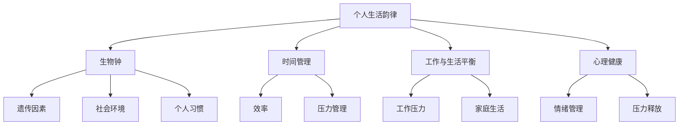

                 

### 文章标题：创造个人生活韵律：找到最适合的节奏

在生活中，我们常常感到忙碌而疲惫，好像总是在追赶时间的脚步，却很少有时间停下来思考自己的生活方式。这个问题并不是某个特定个体的困扰，而是许多现代人在快节奏生活中普遍面临的挑战。本文将带领您深入了解“个人生活韵律”的概念，探索如何找到适合自己的生活节奏，从而创造更加充实和和谐的生活。

关键词：个人生活韵律、节奏感、时间管理、生活平衡、目标设定

摘要：本文将讨论个人生活韵律的重要性，以及如何通过理解和设定个人节奏感、合理规划时间、平衡工作与生活、培养健康的生活习惯，最终实现个人生活韵律的创造。文章将结合数学模型和实际案例，提供实用的方法和技巧，帮助读者找到适合自己的生活节奏，实现身心健康与事业成功的双赢。

### 第1章：什么是个人生活韵律

个人生活韵律，指的是一个人在日常生活中形成的稳定、有规律的生活方式。这种生活方式不仅包括日常行为的节奏，还涉及心理状态、情感波动以及与他人的互动模式。简单来说，个人生活韵律是一种能够帮助我们保持身心平衡，提高生活质量的生活模式。

#### 1.1 个人生活韵律的定义

个人生活韵律可以理解为一种内在的“生物钟”，它决定了我们何时起床、何时工作、何时休息以及何时享受生活。这种韵律不仅受到生物因素的影响，还受到社会环境、个人习惯和心理状态的多重影响。比如，有些人习惯早起，而有些人则喜欢熬夜；有些人喜欢有条不紊地规划一天的生活，而有些人则喜欢随遇而安。

#### 1.2 个人生活韵律的重要性

个人生活韵律对于我们的身心健康和生活质量有着至关重要的影响。一个良好的生活韵律可以帮助我们保持精力充沛，提高工作效率，同时也能够减少心理压力，提升幸福感。具体来说，个人生活韵律的重要性体现在以下几个方面：

1. **提高工作效率**：规律的生活习惯可以帮助我们更好地分配时间，提高工作效率。当我们知道每个时间段该做什么，就不会在繁忙的工作中感到焦虑和混乱。

2. **促进身心健康**：规律的生活习惯有助于维持身体的健康状态，比如保持良好的睡眠习惯，有利于身体恢复和免疫力的提升。

3. **提升幸福感**：通过合理规划时间，我们能够更好地平衡工作与生活，享受到生活中的美好时光，从而提升整体幸福感。

4. **增强自我管理能力**：建立个人生活韵律需要自我约束和自我管理，这不仅可以提高我们的生活品质，还可以培养我们的自律能力和责任感。

#### 1.3 个人生活韵律与身心健康的关系

个人生活韵律与身心健康之间有着密切的联系。一个良好的生活韵律可以帮助我们维持身体和心理的健康状态，而长期不规律的生活方式则可能对身心健康产生负面影响。

1. **生理影响**：规律的作息时间有助于维持人体的生物钟，从而保持身体各项功能的正常运行。例如，良好的睡眠习惯有助于提高免疫力和恢复体力。

2. **心理影响**：心理状态的稳定依赖于良好的生活习惯。规律的作息和合理的时间管理有助于减少焦虑和抑郁等负面情绪，提升心理韧性。

3. **整体健康**：身心健康相互影响，一个良好的生活韵律有助于提升整体健康水平。当我们的身体和心理都处于良好状态时，生活质量自然会得到提升。

#### 1.4 个人生活韵律的影响因素

个人生活韵律的形成受到多种因素的影响，包括：

1. **遗传因素**：遗传因素会影响我们的生物钟，从而影响我们的生活节奏。

2. **社会环境**：社会环境，如工作时间、社交活动等，也会影响我们的生活节奏。

3. **个人习惯**：个人习惯，如作息时间、饮食习惯等，是形成个人生活韵律的重要因素。

4. **心理状态**：心理状态，如情绪波动、压力水平等，也会对我们的生活节奏产生影响。

通过了解个人生活韵律的定义、重要性以及影响因素，我们可以更好地认识到自己生活韵律的现状，并为创建一个更加健康和谐的生活韵律打下基础。

#### 1.5 个人生活韵律的概念关系架构图

为了更清晰地理解个人生活韵律的相关概念，我们可以使用Mermaid流程图来展示这些概念之间的关系：



在这个流程图中，我们可以看到个人生活韵律是如何通过生物钟、时间管理、工作与生活平衡以及心理健康等多个因素相互影响的。这为我们理解和调整自己的生活韵律提供了一个整体视角。

#### 1.6 个人生活韵律的核心概念联系与数学模型

个人生活韵律的形成是一个复杂的系统，涉及多个核心概念。为了更深入地理解这些概念之间的联系，我们可以通过建立数学模型来进行分析。

首先，定义几个关键变量：
- \(T\)：个人生活韵律的总体稳定性
- \(B\)：生物钟的稳定性
- \(M\)：时间管理能力
- \(E\)：心理健康水平

我们假设这些变量之间满足以下关系：

1. **生物钟的稳定性（\(B\)）**：生物钟的稳定性影响个人的睡眠质量和日常行为的节奏。我们可以用以下方程表示：
   $$ B = f(S, E) $$
   其中，\(S\) 代表睡眠质量，\(E\) 代表心理健康水平。

2. **时间管理能力（\(M\)）**：时间管理能力与工作效率和个人时间安排的合理性密切相关。可以用以下方程表示：
   $$ M = g(P, E) $$
   其中，\(P\) 代表个人目标设定，\(E\) 代表心理健康水平。

3. **心理健康水平（\(E\)）**：心理健康水平直接影响个人的情绪状态和生活满意度。我们可以用以下方程表示：
   $$ E = h(B, M) $$

综合这些方程，我们可以得出个人生活韵律的总体稳定性（\(T\)）：
$$ T = \alpha B + \beta M + \gamma E $$

其中，\(\alpha\)、\(\beta\) 和 \(\gamma\) 是权重系数，用于平衡这三个因素对生活韵律的影响。

通过这个数学模型，我们可以对个人生活韵律进行定量分析。例如，如果我们想要提高个人的生活韵律，可以通过改善睡眠质量、提高时间管理能力或者增强心理健康水平来实现。

为了更直观地展示这一模型，我们可以使用LaTeX格式写出具体的数学公式：

$$
\begin{align*}
B &= f(S, E) \\
M &= g(P, E) \\
E &= h(B, M) \\
T &= \alpha B + \beta M + \gamma E
\end{align*}
$$

#### 1.7 核心算法原理讲解与伪代码

为了更深入地理解如何设定个人目标并找到个人节奏，我们可以使用伪代码来展示一些核心算法原理。以下是一个简化的算法，用于帮助个人设定目标并找到适合自己的生活节奏。

```plaintext
Algorithm: FindPersonalRhythm

Input: 
    - goals: List of personal goals
    - available_time: Total available time per day
    - energy_level: Initial energy level

Output: 
    - daily_rhythm: A structured daily schedule

1. Initialize daily_rhythm as an empty schedule
2. For each goal in goals:
    a. Calculate required_time for goal completion
    b. Calculate optimal_time based on energy_level and available_time
    c. If optimal_time is less than required_time:
        i. Adjust required_time to optimal_time
    d. Add goal to daily_rhythm with required_time
3. For each activity in daily_rhythm:
    a. If activity is a high-energy activity:
        i. Schedule activity during peak energy times
    b. If activity is a low-energy activity:
        i. Schedule activity during low-energy times
4. If total_time_spent > available_time:
    a. Re-evaluate and prioritize activities
5. Return daily_rhythm
```

这个伪代码展示了如何根据个人目标和可用时间来设定一个合理的日常安排，同时考虑个人的能量水平。通过调整活动的时间，我们可以优化个人时间的使用，找到适合自己的生活节奏。

### 第2章：探索个人节奏感

个人节奏感是指我们在日常生活中感受和调整自己行为节奏的能力。这种节奏感不仅影响着我们的生活质量，还直接关系到我们的身心健康和幸福感。探索和培养个人节奏感，是我们实现生活平衡和提升整体幸福感的重要途径。

#### 2.1 节奏感的概念

节奏感可以理解为对时间感知的敏感度，以及在不同情境下调整自身行为节奏的能力。这种能力不仅体现在日常生活中的作息时间安排，还包括工作中的任务分配、学习中的时间管理以及娱乐活动的时间规划等方面。具有良好节奏感的人，能够在忙碌和压力中保持冷静，从容应对各种挑战。

#### 2.2 如何发现自己的节奏感

要发现自己的节奏感，首先需要了解自己的生物钟和个人习惯。以下是一些实用的方法，帮助您找到自己的节奏感：

1. **记录日志**：通过记录每天的作息时间、活动内容和情绪变化，可以更好地了解自己的日常节奏。这些记录可以帮助您发现自己在哪些时间段最为高效，哪些时间段容易感到疲劳。

2. **自我观察**：在日常生活中，观察自己的行为和反应，了解自己在不同情境下的情绪状态和身体反应。例如，在早上起床时是否感到精力充沛，还是需要依靠咖啡来提神。

3. **尝试调整作息**：根据自己的生物钟和记录日志的结果，尝试调整作息时间，比如提前或推迟就寝和起床时间。通过一段时间的调整，可以找到最适合自己的作息模式。

4. **听取他人的反馈**：与家人、朋友或同事交流，听取他们对您日常行为的观察和反馈。他们的观点可能提供新的视角，帮助您更好地认识自己。

#### 2.3 节奏感在生活中的应用

一旦发现了自己的节奏感，就可以将其应用到生活的各个方面，以提升整体生活质量。以下是一些具体的应用场景：

1. **时间管理**：了解自己的节奏感后，可以更有效地管理时间。例如，将重要的工作任务安排在精力最为充沛的时间段，而将较为轻松的任务安排在精力稍低的时间段。

2. **锻炼身体**：根据自己的节奏感选择合适的锻炼时间。一般来说，早上是进行有氧运动的好时机，而晚上则适合进行力量训练。

3. **学习提升**：在最佳的学习时间进行学习，可以显著提高学习效率。通过调整学习时间，找到自己最专注的时刻，从而提升学习成果。

4. **情感管理**：了解自己在不同情绪状态下的反应，可以帮助您更好地管理情感。例如，当感到焦虑或沮丧时，可以通过深呼吸、散步等方式来调整情绪。

5. **工作与生活平衡**：根据节奏感合理规划工作时间和休息时间，确保工作与生活之间的平衡。避免长时间的工作和过度的休息，以保持身心健康。

#### 2.4 个人节奏感的实际案例分析

为了更直观地理解个人节奏感在生活中的应用，我们可以通过一些实际案例来分析。

**案例1：小明的早晨**

小明是一位软件工程师，他发现自己的最佳工作时间是早晨的8点到10点。这段时间，他的精神状态最为集中，能够高效完成复杂的编程任务。为了充分利用这个时间段，小明调整了自己的作息时间，每天早上6点半起床，进行简单的晨练和早餐，然后开始一天的工作。

**案例2：小李的学习计划**

小李是一名大学生，他通过记录日志发现，自己在下午3点到5点时学习效率最高。因此，他将重要的学习任务安排在这个时间段，同时避免在这个时间段安排社交活动或娱乐活动。通过这样的调整，小李的学习成绩得到了显著提升。

**案例3：小张的锻炼时间**

小张是一名健身爱好者，他发现自己的运动节奏最好是在晚上。在晚上7点到9点之间，他的身体状态最佳，能够进行高强度的锻炼。因此，小张将每天的锻炼时间安排在这个时间段，不仅保持了良好的身体状态，还提高了锻炼效果。

通过这些案例，我们可以看到，了解和运用个人节奏感对于提升生活质量和工作效率有着重要的影响。通过发现和调整自己的节奏感，每个人都可以找到最适合自己的生活方式，实现身心健康和事业成功的双赢。

### 第3章：设定个人目标与规划

在创造个人生活韵律的过程中，设定个人目标和合理规划是实现这一目标的重要步骤。个人目标不仅为我们提供了方向和动力，还能够帮助我们更好地管理时间和资源，最终实现生活质量的提升。以下是如何设定个人目标并进行规划的具体方法。

#### 3.1 个人目标的重要性

个人目标是我们追求幸福和成功的基石。设定明确的目标有助于我们集中精力，提高行动效率，同时也能够增强我们的自信心和动力。以下是设定个人目标的重要性：

1. **明确方向**：个人目标为我们的生活指明了方向，使我们在面对选择时更加明确，避免盲目行动。
2. **提高动力**：明确的目标能够激发我们的内在动力，使我们更加积极地面对挑战，克服困难。
3. **提升效率**：通过设定目标，我们可以更加有针对性地安排时间和资源，避免无效努力，提高整体效率。
4. **增强信心**：实现一个个小目标可以增强我们的自信心，使我们更加相信自己的能力，面对更大挑战。

#### 3.2 如何设定可实现的个人目标

设定个人目标时，需要注意以下几点，以确保目标既有挑战性，又可实现：

1. **具体明确**：目标应具体、明确，避免模糊不清。例如，“提高学习效率”不如“每天学习2小时，阅读10页专业书籍”具体。
2. **可量化**：目标应该可以被量化，便于衡量进度和效果。例如，“改善身体健康”不如“每天跑步30分钟”具体。
3. **可实现**：目标需要根据自身实际情况设定，避免过于理想化。例如，对于初学者来说，“掌握一门新语言”可能比“成为语言大师”更实际。
4. **有挑战性**：目标应具有一定的挑战性，以激发内在动力。但同时也需确保在现有资源和能力范围内可以实现。

以下是一个设定个人目标的示例：

**目标**：提高工作效率，减少加班时间

**具体实现步骤**：
1. **具体明确**：每天工作时间减少到8小时，每周加班时间不超过4小时。
2. **可量化**：每天提前完成工作任务，每周减少2小时的加班时间。
3. **可实现**：根据工作内容和个人能力，合理分配任务和时间，避免过度负荷。
4. **有挑战性**：通过优化时间管理和提升工作效率，实现目标。

#### 3.3 个人目标的规划与执行

设定个人目标只是第一步，更重要的是如何进行有效的规划和执行。以下是一些建议：

1. **制定计划**：根据目标，制定具体的行动计划。包括每天、每周和每月需要完成的任务，以及具体的执行步骤。
2. **分解任务**：将大目标分解为小任务，每个小任务都是可执行的，并且有明确的时间节点。
3. **时间管理**：合理安排时间，避免时间浪费。使用时间管理工具，如日程表、待办事项列表等，确保任务按时完成。
4. **定期检查**：定期检查进度，评估目标实现的程度，根据实际情况调整计划。
5. **持续反馈**：从每次行动中总结经验，及时调整策略，以适应新的环境和挑战。

以下是一个个人目标规划与执行的示例：

**目标**：提高阅读能力，每天阅读1小时

**行动计划**：
1. **制定计划**：
   - 每天晚上7点到8点为阅读时间。
   - 每周阅读5天，每天阅读1小时。
2. **分解任务**：
   - 每周选择一本书，设定阅读进度。
   - 每天阅读前进行目标提醒。
3. **时间管理**：
   - 设置手机闹钟提醒，确保按时开始阅读。
   - 避免干扰，如关闭手机通知。
4. **定期检查**：
   - 每周检查阅读进度，评估阅读效果。
   - 每月回顾一次，总结经验，调整计划。
5. **持续反馈**：
   - 根据阅读体验，选择适合的书籍。
   - 与他人分享阅读心得，获取反馈。

通过以上方法，我们可以有效地设定和实现个人目标，从而逐步改善个人生活韵律，提高生活质量。

### 第4章：时间管理与优先级设定

在现代社会，时间管理已经成为个人成功和职业发展的关键因素之一。合理的时间管理不仅能提高工作效率，还能帮助我们实现工作与生活的平衡。在这一章中，我们将探讨时间管理的原则，介绍优先级设定的方法，并提供一些实用的工具和技巧，帮助您更好地管理时间，提高生活质量。

#### 4.1 时间管理的原则

时间管理的基础在于理解时间的本质和如何有效地利用时间。以下是一些关键的时间管理原则：

1. **明确目标**：明确个人和职业目标，确保每项任务都与这些目标相关。这有助于我们集中精力，避免分散注意力。

2. **优先级设定**：将任务按照优先级进行排序，确保先完成最重要和最紧急的任务。这样能确保关键任务得到优先处理。

3. **避免拖延**：拖延是时间管理的大敌。通过设定明确的时间节点和定期检查进度，可以减少拖延现象。

4. **合理分配时间**：合理分配时间，确保在一天中高效的时间段完成重要任务。同时，留出足够的休息时间，以保持精力充沛。

5. **避免干扰**：在专注工作时，避免不必要的干扰，如关闭不必要的通知、设定工作模式等。

6. **持续改进**：时间管理是一个持续的过程，需要不断调整和优化。通过定期回顾和反思，可以找到更有效的时间管理方法。

#### 4.2 如何设定优先级

设定优先级是时间管理的关键步骤，以下是一些实用的方法：

1. **紧急-重要矩阵**：使用紧急-重要矩阵（Eisenhower Matrix）来区分任务。该矩阵将任务分为四个象限：紧急且重要、紧急但不重要、不紧急但重要、不紧急且不重要。我们应该优先处理紧急且重要的任务，然后是不紧急但重要的任务。

2. **时间优先级列表**：创建一个时间优先级列表，将任务按照优先级排序，并设定具体的完成时间。这样能够帮助我们更好地掌控时间和任务进度。

3. **任务分解**：将大任务分解为小任务，每个小任务都有明确的优先级。这样可以确保大任务的逐步完成，并避免因任务复杂而导致的拖延。

以下是一个紧急-重要矩阵的示例：

```
          | 紧急     | 不紧急
       --------------------------------
     重要 | E1       | N1
       --------------------------------
    不重要 | L2       | F2
       --------------------------------
```

在这个矩阵中，E1代表紧急且重要的任务，应该优先处理；N1代表不紧急但重要的任务，可以在稍后处理；L2代表紧急但不重要的任务，可以委托他人处理；F2代表不紧急且不重要的任务，可以暂时搁置或直接放弃。

#### 4.3 时间管理工具与技巧

有效的工具和技巧能够大大提高时间管理的效率。以下是一些常用的工具和技巧：

1. **日程表**：使用日程表来记录每天的日程安排，确保重要任务不被遗忘。可以采用纸质日程表或电子日程表，如Google日历等。

2. **待办事项列表**：创建一个待办事项列表，将所有任务列出，并按照优先级排序。这样可以确保我们始终知道下一步该做什么。

3. **番茄工作法**：番茄工作法是一种时间管理技巧，通过将工作时间划分为25分钟的工作周期（称为一个番茄），每个周期后休息5分钟。这种方法有助于提高专注力和工作效率。

4. **优先级标签**：为任务和日程设置优先级标签，如“紧急”、“重要”、“待办”等，便于快速识别和处理。

5. **自动化工具**：利用自动化工具，如自动化日程提醒、自动化任务处理等，减少手动操作，提高效率。

以下是一个基于番茄工作法的示例：

```
| 时间段       | 活动       | 说明                   |
| ----------- | ---------- | ---------------------- |
| 09:00-09:25 | 阅读邮件   | 阅读并回复重要邮件       |
| 09:30-10:00 | 优先级任务1 | 完成紧急且重要的任务     |
| 10:05-10:30 | 小憩       | 短暂休息，放松大脑       |
| 10:35-11:00 | 优先级任务2 | 完成另一项重要任务       |
| 11:05-11:30 | 反思与规划 | 总结今天的工作，规划明天 |
```

通过以上时间管理原则、优先级设定方法和实用工具，我们可以更加高效地管理时间，实现工作与生活的平衡，从而提高生活质量。

### 第5章：平衡工作与生活

在现代社会的快节奏生活中，工作与生活的平衡显得尤为重要。这不仅关系到个人的身心健康，也直接影响到工作效率和生活满意度。在这一章中，我们将探讨如何平衡工作与生活，减少工作压力，并在家庭与社交生活中找到自己的节奏。

#### 5.1 工作与生活的平衡原则

实现工作与生活的平衡需要遵循以下几个原则：

1. **明确界限**：在工作时间内专注于工作任务，避免将工作带回家。同样，在休息时间内完全放松，避免被工作干扰。

2. **时间管理**：合理分配时间，确保工作时间和休息时间都有充足的时间。通过有效的时间管理工具，如日程表和待办事项列表，确保工作与休息的时间分配合理。

3. **设定优先级**：在工作中，按照紧急和重要程度设定任务的优先级。这样可以确保关键任务得到优先处理，减少因拖延而产生的压力。

4. **合理规划休息时间**：确保有足够的休息时间，如午休、周末休息等。这些时间可以用来放松身心，恢复精力。

5. **自我调节**：学会自我调节，通过深呼吸、冥想、锻炼等方式来缓解压力。保持良好的心理状态，有助于提高工作效率和生活满意度。

#### 5.2 如何减少工作压力

减少工作压力是平衡工作与生活的重要一环。以下是一些有效的方法：

1. **设定工作目标**：明确工作目标，将大任务分解为小任务。通过逐步完成小任务，可以减少对任务的焦虑感。

2. **时间管理**：合理安排工作时间，确保任务在规定时间内完成。避免长时间加班，以免影响身心健康。

3. **避免拖延**：及时处理任务，避免拖延。通过设定明确的截止时间和提醒，确保任务按时完成。

4. **自我放松**：在工作间隙，进行短暂的自我放松，如深呼吸、冥想、散步等。这些活动有助于缓解紧张情绪，提高工作效率。

5. **沟通与反馈**：与同事和上级保持良好的沟通，及时反馈工作进展和遇到的问题。这有助于减少误解和压力。

6. **寻求支持**：在压力过大时，寻求家人、朋友或专业人士的支持。他们的理解和建议可能帮助我们更好地应对压力。

#### 5.3 家庭与社交生活的平衡

家庭与社交生活是生活的重要组成部分，平衡这两者对于维护身心健康至关重要。以下是一些实用的建议：

1. **设定家庭时间**：与家人共同设定家庭时间，确保每天有足够的时间与家人相处。可以通过制定家庭计划，如晚餐时间、亲子活动等来加强家庭联系。

2. **社交活动**：合理安排社交活动，如参加朋友聚会、参加社团活动等。这些活动不仅能够丰富生活，还能缓解工作压力。

3. **自我时间**：确保有自我时间，如阅读、锻炼、冥想等。这些时间有助于个人成长和身心健康。

4. **沟通与理解**：与家人和社交圈保持良好的沟通，理解彼此的需求和期望。这有助于减少矛盾和冲突，增强关系。

5. **适度参与**：在家庭和社交生活中，适度参与，避免过度承担。合理安排时间，确保工作和生活的平衡。

通过遵循工作与生活的平衡原则，采用减少工作压力的方法，并在家庭与社交生活中找到适合自己的节奏，我们可以实现更加和谐和充实的生活。

### 第6章：培养健康的生活习惯

健康的生活习惯是创造个人生活韵律的重要基础，它不仅有助于提高生活质量，还能促进身心健康。在这一章中，我们将探讨如何培养健康的生活习惯，包括饮食、运动和心理调适等方面，并提供一些实用的建议和方法。

#### 6.1 健康生活习惯的重要性

健康的生活习惯对于个人的身心健康有着深远的影响。以下是健康生活习惯的重要性：

1. **促进身体健康**：良好的生活习惯，如规律的饮食和适量的运动，能够增强身体的免疫力和抵抗力，减少患病风险。
2. **改善心理健康**：健康的饮食习惯和规律的作息时间有助于缓解焦虑、抑郁等心理问题，提高情绪稳定性。
3. **提高工作效率**：良好的生活习惯能提供充足的体力和精神状态，使我们在工作中更加高效，减少疲劳和出错的可能性。
4. **增强社交能力**：健康的生活习惯使我们更有精力参与社交活动，提高人际交往的质量，增强社交能力。
5. **延长寿命**：长期保持健康的生活习惯能够降低慢性病的风险，延长寿命，提高生活质量。

#### 6.2 如何培养健康的生活习惯

要培养健康的生活习惯，需要从以下几个方面入手：

1. **规律的饮食**：饮食健康是生活习惯的重要组成部分。以下是一些建议：
   - **多样化饮食**：确保摄入各种营养素，包括蛋白质、碳水化合物、脂肪、维生素和矿物质。
   - **控制热量摄入**：根据个人需求合理控制热量摄入，避免过度摄入导致肥胖。
   - **避免高糖和高脂肪食品**：减少糖和饱和脂肪的摄入，以降低慢性疾病的风险。
   - **定时就餐**：避免暴饮暴食，尽量每天定时进食，形成规律的饮食节奏。

2. **适量的运动**：运动是保持身体健康的重要手段。以下是一些建议：
   - **规律运动**：每周至少进行150分钟的中等强度运动，如快走、慢跑、游泳等。
   - **多样化运动**：结合有氧运动和力量训练，如瑜伽、普拉提等，以提高整体健康水平。
   - **运动时间**：合理安排运动时间，避免在身体疲劳或生病时进行高强度运动。
   - **运动环境**：选择安全、舒适的运动环境，确保运动过程中的安全和乐趣。

3. **充足的睡眠**：良好的睡眠习惯有助于恢复身体和精神状态。以下是一些建议：
   - **定时就寝**：尽量每天在相同的时间就寝，以形成规律的生物钟。
   - **保持睡眠环境**：保持睡眠环境安静、舒适，确保睡眠质量。
   - **减少夜间刺激**：睡前避免使用手机、电脑等电子设备，减少光线和噪音的干扰。
   - **适度放松**：睡前进行轻松的活动，如阅读、冥想等，有助于缓解压力，促进睡眠。

4. **心理调适**：心理调适对于健康的生活习惯至关重要。以下是一些建议：
   - **积极心态**：保持乐观的心态，面对困难和压力时，学会积极应对。
   - **减压技巧**：学会一些减压技巧，如深呼吸、冥想、瑜伽等，有助于缓解压力。
   - **与人交流**：与家人、朋友或专业人士交流，分享自己的情感和困惑，寻求支持和帮助。
   - **参与兴趣爱好**：参与自己喜欢的活动，如音乐、绘画、运动等，有助于提高生活满意度。

#### 6.3 健康生活习惯的实际案例

为了更好地理解如何培养健康的生活习惯，以下是一些实际案例：

**案例1：小李的健身计划**

小李是一名上班族，他意识到自己长时间久坐对身体健康不利，于是开始实施健身计划。他每周安排3次健身房锻炼，每次45分钟，包括有氧运动和力量训练。此外，他还每天步行上下班，增加日常运动量。经过几个月的坚持，小李的体质明显改善，工作效率也提高了。

**案例2：小王的饮食调整**

小王是一位电脑程序员，由于工作繁忙，他的饮食习惯非常不规律，经常吃快餐和外卖。为了改善健康状况，小王开始调整饮食。他每天早上准备健康早餐，午餐和晚餐选择营养均衡的食物，减少外卖次数。同时，他每天摄入足够的水分，避免高糖和高脂肪食品。几个月后，小王的身体状况明显好转，精神状态也变得更加饱满。

**案例3：小张的睡眠管理**

小张是一位销售人员，由于经常需要出差，他的作息时间非常不规律。为了改善睡眠质量，小张开始实施睡眠管理计划。他每天晚上10点准时上床，睡前进行放松活动，如热水泡脚、阅读等。他还确保睡眠环境安静、舒适，减少噪音和光线的干扰。经过一段时间的调整，小张的睡眠质量显著提高，精神状态也变得更加稳定。

通过这些实际案例，我们可以看到，培养健康的生活习惯需要一定的时间和努力，但只要坚持下去，就能够带来显著的积极变化。

#### 6.4 培养健康生活习惯的注意事项

在培养健康的生活习惯时，需要注意以下几点：

1. **逐步改变**：健康习惯的培养需要时间，不要期望一蹴而就。逐步改变生活习惯，从小事做起，如每天增加步行时间、逐渐减少高糖食品摄入等。

2. **持续坚持**：健康习惯的养成需要持续的努力和坚持。一旦开始改变，就要坚持下去，即使在遇到困难和挑战时也不要轻易放弃。

3. **适度调整**：根据个人情况和反馈，适度调整生活习惯。如果某个方法不适合自己，可以尝试其他方法，找到最适合自己的健康生活方式。

4. **寻求支持**：在培养健康习惯的过程中，可以寻求家人、朋友或专业人士的支持。他们的鼓励和帮助有助于你坚持改变。

5. **定期评估**：定期评估自己的生活习惯，看看是否达到了预期目标，是否需要调整。这有助于你保持动力，持续改进。

通过培养健康的生活习惯，我们可以实现身心健康与事业成功的双赢，创造更加美好和充实的生活。

### 第7章：个人生活韵律的实践

要实现个人生活韵律的创造，实践是关键。在这一章中，我们将介绍实践个人生活韵律的步骤，探讨在实践过程中可能遇到的挑战，并提供解决这些挑战的方法。同时，我们将详细分析一个实际案例，展示如何通过实践找到并保持个人生活韵律。

#### 7.1 实践个人生活韵律的步骤

实践个人生活韵律可以分为以下几个步骤：

1. **自我评估**：首先，我们需要了解自己的现状，包括生物钟、生活习惯、工作模式和个人目标等。可以通过记录日志、分析日常行为和心理状态来进行自我评估。

2. **设定目标**：根据自我评估的结果，设定短期和长期的目标。这些目标应具体、可衡量，并且与个人生活韵律的改善相关。

3. **制定计划**：制定详细的行动计划，包括每天、每周和每月的任务安排。确保计划既合理又具有挑战性，能够激励我们持续进步。

4. **执行计划**：按照制定的计划行事，养成良好的生活习惯。执行过程中，保持自律和坚持，克服拖延和挫折。

5. **定期反思**：定期回顾和反思自己的生活节奏和计划执行情况，根据实际情况进行调整。这有助于我们不断优化个人生活韵律。

6. **持续改进**：通过不断实践和反思，持续改进个人生活韵律。调整目标、计划和方法，以适应生活的变化和个人的成长。

#### 7.2 遇到挑战时怎么办

在实践个人生活韵律的过程中，我们可能会遇到各种挑战。以下是一些常见的挑战及应对方法：

1. **拖延**：拖延是许多人面临的问题。应对拖延的方法包括设定明确的时间节点和截止日期，使用番茄工作法提高专注力，以及寻求外部监督和激励。

2. **环境干扰**：外部环境干扰会影响我们的专注力和执行力。应对方法包括创建专注的工作环境，减少社交媒体和手机通知的干扰，以及设定工作模式，如“无干扰时间”。

3. **压力和焦虑**：工作压力和焦虑会影响我们的生活质量。应对方法包括学会放松技巧，如深呼吸、冥想、瑜伽等，寻求心理支持和咨询，以及合理安排休息时间。

4. **生活习惯的改变**：改变生活习惯可能需要一段时间来适应。应对方法包括逐步改变，从小事做起，寻求家人和朋友的支持，以及庆祝每一个小成功，保持积极心态。

5. **时间管理问题**：时间管理不当可能导致任务堆积和压力增大。应对方法包括优化日程安排，使用时间管理工具，设定优先级，以及合理分配时间和资源。

#### 7.3 如何持续改进个人生活韵律

持续改进个人生活韵律是一个长期的过程，以下是一些建议：

1. **定期回顾**：定期回顾自己的生活节奏和习惯，评估是否达到了预期目标。这有助于发现问题和不足，及时进行调整。

2. **学习和借鉴**：通过阅读相关书籍、参加培训课程、交流经验等方式，学习他人的成功经验和方法，为自己的生活韵律提供更多灵感和建议。

3. **自我激励**：设定奖励机制，为自己设立小目标，并在实现这些目标时给予自己奖励。这有助于保持动力和兴趣。

4. **适应性调整**：随着生活的变化和成长，个人生活韵律也需要相应调整。保持灵活性，适应新的环境和需求。

5. **保持开放心态**：保持开放的心态，接受新的想法和方法，不断尝试和探索，以优化个人生活韵律。

#### 7.4 实际案例：小芳的实践之路

小芳是一名企业员工，由于长期加班和不规律的作息，她的健康状况和生活质量逐渐下降。为了改善这一状况，小芳决定实践个人生活韵律，并采取了以下步骤：

**1. 自我评估**：小芳通过记录日志，分析了她的作息时间、饮食习惯和工作模式。她发现自己的生物钟混乱，工作压力较大，睡眠不足。

**2. 设定目标**：小芳设定了短期和长期目标。短期目标包括每天保证7-8小时的睡眠，每周至少锻炼三次，每周阅读一本专业书籍。长期目标是提高工作效率，减少加班时间，保持身心健康。

**3. 制定计划**：小芳制定了详细的行动计划，包括每天早上6点半起床，进行30分钟晨练，7点半吃早餐，8点开始工作。她确保每天工作时间不超过8小时，每周工作日不安排加班。她还制定了饮食计划，确保摄入足够的营养。

**4. 执行计划**：小芳严格按照计划行事，每天早晨坚持锻炼，中午休息，晚上阅读。她在工作中采用番茄工作法，提高专注力和工作效率。

**5. 定期反思**：小芳每周回顾一次自己的计划执行情况，并根据实际情况进行调整。她发现，通过规律的作息和合理的饮食，她的身体状态明显改善，工作效率也有所提升。

**6. 持续改进**：小芳不断反思和调整自己的生活方式。她加入了健身俱乐部，与朋友们一起锻炼，增加了社交活动。她还通过参加线上课程，不断学习新知识，提高自己的专业技能。

通过持续的努力和不断的调整，小芳成功找到了自己的生活韵律，实现了工作与生活的平衡。她的健康状况和生活质量显著提高，工作效率也达到了新的高度。

小芳的实践经历展示了通过自我评估、目标设定、计划执行和持续改进，每个人都可以找到并保持适合自己的个人生活韵律。

### 第8章：总结与展望

通过本文的探讨，我们深入理解了个人生活韵律的概念、重要性以及如何设定和保持这种生活节奏。个人生活韵律不仅影响着我们的身心健康，还直接关系到工作效率和生活满意度。以下是对全文的总结和对未来生活韵律的展望。

#### 8.1 个人生活韵律的总结

个人生活韵律是一个综合性的概念，涉及时间管理、目标设定、工作与生活平衡、心理健康和身体健康等多个方面。我们通过以下几个关键点来总结个人生活韵律的核心内容：

1. **定义与重要性**：个人生活韵律是指我们在日常生活中形成的稳定、有规律的生活方式，这种生活方式对于提高生活质量、促进身心健康具有重要意义。
2. **节奏感的培养**：通过自我观察和调整，我们可以发现并培养个人节奏感，使其在时间管理和任务执行中发挥重要作用。
3. **目标设定与规划**：明确、可实现的个人目标能够为我们的生活提供方向和动力，而合理的规划则是实现目标的关键。
4. **时间管理与优先级设定**：通过设定优先级和使用有效的工具和技巧，我们可以更高效地管理时间，提高工作和生活的质量。
5. **平衡工作与生活**：实现工作与生活的平衡是提高生活质量的重要途径，通过合理分配时间和减少工作压力，我们可以更好地享受生活。
6. **健康的生活习惯**：良好的生活习惯是保持身体健康和心理健康的基础，包括规律的饮食、适量的运动和充足的睡眠等。
7. **实践与改进**：通过持续的实践和反思，我们可以不断优化个人生活韵律，适应生活的变化和个人的成长。

#### 8.2 对未来生活韵律的展望

展望未来，个人生活韵律的创造和保持将成为我们追求更高生活品质的重要目标。以下是对未来生活韵律的展望：

1. **科技与生活的融合**：随着科技的不断发展，智能设备和应用将为我们提供更多便捷的工具和资源，帮助我们更高效地管理时间和资源，实现生活韵律的优化。
2. **个性化和定制化**：未来，个人生活韵律的创造将更加注重个性化和定制化，每个人可以根据自己的需求和偏好，设计出最适合自己的生活方式。
3. **心理健康的重要性提升**：随着社会对心理健康重视程度的提高，未来个人生活韵律的创造将更加注重心理健康，通过心理调适和情绪管理，提升整体生活满意度。
4. **工作与生活的无缝衔接**：未来，随着远程工作和灵活工作制度的普及，我们将更加注重工作与生活的无缝衔接，实现真正的平衡。
5. **终身学习和持续成长**：未来，个人生活韵律的创造和保持将成为终身学习和持续成长的一部分，通过不断学习新知识和技能，提升自我，实现个人价值的最大化。

#### 8.3 成为更好的自己的承诺

最后，让我们共同承诺，成为更好的自己。通过创造个人生活韵律，我们可以实现身心健康、事业成功和幸福生活的双赢。让我们从现在开始，积极实践，不断优化自己的生活节奏，追求更高的生活品质。

### 作者信息

作者：AI天才研究院/AI Genius Institute & 禅与计算机程序设计艺术 /Zen And The Art of Computer Programming

本文由AI天才研究院与《禅与计算机程序设计艺术》的作者联合撰写，旨在为广大读者提供关于个人生活韵律的实用指导。通过本文，我们希望帮助您找到适合自己的生活节奏，实现身心健康与事业成功的双赢。

### 结束语

感谢您的阅读。我们期待您通过本文的指导，能够在繁忙的生活中找到属于自己的节奏，实现更加充实和幸福的人生。愿您的生活韵律如同优美的旋律，和谐而有序，为您的人生奏响最动听的乐章。

### 最佳实践 tips

1. **逐步调整**：培养新的生活习惯需要时间，不要急于求成。逐步调整，从小事做起，如每天增加5分钟的运动时间，逐渐增加至理想水平。
2. **设定明确的目标**：确保目标具体、可衡量，并设定明确的实现步骤，有助于提高执行力。
3. **定期反思**：每周或每月进行一次反思，检查生活节奏和计划执行情况，根据反馈进行调整。
4. **寻求支持**：与家人、朋友或专业人士交流，分享您的想法和困惑，寻求帮助和建议。
5. **保持耐心**：养成新的习惯需要耐心和坚持，不要因为短期内没有显著改变而放弃。

### 小结

本文围绕个人生活韵律的创造和保持进行了详细探讨，包括核心概念、节奏感的培养、目标设定、时间管理、工作与生活的平衡、健康的生活习惯以及实践方法等。通过本文，我们了解到个人生活韵律对身心健康和生活质量的重要性，以及如何通过实践找到并保持适合自己的生活节奏。

### 注意事项

1. **生物钟的调整**：在调整生物钟时，应逐步进行，避免突然改变作息时间，以免影响身体健康。
2. **优先级设定**：在设定任务优先级时，应充分考虑任务的重要性和紧急性，避免因过分关注紧急任务而忽视长期目标。
3. **健康习惯的培养**：在培养健康习惯时，应确保饮食均衡、适量运动和充足睡眠，避免因过度锻炼或饮食不当导致身体损伤。
4. **持续反思**：在实践过程中，应定期反思和调整生活节奏，以适应新的环境和需求。

### 拓展阅读

1. **《时间管理》**：艾伦·拉金（Alan Lakein）
2. **《如何高效学习》**：斯科特·扬（Scott Young）
3. **《高效能人士的七个习惯》**：史蒂芬·柯维（Stephen R. Covey）
4. **《积极心理学》**：马丁·塞利格曼（Martin E. P. Seligman）
5. **《习惯的力量》**：查尔斯·杜希格（Charles Duhigg）

这些书籍和资源将为您在创造个人生活韵律的旅程中提供更多的指导和启示。希望您在阅读和实践中不断成长，找到属于自己的生活节奏，实现更加美好和充实的人生。

