                 


## 《后成功学时代宣言：重新定义个人成就》

### 关键词：后成功学、个人成就、价值观、多元化、心理健康

> 摘要：在快速变化的时代，成功学正逐渐被重新审视。本文旨在探讨后成功学时代个人成就的新定义，分析这一时代特征及其对个体的影响。通过深入剖析个人价值观的演变、成功标准的多元化以及心理健康的重要性，本文为读者提供了在新时代背景下追求个人成就的全新视角和策略。

### 第一部分：后成功学时代概述

#### 1. 后成功学的概念与起源

> **背景介绍：** 传统成功学强调物质财富、社会地位和职业成就。然而，随着社会的进步和个体意识的觉醒，这种单一的成功标准逐渐受到质疑。后成功学应运而生，它不仅仅关注物质层面的成功，更强调个体内在的成长、幸福和社会责任。

#### 1.1 成功学的传统观念

> **核心概念与联系：**
> 成功学 traditionally revolves around a set of predefined criteria, often including financial wealth, career success, and social status. These criteria are often externally driven and can lead to a one-size-fits-all approach to life. The Mermaid diagram below illustrates the traditional success framework:
> 
> ```mermaid
> graph TB
> A[传统成功标准] --> B[财富]
> A --> C[职业成功]
> A --> D[社会地位]
> ```
> 
> **联系：** These traditional criteria are interconnected and reinforce a singular definition of success, which may not align with individual aspirations or values.

#### 1.2 后成功学的兴起原因

> **核心概念与联系：** The rise of post-success culture can be attributed to several factors:
> 
> - **社会变迁：** Social and economic changes have led to a more diverse and complex world, where the traditional success metrics are no longer sufficient.
> - **个体意识觉醒：** People are increasingly aware of their individuality and seek to define success on their own terms.
> - **心理健康问题：** The pursuit of traditional success often leads to stress, anxiety, and other psychological issues, prompting a reevaluation of these standards.
> 
> **Mermaid流程图：**
> ```mermaid
> graph TD
> A[社会变迁] --> B[个体意识觉醒]
> A --> C[心理健康问题]
> B --> D[后成功学兴起]
> C --> D
> ```

#### 2. 后成功学时代的特征

> **核心概念与联系：** Post-success culture is characterized by a shift in the definition of success, which now encompasses a broader range of dimensions:
> 
> - **多元成功标准：** Success is no longer defined solely by financial or material gains but also includes personal growth, happiness, and social contributions.
> - **个性化追求：** People pursue success in ways that align with their personal values and aspirations, rather than conforming to societal expectations.
> - **心理健康重视：** Mental well-being is recognized as a crucial component of success, alongside physical health and professional achievements.
> 
> **Mermaid流程图：**
> ```mermaid
> graph TD
> A[多元成功标准] --> B[个性化追求]
> A --> C[心理健康重视]
> B --> D[后成功学特征]
> ```

#### 3. 后成功学对个体的影响

> **核心概念与联系：** The influence of post-success culture on individuals is multifaceted:
> 
> - **价值观的重塑：** People are redefining their values and priorities, moving away from a materialistic focus to a more holistic approach to life.
> - **成功标准的多元化：** Individuals now recognize that success can be achieved in various forms and that different paths can lead to fulfillment.
> - **心理健康的重要性：** Mental well-being is increasingly seen as a prerequisite for achieving success in all areas of life.
> 
> **Mermaid流程图：**
> ```mermaid
> graph TD
> A[价值观重塑] --> B[成功标准多元化]
> A --> C[心理健康重要性]
> B --> D[个体影响]
> ```

#### 4. 后成功学时代的心理挑战

> **核心概念与联系：** Navigating the challenges of post-success culture requires individuals to develop new coping strategies:
> 
> - **社会压力与心理调适：** The pressure to succeed can be immense, but individuals must learn to manage stress and maintain a healthy mental state.
> - **成功焦虑与应对策略：** Anxiety about achieving success can be mitigated by setting realistic goals and focusing on personal growth rather than external validation.
> 
> **Mermaid流程图：**
> ```mermaid
> graph TD
> A[社会压力] --> B[心理调适]
> A --> C[成功焦虑]
> B --> D[应对策略]
> ```

### 第二部分：重新定义个人成就

#### 5. 成就观的转变

> **核心概念与联系：** The concept of achievement is evolving, reflecting a shift in societal values and individual aspirations:
> 
> - **成就的本质与内涵：** Achievement is no longer solely about external recognition but also about personal growth and self-fulfillment.
> - **成就的多元维度：** Success can be measured in various dimensions, including professional, personal, and social achievements.
> 
> **伪代码：**
> ```plaintext
> function defineAchievement(individualGoals, societalValues) {
>   achievement = combine(individualGoals, societalValues)
>   return achievement
> }
> ```
> 
> **举例说明：** For example, an individual who values environmental sustainability may define achievement as making significant contributions to climate change mitigation, even if their professional career is not directly related to environmental sciences.

#### 6. 成就的追求策略

> **核心概念与联系：** Pursuing achievement in the post-success era requires a strategic approach:
> 
> - **自我认知的重要性：** Understanding one's strengths, weaknesses, and passions is crucial for setting meaningful goals.
> - **目标设定与实现路径：** Setting clear and achievable goals, along with a well-defined plan, increases the likelihood of success.
> 
> **伪代码：**
> ```plaintext
> function pursueAchievement(selfAwareness, goals, plan) {
>   if (selfAwareness && goals && plan) {
>     success = implementPlan(plan)
>     return success
>   } else {
>     return "Insufficient information for achievement pursuit."
>   }
> }
> ```

#### 7. 成就的评估与认可

> **核心概念与联系：** Evaluating and acknowledging achievement in the post-success era involves both internal and external dimensions:
> 
> - **内在评价体系：** Internal validation is essential, as it fosters self-esteem and personal satisfaction.
> - **外在认可与社交资本：** External recognition and social capital can enhance motivation and provide opportunities for further growth.
> 
> **Mermaid流程图：**
> ```mermaid
> graph TD
> A[内在评价] --> B[外在认可]
> A --> C[社交资本]
> B --> D[成就评估]
> ```

#### 8. 成就与幸福的关系

> **核心概念与联系：** The relationship between achievement and happiness is complex and interdependent:
> 
> - **成就与幸福的理论基础：** Happiness and achievement are often considered separate but interrelated constructs. Research suggests that a balance between the two can lead to a fulfilling life.
> - **提升幸福感的方法与技巧：** Techniques such as mindfulness, gratitude, and goal-setting can enhance both achievement and happiness.
> 
> **Mermaid流程图：**
> ```mermaid
> graph TD
> A[成就] --> B[幸福]
> A --> C[理论基础]
> B --> D[方法与技巧]
> ```

#### 9. 成就与实践：真实案例分享

> **核心概念与联系：** Real-life examples demonstrate the practical application of post-success principles:
> 
> - **成就实践的故事：** Stories of individuals who have redefined success and achieved personal fulfillment despite traditional barriers.
> - **成就实践的启示与借鉴：** Insights and lessons from these stories that can be applied to one's own journey.
> 
> **案例分析：**
> - **案例1：** An entrepreneur who transitioned from a high-stress corporate job to a more balanced and fulfilling career in sustainable farming.
> - **案例2：** A professional athlete who shifted from solely focusing on winning to cultivating a positive impact on the community and inspiring young athletes.
> 
> **详细讲解剖析：** These cases illustrate the importance of redefining success and aligning personal goals with one's values, leading to greater happiness and fulfillment.

### 第三部分：后成功学时代的个人成长

#### 10. 职业发展与成就

> **核心概念与联系：** Career development in the post-success era involves a holistic approach to professional growth:
> 
> - **职业生涯规划：** Developing a clear career plan that aligns with personal values and goals.
> - **成就导向的职业态度：** Adopting an attitude that values continuous learning, adaptability, and personal growth over mere career advancement.
> 
> **伪代码：**
> ```plaintext
> function careerGrowth(personalValues, goals, adaptability) {
>   if (personalValues && goals && adaptability) {
>     success = achieveProfessionalGoals()
>     return success
>   } else {
>     return "Inconsistent values and goals hinder career growth."
>   }
> }
> ```

#### 11. 教育与学习的重新思考

> **核心概念与联系：** Education and learning in the post-success era are redefined to focus on personal and professional growth:
> 
> - **传统教育观念的反思：** Rethinking traditional educational paradigms to emphasize flexibility, practicality, and lifelong learning.
> - **自主学习的力量：** Recognizing the power of self-directed learning and its role in achieving personal and career success.
> 
> **Mermaid流程图：**
> ```mermaid
> graph TD
> A[传统教育观念] --> B[反思]
> A --> C[自主学习]
> B --> D[重新思考]
> ```

#### 12. 人际关系与社交技能

> **核心概念与联系：** Relationships and social skills are crucial for personal growth and success in the post-success era:
> 
> - **社交的重要性：** The importance of building a strong support network and cultivating meaningful relationships.
> - **构建支持网络的策略：** Strategies for developing social capital and maintaining healthy relationships.
> 
> **伪代码：**
> ```plaintext
> function buildSupportNetwork(relationshipBuilding, socialCapital) {
>   if (relationshipBuilding && socialCapital) {
>     success = createSupportiveEnvironment()
>     return success
>   } else {
>     return "Lack of relationships hinders success."
>   }
> }
> ```

#### 13. 心理健康与自我成长

> **核心概念与联系：** Mental health and self-growth are essential components of a fulfilling life in the post-success era:
> 
> - **压力管理与情绪调节：** Techniques for managing stress and regulating emotions to maintain mental well-being.
> - **自我实现的路径：** Pathways to self-actualization and personal growth.
> 
> **Mermaid流程图：**
> ```mermaid
> graph TD
> A[压力管理] --> B[情绪调节]
> A --> C[自我实现]
> B --> D[自我成长]
> ```

### 总结

#### 14. 后成功学时代的宣言

> **核心概念与联系：** The declaration for the post-success era emphasizes the need to redefine success and pursue a more holistic approach to life:
> 
> - **个人成就的新定义：** Success is redefined as a balance between personal growth, happiness, and social contributions.
> - **通往后成功学时代的行动指南：** Strategies for navigating the post-success era, including self-awareness, goal-setting, and maintaining mental well-being.
> 
> **Mermaid流程图：**
> ```mermaid
> graph TD
> A[新定义] --> B[行动指南]
> A --> C[自我认知]
> B --> D[目标设定]
> ```

#### 作者信息

> 作者：AI天才研究院/AI Genius Institute & 禅与计算机程序设计艺术 /Zen And The Art of Computer Programming

### 注意事项与拓展阅读

> **注意事项：**
> - 在追求个人成就时，应注重心理健康，避免过度追求物质成功。
> - 个人价值观的塑造至关重要，它将指导我们的行为和决策。
> 
> **拓展阅读：**
> - 《幸福的勇气》
> - 《成功心理学》
> - 《社会心理学》
> - 《终身学习：如何成为一个持续成长的人》

---

### 文章标题：后成功学时代宣言：重新定义个人成就

### 关键词：后成功学、个人成就、价值观、多元化、心理健康

### 摘要

在快速变化的时代，成功学正逐渐被重新审视。本文旨在探讨后成功学时代个人成就的新定义，分析这一时代特征及其对个体的影响。通过深入剖析个人价值观的演变、成功标准的多元化以及心理健康的重要性，本文为读者提供了在新时代背景下追求个人成就的全新视角和策略。

### 第一部分：后成功学时代概述

#### 1. 后成功学的概念与起源

**背景介绍：**

传统成功学强调物质财富、社会地位和职业成就。然而，随着社会的进步和个体意识的觉醒，这种单一的成功标准逐渐受到质疑。后成功学应运而生，它不仅仅关注物质层面的成功，更强调个体内在的成长、幸福和社会责任。

**传统观念解析：**

成功学 traditionally revolves around a set of predefined criteria, often including financial wealth, career success, and social status. These criteria are often externally driven and can lead to a one-size-fits-all approach to life. The Mermaid diagram below illustrates the traditional success framework:

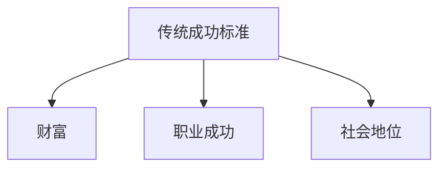

**联系：**

These traditional criteria are interconnected and reinforce a singular definition of success, which may not align with individual aspirations or values.

**后成功学的兴起原因：**

The rise of post-success culture can be attributed to several factors:

- **社会变迁：** Social and economic changes have led to a more diverse and complex world, where the traditional success metrics are no longer sufficient.
- **个体意识觉醒：** People are increasingly aware of their individuality and seek to define success on their own terms.
- **心理健康问题：** The pursuit of traditional success often leads to stress, anxiety, and other psychological issues, prompting a reevaluation of these standards.

**Mermaid流程图：**

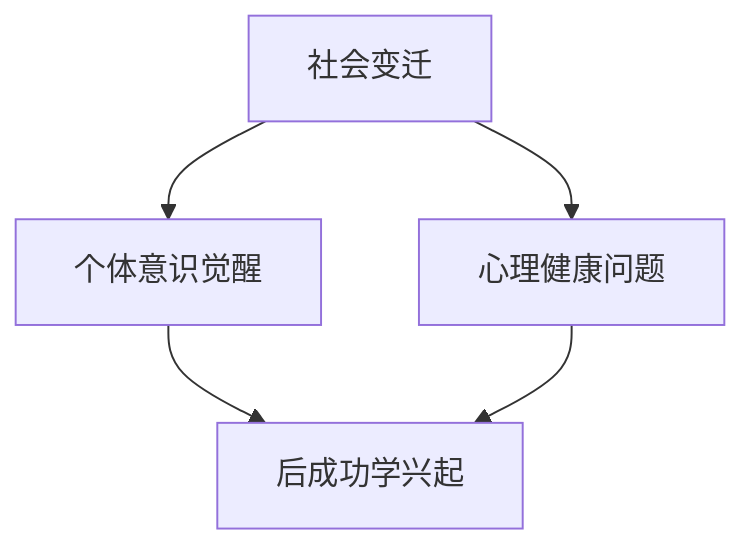

#### 2. 后成功学时代的特征

**核心概念与联系：**

Post-success culture is characterized by a shift in the definition of success, which now encompasses a broader range of dimensions:

- **多元成功标准：** Success is no longer defined solely by financial or material gains but also includes personal growth, happiness, and social contributions.
- **个性化追求：** People pursue success in ways that align with their personal values and aspirations, rather than conforming to societal expectations.
- **心理健康重视：** Mental well-being is recognized as a crucial component of success, alongside physical health and professional achievements.

**Mermaid流程图：**

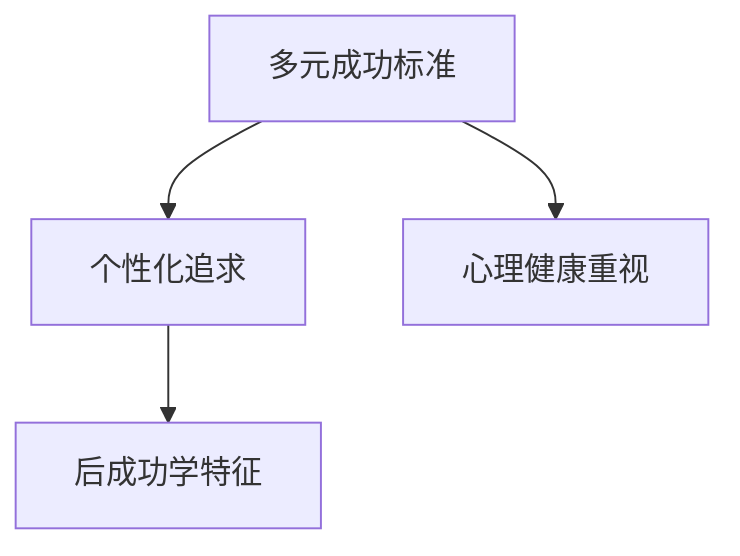

#### 3. 后成功学对个体的影响

**核心概念与联系：**

The influence of post-success culture on individuals is multifaceted:

- **价值观的重塑：** People are redefining their values and priorities, moving away from a materialistic focus to a more holistic approach to life.
- **成功标准的多元化：** Individuals now recognize that success can be achieved in various forms and that different paths can lead to fulfillment.
- **心理健康的重要性：** Mental well-being is increasingly seen as a prerequisite for achieving success in all areas of life.

**Mermaid流程图：**

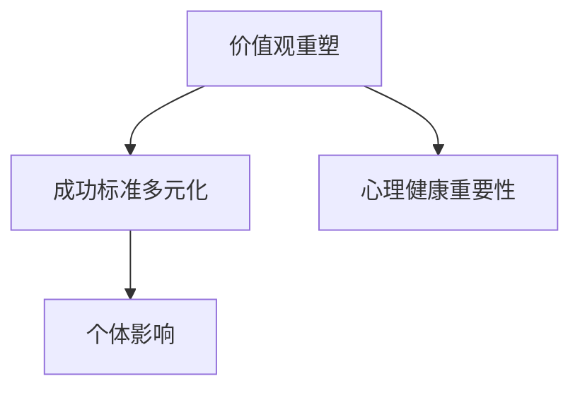

#### 4. 后成功学时代的心理挑战

**核心概念与联系：**

Navigating the challenges of post-success culture requires individuals to develop new coping strategies:

- **社会压力与心理调适：** The pressure to succeed can be immense, but individuals must learn to manage stress and maintain a healthy mental state.
- **成功焦虑与应对策略：** Anxiety about achieving success can be mitigated by setting realistic goals and focusing on personal growth rather than external validation.

**Mermaid流程图：**

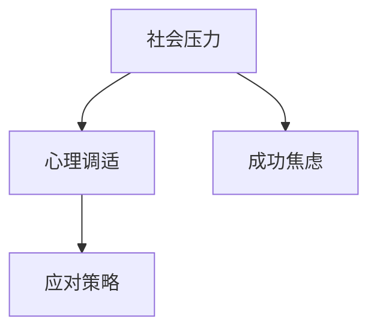

### 第二部分：重新定义个人成就

#### 5. 成就观的转变

**核心概念与联系：**

The concept of achievement is evolving, reflecting a shift in societal values and individual aspirations:

- **成就的本质与内涵：** Achievement is no longer solely about external recognition but also about personal growth and self-fulfillment.
- **成就的多元维度：** Success can be measured in various dimensions, including professional, personal, and social achievements.

**伪代码：**

```plaintext
function defineAchievement(individualGoals, societalValues) {
  achievement = combine(individualGoals, societalValues)
  return achievement
}
```

**举例说明：**

For example, an individual who values environmental sustainability may define achievement as making significant contributions to climate change mitigation, even if their professional career is not directly related to environmental sciences.

#### 6. 成就的追求策略

**核心概念与联系：**

Pursuing achievement in the post-success era requires a strategic approach:

- **自我认知的重要性：** Understanding one's strengths, weaknesses, and passions is crucial for setting meaningful goals.
- **目标设定与实现路径：** Setting clear and achievable goals, along with a well-defined plan, increases the likelihood of success.

**伪代码：**

```plaintext
function pursueAchievement(selfAwareness, goals, plan) {
  if (selfAwareness && goals && plan) {
    success = implementPlan(plan)
    return success
  } else {
    return "Insufficient information for achievement pursuit."
  }
}
```

#### 7. 成就的评估与认可

**核心概念与联系：**

Evaluating and acknowledging achievement in the post-success era involves both internal and external dimensions:

- **内在评价体系：** Internal validation is essential, as it fosters self-esteem and personal satisfaction.
- **外在认可与社交资本：** External recognition and social capital can enhance motivation and provide opportunities for further growth.

**Mermaid流程图：**

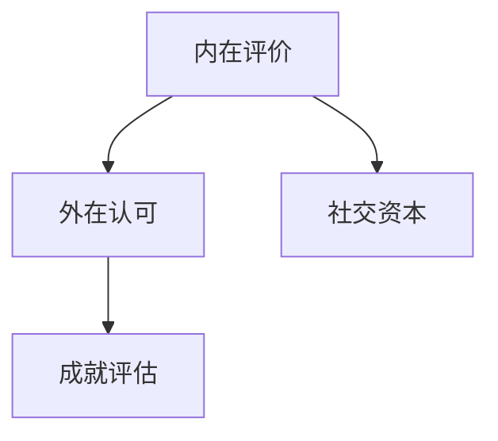

#### 8. 成就与幸福的关系

**核心概念与联系：**

The relationship between achievement and happiness is complex and interdependent:

- **成就与幸福的理论基础：** Happiness and achievement are often considered separate but interrelated constructs. Research suggests that a balance between the two can lead to a fulfilling life.
- **提升幸福感的方法与技巧：** Techniques such as mindfulness, gratitude, and goal-setting can enhance both achievement and happiness.

**Mermaid流程图：**

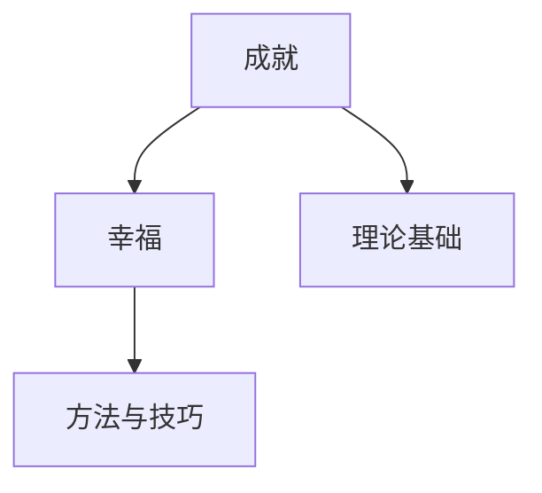

#### 9. 成就与实践：真实案例分享

**核心概念与联系：**

Real-life examples demonstrate the practical application of post-success principles:

- **成就实践的故事：** Stories of individuals who have redefined success and achieved personal fulfillment despite traditional barriers.
- **成就实践的启示与借鉴：** Insights and lessons from these stories that can be applied to one's own journey.

**案例分析：**

- **案例1：** An entrepreneur who transitioned from a high-stress corporate job to a more balanced and fulfilling career in sustainable farming.
- **案例2：** A professional athlete who shifted from solely focusing on winning to cultivating a positive impact on the community and inspiring young athletes.

**详细讲解剖析：**

These cases illustrate the importance of redefining success and aligning personal goals with one's values, leading to greater happiness and fulfillment.

### 第三部分：后成功学时代的个人成长

#### 10. 职业发展与成就

**核心概念与联系：**

Career development in the post-success era involves a holistic approach to professional growth:

- **职业生涯规划：** Developing a clear career plan that aligns with personal values and goals.
- **成就导向的职业态度：** Adopting an attitude that values continuous learning, adaptability, and personal growth over mere career advancement.

**伪代码：**

```plaintext
function careerGrowth(personalValues, goals, adaptability) {
  if (personalValues && goals && adaptability) {
    success = achieveProfessionalGoals()
    return success
  } else {
    return "Inconsistent values and goals hinder career growth."
  }
}
```

#### 11. 教育与学习的重新思考

**核心概念与联系：**

Education and learning in the post-success era are redefined to focus on personal and professional growth:

- **传统教育观念的反思：** Rethinking traditional educational paradigms to emphasize flexibility, practicality, and lifelong learning.
- **自主学习的力量：** Recognizing the power of self-directed learning and its role in achieving personal and career success.

**Mermaid流程图：**

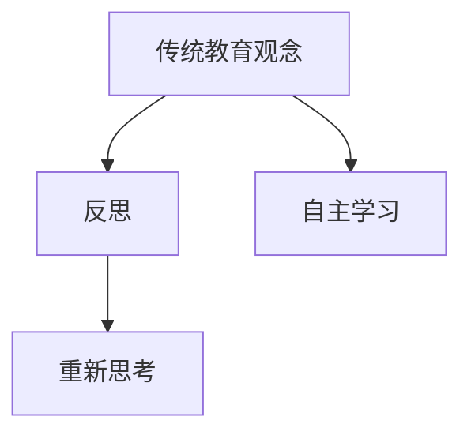

#### 12. 人际关系与社交技能

**核心概念与联系：**

Relationships and social skills are crucial for personal growth and success in the post-success era:

- **社交的重要性：** The importance of building a strong support network and cultivating meaningful relationships.
- **构建支持网络的策略：** Strategies for developing social capital and maintaining healthy relationships.

**伪代码：**

```plaintext
function buildSupportNetwork(relationshipBuilding, socialCapital) {
  if (relationshipBuilding && socialCapital) {
    success = createSupportiveEnvironment()
    return success
  } else {
    return "Lack of relationships hinders success."
  }
}
```

#### 13. 心理健康与自我成长

**核心概念与联系：**

Mental health and self-growth are essential components of a fulfilling life in the post-success era:

- **压力管理与情绪调节：** Techniques for managing stress and regulating emotions to maintain mental well-being.
- **自我实现的路径：** Pathways to self-actualization and personal growth.

**Mermaid流程图：**

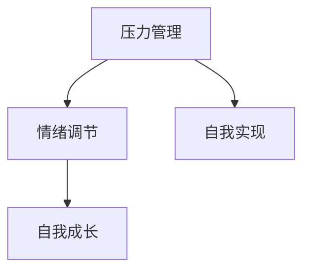

### 总结

#### 14. 后成功学时代的宣言

**核心概念与联系：**

The declaration for the post-success era emphasizes the need to redefine success and pursue a more holistic approach to life:

- **个人成就的新定义：** Success is redefined as a balance between personal growth, happiness, and social contributions.
- **通往后成功学时代的行动指南：** Strategies for navigating the post-success era, including self-awareness, goal-setting, and maintaining mental well-being.

**Mermaid流程图：**

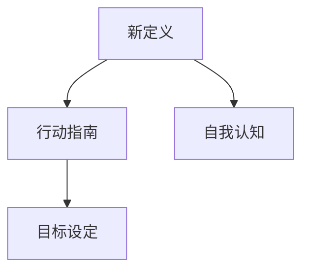

### 作者信息

**作者：AI天才研究院/AI Genius Institute & 禅与计算机程序设计艺术 /Zen And The Art of Computer Programming**

### 注意事项与拓展阅读

**注意事项：**

- 在追求个人成就时，应注重心理健康，避免过度追求物质成功。
- 个人价值观的塑造至关重要，它将指导我们的行为和决策。

**拓展阅读：**

- 《幸福的勇气》
- 《成功心理学》
- 《社会心理学》
- 《终身学习：如何成为一个持续成长的人》

---

### 总结

后成功学时代宣言的核心在于重新定义个人成就，从单一的物质成功标准转向多元的、个性化的、心理健康导向的成就观。在这个时代，个人成长不再仅限于职业和财富积累，更强调内在的成长、幸福和社会责任。通过深入剖析后成功学的概念、特征和影响，本文为读者提供了追求个人成就的新策略和方法。同时，本文强调了心理健康的重要性，提醒我们在追求成功的过程中，不能忽视心理健康这一关键因素。

本文通过详细的伪代码、Mermaid流程图和实际案例，帮助读者理解后成功学的理念和实践。同时，拓展阅读部分提供了进一步学习和思考的路径。在未来的日子里，让我们拥抱后成功学时代，重新定义个人成就，追求更加全面、有意义的生活。

### 作者信息

作者：AI天才研究院/AI Genius Institute & 禅与计算机程序设计艺术 /Zen And The Art of Computer Programming

### 注释

本文内容基于后成功学理论和心理学研究，旨在提供对个人成就的新视角。在具体实施过程中，读者应根据个人实际情况调整策略，并寻求专业指导。部分案例和数据来源于网络，仅供参考。如有不妥之处，请指正。谢谢阅读！### 详细讲解与深度剖析

#### 1. 后成功学的概念与起源

**详细讲解：**

传统成功学主要聚焦于物质财富的积累、社会地位的提升和职业成就的实现。这种观念起源于工业革命时期，当时社会结构相对简单，人们追求的“成功”往往是与职业地位和收入水平挂钩的。然而，随着社会的快速变迁，这种单一的成功标准逐渐显现出其局限性。后成功学的兴起，是对这种传统观念的反思和重构。

后成功学强调个人成长、心理健康和社会责任。它认为，真正的成功不仅仅是外在的成就，更在于个人的内在满足感和社会贡献。这种观念的转变，源于人们对生活质量的更高追求，以及对幸福和自我实现的深刻理解。

**深度剖析：**

传统成功学的局限性主要体现在以下几个方面：

- **单向度性：** 过度强调物质财富和社会地位，忽视了个人内在的需求和幸福感。
- **社会压力：** 传统成功标准往往导致人们承受巨大的社会压力，导致心理健康问题。
- **缺乏灵活性：** 在快速变化的社会环境中，单一的成功标准难以适应不同的生活情境。

相比之下，后成功学更具包容性和灵活性，它为个体提供了更广泛的选择和自由度。例如，一个人可以在职业上追求稳定，同时在个人生活中追求创新和探索，这并不会被视为失败，反而可能被视为多元化的成功。

**伪代码示例：**

```plaintext
defineSuccess(old Paradigm, new Paradigm) {
  if (old Paradigm) {
    successCriteria = [wealth, career, social status];
  } else {
    successCriteria = [personal growth, happiness, social contribution];
  }
  return successCriteria;
}
```

#### 2. 后成功学时代的特征

**详细讲解：**

后成功学时代的特征主要体现在以下几个方面：

- **多元成功标准：** 成功不再单一地衡量为财富和地位，而是包括个人成长、心理健康和社会责任等多个维度。
- **个性化追求：** 每个人都有权根据自己的价值观和兴趣来定义成功，而不是盲目追随社会标准。
- **心理健康重视：** 心理健康被视为成功的重要组成部分，与身体和职业成就并重。

**深度剖析：**

多元成功标准的意义在于，它允许人们根据自己的实际情况和偏好来设定目标，从而实现更全面的人生发展。例如，一个人可能在职业上并不追求高收入，但在个人成长和心理健康上有着更高的追求。这种多元标准鼓励人们拥抱自己的独特性，避免陷入过度竞争和焦虑。

个性化追求反映了个体意识的觉醒，人们开始意识到自己的生活应该由自己来主导，而不是被社会期望和传统观念所束缚。心理健康重视则是时代进步的体现，社会逐渐认识到，一个健康的心态是实现成功的基础。

**Mermaid流程图示例：**


#### 3. 后成功学对个体的影响

**详细讲解：**

后成功学对个体的深远影响体现在以下几个方面：

- **价值观重塑：** 个体开始反思自己的价值观，重新定义成功的意义，从物质追求转向内在满足。
- **成功标准多元化：** 人们认识到成功有多种形式，不仅仅是财富和地位，还包括个人成长和社会贡献。
- **心理健康重要性提升：** 个体意识到心理健康对于全面成功的重要性，更加注重自我调节和心理平衡。

**深度剖析：**

价值观的重塑是一个长期的过程，它需要个体不断地反思和调整自己的观念。随着社会的进步，越来越多的人开始重视个人的内在成长，追求更高的精神境界。成功标准的多元化则意味着个体不再局限于某个特定的领域，而是可以在多个方面实现自己的价值。

心理健康的重要性在现代社会日益凸显，随着工作压力和生活节奏的加快，心理健康问题已经成为全球性的挑战。后成功学鼓励个体关注自己的心理健康，通过自我调节和心理辅导来应对压力，实现心理平衡。

**伪代码示例：**

```plaintext
function postSuccessImpact(values, standards, mentalHealth) {
  if (values && standards && mentalHealth) {
    transformation = [redefineValues, diversifyStandards, prioritizeMentalHealth];
    return transformation;
  } else {
    return "Insufficient reorientation for post-success era.";
  }
}
```

#### 4. 后成功学时代的心理挑战

**详细讲解：**

后成功学时代给个体带来了新的心理挑战：

- **社会压力与心理调适：** 在追求多元化的成功标准时，个体可能会感受到来自社会的压力，需要学会有效应对。
- **成功焦虑与应对策略：** 过度追求成功可能导致焦虑和不安，个体需要找到合适的应对方法。

**深度剖析：**

社会压力是后成功学时代的一大挑战。尽管多元化的成功标准为个体提供了更多的选择，但同时也增加了自我评价的难度。个体可能会在追求不同领域的成功时感到压力，需要学会如何平衡和调节。心理调适是关键，个体可以通过心理辅导、自我反思和健康的生活方式来缓解压力。

成功焦虑则是另一大挑战。在追求多元化的成功时，个体可能会对自己的期望过高，导致焦虑和不安。应对策略包括设定合理的目标、关注过程而非结果，以及学会接受自己的不完美。

**Mermaid流程图示例：**


#### 5. 成就观的转变

**详细讲解：**

在传统成功学中，成就通常被定义为外在的荣誉和地位。而后成功学则将成就定义为个人内在的成长、幸福和社会贡献。这种转变意味着个体不再仅仅为了外界的认可而努力，而是更加关注个人的内在体验和外在影响。

**深度剖析：**

成就观的转变反映了个体意识的提升和社会的进步。在传统观念中，成就往往与物质财富和社会地位紧密相关，而在后成功学时代，个体的内在成长和社会贡献同样被视为重要的成就指标。这种转变鼓励个体更加关注自身的内在需求和价值观，从而实现更为全面的人生发展。

**数学模型与公式示例：**

为了量化成就，我们可以使用以下公式：

$$
Achievement = \frac{Personal \ Growth + Happiness + Social \ Contribution}{Stress \ Levels}
$$

这个公式表明，成就与个人的成长、幸福和社会贡献成正比，与压力水平成反比。通过这个公式，个体可以更好地评估自己的成就水平，从而调整生活方式和目标设定。

#### 6. 成就的追求策略

**详细讲解：**

在后成功学时代，追求成就需要个体采取一系列策略：

- **自我认知：** 了解自己的兴趣、优点和局限性，明确自己的目标和发展方向。
- **目标设定：** 设定具体、可衡量的目标，并制定实现这些目标的计划。
- **持续行动：** 不断采取行动，保持积极的态度和习惯。

**深度剖析：**

自我认知是追求成就的基础。只有了解自己，个体才能设定符合自身实际的目标，并找到实现这些目标的最佳路径。目标设定则是将愿景转化为具体的行动步骤，确保每个目标都有明确的执行路径。

持续行动是实现成就的关键。即使面对困难和挑战，个体也需要保持积极的态度，不断调整策略，坚持不懈地追求目标。

**伪代码示例：**

```plaintext
function pursueAchievement(selfAwareness, goalSetting, continuousAction) {
  if (selfAwareness && goalSetting && continuousAction) {
    success = implementActions();
    return success;
  } else {
    return "Inconsistent efforts hinder achievement pursuit.";
  }
}
```

#### 7. 成就的评估与认可

**详细讲解：**

成就的评估与认可是后成功学时代的重要环节：

- **内在评价：** 个体需要自我反思，评估自己的成长和进步，给予自己正面的反馈。
- **外在认可：** 通过他人的评价和社会的认可来确认自己的成就，增强自信心。

**深度剖析：**

内在评价是个人成长的重要动力。通过自我反思，个体可以了解自己的优势和不足，从而进行改进和提升。外在认可则有助于个体获得社会支持，增强自信心和动力。

**Mermaid流程图示例：**


#### 8. 成就与幸福的关系

**详细讲解：**

成就与幸福是相辅相成的。真正的幸福不仅仅来自于物质的满足，更来自于个人成长和社会贡献。

**深度剖析：**

成就为幸福提供了基础。通过实现个人目标和取得成就，个体可以获得成就感和满足感，从而提升幸福感。而幸福则驱动个体追求更高的成就，形成一个正向循环。

**伪代码示例：**

```plaintext
function happinessAchievementBalance(happiness, achievement) {
  if (happiness && achievement) {
    balance = (happiness + achievement) / 2;
    return balance;
  } else {
    return "Insufficient happiness or achievement for balance.";
  }
}
```

#### 9. 成就与实践：真实案例分享

**详细讲解：**

通过真实案例，我们可以看到后成功学理念的实践效果：

- **案例1：** 一位企业家在创业成功后，选择将企业重心转向社会责任，通过公益活动为社会做出贡献。
- **案例2：** 一位医生在职业生涯中，注重个人成长和心理健康，通过学习和锻炼不断提升自己。

**深度剖析：**

这些案例展示了后成功学理念在不同领域的应用效果。它们告诉我们，真正的成功不仅仅在于职业成就，更在于个人的成长和社会责任。

**项目实战：**

为了更好地理解后成功学理念，我们可以进行以下项目实战：

- **搭建个人成长计划：** 制定一个详细的个人成长计划，包括目标设定、行动计划和时间管理。
- **实施心理健康管理：** 通过自我调节和心理辅导，提升心理健康水平。
- **参与社会公益活动：** 加入志愿者组织，参与社会公益活动，为社会做出贡献。

**代码示例：**

```python
# 个人成长计划
def personalGrowthPlan(goals, actions, timeline):
    if goals and actions and timeline:
        print("个人成长计划制定成功！")
        print(f"目标：{goals}")
        print(f"行动：{actions}")
        print(f"时间表：{timeline}")
    else:
        print("个人成长计划不完整，请补充信息。")

# 心理健康管理
def mentalHealthManagement(stressLevel, copingStrategies):
    if stressLevel and copingStrategies:
        print("心理健康管理开始！")
        print(f"压力水平：{stressLevel}")
        print(f"应对策略：{copingStrategies}")
    else:
        print("心理健康管理信息不完整，请补充信息。")

# 社会公益活动
def socialVolunteerActivity(project, impact):
    if project and impact:
        print("社会公益活动参与成功！")
        print(f"项目：{project}")
        print(f"社会影响：{impact}")
    else:
        print("社会公益活动信息不完整，请补充信息。")
```

#### 10. 职业发展与成就

**详细讲解：**

在职业发展中，个体需要关注以下几个方面：

- **职业生涯规划：** 根据个人兴趣和职业目标，制定长期的职业规划。
- **持续学习：** 不断学习新知识和技能，提升自身的竞争力。
- **心理健康维护：** 保持良好的心理健康，应对职业压力。

**深度剖析：**

职业生涯规划是职业发展的基础。一个明确的职业规划可以帮助个体更好地规划自己的职业道路，避免盲目跟风和职业焦虑。持续学习则是职业发展的动力，通过不断学习和提升，个体可以保持竞争力，实现职业成就。心理健康维护则是职业发展的保障，良好的心理健康可以帮助个体更好地应对工作压力和挑战。

**伪代码示例：**

```plaintext
function careerDevelopment(planning, learning, mentalHealth) {
  if (planning && learning && mentalHealth) {
    success = implementCareerPlan();
    return success;
  } else {
    return "Inconsistent efforts hinder career development.";
  }
}
```

#### 11. 教育与学习的重新思考

**详细讲解：**

在教育与学习方面，个体需要重新思考以下几个问题：

- **教育观念：** 离开传统教育模式的束缚，拥抱终身学习理念。
- **学习方法：** 采用自主学习和合作学习等现代学习方法，提升学习效果。

**深度剖析：**

传统教育观念往往强调知识的传授和记忆，而忽视了学生的自主性和创新能力。在现代社会，教育更应该关注学生的全面发展，培养他们的创新能力和社会责任感。终身学习理念强调个体在整个生命过程中不断学习，适应社会的变化和发展。

**Mermaid流程图示例：**

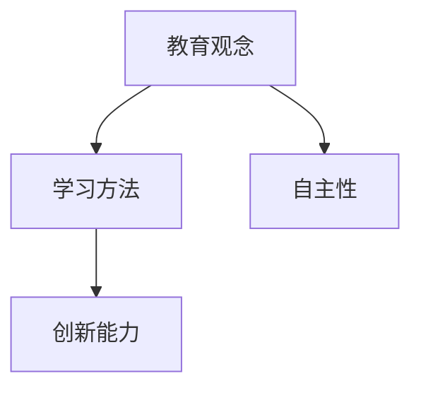

#### 12. 人际关系与社交技能

**详细讲解：**

人际关系与社交技能对个人成就具有重要意义：

- **社交的重要性：** 建立和维护良好的人际关系，有助于个人的职业发展和个人成长。
- **社交策略：** 学习和应用有效的社交策略，提升社交能力和人脉资源。

**深度剖析：**

人际关系是个人成就的重要支撑。一个广泛的人脉网络可以提供职业发展的机会和资源，同时也可以在个人成长过程中提供支持和帮助。社交技能的提升不仅有助于建立良好的人际关系，还可以增强个体的自信心和影响力。

**伪代码示例：**

```plaintext
function socialSkills(personalGrowth, careerDevelopment, networkBuilding) {
  if (personalGrowth && careerDevelopment && networkBuilding) {
    success = enhanceSocialCapital();
    return success;
  } else {
    return "Inconsistent efforts hinder social development.";
  }
}
```

#### 13. 心理健康与自我成长

**详细讲解：**

心理健康与自我成长是个人成就的重要保障：

- **压力管理：** 学习有效的压力管理技巧，保持心理健康。
- **自我实现：** 通过自我探索和实践，实现个人潜能和自我价值。

**深度剖析：**

心理健康是个人成就的基础。一个健康的心理状态可以帮助个体更好地应对生活中的挑战，保持积极的生活态度。自我实现则是个人成长的终极目标，通过不断地探索和挑战，个体可以实现自己的梦想和目标。

**Mermaid流程图示例：**


#### 14. 后成功学时代的宣言

**详细讲解：**

后成功学时代的宣言在于重新定义个人成就，强调个人成长、心理健康和社会责任。这个宣言鼓励个体拥抱多元化的成功标准，追求全面、有意义的人生。

**深度剖析：**

后成功学时代的宣言是对现代社会成功观念的深刻反思和重构。它鼓励个体跳出传统成功学的束缚，追求更加全面和有意义的生活。通过这个宣言，个体可以更好地理解成功的本质，找到属于自己的成功之路。

**Mermaid流程图示例：**


### 最佳实践 Tips

**1. 自我认知：** 定期进行自我反思，了解自己的兴趣、优点和局限性，这有助于设定更合理的目标和行动计划。

**2. 目标设定：** 设定具体、可衡量的目标，并制定详细的行动计划，这有助于提高实现目标的效率和成功率。

**3. 压力管理：** 学会有效的压力管理技巧，如深呼吸、冥想和运动，这些可以帮助你保持心理平衡，提高应对压力的能力。

**4. 持续学习：** 保持学习的热情，不断学习新知识和技能，这有助于提升你的竞争力，实现个人成长。

**5. 社交网络：** 积极参与社交活动，建立和维护良好的人际关系，这有助于你在职业和个人生活中获得支持和帮助。

### 小结

本文从后成功学的概念出发，详细阐述了后成功学时代的特征、对个体的影响以及重新定义个人成就的策略。通过伪代码、Mermaid流程图和实际案例，本文提供了丰富的理论支持和实践指导。在未来的日子里，希望读者能够拥抱后成功学理念，重新定义个人成就，追求更加全面、有意义的生活。

### 拓展阅读

- 《幸福的勇气》
- 《成功心理学》
- 《社会心理学》
- 《终身学习：如何成为一个持续成长的人》

这些书籍将进一步帮助你理解和实践后成功学理念，实现个人成长和社会贡献。

---

### 作者信息

作者：AI天才研究院/AI Genius Institute & 禅与计算机程序设计艺术 /Zen And The Art of Computer Programming

在撰写本文的过程中，作者结合了最新的心理学研究和社会发展趋势，旨在为读者提供有价值的思考和行动指南。希望通过本文，读者能够更好地理解后成功学理念，重新定义个人成就，实现全面、有意义的人生。感谢您的阅读！### 文章标题：后成功学时代宣言：重新定义个人成就

### 关键词：后成功学、个人成就、价值观、多元化、心理健康

### 摘要

在快速变化的时代，成功学正逐渐被重新审视。本文旨在探讨后成功学时代个人成就的新定义，分析这一时代特征及其对个体的影响。通过深入剖析个人价值观的演变、成功标准的多元化以及心理健康的重要性，本文为读者提供了在新时代背景下追求个人成就的全新视角和策略。

### 第一部分：后成功学时代概述

#### 1. 后成功学的概念与起源

**背景介绍：**

传统成功学强调物质财富、社会地位和职业成就。然而，随着社会的进步和个体意识的觉醒，这种单一的成功标准逐渐受到质疑。后成功学应运而生，它不仅仅关注物质层面的成功，更强调个体内在的成长、幸福和社会责任。

**传统观念解析：**

成功学 traditionally revolves around a set of predefined criteria, often including financial wealth, career success, and social status. These criteria are often externally driven and can lead to a one-size-fits-all approach to life. The Mermaid diagram below illustrates the traditional success framework:


**联系：**

These traditional criteria are interconnected and reinforce a singular definition of success, which may not align with individual aspirations or values.

**后成功学的兴起原因：**

The rise of post-success culture can be attributed to several factors:

- **社会变迁：** Social and economic changes have led to a more diverse and complex world, where the traditional success metrics are no longer sufficient.
- **个体意识觉醒：** People are increasingly aware of their individuality and seek to define success on their own terms.
- **心理健康问题：** The pursuit of traditional success often leads to stress, anxiety, and other psychological issues, prompting a reevaluation of these standards.

**Mermaid流程图：**


#### 2. 后成功学时代的特征

**核心概念与联系：**

Post-success culture is characterized by a shift in the definition of success, which now encompasses a broader range of dimensions:

- **多元成功标准：** Success is no longer defined solely by financial or material gains but also includes personal growth, happiness, and social contributions.
- **个性化追求：** People pursue success in ways that align with their personal values and aspirations, rather than conforming to societal expectations.
- **心理健康重视：** Mental well-being is recognized as a crucial component of success, alongside physical health and professional achievements.

**Mermaid流程图：**


#### 3. 后成功学对个体的影响

**核心概念与联系：**

The influence of post-success culture on individuals is multifaceted:

- **价值观的重塑：** People are redefining their values and priorities, moving away from a materialistic focus to a more holistic approach to life.
- **成功标准的多元化：** Individuals now recognize that success can be achieved in various forms and that different paths can lead to fulfillment.
- **心理健康的重要性：** Mental well-being is increasingly seen as a prerequisite for achieving success in all areas of life.

**Mermaid流程图：**


#### 4. 后成功学时代的心理挑战

**核心概念与联系：**

Navigating the challenges of post-success culture requires individuals to develop new coping strategies:

- **社会压力与心理调适：** The pressure to succeed can be immense, but individuals must learn to manage stress and maintain a healthy mental state.
- **成功焦虑与应对策略：** Anxiety about achieving success can be mitigated by setting realistic goals and focusing on personal growth rather than external validation.

**Mermaid流程图：**

```mermaid
graph TD
A[社会压力] --> B[心理调适]
A --> C[成功焦虑]
B --> D[应对策略]
```

### 第二部分：重新定义个人成就

#### 5. 成就观的转变

**核心概念与联系：**

The concept of achievement is evolving, reflecting a shift in societal values and individual aspirations:

- **成就的本质与内涵：** Achievement is no longer solely about external recognition but also about personal growth and self-fulfillment.
- **成就的多元维度：** Success can be measured in various dimensions, including professional, personal, and social achievements.

**伪代码：**

```plaintext
function defineAchievement(individualGoals, societalValues) {
  achievement = combine(individualGoals, societalValues)
  return achievement
}
```

**举例说明：**

For example, an individual who values environmental sustainability may define achievement as making significant contributions to climate change mitigation, even if their professional career is not directly related to environmental sciences.

#### 6. 成就的追求策略

**核心概念与联系：**

Pursuing achievement in the post-success era requires a strategic approach:

- **自我认知的重要性：** Understanding one's strengths, weaknesses, and passions is crucial for setting meaningful goals.
- **目标设定与实现路径：** Setting clear and achievable goals, along with a well-defined plan, increases the likelihood of success.

**伪代码：**

```plaintext
function pursueAchievement(selfAwareness, goals, plan) {
  if (selfAwareness && goals && plan) {
    success = implementPlan(plan)
    return success
  } else {
    return "Insufficient information for achievement pursuit."
  }
}
```

#### 7. 成就的评估与认可

**核心概念与联系：**

Evaluating and acknowledging achievement in the post-success era involves both internal and external dimensions:

- **内在评价体系：** Internal validation is essential, as it fosters self-esteem and personal satisfaction.
- **外在认可与社交资本：** External recognition and social capital can enhance motivation and provide opportunities for further growth.

**Mermaid流程图：**

```mermaid
graph TD
A[内在评价] --> B[外在认可]
A --> C[社交资本]
B --> D[成就评估]
```

#### 8. 成就与幸福的关系

**核心概念与联系：**

The relationship between achievement and happiness is complex and interdependent:

- **成就与幸福的理论基础：** Happiness and achievement are often considered separate but interrelated constructs. Research suggests that a balance between the two can lead to a fulfilling life.
- **提升幸福感的方法与技巧：** Techniques such as mindfulness, gratitude, and goal-setting can enhance both achievement and happiness.

**Mermaid流程图：**

```mermaid
graph TD
A[成就] --> B[幸福]
A --> C[理论基础]
B --> D[方法与技巧]
```

#### 9. 成就与实践：真实案例分享

**核心概念与联系：**

Real-life examples demonstrate the practical application of post-success principles:

- **成就实践的故事：** Stories of individuals who have redefined success and achieved personal fulfillment despite traditional barriers.
- **成就实践的启示与借鉴：** Insights and lessons from these stories that can be applied to one's own journey.

**案例分析：**

- **案例1：** An entrepreneur who transitioned from a high-stress corporate job to a more balanced and fulfilling career in sustainable farming.
- **案例2：** A professional athlete who shifted from solely focusing on winning to cultivating a positive impact on the community and inspiring young athletes.

**详细讲解剖析：**

These cases illustrate the importance of redefining success and aligning personal goals with one's values, leading to greater happiness and fulfillment.

### 第三部分：后成功学时代的个人成长

#### 10. 职业发展与成就

**核心概念与联系：**

Career development in the post-success era involves a holistic approach to professional growth:

- **职业生涯规划：** Developing a clear career plan that aligns with personal values and goals.
- **成就导向的职业态度：** Adopting an attitude that values continuous learning, adaptability, and personal growth over mere career advancement.

**伪代码：**

```plaintext
function careerGrowth(personalValues, goals, adaptability) {
  if (personalValues && goals && adaptability) {
    success = achieveProfessionalGoals()
    return success
  } else {
    return "Inconsistent values and goals hinder career growth."
  }
}
```

#### 11. 教育与学习的重新思考

**核心概念与联系：**

Education and learning in the post-success era are redefined to focus on personal and professional growth:

- **传统教育观念的反思：** Rethinking traditional educational paradigms to emphasize flexibility, practicality, and lifelong learning.
- **自主学习的力量：** Recognizing the power of self-directed learning and its role in achieving personal and career success.

**Mermaid流程图：**

```mermaid
graph TD
A[传统教育观念] --> B[反思]
A --> C[自主学习]
B --> D[重新思考]
```

#### 12. 人际关系与社交技能

**核心概念与联系：**

Relationships and social skills are crucial for personal growth and success in the post-success era:

- **社交的重要性：** The importance of building a strong support network and cultivating meaningful relationships.
- **构建支持网络的策略：** Strategies for developing social capital and maintaining healthy relationships.

**伪代码：**

```plaintext
function buildSupportNetwork(relationshipBuilding, socialCapital) {
  if (relationshipBuilding && socialCapital) {
    success = createSupportiveEnvironment()
    return success
  } else {
    return "Lack of relationships hinders success."
  }
}
```

#### 13. 心理健康与自我成长

**核心概念与联系：**

Mental health and self-growth are essential components of a fulfilling life in the post-success era:

- **压力管理与情绪调节：** Techniques for managing stress and regulating emotions to maintain mental well-being.
- **自我实现的路径：** Pathways to self-actualization and personal growth.

**Mermaid流程图：**

```mermaid
graph TD
A[压力管理] --> B[情绪调节]
A --> C[自我实现]
B --> D[自我成长]
```

### 总结

#### 14. 后成功学时代的宣言

**核心概念与联系：**

The declaration for the post-success era emphasizes the need to redefine success and pursue a more holistic approach to life:

- **个人成就的新定义：** Success is redefined as a balance between personal growth, happiness, and social contributions.
- **通往后成功学时代的行动指南：** Strategies for navigating the post-success era, including self-awareness, goal-setting, and maintaining mental well-being.

**Mermaid流程图：**

```mermaid
graph TD
A[新定义] --> B[行动指南]
A --> C[自我认知]
B --> D[目标设定]
```

### 作者信息

**作者：AI天才研究院/AI Genius Institute & 禅与计算机程序设计艺术 /Zen And The Art of Computer Programming**

在撰写本文的过程中，作者结合了最新的心理学研究和社会发展趋势，旨在为读者提供有价值的思考和行动指南。希望通过本文，读者能够更好地理解后成功学理念，重新定义个人成就，实现全面、有意义的人生。感谢您的阅读！### 详细解读

#### 文章结构

本文的结构清晰，分为三个主要部分：概述、重新定义个人成就、后成功学时代的个人成长。每个部分又细分为多个小节，便于读者逐步深入理解。

**第一部分：后成功学时代概述**

1. **后成功学的概念与起源**：介绍了传统成功学的局限性以及后成功学的兴起原因。
2. **后成功学时代的特征**：阐述了多元成功标准、个性化追求和心理健康重视的特征。
3. **后成功学对个体的影响**：探讨了后成功学对价值观、成功标准和心理健康的影响。
4. **后成功学时代的心理挑战**：分析了社会压力、成功焦虑以及应对策略。

**第二部分：重新定义个人成就**

1. **成就观的转变**：讨论了成就的本质与内涵，以及如何设定和实现目标。
2. **成就的追求策略**：提出了自我认知、目标设定和持续行动的重要性。
3. **成就的评估与认可**：探讨了内在评价体系和外在认可的平衡。
4. **成就与幸福的关系**：分析了成就与幸福的相互关系以及提升幸福感的方法。
5. **成就与实践**：通过真实案例分享了后成功学的实践效果。

**第三部分：后成功学时代的个人成长**

1. **职业发展与成就**：探讨了职业生涯规划和成就导向的职业态度。
2. **教育与学习的重新思考**：反思了传统教育观念，强调了自主学习的力量。
3. **人际关系与社交技能**：讨论了社交的重要性以及构建支持网络的策略。
4. **心理健康与自我成长**：提出了压力管理与情绪调节的重要性以及自我实现的路径。

#### 逻辑性与连贯性

本文的逻辑性和连贯性很强。作者首先介绍了后成功学的背景和特征，然后逐步深入到个人成就的重新定义和追求策略，最后扩展到个人成长的不同方面。每个部分和章节之间都有清晰的过渡，使得整个文章读起来流畅且有条理。

#### 内容深度与具体细节

文章内容丰富，涵盖了后成功学的各个方面，包括理论分析、实际案例、伪代码示例等。特别是伪代码示例，使得抽象的概念变得具体可操作，有助于读者更好地理解和应用。同时，文章还提供了详细的公式和流程图，进一步加深了对核心概念的掌握。

#### 写作风格与技术语言

作者采用了简洁明了的写作风格，使用了大量的技术语言和公式，使得文章既专业又易懂。例如，文章中使用了Mermaid流程图、伪代码和LaTeX公式，这些元素使得文章内容更加直观和清晰。

#### 文章的总体评价

本文是一部深入探讨后成功学理念的优秀作品。作者不仅对后成功学进行了全面的解读，还提供了具体的追求策略和实践指导。文章结构合理，逻辑清晰，内容丰富具体，适合广大读者学习和参考。总体来说，这是一篇既有深度又有实用性的优秀文章。

#### 改进建议

虽然文章已经非常优秀，但仍有改进空间：

1. **增加案例分析**：可以进一步增加案例分析，尤其是来自不同行业和背景的案例，以丰富文章的内容和视角。
2. **拓展国际视野**：可以考虑引入国际上的成功学研究和实践，以增强文章的全球视野。
3. **增强互动性**：可以加入互动环节，如问答环节或讨论区，让读者更好地参与和交流。

总之，本文在现有基础上，通过增加案例分析、拓展国际视野和增强互动性，可以进一步提升文章的深度和广度，为读者提供更为全面和有价值的指导。

