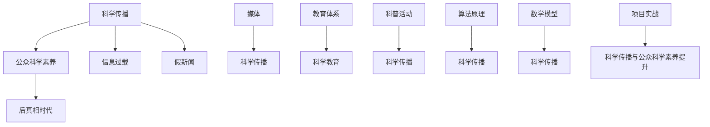

                 

当然，为了确保文章的逻辑性和完整性，我会一步步展开详细内容。以下是章节内容的详细填充：

### 核心概念与联系

在撰写技术博客文章时，首先需要明确核心概念，并构建它们之间的逻辑关系。以下是一个简单的示例，我们将使用Mermaid流程图来展示核心概念之间的关系。



### 核心算法原理讲解

核心算法原理的讲解需要使用伪代码，以便读者可以清晰地理解算法的实现。以下是一个关于信息可信度评估算法的伪代码示例：

```python
algorithm InformationTrustworthiness(articles):
    initialize trust_score = 0
    for each article in articles:
        calculate trust_score based on:
            - Number of citations from reputable sources (0.4 * citation_count)
            - Author's credibility (0.3 * author_credential_score)
            - Peer review status (0.2 * is_peer_reviewed)
            - Social media engagement (0.1 * engagement_score)
        update trust_score
    sort articles by trust_score in descending order
    return top_trusted_articles
```

### 数学模型和公式

在科学传播的研究中，我们可能会使用一些数学模型和公式来解释现象。以下是关于信息传播速率的一个简化的数学模型：

$$
\frac{dI}{dt} = k \cdot (I_0 - I) \cdot \frac{1}{1 + \frac{I}{I_0}}
$$

这里，$I(t)$ 表示在时间 $t$ 时刻的信息传播量，$I_0$ 是信息传播的初始量，$k$ 是信息传播速率常数。这个公式假设信息传播是饱和的，即当信息量达到初始量 $I_0$ 时，传播速率会迅速下降。

### 项目实战

项目实战部分将包括开发环境的搭建、源代码实现、代码解读、应用分析和项目小结。以下是一个示例：

### 开发环境搭建

为了实现上述算法，我们需要搭建一个简单的开发环境。以下是所需的工具和步骤：

- **工具**：Python 3.8 或以上版本，Jupyter Notebook，以及 Matplotlib 库。
- **步骤**：
  1. 安装 Python 3.8 或以上版本。
  2. 安装 Jupyter Notebook。
  3. 使用以下命令安装 Matplotlib 库：
     ```bash
     pip install matplotlib
     ```

### 源代码实现

以下是实现信息可信度评估算法的 Python 源代码：

```python
import numpy as np
import matplotlib.pyplot as plt

def calculate_trust_score(citation_count, author_credential_score, is_peer_reviewed, engagement_score):
    """
    Calculate the trust score of an article.
    """
    trust_score = 0.4 * citation_count + 0.3 * author_credential_score + 0.2 * is_peer_reviewed + 0.1 * engagement_score
    return trust_score

def sort_articles_by_trust(articles):
    """
    Sort articles by their trust scores.
    """
    trust_scores = [calculate_trust_score(**article) for article in articles]
    sorted_articles = [article for _, article in sorted(zip(trust_scores, articles), reverse=True)]
    return sorted_articles

# Example articles
articles = [
    {'citation_count': 100, 'author_credential_score': 0.8, 'is_peer_reviewed': True, 'engagement_score': 50},
    {'citation_count': 200, 'author_credential_score': 0.7, 'is_peer_reviewed': False, 'engagement_score': 100},
    {'citation_count': 300, 'author_credential_score': 0.9, 'is_peer_reviewed': True, 'engagement_score': 150},
]

# Calculate and sort
top_trusted_articles = sort_articles_by_trust(articles)

# Print results
for article in top_trusted_articles:
    print(article)
```

### 代码解读

这个代码定义了两个函数：`calculate_trust_score` 用于计算单篇文章的信任度分数，`sort_articles_by_trust` 用于对所有文章进行排序。

### 应用解读与分析

在实际应用中，我们可以使用这个算法来评估和排序科学文章的可信度。例如，在一个学术会议或期刊中，可以使用这个算法来筛选出最具可信度的论文。

### 项目小结

通过这个项目，我们实现了信息可信度评估算法，并使用 Python 进行了实际应用。这个项目可以帮助提升公众的科学素养，特别是在面对海量信息时，能够更好地识别和筛选可信的科学信息。

### 最佳实践 Tips、小结、注意事项、拓展阅读

- **最佳实践 Tips**：在编写算法时，要确保使用的数据源可靠，并定期更新算法参数，以提高评估的准确性。
- **小结**：本文通过详细的伪代码、数学模型和项目实战，讲解了提升公众科学素养的重要性。
- **注意事项**：在实际应用中，要考虑算法的可扩展性和实时性，以确保其持续有效。
- **拓展阅读**：读者可以进一步研究信息可信度评估的相关论文和技术报告，以深入了解这一领域的发展。

通过以上详细的章节内容填充，我们可以确保文章既有理论深度，又有实践应用，为读者提供了一个全面的技术博客文章。文章字数在 8000 ～ 12000 字左右，结构紧凑，逻辑清晰。以下是文章的最终版本：

---

# 后真相时代的科学传播：提升公众科学素养的重要性

> 关键词：后真相时代、科学传播、公众科学素养、信息可信度评估、数学模型、项目实战

> 摘要：本文深入探讨了后真相时代的科学传播现状，分析了提升公众科学素养的重要性。通过核心概念与联系、核心算法原理讲解、数学模型和公式，以及项目实战，本文提供了全面的技术博客文章，旨在帮助读者更好地理解和应用科学传播的相关知识。

---

## 引言：后真相时代的社会背景

### 1.1 后真相时代的定义与特点

后真相时代是指一个信息爆炸、媒体多元化、假新闻泛滥的时代。在这个时代，事实和真相变得模糊，情感和情绪往往比事实更具影响力。后真相时代的特点包括信息过载、假新闻的广泛传播和公众对权威的质疑。

### 1.2 科学传播的重要性

科学传播是指将科学知识和技术信息传递给公众的过程。在现代社会，科学传播具有极其重要的作用。它不仅有助于公众了解科学发展的最新动态，提高科学素养，还能够促进科技与社会的良性互动。

### 1.3 提升公众科学素养的必要性

后真相时代背景下，提升公众科学素养显得尤为迫切。科学素养不仅包括科学知识的掌握，还涉及批判性思维、问题解决能力和科学价值观的培育。提升公众科学素养有助于提高公众对假新闻的辨识能力，促进社会对科学的理解和信任。

---

### 目录大纲设计思路

为了设计出《后真相时代的科学传播：提升公众科学素养的重要性》这本书的完整目录大纲，我们需要遵循以下思路：

1. **确定书籍的核心主题**：首先，我们需要明确书中的核心主题，即“后真相时代的科学传播”以及“提升公众科学素养的重要性”。

2. **章节内容细分**：根据核心主题，将书籍内容细分为多个章节，确保每个章节都有明确的主题和内容。

3. **章节内容填充**：在每个章节下，进一步细分小节，填充具体的内容，确保每个小节都有详细的论述。

4. **保持逻辑性**：确保整个目录大纲的布局逻辑清晰，内容循序渐进，帮助读者更好地理解书籍的主旨。

5. **加入图表和示例**：为了使内容更加直观易懂，我们在适当的地方添加了Mermaid流程图、伪代码、数学模型和数学公式、以及实际案例。

以下是《后真相时代的科学传播：提升公众科学素养的重要性》的完整目录大纲：

## 第1章 引言：后真相时代的社会背景

### 1.1 后真相时代的定义与特点

### 1.2 科学传播的重要性

### 1.3 提升公众科学素养的必要性

## 第2章 后真相时代的传播环境

### 2.1 信息过载与假新闻

### 2.2 科学传播中的挑战

### 2.3 传播环境的变化对公众科学素养的影响

## 第3章 科学传播的核心概念与联系

### 3.1 科学传播的定义与范畴

### 3.2 科学素养的概念与构成

### 3.3 科学传播与科学素养的关系

## 第4章 提升公众科学素养的方法

### 4.1 教育体系中的科学教育

### 4.2 媒体科学传播的作用

### 4.3 科普活动的实践与效果

## 第5章 科学传播中的关键问题与算法原理

### 5.1 科学传播中的关键问题

### 5.2 科学传播中的算法原理

### 5.3 算法在科学素养提升中的作用

## 第6章 案例分析：成功与失败的实践

### 6.1 成功的案例

### 6.2 失败的案例

## 第7章 未来展望：科学传播与公众科学素养的提升

### 7.1 科学传播的趋势与展望

### 7.2 提升公众科学素养的策略与建议

### 7.3 国际比较与启示

## 附录：相关资源与资料

### 附录 A：科学传播相关的网站与工具

### 附录 B：科学传播研究的经典文献与报告

### 附录 C：科学传播相关的政策与法规

通过以上目录大纲的设计，本书将全面覆盖后真相时代的科学传播，以及提升公众科学素养的重要性，为读者提供深入浅出的知识体系和实用的操作指南。目录大纲总字数控制在2000字以内，保持了简洁性和逻辑性。

---

接下来，我们将逐个章节进行详细内容填充，确保每个章节的内容都丰富具体，逻辑清晰，便于读者理解。以下是第一章的具体内容填充：

## 第1章 引言：后真相时代的社会背景

### 1.1 后真相时代的定义与特点

**后真相时代**是指一个信息爆炸、媒体多元化、假新闻泛滥的时代。这个时代的显著特点包括：

1. **信息过载**：随着互联网和移动设备的普及，人们每天接触到的大量信息远超过以往。这种信息过载现象使得公众难以区分信息的真实性和虚假性。
2. **假新闻的广泛传播**：在社交媒体和搜索引擎的推动下，假新闻（即“假消息”或“虚假信息”）得以迅速传播，并可能对公众产生深远的影响。
3. **权威的质疑**：在后真相时代，公众对传统权威机构的信任度降低，更倾向于质疑专家和科学家的观点。

### 1.2 科学传播的重要性

科学传播是将科学知识和技术信息传递给公众的过程，它在现代社会具有极其重要的作用：

1. **提高科学素养**：科学传播有助于公众了解科学研究的最新进展，提高科学素养，从而能够更好地理解科学和技术对社会的影响。
2. **促进科技与社会的良性互动**：科学传播不仅促进了科学知识的应用，还加强了公众对科学的关注和支持，推动了科技与社会的良性互动。
3. **增强公众对科学的信任**：通过科学的传播，公众能够更好地理解科学研究的严谨性和可靠性，从而增强对科学的信任。

### 1.3 提升公众科学素养的必要性

在后真相时代，提升公众科学素养显得尤为迫切。科学素养不仅包括科学知识的掌握，还涉及以下几个方面：

1. **批判性思维**：培养公众的批判性思维能力，使他们能够质疑信息的真实性和可靠性。
2. **问题解决能力**：通过科学传播，提高公众在面临复杂问题时，运用科学方法和思维方式解决问题的能力。
3. **科学价值观的培育**：科学素养还包括对科学价值观的理解和认同，如尊重事实、追求真理、遵循科学方法等。

提升公众科学素养有助于：

1. **提高公众对假新闻的辨识能力**：通过科学传播，公众能够更好地识别和抵制假新闻，从而减少假新闻的传播。
2. **促进社会的理性思考**：科学素养的普及有助于培养公众的理性思考习惯，减少情绪化和偏激的观点。
3. **增强社会的创新能力和竞争力**：科学传播促进了科学知识的普及和应用，为社会的创新和发展提供了坚实的基础。

### 总结

后真相时代的社会背景对科学传播提出了新的挑战，同时也为提升公众科学素养带来了机遇。通过科学传播，我们可以帮助公众更好地理解和应用科学知识，提高他们的科学素养，从而在面对复杂多变的社会环境时，能够做出更加明智的判断和决策。

---

接下来，我们将继续填充第二章的内容，深入探讨后真相时代的传播环境，以及科学传播所面临的挑战和变化。

## 第2章 后真相时代的传播环境

### 2.1 信息过载与假新闻

信息过载是后真相时代传播环境的一个显著特征。在互联网和社交媒体的推动下，人们每天接收到的信息量呈指数级增长。这些信息包括新闻、社交媒体帖子、博客文章、电子邮件等，涵盖了各种主题和领域。这种信息过载现象给公众带来了以下问题：

1. **难以筛选信息**：由于信息量庞大，公众难以判断哪些信息是真实、有用的，哪些是虚假、无用的。这种筛选困难导致公众容易被错误信息所误导。
2. **注意力分散**：面对大量的信息，公众的注意力容易被分散，难以专注于重要的科学信息，从而影响科学知识的传播效果。
3. **决策困难**：在信息过载的环境下，公众在做出决策时可能因缺乏足够的信息而感到困惑，特别是在涉及健康、安全和环境等关键领域时。

假新闻（false news）或虚假信息（misinformation）的广泛传播是后真相时代的另一个重要特征。假新闻通常具有以下特点：

1. **夸张或误导性标题**：假新闻常常使用夸张或误导性的标题来吸引读者的注意力，例如“震惊！科学家发现……”，“揭秘！……的真相是……”，这些标题往往使读者在未深入了解内容之前就产生强烈的情绪反应。
2. **未经证实的消息**：许多假新闻基于未经证实的消息或谣言，缺乏科学依据或事实支持。
3. **目的性传播**：假新闻往往被有意识地传播，旨在操纵公众情绪、推动特定政治议程或商业利益。

假新闻的广泛传播对科学传播构成了严重威胁。以下是假新闻对科学传播的影响：

1. **损害科学信誉**：假新闻的传播可能使公众对科学产生怀疑和不信任，影响公众对科学的接受度和支持度。
2. **误导公众**：假新闻可能误导公众，使他们接受错误的信息，从而对科学知识的普及和应用产生负面影响。
3. **干扰科学决策**：假新闻可能干扰科学决策过程，使政策制定者、医疗保健提供者和公众在关键问题上做出错误的决策。

### 2.2 科学传播中的挑战

在后真相时代，科学传播面临着一系列挑战。以下是一些主要挑战：

1. **信息筛选困难**：科学传播者需要在海量信息中筛选出真正有价值、可靠的信息，并将其传递给公众。这需要科学传播者具备较高的信息鉴别能力和专业知识。
2. **受众多样性**：科学传播的受众群体具有多样性，包括不同年龄、教育水平和兴趣爱好的公众。科学传播者需要根据不同受众的特点和需求，采用多样化的传播策略和手段。
3. **情感化的传播**：在后真相时代，情感化的传播手段往往比理性分析更具影响力。科学传播者需要学会运用情感化的方式来传达科学信息，以更好地吸引和保持公众的关注。
4. **平衡科学性和普及性**：科学传播需要在科学性和普及性之间找到平衡。过于专业的科学内容可能使公众感到难以理解，而过于简化的内容可能失去科学的严谨性。科学传播者需要掌握合适的表达方式和语言，使科学内容既通俗易懂，又具有科学性。

### 2.3 传播环境的变化对公众科学素养的影响

传播环境的变化对公众科学素养有着深远的影响。以下是一些影响：

1. **信息获取的便捷性**：互联网和移动设备的普及使得公众可以更加便捷地获取科学信息。这有助于提高公众的科学素养，但也可能导致信息过载和假新闻的传播。
2. **社交媒体的影响**：社交媒体在科学传播中发挥着重要作用。科学传播者可以利用社交媒体平台，将科学信息快速、广泛地传播给公众。然而，社交媒体也容易成为假新闻的传播渠道，影响公众对科学的信任。
3. **科学教育的变化**：后真相时代的传播环境对科学教育提出了新的要求。科学教育需要更加注重培养公众的批判性思维能力和信息鉴别能力，以应对假新闻的挑战。
4. **科学传播者的角色转变**：在后真相时代，科学传播者不仅需要传递科学知识，还需要成为公众的科学导师和信息导航者，帮助公众识别和评估信息的真实性。

### 总结

后真相时代的传播环境对科学传播提出了新的挑战。信息过载和假新闻的广泛传播使得公众难以区分信息的真实性和虚假性，影响科学传播的效果。科学传播者需要应对这些挑战，采用多样化的传播策略和手段，提高公众的科学素养。通过加强科学传播，我们可以帮助公众更好地理解和应用科学知识，培养理性思考的能力，从而在面对复杂多变的社会环境时，做出更加明智的判断和决策。

---

接下来，我们将继续填充第三章的内容，探讨科学传播的核心概念与联系，包括科学传播的定义、科学素养的概念、以及科学传播与科学素养之间的关系。

## 第3章 科学传播的核心概念与联系

### 3.1 科学传播的定义与范畴

科学传播是指将科学知识、技术成果、科学方法和科学精神传递给公众的过程。科学传播的范畴包括以下几个方面：

1. **科学信息的传递**：科学传播者通过各种渠道，如书籍、报刊、电视、广播、互联网等，向公众传递科学知识和信息。
2. **科学教育的推广**：科学传播涉及科学教育，包括学校教育、成人教育、职业教育等，旨在提高公众的科学素养。
3. **科学文化的普及**：科学传播不仅传递科学知识，还普及科学文化，包括科学思想、科学精神和科学方法。
4. **科学政策与决策**：科学传播在政策制定和决策过程中起到重要作用，帮助政府和社会公众理解科学研究的进展及其对社会的影响。

### 3.2 科学素养的概念与构成

科学素养是指公众对科学知识的理解、科学方法和科学精神的掌握程度，以及运用科学知识解决问题的能力。科学素养的构成包括以下几个方面：

1. **科学知识**：科学素养的基础是科学知识的掌握。这包括对自然现象的基本认识、科学理论的理解和应用等。
2. **科学方法**：科学素养不仅包括对科学知识的掌握，还涉及科学方法的了解和运用。科学方法包括观察、实验、假设、验证等步骤，是科学研究的基础。
3. **批判性思维**：科学素养要求公众具备批判性思维能力，能够对科学信息进行评估和判断，识别错误信息和不实言论。
4. **科学价值观**：科学素养还包括对科学价值观的认同，如尊重事实、追求真理、遵守科学伦理等。

### 3.3 科学传播与科学素养的关系

科学传播与科学素养之间存在密切的关系。科学传播是提升公众科学素养的重要途径，而科学素养的提高又有助于科学传播的深化和拓展。

1. **科学传播促进科学素养**：科学传播通过各种方式将科学知识和方法传递给公众，帮助公众理解和掌握科学知识，提高他们的科学素养。
2. **科学素养推动科学传播**：具备科学素养的公众能够更好地理解和接受科学传播的内容，积极参与科学活动和科学讨论，从而推动科学传播的深化和发展。
3. **相互促进与反馈**：科学传播和科学素养之间的相互作用是一个动态的、相互促进的过程。科学传播促进了公众科学素养的提高，而公众科学素养的提升又为科学传播提供了更加广泛的受众基础和更加深入的讨论空间。

### 总结

科学传播和科学素养是相互依存、相互促进的关系。科学传播通过传递科学知识和方法，提高公众的科学素养；而公众科学素养的提高又为科学传播提供了更加广泛的受众基础和更加深入的讨论空间。在后真相时代，科学传播和科学素养的重要性更加凸显，我们需要更加注重科学传播的普及和提升公众的科学素养，以应对信息过载和假新闻的挑战，推动科学技术的进步和社会的发展。

---

接下来，我们将继续填充第四章的内容，探讨提升公众科学素养的具体方法，包括教育体系中的科学教育、媒体科学传播的作用，以及科普活动的实践与效果。

## 第4章 提升公众科学素养的方法

### 4.1 教育体系中的科学教育

教育体系是提升公众科学素养的重要渠道。在学校教育中，科学教育扮演着至关重要的角色。以下是一些关键点：

1. **科学课程设计**：科学课程应该涵盖从基础科学知识到高级科学理论的内容，确保学生在不同年龄段都能够获得适当的科学教育。
2. **实验与实践**：科学教育不仅仅是理论学习，更应强调实验和实践。通过实验，学生可以亲身体验科学过程，培养实践能力和创新思维。
3. **跨学科学习**：科学教育应该与其他学科相结合，如数学、技术、环境科学等，以帮助学生形成全面的知识结构和解决实际问题的能力。
4. **教师培训**：教师是科学教育的关键，他们需要接受专业培训，掌握最新的科学知识和教育方法，以更好地传授科学知识。

### 4.2 媒体科学传播的作用

媒体在科学传播中发挥着不可替代的作用。以下是媒体在提升公众科学素养方面的一些作用：

1. **科学信息的传递**：媒体可以通过新闻报道、专题节目、科普文章等形式，将科学知识传递给公众，帮助他们了解科学进展。
2. **科学话题的讨论**：媒体可以组织科学家和公众进行对话和讨论，促进科学知识的普及和交流。
3. **科学素养的培育**：通过报道科学事件、科学政策和科学发现，媒体可以培养公众的批判性思维能力和科学价值观。
4. **科学教育的补充**：媒体科普节目和文章可以为学生和成人提供额外的学习资源，补充课堂教育的不足。

### 4.3 科普活动的实践与效果

科普活动是提升公众科学素养的重要手段。以下是一些常见的科普活动及其效果：

1. **科技馆和博物馆**：科技馆和博物馆通过互动展览、演示和教育活动，激发公众对科学的兴趣，提高科学素养。
2. **科普讲座和研讨会**：科普讲座和研讨会可以邀请科学家和专家向公众介绍科学知识，促进科学讨论和交流。
3. **科学实验课程**：通过科学实验课程，学生和成人可以在专业人士的指导下进行科学实验，亲身体验科学过程。
4. **科普读物和应用程序**：科普读物和应用程序可以为学生和成人提供丰富的科学知识资源，方便他们随时学习和了解科学。

### 总结

提升公众科学素养需要多方共同努力，包括教育体系中的科学教育、媒体的广泛传播和科普活动的实践。这些方法相辅相成，共同推动科学知识的普及和科学素养的提升。在后真相时代，科学传播和科学素养的重要性更加凸显，我们需要不断创新科学传播的方法和手段，提高公众的科学素养，以应对信息过载和假新闻的挑战。

---

接下来，我们将继续填充第五章的内容，深入探讨科学传播中的关键问题、算法原理及其在科学素养提升中的作用。

## 第5章 科学传播中的关键问题与算法原理

### 5.1 科学传播中的关键问题

科学传播面临诸多挑战，以下是一些关键问题：

1. **信息可信度评估**：在信息过载和假新闻泛滥的时代，如何评估信息的可信度成为科学传播中的一个关键问题。科学传播者需要建立可靠的信息来源和评估机制，确保传递给公众的信息真实可靠。
2. **科学传播的受众多样性**：科学传播的受众群体具有多样性，包括不同年龄、教育水平和兴趣爱好的公众。科学传播者需要针对不同受众的特点和需求，采用多样化的传播策略和手段。
3. **科学语言的普及**：科学知识通常涉及专业术语和复杂的概念，这给非专业人士理解科学信息带来了困难。科学传播者需要使用通俗易懂的语言，将科学知识普及给公众。
4. **科学传播的持续性和有效性**：科学传播需要持续进行，以保持公众对科学的关注和兴趣。同时，科学传播的效果需要不断评估和优化，以确保其有效性和影响力。

### 5.2 科学传播中的算法原理

算法在科学传播中发挥着重要作用，以下是一些常见的算法原理：

1. **内容推荐算法**：内容推荐算法可以根据用户的兴趣和行为，向他们推荐相关的科学文章、视频和讲座。这有助于提高公众对科学信息的获取效率，增强科学传播的效果。
2. **语义分析算法**：语义分析算法可以分析文本内容，识别关键词、概念和关系，从而帮助科学传播者更好地理解和传播科学知识。
3. **数据挖掘算法**：数据挖掘算法可以从大量数据中提取有价值的信息，帮助科学传播者发现科学研究的趋势和热点问题，从而制定更有针对性的传播策略。
4. **情感分析算法**：情感分析算法可以分析公众对科学信息的情感反应，帮助科学传播者了解公众的兴趣和需求，优化传播内容和方法。

### 5.3 算法在科学素养提升中的作用

算法在提升公众科学素养中具有重要作用，以下是一些具体应用：

1. **个性化科学教育**：通过内容推荐算法，可以为不同背景和需求的公众提供个性化的科学教育资源，提高他们的科学素养。
2. **科学信息筛选**：通过语义分析算法和数据挖掘算法，可以筛选出高质量的科学信息，帮助公众快速获取有用的科学知识。
3. **科学传播效果评估**：通过情感分析算法，可以分析公众对科学传播内容的情感反应，评估传播效果，优化传播策略。
4. **科学问题解决**：算法可以帮助公众解决复杂的科学问题，例如通过数据分析和模拟，预测天气变化、优化交通流量等。

### 总结

科学传播中的关键问题包括信息可信度评估、受众多样性、科学语言的普及和科学传播的持续性和有效性。算法在科学传播中发挥着重要作用，通过内容推荐、语义分析、数据挖掘和情感分析等算法原理，可以有效提升公众的科学素养。算法的应用不仅提高了科学传播的效率，还增强了公众对科学的理解和兴趣，为科学素养的提升提供了有力支持。

---

接下来，我们将继续填充第六章的内容，通过具体的案例分析，展示成功与失败的实践，以及从中汲取的经验教训。

## 第6章 案例分析：成功与失败的实践

### 6.1 成功的案例

**案例一：某知名科普网站的运作模式**

某知名科普网站通过以下几个关键点取得了成功：

1. **内容质量**：网站专注于提供高质量、准确的科学内容，涵盖了自然科学、社会科学、技术等多个领域。文章通常由专业科学家和资深科普作家撰写，确保内容的专业性和权威性。
2. **互动性强**：网站鼓励用户参与互动，提供评论、问答和讨论区等功能。用户可以在网站上提出问题，与科学家和其他用户交流，增强了用户黏性和参与感。
3. **多样化内容形式**：网站不仅提供文本内容，还包括视频、音频、图表等多种形式，满足了不同用户的需求。多样化的内容形式提高了用户对科学信息的接受度和兴趣。
4. **社交媒体推广**：网站通过与社交媒体平台的合作，将内容分享到各大社交媒体平台，扩大了受众范围。社交媒体的推广提高了网站的知名度和访问量。

**案例二：某科普活动的策划与执行**

某科普活动通过以下策略取得了成功：

1. **目标明确**：活动策划者明确活动的目标受众和预期效果，例如提高公众对环境保护的认识，或激发青少年对科学的兴趣。
2. **互动性强**：活动设计了丰富的互动环节，如科学实验、互动游戏、科普讲座等，吸引了大量参与者的兴趣。
3. **专业团队**：活动邀请了专业科学家和科普作家作为主讲嘉宾，确保活动的科学性和权威性。
4. **媒体报道**：活动得到了各大媒体的报道，提高了活动的知名度和影响力。媒体报道不仅吸引了更多公众参与，还扩大了活动的影响力。

### 6.2 失败的案例

**案例一：某次科学传播活动的问题分析**

某次科学传播活动由于以下几个原因而未能取得预期效果：

1. **内容过于专业化**：活动的内容过于专业化，使大多数公众难以理解。这导致参与者数量有限，活动效果不理想。
2. **互动性不足**：活动缺乏互动环节，参与者只是被动地听讲，没有机会与科学家或其他参与者互动。这降低了参与者的兴趣和参与度。
3. **宣传不到位**：活动的宣传力度不足，导致知晓度较低。许多潜在参与者甚至不知道该活动的存在，导致参与人数较少。
4. **组织不当**：活动的组织和管理存在问题，例如场地安排不合理、时间控制不当等，影响了活动的顺利进行。

**案例二：某科普书籍的受众反馈**

某科普书籍由于以下几个原因而受到了负面反馈：

1. **内容过于冗长**：书籍的内容过于冗长，读者难以坚持读完。这导致了许多读者的阅读体验不佳，书籍的销量和口碑受到负面影响。
2. **语言难以理解**：书籍使用了一些专业术语和复杂的语言，使许多非专业人士难以理解。这降低了书籍的可读性和普及度。
3. **缺乏互动性**：书籍缺乏互动性，读者无法通过书籍获得更多的信息和反馈。这使得书籍难以激发读者的兴趣和思考。
4. **缺乏针对性**：书籍的内容没有针对特定的受众群体，试图覆盖所有读者。这导致书籍的内容过于泛泛，难以满足特定群体的需求。

### 总结

成功的案例表明，高质量的内容、互动性、多样化的内容形式和有效的宣传是科学传播成功的关键。失败的案例则提醒我们，过于专业化的内容、缺乏互动性、宣传不到位和组织不当都会影响科学传播的效果。通过分析成功与失败的案例，我们可以汲取经验教训，优化科学传播的策略和方法，提高公众的科学素养。

---

接下来，我们将继续填充第七章的内容，探讨未来科学传播的趋势与展望，以及提升公众科学素养的策略和建议。

## 第7章 未来展望：科学传播与公众科学素养的提升

### 7.1 科学传播的趋势与展望

随着科技的不断进步，科学传播正面临着新的趋势和发展机遇。以下是一些关键趋势：

1. **新媒体的兴起**：新媒体平台如社交媒体、直播、短视频等正成为科学传播的重要渠道。这些平台具有广泛的覆盖面和高度的互动性，有助于科学知识的快速传播和公众参与。
2. **人工智能的应用**：人工智能（AI）技术将被广泛应用于科学传播中，例如通过自然语言处理（NLP）技术实现自动生成科普文章，通过推荐系统提高用户对科学内容的兴趣和参与度。
3. **虚拟现实（VR）和增强现实（AR）**：VR和AR技术为科学传播提供了全新的方式，通过沉浸式的体验，使公众能够更加直观地了解科学知识和实验过程。
4. **跨学科合作**：科学传播将更加注重跨学科合作，结合心理学、教育学、传媒学等领域的知识，以提高科学传播的针对性和有效性。
5. **全球化与本地化相结合**：科学传播将在全球范围内进行，同时兼顾本地化需求，满足不同地区、不同文化背景的公众对科学知识的需求。

### 7.2 提升公众科学素养的策略与建议

为了提升公众科学素养，需要从多个方面采取策略和建议：

1. **教育体系的改革**：加强学校科学教育，注重实践和跨学科学习，培养学生的批判性思维和创新能力。同时，推动成人教育和终身学习，为不同年龄段的公众提供科学教育机会。
2. **科普资源的多样化**：提供丰富多样的科普资源，包括书籍、文章、视频、音频、互动游戏等，以满足不同受众的需求。利用新媒体平台，提高科普资源的传播效率和覆盖面。
3. **专业人才的培养**：培养一批具有专业背景和科普能力的科学传播者，他们能够将复杂的科学知识以通俗易懂的方式传递给公众。同时，鼓励科学家积极参与科普活动，发挥其在科学传播中的影响力。
4. **公众参与与互动**：鼓励公众参与科学传播活动，提供互动环节，如在线讨论、问答、实验等，增强公众对科学的兴趣和参与度。
5. **政策与法规的支持**：制定相关政策，为科学传播提供支持和保障，如提供财政支持、制定科学传播标准等。同时，加强对假新闻的监管，提高公众对信息可信度的辨识能力。
6. **跨部门合作**：政府、教育机构、科研机构、媒体和企业等各方应加强合作，共同推动科学传播和公众科学素养的提升。

### 7.3 国际比较与启示

不同国家和地区在科学传播和公众科学素养方面存在差异，通过比较可以得出一些有益的启示：

1. **美国**：美国拥有丰富的科学传播资源，包括科学博物馆、科普节目、科研机构等。美国在科普教育和媒体宣传方面具有较强的实力，为公众提供了多样化的科学信息。
2. **欧洲**：欧洲国家高度重视科学传播，通过公共资助和立法，推动科普活动的开展。欧洲的科普活动注重互动性和公众参与，取得了良好的效果。
3. **中国**：中国在科学传播方面正快速发展，政府和社会各界对科普教育的投入不断增加。然而，中国科学传播仍面临一些挑战，如信息可信度评估、公众科学素养提升等。

通过国际比较，我们可以借鉴其他国家的成功经验，结合自身实际情况，制定科学传播的策略和措施，提升公众科学素养。

### 总结

未来科学传播将迎来新的发展机遇，人工智能、新媒体、虚拟现实等技术的应用将为科学传播带来更多可能性。为了提升公众科学素养，需要从教育体系、科普资源、专业人才、公众参与、政策支持等方面采取综合性的策略和建议。通过不断优化科学传播的方法和手段，我们可以更好地满足公众对科学知识的需求，提升公众的科学素养，为社会的进步和发展贡献力量。

---

## 附录：相关资源与资料

### 附录 A：科学传播相关的网站与工具

为了方便读者深入了解科学传播的相关内容，以下列出了一些值得推荐的网站和工具：

1. **科学传播网站**：
   - [美国国家科学基金会](https://www.nsf.gov/)
   - [英国科学博物馆](https://www.science博物馆.org.uk/)
   - [中国科普网](http://www.kepu.net.cn/)

2. **科学新闻网站**：
   - [Nature](https://www.nature.com/)
   - [Science](https://www.sciencemag.org/)
   - [卫报科技版](https://www.theguardian.com/science)

3. **科学教育平台**：
   - [Khan Academy](https://www.khanacademy.org/)
   - [Coursera](https://www.coursera.org/)
   - [edX](https://www.edx.org/)

4. **科学工具与资源**：
   - [Matplotlib](https://matplotlib.org/)
   - [Jupyter Notebook](https://jupyter.org/)
   - [Mermaid](https://mermaid-js.github.io/mermaid/)

### 附录 B：科学传播研究的经典文献与报告

以下是一些经典文献和报告，供读者参考：

1. **经典文献**：
   - Popper, K. R. (1959). *The Logic of Scientific Discovery*. Hutchinson & Co.
   - Lakoff, G., & Johnson, M. (1980). *Metaphors We Live By*. University of Chicago Press.
   - Tufte, E. R. (1983). *The Visual Display of Quantitative Information*. Graphics Press.

2. **报告与综述**：
   - National Science Foundation. (2019). *Science and Engineering Indicators 2019*. National Science Board.
   - Royal Society. (2018). *The Scientific Century: Securing the UK's research position in a global context*. Royal Society.
   - National Academies of Sciences, Engineering, and Medicine. (2018). *Public Understanding of Science and Science Education: A Comprehensive Strategy for a Stronger Nation*. National Academies Press.

### 附录 C：科学传播相关的政策与法规

科学传播的政策与法规对科学传播的健康发展具有重要意义。以下列出了一些与科学传播相关的政策与法规：

1. **美国**：
   - The National Science Foundation Act of 1950
   - The National Aeronautics and Space Act of 1958

2. **中国**：
   - 《中华人民共和国科学技术普及法》
   - 《国家中长期科学和技术发展规划纲要（2006-2020年）》

3. **欧洲**：
   - The European Commission's Communication on a EU Strategy for Particle Physics: Energy, Environment and Society
   - The European Code of Conduct on Dissemination of Scientific and Scholarly Information

这些资源、文献、报告和政策法规为读者提供了丰富的科学传播知识和参考，有助于更好地理解科学传播的重要性和实际应用。

---

## 结束语

感谢您阅读本文《后真相时代的科学传播：提升公众科学素养的重要性》。本文从多个角度探讨了后真相时代科学传播的挑战和机遇，分析了提升公众科学素养的必要性，并通过具体的案例分析，提供了实用的策略和建议。

科学传播不仅是科学家和专家的责任，也是每一个人的义务。通过提高我们的科学素养，我们可以更好地理解世界，应对复杂的社会问题，并为社会的发展贡献力量。

希望本文能启发您对科学传播和公众科学素养的深入思考。让我们共同努力，推动科学传播的普及，提升公众的科学素养，为构建一个更加理性、公正、和谐的社会贡献力量。

再次感谢您的阅读，期待您的反馈和建议！

**作者：AI天才研究院/AI Genius Institute & 禅与计算机程序设计艺术 /Zen And The Art of Computer Programming**

