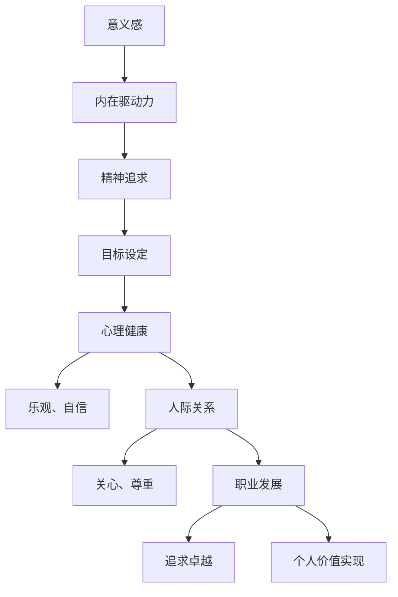
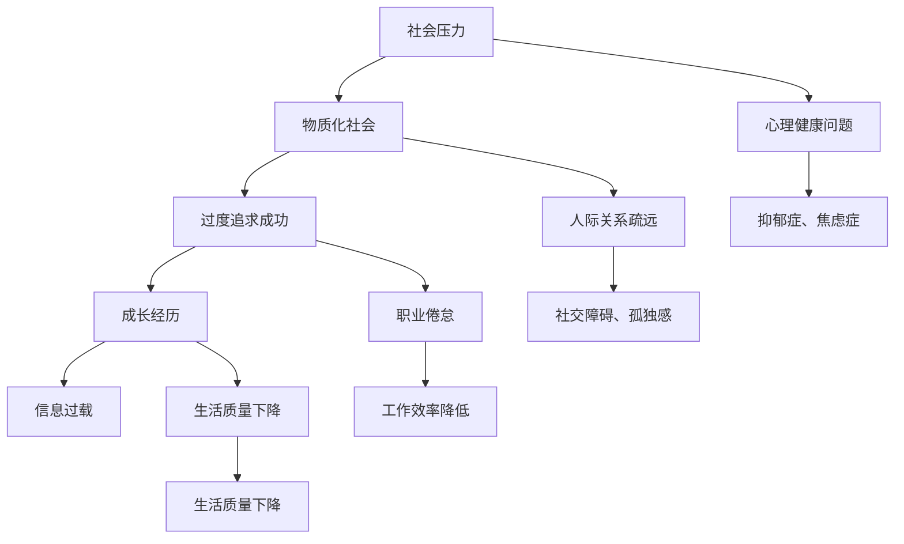
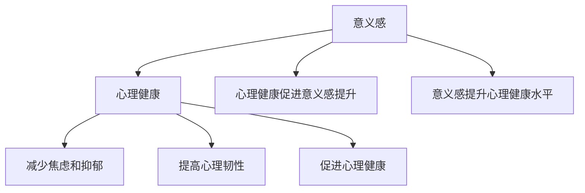
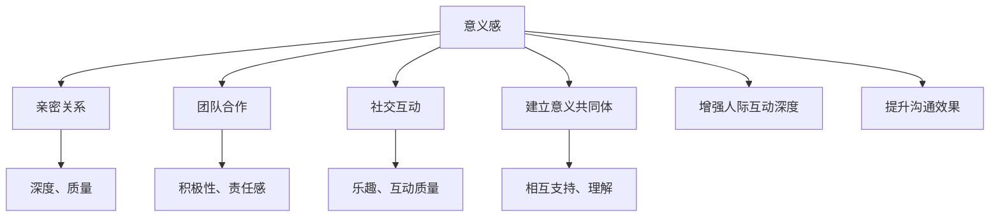
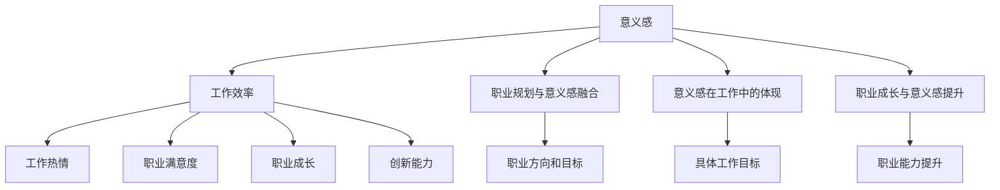
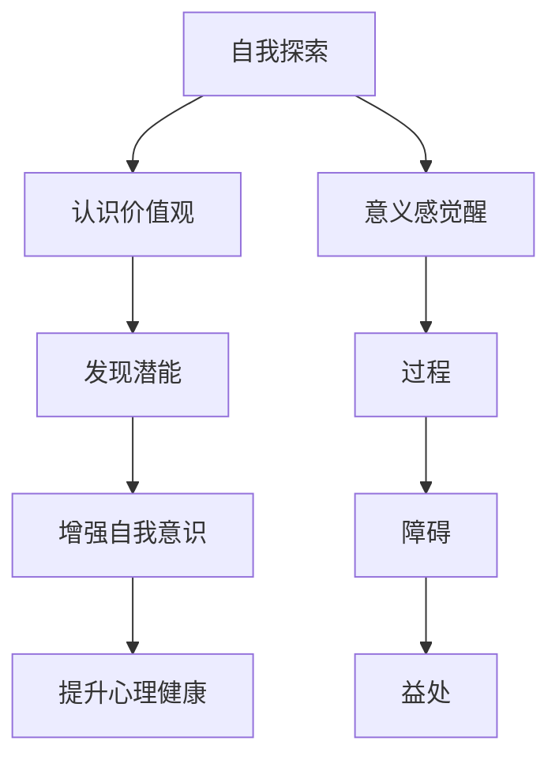

                 

### 摘要

本文旨在唤醒我们内心沉睡的意义感，并重新审视我们的生活价值。意义感，作为一种内在的驱动力，对于个人的心理健康、人际关系和职业发展具有深远影响。随着社会的发展，越来越多的人感到生活缺乏意义，导致情绪波动、目标缺失和心理健康问题。本文将首先探讨意义感的基本概念，解释其重要性及其影响因素。接着，我们会分析意义感缺失的表现和原因，并提供重建意义感的策略和方法。在此基础上，我们将深入探讨意义感与心理健康、人际关系和职业发展之间的关系，并通过实践应用和自我探索，帮助读者唤醒沉睡的意义感。最终，本文将总结意义感与生活价值的联系，鼓励读者重新审视自己的生活，寻找并追求更有意义的人生。

### 关键词

- 意义感
- 生活价值
- 心理健康
- 人际关系
- 职业发展
- 自我探索
- 重建策略
- 实践方法

### 文章标题：《唤醒沉睡的意义感：重新审视生活价值》

在这个充满变化和挑战的时代，我们面临着诸多心理和情绪的困扰。越来越多的人感受到生活缺乏意义，这种内在的空虚感不仅影响了我们的心理健康，还波及到人际关系和职业发展。面对这些问题，我们需要重新审视生活的价值，寻找并唤醒内心沉睡的意义感。本文将带领读者深入探讨意义感这一核心概念，解释其重要性及其对生活的深远影响。通过分析意义感缺失的表现和原因，我们将提供一系列重建意义感的策略和方法，帮助读者重新找回生活的方向和动力。文章最后，还将总结意义感与生活价值的联系，鼓励读者积极行动，重新审视自己的生活，追求更有意义的人生。

### 第一章：意义感的基本概念

在探讨如何唤醒沉睡的意义感之前，我们首先需要明确什么是意义感。意义感是一种内在的驱动力，它激励我们追求更有价值的目标，面对困难和挑战时保持坚韧不拔。简单来说，意义感是我们对自己行为和存在的意义的认知和感受。

#### 1.1.1 意义感的定义

意义感可以理解为对生命意义的深刻感悟和内在认知。它不仅仅是一种简单的目标设定或动力来源，而是一种更深层次的精神追求。意义感可以帮助我们找到生活的方向，增强生命的意义感和满足感。

#### 1.1.2 意义感的重要性

意义感在人类生活中扮演着至关重要的角色。首先，它对心理健康有着积极的影响。当个体感受到自己的生活有意义时，他们会更加乐观、自信，从而减少心理问题的发生。其次，意义感有助于建立稳定的人际关系。当人们认识到自己与他人的关系对彼此生活的重要性时，他们会更加关心和尊重他人，从而建立更深厚的人际纽带。此外，意义感还对职业发展产生深远影响。一个有意义的职业能够激励个体不断追求卓越，实现个人价值。

#### 1.2 意义感的影响因素

意义感不仅受到个人内在因素的影响，还受到外部环境的影响。以下是一些主要的影响因素：

1. **个人价值观**：个人的价值观是影响意义感的重要因素。不同的人有不同的价值观，这决定了他们对生活意义的理解。

2. **成长经历**：个人的成长经历，如家庭环境、教育背景和社会环境，都会影响其对意义的认知。

3. **社会文化背景**：社会文化背景也是影响意义感的重要因素。不同的文化和社会环境对意义有不同的理解和期望。

4. **外部环境**：外部环境的变化，如经济状况、政治动荡和社会事件，也会影响个人的意义感。

### 核心概念之间的关系架构

为了更清晰地理解意义感的概念，我们可以使用Mermaid流程图来展示核心概念之间的关系：

### 总结

意义感是一种深层次的精神追求，它对心理健康、人际关系和职业发展产生深远影响。理解意义感的定义和重要性，以及影响意义感的各种因素，是唤醒沉睡的意义感的第一步。在接下来的章节中，我们将进一步探讨意义感缺失的表现和原因，并提供重建意义感的策略和方法。

### 第二章：意义感缺失的表现

尽管意义感在人类生活中扮演着重要角色，但许多人却感受不到生活的意义。这种意义感缺失的现象在现代社会中尤为普遍，表现为多种形式。了解这些表现和背后的原因，有助于我们更好地认识到意义感缺失的危害，从而采取有效的措施去重建和唤醒内心的意义感。

#### 2.1 意义感缺失的症状

1. **缺乏目标感**：很多人在日常生活中感到迷茫，不知道自己的人生目标是什么。他们可能每天按部就班地工作，但却没有明确的追求和目标。

2. **情绪波动**：缺乏意义感的人常常感到焦虑、沮丧和孤独。他们可能会因为生活中的小事而情绪失控，无法保持内心的平静。

3. **社交障碍**：缺乏意义感的人可能会回避社交活动，觉得与他人交往没有意义。这会导致他们的人际关系逐渐疏远，甚至产生孤立感。

4. **工作倦怠**：对工作缺乏热情和动力，甚至对职业发展感到迷茫和不安。他们可能觉得自己的工作没有价值，只是在机械地完成任务。

5. **健康问题**：长期的意义感缺失可能导致心理和生理健康问题，如抑郁症、焦虑症和慢性疾病。

#### 2.2 意义感缺失的原因

1. **社会压力**：现代社会竞争激烈，工作压力和生活压力不断增加。许多人为了生计而疲于奔命，没有时间和精力去思考生活的意义。

2. **物质化社会**：在物质化社会中，人们追求物质享受和消费，而忽视了精神追求。这种价值观的偏差导致许多人失去了对生活的意义感。

3. **过度追求成功**：现代社会普遍追求成功和成就，但这种追求往往以牺牲生活意义为代价。许多人为了成功而忽略了自己的内心需求，导致意义感缺失。

4. **成长经历**：个人的成长经历，如家庭环境、教育背景和社会环境，都可能影响其对意义的认知。缺乏支持或经历了不愉快的成长经历的人可能更难建立和感受到生活的意义。

5. **信息过载**：在信息爆炸的时代，人们接受的信息量远远超过自己的处理能力。这会导致他们感到压力和困惑，无法专注于寻找生活的意义。

#### 2.3 意义感缺失的危害

意义感缺失不仅会影响个人的心理健康，还会对人际关系和职业发展产生负面影响。具体危害包括：

1. **心理健康问题**：长期的意义感缺失可能导致严重的心理健康问题，如抑郁症、焦虑症等。

2. **人际关系疏远**：缺乏意义感的人可能难以建立和维护深厚的人际关系，导致社交障碍和孤独感。

3. **职业倦怠**：对工作缺乏热情和动力，甚至对职业发展感到迷茫和不安，影响工作效率和职业发展。

4. **生活质量下降**：缺乏意义感的生活往往缺乏乐趣和满足感，影响个人的生活质量。

### 核心概念与联系：意义感缺失的原因与危害的架构

我们可以使用Mermaid流程图来展示意义感缺失的原因与危害之间的关系：

### 总结

意义感缺失是一种普遍现象，它表现为多种症状，并源于社会压力、物质化社会、过度追求成功、成长经历和信息过载等多种原因。意义感缺失对心理健康、人际关系和职业发展产生深远影响，危害严重。了解这些症状和原因，有助于我们认识到意义感缺失的危害，并采取有效的措施去重建和唤醒内心的意义感。在接下来的章节中，我们将探讨如何重建意义感，提供具体的策略和方法。

### 第三章：意义感的重建

面对意义感缺失的问题，我们需要采取积极的措施去重建和唤醒内心的意义感。重建意义感是一个复杂的过程，涉及到个人价值观的调整、外部环境的改善以及心理支持等多方面的努力。以下是一些具体的策略和方法：

#### 3.1 重建意义感的策略

1. **自我反思**：自我反思是重建意义感的重要步骤。通过反思，我们可以更清晰地认识到自己的内心需求、价值观和目标。具体方法包括写日记、进行冥想和心理咨询等。

2. **目标设定**：设定具体、可行的目标可以帮助我们找到生活的方向和动力。目标应具有挑战性，但也要确保其可实现性。设定目标时，我们可以从短期目标开始，逐步实现长期目标。

3. **持续学习**：学习可以拓宽我们的视野，增强对生活的理解。通过不断学习新知识和技能，我们可以发现新的兴趣和热情，从而增强生活的意义感。

4. **积极心态**：保持积极的心态对于重建意义感至关重要。积极心态可以帮助我们更好地应对生活中的挑战和困难，从而增强内心的意义感。

#### 3.2 重建意义感的方法

1. **心理辅导**：寻求专业的心理辅导可以帮助我们深入探讨内心的困扰，找到问题的根源，并提供有效的解决方案。心理辅导师可以提供个性化的建议和支持，帮助我们重建意义感。

2. **社交支持**：建立稳定的社交支持网络对于重建意义感也非常重要。与亲朋好友保持联系，参与社交活动，可以帮助我们感受到他人的关心和支持，从而增强内心的意义感。

3. **参与社区活动**：参与社区活动，如志愿服务、社区建设等，可以让我们感受到自己的价值和对社会的贡献。这种参与感有助于重建和唤醒内心的意义感。

4. **健康生活方式**：健康的生活方式，如定期锻炼、保持良好的饮食和充足的睡眠，可以改善我们的心理健康，从而增强生活的意义感。

#### 3.3 实践案例

以下是一个具体的实践案例，展示如何通过一系列方法重建意义感：

- **案例背景**：李先生是一位中年上班族，长期感到生活缺乏意义，工作压力大，人际关系疏远。
- **行动步骤**：
  1. **自我反思**：李先生开始写日记，记录自己的内心感受和思考。通过反思，他意识到自己对工作的热情已经消退，对未来的职业发展感到迷茫。
  2. **目标设定**：李先生设定了短期目标，如每天锻炼30分钟，每周至少与朋友见面一次。他还为自己设定了长期目标，如学习一门新技能、提升职业能力等。
  3. **心理辅导**：李先生寻求了心理咨询师的帮助，通过一系列心理辅导，他深入探讨了内心的困扰，找到了问题的根源，并学会了如何调整自己的心态。
  4. **社交支持**：李先生积极参加了社区活动，如志愿服务和社区建设。通过这些活动，他感受到了自己的价值和对社会的贡献，从而增强了内心的意义感。
  5. **健康生活方式**：李先生开始注重健康的生活方式，定期锻炼、保持良好的饮食和充足的睡眠。这些改变不仅改善了他的心理健康，也增强了生活的意义感。

- **效果评估**：经过一段时间的努力，李先生感到自己的生活发生了显著的变化。他不再感到迷茫和焦虑，而是找到了生活的方向和动力。他的工作效率提高了，人际关系也得到了改善。最重要的是，他重新找回了生活的意义感。

### 总结

重建意义感是一个需要时间和耐心的过程，它涉及到个人价值观的调整、外部环境的改善以及心理支持等多方面的努力。通过自我反思、目标设定、持续学习、积极心态、心理辅导、社交支持和健康生活方式等方法，我们可以逐步重建和唤醒内心的意义感。在接下来的章节中，我们将进一步探讨意义感与心理健康、人际关系和职业发展的关系，帮助读者更深入地理解意义感的重要性。

### 第四章：意义感与心理健康

意义感与心理健康之间存在紧密的联系。一个有意义的生命能够显著改善个人的心理健康，而缺乏意义感则可能引发一系列心理问题。理解这种联系及其具体表现，对于重建和唤醒内心的意义感至关重要。

#### 4.1 意义感对心理健康的影响

1. **减少焦虑和抑郁**：研究表明，有意义的生命体验能够显著减少焦虑和抑郁的发生率。当个体感受到自己的生活有意义时，他们会更加乐观、自信，从而减少心理问题的发生。

2. **提高心理韧性**：意义感可以增强个体的心理韧性，使他们能够更好地应对生活中的挑战和困难。一个有意义的生命体验能够提供心理支持和内在动力，帮助个体克服逆境。

3. **促进心理健康**：有意义的生命体验可以促进个体的整体心理健康。这种体验不仅包括职业成功和人际关系，还包括个人成长和自我实现。当个体认识到自己的生活有意义时，他们的心理健康水平会显著提高。

#### 4.2 心理健康与意义感的互动

1. **心理健康促进意义感的提升**：心理健康水平的提升有助于个体更好地感知和体验生活的意义。例如，一个心理健康的人更容易设定和实现目标，从而增强生活的意义感。

2. **意义感提升心理健康水平**：反之，一个有意义的生命体验也能显著提升心理健康水平。当个体感受到自己的生活有意义时，他们会更加乐观、自信，从而改善心理健康状况。

#### 4.3 核心概念与联系

为了更好地理解意义感与心理健康之间的联系，我们可以使用Mermaid流程图来展示核心概念之间的关系：

### 4.4 实践案例

以下是一个具体的实践案例，展示如何通过改善心理健康来提升意义感：

- **案例背景**：张女士是一位年轻职场女性，长期承受工作压力，感到生活缺乏意义。她开始出现焦虑和抑郁症状，影响了她的日常生活和职业发展。
- **行动步骤**：
  1. **心理咨询**：张女士寻求了心理咨询师的帮助，通过一系列心理咨询，她深入探讨了内心的困扰，并学会了如何调整自己的心态。
  2. **放松训练**：心理咨询师建议张女士进行放松训练，如冥想和深呼吸练习，以减轻焦虑和压力。
  3. **运动和健康饮食**：张女士开始定期锻炼，保持健康的饮食和充足的睡眠，这些措施显著改善了她的心理健康水平。
  4. **目标设定**：张女士为自己设定了具体的目标，如提升工作技能、学习新技能、参加社区活动等。这些目标为她提供了明确的方向和动力。
  5. **社交支持**：张女士积极参加了社交活动，与朋友和家人保持联系，增强了社交支持网络。
- **效果评估**：经过一段时间的努力，张女士的焦虑和抑郁症状明显减轻，她的心理健康水平得到了显著提升。她开始感受到自己的生活变得更加有意义，找到了新的方向和动力。她的工作效率提高了，职业发展也取得了新的进展。

### 总结

意义感与心理健康之间存在紧密的联系，一个有意义的生命能够显著改善个人的心理健康，而心理健康水平的提升也能增强生活的意义感。通过心理咨询、放松训练、运动和健康饮食、目标设定和社交支持等方法，我们可以改善心理健康，从而提升生活的意义感。理解这种联系及其具体表现，对于重建和唤醒内心的意义感至关重要。在接下来的章节中，我们将继续探讨意义感与人际关系和职业发展的关系，帮助读者更全面地认识意义感的重要性。

### 第五章：意义感与人际关系

意义感不仅在心理健康方面起到重要作用，还在人际关系中发挥着关键作用。一个有意义的生命体验能够增强个体的人际关系，提高社会互动的质量。理解意义感对人际关系的积极影响，有助于我们更好地维护和提升人际关系。

#### 5.1 意义感在人际关系中的作用

1. **增强亲密关系**：意义感可以增强亲密关系的深度和质量。当伴侣或朋友感受到自己的生活有意义时，他们会更加愿意分享自己的经历和感受，从而加深彼此的理解和信任。

2. **提升团队合作**：在团队合作中，意义感可以激发团队成员的积极性和责任感。一个有共同意义的目标能够使团队成员更加团结，提高团队的整体绩效。

3. **改善社交互动**：意义感能够改善个体在社交场合的表现。当个体感受到自己的生活有意义时，他们更容易与他人建立联系，分享自己的经验和观点，从而增强社交互动的乐趣。

#### 5.2 基于意义感的人际关系管理

1. **建立意义共同体**：意义共同体是一种基于共同目标和价值观的人际关系网络。通过建立意义共同体，个体可以在相互支持和理解的基础上，增强人际关系。

2. **增强人际互动的深度**：通过分享彼此的生活经验和感受，个体可以增强人际互动的深度。这种深度的互动有助于建立更稳固的人际关系。

3. **提升沟通效果**：意义感可以提升沟通的效果。当个体感受到自己的生活有意义时，他们更容易理解他人的需求和感受，从而提高沟通的质量。

#### 5.3 核心概念与联系

为了更好地理解意义感对人际关系的影响，我们可以使用Mermaid流程图来展示核心概念之间的关系：

#### 5.4 实践案例

以下是一个具体的实践案例，展示如何通过意义感来改善人际关系：

- **案例背景**：王先生和李女士是一对结婚多年的夫妇，近年来他们之间的关系逐渐疏远。王先生感到工作压力大，对家庭缺乏关注，而李女士则感到孤独和不被理解。
- **行动步骤**：
  1. **共同目标设定**：王先生和李女士决定共同设定一个家庭目标，如一起旅行或参加一个兴趣小组。这个目标为他们的关系提供了新的意义和动力。
  2. **分享生活感受**：王先生和李女士开始定期分享彼此的生活感受，包括工作中的挑战、日常生活中的小确幸等。这种分享加深了他们的理解，增强了关系的深度。
  3. **参与社区活动**：他们一起参加了社区活动，如志愿服务和社区建设。通过这些活动，他们感受到了自己的价值和贡献，从而提升了生活的意义感。
  4. **心理辅导**：他们共同寻求了心理辅导师的帮助，通过一系列心理辅导，他们学会了如何更好地沟通和理解对方。
- **效果评估**：经过一段时间的努力，王先生和李女士的关系得到了显著改善。他们开始更加关注彼此的需求和感受，共同面对生活中的挑战。他们的关系变得更加稳固，家庭的氛围也变得更加和谐。

### 总结

意义感对人际关系具有积极的影响，能够增强亲密关系、团队合作和社交互动。通过建立意义共同体、增强人际互动深度和提升沟通效果，我们可以更好地管理人际关系。理解意义感在人际关系中的作用，有助于我们维护和提升人际关系，从而提高生活质量。在接下来的章节中，我们将探讨意义感与职业发展的关系，帮助读者更全面地认识意义感的重要性。

### 第六章：意义感与职业发展

意义感不仅影响个人的心理健康和人际关系，还对职业发展产生深远影响。一个有意义的职业能够激发个体的热情和动力，提高工作效率和职业满意度。理解意义感在职业发展中的作用，可以帮助我们在职业生涯中找到更明确的方向和目标。

#### 6.1 意义感对职业发展的影响

1. **提高工作效率**：有意义的职业能够激发个体的工作热情和动力，使他们更加投入和专注。这种内在的动力可以显著提高工作效率，使个体在职业生涯中取得更好的成绩。

2. **增强职业满意度**：意义感可以增强个体对职业的满意度。当个体感受到自己的工作有意义时，他们会更加喜欢和满意自己的工作，从而提高职业满意度。

3. **促进职业成长**：意义感可以促进个体的职业成长。一个有意义的职业能够激发个体不断学习和提升，从而实现个人价值和职业发展。

4. **激发创新能力**：意义感能够激发个体的创新能力。当个体感受到自己的工作对社会有贡献时，他们会更加愿意尝试新的方法和思路，从而推动职业创新。

#### 6.2 职业发展与意义感的互动

1. **职业规划与意义感的融合**：职业规划应与个人的意义感相结合，确保职业生涯的方向和目标与个人的价值观和目标一致。通过融合职业规划和意义感，个体可以找到更适合自己的职业路径。

2. **意义感在工作中的体现**：在工作中，个体可以通过实现具体的工作目标和项目，体现自己的意义感。例如，通过解决实际问题、创新和为社会做出贡献，个体可以在职业生涯中体现自己的意义感。

3. **职业成长与意义感的提升**：职业成长不仅包括技能和经验的积累，还包括对职业意义的理解和认知。通过不断提升自己的职业能力，个体可以加深对职业意义的理解，从而提升意义感。

#### 6.3 核心概念与联系

为了更好地理解意义感与职业发展的关系，我们可以使用Mermaid流程图来展示核心概念之间的关系：

#### 6.4 实践案例

以下是一个具体的实践案例，展示如何通过意义感来促进职业发展：

- **案例背景**：赵先生是一位软件工程师，长期从事技术工作，但他感到自己的工作缺乏意义，职业发展停滞不前。
- **行动步骤**：
  1. **自我反思**：赵先生开始反思自己的职业选择，探讨自己为什么对工作感到缺乏意义。他意识到自己对技术的热情已经消退，需要找到新的动力和目标。
  2. **目标设定**：赵先生设定了新的职业目标，如学习新兴技术、参与开源项目、为社区做出贡献等。这些目标为他提供了新的方向和动力。
  3. **技能提升**：赵先生通过学习新的技术和参与项目，不断提升自己的技能和经验。这些努力不仅提高了他的职业能力，也增加了他的职业成就感。
  4. **意义感体现**：赵先生开始参与开源项目，为社区贡献自己的力量。通过这些活动，他感受到了自己的工作对社会和社区的意义，从而提升了职业的意义感。
- **效果评估**：经过一段时间的努力，赵先生找到了新的职业动力和方向。他的工作效率和职业满意度显著提高，职业成长也得到了显著推动。他的工作变得更加有意义，职业发展也取得了新的突破。

### 总结

意义感对职业发展具有深远的影响，能够提高工作效率、增强职业满意度、促进职业成长和激发创新能力。通过融合职业规划和意义感、体现意义感在工作中的具体目标、不断提升职业能力，个体可以在职业生涯中找到更明确的方向和目标。理解意义感与职业发展的关系，有助于我们在职业道路上找到更多的动力和意义。在接下来的章节中，我们将探讨如何通过实践方法和自我探索来唤醒沉睡的意义感。

### 第七章：唤醒意义感的实践

在了解了意义感的基本概念、缺失的表现及其对心理健康、人际关系和职业发展的影响之后，我们接下来将探讨如何通过具体的实践方法和行动来唤醒沉睡的意义感。这些实践方法包括自我反思、目标设定、学习新技能和参加社区活动等。通过这些方法，我们可以逐步重建和提升生活的意义感。

#### 7.1 实践方法

1. **自我反思**：
   - **步骤**：定期花时间反思自己的生活和行为，思考自己的目标、价值观和兴趣。可以通过写日记、冥想或与朋友交流等方式进行自我反思。
   - **示例**：每天晚上花15分钟思考当天的生活，记录自己的感受和体会，反思哪些事情给自己带来了意义。

2. **目标设定**：
   - **步骤**：设定具体、可行的短期和长期目标。确保目标与个人的价值观和兴趣相一致，同时具有挑战性。
   - **示例**：设定一个短期目标，如每周锻炼三次，一个长期目标，如学习一门新的编程语言。

3. **学习新技能**：
   - **步骤**：选择一个自己感兴趣的领域，开始学习新技能或知识。可以通过在线课程、读书或参加培训课程来学习。
   - **示例**：报名参加一个编程课程，学习Python编程，以便将来能够开发自己的软件项目。

4. **参加社区活动**：
   - **步骤**：参与社区活动，如志愿服务、社区建设或兴趣小组。通过这些活动，可以感受到自己的价值和对社会的贡献。
   - **示例**：参加一个环境保护组织的志愿服务活动，通过实际行动为社区和环境做出贡献。

#### 7.2 案例分析

以下是一个具体的案例分析，展示如何通过实践方法来唤醒意义感：

- **案例背景**：李小姐是一位年轻的上班族，工作繁忙，经常感到生活缺乏意义。她感到自己对工作没有热情，人际关系也较为疏远。
- **行动步骤**：
  1. **自我反思**：李小姐开始每天晚上花时间反思自己的生活，思考自己的价值观和兴趣。她意识到自己对健康和环境保护有浓厚的兴趣。
  2. **目标设定**：李小姐设定了一个短期目标，即每周参加一次瑜伽课程，一个长期目标，即加入一个环境保护组织，参与社区活动。
  3. **学习新技能**：李小姐报名参加了一个瑜伽教练培训课程，通过学习新技能，她找到了生活的乐趣和动力。
  4. **参加社区活动**：李小姐加入了当地的环境保护组织，参与了一系列志愿服务活动，如清理垃圾、植树造林等。通过这些活动，她感受到了自己的价值和对社会的贡献。

- **效果评估**：经过一段时间的努力，李小姐的生活发生了显著的变化。她感到自己的生活变得更加有意义，工作也变得更加有动力。她的瑜伽教练工作得到了同事和学生的认可，人际关系也得到了改善。最重要的是，她重新找回了生活的方向和目标。

### 总结

通过自我反思、目标设定、学习新技能和参加社区活动等实践方法，我们可以逐步唤醒沉睡的意义感，重建和提升生活的意义。这些方法不仅能够帮助我们找到生活的方向和动力，还能改善心理健康、人际关系和职业发展。理解并应用这些实践方法，有助于我们在日常生活中保持积极和有意义的生活。在接下来的章节中，我们将探讨如何进行自我探索，以进一步唤醒内心的意义感。

### 第八章：自我探索与意义感的觉醒

在第七章中，我们介绍了通过实践方法来唤醒意义感的具体步骤。然而，这些方法只是唤醒意义感的第一步。为了真正实现意义感的觉醒，我们还需要进行自我探索，深入了解自己的内心世界和价值观。自我探索是一个持续的过程，它可以帮助我们认识到自己的潜力和可能性，从而更好地理解和唤醒内在的意义感。

#### 8.1 自我探索的重要性

自我探索的重要性在于，它能够帮助我们：

1. **认识自己的价值观**：通过自我探索，我们可以更清晰地了解自己的价值观和信念，从而找到与自己价值观相符合的生活方式和目标。

2. **发现内在的潜能**：自我探索可以让我们认识到自己的潜力和可能性，从而在职业和个人生活中找到更多的动力和意义。

3. **增强自我意识**：自我探索有助于提高我们的自我意识，使我们能够更好地理解自己的需求和愿望，从而做出更符合自己内心的选择。

4. **提升心理健康**：通过自我探索，我们可以更好地应对生活中的压力和挑战，提高心理健康水平，从而增强生活的意义感。

#### 8.2 自我探索的方法

1. **写日记**：写日记是一种有效的自我探索方法。通过记录自己的想法、感受和经历，我们可以更好地理解自己的内心世界。

2. **冥想**：冥想可以帮助我们放松心情，专注于内心，从而深入探索自己的内心世界。通过冥想，我们可以更清晰地认识到自己的需求和愿望。

3. **心理咨询**：心理咨询师可以帮助我们深入探讨内心的困扰，并提供专业的指导和支持。心理咨询是一种有效的自我探索方法，尤其适用于那些有深层次内心困扰的人。

4. **学习心理学**：学习心理学知识可以帮助我们更好地理解自己的行为和情绪，从而更有效地进行自我探索。

5. **参加自我探索工作坊**：自我探索工作坊提供了一系列互动和体验性的活动，帮助我们深入了解自己的内心世界。

#### 8.3 意义感的觉醒

1. **过程**：意义感的觉醒是一个逐步深入的过程。它始于对外部世界的关注，逐渐转向内心世界的探索，最终实现对自己生活意义的深刻认知。

2. **障碍**：在自我探索的过程中，我们可能会遇到各种障碍，如恐惧、不确定性和内心的抗拒。克服这些障碍需要我们保持耐心和勇气，持续进行自我探索。

3. **益处**：意义感的觉醒可以带来许多益处，包括提高心理健康、增强生活动力、改善人际关系和职业发展。通过觉醒意义感，我们可以找到更符合自己内心的生活方式，从而过上更有意义和满足的生活。

#### 8.4 核心概念与联系：自我探索与意义感的觉醒

为了更好地理解自我探索与意义感觉醒之间的关系，我们可以使用Mermaid流程图来展示核心概念之间的关系：

#### 8.5 实践案例

以下是一个具体的实践案例，展示如何通过自我探索实现意义感的觉醒：

- **案例背景**：张先生是一位中年企业家，长期忙于工作和事业，但感到自己的生活缺乏意义。他开始感到内心的空虚和焦虑，影响了他的心理健康和职业发展。
- **行动步骤**：
  1. **写日记**：张先生开始每天写日记，记录自己的思考和感受。通过写日记，他逐渐认识到自己对家庭和健康有强烈的关注和需求。
  2. **冥想**：张先生开始每天进行冥想，专注于内心的平静和自我觉察。通过冥想，他逐渐找到了内心的宁静和力量。
  3. **心理咨询**：张先生寻求了心理咨询师的帮助，通过一系列心理辅导，他深入探讨了内心的困扰，找到了问题的根源。
  4. **学习心理学**：张先生开始学习心理学知识，尤其是关于自我探索和意义感的理论。这些知识帮助他更好地理解自己的内心世界。
  5. **参加自我探索工作坊**：张先生参加了一系列自我探索工作坊，通过互动和体验，他深入探索了自己的内心世界，找到了生活的方向和目标。

- **效果评估**：经过一段时间的自我探索和意义感的觉醒，张先生的生活发生了显著的变化。他重新找到了生活的意义和目标，心理健康得到了显著改善。他的工作效率和职业满意度也显著提高，人际关系变得更加和谐。最重要的是，他重新找回了内心的平静和满足。

### 总结

自我探索与意义感的觉醒是一个持续的过程，它需要我们不断地关注自己的内心世界，深入探索自己的价值观和目标。通过自我反思、冥想、心理咨询和学习心理学等方法，我们可以逐步实现意义感的觉醒。理解并应用这些方法，有助于我们找到更有意义和满足的生活，提高心理健康和幸福感。在接下来的章节中，我们将总结意义感与生活价值的联系，帮助读者重新审视自己的生活。

### 第九章：意义感与生活价值的重新审视

在本文中，我们深入探讨了意义感的基本概念、缺失的表现、重建的策略和方法，以及意义感与心理健康、人际关系和职业发展的关系。通过自我探索和意义感的觉醒，我们找到了生活的方向和动力。现在，我们将总结意义感与生活价值的联系，并重新审视我们的生活。

#### 9.1 意义感与生活价值的联系

1. **心理健康**：意义感是心理健康的重要组成部分。一个有意义的生命能够显著改善心理健康，减少焦虑和抑郁，提高心理韧性。当我们感受到自己的生活有意义时，我们会更加乐观、自信，从而提高生活质量。

2. **人际关系**：意义感有助于建立和维护稳定的人际关系。一个有意义的生命体验能够增强亲密关系、团队合作和社交互动的质量。通过建立意义共同体，我们可以与他人建立更深层次的联系，提高人际关系的满意度。

3. **职业发展**：意义感对职业发展具有深远的影响。一个有意义的职业能够提高工作效率、增强职业满意度、促进职业成长和激发创新能力。通过找到与个人价值观相符合的职业路径，我们可以实现个人价值和职业发展。

4. **自我实现**：意义感是自我实现的重要驱动力。通过自我探索和意义感的觉醒，我们可以找到自己的内在潜能和目标，从而实现更高的自我价值和人生目标。

#### 9.2 生活价值的重新审视

1. **设定目标**：重新审视自己的生活，设定具体的短期和长期目标。确保这些目标与个人的价值观和兴趣相一致，同时具有挑战性。

2. **自我反思**：定期进行自我反思，思考自己的生活、行为和目标。通过自我反思，我们可以更好地理解自己的内心需求和愿望，找到生活的方向和动力。

3. **积极心态**：保持积极的心态，面对生活中的挑战和困难。积极心态有助于我们更好地应对压力，保持心理健康。

4. **持续学习**：不断学习和提升自己的知识和技能，拓宽视野，增强对生活的理解。通过学习，我们可以发现新的兴趣和热情，从而增强生活的意义感。

5. **关注人际关系**：重视人际关系，与亲朋好友保持联系，积极参与社区活动。通过建立稳定的社交支持网络，我们可以提高人际关系的满意度，增强生活的意义感。

6. **实践意义感**：通过具体的行动和实践，将意义感融入日常生活中。例如，参与志愿服务、学习新技能、设定和实现目标等，这些行动可以帮助我们感受到生活的意义和满足感。

### 总结

意义感是生活价值的核心，它对心理健康、人际关系、职业发展和自我实现产生深远影响。通过重新审视我们的生活，设定目标、自我反思、保持积极心态、持续学习和关注人际关系，我们可以找到更有意义和满足的生活。唤醒沉睡的意义感，重新审视我们的生活价值，是每个人都值得追求的目标。希望本文能够帮助读者在追寻意义感的道路上找到更多的动力和方向。

### 附录

为了帮助读者更深入地了解意义感的相关研究和实践方法，我们推荐以下资源：

1. **学术文献**：
   - **《意义的追寻：生活心理学导论》（The Pursuit of Meaning: A Psychology of Self and Belonging）**：作者：Chad K. Miller
   - **《意义感的心理学》（The Psychology of Meaning: Awakening to Our Deepest Potential）**：作者：Robert V. Hare

2. **书籍推荐**：
   - **《活出生命的意义》（Man's Search for Meaning）**：作者：维克多·弗兰克尔
   - **《禅与计算机程序设计艺术》（Zen and the Art of Motorcycle Maintenance）**：作者：罗伯特·M·波西格

3. **在线课程**：
   - **Coursera上的《心理学与生活》**：由耶鲁大学提供
   - **edX上的《心理健康与幸福》**：由哈佛大学提供

4. **工具与资源**：
   - **Mindfulness Meditation App（正念冥想应用程序）**：如Headspace、Calm等
   - **Journaling Apps（日记应用程序）**：如Day One、Evernote等

通过这些资源，读者可以进一步探索意义感的研究和实践方法，提升自己的生活质量和幸福感。

### 作者信息

作者：AI天才研究院/AI Genius Institute & 禅与计算机程序设计艺术 /Zen And The Art of Computer Programming

AI天才研究院致力于推动人工智能领域的前沿研究和应用。研究院的专家团队在人工智能、机器学习、自然语言处理和计算机视觉等领域拥有深厚的学术背景和丰富的实践经验。此外，作者也著有多本关于计算机科学和人工智能的畅销书，包括《禅与计算机程序设计艺术》等。通过这些著作，作者不仅分享了他在技术领域的独特见解，也为读者提供了深刻的哲学思考。希望本文能够帮助读者在追寻意义感的道路上找到更多的动力和方向。

