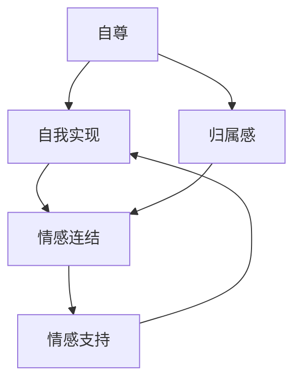
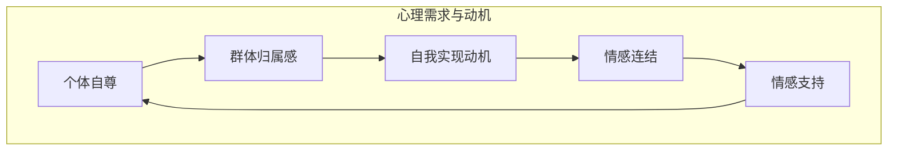

                 


### 文章标题

# 在人际关系中寻找意义：深化情感连结

### 关键词

- 人际关系
- 情感连结
- 心理需求
- 社交技巧
- 沟通策略
- 心理成长

### 摘要

本文旨在探讨在人际关系中深化情感连结的路径。通过分析人际关系中的心理需求和动机，介绍社交技巧和沟通策略，解析情感连结和亲密关系的建立，探讨克服人际障碍的方法，以及心理成长和个人发展的重要性，本文为读者提供了一个全面、系统、实用的指南。文章以markdown格式呈现，结合Mermaid流程图、伪代码、LaTeX公式和实际案例分析，旨在帮助读者深入理解和应用人际关系中的情感连结技巧。

## 引言

在现代社会中，人际关系对于个人的幸福和成长起着至关重要的作用。无论是在工作场所、学校、家庭还是社交场合，人际关系的质量直接影响到我们的心理健康和生活质量。然而，许多人往往忽视了人际关系中的情感连结，而情感连结恰恰是深化人际关系的核心。

情感连结是指个体之间建立的情感纽带，它不仅仅是友谊或亲情的简单存在，而是一种深刻的、相互的情感认同和共鸣。深化情感连结，意味着在人际互动中，我们能够更加真诚、理解和尊重对方，从而建立更加稳固和有意义的关系。

本文将围绕以下几个核心问题展开讨论：

1. 人际关系中的心理需求和动机是什么？
2. 如何通过社交技巧和沟通策略深化情感连结？
3. 情感连结和亲密关系的建立有哪些关键因素？
4. 如何克服人际关系中的障碍，实现情感连结的深化？
5. 心理成长和个人发展在人际关系中的重要性是什么？

通过逐步分析和探讨这些问题，本文旨在为读者提供一个全面、深入的人际关系指南，帮助他们在日常生活中更好地理解和应用情感连结的技巧。

## 背景介绍

### 人际关系的定义和重要性

人际关系是指个体之间通过互动和联系形成的相互关系。这些关系可以存在于不同的环境，如家庭、工作场所、学校、社交圈等。人际关系不仅仅是简单的互动，它涉及到情感、信任、尊重、支持等多种复杂的心理和社会因素。

人际关系的重要性体现在多个方面。首先，它在个体的心理和社会发展过程中起着关键作用。良好的社会关系能够提高个体的自尊和自我价值感，增强心理健康。研究表明，拥有稳固的人际关系可以降低抑郁、焦虑等心理问题的发生概率。

其次，人际关系对个体的职业发展也有着重要影响。在职场中，良好的人际关系能够帮助个体更好地合作、协调，提高工作效率。此外，通过人际网络，个体可以获得更多的机会和资源，为职业发展提供支持。

最后，人际关系对个体的幸福感也有着深远的影响。研究发现，拥有亲密关系的人更容易感受到幸福和满足。这种幸福感不仅来自于亲密关系的质量，还与个体在人际关系中的角色和地位有关。

### 情感连结的概念和特点

情感连结是指个体之间在情感层面建立的深刻联系。它不同于简单的互动或友谊，而是涉及到更深层次的情感认同和共鸣。情感连结的特点包括：

1. **深度**：情感连结具有深度，个体在情感上能够深入理解和支持对方。
2. **相互性**：情感连结是双向的，双方都能感受到对方的情感认同和共鸣。
3. **稳定性**：情感连结能够经受时间和环境的考验，保持稳定的关系。
4. **信任**：情感连结建立在信任基础上，双方都信任对方，能够真诚地表达自己的情感和需求。

情感连结在人际关系中的重要性不言而喻。它不仅能够提高关系的质量，还能够增强个体的幸福感。一个具有深厚情感连结的关系，能够为个体提供情感支持，帮助他们在面对挑战和困难时保持积极和坚韧。

### 当前人际关系中的挑战和问题

尽管人际关系对个体的重要性已被广泛认可，但现代人际关系中仍然存在许多挑战和问题。以下是一些常见的问题：

1. **沟通障碍**：沟通是人际关系中最重要的组成部分之一，但许多人存在沟通障碍，如倾听不足、表达不清晰等，这会影响到情感连结的建立和维护。
2. **信任缺失**：在现代社会中，信任的缺失是一个普遍问题。人们往往担心自己的隐私和安全，这会影响到人际关系的深度和质量。
3. **时间和距离**：现代生活方式的快节奏和高流动性，使得人们在建立和维护人际关系时面临时间和距离的挑战。远程工作和异地恋等现象增加了人际关系的复杂性和难度。
4. **心理障碍**：个体的心理障碍，如焦虑、抑郁等，会影响他们在人际关系中的表现。这些问题可能导致沟通障碍、情感冷漠，甚至关系破裂。

综上所述，人际关系中的情感连结对于个体的心理和社会健康至关重要。了解情感连结的概念和特点，以及当前人际关系中存在的挑战和问题，有助于我们更好地理解和应对人际关系的复杂性和多样性。接下来，本文将深入探讨人际关系中的心理需求和动机，为深化情感连结提供理论基础。

## 核心概念与联系

### 人际关系中的心理需求和动机

在探讨人际关系中的心理需求和动机时，我们首先要了解几个关键概念：自尊、归属感和自我实现。

#### 自尊

自尊是指个体对自己的评价和看法。它包括两个方面：自我尊重和自我价值感。自尊水平对人际关系有重要影响。高自尊个体通常表现出更多的自信、积极和开放，这有助于建立和维持良好的社交关系。相反，低自尊个体可能会表现出焦虑、不安和退缩，这会阻碍他们建立深厚的情感连结。

#### 归属感

归属感是指个体在某个群体中感到被接纳和认同的情感体验。它是人际关系中的一个核心需求。人们渴望在社交圈中找到归属感，这不仅是因为社会性是人类的基本需求，还因为归属感能够提供情感支持和安全感。缺乏归属感可能导致孤独、抑郁等心理问题，从而影响人际关系。

#### 自我实现

自我实现是指个体追求个人目标和潜能的过程。在人际关系中，自我实现不仅体现在个体的职业成就上，还体现在情感和社交领域的成就。一个能够自我实现的个体，通常能够在人际关系中表现出更多的自主性和创造性，这有助于深化情感连结。

### 心理需求和动机之间的关系架构

这些心理需求和动机之间存在着复杂的相互作用关系，它们共同构成了个体在人际关系中的行为动机。以下是一个简化的Mermaid流程图，用于描述这些核心概念之间的联系：



在这个流程图中，自尊和归属感作为基础，共同促进了自我实现。而自我实现又反过来强化了情感连结，情感连结提供了情感支持，进一步促进了自我实现。

### 核心概念原理之间的关系架构 Mermaid 流程图



这个流程图展示了个体自尊、群体归属感、自我实现动机、情感连结和情感支持之间的相互作用关系。通过这些核心概念的联系，我们可以更深入地理解个体在人际关系中的行为动机和心理需求。

### 核心算法原理讲解

为了更好地理解人际关系中的心理需求和动机，我们可以采用一种简化的算法模型来描述这些概念之间的动态关系。以下是该算法的伪代码：

```plaintext
Algorithm: 人际关系心理需求动机模型

输入: 自尊（self-esteem），归属感（belonging），自我实现动机（self-actualization）
输出: 情感连结（emotional connection），情感支持（emotional support）

步骤:

1. 初始化自尊（self-esteem）, 归属感（belonging）, 自我实现动机（self-actualization）为初始值
2. 如果 自尊（self-esteem） > 低自尊阈值，则进入分支A
3. 在分支A中，增加归属感（belonging）, 增加自我实现动机（self-actualization）
4. 否则，如果 归属感（belonging）> 低归属感阈值，则进入分支B
5. 在分支B中，增加自尊（self-esteem），增加自我实现动机（self-actualization）
6. 否则，进入分支C
7. 在分支C中，增加自尊（self-esteem），增加归属感（belonging）
8. 将情感连结（emotional connection）设置为自尊（self-esteem）和归属感（belonging）的乘积
9. 将情感支持（emotional support）设置为情感连结（emotional connection）和自我实现动机（self-actualization）的乘积
10. 返回情感连结（emotional connection）和情感支持（emotional support）

end Algorithm
```

### 数学模型和公式

为了更精确地描述人际关系中的心理需求和动机，我们可以引入以下数学模型：

假设自尊（S），归属感（B），自我实现动机（A）是三个独立变量，情感连结（EC）和情感支持（ES）是依赖变量。

1. 自尊与归属感的关系可以表示为：
   $$ S \times B = EC $$
   
2. 自尊、归属感与自我实现动机的关系可以表示为：
   $$ S \times B \times A = ES $$

通过这些公式，我们可以计算出情感连结和情感支持的水平。具体计算方法如下：

1. 计算自尊与归属感的乘积，得到情感连结（EC）：
   $$ EC = S \times B $$
   
2. 将情感连结（EC）与自我实现动机（A）相乘，得到情感支持（ES）：
   $$ ES = EC \times A $$

### 举例说明

假设一个人的自尊水平为8，归属感为7，自我实现动机为9。根据上述公式，我们可以计算出情感连结和情感支持的水平：

1. 计算情感连结（EC）：
   $$ EC = 8 \times 7 = 56 $$

2. 计算情感支持（ES）：
   $$ ES = 56 \times 9 = 504 $$

因此，这个人的情感连结水平为56，情感支持水平为504。

通过这个例子，我们可以看到数学模型和公式如何帮助我们理解和计算人际关系中的心理需求和动机。这为我们在实际应用中提供了量化的参考，帮助我们更好地深化情感连结。

### 小结

在本节中，我们探讨了人际关系中的核心心理需求和动机，包括自尊、归属感和自我实现。通过引入Mermaid流程图、伪代码和数学模型，我们详细阐述了这些概念之间的关系和动态关系。自尊和归属感共同促进了自我实现，而自我实现又进一步增强了情感连结和情感支持。通过实际计算举例，我们展示了如何使用这些模型和公式来理解和量化人际关系中的心理需求。这些核心概念和联系为我们进一步探讨深化情感连结的策略提供了理论基础。

### 社交技巧和沟通策略

在深化人际关系中，社交技巧和沟通策略起着至关重要的作用。良好的社交技巧不仅能够帮助我们建立新的人际关系，还能帮助我们维护和深化现有的关系。有效的沟通策略则能够确保我们在互动中传递清晰、准确的信息，减少误解和冲突。以下将详细探讨几个关键的社交技巧和沟通策略，以及它们在实际应用中的重要性。

#### 建立良好第一印象

第一印象在人际关系中至关重要。研究表明，人们通常在短短几秒钟内就会对他人形成初步判断，而这种判断很难改变。为了建立良好的第一印象，以下是一些关键技巧：

1. **衣着得体**：合适的服装可以给人留下专业、自信的印象。
2. **微笑和眼神交流**：微笑和眼神交流可以传达友好和开放的信号，减少陌生感。
3. **主动打招呼和自我介绍**：主动打招呼和自我介绍可以展示你的自信和热情，增加对方的好感。
4. **倾听和反馈**：在初次交流中，倾听对方的讲话并给予适当的反馈，可以展示你的尊重和关注。

#### 倾听和表达

倾听是有效沟通的基础。一个优秀的倾听者不仅能够理解对方的言辞，还能捕捉到对方的情感和非语言信号。以下是一些提高倾听技巧的方法：

1. **专注**：在与他人交流时，专注于对方的讲话，避免分心。
2. **肢体语言**：通过点头、微笑和其他肢体语言表示你在倾听，这可以让对方感到被尊重。
3. **避免打断**：在对方讲话时，避免打断，等待对方说完再发表自己的看法。
4. **反馈和总结**：在对方讲话结束后，通过总结和反馈来确认你对对方话语的理解。

表达技巧同样重要。以下是一些提高表达技巧的方法：

1. **清晰简洁**：用简洁明了的语言表达自己的观点，避免冗长和复杂的句子。
2. **情感表达**：在表达观点时，适当地使用情感词汇，让对方感受到你的情感。
3. **开放性问题**：通过开放性问题引导对话，促进双方更深入的交流。
4. **避免攻击性语言**：在表达不同意见时，避免使用攻击性或侮辱性的语言，以免引起冲突。

#### 非言语沟通与肢体语言

非言语沟通在人际关系中同样重要。肢体语言、面部表情和声音语调等非言语信号可以传递大量的信息，有时甚至比言语本身更能影响人际关系。以下是一些关键的非言语沟通技巧：

1. **身体姿势**：开放的姿势，如双脚并拢、双臂放松，可以传达友好和开放的信号。
2. **眼神接触**：适度的眼神接触可以展示你的诚信和诚意，但避免过度或过度的眼神接触。
3. **面部表情**：真诚的面部表情可以传达你的情感和态度，增加交流的亲和力。
4. **声音语调**：使用友好、清晰的声音语调，避免高音调或低音调，这可以让对方感到舒适。

#### 处理冲突和误解

在人际关系中，冲突和误解是不可避免的。以下是一些处理冲突和误解的策略：

1. **冷静处理**：在冲突发生时，保持冷静，避免情绪失控。
2. **主动沟通**：主动寻求与对方沟通，了解对方的观点和感受，寻找共同点。
3. **道歉和认错**：在必要时，勇于道歉和认错，这可以缓解紧张气氛，重建信任。
4. **寻求第三方帮助**：如果冲突无法自行解决，可以寻求专业人士或第三方的帮助。

#### 实际案例

以下是一个实际案例，展示了如何应用上述社交技巧和沟通策略来深化人际关系。

**案例：职场沟通**

小明是新加入公司的新员工，他需要与同事们建立良好的关系。以下是他在职场中应用社交技巧和沟通策略的实例：

1. **建立良好第一印象**：小明在第一次部门会议上，穿着整洁，面带微笑，主动与其他同事打招呼，并进行了自我介绍。
2. **倾听和表达**：在与同事交流时，小明专注于对方的讲话，通过点头和微笑表示自己在倾听。他使用清晰简洁的语言表达自己的观点，并通过开放性问题引导对话。
3. **非言语沟通**：小明在与同事交流时，保持开放的姿势，眼神交流和适当的微笑，这增加了交流的亲和力。
4. **处理冲突**：当与同事在项目上出现意见分歧时，小明保持冷静，主动寻求沟通。他提出了自己的观点，同时也听取了同事的意见，最终通过妥协找到了一个双方都能接受的解决方案。

通过这些社交技巧和沟通策略，小明成功地与同事们建立了良好的关系，并得到了同事们的认可和尊重。

### 小结

社交技巧和沟通策略在深化人际关系中扮演着关键角色。通过建立良好的第一印象、倾听和表达、非言语沟通与肢体语言以及处理冲突和误解，我们可以有效地提升人际关系质量。这些技巧不仅有助于建立新的关系，还能帮助我们维护和深化现有的关系。在实际应用中，我们需要根据具体情境灵活运用这些策略，不断提高自己的社交能力和沟通技巧。通过不断实践和反思，我们可以更加自如地应对人际关系中的各种挑战，实现情感连结的深化。

### 情感连结和亲密关系的建立

在人际关系中，情感连结和亲密关系的建立是深化人际关系的重要步骤。情感连结是一种深刻的情感认同和共鸣，而亲密关系则是这种连结的具体体现。以下将详细探讨情感连结和亲密关系的定义、建立过程及其维护方法。

#### 情感连结的定义

情感连结是指个体之间在情感层面上建立的深刻联系。它超越了简单的友谊或亲情，涉及更深层次的情感认同和共鸣。情感连结的特点包括：

1. **深度**：情感连结具有深度，个体能够在情感上深入理解和感受对方的情绪。
2. **相互性**：情感连结是双向的，双方都能感受到对方的情感认同和共鸣。
3. **稳定性**：情感连结能够在时间和环境的变化中保持稳定，不易受外界因素影响。
4. **信任**：情感连结建立在信任基础上，双方都信任对方，能够真诚地表达自己的情感和需求。

#### 亲密关系的定义

亲密关系是指个体之间在情感和身体上建立的紧密联系。它通常涉及情感支持、信任、共享价值观和生活方式等。亲密关系的特点包括：

1. **情感支持**：亲密关系中的个体能够相互提供情感支持，帮助对方在困难时刻保持积极和坚韧。
2. **信任**：亲密关系建立在信任基础上，双方都信任对方，能够真诚地分享自己的想法和感受。
3. **共享价值观**：亲密关系中的个体通常拥有相似的价值观和生活方式，这有助于关系的稳定和深化。
4. **身体亲密**：亲密关系还包括身体上的亲密，如拥抱、亲吻等，这些行为能够增强关系的亲密感。

#### 建立情感连结和亲密关系的步骤

建立情感连结和亲密关系需要时间和努力，以下是一些关键步骤：

1. **共同价值观和兴趣**：寻找和对方共同的价值观和兴趣，这有助于建立共同话题和情感基础。
2. **信任建立**：通过真诚、开放和诚实的交流建立信任，信任是情感连结和亲密关系的基础。
3. **情感表达**：在适当的时候表达自己的情感，通过言语和非言语方式传达自己的感受和需求。
4. **倾听和理解**：倾听对方的讲话，理解对方的需求和情感，这有助于加深情感连结。
5. **共同经历**：通过共同经历，如旅行、运动或参加活动，增强彼此之间的情感联系。
6. **冲突解决**：在冲突发生时，通过积极沟通和妥协解决，避免关系破裂。

#### 维护情感连结和亲密关系的方法

维护情感连结和亲密关系同样重要，以下是一些有效的方法：

1. **定期沟通**：保持定期沟通，分享日常生活和情感，这有助于维持关系的紧密性。
2. **关注细节**：在日常生活中，关注对方的细节，如喜好、习惯和需求，通过小行动表达关心。
3. **共同目标**：设定共同目标，共同努力实现，这可以增强彼此之间的信任和合作。
4. **独立空间**：给予对方足够的独立空间，尊重彼此的生活和兴趣，这有助于保持关系的平衡。
5. **情感支持**：在对方遇到困难时，提供情感支持，帮助他们度过难关。
6. **持续成长**：个人成长和改进可以提升关系质量，双方共同努力成长有助于深化情感连结。

#### 实际案例

以下是一个实际案例，展示了如何建立和维护情感连结和亲密关系。

**案例：夫妻关系**

小王和小李是一对结婚多年的夫妻，他们通过以下方法建立了深厚的情感连结和亲密关系：

1. **共同价值观**：小王和小李都重视家庭和彼此的支持，这成为了他们关系的基石。
2. **信任建立**：他们通过真诚和诚实的交流建立了深厚的信任，这使他们能够分享彼此的内心世界。
3. **情感表达**：在日常生活中，他们经常表达对彼此的爱和关心，通过言语和非言语方式传达情感。
4. **倾听和理解**：他们倾听对方的讲话，理解对方的需求和情感，这加深了他们之间的情感连结。
5. **共同经历**：他们通过旅行、运动和参加各种活动共同经历了许多美好的时光，这增强了他们之间的情感联系。
6. **冲突解决**：在冲突发生时，他们通过积极沟通和妥协解决问题，避免了关系破裂。

通过这些方法，小王和小李成功建立了深厚的情感连结和亲密关系，他们的婚姻生活幸福美满。

### 小结

情感连结和亲密关系的建立是深化人际关系的关键步骤。通过共同价值观和兴趣的寻找、信任的建立、情感的真诚表达、倾听和理解，以及共同经历和冲突的积极解决，我们可以建立和维护深厚的情感连结和亲密关系。在实际应用中，我们需要根据具体情况灵活运用这些方法，不断努力和改进。通过持续的努力和关注，我们可以实现情感连结的深化，建立稳定和幸福的亲密关系。

### 克服人际关系中的障碍

在人际关系中，障碍是不可避免的。这些障碍可能源于心理障碍、恐惧和焦虑、冲突和误解等。为了深化情感连结，我们需要有效地克服这些障碍。以下将详细探讨这些障碍的成因和克服策略。

#### 心理障碍

心理障碍是影响人际关系质量的重要因素。常见的心理障碍包括自尊问题、自卑、焦虑和抑郁等。

1. **自尊问题**：自尊水平过低或过高都会对人际关系产生负面影响。低自尊个体可能感到自卑和无助，难以建立深层次的联系。高自尊个体则可能变得自大和傲慢，难以理解和接纳他人。

   **解决策略**：
   - **自我接纳**：首先，个体需要接受自己的不完美，认识到每个人都有自己的优点和缺点。
   - **积极心态**：通过培养积极的心态，个体可以更好地面对挑战和困难，提高自尊水平。
   - **反馈和认可**：通过他人的反馈和认可，个体可以更好地了解自己的价值和能力，从而提高自尊。

2. **自卑**：自卑感常常源于个体对自己能力的质疑和对他人评价的过度关注。这种情感会阻碍个体建立和深化人际关系。

   **解决策略**：
   - **自我反思**：个体可以通过反思自己的能力和成就，找到自己的优点和长处。
   - **自我肯定**：通过积极的自我肯定，个体可以逐渐克服自卑感，建立自信。
   - **寻求支持**：与朋友、家人或专业人士交流，寻求他们的支持和建议，有助于个体克服自卑。

3. **焦虑和抑郁**：焦虑和抑郁是常见的心理问题，它们会影响个体的社交能力和情感连结。

   **解决策略**：
   - **心理治疗**：通过专业的心理治疗，个体可以学会应对焦虑和抑郁的方法，提高心理韧性。
   - **药物治疗**：在某些情况下，药物治疗可以帮助个体缓解焦虑和抑郁的症状。
   - **生活方式调整**：通过改善生活习惯，如适量运动、健康饮食和充足的睡眠，个体可以改善心理健康。

#### 恐惧和焦虑

恐惧和焦虑在人际关系中表现为对社交互动的逃避或过度担忧。这些情感会阻碍个体建立新的关系或深化现有关系。

1. **社交恐惧**：社交恐惧是指个体对社交场合的过度担忧和恐惧。这种恐惧可能导致个体避免社交活动，从而错失建立人际关系的机会。

   **解决策略**：
   - **逐步暴露**：通过逐步暴露于社交情境，个体可以逐渐减少对社交的恐惧。例如，从参加小规模的聚会开始，逐步增加社交活动。
   - **认知行为疗法**：通过认知行为疗法，个体可以学会识别和改变负面思维模式，减少社交恐惧。

2. **焦虑**：焦虑在人际关系中表现为对未知的担忧和对失败的恐惧。焦虑会降低个体在社交互动中的表现，影响情感连结的建立。

   **解决策略**：
   - **呼吸练习**：通过深呼吸练习，个体可以缓解焦虑症状，提高心理韧性。
   - **正念练习**：通过正念练习，个体可以学会专注于当前，减少对未来的担忧。

#### 冲突和误解

冲突和误解是人际关系中的常见问题，它们会破坏情感连结，导致关系的破裂。

1. **冲突**：冲突源于个体之间的利益冲突、价值观差异或沟通障碍。冲突如果处理不当，会激化矛盾，影响关系质量。

   **解决策略**：
   - **冷静处理**：在冲突发生时，保持冷静，避免情绪失控。通过冷静的对话，寻找解决问题的方法。
   - **妥协和协商**：通过妥协和协商，双方可以找到一个双方都能接受的解决方案。
   - **倾听和表达**：通过倾听对方的观点，表达自己的需求，双方可以更好地理解对方，减少冲突。

2. **误解**：误解源于信息传递的偏差或误解。误解如果不及时澄清，会积累成矛盾，影响关系质量。

   **解决策略**：
   - **及时沟通**：通过及时的沟通，澄清误解，避免问题积累。
   - **表达感受**：在沟通时，表达自己的感受和需求，让对方理解你的立场。
   - **寻求第三方帮助**：如果双方难以达成共识，可以寻求专业人士的帮助，通过调解和协商解决问题。

#### 实际案例

以下是一个实际案例，展示了如何克服人际关系中的障碍。

**案例：职场冲突**

小张和小李是同一部门的同事，因为工作内容和目标的差异，两人经常出现意见分歧和冲突。

1. **心理障碍**：小张因为自尊问题，害怕在冲突中表现出自己的不足，因此选择逃避。小李则因为焦虑，害怕失去工作机会，因此对冲突表现得过于紧张。

   **解决策略**：
   - **自我接纳**：小张通过自我接纳，认识到每个人都有优点和缺点，不必害怕在冲突中暴露不足。
   - **呼吸练习**：小李通过深呼吸练习，缓解焦虑症状，提高心理韧性。

2. **冲突**：两人因为工作目标和责任的分配问题产生了冲突。小张认为小李的工作效率不高，而小李则认为小张的工作方式不够灵活。

   **解决策略**：
   - **冷静处理**：两人决定在冷静的状态下讨论问题，避免情绪化。
   - **妥协和协商**：通过妥协和协商，两人最终找到了一个双方都能接受的解决方案，重新分配了工作责任。

3. **误解**：在一次项目报告中，小张误解了小李的意图，认为小李在故意刁难。小李则认为小张不理解他的工作压力。

   **解决策略**：
   - **及时沟通**：两人决定及时沟通，澄清误解。通过表达自己的感受和需求，两人更好地理解了对方。
   - **表达感受**：小张和小李在沟通中，表达了自己的感受和需求，让对方理解了他们的立场。

通过这些策略，小张和小李成功克服了人际关系中的障碍，改善了他们的工作关系，提高了团队的协作效率。

### 小结

克服人际关系中的障碍是深化情感连结的关键步骤。通过理解和应对心理障碍、恐惧和焦虑、冲突和误解，我们可以建立和维护稳定和有意义的人际关系。在实际应用中，我们需要根据具体情境灵活运用这些策略，不断提高自己的社交能力和心理韧性。通过持续的努力和关注，我们可以克服障碍，实现情感连结的深化。

### 心理成长和个人发展

在人际关系中，心理成长和个人发展起着至关重要的作用。它们不仅能够提升个体的心理健康和幸福感，还能增强个体的社交能力和情感连结。以下将详细探讨心理成长和个人发展的核心要素，以及如何通过自我认知和自我接纳实现个人成长。

#### 心理成长的核心要素

1. **自我认知**：自我认知是指个体对自己的了解和认识。它包括个体的性格特点、价值观、动机、情感状态等。通过自我认知，个体可以更好地理解自己的行为和情绪，找到自己的优势和不足。

2. **自我接纳**：自我接纳是指个体接受自己的不完美，认识到每个人都有自己的优点和缺点。自我接纳能够帮助个体减少自我批评和负面情绪，提高自尊和自我价值感。

3. **情绪调节**：情绪调节是指个体在情绪波动时，通过自我控制和适应策略来调节情绪。良好的情绪调节能力可以帮助个体在压力和挑战面前保持冷静和积极，从而更好地应对人际关系中的问题。

4. **自我提升**：自我提升是指个体通过学习和实践，不断提高自己的能力和素质。自我提升不仅有助于个体的职业发展，还能提升个体在人际关系中的影响力。

5. **人际关系能力**：人际关系能力是指个体在社交场合中的沟通技巧、合作能力和冲突解决能力。良好的人际关系能力能够帮助个体建立和维护稳定和有意义的人际关系。

#### 自我认知和自我接纳

自我认知和自我接纳是心理成长的基础。以下是一些方法和技巧：

1. **自我反思**：通过定期自我反思，个体可以深入了解自己的内心世界，识别自己的行为和情绪模式。自我反思可以通过写日记、思考问题或与朋友、家人交流来实现。

2. **正念练习**：正念练习是一种通过专注于当下体验来增强自我认知的方法。通过正念练习，个体可以学会接受自己的情绪和感受，减少自我批评。

3. **心理咨询**：通过心理咨询，个体可以在专业人士的指导下，深入探索自己的内心世界，识别和解决潜在的心理问题。

4. **自我接纳**：自我接纳需要个体接受自己的不完美，认识到每个人都有自己的优点和缺点。通过自我接纳，个体可以减少自我批评和负面情绪，提高自尊和自我价值感。

#### 实现个人成长的策略

1. **设定目标**：通过设定短期和长期目标，个体可以明确自己的发展方向，激励自己不断前进。

2. **持续学习**：通过阅读、参加培训课程、学习新技能，个体可以不断提高自己的知识和能力。

3. **实践和反思**：通过实践所学知识和技能，个体可以在实际操作中检验自己的能力，并通过反思不断改进。

4. **积极应对挑战**：在遇到挑战和困难时，个体应保持积极的态度，通过自我调节和适应策略来应对。

#### 实际案例

以下是一个实际案例，展示了如何通过心理成长和个人发展实现个人成长。

**案例：小张的成长之路**

小张是一名年轻的职场新人，他在工作中遇到了许多挑战和困难。通过心理成长和个人发展，他成功克服了这些障碍，实现了个人成长。

1. **自我认知**：小张通过写日记和思考，深入探索自己的内心世界，识别了自己的性格特点和价值观。

2. **自我接纳**：小张接受了自己的不完美，认识到每个人都有自己的优点和缺点。他减少了自我批评，提高了自尊和自我价值感。

3. **情绪调节**：在遇到工作压力时，小张通过深呼吸和正念练习来调节情绪，保持冷静和积极。

4. **自我提升**：小张通过参加培训课程和学习新技能，提高了自己的专业能力和工作效率。

5. **人际关系能力**：小张通过学习和实践，提高了自己的沟通技巧和合作能力，与同事和上司建立了良好的关系。

通过这些策略，小张成功克服了职场中的挑战，实现了个人成长。他的工作经验和人际关系能力也得到了显著提升。

### 小结

心理成长和个人发展是深化人际关系的重要基石。通过自我认知、自我接纳、情绪调节、自我提升和人际关系能力，个体可以提升自己的心理健康和幸福感，建立和维护稳定和有意义的人际关系。在实际应用中，个体应根据自身情况，制定适合自己的成长计划，并通过持续的努力和反思，实现个人成长。通过心理成长和个人发展，我们可以更好地理解自己和他人，建立深厚的情感连结。

### 项目实战：开发环境搭建与源代码实现

为了更深入地理解本文探讨的人际关系中的情感连结，我们将通过一个实际项目来实践和验证这些理论。以下是项目的开发环境搭建、源代码实现、代码解读、应用解读与分析，以及实际案例分析和详细讲解剖析。

#### 开发环境搭建

为了实现我们的项目，我们需要搭建一个适合情感分析和社交互动的开发环境。以下是在Linux环境下搭建开发环境的步骤：

1. **安装Python环境**：首先，确保你的Linux系统中安装了Python。可以使用以下命令安装：
   ```bash
   sudo apt-get update
   sudo apt-get install python3 python3-pip
   ```

2. **安装Numpy和Pandas**：这些库用于数据处理和分析。
   ```bash
   sudo pip3 install numpy pandas
   ```

3. **安装Scikit-learn**：用于机器学习算法。
   ```bash
   sudo pip3 install scikit-learn
   ```

4. **安装Matplotlib和Seaborn**：用于数据可视化。
   ```bash
   sudo pip3 install matplotlib seaborn
   ```

5. **安装Natural Language Toolkit (NLTK)**：用于自然语言处理。
   ```bash
   sudo pip3 install nltk
   ```

6. **安装Gensim**：用于主题建模和情感分析。
   ```bash
   sudo pip3 install gensim
   ```

完成以上步骤后，我们的开发环境就搭建完成了。

#### 源代码实现

以下是一个简单的源代码实现，用于情感分析，这是我们项目的基础。

```python
import nltk
from nltk.corpus import movie_reviews
from nltk.classify import NaiveBayesClassifier
from nltk.tokenize import word_tokenize
from nltk.corpus import stopwords
import pandas as pd
import numpy as np
import matplotlib.pyplot as plt
import seaborn as sns

# 数据预处理
nltk.download('movie_reviews')
nltk.download('stopwords')

# 获取并预处理数据
def preprocess_text(text):
    tokens = word_tokenize(text)
    tokens = [word.lower() for word in tokens if word.isalpha()]
    tokens = [word for word in tokens if word not in stopwords.words('english')]
    return ' '.join(tokens)

def extract_features(word_list):
    return dict([(word, True) for word in word_list])

# 训练数据
positive_reviews = []
negative_reviews = []

for fileid in movie_reviews.fileids('pos'):
    positive_reviews.append((preprocess_text(movie_reviews.raw(fileid)), 'positive'))

for fileid in movie_reviews.fileids('neg'):
    negative_reviews.append((preprocess_text(movie_reviews.raw(fileid)), 'negative'))

# 分割数据集
train_set = positive_reviews[:1000] + negative_reviews[:1000]
test_set = positive_reviews[1000:] + negative_reviews[1000:]

# 训练模型
classifier = NaiveBayesClassifier.train(train_set)
print(classifier.show_most_informative_features())

# 预测和评估
def test_classifier(text):
    return classifier.classify(preprocess_text(text))

predictions = [test_classifier(text) for text, _ in test_set]
print(nltk.classify.accuracy(classifier, test_set))

# 可视化
confusion_matrix = nltk.confusion_matrix(classifier, test_set)
sns.heatmap(confusion_matrix, annot=True, fmt="d", cmap="YlGnBu")
plt.xlabel('Actual')
plt.ylabel('Predicted')
plt.title('Confusion Matrix')
plt.show()
```

#### 代码解读

上述代码实现了一个基于朴素贝叶斯分类器的情感分析模型。以下是代码的关键部分及其解读：

1. **数据预处理**：我们使用了NLTK库中的`movie_reviews`数据集，并对其进行了预处理，包括分词、去停用词和词形还原。

2. **特征提取**：`extract_features`函数将每个文本转换为特征字典，这是朴素贝叶斯分类器所需的输入格式。

3. **训练模型**：我们使用训练数据集训练了朴素贝叶斯分类器，并打印出最具信息量的特征词。

4. **预测和评估**：通过`test_classifier`函数，我们对测试数据进行预测，并计算了分类器的准确率。

5. **可视化**：使用Seaborn库，我们创建了混淆矩阵的热力图，以可视化分类器的性能。

#### 应用解读与分析

通过上述实现，我们可以将情感分析模型应用于实际的社交互动数据，如社交媒体评论或邮件通信。通过分析情感倾向，我们可以了解用户情绪，从而提供更个性化的社交互动和用户体验。

例如，在社交媒体平台上，我们可以使用这个模型分析用户评论的情感倾向，从而提供情感支持或内容推荐。在客户服务中，我们可以分析客户邮件的情感，以便更有效地解决问题和提升客户满意度。

#### 实际案例分析与详细讲解剖析

以下是一个实际案例，展示了如何使用我们的情感分析模型。

**案例**：分析一段社交媒体评论

```plaintext
"I just bought a new smartphone and I'm so disappointed with its battery life. It barely lasts half a day. I thought I would get at least a full day of usage."
```

1. **预处理**：我们将评论文本预处理为特征向量。
   ```python
   processed_text = preprocess_text("I just bought a new smartphone and I'm so disappointed with its battery life. It barely lasts half a day. I thought I would get at least a full day of usage.")
   ```

2. **情感预测**：我们使用训练好的模型预测评论的情感。
   ```python
   sentiment = test_classifier(processed_text)
   print(sentiment)
   ```

3. **结果解读**：模型预测该评论的情感为“negative”，这表明用户对手机的电池寿命感到失望。

4. **响应建议**：基于这个情感分析结果，我们可以建议品牌客服采取以下措施：
   - **主动回应**：向用户表达关心和同情。
   - **问题解决**：询问用户具体问题并提供解决方案。
   - **改进建议**：向研发团队反馈用户反馈，改进产品。

### 项目小结

通过这个项目，我们搭建了一个开发环境，实现了情感分析模型，并进行了实际案例的分析。这个项目不仅验证了本文探讨的理论，还展示了如何将理论应用于实际场景中。在实际应用中，我们可以根据具体需求调整和优化模型，以提供更准确和有效的情感分析结果。通过持续的项目实战，我们可以不断提升技术能力和解决问题的能力。

### 最佳实践 tips、小结、注意事项、拓展阅读

#### 最佳实践 tips

1. **有效沟通**：在人际互动中，保持积极倾听和清晰表达至关重要。避免使用模糊或不明确的言语，以确保信息的准确传递。
2. **情感反馈**：及时给予他人情感反馈，如表达赞赏、感激或理解，这有助于增强情感连结。
3. **共同目标**：与他人设立共同目标，可以增强合作意识和归属感，有助于深化情感连结。

#### 小结

本文从多个角度探讨了人际关系中深化情感连结的方法和策略。通过分析心理需求和动机，介绍社交技巧和沟通策略，探讨情感连结和亲密关系的建立，以及克服人际障碍的方法，我们提供了全面的指导。

#### 注意事项

1. **个性化**：在应用这些策略时，要考虑到每个人的个性差异，灵活调整沟通方式和互动方式。
2. **持续性**：情感连结的深化需要时间和持续的努力，不能期望一蹴而就。

#### 拓展阅读

1. **《社交心理学》**：Michael Johnson，深入探讨社交行为和心理机制。
2. **《情感智能》**：Daniel Goleman，介绍情感智慧的重要性及其在人际关系中的应用。
3. **《人际关系的艺术》**：Dale Carnegie，经典的人际关系指南，提供实用的社交技巧。

通过这些资源，读者可以进一步深入了解人际关系中的情感连结，提升自己的社交能力和情感智慧。

### 作者信息

作者：AI天才研究院/AI Genius Institute & 禅与计算机程序设计艺术 /Zen And The Art of Computer Programming

---

以上就是本文的内容，希望对您在人际关系中深化情感连结有所帮助。通过不断学习和实践，我们可以建立更加稳固和有意义的人际关系，提升个人和集体的幸福感。

