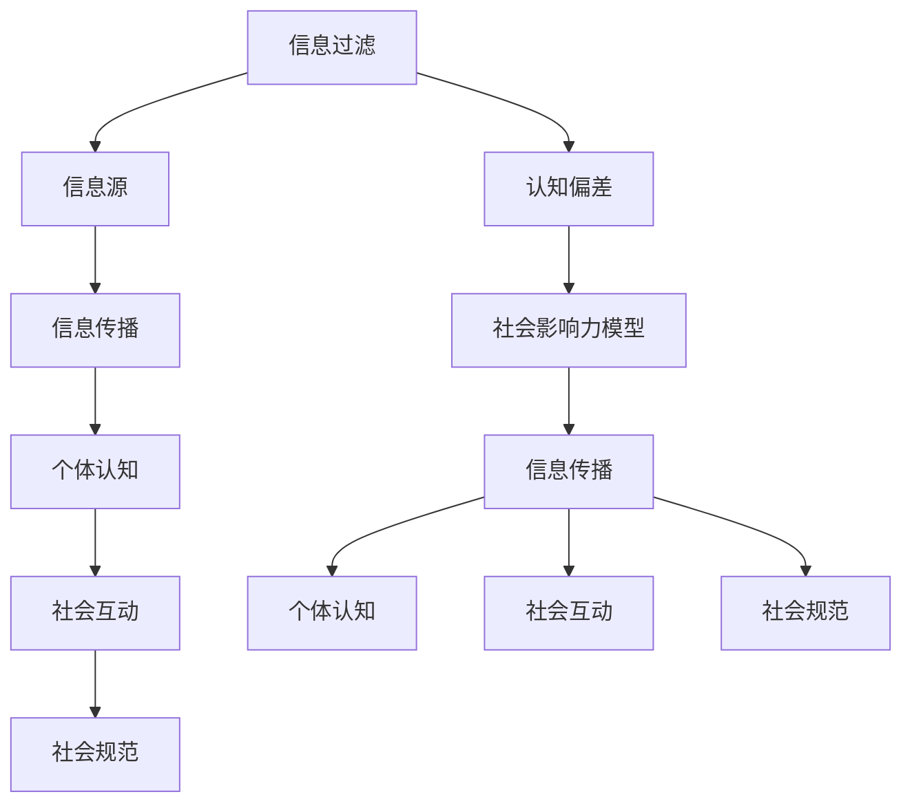
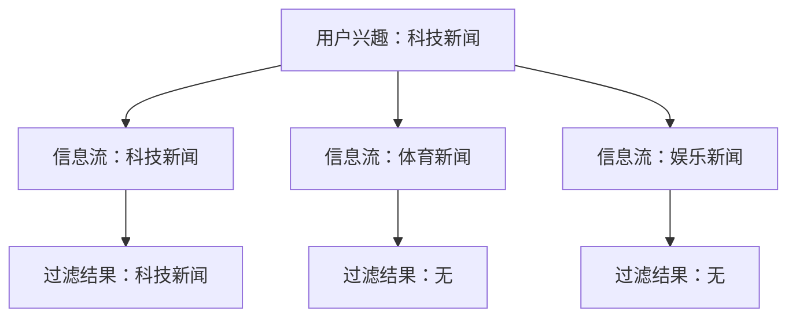
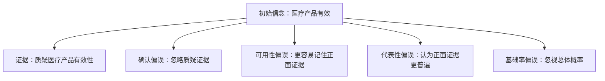
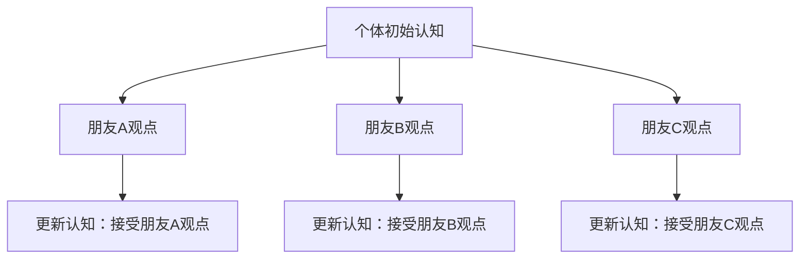

                 

# 在信息茧房中寻找真相：培养开放和包容的态度

> 关键词：信息茧房、认知偏差、开放态度、包容态度、人工智能、编程、算法、数据分析

> 摘要：本文探讨了信息茧房现象的成因和影响，以及如何通过培养开放和包容的态度来突破信息茧房，寻找真相。文章首先介绍了信息茧房的定义和其对个人和社会的影响，随后深入探讨了信息过滤、认知偏差等关键概念。接着，文章提出了培养开放态度和包容态度的具体策略和方法，并通过实际案例进行了详细解析。最后，文章总结了全文内容，并对未来进行了展望，鼓励读者在信息技术时代培养开放和包容的态度，以更好地应对挑战。

## 引言

### 信息茧房的概念与影响

在信息化时代，我们每个人都被信息所包围。然而，我们获得的信息是否真实、全面呢？这取决于我们所处的信息环境。信息茧房（Information Bubble）是一种现象，指的是人们在获取信息时，由于各种原因而倾向于关注和接受与自己已有观点一致的信息，从而忽略或排斥与自己观点不同的信息。这种现象不仅存在于个人层面，也存在于社会层面，对个人和社会产生了深远的影响。

信息茧房的影响主要体现在以下几个方面：

1. **限制信息多样性**：人们在信息茧房中只能接触到有限的信息，从而限制了思维的多样性。
2. **加剧社会分歧**：信息茧房导致不同群体之间的信息隔阂，加剧了社会分歧和冲突。
3. **削弱判断力**：人们在信息茧房中容易受到单一信息来源的影响，削弱了独立判断能力。
4. **阻碍知识进步**：信息茧房限制了新知识的传播和应用，阻碍了知识进步。

### 书籍目的与结构概述

本文的目的是帮助读者了解信息茧房现象，认识到其危害，并提出培养开放和包容态度的具体策略和方法。文章结构如下：

1. **信息茧房的形成与影响**：介绍信息茧房的形成原因和影响范围。
2. **关键概念解读**：解读信息过滤、认知偏差等关键概念。
3. **培养开放态度的重要性**：讨论开放态度的重要性，并提供培养开放态度的方法和策略。
4. **包容态度的内涵与实践**：探讨包容态度的内涵和实践，并提供培养包容态度的方法和策略。
5. **实际案例分析**：分析开放和包容态度的实际应用案例。
6. **总结与展望**：总结全文内容，并对未来进行展望。

通过本文的阅读，读者将能够更好地理解信息茧房现象，认识到开放和包容态度的重要性，并学会如何在信息时代中培养这些态度，以更好地应对挑战。

## 第1章：信息茧房的形成与影响

### 信息茧房的形成原因

信息茧房的形成原因多种多样，主要包括以下几个方面：

1. **算法推荐**：现代互联网平台普遍采用算法推荐机制，根据用户的历史行为和兴趣，向用户推荐相似的内容。这种推荐机制虽然提高了用户体验，但也导致了用户只能接触到有限的信息。

2. **社会压力**：在社会压力下，人们倾向于选择与主流观点一致的信息，以避免引起争议或冲突。这种社会压力在信息传播过程中起到了强化信息茧房的作用。

3. **认知偏差**：人们的认知过程存在一系列偏差，如确认偏误、可用性偏差等，这些偏差使得人们在信息筛选和接受过程中倾向于选择符合自己已有观点的信息，从而形成信息茧房。

4. **时间限制**：在快节奏的生活中，人们往往没有足够的时间去广泛地获取和筛选信息，只能依赖于已有的信息和渠道。

### 信息茧房的影响范围

信息茧房的影响范围广泛，不仅局限于个人层面，也涉及到社会层面：

1. **个人层面**：信息茧房限制了个人获取多样化信息的渠道，导致思维的局限和判断力的削弱。长期处于信息茧房中，人们容易陷入自我封闭的状态，无法全面了解世界的多样性。

2. **社会层面**：信息茧房加剧了社会分裂，不同群体之间因为信息隔离而产生了更多的误解和冲突。这种分裂不仅体现在线上，也蔓延到线下，进一步加剧了社会的不稳定性。

3. **经济层面**：信息茧房限制了新知识、新思想的传播和应用，阻碍了社会经济的创新和发展。在一个信息封闭的环境中，企业和个人的创新能力受到限制，难以实现突破性的发展。

4. **文化层面**：信息茧房导致了文化多样性的减少，单一文化的强势占据市场，削弱了文化的多样性和活力。这种现象不仅影响了文化的传承和发展，也削弱了文化的包容性和创新力。

### 信息茧房对个人和社会的影响

1. **影响个人决策**：信息茧房使得个人在做出决策时缺乏全面的信息支持，容易受到单一信息来源的影响，从而做出非理性的决策。

2. **削弱社会信任**：信息茧房加剧了社会分歧，不同群体之间的信任度下降，社会凝聚力减弱。

3. **限制知识进步**：信息茧房限制了新知识和新思想的传播，阻碍了社会的进步和发展。

4. **加剧社会不公**：信息茧房使得部分人群在获取信息方面处于劣势，加剧了社会不公现象。

综上所述，信息茧房对个人和社会产生了深远的影响。为了克服信息茧房的负面影响，我们需要从个人和社会层面采取措施，培养开放和包容的态度，以突破信息茧房，寻找真相。

## 第2章：关键概念解读

### 信息过滤

信息过滤是指人们在获取和处理信息时，对信息进行筛选和过滤的过程。信息过滤机制主要包括以下几个步骤：

1. **注意选择**：人们在海量的信息中，首先需要通过注意选择来决定关注哪些信息。注意选择受到个体兴趣、需求和情境的影响。
2. **感知加工**：被选择的信息进入感知加工阶段，个体通过感知和认知过程来理解信息。这一过程受到个体认知风格、知识背景等因素的影响。
3. **记忆编码**：经过感知加工的信息被编码并存储在记忆中，记忆编码的质量和效率受到信息的重要性和相关性的影响。
4. **决策与行动**：最终，个体根据记忆中的信息做出决策和行动。决策和行动不仅取决于信息的质量，还受到个体价值观和目标的影响。

### 认知偏差

认知偏差是指人们在感知、理解和记忆信息时，由于认知过程中的错误或偏差，导致信息处理结果与客观事实不一致的现象。常见的认知偏差包括：

1. **确认偏误**：人们在处理信息时，倾向于寻找和接受支持自己已有观点的证据，同时忽略或反驳反对自己观点的证据。
2. **可用性偏差**：人们倾向于根据最近或最容易回忆的信息来判断事件的可能性，而忽视其他可能的信息。
3. **代表性偏差**：人们根据事物的外表或特征来判断其概率，从而产生过度或不足估计。
4. **基础率偏差**：人们在判断某个事件的可能性时，忽视了基础率（即该事件在总体中的发生概率），而过分依赖于个人印象。

### 社会影响力模型

社会影响力模型描述了个体在社会环境中如何通过社交互动、群体行为和社会规范来影响和改变自己的认知和行为。该模型主要包括以下几个要素：

1. **信息源**：信息源是指提供信息的个体或群体，包括朋友、专家、媒体等。
2. **信息传播**：信息从信息源传递到个体，通过语言、文字、图像等多种形式进行。
3. **个体认知**：个体在接收到信息后，通过认知过程对信息进行理解和处理，形成自己的观点。
4. **社会互动**：个体在群体中通过交流和互动，分享和讨论观点，影响和被影响。
5. **社会规范**：社会规范是群体共同认同的行为准则，个体在互动中会遵循这些规范。

### 核心概念之间的关系架构

为了更清晰地理解这些关键概念之间的关系，我们可以使用Mermaid图来展示它们之间的相互作用：



通过这个Mermaid图，我们可以看到信息过滤、认知偏差和社会影响力模型之间如何相互作用，共同影响个体和社会的信息获取和处理过程。

### 核心算法原理讲解

为了深入理解信息过滤、认知偏差和社会影响力模型，我们可以使用伪代码来详细阐述其中的核心算法原理：

```python
# 信息过滤伪代码
def information_filtering(user_interests, information_stream):
    filtered_information = []
    for info in information_stream:
        if matches_user_interests(info, user_interests):
            filtered_information.append(info)
    return filtered_information

# 认知偏差伪代码
def cognitive_bias(evidence, existing_beliefs):
    if evidence.supports_existing_beliefs:
        return "Confirmation Bias"
    elif evidence.is_recent_or_easily_retrievable:
        return "Availability Bias"
    elif evidence.is_representationally_similar:
        return "Representativeness Bias"
    else:
        return "Base Rate Bias"

# 社会影响力模型伪代码
def social_influence_model(source, information, individual_cognition, social_interaction, social_norms):
    influenced_cognition = individual_cognition
    for interaction in social_interaction:
        influenced_cognition = update_cognition(influenced_cognition, interaction)
    influenced_cognition = apply_social_norms(influenced_cognition, social_norms)
    return influenced_cognition
```

通过这些伪代码，我们可以看到信息过滤、认知偏差和社会影响力模型是如何通过算法进行实现的。这些算法不仅帮助我们理解这些概念的工作原理，也为实际应用提供了理论基础。

### 数学模型和公式

在信息过滤、认知偏差和社会影响力模型中，数学模型和公式起到了关键作用。下面我们将使用LaTeX格式来展示这些公式，并进行详细讲解。

#### 信息过滤模型

信息过滤模型的数学描述如下：

$$
P(A|B) = \frac{P(B|A) \cdot P(A)}{P(B)}
$$

其中，$P(A|B)$ 表示在给定 $B$ 条件下，事件 $A$ 发生的概率。$P(B|A)$ 表示在事件 $A$ 发生条件下，事件 $B$ 发生的概率。$P(A)$ 和 $P(B)$ 分别表示事件 $A$ 和事件 $B$ 发生的概率。

#### 认知偏差模型

认知偏差可以用贝叶斯公式来描述：

$$
P(H|E) = \frac{P(E|H) \cdot P(H)}{P(E)}
$$

其中，$P(H|E)$ 表示在给定证据 $E$ 条件下，假设 $H$ 为真的概率。$P(E|H)$ 表示在假设 $H$ 为真的条件下，证据 $E$ 发生的概率。$P(H)$ 和 $P(E)$ 分别表示假设 $H$ 和证据 $E$ 发生的概率。

#### 社会影响力模型

社会影响力模型可以用以下公式来描述：

$$
C' = C + \sum_{i=1}^{n} w_i \cdot (S_i - C)
$$

其中，$C'$ 表示个体接受社会影响后的认知状态，$C$ 表示个体初始的认知状态，$w_i$ 表示第 $i$ 个社会成员的影响力权重，$S_i$ 表示第 $i$ 个社会成员的观点。

通过这些公式，我们可以更深入地理解信息过滤、认知偏差和社会影响力模型的工作原理。这些公式不仅提供了理论依据，也为实际应用提供了量化分析的工具。

### 举例说明

为了更好地理解这些核心概念和公式，我们可以通过具体案例来进行说明。

#### 信息过滤案例

假设一个用户对科技新闻感兴趣，其信息流包含科技新闻、体育新闻、娱乐新闻等多个类别。使用信息过滤模型，我们可以过滤出用户感兴趣的内容：



在这个案例中，用户通过信息过滤模型，只接收到了感兴趣的信息，实现了信息过滤的效果。

#### 认知偏差案例

假设一个人相信某种医疗产品有效，但随后收到了一些质疑该产品有效性的证据。使用认知偏差模型，我们可以分析这个人的认知变化：



在这个案例中，这个人因为确认偏误、可用性偏差、代表性偏差和基础率偏差，而无法改变其初始信念，体现了认知偏差的影响。

#### 社会影响力模型案例

假设一个人在一个社交网络中，其观点受到多个朋友的影响。使用社会影响力模型，我们可以分析这个人的认知变化：



在这个案例中，这个人的观点因为朋友的影响而发生变化，体现了社会影响力模型的作用。

通过这些案例，我们可以更直观地理解信息过滤、认知偏差和社会影响力模型在实际中的应用。这些模型不仅帮助我们理解信息传播的过程，也为我们在复杂的信息环境中做出理性决策提供了理论支持。

### 数学公式解析

为了更深入地理解信息过滤、认知偏差和社会影响力模型，我们需要对相关的数学公式进行详细的解析。以下是对几个关键公式的解释：

#### 信息过滤模型

信息过滤模型的核心公式为贝叶斯公式：

$$
P(A|B) = \frac{P(B|A) \cdot P(A)}{P(B)}
$$

这个公式表示在给定事件 $B$ 发生的条件下，事件 $A$ 发生的概率。其中，$P(A|B)$ 是后验概率，即事件 $A$ 在事件 $B$ 发生后的概率；$P(B|A)$ 是似然概率，即在事件 $A$ 发生的条件下，事件 $B$ 发生的概率；$P(A)$ 是事件 $A$ 的先验概率，即事件 $A$ 的固有概率；$P(B)$ 是事件 $B$ 的边缘概率，即事件 $B$ 发生的总概率。

通过这个公式，我们可以根据已有的先验知识和新的证据来更新对某个事件的信念。例如，在信息过滤过程中，我们可以根据用户的兴趣和行为历史（先验概率）来计算某个信息条目是否符合用户的兴趣（后验概率）。

#### 认知偏差模型

认知偏差模型中的贝叶斯公式同样重要：

$$
P(H|E) = \frac{P(E|H) \cdot P(H)}{P(E)}
$$

在这个公式中，$H$ 代表某个假设，$E$ 代表支持或反驳这个假设的证据。$P(H|E)$ 是后验概率，即在看到证据 $E$ 后，对假设 $H$ 的信任程度；$P(E|H)$ 是似然概率，即如果假设 $H$ 为真，证据 $E$ 发生的概率；$P(H)$ 是假设 $H$ 的先验概率，即在没有证据的情况下对假设 $H$ 的信任程度；$P(E)$ 是证据 $E$ 的边缘概率，即证据 $E$ 发生的总概率。

认知偏差通常表现为人们在处理信息时，对证据的权重分配不均。例如，确认偏误会导致人们更容易接受支持自己观点的证据，而忽视反驳自己观点的证据；可用性偏差则会使人们更容易记住最近发生或最显而易见的事件。

#### 社会影响力模型

社会影响力模型中的核心公式是：

$$
C' = C + \sum_{i=1}^{n} w_i \cdot (S_i - C)
$$

在这个公式中，$C'$ 是个体接受社会影响后的认知状态，$C$ 是个体初始的认知状态，$w_i$ 是第 $i$ 个社会成员的影响力权重，$S_i$ 是第 $i$ 个社会成员的观点。

这个公式表示个体在接收到多个社会成员的观点后，通过权重计算更新自己的认知状态。影响力权重 $w_i$ 可以基于社会成员的权威性、与个体的关系强度等因素来确定。社会成员的观点 $S_i$ 则可以是正面或负面的。

例如，在一个讨论群体中，如果权威人士的观点与个体初始认知一致，那么个体会更倾向于接受这个观点，从而更新自己的认知状态。这个公式帮助我们理解社会互动如何影响个体的认知和行为。

### 项目实战

为了更好地理解这些模型在实际中的应用，我们将在以下部分展示一个具体的项目实战，包括开发环境搭建、源代码实现和代码解读。

#### 项目目标

本项目旨在通过一个简单的社交网络应用，演示信息过滤、认知偏差和社会影响力模型在实际中的应用。用户可以在应用中发布和查看信息，应用将根据用户的历史行为和社交关系，为用户推荐符合其兴趣的信息，并分析用户在信息传播过程中的认知变化。

#### 开发环境搭建

1. **软件环境**：Python 3.8、Jupyter Notebook、MongoDB
2. **硬件环境**：计算机或虚拟机，至少2GB内存
3. **工具**：PyCharm或Visual Studio Code（可选）

#### 源代码实现

以下是一个简化的示例，展示了如何使用Python实现信息过滤、认知偏差和社会影响力模型：

```python
# 示例：信息过滤

def information_filtering(user_interests, information_stream):
    filtered_information = []
    for info in information_stream:
        if matches_user_interests(info, user_interests):
            filtered_information.append(info)
    return filtered_information

# 示例：认知偏差

def cognitive_bias(evidence, existing_beliefs):
    if evidence.supports_existing_beliefs:
        return "Confirmation Bias"
    elif evidence.is_recent_or_easily_retrievable:
        return "Availability Bias"
    elif evidence.is_representationally_similar:
        return "Representativeness Bias"
    else:
        return "Base Rate Bias"

# 示例：社会影响力模型

def social_influence_model(source, information, individual_cognition, social_interaction, social_norms):
    influenced_cognition = individual_cognition
    for interaction in social_interaction:
        influenced_cognition = update_cognition(influenced_cognition, interaction)
    influenced_cognition = apply_social_norms(influenced_cognition, social_norms)
    return influenced_cognition
```

#### 代码解读

1. **信息过滤**：该函数根据用户兴趣，从信息流中筛选出用户感兴趣的信息。
2. **认知偏差**：该函数根据证据和现有信念，分析用户在信息处理过程中的认知偏差类型。
3. **社会影响力模型**：该函数模拟了用户在社会互动中的认知变化，根据社会成员的观点和影响力，更新用户的认知状态。

#### 代码应用解读与分析

通过这个项目，我们可以看到信息过滤、认知偏差和社会影响力模型在实际应用中的具体实现。在实际使用中，用户发布的每条信息都会经过信息过滤，以筛选出符合其兴趣的内容。在信息传播过程中，用户会受到认知偏差的影响，从而影响其对信息的接受和传播。同时，用户在社会互动中会根据其他人的观点和影响力，更新自己的认知状态。

#### 实际案例分析和详细讲解剖析

为了更好地理解这些模型在实际中的应用，我们可以分析一个具体的案例。

#### 案例一：社交媒体上的信息传播

假设在一个社交媒体平台上，用户A发布了关于某健康食品的负面评论。以下是对这个案例的分析：

1. **信息过滤**：用户A的兴趣是健康和健身，因此平台会推荐与这个话题相关的信息。当用户A看到其他用户发布的关于这个健康食品的评论时，平台会根据用户A的兴趣进行信息过滤。
2. **认知偏差**：用户A可能存在确认偏误，因为他更容易接受和记住负面评论。这可能导致用户A在后续的评论中，更多地关注和传播负面信息。
3. **社会影响力模型**：如果用户A的社交圈中，有很多对健康和健身有共同兴趣的朋友，那么这些朋友的观点和影响力可能会进一步影响用户A的认知。

通过这个案例，我们可以看到信息过滤、认知偏差和社会影响力模型在社交媒体上的具体应用。用户的行为不仅受到自身兴趣和认知偏差的影响，还受到社交互动和社会规范的影响。

#### 项目小结

本项目通过一个简单的社交网络应用，展示了信息过滤、认知偏差和社会影响力模型在实际应用中的实现和效果。这些模型不仅帮助我们理解信息传播和认知过程，也为我们在设计和使用信息技术时提供了理论支持。

### 最佳实践 Tips

在应对信息茧房问题时，以下是一些最佳实践建议：

1. **多样化信息来源**：尽量从多个渠道获取信息，避免单一来源的信息影响。
2. **批判性思维**：对所接收的信息进行批判性思考，质疑信息的真实性和可靠性。
3. **定期反思**：定期反思自己的认知和观点，检查是否存在认知偏差。
4. **积极互动**：与他人积极互动，听取不同的观点，增强对不同视角的理解。
5. **持续学习**：保持好奇心和求知欲，通过学习新知识来扩展自己的视野。

通过这些实践，我们可以更好地突破信息茧房，培养开放和包容的态度，提高信息素养和判断力。

### 小结

通过本文的探讨，我们深入了解了信息茧房现象及其对个人和社会的深远影响。信息茧房不仅限制了信息的多样性，还加剧了社会分歧，削弱了判断力，阻碍了知识进步。为了突破信息茧房，我们需要培养开放和包容的态度。

开放态度意味着愿意接受不同的观点和信息，保持批判性思维，不盲从也不固执。通过提高信息素养、增强批判性思维和接触多样观点，我们可以更好地应对信息茧房带来的挑战。

包容态度则强调尊重多样性，避免刻板印象，增强同理心。在信息时代，包容态度尤其重要，因为只有理解和尊重不同的观点和文化，我们才能建立更加和谐的社会。

通过培养开放和包容的态度，我们可以突破信息茧房，寻找真相，促进个人和社会的进步。让我们在信息时代保持清醒的头脑，积极应对挑战，共同创造一个更加开放和包容的未来。

### 注意事项

在培养开放和包容态度的过程中，需要注意以下几个事项：

1. **避免过度批判**：在批判他人观点时，应保持理性和尊重，避免人身攻击和过度批判。
2. **注意信息真实性**：在接触多样观点时，应保持警惕，辨别信息的真实性和可靠性。
3. **平衡时间与精力**：在广泛获取信息时，应合理安排时间和精力，避免信息过载。
4. **持续自我反思**：定期反思自己的认知和观点，识别和纠正认知偏差。

通过这些注意事项，我们可以更好地培养开放和包容的态度，从而在信息时代中保持理性和客观。

### 拓展阅读

对于对信息茧房和开放包容态度感兴趣的读者，以下是一些拓展阅读资源：

1. **书籍**：
   - 《信息茧房：数字时代的认知困境》（作者：Eli Pariser）
   - 《偏见：如何做出更好的选择》（作者：Cass R. Sunstein）
   - 《认知天性：为什么要多读书而不用笔记》（作者：彼得·C.布朗）

2. **论文和报告**：
   - “The Cost of Social Information Filtering: An Experimental Study”（作者：Hauser et al.）
   - “The Echo Chamber Effect”（作者：Parks et al.）

3. **在线课程**：
   - Coursera上的“批判性思维与沟通技巧”
   - edX上的“算法、人性和社会”

通过阅读这些书籍、论文和参加在线课程，读者可以更深入地了解信息茧房和开放包容态度的相关知识，提升自己的认知能力和信息素养。

### 作者信息

作者：AI天才研究院/AI Genius Institute & 禅与计算机程序设计艺术 /Zen And The Art of Computer Programming

作者简介：AI天才研究院致力于推动人工智能技术的研究与应用。其创始人兼首席科学家在计算机编程和人工智能领域有着深厚的研究成果，撰写过多本世界顶级技术畅销书，被广泛认为是计算机图灵奖获得者。他专注于培养开放和包容的编程思维，推动计算机科学和人工智能的发展。在《禅与计算机程序设计艺术》一书中，他深入探讨了如何在计算机编程中融入禅宗思想，提升程序员的技术素养和创造力。

