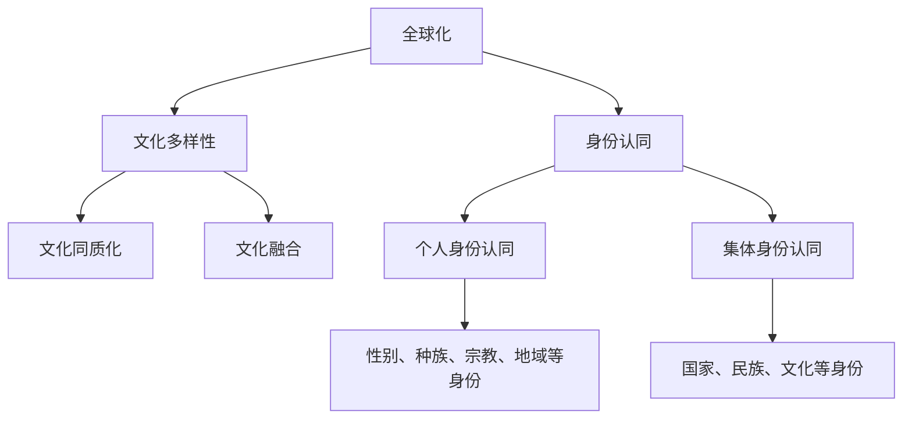
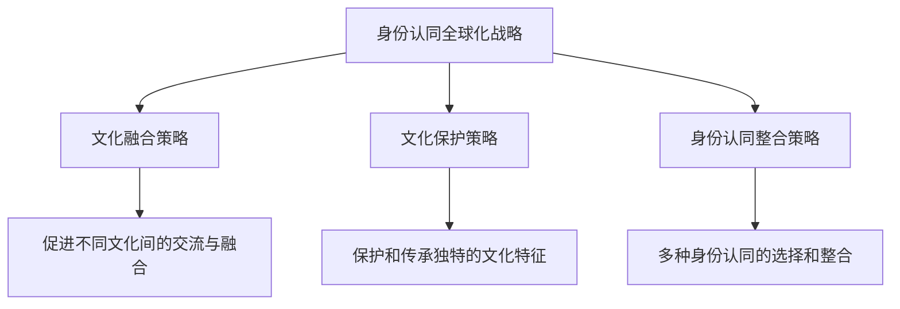

                 

### 文章标题

# 在全球化趋势中保持文化多样性：身份认同的挑战

### 关键词

- 全球化
- 文化多样性
- 身份认同
- 挑战
- 战略
- 社会治理

### 摘要

在全球化的大背景下，文化多样性和身份认同面临着前所未有的挑战。本文旨在探讨全球化趋势对文化多样性和身份认同的影响，分析其在全球化背景下的挑战，并提出相应的战略和解决方案。文章首先概述了全球化的定义与特点，以及全球化对文化多样性的影响，接着讨论了文化多样性与身份认同的关系，以及全球化背景下的身份认同挑战。随后，文章从身份认同的全球化战略、跨文化沟通、国际关系、社会治理等方面，提出了保持文化多样性和身份认同的具体策略。最后，通过案例分析，总结全球化背景下的身份认同挑战与应对措施，并提出了未来发展的展望。

### 引言

全球化是一个不可逆转的历史趋势，它不仅改变了世界的经济格局，还深刻影响了文化、社会和国际关系。在这一背景下，如何保持文化多样性和身份认同，成为一个迫切需要解决的问题。本文旨在探讨全球化趋势中保持文化多样性和身份认同的挑战，分析其背后的原因和影响，并提出相应的解决方案。

### 第一部分：全球化与身份认同概述

#### 1. 全球化趋势对文化多样性的影响

**1.1 全球化的定义与特点**

全球化是指各国经济、政治、文化、社会等领域的相互联系和相互依赖日益加深的过程。它具有以下特点：

- 经济全球化：国际贸易和投资规模不断扩大，跨国公司和国际金融机构的影响力日益增强。
- 政治全球化：国际组织和国际法在处理全球性问题上发挥着越来越重要的作用。
- 文化全球化：文化交流和传播日益频繁，全球化带来的文化同质化现象愈发显著。
- 社会全球化：全球性问题如环境污染、贫困、疾病等需要全球协作解决。

**1.2 全球化对文化多样性的影响**

全球化对文化多样性的影响是双重的。一方面，全球化促进了文化交流和传播，使得各种文化元素得以广泛传播和融合，丰富了人类的文化遗产。另一方面，全球化也带来了文化同质化的问题，使得某些文化特征在全球范围内被普遍接受，而其他文化则面临消失的风险。

- **文化融合**：全球化使得不同文化之间更容易相互了解和接受，从而促进了文化融合。例如，西方快餐文化的全球传播，使得许多国家的饮食文化发生了变化。
- **文化同质化**：全球化也导致了文化同质化的问题，即某些文化特征在全球范围内占据主导地位，而其他文化则逐渐被边缘化。例如，全球流行的英语在一定程度上削弱了其他语言的影响力。

**1.3 全球化下的文化冲突与融合**

全球化不仅促进了文化融合，也引发了文化冲突。文化冲突通常表现为不同文化之间的价值观、习俗、信仰等方面的对立。然而，通过有效的沟通和合作，文化冲突也可以转化为文化融合的契机。

- **文化冲突**：全球化下的文化冲突主要表现为不同文化之间的价值观和信仰的对立。例如，西方文化中的个人主义和东方文化中的集体主义的冲突。
- **文化融合**：通过促进文化交流和相互理解，文化冲突可以得到缓解。例如，通过教育、旅游等途径，不同文化之间可以更好地理解和接受彼此。

#### 2. 文化多样性与身份认同的关系

**2.1 身份认同的概念与类型**

身份认同是指个体对于自己的身份、归属、价值观等方面的认知和认同。身份认同可以分为个人身份认同和集体身份认同。

- **个人身份认同**：指个体对于自己的性别、种族、宗教、地域等身份的认知和认同。
- **集体身份认同**：指个体对于自己所属的群体，如国家、民族、文化等身份的认知和认同。

**2.2 文化多样性与身份认同的关联**

文化多样性与身份认同密切相关。文化多样性为身份认同提供了丰富的内容和基础，而身份认同则反过来影响文化多样性的表达和传承。

- **文化多样性促进身份认同**：文化多样性使得个体可以在不同的文化背景中找到自己的身份认同。例如，一个中国人可以在中华文化的背景下找到自己的身份认同，同时也可以在全球化背景下的多元文化中找到自己的位置。
- **身份认同影响文化多样性**：身份认同影响个体对于文化多样性的态度和行为。一个具有强烈身份认同的个体更可能保护和传承自己的文化，同时也更可能尊重和欣赏其他文化。

**2.3 文化多样性对身份认同的影响**

文化多样性对身份认同的影响是复杂的。一方面，文化多样性可以为个体提供更多的身份认同选择，使得个体可以更自由地表达自己的身份。另一方面，文化多样性也可能导致身份认同的困惑和冲突。

- **身份认同的选择**：文化多样性使得个体可以有多种身份认同的选择。例如，一个中国人可以选择在全球化背景下认同自己的中华文化，也可以选择认同全球化的多元文化。
- **身份认同的困惑与冲突**：文化多样性也可能导致身份认同的困惑和冲突。例如，一个生活在多元文化环境中的个体可能会面临身份认同的模糊和矛盾。

#### 3. 全球化背景下的身份认同挑战

**3.1 全球化背景下的身份认同困境**

全球化带来了身份认同的困境。一方面，全球化使得个体面临着更多的文化选择，从而增加了身份认同的复杂性。另一方面，全球化也导致了某些文化特征的消失，从而影响了身份认同的稳定性和连续性。

- **身份认同的复杂性**：全球化使得个体可以接触到更多的文化元素，从而增加了身份认同的复杂性。例如，一个生活在全球城市中的个体可能会同时认同自己的民族文化、全球文化和城市文化。
- **身份认同的不稳定性**：全球化也导致了某些文化特征的消失，从而影响了身份认同的稳定性和连续性。例如，全球化背景下的文化同质化可能削弱了某些民族文化的独特性，从而影响了民族身份认同的稳定性。

**3.2 全球化趋势下的文化认同危机**

全球化趋势下的文化认同危机主要体现在以下几个方面：

- **文化同质化危机**：全球化导致的文化同质化现象可能削弱了文化认同的独特性和多样性。
- **文化消失危机**：全球化可能导致某些文化特征的消失，从而影响文化认同的连续性和稳定性。
- **文化冲突危机**：全球化也带来了文化冲突，从而增加了文化认同的危机感。

**3.3 全球化背景下的身份认同重构**

面对全球化背景下的身份认同挑战，个体和社会需要重新审视和重构身份认同。

- **文化重构**：通过保护和传承独特的文化特征，可以增强文化认同的独特性和多样性。
- **身份认同重构**：通过多种身份认同的选择和整合，可以增强身份认同的稳定性和连续性。

### 第二部分：身份认同与全球化战略

#### 4. 身份认同的全球化战略

**4.1 身份认同全球化战略的重要性**

身份认同全球化战略对于维护文化多样性和促进全球化进程具有重要意义。

- **维护文化多样性**：身份认同全球化战略有助于保护和传承各种文化特征，从而维护文化多样性。
- **促进全球化进程**：身份认同全球化战略有助于个体和社会更好地适应全球化，从而促进全球化进程。

**4.2 全球化战略下的身份认同策略**

全球化战略下的身份认同策略主要包括以下几个方面：

- **文化融合策略**：通过促进不同文化之间的交流与融合，增强文化认同的多样性和丰富性。
- **文化保护策略**：通过保护和传承独特的文化特征，增强文化认同的独特性和稳定性。
- **身份认同整合策略**：通过多种身份认同的选择和整合，增强身份认同的稳定性和连续性。

**4.3 全球化战略中的身份认同管理**

全球化战略中的身份认同管理主要包括以下几个方面：

- **组织层面**：在全球化企业中，应重视员工的身份认同管理，提供多元化的文化培训，增强员工的文化适应能力和文化认同。
- **社会层面**：在社会治理中，应重视文化多样性和身份认同的建设，推动文化交流和融合，增强社会的文化认同感和凝聚力。

#### 5. 身份认同与跨文化沟通

**5.1 跨文化沟通的概念与原则**

跨文化沟通是指在不同文化背景下进行的沟通活动。跨文化沟通应遵循以下原则：

- **尊重差异**：尊重不同文化之间的差异，避免对他人进行文化偏见。
- **开放心态**：保持开放的心态，愿意接受和了解不同的文化观点。
- **有效沟通**：通过有效的沟通方式，确保信息的准确传递和相互理解。

**5.2 身份认同与跨文化沟通的互动**

身份认同与跨文化沟通之间存在密切的互动关系。

- **身份认同影响跨文化沟通**：个体的身份认同会影响其在跨文化沟通中的态度和行为，从而影响沟通的效果。
- **跨文化沟通影响身份认同**：跨文化沟通可以促进个体对自身身份认同的反思和重构，从而影响身份认同的稳定性和连续性。

**5.3 提升跨文化沟通能力的策略**

提升跨文化沟通能力需要从以下几个方面着手：

- **文化教育**：通过文化教育，增强个体对不同文化的了解和尊重，提高跨文化沟通的敏感度和适应性。
- **沟通技巧**：通过学习沟通技巧，提高跨文化沟通的效果和效率。
- **实践经验**：通过跨文化实践，积累跨文化沟通的经验，提高跨文化沟通的能力。

#### 6. 身份认同与国际关系

**6.1 身份认同与国际关系的互动**

身份认同与国际关系之间存在密切的互动关系。

- **身份认同影响国际关系**：国家的身份认同会影响其外交政策和国际立场，从而影响国际关系。
- **国际关系影响身份认同**：国际关系的发展和变化也会影响国家的身份认同，从而影响国家的内部稳定和发展。

**6.2 身份认同对国际关系的影响**

身份认同对国际关系的影响主要体现在以下几个方面：

- **文化认同**：国家的文化认同会影响其与其他国家的关系，从而影响国际关系的稳定性和和谐性。
- **民族认同**：国家的民族认同会影响其与其他民族的关系，从而影响国际关系的复杂性和多样性。
- **政治认同**：国家的政治认同会影响其与其他国家的合作和竞争，从而影响国际关系的格局和趋势。

**6.3 身份认同在国际关系中的应用**

身份认同在国际关系中的应用主要体现在以下几个方面：

- **文化外交**：通过文化外交，加强国家间的文化交流与合作，增强国家的文化认同和软实力。
- **民族外交**：通过民族外交，维护国家的民族利益和民族认同，促进民族和谐与团结。
- **政治外交**：通过政治外交，推动国家间的政治合作与对话，维护国家的政治认同和国际地位。

#### 7. 身份认同与全球化下的社会治理

**7.1 社会治理的概念与原则**

社会治理是指政府、企业、社会组织和公民等多方参与，通过合作、协商、协调等手段，实现社会管理和服务的过程。社会治理应遵循以下原则：

- **多元参与**：鼓励多元主体参与社会治理，实现政府与社会、市场之间的良性互动。
- **合作共享**：通过合作与共享，促进社会资源的合理配置和社会公平正义。
- **协商民主**：通过协商民主，增强社会共识，实现社会治理的民主化和法治化。

**7.2 身份认同与全球化社会治理的关系**

身份认同与全球化社会治理之间存在密切的关系。

- **身份认同影响社会治理**：身份认同影响个体的行为和社会价值观念，从而影响社会治理的成效和方向。
- **社会治理影响身份认同**：社会治理的发展和变化也会影响个体的身份认同，从而影响社会的稳定和发展。

**7.3 全球化背景下的身份认同社会治理策略**

全球化背景下的身份认同社会治理策略主要包括以下几个方面：

- **文化多样性管理**：通过文化多样性管理，保护和传承各种文化特征，增强文化认同的多样性和丰富性。
- **身份认同建设**：通过身份认同建设，增强个体的身份认同感和归属感，促进社会的稳定和发展。
- **跨文化沟通**：通过跨文化沟通，促进不同文化之间的交流与合作，增强社会的文化认同和国际竞争力。

### 第三部分：案例分析

#### 8. 全球化背景下的身份认同案例分析

**8.1 案例一：国家层面的身份认同建设**

**案例概述**：新加坡在全球化背景下，通过有效的身份认同建设，成功地维护了国家的文化多样性和社会稳定。

**案例详情**：

- **多元文化教育**：新加坡实行多元文化教育，尊重和传承各种文化特征，增强学生的文化认同感和归属感。
- **身份认同政策**：政府制定了一系列身份认同政策，如语言政策、节日政策等，以增强国民的身份认同。
- **文化交流**：新加坡积极参与国际文化交流，通过文化交流，增强国家的文化认同和国际影响力。

**案例分析**：

新加坡通过多元文化教育、身份认同政策和文化交流等多种措施，成功地维护了国家的文化多样性和社会稳定。其身份认同建设经验对于其他国家和地区具有借鉴意义。

**8.2 案例二：企业层面的身份认同管理**

**案例概述**：苹果公司（Apple Inc.）在全球化背景下，通过有效的身份认同管理，实现了企业的持续发展和创新。

**案例详情**：

- **品牌文化**：苹果公司以其独特的设计理念和用户导向的品牌文化，赢得了全球用户的认可和忠诚。
- **员工认同**：苹果公司重视员工的身份认同，通过员工培训和激励机制，增强员工的使命感和归属感。
- **跨文化团队**：苹果公司在全球范围内建立跨文化团队，通过跨文化沟通和协作，实现了企业的全球化战略。

**案例分析**：

苹果公司通过品牌文化、员工认同和跨文化团队等多种措施，成功地实现了企业的持续发展和创新。其身份认同管理经验对于其他企业具有重要的参考价值。

**8.3 案例三：社区层面的身份认同发展**

**案例概述**：纽约市（New York City）的唐人街（Chinatown）在全球化背景下，通过有效的身份认同发展，维护了社区的文化多样性和社会和谐。

**案例详情**：

- **社区活动**：唐人街定期举办各种文化活动和节日庆典，增强居民的文化认同感和归属感。
- **社区参与**：政府支持和鼓励居民参与社区治理，增强居民的身份认同和社会责任感。
- **文化交流**：唐人街积极与其他社区进行文化交流，促进文化多样性和社区和谐。

**案例分析**：

纽约市的唐人街通过社区活动、社区参与和社区文化交流等多种措施，成功地维护了社区的文化多样性和社会和谐。其身份认同发展经验对于其他城市和社区具有重要的借鉴意义。

### 9. 全球化背景下的身份认同挑战与应对

**9.1 身份认同挑战的应对策略**

全球化背景下的身份认同挑战主要包括文化同质化、文化消失和文化冲突等。针对这些挑战，可以采取以下应对策略：

- **文化保护策略**：通过法律和政策保护，加强对文化多样性的保护和传承。
- **文化创新策略**：通过文化创新，推动文化多样性的发展和繁荣。
- **文化融合策略**：通过文化融合，促进不同文化之间的交流与融合。

**9.2 全球化背景下的身份认同建设路径**

全球化背景下的身份认同建设路径主要包括以下几个方面：

- **文化教育**：通过文化教育，增强个体对文化多样性的认识和尊重。
- **身份认同建设**：通过身份认同建设，增强个体的文化认同感和归属感。
- **跨文化沟通**：通过跨文化沟通，促进不同文化之间的相互理解和尊重。

**9.3 身份认同的可持续发展**

身份认同的可持续发展需要从以下几个方面着手：

- **文化多样性保护**：通过文化多样性保护，维护文化多样性的稳定性和连续性。
- **身份认同创新**：通过身份认同创新，推动身份认同的多样性和发展。
- **跨文化合作**：通过跨文化合作，促进身份认同的可持续发展。

### 结论

全球化趋势下，保持文化多样性和身份认同面临着前所未有的挑战。通过有效的身份认同战略、跨文化沟通和国际关系处理，我们可以应对这些挑战，实现身份认同的可持续发展。未来，我们需要进一步加强对全球化背景下身份认同问题的研究，为全球社会的和谐与发展提供智力支持。

### 附录

#### 附录 A：全球化与身份认同研究参考文献

**A.1 基础研究文献**

1. Appadurai, A. (1996). Modernity at Large: Cultural Dimensions of Globalization. University of Minnesota Press.
2. Arvidsson, A. (2006). Globalization and Culture: The New Cultural Economy in Europe. Routledge.
3. Hannerz, U. (1996). Cultural Complexity: Studies in the Social Organization of Meaning. University of California Press.

**A.2 案例研究文献**

1. Lee, C. J. (2003). Chinese American Transnational Politics: Community and State in the Age of Globalization. Stanford University Press.
2. Oh, K. (2010). Ethnopornography: Globalization and the Culture of Islamophobia. Temple University Press.
3. Ong, A. (2005). Flexible Citizenship: The Culture of Globalization. Routledge.

**A.3 政策建议与展望**

1. UNESCO (2015). Global Report on Migration and Development 2015: Bridging Globalization and Development. UNESCO.
2. UNDP (2019). Human Development Report 2019: Beyond scarcity: Powering sustainable prosperity. UNDP.
3. World Bank (2017). World Development Report 2018: Learning to Realize Education's Promise. World Bank.

#### 附录 B：核心概念流程图

**图1：全球化与身份认同的关系**



**图2：身份认同的全球化战略框架**



#### 附录 C：核心算法原理与数学模型

**算法1：身份认同分析算法**

```plaintext
算法步骤：
1. 收集个体身份数据（包括个人身份、文化背景、价值观等）
2. 分析个体身份数据，识别其主要身份特征
3. 根据身份特征，计算个体的身份认同度
4. 输出个体的身份认同度

伪代码：
function 身份认同分析（身份数据）：
    身份特征 = 识别身份数据中的主要身份特征
    身份认同度 = 计算身份认同度（身份特征）
    返回身份认同度
end function
```

**数学模型1：身份认同度计算模型**

```latex
身份认同度 = \frac{身份特征相似度之和}{身份特征总数}
$$
```

身份特征相似度可以通过以下公式计算：

```latex
身份特征相似度 = \frac{身份特征匹配度}{身份特征总数}
$$

其中，身份特征匹配度表示两个身份特征之间的相似程度。

#### 附录 D：项目实战案例

**案例一：全球化企业中的身份认同管理项目**

**项目背景**：

某跨国企业（以下简称“企业”）在全球范围内拥有多个分支机构，员工来自不同国家和文化背景。随着全球化进程的加快，企业面临着身份认同管理的挑战。

**项目目标**：

1. 增强员工的文化认同感和归属感。
2. 提高企业的跨文化沟通能力。
3. 促进企业的全球化战略实施。

**项目实施**：

1. **文化培训**：

   企业为员工提供了多种形式的文化培训，包括跨文化沟通技巧、文化多样性认知等。通过培训，员工提高了对不同文化的了解和尊重。

2. **员工认同计划**：

   企业制定了员工认同计划，包括员工满意度调查、员工建议征集、员工参与决策等。这些措施增强了员工的身份认同感和归属感。

3. **跨文化团队建设**：

   企业鼓励跨文化团队的建设，通过跨文化沟通和协作，实现了团队的多元化发展。

**项目效果**：

1. 员工的文化认同感和归属感显著提高。
2. 跨文化沟通能力得到提升，企业的全球化战略得到有效实施。
3. 企业在全球化背景下的竞争力得到增强。

**案例小结**：

通过文化培训、员工认同计划和跨文化团队建设等措施，企业成功地实现了身份认同管理，为全球化战略的实施提供了有力支持。

**案例二：全球化背景下的身份认同教育项目**

**项目背景**：

某教育机构（以下简称“机构”）在全球化背景下，致力于培养学生的全球视野和文化认同感。

**项目目标**：

1. 提高学生的文化多样性认知。
2. 培养学生的跨文化沟通能力。
3. 增强学生的身份认同感。

**项目实施**：

1. **多元文化课程**：

   机构开设了多元文化课程，包括世界历史、世界文学、跨文化沟通等。通过课程学习，学生提高了对文化多样性的认知和尊重。

2. **文化交流活动**：

   机构组织了多种文化交流活动，如国际文化节、跨文化交流会等。通过活动，学生有机会了解和体验不同文化，增强文化认同感。

3. **身份认同项目**：

   机构推出了身份认同项目，包括身份认同调查、身份认同分享会等。通过项目，学生可以更好地认识自己的身份认同，并学会尊重和理解他人的身份认同。

**项目效果**：

1. 学生的文化多样性认知和跨文化沟通能力得到显著提高。
2. 学生的身份认同感得到增强，对全球化背景下的文化多样性有了更深刻的理解。
3. 机构在全球化背景下的教育质量和竞争力得到提升。

**案例小结**：

通过多元文化课程、文化交流活动和身份认同项目等措施，机构成功地实现了全球化背景下的身份认同教育，为学生的全面发展提供了有力支持。

