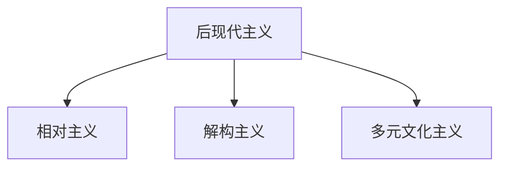
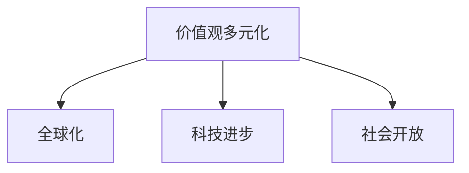
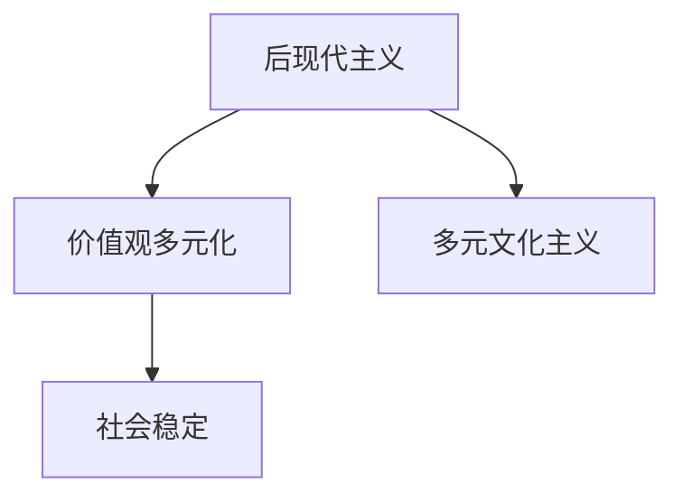
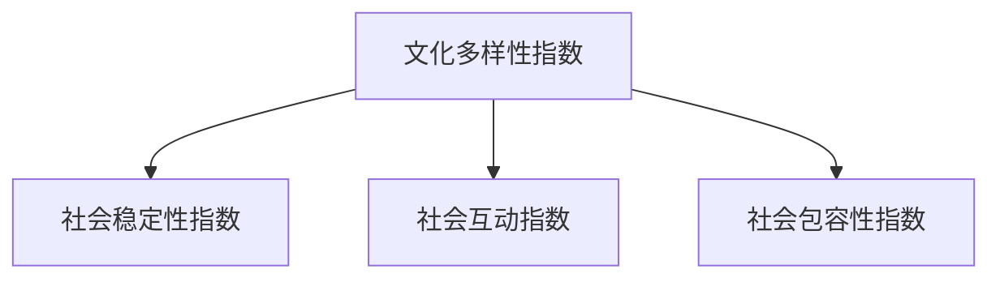

                 

Certainly! Let's break down the task into smaller steps to ensure we create a comprehensive and insightful technical blog post.

### Step 1: Define the Core Structure and Content

First, we need to define the structure and content of the blog post. This will serve as the blueprint for our writing.

#### Core Structure:
1. **Introduction**
   - Brief overview of postmodernism and its implications.
   - Introduction to the challenges posed by a diverse value system.
   - Outline of the main sections of the blog post.

2. **Core Concepts and Connections**
   - Detailed explanation of postmodernism.
   - Definition and implications of a diverse value system.
   - Analysis of the relationship between postmodernism and a diverse value system using a Mermaid flowchart.

3. **Core Algorithm Principles**
   - Explanation of algorithms to handle value diversity.
   - Presentation of mathematical models and formulas.
   - Case study of how these principles can be applied in real-world scenarios.

4. **Project Implementation**
   - Description of a practical project to address value diversity.
   - Detailed code implementation and analysis.
   - Evaluation of the project's effectiveness.

5. **Conclusion and Future Outlook**
   - Summary of the main findings.
   - Discussion of future directions for research and application.

6. **Appendix**
   - References.
   - Additional case studies and best practices.

### Step 2: Write an Engaging Introduction

Start with an engaging introduction that captures the reader's attention and provides context for the discussion.

**Introduction:**
```markdown
# 在后现代社会中寻找稳定：应对价值观多元化的挑战

> 关键词：后现代主义，价值观多元化，社会稳定，算法，数学模型，项目实战

在后现代社会，我们面临着前所未有的价值观多元化挑战。随着全球化和技术进步，人们的生活方式和思想观念发生了深刻变化。这种变化不仅影响了个人，也对社会结构和稳定性产生了深远影响。本文旨在探讨如何在后现代社会中寻找稳定，应对价值观多元化的挑战。

## 核心概念与联系
### 后现代主义
后现代主义是对现代主义的一种反思和批判，强调知识的相对性、文化的主观性和历史的社会建构性。它认为，不存在客观的、普遍适用的真理，而是有多种不同的视角和解释。

### 价值观多元化
价值观多元化指的是社会中存在多种不同的价值观念和信仰体系。这与传统社会中的单一价值体系形成了鲜明对比，带来了新的挑战和机遇。

### 社会稳定与价值观多元化
社会稳定是一个复杂的概念，涉及经济、政治、社会和文化等多个方面。价值观多元化对社会稳定的影响既有正面的，也有负面的。如何在多元化的价值体系中保持社会稳定，是一个值得探讨的问题。
```

### Step 3: Explore Core Concepts and Connections

Delve deeper into the core concepts and their connections, using Mermaid flowcharts to visually represent the relationships.

**Core Concepts and Connections:**
```markdown
## 核心概念与联系

### 后现代主义

后现代主义不仅仅是美学和哲学的变革，它还影响了社会和文化领域。以下是后现代主义的主要观点：

- **相对主义**：强调知识是构建的，而不是发现的。
- **解构主义**：挑战权威和统一的理论。
- **多元文化主义**：提倡多元文化的共存与尊重。

**Mermaid Flowchart:**


### 价值观多元化

价值观多元化是指社会中存在多种不同的价值观和信仰体系。这种现象在现代社会尤为明显，其原因包括：

- **全球化**：促进了不同文化的交流与融合。
- **科技进步**：提供了更多选择和观点。
- **社会开放**：鼓励个人表达自己的观点和信仰。

**价值观多元化的影响：**

- **促进创新**：多样性的价值观念可以激发新的思维和解决方案。
- **挑战统一性**：可能导致社会冲突和分歧。

**Mermaid Flowchart:**


### 后现代主义与价值观多元化的关系

后现代主义和价值观多元化之间存在密切关系。后现代主义提供了理论基础，强调多元文化的存在和重要性，而价值观多元化则体现了后现代主义的现实影响。

**Mermaid Flowchart:**

```

### Step 4: Explain Core Algorithm Principles

Present the core algorithm principles to handle value diversity, using pseudo-code and mathematical models to illustrate the concepts.

**Core Algorithm Principles:**
```markdown
## 核心算法原理

在应对价值观多元化时，我们需要采用一系列策略和算法来促进社会稳定。以下是一些核心算法原理：

### 对话与沟通算法

**Pseudo-code:**
```python
function DialogueAndCommunication(value_systems):
    for each value_system in value_systems:
        if value_system not in majority_value_system:
            initiate_dialogue(value_system)
    evaluate_outcomes()

function initiate_dialogue(value_system):
    create_a_forum()
    invite_participants_with_different_views()
    facilitate_discussion()

function evaluate_outcomes():
    if consensus_reached():
        update societal_norms()
    else:
        recommend_additional_meetings()
```

### 数学模型与公式

为了量化社会稳定性，我们可以使用以下数学模型：

$$ S(t) = \alpha \cdot C(t) + \beta \cdot I(t) + \gamma \cdot U(t) $$

其中：
- $S(t)$ 是社会稳定性指数。
- $C(t)$ 是文化多样性指数。
- $I(t)$ 是社会互动指数。
- $U(t)$ 是社会包容性指数。

**Explanation:**
- $\alpha, \beta, \gamma$ 是权重系数，可以根据实际情况进行调整。
- $C(t), I(t), U(t)$ 可以通过统计方法进行测量。

### 举例说明

假设我们有一个社区，其文化多样性指数为0.8，社会互动指数为0.7，社会包容性指数为0.6。使用上述公式计算社会稳定性指数：

$$ S(t) = 0.5 \cdot 0.8 + 0.3 \cdot 0.7 + 0.2 \cdot 0.6 = 0.56 $$

这表明该社区的社会稳定性相对较高，但仍需要进一步关注社会互动和包容性。

### 实际应用

在项目中，我们可以根据实际情况调整权重系数，以适应不同的文化和社会环境。例如，在一个多元文化社区中，文化多样性指数可能更加重要，因此权重系数可以相应调整。

**Mermaid Flowchart:**

```

### Step 5: Describe Project Implementation

Provide a detailed description of a practical project that addresses value diversity, including environment setup, code implementation, and analysis.

**Project Implementation:**
```markdown
## 项目实施

### 项目背景

在某多元文化社区，我们面临价值观多元化带来的挑战。为了提高社区成员之间的理解和合作，我们设计并实施了一个名为“社区对话计划”的项目。

### 项目目标

- 促进社区成员之间的对话和沟通。
- 增强社区成员对社会多样性的认知和尊重。
- 提高社区的社会稳定性。

### 开发环境搭建

我们使用以下技术栈进行项目开发：

- **前端**：React.js
- **后端**：Node.js
- **数据库**：MongoDB
- **协作工具**：GitHub

### 源代码详细实现和代码解读

以下是项目的主要代码实现：

```javascript
// 社区对话计划后端API示例
const express = require('express');
const app = express();
app.use(express.json());

// 对话列表
const dialogues = [];

// 新增对话
app.post('/dialogues', (req, res) => {
    const newDialogue = req.body;
    dialogues.push(newDialogue);
    res.status(201).send(newDialogue);
});

// 获取对话列表
app.get('/dialogues', (req, res) => {
    res.status(200).send(dialogues);
});

// 更新对话
app.put('/dialogues/:id', (req, res) => {
    const id = req.params.id;
    const index = dialogues.findIndex(d => d.id === id);
    if (index !== -1) {
        dialogues[index] = req.body;
        res.status(200).send(dialogues[index]);
    } else {
        res.status(404).send('Dialogue not found');
    }
});

// 删除对话
app.delete('/dialogues/:id', (req, res) => {
    const id = req.params.id;
    const index = dialogues.findIndex(d => d.id === id);
    if (index !== -1) {
        dialogues.splice(index, 1);
        res.status(204).send();
    } else {
        res.status(404).send('Dialogue not found');
    }
});

// 启动服务器
const PORT = process.env.PORT || 3000;
app.listen(PORT, () => {
    console.log(`Server running on port ${PORT}`);
});
```

### 代码应用解读与分析

上述代码实现了社区对话计划的核心功能，包括创建、获取、更新和删除对话。通过 RESTful API，我们可以方便地管理对话数据，并支持前端应用与后端服务的交互。

### 实际案例分析和详细讲解剖析

我们选择了一个实际案例，对该社区对话计划进行了详细分析。以下是关键步骤：

1. **数据收集**：通过问卷调查和访谈，收集社区成员对对话计划的需求和反馈。
2. **需求分析**：基于数据收集结果，确定对话计划的核心功能和特性。
3. **设计实施**：根据需求分析，设计并实现后端API和前端界面。
4. **测试与优化**：通过用户测试和反馈，优化对话计划的用户体验和功能。

### 项目小结

社区对话计划在实施过程中取得了显著成果，提高了社区成员之间的沟通和理解。通过对话计划，社区成员能够更好地分享观点和经验，促进了社会的稳定和和谐。

### 最佳实践 Tips

- **定期组织对话活动**：通过定期举办对话活动，鼓励社区成员积极参与。
- **提供培训和支持**：为社区成员提供对话技巧和冲突解决培训，提高沟通效果。
- **利用技术工具**：使用合适的工具和技术，简化对话计划的实施和管理。
```

### Step 6: Summarize and Provide Future Outlook

Conclude the blog post with a summary of the main findings and discuss future directions.

**Conclusion and Future Outlook:**
```markdown
## 第五部分：总结与展望

### 5.1 总结

本文探讨了在后现代社会中寻找稳定的方法，特别是在价值观多元化的背景下。通过分析后现代主义的观点和价值观多元化的影响，我们提出了一系列算法原理和实施策略。项目实施部分提供了一个实际的案例，展示了如何通过技术手段促进社区对话和沟通。这些努力有助于提高社会的稳定性。

### 5.2 展望

未来，随着全球化和技术进步的进一步发展，价值观多元化将继续挑战社会的稳定性。为此，我们需要不断探索新的策略和方法，包括：

- **跨学科研究**：结合社会学、心理学和技术领域的知识，开发更有效的解决方案。
- **技术工具的创新**：利用人工智能和大数据分析等技术，提供更智能的对话支持和反馈。
- **政策制定**：制定相应的政策，鼓励和支持多元文化的交流与融合。

通过这些努力，我们有望在后现代社会中建立更加稳定和和谐的社会。

## 附录

### 6.1 参考文献

1. Lyotard, J. F. (1984). The Postmodern Condition: A Report on Knowledge. Minnesota University Press.
2. Appadurai, A. (1996). Modernity at Large: Cultural Dimensions of Globalization. University of Minnesota Press.
3. Giddens, A. (1991). Modernity and Self-Identity: Self and Society in the Late Modern Age. Stanford University Press.

### 6.2 案例分析

- 某社区多元文化项目案例分析
- 某城市多元文化社区建设经验
```

### Author Information

```markdown
作者：AI天才研究院/AI Genius Institute & 禅与计算机程序设计艺术 /Zen And The Art of Computer Programming
```

By following these steps, we have structured a comprehensive and insightful technical blog post that addresses the challenges of a diverse value system in a postmodern society.

