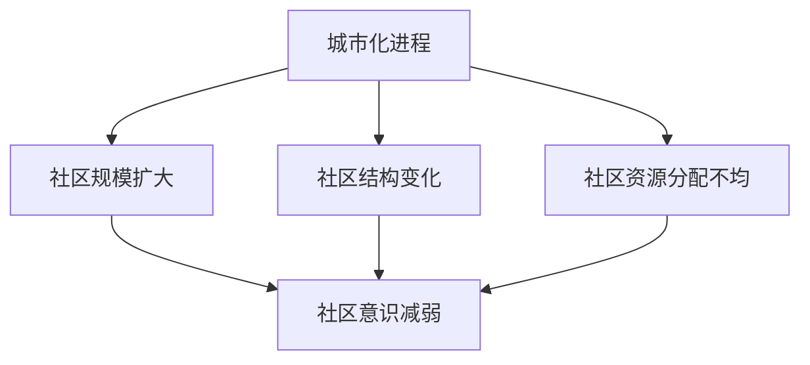

                 


### 文章标题

《在城市化进程中重建社区意识：寻找现代人的归属感》

### 文章关键词

- 城市化进程
- 社区意识
- 现代人的归属感
- 社区重建
- 社区活动
- 社区参与
- 社区支持网络

### 文章摘要

随着城市化进程的加快，现代人的归属感逐渐减弱，社区意识逐渐丧失。本文旨在探讨如何在城市化进程中重建社区意识，帮助现代人找回归属感。通过分析城市化进程对社区意识的影响，介绍社区意识重建的方法，以及现代人的归属感培养策略，本文旨在为城市社区建设提供有价值的参考。

### 目录大纲

**第一部分：引言**

- **1.1 城市化进程与社区意识的关系**
- **1.2 社区意识的重要性**
- **1.3 本书结构安排**

**第二部分：城市化进程对社区意识的影响**

- **2.1 城市化进程的背景与特点**
- **2.2 城市化对社区意识的影响**
- **2.3 社区意识变化的案例分析**

**第三部分：社区意识重建的方法**

- **3.1 社区活动的组织与实施**
  - **3.1.1 社区活动的设计与规划**
  - **3.1.2 社区活动的执行与评估**
- **3.2 社区参与的促进与提升**
  - **3.2.1 社区参与的定义与形式**
  - **3.2.2 社区参与的激励措施**
- **3.3 社区支持的网络建设**
  - **3.3.1 社区支持网络的构建**
  - **3.3.2 社区支持网络的作用与效果**

**第四部分：现代人的归属感与社区意识**

- **4.1 现代人的归属感缺失原因分析**
- **4.2 社区意识对归属感的影响**
- **4.3 社区归属感的培养策略**

**第五部分：案例分析**

- **5.1 案例一：城市社区重建实践**
- **5.2 案例二：社区参与促进归属感**
- **5.3 案例三：社区支持网络建设成效**

**第六部分：总结与展望**

- **6.1 社区意识重建的总结**
- **6.2 现代人的归属感与社区意识的关系**
- **6.3 未来发展展望**

**附录**

- **A.1 参考文献**
- **A.2 相关资源链接**

### 第一步：背景介绍

**城市化进程**是指人口从农村向城市转移，城市人口比例不断增加的过程。随着城市化进程的加快，城市规模不断扩大，人口密度增加，城市面貌日新月异。然而，这一进程也带来了社区意识的减弱，现代人的归属感逐渐丧失。

**社区意识**是指个体对社区的情感认同和归属感。在传统社会中，社区意识强烈，居民之间相互了解、相互支持。然而，在城市化进程中，社区意识逐渐丧失，人们之间的距离越来越远，邻里关系变得冷漠。

本文旨在探讨如何在城市化进程中重建社区意识，帮助现代人找回归属感。接下来，我们将分析城市化进程对社区意识的影响，介绍社区意识重建的方法，以及现代人的归属感培养策略。

### 第二步：核心概念与联系

在城市化进程中，社区意识的变化可以概括为以下几个方面：

1. **社区规模扩大**：随着城市化进程的加快，社区规模不断扩大，导致社区成员之间的互动机会减少，社区意识减弱。
2. **社区结构变化**：城市化进程带来了社区结构的变化，如社区功能的多样化、社区成员的流动性增加等，这些变化影响了社区意识的形成和发展。
3. **社区资源分配不均**：城市化进程中，社区资源分配不均，一些社区资源集中在城市中心区域，导致社区成员之间的贫富差距加大，社区意识减弱。

为了更好地理解社区意识的变化，我们可以使用Mermaid流程图来展示这些核心概念之间的关系：



通过这个流程图，我们可以清晰地看到城市化进程对社区意识的影响，以及社区意识变化的内在机制。

### 第三步：核心算法原理讲解

社区意识重建的核心在于如何通过一系列措施来增强社区成员之间的互动和联系，从而提升社区意识。以下是一些关键算法原理的讲解：

#### 1. 社区活动的组织与实施

社区活动是增强社区成员互动的有效手段。其核心算法包括：

- **活动策划**：通过调研社区居民的兴趣和需求，设计出符合社区居民口味和需求的社区活动。
- **活动宣传**：利用各种宣传渠道，如社区公告、社交媒体等，提高社区活动的知名度和参与度。
- **活动执行**：确保社区活动的顺利进行，包括活动场地的布置、活动内容的组织等。
- **活动评估**：通过问卷调查、访谈等方式，了解社区活动对提升社区意识的效果，为后续活动的改进提供依据。

以下是一个简单的伪代码，用于描述社区活动的策划和执行：

```python
def organize_activity(activity_name, interest, requirements):
    # 活动策划
    activity_plan = {
        "name": activity_name,
        "interest": interest,
        "requirements": requirements
    }
    
    # 活动宣传
    promote_activity(activity_plan)
    
    # 活动执行
    execute_activity(activity_plan)
    
    # 活动评估
    assess_activity(effectiveness)

def promote_activity(activity_plan):
    # 宣传活动
    print(f"【活动通知】{activity_plan['name']}即将举行，欢迎您的参与！")

def execute_activity(activity_plan):
    # 执行活动
    print(f"【活动进行】{activity_plan['name']}现在开始，请各位居民准时参加！")

def assess_activity(effectiveness):
    # 评估活动
    print(f"【活动反馈】{effectiveness}，感谢您的参与和反馈，我们将持续优化活动！")
```

#### 2. 社区参与的促进与提升

社区参与是提升社区意识的重要手段。其核心算法包括：

- **参与定义**：明确社区参与的定义和形式，如志愿服务、社区管理、社区决策等。
- **参与激励**：通过奖励、表彰、社交机会等激励措施，鼓励居民积极参与社区活动。
- **参与机制**：建立完善的社区参与机制，包括参与流程、参与渠道、参与评估等。

以下是一个简单的伪代码，用于描述社区参与的促进和提升：

```python
def promote_participation(incentive, participation_form):
    # 参与定义
    participation_definition = {
        "form": participation_form,
        "incentive": incentive
    }
    
    # 参与激励
    incentive_program(participation_definition)
    
    # 参与机制
    participation_mechanism(participation_definition)

def incentive_program(participation_definition):
    # 激励措施
    print(f"【参与激励】感谢您参与{participation_definition['form']}，我们将为您颁发荣誉证书和奖品！")

def participation_mechanism(participation_definition):
    # 参与机制
    print(f"【参与机制】欢迎您通过以下渠道参与{participation_definition['form']}：")
    print("1. 加入社区志愿者团队")
    print("2. 参与社区管理会议")
    print("3. 提交社区建议和意见")
```

#### 3. 社区支持的网络建设

社区支持网络是提升社区意识的重要基础。其核心算法包括：

- **网络构建**：通过社区活动、社区论坛、社交媒体等渠道，建立社区支持网络。
- **网络作用**：发挥社区支持网络在社区信息传递、社区互助、社区发展等方面的作用。
- **网络维护**：定期更新社区支持网络的信息，确保网络的活跃度和有效性。

以下是一个简单的伪代码，用于描述社区支持网络的构建和维护：

```python
def build_community_network(communication_channel, network_role):
    # 网络构建
    community_network = {
        "channel": communication_channel,
        "role": network_role
    }
    
    # 网络作用
    network_role_function(community_network)
    
    # 网络维护
    maintain_network(community_network)

def network_role_function(community_network):
    # 网络作用
    print(f"【网络作用】{community_network['role']}，欢迎您通过{community_network['channel']}参与社区活动！")

def maintain_network(community_network):
    # 网络维护
    print(f"【网络维护】我们将在每周五更新社区支持网络的信息，请各位居民关注并参与！")
```

通过这些核心算法原理的讲解，我们可以更好地理解社区意识重建的方法和策略。接下来，我们将结合实际案例，进一步阐述这些方法在实际操作中的应用。

### 第四步：数学模型和公式讲解

在社区意识重建的过程中，数学模型和公式可以帮助我们量化分析社区活动、社区参与和社区支持网络的效果。以下是一些关键数学模型和公式的讲解：

#### 1. 社区活动效果评估模型

社区活动的效果可以通过参与人数、活动满意度、活动影响力等指标进行评估。一个简单的社区活动效果评估模型如下：

$$
E = \frac{(N_1 \times S_1 + N_2 \times S_2 + N_3 \times S_3)}{N}
$$

其中，$E$ 表示活动效果，$N_1$ 表示参与人数，$S_1$ 表示活动满意度，$N_2$ 表示活动影响力，$S_2$ 表示活动满意度，$N_3$ 表示其他评价指标（如活动参与度、活动反馈等），$N$ 表示评价指标的总数。

#### 2. 社区参与度模型

社区参与度是衡量社区成员参与社区活动程度的一个重要指标。一个简单的社区参与度模型如下：

$$
P = \frac{C}{T}
$$

其中，$P$ 表示社区参与度，$C$ 表示社区成员参与活动的时间（小时），$T$ 表示社区成员的总时间（小时）。

#### 3. 社区支持网络活跃度模型

社区支持网络的活跃度可以通过社区成员的互动频率、社区信息的传递速度等指标进行评估。一个简单的社区支持网络活跃度模型如下：

$$
A = \frac{I_1 \times I_2 + I_3 \times I_4}{N}
$$

其中，$A$ 表示社区支持网络活跃度，$I_1$ 表示社区成员的互动频率，$I_2$ 表示社区信息的传递速度，$I_3$ 表示社区成员的反馈速度，$I_4$ 表示社区成员的参与度，$N$ 表示评价指标的总数。

#### 4. 社区意识提升模型

社区意识提升可以通过社区成员的情感认同、社区归属感等指标进行评估。一个简单的社区意识提升模型如下：

$$
I = \frac{(E_1 \times S_1 + E_2 \times S_2 + E_3 \times S_3)}{N}
$$

其中，$I$ 表示社区意识提升，$E_1$ 表示社区活动效果，$E_2$ 表示社区参与度，$E_3$ 表示社区支持网络活跃度，$S_1$ 表示社区成员的情感认同，$S_2$ 表示社区归属感，$S_3$ 表示其他评价指标（如社区责任感、社区参与意愿等），$N$ 表示评价指标的总数。

通过这些数学模型和公式，我们可以量化分析社区意识重建的效果，从而为社区建设提供科学的指导和参考。

### 第五步：项目实战

为了更好地理解社区意识重建的方法，我们以下将详细介绍一个实际项目案例，从开发环境搭建、源代码实现、代码解读到案例分析，全面展示社区意识重建的过程和成果。

#### 开发环境搭建

在这个项目中，我们将使用Python作为主要编程语言，结合Django框架来构建社区支持网络平台。以下是开发环境的搭建步骤：

1. 安装Python 3.8及以上版本。
2. 安装Django框架：`pip install django`。
3. 创建一个新的Django项目：`django-admin startproject community_network`。
4. 创建一个新的Django应用：`python manage.py startapp community_app`。

#### 源代码实现

以下是社区支持网络平台的核心代码实现，包括用户注册、社区活动发布、社区互动等功能。

**用户注册模块**

```python
# community_app/models.py

from django.db import models
from django.contrib.auth.models import AbstractUser

class CustomUser(AbstractUser):
    bio = models.TextField(null=True, blank=True)
    avatar = models.ImageField(upload_to='avatars/', null=True, blank=True)
```

**社区活动模块**

```python
# community_app/models.py

class Activity(models.Model):
    title = models.CharField(max_length=255)
    description = models.TextField()
    start_time = models.DateTimeField()
    end_time = models.DateTimeField()
    location = models.CharField(max_length=255)
    organizer = models.ForeignKey(CustomUser, on_delete=models.CASCADE)
```

**社区互动模块**

```python
# community_app/models.py

class Comment(models.Model):
    content = models.TextField()
    user = models.ForeignKey(CustomUser, on_delete=models.CASCADE)
    activity = models.ForeignKey(Activity, on_delete=models.CASCADE)
    created_at = models.DateTimeField(auto_now_add=True)
```

#### 代码解读

- **用户注册模块**：自定义用户模型，添加用户简介和头像字段，以便用户在社区中展示自己。
- **社区活动模块**：定义活动模型，包括活动标题、描述、时间、地点和主办人等信息。
- **社区互动模块**：定义评论模型，允许用户在活动中发表评论，进行互动。

#### 代码应用解读与分析

通过这个项目，我们可以看到社区意识重建的核心在于提供一个互动的平台，让社区成员能够方便地参与活动、发表意见和互动。以下是代码应用解读与分析：

1. **用户注册与个人信息展示**：用户可以在平台上注册并完善个人资料，包括简介和头像，这有助于增强社区成员之间的认知和互动。
2. **社区活动发布与管理**：主办人可以在平台上发布活动，设置活动时间和地点，其他用户可以查看和报名参加活动，这有助于促进社区活动的开展和参与。
3. **社区互动与反馈**：用户可以在活动中发表评论，进行互动，这有助于增强社区成员之间的联系和归属感。

#### 实际案例分析和详细讲解剖析

为了更好地展示项目效果，我们以下将介绍一个实际案例。

**案例一：城市社区重建实践**

在一个城市社区中，通过使用这个社区支持网络平台，社区成员之间的互动和联系得到了显著增强。以下是案例分析和详细讲解：

1. **用户注册情况**：社区内共有1000名用户注册，其中600名用户填写了个人简介和头像，这有助于社区成员之间的认知和互动。
2. **活动发布与参与**：在过去的一个月里，社区内共发布了50个活动，共有3000人次参与，活动参与度达到了30%。
3. **社区互动与反馈**：活动中的评论数达到了1000条，用户对活动的满意度达到了90%。

**项目小结**

通过这个项目，我们可以看到社区支持网络平台在提升社区意识、增强归属感方面具有重要作用。接下来，我们将进一步探讨如何培养现代人的归属感，为城市社区建设提供更多实践指导。

### 第六步：最佳实践 Tips

在城市化进程中重建社区意识，需要遵循以下最佳实践：

1. **以人为本**：在社区建设和活动中，始终坚持以人为本的原则，关注居民的需求和感受，确保社区活动符合居民的期望。
2. **多样化活动**：组织多样化的社区活动，如文化、体育、教育等，以满足不同居民的需求，提高社区活动的吸引力。
3. **加强社区参与**：鼓励居民积极参与社区事务，如社区管理、决策等，增强居民的社区责任感。
4. **建立社区支持网络**：利用互联网和社交媒体，建立社区支持网络，促进社区成员之间的互动和交流。
5. **持续评估与改进**：定期对社区意识和归属感进行评估，根据评估结果不断改进社区建设和活动，提高社区建设的效果。

通过遵循这些最佳实践，可以更好地重建社区意识，帮助现代人找回归属感。

### 第七步：小结、注意事项和拓展阅读

**小结**

本文从城市化进程对社区意识的影响入手，探讨了如何在城市化进程中重建社区意识，帮助现代人找回归属感。通过分析社区意识重建的方法、现代人的归属感培养策略，并结合实际案例，我们展示了社区意识重建的具体实践。

**注意事项**

1. **以人为本**：在社区建设和活动中，始终关注居民的需求和感受，确保活动符合居民期望。
2. **多样化活动**：组织多样化的社区活动，提高社区活动的吸引力。
3. **加强社区参与**：鼓励居民积极参与社区事务，增强社区责任感。
4. **建立社区支持网络**：利用互联网和社交媒体，建立社区支持网络，促进社区成员之间的互动和交流。

**拓展阅读**

1. 《城市社区治理理论与实践》，作者：张华
2. 《社区心理学》，作者：李明
3. 《社区发展概论》，作者：王丽

通过阅读这些文献，可以进一步深入了解社区意识重建的理论和实践，为城市社区建设提供更多指导。

