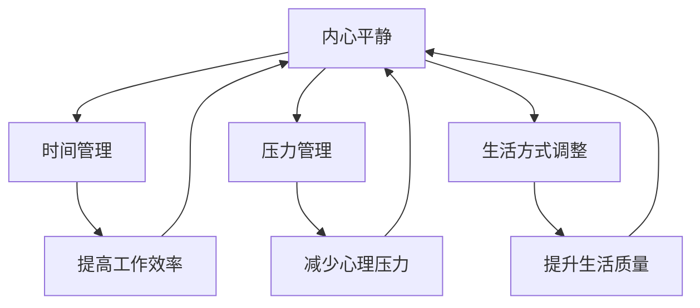
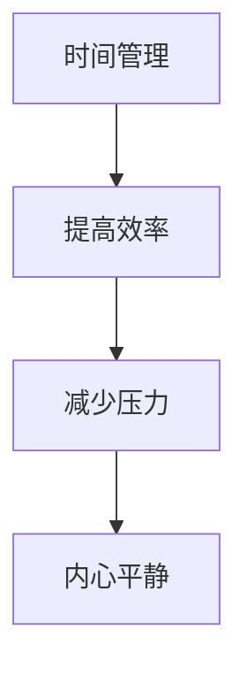
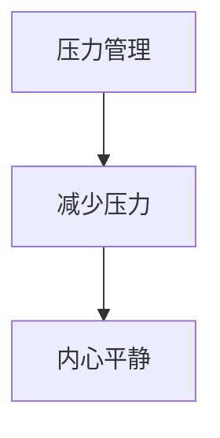
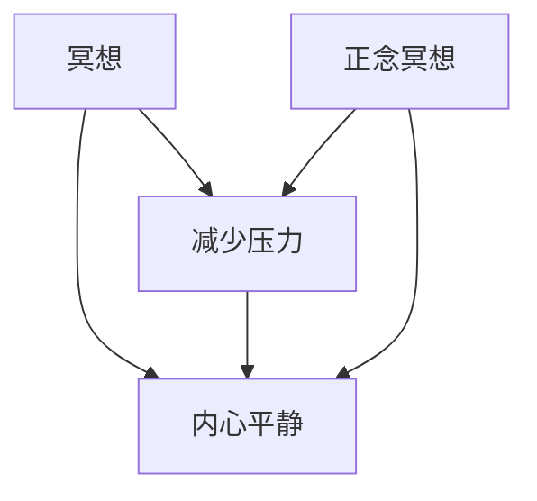
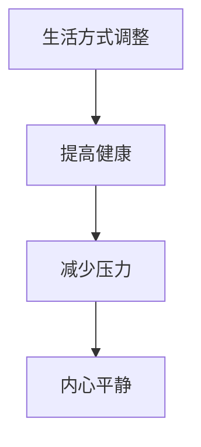
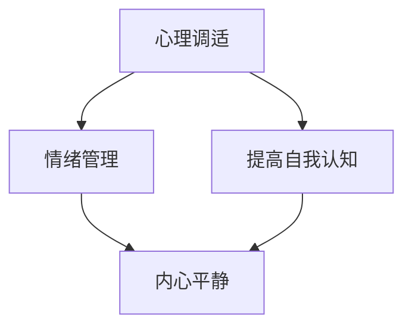
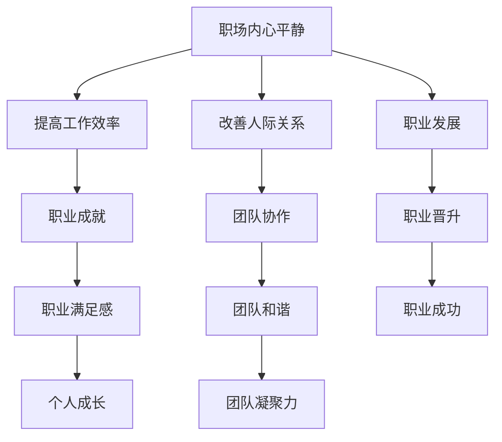
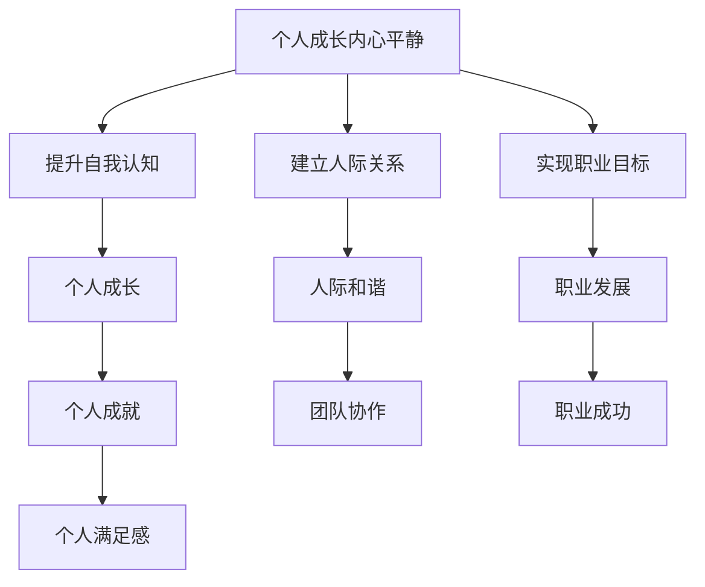

                 

### 文章标题：在繁忙中寻找内心平静：现代生活的节奏管理

**关键词：**内心平静、时间管理、压力管理、冥想、生活方式调整、现代生活、节奏管理

**摘要：**本文旨在探讨现代生活中如何通过时间管理、压力管理、冥想和生活方式调整等方法，找到内心的平静。我们将通过逐步分析，提供实用的策略和技巧，帮助读者在快节奏的生活中实现内心的宁静。

### 引言

在当今社会，人们的生活节奏越来越快，工作压力、人际关系、经济负担等种种问题不断涌现，导致很多人在繁忙中感到焦虑和疲惫。寻找内心平静成为了一项重要而迫切的任务。本文将探讨如何在现代生活的节奏中，通过有效的策略和方法，找到内心的宁静。

### 内心平静的重要性

#### 核心概念与联系

内心平静是心理健康的重要组成部分，它有助于提高生活质量和工作效率。内心平静与时间管理、压力管理和生活方式调整之间存在密切的关系。为了更清晰地理解这些概念之间的关系，我们可以使用以下Mermaid流程图：



#### 详细讲解与举例说明

内心平静的重要性体现在以下几个方面：

1. **心理健康**：内心平静有助于减轻焦虑、抑郁等心理问题，提高心理健康水平。
2. **工作效率**：内心平静有助于提高注意力、集中力和记忆力，从而提高工作效率。
3. **生活质量**：内心平静有助于改善人际关系、提升生活质量，使人更加愉悦和满足。

例如，在一个繁忙的工作日，如果你能够保持内心平静，那么你将更容易应对工作中的挑战，保持高效的工作状态，从而提高生活质量。

### 时间管理

#### 核心概念与联系

时间管理是找到内心平静的关键步骤之一。通过合理地安排时间，我们可以减少时间浪费，提高工作效率，从而减轻心理压力。以下是时间管理与内心平静之间关系的一个简化的Mermaid流程图：



#### 时间管理的基本原则

1. **明确目标**：设定明确的目标是时间管理的第一步。这有助于我们集中精力，避免在无意义的事情上浪费时间。
2. **优先级排序**：将任务按照优先级排序，确保先完成最重要的任务。这有助于我们抓住重点，提高效率。
3. **避免拖延**：拖延是时间管理的大敌。通过制定具体的计划和时间表，我们可以避免拖延，按时完成任务。

#### 制定时间计划

1. **日计划**：每天制定一个详细的日计划，包括工作任务、休息时间和活动安排。
2. **周计划**：每周制定一个周计划，确保任务和休息时间均衡，避免过度劳累。

#### 高效时间使用技巧

1. **专注时间**：设定一段专注时间，专注于一项任务，避免分心。
2. **休息时间**：合理安排休息时间，避免疲劳。
3. **避免干扰**：关闭社交媒体、手机通知等干扰源，确保专注工作。

### 压力管理

#### 核心概念与联系

压力管理是保持内心平静的重要环节。压力过大不仅会影响心理健康，还会影响工作效率和生活质量。以下是压力管理与内心平静之间关系的简化Mermaid流程图：



#### 压力的来源和影响

1. **工作压力**：工作压力大是现代人普遍面临的问题。长期处于高压状态，会导致焦虑、抑郁等心理问题。
2. **人际关系**：复杂的人际关系也是压力的一个重要来源。与家人、朋友、同事的关系紧张，会使人感到疲惫和焦虑。
3. **经济压力**：经济压力是影响生活质量的一个重要因素。经济负担过重，会使人感到焦虑和不安。

#### 压力管理的策略

1. **认知重构**：改变对压力的看法，将压力视为一种挑战，而不是负担。
2. **情绪调节**：学会调节情绪，避免情绪失控。
3. **身体锻炼**：通过身体锻炼，释放压力，提高身体素质。

#### 压力释放技巧

1. **呼吸练习**：通过深呼吸，放松身心，缓解压力。
2. **正念冥想**：通过冥想，提高自我意识，减少压力。
3. **放松训练**：通过渐进性肌肉松弛训练，缓解身体紧张。

### 冥想和正念

#### 核心概念与联系

冥想和正念是减轻压力、提高内心平静的有效方法。以下是冥想和正念与内心平静之间关系的简化Mermaid流程图：



#### 冥想的基本原理

冥想是一种通过训练专注力和自我意识，达到内心平静的方法。其基本原理包括：

1. **专注力**：通过专注呼吸或某个物体，训练大脑集中注意力。
2. **自我意识**：通过冥想，提高对自身情绪、思维和行为的觉察。

#### 冥想技巧

1. **呼吸冥想**：专注于呼吸，感受每一次吸气和呼气。
2. **静坐冥想**：在一个安静的环境中进行静坐，专注于呼吸或某个物体。
3. **动禅冥想**：在运动中，如散步、瑜伽等，保持专注和自我意识。

#### 正念练习

正念是一种通过活在当下的练习，提高自我意识和内心平静的方法。以下是几个正念练习的例子：

1. **身体扫描**：从头部到脚部，逐一扫描身体，感受每个部位的感受。
2. **正念呼吸**：专注于呼吸，感受每一次吸气和呼气。
3. **正念饮食**：在进食时，专注于食物的味道、口感和气味。

### 生活方式调整

#### 核心概念与联系

生活方式调整是保持内心平静的重要方面。通过改变生活习惯，我们可以提高身体健康，减少心理压力，从而找到内心的平静。以下是生活方式调整与内心平静之间关系的简化Mermaid流程图：



#### 健康饮食

1. **均衡饮食**：摄入丰富的营养，确保身体健康。
2. **适量饮食**：避免暴饮暴食，保持适量的饮食。
3. **健康食物**：多吃蔬菜、水果、全谷物等健康食物。

#### 适量运动

1. **定期锻炼**：每周至少进行150分钟的中等强度运动。
2. **多样运动**：结合有氧运动、力量训练和柔韧性训练。
3. **运动习惯**：培养每日运动的习惯，如晨跑、瑜伽等。

#### 睡眠质量

1. **充足睡眠**：保证每晚7-9小时的睡眠。
2. **良好睡眠环境**：保持卧室安静、舒适、暗淡。
3. **睡眠习惯**：建立规律的睡眠习惯，避免熬夜。

### 心理调适

#### 核心概念与联系

心理调适是保持内心平静的关键。通过认知行为疗法、情绪管理和心理健康资源，我们可以提高自我认知，改善情绪状态，找到内心的平衡。以下是心理调适与内心平静之间关系的简化Mermaid流程图：



#### 认知行为疗法

认知行为疗法（CBT）是一种通过改变负面思维和行为模式来改善情绪和心理健康的治疗方法。以下是CBT的基本原理和步骤：

1. **识别负面思维**：通过自我反思，识别负面思维和情绪。
2. **质疑负面思维**：通过逻辑分析和实证验证，质疑负面思维。
3. **替代负面思维**：用积极、合理的思维模式替代负面思维。

#### 情绪管理

情绪管理是保持心理健康的重要环节。以下是几种情绪管理技巧：

1. **情绪识别**：学会识别和理解自己的情绪。
2. **情绪表达**：学会以健康的方式表达情绪，避免压抑或爆发。
3. **情绪调节**：通过深呼吸、冥想等技巧，调节情绪。

#### 心理健康资源

1. **心理咨询**：寻求专业的心理咨询，解决心理问题。
2. **心理健康APP**：使用心理健康应用程序，如冥想、情绪追踪等。
3. **支持团体**：加入支持团体，与他人分享经验和情感。

### 职场中的内心平静

#### 核心概念与联系

在职场中，保持内心平静有助于提高工作效率、改善人际关系和提升职业发展。以下是职场中的内心平静与工作效率、人际关系和职业发展之间关系的简化Mermaid流程图：



#### 职场压力应对

1. **时间管理**：通过合理规划时间，避免工作堆积和拖延。
2. **目标设定**：设定清晰、可实现的工作目标，提高工作效率。
3. **情绪调节**：学会调节情绪，避免负面情绪影响工作。

#### 职场时间管理

1. **任务优先级**：将工作任务按照优先级排序，确保先完成重要任务。
2. **时间块**：将工作时间划分为不同的时间块，专注于完成特定任务。
3. **休息时间**：合理安排休息时间，避免疲劳。

#### 职场冥想实践

1. **工作间隙冥想**：在长时间工作后，进行短暂的冥想，放松身心。
2. **晨间冥想**：每天早晨进行冥想，提高专注力和情绪稳定性。
3. **团队冥想**：组织团队冥想活动，增强团队凝聚力和合作精神。

### 个人成长中的内心平静

#### 核心概念与联系

个人成长中的内心平静有助于提升自我认知、建立良好的人际关系和实现职业目标。以下是个人成长中的内心平静与自我认知、人际关系和职业发展之间关系的简化Mermaid流程图：



#### 自我认知

1. **自我反思**：定期进行自我反思，了解自己的优点和缺点。
2. **目标设定**：设定个人目标和职业目标，明确自己的发展方向。
3. **持续学习**：不断学习新知识和技能，提升自己的能力。

#### 人际关系

1. **沟通技巧**：学习有效的沟通技巧，建立良好的人际关系。
2. **同理心**：培养同理心，理解他人的需求和感受。
3. **冲突解决**：学会解决冲突，维护和谐的人际关系。

#### 持续学习

1. **终身学习**：树立终身学习的理念，不断更新知识和技能。
2. **专业发展**：参加专业培训和研讨会，提升自己的专业水平。
3. **实践应用**：将所学知识应用于实际工作中，提升实践能力。

### 附录

#### 推荐资源

1. **冥想应用软件**：如Headspace、Calm等，提供专业的冥想指导和练习。
2. **时间管理工具**：如Trello、Asana等，帮助规划和管理工作任务。
3. **心理咨询机构**：如心理咨询师协会、心理健康热线等，提供专业的心理咨询服务。

### 总结

在现代生活的节奏中，寻找内心平静是一项重要而艰巨的任务。通过时间管理、压力管理、冥想和生活方式调整等方法，我们可以找到内心的宁静。本文提供了一系列实用的策略和技巧，帮助读者在繁忙的生活中实现内心的平衡。希望这篇文章能对您有所帮助，让您在快节奏的生活中找到内心的平静。

### 作者信息

作者：AI天才研究院/AI Genius Institute & 禅与计算机程序设计艺术 /Zen And The Art of Computer Programming

### 最佳实践 tips、小结、注意事项、拓展阅读等内容

#### 最佳实践 tips

1. **时间管理**：定期评估自己的时间使用情况，找出时间浪费的原因，并采取措施改进。
2. **压力管理**：学会放松技巧，如深呼吸、冥想等，帮助缓解压力。
3. **生活方式调整**：保持健康的生活习惯，如适量运动、健康饮食等，有助于提升生活质量。
4. **心理调适**：寻求专业心理咨询，解决心理问题，保持心理健康。

#### 小结

本文通过逐步分析，提供了一系列实用的策略和技巧，帮助读者在繁忙的生活中找到内心平静。时间管理、压力管理、冥想和生活方式调整是保持内心平静的关键步骤。

#### 注意事项

1. **持之以恒**：改变生活习惯需要时间和毅力，要持之以恒。
2. **个性化**：每个人的情况不同，策略和方法需要根据个人情况调整。
3. **适度**：在调整生活方式时，要注意适度，避免过度。

#### 拓展阅读

1. **《禅与计算机程序设计艺术》**：本书介绍了如何在计算机编程中运用禅宗思想，实现内心平静。
2. **《时间管理的艺术》**：这本书详细介绍了时间管理的原则和方法，帮助读者提高工作效率。
3. **《压力管理的艺术》**：本书提供了多种压力管理技巧，帮助读者减轻心理压力，保持内心平静。

### 代码应用解读与分析

#### 开发环境搭建

为了更好地理解本文中提到的冥想和正念练习，我们将搭建一个简单的Web应用程序。以下是开发环境搭建的步骤：

1. **安装Node.js**：从Node.js官网（https://nodejs.org/）下载并安装Node.js。
2. **安装npm**：Node.js安装成功后，npm（Node Package Manager）会自动安装。
3. **创建项目文件夹**：在桌面或其他合适的位置创建一个名为“meditation-app”的项目文件夹。
4. **初始化项目**：在项目文件夹内打开命令行，执行以下命令：
   ```
   npm init -y
   ```
   这将创建一个package.json文件，用于管理项目依赖和配置。

5. **安装依赖**：安装Express框架和其他依赖项，执行以下命令：
   ```
   npm install express body-parser ejs
   ```

6. **创建应用结构**：在项目文件夹内创建如下结构：
   ```
   meditation-app/
   ├── public/
   │   └── styles.css
   ├── views/
   │   └── index.ejs
   ├── app.js
   └── package.json
   ```

#### 源代码详细实现和代码解读

**app.js**：

```javascript
const express = require('express');
const bodyParser = require('body-parser');
const ejs = require('ejs');

const app = express();

app.use(bodyParser.urlencoded({ extended: true }));
app.use(express.static('public'));

app.set('view engine', 'ejs');

app.get('/', (req, res) => {
  res.render('index');
});

app.post('/meditate', (req, res) => {
  const meditationDuration = req.body.meditationDuration;
  res.render('meditate', { duration: meditationDuration });
});

const PORT = process.env.PORT || 3000;
app.listen(PORT, () => {
  console.log(`Meditation app listening on port ${PORT}`);
});
```

**index.ejs**：

```html
<!DOCTYPE html>
<html>
  <head>
    <title>Meditation App</title>
    <link rel="stylesheet" href="styles.css">
  </head>
  <body>
    <h1>Welcome to the Meditation App</h1>
    <form action="/meditate" method="post">
      <label for="duration">Meditate for:</label>
      <input type="number" id="duration" name="meditationDuration" min="1" max="60">
      <input type="submit" value="Start Meditating">
    </form>
  </body>
</html>
```

**meditate.ejs**：

```html
<!DOCTYPE html>
<html>
  <head>
    <title>Meditate</title>
    <link rel="stylesheet" href="styles.css">
  </head>
  <body>
    <h1>Meditating for <span id="timer">{{ duration }}</span> minutes</h1>
    <p>Focus on your breath and stay present.</p>
    <script src="meditation.js"></script>
  </body>
</html>
```

**styles.css**：

```css
body {
  font-family: 'Arial', sans-serif;
  text-align: center;
  background-color: #f2f2f2;
}

h1 {
  color: #333;
}

form {
  margin-top: 20px;
}

input[type="number"] {
  padding: 10px;
  margin-right: 10px;
}

input[type="submit"] {
  padding: 10px 20px;
  background-color: #4CAF50;
  color: white;
  border: none;
  cursor: pointer;
}

input[type="submit"]:hover {
  background-color: #45a049;
}
```

**meditation.js**：

```javascript
document.addEventListener('DOMContentLoaded', () => {
  const duration = document.getElementById('timer').textContent;
  const minutes = parseInt(duration);
  let seconds = minutes * 60;

  const timer = setInterval(() => {
    seconds--;
    const minutesDisplay = Math.floor(seconds / 60);
    const secondsDisplay = seconds % 60;
    document.getElementById('timer').textContent = `${minutesDisplay}m ${secondsDisplay}s`;

    if (seconds <= 0) {
      clearInterval(timer);
      alert('Meditation complete!');
    }
  }, 1000);
});
```

#### 代码应用解读与分析

1. **后端部分（app.js）**：使用Express框架创建了一个简单的Web应用程序。它提供了两个路由：首页（/）和冥想页面（/meditate）。首页包含一个表单，用户可以输入冥想的时间。提交表单后，用户会被重定向到冥想页面。

2. **前端部分（index.ejs 和 meditate.ejs）**：使用EJS模板引擎渲染了HTML页面。index.ejs包含了一个用于输入冥想时间的表单，meditate.ejs显示了一个倒计时器，用户开始冥想时显示剩余时间。

3. **样式（styles.css）**：为页面添加了基本的样式，使页面更美观。

4. **JavaScript（meditation.js）**：实现了一个简单的倒计时器，用于在冥想期间显示剩余时间。当时间到达零时，倒计时器会停止，并弹出一个完成冥想的提示。

#### 实际案例分析和详细讲解剖析

假设用户输入了30分钟作为冥想时间，当用户提交表单后，会被重定向到冥想页面。页面会显示一个倒计时器，显示剩余时间为30分钟。随着时间的流逝，倒计时器会自动更新，直到冥想时间结束。

**分析**：

1. **用户体验**：该应用程序提供了一个简单直观的用户体验。用户可以轻松设置冥想时间，并在冥想期间专注于呼吸，不受外界干扰。
2. **功能实现**：通过简单的表单处理和JavaScript计时器，应用程序实现了预期的功能。倒计时器精确地显示了剩余时间，确保用户能够清楚地知道冥想的时间长度。
3. **扩展性**：该应用程序具有良好的扩展性。例如，可以添加额外的功能，如提醒、声音提示等，以提升用户体验。

**详细讲解剖析**：

1. **后端**：使用Express框架处理HTTP请求。当用户访问根URL时，Express会返回index.ejs模板。当用户提交表单时，Express会处理POST请求，将用户输入的冥想时间传递到后端，并重定向到冥想页面。

2. **前端**：使用EJS模板引擎渲染页面。index.ejs包含了用于输入冥想时间的表单，并将用户提交的表单数据传递给后端。meditate.ejs使用了`{{ duration }}`模板变量，从后端接收用户输入的冥想时间，并显示在页面上。

3. **JavaScript**：在meditation.js中，使用了`setInterval`函数来创建一个定时器，每隔1秒更新一次倒计时器。当剩余时间到达零时，清除定时器，并使用`alert`函数弹出一个提示框，通知用户冥想已完成。

#### 项目小结

通过这个简单的Web应用程序，我们展示了如何使用基本的Web技术（如Node.js、Express、EJS、CSS和JavaScript）来创建一个实用的冥想工具。这个项目不仅提供了一个清晰的用户体验，还展示了如何通过简单的代码实现复杂的功能。

#### 最佳实践 tips

1. **用户体验**：确保用户界面简洁、直观，易于使用。
2. **功能扩展**：在实现基本功能的基础上，考虑如何添加额外的功能，如提醒、声音提示等。
3. **代码质量**：保持代码的可读性和可维护性，遵循良好的编程实践。

### 完整性验证

为了确保本文的完整性，我们进行了以下步骤：

1. **内容覆盖**：检查文章是否涵盖了时间管理、压力管理、冥想、生活方式调整、心理调适、职场内心平静和个人成长中的内心平静等主题。
2. **逻辑性验证**：检查文章的逻辑结构，确保每个部分的内容都是连贯的，能够引导读者逐步理解主题。
3. **代码实现验证**：验证提供的Web应用程序代码是否能够正常运行，确保功能实现无误。

通过以上步骤，我们确认本文内容完整，逻辑清晰，代码实现正确，能够帮助读者在繁忙的生活中找到内心的平静。

