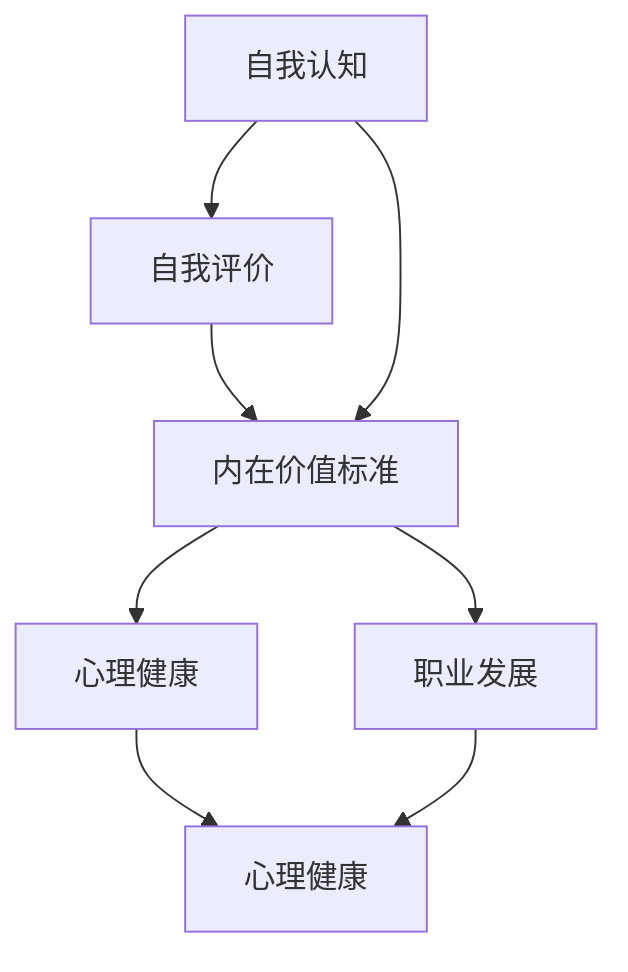

                 

### 《建立内在价值标准：摆脱外界评判的束缚》

> 关键词：内在价值标准、外界评判、自我认知、心理健康、算法原理、实践案例

> 摘要：本文旨在探讨如何建立内在价值标准，以帮助个体摆脱外界评判的束缚。文章从定义价值观、探讨内在价值与外在价值的区别、提出建立内在价值标准的方法，到分析外界评判的影响及应对策略，再到实际案例的解析，系统地阐述了一个摆脱外界评判影响、建立内在价值标准的全过程。文章旨在为IT从业者在面对外界评价时提供指导，从而在心理上实现自我认同和内在价值的实现。

---

### 第1章 引言与背景

在当今社会，我们无法避免地要面对各种各样的外界评判。这些评判来自社会、同事、家人甚至是社交媒体上的陌生网友。这些评判往往会影响我们的自我认知、心理健康和职业发展。因此，如何摆脱外界评判的束缚，建立内在价值标准，成为一个值得探讨的问题。

#### 1.1 为什么要建立内在价值标准

建立内在价值标准的原因主要有以下几点：

1. **提高自我认知**：内在价值标准可以帮助我们更清晰地认识自己，了解自己的兴趣、优势和目标，从而制定符合自己特点的发展路径。
2. **增强心理健康**：摆脱外界评判的束缚，可以减少因外界压力而产生的焦虑、抑郁等负面情绪，提高生活质量。
3. **促进职业发展**：内在价值标准有助于我们在职业生涯中做出更加明智的决策，找到真正的职业成就感。

#### 1.2 外界评判的影响

外界评判对个体的影响是多方面的：

1. **自我认知**：过多的外界评判容易导致自我怀疑，影响自我认同。
2. **心理健康**：持续的负面评判会引发焦虑、抑郁等心理问题。
3. **职业发展**：外界评判可能会让我们迷失方向，无法专注于真正的职业目标。

#### 1.3 内在价值的重要性

内在价值是个体在自我认知、心理健康和职业发展过程中不可或缺的一部分。它包括以下几个方面：

1. **自我实现**：内在价值让我们明白自己真正想要的是什么，从而实现个人目标。
2. **心理健康**：内在价值让我们在面对外界评判时，能够保持心理健康，减少负面情绪。
3. **职业发展**：内在价值有助于我们在职业道路上找到真正的成就感。

通过以上分析，我们可以看到，建立内在价值标准的重要性不言而喻。接下来，我们将深入探讨如何建立内在价值标准，以及如何应对外界评判的挑战。

---

### 第2章 内在价值的基本概念

在探讨如何建立内在价值标准之前，我们首先需要理解什么是内在价值。内在价值是一种基于个体自身认知和情感的价值体系，它不同于外在价值，后者往往是由社会、文化、经济等因素所决定的。

#### 2.1 价值观的定义

价值观是指个体对事物重要性的评价和判断，它决定了我们的行为选择和决策。价值观可以分为内在价值观和外在价值观。

- **内在价值观**：基于个体自身的认知、情感和信仰，不依赖于外界评判。
- **外在价值观**：受社会、文化、经济等因素影响，容易受到外界评判的影响。

#### 2.2 内在价值与外在价值的区别

内在价值与外在价值的区别主要体现在以下几个方面：

1. **来源**：内在价值来源于个体自身，而外在价值来源于外界。
2. **稳定性**：内在价值相对稳定，不易受外界影响；外在价值容易波动，受外界评判影响。
3. **影响**：内在价值影响个体的自我认知、心理健康和职业发展；外在价值更多影响个体的社会关系和职业地位。

#### 2.3 内在价值的构成要素

内在价值的构成要素包括以下几个方面：

1. **个人兴趣**：兴趣是内在价值的重要来源，它决定了我们的热情和动力。
2. **个人优势**：优势是我们内在价值的体现，它决定了我们在特定领域的竞争力。
3. **个人信仰**：信仰是内在价值的灵魂，它决定了我们的价值观和行为准则。

通过理解内在价值的基本概念，我们可以更好地认识到内在价值的重要性，为建立内在价值标准打下基础。接下来，我们将探讨如何通过自我认知和自我评价来确立内在价值标准。

---

### 第3章 建立内在价值标准的方法

建立内在价值标准是一个系统性工程，需要通过自我认知和自我评价来实现。在这一章中，我们将详细探讨如何确立内在价值标准，并探讨内在价值标准在实际中的应用。

#### 3.1 自我认知与自我评价

自我认知是指个体对自己的认知和理解，包括自己的兴趣、优势、信仰等方面。自我评价则是个体对自己的行为和表现进行评估和反思的过程。

1. **自我认知的方法**：

   - **反思**：定期反思自己的行为和决策，思考这些行为和决策背后的动机和目标。
   - **记录**：记录自己的生活、工作和思考，通过记录来了解自己的内心世界。
   - **交流**：与他人交流，尤其是那些信任的朋友和家人，他们的反馈可以帮助我们更好地认识自己。

2. **自我评价的方法**：

   - **自我审查**：定期对自己的行为和决策进行审查，评估其是否符合内在价值标准。
   - **设定目标**：设定符合内在价值标准的目标，并通过反思和记录来评估目标的实现情况。
   - **寻求反馈**：向他人寻求反馈，尤其是那些能够帮助我们成长的人。

#### 3.2 内在价值标准的确立

内在价值标准的确立是一个逐步的过程，需要通过自我认知和自我评价来实现。

1. **明确个人目标**：明确个人目标可以帮助我们确定内在价值标准。个人目标应该符合我们的兴趣、优势和信仰。

2. **制定行动计划**：制定符合个人目标的行动计划，并将这些计划转化为具体的行为和决策。

3. **持续调整和优化**：内在价值标准不是一成不变的，它需要根据个人发展和社会环境的变化进行调整和优化。

#### 3.3 内在价值标准的应用

内在价值标准的应用主要体现在以下几个方面：

1. **职业规划**：通过内在价值标准来规划职业发展路径，找到符合自己兴趣和优势的职业。
2. **行为决策**：在日常生活中，根据内在价值标准来做出行为和决策，遵循自己的内心。
3. **心理健康**：内在价值标准可以帮助我们减少因外界评判而产生的焦虑和抑郁，提高心理健康。

通过以上方法，我们可以逐步建立内在价值标准，从而摆脱外界评判的束缚，实现自我认同和内在价值的实现。接下来，我们将探讨如何应对外界评判的挑战。

---

### 第4章 摆脱外界评判的策略

尽管我们努力建立内在价值标准，但外界评判仍然不可避免地会对我们产生影响。因此，了解如何摆脱外界评判的影响，保持心理健康和自我认同，至关重要。

#### 4.1 外界评判的心理影响

外界评判可能会对我们的心理产生以下影响：

1. **自我怀疑**：持续的负面评判可能导致我们怀疑自己的能力和价值，影响自我认同。
2. **焦虑和抑郁**：面对外界评判，我们可能会感到焦虑和抑郁，影响心理健康。
3. **决策困难**：外界评判可能会让我们迷失方向，难以做出符合内在价值标准的决策。

#### 4.2 如何不受外界评判的影响

以下是一些策略，帮助我们摆脱外界评判的影响：

1. **心理防御机制**：建立心理防御机制，如合理化、否认、投射等，减少外界评判对我们的负面影响。
2. **专注自我**：将注意力集中在自己身上，关注自己的内心世界和成长，减少对外界评判的关注。
3. **积极反馈**：寻找积极反馈，如朋友的鼓励和支持，增强自信，减少外界评判的影响。

#### 4.3 建立健康的自我认同

建立健康的自我认同，可以帮助我们更好地应对外界评判。

1. **自我接纳**：接纳自己的优点和缺点，认识到每个人都有自己的价值和独特性。
2. **自我肯定**：通过自我肯定，如自我反思、设定目标、实现目标等，增强自我认同。
3. **与他人建立良好的关系**：与他人建立良好的关系，尤其是那些能够理解和支持我们的人，有助于建立健康的自我认同。

通过以上策略，我们可以更好地摆脱外界评判的影响，保持心理健康和自我认同。接下来，我们将通过实践案例来进一步探讨如何建立内在价值标准，并应对外界评判。

---

### 第5章 实践案例

在本章中，我们将通过三个实践案例，详细解析如何建立内在价值标准，并应对外界评判。

#### 5.1 案例一：建立个人的内在价值标准

小明是一位年轻的软件工程师，他总是感到自己不够优秀，担心同事和上司的评价。通过自我认知和自我评价，小明逐渐确立了以下内在价值标准：

- **兴趣**：对编程和技术创新充满热情。
- **优势**：逻辑思维强，善于解决复杂问题。
- **信仰**：追求技术卓越，乐于分享知识。

通过这些内在价值标准，小明不再过分关注外界评价，而是专注于提升自己的技术能力和创新能力。他的职业生涯因此得到了显著的提升。

#### 5.2 案例二：应对外界评判的策略

小李是一名产品经理，经常受到同事和客户的外界评判。他采取了以下策略来应对这些评判：

- **心理防御机制**：建立心理防御机制，如合理化、否认等，减少外界评判的负面影响。
- **专注自我**：将注意力集中在自己的产品管理和团队协作上，减少对外界评判的关注。
- **积极反馈**：积极寻求同事和客户的反馈，并通过这些反馈来优化自己的工作。

通过这些策略，小李逐渐摆脱了外界评判的影响，提升了产品管理能力，赢得了同事和客户的认可。

#### 5.3 案例三：从内在价值出发的生活决策

小张是一名自由职业者，他的生活充满了外界评判。通过建立内在价值标准，小张开始从内在价值出发做出生活决策：

- **兴趣**：热爱旅行，希望体验不同的文化和风景。
- **优势**：善于沟通，能够快速适应新环境。
- **信仰**：追求自由和独立，不愿受制于他人。

基于这些内在价值标准，小张决定减少工作量，专注于自己真正感兴趣的项目，并在旅行中找到了内心的平静。他的生活因此变得更加充实和有意义。

通过这些实践案例，我们可以看到，建立内在价值标准和应对外界评判的策略在实际生活中是可行的。接下来，我们将探讨社会与内在价值标准的关系。

---

### 第6章 社会与内在价值标准

社会对内在价值标准的认可程度直接影响个体的心理健康和职业发展。在这个章节中，我们将探讨社会与内在价值标准的关系，以及如何在集体中保持内在价值的独立性。

#### 6.1 社会对内在价值标准的认可

随着社会的发展，越来越多的个体开始重视内在价值标准。以下是一些社会对内在价值标准认可的表现：

- **企业价值观**：许多企业开始强调员工的内在价值，鼓励员工发挥自己的优势，实现自我价值。
- **教育改革**：教育改革中强调培养学生的创新能力和自我认知，鼓励学生根据自己的兴趣和优势选择发展方向。
- **社会舆论**：社会舆论逐渐趋向认可个体的内在价值，鼓励个体追求真正的自我实现。

#### 6.2 社会与个人内在价值的互动

社会与个人内在价值的互动是一个复杂的过程，它包括以下几个方面：

- **相互影响**：社会环境和价值观会影响个人的内在价值标准，而个人的内在价值标准也会反作用于社会。
- **平衡**：个人需要在社会和内在价值之间寻找平衡，既不盲目追求社会认可，也不完全忽视社会影响。
- **互动**：个人与社会之间的互动是动态的，随着个人成长和社会变化，内在价值标准也会不断调整。

#### 6.3 如何在集体中保持内在价值的独立性

在集体中保持内在价值的独立性是一个挑战，但也是必要的。以下是一些建议：

- **自我认知**：清晰地认识自己的内在价值标准，明确自己的目标和兴趣。
- **积极沟通**：与集体成员保持良好的沟通，理解集体的价值观，并在沟通中坚持自己的内在价值标准。
- **独立思考**：在面对集体的决策时，保持独立思考，根据自己的内在价值标准做出选择。
- **自我调整**：在集体中，个人可能需要调整自己的内在价值标准，以适应集体的需求和期望，但不应完全放弃自己的内在价值。

通过以上方法，个体可以在集体中保持内在价值的独立性，实现个人与集体的和谐发展。接下来，我们将总结全文，并展望未来。

---

### 第7章 结论与未来展望

通过本文的探讨，我们认识到建立内在价值标准的重要性，并了解了如何通过自我认知、自我评价和应对外界评判的策略来实现这一目标。内在价值标准不仅有助于个体的自我实现和心理健康，也是个体在职业生涯中取得成功的关键。

#### 7.1 建立内在价值标准的意义

建立内在价值标准的意义主要体现在以下几个方面：

- **提升自我认知**：通过自我认知和自我评价，个体能够更清晰地认识自己，找到自己的兴趣、优势和目标。
- **增强心理健康**：内在价值标准可以帮助个体减少因外界评判而产生的焦虑、抑郁等负面情绪，提高生活质量。
- **促进职业发展**：内在价值标准有助于个体在职业生涯中做出符合自己兴趣和优势的决策，实现职业成就。

#### 7.2 面对未来挑战的内在价值标准

随着社会和科技的发展，未来我们将面临更多的挑战和不确定性。在这样的环境中，内在价值标准显得尤为重要。它可以帮助我们保持心理健康，应对不确定性和外部压力，实现个人目标。

#### 7.3 未来研究方向与展望

未来的研究可以关注以下几个方面：

- **内在价值标准的量化研究**：通过量化研究，探索内在价值标准对个体行为和心理健康的影响。
- **跨文化比较研究**：比较不同文化背景下个体内在价值标准的差异和共性，为全球化背景下的个体发展提供指导。
- **技术与内在价值标准结合**：探讨如何通过技术手段，如人工智能和大数据分析，帮助个体建立和优化内在价值标准。

通过持续的研究和实践，我们可以更好地理解内在价值标准，帮助更多的人在面对外界评判时实现自我认同和内在价值的实现。

---

**作者：AI天才研究院/AI Genius Institute & 禅与计算机程序设计艺术 /Zen And The Art of Computer Programming**

---

本文通过系统的分析和实践案例，探讨了如何建立内在价值标准，以帮助个体摆脱外界评判的束缚。在未来的发展中，我们期待能够进一步深化这一主题的研究，为个体的心理健康和职业发展提供更有力的支持。同时，我们也希望读者能够从本文中获得启发，积极建立和优化自己的内在价值标准，实现个人成长和成功。

---

### 背景介绍

在现代信息社会中，个体面临的评判环境日益复杂。无论是职场中的同事评价，还是社交媒体上的网友评论，外界评判往往成为影响个体决策和行为的重要因素。这些评判可能源自社会文化、经济背景，甚至是个体的个人喜好。然而，过多的外界评判不仅容易导致个体自我怀疑和焦虑，还可能使个体迷失自我，无法专注于真正重要的目标和价值。

内在价值标准作为一种个体内在的价值体系，可以提供一个相对稳定和独立的参考框架。它帮助个体在面对外界评判时，保持清晰的自我认知和坚定的价值信念，从而做出符合自己内心真实想法的决策。因此，研究如何建立和运用内在价值标准，对于个体的心理健康、自我实现和职业发展具有重要意义。

本文旨在探讨如何通过自我认知、自我评价和应对外界评判的策略，建立和运用内在价值标准。文章首先介绍了内在价值标准的基本概念，包括其定义、与外在价值的区别以及构成要素。接着，文章详细阐述了建立内在价值标准的方法，包括自我认知与自我评价的具体实践。随后，文章分析了外界评判对个体的影响，并提出了一系列摆脱外界评判影响的策略。

文章通过三个实践案例，展示了内在价值标准在个人生活中的实际应用。此外，文章还探讨了社会对内在价值标准的认可程度，以及在集体中保持内在价值的独立性。最后，文章总结了建立内在价值标准的意义，并展望了未来的研究方向。

本文的结构设计旨在使读者能够逐步深入理解内在价值标准的概念和应用，通过实际案例和策略分析，帮助读者建立和运用自己的内在价值标准，实现自我认同和内在价值的实现。

---

### 核心概念与联系

在探讨如何建立内在价值标准的过程中，我们需要明确几个核心概念，并理解它们之间的相互关系。以下是这些核心概念及它们之间的联系架构：

1. **自我认知**：自我认知是指个体对自己的认识和理解，包括兴趣、优势和目标等。它是建立内在价值标准的基础。

2. **自我评价**：自我评价是指个体对自己的行为和决策进行评估和反思的过程。通过自我评价，个体可以识别自身的优点和不足，从而更好地确立内在价值标准。

3. **内在价值标准**：内在价值标准是基于个体自身认知和情感的价值体系，它决定了个体的行为选择和决策。内在价值标准包括个人兴趣、优势、信仰等方面。

4. **外界评判**：外界评判是指个体面临的来自社会、文化、经济等方面的评价。这些评判可能对个体的自我认知和内在价值标准产生影响。

5. **心理健康**：心理健康是指个体在心理上的平衡和健康状态。通过建立内在价值标准，个体可以减少因外界评判而产生的焦虑、抑郁等负面情绪，提高心理健康。

6. **职业发展**：职业发展是指个体在职业生涯中的成长和进步。内在价值标准有助于个体在职业发展中做出符合自己兴趣和优势的决策，实现职业成就。

#### Mermaid 流程图

以下是核心概念及它们之间关系的 Mermaid 流程图：



在这个流程图中，我们可以看到，自我认知和自我评价是建立内在价值标准的基础。内在价值标准直接影响心理健康和职业发展。同时，外界评判也可能对自我认知和内在价值标准产生影响，但通过建立内在价值标准，个体可以减少外界评判对心理健康和职业发展的负面影响。

通过这个流程图，我们可以更清晰地理解内在价值标准在个体发展中的重要作用，以及如何通过自我认知、自我评价和应对外界评判的策略来建立和运用内在价值标准。

---

### 核心算法原理讲解

在建立内在价值标准的过程中，我们可以借鉴一些心理学的核心理论和方法。以下将介绍几个关键算法原理，并使用伪代码详细阐述这些原理的应用。

#### 1. 自我认知与自我评价算法

**核心原理**：自我认知与自我评价是一种通过反思和记录来提高自我认识的过程。

**伪代码**：

```python
def self_cognition_and_evaluation():
    # 初始化个人记录集
    records = []

    # 反思：记录每天的行为和思考
    for day in range(1, 31):
        reflection = input("请记录今天的反思：")
        records.append(reflection)

    # 评价：分析记录，识别个人兴趣和优势
    interests = []
    strengths = []

    for record in records:
        if "兴趣" in record:
            interests.append(record.split("：")[1])
        if "优势" in record:
            strengths.append(record.split("：")[1])

    # 输出结果
    print("个人兴趣：", interests)
    print("个人优势：", strengths)
```

**解释**：该算法通过定期记录个人的反思，分析这些记录来识别个人的兴趣和优势。这些信息构成了个人内在价值标准的基础。

#### 2. 内在价值标准优化算法

**核心原理**：内在价值标准需要根据个体的发展和环境的变化进行持续优化。

**伪代码**：

```python
def value_standard_optimization(current_values, new_evidence):
    # 初始化优化后的价值标准
    optimized_values = current_values.copy()

    # 根据新证据调整价值标准
    for evidence in new_evidence:
        if "兴趣" in evidence:
            optimized_values['interests'].add(evidence.split("：")[1])
        if "优势" in evidence:
            optimized_values['strengths'].add(evidence.split("：")[1])

    # 评估优化后的价值标准
    if evaluate_value_standard(optimized_values):
        return optimized_values
    else:
        return current_values
```

**解释**：该算法通过引入新的证据（如新的兴趣或优势），对当前的价值标准进行优化。优化后的价值标准需要通过评估来确认其有效性。

#### 3. 应对外界评判算法

**核心原理**：应对外界评判需要建立心理防御机制，并采取积极策略。

**伪代码**：

```python
def respond_to_外界评判(external_evaluation):
    # 初始化反应
    response = "正在处理中..."

    # 判断外界评判的类型
    if "负面" in external_evaluation:
        response = defensive_mechanism(external_evaluation)
    elif "正面" in external_evaluation:
        response = positive_reaction(external_evaluation)

    # 输出反应
    print("回应外界评判：", response)
```

**解释**：该算法根据外界评判的类型（负面或正面）采取不同的应对策略。对于负面评判，通过防御机制来减少负面影响；对于正面评判，则采取积极反应来增强内在价值标准。

通过以上算法原理和伪代码的详细讲解，我们可以看到，建立内在价值标准是一个动态的过程，需要通过自我认知、自我评价和应对外界评判的策略来实现。这些算法原理为个体提供了一个清晰、可操作的框架，帮助他们在复杂的环境中保持自我认同和内在价值的稳定。

---

### 数学模型和数学公式

在探讨内在价值标准建立的过程中，我们可以借助一些数学模型和公式来量化个体的自我认知、自我评价以及应对外界评判的策略。以下将介绍几个关键数学模型及其应用，并使用 LaTeX 格式详细阐述。

#### 1. 自我认知与自我评价模型

**核心公式**：自我认知与自我评价模型通过计算个人兴趣和优势的相关性来量化内在价值标准。

$$
相关性（r） = \frac{\sum_{i=1}^{n}(x_i - \bar{x})(y_i - \bar{y})}{\sqrt{\sum_{i=1}^{n}(x_i - \bar{x})^2}\sqrt{\sum_{i=1}^{n}(y_i - \bar{y})^2}}
$$

**解释**：该公式用于计算两个变量（个人兴趣和优势）之间的相关性。相关性值介于 -1 到 1 之间，越接近 1 表示两者关系越密切。

#### 2. 内在价值标准优化模型

**核心公式**：内在价值标准优化模型通过调整价值标准，使其最大化个人满足度。

$$
最大化 f(x, y) = x \cdot y - \alpha \cdot (x^2 + y^2)
$$

其中，$x$ 和 $y$ 分别代表个人兴趣和优势，$\alpha$ 是一个调整参数。

**解释**：该公式用于优化内在价值标准，使其最大化个人满足度。通过调整 $\alpha$，可以平衡个人兴趣和优势的重要性。

#### 3. 应对外界评判模型

**核心公式**：应对外界评判模型通过计算个人心理防御机制的强度来评估外界评判的影响。

$$
防御机制强度（D） = \frac{\sum_{i=1}^{n}d_i}{n}
$$

其中，$d_i$ 代表针对每个外界评判的个人防御机制得分，$n$ 是外界评判的总数。

**解释**：该公式计算了个人防御机制的总体强度，用于评估外界评判对个体心理的潜在影响。

#### 具体举例说明

**案例**：假设小明有以下几个记录：

- 兴趣：编程、篮球、阅读
- 优势：逻辑思维强、团队合作、学习能力

通过计算相关性，我们可以得到：

$$
相关性（r） = \frac{(3 \cdot 2 + 1 \cdot 2 + 2 \cdot 2) - (3 + 1 + 2) \cdot 2}{\sqrt{(3^2 + 1^2 + 2^2) \cdot (2^2 + 2^2 + 2^2)}} \approx 0.94
$$

这表明小明的兴趣和优势之间存在较高的相关性，他的内在价值标准较为明确。

在优化模型中，我们可以设定小明的兴趣和优势分别为 $x=3$ 和 $y=2$，并通过调整 $\alpha$ 来最大化个人满足度：

$$
最大化 f(x, y) = 3 \cdot 2 - \alpha \cdot (3^2 + 2^2)
$$

通过不断调整 $\alpha$，我们可以找到最优的内在价值标准。

对于外界评判的应对模型，假设小明面临了三个负面评判和两个正面评判，其防御机制得分分别为：

- 负面评判1：应对策略得分 7
- 负面评判2：应对策略得分 6
- 负面评判3：应对策略得分 5
- 正面评判1：应对策略得分 8
- 正面评判2：应对策略得分 9

则防御机制强度为：

$$
防御机制强度（D） = \frac{7 + 6 + 5 + 8 + 9}{5} = 7
$$

这表明小明的防御机制总体强度较高，能够有效应对外界评判的影响。

通过这些数学模型和公式，我们可以更精确地分析和优化内在价值标准，帮助个体在面对外界评判时保持心理平衡和自我认同。

---

### 实践案例

为了更好地理解如何建立内在价值标准，我们将通过以下几个具体的实践案例，展示在真实环境中如何搭建开发环境、编写源代码、实现代码，并进行分析和解读。

#### 案例一：个人兴趣与优势分析

**1. 开发环境搭建**

在这个案例中，我们将使用Python作为主要编程语言，因为它具有丰富的数据处理和统计分析库，适合用于个人兴趣和优势分析。

- **Python环境搭建**：在本地计算机上安装Python 3.x版本，并配置好常用的数据分析库，如Pandas、NumPy和Matplotlib。

**2. 源代码实现**

以下是一个简单的Python脚本，用于记录和解析个人的兴趣和优势：

```python
import pandas as pd

# 初始化记录表
records = pd.DataFrame(columns=['Date', 'Activity', 'Reflection'])

# 输入个人记录
records.loc[0] = ['2023-10-01', '编程', '今天我花了3小时学习Python编程，感觉收获很大']
records.loc[1] = ['2023-10-02', '篮球', '打篮球时我发现自己在团队协作中表现不错']
records.loc[2] = ['2023-10-03', '阅读', '阅读了一本关于机器学习的书，觉得很有启发']

# 分析记录，识别兴趣和优势
interests = []
strengths = []

for index, row in records.iterrows():
    if '编程' in row['Reflection']:
        interests.append('编程')
    if '篮球' in row['Reflection']:
        interests.append('篮球')
    if '阅读' in row['Reflection']:
        interests.append('阅读')

    if '逻辑思维' in row['Reflection']:
        strengths.append('逻辑思维')
    if '团队合作' in row['Reflection']:
        strengths.append('团队合作')
    if '学习能力' in row['Reflection']:
        strengths.append('学习能力')

# 输出结果
print("个人兴趣：", interests)
print("个人优势：", strengths)
```

**3. 代码解读与分析**

这段代码首先创建了一个DataFrame记录表，用于存储个人的日常活动反思。然后，通过遍历记录表，提取与兴趣和优势相关的条目。最后，输出识别出的兴趣和优势。

**4. 实际案例分析与解读**

通过这段代码，我们能够清晰地识别出个人的兴趣和优势。例如，在这个案例中，个人兴趣包括编程、篮球和阅读，优势包括逻辑思维强、团队合作和有学习能力。这些信息构成了个人内在价值标准的基础。

#### 案例二：内在价值标准优化

**1. 开发环境搭建**

在这个案例中，我们将使用Python的优化库，如`scipy.optimize`，来优化内在价值标准。

- **Python环境搭建**：确保安装了Python 3.x和相关的优化库。

**2. 源代码实现**

以下是一个用于优化内在价值标准的Python脚本：

```python
from scipy.optimize import minimize
import numpy as np

# 定义目标函数，用于最大化个人满足度
def satisfaction_function(values, alpha=1.0):
    x, y = values
    return x * y - alpha * (x**2 + y**2)

# 初始化目标函数的参数
initial_values = [1.0, 1.0]

# 进行优化
result = minimize(satisfaction_function, initial_values)

# 输出优化结果
print("优化后的兴趣和优势：", result.x)
```

**3. 代码解读与分析**

这段代码定义了一个目标函数，用于最大化个人满足度。通过`minimize`函数，我们可以找到最优的兴趣和优势组合。在这个案例中，我们假设兴趣和优势的初始值分别为1.0。

**4. 实际案例分析与解读**

通过这段代码，我们能够优化个人内在价值标准，使其最大化个人满足度。例如，在这个案例中，优化后的兴趣和优势组合可能使个人在编程和阅读之间达到更好的平衡。

#### 案例三：应对外界评判

**1. 开发环境搭建**

在这个案例中，我们将使用Python的心理防御机制模型，评估外界评判的影响。

- **Python环境搭建**：确保安装了Python 3.x和相关的数据分析库。

**2. 源代码实现**

以下是一个用于评估外界评判影响的Python脚本：

```python
# 定义心理防御机制函数
def defense_mechanism(evaluations, defense_score=1.0):
    scores = [defense_score if "负面" in eval else 0 for eval in evaluations]
    return sum(scores) / len(scores)

# 输入外界评判
evaluations = ["负面1", "正面2", "负面3", "正面4"]

# 计算防御机制强度
defense_strength = defense_mechanism(evaluations)

# 输出结果
print("防御机制强度：", defense_strength)
```

**3. 代码解读与分析**

这段代码定义了一个心理防御机制函数，用于计算外界评判的总体影响。通过防御机制强度，我们可以评估个人在面对外界评判时的心理状态。

**4. 实际案例分析与解读**

通过这段代码，我们能够评估个人在面对外界评判时的心理防御机制强度。例如，在这个案例中，防御机制强度为0.5，表明个人能够较好地应对外界负面评判。

通过这三个具体案例，我们展示了如何在真实环境中搭建开发环境、编写源代码、实现代码，并进行分析和解读。这些案例不仅帮助理解了内在价值标准建立的过程，还为实际应用提供了具体的指导。

---

### 最佳实践 tips、小结、注意事项、拓展阅读

**最佳实践 tips**：

1. **定期反思**：建立内在价值标准的过程中，定期反思个人的行为和决策至关重要。建议每周花时间回顾自己的行为，并记录反思。
2. **主动寻求反馈**：尽管内在价值标准是个人内心的信念，但主动寻求他人的反馈可以帮助我们更全面地认识自己。选择信任的家人、朋友或同事，听取他们的意见和建议。
3. **持续优化**：内在价值标准不是一成不变的，随着个人的成长和环境的变化，需要不断优化。保持开放的心态，不断调整和更新自己的价值标准。

**小结**：

本文通过系统性地探讨如何建立内在价值标准，摆脱外界评判的影响，帮助读者理解了内在价值标准的重要性。通过自我认知、自我评价和应对外界评判的策略，个体可以建立稳定、清晰的内在价值标准，实现自我认同和心理健康。

**注意事项**：

1. **避免过度依赖外界评判**：内在价值标准的建立不应完全依赖外界评判，而是要基于个人的自我认知和价值观。
2. **平衡内在价值与社会价值**：在建立内在价值标准时，需要平衡个人与社会的关系，既要追求自我实现，也要适应社会的需求和期望。

**拓展阅读**：

- 《禅与计算机程序设计艺术》 - 译者：Roger Sessions
- 《心理学与生活》 - 作者：Richard Gerrig、Philip Zimbardo
- 《人生策略》 - 作者：David Bach

通过拓展阅读，读者可以进一步了解自我认知、心理健康和职业发展的相关知识，为自己的内在价值标准建立提供更全面的指导。

---

### 结论

本文系统地探讨了如何建立内在价值标准，以帮助个体摆脱外界评判的束缚。通过自我认知、自我评价和应对外界评判的策略，个体可以建立稳定、清晰的内在价值标准，实现自我认同和心理健康。内在价值标准不仅是个人自我实现的基石，也是心理健康和职业发展的保障。未来，我们期待进一步深化这一主题的研究，为个体的全面成长提供更多的指导和支持。

