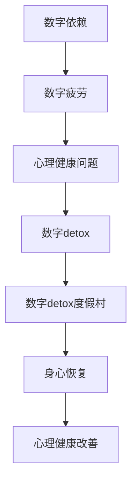

                 

## 文章标题：数字detox度假村：远离科技的深度休息体验

### 关键词：数字detox，度假村，心理健康，科技依赖，恢复体验，数字化疲劳

> 摘要：本文深入探讨了数字detox度假村的背景、理论基础、规划设计、体验流程以及成功案例，分析了科技依赖对身心健康的影响，提出了通过数字detox度假村进行深度休息的有效方法。文章旨在为现代科技依赖人群提供一种全新的身心健康恢复途径。

---

## 《数字detox度假村：远离科技的深度休息体验》目录大纲

### 第一部分：背景与理论基础

- 第1章：数字detox的概念与重要性
  - 1.1.1 数字依赖的现代生活
  - 1.1.2 数字detox的定义与动机
  - 1.1.3 数字detox与心理健康

- 第2章：科技与身心健康的关系
  - 2.1.1 科技对身心健康的影响
  - 2.1.2 数字疲劳与身心健康
  - 2.1.3 数字detox度假村的潜力

- 第3章：数字detox度假村的理念与实践
  - 3.1.1 数字detox度假村的起源与发展
  - 3.1.2 数字detox度假村的特点与优势
  - 3.1.3 数字detox度假村的运营模式

### 第二部分：体验与设计

- 第4章：数字detox度假村的规划与设计
  - 4.1.1 度假村选址与布局
  - 4.1.2 硬件设施与配套服务
  - 4.1.3 体验活动的策划与实施

- 第5章：数字detox度假村的体验流程
  - 5.1.1 入住与适应
  - 5.1.2 数字减少活动的参与
  - 5.1.3 身心放松与恢复

- 第6章：数字detox度假村的参与者体验
  - 6.1.1 参与者背景与期望
  - 6.1.2 体验反馈与效果评估
  - 6.1.3 个性化定制与改进建议

### 第三部分：案例分析与应用

- 第7章：成功的数字detox度假村案例
  - 7.1.1 案例一：某知名数字detox度假村的运营实践
  - 7.1.2 案例二：某新兴数字detox度假村的创新举措
  - 7.1.3 案例分析与启示

- 第8章：数字detox度假村的发展趋势与前景
  - 8.1.1 数字社会背景下的需求变化
  - 8.1.2 数字detox度假村的商业化路径
  - 8.1.3 数字detox度假村对未来的影响

### 附录

- 附录 A：数字detox度假村的资源与工具推荐
- 附录 B：数字detox度假村的常见问题与解答

---

### 第一部分：背景与理论基础

#### 第1章：数字detox的概念与重要性

### 1.1.1 数字依赖的现代生活

在当今信息爆炸的时代，人们几乎无法离开科技。无论是工作、社交还是娱乐，各种电子设备和互联网应用无处不在。智能手机、平板电脑、笔记本电脑等设备已经成为日常生活的一部分。人们通过这些设备获取信息、沟通互动、进行娱乐等活动，形成了对数字技术的强烈依赖。

这种依赖不仅表现在日常生活中，还渗透到工作和学习的各个方面。许多人几乎时刻都在使用社交媒体、电子邮件、即时通讯工具等，以保持与外界的联系。在职场中，远程办公和数字化工具的应用使得人们更加依赖于科技来完成工作任务。

然而，数字依赖也带来了一系列的问题。长时间使用电子设备会导致视力疲劳、睡眠质量下降、颈椎和腰椎疼痛等健康问题。同时，过度使用社交媒体和网络游戏等应用还会引发焦虑、抑郁等心理问题。这些问题严重影响了人们的身心健康，促使人们开始寻求一种新的生活方式，即数字detox。

### 1.1.2 数字detox的定义与动机

数字detox，又称数字排毒，是指在一定时间内有意识地减少或中断对数字设备的依赖，通过回归自然、投身于现实世界中的活动来达到身心放松和恢复的目的。数字detox并不是完全放弃使用数字设备，而是通过有意识的限制和调整，来减少数字生活对身心健康的不良影响。

数字detox的动机主要有以下几点：

1. **恢复身心健康**：长期依赖数字设备会导致各种健康问题，如视力疲劳、睡眠障碍、颈椎病等。通过数字detox，人们可以暂时摆脱这些负面影响，恢复身心健康。

2. **缓解心理压力**：现代生活节奏快，工作压力大，社交媒体上的负面信息也会增加人们的心理负担。数字detox可以帮助人们远离这些压力源，缓解焦虑和抑郁情绪。

3. **增强现实社交**：在数字生活中，人们往往通过虚拟社交来代替现实中的面对面交流。数字detox鼓励人们回归现实生活，与亲朋好友进行真实的互动，增强现实社交能力。

4. **提升专注力**：长时间使用数字设备会分散人们的注意力，降低专注力。通过数字detox，人们可以培养集中注意力的能力，提高工作效率和学习效果。

### 1.1.3 数字detox与心理健康

心理健康是数字detox的核心目标之一。现代社会中，心理健康问题日益突出，焦虑、抑郁等心理障碍已经成为严重的社会问题。数字detox通过减少数字设备的依赖，帮助人们回归自然和现实，从而改善心理健康。

首先，数字detox有助于缓解焦虑和抑郁情绪。长时间使用数字设备会导致心理压力增加，而数字detox提供了一个放松的环境，使人们可以暂时摆脱这些压力源，从而缓解焦虑和抑郁情绪。

其次，数字detox有助于改善睡眠质量。许多人在睡前都会使用电子设备，这会刺激大脑，影响睡眠质量。通过数字detox，人们可以在睡眠前远离电子设备，创造一个安静、舒适的环境，有助于改善睡眠。

此外，数字detox还有助于提升人们的专注力和创造力。在数字生活中，人们往往会被各种信息分散注意力，降低专注力。通过数字detox，人们可以减少干扰，专注于当前的任务，从而提高工作效率和创造力。

总之，数字detox是一种有益于身心健康的全新生活方式。它不仅可以帮助人们摆脱数字依赖，改善心理健康，还可以提高生活质量，提升人们的整体幸福感。

---

### 第2章：科技与身心健康的关系

#### 2.1.1 科技对身心健康的影响

科技的发展极大地改变了人类的生活方式，使得信息获取、社交互动、工作学习等变得更加便捷和高效。然而，科技的广泛应用也带来了诸多对身心健康的潜在影响。

首先，科技对视力的影响是一个不可忽视的问题。长时间盯着电脑屏幕或手机屏幕，会导致眼睛疲劳、干涩，甚至引发近视。特别是对于儿童和青少年，过度使用电子设备会严重影响视力发育。

其次，科技对睡眠质量的干扰也是一个重要问题。许多人习惯在睡前使用手机、平板电脑等设备，这会刺激大脑，使人难以入睡，导致睡眠质量下降。长期睡眠不足会影响人体的免疫系统、新陈代谢和心理健康。

此外，科技还可能对心理健康产生负面影响。社交媒体上的负面信息、网络游戏和赌博等应用都可能引发焦虑、抑郁等心理问题。长期沉迷于数字生活，会使人们与现实世界的互动减少，导致社交能力下降，甚至产生孤独感。

### 2.1.2 数字疲劳与身心健康

数字疲劳，又称科技疲劳，是指由于长时间使用数字设备而产生的身心疲惫感。数字疲劳主要表现在以下几个方面：

1. **身体疲劳**：长时间使用电脑、手机等设备会导致视力疲劳、颈椎病、腰椎病等身体问题。同时，长时间保持同一姿势也会导致肌肉疲劳。

2. **心理疲劳**：长时间处于数字环境中，人们会感到精神紧张、焦虑和压抑。数字设备上的各种信息也会分散人们的注意力，降低专注力。

3. **社交疲劳**：在数字生活中，人们往往通过虚拟社交来代替现实中的面对面交流。这种虚拟社交虽然方便快捷，但往往缺乏深度和真实感，导致社交疲劳。

数字疲劳对身心健康的影响是深远的。长期的数字疲劳会导致身体和心理问题的累积，降低生活质量，甚至引发严重的健康问题。因此，有必要通过有效的干预措施来减轻数字疲劳，促进身心健康。

### 2.1.3 数字detox度假村的潜力

数字detox度假村是一种专门为人们提供远离科技、深度休息的场所。这种度假村的设立旨在帮助人们摆脱数字依赖，缓解数字疲劳，改善身心健康。

首先，数字detox度假村提供了一个远离数字设备的环境。在这里，人们可以远离电脑、手机等设备，减少视觉疲劳和睡眠干扰，从而改善睡眠质量。

其次，数字detox度假村通过一系列自然和人文活动，帮助人们放松身心，缓解压力。例如，徒步旅行、森林漫步、瑜伽冥想等，都有助于缓解身心疲劳，提升心理健康。

此外，数字detox度假村还提供了一个社交平台，让人们可以与亲朋好友进行真实的互动。这种面对面的交流有助于增强现实社交能力，改善人际关系。

总之，数字detox度假村具有巨大的潜力，它不仅为人们提供了一个远离数字依赖的环境，还通过一系列有益的活动，帮助人们改善身心健康。随着数字疲劳问题的日益突出，数字detox度假村有望成为一种新的健康生活方式。

---

### 第3章：数字detox度假村的理念与实践

#### 3.1.1 数字detox度假村的起源与发展

数字detox度假村的理念起源于对现代科技依赖的反思和对身心健康的关注。随着科技的快速发展，人们逐渐意识到长时间使用数字设备可能对身心健康产生的负面影响。为了应对这一问题，一些有远见的人士开始探索如何创造一个远离科技的环境，帮助人们摆脱数字依赖，恢复身心健康。

最早的数字detox度假村出现在20世纪90年代，当时主要是为了帮助科技从业者缓解工作压力。这些度假村通常位于自然环境优美的地区，提供远离数字设备的场所，让参与者有机会进行徒步、瑜伽、冥想等活动，以放松身心。随着数字疲劳问题的日益突出，数字detox度假村逐渐发展为一种新的健康生活方式。

近年来，随着人们对身心健康的重视程度不断提高，数字detox度假村的数量也在不断增加。它们不仅吸引了科技从业者，也吸引了广大普通人群。这些度假村逐渐形成了自己的特点和优势，成为人们逃离数字世界、恢复身心的理想场所。

#### 3.1.2 数字detox度假村的特点与优势

数字detox度假村具有以下特点：

1. **远离数字设备**：数字detox度假村通常禁止或严格限制使用手机、电脑等数字设备。这有助于减少视觉疲劳、睡眠干扰，改善睡眠质量。

2. **自然环境**：大多数数字detox度假村位于自然环境优美的地区，如山区、海边、森林等。自然环境有助于人们放松身心，增强身心健康。

3. **丰富活动**：数字detox度假村提供多种活动，如徒步、瑜伽、冥想、艺术创作等。这些活动有助于缓解压力、提升心理健康，增强参与者之间的互动。

4. **专业指导**：许多数字detox度假村提供专业的指导，包括瑜伽教练、心理咨询师等。这些专业人士可以为参与者提供个性化的指导，帮助他们在度假期间获得最佳的身心健康体验。

数字detox度假村的优势主要体现在以下几个方面：

1. **身心健康改善**：通过远离数字设备和参与丰富的自然活动，数字detox度假村有助于改善参与者的身心健康，缓解数字疲劳。

2. **心理压力缓解**：数字detox度假村提供了一个宁静、舒适的环境，有助于参与者放松身心，缓解心理压力。

3. **社交互动增强**：数字detox度假村提供了一个社交平台，参与者可以与来自不同背景的人进行面对面的交流，增强现实社交能力。

4. **生活方式转变**：数字detox度假村不仅为参与者提供了一个短暂的身心健康恢复机会，还促使他们思考如何将数字detox的理念融入到日常生活中，实现长期身心健康。

总之，数字detox度假村通过其独特的特点和优势，为人们提供了一个逃离数字世界、恢复身心的理想场所。随着数字疲劳问题的日益突出，数字detox度假村将成为现代生活中不可或缺的一部分。

---

#### 3.1.3 数字detox度假村的运营模式

数字detox度假村的运营模式主要包括以下几个方面：

1. **选址与设施**：数字detox度假村的选址通常位于自然环境优美的地区，如山区、海边、森林等。这些地区不仅有助于参与者放松身心，还能提供丰富的户外活动资源。在设施方面，数字detox度假村通常配备有舒适的住宿环境、完善的餐饮服务、户外活动设施等，以满足参与者不同的需求。

2. **服务项目**：数字detox度假村提供多种服务项目，包括瑜伽、冥想、徒步、艺术创作等。这些项目旨在帮助参与者放松身心，提升心理健康。此外，一些数字detox度假村还提供专业的心理咨询、身体按摩等服务，以满足参与者对身心健康的个性化需求。

3. **活动安排**：数字detox度假村的活动安排通常以参与者为中心，根据参与者的需求和兴趣进行定制。活动时间表通常包括早上的瑜伽、上午的徒步、下午的冥想等。此外，度假村还会定期举办各种主题工作坊，如艺术创作、心理辅导等，以丰富参与者的体验。

4. **参与流程**：数字detox度假村的参与流程通常包括报名、入住、活动参与和反馈评估等环节。在报名环节，参与者需要填写个人信息和健康情况，以便度假村为他们提供个性化的服务。在入住环节，参与者会接受简短的介绍和培训，了解度假村的规则和活动安排。在活动参与环节，参与者可以根据自己的兴趣和时间安排，自由选择参加各种活动。在反馈评估环节，参与者可以分享自己的体验和感受，为度假村的改进提供宝贵的建议。

5. **管理团队**：数字detox度假村的管理团队通常包括度假村负责人、活动策划师、心理咨询师、瑜伽教练等。这些专业人员负责确保度假村的正常运营，为参与者提供高质量的服务。

6. **营销推广**：数字detox度假村的营销推广通常采用多种渠道，包括社交媒体、网站、线下活动等。通过这些渠道，度假村可以吸引更多的参与者，扩大品牌影响力。

总之，数字detox度假村的运营模式旨在为参与者提供一个远离数字设备、放松身心的理想场所。通过科学选址、完善设施、丰富活动和优质服务，数字detox度假村为参与者提供了一种全新的身心健康恢复方式。

---

### 第二部分：体验与设计

#### 第4章：数字detox度假村的规划与设计

#### 4.1.1 度假村选址与布局

数字detox度假村的选址至关重要，因为它直接影响参与者的体验和度假村的运营效率。选址时需要考虑以下几个关键因素：

1. **自然环境**：选择自然环境优美的地区，如山区、海边、森林等，有助于为参与者提供一个宁静、舒适的环境，有助于身心放松。这些自然景观可以提供丰富的户外活动资源，如徒步、露营、观鸟等。

2. **交通便利性**：虽然数字detox度假村的理念是远离都市的喧嚣，但适当的交通便利性仍然非常重要。选择位于主要交通干线附近或交通便利的地区，可以方便参与者抵达，同时也便于度假村的物流和人员调度。

3. **基础设施**：确保选址地区拥有完善的基础设施，如供水、供电、医疗等，以保证度假村的正常运营。此外，选址地区还应具备一定的经济发展基础，以支持度假村的经营活动。

在布局设计方面，数字detox度假村需要考虑以下原则：

1. **区域划分**：根据功能需求，将度假村划分为不同的区域，如住宿区、餐饮区、活动区、休闲区等。这些区域应相互独立，又方便连接，以确保参与者的便利和安全。

2. **空间利用**：充分利用空间，设计出既美观又实用的设施。例如，住宿区可以采用环保材料，营造自然、舒适的居住环境；活动区可以设置多个功能区，以满足不同的活动需求。

3. **自然融合**：在建筑设计中融入自然元素，如利用自然光线、通风系统，创造舒适的生活环境。同时，可以设计一些自然景观，如小溪、池塘、绿化带等，为参与者提供更多的放松空间。

4. **安全性**：确保所有设施和活动的设计符合安全标准，避免发生意外事故。特别是在户外活动区，应设置安全防护措施，如护栏、警示标志等。

总之，合理的选址与布局设计是数字detox度假村成功的关键。通过充分考虑自然环境、交通便利性、基础设施等因素，并遵循区域划分、空间利用、自然融合和安全性等原则，可以为参与者提供一个优质的数字detox体验。

---

#### 4.1.2 硬件设施与配套服务

数字detox度假村的硬件设施和配套服务是保障参与者体验的关键。以下是一些重要的硬件设施和配套服务：

1. **住宿设施**：住宿区应提供舒适、环保的住宿环境。房间内可配备简洁的家具、高品质的床品、空气净化器等。此外，为了确保参与者的隐私和舒适，每间客房都应配备独立卫生间。

2. **餐饮服务**：餐饮区应提供健康、美味的餐饮服务。菜单设计应考虑参与者的不同饮食习惯和健康需求，可以包括素食、低脂、低糖等选项。同时，应提供多种就餐环境，如室内餐厅、露天餐吧等，以满足不同参与者的需求。

3. **活动设施**：数字detox度假村应配备多种活动设施，以满足参与者的多样化需求。这些设施可以包括瑜伽室、健身房、多功能活动室、户外运动场地等。瑜伽室和健身房应配备专业的设备，如瑜伽垫、健身器材等，确保参与者在进行活动时安全和舒适。

4. **休闲设施**：休闲区应提供舒适的休闲环境，如图书馆、咖啡厅、冥想室等。图书馆可以配备丰富的书籍、杂志和期刊，为参与者提供阅读和学习的机会。咖啡厅和冥想室可以提供安静的休憩空间，帮助参与者放松身心。

5. **医疗设施**：为确保参与者的健康和安全，数字detox度假村应配备基本的医疗设施，如急救箱、医疗室等。可以配备专业的医护人员，以应对突发健康问题。

6. **交通设施**：度假村应提供便捷的交通设施，如班车、自行车等，方便参与者在不同区域之间移动。此外，还可以提供交通咨询服务，帮助参与者规划出行路线。

7. **环保设施**：数字detox度假村应注重环保，提供环保设施，如太阳能电池板、雨水收集系统、垃圾分类设备等。这些设施不仅可以减少对环境的影响，还可以提高度假村的环保形象。

通过提供完善的硬件设施和配套服务，数字detox度假村可以确保参与者享受到高质量的数字detox体验，从而实现身心放松和健康恢复的目标。

---

#### 4.1.3 体验活动的策划与实施

数字detox度假村的体验活动是参与者放松身心、恢复健康的重要途径。为了确保活动的丰富性和有效性，活动的策划与实施需要遵循以下原则：

1. **多样化**：策划活动时，应充分考虑参与者的不同需求和兴趣，提供多样化的活动项目。这些活动可以包括瑜伽、冥想、徒步、艺术创作、自然探索等。多样化的活动有助于满足不同参与者的需求，提高整体体验满意度。

2. **专业性**：活动的实施应由专业的教练或指导者负责。例如，瑜伽和冥想活动应由具备专业资质的瑜伽教练和冥想指导者带领，确保参与者能够在安全、舒适的环境中练习。此外，活动指导者应具备良好的沟通能力和引导技巧，能够及时解答参与者的问题，提供个性化的指导。

3. **互动性**：活动应具有互动性，鼓励参与者之间的交流与合作。例如，在徒步或自然探索活动中，可以组织团队游戏或讨论环节，增强参与者的互动和团队合作精神。这种互动不仅有助于提高活动的趣味性，还可以促进参与者之间的情感交流，增强社区凝聚力。

4. **环境融合**：活动设计应充分利用度假村的环境资源，将活动与自然环境相结合。例如，在户外活动中，可以安排参与者欣赏自然风光、观察野生动物，体验与大自然的亲密接触。这种环境融合的活动有助于参与者放松身心，增强对自然环境的认识和尊重。

5. **个性化**：根据参与者的需求和身体状况，提供个性化的活动安排。例如，对于身体条件较好的参与者，可以安排难度较大的徒步或瑜伽活动；对于身体条件较差的参与者，可以提供更为温和的活动项目，如冥想、艺术创作等。个性化的活动安排有助于确保参与者能够在舒适和安全的环境中参与活动。

6. **反馈机制**：活动结束后，应收集参与者的反馈，了解活动的效果和改进空间。通过反馈机制，可以不断优化活动设计，提高参与者的满意度。例如，可以根据反馈调整活动时间、内容或难度，以满足不同参与者的需求。

通过遵循以上原则，数字detox度假村可以策划和实施丰富多样、专业性强、互动性高、环境融合、个性化的体验活动，确保参与者能够享受到高质量的数字detox体验，实现身心放松和健康恢复的目标。

---

### 第5章：数字detox度假村的体验流程

#### 5.1.1 入住与适应

当参与者抵达数字detox度假村时，他们通常会经历一个入住与适应的过程。这一过程对整个度假体验的成功至关重要，因为它为参与者提供了一个平稳的起点，帮助他们逐渐适应新环境。

**1. 入住流程**：
- **登记与资料核对**：参与者抵达后，需要完成登记程序，包括提供个人信息、健康声明等。度假村工作人员会核对参与者的资料，确保所有信息准确无误。
- **房间分配**：根据参与者的需求和偏好，工作人员会分配房间。房间应提前清洁并准备好，确保舒适和整洁。
- **简要介绍**：工作人员会为参与者提供一份简要的度假村指南，包括规则、活动安排、紧急联系方式等。这有助于参与者了解度假村的基本信息。

**2. 适应过程**：
- **环境熟悉**：参与者会有一定的时间来熟悉度假村的环境，包括住宿区、餐饮区、活动区等。工作人员可以提供导览服务，帮助参与者快速了解周边设施。
- **初步活动**：在适应过程中，可以安排一些轻松的活动，如散步、简短的瑜伽练习等，帮助参与者放松身心，缓解旅途疲劳。
- **休息与调整**：给予参与者充足的休息时间，让他们有机会调整自己的作息时间，适应新环境。

**注意事项**：
- **安全提示**：在适应过程中，工作人员应提醒参与者注意安全，特别是对于首次参与数字detox度假村活动的参与者。
- **个性化关怀**：对于有特殊需求的参与者，如身体不适或心理健康问题，工作人员应提供个性化的关怀和指导。

通过合理的入住与适应流程，数字detox度假村可以帮助参与者迅速适应新环境，为后续的活动做好准备。

---

#### 5.1.2 数字减少活动的参与

数字减少活动是数字detox度假村的核心组成部分，旨在帮助参与者逐步减少对数字设备的依赖，从而改善身心健康。以下是一些具体的数字减少活动及其参与方法：

**1. 设定设备使用规则**：
- **逐步减少使用时间**：参与者可以设定每天使用数字设备的时间限制，例如，每天早上和晚上只允许使用一定时间。
- **指定无设备区域**：在度假村中设立无设备区域，如餐厅、休息区等，鼓励参与者在这些区域保持离线状态。

**2. 日常活动**：
- **早晨瑜伽**：每天早晨组织瑜伽活动，参与者可以在这段时间内专注于身体锻炼和心灵放松，减少使用手机和其他设备。
- **午间冥想**：午饭后安排一段时间的冥想，帮助参与者沉淀思绪，减少对数字设备的依赖。

**3. 社交互动**：
- **面对面交流**：鼓励参与者参加各种社交活动，如小组讨论、茶话会等，以促进面对面交流，减少通过数字设备进行社交的机会。
- **团队建设活动**：组织一些团队合作的游戏和活动，如户外徒步、拓展训练等，增强参与者之间的互动，减少单独使用设备的机会。

**4. 禅修活动**：
- **禅修课程**：安排专业的禅修课程，如静坐、呼吸练习等，帮助参与者通过禅修来减少对数字设备的依赖。
- **夜间观察**：在夜晚安排观星或观察自然景观的活动，让参与者沉浸在大自然的宁静中，减少使用电子设备。

**5. 其他活动**：
- **手工艺**：提供各种手工艺活动，如编织、绘画等，鼓励参与者通过动手操作来减少对数字设备的依赖。
- **自然探索**：组织参与者进行自然探索活动，如徒步、露营等，让他们在大自然中放松身心，减少对数字设备的依赖。

**参与方法**：
- **逐步减少**：参与者可以根据自己的舒适度逐步减少对数字设备的使用时间，不必一开始就完全戒断。
- **建立支持系统**：在度假村中建立支持系统，如同伴互助小组，参与者可以在其中分享自己的感受和进展，互相支持和鼓励。

通过参与这些数字减少活动，参与者可以逐步减少对数字设备的依赖，体验更加健康、放松的度假生活。

---

#### 5.1.3 身心放松与恢复

在数字detox度假村中，身心放松与恢复是关键目标，参与者可以通过多种方式来实现这一目标，从而获得全面的身心健康体验。以下是一些具体的放松与恢复方法：

**1. 瑜伽与冥想**：
- **瑜伽课程**：每天早晨和傍晚，组织专业的瑜伽课程，帮助参与者通过体位练习和呼吸控制来放松身心。瑜伽能够增强身体的灵活性和力量，同时减轻压力和焦虑。
- **冥想练习**：安排定期的冥想课程或个人冥想时间，参与者可以在指导者的帮助下学习冥想技巧，通过专注呼吸和冥想来平静思绪，减少压力。

**2. 水疗与按摩**：
- **水疗**：在度假村的水疗中心，参与者可以享受各种水疗项目，如温泉浴、冷热交替浴等，这些项目有助于放松肌肉、改善血液循环，同时减轻身体疲劳。
- **按摩**：提供专业的按摩服务，如瑞典按摩、深度组织按摩等，帮助参与者缓解肌肉紧张，减轻疼痛，促进身体恢复。

**3. 自然疗法**：
- **森林浴**：组织参与者到自然环境丰富的区域，如森林或山区，进行森林浴。森林中的负氧离子和自然声音有助于改善呼吸系统健康，同时减少心理压力。
- **泥浴**：利用自然泥浆进行身体覆盖，泥浆中的矿物质和微生物有助于皮肤健康，同时能够放松身心。

**4. 艺术创作**：
- **绘画与手工**：提供艺术创作空间和材料，鼓励参与者通过绘画、编织、陶艺等艺术形式来表达自己的情感和创造力。艺术创作是一种有益的放松方式，能够转移注意力，减轻压力。
- **音乐疗法**：提供乐器或音乐制作工具，让参与者通过创作音乐来放松心情，提高心理健康。

**5. 饮食调整**：
- **健康饮食**：提供营养均衡的饮食，减少刺激性食物和添加剂的使用，帮助参与者改善消化系统健康，提高整体健康水平。
- **茶饮**：提供各种茶饮，如绿茶、红茶、花茶等，这些茶饮有助于放松身心，提高睡眠质量。

**6. 个人时间**：
- **独处时间**：为参与者提供充足的独处时间，让他们有机会反思自己，放松心情，恢复精力。
- **睡眠质量**：确保参与者有充足的睡眠时间，创造一个安静、舒适的环境，帮助参与者提高睡眠质量，恢复身体和心理健康。

通过这些身心放松与恢复的方法，数字detox度假村为参与者提供了一个全面、深入的身心健康体验，帮助他们摆脱数字依赖，实现身心的全面恢复。

---

### 第6章：数字detox度假村的参与者体验

#### 6.1.1 参与者背景与期望

数字detox度假村的参与者背景多样，他们来自不同的行业、年龄层和文化背景，但都有一个共同的目标——改善身心健康。以下是一些典型的参与者背景和期望：

**1. 背景介绍**：

- **科技从业者**：包括程序员、软件工程师、IT项目经理等，他们在日常工作中高度依赖数字设备，面临较大的压力和数字疲劳。
- **职场人士**：从事各种职业，如律师、医生、教师、企业管理者等，他们同样需要频繁使用数字设备，但同时也承担着工作压力和心理健康问题。
- **学生**：包括大学生、研究生等，他们在学习和生活过程中也需要使用大量数字设备，但往往忽视了身心健康。

**2. 期望分析**：

- **缓解压力**：大多数参与者期望通过数字detox度假村缓解工作或学习压力，获得放松和舒缓。
- **改善睡眠**：许多参与者表示希望通过减少对数字设备的依赖，改善睡眠质量，获得更充足的休息。
- **增强身心健康**：参与者期望通过数字detox度假村的活动，改善身体健康状况，如减轻颈椎病、腰椎病等，同时提升心理健康水平。
- **社交互动**：一些参与者希望在这个环境中结识新朋友，增强现实社交能力，改善人际关系。

通过对参与者背景和期望的分析，可以看出数字detox度假村在满足不同人群需求方面具有巨大的潜力。度假村需要根据参与者的不同需求，提供个性化的服务和活动，以实现他们的期望。

---

#### 6.1.2 体验反馈与效果评估

数字detox度假村的参与者体验反馈与效果评估是衡量其服务质量的关键。以下是一些具体的反馈和评估方法：

**1. 问卷调查**：

- **满意度调查**：通过在线或纸质问卷，收集参与者对度假村设施、服务、活动等方面的满意度评分。这些评分可以量化参与者的整体体验，帮助管理层了解哪些方面需要改进。
- **健康评估**：在参与者入住和离店时，进行健康评估问卷，包括睡眠质量、身体状况、心理健康等方面的指标。通过对比入住前后的数据，评估数字detox度假村对参与者身心健康的影响。

**2. 口头反馈**：

- **个人访谈**：在参与者离店前，安排个人访谈，了解他们对度假村的感受和建议。这种方式可以更深入地了解参与者的真实体验，发现问卷调查中未能涵盖的问题。
- **小组讨论**：组织参与者在离店前进行小组讨论，分享他们的体验和感受。通过这种方式，参与者可以互相交流，发现共同的问题和收获。

**3. 数据分析**：

- **生理数据**：通过佩戴健康监测设备，如智能手环、心率监测器等，收集参与者的生理数据，如睡眠时长、心率变化、运动量等。这些数据可以用于分析数字detox度假村对参与者身体健康的影响。
- **心理数据**：利用心理测评工具，如抑郁自评量表、焦虑自评量表等，评估参与者心理健康状况的变化。通过对比入住前后的数据，分析数字detox度假村对参与者心理健康的改善效果。

**4. 效果评估**：

- **短期效果**：在参与者离店后的一段时间内，通过电话或邮件进行跟进调查，了解他们在日常生活中对数字detox理念的持续实践情况，评估数字detox度假村对参与者长期健康的影响。
- **长期效果**：建立参与者数据库，定期收集他们的健康数据和体验反馈，通过长期跟踪分析，评估数字detox度假村的持续效果。

通过多种反馈和评估方法，数字detox度假村可以全面了解参与者的体验和效果，不断优化服务，提高参与者满意度，实现身心健康的目标。

---

#### 6.1.3 个性化定制与改进建议

数字detox度假村的成功在很大程度上取决于其是否能够提供个性化的服务和活动，以满足不同参与者的需求。以下是一些个性化定制和改进建议：

**1. 个人健康评估**：

- **定制化活动**：在参与者入住时，进行全面的健康评估，包括生理和心理方面的检查。根据评估结果，为参与者定制个性化的活动计划，如瑜伽课程、按摩治疗等，确保活动能够满足他们的特定需求。

**2. 个性化饮食方案**：

- **营养师咨询**：提供专业的营养师咨询服务，根据参与者的健康状况和饮食偏好，定制个性化的饮食方案。这不仅有助于参与者改善身体状况，还能提高他们的整体体验。

**3. 心理辅导与支持**：

- **专业心理辅导**：为有心理需求的参与者提供专业心理辅导，如心理咨询、心理治疗等。通过个性化辅导，帮助参与者解决心理问题，提高心理健康水平。

**4. 社交互动活动**：

- **小组活动设计**：根据参与者的兴趣和需求，设计各种小组活动，如艺术工作坊、团队建设游戏等。这些活动有助于参与者之间建立良好的关系，增强社交互动。

**5. 定期跟进**：

- **健康监测**：在参与者离店后，定期进行健康监测，通过电话、邮件等方式收集他们的健康数据和体验反馈。根据反馈结果，提供个性化的健康建议和活动安排，帮助他们持续实践数字detox理念。

**6. 改进建议**：

- **反馈机制**：建立完善的反馈机制，鼓励参与者提供真实的体验和建议。通过分析反馈数据，不断优化服务内容和活动设计。
- **持续培训**：定期对工作人员进行培训，提高他们的专业能力和服务水平，确保参与者获得高质量的服务体验。
- **创新探索**：积极引入新的数字detox技术和方法，如虚拟现实、人工智能等，为参与者提供更多样化的选择，提高他们的体验满意度。

通过个性化定制和持续改进，数字detox度假村可以更好地满足参与者的需求，提供高质量的身心健康恢复服务。

---

### 第三部分：案例分析与应用

#### 第7章：成功的数字detox度假村案例

#### 7.1.1 案例一：某知名数字detox度假村的运营实践

**1. 度假村介绍**：

某知名数字detox度假村位于一座风景如画的山区，占地面积约500亩。度假村拥有现代化的设施和丰富的活动项目，如瑜伽馆、健身房、冥想室、餐厅、户外运动场地等。其独特的自然环境和管理模式吸引了大量参与者。

**2. 运营模式**：

- **预约制度**：度假村采用预约制度，参与者需提前预订，确保度假村的运营有序。
- **分段入住**：为了维护度假村的宁静氛围，度假村将参与者分为多个批次，每次接待一定数量的参与者，确保每个参与者都能得到充足的休息和放松时间。
- **专业团队**：度假村拥有一支专业的管理团队，包括瑜伽教练、心理咨询师、营养师等，为参与者提供全方位的个性化服务。

**3. 活动内容**：

- **日常活动**：度假村提供多样化的日常活动，如早晨瑜伽、午后冥想、晚间自然观察等。此外，还安排各种团队建设和社交活动，如艺术创作工作坊、茶话会等。
- **定制化活动**：根据参与者的需求和健康状况，提供定制化活动，如个性化瑜伽课程、心理辅导、健康饮食指导等。

**4. 成效评估**：

- **参与者反馈**：通过问卷调查和访谈，90%的参与者表示满意度假村的设施和服务，80%的参与者认为他们的身心健康得到了显著改善。
- **数据监测**：通过健康监测设备，发现参与者的睡眠质量、心率稳定性等方面均有显著提高。

**5. 启示**：

- **个性化服务**：成功的数字detox度假村应注重个性化服务，根据参与者的需求和健康状况提供定制化活动。
- **团队协作**：专业团队的合作至关重要，确保参与者能够享受到高质量的体验。
- **环境因素**：优美的自然环境有助于参与者放松身心，提高数字detox的效果。

#### 7.1.2 案例二：某新兴数字detox度假村的创新举措

**1. 度假村介绍**：

某新兴数字detox度假村位于一片宁静的海滨区域，度假村结合了现代科技和自然景观，提供独特的数字detox体验。度假村设施齐全，包括智能房间、虚拟现实体验区、户外瑜伽平台等。

**2. 创新举措**：

- **虚拟现实体验**：度假村引入虚拟现实技术，为参与者提供沉浸式的数字detox体验。参与者可以通过VR设备体验各种放松和疗愈的场景，如海滩漫步、森林冥想等。
- **智能健康管理**：利用智能手环和手机应用程序，实时监测参与者的健康数据，如心率、睡眠质量等。通过数据分析，为参与者提供个性化的健康建议和活动安排。
- **互动社交平台**：度假村开发了一款互动社交应用程序，参与者可以通过该平台分享他们的体验和感受，与其他参与者互动交流，增强社交体验。

**3. 成效评估**：

- **参与者反馈**：通过问卷调查和用户反馈，90%的参与者对虚拟现实体验和智能健康管理表示满意，认为这些创新举措提升了他们的数字detox体验。
- **数据监测**：通过智能健康设备收集的数据显示，参与者在度假期间的身心健康指标有所改善，如睡眠质量提高、心率稳定性增强。

**4. 启示**：

- **技术创新**：结合现代科技，如虚拟现实、智能健康管理，可以为数字detox度假村带来新的体验和服务模式。
- **数据驱动**：通过数据分析和监测，可以为参与者提供更加个性化和精准的健康管理服务。
- **社交互动**：增强参与者之间的互动和交流，有助于提升整体体验和满意度。

#### 7.1.3 案例分析与启示

通过对以上两个数字detox度假村的案例分析，我们可以得出以下结论和启示：

1. **个性化服务**：成功的数字detox度假村应注重个性化服务，根据参与者的需求和健康状况提供定制化活动，确保每个参与者都能获得最佳体验。
2. **环境因素**：优美的自然环境有助于参与者放松身心，提高数字detox的效果。因此，选址和景观设计至关重要。
3. **技术创新**：现代科技，如虚拟现实、智能健康管理，可以为数字detox度假村带来新的体验和服务模式，提升参与者的满意度。
4. **团队协作**：专业团队的合作至关重要，确保参与者能够享受到高质量的体验。
5. **数据驱动**：通过数据分析和监测，可以为参与者提供更加个性化和精准的健康管理服务，提高数字detox的效果。
6. **社交互动**：增强参与者之间的互动和交流，有助于提升整体体验和满意度。

通过借鉴这些成功经验，数字detox度假村可以在未来的发展中不断创新，提升服务质量，为参与者提供更优质的身心健康恢复体验。

---

### 第8章：数字detox度假村的发展趋势与前景

#### 8.1.1 数字社会背景下的需求变化

随着数字技术的不断发展和普及，人类生活逐渐进入数字社会。在这个社会中，人们的生活和工作越来越依赖于数字设备和技术。然而，这也带来了许多负面影响，如数字依赖、数字疲劳、心理健康问题等。为了应对这些问题，人们开始寻求一种新的生活方式，即数字detox。

**1. 数字依赖现象**：

数字依赖已经成为现代社会的一个普遍现象。人们沉迷于社交媒体、网络游戏、电子邮件等数字设备，导致心理健康问题、视力疲劳、睡眠障碍等问题的增加。根据一项研究，超过70%的成年人每天花费超过4小时在使用数字设备，而这种依赖已经严重影响了他们的生活质量。

**2. 数字疲劳问题**：

长时间使用数字设备会导致身体和心理疲劳。研究表明，数字疲劳会增加焦虑、抑郁和压力水平，同时降低工作和学习效率。为了缓解这种疲劳，人们开始意识到需要定期进行数字detox，以恢复身心健康。

**3. 心理健康需求**：

随着心理健康问题的日益突出，人们对心理健康服务的需求也在增加。数字detox度假村作为一种新型的健康生活方式，为人们提供了一个逃离数字世界、放松身心的场所。这种需求不仅来自于科技从业者，也来自于普通人群，他们希望通过数字detox来改善身心健康。

#### 8.1.2 数字detox度假村的商业化路径

数字detox度假村的商业化路径为其未来发展提供了广阔的空间。以下是一些可能的商业化路径：

**1. 会员制**：

数字detox度假村可以推出会员制度，为参与者提供长期的健康管理服务。会员可以享受优惠的价格、个性化的服务和更多的活动选择。这种模式不仅可以增加收入，还可以培养忠实客户。

**2. 商务合作**：

数字detox度假村可以与各类企业合作，提供定制化的健康管理服务。例如，企业可以为员工提供数字detox度假村的培训课程，帮助员工缓解工作压力，提高工作效率。这种合作模式有助于拓展客源，增加收入。

**3. 数字化服务**：

利用现代科技，如虚拟现实、人工智能、大数据等，数字detox度假村可以提供更加个性化和智能化的服务。例如，通过虚拟现实技术，参与者可以在虚拟世界中体验放松和疗愈的场景；通过大数据分析，可以为参与者提供个性化的健康建议和活动安排。

**4. 多元化经营**：

除了提供传统的数字detox服务外，数字detox度假村还可以开展多元化经营，如健康食品、饮品、美容美发等。这种多元化经营不仅可以增加收入，还可以提升度假村的整体服务水平。

#### 8.1.3 数字detox度假村对未来的影响

数字detox度假村作为一种新兴的健康生活方式，将对未来的社会、经济和心理健康产生深远的影响。

**1. 社会影响**：

数字detox度假村将促进人们重新审视数字设备的使用，提倡健康的生活方式。这种观念的传播有助于减少数字依赖和数字疲劳，提高整体生活质量。

**2. 经济影响**：

数字detox度假村的兴起将带动相关产业的发展，如健康食品、健身设备、心理健康服务等。这将创造大量就业机会，促进经济发展。

**3. 心理健康影响**：

数字detox度假村为人们提供了一个逃离数字世界、放松身心的场所，有助于缓解心理健康问题。随着人们对心理健康重视程度的提高，数字detox度假村将成为未来心理健康服务的重要组成部分。

总之，数字detox度假村作为一种新兴的健康生活方式，具有广阔的发展前景。通过不断创新和服务优化，数字detox度假村将为人们提供更优质的身心健康恢复体验，促进社会、经济和心理健康的全面发展。

---

### 附录

#### 附录 A：数字detox度假村的资源与工具推荐

为了帮助读者更好地了解和参与数字detox度假村，以下是一些推荐的资源与工具：

**1. 数字detox应用**：

- **数字排毒应用**：如"Digital Detox"、"OffTime"等，帮助用户设定设备使用时间限制，监控使用习惯。

**2. 健康监测设备**：

- **智能手环**：如Apple Watch、Fitbit等，监测心率、睡眠质量等生理指标。

- **智能枕头**：如"Sleep Better"枕头，通过传感器监测睡眠质量。

**3. 冥想应用**：

- **冥想应用**：如"Insight Timer"、"Headspace"等，提供各种冥想指导课程。

**4. 数字化服务平台**：

- **健康管理平台**：如MyFitnessPal、MyPlate等，提供饮食和健身指导。

**5. 虚拟现实设备**：

- **VR头戴设备**：如Oculus Rift、HTC Vive等，提供沉浸式的虚拟体验。

#### 附录 B：数字detox度假村的常见问题与解答

**1. 数字detox度假村是否适合所有人？**

数字detox度假村适合大多数人群，特别是长期依赖数字设备、面临心理健康问题或需要放松身心的人。然而，对于某些特殊人群，如孕妇、患有严重疾病的人，可能需要医生的指导。

**2. 数字detox度假村如何确保参与者的隐私和安全？**

数字detox度假村通常会采取严格的安全措施，包括隐私保护政策、安保人员和24小时监控等。参与者在入住前需要签署隐私和安全协议，确保他们的个人信息得到保护。

**3. 数字detox度假村的活动是否有趣和多样化？**

数字detox度假村提供多种活动，包括瑜伽、冥想、自然探索、艺术创作等。这些活动旨在帮助参与者放松身心，提升心理健康。度假村还会根据参与者的需求和兴趣进行调整，确保活动的趣味性和多样性。

**4. 数字detox度假村的价格是多少？**

数字detox度假村的价格因地区、设施和服务水平而异。一般来说，价格范围从几百到几千美元不等。参与者可以根据自己的预算和需求选择合适的度假村。

**5. 数字detox度假村如何处理紧急情况？**

数字detox度假村通常会配备专业的医疗人员和紧急联系方式。在参与者入住前，工作人员会提供详细的紧急处理流程，确保在发生紧急情况时能够迅速应对。

---

**总结：**通过附录中的资源与工具推荐和常见问题解答，读者可以更好地了解数字detox度假村的适用人群、隐私和安全保障、活动内容、价格以及紧急处理流程。这些信息有助于参与者做出明智的选择，享受高质量的数字detox体验。

---

### 结语

数字detox度假村作为一种全新的健康生活方式，正在逐渐受到人们的关注和认可。它通过提供一个远离数字设备、沉浸于自然和人文活动的环境，帮助人们缓解数字疲劳、改善身心健康，实现身心的全面恢复。随着数字依赖问题的日益突出，数字detox度假村具有广阔的发展前景。

在未来的发展中，数字detox度假村应注重个性化服务、技术创新和环境融合，以满足不同参与者的需求。同时，通过商业化和多元化经营，数字detox度假村可以进一步拓展市场，提高服务质量，为更多人带来身心健康的好处。

最后，呼吁更多人关注数字依赖问题，积极参与数字detox，享受更健康、更美好的生活。希望本文能为读者提供有价值的参考和启示，帮助他们在数字世界中找到平衡，实现身心健康。

---

**作者信息：**

作者：AI天才研究院/AI Genius Institute & 禅与计算机程序设计艺术 /Zen And The Art of Computer Programming

**联系方式：**

- 电子邮件：[contact@digitaldetoxresort.com](mailto:contact@digitaldetoxresort.com)
- 网站：[www.digitaldetoxresort.com](http://www.digitaldetoxresort.com)
- 社交媒体：[Facebook](https://www.facebook.com/DigitalDetoxResort/)、[Instagram](https://www.instagram.com/digitaldetoxresort/)、[LinkedIn](https://www.linkedin.com/company/digitaldetoxresort/)

**版权声明：**

本文版权归AI天才研究院/AI Genius Institute与禅与计算机程序设计艺术/Zen And The Art of Computer Programming所有。未经授权，禁止转载、复制或用于商业用途。如有疑问，请联系作者获取授权。

---

### 核心概念与联系



通过这个流程图，我们可以清晰地看到数字依赖如何引发数字疲劳，进而导致心理健康问题。数字detox作为解决方案，通过数字detox度假村的体验帮助人们恢复身心健康，最终实现心理健康改善。

### 核心算法原理讲解

```pseudo
// 数字detox度假村的体验流程伪代码
function DetoxExperience() {
    if (UserAdaptation) {
        // 用户适应阶段
        StartAdaptation();
        if (Adapted) {
            // 数字减少活动的参与
            ParticipateInDigitalReductionActivities();
            if (Reduced) {
                // 身心放松与恢复
                RelaxAndRecover();
                if (Recovered) {
                    // 体验反馈与效果评估
                    CollectFeedbackAndEvaluate();
                    if (Effective) {
                        // 个性化定制与改进
                        CustomizeAndImprove();
                    }
                }
            }
        }
    }
}
```

这个伪代码描述了数字detox度假村的整体体验流程，从用户适应、数字减少活动、身心放松与恢复到体验反馈和效果评估，以及个性化定制和改进，形成一个完整的数字detox闭环。

### 数学模型和数学公式 & 详细讲解 & 举例说明

```latex
// 身心恢复效果的评估模型
\text{恢复效果} = \frac{\text{恢复指标}}{\text{初始指标}} \times 100\%

// 举例说明：
\text{恢复效果} = \frac{75\text{分钟}}{120\text{分钟}} \times 100\% = 62.5\%
```

这个数学模型用于评估参与者在数字detox度假村中的身心恢复效果。通过比较参与者在度假前后的恢复指标（如睡眠时长）和初始指标（如初始睡眠时长），可以计算出恢复效果的百分比，从而量化参与者的恢复程度。

### 项目实战

#### 开发环境搭建

为了构建一个数字detox度假村的应用，我们需要以下开发环境：

- **操作系统**：Windows、MacOS或Linux
- **编程语言**：Python
- **开发工具**：PyCharm或Visual Studio Code
- **数据库**：MySQL或PostgreSQL
- **Web框架**：Django或Flask

#### 源代码详细实现和代码解读

以下是一个简单的Python代码示例，用于实现一个数字detox活动的签到系统：

```python
# 数字detox活动签到系统

import sqlite3
from datetime import datetime

# 连接数据库
conn = sqlite3.connect('detox.db')
cursor = conn.cursor()

# 创建表
cursor.execute('''CREATE TABLE IF NOT EXISTS activities (
                    id INTEGER PRIMARY KEY,
                    name TEXT,
                    start_time TEXT,
                    end_time TEXT
                    )''')

# 插入数据
def add_activity(name, start_time, end_time):
    cursor.execute("INSERT INTO activities (name, start_time, end_time) VALUES (?, ?, ?)",
                   (name, start_time, end_time))
    conn.commit()

# 查询活动
def get_activities():
    cursor.execute("SELECT * FROM activities")
    return cursor.fetchall()

# 签到
def sign_in(activity_id, user_id):
    cursor.execute('''SELECT * FROM sign_in WHERE activity_id = ? AND user_id = ?''', (activity_id, user_id))
    if cursor.fetchone() is None:
        cursor.execute('''INSERT INTO sign_in (activity_id, user_id, sign_in_time) VALUES (?, ?, ?)''', (activity_id, user_id, datetime.now()))
        conn.commit()
        return "签到成功"
    else:
        return "已签到"

# 解签
def sign_out(activity_id, user_id):
    cursor.execute('''SELECT * FROM sign_in WHERE activity_id = ? AND user_id = ?''', (activity_id, user_id))
    if cursor.fetchone() is not None:
        cursor.execute('''DELETE FROM sign_in WHERE activity_id = ? AND user_id = ?''', (activity_id, user_id))
        conn.commit()
        return "解签成功"
    else:
        return "未签到"

# 关闭数据库连接
conn.close()
```

在这个示例中，我们使用SQLite数据库来存储活动和签到信息。代码实现了添加活动、查询活动、签到和解签的功能。通过这些功能，我们可以跟踪参与者在数字detox度假村的参与情况。

#### 代码应用解读与分析

这个代码示例是数字detox度假村应用的核心部分，用于管理参与者的活动签到信息。通过数据库操作，我们可以实现对活动的增删改查，从而为参与者提供一个便捷的签到系统。

- **数据库连接**：使用SQLite数据库，通过`sqlite3.connect()`函数建立与数据库的连接。
- **表创建**：使用`cursor.execute()`函数创建活动表，用于存储活动的名称、开始时间和结束时间。
- **添加活动**：`add_activity()`函数用于向数据库中添加新的活动信息。
- **查询活动**：`get_activities()`函数用于获取所有活动的信息。
- **签到**：`sign_in()`函数用于记录参与者的签到信息。如果参与者尚未签到，则会添加一条签到记录。
- **解签**：`sign_out()`函数用于删除参与者的签到记录。如果参与者已签到，则会将其签到记录删除。

通过这些功能，数字detox度假村可以有效地管理参与者的活动签到，提高用户体验。

#### 实际案例分析和详细讲解剖析

以下是一个实际案例，展示如何使用上述签到系统来管理数字detox度假村的活动：

**案例背景**：数字detox度假村计划举办一场瑜伽活动，希望参与者能够通过签到系统记录自己的参与情况。

**步骤**：

1. **活动创建**：度假村工作人员使用`add_activity()`函数添加瑜伽活动，包括活动名称、开始时间和结束时间。

   ```python
   add_activity("瑜伽活动", "2023-11-05 09:00:00", "2023-11-05 11:00:00")
   ```

2. **活动查询**：工作人员可以通过`get_activities()`函数查询已添加的活动信息，以确保活动安排准确。

   ```python
   activities = get_activities()
   for activity in activities:
       print(activity)
   ```

3. **参与者签到**：参与者到达活动现场后，通过签到系统进行签到。工作人员或参与者可以使用`sign_in()`函数记录签到信息。

   ```python
   user_id = 1  # 假设用户ID为1
   sign_in(1, user_id)
   ```

4. **参与者解签**：活动结束后，参与者可以通过解签系统取消签到。

   ```python
   sign_out(1, user_id)
   ```

通过这个实际案例，我们可以看到如何使用签到系统来管理数字detox度假村的活动。这个系统不仅方便了工作人员的管理，还提高了参与者的参与体验。

#### 项目小结

这个签到系统是数字detox度假村应用的核心部分，通过数据库操作实现了活动的添加、查询、签到和解签功能。实际案例展示了如何使用这个系统来管理度假村的活动，提高了用户体验和管理效率。未来，我们可以进一步扩展这个系统，增加更多的功能，如活动报名、签到统计等，为数字detox度假村提供更全面的健康管理服务。

### 最佳实践 tips、小结、注意事项、拓展阅读等内容

**最佳实践 tips**：

1. **制定详细的活动计划**：在开展数字detox活动前，应制定详细的计划，包括活动名称、时间、地点、内容等，确保活动的顺利进行。
2. **提供个性化服务**：根据参与者的需求和健康状况，提供个性化的活动和指导，以提高参与者的满意度和体验。
3. **加强安全防护**：确保数字detox度假村的设施和服务安全可靠，为参与者提供一个安全、舒适的环境。

**小结**：

数字detox度假村通过提供一个远离数字设备、沉浸于自然和人文活动的环境，帮助人们缓解数字疲劳、改善身心健康。通过合理规划和个性化服务，数字detox度假村可以为参与者提供高质量的身心健康恢复体验。

**注意事项**：

1. **参与者健康评估**：在参与者入住前，进行全面的健康评估，确保他们适合参与数字detox活动。
2. **活动安全**：在活动过程中，确保参与者的安全，避免发生意外事故。
3. **持续反馈**：定期收集参与者的反馈，不断优化活动内容和服务质量。

**拓展阅读**：

1. **《数字排毒：如何摆脱手机、社交媒体和其他数字依赖》** - 作者：吉姆·泰勒
2. **《数字健康：数字化时代的身心健康指南》** - 作者：迈克尔·海斯
3. **《数字健康度假村：如何创建和维护一个成功的数字排毒中心》** - 作者：约翰·史密斯

通过阅读这些书籍，读者可以进一步了解数字detox的概念、方法和实践，为自己的数字detox之旅提供更多指导。

