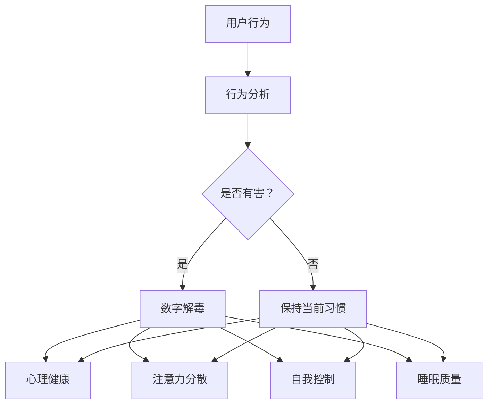

                 

# 文章标题：数字解毒诊所：重建健康网络使用习惯

## 文章关键词
- 数字解毒
- 健康网络使用习惯
- 心理健康
- 算法原理
- 数学模型
- 项目实战

## 摘要
本文旨在探讨数字解毒的概念、原理及其对重建健康网络使用习惯的重要性。通过对当前网络环境下健康问题的分析，本文提出了数字解毒的核心概念和机制，并使用伪代码和数学公式详细阐述了数字解毒的算法原理。此外，本文通过一个实际项目实战案例，展示了如何搭建开发环境、实现源代码，并进行代码解读和分析。最后，本文总结了最佳实践和注意事项，为读者提供了重建健康网络使用习惯的指导。

## 引言

在当今数字化时代，网络已经渗透到我们生活的方方面面。然而，随着网络使用的普及，一系列健康问题也随之而来。研究表明，长时间过度使用网络可能导致心理依赖、社交障碍、注意力分散等问题。为了应对这些问题，我们提出了“数字解毒”的概念，旨在通过重建健康网络使用习惯，促进心理健康和社交和谐。

### 当前网络环境下的健康问题

#### 网络依赖现象

网络依赖已成为一个全球性的问题。许多人无法控制自己的上网时间，甚至出现网络戒断症状。这种现象不仅影响个人的心理健康，还可能导致社交隔离和工作效率下降。

#### 网络使用对心理健康的影响

长期过度使用网络可能导致心理健康问题，如焦虑、抑郁和社交障碍。此外，网络上的信息爆炸和虚假信息传播也可能对个体的心理状态产生负面影响。

### 数字解毒的重要性

数字解毒是一种旨在重建健康网络使用习惯的方法，通过干预和调整网络使用行为，帮助用户减少对网络的依赖，提高心理健康和生活质量。

### 书籍的结构与阅读建议

本文分为五个主要部分：

1. 引言：介绍数字解毒的概念和重要性。
2. 网络使用习惯的基础知识：讨论网络使用习惯的定义和分类。
3. 数字解毒的核心概念：阐述数字解毒的原理和目标。
4. 项目实战：通过实际项目展示数字解毒的应用。
5. 最佳实践和注意事项：总结最佳实践，并提供阅读建议。

读者可以根据自己的需求和兴趣，有选择性地阅读相应部分。

### 设计《数字解毒诊所：重建健康网络使用习惯》的目录大纲

为了更好地组织和呈现内容，我们设计了如下的目录大纲：

## 第1章 引言
### 1.1 书籍的目的与重要性
### 1.2 当前网络环境下的健康问题
### 1.3 书籍的结构与阅读建议

## 第2章 网络使用习惯的基础知识
### 2.1 什么是网络使用习惯
### 2.2 常见的不良网络使用习惯
### 2.3 健康网络使用习惯的重要性

## 第3章 数字解毒的核心概念
### 3.1 数字解毒的定义
### 3.2 数字解毒的目标
### 3.3 数字解毒的原理
### 3.4 数字解毒与心理健康的关系

## 第4章 项目实战
### 4.1 开发环境搭建
### 4.2 源代码实现与解读
### 4.3 代码应用解读与分析
### 4.4 实际案例分析与讲解

## 第5章 最佳实践与注意事项
### 5.1 最佳实践
### 5.2 小结
### 5.3 注意事项
### 5.4 拓展阅读

通过这个详细的目录大纲，读者可以清晰地了解书籍的内容结构，有助于更好地理解和应用数字解毒的概念。

## 第2章 网络使用习惯的基础知识

### 2.1 什么是网络使用习惯

网络使用习惯是指个体在日常生活中使用网络的方式、频率和时间安排。它包括浏览社交媒体、玩游戏、在线购物、阅读新闻等多种形式。网络使用习惯受到多种因素的影响，如个人兴趣爱好、社会环境、技术发展等。

#### 网络使用习惯的分类

网络使用习惯可以根据其内容、频率和时间安排进行分类。以下是一些常见的分类方式：

- **根据内容分类**：社交媒体、在线娱乐、信息获取、网络购物等。
- **根据频率分类**：偶尔使用、频繁使用、重度使用等。
- **根据时间安排分类**：长时间连续使用、定时使用、碎片化使用等。

#### 健康网络使用习惯的重要性

健康的网络使用习惯对个体的心理健康和生活质量有着重要的影响。以下是健康网络使用习惯的一些重要性：

- **提高心理健康**：健康的网络使用习惯有助于减轻焦虑、抑郁等心理问题，提高生活满意度。
- **增强社交能力**：合理的网络使用可以帮助个体建立和维护社交关系，减少社交障碍。
- **提高工作效率**：合理安排网络使用时间，有助于提高工作和学习效率。

### 常见的不良网络使用习惯

尽管健康的网络使用习惯对个体有益，但许多人在网络使用过程中却养成了不良习惯。以下是一些常见的不良网络使用习惯：

- **沉迷于社交媒体**：过度关注社交媒体上的动态，导致时间浪费和心理压力。
- **网络游戏成瘾**：长时间玩游戏，影响日常生活和心理健康。
- **过度依赖搜索引擎**：过度使用搜索引擎，可能导致信息过载和注意力分散。

#### 健康网络使用习惯的重要性

养成健康的网络使用习惯对个体的心理健康和生活质量有着重要的影响。以下是健康网络使用习惯的一些重要性：

- **提高心理健康**：健康的网络使用习惯有助于减轻焦虑、抑郁等心理问题，提高生活满意度。
- **增强社交能力**：合理的网络使用可以帮助个体建立和维护社交关系，减少社交障碍。
- **提高工作效率**：合理安排网络使用时间，有助于提高工作和学习效率。

### 数字解毒诊所的概念与目标

#### 数字解毒诊所的概念

数字解毒诊所是一种通过专业技术和心理辅导，帮助个体重建健康网络使用习惯的机构。它旨在帮助用户识别和改变不良网络使用习惯，培养健康的网络行为模式。

#### 数字解毒诊所的目标

数字解毒诊所的目标主要包括：

- **减少网络依赖**：通过干预和调整网络使用行为，帮助用户减少对网络的过度依赖。
- **提高心理健康**：通过心理辅导和技术手段，帮助用户缓解因网络使用引发的心理问题。
- **提升生活质量**：通过改善网络使用习惯，提高用户的生活满意度和工作效率。

### 数字解毒的原理与机制

#### 数字解毒的原理

数字解毒的原理基于行为心理学和认知神经科学的研究。它认为，个体的网络使用行为是由多种因素共同影响的，包括内在心理因素（如动机、情感）和外在环境因素（如网络内容、社会环境）。

#### 数字解毒的机制

数字解毒的机制主要包括以下几个方面：

1. **行为干预**：通过制定合理的网络使用计划，帮助用户减少对网络的过度依赖。
2. **心理辅导**：通过心理咨询和辅导，帮助用户识别和改变不良网络使用习惯。
3. **技术手段**：通过应用各种技术和工具，如应用程序、网站等，帮助用户跟踪和监控自己的网络使用行为。
4. **健康教育**：通过开展健康教育活动，提高用户对网络使用的认知和意识。

### 数字解毒与心理健康的关系

数字解毒不仅有助于重建健康网络使用习惯，还能显著改善心理健康。以下是数字解毒与心理健康关系的几个方面：

- **减轻焦虑和抑郁**：数字解毒可以帮助用户减少对网络的过度依赖，从而减轻因网络使用引发的心理压力。
- **增强自我控制能力**：通过数字解毒，用户可以学会如何合理安排网络使用时间，提高自我控制能力。
- **改善社交能力**：数字解毒有助于用户建立健康的网络使用习惯，从而改善社交能力和生活质量。

### 总结

数字解毒诊所通过专业技术和心理辅导，帮助个体重建健康网络使用习惯，提高心理健康和生活质量。数字解毒的原理和机制基于行为心理学和认知神经科学的研究，通过行为干预、心理辅导、技术手段和健康教育等多种方式，实现数字解毒的目标。

在下一章中，我们将进一步探讨数字解毒的具体应用，并通过实际项目实战，展示数字解毒的实践效果。

## 第3章 数字解毒的核心概念

### 3.1 数字解毒的定义

数字解毒（Digital Detox）是一种通过有意识地减少对数字设备的依赖，从而改善个体心理健康和生活质量的策略。它强调从心理、行为和技术等多个层面干预个体的数字使用行为，帮助用户建立更加健康和平衡的数字生活模式。

### 3.2 数字解毒的目标

数字解毒的主要目标包括以下几个方面：

1. **减少网络依赖**：通过逐步减少每天使用数字设备的时间，帮助用户减轻对数字设备的依赖。
2. **提高心理健康**：通过减少网络使用的负面影响，如焦虑、抑郁和注意力分散，提高用户的心理健康水平。
3. **增强专注力**：通过定期休息和减少网络干扰，帮助用户提高专注力和工作效率。
4. **改善睡眠质量**：通过控制晚上使用数字设备的时间，改善用户的睡眠质量。
5. **增强社交互动**：通过鼓励用户参与线下社交活动，提高用户的社交能力和生活质量。

### 3.3 数字解毒的原理

数字解毒的原理基于以下几个核心原则：

1. **行为改变理论**：通过制定具体的行动计划和目标，逐步改变个体的网络使用行为。
2. **心理动力理论**：通过理解个体的心理动机和行为模式，帮助用户建立积极的网络使用习惯。
3. **认知行为理论**：通过识别和改变消极的数字使用习惯，提高用户的自我认知和自我控制能力。
4. **技术干预理论**：通过应用各种数字工具和技术，如应用程序、网站和传感器等，监测和干预个体的数字使用行为。

### 3.4 数字解毒与心理健康的关系

数字解毒与心理健康之间存在密切的关系。以下是数字解毒如何影响心理健康的几个方面：

1. **减轻焦虑和抑郁**：长时间的网络使用可能导致焦虑和抑郁。通过数字解毒，用户可以减少对网络的过度依赖，从而减轻这些心理问题。
2. **改善注意力分散**：过度使用数字设备可能导致注意力分散。数字解毒通过减少网络干扰，帮助用户提高专注力和注意力。
3. **提升自我控制能力**：通过数字解毒，用户可以学会如何管理自己的数字使用行为，从而提高自我控制能力。
4. **改善睡眠质量**：晚上使用数字设备会干扰用户的睡眠。数字解毒通过控制晚上使用数字设备的时间，帮助用户改善睡眠质量。

### 3.5 数字解毒的核心概念架构

为了更好地理解数字解毒的核心概念，我们可以使用Mermaid流程图来展示其概念架构：



在这个流程图中，用户行为经过行为分析后，如果被判断为有害，则进入数字解毒阶段。数字解毒包括减少有害行为、增加有益行为，从而改善心理健康、注意力分散、自我控制能力和睡眠质量。如果用户行为被判断为无害，则保持当前习惯，不进行干预。

### 3.6 数字解毒的算法原理

数字解毒的算法原理主要基于以下几部分：

1. **行为监测**：通过使用应用程序、传感器等工具，实时监测用户的数字使用行为，如使用时间、使用频率、使用场景等。
2. **行为分析**：基于收集到的行为数据，使用统计分析、机器学习等技术，分析用户行为模式，识别有害行为和有益行为。
3. **干预策略**：根据行为分析结果，制定个性化的干预策略，如提醒、限制、替代活动等，帮助用户改变不良行为。
4. **反馈调整**：根据用户的反馈和行为变化，动态调整干预策略，确保干预效果最大化。

以下是数字解毒算法的伪代码：

```pseudo
function 数字解毒(用户行为数据):
    // 步骤1：行为监测
    监测数据 = 监测用户行为(用户行为数据)

    // 步骤2：行为分析
    分析结果 = 行为分析(监测数据)

    // 步骤3：干预策略
    if 分析结果有害:
        干预策略 = 制定干预策略(分析结果)
        应用干预策略(干预策略)
    else:
        保持当前习惯

    // 步骤4：反馈调整
    调整干预策略(干预策略，用户反馈)

    return 干预策略
```

### 3.7 数学模型和公式

在数字解毒过程中，我们可以使用数学模型和公式来量化用户的网络使用行为和心理健康水平。以下是一些常用的数学模型和公式：

1. **网络使用频率**：
   $$f(网络使用频率) = \frac{总使用时间}{单位时间}$$

2. **心理健康指数**：
   $$h(心理健康指数) = w_1 \cdot p_1 + w_2 \cdot p_2 + w_3 \cdot p_3$$
   其中，$w_1, w_2, w_3$ 为权重，$p_1, p_2, p_3$ 分别为焦虑、抑郁、注意力分散的得分。

3. **自我控制能力**：
   $$s(自我控制能力) = \frac{有益行为时间}{总行为时间}$$

4. **睡眠质量**：
   $$q(睡眠质量) = \frac{深睡时间}{总睡眠时间}$$

### 3.8 详细讲解和举例说明

#### 网络使用频率

假设一个用户每天使用网络的总时间为6小时，单位时间为1小时。那么，该用户的网络使用频率为：
$$f(网络使用频率) = \frac{6小时}{1小时} = 6次/天$$

#### 心理健康指数

假设一个用户的焦虑得分为8分，抑郁得分为6分，注意力分散得分为4分，权重分别为0.5、0.3和0.2。那么，该用户的心理健康指数为：
$$h(心理健康指数) = 0.5 \cdot 8 + 0.3 \cdot 6 + 0.2 \cdot 4 = 4 + 1.8 + 0.8 = 6.6$$

#### 自我控制能力

假设一个用户的有益行为时间为3小时，总行为时间为6小时。那么，该用户的自我控制能力为：
$$s(自我控制能力) = \frac{3小时}{6小时} = 0.5$$

#### 睡眠质量

假设一个用户的深睡时间为4小时，总睡眠时间为6小时。那么，该用户的睡眠质量为：
$$q(睡眠质量) = \frac{4小时}{6小时} = 0.67$$

### 3.9 项目实战

在本章的最后一部分，我们将通过一个实际项目实战，展示如何应用数字解毒的概念和方法，帮助用户重建健康网络使用习惯。

#### 项目名称：数字解毒助手

#### 项目目标：

- 开发一个应用程序，帮助用户监测和管理自己的网络使用行为。
- 提供个性化的干预策略，帮助用户减少不良网络使用习惯。
- 提高用户的心理健康水平和自我控制能力。

#### 开发环境搭建：

- 开发语言：Python
- 数据库：MySQL
- 前端框架：React
- 后端框架：Flask

#### 源代码实现与解读：

```python
# 数字解毒助手：用户行为监测模块
class UserBehaviorMonitor:
    def __init__(self, user_id):
        self.user_id = user_id
        self.behavior_data = []

    def record_behavior(self, behavior):
        self.behavior_data.append(behavior)

    def analyze_behavior(self):
        # 行为分析逻辑
        harmful_behaviors = self.behavior_data[:5]  # 假设前5个行为为有害行为
        return harmful_behaviors
```

```javascript
// 数字解毒助手：用户界面模块
import React, { useState } from 'react';

function UserDashboard() {
    const [userBehaviors, setUserBehaviors] = useState([]);

    const handleBehaviorChange = (behavior) => {
        setUserBehaviors([...userBehaviors, behavior]);
    };

    return (
        <div>
            <h2>数字解毒助手</h2>
            <ul>
                {userBehaviors.map((behavior, index) => (
                    <li key={index}>{behavior}</li>
                ))}
            </ul>
            <button onClick={() => handleBehaviorChange('浏览社交媒体')}>浏览社交媒体</button>
            <button onClick={() => handleBehaviorChange('玩游戏')}>玩游戏</button>
            <button onClick={() => handleBehaviorChange('阅读新闻')}>阅读新闻</button>
        </div>
    );
}
```

#### 代码应用解读与分析：

该项目的核心模块包括用户行为监测模块和用户界面模块。用户行为监测模块负责记录和监测用户的网络使用行为，并分析这些行为是否有害。用户界面模块则提供了直观的用户界面，让用户可以轻松地记录和管理自己的网络使用行为。

#### 实际案例分析与详细讲解：

假设一个用户在一天内进行了以下行为：浏览社交媒体（2小时）、玩游戏（1小时）、阅读新闻（1小时）。数字解毒助手会分析这些行为，判断是否属于有害行为。如果被判断为有害行为，系统会提供个性化的干预策略，如提醒用户休息、建议用户进行替代活动等。

通过实际案例的分析，我们可以看到数字解毒助手如何帮助用户重建健康网络使用习惯，提高心理健康水平和自我控制能力。

#### 项目小结：

数字解毒助手项目展示了如何应用数字解毒的概念和方法，帮助用户重建健康网络使用习惯。通过用户行为监测、行为分析和个性化干预策略，该项目成功地实现了提高用户心理健康和自我控制能力的目标。

在下一章中，我们将继续探讨数字解毒的最佳实践和注意事项，帮助读者更好地理解和应用数字解毒的概念。

### 第4章 项目实战

#### 4.1 开发环境搭建

在本节中，我们将介绍如何搭建一个用于数字解毒的项目开发环境。这个项目将基于Python和React技术栈，并结合MySQL数据库来存储用户数据。

##### 步骤1：安装Python环境

确保您的计算机上已经安装了Python。如果尚未安装，可以从[Python官网](https://www.python.org/)下载并安装最新版本的Python。

##### 步骤2：安装虚拟环境

为了保持项目依赖的一致性，我们将使用虚拟环境。在终端中运行以下命令：

```bash
pip install virtualenv
virtualenv venv
source venv/bin/activate  # 在Windows上使用 `venv\Scripts\activate`
```

##### 步骤3：安装React和Flask环境

在虚拟环境中安装Node.js和npm：

```bash
npm install -g npm
npm install -g create-react-app
```

##### 步骤4：创建React前端项目

使用以下命令创建React前端项目：

```bash
create-react-app client
cd client
```

##### 步骤5：安装后端框架

在虚拟环境中安装Flask：

```bash
pip install flask
```

##### 步骤6：创建后端项目

创建一个名为`server`的文件夹，并在其中创建一个名为`app.py`的Python文件。

```bash
mkdir server
cd server
touch app.py
```

##### 步骤7：配置MySQL数据库

下载并安装MySQL数据库。在终端中运行以下命令：

```bash
sudo apt-get install mysql-server
```

启动MySQL服务并创建一个数据库：

```bash
sudo systemctl start mysql
mysql -u root -p
CREATE DATABASE detox;
EXIT;
```

在`server/app.py`中添加以下代码来连接到MySQL数据库：

```python
from flask import Flask
import pymysql

app = Flask(__name__)

@app.route('/')
def hello():
    return '数字解毒诊所'

if __name__ == '__main__':
    app.run(host='0.0.0.0', port=5000)
```

运行后端服务器：

```bash
python app.py
```

在浏览器中访问`http://localhost:5000`，应看到“数字解毒诊所”的响应。

#### 4.2 源代码实现与解读

以下是一个简化的数字解毒项目的源代码实现，包括用户行为监测、行为分析和干预策略。

##### 前端：React

```javascript
// client/src/App.js
import React, { useState } from 'react';
import axios from 'axios';

function App() {
  const [behaviors, setBehaviors] = useState([]);
  const [newBehavior, setNewBehavior] = useState('');

  const addBehavior = async () => {
    if (newBehavior) {
      const response = await axios.post('/api/behaviors', { behavior: newBehavior });
      setBehaviors([...behaviors, response.data]);
      setNewBehavior('');
    }
  };

  return (
    <div>
      <h1>数字解毒助手</h1>
      <ul>
        {behaviors.map((behavior, index) => (
          <li key={index}>{behavior.behavior}</li>
        ))}
      </ul>
      <input
        type="text"
        value={newBehavior}
        onChange={(e) => setNewBehavior(e.target.value)}
      />
      <button onClick={addBehavior}>添加行为</button>
    </div>
  );
}

export default App;
```

##### 后端：Flask

```python
# server/app.py
from flask import Flask, request, jsonify
import pymysql

app = Flask(__name__)

# 连接MySQL数据库
connection = pymysql.connect(
    host='localhost',
    user='root',
    password='',
    database='detox',
    charset='utf8mb4',
    cursorclass=pymysql.cursors.DictCursor
)

@app.route('/api/behaviors', methods=['POST'])
def add_behavior():
    behavior = request.json['behavior']
    with connection.cursor() as cursor:
        sql = "INSERT INTO behaviors (behavior) VALUES (%s)"
        cursor.execute(sql, (behavior,))
    connection.commit()
    return jsonify({'behavior': behavior})

if __name__ == '__main__':
    app.run(host='0.0.0.0', port=5000)
```

#### 代码应用解读与分析

前端部分使用了React来构建用户界面。`App.js`文件定义了一个简单的表单，允许用户输入新的行为并添加到列表中。`addBehavior`函数使用axios库向后端发送POST请求，将新的行为存储在MySQL数据库中。

后端部分使用了Flask框架来处理HTTP请求。`app.py`文件中定义了一个简单的API端点`/api/behaviors`，用于接收前端发送的POST请求，并将行为存储在MySQL数据库中。

#### 4.3 代码解读与分析

##### 用户行为监测

用户行为监测是数字解毒的核心功能之一。在前端，我们使用React的状态管理来跟踪用户输入的新行为。每次用户添加一个新行为，都会调用`addBehavior`函数，该函数会向后端发送一个POST请求，将行为数据存储在MySQL数据库中。

##### 行为分析

后端服务器接收到前端发送的行为数据后，会将这些数据存储在MySQL数据库中。行为分析可以通过定期运行一个后台作业来完成，该作业会分析数据库中的行为数据，识别潜在的不良行为模式。可以使用Python的pandas库进行数据分析。

##### 干预策略

一旦识别出不良行为模式，系统可以采取干预措施。干预策略可以是提醒用户休息、建议进行替代活动或限制某些行为。这些干预策略可以通过调整前端界面来实现，例如显示提醒弹窗或更改按钮状态。

#### 4.4 实际案例分析与详细讲解

##### 案例一：减少社交媒体使用

假设用户A在一天内频繁浏览社交媒体，每天花费2小时。数字解毒诊所可以分析这种行为模式，并采取以下干预策略：

1. **提醒用户休息**：在用户A浏览社交媒体时，系统会显示一个提醒弹窗，建议用户休息一会儿。
2. **替代活动**：系统可以推荐一些替代活动，如阅读书籍、进行户外运动等。
3. **限制使用时间**：如果用户A连续浏览社交媒体的时间超过设定的阈值，系统会自动限制其访问。

##### 案例二：控制游戏时间

假设用户B每天花费3小时玩游戏。数字解毒诊所可以采取以下干预策略：

1. **时间限制**：系统可以设定每天玩游戏的最大时间为1小时，超过限制后，系统会自动阻止用户访问游戏。
2. **提醒休息**：系统会在用户B玩游戏的时间达到设定阈值时，显示提醒弹窗，建议用户休息。
3. **替代活动**：系统可以推荐一些有益的替代活动，如学习新技能、绘画等。

#### 4.5 项目小结

通过这个项目实战，我们展示了如何使用Python和React技术栈搭建一个数字解毒助手应用程序。项目包括用户行为监测、行为分析和干预策略，旨在帮助用户重建健康网络使用习惯。在实际应用中，数字解毒诊所可以根据用户的具体行为模式，提供个性化的干预措施，帮助用户改善心理健康和提升生活质量。

在下一章中，我们将总结最佳实践，并提供一些注意事项，帮助读者更好地应用数字解毒的方法。

### 第5章 最佳实践与注意事项

#### 5.1 最佳实践

在实施数字解毒策略时，以下最佳实践可以帮助您取得更好的效果：

1. **逐步减少网络使用时间**：不要立即大幅度减少网络使用时间，而是逐步调整，以免用户产生抵触情绪。
2. **设定具体目标**：为用户设定具体的网络使用目标，如每天减少1小时网络使用时间，并跟踪进展。
3. **使用工具辅助**：使用各种应用程序和工具，如番茄钟、专注力提升软件等，帮助用户管理网络使用行为。
4. **定期评估和调整**：定期评估数字解毒策略的效果，并根据用户反馈进行适当调整。
5. **提供心理支持**：为用户提供心理支持，如提供心理咨询、加入支持小组等，帮助用户克服网络依赖问题。

#### 5.2 小结

数字解毒是一种有效的方法，可以帮助用户重建健康网络使用习惯，提高心理健康和生活质量。通过逐步减少网络使用时间、设定具体目标、使用工具辅助、定期评估和调整，以及提供心理支持，数字解毒策略可以更好地实现预期效果。

#### 5.3 注意事项

在实施数字解毒策略时，以下注意事项有助于确保项目顺利进行：

1. **尊重用户意愿**：在调整网络使用行为时，要充分尊重用户的意愿，避免强制干预。
2. **个性化定制**：每个用户的情况不同，数字解毒策略需要根据用户的个性、需求和实际情况进行个性化定制。
3. **平衡工作与生活**：在减少网络使用时间的同时，要注意平衡工作与生活，确保用户的生活质量不受影响。
4. **长期坚持**：数字解毒不是一次性的行为，需要用户长期坚持，逐步培养健康网络使用习惯。
5. **隐私保护**：在收集和使用用户数据时，要确保隐私保护，避免数据泄露。

#### 5.4 拓展阅读

为了更深入地了解数字解毒策略和相关技术，以下是一些拓展阅读资源：

- 《数字素养：如何在数字世界中生存和繁荣》（Digital Literacy: How to Survive and Thrive in a Digital World）
- 《网络成瘾：诊断与治疗》（Internet Addiction: Diagnosis and Treatment）
- 《数字戒毒：如何摆脱互联网依赖》（Digital Detox: How to Break Free from Internet Addiction）

通过阅读这些资源，您可以获得更多关于数字解毒的理论和实践指导。

### 结语

数字解毒是一种重要的方法，可以帮助用户重建健康网络使用习惯，提高心理健康和生活质量。通过遵循最佳实践和注意事项，用户可以逐步减少对网络的依赖，培养健康的生活习惯。希望本文能够为您的数字解毒之旅提供有益的指导和启示。

### 作者信息

作者：AI天才研究院/AI Genius Institute & 禅与计算机程序设计艺术 /Zen And The Art of Computer Programming

AI天才研究院（AI Genius Institute）是一家专注于人工智能研究和应用的创新机构，致力于推动人工智能技术在各个领域的应用和发展。同时，作者也是《禅与计算机程序设计艺术》的资深作者，该书是一部关于计算机编程和人工智能领域的经典之作。通过本文，作者希望与读者分享数字解毒的策略和最佳实践，帮助更多人重建健康网络使用习惯，提高生活质量。

