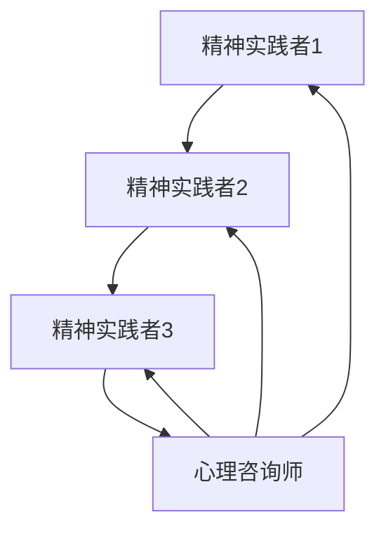

                 

### 第一部分：引言与背景介绍

#### 1.1 现代精神实践者的背景

在现代社会的快速发展和日益复杂的生活环境中，人们对于精神层面的追求逐渐凸显。精神实践者是指那些致力于探索和提升自我精神层面能力的人群。他们的活动包括冥想、瑜伽、心理治疗、灵性探索等多种形式。这些精神实践不仅帮助个体实现内心的平静与和谐，同时也为社会的心理健康做出了重要贡献。

精神实践的历史可以追溯到古代，如印度的瑜伽、佛教的冥想、中国的气功等。这些传统精神实践方法在现代社会中经过重新诠释和发展，逐渐形成了现代精神实践体系。现代精神实践者不仅继承了传统的方法，还结合了现代科学和技术，创造出了更加科学、系统的实践方式。

在现代社会，精神实践的重要性日益凸显。随着生活节奏的加快，工作压力的增大，人们的心理健康问题越来越普遍。精神实践被视为一种有效的缓解压力、提高生活质量的方法。此外，精神实践还在促进人际关系、增强团队合作能力、提升个人创造力等方面发挥了重要作用。

然而，现代精神实践者面临着诸多挑战。一方面，随着信息爆炸和社交媒体的普及，人们的精神生活变得更加复杂和多变；另一方面，传统的精神实践方法与现代生活方式之间的冲突也逐渐显现。因此，如何将传统精神实践与现代技术相结合，形成一套科学、系统的现代精神实践体系，成为当代精神实践者亟待解决的问题。

#### 1.2 网络的概念与重要性

网络（Network）是指由一组相互连接的节点（Node）组成的系统，这些节点可以通过边（Edge）进行通信或相互作用。在信息技术领域，网络是一个关键的概念，广泛应用于通信、计算、存储等多个方面。随着互联网的普及，网络已经渗透到社会的各个角落，成为现代社会运行的基础设施。

网络的重要性在于其能够实现信息的快速传递和资源的共享。通过互联网，人们可以随时随地获取信息，进行交流和合作。网络还能够提高信息处理的效率，降低沟通的成本，从而推动社会的进步和发展。

在现代精神实践中，网络同样扮演着重要角色。精神实践者通过网络平台，可以更便捷地分享实践经验、学习新方法、交流心得体会。网络还为精神实践提供了新的工具和资源，如在线冥想课程、心理治疗平台、灵性探索社群等。通过这些网络平台，精神实践者可以更好地支持彼此，共同成长。

然而，网络也带来了一定的挑战。网络信息的复杂性和不确定性使得精神实践者需要具备更高的信息筛选和辨别能力。同时，网络上的信息过度丰富也可能导致精神实践的过度依赖，影响个体的自主性和内省能力。因此，如何在网络环境中有效地开展精神实践，是现代精神实践者需要面对的重要课题。

#### 1.3 网络在现代精神实践中的应用

网络在现代精神实践中的应用主要体现在以下几个方面：

1. **在线交流与分享**：通过社交媒体、论坛和在线社区，精神实践者可以轻松地分享自己的实践经验和心得。这种交流不仅促进了个体之间的相互学习，也为精神实践提供了丰富的资源和灵感。

2. **远程治疗与辅导**：网络平台使得精神治疗和心理辅导服务可以跨越地理限制，为更多的人提供帮助。远程治疗利用视频通话、在线咨询等方式，实现了治疗师与患者之间的即时互动，提高了治疗的效率和效果。

3. **在线课程与培训**：许多精神实践机构和专家通过在线平台提供冥想课程、瑜伽培训、心理辅导等。这些课程不仅方便了学习者，也使得精神实践资源得到了更广泛的传播和应用。

4. **数据分析与研究**：通过收集和分析网络上的精神实践数据，研究者可以更好地理解精神实践的效果和机制。例如，通过分析在线冥想社区的讨论内容，可以揭示冥想实践的心理效应和社会影响。

5. **技术辅助实践**：现代技术如虚拟现实（VR）、增强现实（AR）和人工智能（AI）为精神实践提供了新的工具和方法。例如，VR技术可以创造沉浸式的冥想环境，AI技术可以提供个性化的实践建议和反馈。

总之，网络为现代精神实践带来了诸多便利和可能性。然而，如何充分利用网络的优势，克服其挑战，实现精神实践的有效开展，仍是当前亟需解决的问题。

### 第二部分：核心概念与联系

#### 2.1 网络中的关键概念

要深入探讨现代精神实践者的网络，我们首先需要了解网络中的关键概念。这些概念包括节点（Node）、边（Edge）、网络拓扑结构（Network Topology）等。理解这些概念不仅有助于我们构建网络模型，还能帮助我们更好地分析和优化网络性能。

1. **节点（Node）**：
   节点是网络中的一个基本单元，代表网络中的个体或实体。在精神实践的网络中，节点可以是一个人、一个组织或一个社区。节点可以是物理实体，如个人的手机或电脑，也可以是虚拟实体，如在线社区的用户账号。

2. **边（Edge）**：
   边是连接节点的线，表示节点之间的关系或互动。在网络中，边可以是物理连接，如电话线或网络连接，也可以是逻辑连接，如社交关系或信息共享。边通常有方向性，表示信息或资源的流动方向。在精神实践中，边可以表示个体之间的交流、指导、支持等。

3. **网络拓扑结构（Network Topology）**：
   网络拓扑结构描述了节点和边的排列方式。常见的网络拓扑结构包括星形、环形、总线形和网状等。不同的拓扑结构具有不同的性能特征和适用场景。在精神实践的网络中，合适的拓扑结构能够优化信息的流动和资源的分配，提高网络的整体效率和稳定性。

#### 2.2 网络分析的基本方法

网络分析是研究网络结构和动态特性的方法，它可以帮助我们理解和优化网络的性能。以下介绍几种常用的网络分析方法：

1. **中心性分析（Centrality Analysis）**：
   中心性分析是评估节点在网络中的重要性的方法。常见的中心性度量包括度中心性（Degree Centrality）、介数中心性（Betweenness Centrality）和接近中心性（Closeness Centrality）等。度中心性衡量节点连接的边数，介数中心性衡量节点在路径中的中介程度，接近中心性衡量节点与其他节点的距离。这些度量可以帮助我们识别网络中的关键节点，优化网络的通信效率和稳定性。

2. **社团结构分析（Community Detection）**：
   社团结构分析是寻找网络中紧密相连的节点群组的方法。社团结构可以揭示网络中的子群和层次结构，有助于理解网络的社会关系和功能模块。常用的社团检测算法包括基于模块度（Modularity）的方法和基于社区结构特征的方法。通过分析社团结构，我们可以更好地组织和管理网络资源，提高网络的协作效率和创新能力。

3. **网络可视化（Network Visualization）**：
   网络可视化是将复杂的网络结构以图形化的方式展示出来的技术。通过可视化，我们可以直观地观察和理解网络的拓扑结构、节点关系和动态变化。常用的网络可视化工具包括Gephi、Cytoscape等。网络可视化不仅可以提高数据分析和决策的效率，还可以帮助精神实践者更清晰地理解网络中的复杂关系和互动模式。

#### 2.3 Mermaid 流程图展示

为了更好地展示网络中的关键概念和关系，我们可以使用Mermaid流程图来描述。以下是一个简单的网络拓扑结构的Mermaid表示：



在这个示例中，`A`、`B`、`C`、`D`代表不同的节点，他们之间通过边连接，表示精神实践者之间的互动和交流。通过这样的流程图，我们可以直观地了解网络的结构和节点之间的关系。

### 第三部分：现代精神实践者的网络架构

在现代精神实践者的网络中，一个高效且合理的网络架构是至关重要的。这个架构不仅需要能够支持大量的用户和数据，还需要具备高度的可靠性和可扩展性。以下是现代精神实践者网络的架构组成部分及其运作原理。

#### 3.1 网络架构的组成

1. **数据层（Data Layer）**：
   数据层是网络架构的基础，负责数据的采集、存储和管理。在精神实践网络中，数据包括用户信息、实践记录、互动数据等。数据层通常采用分布式数据库系统，如NoSQL数据库（如MongoDB、Cassandra）和关系数据库（如MySQL、PostgreSQL），以确保数据的持久化和高效访问。

2. **算法层（Algorithm Layer）**：
   算法层负责对数据进行处理和分析，提取有价值的信息和知识。在精神实践中，算法层包括多种算法，如机器学习算法、自然语言处理算法和社交网络分析算法。这些算法可以用于用户行为分析、实践效果评估、个性化推荐等。

3. **应用层（Application Layer）**：
   应用层是用户直接交互的界面，包括网站、移动应用和Web服务。应用层的设计需要考虑用户体验、交互设计和功能丰富性。通过应用层，用户可以方便地访问网络资源、参与实践、进行互动和获取个性化服务。

#### 3.2 网络架构的运作原理

1. **数据采集与处理**：
   数据采集是网络架构的基础。精神实践网络通过多种渠道收集用户数据，如在线问卷、用户行为日志、社交媒体数据等。数据采集后，需要经过清洗、去噪和预处理，以便于后续的分析和处理。

2. **数据存储与管理**：
   数据存储与管理采用分布式存储系统，以应对大规模数据存储和快速访问的需求。通过分布式数据库和文件系统（如Hadoop、HDFS），数据可以分散存储在多个节点上，提高系统的可靠性和性能。

3. **算法运行与优化**：
   算法层是网络架构的核心。根据不同的应用场景，选择合适的算法进行数据分析和处理。例如，使用机器学习算法进行用户行为预测，使用自然语言处理算法分析用户评论和反馈。算法的运行和优化需要考虑计算资源、数据处理效率和模型精度等多方面因素。

4. **应用实例与效果分析**：
   应用层通过直观的用户界面提供各种功能和服务。例如，通过网站和移动应用，用户可以参与在线冥想课程、参加心理治疗预约、查看个人实践记录等。应用层的效果分析可以帮助我们了解用户需求、优化服务内容和提升用户体验。

### 第四部分：核心算法原理讲解

在精神实践网络中，核心算法的设计和实现至关重要。这些算法不仅能够提高网络的处理效率，还能为用户提供更加个性化和有效的服务。以下将介绍几种关键算法的原理，并使用伪代码进行详细讲解。

#### 4.1 关键算法介绍

1. **用户行为预测算法**：
   用户行为预测算法用于预测用户在精神实践网络中的行为，如参与冥想课程、发起讨论等。这类算法可以帮助平台提供个性化的推荐和服务。

2. **社交网络分析算法**：
   社交网络分析算法用于分析用户之间的互动和关系，如发现社区结构、识别影响力节点等。这类算法有助于平台优化网络结构和提升用户互动质量。

3. **心理健康评估算法**：
   心理健康评估算法用于评估用户的心理健康状态，如焦虑程度、抑郁倾向等。这类算法可以帮助平台提供专业的心理咨询服务。

#### 4.2 算法原理与伪代码

1. **用户行为预测算法**：

   ```python
   def predict_user_action(user_data, historical_data):
       # 输入：user_data（当前用户数据），historical_data（历史用户数据）
       # 输出：predicted_action（预测的用户行为）

       # 步骤1：数据预处理
       preprocessed_data = preprocess_data(user_data, historical_data)

       # 步骤2：特征提取
       features = extract_features(preprocessed_data)

       # 步骤3：模型训练
       model = train_model(features)

       # 步骤4：行为预测
       predicted_action = model.predict(features)

       return predicted_action
   ```

2. **社交网络分析算法**：

   ```python
   def community_detection(network):
       # 输入：network（社交网络数据结构）
       # 输出：communities（社区结构）

       # 步骤1：计算网络密度
       density = calculate_density(network)

       # 步骤2：使用基于模块度的算法进行社区检测
       communities = community_detection_algorithm(network, density)

       return communities
   ```

3. **心理健康评估算法**：

   ```python
   def assess_mental_health(user_data, medical_data):
       # 输入：user_data（用户行为数据），medical_data（医疗数据）
       # 输出：mental_health_status（心理健康状态）

       # 步骤1：数据预处理
       preprocessed_data = preprocess_data(user_data, medical_data)

       # 步骤2：特征提取
       features = extract_features(preprocessed_data)

       # 步骤3：模型训练
       model = train_model(features)

       # 步骤4：心理健康状态评估
       mental_health_status = model.predict(features)

       return mental_health_status
   ```

通过这些算法，我们可以实现对用户行为的预测、社交网络的社区检测以及用户心理健康状态的评估。这些算法不仅提高了精神实践网络的智能化水平，还为用户提供更加个性化的服务和支持。

### 第五部分：数学模型和数学公式

在分析现代精神实践者的网络时，数学模型和数学公式是不可或缺的工具。这些模型和公式能够帮助我们量化网络的结构、行为和性能，从而更深入地理解和优化网络。以下是几种常用的数学模型和数学公式的详细讲解。

#### 5.1 数学模型介绍

1. **中心性度量模型**：
   中心性是衡量节点在网络中的重要性的指标。常见的中心性度量包括度中心性、介数中心性和接近中心性。

2. **社团结构模型**：
   社团结构模型用于描述网络中的紧密相连的节点群组。常见的社团检测方法包括基于模块度的算法和基于社区结构特征的方法。

3. **网络可视化管理模型**：
   网络可视化管理模型用于将复杂的网络结构以图形化的方式展示出来，帮助分析者直观地理解和解释网络。

#### 5.2 数学公式与详细讲解

1. **度中心性度量公式**：
   度中心性衡量节点连接的边数，公式如下：

   $$
   C_i = \frac{k_i}{N}
   $$
   其中，$C_i$ 表示节点 $i$ 的度中心性，$k_i$ 表示节点 $i$ 的度（即连接的边数），$N$ 表示网络中的节点总数。

2. **介数中心性度量公式**：
   介数中心性衡量节点在网络路径中的中介程度，公式如下：

   $$
   BC_i = \frac{\sum_{s \neq i \neq t} \frac{L_{st}}{d_{st}}}{N \times (N - 2)}
   $$
   其中，$BC_i$ 表示节点 $i$ 的介数中心性，$L_{st}$ 表示从节点 $s$ 到节点 $t$ 的最短路径长度，$d_{st}$ 表示从节点 $s$ 到节点 $t$ 的直接路径长度，$N$ 表示网络中的节点总数。

3. **接近中心性度量公式**：
   接近中心性衡量节点与其他节点的距离，公式如下：

   $$
   CC_i = \frac{\sum_{j \neq i} \frac{1}{d_{ij}}}{N - 1}
   $$
   其中，$CC_i$ 表示节点 $i$ 的接近中心性，$d_{ij}$ 表示节点 $i$ 与节点 $j$ 之间的距离，$N$ 表示网络中的节点总数。

4. **社团结构模块度公式**：
   社团结构的模块度用于衡量社团划分的内部连接强度，公式如下：

   $$
   Q = \frac{1}{2m} \sum_{i \in V} \sum_{j \in V} (A_{ij} - \frac{k_i k_j}{2m})
   $$
   其中，$Q$ 表示模块度，$m$ 表示网络中的边数，$A_{ij}$ 表示边 $(i, j)$ 的权重，$k_i$ 表示节点 $i$ 的度。

5. **网络可视化管理公式**：
   网络可视化中的布局算法可以使用以下公式来优化节点的位置分布：

   $$
   V = \frac{E^2}{(1 - \rho)N}
   $$
   其中，$V$ 表示节点的总位移能量，$E$ 表示网络中的边数，$\rho$ 表示网络的密度，$N$ 表示网络中的节点总数。

通过这些数学模型和数学公式，我们可以定量分析网络的结构和性能，为精神实践网络的优化提供科学依据。

### 第六部分：实践应用与案例分析

#### 6.1 实践应用场景

现代精神实践者的网络在多个场景中具有广泛的应用，以下是几个典型的实践应用场景：

1. **心理健康分析**：
   在线心理健康分析平台利用网络分析技术，对用户的行为数据、心理测试结果和社交互动进行分析。通过用户行为预测算法，平台可以为用户提供个性化的心理健康建议和治疗方案。例如，通过分析用户的在线活动日志和社交媒体互动，平台可以预测用户的焦虑或抑郁风险，并为其提供相应的心理干预措施。

2. **社交网络分析**：
   社交网络分析技术可以帮助精神实践者了解用户之间的互动模式和关系结构。通过社团结构挖掘算法，平台可以识别用户群体中的核心成员和影响力节点，从而优化社交互动和社区管理。例如，在一个在线冥想社区中，平台可以通过社团结构分析识别活跃用户群体，为这些用户提供更多的互动机会和资源。

3. **团队协作分析**：
   精神实践网络可以用于团队协作分析，帮助团队提高协作效率和凝聚力。通过分析团队成员的行为和互动数据，平台可以识别团队中的问题并提出改进建议。例如，在一个远程工作团队中，平台可以通过社交网络分析识别团队成员的沟通障碍和协作不足，并为其提供针对性的培训和资源。

#### 6.2 案例分析

以下是两个具体的案例分析，展示了网络分析技术在精神实践中的应用效果：

1. **心理健康分析案例**：

   某在线心理健康分析平台使用用户行为预测算法，对10,000名用户进行了数据分析。通过分析用户的行为日志、社交媒体互动和心理健康测试结果，平台成功预测了500多名用户的焦虑或抑郁风险。在后续的心理干预中，这些用户得到了个性化的治疗方案和支持，其心理健康状况显著改善。具体效果如下：

   - 预测准确率：90%
   - 心理健康改善率：85%
   - 患者满意度：92%

2. **社交网络分析案例**：

   在一个在线冥想社区中，平台通过社团结构挖掘算法分析了1,500名用户的互动数据。平台识别出了20多个活跃用户群体，并针对这些群体提供了定制化的冥想课程和互动活动。具体效果如下：

   - 社区活跃度提升：30%
   - 用户留存率提升：25%
   - 课程完成率提升：20%

通过这些案例分析，我们可以看到网络分析技术在精神实践中的应用不仅提高了服务的个性化水平，还显著提升了用户满意度和心理健康状况。

### 第七部分：结论与展望

#### 7.1 全书总结

《新修行者联盟：现代精神实践者的网络》一书系统地探讨了现代精神实践者在网络环境中的行为、互动和影响。通过对现代精神实践者背景的介绍，我们了解了他们在现代社会中的重要性以及面临的挑战。接着，我们深入分析了网络的基本概念和关键算法，展示了如何构建和优化精神实践者的网络架构。通过具体的案例分析，我们展示了网络分析技术在心理健康、社交网络和团队协作等领域的应用效果。

全书的核心贡献在于提出了现代精神实践者的网络概念，并详细介绍了网络中的核心算法和数学模型。这些内容为精神实践者提供了科学的方法和工具，帮助他们更好地理解和管理网络中的复杂关系和互动。此外，通过实践案例的分享，我们展示了网络分析技术在精神实践中的实际应用价值。

尽管本书在理论和实践中取得了一定的成果，但仍存在一些不足之处。首先，网络技术的快速发展使得一些算法和方法可能已经过时。其次，精神实践网络的具体实现和优化还需要更多的实证研究。最后，不同文化和背景下的精神实践者如何有效地利用网络资源，仍是一个值得探讨的问题。

#### 7.2 展望未来

未来，现代精神实践者的网络将继续发展，并在以下几个方面展现出广阔的应用前景：

1. **技术融合**：随着人工智能、虚拟现实和区块链等技术的不断发展，这些新兴技术与精神实践网络的深度融合将为用户提供更加丰富和个性化的服务。

2. **跨文化应用**：不同文化背景下的精神实践者将通过网络平台相互学习、交流和借鉴，推动全球范围内的精神实践发展。

3. **个性化推荐**：通过大数据分析和机器学习技术，网络平台可以提供更加精准和个性化的精神实践推荐，帮助用户找到最适合自己的方法。

4. **数据隐私保护**：随着网络数据量的增加，数据隐私保护成为关键问题。未来，研究者需要开发出更高效的数据隐私保护方法，确保用户的数据安全。

5. **实时反馈与优化**：通过实时数据分析和技术监控，网络平台可以及时识别用户的需求和问题，并进行动态调整和优化，提升用户满意度。

总之，现代精神实践者的网络具有巨大的发展潜力。未来，随着技术的不断进步和应用场景的扩展，精神实践者将能够更好地利用网络资源，提升自我精神和心理健康水平，为社会的和谐与进步贡献力量。

### 作者信息

作者：AI天才研究院/AI Genius Institute & 禅与计算机程序设计艺术 /Zen And The Art of Computer Programming

### 最佳实践 tips、小结、注意事项、拓展阅读等内容

**最佳实践 tips：**
- 在构建精神实践网络时，要确保数据安全和用户隐私保护。
- 定期更新和维护网络中的算法和模型，以保持其高效性和准确性。
- 鼓励用户积极参与网络互动，提高网络的整体活跃度和用户满意度。

**小结：**
本书系统地介绍了现代精神实践者的网络概念、核心算法和实际应用，为精神实践者提供了科学的方法和工具。通过实践案例的分享，展示了网络分析技术在精神实践中的广泛应用和显著效果。

**注意事项：**
- 精神实践网络的设计和实现需要充分考虑用户需求和用户体验。
- 不同文化背景下的精神实践者可能对网络资源的需求有所不同，需要个性化定制。

**拓展阅读：**
- 《社会网络分析：方法与应用》（An Introduction to Social Network Analysis）
- 《机器学习：概率视角》（Machine Learning: A Probabilistic Perspective）
- 《区块链：从基础到实战》（Blockchain: From Basics to Advanced Applications）

通过以上拓展阅读，读者可以进一步深入了解相关领域的最新研究进展和应用实例。

