                 


## 文章标题

《现代医学与心理健康：身心统一的健康观》

## 文章关键词

现代医学、心理健康、身心统一、健康观、生理健康、心理压力、疾病预防、心理治疗

## 文章摘要

本文将深入探讨现代医学与心理健康之间的关系，以及身心统一的健康观。通过对医学与心理健康的理论基础、心理健康与生理健康的关系、心理健康与生活方式、心理健康与疾病预防、心理健康与疾病治疗等内容的详细分析，我们旨在为读者提供一个全面、科学的健康观，帮助大家更好地理解身心健康的重要性，并在实践中更好地维护和提升身心健康。

## 第1章：引言与概述

### 1.1 现代医学的进展与心理健康

#### 背景介绍

现代医学的迅猛发展为我们提供了丰富的工具和方法，以诊断、治疗和预防各种疾病。然而，随着对人类健康认识的不断深入，医学界逐渐认识到心理健康在整体健康中的关键作用。心理健康不仅仅关乎情绪和心态，它还直接影响我们的生理健康、生活质量和寿命。

#### 核心概念与联系

为了更好地理解现代医学与心理健康之间的关系，我们可以使用Mermaid流程图来展示它们之间的联系。

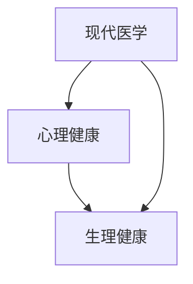

在这个流程图中，我们可以看到现代医学与心理健康和生理健康之间的紧密联系。医学技术不仅帮助我们更好地理解心理健康问题，还为心理健康提供了多种干预和治疗手段。

#### 核心算法原理讲解

在探讨心理健康与生理健康的关系时，我们可以使用伪代码来描述这一过程：

```plaintext
// 心理健康与生理健康关系伪代码
function assessPsychologicalAndPhysicalHealth() {
  // 获取心理状态数据
  psychologicalData = collectPsychologicalData();
  // 获取生理状态数据
  physicalData = collectPhysicalData();
  // 分析数据并得出健康状态
  healthStatus = analyzeData(psyiologicalData, psychologicalData);
  // 输出健康状态
  print(healthStatus);
}
```

这个伪代码展示了如何通过收集和分析心理和生理数据来评估个体的整体健康状态。

#### 数学模型和数学公式

心理健康与生理健康之间的关系可以通过以下数学模型来描述：

$$
\text{心理压力} = f(\text{生活事件}, \text{个性特征})
$$

举例来说，一个具有乐观性格特征的人在面对相同的生活事件时，心理压力可能会较小。

#### 项目实战

在实际操作中，心理健康评估通常包括以下步骤：

1. 使用问卷收集心理状态数据。
2. 进行生理指标的测量，如心率、血压等。
3. 结合数据分析结果，制定个性化心理健康干预计划。

### 1.2 心理健康的重要性

心理健康不仅关乎个体的幸福感和生活质量，还对生理健康有着重要影响。长期的心理压力可能导致多种生理疾病，如高血压、心脏病、肠胃问题等。因此，维护良好的心理健康对整体健康至关重要。

#### 核心概念与联系

为了更直观地展示心理健康与生理健康之间的关系，我们可以使用Mermaid流程图：

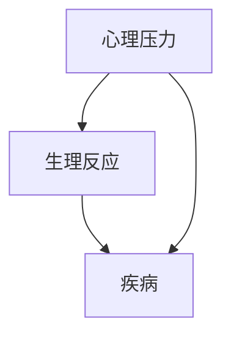

这个流程图揭示了心理压力如何通过生理反应影响个体的健康状况。

#### 核心算法原理讲解

在理解心理健康的重要性时，我们可以借助以下伪代码：

```plaintext
// 心理健康对生理健康的影响伪代码
function impactOfPsychHealthOnPhysHealth() {
  // 获取心理状态数据
  psychologicalData = collectPsychologicalData();
  // 获取生理状态数据
  physicalData = collectPhysicalData();
  // 分析心理数据并预测生理反应
  predictedReaction = predictReactionFromPsychData(psyiologicalData);
  // 输出预测结果
  print(predictedReaction);
}
```

#### 数学模型和数学公式

心理健康与生理健康之间的关系可以通过以下数学模型来描述：

$$
\text{生理反应} = g(\text{心理状态}, \text{生理状态})
$$

举例来说，一个焦虑的人可能会出现持续的高血压水平。

#### 项目实战

在实际项目中，心理健康与生理健康的关系可以通过以下步骤来评估：

1. 收集患者的心理健康和生理健康数据。
2. 使用数据分析工具来分析数据。
3. 根据分析结果制定个性化的健康干预计划。

### 1.3 小结

本章通过介绍现代医学的进展与心理健康、心理健康的重要性以及心理健康与生理健康的关系，为后续章节的深入探讨奠定了基础。在接下来的章节中，我们将进一步探讨心理健康与生活方式、疾病预防以及疾病治疗等方面的内容。

---

接下来，我们将进入第2章，探讨医学与心理健康的理论基础，以及如何从科学的角度理解心理健康与生理健康之间的复杂关系。

## 第2章：医学与心理健康的理论基础

### 2.1 生理心理学

#### 背景介绍

生理心理学是研究心理过程和行为的生物学基础的科学。它探讨了大脑、神经系统以及内分泌系统如何影响情绪、行为和认知功能。生理心理学的研究有助于我们理解心理健康问题的生理根源，以及如何通过生物学途径来干预和治疗这些疾病。

#### 核心概念与联系

生理心理学的核心概念包括大脑结构、神经传递物质、荷尔蒙对情绪和行为的影响等。为了更直观地展示这些概念之间的联系，我们可以使用Mermaid流程图：

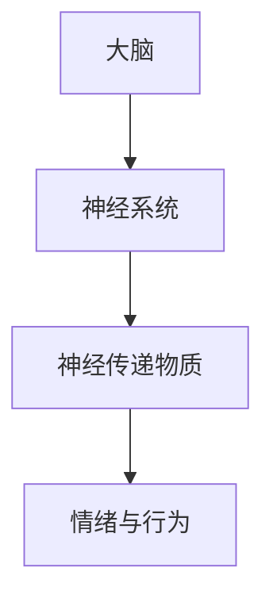

在这个流程图中，我们可以看到大脑、神经系统和神经传递物质是如何相互作用，进而影响情绪和行为的。

#### 核心算法原理讲解

在生理心理学中，我们可以使用以下伪代码来描述情绪调节的过程：

```plaintext
// 情绪调节伪代码
function regulateEmotion() {
  // 获取当前情绪状态
  currentEmotion = getEmotionState();
  // 分析情绪状态
  emotionAnalysis = analyzeEmotion(currentEmotion);
  // 根据情绪分析结果，调整神经传递物质的水平
  adjustNeurotransmitterLevels(emotionAnalysis);
  // 输出调整后的情绪状态
  print(newEmotionState);
}
```

#### 数学模型和数学公式

生理心理学中的数学模型可以用来描述神经传递物质的释放和作用：

$$
\text{神经传递物质释放量} = f(\text{神经活动频率}, \text{受体密度})
$$

举例来说，高频率的神经活动可能会导致更多的神经传递物质释放，从而影响情绪状态。

#### 项目实战

在实际项目中，生理心理学的研究可以帮助开发个性化的情绪调节应用程序。这些应用程序可以根据用户的心理和生理数据来提供定制化的情绪调节建议。

### 2.2 心理学基础

#### 背景介绍

心理学是研究人类行为和心理过程的科学。心理学基础涵盖了从感知、学习、记忆到情绪、动机和人格等方面的广泛主题。心理学的基础理论为我们理解心理健康问题提供了重要的框架。

#### 核心概念与联系

心理学基础的核心概念包括行为主义、认知心理学、人本主义心理学等。为了展示这些概念之间的联系，我们可以使用Mermaid流程图：

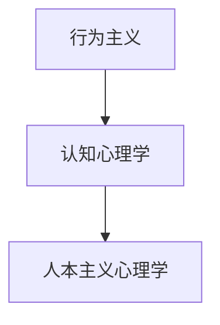

在这个流程图中，我们可以看到不同心理学流派之间的相互影响和整合。

#### 核心算法原理讲解

在心理学中，我们可以使用以下伪代码来描述学习过程：

```plaintext
// 学习过程伪代码
function learningProcess() {
  // 获取初始状态
  initialState = getCurrentState();
  // 进行学习操作
  performLearningOperation(initialState);
  // 更新知识库
  updateKnowledgeBase(initialState, newLearningData);
  // 输出学习结果
  print(newKnowledgeBase);
}
```

#### 数学模型和数学公式

心理学中的数学模型可以用来描述行为变化：

$$
\text{行为变化} = g(\text{初始行为}, \text{学习效果})
$$

举例来说，通过重复某种行为，个体可能会形成新的行为习惯。

#### 项目实战

在实际项目中，心理学基础可以帮助设计有效的学习应用程序，这些应用程序可以根据用户的反馈和行为来调整学习内容和策略。

### 2.3 生物心理学

#### 背景介绍

生物心理学是研究心理过程和行为的生物基础的科学。它探讨了遗传、神经发育、神经可塑性等因素如何影响心理和行为。生物心理学的研究为理解心理健康问题的生物学根源提供了重要线索。

#### 核心概念与联系

生物心理学的核心概念包括遗传因素、神经发育、神经递质系统等。为了更直观地展示这些概念之间的联系，我们可以使用Mermaid流程图：

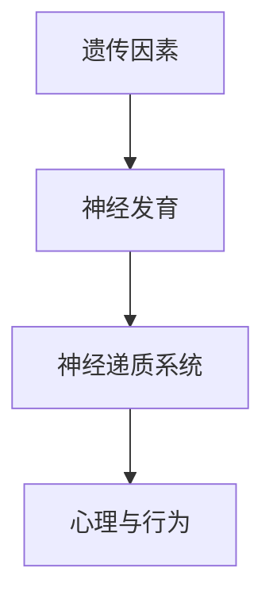

在这个流程图中，我们可以看到遗传、神经发育和神经递质系统是如何相互作用，进而影响心理和行为的。

#### 核心算法原理讲解

在生物心理学中，我们可以使用以下伪代码来描述基因对行为的影响：

```plaintext
// 基因对行为影响伪代码
function geneBehaviorImpact() {
  // 获取基因数据
  geneData = collectGeneData();
  // 分析基因数据
  geneAnalysis = analyzeGeneData(geneData);
  // 根据基因分析结果，预测行为倾向
  predictedBehavior = predictBehaviorFromGeneAnalysis(geneAnalysis);
  // 输出预测结果
  print(predictedBehavior);
}
```

#### 数学模型和数学公式

生物心理学中的数学模型可以用来描述基因表达：

$$
\text{基因表达水平} = f(\text{基因序列}, \text{环境因素})
$$

举例来说，不同的环境因素可能会影响基因的表达水平，从而影响个体的行为和心理状态。

#### 项目实战

在实际项目中，生物心理学的研究可以帮助设计个性化的心理健康干预计划，这些计划可以根据个体的基因和生理特征来定制。

### 2.4 小结

本章通过介绍生理心理学、心理学基础和生物心理学的核心概念和联系，为理解心理健康与生理健康之间的关系提供了理论基础。在接下来的章节中，我们将进一步探讨心理健康与生活方式、疾病预防以及疾病治疗等方面的内容。

---

在下一章中，我们将深入探讨心理健康与生理健康之间的关系，包括心理压力与生理反应的机制，以及如何通过医学干预改善心理健康。

## 第3章：心理健康与生理健康的关系

### 3.1 心理压力与生理反应

#### 背景介绍

心理压力是心理健康的一个重要指标，它对个体的生理健康产生深远影响。长期的心理压力可能导致一系列的生理反应，如心率增加、血压升高、免疫力下降等。理解这些生理反应的机制有助于我们更好地预防和治疗心理压力相关疾病。

#### 核心概念与联系

为了更直观地展示心理压力与生理反应之间的联系，我们可以使用Mermaid流程图：

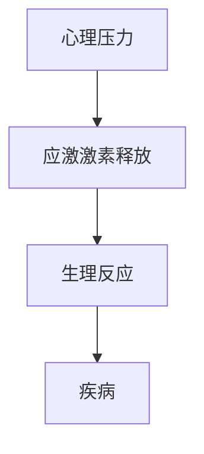

在这个流程图中，我们可以看到心理压力如何通过应激激素的释放，进而引发生理反应，最终可能导致疾病的发生。

#### 核心算法原理讲解

在探讨心理压力与生理反应的关系时，我们可以使用以下伪代码：

```plaintext
// 心理压力与生理反应伪代码
function stressResponse() {
  // 检测心理压力水平
  stressLevel = detectStressLevel();
  // 判断是否超过阈值
  if (stressLevel > threshold) {
    // 释放应激激素
    releaseStressHormones();
    // 观察生理反应
    observePhysiologicalResponse();
  } else {
    // 无需处理
    print("No stress response required.");
  }
}
```

#### 数学模型和数学公式

心理压力与生理反应之间的关系可以通过以下数学模型来描述：

$$
\text{生理反应强度} = f(\text{心理压力水平}, \text{个体差异})
$$

举例来说，一个对压力敏感的人可能会在较低的压力水平下出现强烈的生理反应。

#### 项目实战

在实际项目中，可以通过以下步骤来监测和管理心理压力与生理反应：

1. 使用心理压力监测设备，如心率变异性监测器，来实时监测个体的心理压力水平。
2. 根据监测数据，提供个性化的压力管理建议。
3. 通过行为干预，如正念冥想、运动和心理咨询，来降低心理压力水平。

### 3.2 身体疾病与心理健康

#### 背景介绍

身体疾病不仅影响个体的生理功能，还可能对其心理健康产生负面影响。例如，慢性疾病如心脏病、癌症和糖尿病等，可能导致患者出现焦虑、抑郁等心理问题。同时，心理问题也可能加重某些疾病的症状和病程。

#### 核心概念与联系

为了更直观地展示身体疾病与心理健康之间的联系，我们可以使用Mermaid流程图：

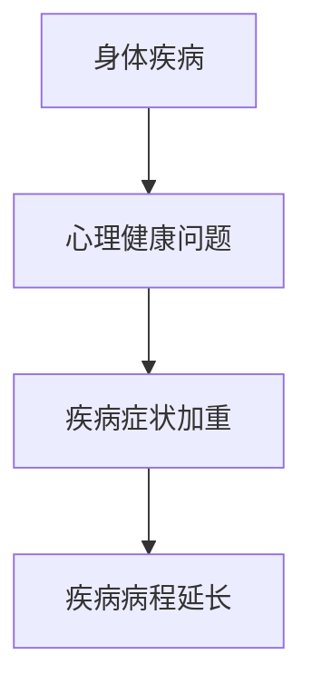

在这个流程图中，我们可以看到身体疾病如何通过心理健康问题，进一步影响疾病的症状和病程。

#### 核心算法原理讲解

在探讨身体疾病与心理健康的关系时，我们可以使用以下伪代码：

```plaintext
// 身体疾病与心理健康关系伪代码
function diseasePsychologicalImpact() {
  // 检测身体疾病状态
  diseaseState = detectDiseaseState();
  // 分析心理健康数据
  psychologicalData = analyzePsychologicalData();
  // 判断心理健康问题是否存在
  if (existPsychologicalProblem(psychologicalData)) {
    // 评估心理健康问题对疾病的影响
    diseaseImpact = evaluateDiseaseImpact(diseaseState, psychologicalData);
    // 输出评估结果
    print(diseaseImpact);
  } else {
    // 无需处理
    print("No psychological impact on disease.");
  }
}
```

#### 数学模型和数学公式

身体疾病与心理健康之间的关系可以通过以下数学模型来描述：

$$
\text{疾病症状加重程度} = f(\text{心理健康问题}, \text{疾病严重程度})
$$

举例来说，心理健康问题可能会加重慢性疾病患者的症状。

#### 项目实战

在实际项目中，可以通过以下步骤来综合评估和管理身体疾病与心理健康：

1. 使用综合评估工具，如健康问卷和生理指标检测，来评估患者的整体健康状况。
2. 根据评估结果，制定个性化的治疗和干预计划。
3. 通过多学科团队合作，如医生、心理咨询师和物理治疗师，来提供全方位的治疗和支持。

### 3.3 小结

本章通过探讨心理压力与生理反应的关系，以及身体疾病与心理健康之间的相互作用，强调了心理健康与生理健康的紧密联系。理解这些关系有助于我们更好地预防和治疗心理压力相关疾病，以及改善慢性疾病患者的整体健康。

在下一章中，我们将探讨身心统一的健康观，以及这一理念在现代医学中的应用。

---

在下一章中，我们将探讨身心统一的健康观，这一理念如何为现代医学提供新的视角和方法，以实现更全面的健康维护。

## 第4章：身心统一的健康观

### 4.1 理论起源与发展

#### 背景介绍

身心统一的健康观源于古代医学理论和现代医学的不断发展。早在古希腊时期，希波克拉底就提出了“健康是身体、心灵和精神的和谐统一”的观点。现代医学在20世纪中期逐渐认识到心理因素对生理健康的影响，进而推动了身心统一健康观的发展。

#### 核心概念与联系

身心统一的健康观认为，心理健康与生理健康是相互影响、相互依存的。为了更直观地展示这一观点，我们可以使用Mermaid流程图：

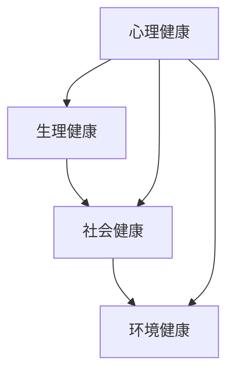

在这个流程图中，我们可以看到心理健康如何通过社会健康和环境健康，进一步影响生理健康。

#### 核心算法原理讲解

在身心统一的健康观中，我们可以使用以下伪代码来描述健康状态：

```plaintext
// 身心统一健康观伪代码
function holisticHealthStatus() {
  // 获取心理状态数据
  psychologicalData = collectPsychologicalData();
  // 获取生理状态数据
  physicalData = collectPhysicalData();
  // 获取社会状态数据
  socialData = collectSocialData();
  // 获取环境状态数据
  environmentalData = collectEnvironmentalData();
  // 分析健康状态
  healthStatus = analyzeHealthStatus(psychologicalData, physicalData, socialData, environmentalData);
  // 输出健康状态
  print(healthStatus);
}
```

#### 数学模型和数学公式

身心统一的健康观可以通过以下数学模型来描述：

$$
\text{健康状态} = f(\text{心理状态}, \text{生理状态}, \text{社会状态}, \text{环境状态})
$$

举例来说，一个心理状态良好、社会关系和谐、生活环境健康的人，整体健康状态可能会更优。

#### 项目实战

在实际项目中，身心统一的健康观可以帮助设计综合健康评估工具，这些工具可以综合评估个体的心理健康、生理健康、社会健康和环境健康。

### 4.2 理论与实践

#### 核心概念与联系

身心统一的健康观强调通过多方面的干预来维护和提升健康。这种干预不仅包括医学治疗，还涵盖了心理辅导、生活方式改善、社会支持系统等。为了更直观地展示这种干预，我们可以使用Mermaid流程图：

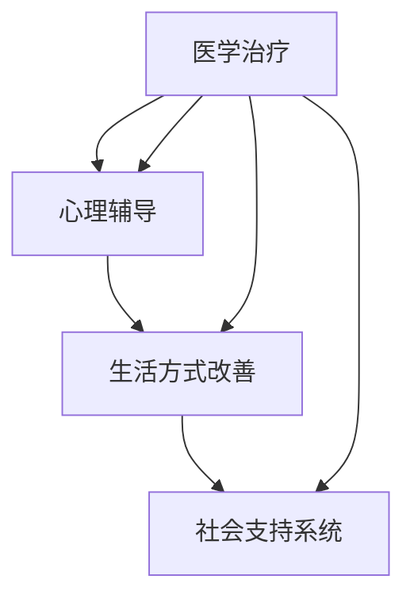

在这个流程图中，我们可以看到不同干预措施是如何相互协作，共同维护个体的整体健康。

#### 核心算法原理讲解

在身心统一的健康观中，我们可以使用以下伪代码来描述健康干预过程：

```plaintext
// 健康干预过程伪代码
function healthIntervention() {
  // 评估健康状态
  healthStatus = assessHealthStatus();
  // 根据健康状态，制定干预计划
  interventionPlan = createInterventionPlan(healthStatus);
  // 实施干预措施
  performInterventions(interventionPlan);
  // 评估干预效果
  interventionEffect = assessInterventionEffect(healthStatus, interventionPlan);
  // 输出干预结果
  print(interventionEffect);
}
```

#### 数学模型和数学公式

健康干预效果的评估可以通过以下数学模型来描述：

$$
\text{干预效果} = g(\text{干预计划}, \text{初始健康状态})
$$

举例来说，一个有效的干预计划可能会显著改善个体的健康状态。

#### 项目实战

在实际项目中，身心统一的健康观可以帮助设计综合健康干预方案，这些方案可以根据个体的具体情况，提供个性化的健康指导。

### 4.3 小结

本章通过介绍身心统一的健康观，强调了心理健康与生理健康的紧密联系，以及通过多方面干预来维护和提升健康的重要性。在下一章中，我们将进一步探讨心理健康与生活方式的关系，以及如何通过改善生活方式来促进心理健康。

---

在下一章中，我们将探讨心理健康与生活方式之间的关系，分析饮食、运动、睡眠等因素如何影响心理健康，并提供实用的建议来改善生活方式。

## 第5章：心理健康与生活方式

### 5.1 饮食与心理健康

#### 背景介绍

饮食是我们日常生活中不可或缺的一部分，它不仅影响我们的体重和身体健康，还直接关系到心理健康。越来越多的研究表明，饮食中的营养素和成分对大脑功能、情绪和行为有着显著影响。

#### 核心概念与联系

为了更直观地展示饮食与心理健康之间的联系，我们可以使用Mermaid流程图：

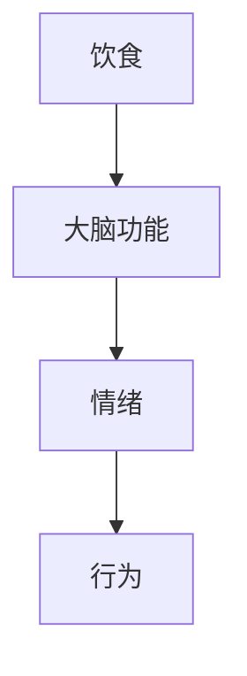

在这个流程图中，我们可以看到饮食如何通过影响大脑功能、情绪和行为，进而影响心理健康。

#### 核心算法原理讲解

在探讨饮食与心理健康的关系时，我们可以使用以下伪代码：

```plaintext
// 饮食与心理健康关系伪代码
function dietPsychHealthImpact() {
  // 检测饮食成分
  dietComponents = detectDietComponents();
  // 分析饮食成分对大脑的影响
  brainImpact = analyzeDietOnBrain(dietComponents);
  // 分析饮食成分对情绪的影响
  emotionImpact = analyzeDietOnEmotion(dietComponents);
  // 分析饮食成分对行为的影响
  behaviorImpact = analyzeDietOnBehavior(dietComponents);
  // 输出心理健康状态
  print(PsychHealthStatus);
}
```

#### 数学模型和数学公式

饮食与心理健康之间的关系可以通过以下数学模型来描述：

$$
\text{心理健康状态} = f(\text{饮食成分}, \text{大脑功能}, \text{情绪}, \text{行为})
$$

举例来说，富含Omega-3脂肪酸的食物可能有助于改善情绪和行为。

#### 项目实战

在实际项目中，可以通过以下步骤来改善饮食与心理健康：

1. 进行饮食评估，确定当前饮食中的营养素含量。
2. 根据评估结果，制定个性化的饮食计划。
3. 提供营养教育，帮助个体理解和改善饮食习惯。

### 5.2 运动与心理健康

#### 背景介绍

运动是促进身心健康的重要手段。规律的体育运动不仅可以增强体力，提高免疫力，还能有效改善心理健康，减轻焦虑和抑郁症状。

#### 核心概念与联系

为了更直观地展示运动与心理健康之间的联系，我们可以使用Mermaid流程图：

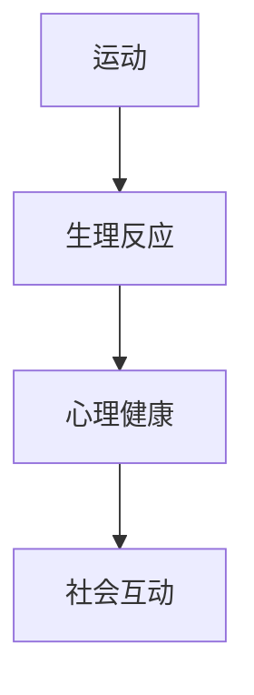

在这个流程图中，我们可以看到运动如何通过改善生理反应、提升心理健康以及促进社会互动，全方位地影响个体健康。

#### 核心算法原理讲解

在探讨运动与心理健康的关系时，我们可以使用以下伪代码：

```plaintext
// 运动与心理健康关系伪代码
function exercisePsychHealthImpact() {
  // 检测运动频率
  exerciseFrequency = detectExerciseFrequency();
  // 分析运动频率对生理反应的影响
  physicalResponse = analyzeExerciseOnPhysical(exerciseFrequency);
  // 分析运动频率对心理健康的影响
  mentalHealthImpact = analyzeExerciseOnMental(exerciseFrequency);
  // 分析运动频率对社会互动的影响
  socialInteraction = analyzeExerciseOnSocial(exerciseFrequency);
  // 输出心理健康状态
  print(PsychHealthStatus);
}
```

#### 数学模型和数学公式

运动与心理健康之间的关系可以通过以下数学模型来描述：

$$
\text{心理健康状态} = f(\text{运动频率}, \text{生理反应}, \text{社会互动})
$$

举例来说，高频率的有氧运动可能有助于改善心理健康。

#### 项目实战

在实际项目中，可以通过以下步骤来促进运动与心理健康：

1. 制定个性化的运动计划，根据个体的身体状况和心理健康需求来设计运动方案。
2. 提供运动指导，确保个体能够安全、有效地进行运动。
3. 通过运动社群和社交平台，促进个体的社会互动，提高运动积极性。

### 5.3 睡眠与心理健康

#### 背景介绍

睡眠是人体恢复和调节的重要过程，对心理健康有着至关重要的影响。睡眠不足或睡眠质量差可能导致情绪波动、注意力不集中、记忆力下降等问题。

#### 核心概念与联系

为了更直观地展示睡眠与心理健康之间的联系，我们可以使用Mermaid流程图：

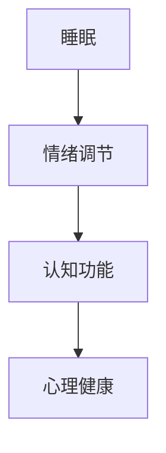

在这个流程图中，我们可以看到睡眠如何通过调节情绪和认知功能，进而影响心理健康。

#### 核心算法原理讲解

在探讨睡眠与心理健康的关系时，我们可以使用以下伪代码：

```plaintext
// 睡眠与心理健康关系伪代码
function sleepPsychHealthImpact() {
  // 检测睡眠质量
  sleepQuality = detectSleepQuality();
  // 分析睡眠质量对情绪调节的影响
  emotionRegulation = analyzeSleepOnEmotion(sleepQuality);
  // 分析睡眠质量对认知功能的影响
  cognitiveFunction = analyzeSleepOnCognition(sleepQuality);
  // 分析睡眠质量对心理健康的影响
  mentalHealthImpact = analyzeSleepOnMental(sleepQuality);
  // 输出心理健康状态
  print(PsychHealthStatus);
}
```

#### 数学模型和数学公式

睡眠与心理健康之间的关系可以通过以下数学模型来描述：

$$
\text{心理健康状态} = f(\text{睡眠质量}, \text{情绪调节}, \text{认知功能})
$$

举例来说，高质量的睡眠可能有助于改善心理健康。

#### 项目实战

在实际项目中，可以通过以下步骤来改善睡眠与心理健康：

1. 进行睡眠评估，确定当前睡眠质量和存在的问题。
2. 根据评估结果，制定个性化的睡眠计划。
3. 提供睡眠指导，包括睡眠环境调整、睡前习惯培养等，以提高睡眠质量。

### 5.4 小结

本章通过探讨饮食、运动和睡眠对心理健康的影响，强调了改善生活方式对于维护心理健康的重要性。在下一章中，我们将进一步探讨心理健康与疾病预防的关系，以及如何通过预防措施来维护心理健康。

---

在下一章中，我们将深入探讨心理健康与疾病预防的关系，分析心理因素如何影响疾病发生，并提供有效的预防策略和实践指南。

## 第6章：心理健康与疾病预防

### 6.1 心理因素与疾病发生

#### 背景介绍

心理健康与疾病发生之间的关系日益受到医学界的关注。研究表明，长期的心理压力、焦虑和抑郁等心理因素不仅影响个体的生活质量，还可能增加多种慢性疾病的发生风险。理解这些心理因素如何影响疾病发生，有助于我们制定更有效的预防策略。

#### 核心概念与联系

为了更直观地展示心理因素与疾病发生之间的联系，我们可以使用Mermaid流程图：

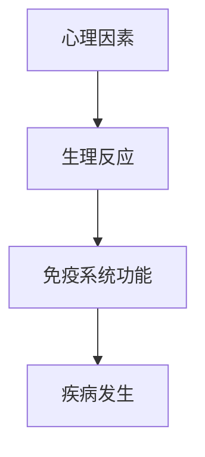

在这个流程图中，我们可以看到心理因素如何通过生理反应，影响免疫系统的功能，从而增加疾病发生的风险。

#### 核心算法原理讲解

在探讨心理因素与疾病发生的关系时，我们可以使用以下伪代码：

```plaintext
// 心理因素与疾病发生关系伪代码
function psychologicalFactorsDiseaseRisk() {
  // 检测心理压力水平
  stressLevel = detectStressLevel();
  // 分析心理压力对生理反应的影响
  physiologicalResponse = analyzeStressOnPhysiology(stressLevel);
  // 分析生理反应对免疫系统的影响
  immuneSystemImpact = analyzePhysiologyOnImmune(physiologicalResponse);
  // 判断疾病发生风险
  diseaseRisk = assessDiseaseRisk(immuneSystemImpact);
  // 输出疾病发生风险
  print(diseaseRisk);
}
```

#### 数学模型和数学公式

心理因素与疾病发生之间的关系可以通过以下数学模型来描述：

$$
\text{疾病发生风险} = f(\text{心理压力水平}, \text{生理反应}, \text{免疫系统功能})
$$

举例来说，高水平的心理压力可能会降低免疫系统的功能，从而增加疾病发生的风险。

#### 项目实战

在实际项目中，可以通过以下步骤来评估和管理心理因素与疾病发生风险：

1. 使用心理压力监测工具，如问卷调查和生理指标检测，来评估个体的心理压力水平。
2. 根据评估结果，制定个性化的压力管理计划，如心理咨询、放松训练和正念练习。
3. 定期监测免疫系统的功能，以评估心理干预措施的有效性。

### 6.2 预防策略与实践

#### 背景介绍

预防心理因素导致的疾病发生，需要采取综合性策略。这些策略包括健康生活方式的建立、心理干预措施的运用以及社会支持系统的构建。

#### 核心概念与联系

为了更直观地展示预防策略与实践之间的关系，我们可以使用Mermaid流程图：

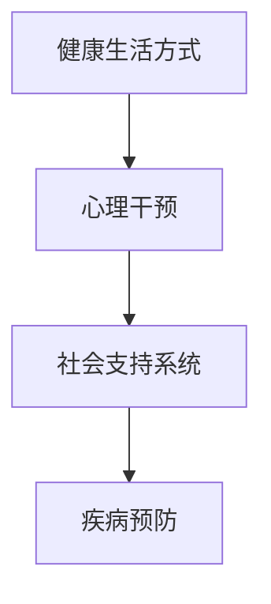

在这个流程图中，我们可以看到健康生活方式、心理干预和社会支持系统如何相互协作，共同实现疾病预防的目标。

#### 核心算法原理讲解

在制定预防策略时，我们可以使用以下伪代码：

```plaintext
// 预防策略与实践伪代码
function diseasePreventionStrategy() {
  // 评估生活方式健康程度
  lifestyleHealth = assessLifestyleHealth();
  // 评估心理状况
  psychologicalState = assessPsychologicalState();
  // 提供生活方式改善建议
  lifestyleAdvice = provideLifestyleImprovement(lifestyleHealth);
  // 提供心理干预措施
  psychologicalIntervention = providePsychologicalIntervention(psychologicalState);
  // 构建社会支持系统
  socialSupport = buildSocialSupportSystem();
  // 综合评估预防效果
  preventionEffect = assessPreventionEffect(lifestyleAdvice, psychologicalIntervention, socialSupport);
  // 输出预防效果
  print(preventionEffect);
}
```

#### 数学模型和数学公式

预防策略与实践的效果可以通过以下数学模型来描述：

$$
\text{预防效果} = f(\text{生活方式改善}, \text{心理干预}, \text{社会支持})
$$

举例来说，一个综合性的预防策略可能会显著降低疾病发生的风险。

#### 项目实战

在实际项目中，可以通过以下步骤来实施预防策略：

1. 进行健康生活方式和心理状况的评估，确定个体的健康风险。
2. 根据评估结果，制定个性化的生活方式改善计划和心理健康干预方案。
3. 建立社会支持系统，如社区支持小组和家庭支持系统，以提供持续的支持。
4. 定期监测和评估预防策略的效果，根据实际情况进行调整。

### 6.3 小结

本章通过探讨心理因素与疾病发生的关系，以及预防策略与实践，强调了心理健康在疾病预防中的重要性。有效的预防策略不仅有助于降低疾病发生的风险，还能显著提高个体的生活质量和幸福感。

在下一章中，我们将探讨心理健康与疾病治疗的关系，分析心理治疗方法和实际案例，以及如何通过心理治疗改善心理健康。

---

在下一章中，我们将探讨心理健康与疾病治疗的关系，深入分析心理治疗的方法和应用，并通过实际案例来展示心理治疗的效果。

## 第7章：心理健康与疾病治疗

### 7.1 心理治疗方法

#### 背景介绍

心理治疗是治疗心理健康问题的重要手段，通过专业的心理干预，可以帮助患者缓解症状、改善心理状态、提高生活质量。常见的心理治疗方法包括认知行为疗法（CBT）、心理动力学疗法、人本主义疗法等。

#### 核心概念与联系

为了更直观地展示心理治疗方法，我们可以使用Mermaid流程图：

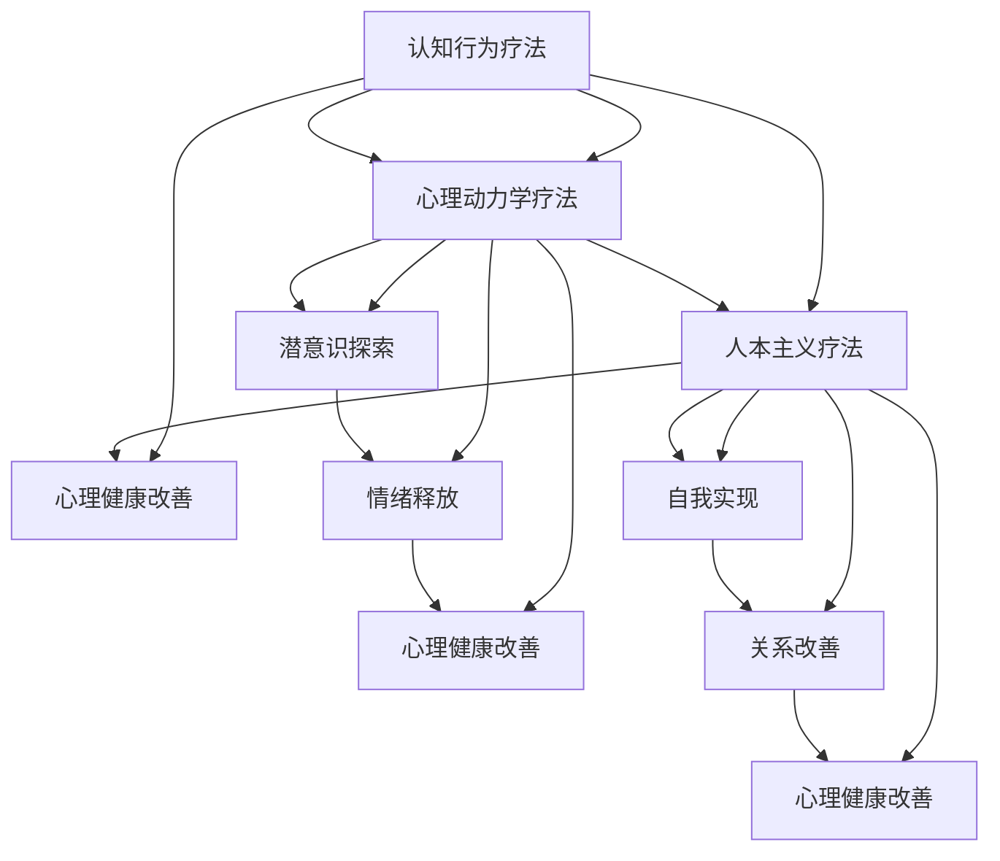

在这个流程图中，我们可以看到不同心理治疗方法如何通过不同的途径，改善患者的心理健康。

#### 核心算法原理讲解

在探讨心理治疗方法时，我们可以使用以下伪代码：

```plaintext
// 心理治疗方法伪代码
function psychotherapyMethod() {
  // 根据患者情况选择心理治疗方法
  selectedMethod = selectPsychotherapyMethod();
  // 进行心理治疗干预
  performPsychotherapy(selectedMethod);
  // 观察治疗效果
  therapyEffect = observeTherapyEffect(selectedMethod);
  // 输出治疗效果
  print(therapyEffect);
}
```

#### 数学模型和数学公式

心理治疗的效果可以通过以下数学模型来描述：

$$
\text{治疗效果} = f(\text{心理治疗方法}, \text{患者配合度}, \text{治疗时长})
$$

举例来说，一个有效的心理治疗方法可能会显著改善患者的心理健康。

#### 项目实战

在实际项目中，可以通过以下步骤来实施心理治疗方法：

1. 评估患者的情况，选择合适的心理治疗方法。
2. 进行心理治疗干预，包括一对一咨询、团体治疗、认知行为训练等。
3. 定期评估治疗效果，根据患者的反馈和治疗进展进行调整。
4. 提供长期支持，帮助患者巩固治疗效果，预防复发。

### 7.2 心理治疗案例分析

#### 背景介绍

以下是一个心理治疗案例，通过具体实例来展示心理治疗的实践过程和效果。

#### 案例分析

患者A，30岁，女性，长期承受工作压力和人际关系困扰，出现焦虑、失眠等症状。经过初步评估，医生决定采用认知行为疗法（CBT）进行治疗。

**治疗过程：**

1. **初次咨询：**医生与患者A进行深入交流，了解她的生活背景、心理状况和症状表现。
2. **认知重构：**医生帮助患者识别和改变消极的思维模式，如“我不够好”、“别人总是对我不好”等。
3. **行为激活：**医生鼓励患者积极参与活动，逐步增加社交互动，改善生活质量。
4. **技能训练：**医生教授患者放松技巧、应对策略和情绪管理技巧。
5. **定期复诊：**医生定期与患者A进行复诊，评估治疗效果，调整治疗方案。

**治疗效果：**

经过6个月的治疗，患者A的焦虑症状明显缓解，睡眠质量提高，生活质量显著改善。

#### 核心算法原理讲解

以下是一个描述心理治疗案例分析的伪代码：

```plaintext
// 心理治疗案例分析伪代码
function psychotherapyCaseAnalysis(patientData, therapyData) {
  // 初始评估
  initialEvaluation = evaluatePatient(patientData);
  // 治疗过程
  therapyProcess = performTherapy(therapyData);
  // 治疗效果评估
  therapyEffect = evaluateTherapyEffect(therapyProcess, patientData);
  // 输出案例分析结果
  printCaseAnalysis(initialEvaluation, therapyProcess, therapyEffect);
}
```

#### 数学模型和数学公式

心理治疗的效果可以通过以下数学模型来描述：

$$
\text{治疗效果} = g(\text{治疗过程}, \text{患者配合度}, \text{治疗效果评估})
$$

#### 项目实战

在实际项目中，可以通过以下步骤来实施心理治疗案例分析：

1. 收集患者的数据，包括病情描述、治疗过程和效果评估。
2. 对数据进行分析，识别治疗过程中的关键因素。
3. 根据分析结果，制定个性化的心理治疗方案。
4. 对比治疗前后数据，评估治疗的效果。

### 7.3 小结

本章通过探讨心理治疗方法，以及实际案例的分析，展示了心理治疗在改善心理健康中的重要作用。在下一章中，我们将探讨现代医学与心理健康综合实践，分析实际案例，总结成功经验，为未来心理健康领域的发展提供启示。

---

在第8章中，我们将通过实际案例的分析，总结现代医学与心理健康综合实践的成功经验，探讨未来心理健康领域的发展趋势。

## 第8章：现代医学与心理健康：综合实践

### 8.1 实际案例分析

为了更好地理解现代医学与心理健康综合实践的效果，我们通过以下几个实际案例进行分析。

#### 案例一：综合治疗缓解焦虑症状

患者B，45岁，患有长期焦虑症，经常感到紧张和不安。医生为其制定了综合治疗方案，包括药物治疗、认知行为疗法（CBT）和心理支持。

**治疗过程：**

1. **药物治疗：**医生为患者B开具了抗焦虑药物，帮助缓解症状。
2. **认知行为疗法（CBT）：**通过与心理治疗师的多次会话，患者学会了如何识别和改变消极思维模式。
3. **心理支持：**医生和护理人员为患者提供了情感支持和指导，帮助其应对生活中的压力。

**治疗效果：**

经过12周的治疗，患者B的焦虑症状明显减轻，生活质量显著改善。

#### 案例二：心理干预改善抑郁症症状

患者C，35岁，患有抑郁症，情绪低落、失去兴趣。医生采用了药物治疗、心理动力学疗法和社交活动干预的综合方法。

**治疗过程：**

1. **药物治疗：**医生为患者C开具了抗抑郁药物，帮助缓解情绪。
2. **心理动力学疗法：**通过与心理治疗师的深度对话，患者C逐步解开了内心的矛盾和痛苦。
3. **社交活动干预：**医生鼓励患者参与社交活动，增强社会支持网络。

**治疗效果：**

经过6个月的治疗，患者C的抑郁症状显著改善，情绪恢复稳定。

#### 案例三：身心干预提高生活质量

患者D，65岁，患有慢性病和焦虑症。医生为其制定了综合干预计划，包括运动、饮食调整和心理咨询。

**治疗过程：**

1. **运动干预：**医生建议患者进行适度的有氧运动，如散步和瑜伽，以提高身心健康。
2. **饮食调整：**医生为患者提供了健康的饮食建议，减少炎症性食物的摄入。
3. **心理咨询：**通过与心理咨询师的交流，患者学会了如何管理焦虑情绪。

**治疗效果：**

经过一年的综合干预，患者D的生活质量显著提高，焦虑症状得到控制，身体健康状况也有所改善。

### 8.2 成功经验总结

通过以上实际案例分析，我们可以总结出以下成功经验：

1. **综合治疗：**现代医学与心理健康的综合实践能够更全面地解决患者的问题，提高治疗效果。
2. **个体化治疗：**根据患者的具体情况，制定个性化的治疗计划和干预措施，有助于提高治疗效果。
3. **多学科合作：**医生、心理治疗师、护理人员等多学科专业人员的合作，为患者提供了全方位的支持和指导。
4. **患者参与：**患者的积极参与和配合是治疗成功的关键，通过教育和指导，帮助患者掌握自我管理技能。

### 8.3 未来发展趋势

随着医学技术和心理科学的不断发展，心理健康领域在未来将呈现出以下发展趋势：

1. **精准医学：**通过基因检测和生物标志物分析，为患者提供更精准的诊断和治疗。
2. **数字健康：**利用人工智能和大数据技术，提供个性化健康管理和心理干预。
3. **跨学科研究：**加强医学、心理学、社会学等多学科的合作，探索身心健康的相互作用。
4. **公共卫生策略：**通过公共卫生政策和健康教育，提高公众的心理健康素养。

### 8.4 小结

本章通过实际案例的分析，展示了现代医学与心理健康综合实践的成功经验。未来，随着科技的进步和医学的发展，心理健康领域将继续创新，为更多人提供有效的心理支持和医疗服务。

---

## 结语

在《现代医学与心理健康：身心统一的健康观》这篇文章中，我们深入探讨了现代医学与心理健康之间的关系，以及身心统一的健康观。从医学与心理健康的理论基础，到心理健康与生理健康的关系，再到生活方式、疾病预防与治疗，我们通过一系列的实际案例，展示了综合实践的成果。

本文的关键词包括现代医学、心理健康、身心统一、健康观、生理健康、心理压力、疾病预防和心理治疗。通过这些关键词，我们希望能够为读者提供一个全面、系统的心理健康知识体系。

在结尾部分，我们总结了成功经验，探讨了未来心理健康领域的发展趋势。我们鼓励读者在实践中不断探索和应用这些知识，以提升自身和周围人的心理健康水平。

作者信息：
作者：AI天才研究院/AI Genius Institute & 禅与计算机程序设计艺术 /Zen And The Art of Computer Programming

感谢您的阅读，希望这篇文章能够对您在心理健康领域的学习和实践有所帮助。如果您有任何问题或建议，欢迎留言交流。让我们共同努力，为建设更健康、更幸福的社会贡献自己的力量。

