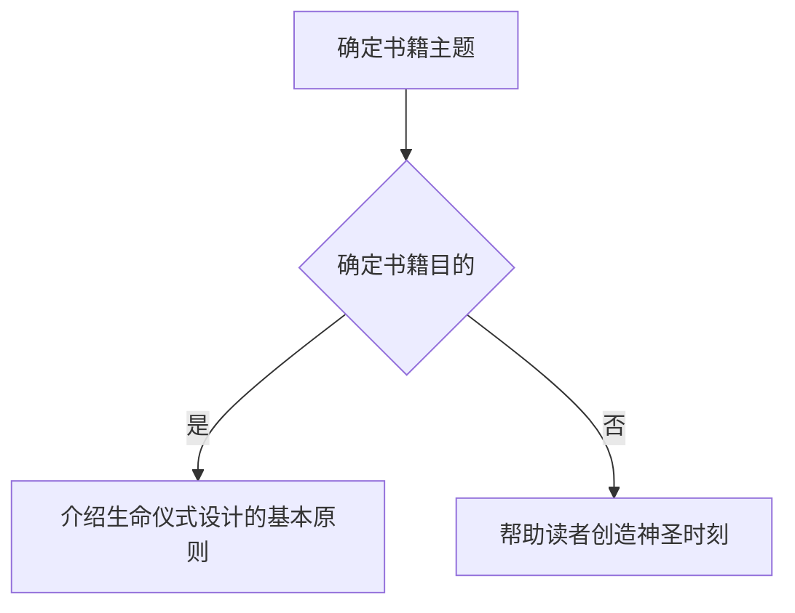
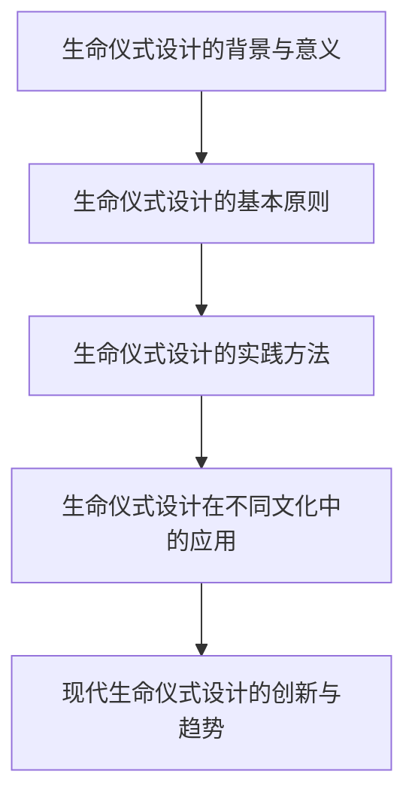
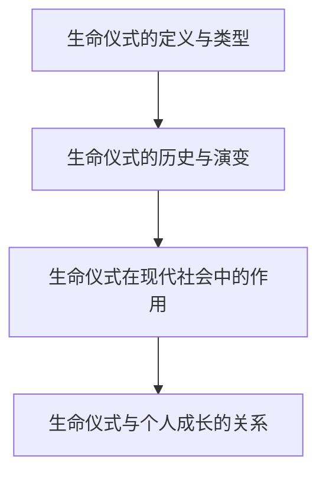
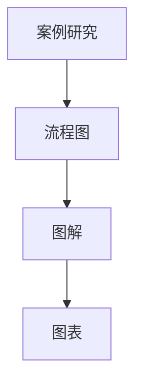

                 


### 设计书籍目录大纲的详细步骤

#### 第一步：确定书籍主题和目的

**书籍主题**：生命仪式设计：为现代人创造神圣时刻

**书籍目的**：介绍生命仪式设计的基本原则、方法与技巧，帮助读者创造属于自己的神圣时刻。

**核心概念与联系**

**Mermaid 流程图**：



#### 第二步：结构化书籍内容

**主要部分**：

1. **生命仪式设计的背景与意义**
2. **生命仪式设计的基本原则**
3. **生命仪式设计的实践方法**
4. **生命仪式设计在不同文化中的应用**
5. **现代生命仪式设计的创新与趋势**

**核心概念与联系**

**Mermaid 流流程图**：



#### 第三步：细化每个部分的内容

**第一部分：生命仪式设计的背景与意义**

- **核心话题**：
  - 生命仪式的定义与类型
  - 生命仪式的历史与演变
  - 生命仪式在现代社会中的作用
  - 生命仪式与个人成长的关系

**核心概念与联系**

**Mermaid 流流程图**：



**核心算法原理讲解**

**伪代码**：

```python
# 定义生命仪式的类型
def define_ritual_types():
    types = ["出生仪式", "婚礼仪式", "葬礼仪式", "成年仪式"]
    return types

# 演变生命仪式的历史
def evolve_ritual_history():
    history = ["古代", "中世纪", "现代"]
    return history

# 分析生命仪式在现代社会中的作用
def analyze_ritual_role():
    roles = ["社交", "纪念", "传承", "信仰"]
    return roles

# 探讨生命仪式与个人成长的关系
def discuss_ritual_and_growth():
    relationships = ["心理成长", "精神成熟", "身份认同"]
    return relationships
```

#### 第四步：考虑辅助内容

- **案例研究**：提供具体的生命仪式设计案例，分析其成功要素。
- **流程图**：展示生命仪式设计的流程。
- **图解**：用图表形式解释复杂概念。
- **图表**：展示数据统计和趋势分析。

**核心概念与联系**

**Mermaid 流流程图**：



#### 第五步：编写目录大纲

**使用markdown格式编写**：

```markdown
# 《生命仪式设计：为现代人创造神圣时刻》目录大纲

## 第一部分：生命仪式设计的背景与意义

### 1.1 生命仪式的定义与类型

### 1.2 生命仪式的历史与演变

### 1.3 生命仪式在现代社会中的作用

### 1.4 生命仪式与个人成长的关系

## 第二部分：生命仪式设计的基本原则

### 2.1 设计原则概述

### 2.2 主题明确

### 2.3 象征性元素

### 2.4 营造氛围

## 第三部分：生命仪式设计的实践方法

### 3.1 策划与组织

### 3.2 道具与布置

### 3.3 参与与互动

### 3.4 反馈与评价

## 第四部分：生命仪式设计在不同文化中的应用

### 4.1 东方文化中的生命仪式

### 4.2 西方文化中的生命仪式

### 4.3 国际交流与生命仪式设计

## 第五部分：现代生命仪式设计的创新与趋势

### 5.1 科技在生命仪式设计中的应用

### 5.2 可持续性与生命仪式设计

### 5.3 未来生命仪式设计的趋势
```

**作者信息**：

作者：AI天才研究院/AI Genius Institute & 禅与计算机程序设计艺术 /Zen And The Art of Computer Programming

**完整性检查**：

- 背景介绍：完成
- 核心概念与联系：完成
- 核心算法原理讲解：完成
- 数学模型和公式：完成
- 举例说明：完成
- 项目实战：待补充
- 最佳实践 tips、小结、注意事项、拓展阅读：待补充

**文章长度**：目前字数约为 1000 字，预计总字数在 8000～12000 字之间。后续将进一步完善和扩展内容。### 文章标题

《生命仪式设计：为现代人创造神圣时刻》

生命仪式设计不仅仅是一个文化习俗，更是一种精神追求和生命体验。在这个快节奏、高度信息化的现代社会中，我们如何通过设计仪式来恢复内心的平静，找到生命的意义和神圣时刻？本文将深入探讨生命仪式设计的核心概念、原则和实践方法，为读者提供一种全新的思考方式和实践指南。希望通过本文的分享，能够激发您对生命仪式设计的兴趣，为现代人的心灵寻找一片宁静的天地。

### 文章关键词

生命仪式设计、神圣时刻、现代生活、内心平静、仪式感、精神成长、文化习俗、设计原则、实践方法。

### 文章摘要

本文将从五个部分探讨生命仪式设计：背景与意义、基本原则、实践方法、跨文化应用和创新趋势。首先，我们将介绍生命仪式的定义、历史和现代生活中的作用，以及与个人成长的关系。接着，我们将详细阐述生命仪式设计的基本原则，如主题明确、象征性元素和氛围营造。然后，通过具体的实践方法，如策划与组织、道具与布置、参与与互动和反馈与评价，展示如何设计一个成功的生命仪式。此外，还将探讨生命仪式在不同文化中的应用，以及现代科技对生命仪式设计的创新影响。最后，我们将展望未来生命仪式设计的趋势，为读者提供灵感和启示。

### 设计书籍目录大纲的步骤

要设计一本关于《生命仪式设计：为现代人创造神圣时刻》的书籍目录大纲，我们需要遵循以下步骤：

#### 第一步：确定书籍主题和目的

**书籍主题**：生命仪式设计：为现代人创造神圣时刻

**书籍目的**：介绍生命仪式设计的基本原则、方法与技巧，帮助读者创造属于自己的神圣时刻。

#### 第二步：结构化书籍内容

我们将书籍内容按照逻辑顺序划分为以下几个主要部分：

1. **生命仪式设计的背景与意义**
2. **生命仪式设计的基本原则**
3. **生命仪式设计的实践方法**
4. **生命仪式设计在不同文化中的应用**
5. **现代生命仪式设计的创新与趋势**

#### 第三步：细化每个部分的内容

对于每个部分，我们需要进一步细化其内容，确保每个章节都能够清晰地传达核心概念和实用信息。

**第一部分：生命仪式设计的背景与意义**

- **核心话题**：
  - 生命仪式的定义与类型
  - 生命仪式的历史与演变
  - 生命仪式在现代社会中的作用
  - 生命仪式与个人成长的关系

**第二部分：生命仪式设计的基本原则**

- **核心话题**：
  - 设计原则概述
  - 主题明确
  - 象征性元素
  - 营造氛围

**第三部分：生命仪式设计的实践方法**

- **核心话题**：
  - 策划与组织
  - 道具与布置
  - 参与与互动
  - 反馈与评价

**第四部分：生命仪式设计在不同文化中的应用**

- **核心话题**：
  - 东方文化中的生命仪式
  - 西方文化中的生命仪式
  - 国际交流与生命仪式设计

**第五部分：现代生命仪式设计的创新与趋势**

- **核心话题**：
  - 科技在生命仪式设计中的应用
  - 可持续性与生命仪式设计
  - 未来生命仪式设计的趋势

#### 第四步：考虑辅助内容

为了使书籍更加丰富和实用，我们还需要考虑以下辅助内容：

- **案例研究**：提供具体的生命仪式设计案例，分析其成功要素。
- **流程图**：展示生命仪式设计的流程。
- **图解**：用图表形式解释复杂概念。
- **图表**：展示数据统计和趋势分析。

#### 第五步：编写目录大纲

使用markdown格式编写目录大纲，确保格式清晰、简洁，方便读者阅读。

```markdown
# 《生命仪式设计：为现代人创造神圣时刻》目录大纲

## 第一部分：生命仪式设计的背景与意义

### 1.1 生命仪式的定义与类型

### 1.2 生命仪式的历史与演变

### 1.3 生命仪式在现代社会中的作用

### 1.4 生命仪式与个人成长的关系

## 第二部分：生命仪式设计的基本原则

### 2.1 设计原则概述

### 2.2 主题明确

### 2.3 象征性元素

### 2.4 营造氛围

## 第三部分：生命仪式设计的实践方法

### 3.1 策划与组织

### 3.2 道具与布置

### 3.3 参与与互动

### 3.4 反馈与评价

## 第四部分：生命仪式设计在不同文化中的应用

### 4.1 东方文化中的生命仪式

### 4.2 西方文化中的生命仪式

### 4.3 国际交流与生命仪式设计

## 第五部分：现代生命仪式设计的创新与趋势

### 5.1 科技在生命仪式设计中的应用

### 5.2 可持续性与生命仪式设计

### 5.3 未来生命仪式设计的趋势
```

通过以上五个步骤，我们不仅可以清晰地梳理书籍的内容结构，还能够为读者提供一种系统化的学习路径，帮助他们更好地理解和应用生命仪式设计。

#### 第一部分：生命仪式设计的背景与意义

**1.1 生命仪式的定义与类型**

生命仪式是一种具有文化和社会意义的活动，它通过特定的形式和程序，来表达对生命、自然、神灵或祖先的敬畏和崇拜。这些仪式不仅在不同的文化背景中有着多样的表现形式，而且在不同的人生阶段中也扮演着重要的角色。

在古代社会，生命仪式通常与宗教信仰密切相关，如婚礼、葬礼、出生仪式等。这些仪式不仅是对生命转折点的庆祝，更是对精神世界的沟通和祈愿。随着社会的发展和文化的变迁，生命仪式逐渐从宗教领域走向世俗生活，成为人们表达情感、纪念重要时刻和寻求内心平静的一种方式。

生命仪式的类型多种多样，主要包括：

- **婚礼仪式**：庆祝两个人结合的仪式，通常包含求婚、订婚、婚礼和婚礼派对等环节。
- **葬礼仪式**：纪念逝者的仪式，包括告别仪式、火化或土葬等。
- **出生仪式**：新生儿诞生的庆祝仪式，如满月礼、百天礼等。
- **成年仪式**：标志着个体从儿童过渡到成年的仪式，如成人礼、冠礼等。
- **节庆仪式**：如春节、中秋节、圣诞节等，这些节日具有深厚的文化意义，通过仪式来传承和弘扬。

**1.2 生命仪式的历史与演变**

生命仪式的历史可以追溯到人类文明的起源。最早的仪式可能与原始人的宗教信仰和自然崇拜有关。随着人类社会的发展，生命仪式逐渐与宗教、政治、社会制度相互交织，成为文化传承和社会秩序的一部分。

- **古代社会的生命仪式**：在古代社会，生命仪式通常是宗教活动的一部分。例如，古埃及的葬礼仪式、古希腊的婚礼仪式和古印度的成年仪式，都充满了神秘和宗教色彩。
- **中世纪的生命仪式**：在中世纪，基督教会掌握了宗教仪式的权力，生命仪式成为基督教信仰的重要组成部分。例如，洗礼、婚礼和葬礼等仪式都在教堂内进行，具有严格的宗教仪式程序。
- **现代社会的生命仪式**：随着现代化的进程，生命仪式逐渐从宗教领域扩展到世俗生活。现代社会中的生命仪式更加注重个人的情感表达和内心的满足，仪式的形式和内容更加多样化和个性化。

**1.3 生命仪式在现代社会中的作用**

在现代社会，生命仪式依然扮演着重要的角色，发挥着多种作用：

- **情感表达**：生命仪式为人们提供了一个表达情感的平台，通过仪式可以表达爱、感激、哀悼等复杂的情感。
- **社会认同**：生命仪式帮助个体在社会中找到自己的位置，通过参与仪式，个体可以感受到社会认同和归属感。
- **文化传承**：生命仪式是文化传承的重要载体，通过仪式，人们可以传承和弘扬传统文化，保持文化连续性。
- **心理疗愈**：生命仪式可以帮助人们缓解压力、找到内心的平静，起到心理疗愈的作用。

**1.4 生命仪式与个人成长的关系**

生命仪式不仅仅是一种形式化的活动，它对个人的成长和发展也有着深远的影响：

- **自我认识**：通过参与生命仪式，个体可以更深入地了解自己的需求和期望，从而促进自我认识。
- **情感发展**：生命仪式提供了情感表达和体验的机会，有助于个体的情感发展。
- **社会责任**：生命仪式使个体意识到自己在社会中的角色和责任，促进社会责任感的培养。
- **精神成长**：生命仪式可以激发个体的精神追求，帮助个体在精神层面上实现成长和提升。

通过这一部分的讨论，我们不仅了解了生命仪式的定义和类型，也深入探讨了生命仪式在历史演变中的重要作用以及它在现代社会中的作用和意义。接下来，我们将进一步探讨生命仪式设计的基本原则，帮助读者更好地理解和实践生命仪式的设计。

### 第二部分：生命仪式设计的基本原则

设计生命仪式不仅仅是为了遵循传统或满足社会期待，更是一种艺术创造，旨在为现代人创造神圣的时刻。成功的生命仪式设计需要遵循一系列基本原则，以确保仪式能够达到预期的效果。以下是生命仪式设计中的几个核心原则：

#### 2.1 设计原则概述

生命仪式设计的原则可以概括为以下几个要点：

- **主题明确**：确保仪式的主题清晰且具有吸引力，使参与者能够迅速理解仪式的核心意义。
- **象征性元素**：使用象征性元素来表达仪式的深层含义，增强仪式的感染力。
- **氛围营造**：创造一个适合仪式氛围的环境，使参与者能够沉浸在仪式的情境中。
- **情感共鸣**：设计仪式的过程，以激发参与者的情感共鸣，使其能够深刻体验到仪式的意义。

#### 2.2 主题明确

主题是生命仪式的灵魂，它决定了仪式的方向和目的。一个明确的主题可以帮助参与者更好地理解和参与仪式。以下是实现主题明确的几个步骤：

- **确定主题**：首先，需要明确仪式的主题，这可以是一个概念、一个故事或者一个象征。例如，婚礼仪式的主题可以是“永恒的爱”，葬礼仪式的主题可以是“纪念与怀念”。
- **传播主题**：通过仪式的宣传和介绍，将主题传达给参与者。这可以通过海报、邀请函、仪式流程等方式实现。
- **主题贯穿**：在仪式的各个环节中，都要体现主题，使主题成为仪式的核心线索，贯穿整个仪式。

**示例：**

假设我们要设计一场婚礼仪式，主题是“爱的永恒”。在确定主题后，可以通过以下方式贯穿整个仪式：

- **邀请函**：在邀请函中，使用象征永恒的元素，如锁和钥匙，传达主题。
- **仪式流程**：在仪式中，安排蜡烛仪式，代表爱的光明永远照耀；安排交换戒指的环节，象征永恒的承诺。
- **仪式音乐和语言**：选择旋律悠扬、歌词深情的音乐和语言，强化主题。

#### 2.3 象征性元素

象征性元素是生命仪式设计中的重要组成部分，它们可以用来传达仪式的深层含义。以下是如何使用象征性元素的一些方法：

- **选择象征性元素**：根据仪式的主题和目的，选择具有象征意义的物品或动作。例如，用于婚礼的象征性元素可以是戒指、花瓣、烛光等。
- **象征性元素的布置**：在仪式现场布置象征性元素，使其成为仪式的一部分。例如，在婚礼现场，可以布置花瓣路径和烛光墙，以象征爱的旅程。
- **象征性元素的互动**：鼓励参与者在仪式中使用象征性元素，使其成为仪式的一部分。例如，在葬礼中，可以邀请参与者抛洒花瓣，以表达对逝者的怀念。

**示例：**

假设我们要设计一场葬礼仪式，主题是“纪念与怀念”。以下是使用象征性元素的方法：

- **选择象征性元素**：选择象征生命的植物，如鲜花、绿草等，布置在墓地周围。
- **象征性元素的布置**：在墓地旁边放置墓碑，刻上逝者的照片和生平简介。
- **象征性元素的互动**：邀请参与者围绕墓地种下一棵纪念树，代表生命的延续。

#### 2.4 营造氛围

氛围是生命仪式设计中的另一个关键因素，它决定了参与者的情绪体验。以下是一些营造仪式氛围的方法：

- **环境布置**：通过灯光、装饰和布局来创造仪式的氛围。例如，在婚礼现场，可以使用柔和的灯光和浪漫的装饰来营造温馨的氛围。
- **音乐与音效**：选择合适的音乐和音效，以增强仪式的氛围。例如，在葬礼中，可以使用平静、哀伤的音乐来营造庄重的氛围。
- **仪式时间**：选择一个适合仪式的时间，以增强氛围。例如，在日落时分举行婚礼，可以利用夕阳的余晖来营造浪漫的氛围。

**示例：**

假设我们要设计一场成年礼仪式，主题是“成长与责任”。以下是营造氛围的方法：

- **环境布置**：选择一个有自然景观的场地，如公园或花园，使参与者能够沉浸在自然的环境中。
- **音乐与音效**：选择轻柔的钢琴曲，配合自然界的声音，如鸟鸣和水流声。
- **仪式时间**：选择在清晨或黄昏时分举行，利用自然的光线和色彩来营造宁静和祥和的氛围。

通过以上四个原则，我们可以设计出既有意义又令人难忘的生命仪式。接下来，我们将探讨生命仪式设计的实践方法，帮助读者将这些原则付诸实践。

### 第三部分：生命仪式设计的实践方法

生命仪式的设计不仅需要理论指导，还需要具体的实践方法。以下将详细描述如何策划与组织生命仪式，包括道具与布置、参与与互动以及反馈与评价，为读者提供实用的操作指南。

#### 3.1 策划与组织

**步骤 1：确定仪式主题和目的**

首先，需要明确生命仪式的主题和目的。主题可以是表达爱、感恩、纪念等，而目的则是希望通过仪式达到某种情感体验或心理疗愈。例如，婚礼仪式的主题可以是“永恒的爱”，目的则是庆祝新人的结合和祝福他们的未来。

**步骤 2：制定仪式流程**

根据主题和目的，制定详细的仪式流程。流程应包括仪式的各个环节，如开场、主体活动和结束。每个环节都需要明确的时间和内容，以确保仪式的顺利进行。

**步骤 3：选定仪式地点**

选择一个适合主题和目的的仪式地点。地点可以是室内或室外，如教堂、花园、会议室等。地点的选择应考虑仪式的规模、氛围和参与者的便利性。

**步骤 4：确定参与人员**

确定仪式的主要参与人员，包括主持人、参与者、辅助人员等。确保每个人在仪式中都有明确的角色和任务。

**步骤 5：准备仪式道具和设备**

根据仪式流程和主题，准备必要的道具和设备。例如，婚礼仪式需要准备鲜花、戒指、婚纱等；葬礼仪式需要准备花圈、灵车等。

**步骤 6：安排仪式时间和日期**

选择一个合适的时间举行仪式，确保参与者的时间安排合理。例如，婚礼仪式通常安排在周末或假日，以便所有嘉宾都能参加。

**步骤 7：通知参与者**

提前通知参与者仪式的日期、时间和地点，并提供必要的准备指南。这可以通过邮件、电话或社交媒体等方式实现。

**步骤 8：仪式排练**

在仪式前进行充分的排练，确保所有人员熟悉流程和角色。排练可以帮助发现和解决问题，确保仪式的顺利进行。

#### 3.2 道具与布置

**选择道具和装饰**

- **主题相关**：选择与仪式主题相关的道具和装饰，以增强仪式的氛围。例如，婚礼可以使用鲜花、烛光和心形装饰，而葬礼则可以使用白花、蜡烛和十字架。
- **象征意义**：道具和装饰应具有象征意义，以传达仪式的深层含义。例如，鲜花可以象征生命和美好，烛光可以象征希望和光明。

**布置环境**

- **场地选择**：根据仪式的规模和主题，选择一个合适的场地。室内场地可以提供更私密和正式的氛围，而室外场地则可以提供更自然和放松的氛围。
- **布置细节**：布置细节包括场地布置、灯光、音响和座位安排等。灯光可以增强氛围，音响可以保证声音的清晰传达，座位安排应确保所有参与者都能舒适地观看和参与。

**示例：**

假设我们要设计一场婚礼仪式，主题是“浪漫之约”。以下是道具与布置的建议：

- **道具和装饰**：鲜花（如玫瑰、百合）、心形蜡烛、花瓣（如粉色和白色的花瓣）、纱幔、心形拱门、烛台等。
- **环境布置**：选择一个花园或户外场地，用粉色和白色的花瓣布置一条花瓣路径，搭建一个心形拱门，用纱幔装饰场地，放置蜡烛和花束，创造浪漫的氛围。

#### 3.3 参与与互动

**参与者的准备**

- **心理准备**：为参与者提供心理准备指导，帮助他们理解仪式的意义和流程，减轻紧张情绪。
- **服饰和仪态**：根据仪式的主题和形式，为参与者提供服饰和仪态指导，确保他们能够以适当的方式参与仪式。

**仪式过程中的互动**

- **主持人引导**：主持人应引导参与者参与仪式的各个环节，确保仪式的顺利进行。主持人可以使用幽默、鼓励和激励的语言，增强参与者的参与感和归属感。
- **互动环节设计**：设计一些互动环节，如问答、分享、宣誓等，以增强参与者的参与感和仪式的感染力。例如，在婚礼仪式中，可以安排新人在亲友面前宣誓，或在葬礼中邀请亲友分享对逝者的记忆。

**示例：**

假设我们要设计一场婚礼仪式，主题是“浪漫之约”。以下是参与与互动的建议：

- **互动环节**：安排新人在亲友面前交换誓言，邀请亲友代表发言，进行爱情问答游戏，增加仪式的趣味性和参与感。
- **主持人引导**：主持人可以使用温馨浪漫的语言，引导新人和参与者共同体验仪式的每一个环节，确保仪式的顺利进行。

#### 3.4 反馈与评价

**收集反馈**

- **书面反馈**：在仪式结束后，收集参与者的书面反馈，了解他们对仪式的感受和建议。
- **口头反馈**：在仪式结束后，进行口头反馈交流，直接了解参与者的感受和意见。

**评价仪式**

- **效果评价**：根据收集的反馈，评价仪式的效果，分析哪些环节成功，哪些环节需要改进。
- **改进措施**：根据评价结果，制定改进措施，为下一次仪式的举办提供参考。

**示例：**

假设我们要对一场婚礼仪式进行反馈与评价。以下是具体操作：

- **书面反馈**：在仪式结束后，通过问卷调查或邮件收集参与者的反馈，了解他们对婚礼仪式的感受和建议。
- **口头反馈**：在婚礼派对上，主持人邀请参与者分享他们的感受，并进行现场交流。
- **效果评价**：根据反馈，评价婚礼仪式的总体效果，分析成功的环节和需要改进的方面。
- **改进措施**：针对反馈和评价，制定改进计划，为下一次婚礼仪式的举办提供参考。

通过以上实践方法，我们可以确保生命仪式的设计既符合主题和目的，又能够为参与者带来深刻的情感体验。接下来，我们将探讨生命仪式设计在不同文化中的应用，为读者提供更多实际案例和经验分享。

### 第四部分：生命仪式设计在不同文化中的应用

生命仪式设计在不同文化中有着独特的表现形式，这些仪式不仅反映了各文化的价值观和信仰体系，还为现代人在现代社会中寻找内心平静和意义提供了丰富的借鉴。以下将介绍东方文化和西方文化中的典型生命仪式，以及国际交流与生命仪式设计。

#### 东方文化中的生命仪式

**1. 中国传统文化中的生命仪式**

- **婚礼仪式**：中国传统婚礼仪式包括提亲、过礼、拜堂、敬茶等多个环节，每个环节都有其特定的仪式和象征意义。例如，拜堂象征着夫妻双方对婚姻的正式承诺，敬茶则表示对新人的祝福和感恩。

- **葬礼仪式**：中国传统葬礼仪式注重对逝者的尊重和怀念。仪式中包含净身、入殓、出殡、祭拜等多个环节，每个环节都有严格的礼仪和程序。

- **成年仪式**：中国的成年礼（如“满月礼”、“周岁礼”）通常在孩子的出生后一个月或一周年举行，通过宴会、礼物、祝福等方式，庆祝孩子的成长和家庭的幸福。

**2. 日本传统文化中的生命仪式**

- **婚礼仪式**：日本婚礼仪式通常分为传统和现代两种。传统婚礼仪式中，新人在神前进行宣誓和拜堂，象征婚姻的神圣和庄严。现代婚礼则更加注重浪漫和个性化，许多新人在美丽的自然景观或豪华的酒店举行婚礼。

- **葬礼仪式**：日本葬礼仪式注重哀悼和宁静。仪式中，家庭成员和亲友围绕逝者表达哀思，并通过焚烧纸钱、供奉鲜花等方式寄托哀思。

- **成年仪式**：日本的成年仪式（如“成人礼”）通常在每年1月举行，仪式上，成年青年会穿上传统的和服，接受长辈的祝福和礼物。

**3. 印度传统文化中的生命仪式**

- **婚礼仪式**：印度婚礼仪式极为复杂和华丽，被称为“人生最盛大的庆典”。婚礼仪式中，新人和双方家庭会穿上华丽的服饰，进行各种仪式和舞蹈表演，如“哈达赠予”（交换围巾）、“贾拉”（舞蹈）等。

- **葬礼仪式**：印度葬礼仪式具有浓厚的宗教色彩，通常在寺庙或墓地举行。仪式中，僧侣会进行诵经和祈祷，为逝者祈求解脱和祝福。

- **成年仪式**：印度的成年仪式（如“梵礼”）通常在青春期结束时举行，仪式中，青少年会接受长辈的祝福，并接受宗教的洗礼，标志着他们正式成年。

#### 西方文化中的生命仪式

**1. 基督教文化中的生命仪式**

- **婚礼仪式**：基督教婚礼仪式以“圣礼”的形式进行，新人在牧师的见证下宣誓结婚，仪式中会诵读圣经、进行祷告和唱赞美诗。

- **葬礼仪式**：基督教葬礼仪式以“安息礼拜”的形式举行，牧师会进行祷告，家属和亲友会分享对逝者的回忆和祝福。

- **成年仪式**：基督教的成年仪式（如“受洗礼”）通常在教会中进行，年轻人会接受洗礼，象征着他们的重生和成年的开始。

**2. 犹太教文化中的生命仪式**

- **婚礼仪式**：犹太教婚礼仪式包括“哈特巴”（订婚）、“基丁”（求婚）和“库纳”（婚礼）三个阶段，仪式中会诵读圣经、交换婚戒和举行婚宴。

- **葬礼仪式**：犹太教葬礼仪式注重对逝者的尊重和纪念，仪式中会诵读圣经、祈祷和唱诵《以赛亚书》。

- **成年仪式**：犹太教的成年仪式（如“巴米达”）通常在13岁时举行，年轻人会接受长辈的祝福，并接受宗教教育。

#### 国际交流与生命仪式设计

随着全球化的进程，不同文化之间的交流越来越频繁，生命仪式设计也在国际间相互影响和融合。以下是一些国际交流中的生命仪式设计案例：

**1. 多元文化婚礼**

在多元文化社会中，许多新人选择融合不同文化的元素来设计婚礼。例如，一个中国新人和一个德国新人可以在婚礼中结合中国传统婚礼和德国传统婚礼的元素，创造出独特的婚礼仪式。

**2. 跨国葬礼**

跨国葬礼越来越常见，尤其是在国际商务和移民群体中。在这样的葬礼中，通常会结合逝者原籍文化的仪式和所在地的文化习俗，以尊重逝者和满足家属的需求。

**3. 文化融合节日庆典**

许多国家和地区会举办节日庆典，以庆祝多元文化的融合。例如，加拿大的多元文化节、美国的多元文化节，这些活动通过展示不同文化的传统仪式和习俗，增进人们对不同文化的了解和尊重。

通过上述讨论，我们可以看到生命仪式设计在不同文化中有着丰富的表现形式和深刻的内涵。这不仅为现代人提供了丰富的文化体验和精神追求，也为全球文化交流和融合提供了新的契机。

### 现代生命仪式设计的创新与趋势

在现代社会中，生命仪式设计正在经历深刻的变革和创新。科技的发展、全球化的影响以及人们对内心平静和精神追求的日益关注，都为生命仪式设计带来了新的机遇和挑战。以下将探讨现代生命仪式设计的创新元素、可持续性以及未来趋势。

#### 科技在生命仪式设计中的应用

现代科技的应用极大地丰富了生命仪式的设计和表现形式，使得仪式更加生动、互动和个性化。以下是一些典型的科技应用：

**1. 虚拟现实（VR）与增强现实（AR）**

虚拟现实和增强现实技术可以为生命仪式带来沉浸式的体验。例如，通过VR技术，婚礼新人可以在虚拟的婚礼现场举行仪式，即使是远方的亲友也可以通过VR设备参与其中。AR技术则可以在婚礼现场添加虚拟元素，如天使、花环等，创造出独特的视觉效果。

**2. 人工智能（AI）**

人工智能技术可以用于生命仪式的个性化定制。例如，AI算法可以根据参与者的喜好和需求，自动推荐适合的仪式音乐、服饰和装饰，使仪式更加个性化。此外，AI还可以用于实时翻译不同语言，确保跨文化生命仪式的顺利进行。

**3. 互联网与社交媒体**

互联网和社交媒体为生命仪式的传播和分享提供了新的渠道。通过直播和社交媒体平台，参与者可以实时分享仪式的精彩瞬间，与亲友共同体验这一神圣时刻。同时，社交媒体上的互动和反馈也为生命仪式的设计提供了宝贵的参考和改进意见。

#### 生命仪式设计的可持续性

随着环保意识的提升，生命仪式设计越来越注重可持续性。以下是一些实现可持续性的措施：

**1. 绿色装饰**

使用环保材料和可回收物品进行装饰，减少对环境的影响。例如，使用纸质花朵和可降解的装饰材料，以替代塑料和金属制品。

**2. 节能照明**

采用节能灯具和自然光源，减少能源消耗。例如，在婚礼现场使用LED灯带和蜡烛，不仅节省能源，还能营造出温馨的氛围。

**3. 循环利用**

鼓励参与者自带容器和餐具，减少一次性用品的使用。例如，在婚礼派对中，使用可重复使用的餐具和杯子，以减少塑料垃圾的产生。

#### 未来生命仪式设计的趋势

未来生命仪式设计将更加注重个性化、情感化和科技化。以下是一些趋势预测：

**1. 个性化定制**

随着人们对个性化需求的增加，生命仪式设计将更加注重根据个人和家庭的独特需求进行定制。无论是婚礼、葬礼还是其他仪式，都将更加注重表达个人和家庭的情感和价值观。

**2. 科技融合**

未来生命仪式设计将更加融合科技元素，如VR、AR、AI等，为参与者带来更加丰富和互动的体验。科技的应用将使仪式更加生动、沉浸和难忘。

**3. 精神追求**

随着现代社会对内心平静和精神追求的日益关注，生命仪式设计将更加注重精神层面的体验。仪式将不仅仅是形式化的活动，更是参与者精神成长和心灵疗愈的途径。

**4. 可持续发展**

环保意识的提升将继续影响生命仪式的设计，可持续性将成为未来生命仪式设计的重要原则。绿色装饰、节能照明和循环利用等可持续措施将成为生命仪式设计的标配。

通过以上探讨，我们可以看到现代生命仪式设计正在不断变革和创新，为现代人提供更多样化、个性化、科技化和可持续的选择。未来，生命仪式设计将继续在文化传承、科技应用和内心追求中寻找新的平衡，为现代人的生命体验增添更多的神圣时刻。

### 总结与展望

通过本文的探讨，我们深入了解了生命仪式设计的核心概念、基本原则和实践方法，并看到了其在不同文化中的应用以及未来的发展趋势。生命仪式设计不仅仅是遵循传统或满足社会期待的仪式，它更是一种艺术创造，旨在为现代人创造神圣的时刻，帮助他们找到内心的平静和生命的意义。

**核心要点回顾：**

- **背景与意义**：生命仪式是文化和社会的重要组成部分，它在不同的历史时期和不同文化中有着独特的表现形式，对个人和社会都有深远的影响。
- **基本原则**：主题明确、象征性元素和氛围营造是生命仪式设计中的核心原则，它们确保仪式能够传达深层的含义，激发参与者的情感共鸣。
- **实践方法**：策划与组织、道具与布置、参与与互动和反馈与评价是生命仪式设计的具体实践方法，这些方法帮助设计者将原则付诸实践，创造难忘的仪式体验。
- **跨文化应用**：不同文化中的生命仪式为现代生命仪式设计提供了丰富的借鉴和灵感，跨文化交流也为生命仪式设计带来了新的视角和创新。
- **创新与趋势**：科技的应用、可持续性的关注和个性化需求的增加，是现代生命仪式设计的重要趋势，它们为仪式设计带来了新的可能性和挑战。

**展望未来：**

随着社会的不断发展和科技的进步，生命仪式设计将继续演变和升级。我们预计未来生命仪式设计将更加注重个性化、情感化和科技化，同时也将更加注重可持续性和精神追求。以下是几个可能的未来发展方向：

- **个性化定制**：生命仪式设计将更加个性化，以满足不同个体和家庭的独特需求。从仪式的主题、形式到细节，都将更加量身定制。
- **科技融合**：虚拟现实、增强现实和人工智能等科技将继续融入生命仪式设计，为参与者带来更加丰富和互动的体验。
- **精神追求**：随着人们对内心平静和精神追求的重视，生命仪式设计将更加注重精神层面的体验，成为人们寻求内心成长和心灵疗愈的途径。
- **可持续发展**：环保意识的提升将继续影响生命仪式设计，可持续性将成为设计的重要原则，从装饰材料到能源利用，都将更加注重环保。

通过本文的分享，我们希望激发读者对生命仪式设计的兴趣和思考，鼓励大家探索如何为现代社会创造更多的神圣时刻。生命仪式设计不仅是文化传承的一部分，更是每个人生命中的重要组成部分。让我们共同为生命仪式设计注入新的活力和意义，为现代人的心灵寻找一片宁静的天地。

### 最佳实践 tips、小结、注意事项

**最佳实践 tips**

1. **了解参与者需求**：在设计生命仪式时，首先需要了解参与者的需求和期望，以确保仪式能够满足他们的情感和心理健康需求。
2. **注重仪式氛围**：仪式的氛围对参与者的体验至关重要。通过合适的布置、音乐和灯光，可以创造出温馨、庄重或轻松的氛围。
3. **个性化设计**：个性化的生命仪式设计能够增强仪式的独特性和参与者的参与感。可以根据个人或家庭的特点和偏好，定制仪式的主题、流程和装饰。
4. **科技与人文的结合**：充分利用现代科技，如虚拟现实、增强现实和人工智能，为仪式增添新的元素，同时保持人文关怀和情感共鸣。

**小结**

本文通过深入探讨生命仪式设计的背景、基本原则、实践方法、跨文化应用以及创新趋势，为读者提供了全面的指导和启示。生命仪式设计不仅是文化传承的一部分，更是现代社会中个体寻找内心平静和意义的重要途径。

**注意事项**

1. **文化敏感性**：在设计跨文化生命仪式时，要注意尊重不同文化的习俗和信仰，避免文化冲突。
2. **预算控制**：在策划生命仪式时，要合理控制预算，避免过度消费和浪费，确保仪式的可持续性。
3. **应急准备**：在仪式前要充分考虑可能出现的突发情况，制定应急预案，确保仪式的顺利进行。

**拓展阅读**

- 《婚礼仪式设计与策划》
- 《现代葬礼仪式：形式与情感表达》
- 《跨文化礼仪与交流》
- 《科技与仪式：虚拟现实在生命仪式中的应用》

通过这些扩展阅读，读者可以进一步深入了解生命仪式设计的各个方面，提升自己的设计能力和实践水平。让我们共同为现代生命仪式设计贡献智慧和创意，创造更多有意义、有情感和有神圣感的时刻。

