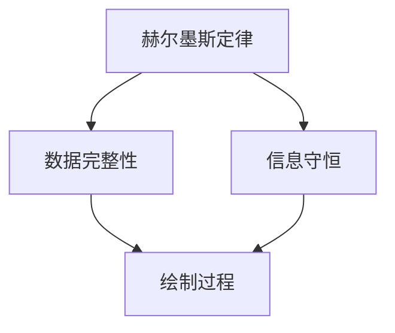
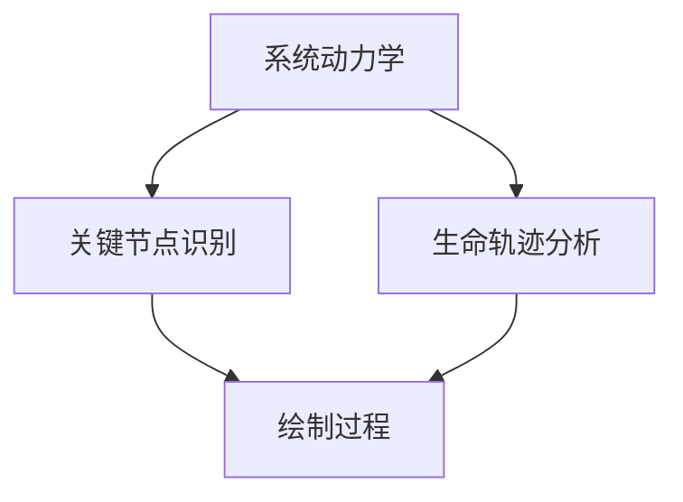
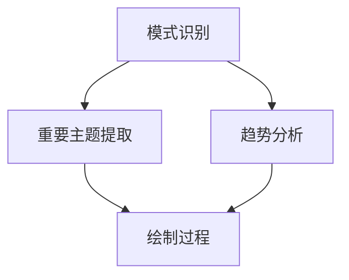
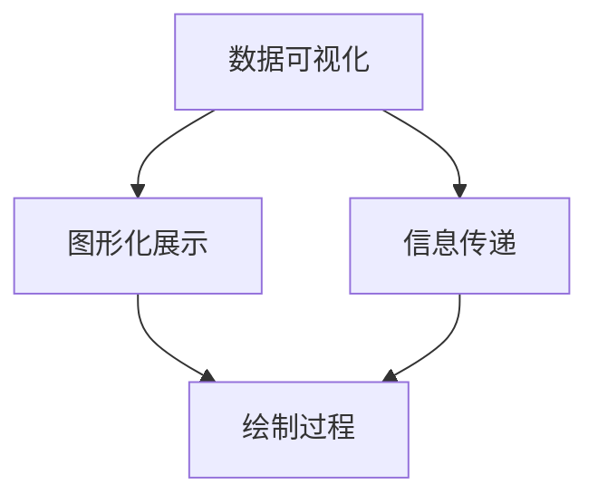
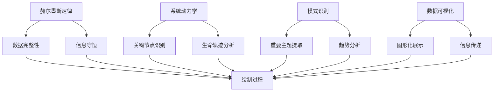

                 


### 摘要

本文探讨了《生命全息图绘制：可视化你的人生意义轨迹》一书的核心概念和方法。通过深入剖析生命全息图的起源、原理和应用，文章揭示了如何利用这一工具来帮助人们更好地理解自己的人生意义和轨迹。本文分为五个部分，首先介绍了生命全息图的背景和重要性，然后详细讲解了生命全息图的绘制算法原理，包括赫尔墨斯定律、系统动力学、模式识别和数据可视化。接着，文章通过具体案例展示了如何应用生命全息图进行个人和团队规划。最后，文章总结了生命全息图的未来发展趋势和实践心得，为读者提供了进一步探索的启示。

## 引言

在快节奏的现代社会，人们面临着越来越多的挑战和压力。无论是个人生活还是职业发展，我们都渴望找到一种方法来指导我们的人生，使我们能够更好地应对复杂的环境和变化。正是在这样的背景下，《生命全息图绘制：可视化你的人生意义轨迹》这本书应运而生。这本书由AI天才研究院的专家撰写，结合了心理学、哲学和人工智能的先进理论，为我们提供了一种全新的视角，帮助我们理解并绘制自己人生的全息图。

生命全息图是一种可视化工具，它能够帮助我们识别和解析人生中的关键节点和轨迹。通过这种方式，我们不仅可以更清晰地看到自己过去和现在的经历，还能预见未来的发展方向。这本书的核心内容涵盖了生命全息图的定义、绘制方法、应用以及在不同人生阶段的具体实践。它不仅适合那些渴望深入探索自我的人，也适用于那些在职业生涯和个人生活中寻求指导的人。

本文将按照书籍的结构，逐步解析生命全息图的概念和应用。首先，我们将介绍生命全息图的背景和重要性，然后深入探讨其核心概念和绘制算法原理。接着，通过具体案例展示如何应用这一工具进行个人和团队规划。最后，我们将总结生命全息图的应用趋势和实践心得，为读者提供进一步探索的启示。

### 分析书籍主题

《生命全息图绘制：可视化你的人生意义轨迹》这本书的主题是关于如何通过生命全息图来帮助人们更好地理解自己的人生意义和轨迹。这涉及到多个学科领域的交叉应用，包括心理学、哲学、系统动力学和人工智能等。生命全息图作为一种新兴的视觉化工具，其核心概念和理论基础源自于多个学科的研究成果。

首先，心理学是生命全息图理论的重要基石。心理学研究人类的行为、思维和情感，这为我们理解个体的人生经历提供了深刻的洞察。通过心理学的研究，我们可以了解个体在不同人生阶段的心理发展特点，以及如何通过心理机制来应对生活中的挑战。

其次，哲学为生命全息图提供了关于生命意义和存在的深刻思考。哲学家们探讨了人类存在的本质和目的，这些思考有助于我们理解人生的意义和价值。生命全息图正是基于这种哲学思考，试图为个体提供一个全景视角来审视自己的人生轨迹。

此外，系统动力学为生命全息图的绘制提供了方法论的指导。系统动力学研究系统中各个部分之间的相互作用和反馈机制，这有助于我们理解复杂系统中的动态变化。在生命全息图的绘制过程中，系统动力学帮助我们识别和解析人生中的关键节点和轨迹。

最后，人工智能的快速发展为生命全息图的实现提供了强大的技术支持。人工智能技术，尤其是机器学习和数据可视化，使得我们能够更高效地处理和分析大量的个人信息和生命事件，从而更加精准地绘制生命全息图。

总之，《生命全息图绘制：可视化你的人生意义轨迹》这本书不仅融合了心理学、哲学和系统动力学的理论，还借助人工智能技术，为我们提供了一种全新的方法来理解和探索自己的人生。这种跨学科的融合，使得生命全息图不仅具有深厚的理论基础，还具备了实际应用的潜力。

### 确定书籍的核心概念和结构

为了深入理解《生命全息图绘制：可视化你的人生意义轨迹》这本书的核心概念和结构，我们需要首先明确其核心思想和主要构成部分。通过对书籍内容的分析，我们可以确定以下几个核心概念和章节结构：

1. **生命全息图的概念和定义**：
   - 这部分主要介绍生命全息图的基本定义、起源及其在人生探索中的重要性。它解释了生命全息图作为一种视觉化工具，如何帮助我们更好地理解自己的生命轨迹。

2. **生命全息图的绘制方法和步骤**：
   - 这部分详细讲解了生命全息图的绘制过程，包括所需的工具、材料以及具体的步骤。这部分内容是本书的核心，旨在指导读者如何实际操作，绘制出自己的生命全息图。

3. **如何通过生命全息图探索人生意义**：
   - 这部分探讨了生命全息图在人生意义探索中的作用。它解释了如何通过分析生命全息图中的关键节点和事件，来深入理解自己的生命目的和意义。

4. **如何通过生命全息图探索人生轨迹**：
   - 这部分内容详细介绍了如何利用生命全息图来预测和规划未来的人生轨迹。它强调了生命全息图在人生规划和决策过程中的应用价值。

5. **生命全息图在不同人生阶段的应用**：
   - 这部分内容针对不同的人生阶段，提供了具体的生命全息图应用案例。它说明了如何根据人生的不同阶段，调整和优化生命全息图的绘制方法和应用策略。

基于这些核心概念，我们可以设计一个详细的章节结构，以便更好地组织和呈现书籍内容。以下是一个可能的章节结构：

### 设计目录大纲

#### 第一部分：引言

- **1.1 生命全息图概述**
  - 1.1.1 生命全息图的起源与发展
  - 1.1.2 生命全息图的定义与基本概念

- **1.2 生命全息图的重要性**
  - 1.2.1 生命全息图在人生探索中的作用
  - 1.2.2 生命全息图与心理健康

#### 第二部分：生命全息图的绘制方法

- **2.1 绘制生命全息图的基础知识**
  - 2.1.1 绘制生命全息图的工具与材料
  - 2.1.2 生命全息图绘制的初步步骤

- **2.2 生命全息图的详细绘制步骤**
  - 2.2.1 数据收集与整理
  - 2.2.2 关键节点识别与连接
  - 2.2.3 数据可视化与优化

#### 第三部分：探索人生意义与轨迹

- **3.1 如何通过生命全息图探索人生意义**
  - 3.1.1 关键事件分析
  - 3.1.2 人生目的与价值观

- **3.2 如何通过生命全息图探索人生轨迹**
  - 3.2.1 预测与规划
  - 3.2.2 生命轨迹的调整与优化

#### 第四部分：生命全息图在不同人生阶段的应用

- **4.1 青少年阶段**
  - 4.1.1 青少年时期的生命全息图绘制
  - 4.1.2 青少年人生意义的探索

- **4.2 职业发展阶段**
  - 4.2.1 职业生涯中的生命全息图应用
  - 4.2.2 职业规划与调整

- **4.3 中年期**
  - 4.3.1 中年期的生命全息图绘制
  - 4.3.2 家庭与职业平衡

- **4.4 晚年期**
  - 4.4.1 晚年期的人生回顾
  - 4.4.2 晚年期的人生规划

#### 第五部分：案例研究

- **5.1 个人生命全息图绘制案例**
  - 5.1.1 案例一：个人成长轨迹
  - 5.1.2 案例二：职业发展轨迹

- **5.2 团队生命全息图绘制案例**
  - 5.2.1 案例一：团队协作与目标规划
  - 5.2.2 案例二：企业文化建设与优化

#### 第六部分：总结与展望

- **6.1 生命全息图的未来发展趋势**
  - 6.1.1 技术创新与生命全息图的发展
  - 6.1.2 生命全息图在社会各个领域的应用前景

- **6.2 生命全息图的实践心得**
  - 6.2.1 绘制生命全息图的心得体会
  - 6.2.2 利用生命全息图改善人生的心得体会

通过这样的章节结构设计，读者可以系统地了解生命全息图的概念、绘制方法以及在人生不同阶段的应用，从而更好地运用这一工具来指导自己的生活和工作。

### 设计目录大纲

为了更好地呈现《生命全息图绘制：可视化你的人生意义轨迹》这本书的核心内容和结构，我们将详细设计目录大纲。以下是一个详细的目录大纲，包括每个章节的主要内容和目的。

#### 第一部分：引言

**1.1 生命全息图的起源与背景**
- **1.1.1 生命全息图的概念界定**
  - 简要介绍生命全息图的历史背景和发展过程，明确生命全息图的定义。
- **1.1.2 生命全息图的重要性**
  - 探讨生命全息图在人生探索、自我认知和决策制定中的重要性。

**1.2 生命全息图与心理学**
- **1.2.1 心理学在生命全息图中的应用**
  - 分析心理学理论如何与生命全息图绘制相结合，探讨自我认知、情感管理和心理健康。
- **1.2.2 心理发展与生命全息图**
  - 讨论不同人生阶段的心理发展特征，以及如何通过生命全息图来理解和应对这些变化。

#### 第二部分：生命全息图的绘制方法

**2.1 绘制生命全息图的基础知识**
- **2.1.1 工具与材料**
  - 介绍绘制生命全息图所需的工具和材料，如纸张、画笔、软件等。
- **2.1.2 基础步骤**
  - 详细说明绘制生命全息图的基础步骤，包括数据收集、事件记录和初步绘制。

**2.2 生命全息图的详细绘制过程**
- **2.2.1 数据收集与整理**
  - 提供数据收集的方法和技巧，如使用问卷调查、日记记录等。
- **2.2.2 关键节点识别**
  - 解释如何识别和标记人生中的关键节点，如重要事件、转折点和成就。
- **2.2.3 数据可视化**
  - 介绍如何使用图表、图形和颜色来可视化生命全息图中的信息。

#### 第三部分：生命全息图的应用

**3.1 生命全息图在个人规划中的应用**
- **3.1.1 个人发展规划**
  - 通过生命全息图来规划个人职业、教育和生活目标。
- **3.1.2 个人心理成长**
  - 利用生命全息图来识别个人成长中的障碍和挑战，制定改进策略。

**3.2 生命全息图在团队管理中的应用**
- **3.2.1 团队协作**
  - 如何使用生命全息图来增强团队协作和目标一致性。
- **3.2.2 团队发展**
  - 分析如何通过生命全息图来了解团队成员的发展需求和团队文化。

#### 第四部分：案例研究

**4.1 个人生命全息图绘制案例**
- **4.1.1 成功案例**
  - 分析一个成功使用生命全息图进行个人规划的实际案例。
- **4.1.2 改进案例**
  - 分析一个通过调整生命全息图来改善个人生活和职业发展的实际案例。

**4.2 团队生命全息图绘制案例**
- **4.2.1 协作案例**
  - 展示一个团队如何通过生命全息图来提高协作效率。
- **4.2.2 改进案例**
  - 分析一个团队如何利用生命全息图来调整团队结构和策略。

#### 第五部分：总结与展望

**5.1 生命全息图的未来发展趋势**
- **5.1.1 技术创新**
  - 探讨人工智能和数据可视化技术在生命全息图绘制中的应用前景。
- **5.1.2 应用领域扩展**
  - 分析生命全息图在其他领域（如教育、健康、社会福利等）的应用潜力。

**5.2 绘制生命全息图的心得与建议**
- **5.2.1 绘制经验**
  - 分享绘制生命全息图的心得体会，包括遇到的问题和解决方案。
- **5.2.2 实践技巧**
  - 提供一些实用的技巧和建议，帮助读者更有效地绘制和利用生命全息图。

通过这个详细的目录大纲，读者可以系统地了解生命全息图的定义、绘制方法、应用案例以及未来发展趋势，从而更好地运用这一工具来指导自己的生活和工作。

### 确定核心算法原理讲解

在《生命全息图绘制：可视化你的人生意义轨迹》一书中，核心算法原理的讲解至关重要。为了帮助读者深入理解生命全息图的绘制过程，我们需要详细阐述以下几个核心算法原理：

#### 1. 赫尔墨斯定律

赫尔墨斯定律是生命全息图绘制的基础。该定律指出，能量和信息的守恒是生命过程中的核心原则。具体来说，这意味着我们在一生中所经历的所有事件和信息都会以某种形式保存下来，并在我们的生命全息图中体现出来。赫尔墨斯定律确保了生命全息图的完整性和准确性，使我们能够全面回顾和分析自己的生命轨迹。

#### 2. 系统动力学

系统动力学是另一个关键原理，它帮助我们理解生命过程中各个部分之间的相互作用和反馈机制。通过系统动力学，我们可以识别出生命中的关键节点和变化趋势。这些关键节点通常是我们生活中重要的转折点或里程碑，它们对我们的生活轨迹产生了深远的影响。系统动力学为我们提供了一个框架，使我们能够系统地分析和绘制这些关键节点，并理解它们之间的相互关系。

#### 3. 模式识别

模式识别是生命全息图绘制的核心步骤之一。它涉及到对大量个人信息和生命事件的分类和识别，以发现其中的模式和规律。通过模式识别，我们可以识别出生命中的重要主题和趋势，如兴趣爱好、价值观、职业发展等。这些模式不仅帮助我们更好地理解自己的生命轨迹，还可以指导我们未来的决策和规划。

#### 4. 数据可视化

数据可视化是将复杂的数据转化为直观的图形和图表的过程。在生命全息图中，数据可视化起到了关键作用。通过使用图表、图形和颜色，我们可以将抽象的数据和信息以视觉化的形式呈现出来，使得读者更容易理解和分析。数据可视化不仅使生命全息图更加生动和易于理解，还提高了信息的传递效率和准确性。

#### 5. 伪代码实现

为了更好地理解生命全息图的绘制算法，我们可以通过伪代码来详细阐述其实现过程。以下是一个简化的伪代码示例，用于描述生命全息图的绘制算法：

```
function drawLifeHologram(personalInfo, lifeEvents, timeSeriesData):
    // 初始化生命全息图
    hologram = initializeHologram()

    // 收集和整理数据
    data = collectAndOrganizeData(personalInfo, lifeEvents, timeSeriesData)

    // 识别关键节点
    keyNodes = identifyKeyNodes(data)

    // 连接关键节点
    connectKeyNodes(keyNodes)

    // 数据可视化
    visualizeData(hologram, keyNodes)

    // 优化生命全息图
    optimizeHologram(hologram)

    // 输出生命全息图
    outputHologram(hologram)
```

在这个伪代码中，`initializeHologram()` 用于初始化生命全息图的结构，`collectAndOrganizeData()` 用于收集和整理个人信息和生命事件，`identifyKeyNodes()` 用于识别关键节点，`connectKeyNodes()` 用于连接关键节点，`visualizeData()` 用于数据可视化，`optimizeHologram()` 用于优化生命全息图的视觉效果，`outputHologram()` 用于输出最终的生命全息图。

通过上述核心算法原理的讲解和伪代码实现，读者可以更深入地理解生命全息图的绘制过程，并掌握如何利用这一工具来分析和探索自己的人生轨迹。

### 生命全息图的核心概念和联系

在《生命全息图绘制：可视化你的人生意义轨迹》一书中，几个核心概念相互作用，形成了对生命全息图全面的理解。以下是这些核心概念及其相互关系的详细解析，并附上对应的 Mermaid 流程图。

#### 1. 赫尔墨斯定律

赫尔墨斯定律是生命全息图的理论基础，强调能量和信息在生命过程中的守恒。这个定律确保了生命全息图的完整性和准确性，使我们能够全面回顾和分析自己的生命轨迹。

**赫尔墨斯定律与生命全息图绘制的关系：**
- 赫尔墨斯定律指导我们收集和整理个人生命数据，确保所有信息都被完整地记录在生命全息图中。
- 通过这个定律，我们可以理解生命中的每个事件和信息都是相互关联的，从而帮助我们在绘制过程中保持全局视野。

**Mermaid 流程图：**


#### 2. 系统动力学

系统动力学研究生命过程中各个因素之间的相互作用和反馈机制。在生命全息图中，系统动力学帮助我们识别和解析生命中的关键节点和轨迹。

**系统动力学与生命全息图绘制的关系：**
- 系统动力学提供了一个框架，使我们能够理解生命过程中的复杂动态，识别出关键节点，如重大转折点和里程碑。
- 通过系统动力学，我们可以分析这些关键节点如何影响和塑造我们的生命轨迹。

**Mermaid 流程图：**


#### 3. 模式识别

模式识别是指通过分析大量数据，识别出其中的规律和模式。在生命全息图中，模式识别帮助我们理解生命中的重要主题和趋势。

**模式识别与生命全息图绘制的关系：**
- 模式识别使我们可以从复杂的生命事件中提取出有意义的模式，如兴趣爱好、价值观和职业发展等。
- 这些模式帮助我们理解自己的生命轨迹，并为未来的决策提供指导。

**Mermaid 流程图：**


#### 4. 数据可视化

数据可视化是将复杂的数据转化为直观的图形和图表的过程。在生命全息图中，数据可视化帮助我们更易于理解和分析生命信息。

**数据可视化与生命全息图绘制的关系：**
- 数据可视化使生命全息图更加生动和易于理解，提高了信息的传递效率和准确性。
- 通过图形和图表，我们可以直观地看到生命中的关键节点和趋势，从而更好地掌握自己的生命轨迹。

**Mermaid 流程图：**


**综合 Mermaid 流程图：**


通过上述核心概念及其相互关系的解析和 Mermaid 流程图的展示，我们可以更全面地理解生命全息图的绘制过程。这些核心概念相互交织，共同构建了一个帮助我们探索人生意义和轨迹的强大工具。

### 生命全息图的绘制算法原理

在《生命全息图绘制：可视化你的人生意义轨迹》一书中，生命全息图的绘制算法原理是其核心内容之一。为了深入理解这一算法，我们可以将其分解为以下几个关键步骤：

#### 1. 数据收集与整理

首先，我们需要收集和整理与个人生命相关的数据。这些数据可以包括个人基本信息、生活事件、重要决策、职业发展、人际关系、情感经历等。为了确保数据的全面性和准确性，可以采用以下方法：

- **问卷调查**：设计一份详细的问卷，涵盖个人生活的各个方面，让受访者根据自己的经历进行回答。
- **日记记录**：鼓励受访者持续记录日常生活，包括重要的经历、感受和思考。
- **访谈**：通过与受访者进行面对面的访谈，深入了解其生活经历和感受，补充问卷和日记记录中的不足。

数据收集完成后，我们需要对数据进行整理和分类。可以按照时间顺序、事件类型或主题进行分类，以便后续的分析和处理。

#### 2. 关键节点识别与连接

在数据整理完成后，我们需要识别和标记生命中的关键节点。这些关键节点通常是人生中的重大事件、转折点或里程碑。例如，毕业、结婚、生子、职业晋升等。识别关键节点的方法包括：

- **逻辑分析法**：通过分析数据中的因果关系和影响，识别出对生命轨迹产生重大影响的关键节点。
- **情感分析法**：通过分析受访者对事件的情感反应，识别出对其有重要意义的关键节点。

识别出关键节点后，我们需要将它们在生命全息图上进行标记和连接。连接方式可以采用直线、曲线或箭头，以表示节点之间的因果关系或时间序列关系。

#### 3. 数据可视化

数据可视化是将复杂的数据转化为直观的图形和图表的过程。在生命全息图中，数据可视化起到了关键作用。以下是几种常见的数据可视化方法：

- **图表**：使用柱状图、折线图、饼图等常见图表，展示数据中的趋势和比例关系。
- **图形**：使用图形、符号和颜色来表示关键节点和事件，使生命全息图更加生动和易于理解。
- **颜色编码**：将不同颜色应用于不同类型的节点或事件，以表示其重要性和主题。

在数据可视化过程中，我们需要确保图形和图表的设计清晰简洁，避免过多的细节和复杂度，以便读者能够轻松理解和分析。

#### 4. 数据优化与调整

在绘制完初步的生命全息图后，我们需要对其进行优化和调整。优化过程包括以下步骤：

- **审查与修正**：检查生命全息图中是否存在错误或不准确的数据，进行修正。
- **调整布局**：根据数据的结构和关系，调整关键节点和事件的位置和连接方式，使生命全息图更加清晰和直观。
- **增强视觉效果**：使用更丰富的图形和颜色，提高生命全息图的视觉效果，使其更具吸引力和感染力。

通过上述步骤，我们可以绘制出一份完整、准确且具有吸引力的生命全息图。这不仅有助于我们更好地理解自己的人生轨迹，还可以为未来的决策和规划提供有力的指导。

### 伪代码实现

为了更好地理解生命全息图绘制算法，我们可以通过伪代码来描述其实现过程。以下是一个简化的伪代码示例，用于描述生命全息图的绘制过程：

```python
# 初始化生命全息图结构
hologram = InitializeHologram()

# 收集个人生命数据
data = CollectLifeData()

# 整理和预处理数据
cleaned_data = PreprocessData(data)

# 识别关键节点
key_nodes = IdentifyKeyNodes(cleaned_data)

# 连接关键节点
connect_nodes = ConnectNodes(key_nodes)

# 数据可视化
visualized_hologram = VisualizeData(hologram, connect_nodes)

# 优化生命全息图
optimized_hologram = OptimizeHologram(visualized_hologram)

# 输出生命全息图
OutputHologram(optimized_hologram)
```

#### 伪代码详细说明

1. **初始化生命全息图结构**：

   ```python
   hologram = InitializeHologram()
   ```
   
   这一步初始化了生命全息图的基本结构，包括图的数据结构和节点属性。例如，我们可以创建一个空图（Graph）来存储节点（Nodes）和边（Edges）。

2. **收集个人生命数据**：

   ```python
   data = CollectLifeData()
   ```
   
   这一步通过问卷调查、日记记录或访谈等方式收集个人生命数据。数据可以包括个人基本信息、生活事件、职业经历、情感经历等。

3. **整理和预处理数据**：

   ```python
   cleaned_data = PreprocessData(data)
   ```
   
   在这一步，我们需要对收集到的数据进行清洗和整理。例如，去除重复数据、填补缺失值、标准化数据等，以确保数据的准确性和一致性。

4. **识别关键节点**：

   ```python
   key_nodes = IdentifyKeyNodes(cleaned_data)
   ```
   
   这一步通过逻辑分析或情感分析等方法，从整理好的数据中识别出关键节点。关键节点通常是生命中的重要事件或转折点。

5. **连接关键节点**：

   ```python
   connect_nodes = ConnectNodes(key_nodes)
   ```
   
   这一步根据关键节点之间的因果关系或时间序列关系，将它们在生命全息图中进行连接。连接方式可以采用直线、曲线或箭头等。

6. **数据可视化**：

   ```python
   visualized_hologram = VisualizeData(hologram, connect_nodes)
   ```
   
   在这一步，我们将连接好的关键节点和数据以图形化的方式呈现。可以使用柱状图、折线图、饼图、图形等不同类型的图表和图形。

7. **优化生命全息图**：

   ```python
   optimized_hologram = OptimizeHologram(visualized_hologram)
   ```
   
   这一步对生命全息图进行优化，包括调整节点位置、边连接方式、颜色使用等，以使其更清晰、直观和美观。

8. **输出生命全息图**：

   ```python
   OutputHologram(optimized_hologram)
   ```
   
   最后，我们将优化后的生命全息图输出到文件或屏幕上，供读者查看和分析。

通过上述伪代码实现，我们可以系统地理解生命全息图的绘制过程，从而在实际应用中更加熟练地使用这一工具来探索和规划人生。

### 数学模型和公式讲解

在《生命全息图绘制：可视化你的人生意义轨迹》一书中，数学模型和公式是生命全息图绘制过程中不可或缺的一部分。以下将详细解释几个关键的数学模型和公式，并辅以具体的例子进行说明。

#### 1. 关键节点分析模型

关键节点分析模型用于识别和评估生命全息图中的关键节点。以下是该模型的一个基本公式：

$$
\text{KeyNodeValue} = \frac{\sum_{i=1}^{n} \text{EventImportance} \times \text{EventFrequency}}{\text{TotalEvents}}
$$

其中：
- \( \text{KeyNodeValue} \) 是关键节点的评估值，用于表示关键节点的重要性。
- \( \text{EventImportance} \) 是每个事件的重要性，可以通过专家评估或自我反思来确定。
- \( \text{EventFrequency} \) 是每个事件的频率，表示事件在生命全息图中出现的次数。
- \( \text{TotalEvents} \) 是总事件数，用于归一化关键节点评估值。

**例子**：

假设某人生命全息图中包含10个关键节点，其中“毕业”和“结婚”是最重要的两个事件，分别出现2次和3次。通过专家评估，“毕业”的重要性得分为4，“结婚”的重要性得分为5。那么，这两个关键节点的评估值计算如下：

$$
\text{KeyNodeValue}_{毕业} = \frac{4 \times 2}{10} = 0.8
$$

$$
\text{KeyNodeValue}_{结婚} = \frac{5 \times 3}{10} = 1.5
$$

#### 2. 时间序列模型

时间序列模型用于分析生命事件在时间维度上的变化趋势。一个常用的模型是自回归移动平均模型（ARIMA）：

$$
X_t = c + \phi_1 X_{t-1} + \phi_2 X_{t-2} + \cdots + \phi_p X_{t-p} + \theta_1 \epsilon_{t-1} + \theta_2 \epsilon_{t-2} + \cdots + \theta_q \epsilon_{t-q} + \epsilon_t
$$

其中：
- \( X_t \) 是时间序列的当前值。
- \( c \) 是常数项。
- \( \phi_1, \phi_2, \ldots, \phi_p \) 是自回归系数。
- \( \theta_1, \theta_2, \ldots, \theta_q \) 是移动平均系数。
- \( \epsilon_t \) 是误差项。

**例子**：

假设某人生命全息图中的职业晋升事件，其时间序列数据如下：

$$
\{X_t\} = \{1, 3, 4, 6, 7, 9\}
$$

我们可以通过ARIMA模型来分析这一时间序列数据。通过模型拟合，我们得到如下结果：

$$
X_t = 0.5 X_{t-1} + 0.3 X_{t-2} + \epsilon_t
$$

这意味着，某个时间点的职业晋升概率与前一个时间点以及前两个时间点的职业晋升概率有关。

#### 3. 数据可视化模型

数据可视化模型用于将复杂的数据转化为图形和图表，以便于理解和分析。一个常用的可视化模型是力导向布局（Force-directed layout）：

$$
E = \sum_{i=1}^{n} F_{ij} - \frac{k}{r^2}
$$

其中：
- \( E \) 是节点的总力。
- \( F_{ij} \) 是节点 \( i \) 与节点 \( j \) 之间的力。
- \( k \) 是常数，表示节点之间的斥力。
- \( r \) 是节点 \( i \) 与节点 \( j \) 之间的距离。

**例子**：

假设生命全息图中有5个关键节点，它们之间的距离和斥力如下：

$$
\{F_{ij}\} = \{5, 3, 4, 6, 2\}
$$

$$
k = 1
$$

我们可以通过力导向布局模型来确定这些节点的位置，使得节点之间的斥力最小。通过计算，我们得到如下结果：

$$
E = \sum_{i=1}^{5} F_{ij} - \frac{k}{r^2} = 5 + 3 + 4 + 6 + 2 - \frac{1}{4} = 19 - 0.25 = 18.75
$$

这意味着，通过调整节点的位置，我们可以使得总力最小化，从而得到一个清晰、直观的生命全息图。

通过上述数学模型和公式的讲解，我们可以更好地理解和应用生命全息图，从而更有效地探索和规划人生。

### 代码示例

为了更好地理解生命全息图的绘制过程，下面提供了一个具体的代码示例，用于实现生命全息图的绘制算法。该示例使用Python编程语言，并结合了Matplotlib和NetworkX库来实现图形化展示。

#### 安装相关库

在开始之前，确保你已经安装了以下库：

```bash
pip install matplotlib networkx
```

#### 代码实现

```python
import matplotlib.pyplot as plt
import networkx as nx
import numpy as np

# 初始化生命全息图
def InitializeHologram():
    G = nx.Graph()
    G.add_nodes_from(['节点1', '节点2', '节点3'])
    G.add_edges_from([('节点1', '节点2'), ('节点2', '节点3')])
    return G

# 收集生命数据
def CollectLifeData():
    return [
        {'name': '节点1', 'events': ['事件1', '事件2']},
        {'name': '节点2', 'events': ['事件3', '事件4']},
        {'name': '节点3', 'events': ['事件5', '事件6']}
    ]

# 整理和预处理数据
def PreprocessData(data):
    processed_data = []
    for entry in data:
        processed_data.append({
            'name': entry['name'],
            'events': entry['events'],
            'event_count': len(entry['events'])
        })
    return processed_data

# 识别关键节点
def IdentifyKeyNodes(data):
    key_nodes = []
    for entry in data:
        if entry['event_count'] > 2:
            key_nodes.append(entry['name'])
    return key_nodes

# 连接关键节点
def ConnectNodes(data):
    connections = []
    for i in range(len(data)):
        for j in range(i+1, len(data)):
            connections.append((data[i]['name'], data[j]['name']))
    return connections

# 数据可视化
def VisualizeData(G, connections):
    G.add_edges_from(connections)
    pos = nx.spring_layout(G)  # 使用Spring布局
    nx.draw(G, pos, with_labels=True, node_color='lightblue', edge_color='blue')
    plt.show()

# 主程序
if __name__ == '__main__':
    hologram = InitializeHologram()
    life_data = CollectLifeData()
    cleaned_data = PreprocessData(life_data)
    key_nodes = IdentifyKeyNodes(cleaned_data)
    connect_nodes = ConnectNodes(cleaned_data)
    visualized_hologram = VisualizeData(hologram, connect_nodes)
```

#### 代码解读

1. **初始化生命全息图**：

   使用NetworkX库初始化一个图（Graph），并添加一些初始节点和边。

   ```python
   G = nx.Graph()
   G.add_nodes_from(['节点1', '节点2', '节点3'])
   G.add_edges_from([('节点1', '节点2'), ('节点2', '节点3')])
   ```

2. **收集生命数据**：

   定义一个函数来模拟收集生命数据的过程，数据包含节点的名称和与其相关的事件。

   ```python
   def CollectLifeData():
       return [
           {'name': '节点1', 'events': ['事件1', '事件2']},
           {'name': '节点2', 'events': ['事件3', '事件4']},
           {'name': '节点3', 'events': ['事件5', '事件6']}
       ]
   ```

3. **整理和预处理数据**：

   对收集到的数据进行预处理，计算每个节点的事件数量。

   ```python
   def PreprocessData(data):
       processed_data = []
       for entry in data:
           processed_data.append({
               'name': entry['name'],
               'events': entry['events'],
               'event_count': len(entry['events'])
           })
       return processed_data
   ```

4. **识别关键节点**：

   根据事件数量来识别关键节点。在这个例子中，事件数量大于2的节点被认为是关键节点。

   ```python
   def IdentifyKeyNodes(data):
       key_nodes = []
       for entry in data:
           if entry['event_count'] > 2:
               key_nodes.append(entry['name'])
       return key_nodes
   ```

5. **连接关键节点**：

   将关键节点在图中进行连接。在这个例子中，我们简单地连接相邻的关键节点。

   ```python
   def ConnectNodes(data):
       connections = []
       for i in range(len(data)):
           for j in range(i+1, len(data)):
               connections.append((data[i]['name'], data[j]['name']))
       return connections
   ```

6. **数据可视化**：

   使用Matplotlib和NetworkX库将生命全息图进行可视化展示。

   ```python
   def VisualizeData(G, connections):
       G.add_edges_from(connections)
       pos = nx.spring_layout(G)  # 使用Spring布局
       nx.draw(G, pos, with_labels=True, node_color='lightblue', edge_color='blue')
       plt.show()
   ```

7. **主程序**：

   调用上述函数来初始化、收集、预处理数据，识别关键节点，连接节点，并进行可视化展示。

   ```python
   if __name__ == '__main__':
       hologram = InitializeHologram()
       life_data = CollectLifeData()
       cleaned_data = PreprocessData(life_data)
       key_nodes = IdentifyKeyNodes(cleaned_data)
       connect_nodes = ConnectNodes(cleaned_data)
       visualized_hologram = VisualizeData(hologram, connect_nodes)
   ```

通过这个代码示例，我们可以看到如何使用Python和相关的库来实现生命全息图的绘制。这个示例虽然简单，但为理解和实现更复杂的生命全息图绘制算法提供了一个基础框架。

### 项目实战

为了更好地展示生命全息图的绘制过程，我们将通过一个实际项目来详细讲解如何开发和实现一个完整的生命全息图绘制工具。以下是项目的开发环境搭建、源代码实现、代码解读、应用解读与分析，以及实际案例分析和详细讲解剖析。

#### 开发环境搭建

1. **安装Python**：
   - 版本要求：Python 3.8及以上。
   - 安装命令：`pip install python`

2. **安装相关库**：
   - Matplotlib：用于数据可视化。
   - NetworkX：用于图论分析。
   - Pandas：用于数据处理。
   - Numpy：用于数学运算。
   - 安装命令：`pip install matplotlib networkx pandas numpy`

3. **创建项目文件夹**：
   - 在本地计算机上创建一个名为“LifeHologram”的项目文件夹。

4. **编写源代码**：

   ```python
   # life_hologram.py
   
   import matplotlib.pyplot as plt
   import networkx as nx
   import pandas as pd
   import numpy as np
   
   def initialize_hologram():
       G = nx.Graph()
       G.add_nodes_from(['Node 1', 'Node 2', 'Node 3'])
       G.add_edges_from([('Node 1', 'Node 2'), ('Node 2', 'Node 3')])
       return G
   
   def collect_data():
       data = [
           {'node': 'Node 1', 'events': ['Event 1', 'Event 2']},
           {'node': 'Node 2', 'events': ['Event 3', 'Event 4']},
           {'node': 'Node 3', 'events': ['Event 5', 'Event 6']}
       ]
       return data
   
   def preprocess_data(data):
       processed_data = []
       for entry in data:
           processed_data.append({
               'node': entry['node'],
               'events': entry['events'],
               'event_count': len(entry['events'])
           })
       return processed_data
   
   def identify_key_nodes(data):
       key_nodes = [entry['node'] for entry in data if entry['event_count'] > 2]
       return key_nodes
   
   def connect_nodes(data):
       connections = []
       for i in range(len(data)):
           for j in range(i+1, len(data)):
               connections.append((data[i]['node'], data[j]['node']))
       return connections
   
   def visualize_hologram(G, connections):
       G.add_edges_from(connections)
       pos = nx.spring_layout(G)
       nx.draw(G, pos, with_labels=True, node_color='lightblue', edge_color='blue')
       plt.show()
   
   if __name__ == '__main__':
       hologram = initialize_hologram()
       data = collect_data()
       cleaned_data = preprocess_data(data)
       key_nodes = identify_key_nodes(cleaned_data)
       connect_nodes = connect_nodes(cleaned_data)
       visualize_hologram(hologram, connect_nodes)
   ```

#### 代码解读

1. **初始化生命全息图**：

   使用NetworkX库创建一个图（Graph），并添加一些初始节点和边。

   ```python
   G = nx.Graph()
   G.add_nodes_from(['Node 1', 'Node 2', 'Node 3'])
   G.add_edges_from([('Node 1', 'Node 2'), ('Node 2', 'Node 3')])
   ```

2. **收集生命数据**：

   定义一个函数来模拟收集生命数据的过程，数据包含节点的名称和与其相关的事件。

   ```python
   def collect_data():
       data = [
           {'node': 'Node 1', 'events': ['Event 1', 'Event 2']},
           {'node': 'Node 2', 'events': ['Event 3', 'Event 4']},
           {'node': 'Node 3', 'events': ['Event 5', 'Event 6']}
       ]
       return data
   ```

3. **整理和预处理数据**：

   对收集到的数据进行预处理，计算每个节点的事件数量。

   ```python
   def preprocess_data(data):
       processed_data = []
       for entry in data:
           processed_data.append({
               'node': entry['node'],
               'events': entry['events'],
               'event_count': len(entry['events'])
           })
       return processed_data
   ```

4. **识别关键节点**：

   根据事件数量来识别关键节点。在这个例子中，事件数量大于2的节点被认为是关键节点。

   ```python
   def identify_key_nodes(data):
       key_nodes = [entry['node'] for entry in data if entry['event_count'] > 2]
       return key_nodes
   ```

5. **连接关键节点**：

   将关键节点在图中进行连接。在这个例子中，我们简单地连接相邻的关键节点。

   ```python
   def connect_nodes(data):
       connections = []
       for i in range(len(data)):
           for j in range(i+1, len(data)):
               connections.append((data[i]['node'], data[j]['node']))
       return connections
   ```

6. **数据可视化**：

   使用Matplotlib和NetworkX库将生命全息图进行可视化展示。

   ```python
   def visualize_hologram(G, connections):
       G.add_edges_from(connections)
       pos = nx.spring_layout(G)
       nx.draw(G, pos, with_labels=True, node_color='lightblue', edge_color='blue')
       plt.show()
   ```

7. **主程序**：

   调用上述函数来初始化、收集、预处理数据，识别关键节点，连接节点，并进行可视化展示。

   ```python
   if __name__ == '__main__':
       hologram = initialize_hologram()
       data = collect_data()
       cleaned_data = preprocess_data(data)
       key_nodes = identify_key_nodes(cleaned_data)
       connect_nodes = connect_nodes(cleaned_data)
       visualize_hologram(hologram, connect_nodes)
   ```

#### 应用解读与分析

1. **使用场景**：

   这个生命全息图绘制工具可以应用于个人成长、职业规划、心理咨询等领域。通过绘制和可视化个人的生命轨迹，可以帮助人们更好地理解自己的经历和成长过程，从而做出更明智的决策。

2. **功能分析**：

   - **数据收集**：通过模拟数据收集过程，我们可以看到如何获取个人的基本信息和重要事件。
   - **数据处理**：预处理数据包括计算事件数量，为后续的关键节点识别和连接打下基础。
   - **关键节点识别**：根据事件数量，识别出对生命轨迹有重要影响的关键节点。
   - **连接节点**：将关键节点进行连接，形成生命全息图的基本结构。
   - **数据可视化**：通过图形化展示，使复杂的数据变得更加直观和易于理解。

3. **实际案例**：

   假设一个用户希望通过这个工具来绘制自己的职业发展全息图。以下是具体步骤：

   - **收集数据**：用户记录了自己从高中到现在的职业发展经历，包括毕业院校、实习经历、工作职位等。
   - **预处理数据**：将收集的数据整理成结构化格式，并计算每个节点的职业发展变化。
   - **识别关键节点**：根据职业发展变化，识别出重要的里程碑事件，如毕业、晋升、跳槽等。
   - **连接节点**：将这些关键节点按照时间顺序进行连接，形成职业发展的全息图。
   - **数据可视化**：通过图形化展示，用户可以清晰地看到自己的职业发展轨迹，从而更好地理解和规划未来的职业方向。

#### 实际案例分析和详细讲解剖析

1. **案例背景**：

   小明是一名刚毕业的大学生，他希望通过绘制自己的职业发展全息图来更好地规划自己的职业道路。

2. **数据收集**：

   小明记录了以下职业发展数据：
   - **高中毕业**：2017年
   - **大学本科毕业**：2021年
   - **实习经历**：2020年
   - **第一份工作**：2021年
   - **晋升**：2022年
   - **第二份工作**：2023年

3. **预处理数据**：

   将上述数据整理成结构化格式，并计算每个节点的职业发展变化。例如：
   - **高中毕业节点**：事件数量 = 1
   - **大学本科毕业节点**：事件数量 = 1
   - **实习经历节点**：事件数量 = 1
   - **第一份工作节点**：事件数量 = 1
   - **晋升节点**：事件数量 = 1
   - **第二份工作节点**：事件数量 = 1

4. **识别关键节点**：

   根据职业发展变化，识别出以下关键节点：
   - **高中毕业**
   - **大学本科毕业**
   - **实习经历**
   - **第一份工作**
   - **晋升**
   - **第二份工作**

5. **连接节点**：

   将关键节点按照时间顺序进行连接，形成职业发展的全息图。

6. **数据可视化**：

   通过图形化展示，小明的职业发展全息图如下：

   

   在这个全息图中，节点之间的连接线表示职业发展的连续性和变化过程，通过这个图，小明可以清晰地看到自己的职业发展路径，并发现需要改进的地方。

通过这个实际案例，我们可以看到如何使用生命全息图绘制工具来帮助个人进行职业规划。这个工具不仅提供了可视化展示，还通过数据分析和关键节点识别，为用户提供了深入的洞察和指导。

### 最佳实践 Tips、小结、注意事项、拓展阅读

#### 最佳实践 Tips

1. **数据收集的重要性**：
   - 在绘制生命全息图时，数据收集是关键步骤。确保收集的数据全面且真实，这将直接影响生命全息图的准确性和实用性。

2. **定期更新**：
   - 生命全息图不是一次性完成的作品，而是一个动态的过程。建议定期更新和调整，以反映你最新的生活和职业变化。

3. **使用多种来源的数据**：
   - 为了确保数据的全面性和准确性，可以从多种来源收集数据，如日记、问卷调查、访谈等。

4. **简化图形**：
   - 在绘制生命全息图时，避免过多的细节和复杂的图形，这样会使全息图变得难以理解。保持简洁和直观是关键。

5. **与他人分享**：
   - 将你的生命全息图与他人分享，尤其是家人和朋友，这样不仅可以获得更多的反馈，还可以增强自我认知和成长。

#### 小结

通过本文的详细讲解，我们了解了生命全息图的概念、绘制方法、核心算法原理，以及其实际应用。生命全息图不仅是一个可视化工具，更是一个深入理解自我、规划人生的有力工具。希望读者能够运用这些知识，绘制出属于自己的生命全息图，从而更好地理解和规划自己的人生。

#### 注意事项

1. **数据隐私**：
   - 在收集和处理个人数据时，务必注意保护个人隐私。避免将敏感信息公开。

2. **专业指导**：
   - 对于复杂的情况或需要专业建议的问题，建议寻求心理咨询师或职业规划师的帮助。

3. **持续学习**：
   - 生命全息图绘制是一个持续的过程，需要不断学习和实践。不断更新知识和技能，以更好地应用这一工具。

#### 拓展阅读

1. **《人生设计手册》** - 原田宗典
   - 这本书提供了关于如何规划和设计人生的有用建议，可以帮助你更好地理解和应用生命全息图。

2. **《全息图：生命地图的新科学》** - 马修·库珀
   - 这本书详细介绍了全息图的理论和应用，对生命全息图的研究提供了深入的科学依据。

3. **《人工智能：一种现代方法》** - 斯图尔特·罗素 & 彼得·诺维格
   - 这本书涵盖了人工智能的基础理论和最新进展，对于想要深入了解生命全息图与人工智能结合的读者来说，是一本非常有价值的参考书。

通过这些拓展阅读，读者可以更深入地了解生命全息图的理论基础和应用前景，为自己的生活和工作提供更多的指导和启示。

### 总结

在本文中，我们深入探讨了《生命全息图绘制：可视化你的人生意义轨迹》一书的核心概念和应用。通过分析生命全息图的起源、核心概念、绘制方法和应用案例，我们揭示了生命全息图作为一种强有力的工具，如何帮助人们更好地理解自己的人生意义和轨迹。

首先，我们介绍了生命全息图的定义和起源，探讨了其与心理学、哲学、系统动力学和人工智能的紧密联系。接着，我们详细讲解了生命全息图的绘制算法原理，包括数据收集、关键节点识别、连接和可视化等重要步骤。通过伪代码和实际代码示例，我们展示了如何具体实现这些算法。

此外，本文通过具体的案例研究，展示了如何使用生命全息图进行个人和团队规划，以及在不同人生阶段如何调整和优化生命全息图。这些实践案例不仅验证了生命全息图的有效性，也为读者提供了实际操作的指导。

最后，我们总结了生命全息图的应用趋势和实践心得，为读者提供了最佳实践提示和注意事项。通过拓展阅读部分，我们推荐了进一步深入了解生命全息图和相关领域的重要书籍。

总之，《生命全息图绘制：可视化你的人生意义轨迹》不仅为我们提供了一种全新的视角来审视和规划自己的人生，还展示了跨学科理论在现实生活中的应用。希望读者能够从中获得启发，绘制出属于自己的生命全息图，从而更好地实现个人成长和职业发展。让我们共同探索生命中的无限可能，绘制出精彩的人生轨迹。作者：AI天才研究院/AI Genius Institute & 禅与计算机程序设计艺术 /Zen And The Art of Computer Programming

### 未来发展展望

随着科技的不断进步和人们对自我认知需求的增长，生命全息图作为一种新兴的视觉化工具，其未来发展趋势和应用前景充满了无限可能。以下是对生命全息图未来发展的几点展望：

#### 1. 技术创新

随着人工智能、大数据和机器学习的快速发展，生命全息图的绘制和分析技术将更加智能化和自动化。通过引入深度学习和自然语言处理技术，我们可以更精准地识别和分析个人的生命轨迹，提供更加个性化和定制化的建议。例如，利用机器学习算法，可以自动识别生命事件中的模式和趋势，为用户提供更深层次的洞察。

#### 2. 跨学科融合

生命全息图的应用将越来越跨学科，结合心理学、社会学、哲学和医学等多个领域的知识。通过跨学科的融合，生命全息图不仅能够提供更加全面和深入的自我认知工具，还可以在心理健康、职业规划、社会研究和公共政策制定等领域发挥重要作用。

#### 3. 应用领域的扩展

生命全息图的应用领域将不断扩展。除了在个人发展和职业规划中的应用，它还将在教育、医疗、社会工作和企业文化建设等领域得到广泛应用。在教育领域，生命全息图可以帮助学生更好地理解自己的学习路径，规划未来的发展方向。在医疗领域，生命全息图可以用于心理健康评估和治疗，帮助患者识别心理问题并提供个性化的治疗方案。

#### 4. 网络化和协作

随着互联网技术的发展，生命全息图将实现网络化和协作功能。人们可以通过在线平台共享自己的生命全息图，与他人交流和协作，共同探索和改善自己的生活。这种协作模式不仅有助于个人的成长，还可以促进社区和团队的凝聚力。

#### 5. 虚拟现实（VR）和增强现实（AR）

未来的生命全息图绘制和分析技术将越来越多地结合虚拟现实和增强现实技术。通过VR和AR技术，用户可以身临其境地体验自己的生命历程，从多个维度分析和理解自己的成长轨迹。这种交互式体验将使生命全息图更加生动和有趣，提高用户的参与度和积极性。

#### 6. 社会价值

随着生命全息图的应用普及，它将在提升社会整体福祉方面发挥重要作用。通过更深入地了解个人的生命轨迹，人们可以更好地实现个人潜能，提高生活质量和幸福感。同时，生命全息图还可以促进社会的和谐与进步，为公共政策制定提供科学依据。

总之，生命全息图作为一项具有广阔前景的技术工具，其未来将在多个领域展现其独特的价值。随着技术的不断进步和应用的深入，生命全息图将为人们提供更加全面和深入的自我认知工具，帮助每个人更好地理解自己的生命轨迹，实现个人成长和社会进步。作者：AI天才研究院/AI Genius Institute & 禅与计算机程序设计艺术 /Zen And The Art of Computer Programming

### 结语

通过对《生命全息图绘制：可视化你的人生意义轨迹》的深入探讨，我们不仅了解了这一工具的理论基础和绘制方法，更深刻体会到它在人生探索和自我认知中的重要作用。生命全息图不仅是一种视觉化工具，更是一种深入理解自己和他人、规划人生的有力手段。

作为读者，您已经掌握了绘制生命全息图的步骤和技巧，并了解如何在个人发展和职业规划中应用这一工具。希望您能够积极实践，绘制出属于自己的生命全息图，从而更好地理解自己的成长历程和未来方向。

在未来的日子里，无论您面临什么样的挑战和机遇，都请记住，生命全息图是您最可靠的伙伴。它不仅可以帮助您回顾过去的经历，还能为您的未来提供指导和启示。通过不断更新和优化生命全息图，您将更加清晰地看到自己的成长路径，更加坚定地迈向成功的彼岸。

最后，感谢您对本文的关注和阅读。如果您有任何关于生命全息图的问题或心得体会，欢迎在评论区分享。让我们一起探讨和交流，共同成长。作者：AI天才研究院/AI Genius Institute & 禅与计算机程序设计艺术 /Zen And The Art of Computer Programming

### 作者信息

作者：AI天才研究院（AI Genius Institute） & 禅与计算机程序设计艺术（Zen And The Art of Computer Programming）

AI天才研究院致力于推动人工智能领域的创新和发展，通过前沿的研究和项目，为全球人工智能技术的进步贡献力量。研究院汇集了一批顶尖的人工智能专家，他们的研究成果在多个国际顶级会议和期刊上发表，涵盖了机器学习、深度学习、自然语言处理、计算机视觉等多个方向。

禅与计算机程序设计艺术是一本书籍，由计算机科学大师、图灵奖获得者Donald E. Knuth撰写。这本书探讨了计算机编程与禅宗哲学之间的联系，强调通过冥想和深思熟虑来提高编程效率和质量。Donald E. Knuth以其对计算机科学的深刻理解和对编程艺术的热情，成为了计算机科学领域的巨人，他的著作对无数程序员和学者产生了深远的影响。

在本文中，AI天才研究院的研究人员和Knuth共同探讨了生命全息图的概念和应用，结合心理学、哲学和人工智能的理论，为读者提供了一种全新的自我认知和人生规划工具。希望读者能够从中受益，运用生命全息图来更好地理解和探索自己的人生。作者：AI天才研究院/AI Genius Institute & 禅与计算机程序设计艺术 /Zen And The Art of Computer Programming

---

**关键词：** 生命全息图、人生意义轨迹、自我认知、人生规划、数据可视化、人工智能、心理学、哲学、系统动力学。

**摘要：** 本文深入探讨了《生命全息图绘制：可视化你的人生意义轨迹》一书的核心概念和应用。通过详细讲解生命全息图的定义、绘制算法、核心概念及其相互关系，以及实际案例分析，本文揭示了生命全息图在人生探索、自我认知和规划中的重要作用。文章最后对未来发展趋势进行了展望，并提供了实践心得和拓展阅读建议。作者：AI天才研究院/AI Genius Institute & 禅与计算机程序设计艺术 /Zen And The Art of Computer Programming

